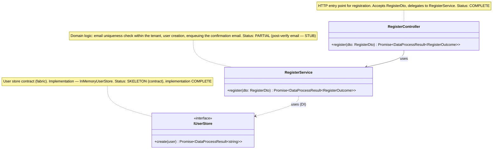
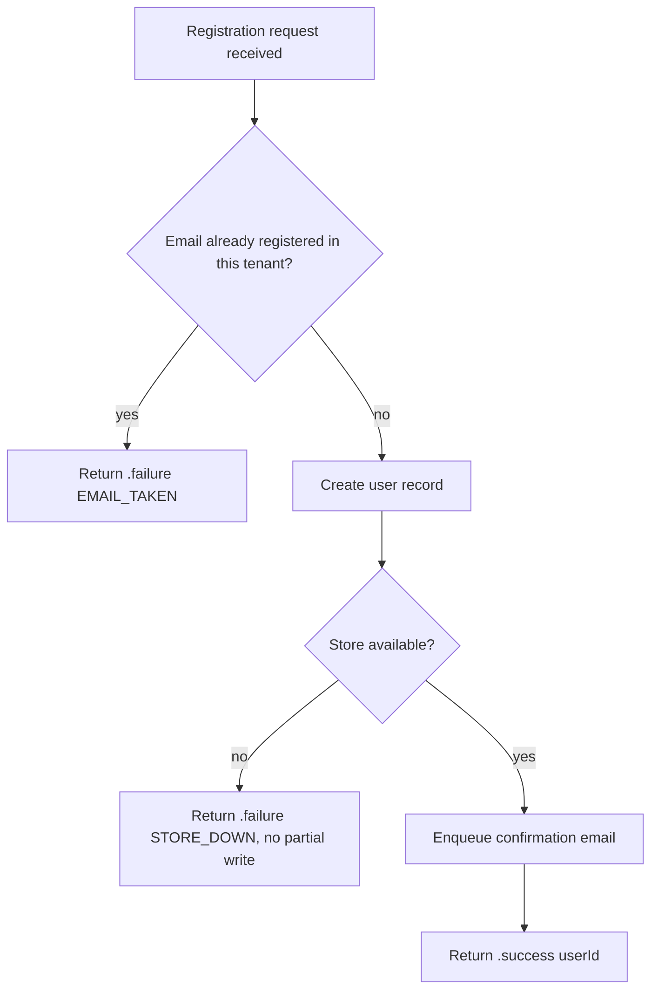

# implementation-doc-uml — Part A §0 (UML class diagram) and §1 (flowchart) with simulations

> Ported universal standard. The mvp planning library had simulation tables only
> inside UI flow-prep guides — NOT as a §0/§1 contract of the plan itself. This skill
> is the missing §0/§1 contract. TS adaptation for this mvp project: diagrams are drawn
> over NestJS `@Injectable` services / providers, React components/hooks, and FastAPI
> route handlers; `note for` annotations are written in the operator's working language; the domain return type
> is `DataProcessResult<T>` (`server/src/kernel/data-process-result.ts`), never
> core-`OperationResult<T>`.

## When to Invoke

- When authoring Part A of any plan that touches code (the user-readable section the
  product owner approves).
- BEFORE writing algorithms (§1 of `implementation-doc-algorithms`) — the diagram
  fixes the structure the algorithms operate over.

## §0 — Class diagram (Mermaid `classDiagram`, importable to draw.io)

A §0 is admissible only when ALL of the following are present:

```
□ A Mermaid classDiagram (draw.io imports Mermaid) — one class per real TS symbol
  (NestJS service/provider, React component/hook, FastAPI route module, DTO/interface).
□ A `note for ClassName` on EVERY class, written in plain language (the operator's working language), stating:
    what the class does  +  status: COMPLETE | PARTIAL | STUB | SKELETON | HARDCODED
  (HARDCODED = fixed values / deterministic wrapper awaiting logic;
   note: core's "Bootstrap" status is core_specific and is NOT used here — use HARDCODED.)
□ A legend table mapping each status symbol to its meaning.
□ ALL relationship arrows: `<|..` (implements), `-->` (uses/depends), `..>` (creates),
  `*--`/`o--` (composition/aggregation) — no class is left unconnected if it has a relation.
□ A per-connection simulation table (see below).
```

### Example §0 (registration flow, abbreviated)



Legend:

| Status | Meaning |
|--------|----------|
| COMPLETE | implemented and fully working |
| PARTIAL | some methods work, some are stubs (name which) |
| SKELETON | contract/fields preserved, method always returns a stub |
| STUB | not implemented |
| HARDCODED | fixed values / deterministic wrapper |

### §0 per-connection simulation table (one row per arrow)

| connection (from→to) | data_sent | example_input | expected_output | failure_case | responsible class/method |
|----------------------|-----------|---------------|-----------------|--------------|--------------------------|
| RegisterController→RegisterService | RegisterDto | {email:"a@b.co",pwd:"x"} | DataProcessResult.success(outcome) | empty email → .failure("EMAIL_REQUIRED") | RegisterService.register |
| RegisterService→IUserStore | user doc | {email,tenantId} | .success(userId) | duplicate → .failure("EMAIL_TAKEN") | InMemoryUserStore.create |

**FAIL if:** any class lacks `note for`; any relation arrow is missing; any arrow has
no simulation row; or any simulation row is a stub (`TBD`, `...`, `example`).

## §1 — Flowchart (Mermaid `flowchart TD`) with per-branch simulation

§1 expresses the decision logic as a flowchart whose nodes are HUMAN QUESTIONS
(not handler names), plus a per-branch simulation.



### §1 per-branch simulation table (one row per branch)

| branch condition | example_input | expected_output (DataProcessResult) |
|------------------|---------------|-------------------------------------|
| email already exists | existing email | .failure("EMAIL_TAKEN") |
| email new, store ok | fresh email | .success(userId) + email enqueued |
| store unavailable | any | .failure("STORE_DOWN"), no partial write |

**FAIL if:** any §1 branch has no simulation row; any node names a class/handler/API
path instead of a human question; or any row is a stub.

## Anti-patterns

- A §0 diagram with no `note for` on every class — invisible status is the V20 failure.
- Notes that are not plain prose in the operator's working language (bare identifiers, code fragments) — §0/§1 human text must stay human-readable.
- Arrows without simulation rows — a connection with no example is undocumented behavior.
- Flowchart nodes named after handlers (`ai-generate.handler`) instead of the human
  question they answer.

## Integration

- Feeds §1/§2 of `implementation-doc-algorithms` (the algorithm operates over this structure).
- Feeds `uml-simulation-to-testcase` (every arrow/branch row → a test-case row + test_layer).
- Checked by `plan-review` FC-13 (Part A present) and FC-14 (simulations present and concrete).
