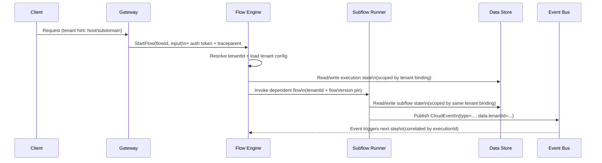
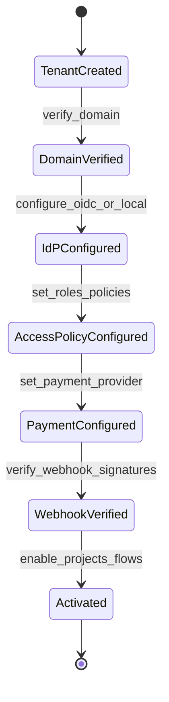
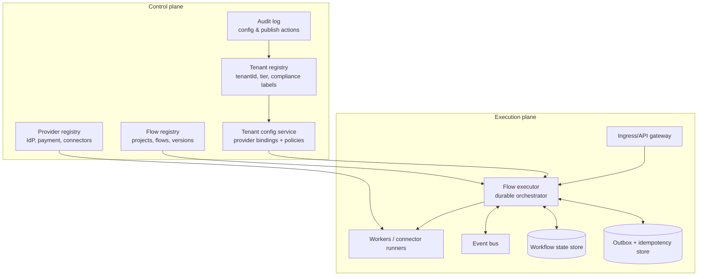
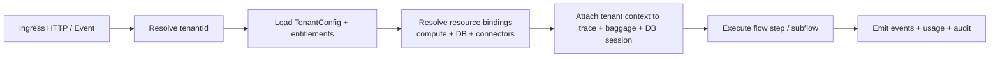
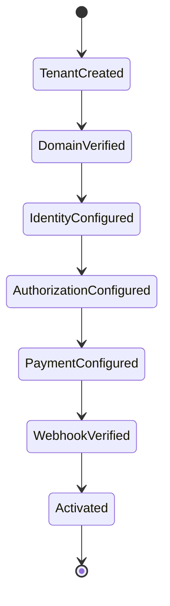
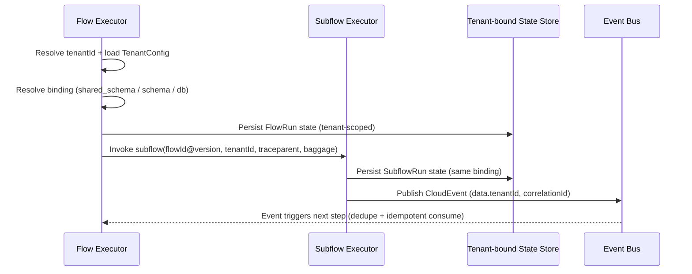

<!--
  Source: business flows.zip / 08-multi tenant deep-research-report 1.md + 08-multi tenant deep-research-report 2.md
  Canonical since: 2026-04-22
  Canonical flow: FLOW-15 saas-multi-tenancy
  Naming note: Merged from two deep-research reports in zip (no standalone base file). Part 1 and Part 2 concatenated with section headers.
  Related deep-research: docs/business-flows/_deep-research/saas-multi-tenancy/ (if present)
  Related legacy engine artifacts: docs/business-flows/_legacy-engine-artifacts/saas-multi-tenancy/ (if present)
-->

# Multi-Tenancy — Primary Spec


---

## Part 1: 08-multi tenant deep-research-report 1.md

# Designing a Multi-tenant Engine for Projects, Flows, and Dependent Flows with Tenant-Specific Identity and Payments

## Executive summary

A multitenant “engine” that supports multiple projects, flows, and dependent flows—and allows each tenant to choose distinct registration, authentication/authorization, access-control layers, and payment systems—should be designed as a **control-plane / data-plane** architecture with **policy-driven routing** and **pluggable provider adapters**. The control plane owns tenant identity, entitlements, provider configurations, per-tenant compliance/SLA posture, and versioned flow definitions; the data plane executes flow instances with strong tenancy context propagation and consistent guardrails. This separation is a recurring theme in cloud multitenancy guidance: multitenancy implies sharing, but **not every component must be shared**, and systems often combine shared and dedicated components. citeturn0search17

A key architectural choice is **isolation model**. The common spectrum—shared schema, separate schema, separate database, and hybrid—directly impacts engine correctness, operational cost, and tenant mobility. Pooled/shared models can be cost-effective but raise **noisy-neighbor** and per-tenant observability issues (for example, pooled databases are harder to monitor per tenant and increase noisy-neighbor risk). citeturn0search0 Meanwhile, silo models map cleanly to strict isolation but materially increase operational overhead. AWS guidance explicitly frames pool vs. silo (and hybrid “bridge” approaches) as a core isolation decision and emphasizes that pooled isolation requires deliberate, explicit controls rather than relaxed requirements. citeturn0search7turn0search26turn0search1

Because you also require **flows and dependent flows**, the engine must provide (a) durable workflow execution semantics, (b) tenant-aware routing to data and integrations, and (c) consistent propagation of **tenant context** across HTTP calls and events. Standards-based propagation (W3C trace context and OpenTelemetry context/baggage) improves cross-service traceability and is a pragmatic carrier for low-sensitivity routing metadata like a tenant key (with careful boundary controls). citeturn1search3turn2search7turn2search1 Event-driven flows benefit from a standard envelope such as CloudEvents to normalize metadata and simplify routing and validation across heterogeneous services. citeturn2search6turn2search0

Recommendation: default to a **hybrid (“bridge”) isolation strategy**—run most tenants in a pooled/shared or shared-db/separate-schema model, but design from day one for “tenant graduation” to dedicated resources (DB and sometimes compute) when SLA/compliance/noisy-neighbor risk requires it. This is aligned with widely used SaaS isolation guidance in which pooled infrastructure is efficient but must be complemented by selective isolation where needed. citeturn0search7turn0search18turn0search26

## Assumptions and requirements framing

This report makes explicit assumptions (because you asked to assume unspecified details) to ground architecture decisions. Adjusting these numbers may change tradeoffs, but the design principles remain stable.

Assumptions:

- The platform is SaaS-style multitenant with **10²–10⁵ tenants**; a minority are “enterprise” tenants requiring strict isolation, auditability, and contractual SLAs.
- Each tenant may enable multiple “projects” (product modules) and each project can define multiple flows; flows can call **dependent flows** (subflows) with explicit version pinning.
- The engine uses a cloud-native stack (e.g., containers + Kubernetes), supports synchronous HTTP and asynchronous messaging, and is polyglot (services in multiple languages).
- The primary transactional datastore is relational (for workflow state and core business entities), with optional document/search stores for content and indexing.
- Message delivery is at-least-once; therefore idempotency and deduplication are required for correctness in workflows and integrations. Using “Idempotency-Key” patterns for HTTP writes is a mainstream approach and is in active IETF standardization. citeturn3search3turn5search2turn5search6
- Tenants may use:
  - Workforce/customer identity via OIDC/OAuth 2.0, and/or enterprise provisioning via SCIM. citeturn0search5turn0search2turn7search3
  - Payments via one of several PSPs (example: Stripe) or via tenant-owned merchant accounts plus webhooks. citeturn7search1turn7search0
- Compliance scope varies by tenant: some tenants require GDPR-aligned controls (data minimization, privacy by design, security of processing) and some require PCI DSS scoping for cardholder data environments (CDE). citeturn4search0turn1search17turn1search9

Framing note: your internal flow materials include flows with multi-stage event chains, parallel branches, timers, and payment-critical sections. That mix strongly favors an engine design with durable orchestration, idempotency, and explicit time semantics. fileciteturn0file5 fileciteturn0file7

## Tenant variability dimensions and a rigorous configuration model

To support tenant-specific registration/auth/access/payment **without devolving into per-tenant forks**, treat “tenant variability” as a **typed capability vector** plus **policy + provider bindings** (configuration), and keep code paths shared wherever possible.

### Variability dimensions

The table below defines the core variability dimensions you listed and the architectural implication of each.

| Variability dimension | What can vary per tenant | Architectural implication | How to model it |
|---|---|---|---|
| Registration | Self-serve signup; invite-only; enterprise SSO-first; SCIM-driven provisioning | Drives onboarding flows, identity proofing, and user lifecycle | “Registration policy” + provider binding (IdP/provisioning) |
| Authentication | Local auth; external OIDC; multiple IdPs; step-up/MFA rules | Token validation, session model, risk posture | OIDC/OAuth provider config + auth policy (e.g., step-up triggers) citeturn0search5turn0search2 |
| Authorization | Tenant-defined roles; fine-grained permissions; ABAC rules; custom PDP | Must be enforced consistently (API + async) | Central policy model + distributed enforcement points; object-level checks citeturn1search2 |
| Access layer | API gateway rules; mesh-level policies; “external auth” services | Where enforcement happens; affects latency and blast radius | “Policy enforcement topology” (gateway-only vs mesh+gateway) citeturn5search0turn5search1 |
| Payment system | PSP choice; merchant-of-record vs tenant MoR; invoicing vs card | PCI scope, webhooks, reconciliation semantics | Payment provider binding + payment policy + per-tenant keys/secrets citeturn7search1turn7search0 |
| Data model | Custom fields; entity variants; tenant-specific schemas | Schema evolution + query planning complexity | Base schema + extensible fields (e.g., JSONB) and/or per-tenant schema versioning citeturn8search0turn8search4 |
| Workflows / flows | Which flows are enabled; tenant-specific steps; SLAs per flow | Flow compilation, validation, versioning, and upgrades | Flow definitions with “variants” and tenant-scoped overrides |
| Integrations | CRM/ERP/webhooks; data export; event subscriptions; custom connectors | Secrets mgmt + per-tenant rate limits | Connector registry + per-tenant connector instances |
| SLAs | Per-tenant throughput/latency; priority scheduling; support tier | Isolation graduation and resource quotas | SLA tier maps to compute/db isolation + rate limits + SLOs citeturn0search0turn0search7 |
| Compliance | GDPR-only vs GDPR+PCI; data residency; audit log requirements | Encryption, key mgmt, retention, DPA/subprocessor controls | Compliance “label set” that constrains architecture choices citeturn4search0turn4search1turn4search2 |

### Requirements for a tenant configuration system

A tenant configuration system must be:

- **Typed and validated**: configuration is not “free-form JSON”; it’s a versioned schema with validation gates.
- **Versioned and promotable**: changes must be staged/canary’d per tenant.
- **Auditable**: who changed tenant policies/providers, when, and why.
- **Safe defaults**: enable minimal privileges; explicit opt-in for risky capabilities.

A practical approach is to use OpenAPI/JSON Schema to define the configuration API and validate payload shapes. The OpenAPI specification explicitly targets language-agnostic interface descriptions and is widely used for contract-first governance. citeturn8search3turn8search15

### Example tenant configuration schema

Below is a compact example (illustrative) JSON Schema for a tenant’s “provider bindings” and compliance posture.

```json
{
  "$schema": "https://json-schema.org/draft/2020-12/schema",
  "$id": "TenantConfig",
  "type": "object",
  "required": ["tenantId", "tier", "isolation", "identity", "authorization", "payments", "compliance"],
  "properties": {
    "tenantId": { "type": "string", "pattern": "^[a-z0-9_-]{3,64}$" },
    "tier": { "type": "string", "enum": ["free", "pro", "enterprise"] },
    "isolation": {
      "type": "object",
      "required": ["dataMode"],
      "properties": {
        "dataMode": { "type": "string", "enum": ["shared_schema", "separate_schema", "separate_db", "hybrid"] },
        "region": { "type": "string" },
        "shardKey": { "type": "string" }
      }
    },
    "identity": {
      "type": "object",
      "required": ["mode"],
      "properties": {
        "mode": { "type": "string", "enum": ["local", "oidc_federation"] },
        "oidc": {
          "type": "object",
          "properties": {
            "issuer": { "type": "string", "format": "uri" },
            "clientId": { "type": "string" },
            "scimProvisioning": { "type": "boolean", "default": false }
          }
        }
      }
    },
    "authorization": {
      "type": "object",
      "required": ["policyModel"],
      "properties": {
        "policyModel": { "type": "string", "enum": ["rbac", "rbac_abac_hybrid"] },
        "defaultRole": { "type": "string" }
      }
    },
    "payments": {
      "type": "object",
      "required": ["mode"],
      "properties": {
        "mode": { "type": "string", "enum": ["none", "psp_adapter", "tenant_mor_invoicing"] },
        "provider": { "type": "string", "enum": ["stripe", "adyen", "braintree", "manual_invoice"] },
        "webhookSecretRef": { "type": "string" }
      }
    },
    "compliance": {
      "type": "object",
      "required": ["labels"],
      "properties": {
        "labels": {
          "type": "array",
          "items": { "type": "string", "enum": ["gdpr", "pci", "data_residency_eu", "customer_managed_keys"] }
        }
      }
    }
  }
}
```

This schema is intentionally restrictive: it forces explicit choices and supports gating logic (e.g., “pci” label cannot be used with “shared_schema” without additional controls).

## Multitenancy isolation models and data architecture for flows and dependent workflows

Isolation is not a single decision; it’s a **portfolio of isolation decisions** across data, compute, networking, and operations. However, database isolation is often the most determinative for multitenant engines, especially when workflow state, payment state, and authorization state must be correct.

### Isolation models

The canonical data isolation models are consistently described in SaaS architecture guidance (shared constructs vs dedicated constructs) and are often combined into pool/silo/hybrid strategies. citeturn0search7turn0search0turn0search4

| Model | Description | Strengths | Weaknesses | Flow-engine-specific implications |
|---|---|---|---|---|
| Shared schema | One DB, shared tables; tenant_id per row | Lowest cost; simplest migrations; easiest cross-tenant analytics | Noisy neighbor risk; strict scoping required; hardest “hard delete” | Every workflow state + outbox + audit row must be tenant-scoped; mistakes are catastrophic; recommend DB-enforced isolation (RLS) citeturn0search0turn3search4 |
| Separate schema | One DB, per-tenant schema | Better logical separation; per-tenant migration windows possible | More complex migrations; schema count scaling; connection/routing complexity | Workflow runtime must resolve schema per tenant; cross-tenant queries become harder; dependent flows must share schema context citeturn0search14turn0search4 |
| Separate database | Per-tenant DB | Strong isolation; simplified compliance segregation | Operational overhead (backups, upgrades, monitoring); cost | Workflow runtime needs tenancy-aware DB dispatch; dependent flows must preserve tenant DB binding; cross-tenant analytics needs ETL citeturn0search7turn0search1 |
| Hybrid (bridge) | Default pooled + selected dedicated | Balances cost + enterprise isolation; supports tenant “graduation” | Engineering complexity; migration tooling required | Requires explicit “resource binding” layer in engine; dependent flows must be portable across bindings citeturn0search26turn0search18 |

### Data partitioning and tenancy-aware routing

A flow engine typically touches at least three data planes:

1. **Workflow state** (executions, step state, timers).
2. **Business data** (tenant domain entities).
3. **Operational data** (outbox, idempotency keys, audit logs, billing events).

In shared-schema models, you should assume humans will forget filters. Therefore, use database-enforced controls where possible (e.g., PostgreSQL Row Level Security policies bound to tenant_id). PostgreSQL’s `CREATE POLICY` and row security policy docs provide the primitives for enforcing per-row access constraints once RLS is enabled. citeturn3search0turn3search4

In practice, tenancy-aware routing should be an early step in *every* request/event ingestion path:

```mermaid
flowchart LR
  A[Ingress HTTP / Event Consumer] --> B[Resolve tenant context]
  B --> C[Load tenant config + entitlements]
  C --> D{Isolation binding?}
  D -->|shared schema| E[Set tenant context\n(e.g., db session var)]
  D -->|separate schema| F[Select schema\nand connect pool]
  D -->|separate DB| G[Select DB shard/instance\nand connect pool]
  E --> H[Execute flow step\n(read/write)]
  F --> H
  G --> H
  H --> I[Emit events + audit + usage]
```

This routing stage is also the correct place to attach trace and tenant correlation metadata for observability, while keeping strict boundaries on what “business identity” data is propagated.

### Tenant context propagation across dependent flows and async edges

You need tenant context to propagate through:

- HTTP calls (north-south and east-west),
- asynchronous messages/events,
- timers/scheduled tasks,
- dependent flow invocations.

For distributed tracing, the W3C Trace Context specification defines `traceparent` and `tracestate` headers as a portable propagation format. citeturn1search3turn1search11 For business-routing metadata such as tenant keys, OpenTelemetry “baggage” is a standard mechanism to propagate user-defined key/value pairs (with explicit warning that propagation boundaries must be controlled). citeturn2search1turn2search7

For events, CloudEvents provides a standard envelope with required fields such as `specversion`, `id`, `source`, and `type`, which helps normalize routing and validation across services. citeturn2search0turn2search6

A robust pattern is:

- **Tenant identity**: always in the message/event payload envelope (e.g., `tenantId` as a required field in `data`, or as part of `subject` if you standardize it).
- **Trace identity**: in W3C headers for HTTP and carried as metadata in message systems (or added to CloudEvents extensions).
- **Authorization context**: never blindly forwarded; instead forward a bounded token (JWT/opaque) and re-evaluate at each boundary.

Illustrative dependent-flow call chain:



This design matches the reality of your internal flows: they include multi-stage event chains, parallel computations, join points, and explicit time/scheduling semantics—all of which become significantly harder to operate if tenant context is not first-class. fileciteturn0file6 fileciteturn0file7

### Transactions and consistency for multi-step flows

A tenant-aware flow engine has to make peace with distributed consistency:

- Strong consistency within a step (local DB transaction).
- Eventual consistency across steps and services.

Two patterns are foundational:

- **Saga**: coordinates a multi-step business transaction using a sequence of local transactions and compensating actions. citeturn3search13
- **Transactional outbox**: writes the outgoing message/event to an outbox table in the same DB transaction as the business update, then a relay publishes to the broker, removing the dual-write hazard. citeturn3search1turn3search2turn3search9

These patterns are especially important for dependent flows:

- A parent flow should treat a dependent flow as a **saga sub-transaction**: the subflow returns a durable result, and compensations are defined at the boundary.
- If dependent flows span different data stores (e.g., hybrid isolation), you must define “commit points” and permitted compensations per tenant compliance tier.

Idempotency completes the picture. For HTTP, RFC 9110 defines idempotent semantics for certain methods, and the IETF is standardizing an `Idempotency-Key` header to make POST/PATCH operations fault-tolerant under retries. citeturn5search2turn3search3turn7search20

## Pluggable registration, authentication, authorization, and payment provider architecture

Your requirement (“each tenant can have distinct registration, authorization, access layers, and payment systems”) is best met by a **provider plugin system** plus **policy enforcement topology**.

### Provider abstraction patterns

Use three layers:

1. **Provider Adapters** (edge integrations): normalize provider-specific APIs into internal interfaces (adapter pattern).
2. **Provider Strategy Selector**: at runtime, select provider implementation based on tenant configuration (strategy pattern).
3. **Enforcement Topology**: decide where authentication/authorization is enforced (API gateway, service mesh, both).

Authentication/authorization standards strongly suggest building around OAuth 2.0 and OpenID Connect for login/auth, with modern security guidance consolidated in RFC 9700 (OAuth 2.0 security best current practice). citeturn0search2turn0search5turn7search2 For enterprise provisioning, SCIM is a standardized HTTP protocol for identity lifecycle management across domains (enterprise-to-cloud scenarios). citeturn7search3

### Service mesh and API gateway enforcement patterns

You asked specifically for service mesh and API gateway approaches. Two widely deployed primitives illustrate the difference:

- Mesh-level authorization policies (e.g., Istio AuthorizationPolicy) enable allow/deny/custom actions and apply at workloads in the mesh. citeturn5search0turn5search12
- Proxy-level external authorization (Envoy `ext_authz`) delegates authz decisions to an external service, but also introduces potential bypass hazards if misconfigured (Envoy docs explicitly warn about routing cache interaction and bypass risks). citeturn5search1turn5search9

Practical recommendation:

- Enforce **authentication** at the edge (gateway/ingress) for most traffic.
- Enforce **authorization** at multiple layers:
  - coarse-grained tenant + role checks at gateway,
  - fine-grained object/action checks inside services or via mesh external auth, especially for high-risk flows.

This layered approach aligns with API security risk guidance that emphasizes object-level authorization checks for endpoints handling object identifiers. citeturn1search2

### Onboarding, configuration, and per-tenant customization

A multitenant engine should treat onboarding as a state machine that produces a correct tenant configuration and validated provider bindings.

Illustrative onboarding flow:



Key points, tied to standards:

- OIDC configuration should be validated against OIDC discovery and issuer rules; OIDC is widely used as authentication over OAuth 2.0. citeturn0search5turn0search2
- If SCIM provisioning is enabled, validate protocol conformance and per-tenant attribute mappings; SCIM is standardized in RFC 7644. citeturn7search3
- For payments, webhook security must be standardized and verified: Stripe’s webhook documentation explicitly describes verifying signatures using the event payload, the `Stripe-Signature` header, and an endpoint secret. citeturn7search1turn7search5
- For payment operations and other non-idempotent writes, use idempotency keys; Stripe documents server-side idempotency storage and replay behavior, and the IETF draft provides a general standardization path. citeturn7search0turn3search3

### Payment abstraction and minimizing PCI blast radius per tenant

A payment abstraction should separate:

- **Payment intent lifecycle** (authorize/capture/refund),
- **webhook ingestion** (signature verification, dedupe, replay),
- **ledger and invoices** (tenant-specific accounting),
- **PCI boundaries**.

Where possible, minimize cardholder data exposure using tokenization; PCI SSC tokenization guidance explicitly notes that scope reduction must be evaluated per implementation and depends on data flows, segmentation, and detokenization controls. citeturn8search2

Your internal flow corpus includes payment-sensitive flows with strict concurrency/ACID requirements and time-based semantics. That combination strongly supports keeping payment-handling in a dedicated subsystem with hardened idempotency and replay protections, and treating payment events as first-class flow triggers. fileciteturn0file7

## Security, encryption, key management, and compliance implications per tenant

Tenant-specific identity and payments imply tenant-specific risk and compliance posture. The engine must implement **baseline controls for all tenants**, and then allow higher-compliance tenants to opt into stronger isolation, audit, and cryptographic controls.

### Security fundamentals that are multitenancy-amplified

- **Broken Object Level Authorization (BOLA)** is consistently a top API risk: object IDs in APIs create a broad attack surface, and every function that accesses data by a user-supplied ID must enforce object-level authorization. citeturn1search2  
  In multitenancy, failures are worse: a single BOLA defect can become cross-tenant data exposure.

- Secure authentication and authorization should follow modern OAuth best current practices (RFC 9700), which updates and extends the OAuth 2.0 security threat model based on real-world experience. citeturn7search2

### Encryption and key management architecture

Cryptography choices should be standards-based:

- AES is standardized by NIST in FIPS 197 and is a FIPS-approved symmetric block cipher for protecting electronic data. citeturn2search5
- NIST SP 800-57 provides key management guidance and best practices for cryptographic keying material. citeturn2search2

Implications for multitenancy:

- **Per-tenant keys** (or per-tenant key-encryption-keys) support containment: a key compromise affects fewer tenants.
- Key lifecycle (rotation, revocation, archival) must be supported; SP 800-57 is the primary reference for lifecycle discipline. citeturn2search2
- If tenants require validated cryptographic modules (often in regulated environments), NIST’s CMVP program and FIPS 140-3 validation are the relevant reference points. citeturn8search1turn8search5

### GDPR implications per tenant

GDPR obligations that directly shape architecture include:

- **Principles** such as data minimization, storage limitation, and integrity/confidentiality (Article 5). citeturn4search0turn4search4
- **Data protection by design and by default** (Article 25), which pushes you to make privacy-preserving defaults part of the system design rather than a tenant-specific add-on. citeturn1search36
- **Security of processing** (Article 32), which explicitly refers to implementing measures appropriate to risk, including (as appropriate) pseudonymization and encryption. citeturn4search1turn4search15
- Controller/processor relationships and subprocessor controls (Article 28) which become operationally relevant when tenants configure integrations and you rely on subprocessors (cloud vendors and third-party services). citeturn4search8turn4search12

Per-tenant architectural consequence: a tenant’s compliance label set should constrain allowed configurations (e.g., “data_residency_eu” cannot bind to a non-EU region; “customer_managed_keys” requires KMS/HSM integration; “gdpr” requires retention and deletion orchestration at the tenant boundary).

### PCI DSS implications per tenant

PCI DSS is maintained by the PCI Security Standards Council and provides baseline technical and operational requirements designed to protect payment account data. citeturn1search17turn1search9

For architecture, two high-impact implications are:

- **CDE segmentation**: keep payment data handling in isolated components and networks where feasible; ensure strict access controls and audit.
- **Strong cryptography in transit**: PCI DSS v4.0.1 includes explicit requirements for protecting cardholder data with strong cryptography during transmission over open/public networks (Requirement 4). citeturn5search15

Tokenization can reduce PCI scope, but PCI SSC tokenization guidance emphasizes that scope reduction depends on where cardholder data flows and how detokenization and mapping are controlled. citeturn8search2

## Operations, observability, billing, upgrades, and testing in a tenant-aware runtime

Operational design must be tenant-aware, because multitenancy changes “what good looks like” for monitoring, rate limiting, and rollout safety.

### Monitoring and per-tenant metrics

You need:

- platform SLOs (global),
- tenant SLOs (per tenant, per SKU),
- flow SLOs (per flow, per step).

Prometheus’ data model supports dimensional metrics via labels (metric name + label set). entity["organization","Prometheus","metrics project"] citeturn6search2  
However, Prometheus documentation also cautions that high-cardinality labels can explode time series count. citeturn6search5

Practical approach:

- Use `tenant_tier`, `tenant_isolation_mode`, and `flow_id` as primary labels (bounded cardinality).
- For **large tenant counts**, store per-tenant metrics in:
  - logs/traces (queryable by tenant id),
  - or a dedicated “tenant analytics store” fed by usage events, rather than Prometheus labels.

For distributed tracing across services and dependent flows, W3C `traceparent`/`tracestate` provides the portable trace context. entity["organization","W3C","web standards body"] citeturn1search3  
OpenTelemetry’s context propagation and baggage features support cross-service correlation (with careful control of propagation boundaries). entity["organization","OpenTelemetry","observability standard"] citeturn2search7turn2search1

### Billing, metering, and tenant-level rate limiting

A tenant-aware engine should emit **usage events** (flow starts, step execution time, egress bytes, connector calls) and aggregate them into a billing pipeline. AWS multi-tenant isolation materials explicitly highlight metering/analytics aggregation as one reason teams choose shared/pool models, albeit with isolation and compliance challenges. citeturn0search18turn0search1

Rate limiting should be standardized across gateway and internal service APIs:

- Use HTTP 429 for rate limiting; RFC 6585 defines 429 and allows `Retry-After` headers to indicate wait time. citeturn6search6
- Rate limiting must be **tenant-scoped** (tenant key + API/flow key), and for high-tier tenants should integrate with SLA decisions (burstable quotas, priority scheduling).

### Backups, restore, and disaster recovery

Isolation choices change your backup strategy:

- Shared schema: backups are global; tenant restore becomes complex (needs point-in-time + tenant-level rehydration).
- Separate schema: restore per schema may be feasible but still often DB-wide.
- Separate DB: cleanest per-tenant restore, but highest ops overhead.
- Hybrid: must support both pathways.

For workflow engines, backups must include workflow state, idempotency records, outbox tables, and tenant config snapshots (control plane).

### Upgrades, canary releases, and tenant-scoped testing

Tenant-aware deployment must allow:

- canary by tenant cohort,
- rollback by tenant cohort,
- “tenant-scoped” integration tests.

For canary releases, Argo Rollouts explicitly supports a canary deployment strategy (progressively shifting traffic to a new version). entity["organization","Argo Rollouts","kubernetes controller"] citeturn6search1turn6search4  
For baseline rolling updates, Kubernetes documentation describes rolling updates as incrementally replacing pods to achieve updates without downtime. entity["organization","Kubernetes","container orchestrator"] citeturn6search10

Testing strategy (tenant-aware):

- **Contract tests** for provider adapters (IdP, payments, connectors).
- **Tenant-scoped integration tests** that run representative flows with that tenant’s configuration.
- **Canary tenants**: choose a safe cohort, then expand.
- **Migration tests**: simulate pool→silo moves and verify dependent flows retain correctness and context propagation.

Your internal flow research emphasizes complex, multi-service flows with explicit degraded-mode behaviors, latency expectations, and privacy constraints; tenant-scoped tests are the only scalable way to keep those flows correct across tenant variability. fileciteturn0file6 fileciteturn0file3

## Recommended architecture options, migration patterns, and concrete artifacts

This section provides (a) architecture options, (b) a decision matrix, (c) concrete diagrams, and (d) example APIs/schemas and a sample tenant configuration table.

### Architecture options

#### Option A: Fully pooled engine with strict logical isolation (shared schema)

- Data: shared schema with tenant_id; DB-enforced scoping (e.g., RLS).
- Runtime: one shared workflow runtime cluster; per-tenant quotas.
- Best for: high tenant count, cost sensitivity, fast iteration.
- Risk: biggest cross-tenant blast radius if scoping fails; noisy neighbor risk. citeturn0search0turn3search4

#### Option B: Pooled compute with separate schema per tenant

- Data: shared DB; schema per tenant.
- Runtime: shared compute, but tenancy-aware schema routing.
- Best for: moderate tenant count; stronger separation without full DB-per-tenant.
- Risk: migration complexity and schema sprawl.

#### Option C: Silo per tenant (separate DB, sometimes separate compute)

- Data: per-tenant DB (and optionally per-tenant VPC/account).
- Runtime: can be shared, but data isolation drives most compliance needs.
- Best for: regulated/enterprise tenants, strong isolation guarantees.
- Risk: heavy operational footprint and upgrade complexity. citeturn0search7turn0search1

#### Option D: Hybrid “bridge” model (recommended)

- Default: pooled/shared schema or separate schema for most tenants.
- “Graduation”: select tenants moved to separate DB (and optionally separate compute) based on SLA/compliance/noisy neighbor.
- Requires: a first-class “tenant resource binding” abstraction in the engine.

This architecture aligns with the fact that multitenancy does not require all components to be shared, and it matches industry guidance emphasizing selective isolation where needed. citeturn0search17turn0search26turn0search18

High-level reference architecture:

```mermaid
flowchart TB
  subgraph ControlPlane["Control plane"]
    TR[Tenant Registry]
    TC[Tenant Config & Policy]
    FR[Flow Registry\n(projects, flows, versions)]
    PR[Provider Registry\n(IdP, payments, integrations)]
    AR[Audit & Change Log]
  end

  subgraph DataPlane["Data plane"]
    GW[Gateway / Ingress]
    FE[Flow Execution Runtime]
    WK[Workers / Connectors]
    EB[Event Bus]
    ST[(Workflow State Store)]
    OB[(Outbox + Idempotency Store)]
  end

  subgraph Isolation["Tenant Resource Bindings"]
    S1[(Shared DB/Schema)]
    S2[(Per-tenant Schema)]
    S3[(Per-tenant DB)]
  end

  GW --> FE
  FE --> WK
  FE <--> EB
  FE <--> ST
  FE <--> OB

  TR --> TC
  TC --> FE
  FR --> FE
  PR --> WK
  AR --> TR

  FE --> S1
  FE --> S2
  FE --> S3
```

### Decision matrix

The decision matrix below compares the isolation options against the attributes you requested. Scores are qualitative (Low/Medium/High) and assume the “assumptions” section above.

| Option | Isolation strength | Cost efficiency | Operational complexity | Scalability | Compliance fit | Developer velocity |
|---|---|---|---|---|---|---|
| Shared schema | Medium (relies on perfect scoping) | High | Low–Medium | High | Medium (harder for strict tenants) | High |
| Separate schema | Medium–High | Medium–High | Medium | Medium–High | Medium–High | Medium |
| Separate DB | High | Low–Medium | High | Medium | High | Low–Medium |
| Hybrid bridge | High (where needed) | High (for most tenants) | Medium–High | High | High | Medium–High |

This evaluation directly reflects pooled vs silo tradeoffs highlighted in cloud multitenancy guidance and the noisy-neighbor risks of pooled databases. citeturn0search0turn0search7turn0search26

### Migration and onboarding patterns

Tenant onboarding patterns:

- **Self-serve tenant creation**: create tenant + default pooled binding + default identity provider; progressively enable projects/flows.
- **Enterprise onboarding**: require domain verification, OIDC federation, SCIM provisioning setup, and staged rollout with tenant-scoped testing.

Tenant migration (“graduation”) patterns:

- **Pool → dedicated DB** (bridge):
  1. Freeze writes for a tenant (or use dual-write with reconciliation).
  2. Export tenant-scoped data (requires deterministic tenant scoping).
  3. Import to dedicated DB; switch tenant binding pointer.
  4. Replay outbox/events for that tenant to rebuild derived stores.
  5. Validate via tenant-scoped tests; then unfreeze.

This pattern is only feasible if tenant resource binding is first-class in the engine and tenant routing is deterministic (which is why hybrid should be designed in from the beginning). citeturn0search26turn0search18

### Example APIs for multitenant flow control

Use contract-first definitions (OpenAPI) for:

- tenant lifecycle,
- provider bindings,
- flow enablement,
- execution runtime.

OpenAPI exists precisely to describe HTTP APIs in a language-agnostic way and enable automation for discovery/testing/tooling. citeturn8search3turn8search15

Illustrative endpoints:

```http
POST /tenants
{
  "displayName": "Acme Corp",
  "tier": "enterprise",
  "isolation": { "dataMode": "hybrid", "region": "eu-west-1" }
}
```

```http
PUT /tenants/{tenantId}/identity/oidc
{
  "issuer": "https://idp.example.com",
  "clientId": "engine-acme",
  "scimProvisioning": true
}
```

```http
PUT /tenants/{tenantId}/payments/provider
{
  "provider": "stripe",
  "webhookSecretRef": "secrets/tenants/acme/stripe_webhook"
}
```

```http
POST /flows/{projectId}/{flowId}/executions
{
  "tenantId": "acme",
  "input": { "...": "..." },
  "idempotencyKey": "f47ac10b-58cc-4372-a567-0e02b2c3d479"
}
```

Idempotency should follow HTTP semantics and the evolving standard `Idempotency-Key` header concept; it is especially important for payment and onboarding flows. citeturn5search2turn3search3turn7search0

### Sample tenant configuration table

| Tenant | Tier | Isolation mode | Identity mode | AuthZ model | Payment provider | SLA profile | Compliance labels |
|---|---|---|---|---|---|---|---|
| acme | enterprise | hybrid → separate_db | oidc_federation + scim | rbac_abac_hybrid | stripe | p95<200ms, dedicated DB | gdpr, pci, data_residency_eu |
| beta-co | pro | separate_schema | oidc_federation | rbac | manual_invoice | standard pooled compute | gdpr |
| demo123 | free | shared_schema | local | rbac | none | best-effort | none |

### Why this design matches complex real flows

Your internal flow documents emphasize workflows that are:

- event-driven with multiple services and parallel branches, fileciteturn0file5
- sensitive to privacy/authorization and degraded-mode operation, fileciteturn0file6
- time- and payment-sensitive with ACID-critical sections and idempotency needs, fileciteturn0file7
- and require a “flow creation” platform (registry, runtime, versioning, templates) for content/commerce modules. fileciteturn0file8 fileciteturn0file9

Those characteristics are structurally incompatible with “ad hoc per-tenant code paths.” They demand: durable orchestration, standardized event envelopes, tenancy-aware routing, strict authorization enforcement, and a control plane for tenant/provider/flow governance.

The proposed hybrid multitenant design provides that rigor while preserving developer velocity for the majority of tenants and allowing strict isolation where required by SLAs and compliance. citeturn0search17turn0search0turn0search26

---

## Part 2: 08-multi tenant deep-research-report 2.md

# Designing a Multitenant Flow Engine with Tenant-Specific Identity, Access Controls, and Payments

## Executive summary

A multitenant flow engine that supports multiple projects, flows, and dependent flows—while allowing each tenant to choose distinct registration, authentication/authorization, access enforcement topology, and payment systems—should be designed as a **control plane + execution plane** architecture with **policy-driven routing** and **pluggable provider adapters**. This matches modern SaaS guidance that multitenancy is about *selective sharing* (not “everything shared”), enabling different components to be pooled or dedicated based on tenant requirements. citeturn1view0turn0search14

A practical “north star” is a **hybrid (“bridge”) isolation strategy**: default most tenants to pooled/shared resources (for efficiency), but architect the engine so specific tenants can “graduate” to stronger isolation (separate schema or separate database) when required by SLA/compliance/noisy-neighbor risk. AWS explicitly frames pool vs silo vs bridge as the core isolation spectrum and describes the bridge model as applying pool or silo where appropriate across layers. citeturn0search3turn0search9 Microsoft’s Azure guidance similarly stresses that multitenancy doesn’t imply every component is shared, which is the conceptual basis for hybrid designs. citeturn1view0turn0search14

Because your engine must support *dependent flows* and long-running orchestrations, the system needs strong, standards-aligned primitives: **distributed tracing propagation** (W3C trace-context), **tenant routing metadata propagation** (OpenTelemetry baggage with strict boundaries), and **event envelope standardization** (CloudEvents). citeturn1view7turn1view8turn1view9 Reliability must be grounded in **saga** coordination for cross-service consistency and “exactly-once intent” under retries via **transactional outbox** and **idempotency keys**. citeturn1view1turn2view0turn1view13turn1view12

## Assumptions and key abstractions

### Assumptions

These assumptions scope the tradeoffs and can be re-parameterized without changing the core architecture:

- Tenants: **10²–10⁵**, with a long tail of small tenants and a smaller set of “enterprise” tenants requiring stronger isolation and audit. citeturn0search3turn0search10  
- Workload: mixed synchronous and async execution; dependent flows (subflows) invoked by parent flows with version pinning and stable contracts.  
- Datastores: a transactional store for flow state (relational default) plus optional analytic/event stores.  
- Messaging: at-least-once delivery is assumed for events; therefore deduplication and idempotency are required. citeturn1view13turn1view12  
- Identity: tenant identity providers range from local auth to OIDC federation; enterprise provisioning may be SCIM-driven. citeturn1view3turn1view5turn1view6  
- Payments: a tenant may use a PSP adapter, tenant-owned merchant-of-record configuration, or invoice-only mode; PCI scope can vary per tenant. citeturn0search1turn2view3  

### Key abstractions

Define the “engine” in terms of stable internal contracts:

- **Tenant**: a security and billing boundary; also a configuration boundary for identity, policies, integrations, and isolation binding. citeturn1view0turn0search14  
- **Project**: a packaging boundary for flows and related schemas, similar to a product module domain (e.g., “marketplace”, “social”, “finance”), enabling per-project enablement and versioning.  
- **FlowDefinition**: versioned workflow graph/state machine.  
- **FlowRun**: an execution instance of a specific FlowDefinition version.  
- **Dependent flow (subflow)**: a FlowDefinition invoked by another flow with explicit version selection and contract compatibility guarantees.

Your internal flow-engine materials already frame flow orchestration as JSON-defined graphs (tasks, conditions, transitions) executed by an orchestrator with state tracking, checkpointing, and “hard stop” validation/approval gates. fileciteturn0file1L178-L186 fileciteturn0file1L231-L236 This strongly supports a separation between a **flow control plane** (authoring/versioning/governance) and a **flow execution plane** (durable orchestration, dispatch, retries, audit), which is also consistent with SaaS platform guidance emphasizing selective sharing and layered governance. fileciteturn0file0L92-L105 citeturn1view0turn0search14

### Reference architecture sketch



This is the minimum structure needed to (a) keep tenant configuration governance separate from runtime execution and (b) support per-tenant variability without per-tenant forks. fileciteturn0file0L92-L105 citeturn1view0turn0search14

## Tenant variability dimensions and a rigorous configuration model

A multitenant engine fails when tenant variability is handled ad hoc. Instead, treat variability as a **typed configuration schema** plus **policy constraints** that gate allowed combinations (e.g., “PCI tenants cannot use shared-schema without additional controls”).

### Tenant variability dimensions

The table below enumerates the variability dimensions you requested and the architectural implication of each.

| Dimension | What varies per tenant | Engine impact if not first-class | Recommended modeling approach |
|---|---|---|---|
| Registration | self-serve, invite-only, enterprise-only, SCIM-provisioned | inconsistent identity lifecycle; drift between user store & policies | registration policy + provisioning binding (SCIM optional) citeturn1view6 |
| Authentication | local auth; tenant OIDC; multiple IdPs; step-up rules | brittle auth; inconsistent token claims | OIDC provider binding + auth policy; follow OAuth/OIDC standards citeturn1view3turn1view5 |
| Authorization model | RBAC, ABAC, hybrid; custom roles; per-project roles | cross-tenant exposure; inconsistent enforcement | centralized policy model, distributed enforcement points; test for object-level auth failures citeturn0search2turn0search8 |
| Access enforcement topology | gateway-only vs gateway + mesh; external authz | bypass risks; uneven enforcement across sync/async | explicitly choose topology; standardize enforcement at boundaries (gateway + service mesh when needed) citeturn2view4turn2view5 |
| Payment mode | PSP adapter; tenant MoR; invoicing-only; refund/dispute rules | PCI scope explosion; inconsistent reconciliation | payment policy + provider adapter binding; webhook verification + idempotency for writes citeturn2view12turn2view13turn0search1 |
| Data model/custom fields | tenant-specific fields; schema versions; residency constraints | schema drift; migration failures | base schema + extensibility (EAV/JSON fields) + schema/version registry; restrict unsafe model drift citeturn1view11 |
| Workflow variants and dependent flows | tenant-specific steps; enabled flows; subflow version pinning | runtime forks; upgrade instability | flow variants as configuration overlays; explicit dependency graph and version compatibility rules |
| Integrations/connectors | external systems, webhooks, ERP/CRM, custom connectors | secret leakage; rate-limit blowups | connector registry + per-tenant connector instances + secret references; validate config at onboarding citeturn1view10turn2view12 |
| SLAs | throughput/latency targets; support tier; DR expectations | noisy neighbor; unpredictable degradation | SLA tier → quotas, priority scheduling, isolation graduation; per-tenant SLO tracking citeturn0search10turn0search3 |
| Compliance labels | GDPR-like privacy posture; PCI scope; CMK; residency | accidental non-compliance | compliance “label set” that constrains allowed configurations and enforces controls citeturn2view3turn0search1turn6search2 |

### Configuration principles

A working tenant config system must be:

- **Typed and validated**: configuration is not arbitrary JSON; it is a versioned schema (JSON Schema aligns naturally with OpenAPI 3.1). citeturn1view10turn1view11  
- **Versioned and promotable**: changes can be staged and rolled out gradually per tenant.  
- **Auditable**: who changed provider bindings/policies and when, with immutable audit trails.  
- **Policy-constrained**: compliance labels constrain what combinations are allowed (e.g., “pci” implies additional controls, tokenization strategy, and tighter isolation). citeturn2view3turn0search1  

### Sample tenant configuration table

| tenantId | tier | isolationMode | identity | authzModel | accessTopology | payments | complianceLabels |
|---|---|---|---|---|---|---|---|
| acme | enterprise | hybrid → separate_db | oidc + scim | rbac_abac_hybrid | gateway+mesh | psp_adapter(stripe) | [gdpr, pci, cmk] |
| beta-co | pro | separate_schema | oidc | rbac | gateway_only | invoice_only | [gdpr] |
| demo123 | free | shared_schema | local | rbac | gateway_only | none | [] |

### Compact JSON Schema for tenant config

The schema below is intentionally compact (illustrative) but shows the critical points: isolation binding, provider bindings, and compliance labels.

```json
{
  "$schema": "https://json-schema.org/draft/2020-12/schema",
  "$id": "https://example.com/schemas/TenantConfig.json",
  "type": "object",
  "required": ["tenantId", "tier", "isolation", "identity", "authorization", "accessTopology", "payments", "compliance"],
  "properties": {
    "tenantId": { "type": "string", "pattern": "^[a-z0-9_-]{3,64}$" },
    "tier": { "type": "string", "enum": ["free", "pro", "enterprise"] },
    "isolation": {
      "type": "object",
      "required": ["dataMode"],
      "properties": {
        "dataMode": { "type": "string", "enum": ["shared_schema", "separate_schema", "separate_db", "hybrid"] },
        "region": { "type": "string" },
        "shardKey": { "type": "string" }
      },
      "additionalProperties": false
    },
    "identity": {
      "type": "object",
      "required": ["mode"],
      "properties": {
        "mode": { "type": "string", "enum": ["local", "oidc_federation"] },
        "oidc": {
          "type": "object",
          "properties": {
            "issuer": { "type": "string", "format": "uri" },
            "clientId": { "type": "string" },
            "scimEnabled": { "type": "boolean", "default": false }
          },
          "additionalProperties": false
        }
      },
      "additionalProperties": false
    },
    "authorization": {
      "type": "object",
      "required": ["policyModel"],
      "properties": {
        "policyModel": { "type": "string", "enum": ["rbac", "abac", "rbac_abac_hybrid"] },
        "defaultRole": { "type": "string" }
      },
      "additionalProperties": false
    },
    "accessTopology": {
      "type": "object",
      "required": ["mode"],
      "properties": {
        "mode": { "type": "string", "enum": ["gateway_only", "gateway_plus_mesh_ext_authz"] }
      },
      "additionalProperties": false
    },
    "payments": {
      "type": "object",
      "required": ["mode"],
      "properties": {
        "mode": { "type": "string", "enum": ["none", "psp_adapter", "tenant_mor", "invoice_only"] },
        "provider": { "type": "string", "enum": ["stripe", "adyen", "braintree", "manual_invoice"] },
        "webhookSecretRef": { "type": "string" }
      },
      "additionalProperties": false
    },
    "compliance": {
      "type": "object",
      "required": ["labels"],
      "properties": {
        "labels": {
          "type": "array",
          "items": { "type": "string", "enum": ["gdpr", "pci", "data_residency_eu", "cmk"] }
        }
      },
      "additionalProperties": false
    }
  },
  "additionalProperties": false
}
```

JSON Schema defines a formal mechanism for describing and validating the structure of JSON documents, and OpenAPI 3.1 is designed to align with modern JSON Schema usage in API contracts. citeturn1view11turn1view10

## Isolation and data architecture for workflows and dependent flows

Isolation choices are not purely database choices: they directly affect workflow correctness, tenant context propagation, upgrade strategy, and operational blast radius.

image_group{"layout":"carousel","aspect_ratio":"16:9","query":["multi tenant isolation models shared database separate schema separate database diagram","SaaS pool silo bridge model diagram","workflow orchestration architecture diagram multitenant"],"num_per_query":1}

### Isolation models and tradeoffs

The canonical database isolation spectrum you requested—shared schema, separate schema, separate database, hybrid—maps closely to pooled vs silo vs bridge patterns in major SaaS guidance. citeturn0search3turn0search9turn0search10

| Model | Tenant data layout | Workflow execution implications | Dependent/subflow routing | Migration complexity | Noisy-neighbor risk |
|---|---|---|---|---|---|
| Shared schema | shared tables; tenantId column | simplest schema management; strict tenant scoping required on every query | easy: same DB binding, but must propagate tenantId everywhere | hard to restore/migrate per tenant; hard “graduation” without tooling | highest (shared compute + shared IO) citeturn0search10turn0search3 |
| Separate schema | one DB; per-tenant schema | improves logical separation; migrations per schema | runtime must resolve schema per tenant per step/subflow | moderate; schema sprawl requires automation | medium |
| Separate DB | per-tenant DB | strongest containment; per-tenant backup/restore clean | dependent flows must preserve tenant DB binding; more connection routing | heavy; ops overhead highest | low |
| Hybrid bridge | mix pooled + dedicated | best flexibility; requires explicit “resource binding” abstraction | subflows must inherit binding; cross-binding calls must be explicit | requires pool→silo migration tooling | configurable (low for enterprise tenants) citeturn0search3turn0search9turn0search10 |

Azure SQL multitenant guidance emphasizes that tenancy model choice affects application design and management and that switching later can be costly—hence the value of designing the hybrid “graduation” path from the start. citeturn0search10

### Tenancy-aware routing for workflow steps and subflows

The execution plane must resolve a (tenant → resource binding) map at *every inbound boundary* (HTTP ingress, event consumption, scheduled triggers), and make it impossible for steps/subflows to execute without a validated tenant context.



Tenant context must be treated as a required input to every subflow invocation; otherwise dependent flows become an implicit cross-tenant escape hatch.

### Pool → silo “graduation” patterns tied to run-state safety

A hybrid model only works if you can migrate tenants without breaking in-flight workflows:

- **Hard cutover**: pause new runs for a tenant; let inflight runs complete; migrate data; flip binding; resume.  
- **Dual-write** (advanced): run a bounded dual-write window for critical entities; requires reconciliation and careful correctness criteria.

The bridge model framing explicitly supports applying silo or pool per layer and is commonly used to “graduate” tenants to stronger isolation. citeturn0search9turn0search3

## Pluggable registration, authentication/authorization, access enforcement topology, and payments

### Identity and registration providers

Use standards-based protocols and isolate providers behind adapters:

- **OAuth 2.0** for delegated authorization (RFC 6749). citeturn1view3  
- **OpenID Connect** for authentication on top of OAuth 2.0 (OIDC Core). citeturn1view5  
- **SCIM** for enterprise provisioning and identity lifecycle management (RFC 7644). citeturn1view6  
- **OAuth 2.0 security best current practice** for deployment hardening and modern threat mitigations (RFC 9700). citeturn1view4  

Architecturally, that maps to:

- **Adapter pattern**: normalize external provider APIs (IdPs, provisioning systems) into internal interfaces.  
- **Strategy pattern (per tenant)**: select provider implementations at runtime using tenant config.  
- **Policy gates (control plane)**: validate that a tenant’s chosen auth mode is compatible with compliance labels and access topology.

### Authorization and enforcement topology

You asked for API gateway vs service mesh patterns explicitly. In practice:

- Use an API gateway for **coarse-grained** checks: tenant identification, token validation, basic scopes, rate limiting.  
- Use service mesh enforcement (or distributed policy enforcement) for **fine-grained** decisions: object-level access, ABAC rules, per-service constraints.

Two widely used building blocks illustrate the enforcement options:

- **Istio AuthorizationPolicy** defines authorization rules (allow/deny) at the mesh layer. citeturn2view5  
- **Envoy ext_authz** enables external authorization checks by delegating decisions to an external service (but requires careful configuration to avoid bypass). citeturn2view4  

This layered model also aligns with OWASP API Security risk guidance: object-level authorization failures (BOLA) are a dominant attack class, so enforcement must be consistent across services and not only at the edge. citeturn0search2turn0search8

### Payment providers as pluggable adapters

Payments are inherently multitenancy-sensitive because they pull compliance scope, financial reconciliation, and idempotency into the execution plane:

- Webhooks must be verified (signature verification + secret management) and deduplicated. Stripe’s webhook docs describe signature verification using a signing secret and the signature header. citeturn2view12  
- Write operations must be idempotent to survive retries; Stripe documents idempotent request behavior and use of idempotency keys. citeturn2view13turn1view13  

Because payment steps are side-effecting, every payment adapter must declare:

- idempotency strategy,
- retry policy (with bounded retries),
- reconciliation events emitted (ledger postings, settlement events),
- failure-mode mapping (decline vs transient outage).

### Tenant onboarding flow

A robust onboarding sequence is itself a workflow and should be handled as a flow (so it’s consistent and auditable):



Each state transition should be validated against the tenant’s config schema (JSON Schema) and provider handshake requirements (OAuth/OIDC/SCIM, webhook verification). citeturn1view11turn1view3turn1view5turn1view6turn2view12

## Tenant context propagation and transaction consistency strategies

### Tenant context propagation across HTTP, events, and dependent flows

A flow engine is a distributed system. Tenant context must propagate across:

- synchronous calls (HTTP/gRPC),
- asynchronous triggers (events),
- timers/schedulers,
- dependent flow invocations.

For tracing and correlation:

- **W3C trace-context** standardizes propagation using `traceparent` and `tracestate`. citeturn1view7  
- **OpenTelemetry baggage** provides a standardized way to propagate arbitrary key/value metadata (useful for a low-sensitivity `tenant.id` routing hint), but must be bounded to avoid leaking sensitive data. citeturn1view8  
- **CloudEvents** standardizes event metadata (`id`, `source`, `type`, etc.), making it a natural place to include tenant identifiers and correlation IDs for routing. citeturn1view9  

### Dependent flow invocation sequence



This design ensures a subflow cannot “forget” tenant context because tenantId and binding are explicit in the invocation contract and used for state persistence and routing. citeturn1view7turn1view8turn1view9

### Data partitioning and tenancy-aware database enforcement

Even with perfect routing, defense-in-depth is necessary:

- In shared-schema models, enforce tenant isolation at the database level where possible (e.g., row-level security policies). PostgreSQL documents row security policies and the `CREATE POLICY` mechanism. citeturn4search3turn2view11turn4search19  

A typical pattern is:

- `tenant_id` column on every multitenant table  
- RLS policy that constrains visibility based on a session-bound tenant context  
- strict migration and test harnesses that ensure queries don’t bypass tenant filters.

### Consistency strategies: saga, transactional outbox, and idempotency

Your flow engine must execute cross-service work without distributed transactions. The baseline toolkit:

- **Saga pattern**: a sequence of local transactions coordinated across services with compensating actions if later steps fail. Microsoft’s saga pattern guidance defines this explicitly and frames compensating transactions as the primary recovery mechanism. citeturn1view1  
- **Transactional outbox**: write business state and an outgoing message/event in the same transactional boundary, then relay it; the Debezium outbox documentation describes the outbox pattern as avoiding inconsistencies between internal state and emitted events. citeturn2view0turn4search2  
- **Idempotency keys**: for retry-safe “create/charge/submit” operations across network failures; the IETF draft on the `Idempotency-Key` header field formalizes semantics for retryable requests. citeturn1view13turn1view12  

In workflow terms, treat a dependent flow (subflow) as a saga sub-transaction:

- Parent flow defines which subflow outcomes are acceptable.
- Parent flow defines compensations if subflow fails after partial completion.
- Cross-store updates should be done via outbox + idempotent consumers, not via dual writes.

## Security, encryption, key management, and compliance labels per tenant

### Security threats that are amplified by multitenancy

Multitenancy amplifies two OWASP API risks that are especially relevant to workflow engines:

- **Broken Object Level Authorization (BOLA)**: attackers manipulate object IDs to access data they shouldn’t; OWASP explicitly warns that object-level authorization checks must be performed in every function that accesses data using user-supplied IDs. citeturn0search2turn0search8  
- **Unrestricted Resource Consumption**: workflow engines (especially with fan-out and dependent flows) are vulnerable to resource amplification if limits are missing or misconfigured. citeturn0search5  

Implication: tenant-scoped authorization and tenant-scoped quotas must exist at **every** entrypoint (HTTP, events, schedules, subflow invocation).

### Encryption and key management

Two core standards anchor cryptographic choices:

- **AES** is standardized in NIST FIPS 197. citeturn1view15  
- **Key management guidance** is standardized in NIST SP 800-57 Part 1, covering cryptographic key lifecycle, protection, and management recommendations. citeturn2view2  

Per-tenant key options (in increasing tenant control):

- **Platform-managed keys (default)**: simplest; keys scoped by environment and service.
- **Per-tenant keys**: a tenant-specific KEK/DEK hierarchy; narrows blast radius of key compromise.
- **Customer-managed keys (CMK)**: required by some enterprise tenants; implies tenant-specific KMS integration and stricter auditability.

A compliance label such as `cmk` should gate which architecture options are valid (e.g., CMK often pairs better with separate DB or explicit envelope encryption boundaries).

### PCI DSS implications per tenant and tokenization

PCI DSS v4.0.1 includes explicit requirements for protecting cardholder data in transit over open, public networks using strong cryptography (Requirement 4). citeturn0search1turn0search7 The PCI SSC tokenization guidance further explains how tokenization can reduce exposure **depending on the implementation and data flows** (scope reduction is not automatic). citeturn2view3

Engine implications:

- If the platform handles or transmits cardholder data for some tenants, PCI scope becomes tenant-dependent. Those tenants should be isolated by design:
  - dedicated payment services,
  - stricter network segmentation,
  - hardened webhook ingestion and logging redaction,
  - dedicated key boundaries (per-tenant keys or CMK).

### GDPR-oriented implications per tenant

Because the official EUR-Lex text was not accessible in this environment (robot-check), the analysis below cites competent authority guidance:

- The UK information commissioner’s guidance on the integrity/confidentiality (security) principle emphasizes having appropriate security measures to protect personal data. citeturn6search2turn6search6  
- The European Commission’s data protection guidance clarifies that its webpages are informational and do not replace the legal force of the GDPR text, but still provide an official overview of the EU data protection framework. citeturn3view1  

Engine implications for GDPR-labeled tenants:

- Minimize tenant data propagation in traces and events (baggage should not carry PII).
- Support tenant-specific retention policies (workflow histories and audit logs may need tenant-specific retention windows).
- Support tenant-level data deletion workflows (including deletion of workflow history where legally allowed and not required for compliance/audit).
- Support per-tenant data export and audit trails.

## Operations, billing, and lifecycle management

### Monitoring and per-tenant metrics

Prometheus’ data model is based on metric names and label sets, which supports per-tenant aggregation *in principle*. citeturn2view6turn2view7 However, a multitenant engine must avoid unbounded high-cardinality labels (e.g., `tenant_id` for 100k tenants as a label in every metric). The safer pattern is:

- Use bounded labels (tier, isolation mode, flow_id) in metrics.
- Emit per-tenant high-cardinality data into logs/traces/usage events, then query in a log/trace backend.

### Billing and metering events

Metering must be emitted as events from the execution plane:

- flow start/run duration,
- step CPU time and egress bytes,
- connector calls,
- payment-related usage (where applicable).

These usage events should be tenant-scoped and emitted via an outbox to prevent missing billing signals, applying the same reliability discipline as workflow transitions. citeturn2view0turn4search2

### Tenant-scoped rate limiting

Rate limiting must cover:

- synchronous API calls (per tenant, per API key),
- async event ingestion (per tenant, per source),
- internal subflow invocations (per tenant).

HTTP 429 is standardized in RFC 6585 and is appropriate for signaling rate limits. citeturn2view10

### Backups, restores, and disaster recovery

Isolation models define backup/restore feasibility:

- Shared schema: tenant-level restore is hard; typically requires selective data extraction and replay.
- Separate schema: restores are still DB-scoped in many setups, but schema-level tooling can help.
- Separate DB: cleanest per-tenant restore and DR testing.
- Hybrid: must support both pooled and silo pathways.

Workflows also require backup of the state store, outbox/idempotency tables, and tenant config snapshots.

### Upgrades, canary releases, and tenant-scoped testing

Two operational patterns should be built in:

- **Rolling updates** for baseline safety; Kubernetes Deployments describe rollout behavior with controlled updates. citeturn2view8  
- **Progressive delivery (canary)** for high-risk changes; Argo Rollouts documents canary strategies for safely shifting traffic. citeturn2view9  

Tenant-scoped testing is essential when tenants vary by providers and policies:

- “golden tenant” test suites per tier/compliance label,
- contract tests for each provider adapter (IdP, PSP, connectors),
- tenant migration tests (pooled → silo) that validate dependent flow correctness.

## Recommended architecture options and decision matrix

This section compares the required options (pooled/shared, schema-per-tenant, DB-per-tenant, hybrid) and provides concrete artifacts: mermaid diagrams, a decision matrix, and example APIs/config.

### Architecture options

#### Pooled/shared schema

- Most efficient and easiest migrations.  
- Requires strong DB-level tenant enforcement (RLS or equivalent) and strict engineering discipline. citeturn4search3turn2view11turn0search10  
- Highest noisy-neighbor risk and largest blast radius for mistakes. citeturn0search10turn0search3  

#### Schema-per-tenant

- Improved separation without full DB overhead.  
- Requires schema routing and more complex migrations, but still pooled compute. citeturn0search10  

#### DB-per-tenant

- Strongest isolation; clean per-tenant backup and compliance boundaries.  
- Highest ops overhead; must standardize automation for upgrades and observability. citeturn0search3turn0search10  

#### Hybrid “bridge” model (recommended default)

- Default tenants pooled; sensitive/SLA-focused tenants siloed.  
- Requires a first-class “tenant resource binding layer” so workflow execution deterministically routes to the correct store and connectors; this is exactly what the AWS “bridge model” is intended to enable. citeturn0search9turn0search3  

### Decision matrix

| Option | Isolation | Cost | Complexity | Scalability | Compliance fit | Developer velocity |
|---|---|---|---|---|---|---|
| Shared schema | Medium (depends on enforcement correctness) | High efficiency | Low–Medium | High | Medium | High |
| Separate schema | Medium–High | Medium–High | Medium | High | Medium–High | Medium |
| Separate DB | High | Low–Medium | High | Medium | High | Low–Medium |
| Hybrid bridge | High where needed | High overall | Medium–High | High | High | Medium–High |

This directly reflects pooled vs silo vs bridge tradeoffs described in AWS SaaS isolation guidance and tenancy model considerations in Azure SQL multitenant patterns. citeturn0search3turn0search9turn0search10

### Example API surface

Use OpenAPI 3.1 to define these APIs, aligning schemas with JSON Schema, as specified in OpenAPI 3.1. citeturn1view10turn1view11

**Tenant lifecycle**
```http
POST /v1/tenants
Content-Type: application/json

{
  "displayName": "Acme Corp",
  "tier": "enterprise",
  "isolation": { "dataMode": "hybrid", "region": "eu-west-1" },
  "compliance": { "labels": ["gdpr", "pci", "cmk"] }
}
```

**Bind identity provider**
```http
PUT /v1/tenants/{tenantId}/identity/oidc
Content-Type: application/json

{
  "issuer": "https://idp.example.com",
  "clientId": "engine-acme",
  "scimEnabled": true
}
```

This relies on OIDC as the identity layer and SCIM for provisioning where enabled. citeturn1view5turn1view6

**Start a flow run (idempotent)**
```http
POST /v1/flows/{projectId}/{flowId}/runs
Idempotency-Key: 2b76bdf7-0e4d-4cdf-b01d-2d3b2adcab2d
Content-Type: application/json

{
  "tenantId": "acme",
  "input": { "orderId": "ord_1001" }
}
```

Idempotency keys and HTTP semantics are standardized, and the IETF draft defines the intent of the Idempotency-Key header field for retry safety. citeturn1view13turn1view12

### Recommended internal flow runtime contracts

Your internal engine references flow definitions as JSON graphs (tasks, conditions, transitions) executed by a Flow Orchestrator with hard stop/validation gates and state checkpointing. fileciteturn0file1L178-L186 fileciteturn0file1L231-L236 For multitenancy, extend those contracts with:

- required `tenantId` on every FlowRun and StepRun,
- deterministic isolation binding resolution (shared schema vs schema vs DB),
- trace context propagation (`traceparent`) and bounded baggage propagation (`tenant.id`),
- CloudEvents envelope for emitted and consumed events. citeturn1view7turn1view8turn1view9

This keeps dependent flows safe: subflows cannot execute without tenant context, and auditing/observability remain coherent across flow boundaries.

