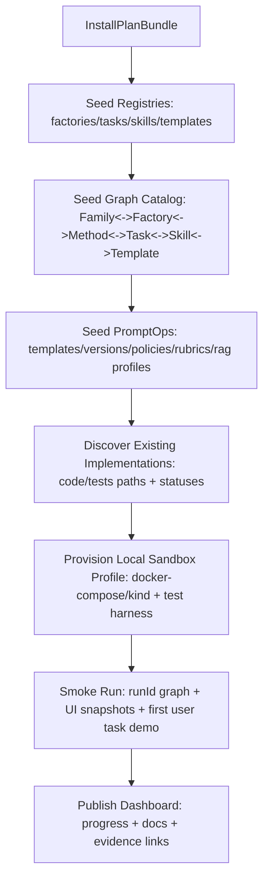

<!--
  Source: business flows.zip / 33-system initiation.md
  Canonical since: 2026-04-22
  Canonical flow: FLOW-33 system-initiation-bootstrap
  Related deep-research: docs/business-flows/_deep-research/system-initiation-bootstrap/ (if present)
  Related legacy engine artifacts: docs/business-flows/_legacy-engine-artifacts/system-initiation-bootstrap/ (if present)
-->

et's Discuss an option after all the current plans are generated and future plan will be generated as well - how we can plan a start of development, so the system could build and test itself? Let's assume we will be left with the .net on the backend and React native or react.js on the client - how we can initiaite the system so it will take and implement the plan, factories side by side?

Here’s a practical way to **start development** so the platform can **consume the generated plans** (factories + task types + flow templates) and then **build + test itself**—with **.NET backend** and **React / React Native client**—without breaking the fabric-first + Genie DNA rules.

## The core idea: build a tiny “kernel”, then let the engine generate everything else

Your plans already describe *what must exist* (factories, contracts, flows). The only thing you must implement “by hand” is the **minimum runtime that can execute those plans**:

### Kernel (handwritten, small, stable)

1. **Core Fabric + DNA primitives**

   * `MicroserviceBase`, `DataProcessResult<T>`, `ParseDocument(Dictionary<…>)`, `BuildSearchFilter` (skip empties), `Scope Isolation (tenantId)`, `DynamicController` (no entity controllers). 
2. **Layer-0 Fabrics (thin adapters, swappable)**

   * `IDatabaseService`, `IQueueService`, `IAiProvider/AiDispatcher`, `IRagService`, `IFlowOrchestrator`. 
3. **Flow Engine runtime**

   * executes **JSON DAG flow definitions stored in Elasticsearch**, step-by-step, events between steps. 

That’s it. Once this kernel runs, the rest can be *generated*.

---

## Bootstrap Flow: the first “self-build” orchestration (no-code view)

Model this as an engine flow (a DAG) whose job is: **“implement the plan”**.

### FLOW: `bootstrap-self-build-v1`

**Trigger:** `PlanApproved` (your “plans are final” moment)

**Node 1 — Import the plan into runtime registries**

* Load canonical plan artifacts into ES: factory registry, task types catalog, flow templates, BFA rules, skill library index.
* This is just data ingestion; no code gen yet.
* (You already track the authoritative totals and ranges—e.g., F1-F630, T1-T246, Templates 1-49, etc.). 

**Node 2 — Provision the “build workspace”**

* Creates/initializes the repo + baseline solution layout (backend + client + infra).
* Prefer using **Execution Fabric** so later it’s swappable (GitHub/Azure DevOps/local). The architecture already includes the execution/infrastructure fabric layer for source control + CI/CD + deployment. 

**Node 3 — Fork in parallel (“factories side by side”)**

* **Branch A: Backend generation**
* **Branch B: Client generation**
* **Branch C: Infra + Test harness generation**
  (Parallel is important: your engine is *a factory of factories*, so do not serialize unnecessarily.)

**Branch A — Backend generation loop (per factory family)**
For each factory spec in the plan:

1. **Generate interface + skeleton** (still fabric-first)
2. **Generate contract tests** (DNA checks + behavior)
3. **Generate service implementation** (provider-agnostic; resolved via CreateAsync, never direct SDK import) 
4. **Run unit + contract tests**
5. **If failing → auto-fix loop** using AF stations (review/judge) (see below)

**Branch B — Client generation loop (React or RN)**
Generate a **generic UI shell** that can render:

* Flow designer + palette + node config panels
* Run monitor (statuses per node: done / running / waiting / failed)
* Debug traces per node/run

Key point: keep UI **platform-agnostic** by driving it from **config documents** (component model, palette, renderer selection) rather than hardcoding. This is aligned with your fabric-first UI approach and the “no platform-specific values” rule. 

**Branch C — Infra + test harness**

* Local dev stack (docker compose / kind / k8s) for: Postgres, Redis Streams, Elasticsearch (+ optional object store, vector DB, etc.)
* End-to-end runner that can spin an ephemeral environment, execute a sample flow, and tear down.

**Node 4 — Join + Gate**

* Join all 3 branches.
* Gate conditions:

  * “Kernel boots”
  * “Factory registry resolvable”
  * “At least 1 real flow runs end-to-end”
  * “BFA + stress suite runs”

**Node 5 — Promote**

* If gates pass: create PR/merge + publish artifacts.
* Promotion ladder remains enforced (GENERATED → INJECTED → MINIMAL → CORE). 

---

## How the system “builds and tests itself”: use the AF stations as the build pipeline

Your architecture already defines the **AF-1…AF-11 stations** (genesis, planning, RAG, multi-model, review, compliance, security, judge, merge, feedback). 

Make them real by wiring them to the execution fabric:

* **AF-1 Genesis** outputs code + tests into a branch
* **AF-6/7/8** run as automated checkers (code review + DNA compliance + security)
* **AF-9 Judge** enforces *iron rules / quality gates* (fail = no merge)
* **AF-11 Feedback** stores outcomes (so next runs improve)

This is how you get a deterministic loop: *generate → test → judge → merge*.

---

## The “seed order” I’d use (so you can start tomorrow)

Even with massive plans (hundreds of factories), you only need to seed a small chain first:

1. **Kernel libraries** (DNA + Fabrics) 
2. **Flow runtime** (load DAG from ES, execute step-by-step) 
3. **Execution Fabric “local providers”** (local git + local CI runner) → later swap to GitHub/Azure DevOps 
4. **BFA gating enabled** (so you don’t generate conflicts into the repo)
5. **One “hello world” flow template** that touches DB + queue + UI monitor end-to-end
6. Then expand generation in parallel by families (your “factories side by side”)

---

## Why this works with your constraints

* **Fabric-first**: everything goes through interfaces, resolved at runtime, no direct provider coupling. 
* **Dynamic flows with visuality**: UI is driven by config + flow DAGs, not per-entity screens. 
* **Self-testing**: tests are generated from the same contracts (iron rules + quality gates), so the system validates itself continuously. 
* **Resumable**: flow execution is inherently stepwise and event-driven; state can be persisted per run/step (the flow engine is designed for this). 

---

If you want the next concrete step, I’d define **one explicit “Bootstrap Kernel Contract”** (a small, locked subset of factories + task types) and make `bootstrap-self-build-v1` generate only that subset first, then widen the parallelism family-by-family.


I think we should design a basic flow of what system will need to do and start the system with this basic flow.

Yes — the cleanest “day-0” start is: **ship one basic BOOTSTRAP flow as a seed**, and make the runtime always capable of executing that flow first. After that, everything else is “data + flows” (not handwritten orchestration).

Below is a **minimal-but-complete Bootstrap flow** that matches Factory-First + DNA + multi-tenant, and is designed to **start development, detect gaps, self-extend, and self-test**.

---

## RAG map of the attached sources (so the engine can reason while bootstrapping)

**RAG Collections (what we index / retrieve from during bootstrap):**

1. **Engine DNA + Fabric rules** → `basic_prompt.txt` (non-negotiables: Fabrics, Factories, AF stations, BFA, 6 DNA patterns)
2. **Authoritative architecture** → `ENGINE_ARCHITECTURE_MERGED.md` (families/factories, Flow Creation Engine F190-F196, execution fabric)
3. **Task contracts** → `TASK_TYPES_CATALOG_MERGED.md` (notably: **T53 compile**, **T54 run**, **T58 self-extend**, **T103 tenant onboarding**)
4. **Skills library / patterns** → `SKILLS_FACTORY_RAG_MERGED.md` (how to implement each fabric/provider safely)
5. **BFA conflict rules & stress tests** → `V62_BFA_STRESS_TEST_MERGED.md`
6. **Multi-tenant control plane guidance** → `multi-tenant-support.md`
7. **State continuity** → `SESSION_STATE_MERGE.md` (how you checkpoint phases)

**Retrieval tags to use in the bootstrap flow**

* `#DNA`, `#Fabric`, `#Factory`, `#AF`, `#BFA`, `#FlowDefinition`, `#T53`, `#T54`, `#T58`, `#TenantOnboarding`, `#ExecutionFabric`, `#InfraFabric`, `#PromotionLadder`

---

## The Basic Flow to start the system: `platform-bootstrap-v1`

### What this bootstrap flow must do (and nothing more)

1. **Create/seed the minimum registries** (schemas, factories, configs, flow definitions)
2. **Load the “current plan bundle”** (task types, flow templates, skills index pointers)
3. **Run a provider/factory coverage scan** across the 3D parity surfaces (DB, queue, AI, RAG, GraphRAG, cloud storage, execution/infra)
4. **If gaps exist → emit `CapabilityGapDetected` and let T58 extend the engine**
5. **Compile and publish the core flows** (T53)
6. **Run smoke e2e** (T54) + BFA gates
7. **Mark platform bootstrapped** (idempotent + resumable)

---

## No-code orchestration (DAG)

```mermaid
flowchart TD
  A[Trigger: PlatformBootRequested OR first-run sentinel missing] --> B[Register Core Schemas]
  B --> C[Import Plan Bundle to Registries]
  C --> D[Coverage Scan: required factories vs installed providers]
  D -->|gaps found| E[Emit CapabilityGapDetected events]
  E --> F[T58 Self-Extend (parallel until gaps resolved)]
  D -->|no gaps| G[Compile Core Flows (T53)]
  F --> G
  G --> H[Publish + Activate Core Flows]
  H --> I[Smoke Run: minimal flow execution (T54)]
  I --> J[BFA + Stress-lite gates]
  J --> K[Set Bootstrapped Sentinel + Version]
```

---

## Flow DSL skeleton (what you store in Elasticsearch as the seed document)

> This is intentionally **small** and **idempotent**. It doesn’t assume “all factories exist” — it explicitly routes through **T58** when they don’t.

```json
{
  "flowId": "FLOW-BOOTSTRAP-PLATFORM",
  "name": "platform-bootstrap-v1",
  "version": 1,
  "flowType": "BOOTSTRAP",
  "trigger": {
    "eventType": "PlatformBootRequested",
    "correlationKey": "platform",
    "debounce": { "windowSeconds": 30, "policy": "latest_wins" }
  },
  "policies": {
    "idempotencyKey": "platform-bootstrap-v1",
    "tenantScope": "SYSTEM",
    "promotionTier": "CORE",
    "resumeEnabled": true,
    "auditAllSteps": true
  },
  "nodes": [
    {
      "id": "register_core_schemas",
      "type": "command",
      "factory": "F194:ISchemaRegistryService",
      "method": "RegisterSchema",
      "inputMapping": {
        "schemas": [
          "FlowDefinitionSubmitted",
          "FlowDefinitionPublished",
          "CapabilityGapDetected",
          "TenantProvisionRequested",
          "FlowRunRequested",
          "BootstrapCompleted"
        ]
      },
      "outputEvent": "CoreSchemasRegistered"
    },
    {
      "id": "import_plan_bundle",
      "type": "command",
      "factory": "F58:IArtifactRegistryProvider",
      "method": "PublishPackage",
      "dependsOn": ["register_core_schemas"],
      "inputMapping": {
        "packageType": "PLAN_BUNDLE",
        "packageRef": "$.data.planBundleRef",
        "targetRegistries": [
          "task-types-catalog",
          "factory-registry",
          "flow-templates",
          "skills-index",
          "bfa-rules"
        ]
      },
      "outputEvent": "PlanBundleImported"
    },
    {
      "id": "coverage_scan",
      "type": "command",
      "factory": "F191:IFlowValidationService",
      "method": "CheckFactoryRegistry",
      "dependsOn": ["import_plan_bundle"],
      "inputMapping": {
        "factoryIds": "$.data.requiredFactories"
      },
      "outputEvent": "CoverageScanCompleted"
    },
    {
      "id": "fork_gap_resolution",
      "type": "fork",
      "branches": ["emit_gaps_or_continue"],
      "policy": { "required": ["emit_gaps_or_continue"], "optional": [], "degradedOk": false }
    },
    {
      "id": "emit_gaps_or_continue",
      "type": "decision",
      "dependsOn": ["coverage_scan"],
      "when": [
        {
          "if": "$.nodes.coverage_scan.output.missingCount > 0",
          "then": "emit_capability_gaps"
        },
        { "else": "compile_core_flows" }
      ]
    },
    {
      "id": "emit_capability_gaps",
      "type": "command",
      "factory": "QUEUE_FABRIC:IQueueService",
      "method": "EnqueueAsync",
      "inputMapping": {
        "eventType": "CapabilityGapDetected",
        "payload": "$.nodes.coverage_scan.output.missingFactories"
      },
      "outputEvent": "GapEventsEmitted"
    },
    {
      "id": "wait_for_gaps_resolved",
      "type": "wait_event",
      "waitFor": ["CapabilityGapsResolved"],
      "correlationKey": "platform",
      "dependsOn": ["emit_capability_gaps"]
    },
    {
      "id": "compile_core_flows",
      "type": "command",
      "taskType": "T53",
      "factory": "F190:IFlowDefinitionService",
      "method": "StoreDefinition",
      "dependsOn": ["wait_for_gaps_resolved"],
      "inputMapping": { "flowDefs": "$.data.coreFlowDrafts" },
      "outputEvent": "CoreFlowsCompiled"
    },
    {
      "id": "publish_core_flows",
      "type": "command",
      "factory": "F190:IFlowDefinitionService",
      "method": "PublishDefinition",
      "dependsOn": ["compile_core_flows"],
      "inputMapping": { "flowIds": "$.nodes.compile_core_flows.output.flowIds" },
      "outputEvent": "CoreFlowsPublished"
    },
    {
      "id": "smoke_run",
      "type": "command",
      "taskType": "T54",
      "factory": "F192:IFlowRuntimeService",
      "method": "StartRun",
      "dependsOn": ["publish_core_flows"],
      "inputMapping": {
        "flowId": "FLOW-SMOKE-01",
        "version": 1,
        "triggerPayload": { "tenantId": "SYSTEM", "mode": "smoke" }
      },
      "outputEvent": "SmokeRunCompleted"
    },
    {
      "id": "bootstrap_done",
      "type": "terminal",
      "emits": ["BootstrapCompleted"],
      "payloadAssembly": {
        "bootstrapVersion": 1,
        "completedAt": "$.now()",
        "coverage": "$.nodes.coverage_scan.output",
        "smoke": "$.nodes.smoke_run.output"
      }
    }
  ]
}
```

### Notes about this DSL (why it’s a good “starter”)

* **Idempotent by design**: rerunning won’t double-create (keyed on `platform-bootstrap-v1`)
* **Self-extension built in**: gaps → `CapabilityGapDetected` → **T58** generates & registers missing factories
* **Doesn’t require the whole universe day-0**: only needs the **Flow Creation Engine (F190-F194)** + queue + DB fabric to be present

---

## How you “start the system” with this basic flow (boot sequence)

In the .NET kernel you implement manually:

1. On startup, check **Bootstrapped sentinel** in ES (e.g., `platform-config/bootstrap`)
2. If missing or version < desired → enqueue `PlatformBootRequested`
3. Let the normal orchestrator execute the flow (durable / resumable)
4. Once `BootstrapCompleted` is emitted, the platform flips into “normal mode”

This keeps the *first runnable thing* as a **flow**, not a hardcoded installer.

---

## State save (so we can resume next message without “resetting cache”)

```yaml
STATE_CHECKPOINT:
  name: platform-bootstrap-v1
  decisions:
    seed_first_flow: FLOW-BOOTSTRAP-PLATFORM
    gap_strategy: CapabilityGapDetected -> T58 Self-Extend
    compile_run_gates: T53 then T54 then BFA-lite
  required_day0_factories:
    - F190 IFlowDefinitionService
    - F191 IFlowValidationService
    - F192 IFlowRuntimeService
    - F194 ISchemaRegistryService
    - Queue Fabric (Redis Streams)
    - Database Fabric (Elasticsearch + Postgres minimal)
  outputs:
    - core schemas registered
    - plan bundle imported
    - coverage scan produced missingFactories[]
    - core flows compiled/published
    - smoke run executed
```

---

If you want the *next* step after this: I’d define **FLOW-SMOKE-01** (the smallest possible real flow that touches DB + Queue + one factory call) so T54 proves durability + eventing end-to-end on day-0.


Now what is important:
1. Skills for each factory family
2. Some graph rag + AI rag to easily retreive the rag
3. Some basic prompt how to work with the rag
4. Some basic flow where the system can implement the family with the skill (using basic decision flow : ai executors in different models + arbitr [does it cover the need], arbitr of security, arbitr of testing, arbitr of business flow dependencies in a loop untill all arbitrs pass), deploy locally, test it - we will need prompts and basic connections to test with AI, graph rag, rag, task management environment connection, repo connection)
5. If we extend some functionality by adding code and we already used this code -> test again all we used - which means if we implement another db connector for mongo and we already tested implementation of the same fabric interface on elastic and we add another method - we need to test again the elastic and maybe even implement additional method in elastic and cover it with test - which means we need to store connection between implementations and the interface we implement
6. Clear full tasks list that we will need to apply the flow on them 
7. Cleare directory structure how and where we store implementation
8. Skill which we will need to apply on each flow, rag context and how we bring it

Perfect — this is the *real* “day-0” foundation: **Knowledge (skills + RAG) + a single “Implement Family” meta-flow** that can repeatedly generate, validate, deploy, test, and regress.

Below is a concrete blueprint that covers your 8 points and stays 100% **Fabric-First + Factory-First + Genie DNA** (DNA-1..DNA-7/+9 in your tracker).

---

## 1) Skills for each Factory Family

### What a “Family Skill Pack” must contain (minimum contract)

Create **one skill pack per family** (SK-FAM-xx), and inside it one skill per factory interface (SK-Fxxx):

**SK-FAM-{FamilyId}: Family Implementation Pack**

* **Purpose & boundaries** (what this family owns / doesn’t own)
* **Factories list** + their **Fabric Resolution** (DB/Queue/AI/RAG/etc)
* **Events & schemas** (CloudEvents envelope + payload schema references)
* **Data fragments** (multi-DB entity fragments + G6 rules)
* **BFA hooks** (which BFA indices this family writes to)
* **Security checklist** (authZ, tenant scoping, secrets, data retention)
* **Test matrix** (contract tests + provider tests + e2e flows)
* **Prompt pack** (AF-1/4/6/7/8/9 templates specialized for this family)
* **Regression map** (interfaces ↔ providers ↔ flows using them)

**SK-F{FactoryId}: Factory Skill**

* Interface intent + method semantics
* “How to implement via fabric” patterns (DNA-1..7)
* Error model and `DataProcessResult<T>` expectations
* Idempotency rules (if applicable)
* Required telemetry (traceparent propagation)
* Contract tests required (what must be true across all providers)
* Example input/output dictionaries (not typed models)

> Key: **Skills are executable knowledge** — they are what AF-4 retrieves to guide generation and what AF-9 judges against.

---

## 2) Graph RAG + AI RAG (Hybrid retrieval that actually works)

You already have the right abstraction points in your architecture:

* **F65 IGraphAiProvider** (Neo4j/Neptune/etc)
* **F66 IVectorStoreProvider** (vector operations)
* **IRagService** with **Graph/Vector/Hybrid/Multi** strategies

### The Hybrid RAG you want (Graph → then Vector → then Merge)

**GraphRAG is for structure & impact**, VectorRAG is for **content similarity**.

**Graph nodes (entities)**

* `Family`, `Factory`, `FactoryMethod`, `TaskType`, `FlowTemplate`, `FlowStep`
* `EventType`, `SchemaVersion`, `EntityFragment`
* `ProviderImplementation` (ElasticProvider, MongoProvider…)
* `TestSuite`, `TestCase`
* `RepoPath`, `Commit`, `ArtifactVersion`, `DecisionRecord`

**Graph edges (relationships)**

* `Family HAS_FACTORY Factory`
* `Factory HAS_METHOD FactoryMethod`
* `FlowStep USES Factory`
* `TaskType DEPENDS_ON Factory`
* `Factory RESOLVES_VIA Fabric`
* `ProviderImplementation IMPLEMENTS FactoryMethod`
* `TestSuite COVERS FactoryMethod`
* `SchemaVersion AFFECTS EventType`
* `EventType TRIGGERS FlowTemplate`
* `FlowTemplate EMITS EventType`

**Vector store content**

* Skills (SK docs)
* Task contracts (T docs)
* Flow templates (DSL examples)
* Code snippets + test snippets + build logs + judge outputs

**Hybrid retrieval algorithm**

1. **Graph query first** to pick *the exact* relevant nodes (e.g., “all providers implementing IDatabaseService.StoreDocument”, “flows that depend on Factory Fxxx”).
2. Use those node IDs as **filters** for vector similarity search (only retrieve chunks belonging to those nodes).
3. Merge + dedupe results into a **ContextPack**.

This makes retrieval *precise*, and it enables #5 (regression impact).

---

## 3) Basic prompt: “How to work with RAG” (engine-wide)

Create **one base prompt** used everywhere (AF-1/2/4/9), with only a small per-node specialization.

### Base Prompt Template (must be stable)

**Inputs:**

* `Goal` (what we’re implementing)
* `Scope` (tenant/system, family/factory)
* `Constraints` (DNA, BFA, fabrics, no typed models, etc.)
* `ContextPack` (from IRagService Hybrid)
* `ExpectedOutputs` (files changed + tests + registry updates)

**Mandatory steps inside the prompt**

1. **Restate the target contract** (factory interface + methods + fabric mapping)
2. **List the relevant retrieved skills** (what you will apply)
3. **Generate** (code/tests/docs) *only using those skills*
4. **Self-check** against DNA patterns + BFA + test matrix
5. Output: **patch plan** (what files/registries are updated)

> This makes generation deterministic and judgeable.

---

## 4) Basic flow: “Implement Family with Skills” (multi-model + arbiters loop)

This is your “meta-factory” flow. It’s the single most important thing to build.

### Flow Template: `implement-family-v1`

**Goal:** Given a family spec + skills, generate implementations + tests + register + deploy + verify, looping until all arbiters pass.

#### No-code DAG (conceptual)

1. **Load Family Spec**
2. **Build ContextPack (Hybrid RAG)**
3. **AF-5 Multi-model executors** generate implementation candidates
   (OpenAI / Claude / Gemini / …)
4. **AF-10 Merge** (select/merge best)
5. **Arbiters loop** (must all pass):

   * **Arbiter A: Coverage** — does it fully implement the spec + required methods?
   * **Arbiter B: Security** — secrets, authZ, tenant scoping, injection, PII
   * **Arbiter C: DNA Compliance** — ParseDocument, BuildSearchFilter, CreateAsync, etc.
   * **Arbiter D: Testing** — unit + contract + integration generated & passing
   * **Arbiter E: BFA Dependencies** — cross-flow rules + schema + propagation indices
6. **Local Deploy**
7. **E2E Smoke** (flow runs + event chain)
8. **Publish artifacts + update registries**
9. **Feedback storage** (for prompt self-learning)

**Loop rule:** if any arbiter fails → feed its failure report back to AF-1/AF-5 with the *exact failing trace*, regenerate, retry.

### Required “basic connections” (day-0 minimal set)

You don’t need everything at first, but you need the connectors *as fabrics*:

* **AI**: IAiProvider + dispatcher (at least 2 providers)
* **RAG**: IRagService (Hybrid) backed by:

  * F65 GraphAiProvider (local Neo4j is enough)
  * F66 VectorStoreProvider (Elasticsearch vector or pgvector)
* **Repo**: F54 SourceControlProvider (local git provider first)
* **CI/Test**: F55 CiCdProvider (local runner mode: dotnet test + npm test)
* **Infra**: F59 ContainerOrchestrationProvider (docker-compose for local)
* **Task mgmt**: F64 ProjectManagementProvider (stub first, Jira/Azure DevOps later)

---

## 5) Regression testing when interfaces/providers evolve (store the relationships)

This is where **GraphRAG becomes non-negotiable**.

### The rule you want

> If an interface changes OR a provider adds a method, rerun **all tests** for:

* All providers implementing that interface
* All flows that use that interface (directly or indirectly)
* Any dependent “contract suites” for the fabric

### How to make that automatic

Create a **Factory Implementation Registry** (and mirror it into the graph):

**Registry records (stored in ES)**

* `factoryId`, `interfaceName`
* `methods[]` (name + signature hash)
* `providers[]` (providerId + version + repoPath)
* `testSuites[]` (suiteId, type: contract/unit/e2e)
* `usedBy[]` (flowTemplateIds, taskTypeIds)

**Change detection**

* On PR merge, compute:

  * `InterfaceDiff` (new/changed/removed method)
  * `ProviderDiff` (provider updated)
* Emit: `FactoryContractChanged` / `ProviderImplementationChanged`

**Regression flow**

* Graph query: impacted providers + impacted flows
* Execute:

  * Provider contract suites
  * Flow smoke tests
  * Any “compatibility patch” tasks if a provider is missing the new method

This gives you the “elastic must be retested when mongo gets a new method” behavior.

---

## 6) Clear full tasks list to apply the flow on

### A) Platform bootstrap tasks (once)

1. **T-BOOT-01** Create registries (factory registry, skill registry, schema registry, impl registry)
2. **T-BOOT-02** Stand up Hybrid RAG (Graph + Vector) + ingestion flow
3. **T-BOOT-03** Implement `implement-family-v1` flow template
4. **T-BOOT-04** Implement regression flow (contract changed → retest impacted)
5. **T-BOOT-05** Implement local deploy + smoke harness

### B) “Per Family” tasks (what implement-family-v1 runs)

1. **T-FAM-01** Generate/validate factory interfaces (and method list)
2. **T-FAM-02** Generate provider implementations for selected providers
3. **T-FAM-03** Generate **contract test suite** (cross-provider)
4. **T-FAM-04** Generate integration tests (DB/queue/AI/RAG stubs)
5. **T-FAM-05** Register factories + schemas + BFA metadata
6. **T-FAM-06** Build + run tests locally
7. **T-FAM-07** Deploy local + run e2e smoke flows
8. **T-FAM-08** Publish artifacts + update graph + feedback logs

---

## 7) Directory structure (where implementation lives)

A clean structure that supports factories/providers/tests/RAG/flows and multi-tenant:

```
/src
  /backend
    /Kernel                      (MicroserviceBase, DNA utilities, DataProcessResult)
    /Fabrics
      /DatabaseFabric            (IDatabaseService + providers: elastic, mongo, pg, redis...)
      /QueueFabric               (IQueueService + Redis Streams impl + outbox/supersede)
      /AiFabric                  (IAiProvider + dispatcher)
      /RagFabric                 (IRagService + strategies: vector/graph/hybrid/multi)
      /ExecutionFabric           (F54-F58 providers)
      /ManagementFabric          (F64-F68 providers)
    /Factories
      /Family_{xx}
        /F{Id}_{InterfaceName}
          Interface.cs
          FactoryRegistration.json       (fabric mapping + methods + entity fragments)
          Prompts/                       (AF-1/4/6/7/8/9 prompt templates)
          Tests/
            Contract/
            Integration/
    /Registries
      /FactoryRegistrySchemas
      /SchemaRegistrySchemas
      /ImplementationRegistrySchemas
      /BfaIndexesSchemas
    /Flows
      /Templates                  (human-readable templates)
      /Definitions                (generated DSL documents)
      /CompiledDags
    /Rag
      /Ingestion                  (chunking, embedding, graph extraction)
      /GraphSchema
      /VectorIndexes
  /client
    /app                          (React / RN)
    /flow-designer                (visual editor)
    /flow-monitor                 (run monitor)
    /generated-ui                 (config-driven UI components)
  /infra
    docker-compose.yml
    k8s/
    terraform/
  /tests
    /e2e
    /smoke
    /load
/tools
  /cli                            (bootstrap, run flows, ingest rag, run regression)
```

Key point: **Registries + flow definitions are data** (stored in ES), but you still keep the canonical “seed” documents in-repo for reproducibility.

---

## 8) Skill usage per flow (how each node gets the right RAG context)

Define a standard object: **ContextPack**.

**ContextPack must include:**

* Relevant SK skills (family + factory + fabric)
* Relevant task contracts (Txx)
* Relevant BFA rules (CF, gaps G1–G7 implications)
* Similar past implementations (code + tests)
* Provider matrix (which providers must be consistent)
* Known failure patterns + fixes (from AF-11 feedback)

**How it’s brought into each node**

* Each flow node declares:

  * `ragQueries[]` (keywords + boosts)
  * `graphConstraints` (familyId/factoryId/taskTypeId/providerId)
  * `tokenBudget`
* IRagService executes Hybrid retrieval and returns ContextPack
* The node prompt receives ContextPack and must cite which skills it used

This makes the whole thing **repeatable** and prevents “random generation”.

---

# STATE_CHECKPOINT (so we can resume exactly from here)

```yaml
STATE_CHECKPOINT:
  focus: "Build the Knowledge + Implement-Family foundation"
  deliverables:
    - Family Skill Pack format (SK-FAM + SK-Fxxx)
    - Hybrid RAG architecture (Graph + Vector + Merge) using F65/F66 + IRagService
    - Base RAG prompt template (stable)
    - implement-family-v1 meta-flow with multi-model executors + arbiters loop
    - Regression strategy: Implementation Registry + Graph impact analysis + retest flow
    - Full task list: bootstrap + per-family tasks
    - Repo directory structure for .NET + React/RN + registries + flows + rag ingestion
    - ContextPack contract + how each flow node requests/receives it
  next_build_step:
    - Define Graph schema + Implementation Registry schema
    - Seed 1 family end-to-end with implement-family-v1 (smallest family first)
```

---

If you want the “smallest family” to pilot this (so everything above becomes real fast), pick **one fabric family** first (e.g., **Database Fabric providers** or **Execution Fabric F54-F58**) — because it immediately exercises: skills, hybrid RAG, repo connector, CI/test, and regression mapping.


What is missing is how we "translate" the plans we have into that plan?
We will need a skills sets and a structures for each and make a transition of these from what we have to something that flow can reuse. For the first step we will need to make this setup like an "installer"

You’re right: **the missing bridge is a “Plan → Runtime Artifacts” translation layer**.

Right now the plans live as **human-readable merged docs** (architecture, tasks, skills, BFA, source index, session state). What the engine needs is **machine-readable registries + RAG indexes + graph links** that flows can query and reuse.

Below is a concrete way to do that as an **installer** (first runnable flow).

---

## 0) What “translation” means (in engine terms)

### Input (what you already have)

Your canonical plan sources are the 7 merged files listed in session state :

* ENGINE_ARCHITECTURE (Factories/Families/Fabrics)
* TASK_TYPES_CATALOG (Task contracts + templates)
* SKILLS_FACTORY_RAG (Skill patterns)
* V62_BFA_STRESS_TEST (CF rules + ST scenarios)
* UNIFIED_SOURCE_INDEX (DD/DR + concept maps)
* MASTER_EXECUTION_PLAN (phases + recovery)
* SESSION_STATE (counts + sequence proof)

You also have the “engine contract rules” in `basic_prompt.txt` (what must exist / must not exist) .

### Output (what flows must be able to reuse)

1. **Registries (Elasticsearch docs)**

   * `factory_registry` (F1–F630)
   * `task_type_registry` (T1–T246)
   * `flow_template_registry` (Template 1–49)
   * `skill_registry` (SK-1–SK-144)
   * `bfa_rule_registry` (CF-1–CF-294)
   * `stress_test_registry` (ST-1–ST-163)
   * `design_decision_registry` (DD-1–DD-129) + `design_record_registry` (DR-1–DR-98)
   * `prompt_registry` (basic prompt + node prompt packs)

2. **GraphRAG (Neo4j/Neptune via F65)**

   * Nodes: Family, Factory, Method, TaskType, Template, Skill, BFA Rule, StressTest, DD, DR
   * Edges: `USES`, `DEPENDS_ON`, `COVERS`, `AFFECTS`, `CONFLICTS_WITH`, `REUSES`

3. **VectorRAG (via F66)**

   * Chunks of the plan sources + “skill packs” + prompts + past judgments

4. **Installer state + versioning**

   * `installed_plan_version`, checksums, and idempotency markers (so you can rerun safely)

---

## 1) The key: build a “PlanBundle” package first

Create one **PlanBundle** manifest doc (SYSTEM tenant) that points to the raw sources and the extracted ranges:

```json
{
  "bundleId": "PLANBUNDLE-2026-02-27",
  "sourceFiles": [
    "ENGINE_ARCHITECTURE_MERGED.md",
    "TASK_TYPES_CATALOG_MERGED.md",
    "SKILLS_FACTORY_RAG_MERGED.md",
    "V62_BFA_STRESS_TEST_MERGED.md",
    "UNIFIED_SOURCE_INDEX_MERGED.md",
    "MASTER_EXECUTION_PLAN_MERGED.md",
    "SESSION_STATE_MERGE.md"
  ],
  "expectedRanges": {
    "factories": "F1-F630",
    "taskTypes": "T1-T246",
    "templates": "1-49",
    "bfaRules": "CF-1-CF-294",
    "stressTests": "ST-1-ST-163",
    "skills": "SK-1-SK-144",
    "dds": "DD-1-DD-129",
    "drs": "DR-1-DR-98"
  }
}
```

Those totals are already pinned in session state , so the installer can validate “no gaps”.

---

## 2) Translation rules (how each doc becomes reusable records)

### A) ENGINE_ARCHITECTURE → FactoryRegistry (+ family registry + fabric mappings)

Example: F190 already expresses exactly the structure you want to store in the factory registry (methods + fabric resolution + DNA + machine/freedom) .
Also: this file defines that **Graph + Vector providers exist as factories** (F65/F66) .

**Extractor output per factory (canonical fields):**

* `factoryId`, `familyId`, `interfaceName`
* `methods[]` (name + return type + signature hash)
* `fabricResolution[]` (fabric → provider → pattern)
* `dnaChecklist[]` (DNA-1..DNA-9)
* `machineRules[]`, `freedomKeys[]`
* `taskTypes[]` referencing tasks that depend on this factory

### B) TASK_TYPES_CATALOG → TaskTypeRegistry (+ template linkage + AF map)

This file describes the “same machine” loop (discovery → orchestration → judge → feedback)  and lists the family registry and template registry structures .

**Extractor output per task type:**

* `taskTypeId`, `name`, `archetype`, `entry`
* `factoryDependencies[]`
* `ironRules[]`, `qualityGates[]`
* `afStationMap` (11 stations)
* `bfaRefs[]` (CF links, entities/events/APIs)
* `defaultTemplateId`

### C) SKILLS_FACTORY_RAG → SkillRegistry (plus: SkillPack per family)

Skills already declare usable shape: `Pattern`, `Used by`, `Reuses`, key insights, etc.  and the file explicitly states “each skill = pattern name + when to use + composition + DNA notes” .

**Extractor output per skill:**

* `skillId`, `name`
* `patternSteps[]`
* `triggers[]` (when to use)
* `usedByFactories[]`, `usedByTaskTypes[]`
* `reuses[]`
* `gotchas[]`
* `dnaNotes[]`

**Then auto-generate “FamilySkillPack” docs**:

* For each family, collect all skills whose `Used by` list contains factories from that family.
* This becomes the reusable “skill set for each factory family” you asked for.

### D) V62_BFA_STRESS_TEST → BFARuleRegistry + StressTestRegistry

This file is already structured as CF rules and ST scenarios, and it also establishes BFA enforcement indexes like “multi-db entity registry” and “semantic analyzer” patterns .

**Extractor output:**

* CF: `cfId`, severity, entities/events/APIs, conflict, resolution, enforcement index
* ST: `stId`, scenario, attack vector, defense layers, expected result, cross-flow links

### E) UNIFIED_SOURCE_INDEX → SourceIndexRegistry + Graph bootstrap

This doc is already a concept→source map (perfect for graph ingestion) .

* Create graph nodes for each concept and connect them to factories/tasks/skills they reference.

### F) MASTER_EXECUTION_PLAN + SESSION_STATE → Installer validation + resumability

* Recovery commands and phase structure become “installer checkpoints” .
* The global totals are the validation oracle .

---

## 3) The “Installer Flow” (first thing you run)

### Flow: `install-plan-bundle-v1` (SYSTEM tenant, idempotent)

**Trigger:** `PlanBundleUploaded` or “first boot” sentinel missing.

**Nodes (no-code orchestration):**

1. **Validate bundle vs session state**

   * Ensure ranges match (F1–F630, T1–T246, SK-1–SK-144…) 
2. **Register registry schemas** (SchemaRegistry)

   * Use the FCE pattern of schema registration and validation (Family 20) 
3. **Ingest raw sources into VectorRAG**

   * Chunk each merged doc, embed, store; link chunk metadata to IDs extracted (F/T/SK/CF/ST/DD/DR)
4. **Build GraphRAG entities + edges**

   * Create nodes/edges; tenant partition rules for graph queries are already an explicit pattern in skills (tenantId partitioning) 
5. **Compile registries (the translation step)**

   * Parse & emit registry docs:

     * `factory_registry` from ENGINE_ARCHITECTURE
     * `task_type_registry` from TASK_TYPES
     * `skill_registry` from SKILLS
     * `bfa_rule_registry` + `stress_test_registry` from V62
     * `source_index_registry` from UNIFIED_SOURCE_INDEX
6. **Generate FamilySkillPacks**

   * Derived docs (family → skill list → factories/tasks)
7. **Seed prompt library**

   * Store `basic_prompt.txt` and node prompt templates; your base rules (factory registration, contract format, AF mapping, BFA, DNA) are explicitly enumerated 
8. **Seed the minimal bootstrap flows**

   * Store and publish installer-related flows via F190 (StoreDefinition/PublishDefinition) 
9. **Validation gate**

   * Referential integrity:

     * every task dependency exists
     * every template references existing factories
     * BFA rules reference existing entities/events
10. **Mark installed**

* Write `installed_plan_version` + checksums so reruns are safe and incremental

> This makes the system start as an “installer,” then immediately becomes a “builder”.

---

## 4) How flows reuse this after installation (the payoff)

Once installed, **every “Implement Family” flow** does:

1. Graph query: *which factories in Family X, which tasks use them, which skills are “Used by” them, what BFA rules apply*
2. Vector query: pull the top skill patterns + prior successful implementations + prompt snippets
3. Build a ContextPack and run the multi-model + arbiters loop (your AF-5/6/7/8/9 pipeline)

That’s exactly the “same machine” loop defined in the task catalog .

---

## STATE_CHECKPOINT (translation + installer)

```yaml
STATE_CHECKPOINT:
  goal: "Translate merged plan docs into reusable runtime registries + RAG"
  canonical_sources:
    - ENGINE_ARCHITECTURE_MERGED.md
    - TASK_TYPES_CATALOG_MERGED.md
    - SKILLS_FACTORY_RAG_MERGED.md
    - V62_BFA_STRESS_TEST_MERGED.md
    - UNIFIED_SOURCE_INDEX_MERGED.md
    - MASTER_EXECUTION_PLAN_MERGED.md
    - SESSION_STATE_MERGE.md
  installer_flow: install-plan-bundle-v1
  runtime_outputs:
    registries:
      - factory_registry (F1-F630)
      - task_type_registry (T1-T246)
      - flow_template_registry (1-49)
      - skill_registry (SK-1-SK-144)
      - bfa_rule_registry (CF-1-CF-294)
      - stress_test_registry (ST-1-ST-163)
      - dd_registry, dr_registry
      - prompt_registry
    rag:
      - vector_chunks (all sources + prompts)
      - graph_nodes_edges (Family/Factory/Task/Skill/BFA/Test links)
    derived:
      - family_skill_packs (auto-group skills by family)
  validation_oracle: SESSION_STATE totals + no-gap checks
```

If you want, next step we can define **the exact JSON schema** for each registry doc (FactoryRecord, TaskTypeRecord, SkillRecord, BFARuleRecord…) so the installer can validate every extracted record before writing it.

It's not enough - we will need a pattern of how to initiate graph rag - of connected interfaces and families

Got it — you need an **explicit, reusable “GraphRAG bootstrap pattern”** that creates a **connectivity graph of Families ↔ Interfaces ↔ Factories ↔ Methods ↔ Tasks ↔ Skills ↔ Templates**, so flows can retrieve context *deterministically* (not “semantic only”).

Below is the pattern I’d use as your **Installer Phase 2**: *GraphRAG Catalog Graph + Impact Graph*.

---

## 1) What we’re initializing (two layers of GraphRAG)

### A) Catalog Graph (static plan connectivity)

This is the “connected interfaces and families” graph:

* **Family** nodes from your family registries (e.g. “Execution Fabric”, “Management + Intelligence”, “Flow Creation Engine”). 
* **Factory** nodes (Fxxx) and their interface names (e.g., F65 IGraphAiProvider, F66 IVectorStoreProvider). 
* **TaskType** nodes (Txxx) with explicit factory dependencies (e.g., T125 depends on F325/F329/F330). 
* **Skill** nodes referenced by tasks / factories (AF-4 points at skills explicitly). 
* **Template** nodes (flow templates list in task catalog). 

### B) Impact Graph (dynamic runtime connectivity)

This is the “what breaks if I change X” layer:

* Provider implementations per factory/method (ElasticProvider/MongoProvider/Neo4jProvider…)
* Test suites covering methods
* Flow templates / compiled DAGs using factories
* PRs/commits/releases that introduced changes

This is what enables the regression rule you described (#5).

---

## 2) Graph schema (labels + keys + relationships)

### Labels (nodes)

Use these labels (minimum):

* `Family {id, name, flowSource, scope}`
* `Factory {id, interface, familyId, scope}`
* `Method {id, factoryId, name, sigHash, scope}`
* `TaskType {id, archetype, entry, scope}`
* `Skill {id, name, scope}`
* `Template {id, name, sourceTaskType, scope}`
* `BfaRule {id, scope}`
* `ProviderImpl {id, providerId, repoPath, version, scope}`
* `TestSuite {id, suiteType, scope}`
* `FlowDef {id, version, scope}`

### Relationship types (edges)

**Core “connected interfaces/families” edges**

* `(Family)-[:HAS_FACTORY]->(Factory)`
* `(Factory)-[:HAS_METHOD]->(Method)`
* `(TaskType)-[:DEPENDS_ON]->(Factory)`  ← from `FACTORY DEPENDENCIES` lines 
* `(TaskType)-[:USES_SKILL]->(Skill)`   ← from AF-4 retrieval lines 
* `(Template)-[:IMPLEMENTS_TASK]->(TaskType)`
* `(Template)-[:USES_FACTORY]->(Factory)`
* `(BfaRule)-[:APPLIES_TO]->(Factory|TaskType|Template)`

**Impact edges**

* `(ProviderImpl)-[:IMPLEMENTS]->(Method)`
* `(TestSuite)-[:COVERS]->(Method)`
* `(FlowDef)-[:USES_FACTORY]->(Factory)`

### Multi-tenant partitioning (non-negotiable)

Every node and relationship must carry:

* `scope = 'SYSTEM' | 'TENANT'`
* and if `TENANT`: `tenantId`

This follows the same “tenantId on ALL graph queries” discipline shown in the Neo4j family example (`WHERE tenantId = $tenantId`)  and the global rule “every component talks only through fabric interfaces” (so graph access goes only through F65) .

---

## 3) The initiation pattern (GraphRAG Bootstrap pipeline)

### Step 0 — Choose the graph access path (Fabric-first)

Use **F65 IGraphAiProvider** as your graph abstraction (Neo4j/Neptune behind it) .
Do **not** let services call Neo4j drivers directly (same rule as all fabrics) .

### Step 1 — Create Graph “meta-schema” (constraints/indexes)

Installer creates:

* Unique constraints on `id` per label (`Family.id`, `Factory.id`, etc.)
* Index on `(scope, tenantId)` for all labels
* Index on `Factory.interface`, `Method.sigHash`, `TaskType.archetype`

### Step 2 — Seed Catalog Graph from registries (SYSTEM scope)

You already have authoritative family lists (20 families in task catalog)  and factory/fabric extension including F65/F66 .

Installer parses:

* **Family registry** → create `Family` nodes
* **Factory registry** → create `Factory` nodes + `HAS_FACTORY`
* **Method lists** (from factory definitions) → create `Method` nodes + `HAS_METHOD`
* **TaskType registry** → create `TaskType` nodes
* Add `DEPENDS_ON` edges from task dependencies lines (example T125) 
* Add `USES_SKILL` edges from AF-4 lines (example T125) 
* **Template registry** → create `Template` nodes + `IMPLEMENTS_TASK`

### Step 3 — Attach BFA to the same graph

When a task cites BFA validations (like T125 referencing CF rules), store:

* `(TaskType)-[:VALIDATED_BY]->(BfaRule)` (or `APPLIES_TO`)
  Example: T125 BFA validation references CF rules. 

### Step 4 — Enable Hybrid RAG (Graph → Vector)

Your base prompt already mandates IRagService strategies including **Graph** and **Hybrid** .
So IRagService “Hybrid” does:

1. Graph query → get IDs of connected nodes
2. Vector search filtered by those IDs (skills + task text + templates + past fixes)

This is how you get “connected interfaces and families” retrieval with precision.

---

## 4) The exact GraphRAG “Context Queries” you should store (templates)

Store these as **QueryTemplates** in the prompt/registry (so flows can call them):

### Q1: `GetFamilyContext(familyId, scope, tenantId?)`

Returns:

* factories in family
* methods per factory
* task types that depend on those factories
* skills referenced by those tasks
* templates implementing those tasks

This is how “Implement Family” gets its full context.

### Q2: `GetFactoryImpact(factoryId, scope, tenantId?)`

Returns:

* tasks depending on factory
* templates/flows using factory
* provider implementations implementing its methods
* tests covering those methods

This powers your regression automation.

### Q3: `GetTaskBuildContext(taskTypeId, scope, tenantId?)`

Returns:

* factories + methods it needs
* skills it must retrieve (AF-4)
* BFA rules it must satisfy
* template(s) eligible for this archetype

---

## 5) The “Installer Flow” node that does this

Add a dedicated node inside your installer:

**Node: `seed_graph_catalog`**

* Input: `PlanBundleId`
* Output: `GraphCatalogSeeded { familiesCount, factoriesCount, edgesCount }`

And make the installer fail if counts are inconsistent with your “oracle” (session totals / registry counts).

---

## 6) Why this solves your exact gap

* You don’t just “have GraphRAG” — you have a **repeatable initialization pattern** that turns your plans into a **connected graph** of families/interfaces/dependencies.
* It’s queryable in a stable way, and it supports both:

  * **planning/build context** (Family → everything it needs)
  * **regression context** (Factory/Method → everything impacted)

---

## STATE_CHECKPOINT

* Added missing piece: **GraphRAG initiation pattern** for connected families/interfaces.
* Defined: **Catalog Graph + Impact Graph**, schema, partitioning, installer seeding pipeline, and query templates.
* Grounded on: F65/F66 existence , family registry , task dependencies + AF-4 skill refs , tenant filtering discipline , IRagService strategy list .

If you want the next concrete artifact, I can write the **exact JSON schemas** for `GraphNodeUpsert`, `GraphEdgeUpsert`, and the `QueryTemplate` format that IRagService Hybrid will call through **F65 IGraphAiProvider**.


That's much better! thanks :) We need to take into account the implementator ai and arbitrs prompts and the way for each of them to communicate with these graphs

What's missing is the references and statuses - if some of these already implemented - by default most of them not, and if they are we need their code and tests to be effectevely reachable to be able to change them with ease

Yes — to make the **Implementator AI + Arbiters** truly operational, the graph must carry **(a) how to fetch the exact code/tests/prompts**, and **(b) implementation status at every level** (family → factory → method → provider → tests → flows).

Below is the missing “Status + References” layer and how the prompts “talk to” it.

---

## 1) Extend GraphRAG into a “Catalog + Status + References” graph

You already have the **Catalog Graph** (Family/Factory/Method/Task/Skill/Template). Now add two overlays:

### A) Status Overlay (planned vs implemented)

Add `status` to key nodes (and optionally to edges):

* **Family.status**
* **Factory.status**
* **Method.status**
* **ProviderImpl.status**
* **TestSuite.status**
* **FlowDef.status**

Recommended status enum (simple but sufficient):

* `PLANNED` (exists in plan)
* `SCAFFOLDED` (interfaces + stubs exist)
* `IMPLEMENTED` (code exists, not proven)
* `TESTED` (unit/contract pass locally)
* `INTEGRATED` (e2e flow passes)
* `PUBLISHED` (promoted to CORE/registry)
* `BROKEN` (was good, currently failing gates)
* `DEPRECATED`

Also store:

* `lastVerdict` (PASS/FAIL), `failingArbiters[]`, `lastRunId`, `lastUpdatedAt`

### B) References Overlay (how to reach code/tests/prompts fast)

Create nodes that point to real artifacts:

**New node labels**

* `RepoArtifact { id, repoId, branch, commit, path, kind }`  // kind: code|test|prompt|doc
* `BuildRun { id, ciProvider, url, status, startedAt }`
* `TestRun { id, runner, status, reportPath/url }`
* `Judgment { id, arbiterId, pass, reasons[], patchHints[] }`
* `PromptArtifact { id, promptId, version, repoPath or registryRef }`

**New edges**

* `(ProviderImpl)-[:LOCATED_AT]->(RepoArtifact kind=code)`
* `(TestSuite)-[:LOCATED_AT]->(RepoArtifact kind=test)`
* `(Arbiter)-[:USES_PROMPT]->(PromptArtifact)`
* `(Implementator)-[:USES_PROMPT]->(PromptArtifact)`
* `(BuildRun)-[:PRODUCED]->(TestRun)`
* `(Judgment)-[:ABOUT]->(Factory|Method|ProviderImpl|TestSuite)`
* `(Judgment)-[:OUTPUTS_PATCH_HINT]->(RepoArtifact)` (optional)
* `(RepoArtifact)-[:IMPLEMENTS]->(Method)` (optional reverse link)

Result: every “thing” in the plan has a **clickable path** to code/tests/prompts, plus current status.

---

## 2) Add an “Implementation Registry” as the authoritative status store (graph mirrors it)

Graph is great for traversal, but your **source-of-truth** should be an ES registry doc per capability, then mirrored into graph.

### Implementation Registry record (one per ProviderImpl + Factory/Method)

```json
{
  "capabilityId": "CAP:F200:Method:StoreDefinition:Provider:Elastic",
  "scope": "SYSTEM",
  "familyId": "Family20",
  "factoryId": "F200",
  "methodSigHash": "sha1(...)",
  "providerId": "elastic",
  "status": "TESTED",
  "refs": {
    "code": [{ "repoId": "core", "path": "src/backend/...", "commit": "abc123" }],
    "tests": [{ "repoId": "core", "path": "src/tests/...", "commit": "abc123" }],
    "prompts": [{ "promptId": "PROMPT:ImplementFactoryMethod:v1" }]
  },
  "verification": {
    "lastRunId": "RUN-...",
    "lastVerdict": "PASS",
    "failingArbiters": [],
    "lastTestReportRef": "artifact://..."
  },
  "impact": {
    "usedByFlows": ["FLOW-X", "FLOW-Y"],
    "usedByTasks": ["T125"]
  }
}
```

The graph nodes can be derived from these docs, but the registry remains the canonical “status ledger”.

---

## 3) How to populate statuses + references when “most are not implemented”

This is the installer step you’re missing:

### FLOW: `discover-existing-implementations-v1` (runs during install)

**Goal:** scan repos and mark what already exists, otherwise mark as PLANNED.

**Inputs**

* Factory registry (plan)
* Repo roots (core repo, generated repo(s))
* Directory conventions (where providers/tests must live)

**Steps**

1. **Repo scan** (ExecutionFabric → SourceControlProvider)
2. **Match by conventions + signatures**

   * Map known paths like:

     * `/Fabrics/<FabricName>/Providers/<ProviderId>/...`
     * `/Factories/Family_<xx>/F<id>_<name>/...`
     * `/Tests/.../Contract|Integration/...`
3. **Method signature hashing**

   * For each interface method, compute `sigHash`
   * Detect whether provider implements it (and which commit)
4. **Create/update Implementation Registry**

   * If found code: `IMPLEMENTED`
   * If found tests: `TESTED` (after running)
   * Else: `PLANNED`
5. **Mirror into Graph**

   * Create `ProviderImpl`, `TestSuite`, `RepoArtifact` nodes and `LOCATED_AT` edges
6. **Run quick validation**

   * If compile/test fails, mark `BROKEN` and attach failing logs refs

This gives you a **baseline reality map** immediately after installation.

---

## 4) How Implementator AI communicates with the graph (prompt + protocol)

### Implementator AI contract

Every implementator run must do **three graph queries before generating**:

1. **Family context**

* factories + methods + required skills + templates

2. **Current status**

* what’s already implemented, what’s broken, what’s missing

3. **Impact**

* if it changes method signatures, who else must be updated/retested

#### Implementator prompt skeleton (engine-stored PromptArtifact)

**Inputs:** `Target = (familyId | factoryId | methodSigHash | providerId)`

**Prompt sections:**

* **Graph Facts (from GraphRAG query templates)**

  * `Existing ProviderImpl LOCATED_AT paths`
  * `Existing TestSuite LOCATED_AT paths`
  * `Factories/Methods to implement`
  * `Impacted flows/tasks`
* **Skill Facts (from VectorRAG filtered by graph IDs)**

  * “Use SK-… patterns”
* **Edit Plan**

  * list files to modify/create
  * list tests to add/update
* **Patch Output**

  * changeset + registry updates

**Critical rule**: implementator never “guesses file locations”; it uses `RepoArtifact.path` and/or conventions supplied by Graph Facts.

---

## 5) How Arbiters communicate with the graph (they must be deterministic)

Each arbiter is the same pattern:

* Query graph for **expected contract**
* Query graph for **actual refs**
* Verify (via logs/tests/static scan)
* Write a `Judgment` node + update status fields

### Arbiter set (the ones you listed)

* `ArbiterCoverage` → does implementation cover all required methods in graph?
* `ArbiterSecurity` → checks secrets/authZ/tenant scoping, attaches findings to `Judgment`
* `ArbiterTesting` → ensures required suites exist, and that last TestRun passed
* `ArbiterDependencies` → checks impact graph: updated methods imply retesting/updating other providers + flows
* `ArbiterBusinessFlow` → ensures templates/flow dependencies are satisfied

### Arbiter prompt must include

* the **exact graph query results** (IDs, paths, statuses)
* the **gate to pass**
* the **output format**: `Judgment { pass/fail, reasons, requiredActions, impactedNodes }`

Then the orchestrator uses these Judgments to decide “loop again or promote”.

---

## 6) The missing “references + statuses” UX (so you can operate it)

If your UI shows Family/Factory, it should show:

* **Status chip** (PLANNED / IMPLEMENTED / TESTED / BROKEN)
* **Code link(s)** (RepoArtifact paths)
* **Tests link(s)**
* **Last run verdict + failing arbiters**
* **Impacted items** (flows/tasks/providers)

This is just graph traversal + registry lookups.

---

## 7) The key regression rule you asked for (#5), implemented via graph

When a method changes or a provider adds a method:

1. Emit `FactoryContractChanged` (includes factoryId + methodSigHash)
2. Graph query:

   * all `ProviderImpl IMPLEMENTS Method(sigHash)` → retest all those providers
   * all `FlowDef USES_FACTORY Factory` → run smoke/e2e
3. Update statuses:

   * mark dependent providers `NEEDS_RETEST` (or `BROKEN` if failing)
4. Only promote when all required arbiters pass again

This is exactly why you needed connected interfaces/families in graph.

---

## 8) What to add to the Installer (so this becomes real on day-0)

Your installer must run these in order:

1. `install-plan-bundle-v1` (catalog registries + base graph)
2. `seed-prompt-library-v1` (implementator + arbiter prompts as PromptArtifacts)
3. `discover-existing-implementations-v1` (repo scan → refs + baseline statuses)
4. `run-initial-smoke-v1` (compile + minimal e2e)
5. `publish-status-dashboard-v1` (so UI can show reality)

That’s the missing bridge from “plans” → “operable system”.

---

## STATE_CHECKPOINT

* Added **Status Overlay** + **References Overlay** into GraphRAG.
* Added **Implementation Registry** as source-of-truth for status + refs, mirrored into graph.
* Added **Repo Discovery Flow** to detect what’s already implemented and attach code/tests paths.
* Defined **Implementator + Arbiter protocol**: graph queries first, deterministic refs, judgments written back.

If you want the next concrete artifact: I can draft the **exact Graph QueryTemplates** (`GetImplementationStatus`, `GetMethodRefs`, `GetFactoryImpact`, `GetBrokenItems`) + the **Judgment schema** and **StatusUpdate event schema**, so your meta-flow can loop reliably and your UI can show consistent statuses.

We will need skill sets and very clear guidance to ai how to deal with the files and prepare for them the setups we need

Totally — you need **(A) explicit skill sets** that cover *repo + files + setup*, and **(B) a “File & Setup Contract”** baked into the **Implementator + Arbiters prompts**, so they never improvise paths, never lose track of what exists, and always update statuses/refs.

Below is a concrete package you can drop into your **Skill Registry + Prompt Registry** and have the installer seed.

---

## A) Skill Sets you need (minimum, practical)

### SkillSet 1 — Workspace + Setup Provisioning (pre-build “installer workspace”)

**Base contract:** use the same discipline as **T179 App Workspace Provision Gate**: tenant-scoped, idempotent, defaults from FREEDOM, emit readiness event.  

**What the skill must do**

* Create a workspace container (tenant/app scoped)
* Create the repo/worktree skeleton (backend/client/infra/tests)
* Create default configs (from FREEDOM layer, never hardcoded) 
* Emit `WorkspaceReady` only after all sub-provisions succeed 

**Why this matters:** this is the “setup” the AI will always target when generating/modifying code.

---

### SkillSet 2 — Scaffold Generation + Multi-model Merge (codegen pipeline)

Use **SK-102 Scaffold Generation Pipeline** as the core: validate spec → generate (multi-model) → DNA check → security scan → merge best-of-N → snapshot → emit event. 

This is your **Implementator AI** default “how to build code safely” pattern.

---

### SkillSet 3 — Repo/File Operations (no guessing, no overwrites)

Use **SK-103 Git Bidirectional Sync Pattern** (cursor, delta, conflict markers, branch-aware)  and extend it with **SK-104 rules**:

* “Never include secrets” (AF-8 mandatory)
* “All file operations via DATABASE FABRIC (never direct filesystem)”
* Tenant scope on all operations 

This becomes your **FileOps skill** for implementator and arbiters.

---

### SkillSet 4 — GraphRAG Navigation for Connected Families/Interfaces

Use **SK-56 Social Graph Traversal** as the “graph discipline” baseline: tenant-partitioned Cypher, always filter by `tenantId`, cache traversal in Redis when useful. 

Extend it to your Catalog Graph labels (Family/Factory/Method/Task/Skill/Template/ProviderImpl/TestSuite/RepoArtifact).

---

### SkillSet 5 — Promotion + Status Discipline

Every change must move through your ladder **GENERATED → INJECTED → MINIMAL → CORE** (or extended ladder)  and must update:

* Implementation Registry (status + refs)
* Graph nodes/edges (LOCATED_AT / IMPLEMENTS / COVERS)
* Judgment records (arbiter verdicts)

---

## B) “File & Setup Contract” that ALL AIs must follow

This is the **strict guidance** you embed in prompts (Implementator + Arbiters).
Think of it as “how to behave around files.”

### 1) Inputs the AI receives (never optional)

* `Target` (family/factory/method/provider)
* `GraphFacts` (paths + existing statuses + impact set)
* `WorkspaceFacts` (repo root, allowed directories, tooling commands)
* `SkillFacts` (the exact skill IDs to apply)

### 2) Mandatory actions (in order)

1. **Query graph for references**

   * Find `RepoArtifact` paths for code/tests for the target.
2. **If refs missing → create via conventions, then immediately register**

   * Create file(s) only in allowed directories.
   * Add `RepoArtifact` nodes + `LOCATED_AT` edges.
3. **Produce a PatchPlan with a strict manifest**
4. **Apply patch**
5. **Run required tests**
6. **Update status + refs + judgments in registries + graph**
7. **If arbiter fails → loop with the failure report (no silent changes)**

### 3) PatchPlan output format (required)

```json
{
  "filesRead": ["..."],
  "filesCreate": [{"path":"...", "reason":"..."}],
  "filesModify": [{"path":"...", "reason":"...", "risk":"low|med|high"}],
  "filesDelete": [],
  "setupChanges": [
    {"type":"docker|env|config|seed", "path":"...", "reason":"..."}
  ],
  "registryUpdates": [
    {"registry":"implementation_registry", "records":["..."]}
  ],
  "graphUpdates": [
    {"upsertNodes":["..."], "upsertEdges":["..."]}
  ],
  "testPlan": [
    {"suite":"contract|unit|integration|e2e", "scope":"impacted", "command":"..."}
  ],
  "rollbackPlan": ["..."]
}
```

### 4) Hard constraints (the “don’t ever do this” list)

* Don’t invent file paths when graph refs exist.
* Don’t overwrite on conflict; create conflict markers (SK-103). 
* Don’t write secrets anywhere (SK-104 rules). 
* Don’t hardcode defaults; load from FREEDOM config. 

---

## C) The “Setup Pack” the installer must create (so AIs have something stable)

Make the installer create these **once**, so implementators/arbiters can rely on them:

1. **Workspace skeleton** (matches T179 provisioning discipline) 
2. **Local infra pack** (docker-compose/k8s-lite)

   * Postgres, Redis, Elasticsearch, Neo4j (graph), vector store (ES vector or pgvector)
3. **Seed registries**

   * Factory registry, TaskType registry, Skill registry, Prompt registry
4. **Seed Graph Catalog**

   * Families ↔ factories ↔ methods ↔ tasks ↔ skills ↔ templates
5. **Repo discovery pass**

   * Mark anything found as IMPLEMENTED/TESTED/BROKEN; otherwise PLANNED
6. **Default test harness commands**

   * backend: `dotnet test`, client: `npm test`, e2e: “smoke flow run”

---

## D) Prompts: how Implementator + Arbiters “talk to” graph + files

### Implementator prompt must always include (minimum)

* “Use SK-102 pipeline” (generate → DNA → security → merge). 
* “Use SK-103/104 file discipline” (delta, conflicts, no secrets, fabric-based file ops).  
* “Use graph refs first, then conventions, then register refs.”

### Arbiter prompts must always output

* `Judgment { pass/fail, reasons, requiredActions, impactedNodes, suggestedPatchManifest }`
* And must update statuses for the nodes they judged.

---

## STATE_CHECKPOINT

```yaml
STATE_CHECKPOINT:
  focus: "AI guidance for files + setups via skill sets"
  required_skill_sets:
    - Workspace/Setup Provisioning (T179 discipline)
    - Scaffold Generation Pipeline (SK-102)
    - Repo/FileOps Sync + conflict safety (SK-103 + SK-104 rules)
    - GraphRAG traversal discipline (SK-56 extended to catalog graph)
    - Promotion + status ledger (promotion ladder + implementation registry)
  prompt_contract:
    - Always query graph for refs/status first
    - Always emit PatchPlan manifest (files + setup + tests + registry + graph updates)
    - Never overwrite conflicts; never include secrets
    - Always run tests and update statuses/judgments
  installer_outputs:
    - workspace skeleton + local infra pack
    - registries seeded + prompt library seeded
    - graph catalog seeded + repo discovery pass completed
```

If you want the next “concrete artifact”, the best one is: **a single PromptArtifact file for the Implementator** that hardcodes the contract above + plugs in your QueryTemplates (`GetFamilyContext`, `GetImplementationStatus`, `GetFactoryImpact`) so every generation run starts from **graph facts** and ends with **registry + status updates**.


We will probably need a very effective way to be able to improve these prompts and connect them per model , type, flow type and ai model and version

Yes — the “effective way” is to treat prompts exactly like **code artifacts**: **versioned assets + policies + eval suites + canary rollout**, and then wire them into your **GraphRAG control-plane** so every node run can (1) select the right prompt/model/RAG profile, and (2) produce learning signals that generate new *candidate* versions (never silent mutation). This is exactly the PromptOps control-plane model in your docs.  

Below is a concrete blueprint that connects prompts **per model, type, flow type, AI model + version**.

---

## 1) Make “ExecutionRecipe” the unit of routing (Prompt + RAG + Model)

Your doc already defines the required assets: **PromptTemplate, PromptVersion, PromptPolicy, PromptPatch, EvalSuite**, plus RAG configuration as a first-class tunable asset.  

Extend that into a single resolved object used at runtime:

### ExecutionRecipe (what a node actually runs)

Keyed by:

* `taskType`, `nodeType`, **`flowType` / `flowDefinitionName`**, `tenantId`, `budgetMode`
* `modelProvider`, `modelName`, **`modelVersion`**
* `retrievalMode` (none/vector/hybrid/GraphRAG/agentic)

Contains:

* `promptId + promptVersion`
* `ragProfileId + ragProfileVersion`
* `modelProfileId + modelProfileVersion`
* `judgeRubricVersion`
* constraints: max tokens/latency, required output schema, tool permissions

This aligns exactly with your runtime step “select execution recipe (policy routing): retrieval mode + model(s)/depth + prompt version.” 

---

## 2) Control-plane graph: connect prompts ↔ flow types ↔ models ↔ versions

Add these nodes (SYSTEM scope; tenant overrides are separate):

**Nodes**

* `FlowType` (or `FlowDefinitionName`)
* `NodeType` (your node archetype)
* `TaskType`
* `PromptTemplate`
* `PromptVersion {status: candidate|canary|active|deprecated}` 
* `RAGProfile`
* `ModelProfileVersion`
* `JudgeRubricVersion`
* `EvalSuite`
* `ExecutionRecipe`

**Edges (examples)**

* `(FlowType)-[:HAS_NODETYPE]->(NodeType)`
* `(TaskType)-[:USES_NODETYPE]->(NodeType)`
* `(PromptTemplate)-[:FOR]->(TaskType|NodeType)`  (your template already includes taskType/nodeType) 
* `(PromptVersion)-[:VERSION_OF]->(PromptTemplate)`
* `(PromptTemplate)-[:DEFAULT_RAG]->(RAGProfile)` 
* `(PromptTemplate)-[:DEFAULT_MODEL]->(ModelProfileVersion)` 
* `(ExecutionRecipe)-[:USES_PROMPT]->(PromptVersion)`
* `(ExecutionRecipe)-[:USES_RAG]->(RAGProfile)`
* `(ExecutionRecipe)-[:USES_MODEL]->(ModelProfileVersion)`
* `(ExecutionRecipe)-[:EVALUATED_BY]->(JudgeRubricVersion)`
* `(ExecutionRecipe)-[:REGRESSED_ON]->(EvalSuite)`

**Why this matters**

* You can ask the graph: “For FlowType X + NodeType Y on ModelVersion Z, what is the active recipe?”
* And also: “If we upgrade model version, which prompt versions are impacted and must be re-evaluated?”

---

## 3) PromptPolicy resolution algorithm (adds “flow type” + “model version”)

Your doc already defines PromptPolicy mapping `(taskType,nodeType,tenantId,budgetMode)` to selection strategy and allowed prompt versions. 

Extend the policy key to include:

* `flowType` (or `flowDefinitionName`)
* `modelProfileVersion` (or `modelFamily`)

### Hierarchical lookup (deterministic)

1. Exact: `(tenant, flowType, nodeType, taskType, budget, modelVersion)`
2. Fallback: `(tenant, nodeType, taskType, budget, modelFamily)`
3. Fallback: `(SYSTEM baseline for nodeType/taskType/budget)`
4. Final: “safe default recipe” (baseline prompt + baseline model + baseline hybrid RAG)

### Policy payload

* allowed recipes (prompt versions + models + rag profiles)
* weights for explore/exploit (“bandit/router”) 
* hard constraints (schema must match, max latency, forbidden tools)

---

## 4) Improvement loop: produce *candidate* prompt versions per (model/version)

Your docs spell the gated loop: **Execute → Judge → Improve → Evaluate → Canary → Promote**, with the improvement subflow producing a **PromptPatch** and a **new PromptVersion (candidate)**.  

### Key addition you asked for

**All PromptPatch and PromptVersion objects must include:**

* `targetModelProfileVersion`
* `targetFlowType` (optional; if the change is flow-specific)
* `failureLabels[]` (machine readable)
* `evidenceRefs[]` (trace IDs, retrieved chunks)

Because your deep research emphasizes structured judging (scores + failure labels + evidence). 

---

## 5) Canary rollout for prompts (reuse your existing canary mechanics)

You already have a first-time canary deployment task (T92) that rolls out a *version* to tenant cohorts with metrics and rollback. 
And a stress test (ST-37) that validates canary cohort behavior + promotion/rollback with metrics gates. 

**Use the same pattern for prompts:**

* canary cohort selects **candidate PromptVersion** for a given `(flowType,nodeType,taskType,budget,modelVersion)`
* monitor: judge score deltas + error rate + latency/tokens
* auto rollback on thresholds

This keeps prompt promotion governance identical to flow/version promotion.

---

## 6) Multi-tenant safety boundaries (global baseline + tenant overrides)

Your prompt improvements doc explicitly sets this rule:

* global baseline prompts are vendor-neutral and non-sensitive
* tenant overrides are deltas, still versioned, and can be canaried per tenant cohort 
* experiments can change **FREEDOM** only; **MACHINE guardrails** are non-modifiable 

Encode this in PromptPolicy:

* `machineGuardrailsRef` is mandatory and immutable
* tenant policies may only override `freedomSlots` (tone, verbosity, domain hints)

---

## 7) Visuality + operations (so humans can trust it)

Your UX section is exactly what you want on each node card:

* promptId + version
* retrieval mode
* model(s) + budget
* judge score breakdown
* canary status and “Improve Prompt” diff + before/after evals 

That UI is just GraphRAG queries over `ExecutionRecipe` + `PromptVersion` + `EvalSuite` + `Judgment`.

---

## STATE_CHECKPOINT

```yaml
STATE_CHECKPOINT:
  topic: PromptOps linkage per model/type/flowType/modelVersion
  core_unit: ExecutionRecipe = (PromptVersion + RAGProfile + ModelProfileVersion + Rubric)
  routing: PromptPolicy hierarchical lookup with flowType + modelVersion
  improvement: PromptPatch -> new PromptVersion(candidate) -> EvalSuite -> Canary -> Active
  governance: reuse T92/ST-37 canary patterns for prompt versions
  multi_tenant: global baseline + tenant deltas; FREEDOM only, MACHINE immutable
  graph: connect FlowType/NodeType/TaskType to PromptTemplate/Version, ModelProfileVersion, RAGProfile
```

If you want the next concrete artifact, I’d define **the JSON schemas** for:

* `ExecutionRecipe`
* `PromptPolicy`
* `ModelProfileVersion`
* `PromptPatch`
  …and the **Graph query templates** (`ResolveRecipe`, `GetPromptImpactByModelVersion`, `GetCanaryResultsForRecipe`) so the implementator + arbiters can use them deterministically.

  Please take into account each step needs to be well documented, the progress need to be reported to the user, visually, it may require user iteration, and easy to deploy and test

Absolutely — this becomes a **platform standard**: every step (node) must produce **docs + evidence + status**, and the user must see **a live, clickable progress graph** with optional **human iteration**, while everything stays **easy to deploy + deterministic to test**.

Below is the missing “operational contract” you bake into *every* meta-flow (Installer, Implement-Family, Self-Build, PromptOps).

---

## 1) Make “Documentation + Evidence” a first-class output of every node

### A. StepDoc (static, versioned, reusable)

For each **NodeDefinition / TaskType / Factory / Prompt**, generate a `StepDoc` document with:

* **Purpose** (why this step exists)
* **Inputs / Outputs** (schemas + examples)
* **Dependencies** (factories used, RAG profiles, model profiles)
* **Acceptance Criteria** (what “pass” means)
* **Runbook** (how to rerun locally / how to debug)
* **Security notes** (what must never happen)
* **Links** (graph IDs + repo artifacts once discovered)

This aligns with your “engine contracts must be explicit” discipline (task type format + gates) .

### B. EvidenceBundle (runtime, immutable per gate)

Every gate emits an `EvidenceBundle` (hashable) that includes:

* artifacts (logs, reports, diffs)
* judge verdict + arbiter breakdown
* prompt/model/retrieval recipe used
* test results + sandbox refs
* impacted graph nodes (so regressions are traceable)

This matches the self-build lifecycle expectations: staged rollout, sandbox + tests, debug surfaces, promotion governance .

**Outcome:** user can click any node and see **“what happened + why + how to reproduce.”**

---

## 2) Visual progress is a core engine primitive (not UI sugar)

### A. RunSnapshot + NodeSnapshot (materialized view)

You already defined the UI contract: graph endpoint returns nodes with **status + progress + blockedBy**, and node endpoint returns snapshot + debugLinks .

### B. Node statuses + drilldown (the exact UX)

* Node chips show `WAITING_FOR_USER` and who it’s waiting for (group/role/quorum) 
* Clicking a node opens an inspector with **status, progress, blockedBy, sub-steps, inputs/outputs/verdicts**, and SubFlow drill-down 
* Runtime continues on other branches while one node waits (“allSettled / non-blocking”) 

### C. Durable “leave now / come back later”

You already have the durable storage plan:

* `flow-run-snapshots`, `flow-node-snapshots`, `user-tasks` (tenant-scoped) 
  and the Completion Gate (“READY only if required nodes succeeded and no open required human tasks”) .

---

## 3) User iteration is built-in via HumanInteractionGate (group tasks)

This is how “requires user iteration” becomes safe and scalable:

* Any node can open a **UserTask** assigned to `user | group | role | quorum`
* Node stays `WAITING_FOR_USER` and the subtitle tells exactly who/what it’s waiting for 
* Notifications are emitted as events and fanned out via notification + PM providers (so Jira/Azure DevOps/Monday can carry approvals) 

This guarantees the system keeps running anything else that’s READY, while the user can answer later.

---

## 4) Easy deploy + deterministic test are part of the default pipeline

For anything that changes code/connectors/prompts, the default “safe loop” is:

1. **Generate / modify**
2. **Local build + unit tests**
3. **Sandbox deploy** (isolated per tenant+trace)
4. **Integration/E2E**
5. **Promotion ladder**

This is consistent with the self-build governance plan: “observability-first, then allowlisted DRAFT/WIRED, then sandbox/E2E, then GitOps/CI, then promotion” .

To make E2E stable, treat deterministic harness as mandatory (record/replay or mock mode) — that is explicitly part of your “day-0 reliability” posture in self-building flows .

---

## 5) Prompts/Arbiters must be versioned + connected to models, flow type, node type

You already have the right PromptOps asset model:

* PromptTemplate / PromptVersion (candidate → canary → active)
* RAGProfile as a tunable asset
* JudgeRubricVersion
* PromptPolicy routing
* Traces as substrate for learning 

At runtime, every node selects an **execution recipe**: retrieval mode + model(s) + prompt version, and stores quality + retrieval + cost metrics .

And the UX must show that on the node card:

* promptId+version, retrieval mode, model+budget, judge breakdown, status, and “Improve Prompt” diff + canary results .

This is how you connect prompts **per model + version + flow type + node type** *and* keep it operable.

---

## 6) The Installer must set all of this up (the “first runnable flow”)

Use your “production-first initialization” approach for RAG: seed skills/task types/sources immediately, build eval harness early , then connect everything in a control-plane graph (tasks/subtasks/models/prompts/arbiters) .

### Installer Flow (no-code DAG)



**Every node in this installer also writes:**

* StepDoc (static)
* EvidenceBundle (runtime)
* NodeSnapshot (for UI)
* optional UserTask (if human choice is required)

And it respects your fabric-first rules (everything through fabrics; flow = JSON DAG output) .

---

## STATE_CHECKPOINT

```yaml
STATE_CHECKPOINT:
  new_requirement: "Every step documented + visual progress + human iteration + easy deploy/test"
  platform_contracts:
    docs:
      - StepDoc per Node/Task/Factory/Prompt (versioned)
      - EvidenceBundle per gate/run (immutable)
    progress:
      - RunSnapshot + NodeSnapshot materialized for UI
      - Node inspector drilldown (inputs/outputs/verdicts/subflows)
      - Status model supports WAITING_FOR_USER + group/quorum
    iteration:
      - HumanInteractionGate -> UserTask (group/role/quorum) + notifications + PM sync
    deploy_test:
      - deterministic harness required for CI/E2E
      - sandbox deploy isolated per tenant+trace
      - promotion ladder gating
    promptops:
      - ExecutionRecipe selection per (flowType,nodeType,modelVersion,budget)
      - Prompt versions candidate->canary->active + UI diff + canary results
  next_action:
    - formalize schemas: StepDoc, EvidenceBundle, RunSnapshot, NodeSnapshot, UserTask, ExecutionRecipe
    - add installer flow nodes to seed these + publish the first dashboard
```

If you want, the next concrete deliverable is: **the exact schemas** for `StepDoc`, `EvidenceBundle`, `RunSnapshot/NodeSnapshot`, `UserTask`, and `ExecutionRecipe` (so both backend and React/RN UI can implement them without ambiguity).


It is important to save the progress:
Specifications of what need to be done
What was the pattern of solving
Which logic was implemented
Which prompts and models used for implementators
Arbitr inputs
tests and e2e implemented
commits that were done
code references
graph rag methodology
Logger details + trace 
skills were created
No code explanation of what have been done and what resources we used to that

Using one of the system to manage the code: jira/trello/azure devops - Fabric first approach which means it doesn't really matter which system we will use to document it - it will store it according to the system approach

Yes — the way to “save progress” in a fabric-first engine is to make **progress itself a first-class, versioned artifact** (stored internally as the source of truth), and then **mirror it** into Jira/Trello/Azure DevOps via **F64 IProjectManagementProvider** (so the choice of tool doesn’t matter). This is already aligned with your architecture’s “Flow → Work Item mapping” and management fabric design.  

Below is a concrete “Progress Ledger” pattern that captures everything you listed (specs, patterns, logic, prompts/models, arbiters, tests/e2e, commits, code refs, graph RAG, logs/traces, skills created, and a no-code explanation), while also feeding the **visual progress UI** (RunSnapshot/NodeSnapshot) and human iteration tasks.

---

## 1) Source of truth: internal Progress Ledger (tenant-scoped, queryable by traceId)

Use the existing pattern: store immutable runtime events and compact into snapshots for UI. 
Add **one more layer**: a “Progress Ledger” index family (still tenant-scoped) that attaches *engineering* evidence (code/CI/tests/prompts) to the same `runId/traceId`.

### Minimal indices (all tenant-scoped, DNA-5)

You already proposed:

* `flow-run-snapshots`
* `flow-node-snapshots`
* `user-tasks` 

Add these Progress Ledger indices:

* `work-specs` — “specifications of what needs to be done”
* `work-patterns` — which skills/patterns were applied
* `execution-recipes` — prompt/model/RAG selection per node run
* `arbiter-judgments` — arbiter inputs/outputs + evidence
* `code-change-sets` — commits/PRs/files touched + code references
* `test-reports` — unit/integration/e2e results + artifacts
* `deploy-runs` — local deploy/sandbox deploy + outcomes
* `graph-changes` — what nodes/edges/queries were used/updated
* `skill-deltas` — skills created/updated + provenance
* `no-code-reports` — “what happened” plain-language narrative (auto-generated)

Everything links by:

* `tenantId`, `flowId`, `runId`, `nodeId`, `traceId`

This matches your “everything queryable by traceId” + “visual inspector shows inputs/outputs/verdicts.” 

---

## 2) Work item mirroring (Jira/Trello/Azure DevOps) via F64

### Canonical mapping (already in architecture)

Use the built-in mapping and keep it deterministic: 

* **FlowCollection** → Feature/Initiative
* **FlowDefinition (DEEP)** → Epic
* **FlowDefinition (STANDARD)** → User Story
* **NodeDefinition** → Task
* **NodeDefinition.implementationStep / gate** → Sub-task / Bug

### Sync rule

Internal ledger is the **source of truth**; Jira/ADO/Trello is a **projection**:

* Create/update work items through **IProjectManagementProvider (F64)**. 
* Store `externalWorkItemId` back into `work-specs` / `work-item-links`.
* Keep PM items lean: status, links, summary, latest evidence bundle.

This keeps you vendor-agnostic while still living inside a “real PM system.”

---

## 3) What you asked to persist — modeled as concrete records

### A) Specifications of what needs to be done → `WorkSpec`

Fields:

* `specId`, `title`, `scope` (family/factory/method/flow)
* `acceptanceCriteria` (iron rules / quality gates references)
* `dependencies` (factories/tasks/flows)
* `plannedOutputs` (files/tests/promotions)
* `pmLinks` (work item IDs)

> These are the “contract” for the implementator and arbiters.

---

### B) Pattern of solving + skills used → `WorkPattern`

Fields:

* `skillIdsUsed[]`, `patternNames[]`
* `whyThesePatterns` (short rationale)
* `antiPatternsAvoided[]`
* `ragContextRefs[]` (chunks/graph nodes used)

Your engine already treats skills as reusable patterns (retrieved at AF-4), and this is exactly what you want to log as provenance. 

---

### C) Which logic was implemented → `NoCodeReport` + `CodeChangeSet`

Split it:

* **NoCodeReport**: plain English, “what changed and why”
* **CodeChangeSet**: exact file references + commits

**CodeChangeSet** fields:

* repo/provider: Source control through execution fabric (F54) 
* branch, commit(s), PR link (F56)
* filesCreated/Modified/Deleted
* codeRefs: (path + symbol/method name) + “implements” relationships (for graph)

---

### D) Prompts + models used by implementators → `ExecutionRecipe` per node

Your PromptOps model says prompts are **versioned assets**, and each node run selects an “execution recipe” (retrieval mode + model(s) + prompt version).  

**ExecutionRecipe** fields (per node run):

* `taskType`, `nodeType`, `flowType`
* `promptId`, `promptVersion`
* `ragProfileId`, `retrievalMode` (none/vector/hybrid/graph/agentic)
* `modelProfile` (provider/name/version), budget mode
* metrics: tokens/cost/latency

Store it and surface on the node card (UX requirement). 

---

### E) Arbiter inputs + decisions → `ArbiterJudgment`

Use structured judge output (scores + failure labels + evidence). 

Fields:

* `arbiterId` (Coverage/Security/Testing/BFA/BusinessDeps)
* `inputs` (what it judged: spec refs + artifacts + run traces)
* `scores[]`, `failureLabels[]`, `pass/fail`
* `requiredActions[]`
* `evidenceRefs[]` (logs, test reports, code refs, retrieved chunks)

---

### F) Tests + E2E implemented → `TestReport`

Fields:

* suite type: unit/contract/integration/e2e
* command executed, environment profile
* result summary + artifact links (logs, junit, coverage)
* which factories/methods/flows it covers

And link it to the node inspector (debugLinks already expected). 

---

### G) Logger details + trace → `RunSnapshot` + trace linkage (DNA-7)

You already enforce W3C trace context propagation as a DNA rule (traceparent must be forwarded to downstream calls). 
So persist:

* `traceId`, `traceparent`
* per node: span IDs + timestamps
* log query hints (provider-agnostic: Monitoring provider or log store refs)

This becomes the single “click to debug” path.

---

### H) Graph RAG methodology + changes → `GraphChangeSet`

Store:

* which GraphRAG query templates were executed (e.g. GetFamilyContext/GetFactoryImpact)
* which nodes/edges were upserted (Family/Factory/Method/ProviderImpl/TestSuite/RepoArtifact)
* impact edges (who must be retested when something changes)

This is what makes changes *safely editable later* (your “references and statuses” requirement).

---

### I) Skills created → `SkillDelta`

Fields:

* new/updated skill IDs
* provenance: which run produced them, which code/tests they reflect
* status: candidate/canary/active (same idea as prompt versions)

---

## 4) Visual progress + user iteration (built in)

Your UI is driven by RunSnapshot/NodeSnapshot and node inspector drilldown. 
Key mechanics:

* Orchestrator emits NodeEvents; query service compacts to snapshots 
* Waiting nodes become **WAITING_FOR_USER** with clear assignee/quorum semantics 
* Optional: create a matching Jira/ADO work item for approvals via F64 
* API surface to power the UI is already defined (`/runs/{runId}/graph`, `/runs/{runId}/nodes/{nodeId}`) 

---

## 5) The “Progress Save” flow (no-code orchestration)

Implement this as a cross-cutting subflow triggered by runtime events:

**`progress-ledger-writer-v1`**

1. On `NodeStarted/NodeProgress/NodeCompleted/NodeWaitingForUser` → update NodeSnapshot + append Evidence links
2. On `PromptSelected` → write ExecutionRecipe
3. On `ArbiterVerdict` → write ArbiterJudgment
4. On `RepoCommit/PR/BuildRun` (Execution fabric) → write CodeChangeSet/TestReport
5. On `GraphUpsert` → write GraphChangeSet
6. On `SkillCreated` → write SkillDelta
7. On `RunCompleted` → generate NoCodeReport + attach to PM item + show in UI

---

## 6) Why this fits your “it doesn’t matter which PM tool” requirement

Because **work management is an interface** (F64), and you already model the system as swappable fabrics and factories. 
So you store everything internally in the Progress Ledger, and only **mirror**:

* status, assignees, and a link to evidence bundles
* optionally attach the NoCodeReport as a comment or artifact

---

If you want the next concrete deliverable, I’ll write the **exact JSON schemas** for:

* `WorkSpec`, `ExecutionRecipe`, `ArbiterJudgment`, `CodeChangeSet`, `TestReport`, `GraphChangeSet`, `SkillDelta`, `NoCodeReport`,
  and the minimal event types that populate them — all aligned with the existing `RunSnapshot/NodeSnapshot/UserTask` snapshot model.
