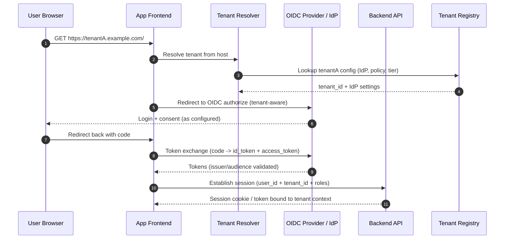

# Adapting a Single-Tenant System to Multi-Tenancy

## Executive summary

Adapting an existing single-tenant system to multi-tenancy is primarily an **isolation and governance** problem—not just a database refactor. Multi-tenancy forces every layer (identity, authorization, data access, caching, background jobs, observability, CI/CD, and incident response) to become explicitly **tenant-aware**; otherwise, the system risks cross-tenant data exposure and “noisy neighbor” instability. citeturn5search2turn0search4turn0search13

A rigorous, scalable direction for an initially unspecified system is to design around a **hybrid “bridge” approach**: run most tenants on pooled/shared infrastructure for cost and agility, while supporting “graduation” paths to stronger isolation (separate schema or separate database/instance) for tenants with high scale, strict compliance, or premium SLAs. This maps directly to the silo/pool/bridge framing in the entity["company","Amazon Web Services","cloud services provider"] SaaS guidance and is a common way to reconcile cost efficiency with isolation requirements. citeturn7view1turn7view2turn0search3

Two practical implications should be treated as early, non-negotiable design constraints:

1. **Changing tenancy model later is often costly** (schema and query changes, data migration complexity, operational tooling). This is explicitly flagged in Microsoft’s multitenant SQL tenancy guidance and is broadly consistent with real-world migrations. citeturn7view0turn0search13  
2. **Operational complexity rises sharply as isolation increases**, especially around per-tenant restore/DR, monitoring, schema management, and routing correctness. Microsoft’s tenancy model criteria explicitly call out “restoring a tenant” and DR as decision factors. citeturn7view0

A defensible migration strategy—given no assumed tech stack—is to implement tenant identity and enforcement primitives first (tenant resolution, tenant-scoped authZ, tenant-scoped data access and caches), then perform data migration using a **parallel change / expand–migrate–contract** pattern, combined with progressive rollout and strong rollback levers (feature flags, canary, deployment rollback). citeturn3search0turn3search5turn3search1turn3search10

## Framing and decision criteria

Multi-tenancy introduces a new first-class dimension into system correctness and security: **the tenant context**. The core problems are:

- **Isolation correctness:** ensuring tenant A cannot read or mutate tenant B’s data across APIs, queues, caches, search indexes, logs, object storage, and admin tools. OWASP highlights broken object-level authorization as a leading API risk class (it maps cleanly onto cross-tenant ID guessing and unsafe “get-by-id” endpoints). citeturn5search2turn5search6  
- **Performance fairness:** pooled systems must prevent a single tenant from consuming disproportionate compute/storage/IO and degrading others (“noisy neighbors”). Kubernetes multi-tenancy guidance explicitly calls out security, fairness, and noisy neighbors as key challenges when sharing clusters. citeturn0search4turn0search1turn0search11  
- **Operational separability:** as soon as you have multiple tenants, customers and internal operators commonly expect tenant-scoped capabilities (restore tenant X, audit tenant X, freeze tenant X, export tenant X, isolate tenant X). Operational complexity is a primary factor in tenancy model choice. citeturn7view0turn7view2  
- **Compliance posture:** some tenants will require stricter guarantees (data residency, encryption key separation, audit evidence, incident notifications). AWS guidance notes that compliance and regulatory constraints can push customers away from pooled infrastructure and that blast radius differs between pooled and silo models. citeturn7view2turn7view1

A practical decision framework, derived from the official tenancy-pattern criteria and multi-tenancy operational guidance, is to score each model along:

- tenant count and workload variability,  
- isolation requirements (data + performance + compliance),  
- customization needs,  
- operational maturity and automation capability,  
- unit economics (baseline vs premium tiers). citeturn7view0turn7view1turn7view2

## Tenancy models and isolation architecture

### Comparison table of tenancy models

The table below compares the three database-level models you requested. The “pool/silo/bridge” terminology aligns with AWS’s SaaS framing; the decision criteria and operational considerations align with Microsoft’s tenancy model guidance. citeturn7view1turn7view2turn7view0

| Tenancy model | Data placement | Pros | Cons | Complexity | Relative cost | Recommended use cases |
|---|---|---|---|---|---|---|
| **Shared schema** (pooled) | One DB, one schema; all tenants share tables; rows carry tenant identifier | Best economies of scale; simplest provisioning; easiest to run migrations once; highest infra utilization | Highest blast radius and strongest need for correctness guardrails; harder tenant-level restore; higher risk if tenant scoping is missed; noisy-neighbor risk | Medium–High (app + tooling complexity) | Lowest marginal cost per tenant | Many small/medium tenants; standardized product; frequent schema iteration; strong need for operational agility |
| **Separate schema** (often “bridge”) | One DB instance; schema per tenant (or per tenant class) | Improved logical separation; easier per-tenant export/restore than pooled rows; can apply per-tenant schema overrides (controlled) | Schema sprawl; migration orchestration becomes harder; connection routing and pool management more complex | High | Medium | Tenants with moderate scale or customization demands; regulated but not requiring fully dedicated DB; “tenant tiering” path before full silo |
| **Separate database/instance** (silo) | DB per tenant (or per tenant group); possibly separate compute/storage | Strongest data isolation and blast radius reduction; easier per-tenant restore and DR isolation; can offer customer-specific residency and key separation | Highest ops overhead; harder to keep all tenants on same version without automation; more infrastructure and monitoring artifacts | Very High (requires strong automation) | Highest | Enterprise / regulated tenants; strict residency; customer-managed keys; high-scale tenants; contractual restore/RTO requirements |

Key nuance: in serious SaaS systems, the “bridge” pattern typically emerges naturally—some layers are pooled (identity, control plane), while certain services or data stores become siloed for a subset of tenants based on tier, compliance, or noisy-neighbor risk. citeturn7view1turn7view2

### Isolation levels that must be designed explicitly

Multi-tenancy is not “just data isolation.” A robust design treats isolation as four orthogonal layers:

- **Data isolation:** row-level (tenant_id), schema-level, or database/cluster-level separation; includes backups, exports, indexes, and caches. Base tenancy decisions primarily affect this layer. citeturn7view0turn0search5turn0search2  
- **Compute isolation:** fairness and blast radius for CPU/memory/IO-intensive work. Kubernetes recommends controls like per-namespace quotas and limits for shared clusters. citeturn0search4turn0search1turn0search11  
- **Network isolation:** preventing unintended tenant-to-tenant or tenant-to-control-plane communication paths. Kubernetes NetworkPolicies provide L3/L4 traffic control primitives (where supported by the CNI). citeturn4search0turn4search13  
- **Configuration isolation:** per-tenant feature flags, per-tenant integrations/SSO, per-tenant throttles/limits, and per-tenant secrets; must remain consistent with the tenant context and be auditable. Feature-flag systems are often used to decouple “deploy” from “release” and provide kill switches. citeturn3search10turn3search3

image_group{"layout":"carousel","aspect_ratio":"16:9","query":["SaaS pool silo bridge multi-tenant architecture diagram","shared database schema-per-tenant database-per-tenant comparison diagram","PostgreSQL row level security multi-tenant diagram","Kubernetes multi-tenancy namespaces resource quota network policy diagram"],"num_per_query":1}

### Sample database schema changes and tenant-scoped SQL

Below are representative patterns you can adapt to your stack. The most important invariant is: **every write and read must be tenant-scoped by construction**, and ideally the database enforces scoping so application bugs fail safe.

#### Shared schema with tenant identifier (relational baseline)

A common baseline is to add `tenant_id` to every tenant-owned table and use a composite primary key to avoid accidental cross-tenant collisions.

```sql
-- Example: projects table, shared schema
ALTER TABLE projects
  ADD COLUMN tenant_id uuid NOT NULL;

-- Optional but often recommended: make IDs tenant-scoped
ALTER TABLE projects
  DROP CONSTRAINT projects_pkey,
  ADD PRIMARY KEY (tenant_id, project_id);

-- Ensure query performance for tenant filters
CREATE INDEX projects_tenant_id_idx ON projects (tenant_id);
```

If using Postgres, Row Level Security (RLS) can enforce tenant isolation at the database level, using policies defined by `CREATE POLICY` and enabled per table. citeturn0search5turn0search2

#### Postgres Row Level Security (defense-in-depth)

The following pattern uses a per-connection/session tenant context (set by the app) and a policy that restricts rows to that tenant. This approach is described in AWS guidance for multitenant PostgreSQL and aligns with Postgres’ RLS feature model. citeturn0search2turn0search5

```sql
-- 1) Enable RLS on table
ALTER TABLE projects ENABLE ROW LEVEL SECURITY;

-- 2) Create policy using tenant context stored in session
CREATE POLICY tenant_isolation_policy ON projects
USING (tenant_id = current_setting('app.current_tenant')::uuid);

-- 3) On each request (or checkout from pool), the app sets:
--    (do NOT trust a client header directly; derive via validated auth/tenant resolution)
SET LOCAL app.current_tenant = 'aaaaaaaa-bbbb-cccc-dddd-eeeeeeeeeeee';
```

Operational note: if you use connection pooling, `SET LOCAL` (transaction-scoped) reduces the risk of “tenant context leaking” between requests; request handlers must ensure every transaction sets the tenant context before accessing tenant tables. This is a correctness requirement implied by session-driven enforcement. citeturn0search2turn0search5

#### Separate schema per tenant (schema routing)

Schema-per-tenant replaces row policies with routing + schema selection. A common technique is to set `search_path` (Postgres) or set database/schema context per connection.

```sql
-- Provision tenant schema
CREATE SCHEMA t_12345;

-- Create tables within tenant schema (migrations must run per tenant schema)
CREATE TABLE t_12345.projects (
  project_id uuid PRIMARY KEY,
  name text NOT NULL,
  created_at timestamptz NOT NULL DEFAULT now()
);

-- Route per request (Postgres):
SET LOCAL search_path = t_12345, public;
SELECT * FROM projects WHERE project_id = '...';
```

This can simplify tenant export/restore boundaries but increases migration and routing complexity—an operational criterion explicitly covered in Microsoft’s tenancy model discussion. citeturn7view0

#### Tenant scoping in application queries (minimum viable safety)

Even if you enable DB-level enforcement, your **application query shape** should be tenant-scoped to avoid surprising performance failures and to keep logic portable across engines:

```sql
-- Minimum viable tenant scoping: always constrain by tenant_id
SELECT project_id, name
FROM projects
WHERE tenant_id = :tenant_id
  AND project_id = :project_id;
```

This also helps align with OWASP’s emphasis that object-level access checks belong in every function that dereferences an ID. In multi-tenancy, “object-level access” almost always includes “belongs to tenant.” citeturn5search2turn5search6

## Authentication, authorization, and tenant context propagation

### Required conceptual changes to auth

In a single-tenant system, authentication answers “who is the user?” In multi-tenancy, auth must reliably answer “**who is the user, and for which tenant context are they operating?**” That tenant context must then be enforced consistently across the system.

A standards-aligned baseline uses OAuth 2.0 for delegated authorization and OpenID Connect (OIDC) for authentication, with bearer tokens handled as described in OAuth bearer token guidance. citeturn1search0turn1search1turn5search3

Enterprise requirements commonly add:

- SSO via SAML 2.0 (still widely deployed for enterprise identity federation). citeturn1search10  
- Automated provisioning via SCIM (user/group lifecycle synchronization). citeturn1search2turn1search6  

To make these tenant-aware, the system must define a **tenant identity model**:

- Tenant has one or more trusted identity providers (IdPs) and authentication methods.  
- Users can belong to one or multiple tenants (B2B SaaS commonly supports this).  
- Every authenticated principal has a “current tenant” (active tenant) for each request, which must be determined and validated.

### Tenant resolution patterns and their security posture

Common patterns (often combined) include:

- **Host/subdomain-based**: `tenantA.example.com` ⇒ tenantA. Strong because it is implicit in routing and easier to enforce consistently at the edge.  
- **Path-based**: `/t/{tenantId}/...` (more explicit, can be noisy).  
- **Token-claim-based**: tenant in access token claims; must be validated against issuer/audience and against server-side tenant membership. OIDC defines claims and the general model of identity-as-claims. citeturn1search1turn1search9  
- **Header-based**: `X-Tenant-Id`; generally weaker unless the header is derived from trusted edge logic (never treat a user-supplied tenant header as authoritative without validation).

The safest operational model is: **resolve tenant at the edge, validate it against user membership and token claims, then propagate it as trusted internal context** (request context + DB session variable + telemetry attributes). This framing is consistent with AWS’s discussion that identity connects directly to isolation policies. citeturn7view2turn7view1

### Authorization changes: tenant-aware RBAC and scoping

A practical tenant-aware authorization model typically combines:

- **Tenant membership & roles** (RBAC): roles are defined per tenant, and role assignments are tenant-scoped.  
- **Tenant scoping in every data access**: both “object belongs to tenant” and “role permits action” must hold. OWASP’s Broken Object Level Authorization risk explicitly emphasizes per-object access checks whenever IDs are used. citeturn5search2turn5search6  
- **Optional ABAC**: policies that depend on attributes (tenant tier, region, data classification) often emerge as the system grows.

### Mermaid auth flow diagrams

#### Tenant-aware OIDC login and session establishment



This flow relies on OIDC’s authentication layer over OAuth 2.0 and then binds the authenticated user to a tenant context that becomes enforceable in APIs. citeturn1search1turn1search0turn5search3

#### Tenant-scoped API request with enforcement and DB isolation

```mermaid
sequenceDiagram
  autonumber
  participant C as Client
  participant GW as API Gateway
  participant AS as AuthZ Service
  participant APP as Application Service
  participant DB as Database

  C->>GW: GET /projects/123 (Authorization: Bearer ...)
  GW->>GW: Validate token (issuer, audience, expiry)
  GW->>AS: Resolve+validate tenant & roles (membership)
  AS-->>GW: tenant_id + role grants
  GW->>APP: Forward request with trusted tenant context
  APP->>DB: Begin TX; SET LOCAL app.current_tenant = tenant_id
  APP->>DB: SELECT ... FROM projects WHERE project_id=123
  DB-->>APP: Rows filtered by RLS / tenant scope
  APP-->>C: 200 OK (tenant-safe response)
```

Bearer token handling guidance stresses that bearer tokens must be protected in transport and storage because any holder can use them; multi-tenant systems should treat token theft as potentially cross-tenant impact unless tenant scoping is enforced. citeturn5search3turn1search0turn0search5turn0search2

## Data partitioning and zero-downtime migration strategy

### Data partitioning and migration mechanics

A single-tenant system often has implicit assumptions:

- IDs are globally unique without tenant namespace,  
- caches don’t include tenant in keys,  
- background jobs read “all data,”  
- audit logs don’t label tenant reliably.

Multi-tenancy requires making these assumptions explicit and safely evolvable.

A widely-used approach to evolving schemas and interfaces without downtime is **parallel change** (also called expand-and-contract): introduce backward-compatible additions, migrate gradually, then remove old paths. citeturn3search0turn3search4

### A canonical expand–migrate–contract plan for tenant identifiers

**Expand phase (backward compatible)**  
- Add `tenant_id` columns (nullable initially if required), add indexes, add tenant registry and routing logic, and begin emitting tenant-aware telemetry attributes.  
- Add “dual-read” capability where services can read both old and new shapes (for a limited migration window). citeturn3search0turn6search3turn1search3  

**Migrate phase (progressive backfill + dual-write)**  
- Backfill tenant IDs using a deterministic mapping (e.g., if you already have a natural tenant boundary like `account_id`, map it to a tenant registry entry).  
- Introduce controlled dual-write so new writes always populate tenant_id while the system still tolerates old records.  
- Enforce scoping in query paths first in “monitor mode” (log violations), then in “hard fail” mode. citeturn3search0turn5search2turn0search13  

**Contract phase (remove legacy assumptions)**  
- Make tenant_id non-null with constraints, turn on strict DB enforcement (where available), delete/rename old columns, remove dual-read/dual-write, and permanently require tenant context. citeturn3search0turn0search5turn0search2  

### Zero-downtime migration flowchart

```mermaid
flowchart TD
  A[Inventory data + APIs + jobs + caches] --> B[Define tenant model + tenant registry]
  B --> C[EXPAND: add tenant_id + routing + telemetry labels]
  C --> D[Ship tenant-aware authZ + request context propagation]
  D --> E[Enable dual-read paths + monitoring for tenant leaks]
  E --> F[MIGRATE: backfill tenant_id in batches]
  F --> G[MIGRATE: dual-write new tenant-scoped writes]
  G --> H[Turn on DB enforcement (RLS/policies) for migrated tables]
  H --> I[Canary tenants + progressive rollout]
  I --> J{Any tenant leak or SLO breach?}
  J -->|Yes| K[Rollback lever: feature flag / routing cutback / deployment rollback]
  J -->|No| L[CONTRACT: remove legacy paths + constraints non-null]
  L --> M[Finalize: tenant-level ops tooling + restore drills]
```

This structure aligns with parallel change’s “expand, migrate, contract” phases and combines it with rollout safety mechanisms (canary and rollback). citeturn3search0turn3search9turn3search1turn3search10

### Choosing between tenant_id backfill vs tenant split migration

If you currently have **one customer** (or very few) in a single-tenant system, you can sometimes treat the original tenant’s data as “tenant 1” and then only enforce tenant_id for subsequent tenants. However, once you have multiple tenants or need strong tenant-level operations, full backfill and enforcement is safer to avoid edge cases (especially around “system tables,” caches, and background jobs). The operational criteria stressing restore/DR and schema management strongly favor correctness here. citeturn7view0turn0search13

## Resource allocation, scaling, and operational impacts

### Per-tenant resource allocation and noisy-neighbor mitigation

In shared compute, noisy neighbor control is not optional: it is a primary reason pooled systems fail in production.

If you run workloads on Kubernetes, cluster multi-tenancy guidance emphasizes the need to manage fairness and noisy neighbors, and Kubernetes provides standard knobs:

- **Namespaces** as a scoping boundary for many objects. citeturn4search13turn0search4  
- **ResourceQuota** and **LimitRange** to bound CPU/memory/storage consumption per namespace. citeturn0search1turn0search11  
- **NetworkPolicy** to restrict tenant-to-tenant traffic paths (when supported by your networking plugin). citeturn4search0  
- **HPA** to scale workloads based on metrics (global or tenant-sharded worker fleets). citeturn4search3turn4search16  

Even without Kubernetes, the control-plane principles map to: per-tenant quotas, per-tenant concurrency pools, per-tenant rate limits, per-tenant job scheduling fairness.

### Monitoring, logging, and tenant-aware observability

Multi-tenancy changes observability from “debug the service” to “debug *service × tenant*,” and it also changes compliance posture (auditability often becomes tenant-scoped).

A tractable approach is to:

- propagate tenant_id in request context (but not as an untrusted client-controlled field),  
- attach tenant_id to telemetry as a consistent attribute,  
- standardize logs/metrics/traces export through OpenTelemetry.

OpenTelemetry’s context propagation model and OTLP specification describe standard mechanisms for carrying and exporting telemetry across services and collectors. citeturn1search15turn1search3turn6search9  
OpenTelemetry semantic conventions define how to represent resource and deployment attributes consistently, improving cross-service correlation. citeturn6search3turn6search6turn6search17

Operationally, a multi-tenant system usually needs:

- tenant-scoped dashboards (error rate, latency, saturation per tenant),  
- tenant-scoped audit logs,  
- tenant-scoped rate-limit and quota observability,  
- “tenant isolation breach” alerts (e.g., detecting cross-tenant IDs in access logs).

### Billing and chargeback (metering)

If you plan per-tenant billing or internal chargeback, you need a consistent tenant attribution model across:

- request volume, storage consumed, background job minutes, and outbound egress,  
- and (if in public cloud) underlying infrastructure costs.

Cloud-provider-native tagging/labeling systems are frequently used to map infra cost to tenants:

- AWS cost allocation tags. citeturn6search0turn6search12  
- Azure cost allocation with tags. citeturn6search1turn6search4  
- Google Cloud resource labels forwarded into billing reports. citeturn6search2  

This doesn’t remove the need for application-level metering; it supplements it. AWS explicitly notes that attributing consumption is more challenging in pooled models and requires extra instrumentation by the SaaS provider. citeturn7view2turn7view1

### Backup/restore and disaster recovery implications

Backup/restore is one of the clearest operational differentiators across tenancy models. Microsoft’s tenancy model criteria explicitly include “restoring a tenant” and disaster recovery as core evaluators. citeturn7view0

Analytically:

- **DB-per-tenant** typically makes tenant restore/clone simpler (restore one database).  
- **Schema-per-tenant** enables targeted schema restore in some setups, but still relies on operational tooling to extract/restore schema objects consistently.  
- **Shared schema** often makes tenant restore hardest, because restoring a tenant means reconstructing tenant rows across many tables while preserving referential integrity and avoiding cross-tenant impact.

Because tenant restore is often contractual for enterprise customers, many systems adopt a bridge strategy: pooled for standard tiers, siloed (or schema-per-tenant) for premium tiers that require tenant-scoped restore semantics. citeturn7view2turn7view0

## Security, compliance, rollback, and incident response

### Encryption and key management

At-rest encryption is a baseline expectation; multi-tenancy adds key-separation pressure:

- pooled tiers often use platform-managed encryption with shared KEKs (with access controls),  
- premium tiers often require per-tenant keys, rotation guarantees, and sometimes customer-managed keys.

For cryptographic primitives and governance, authoritative references include:

- AES is standardized in entity["organization","NIST","us standards laboratory"] FIPS 197. citeturn2search0turn2search16  
- Key lifecycle guidance is covered in NIST SP 800-57 Part 1 (definitions, best practices, and management expectations). citeturn2search5turn2search1  

A rigorous multi-tenant design typically requires:

- documented key hierarchy (data keys ↔ key encryption keys),  
- rotation policies and operational procedures,  
- audit logs around key usage and access (especially for premium tiers). citeturn2search5turn2search1  

### Compliance and data residency

Data residency is usually a mix of regulatory and contractual constraints (e.g., “data must remain in region X”). AWS’s tenant isolation guidance explicitly notes compliance pushback against pooled models and that some portions of a system may need siloing (bridge model) to satisfy such constraints. citeturn7view2turn7view1

If you operate in or sell to Europe, the GDPR is a common driver for stricter governance and evidence; a convenient rendering that links to the official text is available (but it may not always be accessible via automation on the official portal). citeturn2search10

### Tenant-aware rollback mechanisms

Rollback must be considered across three planes:

- **Deployment rollback:** If running Kubernetes Deployments, rolling updates and rollback tooling are standard (e.g., `kubectl rollout undo`). citeturn3search1turn3search9turn3search5  
- **Feature rollback (kill switches):** feature flags allow disabling tenant-specific behaviors without redeploying. AWS AppConfig and Azure App Configuration both explicitly describe managing feature flags separately from code to adjust behavior and reduce risk during rollouts. citeturn3search10turn3search3turn3search2  
- **Data rollback:** this is the hardest and is why expand/migrate/contract patterns—and minimizing destructive migrations until late—matter. Parallel change explicitly exists to reduce risk for backward-incompatible changes. citeturn3search0turn3search4  

### Incident response and multi-tenant blast radius control

Multi-tenancy changes the incident model: the same bug can now affect **multiple customers simultaneously**, especially in pooled systems. AWS notes pooled blast radius risks and the need for deeper resilience measures because outages can impact all tenants. citeturn7view2

Two best-practice implications:

- Define explicit “tenant containment” controls: disable a tenant, throttle a tenant, isolate a tenant to a worker pool, or force a tenant into read-only mode.  
- Make incident response evidence tenant-scoped and repeatable (audit logs, tenancy-safe reproduction).

For incident governance, SRE guidance recommends using error budgets to govern release velocity and requiring postmortems for major incidents; this is a fit-for-purpose practice when multi-tenancy increases blast radius. citeturn5search0turn5search1

## Migration plan timeline, cost trade-offs, and MVP checklist

### Migration plan timeline with milestones, effort, and rollback points

The timeline below is intentionally stack-neutral. “Effort” is relative (Low/Med/High) and assumes you are evolving a production system with existing customers and a non-trivial data model.

| Phase | Milestone | What “done” means | Effort | Primary rollback point(s) |
|---|---|---|---|---|
| Discovery | Tenant model + tenancy decision | Tenant definition, tenant resolution strategy, tenancy model choice (and tiering plan), data classification, and operational requirements (restore/DR) documented | Med | Not applicable (planning artifact) |
| Foundations | Tenant registry + tenant context propagation | Tenant registry exists; every request has a validated tenant context; tenant_id appears in logs/metrics/traces; key services reject “missing tenant” | High | Feature flag to disable tenant routing and revert to single-tenant routing |
| AuthN/AuthZ | Tenant-aware auth + SSO hooks + RBAC | OIDC/OAuth flow supports tenant-aware login; tenant membership validated; RBAC roles are tenant-scoped; SCIM/SAML integration points defined (even if not fully implemented) | High | Route subset of tenants to legacy auth path; disable new tenant claim enforcement |
| Data layer expand | Add tenant_id columns + indexes | Schema is extended (backward compatible), no downtime; tenant_id exists on new writes; performance verified for tenant-filtered queries | High | Deploy rollback + keep old code path; do not enable enforcement yet |
| Migration | Backfill tenant_id + dual-write | Backfill is complete with verification; dual-write is enabled; no cross-tenant reads observed in monitoring | High | Stop dual-write; block new tenants; revert to pre-migration version |
| Enforcement | Enable strict tenant enforcement | DB policies/constraints enabled (where applicable); “tenant missing” becomes hard error; caches/indexes are tenant-scoped | Med–High | Feature flag to turn off enforcement; rollback deployment; disable RLS enablement per table (if staged) |
| Rollout | Canary tenants + progressive rollout | Tenants are onboarded progressively; SLOs remain healthy; “tenant containment” tooling works | Med | Canary rollback via deployment rollback + feature flags; tenant-by-tenant cutback |
| Contract | Remove legacy paths | Old columns/assumptions removed; legacy routes disabled; tenant-aware operations (restore/export) documented | Med | Keep contract changes late; rollback to previous build if needed (Kubernetes rollback tooling) |

Deployment rollback and rollout controls are well-supported in Kubernetes (rollout undo) and feature-flag platforms (AppConfig/App Configuration) are commonly used as kill switches across tenant rollouts. citeturn3search1turn3search9turn3search10turn3search3

### Cost analysis and trade-offs

A rigorous cost analysis should separate:

1. **Direct infrastructure cost per tenant** (storage, compute, network).  
2. **Operational cost** (automation, migrations, monitoring artifacts, restore drills, incident load).  
3. **Risk cost** (blast radius, compliance friction, sales friction, churn risk).

Official guidance supports two core trade-offs:

- pooled models provide economies of scale but can increase blast radius risk and make consumption attribution harder without additional instrumentation; AWS explicitly discusses attribution and blast radius concerns in pooled environments. citeturn7view2turn7view1  
- higher isolation models increase operational complexity, including restoring a tenant and disaster recovery; Microsoft’s tenancy model criteria explicitly include these as decision factors. citeturn7view0  

In practice, this tends to produce tiered offerings (standard tier pooled, premium tier more isolated), consistent with AWS’s discussion of tier-based isolation in bridge strategies. citeturn7view2

### Prioritized MVP checklist for an initial multi-tenant rollout

This checklist is designed for a minimal-but-safe multi-tenant MVP—focused on correctness and containment. Items are ordered by risk reduction and dependency constraints.

| Priority | Area | Task | Acceptance criteria |
|---|---|---|---|
| P0 | Tenant identity | Define tenant resolution contract (host/path/token) and implement tenant registry | Every request resolves a tenant deterministically; mismatches are rejected |
| P0 | AuthZ | Tenant-scoped RBAC and membership validation | No endpoint can access tenant-owned data without verifying tenant membership (OWASP BOLA guardrail) citeturn5search2 |
| P0 | Data access | Enforce tenant scoping in every query path (and in caches) | Static analysis/tests ensure tenant_id filters exist; cache keys include tenant |
| P0 | Data model | Add tenant_id to core tables + indexes (expand phase) | New writes always include tenant_id; tenant-filtered queries meet latency targets |
| P0 | Observability | Tenant-labeled logs/metrics/traces via OpenTelemetry | Tenant_id appears as a standard attribute; traces propagate context; OTLP exporter works citeturn1search3turn6search3turn1search15 |
| P0 | Safety controls | Tenant kill switch + rate limits/quotas | You can disable a tenant or throttle it without redeploying; quotas prevent noisy-neighbor incidents citeturn0search1turn0search4 |
| P1 | Data migration | Backfill tenant_id + reconciliation tooling | Backfill jobs are restartable and verified; migration metrics prove completeness |
| P1 | DB enforcement | Enable DB-level isolation where supported (e.g., RLS in Postgres) | Cross-tenant queries are blocked even if application code is buggy citeturn0search5turn0search2 |
| P1 | CI/CD | Canary rollouts per tenant tier + rollback automation | Rollbacks are repeatable (deployment rollback + feature flag disable) citeturn3search1turn3search3turn3search10 |
| P1 | Backup/restore | Document tenant-scoped restore approach for MVP | At minimum: export and restore procedure defined for pilot tenants (even if manual) citeturn7view0 |
| P2 | Compliance | Define tier-based isolation + key management posture | Premium isolation path exists (bridge → silo) with key-management documentation citeturn7view2turn2search5 |
| P2 | Enterprise readiness | SCIM provisioning + SAML SSO (as needed) | Provisioning/SSO works per tenant; audit evidence exists for identity lifecycle citeturn1search2turn1search10 |

This MVP set deliberately front-loads tenant context correctness, tenant-scoped authorization, and tenant-scoped observability because pooled models amplify blast radius and multi-tenancy makes authorization failures disproportionately severe. citeturn7view2turn5search2turn0search4