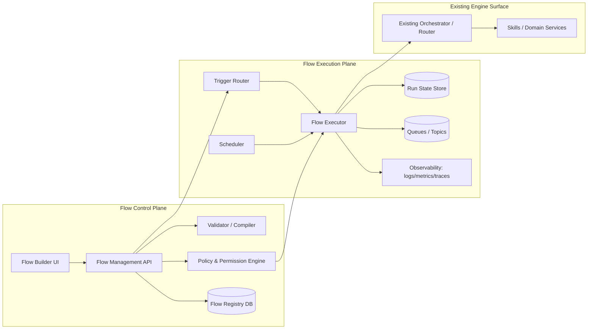
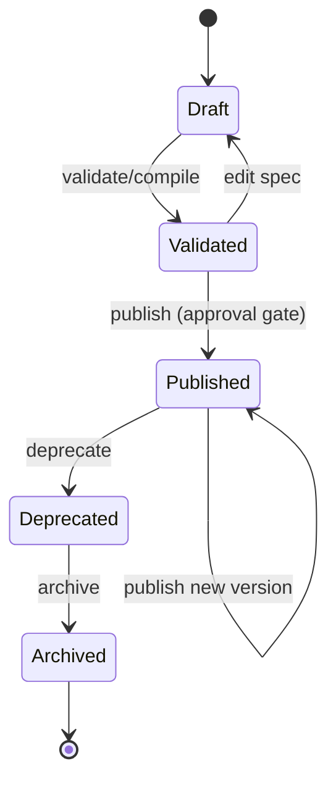
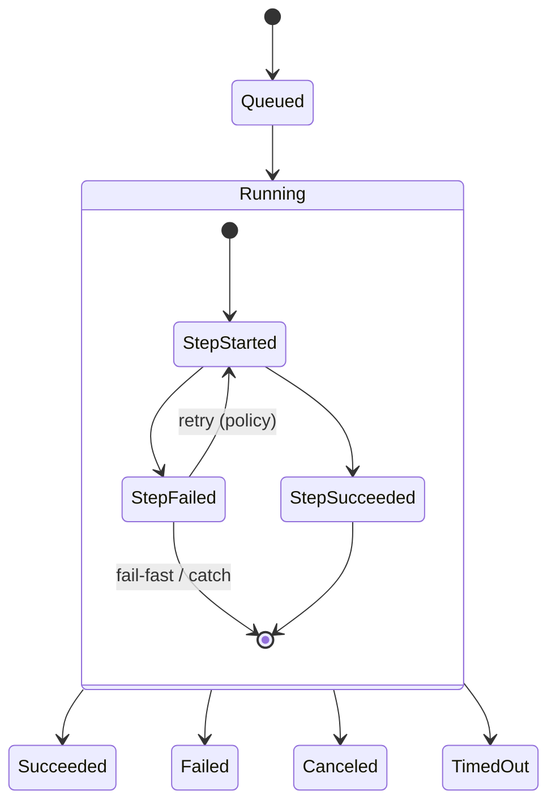
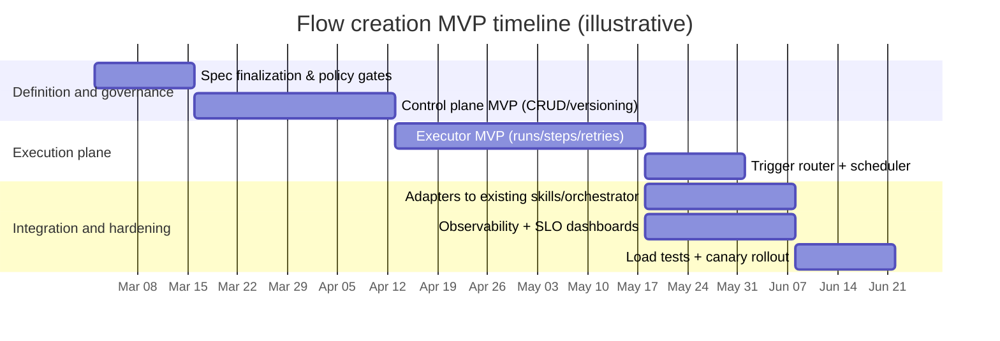

# Extending the Existing Engine to Support Flow Creation

## Executive Summary

The available **20-\*** project documents show a consistent architectural direction: complex platform behaviors are expressed as **multi-step workflows** that span an API edge (auth, validation, quotas), a planner/orchestration layer, a policy/permissions engine, and downstream domain services—plus event-driven integrations such as webhooks and measurement pipelines. fileciteturn0file0L5-L16 fileciteturn0file0L19-L115 fileciteturn0file1L28-L111

A **flow-creation capability** (as an engine extension) should therefore be designed as a **control plane + execution plane**:

- A **Flow Control Plane** to create, validate, version, review, publish, and govern flow definitions (including who can author/publish, what triggers are allowed, and what actions/skills/connectors can be invoked). fileciteturn0file1L28-L111  
- A **Flow Execution Plane** to run those flows reliably and observably, supporting state machines/DAGs, retries/timeouts, idempotency, audit logs, and safe degradation for latency-sensitive request paths like “feed request”–class flows. fileciteturn0file0L60-L90 fileciteturn0file1L236-L256

Because flows can expose sensitive business operations, the design must treat security as first-order: object- and property-level authorization, hard limits on resource consumption, and specific protections for high-value business flows are emphasized in the API security canon. citeturn0search0turn0search1turn0search2turn10search0

**Key recommendation:** implement a declarative flow specification aligned with widely-deployed workflow/state-machine concepts (Tasks, Choices, Parallel/Map, Fail/Succeed, retries/timeouts), and gate flow actions behind explicit policy + allowlists. This aligns with established state-machine languages (e.g., structured JSON definitions with explicit states and transitions). citeturn6search0turn6search1

**Coverage limitation (explicit):** only two **20-\*** documents were available in the current workspace. A complete “20-\* → requirements” traceability table can be generated once the remaining documents (and the project’s “basic prompt”) are provided in accessible project sources. fileciteturn0file0L1-L16 fileciteturn0file1L1-L111

## Evidence Base and Interpretation of Flow Creation

### What the current 20-\* evidence implies about “flows”

Across the provided documents, “flows” are described as end-to-end operational sequences such as:

- Graph-style request handling that includes gateway validation, planning/federation, and permission filtering. fileciteturn0file0L19-L75 fileciteturn0file1L28-L111  
- Sponsored insertion into a feed request with downstream measurement/reporting steps (a latency-sensitive orchestration problem). fileciteturn0file0L60-L90 fileciteturn0file1L236-L256  
- Webhook subscription delivery with retries and idempotency-type requirements. fileciteturn0file0L92-L115 fileciteturn0file1L96-L104  

The short “20 - sponsored content and graph api.md” document also explicitly maps these orchestrations onto an existing engine concept, naming a “Flow Orchestrator” as an integration point that merges streams and coordinates services. fileciteturn0file1L319-L323

### Operational definition used in this report

In this report, **flow creation** means:

- creating and maintaining **declarative workflow definitions** (graphs/state machines) that orchestrate existing engine “skills/services”, and
- running them in production with **governance, safety, and observability** equivalent to the platform’s other public-edge capabilities (auth, quotas, versioning, auditability). fileciteturn0file1L28-L111

This interpretation is consistent with the documents’ emphasis on: an API gateway layer, a query planner/federation/orchestration layer, a permission engine, webhooks/events, and end-to-end operational maturity. fileciteturn0file0L5-L16 fileciteturn0file0L117-L210

## Consolidated Functional Requirements and Nonfunctional Constraints

### Functional requirements

**Flow definition authoring and lifecycle**

Flow creation must support a full lifecycle: draft creation, iterative edits, validation, review/approval (where required), publish, deprecate, archive, and controlled rollback to a prior version. This is required to safely evolve “platform-class” orchestration surfaces without breaking dependent integrations. fileciteturn0file1L28-L42 citeturn4search1turn4search2

**Flow primitives**

At minimum, the flow model should support:

- **Tasks** (invoke a skill/service/action),  
- **Choices/conditions** (branching),  
- **Parallelism** (parallel branches),  
- **Map/loop** (iterate over collections),  
- **Wait/timers**,  
- **Terminal states** (succeed/fail), plus
- **retry and timeout policy** (per step and per flow).  

These primitives closely match widely used state-machine workflow constructs documented in structured workflow languages (e.g., explicit state types, transitions, terminal states). citeturn6search0turn6search1

For job/DAG-style workloads, support for DAG dependencies (“run B and C after A, then D”) should be supported either directly or via compilation. DAG workflow patterns are an established model for maintainable parallel orchestration. citeturn5search1turn5search11

**Triggers**

Flows must start from multiple trigger classes (some synchronous, some asynchronous):

- **HTTP/API trigger** (request/response flows; must support strict latency budgets and fallbacks), consistent with the documents’ request-path flows. fileciteturn0file0L23-L75  
- **Event trigger** (internal domain events and/or external events), consistent with webhook/subscription workflows. fileciteturn0file0L92-L115  
- **Scheduled trigger** (cron/interval), a standard workflow feature in common engines. citeturn5search0turn5search1  
- **Manual trigger** (operator initiated), needed for ops recoveries, replays, and migrations. citeturn12search1  

**User roles and governance**

Flow creation is a “sensitive business flow” in itself and must be protected as such (not only technically, but also procedurally). citeturn10search0  
A practical role model:

- **Flow Author**: create/edit drafts; cannot publish to production by default.  
- **Flow Reviewer/Approver**: approve and publish; enforce policy gates.  
- **Flow Operator**: view runs, retry/cancel, manage incidents; cannot edit definitions.  
- **Flow Viewer/Auditor**: read-only access to definitions and run history.  
- **System/Service identities**: run-time principals used for step execution and service-to-service calls, bound to scoped capabilities.

This mirrors the documents’ repeated emphasis on permissions/scopes and access checks “at every node/field/edge” in platform APIs. fileciteturn0file1L58-L80 citeturn0search0turn0search1

**Data models**

Required data models include:

- **FlowDefinition** (stable identity and metadata: owner, org/tenant, tags, current published version, status)  
- **FlowVersion** (immutable spec snapshot: version number, status, spec JSON, compiler version, created_by, created_at)  
- **FlowSpec graph**: nodes (steps), edges (transitions), trigger definitions, and referenced integrations/secrets  
- **FlowRun** (an execution instance: input, status, timestamps, correlation IDs, outcome)  
- **StepRun** (per-step attempt history: retries, error codes, timings, outputs)

A schema language such as JSON Schema is appropriate for defining and validating these JSON-based specs and payloads, with clear dialect versioning and compatibility management. citeturn3search0turn3search1

**State transitions**

Two separate state machines are required:

- **Definition lifecycle** (Draft → Validated → Published → Deprecated/Archived).  
- **Execution lifecycle** (Queued → Running → Succeeded/Failed/Canceled/TimedOut, with per-step retries and partial outcomes).

This aligns with established state-machine workflow approaches where start states, transitions, and terminal states are explicit. citeturn6search1

**Error handling and resilience**

Flow execution must support:

- per-step retry policies (max attempts, exponential backoff, jitter),  
- timeouts (step and overall),  
- explicit failure states,  
- dead-lettering / manual intervention for non-retryable failures, and  
- idempotency guidance and/or enforcement for side-effecting actions.

Durable workflow engines commonly depend on replay or event-history reconstruction; where deterministic replay is used, implementations must avoid non-deterministic behavior in “workflow logic” and isolate side effects into activities/actions. citeturn6search5turn6search6

### Nonfunctional constraints

**Security and access control**

Because flows can directly invoke business operations, the API security community highlights:

- broken object-level authorization as a leading class of API risk, requiring server-side checks for every object identifier. citeturn0search0  
- broken object property-level authorization (excessive data exposure/mass assignment), requiring property-level filtering and schema-based validation. citeturn0search1  
- sensitive business flows that must be protected against automation/abuse (rate limits, human verification, anomaly checks). citeturn10search0  

Accordingly, flow creation should enforce:

- **RBAC/ABAC** on who can author/publish/operate flows,  
- **capability allowlists** on what step types and connectors are permitted per tenant/environment,  
- **secrets isolation** (references only; never store raw secrets in FlowSpec),  
- **strong token handling** for any public/API-triggered flow creation surfaces (OAuth 2.0 access patterns and bearer-token hygiene). citeturn0search3turn10search1turn10search2  

If the flow builder is user-facing (browser/native clients), **PKCE** should be used with authorization code flows where applicable. citeturn1search1

If the platform supports third-party developer app workflows, token introspection and revocation endpoints are standard mechanisms for runtime control and cleanup of abandoned tokens. citeturn11search1turn9search0

**API governance, error envelopes, and safe failures**

Use a standardized error envelope for APIs (instead of bespoke formats), with careful security review to avoid leaking sensitive implementation details. citeturn1search2  
For abuse and load shedding, standard rate-limit signaling includes HTTP 429 with optional Retry-After. citeturn8search4

**Performance and scalability**

Flow execution introduces a risk of “fan-out amplification” (one trigger causing many downstream calls). The docs’ existing planner/orchestrator patterns underscore this risk and need for careful caching/timeouts. fileciteturn0file0L23-L75 fileciteturn0file1L84-L92  

At the infrastructure level, horizontal scaling via a controller pattern is commonly used to match demand. citeturn2search1

**Reliability, consistency, and eventing**

For event-driven triggers and outbound integrations, standardizing event metadata improves interoperability. CloudEvents exists specifically to define event data in common formats across systems. citeturn2search0  

To avoid “DB committed but event not published” inconsistencies, transactional outbox patterns exist expressly to keep internal state and emitted events coherent. citeturn7search2  

For high-throughput streaming pipelines where duplicates may occur on retries, idempotent producer behavior and correct configuration requirements are explicitly documented. citeturn7search0turn7search1

**Observability and auditability**

Distributed tracing context propagation should follow the W3C `traceparent`/`tracestate` model to interoperate across services. citeturn3search2turn2search2  

A practical operational stance is to define SLOs and manage release risk with error budgets (a standard SRE approach). citeturn12search0turn12search3  

## Document-to-Requirement Traceability

### Traceability approach

Each source document was treated as “requirements evidence” and normalized into: (a) explicit capabilities, (b) implied constraints, and (c) concrete integration points with the engine. fileciteturn0file0L19-L210 fileciteturn0file1L28-L324

### Mapping table

| 20-\* document | Extracted requirements / design decisions relevant to flow creation | Priority |
|---|---|---|
| `20 - sponsored content and graph api.md` | Flow creation must integrate with an API edge that provides routing/auth/validation, quotas/rate limits, pagination, and versioning (these are governance requirements for any “public” surface that can create or invoke flows). fileciteturn0file1L28-L42 Flow steps must be permission-guarded at fine granularity (node/field/edge metaphor maps to step/action authorization). fileciteturn0file1L58-L80 Trigger types must include webhooks/subscriptions with retries and dedupe. fileciteturn0file1L96-L104 Observability must include audit logs and developer/operator analytics. fileciteturn0file1L107-L111 The existing engine architecture includes (or anticipates) a “Flow Orchestrator” as a coordination point; flow creation should extend it from “hardcoded orchestration” to “authorable definitions.” fileciteturn0file1L319-L323 | P0 |
| `20 - sponsored content and graph api deep search.md` | Multiple complex “platform workflows” (graph read/write, sponsored feed request orchestration, webhook dispatch with retries) are identified as foundational; flow creation should be capable of expressing these workflow shapes declaratively (request/response, event-driven, and delivery/retry loops). fileciteturn0file0L19-L115 The platform direction emphasizes: governed public edge, planning/federation/orchestration, policy decision points for access control, event-driven integration, and operational maturity—each should map to control-plane/execution-plane responsibilities of flow creation. fileciteturn0file0L5-L16 fileciteturn0file0L117-L210 | P0 |

**Gap note:** No additional **20-\*** documents were available in the current workspace, so this table is necessarily incomplete relative to the requested “all 20-\* docs” traceability. fileciteturn0file0L1-L16 fileciteturn0file1L1-L111

## Proposed Architecture and Integration with the Engine

### Architectural overview

The architecture should explicitly split into:

- **Flow Control Plane**: authoring, validation, publishing, governance, RBAC, templates.
- **Flow Execution Plane**: trigger intake, scheduling, state transitions, step execution, run-state persistence, retries/timeouts, observability.

This separation mirrors the documents’ platform split between developer-facing API governance and back-end orchestration/planning and policy enforcement. fileciteturn0file1L28-L92 fileciteturn0file0L117-L210

### Component diagram



### Integration points with the “current engine”

The provided sources imply an existing ecosystem of “skills/services” and a dedicated orchestration layer (explicitly called out as a Flow Orchestrator in the skill map). fileciteturn0file1L319-L323

Recommended integration contract:

- **Executor → Existing Orchestrator**: the executor should invoke skills through a stable internal interface (gRPC/HTTP), preserving existing routing, retries, and service discovery logic. This matches the “planner/federation” patterns described for graph requests and multi-service reads. fileciteturn0file1L84-L92 fileciteturn0file0L23-L75  
- **Permission Engine reuse**: flow steps should be authorized using the same policy decision point concepts already described for node/field/edge access and privacy rules. fileciteturn0file1L74-L80  
- **Webhook/event triggers**: flow triggers should subscribe to internal events and drive outbound webhooks with retries and idempotency keys, consistent with the existing webhook/subscription workflow. fileciteturn0file0L92-L115  
- **Latency-sensitive flows**: for “feed request”–like flows, define explicit timeout budgets and fallbacks (“degrade to organic-only”, “skip expensive edges”), because the sponsored feed insertion flow is explicitly latency-sensitive and failure-amplifying. fileciteturn0file1L236-L256

### Runtime event model recommendation

Adopt a normalized event envelope (e.g., CloudEvents) for trigger intake and emitted “flow.*” events (flow published, run started, run finished, step failed). This reduces bespoke glue and improves event routing portability. citeturn2search0

For durability, publish flow lifecycle and run events using a transactional outbox when they originate from state persisted in the Flow Registry/Run Store, to prevent divergence between stored state and emitted events. citeturn7search2

## API, Storage Schema, and State Machines

### External and internal APIs

A minimal API surface for flow creation should be described with an OpenAPI contract to standardize request/response shape and enable tooling. citeturn4search1turn4search3

Error responses should use Problem Details (standardized machine-readable errors for HTTP APIs), with explicit care to avoid leaking sensitive implementation details. citeturn1search2

#### Endpoint inventory

| Endpoint | Purpose | AuthZ model | Notes |
|---|---|---|---|
| `POST /v1/flows` | Create a new FlowDefinition (draft) | Flow Author role + tenant scope | Treat as sensitive business flow; rate-limit and audit. citeturn10search0turn8search4 |
| `PATCH /v1/flows/{flowId}` | Update metadata (name, description, tags) | Flow Author + owner/tenant | Metadata-only; spec changes go to versions. |
| `POST /v1/flows/{flowId}/versions` | Create a new FlowVersion (draft) | Flow Author | Immutable after publish; store spec JSON + compiler version. |
| `POST /v1/flows/{flowId}/versions/{versionId}:validate` | Validate/compile FlowSpec | Flow Author | Validation should be schema-based (JSON Schema) plus semantic checks. citeturn3search0turn3search1 |
| `POST /v1/flows/{flowId}/versions/{versionId}:publish` | Publish a version | Reviewer/Approver | Must enforce policy gates and provide audit trail. |
| `POST /v1/flow-runs` | Start a run (manual or system) | Operator/system principal | Should accept idempotency key. |
| `GET /v1/flow-runs/{runId}` | Inspect a run | Operator/Viewer | Must include step-level status, timings, and error details (Problem Details-like). citeturn1search2 |
| `POST /v1/flow-runs/{runId}:cancel` | Cancel a run | Operator | Define semantics for cancel vs compensate. |

### Canonical payloads

#### FlowVersion create payload (illustrative)

```json
{
  "flowId": "flow_123",
  "label": "SponsoredFeedInsertion",
  "description": "Decide sponsored items and merge into feed response",
  "triggers": [
    {
      "type": "http",
      "config": { "path": "/feed", "method": "GET" }
    }
  ],
  "spec": {
    "start": "rankOrganic",
    "states": {
      "rankOrganic": { "type": "task", "action": "Feed.rankOrganic", "next": "adDecisioning" },
      "adDecisioning": { "type": "task", "action": "Ads.decide", "timeoutMs": 40, "catch": "mergeOrganicOnly", "next": "mergeResults" },
      "mergeOrganicOnly": { "type": "task", "action": "Feed.returnOrganicOnly", "end": true },
      "mergeResults": { "type": "task", "action": "Feed.mergeSponsored", "end": true }
    }
  }
}
```

This spec model intentionally resembles structured state-machine definitions (explicit start state, named states, explicit transitions, explicit terminal states), matching the established workflow/state-machine approach. citeturn6search1turn6search0

### Storage schema changes

The schema below assumes a relational canonical store for governance and auditability, with JSON columns for the flow spec (validated by JSON Schema). citeturn3search0turn3search1

#### Proposed migrations (logical)

| Table | Purpose | Key columns |
|---|---|---|
| `flows` | Stable FlowDefinition identity | `flow_id (PK)`, `tenant_id`, `name`, `owner_user_id`, `status`, `current_published_version_id`, `created_at`, `updated_at` |
| `flow_versions` | Immutable per-version specs and lifecycle | `version_id (PK)`, `flow_id (FK)`, `version_num`, `status`, `spec_json`, `compiled_plan_json`, `compiler_version`, `created_by`, `created_at` |
| `flow_triggers` | Trigger declarations | `trigger_id (PK)`, `version_id (FK)`, `type`, `config_json`, `status` |
| `flow_runs` | Run state and outcomes | `run_id (PK)`, `version_id (FK)`, `trigger_type`, `trigger_ref`, `status`, `input_json`, `output_json`, `error_problem_json`, `trace_id`, `started_at`, `ended_at` |
| `step_runs` | Per-step attempts and retries | `step_run_id (PK)`, `run_id (FK)`, `state_name`, `attempt`, `status`, `input_json`, `output_json`, `error_problem_json`, `started_at`, `ended_at` |
| `flow_audit_log` | “Who changed what” | `audit_id`, `actor`, `action`, `resource_ref`, `diff_json`, `ts` |

For event-driven triggers and downstream systems, publish `flow.*` and `flow_run.*` events using an outbox pattern if you require strong consistency between DB updates and emitted events. citeturn7search2

### State machines

#### FlowDefinition lifecycle



This lifecycle is a governance requirement for versioned “public-edge” features (create, validate, publish, deprecate) and aligns with versioning expectations in API governance practices. citeturn4search1turn4search2

#### FlowRun execution lifecycle



The need for explicit failure states, terminal states, and transitions is consistent with standard structured workflow/state-machine definitions. citeturn6search0turn6search1

## Implementation Plan, Migration, Risks, and Backlog

### Implementation milestones and effort estimate

Because the current engine’s codebase and remaining 20-\* documents were not available, this estimate is **scenario-based** and should be recalibrated when full sources are attached. fileciteturn0file0L1-L16

Assuming a modern services stack and an existing “orchestrator” runtime, a credible MVP path is:

| Milestone | Deliverables | Estimated effort |
|---|---|---|
| Discovery and spec finalization | Final FlowSpec (states/edges), role model, policy gates, “allowed actions” catalog, and an initial set of templates derived from documented workflows | 2–3 person-weeks |
| Control plane MVP | CRUD for flows/versions, validation pipeline (JSON Schema + semantic checks), publish/deprecate, audit log | 5–7 person-weeks |
| Execution plane MVP | Executor with run/step persistence, retries/timeouts, idempotency keys, basic schedulers/triggers (manual + event), operator UI endpoints | 8–12 person-weeks |
| Integration adapters | Connect executor → existing orchestrator/skills; define action contracts, error mapping via Problem Details | 4–6 person-weeks citeturn1search2 |
| Observability hardening | Trace propagation, metrics, logs; SLOs + dashboards; load testing and failure drills; autoscaling policies | 4–6 person-weeks citeturn3search2turn2search1turn12search0 |
| Production rollout | Shadow mode runs, canaries, migration of one or two “reference flows,” rollback drills | 3–5 person-weeks citeturn12search1 |

**Total MVP** (end-to-end): ~26–39 person-weeks (e.g., 4 engineers × ~7–10 calendar weeks), depending on how much runtime orchestration already exists.

### Test strategy

Security testing is mandatory because flow creation is both powerful and abuse-prone:

- Authorization regression suites should specifically cover object-level and property-level authorization pitfalls (these are prominent, well-understood failure modes for APIs). citeturn0search0turn0search1  
- Abuse tests for “sensitive business flows” must validate rate limits, anomaly detection hooks, and policy gates for flow creation/publishing. citeturn10search0turn8search4  

For workflow correctness:

- Deterministic replay (if used) requires constraining nondeterminism and separating side effects (a common workflow-engine constraint). citeturn6search5turn6search6  
- Retry/idempotency tests must confirm you don’t double-apply side effects under retries (especially in event-driven pipelines). citeturn7search0turn7search2  

### Migration strategy and rollback plan

**Migration strategy**

- Start with a **shadow execution mode**: compile and run flows but do not affect production outputs; compare outputs and timings for reference workflows (e.g., a simplified “feed request” flow). fileciteturn0file1L236-L256  
- Migrate “reference flows” first (those already described and understood), then expand coverage.

**Rollback plan**

- Keep all schema changes additive (new tables) so rollback is a feature-flag operation rather than a destructive DB revert.  
- Gate new flow paths behind runtime feature flags at the trigger router and at publish-time policy checks (ability to disable new published versions quickly).  
- For request-path flows, define explicit degradation modes (fall back to prior hardcoded orchestration or serve “organic-only”/reduced functionality), consistent with the need to fail safely under load. fileciteturn0file0L60-L90

Release gating should be driven by SLO/error-budget policy to avoid “launching into instability.” citeturn12search0turn12search3

### Timeline chart



### Risks, open questions, and assumptions

**Risks**

- **Authorization mistakes become systemic**: a flow is effectively “programmable access” to business operations; broken object-level and property-level authorization are repeatedly documented as high-impact API risks. citeturn0search0turn0search1turn0search2  
- **Automation abuse of flow creation/publishing**: flow creation is an example of a “sensitive business flow”; attackers can automate it if not rate-limited and governed. citeturn10search0turn8search4  
- **Tail-latency amplification on request-path flows**: orchestrated fan-out can degrade critical endpoints (like feed assembly); without strict budgets and safe fallbacks, this can become a reliability incident class. fileciteturn0file1L236-L256  
- **Event consistency bugs**: state changes without matching event emission (or vice versa) can break triggers, webhooks, and downstream analytics; transactional outbox patterns exist specifically to mitigate this. citeturn7search2  

**Open questions**

- What is the canonical internal “skill/action” interface (sync HTTP/gRPC, async command bus), and what are its idempotency contracts? fileciteturn0file1L84-L92  
- Do you need deterministic replay semantics (Temporal-like history replay) or is “persist state after each step” sufficient? citeturn6search5turn6search6  
- What are the required trigger sources (internal events, external webhooks, cron), and what event envelope is standard in your platform? citeturn2search0  
- What is the required governance for publishing flows into production (approvals, audits, environment promotion)? citeturn12search1  

**Assumptions made (explicit)**

- The “Flow Orchestrator” exists today primarily as code-defined orchestration; this report assumes it can be extended to execute declarative FlowSpecs. fileciteturn0file1L319-L323  
- The remaining “20-\*” documents likely define additional flows, constraints, or existing engine architectural details, but they were not available for extraction here. fileciteturn0file0L1-L16  
- The platform already has or plans for OAuth-style identity and scope models for developer-facing APIs; flow creation governance reuses that identity plane. fileciteturn0file1L58-L70 citeturn0search3turn10search1  

### Prioritized backlog for sprints

| Priority | Sprint theme | Deliverables |
|---|---|---|
| P0 | Governance foundation | Flow RBAC, audit logging, rate limits for flow APIs (429 + Retry-After), Problem Details error envelope | 
| P0 | Spec + validation | FlowSpec JSON Schema (2020-12 dialect), semantic validator (graph reachability, terminal states), publish gates |
| P0 | Executor MVP | Run store + step store, retries/timeouts, cancellation, idempotency keys, basic operator endpoints |
| P1 | Trigger router | Event trigger intake (CloudEvents envelope), manual trigger, scheduler trigger, webhook trigger integration |
| P1 | Skill adapters | Standard action interface, typed inputs/outputs, error normalization, permission checks per action |
| P1 | Observability | Trace propagation (`traceparent`/`tracestate`), metrics per flow/step, SLO dashboards and alerts |
| P2 | Templates and UX | Flow templates derived from known platform workflows, UI visualization, diff tooling for versions |
| P2 | Production hardening | Shadow mode tooling, load tests, autoscaling policies, event outbox integration and replay tools |

Standards and operational practices referenced above (for rate-limit signaling, error envelopes, state-machine structure, deterministic workflow constraints, trace context propagation, and error budgets) are explicitly documented in their respective specifications and guidance. citeturn8search4turn1search2turn6search1turn6search5turn3search2turn12search0