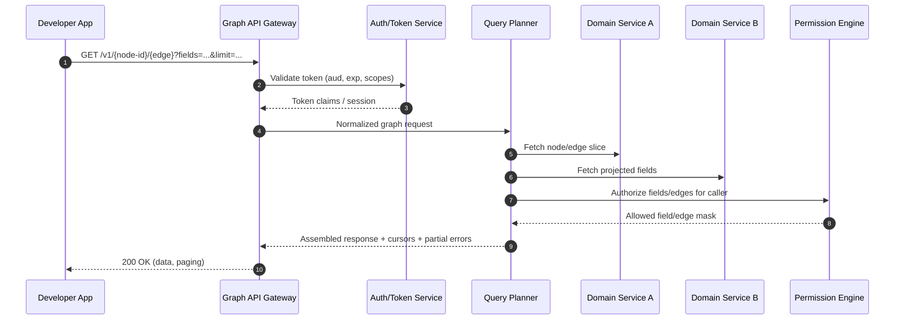
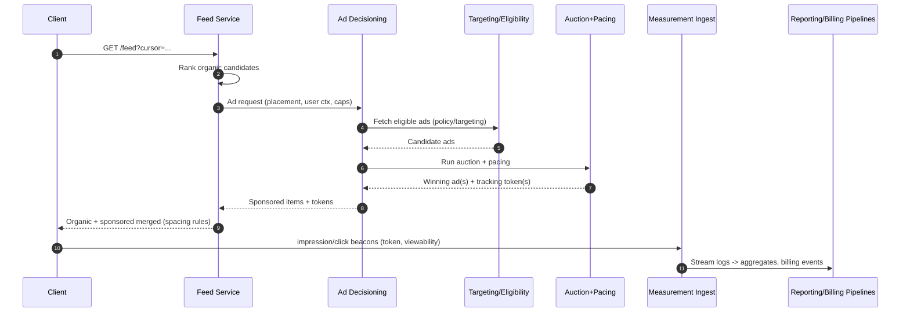
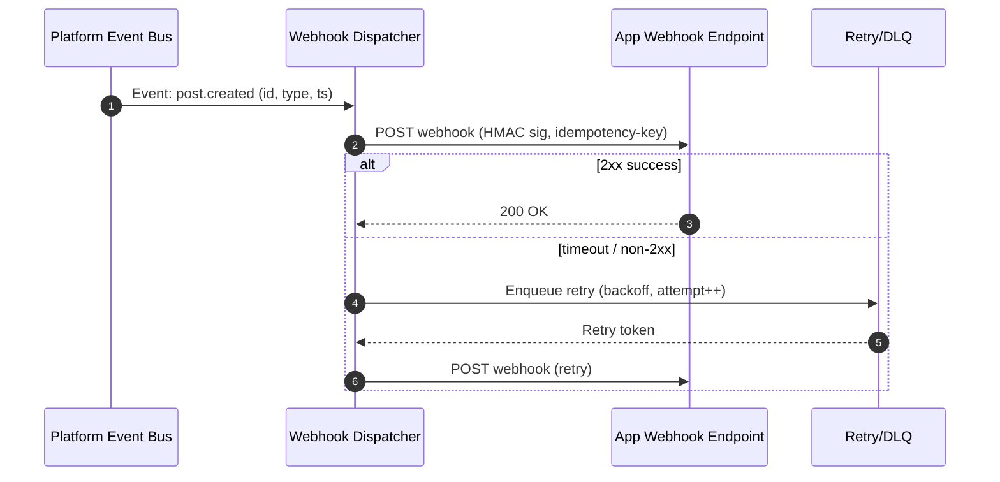

# Extending the Platform with Graph API and Sponsored Content

## Executive summary

The attached process description (see the file at [sandbox:/mnt/data/20 - sponsored content and graph api.md](sandbox:/mnt/data/20%20-%20sponsored%20content%20and%20graph%20api.md)) outlines two “platform-class” capability additions: a developer-facing **Graph API** over your product’s object graph (nodes/edges, field projection, governance) and a **Sponsored/Ads** system spanning campaign management through real-time delivery and measurement.

A rigorous implementation typically converges on seven architectural pillars:

1. **A governed public edge** (API Gateway + quotas + versioning + schema) that supports explicit field selection, pagination, batching, and stable deprecation policies, with machine-readable contracts (OpenAPI) and consistent error envelopes (Problem Details). citeturn3search4turn10search0turn10search1  
2. **A query planner / federation layer** that decomposes Graph requests into internal service calls, then re-assembles responses while applying field/edge authorization filters. This mirrors the “graph as a facade, services as sources-of-truth” pattern and avoids a monolithic graph datastore as a prerequisite for launch. citeturn3search1  
3. **A policy decision point for access control** capable of object-, relationship-, and field-level enforcement (privacy rules, blocks, minors, scope checks). OWASP’s API Top 10 highlights object-level and property-level authorization failures as top risks, making this a first-order design concern rather than “later hardening.” citeturn2search4turn2search2  
4. **A dedicated Ads domain split** between Ads Management (accounts, roles, campaigns/ad sets/ads, creatives, review) and Ads Delivery (eligibility, targeting, auction, pacing, insertion into feed). Classic sponsored-search literature frames the auction family and tradeoffs that inform your ranking/auction design choices. citeturn18search1turn18search2  
5. **Event-driven integration for measurement, reporting, and audits** using a durable event backbone and standardized event metadata (e.g., CloudEvents), plus a coherence pattern (e.g., transactional outbox + CDC) to keep internal state and emitted events consistent. citeturn23search0turn9search0  
6. **A developer identity plane** for third-party apps: OAuth 2.0 + (optionally) OpenID Connect for login, short-lived tokens, PKCE for public clients, introspection/revocation for operational control, and optional mTLS-bound tokens for higher-trust server-to-server integrations. citeturn0search2turn0search0turn2search1turn15search0turn14search0turn15search3  
7. **Operational maturity from day one**: SLOs/error budgets, autoscaling, and ubiquitous observability (distributed tracing context propagation + OpenTelemetry signals), because Graph fan-out and ad decisioning both create failure amplification risks. citeturn16search5turn8search0turn9search2turn17search2  

Key decision points to resolve early (because they affect schemas, infra, and security posture) are: **public API style** (REST-like “graph paths” vs GraphQL), **authorization model** (RBAC+ABAC vs Relationship-Based Access Control), **canonical vs indexed graph storage**, **event backbone choice**, and **ads measurement/billing boundaries** (what is “billable” and how to guarantee correctness under retries).

## Process extraction and normalized workflows

The markdown describes four core workflows; below is a normalized version that is implementation-ready (with explicit inputs/outputs and failure modes). These steps are the “process backbone” that the rest of this report maps onto.

**Graph API read workflow (developer/app query)**  
1) Client calls the Graph API with an access token and a requested field set (`fields=...`) and paging controls.  
2) Gateway validates token, request shape, and quota/rate limits.  
3) Query planner decomposes the request into internal reads across relevant domain services (profile, posts, media, graph relationships, ads/reporting where applicable).  
4) Permission engine filters nodes/edges/fields (including privacy, scopes, and blocked relationships).  
5) Response returns data + cursor pagination + partial errors if needed (to avoid “all-or-nothing” for large field selections).



**Graph API write/publish workflow (external publish)**  
1) Developer app requests the correct publish scope; resource owner grants consent (where applicable).  
2) Media upload occurs via an upload pipeline (often chunked / resumable).  
3) App creates the content object referencing stored media.  
4) Platform applies policy enforcement (automated + human queues, if needed) before surfacing.  
5) Events are emitted (post.created, media.processed, etc.) and can trigger webhooks.

**Sponsored feed request workflow (end-user feed load)**  
1) Feed service generates and ranks organic candidates.  
2) Feed calls Ad Decisioning with request context (user/region/device/placement/frequency state).  
3) Ad Decisioning performs eligibility filtering, targeting, auction, and pacing; returns sponsored items + tracking tokens.  
4) Feed merges sponsored items into the ranked list (spacing/diversity rules).  
5) Client renders; impression/click events fire with viewability thresholds.  
6) Measurement/billing consumes logs; reporting updates dashboards.



**Webhook/subscription workflow (developer ecosystem)**  
1) Internal event occurs (e.g., comment.created).  
2) Webhook dispatcher signs payload + sets idempotency keys + attempts delivery.  
3) Receiver verifies signature and processes idempotently.  
4) On failure, dispatcher retries with backoff and dead-lettering.



## Platform component and API mapping

This section maps each workflow step to **platform components**, **internal APIs**, and **external surfaces**. The goal is to make the “process steps” actionable as an architecture plan.

**External product surfaces**

- **Graph API**: developer-facing endpoints that look like graph paths (`/{node-id}/{edge}`) with field projection, cursor pagination, versioning, and stable error formats (Problem Details). citeturn10search0turn3search4  
- **Ads API (Graph-style)**: ads objects exposed through the same conventions (adaccounts → campaigns → adsets → ads, insights endpoints), enabling advertiser tooling and programmatic campaign ops.  
- **Webhooks/Subscriptions**: outbound event delivery with signatures and retries; aligns well with an event metadata standard (CloudEvents) and HMAC signing guidance. citeturn23search0turn20search0turn19search0  

**Internal components (logical services / modules)**

- **Public API Gateway / Edge layer**: request validation, schema checks, quotas/rate-limits, compression, API version routing, and request normalization. Rate limiting should use standard signals like HTTP 429. citeturn20search2turn3search4  
- **Identity & App Registry**: app onboarding, client IDs/secrets, consent UX, scope catalog, app review gates for sensitive scopes. OAuth 2.0 + OIDC are the base protocols; dynamic registration can be supported later via the standardized registration protocol. citeturn0search2turn0search0turn15search2  
- **Schema & Field Projection layer**: typed object model (nodes), edges, and server-side field selection. GraphQL standardizes this concept; you can either expose GraphQL directly or implement “fields=” projection in REST while using GraphQL-style execution internally. citeturn3search1  
- **Query Planner / Federation**: turns `{node, edge, fields, filters}` into an efficient plan (batching, parallel fetches, caching, and fallback behavior).  
- **Permission Engine (Policy Decision Point)**: makes authorization decisions per node/edge/field. Relationship-based authorization at scale has well-studied patterns (e.g., Zanzibar-like ACL evaluation with consistency guarantees). citeturn2search2  
- **Core domain services**: profile, posts, comments, reactions, media, social graph, notifications, search. Each remains the source of truth for its bounded context.  
- **Ads domain services**: advertiser identity & accounts; campaign hierarchy; creative ingestion/validation; ad review; targeting; auction/ranking; delivery/pacing; measurement; reporting/billing. Auction design typically builds on variants of sponsored-search mechanisms (e.g., generalized second price families), but you can ship an MVP with a simpler ranking+budget model if transparency is acceptable. citeturn18search1turn18search2  
- **Event backbone**: internal event stream for notifications, analytics, ads logs, webhook triggers. CloudEvents provides a portable event metadata layer across transports/brokers. citeturn23search0turn23search1  
- **Observability & Governance**: audit logs (“who accessed what”), developer analytics (latency/error/quota), abuse detection. OpenTelemetry is the dominant open standard for signals and collection pipelines. citeturn17search2turn17search4  

**Illustrative API contract patterns**

Below are examples (not tied to any language/stack) of how the public contract can look while staying compatible with OpenAPI tooling. citeturn3search4turn10search0  

_OpenAPI (excerpt)_

```yaml
openapi: 3.0.0
info:
  title: Platform Graph API
  version: "v1"
paths:
  /v1/{nodeId}:
    get:
      summary: Read a node with field projection
      parameters:
        - name: nodeId
          in: path
          required: true
          schema: { type: string }
        - name: fields
          in: query
          required: false
          schema: { type: string }
      responses:
        "200":
          description: Node response
          content:
            application/json:
              schema:
                $ref: "#/components/schemas/GraphNodeResponse"
        "401":
          description: Unauthorized
          content:
            application/problem+json:
              schema: { $ref: "#/components/schemas/ProblemDetails" }
  /v1/{nodeId}/{edge}:
    get:
      summary: List edge objects with cursor pagination
      parameters:
        - name: nodeId
          in: path
          required: true
          schema: { type: string }
        - name: edge
          in: path
          required: true
          schema: { type: string }
        - name: limit
          in: query
          schema: { type: integer, minimum: 1, maximum: 200 }
        - name: after
          in: query
          schema: { type: string }
components:
  schemas:
    ProblemDetails:
      type: object
      required: [type, title, status]
      properties:
        type: { type: string, format: uri }
        title: { type: string }
        status: { type: integer }
        detail: { type: string }
        instance: { type: string }
```

_Problem Details_ is standardized in the IETF HTTP API working group, which reduces ad-hoc error envelopes and discourages leaking sensitive internals in errors. citeturn10search0turn10search1  

## Data models, storage, and integration patterns

This section defines **required logical data models** and evaluates **storage and integration options** that satisfy Graph API + sponsored delivery + measurement.

**Core logical data models**

1) **Graph primitives** (for the developer-facing abstraction)  
- `Node`: typed ID, version, canonical field set, and field-level visibility metadata.  
- `Edge`: `(from_node, to_node, edge_type)` plus edge attributes (created_at, role, etc.).  
These are an API abstraction; they do not require a single global “graph DB” as long as your query planner can resolve edges across services.

2) **Ads hierarchy** (for management and permissions)  
- `BusinessAccount` / `AdAccount`  
- `Campaign` (objective) → `AdSet` (targeting/budget/placements) → `Ad` (creative + tracking + destination)  
- `CreativeAsset` (image/video/carousel, text variants)  
- `ReviewDecision` (approved/rejected/restricted, reasons, audit trail)  
- `SpendLedger` / `BillingEvent` / `Invoice` (depending on how payments are implemented)

3) **Delivery & measurement**  
- `AdImpression` (with viewability metadata)  
- `AdClick`  
- `Conversion` (pixel/app event/server-to-server)  
- `AttributionModel` + windows  
- `FraudSignals` (bot/click spam indicators)

**Sample JSON Schemas (illustrative)**  
JSON Schema is itself standardized and versioned (e.g., 2020-12), so your platform can publish canonical schemas for events and API objects. citeturn3search0turn3search2  

```json
{
  "$schema": "https://json-schema.org/draft/2020-12/schema",
  "$id": "https://example.com/schemas/graph/node.json",
  "title": "GraphNode",
  "type": "object",
  "required": ["id", "type", "fields", "version"],
  "properties": {
    "id": { "type": "string", "minLength": 1 },
    "type": { "type": "string", "minLength": 1 },
    "version": { "type": "integer", "minimum": 1 },
    "fields": {
      "type": "object",
      "additionalProperties": true
    },
    "links": {
      "type": "object",
      "properties": {
        "self": { "type": "string" }
      },
      "additionalProperties": true
    }
  }
}
```

```json
{
  "$schema": "https://json-schema.org/draft/2020-12/schema",
  "$id": "https://example.com/schemas/ads/campaign.json",
  "title": "Campaign",
  "type": "object",
  "required": ["id", "adAccountId", "status", "objective", "createdAt"],
  "properties": {
    "id": { "type": "string" },
    "adAccountId": { "type": "string" },
    "name": { "type": "string" },
    "status": { "type": "string", "enum": ["draft", "active", "paused", "archived"] },
    "objective": { "type": "string", "enum": ["awareness", "traffic", "conversions"] },
    "dailyBudgetMicros": { "type": "integer", "minimum": 0 },
    "startAt": { "type": "string", "format": "date-time" },
    "endAt": { "type": "string", "format": "date-time" },
    "createdAt": { "type": "string", "format": "date-time" }
  }
}
```

**Data store options comparison**

The table below compares **canonical storage** choices for core objects/ads plus **specialized stores** for graph traversal and reporting. (Capabilities summarized from official documentation and vendor specifications.) citeturn4search3turn7search2turn7search8turn7search0turn24search1  

| Option class | Representative systems | Strengths for this platform | Primary tradeoffs | Best-fit use |
|---|---|---|---|---|
| Relational OLTP | PostgreSQL, MySQL | Transactions, strong constraints, joins for ads hierarchy; supports JSON types for semi-structured fields (e.g., targeting blobs) | Sharding/geo-distribution complexity beyond a single region | Ads mgmt, billing ledgers, app registry, permission tuples (if modeled relationally) |
| Document DB | MongoDB | Flexible schema for evolving creatives/targeting; supports multi-document transactions (with operational tradeoffs) | Ad-hoc joins are weaker; transaction semantics vary by deployment | Creatives, app configuration, some “profile-ish” objects |
| Wide-column / Dynamo-style | Cassandra | Horizontal scalability, replication, tunable consistency models | Modeling complexity; last-write-wins semantics; limited joins | High-volume key-based lookups (e.g., frequency caps, counters) |
| Graph DB | Neo4j, Neptune | Natural modeling of nodes/relationships; traversal queries; multiple open graph APIs (Gremlin/SPARQL/openCypher) | Operational overhead; data duplication if not canonical; consistency with source-of-truth required | Social graph queries, relationship-heavy authorization (optional) |
| Search/index | Elasticsearch/OpenSearch (Lucene-based) | Text search, filtering, analytics queries; supports distributed scaling and cross-cluster search patterns | Not a canonical store; eventual consistency; mapping evolution complexity | Search surfaces, content discovery, ad review/search tooling |
| Warehouse/lake | BigQuery/Snowflake/data lake | Cost-efficient analytics + long retention; separation from OLTP load | Latency not suitable for servable decisions | Reporting/insights, finance reconciliation, experimentation |

Notes on specific properties used frequently in this design:
- PostgreSQL’s `jsonb` is stored in a decomposed binary form and supports indexing, making it a common compromise for storing evolving targeting/config blobs while retaining relational integrity. citeturn4search3  
- Cassandra partitions data via hashing and replicates partitions; it uses timestamped last-write-wins and exposes tunable consistency—useful but non-trivial for correctness-sensitive ledgers. citeturn7search2  
- Neo4j’s property graph model uses nodes/relationships with properties (key-value pairs). citeturn7search8  
- Neptune explicitly supports open graph APIs (Gremlin/openCypher/SPARQL), which matters if you want standards-based portability. citeturn7search0  

**Messaging / event backbone options comparison**

The Ads + measurement + webhooks portion of the process is event-heavy; choosing a backbone with clear ordering and delivery semantics is a core decision.

| Option | Representative systems | Ordering / delivery semantics (typical) | Strengths | Tradeoffs | Best-fit use |
|---|---|---|---|---|---|
| Distributed log | Kafka | Partitions + ordering per partition; producer idempotence available; transactions for stronger guarantees | High throughput, replayability, stream processing ecosystems | Operational complexity; partitioning strategy is critical | Measurement logs, domain events, CDC/outbox fanout |
| Storage-backed pub/sub | Pulsar | Topic scalability, geo-replication features, separation of compute/storage | Multi-tenancy and geo features are strong; large topic counts | More moving parts; ecosystem differs | Multi-region eventing, large topic cardinality |
| Brokered queues | RabbitMQ | Queue semantics, routing via exchanges; protocol interoperability | Simple work-queue patterns; flexible routing | Not a log-first model; replay differs | Webhook retries, async jobs, command queues |
| Managed queue | SQS | At-least-once; best-effort ordering on standard queues; durable multi-AZ storage | Minimal ops overhead; decouples services | Ordering/dedup limitations unless using FIFO; semantics vary by mode | Background jobs, retry queues, ingestion buffers |
| Managed pub/sub | Pub/Sub | At-least-once by default; ordering keys; optional exactly-once modes with constraints | Fully managed; strong global integration | Exactly-once/ordering constraints can reduce throughput | Event ingestion where managed ops is prioritized |
| Lightweight streaming | NATS JetStream | At-least-once baseline with acking; supports streams | Simple deployment; low-latency | Exactly-once is not absolute; durability tuning | Internal eventing where simplicity > strict semantics |

Supporting references:
- Kafka producer idempotence settings and behavior are documented explicitly (e.g., `enable.idempotence`). citeturn5search3  
- Pulsar positions itself as a combined messaging/streaming platform with geo-replication and multi-tenancy features. citeturn5search1  
- Amazon SQS standard queues are documented as at-least-once delivery with possible reordering due to distributed architecture. citeturn6search6turn6search8  
- Pub/Sub documents at-least-once delivery and ordering key behaviors (including redelivery effects), plus exactly-once delivery constraints. citeturn6search0turn6search9  
- JetStream documents a baseline “at least once” QoS and describes scenarios that can lead to duplicates. citeturn6search3  

**Integration pattern options comparison**

Your process calls for federation (Graph API), eventing (webhooks/logs), and correctness (billing). These patterns are the usual “menu”:

| Pattern | Where it fits | Pros | Cons / watchouts | Canonical tooling |
|---|---|---|---|---|
| Synchronous service calls (REST/gRPC) | Graph planner → domain services | Simple mental model; low latency if bounded | Fan-out amplifies failures; tail latency; requires timeouts/budgets | API gateway, service mesh, circuit breakers |
| Event-driven pub/sub | measurement, notifications, reporting | Decouples producers/consumers; replay; scale-out | Requires idempotent consumers; schema evolution discipline | CloudEvents metadata standardization |
| Transactional outbox + CDC | emitting domain events safely | Stronger consistency between DB state and events | CDC infra overhead; modeling required | Debezium outbox event router (reference design) |
| Workflow orchestration (sagas) | multi-step actions (ad approval, billing) | Explicit state machine; retries and compensation | More system components; needs clear boundaries | Workflow engine of choice |
| Webhooks (external subscriptions) | developer ecosystem | Externalizes events; enables integrations | SSRF risk, signature verification, retries, abuse | HMAC signatures + dedupe/idempotency keys |

Supporting references:
- CloudEvents is explicitly designed to standardize event metadata across systems and has a maintained spec and bindings. citeturn23search0turn23search1  
- Debezium documents the outbox pattern as a way to avoid inconsistencies between a service’s DB state and emitted events consumed elsewhere. citeturn9search0  

## Authentication, authorization, and security requirements

Because the Graph API is a developer platform and Ads is monetization infrastructure, security requirements are not an add-on: they are core to correctness and safety.

**Authentication requirements**

- **OAuth 2.0 for authorization**: the protocol defines the roles and grant flows that your app ecosystem will use. citeturn0search2  
- **Bearer token handling**: bearer tokens require strong transport/storage protections (TLS, avoid URLs, short lifetimes, audience scoping). citeturn1search1  
- **OpenID Connect** (optional but common): if you want “Login with X” and standardized identity claims, OIDC is the identity layer over OAuth 2.0. citeturn0search0  
- **PKCE for public clients**: protects against code interception attacks in authorization code flow. citeturn2search1  
- **Token introspection and revocation**: if you use opaque tokens (or want centralized runtime checks), introspection enables resource servers to verify active state and metadata; revocation enables clean shutdown of compromised/abandoned tokens. citeturn15search0turn14search0  
- **Authorization server metadata and discovery**: standardizes how clients obtain endpoints/keys via `/.well-known/...`. citeturn14search1  
- **Optional mTLS-bound tokens** for high-trust integrations (e.g., ads spend management from a regulated partner): binds access tokens to a client certificate for proof-of-possession. citeturn15search3  

**Authorization requirements**

- **Scopes**: every Graph API call should enforce scopes (e.g., `read:profile`, `read:posts`, `write:posts`, `ads:manage`, `ads:read_insights`). Scope design becomes a long-lived contract for the ecosystem.  
- **Object-level and property-level authorization**: OWASP highlights Broken Object Level Authorization and Broken Object Property Level Authorization as top API risks, aligning directly with the “node/field/edge” model. citeturn2search4  
- **Relationship- and graph-aware policies**: privacy constraints (“friends-only”), blocks, minors, and country restrictions are naturally modeled as relationship predicates. Systems like Google’s Zanzibar show how relationship-centric ACL evaluation can scale with strong consistency requirements (and provide a reference point for performance targets/engineering tradeoffs). citeturn2search2  

**API edge security controls**

- **Rate limiting / quotas** with consistent signals (`429 Too Many Requests`, `Retry-After`) and hardened behavior under attack; the status code is standardized but does not dictate your counting strategy. citeturn20search2turn20search3  
- **Transport security**: TLS 1.3 is the modern baseline protocol for preventing eavesdropping/tampering on API traffic. citeturn21search0  
- **Inventory and version governance**: Graph APIs need strict inventory/versioning to prevent “shadow” endpoints and deprecated versions from lingering; OWASP explicitly calls out inventory management as a top risk area for APIs at scale. citeturn2search4  
- **Standardized error envelopes**: Problem Details stresses careful vetting to avoid information leakage and discourages exposing stack dumps/implementation details over HTTP interfaces. citeturn10search0  

**Webhook security controls**

- **Message authentication**: HMAC is a standardized keyed-hash mechanism for message authentication and is the common underpinning for webhook signatures. citeturn20search0  
- **Practical verification guidance**: official webhook security docs (e.g., from entity["company","GitHub","developer platform company"]) recommend HMAC-SHA256 headers and careful raw-body handling for signature checks, plus replay-safe comparisons. citeturn19search0  
- **SSRF and callback abuse**: OWASP explicitly lists SSRF as an API Top 10 risk, and webhooks are a common place it appears (e.g., unvalidated callback URLs). citeturn2search4turn0search4  

## Performance, scalability, reliability, and compliance implications

**Performance and scalability implications**

- **Graph API fan-out**: field projection reduces payload size and unnecessary backend reads; GraphQL formalizes this concept, which you can adopt directly or emulate with `fields=` selection. citeturn3search1  
- **Caching strategy**: the attached process emphasizes caching “hot nodes” (popular pages, profiles). You should define cache keys that incorporate both *viewer identity* (because of privacy rules) and *field projection* (because response shape varies).  
- **Ads decisioning latency budget**: feed assembly has strict tail-latency constraints; ad decisioning must be fast enough to avoid materially degrading feed. “Global authorization” systems like Zanzibar report sub-10ms p95 authorization decisions and very high availability, illustrating the kind of performance envelope you should target for decisioning subcomponents (not necessarily end-to-end). citeturn2search2  
- **Autoscaling**: if you deploy on Kubernetes, Horizontal Pod Autoscaling is a standard control loop for scaling replicas based on metrics; this is particularly relevant for bursty feeds/ads traffic. citeturn8search0  

**Reliability implications**

- **Error budgets and SLOs**: SRE practice uses error budgets to balance change velocity and reliability; it also treats changes as a major source of instability and uses formal postmortem/escalation triggers. This matters because Graph fan-out and ad decisioning both amplify the blast radius of partial outages. citeturn16search5  
- **Graceful degradation**: feed request flow must define deterministic fallbacks (e.g., “if Ad Decisioning times out, deliver organic-only feed while logging the miss”). This is both a product decision and an operational safety valve.

**Compliance implications (ads platforms are compliance-heavy by default)**

- **Privacy and consent**: the entity["organization","European Union","supranational union"] GDPR is the primary EU privacy regulation, and the entity["organization","European Data Protection Board","eu regulator"] publishes consent guidance that shapes “freely given” and “informed” consent expectations in practice. citeturn13search4turn13search0  
- **Cookies/device identifiers**: the ePrivacy Directive (Directive 2002/58/EC) is the long-standing EU instrument governing storage/access on a user’s device (commonly implicated by ad tech cookies/SDK identifiers). citeturn12search1  
- **Consent signaling in ad supply chains**: the Transparency & Consent Framework is an industry standardization effort (stewarded by entity["organization","IAB Europe","industry association"] and entity["organization","IAB Tech Lab","tech standards org"]) intended to support GDPR/ePrivacy consent signaling across participants; if your platform interoperates with external ad tech, you need an explicit decision on whether/how to integrate such signals. citeturn12search0turn12search3  
- **Sponsored content disclosure**: the entity["organization","Federal Trade Commission","us regulator"] issues specific guidance on native advertising disclosures (clear and conspicuous labeling, proximity to the ad focal point), which impacts feed rendering requirements and UI contract tests. citeturn11search0  
- **Payments and billing**: if you store/process/transmit payment card data, PCI DSS applies; entity["organization","PCI Security Standards Council","payment security org"] publishes PCI DSS versions and transition timelines, which should inform whether you outsource payments vs operate in-scope systems. citeturn12search2  

## Implementation plan, milestones, testing, migration, and observability

This plan is phased to minimize platform risk: establish governance and safety primitives first (identity, permissions, rate limits, audit), then expand functionality (Graph surfaces, ads management), then integrate low-latency delivery and finally measurement/billing hardening.

**Milestones and estimated effort** (effort scale: Low/Medium/High)

| Milestone | Scope | Deliverables / exit criteria | Effort |
|---|---|---|---|
| Foundation | Public edge + identity + schemas | OAuth/OIDC integration, app registry, scope catalog, API versioning policy, Problem Details error format, audit logging skeleton | High citeturn0search2turn0search0turn10search0 |
| Graph read MVP | Federated reads + field projection | Query planner v1 (batching + timeouts), permission engine integration for object+field level, cursor pagination | High citeturn2search4turn3search1 |
| Webhooks MVP | Subscriptions + secure delivery | Webhook signing (HMAC), retries+DLQ, idempotency keys, developer dashboards for delivery status | Medium citeturn20search0turn19search0 |
| Ads management MVP | Campaign hierarchy + review | AdAccount onboarding, Campaign/AdSet/Ad CRUD, creative upload/validation hooks, review workflow (manual/automated stubs) | High |
| Feed ads integration | Decisioning + insertion | Ad decisioning service v1 (eligibility + simple ranking + pacing), feed merge logic, kill switch, latency budgets | High citeturn16search5 |
| Measurement + reporting | Logs → aggregates → billing | Stream ingestion, dedupe, attribution windows, billing events, reporting APIs (near-real-time + finalized) | High |
| Hardening & scale | SLOs + autoscaling + observability | Load tests, chaos drills, SLO dashboards, autoscaling policies, security tests, compliance review artifacts | High citeturn8search0turn17search2turn16search0 |

**Testing criteria (minimum bar)**

- **Unit tests**  
  - Permission engine: object/edge/field-level rules; regression suites for privacy invariants (blocked users, minors, restricted fields). citeturn2search4turn2search2  
  - Query planner: plan generation, batching, timeout/fallback behavior, partial error serialization (Problem Details). citeturn10search0  
  - Ads pacing/auction: deterministic tests for budget caps, frequency caps, tie-breakers; property-based tests for invariants (never exceed caps).  

- **Integration tests**  
  - OAuth flows: authorization code + PKCE; token introspection/revocation; scope enforcement on Graph endpoints. citeturn2search1turn15search0turn14search0  
  - Webhooks: signature verification, retries, dedupe/idempotency, DLQ behavior (incl. replay attack attempts). citeturn20search0turn19search0  
  - Outbox/CDC: verify “DB commit implies event publish” correctness under failures. citeturn9search0turn4search0  

- **End-to-end tests**  
  - “Publish content via Graph API → appears in feed.”  
  - “Create ad campaign → passes review → eligible → served in feed → impression logged → reporting updated.”  
  - Disclosure UI assertions for sponsored labeling (per FTC guidance). citeturn11search0  

- **Non-functional testing**  
  - Load and tail-latency testing of feed with and without ad decisioning.  
  - Abuse testing for scraping, quota bypass, webhook SSRF patterns. citeturn2search4turn20search2  

**Migration and deployment plan**

- **API migration strategy**  
  - Introduce **versioned Graph endpoints** from day one; adopt a documented deprecation window similar to major platform APIs (e.g., 24+ months notice in public policies like Microsoft Graph’s). citeturn19search4  
  - Run old and new APIs side-by-side (dual routing) until parity for the targeted surfaces is proven.  
  - Use “capability flags” per app (feature gating) to avoid breaking existing partner integrations.

- **Data migration strategy (if building new read models / graph indexes)**  
  - Backfill in a controlled job (bounded by rate limits) and reconcile continuously via event stream/CDC.  
  - Start serving read traffic from the new index in **shadow mode**: compare responses but do not expose externally until divergence drops below thresholds.  
  - If using PostgreSQL logical replication for some replication use-cases, note that schema definitions are not replicated and tables must exist on subscriber; dropping/recreating subscriptions loses sync state and requires resynchronization—important for operational runbooks. citeturn4search0  

- **Ads rollout strategy**  
  - Phase A: decisioning computes winners but feed does not display (shadow).  
  - Phase B: serve to a small cohort with strict caps and automatic kill switch.  
  - Phase C: gradual ramp; add pacing sophistication and policy automation iteratively.

**Monitoring and observability requirements**

Adopting OpenTelemetry gives you standardized signals (traces/metrics/logs), collectors, and semantic conventions; W3C Trace Context defines interoperable propagation headers (`traceparent`, `tracestate`) across services. citeturn17search2turn9search2turn17search4  

Minimum dashboards and alerts:
- **Graph API**: p50/p95/p99 latency by endpoint + by app; error rates; authorization denials; quota/rate-limit hits; cache hit ratios; downstream fan-out counts. citeturn2search4turn20search2  
- **Ads decisioning**: eligibility set sizes; auction latency; pacing drift vs budget; fill rate; frequency cap rejections; timeouts/fallback-to-organic rate.  
- **Measurement pipeline**: ingestion lag; dedupe rates; DLQ size; billing event reconciliation errors; reporting freshness (near-real-time vs finalized).  
- **Webhooks**: delivery success rate, retry counts, per-app failure patterns, signature verification failures, suspected replay attacks. citeturn19search0turn20search0  

**Prioritized backlog (epics and example stories)**

| Priority | Epic | Story examples (definition-of-done oriented) | Effort |
|---|---|---|---|
| P0 | Graph API governance | “Implement version routing + deprecation headers + Problem Details errors”; “Quota enforcement with 429 + Retry-After”; “Audit log for node reads” citeturn10search0turn20search2 | High |
| P0 | App identity plane | “OAuth auth code + PKCE”; “Scope catalog + consent recording”; “Token introspection gateway integration” citeturn2search1turn15search0 | High |
| P0 | Permission engine | “Object+field-level policy evaluation”; “Relationship predicates (blocks/audience)”; “Golden test suite for OWASP API1/API3 classes” citeturn2search4turn2search2 | High |
| P1 | Query planner | “Batch internal reads”; “Timeout budgets and partial errors”; “Cache ‘hot node’ responses with viewer-aware keys” | High |
| P1 | Webhooks | “HMAC signature header”; “Idempotency keys + dedupe”; “Retry with exponential backoff + DLQ” citeturn20search0turn19search0 | Medium |
| P1 | Ads management | “Campaign/adset/ad models + CRUD”; “Creative upload + validation”; “Review queue MVP” | High |
| P1 | Feed integration | “Ad decisioning service MVP”; “Spacing/diversity rules”; “Kill switch + timeout fallback” citeturn16search5 | High |
| P2 | Measurement & reporting | “Impression/click ingestion”; “Attribution windows”; “Aggregations + reporting API” | High |
| P2 | Compliance tooling | “Consent storage + enforcement hooks”; “Sponsored disclosure UI contract tests”; “Data retention controls” citeturn13search0turn11search0 | Medium |

## Risks, mitigations, rollback, and decision points

**Major risks and mitigations**

1) **Authorization complexity becomes the bottleneck**  
- *Risk*: field/edge authorization across federated services is easy to get subtly wrong; OWASP’s API Top 10 shows authorization flaws dominate API breaches. citeturn2search4  
- *Mitigation*: centralize policy decisions in a PDP, use relationship-based modeling where appropriate (Zanzibar-like tuples), and create a “privacy invariant” test corpus that runs in CI for every release. citeturn2search2  
- *Rollback*: fail closed for sensitive fields; for feed assembly, degrade to “less personalized / organic-only” rather than exposing data.

2) **Graph API fan-out causes tail-latency and cascading failures**  
- *Mitigation*: strict per-request budgets, bounded fan-out, batching, circuit breakers, and caching. Use SLO/error budget governance to slow launches when instability grows. citeturn16search5turn20search3  
- *Rollback*: feature flag large field sets; temporarily restrict expensive edges/fields.

3) **Ads insertion degrades core UX or creates revenue correctness issues**  
- *Mitigation*: shadow mode evaluation; explicit latency ceilings; pacing invariants; deterministic replay testing for billing pipelines.  
- *Rollback*: immediate kill switch in feed to disable ad insertion; continue collecting measurement in the background to diagnose.

4) **Measurement fraud and abuse**  
- *Mitigation*: idempotent ingestion + dedupe keys; anomaly detection; rate limits; signed tracking tokens with short TTL; replay defenses.  
- *Rollback*: exclude suspicious traffic from billing; hold billing finalization until reconciliation.

5) **Compliance gaps (consent + disclosure + retention)**  
- *Mitigation*: treat consent/disclosure as product requirements; implement consent gates and retention policies explicitly; align cookie/device storage rules with ePrivacy and consent guidance. citeturn12search1turn13search0turn11search0  
- *Rollback*: disable targeted ads for regions without required consent; fall back to contextual/non-personalized sponsored placements.

**Rollback strategies (cross-cutting)**

- **Feature flags with instantaneous disablement** for: Graph endpoints, heavy edges/fields, ad insertion, webhook delivery, and measurement billing finalization.  
- **Blue/green or canary deployments** with automated rollback on SLO regressions.  
- **Schema/version rollback**: forward-compatible schema changes; additive changes first; strict deprecation policy with long notice windows. citeturn19search4turn3search4  

**Decision points and recommended next steps**

Decision points to schedule explicitly (each blocks downstream work):
1) Public API style: REST-like graph paths + `fields=` vs GraphQL exposure (or hybrid). citeturn3search1turn3search4  
2) Authorization model: RBAC+ABAC vs relationship-based tuples and a Zanzibar-like evaluator. citeturn2search2  
3) Storage strategy for relationships: federated-only vs dedicated graph index (Neo4j/Neptune) vs relational adjacency tables. citeturn7search8turn7search0  
4) Event backbone: Kafka/Pulsar vs managed pub/sub vs queue-centric; required semantics for billing correctness. citeturn5search3turn6search6turn6search9  
5) Consent/disclosure posture: region-aware consent gates, disclosure UI requirements, and whether to integrate consent frameworks for ad ecosystems. citeturn13search0turn11search0turn12search0  

Recommended next steps (highest leverage):
- Produce a **service boundary map** and **scope catalog** for the first Graph API release (what nodes/edges/fields exist, who can access them, under which scopes). This is the contract that makes federation and security tractable. citeturn2search4  
- Build a **Graph API request planner spike** against 2–3 representative edges (e.g., `user → posts`, `post → comments`) with field-projection and policy filtering end-to-end.  
- Stand up an **outbox + event stream proof-of-concept** for one domain (posts) feeding webhooks + analytics, using CloudEvents metadata to standardize events early. citeturn9search0turn23search0turn23search1  
- Implement the **feed + ads shadow pipeline** (compute decisioning but do not serve) to measure latency and quality impact before any user-visible change.  
- Define initial **SLOs and error budgets** for Graph API and feed assembly and wire them to automated release gates. citeturn16search5turn16search0