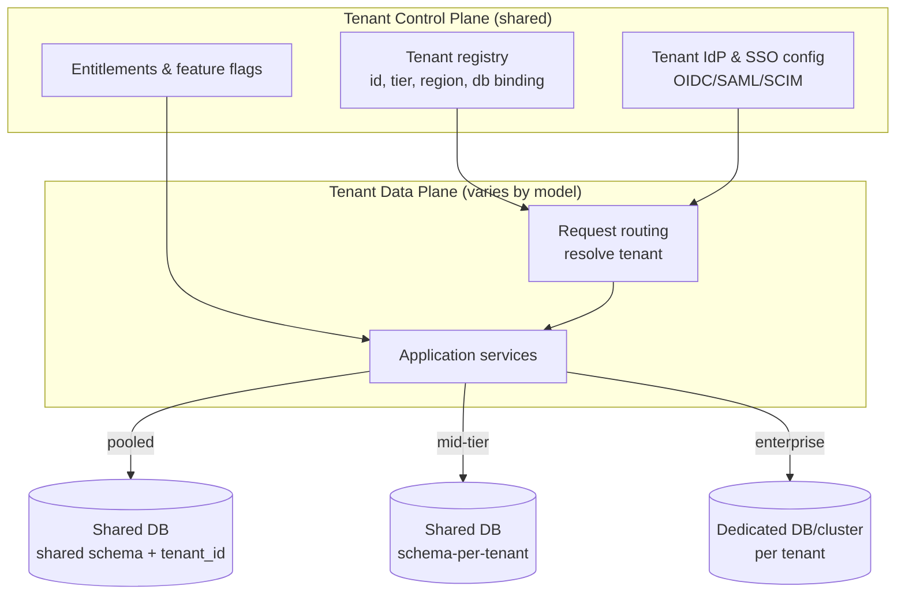
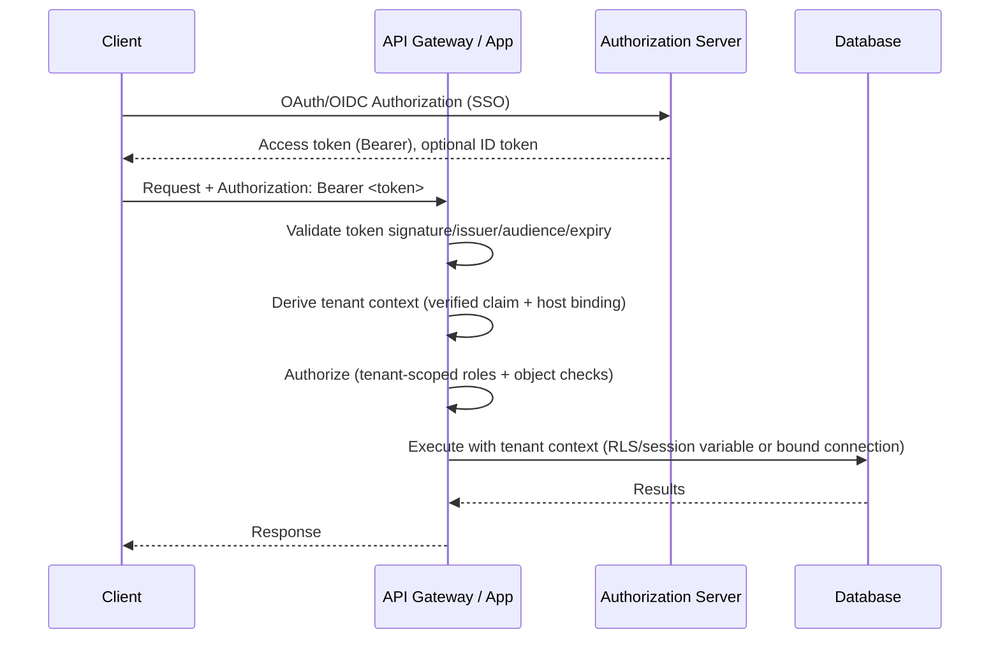
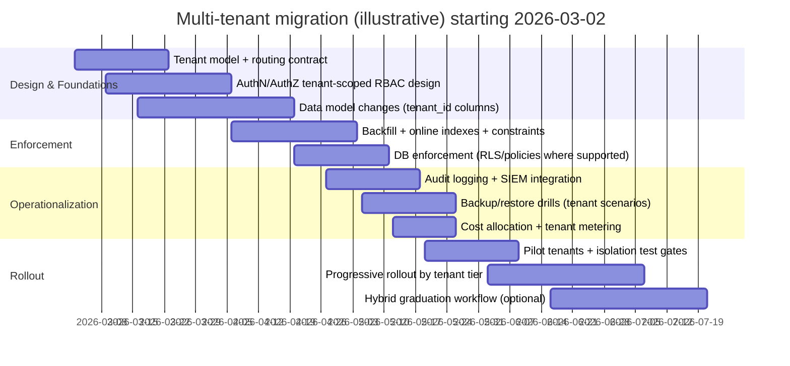

# Adapting an Existing System to a Multi‑Tenant Architecture

## Executive summary

Multi‑tenancy is not a single change; it is a coordinated redesign of **identity**, **data isolation**, **configuration**, **operations**, and **migration mechanics** so that multiple customers (“tenants”) can safely share parts of the system without data exposure, noisy‑neighbor instability, or untenable operational overhead. Cloud guidance commonly frames this as a spectrum of isolation models—**pooled/shared**, **siloed/dedicated**, and **hybrid “bridge”**—where the right answer depends on regulatory requirements, tenant size distribution, performance isolation needs, and operational maturity. citeturn1search0turn1search4turn1search16turn1search28

For an existing (unspecified) system, the most defensible default is usually:

- **Start pooled** (shared infrastructure) for cost and velocity, but implement **strong, verifiable tenant isolation controls** (tenant context propagation, tenant‑aware RBAC, and database enforcement like row-level security where available). citeturn0search4turn0search0turn0search4turn5search0  
- Design from day one for **graduation**: move high‑risk or high‑value tenants to **separate schema** or **separate database/instance** without rewriting the entire product (a “bridge” strategy, typically tier-based). citeturn1search4turn1search0turn1search13  
- Treat “tenant onboarding/offboarding” as a *productized operational workflow* (automation, audit trails, backups/restore paths, and cost allocation), not as manual runbooks. citeturn1search0turn10search0turn8search2

This report provides: (1) explicit assumptions/unknowns, (2) a rigorous comparison of tenancy database models (shared schema, separate schema, separate database, hybrid), (3) tenant-aware authN/authZ patterns (SSO, OAuth/OIDC, JWT), (4) concrete schema and SQL patterns (tenant_id and RLS), (5) operational and compliance implications (encryption, audit logging, PCI/GDPR), and (6) a migration + rollout plan including a mermaid Gantt timeline. citeturn0search4turn1search1turn0search4turn4search0turn7search14

## Scope, assumptions, and unknowns

Because the current system is **unspecified**, all architecture decisions must be described as *conditional* and driven by explicitly stated unknowns. The goal is to avoid inventing details while still giving a technically actionable blueprint. citeturn1search13turn1search0

### Assumptions used to make the analysis concrete

These assumptions are intentionally generic and should be replaced with your actual constraints:

- The system is a SaaS-style application where tenants correspond to customer organizations and must not see each other’s data. citeturn1search13turn1search9  
- Workload includes an API layer and a relational database, potentially hosted on managed services (AWS/Azure/GCP). citeturn0search6turn2search6turn2search3  
- Authentication uses standards-based identity (SSO via OIDC/SAML and API access via OAuth bearer tokens), implying token validation and secure token handling requirements. citeturn3search2turn4search2turn3search1turn4search0  
- At least some tenants may have materially different compliance needs (e.g., GDPR, PCI DSS scope), implying different isolation tiers. citeturn7search14turn7search1turn7search9turn1search0

### Unknowns that drive architecture choice

**Language/framework/runtime**
- Primary language(s), framework(s), and deployment style (monolith vs microservices vs modular monolith).
- State management patterns (synchronous CRUD, event-sourcing, CQRS, background jobs).

**Database & persistence**
- Database engine(s): PostgreSQL vs MySQL vs SQL Server-compatible, etc.
- Existing schema constraints: global uniqueness, cross-tenant joins, shared reference data, legacy IDs.
- Data growth: rows per tenant, “hot” vs “cold” tables, archival requirements.

**Scale and tenancy profile**
- Tenant count (dozens vs thousands vs millions) and distribution (many small vs few large).
- Per-tenant workload characteristics (burstiness, heavy analytics, batch jobs).

**SLOs and operational maturity**
- Availability target (e.g., 99.9% vs 99.99%), RPO/RTO targets, and whether *per-tenant* recovery is contractually required. citeturn0search6turn2search6turn2search3  

**Compliance and risk**
- Whether you process payment card data (PCI DSS) or personal data under GDPR and what “data residency” obligations exist. citeturn7search37turn7search14turn7search2  

These unknowns should be captured as a “tenant architecture decision record” (TADR) and revisited at each rollout phase, because they determine whether pooled vs isolated models are safe and operationally sustainable. citeturn1search0turn1search1turn1search4

## Tenancy models and data isolation design

Cloud architecture guidance treats isolation as a deliberate set of trade-offs (cost efficiency vs blast radius and noisy-neighbor risk) and commonly labels them as pooled/silo/bridge. citeturn1search0turn1search4turn1search16

### Tenancy model options and comparative analysis

The three canonical database tenancy models you asked for—**shared schema**, **separate schema**, **separate database**—map naturally to pooled, intermediate, and silo approaches, with **hybrid** representing the bridge model. citeturn1search0turn1search1turn1search4

**Comparison table (high-level)**  
The qualitative ratings below assume implementation is done correctly; the dominant risks are largely *implementation correctness* and *operational complexity*. citeturn1search0turn1search1turn0search4

| Model | Summary | Performance isolation | Cost efficiency | Operational complexity | Security impact | Recommended use-cases |
|---|---|---|---|---|---|---|
| Shared schema (shared DB, shared tables) | One schema, tenant_id per row | Low–Medium (needs guardrails) | High | Medium (harder recovery) | Highest risk if tenant scoping fails; strongest benefit if DB-enforced isolation used | High tenant count, many small tenants, rapid iteration, moderate compliance; ideal when RLS/guardrails can be enforced citeturn0search4turn5search0turn0search0 |
| Separate schema (shared DB, schema per tenant) | One DB instance, N schemas | Medium | Medium | High (schema sprawl, migrations) | Better blast-radius; still shared infra; security improved by reduced cross-tenant query surface | Mid-sized tenant counts, need better restore boundaries, moderate-to-high compliance, tenant-specific schema evolution constraints citeturn1search1turn1search5 |
| Separate database / instance (DB-per-tenant) | One DB (or cluster) per tenant | High | Low | Very high (fleet management) | Strongest isolation and compliance posture; simplest “hard separation” story | Enterprise tenants, strict compliance, data residency, noisy-neighbor intolerance, customer-managed keys, per-tenant RTO/RPO expectations citeturn1search0turn6search2turn6search11 |
| Hybrid (bridge) | Mix pooled + silo | Variable | Medium–High | High (routing + automation) | Lets you meet strongest requirements where needed while keeping pooled economics | Most mature SaaS approach: start pooled, graduate selected tenants to schema/db isolation as needed citeturn1search4turn1search0turn1search16 |

### Architecture diagram for pooled vs silo vs bridge



This structure reflects the idea that even a siloed model typically still uses **shared onboarding/identity/operations** tooling—which is part of what distinguishes SaaS “silo” from a fully independent managed-service per customer. citeturn1search0turn1search4

image_group{"layout":"carousel","aspect_ratio":"16:9","query":["shared database shared schema multi-tenant diagram","schema per tenant diagram SaaS","database per tenant isolation diagram","AWS SaaS lens pool silo bridge model diagram"],"num_per_query":1}

### Data isolation and schema design patterns

#### Tenant identifier strategy

In a shared-schema model, the system’s safety depends on **guaranteeing that every tenant-scoped table and query is tenant-scoped**. The canonical mechanism is a `tenant_id` column plus (ideally) database-enforced policies. citeturn0search4turn0search0turn5search0

**Design choices (with implications)**

- **`tenant_id` as UUID**: reduces chance of guessing/overlap, good for distributed generation; must still enforce authorization. citeturn11search1turn3search0  
- **Composite primary keys** (e.g., `(tenant_id, entity_id)`): makes tenant-scoping explicit in indexes and uniqueness; requires careful ORM handling. (This is a design recommendation; validate against your ORM constraints.) citeturn0search0turn1search1  
- **Indexing**: for shared schema, most hot-path queries should include `tenant_id` in index prefixes to avoid cross-tenant scans (implementation detail depends on DB planner and query patterns). This is commonly paired with partitioning by tenant or tenant+time for large tables. citeturn1search19turn1search15

#### Concrete shared-schema example (DDL)

```sql
-- Example: shared-schema, tenant_id on every tenant-owned row.
CREATE TABLE tenants (
  tenant_id uuid PRIMARY KEY,
  name text NOT NULL,
  created_at timestamptz NOT NULL DEFAULT now(),
  plan text NOT NULL
);

CREATE TABLE users (
  tenant_id uuid NOT NULL REFERENCES tenants(tenant_id),
  user_id uuid NOT NULL,
  email text NOT NULL,
  role text NOT NULL,
  created_at timestamptz NOT NULL DEFAULT now(),
  PRIMARY KEY (tenant_id, user_id),
  UNIQUE (tenant_id, email)
);

CREATE TABLE invoices (
  tenant_id uuid NOT NULL REFERENCES tenants(tenant_id),
  invoice_id uuid NOT NULL,
  user_id uuid NOT NULL,
  amount_cents bigint NOT NULL,
  status text NOT NULL,
  created_at timestamptz NOT NULL DEFAULT now(),
  PRIMARY KEY (tenant_id, invoice_id)
);

CREATE INDEX invoices_tenant_created_at_idx ON invoices (tenant_id, created_at DESC);
```

This schema avoids global uniqueness dependency for user identifiers and keeps uniqueness scoped per tenant (e.g., email uniqueness). The composite keys and tenant-scoped indexes are deliberate to make “cross-tenant by accident” harder and faster to detect. citeturn1search1turn0search4

#### Row-level security (RLS) as a database guardrail

If using PostgreSQL, **row-level security** can enforce tenant scoping inside the database engine. Policies are defined with `CREATE POLICY` and RLS is enabled with `ALTER TABLE ... ENABLE ROW LEVEL SECURITY`. If RLS is enabled and no policies exist, access is effectively denied by default, which is useful for a “secure by default” stance. citeturn5search12turn5search0turn0search4

RLS commonly uses a session or transaction-scoped setting to carry the tenant context into the database. PostgreSQL exposes `current_setting` (read) and `set_config` (write) for configuration settings, and supports “customized options” using dotted names (e.g., `app.current_tenant`). citeturn5search1turn9search12turn9search4

**PostgreSQL RLS policy example**

```sql
-- 1) Enable RLS.
ALTER TABLE invoices ENABLE ROW LEVEL SECURITY;

-- Optionally force it even for table owners.
ALTER TABLE invoices FORCE ROW LEVEL SECURITY;

-- 2) Tenant isolation policy.
CREATE POLICY invoices_tenant_isolation
ON invoices
USING (tenant_id::text = current_setting('app.tenant_id'))
WITH CHECK (tenant_id::text = current_setting('app.tenant_id'));
```

The `USING` clause constrains rows visible to queries; `WITH CHECK` constrains rows permitted for INSERT/UPDATE so the application cannot write data into another tenant by mistake. citeturn5search12turn5search0turn0search4turn5search1

**Setting tenant context safely (transaction-scoped)**

```sql
-- Set tenant context for this transaction only (is_local = true).
SELECT set_config('app.tenant_id', '4f6b5e2e-8f0f-4f9e-9a43-0a9f4f25f7a1', true);
```

Transaction-local settings reduce the risk that connection pooling leaks tenant context across requests if a pooled connection is reused. citeturn9search12turn9search4

#### MySQL and “DB-enforced row isolation” reality

MySQL’s privilege model supports database- and object-level permissions (users, roles, GRANT/REVOKE), which makes **schema-per-tenant or database-per-tenant** a more natural isolation boundary than row-level enforcement (which MySQL does not provide as a built-in equivalent to PostgreSQL RLS). citeturn5search2turn0search21turn5search3turn5search26

A common operational pattern is:
- Create one database per tenant (`CREATE DATABASE`), create tenant-specific users (`CREATE USER`), and grant privileges (`GRANT`) scoped to that tenant database. citeturn0search21turn5search3turn5search2

```sql
-- MySQL: database-per-tenant example.
CREATE DATABASE tenant_123;
CREATE USER 'tenant_123_app'@'%' IDENTIFIED BY '...';
GRANT SELECT, INSERT, UPDATE, DELETE ON tenant_123.* TO 'tenant_123_app'@'%';
```

This pattern leans on MySQL’s authorization system as the isolation boundary. It typically increases operational complexity (more DBs/users/migrations), but can materially reduce blast radius versus shared tables. citeturn0search21turn5search3turn5search2

### Sharding and partitioning options

Sharding and partitioning are often introduced **after** correctness and isolation are solved, because scaling an incorrectly isolated system just scales the blast radius.

- PostgreSQL supports table partitioning via `PARTITION BY` on `CREATE TABLE`, enabling range/list/hash partitioning strategies that can be used for “tenant+time” or “tenant bucket” partitioning designs. citeturn1search19turn1search15turn1search3  
- In distributed relational systems like Google’s Spanner, Google documents multi-tenancy implementation approaches and tenant lifecycle management patterns, which can inform a sharded strategy even if you are not using Spanner. citeturn1search2  

**Partitioning example (PostgreSQL; tenant bucket)**

```sql
-- Partition by a derived "tenant bucket" to limit partition count.
CREATE TABLE events (
  tenant_id uuid NOT NULL,
  tenant_bucket int NOT NULL,
  event_id uuid NOT NULL,
  occurred_at timestamptz NOT NULL,
  payload jsonb NOT NULL,
  PRIMARY KEY (tenant_id, event_id)
) PARTITION BY LIST (tenant_bucket);
```

This illustrates a pragmatic compromise: partitioning by a bounded bucket (e.g., hash(tenant_id) % N) can avoid creating a partition per tenant while still improving locality and maintenance workflows. (Exact N and hashing strategy depend on scale and PostgreSQL operational constraints.) citeturn1search19turn1search15

### Decision matrix mapping system attributes to a recommended model

This matrix is a *starting point*; you should calibrate it against your unknowns (tenant count, compliance scope, per-tenant restore needs, and operational maturity). Cloud guidance explicitly supports hybrid/bridge approaches when different tenants need different isolation. citeturn1search4turn1search0turn1search1

| System attribute | Signals | Most likely fit | Why |
|---|---|---|---|
| Many tenants, mostly small | High tenant count; similar schema; cost sensitivity | Shared schema | Lowest per-tenant overhead; strongest ROI if tenant isolation is enforced centrally (e.g., RLS) citeturn1search28turn0search4turn0search4 |
| Few tenants, large and “no noisy neighbors” | Large tenants; predictable per-tenant spend; strict SLO isolation | Separate database/instance | Strong performance and blast-radius isolation; simpler compliance narrative citeturn1search0turn6search2 |
| Tenants need per-tenant restore | Contractual RTO/RPO by tenant, legal holds | Separate schema or separate database | Easier logical restore boundary than row-filtered restore in shared tables; cloud PITR restores create new DB copies so isolation boundary matters citeturn0search6turn2search6turn2search3 |
| High compliance pressure | PCI scope, strict audit, customer-managed keys | Hybrid or separate database | Enables dedicating crypto/audit controls per tenant (CMK, auditing streams) citeturn6search11turn6search2turn8search3turn7search1 |
| Highly customized data models per tenant | Per-tenant schema divergence | Separate schema or separate database | Limits blast radius of schema changes; reduces need for sparse “nullable everything” pooled schemas citeturn1search1turn1search5 |
| Regional residency constraints | Tenants demanded to stay in region | Hybrid | Route tenants to region-specific DB bindings while retaining shared control plane citeturn1search0turn1search4 |

## Tenant-aware identity, authentication, and authorization

Multi-tenant auth has two hard constraints:

1. **Tenant resolution must be unspoofable** (do not trust arbitrary client-supplied `tenant_id` parameters).  
2. **Authorization must be tenant-scoped and object-scoped** (a leading API security risk is broken object-level authorization, where attackers manipulate object IDs to access other tenants’ resources). citeturn11search1turn11search5

### Standards landscape for SaaS SSO and API access

- OAuth 2.0 defines an authorization framework for obtaining limited access to HTTP services. citeturn3search34turn0search3  
- Bearer tokens (RFC 6750) are widely used to access OAuth-protected resources and require protection in storage and transport because possession is sufficient for access. citeturn3search1turn4search0  
- JWT (RFC 7519) defines a compact, URL-safe token format for transporting claims, and supports signing and optional encryption. citeturn3search0  
- OpenID Connect builds authentication on top of OAuth 2.0 via the ID Token (a JWT) containing claims about user authentication. citeturn3search2turn3search0  
- OAuth 2.0 Security Best Current Practice (RFC 9700) updates the threat model and security advice for OAuth deployments and deprecates insecure modes. citeturn4search0  
- For enterprise SSO, SAML 2.0 remains an industry standard for exchanging security assertions, with an OASIS-published specification set. citeturn4search2turn4search6  
- For enterprise provisioning (onboarding/offboarding users/groups), SCIM (RFC 7644) provides a standard protocol for managing identities in enterprise-to-cloud scenarios. citeturn4search3  

### Tenant-scoped roles and claims design

A robust approach is to model **authorization** as a combination of:
- *Tenant bound identity*: a tenant identifier in the auth context (derived from verified claims + routing), and  
- *Tenant-scoped permissions*: roles/entitlements that are only meaningful inside the tenant boundary. citeturn4search0turn11search1  

If you use JWT access tokens, RFC 9068 standardizes a profile so that different authorization servers and resource servers can interoperate consistently when issuing/consuming JWT access tokens. citeturn4search1

### Request authentication and tenant resolution flow



This explicitly separates **authentication** (token validation) from **tenant resolution** (mapping token + request routing to a tenant boundary) and from **authorization** (object-level and tenant-level checks). citeturn3search1turn3search2turn11search1

### Auth middleware pseudocode (tenant-aware)

```text
function auth_middleware(request):
    token = extract_bearer_token(request.headers["Authorization"])
    claims = verify_jwt(token)  # verifies signature, iss, aud, exp, etc.

    # Tenant resolution: never trust request.tenant_id directly.
    # Prefer binding tenant to:
    #   - trusted host/subdomain, AND
    #   - a token claim (e.g., "tid"), AND/OR
    #   - issuer-to-tenant mapping for enterprise IdPs.
    tenant_from_host = resolve_tenant_from_host(request.host)
    tenant_from_token = claims.get("tid")

    if tenant_from_token is not None and tenant_from_token != tenant_from_host:
        deny(401)  # tenant mismatch

    tenant_id = tenant_from_host

    # Authorization: tenant-scoped RBAC + object-level checks
    roles = claims.get("roles", [])
    scopes = claims.get("scope", "")
    authorize(tenant_id, roles, scopes, request.route, request.resource_id)

    # Database context binding (PostgreSQL example):
    # Use transaction-scoped set_config to prevent connection pool leakage.
    db.begin_transaction()
    db.exec("SELECT set_config('app.tenant_id', ?, true)", [tenant_id])
    request.context.tenant_id = tenant_id

    return next_handler(request)
```

Using a transaction-scoped setting aligns with PostgreSQL’s configuration setting functions (`set_config`, `current_setting`) and the idea of custom parameters (`app.tenant_id`) via customized options naming rules. citeturn9search12turn5search1turn9search4turn11search1

## Tenant configuration and customization

Cloud guidance emphasizes that multitenancy does not imply every component is shared; it is common to share core services while isolating specific resources or capabilities per tenant where needed. citeturn1search13turn1search0

### Configuration domains to separate

In practice, “tenant customization” becomes manageable when you treat it as a small set of **explicit configuration domains**:

- **Entitlements / feature flags**: which product capabilities a tenant has purchased/enabled.
- **Tenant settings**: operational policies like retention windows, rate limits, and integration toggles.
- **Branding/theming**: UI-level configuration (logo, colors, domains).
- **Tenant-specific integration bindings**: per-tenant OAuth clients, SAML metadata, webhook secrets.

This separation is essential because each domain has different security and caching properties (e.g., secrets vs UI theme). citeturn1search0turn4search3turn4search0

### Concrete schema example for per-tenant config

```sql
CREATE TABLE tenant_config (
  tenant_id uuid PRIMARY KEY REFERENCES tenants(tenant_id),
  -- Non-secret config only; secrets should be stored in a dedicated secret manager.
  config jsonb NOT NULL DEFAULT '{}'::jsonb,
  updated_at timestamptz NOT NULL DEFAULT now()
);

CREATE TABLE tenant_feature_flags (
  tenant_id uuid NOT NULL REFERENCES tenants(tenant_id),
  flag_key text NOT NULL,
  enabled boolean NOT NULL,
  updated_at timestamptz NOT NULL DEFAULT now(),
  PRIMARY KEY (tenant_id, flag_key)
);
```

A JSON config can reduce schema churn, but it increases the need for validation (schema/versioning of config documents) and careful indexing for frequently queried keys; this is typically paired with a typed “hot path” table for high-QPS flags. (This is a design recommendation; enforce it with explicit config schemas in your app.) citeturn1search13turn1search1

### Customization vs tenancy model coupling

Customization pressure can push you away from shared schema:

- If tenants demand **schema divergence** (custom columns, custom constraints), shared tables can devolve into sparse schemas or heavy JSON usage.
- Separate schema or separate database provides a stronger boundary for tenant-specific migrations but increases migration automation burden. citeturn1search1turn1search5turn1search4

A bridge strategy is often used: pooled by default, but “graduate” customization-heavy tenants to schema-per-tenant or DB-per-tenant. citeturn1search4turn1search16

## Security, compliance, and operations

### Encryption and key management

At-rest encryption and key management are frequently compliance-mandated, and the operational reality varies by cloud platform:

- **Amazon RDS** supports encrypting DB instances using AWS KMS keys (including customer-managed keys) and encrypts storage, snapshots, and backups for encrypted instances. citeturn6search2turn6search6turn6search18  
- **Azure SQL** uses Transparent Data Encryption (TDE) to encrypt data at rest (database, backups, and logs) and supports customer-managed keys for BYOK scenarios. citeturn6search3turn6search11turn6search7  
- **Cloud SQL** supports customer-managed encryption keys (CMEK) and documents how to configure CMEK for instances. citeturn8search0turn8search4  
- Key management lifecycle discipline is a recognized requirement in cryptographic guidance such as NIST SP 800-57 Part 1, which provides best practices for managing cryptographic keys. citeturn11search2turn11search15  

**Security impact by tenancy model**
- Shared schema raises the severity of a single authorization failure (blast radius = many tenants), so encryption alone is insufficient; you need isolation enforcement and strong auditing. citeturn0search4turn11search1  
- Separate database/instance reduces blast radius and can enable per-tenant keys, which can be decisive for regulated customers. citeturn6search11turn6search2  

### Audit logging and evidence

Auditability is central for incident response and many compliance frameworks, and cloud providers expose different primitives:

- Azure SQL auditing tracks database events and writes them to an audit log destination such as storage, Log Analytics, or Event Hubs (with documented availability/performance tradeoffs under extreme load). citeturn8search2turn8search6  
- Amazon RDS Database Activity Streams provides an audit stream and can be used to feed compliance/monitoring tools (with cost considerations via dependent services). citeturn8search3turn8search11  
- Google Cloud services generate Cloud Audit Logs that record administrative activities and data access activity; Cloud SQL documents audit logging and points to Cloud Audit Logs. citeturn8search1turn8search5  

**Operational implication:** in shared-schema models, audit logs must include tenant identifiers as first-class fields so that investigations, breach triage, and customer reporting can be tenant-scoped without ambiguity. (This is a design recommendation; enforced by log schema standards.) citeturn8search5turn8search2

### PCI DSS and GDPR implications

- Under GDPR Article 32, controllers/processors must implement “appropriate technical and organisational measures” to ensure security appropriate to risk, explicitly including measures such as encryption where appropriate. citeturn7search14turn7search2  
- PCI DSS is maintained by the entity["organization","PCI Security Standards Council","payment security standards body"], which publishes PCI DSS v4.0.1 and related materials in its document library. citeturn7search1turn7search9  

**Multi-tenant design implications (practical and non-exhaustive)**
- If payment card data is in scope, a DB-per-tenant or at least strong logical isolation plus rigorous auditing is often easier to defend to auditors than a purely pooled model, especially when combined with customer-managed keys and dedicated audit streams. citeturn6search11turn8search3turn7search1  
- GDPR-driven requirements (security of processing, breach response) make tenant isolation failures high-impact because they can become cross-customer data breaches. citeturn7search14turn11search1  

### Operational concerns by model

#### Scaling and noisy-neighbor control
Pooled models require explicit tenant-level quotas and resource governance to avoid noisy-neighbor incidents; silo models inherently reduce this but increase fleet automation needs. citeturn1search28turn1search0

#### Backup/restore per tenant
Backup semantics vary materially:

- For Amazon Aurora, point-in-time restore (PITR) is supported and restores by creating a new cluster copy to a specified time in the retention period. citeturn0search2turn0search22  
- For Amazon RDS, PITR restores to a specified time via console/CLI/API. citeturn0search6  
- Azure SQL supports point-in-time restore and restores create a new database; Microsoft documents restore behavior and retention/restore mechanics. citeturn2search6turn2search10  
- Cloud SQL supports point-in-time recovery for PostgreSQL/MySQL and can restore an instance to a specific point in time, even if deleted (restoring to a new or existing instance depending on scenario). citeturn2search3turn2search11  

**Model implications**
- Shared schema: per-tenant restore is difficult because restoring “just one tenant” from physical backups typically requires logical extraction/replay, which is slower and riskier than restoring a schema/db boundary.
- Separate schema: supports schema-scoped logical backups more naturally (e.g., PostgreSQL `pg_dump` can dump specific parts of a database); still requires careful automation. citeturn11search3  
- Separate database: aligns with cloud PITR semantics (restore DB instance/cluster) and simplifies per-tenant restore procedures; operational cost increases. citeturn0search6turn0search2turn1search0  

#### Monitoring and cost allocation
Cloud providers explicitly support resource tagging/labeling to allocate costs:

- AWS cost allocation tags support detailed cost tracking and can be activated for billing reports. citeturn10search0turn10search3  
- Azure guidance recommends tagging strategies for cost allocation, chargeback/showback. citeturn10search1turn10search19  
- Google Cloud labels are propagated to billing systems and can be used to break down costs by label. citeturn10search5turn10search2  

In a hybrid tenancy model, allocate costs at two levels:
- **Per tenant** (logical): request counts, storage, background jobs, export volume.
- **Per resource binding** (physical): DB instances/clusters, dedicated worker pools, region-specific stacks (mapped to tenant tier). citeturn1search4turn10search6turn10search5  

#### Tenant onboarding/offboarding
Operationally, onboarding/offboarding requires:
- Identity binding setup (SSO config, optional SCIM provisioning), citeturn4search3turn3search2turn4search2  
- Data-plane binding (shared schema row access vs schema creation vs DB provisioning), citeturn1search0turn1search1  
- Audit and encryption baseline (TDE/CMEK/KMS where required), citeturn6search3turn6search2turn8search0  
- Cost tagging/labeling and monitoring hooks. citeturn10search0turn10search5  

## Migration, testing, and developer workflow

### Migration strategy principles

A tenant transformation is high-risk because a single scoping bug can become a cross-customer data breach. The migration strategy should explicitly optimize for **correctness**, **rollback**, and **progressive rollout**.

Two database realities matter for “zero downtime”:

- PostgreSQL can build indexes concurrently with `CREATE INDEX CONCURRENTLY` (allowing writes during index creation with caveats and extra cost). citeturn2search0turn2search14  
- MySQL InnoDB supports “online DDL” operations with `ALGORITHM=INPLACE` and `LOCK=NONE` for some schema changes, with documented limitations. citeturn2search1turn2search9  

These capabilities enable phased migration where you add `tenant_id`, indexes, and constraints without fully blocking production writes—provided you respect engine-specific constraints. citeturn2search0turn2search1

### Migration plan checklist (practical, phased)

**Phase zero: discovery and safety gates**
- Inventory all data stores and integration points that carry tenant-bound data (DB, caches, search indexes, queues, object storage).  
- Identify all endpoints vulnerable to object-ID manipulation and ensure object-level authorization is enforced (this is the #1 OWASP API security risk). citeturn11search1turn11search5  

**Phase one: introduce tenant model without enforcing it**
- Add `tenants` registry and map existing customers to tenants.
- Add `tenant_id` columns to all tenant-scoped tables (nullable initially) and backfill.
- Add pipeline changes to carry tenant context end-to-end (request → jobs → DB).  
- Add auditing instrumentation paths (cloud auditing streams where applicable). citeturn8search2turn8search3turn8search5  

**Phase two: enforce scoping**
- Update all queries to be tenant-aware.
- Add constraints and indexes (using online/concurrent mechanisms where possible). citeturn2search0turn2search1  
- Enable DB guardrails where available:
  - PostgreSQL: enable RLS and create default tenant isolation policies, including `WITH CHECK` where appropriate. citeturn5search0turn5search12turn0search4  
  - SQL Server/Azure SQL: use RLS filter and block predicates via security policy constructs where chosen. citeturn7search3turn7search7  

**Phase three: pilot tenants and progressive rollout**
- Pilot with internal tenants + a small set of low-risk external tenants.
- Introduce tenant-specific quotas and monitoring.
- Validate backup/restore for tenant recovery scenarios (PITR, cloning). citeturn0search6turn2search6turn2search3  

**Phase four: graduate to hybrid if required**
- Add tenant “tier” concept and routing (shared schema vs schema vs DB).
- Automate provisioning, migrations, and deprovisioning workflows for isolated tiers. citeturn1search4turn1search0  

### Rollback strategy

Rollback must be designed at the same time as migration:

- Prefer “expand/contract” changes: add new columns and paths first, dual-write if needed, then enforce, then remove legacy fields.
- Ensure that any enforcement mechanism (e.g., RLS) can be toggled per table/tenant during incident response, but treat toggles as privileged and auditable actions. citeturn5search0turn8search2turn8search3  

### Tenant-aware testing and QA

A multi-tenant QA strategy must detect:
- cross-tenant reads/writes,
- tenant context loss in background jobs,
- cache and search index bleed,
- incorrect authorization on object IDs. citeturn11search1turn0search4  

Recommended test layers (design recommendations supported by known failure modes):
- **Unit tests**: tenant context must be required by repository/query interfaces.
- **Integration tests**: run the same test suite under N tenants and verify isolation invariants.
- **Property tests**: randomly generate tenant IDs and ensure no cross-tenant results.
- **Security tests**: explicit BOLA probes (swap object IDs across tenants). citeturn11search1turn11search5  

**Chaos testing (tenant safety under failure)**
Chaos engineering is explicitly framed as controlled failure injection to build confidence in resilience and recoverability; cloud guidance and industry principles emphasize realistic failure scenarios and hypothesis-driven experiments. citeturn11search0turn11search21turn11search8  

A tenant-oriented chaos program should include:
- killing background workers mid-job (idempotency + dedupe),
- injecting DB failovers/timeouts,
- forcing cache evictions to validate tenant scoping on cache keys,
- simulating partial deploys (mixed versions) during rollout. citeturn11search21turn4search0  

### Developer workflow changes

Multi-tenancy changes daily engineering practice:

- **Local dev**: seed at least two tenants by default and ensure the UI/CLI makes tenant context explicit (to reduce “single-tenant blindness”). (Design recommendation.) citeturn1search13turn11search1  
- **CI/CD**: run tenant isolation tests in parallel across multiple tenants; block merges if any cross-tenant invariant fails (treat as severity-0). citeturn11search1turn11search5  
- **Schema migrations**: treat migrations as product code; use online/concurrent techniques where available (PostgreSQL concurrent index builds; MySQL online DDL) and stage enforcement changes carefully. citeturn2search0turn2search1  
- **Feature branches**: keep tenant-specific behavior behind feature flags and perform progressive rollout by tenant tier. (Design recommendation aligned with hybrid tenancy patterns.) citeturn1search4turn1search0  

### Phased rollout timeline (illustrative)

This schedule is a realistic *example* for a mid-sized system; actual dates and durations depend on the unknowns (schema complexity, scale, compliance, and operational maturity). citeturn1search0turn2search0turn2search1



### A practical “definition of done” for multi-tenancy

You can treat the system as “multi-tenant ready” when:

- Tenant isolation is enforced at **multiple independent layers** (authZ + DB guardrails where available). citeturn11search1turn5search12  
- All critical actions produce auditable events and logs (cloud auditing or equivalent) and are tenant-identifiable. citeturn8search2turn8search3turn8search5  
- You can restore a tenant in a documented manner consistent with your cloud platform’s backup semantics (PITR, cloning), and you have drilled it. citeturn0search2turn2search6turn2search3  
- You can explain (and automate) tenant onboarding/offboarding and isolation-tier upgrades (bridge model). citeturn1search4turn1search0