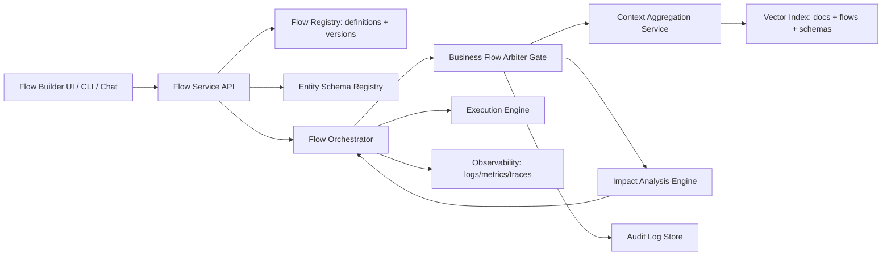
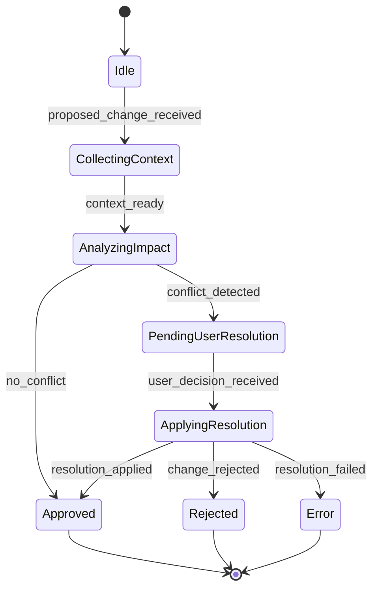
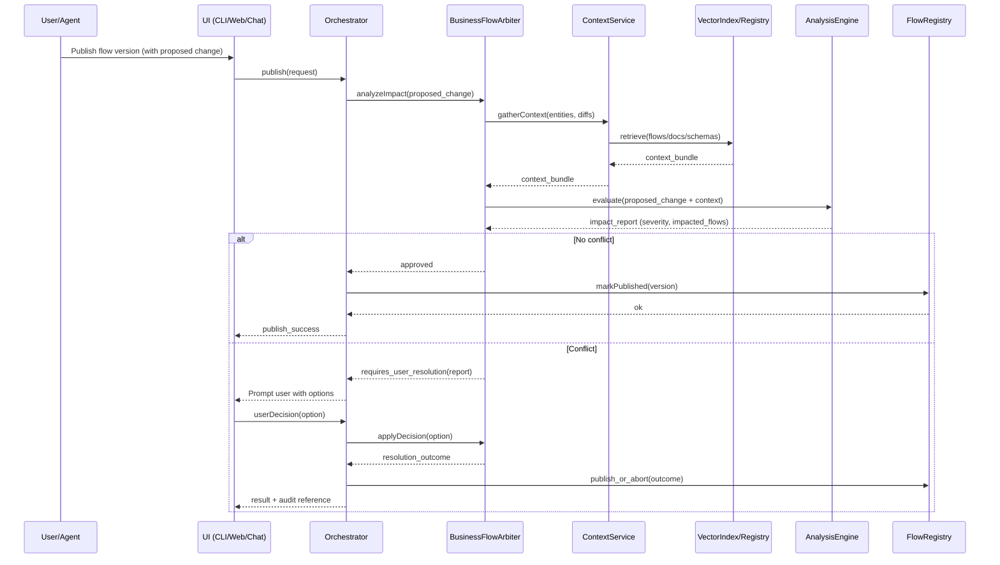
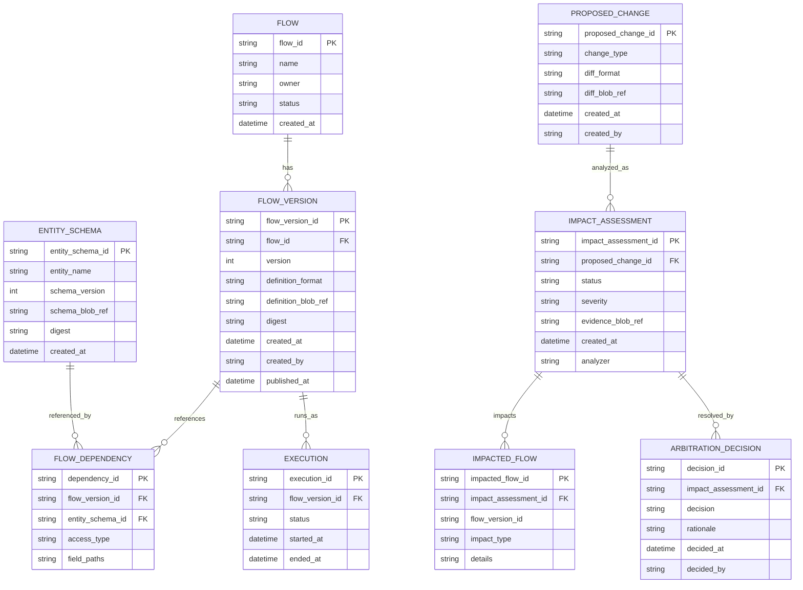
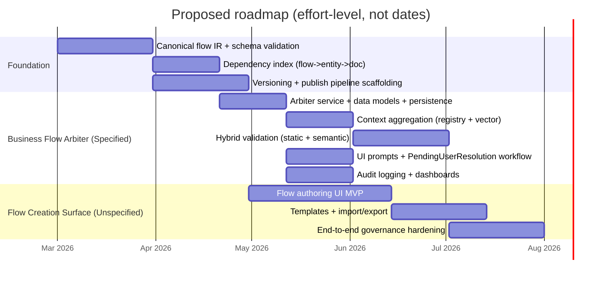

# Extending the Engine for Flow Creation and Cross-Flow Business Logic Arbitration

## Executive summary

Only one of the purported “25-*” attachments was available in the current workspace: **“25 - Business flow arbitr.md”** (local upload). The other 24 “25-*” documents and the “project basic prompt” were **not present**, so all requirements outside this single attachment are explicitly marked **UNSPECIFIED** throughout this report.

From the available attachment, the clearest, high-priority requirement is to add a **Business Flow Arbiter**: an **impact-analysis “gatekeeper”** that checks whether proposed changes (code/schema/flow edits such as delete/edit of an entity used by other flows) would break previously-defined business logic; and if so, **halts** and asks the user to decide how to proceed, with an explanation of impacted processes (attachment, lines 1–5, 13–20, 43–67). This is a governance step that resembles a “validating admission” gate: requests are evaluated, can be rejected, and can be forced only through explicit policy/decision—analogous to the validating phase and rejection semantics in admission control systems. citeturn7search1

The attachment’s proposed implementation leverages three main subsystems: (a) **context aggregation** across prior flows/docs/schemas using a registry plus vector search (“Elasticsearch/Pinecone” in the doc), (b) an **analysis engine** (explicitly LLM-driven in the attachment) that detects logical collisions and state-transition incompatibilities, and (c) a **human-in-the-loop orchestration pause/resume** that produces a structured impact report and solicits a resolution (attachment, lines 15–20, 33–67). Vector retrieval is a plausible fit for this context-gathering step because dense-vector kNN search is specifically designed for semantic similarity retrieval over unstructured documents. citeturn6search0turn6search3turn7search6

Because the broader “flow-creation capability” requirements are missing, this report provides:
- A **requirements map** extracted from the single attachment plus a comprehensive “UNSPECIFIED” scaffold for the missing documents.
- A **concrete design** for the Business Flow Arbiter (data model, APIs, orchestration state machine, sequence diagrams, and tests).
- A **flow-creation platform blueprint** that stays explicitly conditional (“proposed / UNCONFIRMED”) and compares industry-standard workflow representations (DAG/state machine/BPMN/OpenAPI workflows) to guide decisions once the 24 missing attachments are available. citeturn2search0turn2search1turn1search2turn5search5

## Requirements synthesis from available sources

This section maps what is actually specified in the only available attachment, and flags everything else as **UNSPECIFIED** pending the missing “25-*” files and the project’s basic prompt.

### Requirements extracted from “25 - Business flow arbitr.md” (available)

| Category | Requirement | Source | Status | Notes / acceptance intent |
|---|---|---|---|---|
| Functional | Add a **Business Flow Arbiter** that validates proposed changes do not break previously-defined business logic | Attachment lines 1–5 | SPECIFIED | Must detect cross-flow impacts when an entity participating in multiple flows is edited/deleted; prevents silent regressions (attachment lines 1–5). Conceptually aligned with change impact analysis (CIA) approaches that trace downstream effects. citeturn3search9 |
| Functional | Arbiter must look across **relevant flows, documentation, and database entities** | Attachment line 1 | SPECIFIED | Implies a dependency index between entities ↔ flows ↔ docs. A practical approach is to maintain an explicit dependency graph plus retrieval-based enrichment. citeturn2search0turn6search0 |
| Functional | If breakage is detected, the system must **request a user decision** and explain impacted processes and how they’re affected | Attachment lines 4–5, 43–67 | SPECIFIED | Requires a “pause-and-yield” orchestration state and an interactive UX channel, consistent with a gating controller that can reject or require explicit override. citeturn7search1 |
| Functional | Integrate Arbiter as a **gatekeeper node** in an **execution DAG** prior to finalization/deploy | Attachment lines 13–14 | SPECIFIED | DAG-based orchestration matches common workflow engines where dependencies control execution order rather than task internals. citeturn2search0 |
| Functional | Implement **context aggregation** via an existing context service and RAG interfaces; query a vector DB and flow-definition registry | Attachment lines 15–16 | SPECIFIED | Dense-vector and kNN retrieval are canonical for semantic search over docs, supporting “retrieve all relevant flows/docs/schemas.” citeturn6search0turn7search6 |
| Functional | Implement **impact analysis engine** (LLM prompted as an architect) to flag logical collisions, broken dependencies, invalid state changes | Attachment lines 17–18 | SPECIFIED | CIA is an established discipline; LLM adds semantic reasoning but should be combined with deterministic static checks for safety. citeturn3search9turn9search2 |
| Functional | If high severity, orchestrator pauses and routes an interactive prompt via CLI/Web/Chat | Attachment line 19 | SPECIFIED | Requires orchestration state machine and persistence of “pending user resolution” state; correlates with state machine workflow patterns. citeturn2search1turn9search2 |
| Functional | Provide “resolution options” like refactor flows, reject change, backwards-compatibility, force proceed | Attachment lines 52–67 | SPECIFIED | This is effectively a policy decision record that must be audited and traceable. Logging guidance recommends consistent log management practices and retention. citeturn8search2turn8search45 |
| Data model | Introduce an arbiter interface and core models: ProposedChange, ArbiterResult, ImpactReport, UserDecision | Attachment lines 69–86 | SPECIFIED | These map naturally into API resources + persistence tables; ProposedChange can be represented as a diff/patch (e.g., JSON Patch). citeturn1search7 |
| Integration | Register as a governance “skill” (Skill 64) and insert after code generation before deployment | Attachment lines 105–153 | SPECIFIED | This defines the pipeline order dependency. The concept parallels a validating gate inserted late in a change pipeline. citeturn7search1 |

### Requirements for “flow creation capability” (missing sources)

Because the other 24 “25-*” documents and the “project basic prompt” were not available, the following core areas are **UNSPECIFIED** and must be treated as placeholders:

| Area | Requirement statement | Status |
|---|---|---|
| Flow authoring UX | How users create flows (visual builder vs DSL vs code-first; required UI actions; roles) | UNSPECIFIED |
| Flow modeling | Whether flows are DAGs, state machines, BPMN-like processes, or hybrids; supported control-flow constructs | UNSPECIFIED |
| Runtime semantics | Execution guarantees (exactly-once vs at-least-once), retries, compensation, long-running state, determinism rules | UNSPECIFIED |
| Versioning | How flow versions are published, migrated, rolled back; compatibility policies across active executions | UNSPECIFIED |
| Data plane | Required entity/schema modeling, schema evolution rules, how flows bind to entities and external systems | UNSPECIFIED |
| Security | AuthN/AuthZ model, multi-tenancy, secrets, policy constraints for “dangerous operations” in flows | UNSPECIFIED |
| Observability | Required metrics/traces/logs, SLOs, audit requirements, dashboards and alerting | UNSPECIFIED |

To proceed safely without guessing, the rest of this report provides **(a)** a complete design for the **Business Flow Arbiter** (specified), and **(b)** a proposed, standards-informed blueprint for flow creation that is explicitly labeled “proposed/UNCONFIRMED” and intended to be reconciled once the missing documents are available. Industry workflow representations span DAG-based orchestration, explicit state machines, and formal process notations; each comes with different authoring and validation implications. citeturn2search0turn2search1turn1search2turn9search2

## Architecture extension and component impact

### Overall extension concept

The attachment positions the Business Flow Arbiter as a governance gate in the engine pipeline (attachment lines 13–20, 151–153). This is most robust when implemented as a **hybrid**:

1. **Deterministic static checks**: dependency graph + schema diff classification (breaking vs non-breaking), state-machine transition compatibility checks, and “known rules” enforcement.
2. **Retrieval-augmented semantic analysis**: use vector retrieval over flows/docs to assemble the change context; then apply an LLM (or rules engine) to detect higher-level business logic collisions that static checks may miss.

This hybrid reduces reliance on probabilistic output while still capturing domain semantics described in documentation, which is exactly the context the attachment calls for. citeturn6search0turn7search6turn3search9

### Engine components to modify

The following table maps the requested engine components (parsing, orchestration, persistence, execution, UI, security, logging, monitoring) to concrete changes, distinguishing what is **specified** vs **proposed**:

| Component | Needed change | Specified by attachment? | Key risks | Mitigation pattern |
|---|---|---:|---|---|
| Parsing | Extract **entity references** and CRUD intents from flow definitions and/or code diffs; parse flow JSON/YAML into an AST/IR | PARTIAL (implied: “detect CRUD on entity”) | False negatives (missed dependencies), inconsistent parsing across authoring formats | Define a canonical intermediate representation; validate with JSON Schema; add an indexed “flow ↔ entity” map. citeturn1search0turn1search7 |
| Orchestration | Add Arbiter as a **gatekeeping node** before publish/deploy; support pause/resume and “PendingUserResolution” state | YES (explicit) | Deadlocks and “stuck” changes; unclear SLA for pending decisions | Persist arbitration state; implement timeouts + escalation; model as explicit state machine. citeturn2search1turn9search2 |
| Persistence | Store proposed changes, extracted dependencies, impact assessments, user decisions, audit trail | YES (implied by models) | Audit gaps; inability to reproduce why decision was made | Immutable decision records; attach evidence links (flow versions, schema snapshots). Logging best practices emphasize retention planning and centralized management. citeturn8search2turn8search45 |
| Execution | (Proposed) Execute flows from a versioned definition; isolate published versions; allow “compat mode” | NO (UNSPECIFIED) | Backward compatibility across running executions | Adopt explicit versioning markers; test replays/compatibility where applicable (pattern used in durable workflow systems). citeturn4search4turn4search1 |
| UI | Create UX for impact report + decision capture (CLI/web/chat); allow preview of affected flows | YES (explicit channels) | Decision fatigue; unclear impact explanations | Structured impact report schema; severity ranking; show “blast radius” and suggested fixes. citeturn3search9 |
| Security | AuthZ for who can publish, who can override, and for “force proceed”; protect against unsafe workflow operations | PARTIAL (implied by “force proceed”) | Abuse of force overrides; unsafe operations from untrusted flow docs | Policy-based restrictions; least privilege; security guidance for workflow descriptions warns that untrusted docs can trigger harmful network operations. citeturn5search5turn2search9 |
| Logging | Audit every arbitration decision, forced override, impacted flows; log retention and integrity | PARTIAL (implied) | Missing forensic trail | Follow centralized log management guidance; ensure adequate retention/storage planning. citeturn8search2turn8search8 |
| Monitoring | Metrics: arbitration rate, block rate, override rate, time-to-decision; tracing across services | PROPOSED | Observability gaps; hard to debug governance failures | Instrument with OpenTelemetry-style logs/traces/metrics correlation; standardize trace context. citeturn1search8turn10search5turn10search1 |

### Standards-informed alternatives for flow representation

Because “flow creation capability” requirements are absent, selecting a flow representation is a major design fork. The following comparison is intended to be reconciled with the missing “25-*” files.

| Option | Fit for “flow creation” | Strengths | Weaknesses | Best when |
|---|---|---|---|---|
| Internal JSON/YAML DSL + JSON Schema validation | High (proposed) | Fully customizable; schema-driven validation; easy to store and diff; YAML allows human-friendly authoring | Custom tooling burden; risk of DSL drift without formal semantics | You want tight integration with your engine and custom governance rules. citeturn1search0turn9search0 |
| BPMN 2.0 (from entity["organization","Object Management Group","standards consortium"]) | Medium | Formal business-process notation; strong ecosystem and modeling concepts | Mapping to executable semantics can be complex; tooling integration overhead | Business stakeholders require a standard process notation. citeturn1search2 |
| State-machine JSON (e.g., “ASL-like”; entity["company","Amazon Web Services","cloud provider company"] popularized via Step Functions) | High | Clear, explicit execution semantics; natural for runtime; supports choice/wait/parallel/map patterns | Tight semantics may constrain domain-specific constructs; may require “query language” conventions | You want deterministic runtime behavior and clear state transitions. citeturn2search1turn2search2 |
| OpenAPI workflows (Arazzo; entity["organization","OpenAPI Initiative","api specification org"]) | Medium–High (if flows are API-call sequences) | Standard way to describe sequences of API calls + dependencies; explicitly designed for “workflow docs,” testing, and deterministic invocation | Scoped primarily to API-operation workflows; may not model all internal actions | Your flows orchestrate APIs and you want spec-driven test generation and documentation. citeturn5search5turn5search1 |
| SCXML statecharts (entity["organization","World Wide Web Consortium","web standards body"]) | Medium | Formal state machine notation with test suites and interoperability focus | Less common in modern infra stacks; may feel heavy | You need formal statechart semantics and portable execution. citeturn9search2 |

The attachment already references “execution DAG” and JSON flow files (e.g., “…flow.json”), suggesting your current model may already be closer to DAG/JSON than BPMN. DAG orchestration is a well-established approach where dependency relationships define run order rather than task internals. citeturn2search0

### Proposed high-level architecture diagram



This diagram intentionally separates registry/schema concerns from orchestration and from arbitration; it also makes the “context aggregation” path explicit (the attachment’s requirement). Vector retrieval is a common way to implement context aggregation over documentation and historic flow definitions. citeturn6search0turn7search6

### Arbiter orchestration state machine (specified)



This is the minimal state machine needed to support the attachment’s “pause execution” and “request the user” behavior. State-machine-driven workflows are a standard execution model for orchestrators; they also map cleanly to persistence requirements because each transition can be recorded as an event. citeturn2search1turn2search2turn9search2

### Publish-time sequence diagram (specified + proposed glue)



The “hard stop” on detected conflicts is exactly the pattern described in validating admission stages: validation occurs, and if rejected, the request fails unless an explicit policy path allows overrides. citeturn7search1turn7search3

## Data model, API contracts, and events

### Proposed canonical data schema (implements specified arbiter, supports flow creation)

Even with missing sources, the attachment explicitly names the arbiter-facing models: `ProposedChange`, `ArbiterResult`, `ImpactReport`, and `UserDecision` (attachment lines 69–86). The following schema extends those into a full flow-creation platform model while clearly separating “specified” vs “proposed” fields.

**Proposed ER model (Mermaid ER)**



This model enables: (a) fast static “blast radius” queries via `FLOW_DEPENDENCY`, and (b) auditable decisions via immutable `IMPACT_ASSESSMENT` and `ARBITRATION_DECISION`. Both are consistent with the attachment’s requirement to enumerate affected processes and to solicit explicit decisions. Logging and audit controls are commonly treated as long-lived artifacts requiring centralized management and retention planning. citeturn8search2turn8search8

### Proposed API contract surface

The user requested API contracts; the most interoperable approach is to publish them as an OpenAPI description and validate payloads with JSON Schema. citeturn0search2turn1search0

**API resources (proposed, except where explicitly in the attachment):**

| API | Purpose | Status |
|---|---|---|
| `POST /flows` | Create a new flow (draft) | UNSPECIFIED in sources (proposed) |
| `POST /flows/{flowId}/versions` | Create a new version (draft) | UNSPECIFIED (proposed) |
| `POST /flows/{flowId}/versions/{version}/validate` | Validate syntax + schema + static dependency extraction | UNSPECIFIED (proposed) |
| `POST /flows/{flowId}/versions/{version}/publish` | Publish; triggers arbiter gate | PARTIAL (arbiter-before-deploy is specified; publish endpoint is proposed) |
| `POST /impact-assessments` | Run Business Flow Arbiter analysis on a `ProposedChange` | SPECIFIED conceptually (attachment’s `AnalyzeImpactAsync`) |
| `GET /impact-assessments/{id}` | Fetch impact report | SPECIFIED conceptually |
| `POST /impact-assessments/{id}/decision` | Submit user decision and rationale | SPECIFIED conceptually (`ApplyUserResolutionAsync`) |

**Partial updates**: if flows are stored as JSON/YAML, supporting PATCH is best done via standardized JSON Patch (`application/json-patch+json`) to reduce custom diff formats and simplify auditing. citeturn1search7

**Example: Impact assessment request (proposed payload shape)**  
(Keep in mind: exact fields beyond the attachment’s named models are **UNSPECIFIED**.)

```json
{
  "proposedChange": {
    "changeType": "ENTITY_SCHEMA_UPDATE",
    "target": "UserProfile",
    "diffFormat": "JSON_PATCH",
    "diff": [
      { "op": "remove", "path": "/properties/billingAddress" }
    ]
  },
  "contextHints": {
    "flowIds": ["06-marketplace-listing-flow"],
    "maxRelatedFlows": 50
  }
}
```

JSON Patch is explicitly intended for partial JSON document modifications and is widely used with HTTP PATCH. citeturn1search7

### Events and audit trail

Flow creation + arbitration benefits from eventing for traceability and integration. A pragmatic proposal is to publish internal events in **CloudEvents** format for interoperability. The CloudEvents project exists to standardize event metadata across systems and is under the CNCF. citeturn10search2turn10search6turn9search1

**Proposed event types (CloudEvents `type`):**
- `com.yourorg.flow.version.created`
- `com.yourorg.flow.version.validation.completed`
- `com.yourorg.flow.version.publish.requested`
- `com.yourorg.flow.arbiter.assessment.completed`
- `com.yourorg.flow.arbiter.decision.recorded`
- `com.yourorg.flow.version.published`

**Audit and log management**: arbitration decisions, overrides, and impacted-flow reports should be logged with strong retention and integrity controls; log-management guidance explicitly emphasizes planning, centralization, and lifecycle handling of logs. citeturn8search2turn8search45

### Security model considerations

The Arazzo specification (OpenAPI workflows) explicitly warns that workflow descriptions may be written by untrusted third parties and can cause safe or unsafe operations on arbitrary network resources; it places responsibility on the consumer to ensure operations are not harmful. That warning generalizes directly to any flow-definition language that can trigger external actions. citeturn5search5turn2search9

For API authentication/authorization, OAuth 2.0 provides a widely standardized framework for delegated access and scoped tokens. citeturn0search0turn0search3  
For API security posture, OWASP’s API Security Top 10 highlights risks around business-flows exposure and inventory management, which are directly relevant when introducing a “flow creation” surface and a “force proceed” path. citeturn2search7turn2search9

Observability should use correlated logs/traces/metrics; OpenTelemetry defines signal correlation and trace-context propagation expectations. citeturn1search5turn10search5turn10search1

## Implementation plan and roadmap

### Prioritized delivery phases

Because most flow-creation requirements are missing, the roadmap prioritizes what is **actually specified** (Business Flow Arbiter) while creating foundational capabilities that are nearly always prerequisites for flow creation: versioning, validation, dependency indexing, and publishing gates.



This plan treats the arbiter as a publish-time gate, consistent with the attachment’s “before code is finalized or deployed” integration requirement. citeturn2search0turn7search1

### Task list with effort, dependencies, and risk/mitigation

Effort is expressed as **Low / Medium / High** as requested.

| Priority | Task | Effort | Depends on | Key risks | Mitigation |
|---:|---|---|---|---|---|
| P0 | Define canonical Flow IR and validate definitions with JSON Schema | High | None | DSL ambiguity; incompatible authoring formats | Use JSON Schema dialect; maintain converters from YAML/JSON; add strict validation output. citeturn1search0turn9search0 |
| P0 | Build dependency extraction: flow ↔ entity schema references, access type (read/write/delete) | High | Flow IR | Missed references; incomplete blast radius | Deterministic extraction + unit tests; store dependencies persistently for queries. citeturn3search9 |
| P0 | Implement `IBusinessFlowArbiter` + persistence models (`ProposedChange`, `ImpactReport`, `UserDecision`) | Medium | Dependency index | Unclear state ownership; data loss | Model as state machine + durable storage of each transition. citeturn2search1turn9search2 |
| P0 | Orchestrator integration: insert arbiter gate before publish/deploy; add `PendingUserResolution` | Medium | Arbiter service | Stuck publishes; deadlocks | Timeouts + escalation; persisted pending state; deterministic transition rules. citeturn7search1 |
| P0 | Context aggregation: retrieve relevant flows/docs/schemas using registry + vector search | Medium | Dependency index | Over/under-retrieval; irrelevant context | Hybrid retrieval: deterministic dependency query + semantic retrieval from vector DB. citeturn6search0turn7search6 |
| P1 | Static “breaking change” classifier (schema diff rules, required-field removals, transition removals) | Medium | Flow IR + schemas | False positives block work | Calibrated severity model; allow “override” with audit. citeturn3search2turn8search2 |
| P1 | Semantic analysis (LLM) prompt + structured output contract | Medium | Context aggregation | Hallucinations; nondeterminism | Constrain output via schema; require evidence links; treat as advisory unless corroborated by static checks. citeturn1search0turn3search9 |
| P1 | UX: impact report rendering + decision capture in CLI/Web/Chat | Medium | Orchestrator pause/resume | Confusing options | Standardize 4-option decision set (refactor/reject/compat/force), as in attachment; require rationale. citeturn2search9turn8search2 |
| P1 | Audit trail + central logging + retention policies | Medium | Arbiter + orchestration | Missing forensic trace | Adopt log management planning guidance; ensure “force proceed” is always logged. citeturn8search2turn8search8 |
| P2 | Observability instrumentation (metrics, traces, correlation IDs) | Medium | Orchestrator + APIs | Partial traces; hard debugging | Use OpenTelemetry correlation and context propagation conventions. citeturn1search8turn10search5turn10search1 |
| P2 | Flow authoring UI (visual builder) | High | Flow IR + APIs | UI diverges from runtime semantics | Generate UI from schema/IR; round-trip tests (UI → IR → UI). citeturn2search1turn1search0 |

### Architecture choices for the arbiter: alternatives table

The attachment proposes LLM-based review. In practice, governance gates are more reliable as hybrids.

| Approach | What it catches | Reliability | Ops cost | Recommendation |
|---|---|---:|---:|---|
| Pure static dependency + schema/transition rules | Explicit breakages: deleted required fields, removed transitions, renamed entities | High | Low–Med | Baseline “must-have” for safety in publish gates. citeturn1search0turn9search2 |
| Pure semantic/LLM analysis | “Business meaning” conflicts hidden in prose docs and implicit rules | Medium | Med–High | Useful, but insufficient alone for a gate because outputs are probabilistic. citeturn3search9 |
| Hybrid (static gate + semantic augmenter) | Both explicit and implicit impacts; can generate human-readable explanations | High | Med | Best fit for the attachment’s intent: deterministic prevention + explainability. citeturn6search0turn3search9 |

## Testing and validation criteria

### Test strategy overview

The attachment’s critical success condition is: **no silent break of prior business logic**, and when a breaking change is detected, the system must **stop and ask** the user with an explanation of affected processes. These are best validated through a layered test strategy: unit tests for deterministic extraction and diffing, integration tests for orchestration pause/resume and context retrieval, and end-to-end tests for full publish workflows. citeturn3search9turn7search1

### Test matrix

| Test level | Area | Test case | Expected result | Acceptance criteria |
|---|---|---|---|---|
| Unit | Dependency extraction | Given a flow that reads and deletes `EntityA`, extractor yields references with access types `{read, delete}` | Deterministic dependency set | 100% repeatable; no missing dependencies across supported syntax. citeturn2search0 |
| Unit | Schema diff classifier | Removing required field from entity schema is classified as “breaking” | Severity = high | Classifier matches JSON Schema rules for required properties. citeturn1search0 |
| Unit | State compatibility | Removing a transition required by another flow’s expected states is flagged | Conflict detected | Aligns with state machine consistency concepts. citeturn2search2turn9search2 |
| Unit | Decision applier | “Reject change” decision causes publish to fail and records audit | Publish blocked; audit record written | Decision is immutable and traceable. citeturn8search2 |
| Integration | Orchestrator gating | Publishing triggers arbiter; on conflict, orchestration enters `PendingUserResolution` | Pipeline pauses | Restart-safe: recovery resumes in the same state. citeturn7search1turn9search2 |
| Integration | Context aggregation | For entity X, context service retrieves flows/docs/schemas referencing X based on dependency index and semantic retrieval | Context bundle returned | Recall threshold defined (UNSPECIFIED numeric target). Vector retrieval returns semantically similar docs. citeturn6search0turn7search6 |
| Integration | LLM output contract | Analysis engine returns output that validates against an ImpactReport JSON Schema | Valid structured report | Reject/redo if output violates schema. citeturn1search0 |
| E2E | “Delete shared field” scenario | Attempt to delete `UserProfile.billingAddress` referenced by checkout flow | Arbiter blocks; user prompted with options; publish result depends on decision | Prompt must list impacted flows and explain impact (attachment lines 52–67). citeturn2search9 |
| E2E | Override path | “Force proceed” requires elevated permission and is fully audit-logged | Publish allowed only with privilege; audit includes rationale | Meets API security and auditing expectations for sensitive business flows. citeturn2search7turn8search2 |
| E2E | Observability | Arbitration + decision + publish produce correlated trace/log identifiers | Cross-service correlation works | OpenTelemetry context propagation is present in logs/traces. citeturn10search5turn10search1 |

### Validation criteria

Because core flow-creation requirements are missing, only arbiter-specific validation criteria can be asserted as “required” from available sources:

- **Hard stop on detected conflicts** before publish/deploy, with explicit user decision required (attachment lines 13–20, 43–67). This mirrors a validating-gate pattern where rejecting validation halts the request. citeturn7search1  
- **Impact report completeness**: for each high-severity conflict, list impacted flows and describe the nature of impact, not just “failed validation” (attachment lines 52–67). This aligns with change impact analysis principles emphasizing traceable downstream effects. citeturn3search9  
- **Auditability**: every decision (especially “force proceed”) must be recorded with retention and integrity; centralized log management guidance stresses lifecycle handling and retention planning. citeturn8search2turn8search8

Everything else (performance targets, multi-tenancy behavior, UI requirements for creation/editing, runtime semantics) remains **UNSPECIFIED** until the missing “25-*” documents and the basic prompt are available.