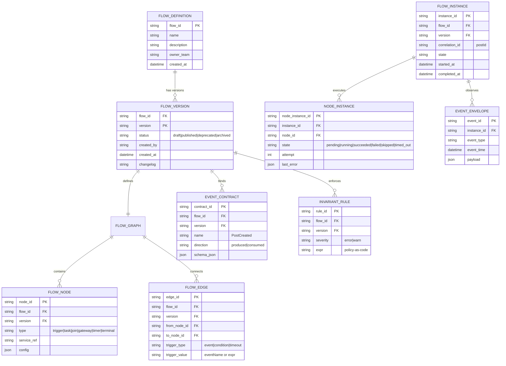
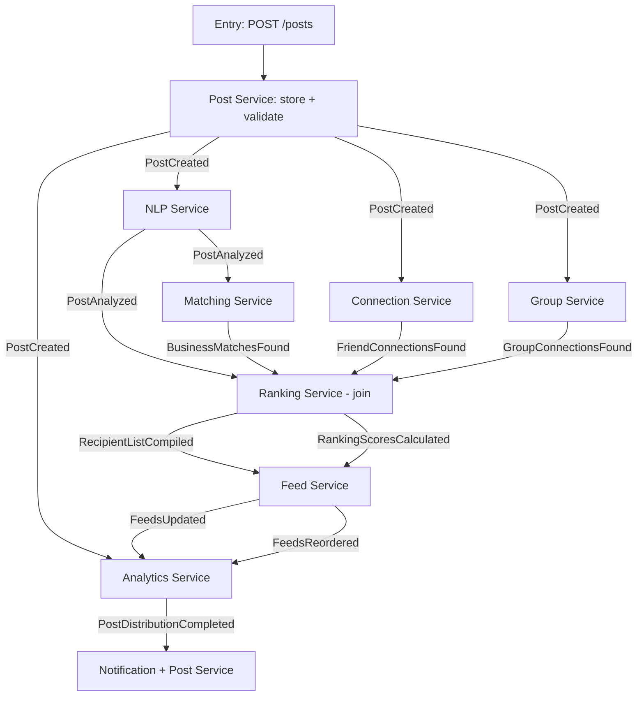
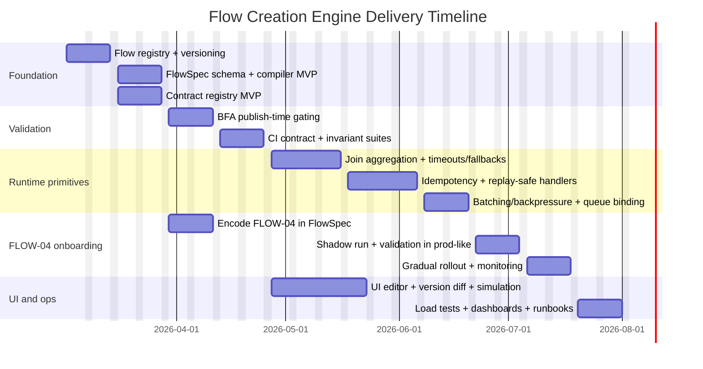

# Extending the Engine to Support Flow Creation for FLOW-04 and Other 04-* Flows

## Executive summary

The only primary project source available in this workspace is the 04-* document **“Post Publishing & Feed Distribution”** (Flow ID **FLOW-04**, version **1.0**, last updated **2026-02-25**). fileciteturn0file0L1-L6 All other presumed **04-*** documents and the project’s **basic prompt** were **not accessible** via the available project sources/tools at the time of this analysis; consequently, this report treats them as unavailable and explicitly marks any resulting assumptions.

FLOW-04 describes a **multi-service, event-driven pipeline** starting at `POST /posts`, running **parallel audience matching** (business, connections, groups), joining at a **ranking step**, then writing into recipient feeds with **tiering, diversity controls, batching/caching**, and publishing analytics/completion events. fileciteturn0file0L10-L20 fileciteturn0file0L28-L54 fileciteturn0file0L81-L104 The spec also calls out **security/privacy enforcement** (especially visibility constraints), rate limits, and sensitive data handling (NLP outputs + social graph). fileciteturn0file0L123-L134 Finally, it explicitly mentions integrating the flow into a **Business Flow Arbiter (BFA)** validation framework, adding task types like `RANKING_COMPOSITE_CALCULATOR` and `FEED_REORDER_EXECUTOR`, and using a queue service for throughput. fileciteturn0file0L314-L366

To support “flow creation” as implied by this document style, the engine must evolve from “runtime plumbing” into an end-to-end system that can: (a) **ingest declarative flow specs**, (b) **validate contracts/invariants**, (c) **persist and version flow definitions**, (d) **compile them into executable orchestration artifacts** (subscriptions, joins, retries/timeouts), (e) offer a **UI/UX to author and review flows**, and (f) provide **migration, compatibility, and testing scaffolding** so new/updated flows don’t break old ones.

## Source collection and analysis

### Available primary sources

Only one 04-* document is available:

- `04-post-publishing.md` (FLOW-04) fileciteturn0file0L1-L6

### Unavailable sources that the request assumes exist

The following were **not available** in the accessible project sources for this run:

- Any other `04-*` documents (e.g., `04-something-else.md`)
- The project’s “basic prompt” (often a canonical template describing how flows should be specified)

Because those are missing, this report extracts requirements from FLOW-04 and generalizes into an engine design that can support **FLOW-04-class flows** (event-driven, parallel branches + join, strong data contracts, high throughput distribution).

### What FLOW-04 implies about the flow model constraints

FLOW-04 is not a single linear workflow; it is a **graph**:

- A synchronous **entry point**: `POST /posts` with prerequisites (authenticated, profile complete). fileciteturn0file0L28-L33  
- A set of services (post, NLP, matching, connections, groups, ranking, feed, analytics) with a **documented event chain** including a **join point** at ranking output (“RecipientListCompiled” → feed-service). fileciteturn0file0L33-L54  
- A **scoring model** with weights and thresholds that determine tier placement. fileciteturn0file0L55-L86  
- Operational constraints: batching and caching tiers (Redis TTLs; batch sizes for matching/ranking/feed updates). fileciteturn0file0L95-L104  
- Security constraints such as enforcing visibility at the feed layer, preventing graph enumeration, and rate limiting posting. fileciteturn0file0L123-L134  
- A formal event contract table listing event names, publishers/consumers, and key payload fields. fileciteturn0file0L253-L266  
- Explicit guidance to integrate into a BFA-like contract/invariant validator, plus “task type catalog” extensions and queue integration for throughput. fileciteturn0file0L314-L366  

In other words: flow creation must support **(1) declarative graphs**, **(2) contracts**, **(3) invariants**, **(4) non-functional constraints (performance/security)**, and **(5) versioning and evolution**.

## Flow creation requirements derived from FLOW-04

This section maps the spec into a requirements checklist for “flow creation” support in the engine: capabilities, entities, events/states/transitions, validation rules, UI/UX, and persistence.

### Flow creation features

A “flow creation” feature set sufficient for FLOW-04 must support:

- **Declarative flow definition** (metadata + graph): flow id, version, entry point, prerequisites, participating services. fileciteturn0file0L1-L6 fileciteturn0file0L28-L41  
- **Event-driven edges**: steps connected by events such as `PostCreated`, `PostAnalyzed`, `RecipientListCompiled`, etc. fileciteturn0file0L43-L54  
- **Parallel branches**: the spec requires running at least three matching processes in parallel (matching, connection, group), then joining for ranking. fileciteturn0file0L16-L20 fileciteturn0file0L155-L173  
- **Join semantics**: a declared (or inferred) join requires correlation on `postId` and waiting for required upstream results (or declared fallbacks/timeouts). fileciteturn0file0L169-L173  
- **Parameterized business logic**: ranking weights, tier thresholds, diversity constraints, batching/caching parameters. fileciteturn0file0L55-L104  
- **Scenario/variant support**: visibility-based branching (connections-only), content-type variations (poll boost), mention rules, high-follower progressive batching, “post edited” re-run logic. fileciteturn0file0L182-L235  
- **Operational policy**: failure modes and fallback behavior (e.g., “NLP failure = skip analysis, distribute to friends/groups only”). fileciteturn0file0L145-L146  

### Data model and entities that the engine must persist

To support creating and operating flows like FLOW-04, the engine needs first-class entities beyond “task execution”:

Core definition entities:

- **FlowDefinition**: stable identifier (`FLOW-04`), name, description, tags, owner.
- **FlowVersion**: semantic version-ish or integer, status (`draft|published|deprecated|archived`), createdBy, createdAt, change log.
- **FlowGraph**: nodes + edges (or a compiled representation).
- **Node**: typed nodes (“trigger”, “task”, “join”, “gateway/condition”, “timer”, “terminal”).
- **Edge**: `fromNode` → `toNode` labeled by event type or condition.
- **Contract**: JSON schema or typed schema per event + per HTTP endpoint; in FLOW-04 the event contract table is explicit. fileciteturn0file0L253-L266  
- **Invariant / Policy**: machine-checkable rules (e.g., required event must occur before completion), tied to BFA. fileciteturn0file0L314-L321  

Runtime entities (critical for observability, replay, and support):

- **FlowInstance**: correlation keys (`postId`), current state, startedAt, completedAt, lastEventAt, actor/tenant.
- **NodeInstance / StepInstance**: per-node status, attempt counts, retries, error payloads.
- **EventEnvelope**: stored/retained minimally for audit/debugging (with retention rules).
- **JoinAggregationState**: per join node, which upstream branches have arrived, and deadlines/timeouts.

The need to track execution state and event history is consistent with durable workflow concepts: storing an “event history” (or at minimum a structured execution log) enables reconstruction, audit, and debugging. This is a core idea in workflow engines that rely on recorded events to advance or recreate state. citeturn4search1

### Events, states, and transitions

FLOW-04 defines domain events and a pipeline; for flow creation, the engine must model both:

- **Domain events** (business events): `PostCreated`, `PostAnalyzed`, `BusinessMatchesFound`, etc. fileciteturn0file0L253-L266  
- **Engine events** (control-plane): `FlowVersionCreated`, `FlowVersionPublished`, `FlowValidationFailed`, `FlowInstanceStarted`, `NodeStarted`, `NodeCompleted`, `NodeFailed`, `JoinTimedOut`, etc.

Recommended state machines:

- **FlowVersion state**: `draft → (validated) → published → deprecated → archived`
- **FlowInstance state (FLOW-04-shaped)**:  
  `created → analyzing → matching_parallel → ranking_join → distributing → completed`  
  with exits to `failed` and sub-states for “degraded mode” (e.g., “skip NLP”). fileciteturn0file0L145-L146  
- **Node/Step state**: `pending → running → succeeded|failed|skipped|timed_out → (retry?)`

Because FLOW-04 includes large fanout operations (N recipients) and idempotent re-execution assumptions (“Feed Service writes are idempotent”), node instances should include idempotency keys and dedupe logic. fileciteturn0file0L223-L224

### Validation rules and invariants to support FLOW-04

The engine’s flow-creation validator must support multiple classes of checks:

Schema-level checks:

- Flow graph must be connected; no orphan nodes.
- Every edge references a declared event type or condition.
- Join nodes must declare required upstream edges and join strategy (“all”, “any”, “quorum”, “timeout + fallback”).

Contract checks:

- Event payload fields must exist and match schemas (e.g., `RankingScoresCalculated` must contain `rankedRecipients[]{userId, compositeScore, tier, position}`). fileciteturn0file0L262-L264  
- Producer/consumer compatibility: if a service consumes an event, it must bind to the versioned contract.

Invariant checks (BFA-style):

- FLOW-04 explicitly states an invariant: a post cannot reach “Distribution Completed” without an NLP analysis payload. fileciteturn0file0L318-L321  
- Privacy/visibility invariants: “private must never appear in other users’ feeds” and visibility must be enforced at feed-service, not just UI. fileciteturn0file0L127-L133  
- Rate-limit/security invariants: “10 posts/hour per user” and input sanitization. fileciteturn0file0L130-L132  

Non-functional checks (linting style):

- Fanout risk classification: detect steps that can cause 10K+ writes and require batching configuration. fileciteturn0file0L140-L142  
- Required operational hooks: alerts thresholds for latency/backlog/errors. fileciteturn0file0L144-L145  

### UI/UX requirements for flow creation

Even without the project’s “basic prompt,” FLOW-04 implies authoring needs beyond raw YAML:

- Visual graph editing (parallel branches + join point) consistent with the existence of a “Drawio Diagram” reference. fileciteturn0file0L3-L5  
- Structured forms for:
  - Event contracts (tables like “Event Definitions”) fileciteturn0file0L253-L266  
  - Parameterized policies (ranking weights, tier thresholds, diversity rules, batching configs) fileciteturn0file0L55-L104  
- Validation feedback in-editor (schema errors, invariant failures, missing join inputs).
- Version comparison (“diff” between versions) and promotion gates (“draft → published”).
- Access control: only authorized roles can publish flows; privileged operations need audit logs (least privilege principle). citeturn5search0  

### Persistence needs

At minimum, support:

- **Definition store**: flow definitions and versions (small, read-heavy) → relational DB or document store.
- **Contract registry**: versioned schemas (JSON Schema recommended for payload validation). JSON Schema’s current specification line (2020-12) and meta-schema concept is a strong fit for machine validation and tooling. citeturn0search1  
- **Runtime store**: flow instances / step instances / joins (write-heavy during execution); must scale with fanout.
- **Event log** (selective retention): for debugging and compliance (especially for sensitive events).

For event envelope standardization, adopting a well-known format such as **CloudEvents** reduces ad hoc event shape drift and improves routing/observability interoperability; CloudEvents defines a common set of required attributes and multiple transport bindings. citeturn1search6

## Engine extension design

This section identifies engine components to extend, integration points, API changes, compatibility risks, scalability concerns, security posture, and testing strategy.

### Components to add or extend

Based on FLOW-04 plus the BFA/task-catalog references, the engine should be extended with these modules:

**Flow Registry and Versioning**

- Stores FlowDefinition + FlowVersion + status.
- Exposes API for create/update/validate/publish/deprecate.
- Enforces immutability of published versions; new changes create a new version.

**Flow Compiler**

- Parses declarative flow specs (YAML/JSON/UI graph) into an internal IR:
  - Normalized graph (nodes/edges)
  - Join definitions
  - Contract bindings
  - Execution policies (timeouts/retries/fallback handling)
- Emits runtime artifacts:
  - Event subscriptions (consumer groups)
  - Queue/topic names
  - Join aggregation keys
  - Derived invariants for BFA checks

**Event Contract Registry + Validator**

- Prefer using JSON Schema-compatible validation workflows for payloads. citeturn0search1  
- Generates (or exports) event API documentation; the event-driven equivalent of OpenAPI is AsyncAPI, which is designed to describe message-driven APIs in a machine-readable form. citeturn0search2  
- For HTTP APIs, align with OpenAPI for discoverability and tooling (client/server/test generation). citeturn5search3  

**Join/Aggregation Runtime (“Wait-for-X”)**

FLOW-04’s ranking join requires waiting on multiple upstream signals. fileciteturn0file0L169-L173 This is a core orchestration primitive:

- Correlate by `postId`
- Track partial arrivals (business matches, friend graph, group members)
- Decide when to proceed:
  - `ALL_REQUIRED`
  - `TIMEOUT_THEN_FALLBACK` (consistent with flow’s fallback narratives) fileciteturn0file0L207-L214  

**Task Types Catalog Extensions**

FLOW-04 explicitly calls for new engine-recognized task/event types for ranking and feed reorder execution. fileciteturn0file0L363-L365 This implies:

- A central catalog of task kinds, their required inputs/outputs, and validation hooks.
- A compatibility layer for older task definitions.

**Business Flow Arbiter Integration**

The spec expects FLOW-04 to be registered in BFA so that contract enforcement and invariants prevent regressions. fileciteturn0file0L314-L321 Operationally, this is a “policy-as-code” system that should run:

- At publish time (blocking gate)
- In CI for service changes affecting contracts
- Optionally at runtime sampling for telemetry “contract drift” detection

### Integration points

**Event bus / queue integration**

The spec references integrating a Redis queue service for high-throughput feed distribution. fileciteturn0file0L363-L365 To support flow creation, the engine should treat “transport” as a pluggable runtime binding:

- Redis Streams / PubSub / queues (if already present)
- Kafka/RabbitMQ later (optional), without changing flow definitions

**Service-to-skill mapping**

FLOW-04 includes a mapping from services to “skills” indexes such as “52-post-service”, “54-ranking-service”, etc. fileciteturn0file0L282-L292 The flow engine should formalize this mapping as a Service Registry:

- Service/skill identifier
- Supported event consumers and producers
- Contract versions supported
- Deployment metadata (optional)

### API changes

To truly support flow creation, the engine needs a first-class Flow Management API.

Because OpenAPI provides a standard, language-agnostic interface description for HTTP APIs, the engine should publish these endpoints with an OpenAPI document for toolchain integration. citeturn5search3

Example API surface (illustrative):

- `POST /flows` create a new FlowDefinition (draft)
- `POST /flows/{flowId}/versions` create a new draft version (copy-from optional)
- `POST /flows/{flowId}/versions/{version}/validate` run schema + invariant validation
- `POST /flows/{flowId}/versions/{version}/publish` publish the version (immutable)
- `GET /flows/{flowId}/versions/{version}` retrieve source (YAML/JSON + compiled IR)
- `GET /flows/{flowId}/versions/{version}/contracts` list bound event schemas
- `POST /flows/{flowId}/simulate` run a dry-run simulation with synthetic events
- `GET /flow-instances?flowId=FLOW-04&correlationId=...` trace runtime

For events, define an AsyncAPI document describing event channels/topics and message schemas. citeturn0search2

### Backward compatibility risks

Key risks and mitigations when introducing flow creation:

- **Contract drift**: services change event payloads silently; flows break at runtime. Mitigate with contract registry + CI gating via BFA. fileciteturn0file0L318-L321  
- **Version skew**: consumers not upgraded while flow publishes a new contract version. Mitigate with compatibility rules: publish requires declaring supported consumer versions; use “minimum compatible contract version” checks.
- **Replaying/editing semantics**: FLOW-04 includes “post edited after distribution” requiring re-run logic with dedupe and in-place updates. fileciteturn0file0L221-L224 This can easily become unsafe without strict idempotency keys and event ordering constraints.
- **Operational overload**: fanout and high-follower batching requires carefully tuned batch sizes and backpressure. fileciteturn0file0L140-L142 fileciteturn0file0L95-L99  

### Performance and scalability implications

FLOW-04 is explicitly “write-heavy” and can trigger **10K+ feed writes** for a popular user. fileciteturn0file0L140-L142 For flow creation, the engine must support “non-functional configuration” as first-class:

- Batch sizes per step (matching/ranking/feed injection). fileciteturn0file0L95-L99  
- Caching tiers and TTLs (Redis L1, ranking score cache, connection graph cache). fileciteturn0file0L101-L104  
- Degraded modes on partial failures (NLP failure fallback). fileciteturn0file0L145-L146  
- SLA/alerts encoded as SLO hints (post creation >3s, NLP >5s, distribution >30s). fileciteturn0file0L144-L145  

### Security and authorization concerns

FLOW-04 identifies sensitive data classes and concrete attack surfaces. fileciteturn0file0L123-L134 Flow creation amplifies risk because it introduces a new admin surface and can alter how data moves.

Minimum security requirements:

- **Least privilege**: flow publishing and contract overrides are privileged operations; enforce RBAC and audit. citeturn5search0  
- **Privacy invariants as non-bypassable**: visibility enforcement must happen in the delivery layer (feed-service) and should be encoded as a hard invariant in the engine/BFA. fileciteturn0file0L127-L133  
- **Graph privacy**: connection-service must not expose full friend list; the flow engine must not accidentally add endpoints/events that enable enumeration. fileciteturn0file0L133-L134  
- **Event envelope consistency**: a standard such as CloudEvents helps avoid ambiguous metadata and improves policy enforcement at routers/gateways. citeturn1search6  

### Testing requirements

A flow-creation engine should add testing layers beyond unit tests:

- **Schema tests**: validate every event payload against JSON schema. citeturn0search1  
- **Contract tests**: producer and consumer contract suites generated from registry.
- **Invariant tests (BFA)**: e.g., can’t reach “Distribution Completed” without NLP payload. fileciteturn0file0L318-L321  
- **Load tests**: simulate 10K–50K recipients, verify batching/backpressure compliance. fileciteturn0file0L140-L142  
- **Security tests**: privacy enforcement, injection sanitization checks, rate limit tests. fileciteturn0file0L130-L132  
- **Chaos/failure injection**: NLP timeout, matching timeout, feed cache eviction and replay behavior. fileciteturn0file0L207-L214 fileciteturn0file0L223-L224  

## Design artifacts

### Design option comparisons

#### Flow definition and orchestration approach options

| Option | Summary | Pros | Cons | Fit for FLOW-04 |
|---|---|---|---|---|
| Internal declarative flow DSL + engine runtime | Build a first-class flow graph model (nodes/edges/joins), compile to runtime subscriptions/tasks | Tight integration with BFA, task catalog, existing service “skills”; full control over join/fallback semantics | Highest engineering cost; must build UI tooling; must harden runtime | Strong fit because FLOW-04 already provides DSL-like YAML and explicit invariants fileciteturn0file0L28-L54 |
| BPMN adoption (model + engine) | Use BPMN as authoring format and engine runtime (or import BPMN into internal IR) | Mature modeling ecosystem and shared vocabulary; strong visual tooling (e.g., BPMN modelers) | Mapping event-driven distributed systems + large-fanout pipelines into BPMN can be awkward; runtime integration complexity | Partial fit: diagram-first authoring aligns with FLOW-04 having diagram references fileciteturn0file0L3-L5; BPMN standardization is a known path citeturn2search3 |
| Adopt a durable execution engine (e.g., workflow-as-code) | Use an established durable workflow engine paradigm; engine stores execution history and replays | Strong reliability story via recorded history; established patterns for retries/timeouts | Depends on determinism constraints; may be overkill if you already have event-driven microservices and only need “creation + validation” | Moderate fit if you need long-lived orchestration and detailed execution history; workflow event histories are core to such systems citeturn4search1 |

**Recommendation:** Given FLOW-04 already resembles a declarative flow spec (YAML, event chain, explicit contracts/invariants), the best fit is **Internal declarative flow DSL + engine runtime**, with optional import/export to BPMN later for collaboration.

#### Event contract documentation options

| Option | Use | Why it matters |
|---|---|---|
| AsyncAPI | Event channels, operations, and message schemas | Built for message-driven/event-driven APIs, protocol-agnostic citeturn0search2 |
| OpenAPI | HTTP endpoints (`POST /posts`, flow admin APIs) | Standard HTTP API description + tooling ecosystem citeturn5search3 |
| JSON Schema registry | Payload validation and codegen types | JSON Schema provides meta-schemas and standardized validation keywords citeturn0search1 |

### Proposed ER diagram for flow creation and runtime

The diagram below represents a pragmatic minimum model for flow definitions, versioning, contracts, and runtime instances.



### FLOW-04 control flowchart

This is the canonical FLOW-04 graph as described: entry → publish post created → NLP + connections + groups in parallel → matching post-analyzed branch → join at ranking → feed update/reorder → analytics completion. fileciteturn0file0L155-L180 fileciteturn0file0L253-L266



### API contract examples

Because FLOW-04 has both an HTTP entry point and an event pipeline, the design should treat HTTP and events as first-class, documented with OpenAPI and AsyncAPI respectively. citeturn5search3 citeturn0search2

#### Flow management APIs (engine control plane)

**Create flow (draft)**  
`POST /flows`

Request:
```json
{
  "flowId": "FLOW-04",
  "name": "Post Publishing & Feed Distribution",
  "description": "Pipeline from post publish to feed injection and analytics",
  "ownerTeam": "social-platform"
}
```

Response `201`:
```json
{
  "flowId": "FLOW-04",
  "status": "draft",
  "createdAt": "2026-02-25T10:00:00Z"
}
```

Errors:
- `409 FLOW_ALREADY_EXISTS`
- `403 FORBIDDEN`

**Create a draft version**  
`POST /flows/FLOW-04/versions`

Request:
```json
{
  "baseVersion": "1.0",
  "notes": "Adjust ranking thresholds and add join timeout fallback"
}
```

Response `201`:
```json
{
  "flowId": "FLOW-04",
  "version": "1.1",
  "status": "draft"
}
```

**Validate a draft**  
`POST /flows/FLOW-04/versions/1.1/validate`

Response `200` (valid):
```json
{
  "valid": true,
  "issues": []
}
```

Response `422` (invalid):
```json
{
  "valid": false,
  "issues": [
    {
      "severity": "error",
      "code": "MISSING_JOIN_INPUT",
      "message": "Join node ranking_join requires BusinessMatchesFound but no incoming edge found.",
      "nodeId": "ranking_join"
    },
    {
      "severity": "error",
      "code": "INVARIANT_MISSING",
      "message": "Flow may reach DistributionCompleted without PostAnalyzed payload.",
      "ruleId": "inv_require_nlp_before_complete"
    }
  ]
}
```

#### Event payload example using a CloudEvents-style envelope

CloudEvents defines standard attributes such as `id`, `source`, `specversion`, and `type`, which helps normalize event metadata across producers. citeturn1search6

Example for `PostCreated`:
```json
{
  "specversion": "1.0",
  "type": "com.example.post.created",
  "source": "post-service",
  "id": "evt_01J0ABCDEF...",
  "time": "2026-02-25T10:00:01Z",
  "subject": "post/123",
  "datacontenttype": "application/json",
  "data": {
    "postId": "123",
    "userId": "u_456",
    "content": {
      "type": "text",
      "text": "Hello world"
    },
    "visibility": "connections_only",
    "metadata": {
      "mentions": [],
      "hashtags": []
    }
  }
}
```

Time fields should follow an internet timestamp standard such as RFC 3339 to avoid ambiguity across services and logs. citeturn5search4

### Migration steps

Because the “basic prompt” and other 04-* docs are missing, the migration plan is structured to be robust even if existing flows are currently code-driven.

**Migration goal:** allow coexistence of (a) legacy, code-defined flows and (b) registry-defined flows created through the new engine.

Migration sequence:

1. **Introduce the Flow Registry in “observe-only” mode**  
   - Store flow definitions/versions but do not execute them.
   - Bind event contracts and run validations against live sampled traffic (shadow validation).

2. **Backfill contracts for one flow (FLOW-04) first**  
   - Register FLOW-04 event definitions and schemas in the contract registry. fileciteturn0file0L253-L266  
   - Add BFA invariants from the spec (e.g., NLP required before completion). fileciteturn0file0L318-L321  

3. **Introduce compiled orchestration primitives incrementally**  
   - Implement join aggregation for ranking in the runtime (or adapt ranking-service to emit “join-complete” events the engine can validate).
   - Add idempotency keys for write-heavy feed updates (the spec assumes idempotent writes). fileciteturn0file0L223-L224  

4. **Cutover per-node** (strangler pattern)  
   - Start with validation gates (publish-time + CI) before introducing any runtime routing changes.
   - Then enable runtime orchestration for a subset of traffic (feature flags).

5. **Deprecate legacy flow definitions**  
   - Only after parity: metrics, latency, correctness, and rollback mechanisms (queue replay) are proven. fileciteturn0file0L145-L146  

## Prioritized implementation plan with milestones, effort, and acceptance criteria

Effort scale: **Low** (days), **Medium** (1–2 sprints), **High** (multi-sprint / cross-team).

### Phased milestones

Phase objectives are ordered to deliver value quickly: first enable flow definition + validation + BFA gating, then add runtime orchestration, then UI.

| Phase | Deliverables | Why it’s first/next | Effort |
|---|---|---|---|
| Foundation | Flow registry (draft/publish), schema validation, contract registry | Enables safe “flow creation” without changing runtime behavior | High |
| Validation hardening | BFA integration, invariant library, CI gates | Prevents regressions, aligns with FLOW-04 requirements | Medium |
| Runtime primitives | Join aggregation, retries/timeouts, idempotency hooks, backpressure policies | Needed for FLOW-04 join + fanout + failure modes | High |
| FLOW-04 onboarding | Encode FLOW-04 as a flow definition; shadow run; then cutover | Proves the system on a complex, high-value flow | High |
| UI/UX | Visual editor, version diffs, simulations, RBAC workflows | Reduces friction; supports non-code flow creation | High |
| Operational maturity | Load/chaos tests, dashboards/alerts templates, runbooks | Matches FLOW-04 operational expectations | Medium |

### Task-level backlog with acceptance criteria

| Task | Description | Effort | Acceptance criteria |
|---|---|---|---|
| Define FlowSpec schema | JSON/YAML schema for FlowDefinition, nodes/edges, join types, params | Medium | Example FLOW-04 spec imports cleanly; schema validation catches missing join inputs |
| Contract registry | Store versioned event schemas; expose lookup APIs | Medium | `PostCreated`/`RankingScoresCalculated` schemas are retrievable and versioned; validation works against fixtures fileciteturn0file0L253-L266 |
| BFA rule engine integration | Add invariant evaluation at publish time + CI | Medium | Publishing FLOW-04 fails if NLP-before-complete invariant removed fileciteturn0file0L318-L321 |
| Task Types Catalog update | Add `RANKING_COMPOSITE_CALCULATOR`, `FEED_REORDER_EXECUTOR` | Low | Catalog lists new task types; compiler can reference them fileciteturn0file0L363-L365 |
| Join aggregation primitive | Correlate events by `postId`, wait for required upstreams, handle timeouts | High | Synthetic tests show correct proceed/fallback behavior for “all three match lists” join fileciteturn0file0L169-L173 |
| Idempotency framework | Standard dedupe keys for fanout writes + replay protection | High | Reprocessing the same `RankingScoresCalculated` does not create duplicate feed entries; post edit updates in-place fileciteturn0file0L221-L224 |
| Backpressure & batching policy | Configurable batching (500 feeds/batch) and queue integration | High | Under 50K recipients, engine respects batch sizes and does not exceed configured concurrency; queue lag alarms trip appropriately fileciteturn0file0L95-L99 fileciteturn0file0L144-L145 |
| Security/RBAC + audit | Role-based permissions for create/publish; immutable audit log entries | Medium | Only authorized roles can publish; all changes audited; least-privilege admin roles documented citeturn5search0 |
| UI graph editor | Visual modeling (parallel branches + join), schema-driven forms | High | Author can recreate FLOW-04 graph and export to FlowSpec; validation errors show in UI fileciteturn0file0L43-L54 |
| End-to-end FLOW-04 rollout | Shadow validate → limited traffic → full traffic | High | Metrics meet thresholds (post create <3s; NLP <5s; distribution <30s) and rollback exists fileciteturn0file0L144-L145 |

### Timeline Gantt-style

This is an illustrative schedule starting the next Monday after the report date (**2026-03-02**). Dates are placeholders; adjust based on team capacity.



## Open questions, assumptions, and dependencies

### Open questions (need answers to finalize design)

1. **What is the current engine architecture and scope?**  
   FLOW-04 references a BFA, task type catalog, and “skills” mapping. fileciteturn0file0L282-L292 fileciteturn0file0L314-L366 The exact existing abstractions (task runner vs workflow runtime vs validation-only) determines whether “flow creation” also implies “flow execution.”

2. **What is the canonical “basic prompt” format?**  
   Missing. This could define required sections (personas, YAML blocks, event tables) and might change the FlowSpec schema.

3. **What event transport(s) are in use today?**  
   The FLOW-04 doc mentions Redis caching and a Redis queue service. fileciteturn0file0L101-L104 fileciteturn0file0L363-L365 If Kafka/RabbitMQ are also required, the runtime binding layer must be more formal.

4. **What are the data retention and compliance requirements?**  
   FLOW-04 data includes social graph + NLP insights, which are sensitive. fileciteturn0file0L123-L126 Define retention and redaction rules for event logs and flow instance traces.

5. **How should long-lived compensation be handled?**  
   Distributed flows that span services sometimes need saga-style compensation. The original SAGAS paper formalizes the idea of constructing long-lived transactions as a sequence of sub-transactions with compensating actions. citeturn2search7 If compensation is in scope, the engine must add compensation edges and “undo” tasks.

### Assumptions made due to missing constraints or sources

- **No specific language/framework/deployment constraint** was provided; accordingly, this report assumes the engine can be implemented in any stack, but aligns examples with the FLOW-04 ecosystem (mixed Nest.js/Python services) where relevant. fileciteturn0file0L136-L143  
- Flow definitions will be authored in **YAML/JSON** and/or UI, consistent with the FLOW-04 “For AI / Code Generation” YAML block. fileciteturn0file0L28-L41  
- Event payload timestamps should use an internet timestamp profile (RFC 3339), as is common for distributed log correlation. citeturn5search4  

### External dependencies implied by FLOW-04

- Redis-like caching and a high-throughput write path for feed distribution. fileciteturn0file0L101-L104 fileciteturn0file0L140-L142  
- A contract/invariant enforcement mechanism (BFA) integrated into CI and flow publishing. fileciteturn0file0L314-L321  
- Documentation/tooling alignment for APIs and events: OpenAPI for HTTP, AsyncAPI for events, JSON Schema for payload validation. citeturn5search3 citeturn0search2 citeturn0search1