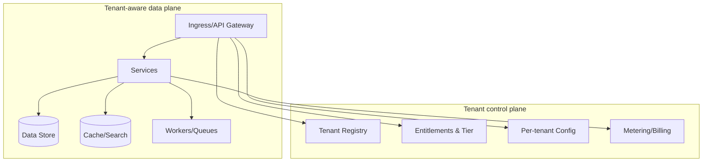
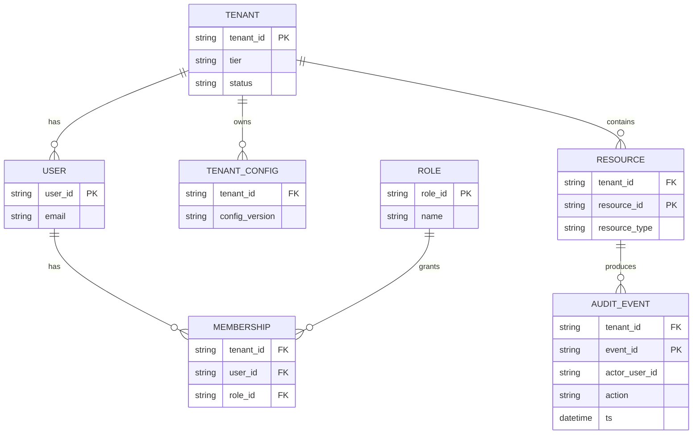
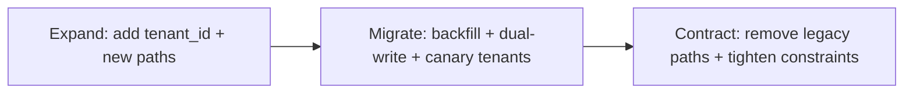

# Adapting a Single-Tenant System to a Multi-Tenant Architecture

## Executive summary

Transforming a single-tenant system into a multi-tenant system is less a “database refactor” and more a **platform redesign** that introduces a durable **tenant control plane** (tenant registry, entitlements, policies, per-tenant configuration, billing/metering, onboarding/offboarding) and makes the **entire data plane tenant-aware** (routing, authZ, data access, caches, search, async jobs, observability). citeturn9search25turn0search1turn0search0

Across mature SaaS guidance, a recurring recommendation is to avoid a false binary choice between “everything shared” and “everything isolated” and instead adopt a **hybrid (bridge)** model: you pool resources for cost and velocity while selectively siloing the tenants (or subsystems) that require stronger isolation (compliance, residency, CMK/BYOK, performance SLAs, noisy-neighbor control). citeturn0search0turn0search11turn8search3

The primary technical failure mode in multi-tenancy is **cross-tenant data exposure**, typically caused by missing tenant scoping at *some* layer (query, cache key, background worker, search index, object storage, analytics jobs) or by broken object-level authorization on ID-based endpoints. The OWASP API Security Top 10 explicitly calls out **Broken Object Level Authorization (BOLA)** as a top risk, which becomes more damaging in multi-tenant contexts because one authorization gap can become a cross-customer breach. citeturn1search2turn1search5

A rigorous adaptation program usually prioritizes **correctness and isolation guardrails before optimization**:

- Establish tenant identification and context propagation as an invariant for every request, job, and event.
- Choose a tenancy model with a credible isolation story (often shared-schema with database-level enforcement such as PostgreSQL Row Level Security, plus a path to “graduate” tenants to stronger isolation). citeturn1search0turn9search3turn8search3
- Ship multi-tenant authentication/authorization aligned to standards (OAuth 2.0 / OIDC, optional SCIM provisioning, and RBAC/ABAC with tenant attributes). citeturn2search0turn2search1turn2search2turn2search3
- Implement per-tenant operational controls (quotas, rate limits, cost attribution, tenant-scoped backup/restore) to prevent noisy-neighbor and cost blowups—another OWASP API risk category (“Unrestricted Resource Consumption”). citeturn1search12turn0search3turn5search2
- Use phased rollout/rollback patterns (expand–migrate–contract / “parallel change”) rather than a “big bang” cutover. citeturn7search3

Effort and risk are inherently system-dependent, but in typical production systems: **effort is Medium–High** and **risk is High** until tenant isolation is enforced end-to-end and tested continuously; after that, incremental tenant onboarding becomes increasingly automatable and safer. citeturn0search0turn0search3turn1search2

## Tenancy models and isolation boundaries

This section covers two requested dimensions: **tenancy models** (shared schema, separate schema, separate database) and **isolation levels** (data, compute, network).

### Tenancy models

Industry guidance commonly frames SaaS tenancy as a continuum of **pooled vs siloed**, with a **bridge/hybrid** approach enabling selective isolation where it matters. citeturn0search0turn0search11turn0search1

#### Comparison table of tenancy models

| Model | What it is | Strengths | Key weaknesses | Typical “best fit” | Effort | Risk |
|---|---|---|---|---|---|---|
| Shared schema (pooled) | One database + one schema; each row/document has `tenant_id`; enforcement is application-layer and/or DB-layer | Lowest operational overhead; easiest global schema migrations; best resource utilization | Highest blast radius if tenant scoping breaks; noisy-neighbor risks are strongest unless quotas/partitioning exist | Many small/medium tenants with similar schema and workloads; early SaaS scale | Medium | High (until guardrails mature) |
| Separate schema (logical isolation) | One database instance; schema per tenant (`tenant_a.*`) | Stronger logical isolation; easier tenant-specific export/delete; can vary indexes per tenant | Schema-migration orchestration complexity; schema sprawl; still shared compute/I/O in DB instance | Mid-market tenants; moderate compliance needs; “bridge” step before DB-per-tenant | High | Medium–High |
| Separate database (silo) | Database per tenant (or per tenant group/shard); sometimes separate clusters | Strongest data isolation and clearer compliance story; tenant-level backup/restore and tuning; reduced blast radius | Highest ops automation requirements (provisioning, migrations, monitoring); connection management complexity | Enterprise/regulatory tenants; regional residency requirements; strict SLAs | High | Medium (per-tenant isolation lowers breach blast radius, but ops risk rises) |

These tradeoffs align with the pooled/silo/bridge models described in the SaaS lens of the AWS Well-Architected framework, and with Azure’s multitenant SaaS patterns and hybrid sharded models guidance. citeturn0search0turn8search3turn0search1turn0search5

#### Implementation patterns

**Shared schema (pooled)**  
A defensible shared-schema model typically requires database or platform enforcement, not only developer discipline:

- **Tenant-scoped queries everywhere** (mandatory `tenant_id` filter) with library-level enforcement and query linting.
- **Database-enforced row-level isolation** where available. In PostgreSQL, Row Level Security (RLS) is a built-in feature enabled per-table and governed by policies. citeturn1search0turn9search3  
  For AWS pooled PostgreSQL guidance, RLS is described as required to maintain tenant isolation in pool models. citeturn9search3turn9search11
- **Indexing strategy**: make `tenant_id` part of most primary access paths via composite indexes (e.g., `(tenant_id, entity_id)`); for very large tables, consider partitioning by tenant or by time. Declarative partitioning exists in PostgreSQL; partitioning types exist in MySQL as well. citeturn8search0turn8search1turn8search7

**Separate schema**  
Schemas can work well when tenant count is moderate and automation is strong:

- **Schema registry + migrator**: a control-plane service that knows every tenant schema version and can run “N schemas” migrations safely.
- **Connection and routing**: set `search_path` (PostgreSQL) or fully-qualified schema names. If using search path, treat it as a security-sensitive surface (search-path risks are a known PostgreSQL concern; defensive configuration is recommended). citeturn8search15turn8search11

**Separate database**  
Database-per-tenant is often done with a **catalog/tenant registry** that maps tenant → database connection info, similar to Azure’s catalog/shard map patterns. citeturn8search9turn8search6turn8search16

#### Concrete examples across common stacks

- **PostgreSQL (shared schema + RLS)**: enable RLS in tables and enforce that `tenant_id` matches a session variable or role-based context; PostgreSQL RLS is defined in its official docs and configured via policies. citeturn1search0turn9search3
- **MongoDB (database-per-tenant vs shared collections)**: MongoDB’s guidance explicitly compares “each tenant in its own database” to “shared collections with a `tenantId` field,” highlighting scalability, security, and maintenance tradeoffs. citeturn1search1
- **Azure SQL (hybrid sharded multitenant)**: Azure SQL patterns describe hybrid models where schemas include tenant identifiers and databases can be “sharded,” with elastic pools for cost efficiency. citeturn8search3turn0search1turn0search5
- **Google Cloud Spanner**: Spanner documentation lays out multiple ways to implement multi-tenancy and discusses tenant lifecycle management patterns. citeturn0search2

#### Migration steps for tenancy model adoption (generic)

1. Introduce a **Tenant Registry** (even if initially only one tenant exists) and require tenant context resolution at the edge.  
2. Add `tenant_id` (or equivalent) to the logical data model and backfill existing rows with a default tenant (the legacy tenant).  
3. Enforce tenant scoping in the application layer, then add database-layer enforcement where available (e.g., PostgreSQL RLS). citeturn1search0turn9search3  
4. Make non-database layers tenant-aware: caches, search indexes, object storage prefixes, queues/topics, analytics datasets.  
5. Introduce tenant “graduation” paths: when a tenant needs higher isolation, move them to separate schema/database using controlled migration and routing updates.

Effort: **Medium–High**. Risk: **High initially**, trending to **Medium** as enforcement and testing become systematic. citeturn0search0turn1search2turn9search3

### Isolation levels

Multi-tenancy isolation should be understood as at least three layers: **data**, **compute**, and **network**, with identity as a cross-cutting control plane. AWS’s tenant isolation strategies emphasize that isolation can be achieved in multiple layers and patterns rather than purely at the database boundary. citeturn9search8turn9search4turn9search32

#### Data isolation

Pros/cons  
Data isolation improves security posture and reduces breach blast radius, but higher isolation (schema/db-per-tenant) increases operational complexity. citeturn0search0turn8search3turn1search1

Patterns  
- **Defense-in-depth tenant checks**: authorization checks (application) + enforcement checks (database) rather than choosing one or the other.  
- **Row-level policies**: Postgres RLS; Azure guidance notes row-level security features exist in some database services and can provide isolation in shared databases. citeturn1search0turn9search1turn0search5  

Examples  
- PostgreSQL RLS policies for shared schema. citeturn1search0turn9search3  
- Azure SQL row-level security feature availability guidance. citeturn9search1turn0search5

Effort: **Medium**. Risk: **High** (because mistakes cause cross-tenant exposure).

Migration steps  
1. Define “tenant boundary” for every entity and relationship (including join tables).  
2. Add tenant scoping to queries and repositories; enforce via shared libraries and code review gates.  
3. Add DB-level enforcement where possible (RLS/policies). citeturn1search0turn9search3

#### Compute isolation

Pros/cons  
Compute isolation reduces noisy-neighbor performance coupling and can meet sharper SLAs, but costs more and requires stronger automation. AWS describes fully isolated silo models as dedicated stacks per tenant (including account-based isolation) for strong boundaries. citeturn0search0turn9search4

Patterns  
- **Shared compute with quotas and autoscaling**: in Kubernetes, mapping tenants to namespaces enables using resource quotas and other controls. citeturn0search3turn0search32  
- **Tenant-dedicated compute** for premium tenants: separate node pools, separate clusters, or separate cloud accounts/projects (silo patterns). citeturn9search4  
- **Autoscaling**: Kubernetes Horizontal Pod Autoscaling automatically adjusts replicas to match demand. citeturn10search0

Examples  
- Kubernetes multi-tenancy guidance describes mapping tenants to namespaces and applying resource quotas. citeturn0search3turn0search32  
- Kubernetes HPA for scaling tenant-facing workloads. citeturn10search0

Effort: **Medium** (shared compute) to **High** (dedicated compute). Risk: **Medium** (availability/SLO impact) to **High** (cost blow-ups without quotas).

Migration steps  
1. Introduce tenant-level quotas (CPU/memory/request limits, job concurrency limits). citeturn0search3turn1search12  
2. Add tenant-tiered scaling rules; ensure HPA policies don’t allow one tenant to starve others. citeturn10search0  
3. Implement “promotion to dedicated compute” workflow for high-tier tenants (with clear success metrics).

#### Network isolation

Pros/cons  
Network isolation mitigates lateral movement and reduces blast radius, but often requires disciplined policy management and compatible networking infrastructure. Kubernetes NetworkPolicies allow control of pod traffic at L3/L4; enforcement depends on the network plugin. citeturn5search0

Patterns  
- **Default-deny + explicit allow** between tenant namespaces in Kubernetes. citeturn5search0turn0search3  
- **Pod security hardening**: Kubernetes Pod Security Standards define baseline/restricted profiles to reduce privilege escalation paths. citeturn5search1turn5search24  
- **Cloud network segmentation** (VPC/subnet/account/project) for higher isolation tiers; AWS whitepaper patterns include subnet-per-tenant and account-level isolation. citeturn9search32turn9search4

Examples  
- Kubernetes NetworkPolicy isolation patterns. citeturn5search0  
- Pod Security Standards and admission. citeturn5search1turn5search24  
- AWS subnet silo isolation. citeturn9search32

Effort: **Medium**. Risk: **Medium** (misconfiguration can cause outages) but **high value** for stronger defense-in-depth.

Migration steps  
1. Document tenant network boundaries (what is allowed cross-tenant and why).  
2. Implement default-deny policies in shared clusters, then add explicit allow rules for shared services (logging, metrics). citeturn5search0  
3. Enforce Pod Security Standards at namespace-level and phase in restricted policies for sensitive workloads. citeturn5search1turn5search14

## Tenant-aware identity and authorization

This section covers the requested **authentication/authorization** dimension: tenant-aware identity, SSO, RBAC/ABAC.

### AuthN foundations and tenant-aware identities

Pros/cons  
Using standardized identity protocols enables SSO and enterprise onboarding, but multi-tenancy adds complexity: issuer validation, tenant-specific configuration, and preventing identity data leakage across tenants. citeturn2search1turn11search1

Implementation patterns  
- **OAuth 2.0 + OpenID Connect**: OAuth 2.0 is the IETF standard authorization framework; OIDC defines authentication on top of OAuth 2.0 and defines claims about the authenticated user. citeturn2search0turn2search1  
- **Tenant resolution** at the edge (subdomain, hostname, or explicit tenant ID) and binding tokens/claims to a tenant context.  
- **SCIM provisioning** (optional) for enterprise tenants to automate user/group lifecycle; SCIM is an IETF standardized protocol for cross-domain identity management. citeturn2search2  
- **“Don’t build your own IdP”**: Azure guidance explicitly warns that building your own IdP is complex and not recommended. citeturn11search1

Concrete examples  
- **Multi-tenant OIDC**: Use a shared OIDC integration, but enforce strict issuer/audience/tenant checks per tenant configuration, and store a tenant’s IdP metadata (issuer URL, client IDs, allowed domains) in the tenant control plane. OIDC core defines claims to communicate end-user information. citeturn2search1turn11search1  
- **SCIM**: Provide SCIM endpoints per tenant, mapping SCIM groups to tenant roles. citeturn2search2

Effort: **Medium–High**. Risk: **High**, because identity flaws can produce cross-tenant authentication or authorization bypass.

Migration steps  
1. Introduce a Tenant Registry that stores tenant identity configuration (domains, IdP metadata, SSO enabled flag).  
2. Standardize login flows on OAuth2/OIDC and implement consistent issuer/audience validation. citeturn2search0turn2search1  
3. For enterprise tenants, add SCIM provisioning and map SCIM groups to roles/attributes. citeturn2search2  

### Authorization models: RBAC and ABAC in a tenant context

Pros/cons  
- **RBAC** is easier to reason about and audit but can become role-explosive when tenants demand fine-grained rules.  
- **ABAC** is more flexible and expressible but increases policy complexity and requires mature policy tooling and testing.

NIST defines ABAC as an access control methodology where authorization decisions evaluate subject attributes, object attributes, operations, and sometimes environment conditions against policy. citeturn2search3

Implementation patterns  
- **Two-level scoping**: (1) tenant-level entitlement to a resource type, then (2) object-level authorization within the tenant. This directly addresses OWASP’s repeated emphasis that object-level checks must exist for every endpoint that accesses objects by an ID. citeturn1search5turn1search2  
- **Policy engine**: externalize ABAC rules into a policy service or library so they are consistent across microservices and background workers.  
- **Least privilege for operator roles**: separate “platform operator” (cross-tenant operational tasks) from “tenant admin” (within-tenant admin tasks).

Concrete examples  
- RBAC: `Role = BillingAdmin` scoped to `tenant_id = T123` granting invoice operations but not data export.  
- ABAC: allow data export only if `tenant.tier == enterprise`, `user.department == finance`, and request originates from a managed device, which fits the NIST ABAC definition’s use of subject/object/environment attributes. citeturn2search3

Effort: **Medium** (RBAC) to **High** (ABAC). Risk: **High** if policies are inconsistent across services and asynchronous processing.

Migration steps  
1. Implement object-level authorization checks as a mandatory gate for all ID-addressed endpoints and worker handlers. citeturn1search5turn1search2  
2. Add tenant-scoped RBAC first (to stabilize), then incrementally introduce ABAC for complex enterprise requirements. citeturn2search3  
3. Add authorization regression suite that asserts “cross-tenant access is impossible” for representative endpoints and workflows.

## Data partitioning, migration, and tenant lifecycle

This section covers: **data partitioning and migration strategies** and key operational aspects of **tenant onboarding/offboarding** as they relate to the data model.

### Data partitioning strategies beyond “where the tables live”

Pros/cons  
Partitioning improves performance and enables better workload isolation, but adds complexity in query design, indexing, and maintenance. PostgreSQL supports declarative partitioning; MySQL supports multiple partitioning types (range/list/hash/key). citeturn8search0turn8search7turn8search1

Implementation patterns  
- **Tenant-keyed physical partitioning** (where appropriate): partition large shared tables by tenant, or by tenant+time where workloads are time-series-like (events/audit).  
- **Sharding / database-per-tenant routing**: Azure’s sharding pattern describes a lookup map routing data requests to shards; for multitenancy, tenant ID is often the shard key. citeturn8search16turn8search6  
- **Tiered partitioning**: small tenants pooled; large tenants get dedicated shards.

Concrete examples  
- PostgreSQL: use declarative partitioning for large multi-tenant tables; official docs describe partitioning capabilities and constraints. citeturn8search0  
- MySQL: hash/key partitioning to distribute rows across partitions; official docs describe how hash partitioning works and why it’s used. citeturn8search1turn8search4  
- Azure: use shard maps + elastic jobs to manage sharded databases. citeturn8search6turn8search9

Effort: **Medium–High**. Risk: **Medium** (performance regressions) to **High** (if routing consistency is broken).

Migration steps  
1. Establish tenant_id as a **stable primary partition key** (even if you keep one tenant at first).  
2. Add composite indexes and validate query plans for tenant-filtered access paths.  
3. If needed, introduce partitions/shards incrementally and move tenants via controlled routing updates.

### Migration strategies from single-tenant to multi-tenant

Pros/cons  
- **Big-bang** migrations are sometimes faster in calendar time but carry concentrated risk.  
- **Phased migrations** reduce blast radius and enable rollback, but require discipline and temporary compatibility work.

A widely used approach for backward-incompatible changes is **parallel change (expand-and-contract)**, explicitly described by Martin Fowler as “expand, migrate, contract.” citeturn7search3

Implementation patterns  
- **Expand**: add tenant columns, new tables, new routing logic, or new APIs in a backward-compatible way; write both old and new paths. citeturn7search3  
- **Migrate**: backfill data, migrate traffic per tenant (canary tenants first), and verify invariants.  
- **Contract**: remove legacy paths only after you have high confidence and monitoring coverage. citeturn7search3

Concrete examples  
- Database schema: add `tenant_id` nullable; backfill; then make non-nullable; then add enforcement policies (e.g., RLS) once all access paths pass tenant context. citeturn1search0turn7search3  
- Request routing: gradually enable tenant routing at the gateway and propagate context through services; standardize error handling for missing/invalid tenant context using RFC 7807 problem details (useful for consistent “tenant not found/forbidden” errors). citeturn10search3

Effort: **High**. Risk: **High**, because you are changing core invariants.

Migration steps (practical sequence)  
1. Add Tenant Registry + internal tenant context object; require its presence in request handling and jobs.  
2. Expand schema to include tenant identifiers and backfill legacy data.  
3. Introduce enforcement step-by-step (library checks → DB policies). citeturn9search3turn1search0  
4. Canary: onboard a small set of internal tenants (or synthetic tenants) and run full test suite.  
5. Contract: remove single-tenant assumptions and disable legacy bypasses.

### Tenant onboarding and offboarding (data lifecycle)

Pros/cons  
Automated onboarding/offboarding reduces operational toil and is often required for scale, but it must be safe because it touches provisioning, secrets, and data deletion.

Implementation patterns  
- **Automated provisioning**: create tenant record, allocate resources, initialize schemas, create per-tenant secrets, set quotas, run smoke tests.  
- **Tenant deletion**: orchestrate deletes across primary DB, indexes, caches, and object storage; produce auditable evidence of completion.

Concrete examples  
- Google Cloud guidance for multi-tenant platforms handling untrusted code stresses structuring resource hierarchy (folders/projects) and automating onboarding without humans in the loop, reflecting the operational reality that manual provisioning doesn’t scale. citeturn9search2

Effort: **Medium** to **High**. Risk: **Medium** (operational) and **High** if deletion is incomplete or deletes the wrong tenant.

Migration steps  
1. Implement “dry-run” onboarding that provisions metadata without touching production data stores.  
2. Add idempotent provisioning (safe to retry) and strong audit logs for each step.  
3. Implement offboarding with multi-step verification and a quarantine period (disable access first, then delete).

## Tenant configuration, customization, and extensibility

This section covers the requested dimensions: **configuration management per tenant** and **customization/extensibility** (feature flags, per-tenant plugins).

### Per-tenant configuration management

Pros/cons  
Per-tenant configuration enables differentiated offerings (plans, limits, integrations), but becomes a dependency for every request path; failures or inconsistency can become a systemic outage.

Implementation patterns  
- **Hierarchical config**: global defaults → plan defaults → tenant overrides → environment overrides (dev/stage/prod).  
- **Strong typing + validation**: configs should be schema-validated and versioned.  
- **Control-plane caching**: cache tenant config at edge/services with short TTLs and explicit invalidation.

Concrete examples  
- Cloud resource labeling and tagging—while not “application config”—illustrates how major clouds operationalize metadata across tenants and org units for cost and governance:  
  - AWS cost allocation tags support categorizing and tracking costs. citeturn5search2  
  - Google Cloud labels integrate with billing reports for cost analysis by label. citeturn5search3  
  - Azure tags can be used to group and allocate costs; Azure cost allocation guidance highlights tags as key-value metadata. citeturn11search3turn11search0

Effort: **Medium**. Risk: **Medium** (availability risk due to central dependency).

Migration steps  
1. Create a tenant config schema and a config service (or module) with versioning and validation.  
2. Move “single-tenant config” into tenant-scoped config with defaults.  
3. Add runtime caching and fallback behavior for config read failures.

### Customization and extensibility

Pros/cons  
- Customization (feature toggles, theme differences, tenant-specific workflows) can drive revenue and adoption.  
- Extensibility (plugins) can create large security and reliability risks, especially if plugins can execute code or call out to external systems.

Implementation patterns  
- **Feature flags by tenant**: feature flagging is widely used to enable/disable functionality without code changes; OpenFeature defines a vendor-agnostic API specification for feature flagging. citeturn7search0turn7search33  
- **Entitlements as policy**: treat “enabled features” as entitlements derived from plan and tenant config; avoid branching logic scattered across services.  
- **Plugin model options** (in rising order of risk):  
  1. **Configuration-only plugins** (webhook callbacks, templates)  
  2. **Declarative extensions** (rules, policies)  
  3. **Sandboxed code execution** (highest risk; requires strong isolation)

Concrete examples  
- Feature flags: adopt OpenFeature SDK, and evaluate flags based on tenant attributes (tenant tier, region, entitlements). citeturn7search0turn7search33  
- If running any tenant-supplied/untrusted code, adopt stronger isolation boundaries. Google Cloud guidance for multi-tenant platforms specifically calls out separating first-party code projects from projects running untrusted tenant code. citeturn9search2

Effort: **Medium** (feature flags) to **High** (plugins). Risk: **Medium** (feature flags) to **High** (plugins/untrusted code).

Migration steps  
1. Introduce feature flags for multi-tenancy gating and per-tenant rollouts. citeturn7search0  
2. Define a plugin contract with strict allowlists, timeouts, and audit logging.  
3. For code execution, require tenant isolation at compute and network layers (separate projects/clusters) and treat onboarding/offboarding as security-sensitive. citeturn9search2turn5search0

## Security, compliance, operations, testing, and rollback

This section covers four requested dimensions: **security and compliance**, **operational concerns**, **testing strategies**, and **rollback/compatibility**.

### Security and compliance

Pros/cons  
- Multi-tenancy can improve cost efficiency but increases impact of a single isolation bug; therefore, compliance and security controls must be **tenant-aware by design**. citeturn0search0turn1search2

Implementation patterns  
- **Encryption**: NIST defines AES as a FIPS-approved cryptographic algorithm for protecting electronic data. citeturn4search13  
- **Key management lifecycle**: NIST SP 800-57 provides key-management guidance and best practices. citeturn4search1  
- **Envelope encryption / customer-managed keys**:  
  - Google Cloud KMS envelope encryption guidance describes CMEK as an added layer of protection and control over encryption keys. citeturn4search3  
  - AWS client-side encryption documentation references performing envelope encryption using AWS KMS keys. citeturn4search15  
  - Azure Storage customer-managed keys overview describes using a customer-managed key to protect and control access to the key that encrypts data. citeturn11search2  
- **Audit logs and access evidence**: tenant-scoped audit events that capture actor, action, resource, and tenant; retention policies per tenant tier.  
- **GDPR/CCPA operational implications**:  
  - GDPR Article 32 includes encryption and the ability to restore availability/access to personal data in a timely manner, plus regular testing of security measures. citeturn3search15  
  - The California Attorney General’s CCPA page explains that service providers are treated differently than businesses, and consumers must submit requests to the business (not the service provider). This impacts how your SaaS contracts and workflows should handle requests received indirectly. citeturn3search2

Concrete examples  
- Per-tenant CMK: enterprise tenants can require customer-managed keys; implement tenant binding `tenant_id → key_id`, and enforce that data encryption/decryption uses the tenant’s key policy. citeturn4search3turn11search2  
- GDPR-driven controls: implement tested restore procedures and evidence of security testing as part of your platform SRE/security program, consistent with Article 32. citeturn3search15

Effort: **High**. Risk: **High** (security posture is existential for SaaS).

Migration steps  
1. Threat model cross-tenant risks (DB, caches, search, storage, logs, operator tooling).  
2. Implement encryption-at-rest + in-transit; add CMK for tenants who require it. citeturn4search3turn11search2  
3. Implement tenant-scoped audit logs and run restore drills; document evidence. citeturn3search15  
4. Build privacy workflows for deletion/export with tenant-scoped correctness validation.

### Operational concerns

This dimension includes scaling, monitoring, backup/restore, cost allocation, and tenant onboarding/offboarding.

Pros/cons  
- Shared infrastructure improves utilization but creates noisy-neighbor and blast-radius challenges; dedicated infrastructure reduces coupling but increases operational load. citeturn0search0turn0search3

Implementation patterns  
- **Scaling**: Kubernetes HPA automatically scales workloads to match demand. citeturn10search0  
- **Monitoring and tenant observability**: use consistent instrumentation and carry tenant identifiers in telemetry metadata; OpenTelemetry is a vendor-neutral observability framework for generating/collecting/exporting traces, metrics, and logs. citeturn10search1turn10search9  
- **Backup/restore**: tenant-aware restore is a differentiator.  
  - PostgreSQL: `pg_dump` provides logical backup and restore flexibility via `pg_restore`; PostgreSQL documents three backup approaches including continuous archiving (PITR). citeturn6search0turn6search8turn6search1  
  - MySQL: point-in-time recovery depends on binary logs; MySQL documentation describes PITR using binary logs and also describes `mysqldump` for logical backups. citeturn6search2turn6search13  
  - MongoDB: `mongodump`/`mongorestore` are documented tools for backup and restore. citeturn6search3turn6search24  
- **Cost allocation / chargeback**:  
  - AWS cost allocation tags support tracking costs by tag. citeturn5search2  
  - Google Cloud labels feed into billing reports for grouping/filtering costs. citeturn5search3  
  - Azure cost allocation guidance highlights tags for cost grouping/allocation. citeturn11search3

Concrete examples  
- Tenant-aware quotas in Kubernetes namespaces: Kubernetes multi-tenancy guidance emphasizes using quotas for tenants mapped to namespaces. citeturn0search3turn0search32  
- Network isolation using NetworkPolicies to separate tenant namespaces, noting enforcement depends on the network plugin. citeturn5search0  
- Tenant-aware backups: in database-per-tenant models, backups/restores can be executed per tenant database; in shared-schema models, you need a tenant-level export/restore mechanism (often application-driven) because database-native tools are not tenant-granular.

Effort: **Medium–High**. Risk: **Medium** (availability/cost) to **High** (incorrect restore or poor isolation).

Migration steps  
1. Define tenant SLOs and tier-based quotas; implement rate limiting to reduce resource-consumption risk. citeturn1search12turn0search32  
2. Implement tenant-aware telemetry and dashboards (tenant labels and per-tenant error budgets). citeturn10search1turn10search9  
3. Implement backup/restore runbooks and routine restore drills; design tenant-level restore where contractually required. citeturn6search8turn6search10turn6search3  
4. Implement metering and chargeback tag/label strategy aligned to cloud provider tooling. citeturn5search2turn5search3turn11search3

### Testing strategies

Pros/cons  
Multi-tenant correctness is difficult to test with ordinary unit tests alone because failures appear as emergent cross-layer interactions (cache keys, async jobs, authorization). The payoff is high: strong testing is one of the few ways to be confident about isolation.

Implementation patterns  
- **Isolation regression tests**: every endpoint and worker handler gets “cross-tenant negative tests” that attempt to access tenant B data from tenant A credentials. OWASP’s emphasis on object-level authorization failures implies the need for systematic testing of ID-based access boundaries. citeturn1search5turn1search2  
- **Property-based testing** for tenant scoping invariants: “for all resource IDs, the resolved tenant must match the caller tenant.”  
- **Contract tests for events**: ensure that events include tenant metadata and consumers enforce it (CloudEvents can standardize event metadata; CloudEvents is a CNCF project and specification for describing event data in common formats). citeturn10search18turn10search2  
- **Load and noisy-neighbor tests**: simulate one tenant spiking to ensure quotas prevent cluster/DB starvation (aligns with “Unrestricted Resource Consumption” risk). citeturn1search12turn0search32

Concrete examples  
- Tenant isolation tests: for a “GET /orders/{id}” endpoint, generate an order in tenant B, then call the endpoint as tenant A and assert 404/403; repeat for update/delete and background jobs. citeturn1search5  
- Cache tests: write the same logical key under two tenants and ensure cache keys are tenant-prefixed; validate by reading after forced cache warmups.

Effort: **Medium**. Risk reduction: **High** (testing is a primary mitigation for silent isolation regressions).

Migration steps  
1. Add test harness that can create tenants and seed data in isolated contexts.  
2. Add negative cross-tenant tests to CI as a gating suite; treat failures as release blockers.  
3. Introduce periodic “tenant isolation chaos tests” in staging (rotate tenants, force cache evictions, replay jobs).

### Rollback and compatibility

Pros/cons  
Rollbacks are more complex in multi-tenancy because you might need tenant-specific rollback without breaking other tenants; however, phased deployment patterns make this manageable.

Implementation patterns  
- **Parallel change (expand–migrate–contract)** for schema and API changes to preserve compatibility and enable rollback. citeturn7search3  
- **Per-tenant rollout controls** via feature flags (OpenFeature provides a vendor-agnostic feature flagging API). citeturn7search0turn7search33  
- **Safe error formats**: standardized API error responses can help troubleshooting and tool-based rollout gating; RFC 7807 defines Problem Details for HTTP APIs. citeturn10search3

Concrete examples  
- Roll out multi-tenancy enforcement in phases: first log-only detection (audit mode), then soft enforcement (warnings), then hard enforcement for canary tenants, and finally for all tenants.

Effort: **Medium**. Risk: **High** if rollback is not planned; **Medium** with proven playbooks.

Migration steps  
1. Enforce backward compatibility in migrations; require “expand first” changes only. citeturn7search3  
2. Use tenant-scoped feature flag gates to roll out enforcement and quickly disable for a tenant if needed. citeturn7search0  
3. Only contract/remove legacy paths after a defined stability window and evidence (metrics, audits, incident-free period).

### Migration roadmap table

The plan below uses **relative timelines** (no calendar dates), with owner roles shown as placeholders. Milestones are sequenced to reduce existential risks first (tenant boundary correctness) and delay optimization/dedicated isolation until you can operate pooled multi-tenancy safely. citeturn0search0turn7search3turn1search2

| Milestone | Timeline (relative) | Owner (placeholder) | Success criteria |
|---|---|---|---|
| Tenant boundary definition and inventory | T0–T1 | Architecture Lead | All entities categorized as tenant-scoped vs global; tenancy invariants documented (what must never cross tenants) |
| Tenant Registry + routing contract | T1–T2 | Platform Team | Every request/job/event has a resolved tenant context; missing tenant context fails safely |
| Data model expansion (`tenant_id`) + backfill | T2–T4 | Data/DB Team | All tenant-scoped tables/collections carry tenant identifiers; legacy tenant data backfilled; no downtime allowed |
| Enforcement phase one (application-layer) | T3–T5 | Service Owners | Shared libraries enforce tenant scoping; cross-tenant tests pass in CI; OWASP BOLA mitigations implemented citeturn1search5 |
| Enforcement phase two (DB/platform enforcement where possible) | T4–T6 | Data/DB Team | RLS/policy enforcement enabled where supported; attempts to query without tenant context are blocked citeturn1search0turn9search3 |
| Tenant-aware authN/authZ + SSO base | T3–T6 | Identity Team | OAuth/OIDC integrated; tenant-scoped RBAC live; ABAC model defined for enterprise needs citeturn2search0turn2search1turn2search3 |
| Tenant config service + entitlement model | T4–T7 | Platform Team | Versioned per-tenant config; safe caching; per-tenant feature gates enabled |
| Observability and metering baseline | T4–T8 | SRE/Platform | Tenant-labeled telemetry; per-tenant dashboards; cost allocation via tags/labels works in cloud tooling citeturn10search1turn5search2turn5search3turn11search3 |
| Backup/restore drills and tenant-level restore plan | T5–T9 | SRE + DB Team | Tested restore procedures; tenant-level export/delete correctness validated; compliance evidence captured citeturn6search8turn3search15 |
| Tenant onboarding/offboarding automation | T6–T10 | Platform Team | Fully automated provisioning and deprovisioning with audit trails; deletion workflows verified |
| Hybrid isolation tiering (schema/db-per-tenant “graduation”) | T8–T12 | Platform + DB Team | Ability to migrate a tenant to stronger isolation without impacting others; routing and monitoring remain correct citeturn0search11turn8search3turn8search16 |

