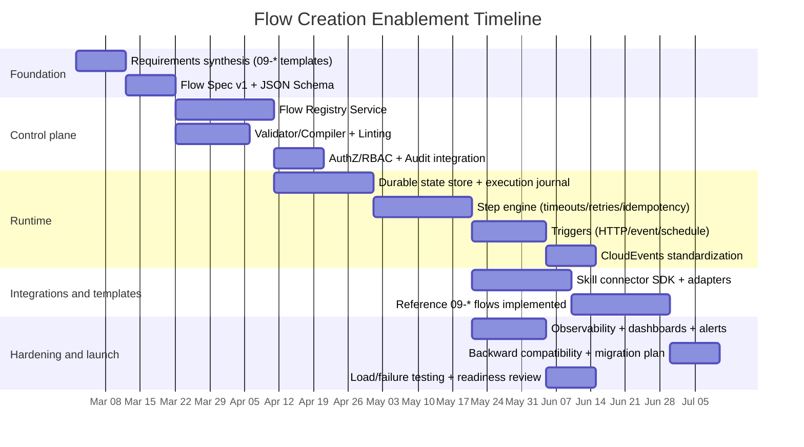

# Extending the Engine to Support Flow Creation for the Project’s 09-* Specifications

## Executive summary

The available 09-* materials describe a **blog/CMS capability map** (content model, editor, taxonomy, IAM, routing/permalinks, rendering/theming, extension hooks, media, search/indexing, optional workflow/moderation, API/integrations, config/admin, and infra concerns like caching/jobs/security) and several **end-to-end flows** (public page view; authoring & publishing; media insertion; comment moderation; extensibility/hook behavior). fileciteturn0file1 These flows imply the engine needs a first-class way to **define**, **version**, **validate**, **deploy**, and **run** multi-step orchestrations with variants (e.g., with/without review workflow; with/without comments; with inline vs async indexing; headless vs SSR). fileciteturn0file1

The most leverage comes from treating “flow creation” as a product surface with three layers:

A **Flow Definition Layer** (graph/DSL + schemas + versioning + promotion), a **Flow Runtime Layer** (durable state + retries + idempotency + signals + compensation), and a **Flow Integration Layer** (connectors/adapters to “skills”/services, plus standardized events, authZ, and observability). The 09-* materials also explicitly suggest a skill-oriented architecture (e.g., API Gateway, Auth/Permissions, Database Fabric, Redis queue, Elasticsearch) and that blog/CMS capabilities should be built by orchestrating these skills. fileciteturn0file1

Recommended approach (balanced for scope, operational risk, and developer ergonomics):

Design and implement a **native Flow Registry + Versioned Flow Spec + Durable Flow Runtime** inside your engine (rather than immediately replacing the runtime), while standardizing key integration contracts with widely adopted specs: **OpenAPI** for HTTP-facing APIs citeturn0search0turn0search4, **CloudEvents** for event envelopes across services citeturn0search1turn0search9, **OpenTelemetry** for traces/metrics/logs citeturn0search2turn0search10, and **RFC 7807 problem details** for consistent error responses citeturn1search2. For long-running and failure-prone workflows, adopt “durable execution” semantics (checkpointed state, resumability, and deterministic replays where possible); the mature reference model here is Temporal’s workflow execution concepts (even if you do not adopt Temporal initially). citeturn0search19turn0search7turn0search3

Deliverables in this report:

A requirements/variants extraction from the 09-* materials, a mapping and gap analysis against the implied current “skills + arbiter” architecture, design options with trade-offs and effort/priority, concrete proposed components/APIs/data models and integration points, a detailed milestone plan (with a Gantt-style timeline), test/validation criteria, rollback strategies (including expand/contract), and required changes to CI/CD, monitoring, and documentation. fileciteturn0file1turn4search0

## Source-derived requirements from the 09-* documents

### Flow types and variants implied by the blog/CMS module map

The module map implies the engine must support (at minimum) flow creation for:

**Content lifecycle flows**: create → edit → draft → (optional) review/approval → publish → update → archive/unpublish, with revisions and scheduled publishing/preview expectations. fileciteturn0file1  
**Public request flows**: URL routing/permalinks resolve a slug to content, permissions/visibility checks, content retrieval (including taxonomy and media refs), optional related lists, rendering/theming, and caching. fileciteturn0file1  
**Media flows**: upload, associate media to content, transform into variants/thumbnails/responsive formats, serve via CDN/cache. fileciteturn0file1  
**Search/indexing flows**: update index on publish/update, enforce permissions in search results, support “related posts” and filtering. fileciteturn0file1  
**Extensibility flows**: hook points such as “before save content,” “after publish,” and “render page head,” with configuration gated by permissions. fileciteturn0file1  
**Optional community/moderation flows**: comment submission → spam/security checks → moderation queue → approve/reject → notify. fileciteturn0file1

These requirements also define key **variants** your flow system must represent without becoming unmaintainable:

Variant by capability toggle: comments enabled/disabled; workflow moderation enabled/disabled; search enabled/disabled; CDN caching strategy; “headless API” vs server-rendered rendering. fileciteturn0file1  
Variant by state policy: direct publish vs review/approval; scheduled publish vs immediate; content visibility rules (public/private/members-only). fileciteturn0file1  
Variant by extension behavior: additional “plugin hooks” that run at save/publish/render, including external webhooks. fileciteturn0file1

### Cross-cutting non-functional requirements implied by the document

Although explicit performance targets are not specified, the module map heavily implies:

Caching and cache invalidation as first-class: page/fragment/object cache + CDN integration with invalidation on publish/update. fileciteturn0file1  
Security requirements for admin and public surfaces: role checks, CSRF/XSS concerns, rate limiting, audit logs, and permissions gating on admin actions. fileciteturn0file1  
Background work (“jobs/cron”): indexing, sitemaps, cleanup, media processing, scheduled publishing. fileciteturn0file1  
Operational readiness: upgrades/migrations and safe schema changes. fileciteturn0file1

## Mapping requirements to the current engine and gap analysis

### Inferred current architecture from the 09-* materials

The 09-* materials describe (or assume) a “skill-based microservices architecture” including components such as an API gateway/router, auth + permissions services, database fabric, object processor, Redis queue, and Elasticsearch datastore, orchestrated by a “Business Flow Arbiter,” and supported by a “Web Flow Editor.” fileciteturn0file1

Because no separate “engine architecture” document was supplied here, the gap analysis below assumes:

The engine can already call skills/services and coordinate some operations, but **flow creation** is either (a) not first-class, (b) not versioned/promotable, or (c) not durable enough for long-running workflows (review, scheduled publish, moderation queue). This assumption is consistent with the document’s emphasis on adding new processes by mapping modules to skills and then orchestrating them end-to-end. fileciteturn0file1

### Capability-to-engine mapping and missing components

The table below maps the 09-* requirements to the implied “skills + arbiter” architecture and highlights what is typically missing when an engine must support *user-created flows* (not just developer-coded workflows).

| Requirement from 09-* docs | What the engine must support | Typical missing pieces (gaps) | Priority | Effort |
|---|---|---|---|---|
| Authoring & publishing flow with optional review and hooks | Long-running orchestration, human-in-the-loop states, step retries, and hook fan-out | Durable state store; signals/approvals; versioned flow definitions; idempotent step execution; hook/plugin runtime | P0 | High |
| Public page view flow (route→permission→fetch→render→cache) | Fast, observable request-path composition with cache policies | Flow-type distinction (request pipeline vs background workflow); cache key/tag policies; uniform error format | P1 | Medium |
| Media insertion and transformations | Async jobs, fan-out, resource constraints, and progress tracking | Blob upload strategy; async job orchestration; step timeouts/retries; status reporting | P0 | High |
| Search indexing and cache invalidation on content updates | Reliable event emission and consumption; eventual consistency management | Transactional outbox or equivalent; event schema versioning; replays; idempotent consumers | P0 | Medium |
| Extensibility (“before save”, “after publish”, “render head”) | Stable extension API, sandboxing, ordering, failure isolation | Plugin/hook contract; execution isolation; per-hook timeouts; observability per extension | P0 | High |
| Security: roles/permissions, audit logs | Consistent object-level authorization and audit | Policy enforcement points; flow-level permissions; secure secrets handling | P0 | Medium |
| Config/admin and environment promotion | Versioned definitions and safe promotion dev→stage→prod | Flow registry; approvals; diffing; rollback to prior versions | P0 | Medium |

Two external standards materially reduce risk in these gaps:

For event-driven integrations (“after publish” triggers webhooks/search/index/cache invalidation), standardizing on CloudEvents reduces ad-hoc event payload design and makes routing/interop clearer. citeturn0search1turn0search9  
For durable long-running and failure-prone workflows, adopting a workflow execution model that treats the workflow as a durable unit of execution can simplify retries/resumption; Temporal’s documentation is a canonical reference point for these semantics. citeturn0search19turn0search7turn0search3

## Design options and recommended approach

### Design options for flow definition storage, governance, and deployment

Flow creation requires both a representation (graph/DSL) and a lifecycle (draft, review, publish, promote, rollback). Three common system designs apply:

| Option | How it works | Strengths | Weaknesses | Best fit | Effort | Priority |
|---|---|---|---|---|---|---|
| Git-managed “flow-as-code” | Flow definitions live in repo; CI validates; CD publishes to registry/runtime | Strong review/audit trail; easy branching; fits CI/CD | Harder for non-devs; slower iteration | Developer-centric orgs; early MVP | Medium | P1 |
| DB-managed registry + UI editor | Definitions stored in a registry service/DB; UI (Flow Editor) saves drafts and publishes versions | Best UX for flow creation; fast iteration; supports “variants” via UI | Requires strong governance controls; needs promotion tooling | Product-led flow authoring | High | P0 |
| Kubernetes CRD “flow resources” | Flows stored as CRDs; controllers reconcile into runtime | Native to infra; declarative; RBAC and audit from Kubernetes | Adds operational coupling to clusters; authoring UX depends on tooling | Infra-centric platforms | High | P2 |

If you are already operating on Kubernetes, CRDs are a well-defined mechanism to extend the Kubernetes API with custom resources and schemas, but it is still a substantial product decision to tie flow authoring to cluster APIs. citeturn3search0turn3search4

Recommendation for this project’s 09-* needs: **DB-managed registry + UI editor**, because the 09-* materials explicitly mention a “Web Flow Editor” and a broad set of modules/flows that benefit from rapid iteration and templating. fileciteturn0file1

### Design options for runtime orchestration

Because the 09-* flows include both short request pipelines and long-running “approval/scheduled/moderation/indexing” workflows, evaluate runtime approaches across durability, developer ergonomics, and operational complexity.

| Option | Description | Trade-offs | Effort | Priority |
|---|---|---|---|---|
| Extend the current engine runtime (native durable orchestrator) | Add durable state, step retries, signals, schedules, and connectors within your engine | Best fit for your APIs/skills; avoids platform replacement; but you must build reliability semantics carefully | High | P0 |
| Integrate a durable workflow engine | Use a mature workflow runtime for durable executions; engine becomes a “definition + adapter layer” | Strong durability story; faster to “durable semantics”; but introduces a new platform dependency and mental model | Medium–High | P1 |
| Kubernetes-native workflow engine for batch/job workflows | Use a K8s workflow engine where workflows run as Kubernetes resources | Strong for job orchestration; less suited for human-in-loop and fine-grained business state | Medium | P2 |
| BPMN-based orchestration engine | Use BPMN modeling and execution to represent complex processes | Excellent for business visibility; adds modeling overhead; integration style differs from “skills” | High | P2 |

Concrete reference points:

Temporal documents workflows/executions as durable units that can resume after failures. citeturn0search19turn0search7turn0search3  
Argo Workflows describes itself as a container-native workflow engine implemented as a Kubernetes CRD. citeturn3search2turn3search6  
Camunda positions BPMN as a global standard for process modeling and describes the use of BPMN models for workflow automation with engines like Zeebe. citeturn3search7turn3search3  
Netflix Conductor describes itself as a platform created to orchestrate workflows spanning microservices. citeturn5search0turn5search1

Recommendation: **Extend the current engine runtime** (P0) to preserve your “skills” model and internal integration conventions, but design the runtime around “durable execution” principles and keep an explicit escape hatch for future runtime substitution (P1): define a stable internal abstraction for workflow persistence, scheduling, timers, and task dispatch that could be backed by an external engine later.

### Recommended target architecture

The target architecture below separates **authoring and lifecycle** (Flow Registry) from **execution** (Flow Runtime) and **integration** (Connectors), while standardizing external contracts (OpenAPI for HTTP surface, CloudEvents for events, OpenTelemetry for telemetry).

```mermaid
flowchart TB
  subgraph Authoring
    UI[Web Flow Editor]
    REG[Flow Registry Service]
    VAL[Flow Validator/Compiler]
  end

  subgraph ControlPlane
    AUTH[AuthN/AuthZ + Policy]
    AUD[Audit Log]
  end

  subgraph Runtime
    RT[Flow Runtime / Orchestrator]
    Q[Task Queue]
    SS[(State Store)]
    SCH[Scheduler/Timers]
  end

  subgraph Integrations
    SK[Skill Connectors\n(HTTP/GRPC/Events)]
    EB[Event Bus]
    OBS[Telemetry Export\n(Traces/Metrics/Logs)]
  end

  UI --> REG
  REG --> VAL
  VAL --> REG

  REG --> AUTH
  REG --> AUD

  RT --> AUTH
  RT --> AUD
  RT <--> SS
  RT --> Q
  SCH --> RT

  RT --> SK
  RT --> EB
  RT --> OBS

  EB --> RT
```

This architecture uses well-supported ecosystem contracts:

OpenAPI provides a standard, language-agnostic interface description for HTTP APIs. citeturn0search0turn0search4  
CloudEvents defines a common specification for event data, and is hosted as a CNCF project. citeturn0search1turn0search9  
OpenTelemetry provides cross-language specifications for generating and exporting telemetry (traces/metrics/logs). citeturn0search2turn0search10

### Core data models needed for flow creation

A minimal-but-scalable data model for flow creation should include:

| Model | Purpose | Key fields |
|---|---|---|
| FlowDefinition | Stable identity + metadata | id, name, owner/team, tags, created_at |
| FlowVersion | Immutable versioned spec | version_id, flow_id, semver/int version, status (draft/published/deprecated), created_by, created_at, changelog |
| FlowVariant | Captures 09-* “variants” without branching explosion | variant_key, feature_flags/toggles, parameter defaults, constraints |
| Trigger | Defines how flows start | type (HTTP/event/schedule), config, auth policy |
| Node/Step | Unit of work | step_type, connector_ref, input/output mappings, timeout, retry policy |
| Execution | Durable run record | execution_id, flow_version_id, status, current_nodes, context, started_at, ended_at |
| StepExecution | Per-step traceability | step_execution_id, attempt, status, error, started_at, ended_at |

Two standards are particularly useful here:

Use JSON Schema to validate flow definition payloads and step configuration shapes; the JSON Schema project publishes a formal specification and a validation vocabulary. citeturn5search2turn5search6  
Use Problem Details (RFC 7807) as the envelope for validation errors from the Flow Registry/Validator. citeturn1search2

### Runtime semantics: state management, retries, and idempotency

Given the flows include “publish,” “index update,” “cache invalidation,” and webhook-like extensions, your runtime must assume **retries** and tolerate duplicates.

HTTP semantics recognize idempotency as a property of certain methods; the HTTP semantics RFC is the authoritative definition reference point. citeturn6search0turn6search3  
For non-idempotent operations (common in orchestration steps), the IETF work on the `Idempotency-Key` request header explicitly targets making POST/PATCH more fault-tolerant. citeturn1search3

Practical design rule set:

Persist workflow state transitions before dispatching the next step (durability).  
Make every side-effect step either idempotent or guarded by a dedupe key.  
Support configurable retry policies (max attempts, backoff, non-retryable errors) to match external service behaviors.  
Support “wait for event/signal” steps (needed for review/approval and moderation queue).

To make side effects reliable across services, adopt an outbox/event-router approach where appropriate; Debezium’s outbox documentation describes the outbox pattern as avoiding inconsistencies between a service’s internal DB state and externally consumed events. citeturn2search3turn2search7

### Security and authorization model

Flows inherently touch object identifiers (post IDs, media IDs, comment IDs). The engine must enforce:

Authentication via OAuth 2.0 + OpenID Connect (OIDC). OAuth 2.0 is defined in RFC 6749, and OIDC core specifies authentication built on top of OAuth 2.0 with claims. citeturn1search0turn1search1  
Token formats: JWT is defined in RFC 7519 as a compact, URL-safe representation of claims. citeturn2search0  
Object-level authorization checks at every step that dereferences IDs supplied by a client or an event. OWASP’s API Security Top 10 highlights Broken Object Level Authorization as a common, high-impact risk category. citeturn2search1turn2search5

### Observability, error handling, and scalability defaults

For observability, standardize on OpenTelemetry for instrumentation and export. citeturn0search2turn0search10  
For metrics modeling and alert labels, Prometheus documents that every time series is identified by a metric name and optional key-value labels. citeturn2search2turn2search13  
For telemetry transport between services/collectors/backends, OTLP specifies encoding/transport/delivery mechanisms. citeturn6search2turn0search14

For scaling assumptions (since no constraints specified), align the runtime with horizontal scaling patterns: Kubernetes documents Horizontal Pod Autoscaling as automatically adjusting replicas of workloads to match demand. citeturn4search1  
For deployments and rollback of runtime services, Kubernetes describes rolling updates as incrementally replacing Pods to achieve updates without downtime. citeturn3search1turn3search5

## Implementation plan, validation, and operational readiness

### Task breakdown with dependencies, effort, and priority

The plan below assumes you will implement a DB-backed Flow Registry + durable runtime enhancements in the existing engine, and then implement the 09-* blog/CMS flows as reference “templates.”

| Task | Deliverable | Dependencies | Priority | Effort |
|---|---|---|---|---|
| Normalize requirements from all 09-* docs into flow templates | “Flow template catalog” (publish, media, moderation, view pipeline, hooks) | Access to all 09-* docs | P0 | Medium |
| Define Flow Spec v1 (graph + step types + variant model) | Spec doc + JSON Schema validation | None | P0 | Medium |
| Implement Flow Registry Service | CRUD for definitions/versions/variants; RBAC gates | Flow Spec v1 | P0 | High |
| Implement Flow Validator/Compiler | Structural validation (DAG/loops), schema validation, linting | Flow Spec v1 | P0 | Medium |
| Add durable state store + execution journal | Execution/step tables, compaction rules, replay/recovery | Registry + validator | P0 | High |
| Implement step execution engine | Retries/backoff, timeouts, idempotency keys, step dedupe | Durable store | P0 | High |
| Implement triggers | HTTP trigger, schedule trigger, event trigger | Runtime core | P0 | Medium |
| Standardize event envelope to CloudEvents | Event schema, versioning, routing rules | Event trigger | P0 | Medium |
| Build connector SDK for “skills” | Typed connectors, auth propagation, mapping | Runtime core | P0 | High |
| Observability & error model | OTel spans, Prom metrics, RFC 7807 errors | Runtime core | P0 | Medium |
| Implement reference 09-* flows | Publish flow; media flow; indexing/cache invalidation; moderation; hook flow | Core runtime + connectors | P0 | High |
| Backward compatibility layer | Run old flows untouched; map new triggers without breaking old APIs | Registry + runtime | P0 | Medium |
| CI/CD integration | Validate flow specs in CI; promotion pipelines; canary release | Registry + schemas | P1 | Medium |
| Runbooks and docs | Authoring guide, troubleshooting, SLO dashboards | Observability | P1 | Medium |

### Gantt-style timeline

The following timeline is an example schedule starting the next work week after the current date (current date: 2026-02-25 Asia/Jerusalem). Adjust durations based on team size and how much of the registry/runtime already exists.



This timeline explicitly reserves time for durability and failure-handling because durable workflow semantics are what separate a “task runner” from a true flow engine; Temporal’s workflow execution model is a helpful benchmark for what “durable execution” entails. citeturn0search19turn0search3

### Test cases and validation criteria

The test plan should prove: correct orchestration, safe retries/deduping, security enforcement, and operational observability.

| Area | Test case | Validation criteria |
|---|---|---|
| Flow definition validity | Reject invalid graphs (dangling nodes, invalid step config, schema mismatch) | Registry returns RFC 7807 Problem Details; invalid defs cannot be published citeturn1search2turn5search2 |
| Versioning and promotion | Publish v1, then v2; run both; roll back to v1 | Versions immutable; runtime can execute pinned versions; rollback is a pointer change |
| Idempotent orchestration | Retry step after timeout; engine replays without duplicating side effects | Steps use dedupe keys or Idempotency-Key; server-side effects occur once citeturn1search3turn6search0 |
| Durable recovery | Kill runtime mid-execution; restart | Execution resumes from persisted state; no step corruption citeturn0search19turn0search3 |
| Event-driven steps | Emit “publish” event; verify downstream indexing/cache invalidation triggered | Events conform to CloudEvents envelope; consumers handle duplicates safely citeturn0search1turn2search3 |
| AuthZ enforcement | Attempt to publish without permission; attempt to edit content outside scope | Deny with consistent errors; audit log entry created; aligns with OWASP BOLA mitigations citeturn2search1turn2search5 |
| Observability | Trace across trigger→runtime→connector calls; metrics for step latency/errors | OTel spans exist and correlate by execution_id; Prometheus-style labeled metrics emitted citeturn0search2turn2search2 |
| Scaling | Increase concurrent executions; add workers | Horizontal scaling works (replicas increase); queues drain within SLO expectations citeturn4search1 |

### Rollback strategies and backward compatibility

Two rollback dimensions must be supported: (a) **flow definition rollback** and (b) **runtime/service rollback**.

Flow definition rollback:

Treat rollback as changing an “active version pointer” rather than mutating the definition. This is drastically safer and provides auditability.  
For breaking changes in flow inputs/outputs, apply **parallel change / expand-and-contract** so both old and new contracts work during migration; Martin Fowler describes this pattern as expand, migrate, contract. citeturn4search0turn4search14

Runtime/service rollback:

Use rolling updates with the ability to revert deployments quickly; Kubernetes describes rolling updates as incrementally replacing Pods, enabling zero-downtime updates when configured correctly. citeturn3search1turn3search5  
Ensure the state store schema is expanded compatibly first (expand), and only later contracted after migration is complete. citeturn4search0turn4search14

Backward compatibility requirements for the engine:

Existing flows must continue to run unchanged (pin to legacy execution path).  
New flow authoring should be introduced behind feature flags for gradual enablement; OpenFeature documents a vendor-agnostic feature flagging API spec. citeturn5search3turn5search7

### Required changes to CI/CD, monitoring, and documentation

CI/CD changes:

Add Flow Spec validation as a pipeline gate using JSON Schema (fail builds on invalid definitions). citeturn5search2turn5search6  
Publish OpenAPI for engine/registry APIs so client SDKs and tests can be generated/validated against a formal spec; OpenAPI is explicitly intended as a standard interface description for HTTP APIs. citeturn0search0turn0search4  
Deploy flow definitions as immutable artifacts (versioned) and promote them with approvals, consistent with the document’s emphasis on configuration/admin and safe deployment. fileciteturn0file1

Monitoring and observability changes:

Instrument Flow Registry and Runtime with OpenTelemetry. citeturn0search2turn0search10  
Emit Prometheus-style metrics for: executions started/succeeded/failed, step retries, step duration histograms, queue lag, and outbox/event lag (if used). Prometheus’ label-based time series model supports dimensional breakdowns (flow_id, version, step_type). citeturn2search2turn2search13  
Standardize event telemetry transport with OTLP where applicable. citeturn6search2turn0search14

Documentation updates:

Flow authoring guide: how to model the 09-* flows (publish/media/moderation/hooks) and how to create variants without copy-paste branching. fileciteturn0file1  
Connector SDK guide: how to add new “skill connectors,” including auth propagation, error handling with RFC 7807, and idempotency. citeturn1search2turn1search3  
Operations/runbooks: how to debug stuck executions, replay events, and roll back versions using expand/contract. citeturn4search0turn2search3

### How the blog/CMS flows become engine “reference flows”

Finally, the 09-* blog/CMS flows should be implemented as **first-party reference flows** inside your engine, not as special-cased logic, so they serve as regression suites and templates:

Public page view: a request “pipeline flow” template with plug-in substeps for caching, taxonomy expansion, and rendering. fileciteturn0file1  
Authoring & publishing: a durable workflow template with optional approval states and post-publish fan-out to indexing/cache invalidation/webhooks via standardized events. fileciteturn0file1turn0file0  
Media insertion: a workflow template coordinating upload initiation → processing → referencing and variant readiness. fileciteturn0file1turn0file0  
Comment moderation: a long-running queue workflow with human-approval steps. fileciteturn0file1  
Extensibility: a hook/event template where extension handlers run under guardrails (timeouts, retries, observability). fileciteturn0file1