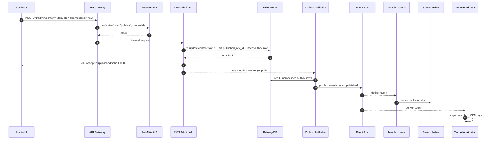
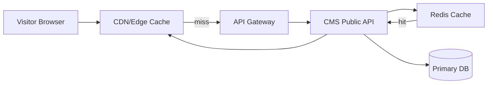

# Extending a Microservices Platform with a Blog and CMS Process Specification

## Executive summary

The attached Markdown describes a modular **blog/CMS “module map”** (content model, editor, taxonomy, IAM, routing/permalinks, rendering/theming, extensibility hooks, media management, search/indexing, workflow/moderation, API layer, config/admin, and infrastructure such as caching/jobs/security) plus several end-to-end flows (public page view, authoring/publishing, media insertion, comment moderation, extensibility). fileciteturn0file0

Assuming the current platform is already microservices-based with REST APIs and a web frontend, the most robust way to “extend the platform with this process” is to add a **CMS bounded context** composed of (a) a strongly consistent authoritative store for content + taxonomy + revisions, (b) an asynchronous event/outbox pipeline for downstream concerns (search indexing, cache invalidation, webhooks, analytics), and (c) a secure API surface (admin + public) guarded by OAuth/OIDC-based identity and fine-grained authorization. This aligns well with standard HTTP semantics (including idempotency expectations), modern API description practices (OpenAPI), and established event interchange conventions (CloudEvents). citeturn0search1turn0search4turn2search5turn2search6turn7search3

Key architectural decisions that dominate cost, performance, and risk:

A **relational primary store** (e.g., PostgreSQL) with JSONB for flexible editor “blocks” and explicit relational tables for taxonomy, revisions, and permissions tends to minimize inconsistency and simplify workflows; it also supports JSONB indexing and full-text primitives when needed. citeturn3search0turn3search1

A dedicated **search index** (e.g., Elasticsearch/OpenSearch) becomes valuable once you need relevance ranking, faceting, and scalable “site search”; it adds operational overhead but clearer performance headroom. citeturn3search2

A **media pipeline** should use object storage (S3/GCS/Azure Blob) with signed URLs/presigned uploads to keep large payloads off API servers, plus background processing for variants/thumbnails. citeturn6search0turn6search1turn6search6

For reliability, adopt **transactional outbox** to prevent “DB updated but event not emitted” inconsistency, and design consumers for at-least-once delivery (idempotent processing + dedupe). citeturn7search3turn7search5turn0search1

For observability, standardize instrumentation via OpenTelemetry and export metrics compatible with Prometheus’ time-series model. citeturn0search15turn4search3

This report provides: a concrete component mapping, schema and API contract samples, mermaid diagrams for key flows, a test/acceptance plan, rollout/rollback guidance using “expand and contract,” and a prioritized risk register with mitigations. citeturn10search3

## Interpreting the attached process specification

The Markdown’s “process” is effectively a **capability decomposition** of a CMS/blog system and its key end-to-end flows. It implies the platform must support at minimum: content entities (posts/pages/custom types), revisions, a web editor, taxonomy/tagging, roles/permissions, permalink routing and redirects, rendering/theming, extension points (plugins/hooks), media lifecycle and transformations, optional comments/moderation, search/indexing, content listing/archives, workflow states, and an API layer for headless use and integrations. fileciteturn0file0

Two places where the Markdown can contradict or refine “generic microservices assumptions”:

The module map is written in a way that mirrors **monolithic CMS platforms** (WordPress/Drupal) but those modules translate cleanly into microservices if you treat each module as a bounded context and rely on APIs/events rather than in-process hooks. fileciteturn0file0turn1search1turn1search5

The file also contains an example mapping to a specific “skill-based” platform (e.g., “Database Fabric,” “API Gateway,” “Permissions Service,” etc.). If your real platform does *not* have those services or naming, treat that portion as illustrative; the required capabilities still stand, but the exact owners and integration topology will differ. fileciteturn0file0

The remainder of this report assumes the Markdown’s capabilities are the “new process,” and the task is to integrate them into your existing microservices ecosystem.

## Target architecture and mapping to existing components and APIs

A pragmatic microservices mapping is to build a **CMS Core** that owns authoritative data and state transitions, and integrate it with the rest of the platform via synchronous REST and asynchronous events.

### Logical services

CMS Admin API: Authoring, drafts, workflow transitions, scheduling publish, revision viewing/restoration.

CMS Public API: Read-only endpoints for published content, archives, taxonomy browsing, and (optionally) preview with authorization.

Taxonomy Service (could be part of CMS Core): Categories/tags/terms, hierarchies, and relationships.

Media Service: Upload session creation, asset metadata, transformations jobs, signed URL issuance, and CDN integration.

Rendering Service (optional): For server-side rendering or “render-to-HTML” previews; may be unnecessary if frontend is fully client-rendered/headless.

Search Indexer + Search API (optional but common): Asynchronous indexing pipeline and query service.

Workflow/Moderation (optional but often needed in enterprise): State machine for Draft → Review → Approved → Published, plus assignments and audit.

Extension/Webhook Service: Event subscriptions, developer integrations, outbound webhooks, and safe retries.

### Mapping the Markdown modules to microservices (baseline)

| Markdown module/capability | Typical microservices owner | Notes on integration shape |
|---|---|---|
| Content model + revisions | CMS Core | Strong consistency + immutable revisions; publish creates a “published pointer” to a revision. fileciteturn0file0 |
| Editor UI (admin) | Web frontend + CMS Admin API | UI stores structured blocks (often JSON); preview calls rendering/public API with “draft token.” fileciteturn0file0 |
| Taxonomy | CMS Core/Taxonomy | Many-to-many (post↔term), hierarchical terms; used by archives and search facets. fileciteturn0file0turn1search7 |
| Users/roles/permissions | Existing IAM + policy engine | Integrate with OAuth2/OIDC; enforce object-level and workflow-state permissions. citeturn0search2turn2search5turn2search3 |
| Routing/permalinks | API gateway + CMS Public API | Slug resolution; redirects; canonical URL computation. fileciteturn0file0 |
| Rendering/theming | Frontend (and optional rendering svc) | “Theme” is either templates in a rendering service or component composition in web frontend. fileciteturn0file0 |
| Extension system/hooks | Events + webhook/extension svc | Replace in-process hooks with domain events; allow extension handlers via subscriptions. fileciteturn0file0turn2search6 |
| Media management | Media Service + object storage | Signed URLs/presigned uploads; background resizing variants. citeturn6search0turn6search1turn6search6 |
| Search/indexing | Search indexer + search engine | Event-driven; eventual consistency acceptable for search results. fileciteturn0file0turn3search2turn7search3 |
| Workflow/moderation | Workflow svc (or CMS Core) | Optional; if present, enforce transitions and audit. fileciteturn0file0 |
| Configuration/admin | Existing config service | Treat CMS config as versioned, environment-promotable. fileciteturn0file0 |
| Infra (caching, jobs) | Platform-wide | Redis for caching/queues, Kubernetes autoscaling, standardized observability. fileciteturn0file0turn6search3turn4search6turn0search15 |

### High-level data flow diagram

```mermaid
flowchart LR
  subgraph Client
    A[Web Frontend\n(Admin + Public)]
  end

  subgraph Edge
    CDN[CDN / Cache]
    GW[API Gateway]
  end

  subgraph Identity
    IDP[OIDC Provider]
    AUTH[AuthN/AuthZ Layer]
  end

  subgraph CMS
    ADM[CMS Admin API]
    PUB[CMS Public API]
    CORE[CMS Core Domain]
    MEDIA[Media Service]
    EXT[Webhook/Extensions]
    IDX[Indexer Worker]
  end

  subgraph Data
    DB[(Primary DB\nPosts/Revisions/Taxonomy)]
    OBJ[(Object Storage\nMedia Blobs)]
    BUS[(Event Bus / Queue)]
    SRCH[(Search Index)]
    CACHE[(Redis Cache)]
  end

  A --> CDN --> GW
  GW --> AUTH --> IDP
  GW --> ADM
  GW --> PUB

  ADM --> CORE --> DB
  PUB --> CORE --> DB
  PUB --> CACHE
  ADM --> MEDIA --> OBJ
  MEDIA --> DB

  CORE --> BUS
  BUS --> IDX --> SRCH
  BUS --> EXT
  BUS --> CACHE
```

This architecture explicitly separates the **authoritative DB transaction** from the **event-driven side effects** using an event bus/outbox approach to avoid inconsistent writes. citeturn7search3turn7search11

### Authentication and authorization impact

Use industry-standard authorization and authentication:

OAuth 2.0 for authorization delegation and access tokens, and OpenID Connect for authentication/SSO and ID tokens, supplied by an external Identity Provider; both are designed for HTTP services. citeturn0search2turn2search5

Use JWTs as a compact claim container when appropriate; they are widely used to carry signed claims in a URL-safe form. citeturn2search0

Enforce **object-level authorization** (e.g., “can edit post X,” “can preview draft Y”) since CMS endpoints naturally expose object identifiers; OWASP flags broken object level authorization as a top API risk. citeturn2search3

For service-to-service trust, prefer mutual TLS in a service mesh and/or workload identity approaches (e.g., SPIFFE/SPIRE patterns) to reduce reliance on long-lived shared secrets. citeturn11search8turn11search14

## Data models, schema changes, storage options, and API contracts

### Baseline domain model

The Markdown implies these first-class concepts: ContentItem (Post/Page), Revision, User, Role/Permission, Term (Category/Tag), Slug/Route, MediaAsset (+ derived variants), WorkflowState, Comment (optional), and Integration events/webhooks. fileciteturn0file0

A recommended “microservices-friendly but CMS-strong” model is:

ContentItem: stable ID, type, author, current_status, current_published_revision_id (nullable), timestamps.

Revision: immutable record capturing body + structured blocks + SEO fields + rendering hints.

TaxonomyTerm: hierarchical/hybrid vocabularies, with many-to-many mappings.

SlugHistory: current slug and historical slugs for redirects.

MediaAsset: metadata + storage location; MediaVariant: thumbnails/resizes.

OutboxEvent: transactional outbox rows emitted on state changes.

### Sample PostgreSQL schema (authoritative store)

PostgreSQL is well-suited for mixed relational + semi-structured JSON via JSONB, and supports GIN indexing for JSONB queries. citeturn3search0turn3search4

```sql
-- Content items (stable identity across revisions)
CREATE TABLE cms_content_items (
  id                UUID PRIMARY KEY,
  content_type      TEXT NOT NULL,          -- post, page, custom
  author_user_id    UUID NOT NULL,
  status            TEXT NOT NULL,          -- draft|in_review|published|archived
  published_rev_id  UUID NULL,
  created_at        TIMESTAMPTZ NOT NULL DEFAULT now(),
  updated_at        TIMESTAMPTZ NOT NULL DEFAULT now()
);

-- Immutable revisions (append-only)
CREATE TABLE cms_revisions (
  id              UUID PRIMARY KEY,
  content_item_id UUID NOT NULL REFERENCES cms_content_items(id),
  version         INTEGER NOT NULL,
  title           TEXT NOT NULL,
  excerpt         TEXT NULL,
  body_blocks     JSONB NOT NULL,           -- structured editor blocks
  seo             JSONB NULL,               -- canonical, meta, og tags
  created_by      UUID NOT NULL,
  created_at      TIMESTAMPTZ NOT NULL DEFAULT now(),
  UNIQUE (content_item_id, version)
);

-- Optional: full-text support in primary DB (may be replaced by external search)
ALTER TABLE cms_revisions ADD COLUMN search_document tsvector;

-- Taxonomy terms
CREATE TABLE cms_terms (
  id          UUID PRIMARY KEY,
  vocabulary  TEXT NOT NULL,                -- categories, tags, custom
  name        TEXT NOT NULL,
  slug        TEXT NOT NULL,
  parent_id   UUID NULL REFERENCES cms_terms(id),
  created_at  TIMESTAMPTZ NOT NULL DEFAULT now(),
  UNIQUE (vocabulary, slug)
);

-- Many-to-many: revisions to terms (ties tagging to a specific revision)
CREATE TABLE cms_revision_terms (
  revision_id UUID NOT NULL REFERENCES cms_revisions(id),
  term_id     UUID NOT NULL REFERENCES cms_terms(id),
  PRIMARY KEY (revision_id, term_id)
);

-- Slug management with history
CREATE TABLE cms_slugs (
  id              UUID PRIMARY KEY,
  content_item_id UUID NOT NULL REFERENCES cms_content_items(id),
  slug            TEXT NOT NULL,
  is_current      BOOLEAN NOT NULL DEFAULT TRUE,
  created_at      TIMESTAMPTZ NOT NULL DEFAULT now(),
  UNIQUE (slug)
);

-- Media metadata
CREATE TABLE cms_media_assets (
  id            UUID PRIMARY KEY,
  owner_user_id UUID NOT NULL,
  mime_type     TEXT NOT NULL,
  bytes         BIGINT NOT NULL,
  checksum      TEXT NOT NULL,
  storage_key   TEXT NOT NULL,              -- object storage key
  created_at    TIMESTAMPTZ NOT NULL DEFAULT now()
);

CREATE TABLE cms_media_variants (
  id            UUID PRIMARY KEY,
  asset_id      UUID NOT NULL REFERENCES cms_media_assets(id),
  variant_type  TEXT NOT NULL,              -- thumb|small|webp|...
  storage_key   TEXT NOT NULL,
  width         INT NULL,
  height        INT NULL,
  created_at    TIMESTAMPTZ NOT NULL DEFAULT now(),
  UNIQUE (asset_id, variant_type)
);

-- Transactional outbox for reliable events
CREATE TABLE cms_outbox_events (
  id             UUID PRIMARY KEY,
  aggregate_type TEXT NOT NULL,             -- ContentItem, MediaAsset, Term
  aggregate_id   UUID NOT NULL,
  event_type     TEXT NOT NULL,             -- content.published, ...
  payload        JSONB NOT NULL,
  occurred_at    TIMESTAMPTZ NOT NULL DEFAULT now(),
  processed_at   TIMESTAMPTZ NULL
);

-- Helpful indexes
CREATE INDEX cms_revisions_blocks_gin ON cms_revisions USING gin (body_blocks);
CREATE INDEX cms_outbox_unprocessed ON cms_outbox_events (processed_at) WHERE processed_at IS NULL;
```

JSONB indexing via GIN is a documented PostgreSQL capability and is often used for efficient key/key-value searching within JSONB documents. citeturn3search0turn3search4  
PostgreSQL full-text search uses `tsvector` to represent searchable documents and `tsquery` to represent queries. citeturn3search1turn3search17

### Storage and persistence options trade-off tables

#### Primary content store options

| Option | Pros | Cons | Best fit | Complexity/cost |
|---|---|---|---|---|
| PostgreSQL (relational + JSONB blocks) | Strong transactions; natural modeling for taxonomy/revisions; JSONB + GIN indexing for flexible blocks. citeturn3search0turn3search4 | JSONB can become “schemaless sprawl”; large block payloads can inflate row sizes; careful indexing needed. citeturn3search0turn3search20 | Most CMS workloads with workflow + taxonomy + audit | Medium |
| Document DB (e.g., MongoDB) | Natural for nested blocks; easy shard-by-content; flexible schema | Harder for relational taxonomy + constraints; multi-document transactions complexity; joins handled in app/search layer | Highly dynamic document shapes, minimal relational needs | Medium–High |
| Event sourcing for content state | Full audit and replay; native event stream integration | Complex queries and read models; higher developer/operator overhead; heavier onboarding | Regulated workflows requiring detailed provenance | High |

The report recommends a relational store first because the Markdown’s requirements heavily emphasize **relationships** (taxonomy, workflows, routing, permissions, revisions) that map naturally to relational constraints, while JSONB absorbs editor-block variability. fileciteturn0file0turn3search0

#### Search options

| Option | Pros | Cons | When to choose | Complexity/cost |
|---|---|---|---|---|
| PostgreSQL full-text | Built-in `tsvector`/`tsquery`; fewer moving parts. citeturn3search1turn3search17 | Limited relevance tuning vs dedicated engines; scaling “search-heavy” workloads can be harder | Basic site search, low–moderate traffic | Low–Medium |
| Elasticsearch/OpenSearch | Designed for mappings, analyzers, relevance, faceting; scalable index workloads. citeturn3search2turn3search6 | Operational overhead; eventual consistency; requires careful mapping and reindex strategy | Search is core UX: facets, ranking, suggestions | Medium–High |

Elastic’s docs define mapping as the mechanism for defining how a document and its fields are stored and indexed, making it central to schema evolution and search correctness. citeturn3search2

#### Media storage options

| Option | Pros | Cons | Recommended pattern |
|---|---|---|---|
| Object storage + signed uploads (S3/GCS/Azure) | Scales for large objects; avoids API server bandwidth and memory pressure; time-limited delegated access. citeturn6search0turn6search1turn6search6 | Requires lifecycle and key-management design; must secure URL sharing and invalidation | “Initiate upload” API → signed URL/presigned URL → client uploads directly → finalize asset metadata |
| Store blobs in DB | Simple transactional coupling | Expensive I/O; large DB growth; poor CDN integration | Avoid except for very small binary payloads |

AWS documents that presigned URLs can allow an upload without the uploader having AWS credentials, but they remain constrained by the permissions of the principal that generated the URL; Google and Microsoft document similar time-limited delegated access using signed URLs and SAS tokens. citeturn6search0turn6search1turn6search6

### Integration points and event contracts

For microservices integration, prefer:

Synchronous REST for read/command APIs (admin actions, public reads).

Asynchronous events for side effects (indexing, cache invalidation, webhooks, notifications).

Use a standard event envelope like CloudEvents to normalize metadata across producers/consumers. CloudEvents is explicitly a common event-data description standard and is a CNCF project. citeturn2search6turn2search2

For consistency between DB and emitted events, use the transactional outbox pattern; Debezium explicitly frames it as a way to avoid inconsistencies between a service’s internal state and externally consumed events. citeturn7search3turn7search11

### Sample API contracts (OpenAPI-style)

OpenAPI defines a language-agnostic interface description for HTTP APIs and supports tooling for code generation and validation; the OpenAPI Specification is the authoritative definition of its format. citeturn0search4turn0search12

```yaml
openapi: 3.2.0
info:
  title: CMS API
  version: 1.0.0
paths:
  /v1/admin/content:
    post:
      summary: Create a new content item (draft)
      security:
        - bearerAuth: []
      requestBody:
        required: true
        content:
          application/json:
            schema:
              $ref: "#/components/schemas/CreateContentRequest"
      responses:
        "201":
          description: Created
          content:
            application/json:
              schema:
                $ref: "#/components/schemas/ContentItem"
        "403":
          description: Forbidden
          content:
            application/problem+json:
              schema:
                $ref: "#/components/schemas/Problem"
  /v1/admin/content/{id}/revisions:
    post:
      summary: Create a new revision (autosave/manual save)
      security:
        - bearerAuth: []
      parameters:
        - in: path
          name: id
          required: true
          schema: { type: string, format: uuid }
      requestBody:
        required: true
        content:
          application/json:
            schema:
              $ref: "#/components/schemas/CreateRevisionRequest"
      responses:
        "201":
          description: Revision created
          content:
            application/json:
              schema:
                $ref: "#/components/schemas/Revision"
  /v1/admin/content/{id}/publish:
    post:
      summary: Publish a specific revision (or latest)
      security:
        - bearerAuth: []
      parameters:
        - in: path
          name: id
          required: true
          schema: { type: string, format: uuid }
        - in: header
          name: Idempotency-Key
          required: false
          schema: { type: string }
      requestBody:
        required: true
        content:
          application/json:
            schema:
              type: object
              properties:
                revisionId: { type: string, format: uuid }
                publishAt: { type: string, format: date-time, nullable: true }
      responses:
        "202":
          description: Publish accepted (may be async if scheduled)
          content:
            application/json:
              schema:
                $ref: "#/components/schemas/PublishResponse"

  /v1/public/content/{slug}:
    get:
      summary: Fetch published content by slug
      parameters:
        - in: path
          name: slug
          required: true
          schema: { type: string }
      responses:
        "200":
          description: Published content
          content:
            application/json:
              schema:
                $ref: "#/components/schemas/PublicContentResponse"
        "404":
          description: Not found
          content:
            application/problem+json:
              schema:
                $ref: "#/components/schemas/Problem"

components:
  securitySchemes:
    bearerAuth:
      type: http
      scheme: bearer
      bearerFormat: JWT

  schemas:
    CreateContentRequest:
      type: object
      required: [contentType, title]
      properties:
        contentType: { type: string, example: "post" }
        title: { type: string }
        initialBlocks:
          type: array
          items:
            $ref: "#/components/schemas/Block"

    CreateRevisionRequest:
      type: object
      required: [title, blocks]
      properties:
        title: { type: string }
        excerpt: { type: string, nullable: true }
        blocks:
          type: array
          items: { $ref: "#/components/schemas/Block" }
        seo:
          type: object
          additionalProperties: true

    ContentItem:
      type: object
      required: [id, contentType, status, createdAt, updatedAt]
      properties:
        id: { type: string, format: uuid }
        contentType: { type: string }
        status: { type: string, enum: [draft, in_review, published, archived] }
        publishedRevisionId: { type: string, format: uuid, nullable: true }
        createdAt: { type: string, format: date-time }
        updatedAt: { type: string, format: date-time }

    Revision:
      type: object
      required: [id, contentItemId, version, title, blocks, createdAt]
      properties:
        id: { type: string, format: uuid }
        contentItemId: { type: string, format: uuid }
        version: { type: integer }
        title: { type: string }
        blocks:
          type: array
          items: { $ref: "#/components/schemas/Block" }
        createdAt: { type: string, format: date-time }

    Block:
      type: object
      required: [type]
      properties:
        type: { type: string, example: "paragraph" }
        data:
          type: object
          additionalProperties: true

    PublishResponse:
      type: object
      required: [contentItemId, status]
      properties:
        contentItemId: { type: string, format: uuid }
        status: { type: string, enum: [published, scheduled] }

    PublicContentResponse:
      type: object
      required: [id, slug, title, blocks]
      properties:
        id: { type: string, format: uuid }
        slug: { type: string }
        title: { type: string }
        blocks:
          type: array
          items: { $ref: "#/components/schemas/Block" }
        terms:
          type: array
          items:
            type: object
            properties:
              vocabulary: { type: string }
              slug: { type: string }
              name: { type: string }

    Problem:
      type: object
      required: [type, title, status]
      properties:
        type: { type: string, format: uri }
        title: { type: string }
        status: { type: integer }
        detail: { type: string }
        instance: { type: string, format: uri }
```

For consistent error payloads, RFC 7807 defines “problem detail” documents as a machine-readable way to convey HTTP API error details. citeturn4search0  
For idempotency, HTTP defines which methods are inherently idempotent, and an IETF draft specifies an `Idempotency-Key` header for making non-idempotent methods more fault-tolerant. citeturn0search1turn4search1

### Webhook contract and verification

If you implement outbound webhooks (as implied by “post published” integration hooks), treat them as hostile network edges: sign payloads and verify signatures on the receiver side. fileciteturn0file0

GitHub documents validating webhook deliveries using HMAC—recommending the SHA-256 flavor via `X-Hub-Signature-256`; Stripe similarly documents verifying event signatures using a header plus an endpoint secret. citeturn11search0turn11search1

## Key flows, error handling, retries, scalability, and observability

### Sequence diagram for the publish flow

This implements the Markdown’s “Authoring & publishing” flow, but split into microservices and asynchronous side effects. fileciteturn0file0



This pattern is specifically designed to avoid the “dual-write problem,” which Debezium’s outbox documentation highlights as a source of inconsistency between internal database state and externally consumed event state. citeturn7search3turn7search11

### Public page view flow

The Markdown’s “Public page view” flow becomes primarily read-path performance engineering: caching, slug resolution, and optional SSR. fileciteturn0file0



If Redis is used as the caching layer, plan for persistence/HA modes that match your SLO; Redis documentation describes persistence mechanisms such as AOF/RDB and how combining them affects restart reconstruction behavior. citeturn6search3

### Error handling and retry strategy

A rigorous strategy needs different rules for synchronous HTTP calls vs asynchronous message/event processing:

**HTTP API error format**: Return RFC 7807 Problem Details for 4xx/5xx, with stable `type` URIs and a consistent `instance` for correlation. citeturn4search0

**Safe retries and idempotency**: HTTP semantics define idempotent methods; for POST-like operations (create revision, publish), accept an `Idempotency-Key` and persist a dedupe record keyed by (client_id, idempotency_key) to ensure repeated attempts don’t duplicate side effects. citeturn0search1turn4search1

**Transient failure isolation**: Use circuit breakers and timeouts when calling external dependencies; libraries like Resilience4j document circuit breaker behaviors and states that support controlled failure modes. citeturn9search3turn9search7

**Event consumption**: Most practical queue/event systems provide at-least-once delivery semantics, so consumers must be idempotent and tolerate duplicates (including re-delivery after consumer crash or timeout). AWS documents how SQS visibility timeout can cause messages to reappear if not deleted in time; Google documents Pub/Sub’s default at-least-once delivery; RabbitMQ documents consumer acknowledgements and redelivery behavior. citeturn7search1turn7search6turn7search12

### Scalability and performance considerations

Scaling approach should assume:

Horizontal scaling of stateless services, with autoscaling based on load signals; Kubernetes documents Horizontal Pod Autoscaling as updating workload replicas to match demand. citeturn4search6

Rolling updates without downtime are achievable for stateless services; Kubernetes describes rolling update mechanics for Deployments. citeturn1search10turn1search13

Search indexing should be asynchronous and partitionable by content ID; if using Elasticsearch/OpenSearch, mapping evolution must be planned (e.g., add fields, reindex on incompatible changes). citeturn3search2turn3search10

### Monitoring and observability

Adopt three pillars:

Traces, metrics, and logs standardized through OpenTelemetry, which is designed as a vendor-neutral observability framework and includes a Logs API/SDK and trace concepts. citeturn0search15turn0search11turn0search7

Metrics should be expressible as labeled time series consistent with Prometheus’ data model; Prometheus documents its time series storage model based on timestamped samples with label dimensions. citeturn4search3

Add domain-level SLIs: publish latency (p95), read latency (p95), error rate by endpoint, event lag (outbox backlog), indexing lag, cache hit ratio, webhook delivery success rate.

## Implementation plan, testing, CI/CD, migration, security/compliance, and risks

### Detailed implementation plan with milestones and deliverables

The schedule below assumes an existing microservices platform with an API gateway, identity provider, Kubernetes-based deployment, and baseline observability. Adjust duration based on team size and reuse of existing platform services.

| Milestone | Scope | Deliverables | Est. effort |
|---|---|---|---|
| Foundation | Domain boundaries, API surface, authorization model | CMS domain RFC, OpenAPI baseline, RBAC matrix, threat model | 1–2 weeks |
| Core content + revisions | Content create/edit, revision append, preview token model | CMS Core + Admin API MVP; DB migrations; revision restore; RFC 7807 errors | 3–5 weeks |
| Taxonomy + routing | Terms, tagging, archives, slug history + redirects | Term APIs, query endpoints, slug resolution/redirect logic | 2–3 weeks |
| Media pipeline | Upload sessions, signed uploads, asset variants jobs | Media Service, object storage integration, transformation worker, CDN strategy | 3–5 weeks |
| Events + integrations | Outbox, CloudEvents envelope, cache busting, webhook endpoints | Outbox tables/workers; event contracts; webhook signing; retry/dead-letter | 2–4 weeks |
| Search (optional) | Indexing + query APIs | Indexer worker; search schema/mappings; search endpoints; relevance tuning | 2–4 weeks |
| Hardening + launch | Rate limiting, observability dashboards, SLOs, runbooks | Dashboards/alerts; load test results; on-call docs; GA checklist | 2–3 weeks |

CloudEvents provides a standard way to describe event data and common metadata for routing and interoperability, which is useful for your internal event contracts as the system grows. citeturn2search6turn2search2

### Testing strategy with sample test cases and acceptance criteria

Use a layered approach:

Unit tests: domain logic (workflow transitions, slug generation, permission checks).

Integration tests: DB + API behavior, outbox publishing, media finalize, search index updates.

Contract tests: consumer-driven contracts (Pact) and schema-based fuzz/property tests (Schemathesis) generated from OpenAPI. Pact describes how consumer tests produce contracts for provider verification; Schemathesis describes generating tests from OpenAPI/GraphQL schemas. citeturn10search0turn10search1turn0search4

End-to-end tests: admin author workflow + public view rendering + caching invalidation.

A representative acceptance table:

| Feature | Acceptance criteria | Test type |
|---|---|---|
| Create/edit draft | Author can create content; autosave generates revisions; permissions enforced | Unit + E2E |
| Preview | Draft preview requires auth and does not appear in public search or archives | Integration + E2E |
| Publish | Publishing sets published revision pointer, emits event, invalidates cache | Integration + E2E |
| Idempotent publish | Repeated publish with same Idempotency-Key does not double-publish or double-emit | Integration |
| Slug redirect | Changing slug creates redirect from old slug to new canonical | Integration |
| Media upload | Signed upload works without sharing long-lived credentials; finalization creates asset record | Integration |
| Webhooks | Deliveries are signed; retries occur; failures go to DLQ after max attempts | Integration |
| Search (if enabled) | Newly published content searchable within N seconds SLA; unpublish removes | E2E |
| Observability | Trace spans connect gateway→CMS→DB; dashboards show publish/read latency | Integration |

Use RFC 7807 Problem Details responses as part of negative-path assertions (e.g., forbidden, validation errors). citeturn4search0

### Deployment and CI/CD changes

CI/CD should add:

OpenAPI contract validation and compatibility checks; OpenAPI tooling supports machine-readable API descriptions that drive generation/validation workflows. citeturn0search4turn10search2

Automated contract tests (Pact provider verification, Schemathesis runs) as pipeline gates. citeturn10search0turn10search1

Progressive delivery: canary or rolling updates; Kubernetes documents rolling updates and how they replace pods incrementally. citeturn1search10

Feature flags for decoupling deployment from release; OpenFeature is a vendor-agnostic feature flag specification intended to reduce lock-in. citeturn8search3turn8search6

### Migration, backward compatibility, rollout and rollback plan

Use a “parallel change / expand-contract” approach for schema and API evolution:

Martin Fowler describes Parallel Change (expand and contract) as a safe way to implement backward-incompatible interface changes through expand, migrate, and contract phases. citeturn10search3

A concrete rollout approach:

Phase 1 (Expand): Introduce new tables/endpoints alongside existing platform content features; dual-write where necessary (e.g., maintain old “posts” data while populating new cms tables).

Phase 2 (Migrate): Backfill data; cut read paths gradually to new public endpoints; keep redirects working; run consistency checks.

Phase 3 (Contract): Remove old writes and later old reads; retire legacy tables/fields after a defined deprecation window.

Rollback strategy:

Roll back stateless services via deployment rollback (Kubernetes rolling update history).

If you dual-write, rollback is primarily switching reads back to the legacy system while keeping new writes disabled.

Maintain idempotent publish operations and monotonic revision versions to avoid “split brain.”

### Security and compliance implications

API security must explicitly address object-level authorization, input validation, and least privilege—areas emphasized by the entity["organization","OWASP","application security org"] API Security Top 10 (e.g., “Broken Object Level Authorization”). citeturn2search3turn2search7

If user data is involved (authors, commenters, analytics identifiers), GDPR-style principles (lawfulness, data minimization, storage limitation, integrity/confidentiality) affect logging, retention, and deletion requirements. The entity["organization","European Commission","eu executive body"] summarizes GDPR principles and obligations, and EUR-Lex provides the legal text. citeturn5search9turn5search0

For identity assurance and authentication policy (MFA, session duration, federation), entity["organization","NIST","us standards institute"] SP 800-63-4 provides updated guidance on digital identity assurance, authentication, and federation requirements and considerations. citeturn5search6turn5search2

Webhook security: use HMAC signatures and secret rotation patterns similar to entity["company","GitHub","software platform company"]’s documented webhook delivery validation and entity["company","Stripe","payments company"]’s webhook signature verification approach. citeturn11search0turn11search1

### Prioritized risk register with mitigations

| Risk | Likelihood | Impact | Mitigation | Early warning signals |
|---|---:|---:|---|---|
| Broken object-level authorization (edit/preview/publish) | Medium | Critical | Centralized policy checks; negative tests; least-privilege roles; security reviews aligned to OWASP API risks. citeturn2search3 | Increase in 403/401 anomalies; audit logs show cross-tenant access attempts |
| Dual-write inconsistency (DB vs events/index) | Medium | High | Transactional outbox; idempotent consumers; replay tooling; lag dashboards. citeturn7search3turn7search11 | Outbox backlog growth; search/doc mismatches |
| Search schema evolution forces reindex downtime | Medium | Medium–High | Versioned indices + aliases; backfill in parallel; reindex pipelines. citeturn3search10turn3search2 | Query latency spikes; indexing errors after deploy |
| Media upload abuse/cost blow-up | Medium | High | Signed URL TTL; size/type constraints; malware scanning; rate limits | Unexpected object-store egress; abnormal upload volume |
| Cache invalidation bugs cause stale pages | Medium | Medium | Event-driven cache busting; TTL fallbacks; canary checks | Elevated user reports; mismatch between DB and served content |
| Workflow complexity balloons scope | Medium | Medium | Start with minimal states; add enterprise moderation later; consider workflow engine only if required | Rising cycle time; growing number of edge-case tickets |
| Observability gaps slow incident response | Medium | High | Mandatory OpenTelemetry spans; SLO dashboards; runbooks | High MTTR; “unknown root cause” incidents |
| GDPR/data retention noncompliance | Low–Medium | High | Data mapping, retention policies, delete/anonymize tooling, audit trails; legal review | Inability to fulfill deletion/export requests; logs contain personal data |

This register directly reflects API security priorities stressed by OWASP and the data protection principles described by the European Commission. citeturn2search3turn5search9