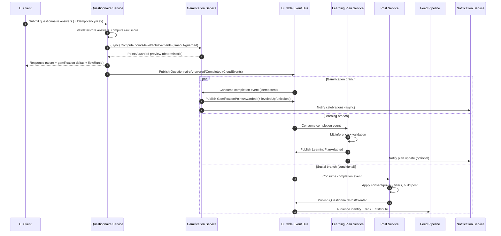
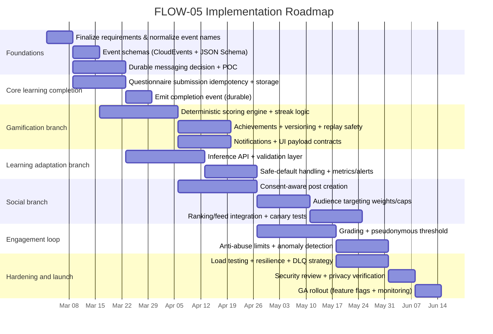

# Extending With FLOW-05 Lesson Completion and Gamification

## Executive summary

FLOW-05 (“Lesson Completion & Gamification”) is an event-driven, multi-branch workflow that triggers when a user completes a lesson questionnaire and then (in parallel) performs (a) low-latency gamification scoring (points, levels, achievements, streaks), (b) asynchronous ML-based learning-plan adaptation, and (c) optional socialization of answers as a targeted “questionnaire post” with downstream peer grading and community feedback loops. fileciteturn0file0

The key architectural implication is that this is **not a single feature**—it is a **cross-cutting platform extension** spanning learning, social, and engagement systems, plus governance/guardrails via the platform’s “Business Flow Arbiter (BFA)” concept. fileciteturn0file0 The most load-bearing constraints in the spec are:

- **Gamification must feel instantaneous** (target: UI feedback within ~1 second). fileciteturn0file0  
- **Learning adaptation is allowed to be slower and asynchronous** (2–5s inference profile). fileciteturn0file0  
- **Social sharing is privacy-sensitive and optional**, with per-question opt-in, a user-level “private learning activity” mode, and pseudonymous grading visibility until a minimum threshold to reduce single-grader bias. fileciteturn0file0  
- **Integrity & abuse controls are mandatory** (server-side scoring only, anti “point farming” rate limits, achievement validation against history, grading spam limits, anomaly detection). fileciteturn0file0  

A critical technical decision is the **event transport/delivery semantics**. The spec references Redis pub/sub as a throughput mechanism. fileciteturn0file0 However, Redis Pub/Sub is explicitly **at-most-once** (messages can be lost if a subscriber disconnects or errors). citeturn0search1 That delivery model is misaligned with “never lose points/achievements” expectations unless you compensate with strong idempotency, reconciliation jobs, and/or a more durable messaging layer (e.g., Redis Streams, RabbitMQ, Kafka).

Recommended approach for a robust first implementation:

- **Synchronous “gamification compute” on the questionnaire submit path** (bounded by timeouts/circuit breakers) to meet the 1s UX requirement, while **also emitting a durable event** for downstream persistence/analytics and retries. fileciteturn0file0  
- Adopt an **event envelope standard** (CloudEvents JSON) and schema validation (JSON Schema / OpenAPI) for long-term maintainability and BFA governance. citeturn3search2turn3search1turn3search0  
- Use **durable messaging for FLOW-05 domain events** (Redis Streams or a broker like RabbitMQ/Kafka) so retries, dead-lettering, and backpressure are real. Redis itself recommends Streams when stronger guarantees are needed than Pub/Sub can provide. citeturn0search1turn1search0  

Effort and timeline (high-level, assumes an existing microservice + feed pipeline baseline):  
- **MVP** (completion → points/levels/achievements + basic learning adaptation + optional post): ~8–10 calendar weeks with 2–3 engineers + 0.5 data/ML + 0.5 SRE/security support (parallelizable).  
- **GA hardening** (anti-abuse, pseudonymous grading thresholds, observability maturity, load testing, BFA regression gates): additional ~4–6 weeks.

Key risks: privacy leakage of confidential questionnaire content, point-farming attacks, event loss/duplication, ML adaptation safety regressions, and social moderation load. This report includes concrete mitigations and acceptance criteria for each component.

## Context, requirements, and assumptions

### What FLOW-05 specifies

FLOW-05 is defined as a process that starts when a user completes a lesson questionnaire and then runs three parallel branches: gamification, learning adaptation, and social distribution. fileciteturn0file0

The spec’s “persona” section enumerates services and an event chain, including:

- Trigger: `QuestionnaireAnswered` (also referenced elsewhere as `QuestionnaireCompleted`, which should be normalized). fileciteturn0file0  
- Gamification events: `GamificationPointsAwarded`, conditional `UserLeveledUp`, conditional `AchievementUnlocked`. fileciteturn0file0  
- Learning event: `LearningPlanAdapted`. fileciteturn0file0  
- Social path: create a “questionnaire post,” identify audience via friends/groups/similar learners/business matches with explicit weights and caps, rank recipients, distribute via the existing feed pipeline (“FLOW-04 pattern”). fileciteturn0file0  
- Post-engagement: peers grade answers on four criteria and comment with categorized comment types; these actions feed back into gamification and notifications. fileciteturn0file0  

The spec includes explicit business logic parameters (points, streak thresholds, quality bonuses, a level formula), learning-plan adaptation constraints (max 3 changes per adaptation; minimum 2 lessons between adaptations), social targeting weights/caps, and multiple edge cases (idempotency, timezone streak boundaries, point overflow, criteria changes, invalid ML outputs, grading spam). fileciteturn0file0

### Assumed current platform architecture (to validate)

Because your request states the current architecture is unspecified, this report treats the following as **assumptions inferred from the FLOW-05 file**—you should validate them:

- A microservice architecture running on entity["organization","Kubernetes","container orchestration"] with multiple language stacks (notably Node/NestJS and Python) and shared platform services. fileciteturn0file0 citeturn2search7  
- Services called out explicitly: Questionnaire Service, Gamification Service, Learning Plan Service, Post Service, Feed pipeline services (Connection/Group/Matching/Ranking/Feed), Notification Service, Analytics Service, plus implied Grading and Comment services. fileciteturn0file0  
- Storage includes entity["company","MongoDB","document database"] for questionnaire answers/posts/learning plans and entity["company","InfluxDB","time series database"] + entity["company","Redis","in-memory data store"] for gamification and high-throughput eventing. fileciteturn0file0  
- A platform governance mechanism (“Business Flow Arbiter / BFA”) exists and is expected to enforce flow-level regressions and cross-service consistency. fileciteturn0file0  
- Feed distribution for social content already exists (“FLOW-04 pattern”), and FLOW-05 should reuse that pipeline with learning-specific targeting. fileciteturn0file0  

### Assumptions you should validate explicitly

1. **Event transport**: Is Redis Pub/Sub truly the production backbone for this workflow, or is there already a durable bus (Kafka/RabbitMQ/Streams) in place? Redis Pub/Sub is at-most-once. citeturn0search1  
2. **Source of truth for points/levels**: Is InfluxDB currently the canonical store for gamification state, or only the time-series ledger? InfluxDB retention can delete data beyond configured time windows. citeturn0search2  
3. **Identity/auth**: Do services already rely on OAuth2/OIDC and JWTs, or a different mechanism? citeturn2search0turn2search1turn4search2  
4. **Existing grading/comment services**: Are these new services, or extensions of existing social engagement services? fileciteturn0file0  
5. **Existing experimentation/feature flagging**: FLOW-05 calls out A/B tests on point values, streak thresholds, and grading visibility rules. fileciteturn0file0  

## Target architecture, APIs, and integration points

### Architecture overview

FLOW-05 is naturally modeled as a **fan-out workflow** from a single “questionnaire completion” transaction. The key design objective is: **strong user experience + strong integrity + eventual consistency** under partial failures. fileciteturn0file0

A practical architecture pattern is:

- The Questionnaire Service remains the **write authority** for questionnaire attempts and raw scoring. fileciteturn0file0  
- A **durable “QuestionnaireAnswered/Completed” domain event** triggers independent consumers:
  - Gamification scoring + persistence
  - Learning plan inference + validated adaptation
  - Social post creation (conditionally, based on privacy/consent)
- A “flow runtime record” (owned by the BFA or a lightweight flow-orchestration component) tracks branch completion and emits operational signals if branches fail or stall. fileciteturn0file0  

To standardize events and make BFA regression checks enforceable, wrap all events using **CloudEvents JSON** (common attributes, consistent meta, better tooling interoperability). citeturn3search2turn3search30

### Event-driven processing vs “instant UX” requirement

The file states gamification is “low-latency (must respond within 1s for UI dopamine)”. fileciteturn0file0 If the UI depends solely on asynchronous event consumption, p99 latency becomes sensitive to broker load and consumer backlog.

Recommended hybrid:

- **Sync**: On questionnaire submission, call Gamification Service to compute points/level/achievement deltas immediately (server-side) with tight timeout and fallbacks.  
- **Async**: Independently publish the durable completion event; gamification consumers finalize persistence, notify, and reconcile if the synchronous step timed out.

NestJS supports event-driven microservices patterns (e.g., `@EventPattern`) and multiple transporters. citeturn0search0turn0search21

### Messaging backbone options (durability, retries, semantics)

Because critical outcomes (points, achievements, learning-plan changes) should not be silently lost, you should avoid relying on Redis Pub/Sub alone for FLOW-05. Redis Pub/Sub is fire-and-forget and at-most-once. citeturn0search1turn0search5

**Comparison table: messaging choices for FLOW-05**

| Option | Delivery semantics | Strengths | Weaknesses | Fit for FLOW-05 |
|---|---|---|---|---|
| Redis Pub/Sub | At-most-once citeturn0search1 | Very low latency, simple | Message loss on disconnect/error; no replay/acks citeturn0search1 | Only acceptable for *non-critical* telemetry |
| Redis Streams | Persisted log; supports consumer groups + acknowledgements (enabling at-least-once patterns) citeturn0search1turn1search0 | Replay, consumer groups, pending entries/ack flows | Operational complexity vs Pub/Sub; must manage stream length/retention | Strong candidate if you want to stay “Redis-native” |
| RabbitMQ | At-least-once with acknowledgements citeturn1search6turn1search2 | Mature reliability features, routing patterns, DLQs | Broker ops overhead; throughput trade-offs depending on config | Strong candidate for workflows + retries |
| Kafka | At-least-once by default; can achieve exactly-once in some processing patterns citeturn1search5turn1search1 | High throughput logs, replay, strong ecosystem | Heavier ops; schema governance becomes critical | Strong candidate if you already run it |

**Recommendation**: If your platform does not already run Kafka/RabbitMQ, start with **Redis Streams for FLOW-05 critical events** (completion + grading), while keeping Pub/Sub for non-critical “UI hints” and ephemeral fan-out. Redis explicitly points to Streams for stronger guarantees than Pub/Sub. citeturn0search1turn1search0

### Canonical integration points and external-facing APIs

Below are the primary integration boundaries implied by FLOW-05. fileciteturn0file0

#### Questionnaire submission API (UI → Questionnaire Service)

**Description**: Accepts questionnaire answers, validates/stores them, computes raw score, and returns a response that includes immediate gamification deltas (best-effort) and a correlation ID for subsequent updates.

- **Inputs**: `lessonId`, `questionnaireId`, `attemptNumber`, answers array, client timing metadata, optional confidence values. fileciteturn0file0  
- **Outputs**: raw score, per-question correctness, immediate gamification deltas (if available), and `flowRunId`.  
- **Data format**: JSON over HTTPS; include an `Idempotency-Key` header for retry safety (aligned with the emerging IETF Idempotency-Key header draft). citeturn2search2  
- **Dependencies**: AuthN/Z; Questionnaire DB; Gamification Service (sync call); event bus (async publish).  
- **Acceptance criteria**:
  - Duplicate submissions (same questionnaireId + userId + attemptNumber) return the same result (idempotent) as required by the spec. fileciteturn0file0  
  - Server rejects any client-submitted points; points are computed server-side only. fileciteturn0file0  
  - P95 response time meets your UX targets; synchronous gamification timeouts degrade gracefully (still stores answers + emits event).

#### Domain event publishing (Questionnaire Service → event bus)

**Description**: Emits `QuestionnaireAnswered` (or normalized `QuestionnaireCompleted`) with a stable schema.

- **Inputs**: persisted attempt + scoring output  
- **Outputs**: CloudEvents-wrapped event with correlation IDs  
- **Data format**: CloudEvents JSON envelope + JSON Schema validation. citeturn3search2turn3search1  
- **Dependencies**: Message broker; schema registry strategy (even if lightweight); outbox/publish-after-commit discipline.  
- **Acceptance criteria**:
  - Event is produced only after answers are durably stored (no “phantom completions”).  
  - Consumers can safely process at-least-once (idempotent handlers).

#### Gamification compute API (Questionnaire Service → Gamification Service)

**Description**: Computes points, streak delta, level-ups, and achievements based on the completion payload and past history; returns deterministic results.

- **Inputs**: userId, lessonId, attempt summary (score, timing), answer-level metadata for quality scoring, current streak state. fileciteturn0file0  
- **Outputs**: point breakdown + totals, current level, streak days, unlocked achievements, UI-ready “celebration” payload hints. fileciteturn0file0  
- **Data format**: JSON or gRPC internal call (platform choice).  
- **Dependencies**: gamification state store; streak state store (timezone-aware); achievement definitions/versioning subsystem; anti-abuse rules. fileciteturn0file0  
- **Acceptance criteria**:
  - Typical requests complete within the 1s UX budget indicated by the spec. fileciteturn0file0  
  - If downstream persistence is delayed, the same result can be replayed from the event and does not double-award points.

#### Learning plan adaptation API (async consumer → Learning Plan Service)

**Description**: Performs ML inference/pattern analysis to propose up to 3 curriculum changes, enforcing “min 2 lessons between adaptations”.

- **Inputs**: completion event + historical performance aggregates. fileciteturn0file0  
- **Outputs**: validated `LearningPlanAdapted` event + updated plan state. fileciteturn0file0  
- **Data format**: event consumer + internal model inference; output event.  
- **Dependencies**: model runtime; feature store or aggregates; plan validation rules. fileciteturn0file0  
- **Acceptance criteria**:
  - Invalid adaptations are rejected by validation (e.g., cannot remove required modules; max 3 changes enforced). fileciteturn0file0  
  - Failure leaves plan unchanged (“safe default”), as specified. fileciteturn0file0  

#### Social post creation and distribution (Post/Feed pipeline)

**Description**: Converts selected answers into a “questionnaire post,” identifies target audiences using the specified weights/caps, ranks recipients, and distributes via the feed pipeline.

- **Inputs**: completion event + user privacy settings + per-question sharing consent + scoring summary. fileciteturn0file0  
- **Outputs**: `QuestionnairePostCreated`, then audience/ranking/distribution events. fileciteturn0file0  
- **Data format**: JSON events; post content stored in DB; feed fanout through existing FLOW-04 mechanisms. fileciteturn0file0  
- **Dependencies**: connection/group/matching/ranking/feed services; moderation pipeline (if any); privacy enforcement.  
- **Acceptance criteria**:
  - If user sets learning activity to private, social branch is skipped entirely. fileciteturn0file0  
  - Audience caps and thresholds (e.g., similar learners similarity > 0.6; businesses relevance > 0.7) are enforced. fileciteturn0file0  

#### Grading and commenting loop (Peers → Grading/Comment Services)

**Description**: Allows peers to grade answers (four criteria, 1–5) and comment with categorized types; awards social points to author.

- **Inputs**: answerId, graderId/commenterId, rating dimensions, comment type. fileciteturn0file0  
- **Outputs**: `AnswerGraded`, `AnswerCommented` events; notifications; gamification updates. fileciteturn0file0  
- **Dependencies**: rate limiter (20 grades/hour); pseudonymous threshold logic; abuse detection. fileciteturn0file0  
- **Acceptance criteria**:
  - Grades are aggregated and individual grader identity is hidden until the 3+ grader threshold. fileciteturn0file0  
  - Grading spam triggers throttling and anomaly alerts. fileciteturn0file0  

### FLOW-05 sequence diagram (proposed runtime model)

## Data models, schemas, and persistence design

### Data model inventory

FLOW-05 implies several new or extended domain entities. The list below is organized by “system of record” needs.

#### Questionnaire domain (system of record)

1. **QuestionnaireAttempt**
   - **Description**: Immutable record of a submission/attempt for a given lesson questionnaire.
   - **Inputs**: answers, time spent, confidence, metadata.
   - **Outputs**: computed raw score, correctness per question.
   - **Data formats**: JSON document (MongoDB style) or relational row; answer payload fields match the spec’s event table. fileciteturn0file0  
   - **Dependencies**: idempotency record keyed by (userId, questionnaireId, attemptNumber). fileciteturn0file0  
   - **Acceptance criteria**: second submission returns cached outcome.

2. **Answer**
   - **Description**: Embedded subdocument or separate collection for answer-level reporting and socialization.
   - **Key fields**: questionId, type, answer, isCorrect, timeSpent, confidence. fileciteturn0file0  
   - **Privacy**: per-question share flags.

#### Gamification domain (canonical state + event ledger)

The spec mentions InfluxDB + Redis for gamification. fileciteturn0file0 Treat this carefully: InfluxDB is designed for time-series telemetry and supports retention policies that can delete data beyond the configured retention period. citeturn0search2 For user progression, you usually want:

- A durable **canonical state** (current total points, current level, streak state, unlocked achievements).
- A durable **append-only ledger** of point-awarding events for auditability, anomaly detection, and replay.

Recommended entities:

3. **GamificationLedgerEvent** (append-only)
   - **Description**: Each awarding action (completion, speed bonus, streak bonus, grade rewards) recorded with a deterministic “award id”.
   - **Inputs**: completion or engagement event.
   - **Outputs**: stored row/point + derived aggregates.
   - **Dependencies**: idempotency/dedup store.
   - **Acceptance criteria**: ledger can be replayed without changing totals; duplicate inputs do not double-count.

4. **UserGamificationState** (canonical)
   - **Description**: currentPoints (bigint), currentLevel, progressToNext, streakDays, lastCompletionLocalDate, achievementUnlockIds.
   - **Edge cases**: “point overflow” (spec calls out using BigInt); “streak reset at timezone boundary” must use user’s local timezone. fileciteturn0file0  
   - **Acceptance criteria**: streak computation matches user timezone semantics.

5. **AchievementDefinition** (versioned)
   - **Description**: achievement id, name, description, rarity, predicate definition, version.
   - **Edge case**: “criteria changed after unlock” → grandfather existing unlocks; new criteria apply only forward. fileciteturn0file0  
   - **Acceptance criteria**: existing unlocks remain valid after definition updates.

6. **AchievementUnlock** (immutable)
   - **Description**: userId, achievementId, unlockedAt, triggerEvent, definitionVersion.

#### Learning-plan domain (system of record)

7. **LearningPlan**
   - **Description**: user plan graph/module list, current module, difficulty/pace parameters, adaptation history.
   - **Constraints**: max 3 changes per adaptation; min 2 lessons between adaptations. fileciteturn0file0  
   - **Acceptance criteria**: plan validation prevents removing required modules. fileciteturn0file0  

8. **LearningPlanAdaptationRecord**
   - **Description**: record of each adaptation: type, reason, delta, model version/hash, and safety validation results.

#### Social and engagement domain (system of record)

9. **QuestionnairePost**
   - **Description**: content derived from selected answers; includes score presentation rules (“In Progress” badge for struggling learners, etc.). fileciteturn0file0  
   - **Privacy model**: stores which answers were included and the consent basis.

10. **AudienceSelection**
   - **Description**: deterministic membership list (or references) for friends/groups/similar learners/businesses with weights and caps. fileciteturn0file0  

11. **AnswerGrade**
   - **Description**: graderId, authorId, answerId, four criterion scores, createdAt.
   - **Visibility**: aggregated view with “grader identity hidden until 3+ unique graders”. fileciteturn0file0  

12. **AnswerComment**
   - **Description**: commentType (support/question/challenge/insight) + content. fileciteturn0file0  

### Schema governance: JSON Schema and OpenAPI for contracts

To make the BFA’s “zero-regression checks” implementable, adopt contract-first schemas:

- **Event schemas**: JSON Schema 2020-12 for CloudEvents `data` payload validation. citeturn3search1turn3search2  
- **HTTP APIs**: OpenAPI 3.1 for endpoint contracts; OpenAPI 3.1 aligns with modern JSON Schema dialects. citeturn3search0turn3search24

This enables:
- Consumer-driven contract testing,
- CI gating on schema compatibility,
- Runtime validation (optional but useful for early rollout).

### Persistence choices and trade-offs

MongoDB supports multi-document transactions in replica set or sharded deployments when atomicity across documents/collections is required. citeturn3search7turn3search3 This may matter if, for example, a single flow step must update multiple gamification state documents atomically.

InfluxDB retention enforcement removes data outside retention windows, so retention settings must be explicitly aligned with audit needs. citeturn0search2

**Comparison table: persistence design patterns for gamification**

| Pattern | Canonical state store | Ledger store | Pros | Cons | Recommendation |
|---|---|---|---|---|---|
| “Influx-only” | InfluxDB | InfluxDB | Simplicity if already deployed | Retention/audit complexity; non-typical for canonical user state citeturn0search2 | Avoid unless already proven in prod |
| “Mongo canonical + Influx ledger” | MongoDB | InfluxDB | Fits existing stacks in spec; ledger optimized for time-series queries fileciteturn0file0 | Two stores; reconciliation needed | Good if Influx is already in gamification |
| “Relational canonical + log broker” | Postgres/MySQL | Kafka/Rabbit | Strong transactional semantics; easier constraints | New infra if not present | Best if you already operate relational + Kafka/Rabbit |
| “Event-sourced canonical” | Derived projections | Stream/log | Strong audit/replay; fits event-driven | Requires discipline and tooling | Consider later maturity phase |

### Backward compatibility and migration plan

FLOW-05 includes explicit backward-compatibility constraints (achievement criteria changes grandfathering). fileciteturn0file0 A rigorous migration plan should include:

- **Event versioning**: Add `schemaVersion` in CloudEvents `data` payloads; consumers must be forward-compatible (ignore unknown fields).  
- **Dual-write / shadow mode** for new gamification state stores (if changing canonical storage):  
  - Phase 1: write new store in parallel; read from old store.  
  - Phase 2: compare results (offline reconciliation).  
  - Phase 3: switch reads; keep old store for rollback window.  
- **Achievement definitions**: Add `definitionVersion` and evaluate unlock predicates against that version; never retroactively revoke. fileciteturn0file0  
- **Privacy transitions**: If a user later disables social sharing, ensure historical posts obey policy (either hide/delete content or keep but restrict visibility—policy choice).  

## Authentication, authorization, security, and governance controls

### AuthN: OAuth2/OIDC + JWT

For a distributed microservice platform, the most common approach is:

- **OAuth 2.0** for authorization delegation (RFC 6749). citeturn2search0  
- **OpenID Connect** for authentication built on OAuth 2.0 (identity layer). citeturn2search1  
- **JWTs** as compact claim tokens (RFC 7519). citeturn4search2  

Design choice: prefer short-lived access tokens; propagate user identity + scopes/roles to services; enforce least privilege and explicit object-level checks.

### AuthZ and API security posture

FLOW-05 introduces multiple object types with sensitive data (confidential business strategies inside answers). fileciteturn0file0 This expands the API attack surface; align controls to modern API security risk categories (e.g., broken object-level auth, broken authentication, excessive data exposure). citeturn1search3turn1search13

Key authorization rules (non-exhaustive):

- Only the author (and permitted viewers via feed/audience) can fetch questionnaire answers or post content.
- Graders can submit grades, but cannot access non-shared answer content.
- Business matches audience: restrict what “business” entities can see; avoid leaking raw answers. fileciteturn0file0  

### Privacy and consent implementation mapping (directly from spec)

The file requires:
- **Per-question opt-in** for social sharing, and a user-level override to make learning activity private (disabling social branch). fileciteturn0file0  
- **Pseudonymous grading** until 3+ grades to prevent bias. fileciteturn0file0  

Concrete design choices:

- Add `shareConsent` to each answer (boolean + optional sharing scope), and persist a derived `shareableAnswerIds[]` for the post builder.
- Implement graded identity visibility as:
  - Store graderId (for abuse enforcement) but expose only aggregated stats until the threshold is met.
  - Enforce “unique graders” by userId; ignore duplicates.

### Integrity and anti-abuse controls

The spec is explicit: points must be tamper-proof and computed server-side; rate limit questionnaire completion to prevent farming; validate achievements against actual event history; grade spam limits; anomaly detection. fileciteturn0file0

Implementation controls:

- **Server-side scoring only**: client may send timing metadata, but points are derived deterministically on the server.  
- **Idempotency**:
  - Client: `Idempotency-Key` header for submission retries (draft standard). citeturn2search2  
  - Server: deterministic award IDs (e.g., `hash(userId, questionnaireId, attemptNumber, awardType)`).
- **Rate limiting**:
  - Questionnaire: max 1 completion per lesson per hour. fileciteturn0file0  
  - Grading: 20 per hour per user. fileciteturn0file0  
- **Anomaly detection metrics** (operational requirement in the spec): point inflation anomalies, unlock rate deviations, grading spikes. fileciteturn0file0  

### Secrets, keys, and sensitive config handling

On Kubernetes, store service secrets (DB passwords, signing keys) in Kubernetes Secrets or a managed secret system synced into the cluster. citeturn4search0turn4search4

### BFA governance (“zero regression” + cross-service consistency)

The spec calls out BFA rules: zero-regression checks for Post/Feed pipeline changes, cross-service consistency (QuestionnaireCompleted must resolve in both gamification and learning before flow marked complete), and UI/UX notification guardrails. fileciteturn0file0

Recommended concrete implementation:

- **Contract gates in CI**:
  - Versioned schemas for `QuestionnairePostCreated` and downstream feed events.
  - Consumer-driven contract tests ensuring Post → Feed integration remains compatible.
- **Runtime flow tracking**:
  - Maintain a `FlowRun` record keyed by `flowRunId` / correlation ID.
  - Mark branch completion when `GamificationPointsAwarded` and `LearningPlanAdapted` observed (or time out).
  - Alert on branch failures beyond thresholds.

Acceptance criteria:
- A Post Service change cannot be merged unless it passes the BFA contract suite for `QuestionnairePostCreated`. fileciteturn0file0  
- Flow completeness SLOs are measurable (e.g., % of runs where both gamification + learning branches complete within N seconds).

## Performance, scalability, error handling, observability, and testing

### Performance and scalability implications

Key workload characteristics are specified:

- Gamification: low latency, must be fast for dopamine feedback (~1s). fileciteturn0file0  
- Learning adaptation: async inference, 2–5s. fileciteturn0file0  
- Social distribution: follows existing feed pattern but “smaller audience” with explicit caps. fileciteturn0file0  

Scaling strategy:

- Scale gamification and notification services on event throughput; spec mentions Redis pub/sub throughput scaling. fileciteturn0file0  
- Scale learning inference service by CPU/GPU as needed. fileciteturn0file0  
- Apply backpressure via durable queues and worker concurrency limits, rather than uncontrolled fan-out via Pub/Sub (which can lose messages). citeturn0search1turn1search0  

### Error handling and resilience patterns

Because “duplicate submission” is an explicit edge case, idempotency must exist at multiple layers. fileciteturn0file0

Core patterns (and why):

- **At-least-once consumers + idempotent handlers**: if you move to Streams/Rabbit/Kafka, retries will happen; handlers must dedupe. citeturn1search6turn1search0turn1search5  
- **Dead-letter queues / poison message handling**: for malformed events or code bugs; prevents infinite reprocessing loops.
- **Timeouts and circuit breakers** on synchronous gamification calls; if they fail, rely on async completion and notify user later (spec’s “points delayed” failure mode). fileciteturn0file0  
- **Validation layer for ML outputs**: reject unsafe/invalid adaptations. fileciteturn0file0  

### Observability: logging, metrics, tracing

Use entity["organization","OpenTelemetry","observability framework"] instrumentation to correlate traces/metrics/logs across the flow. citeturn0search3turn0search20turn0search36

Minimum telemetry for FLOW-05:

- **Traces**: questionnaire submission → gamification sync call → publish event → async consumers; correlate via `traceId`/`flowRunId`.
- **Metrics**:
  - Gamification compute latency p50/p95/p99; alert >2s as spec suggests. fileciteturn0file0  
  - Learning adaptation failure rate (>5% alert threshold). fileciteturn0file0  
  - Event backlog depth, consumer lag, DLQ counts.
  - Point inflation anomaly signals (statistical monitoring).
- **Logs**:
  - Structured logs with correlation IDs; include reason codes for point awards/achievement unlocks and adaptation decisions (useful for support/audit).

### Testing strategy (unit, integration, E2E)

A robust FLOW-05 testing pyramid, mapped to the spec:

**Unit tests**
- Gamification scoring formula (base points, bonuses, streak thresholds) and level formula correctness. fileciteturn0file0  
- Edge cases: timezone boundary streak logic; BigInt overflow handling; achievement predicate evaluation; criteria versioning rules. fileciteturn0file0  

**Integration tests**
- Questionnaire Service → Gamification Service synchronous path (including timeout fallback).
- Event bus publish/consume for `QuestionnaireAnswered`, `GamificationPointsAwarded`, `LearningPlanAdapted`, `QuestionnairePostCreated`. fileciteturn0file0  
- Social branch consent filtering: verify non-consented answers never appear in post artifacts. fileciteturn0file0  

**Contract tests**
- OpenAPI contracts for HTTP APIs. citeturn3search0turn3search12  
- JSON Schema contracts for events. citeturn3search1  
- BFA “zero-regression” gates for Post/Feed pipeline event compatibility. fileciteturn0file0  

**End-to-end tests**
- “Happy path” scenario: complete questionnaire → points/level/achievement shown → learning plan updated → optional post appears in feed for target audience. fileciteturn0file0  
- “Opt-out” scenario: social branch skipped; other branches succeed. fileciteturn0file0  
- Abuse scenario: rapid re-submits, grading spam → throttling + no double points. fileciteturn0file0  

**Load and resilience tests**
- Burst completions; broker failover; consumer restarts (verify no lost awards, no duplicates).  
- Chaos experiments for learning inference slowness (verify “safe default” plan unchanged). fileciteturn0file0  

## Deployment, CI/CD, phased roadmap, and risks

### Deployment and CI/CD changes

Because FLOW-05 introduces new cross-service contracts and event schemas, CI/CD must evolve to enforce them:

- **Schema registry discipline (lightweight or formal)** for events; enforce backward-compatible changes.
- **BFA pipeline gates**:
  - Contract tests for `QuestionnairePostCreated` + feed distribution steps (spec requirement). fileciteturn0file0  
  - End-to-end canary flow test in staging per release.
- **Kubernetes rollout strategy**: use rolling updates for zero-downtime deployments where possible. Rolling updates incrementally replace pods while keeping service available. citeturn2search3turn2search7  
- **Secrets management**: ensure new service secrets are delivered via Kubernetes Secrets or an external secret operator. citeturn4search0turn4search4  

### Roadmap with milestones (phased implementation)

The plan below assumes today is 2026-02-25 and starts on the next engineering week.

### Estimated effort (engineering + supporting roles)

Because the existing platform details are unspecified, the estimates are ranges. They assume services and the feed pipeline already exist as suggested by the file. fileciteturn0file0

| Workstream | Primary owners | Estimate (person-weeks) | Notes |
|---|---:|---:|---|
| Event schema governance + BFA gates | Backend + Platform | 3–5 | Includes CloudEvents/JSON Schema/OpenAPI contracts citeturn3search2turn3search0turn3search1 |
| Questionnaire idempotency + completion event | Backend | 2–4 | Incorporates spec’s idempotency key strategy fileciteturn0file0 |
| Gamification scoring + streaks + achievements | Backend | 6–10 | Includes fraud controls, “grandfather” logic fileciteturn0file0 |
| Learning plan inference integration | ML + Backend | 5–8 | Includes validation + safe defaults fileciteturn0file0 |
| Social post + audience targeting + feed integration | Backend + Social | 6–10 | Audience weights/caps enforcement fileciteturn0file0 |
| Grading + comments + pseudonymous threshold + anti-abuse | Backend | 5–8 | Includes rate limits + anomaly detection fileciteturn0file0 |
| Observability + load testing + SRE hardening | SRE + Backend | 3–6 | OpenTelemetry metrics/tracing/logs citeturn0search3turn0search36 |

### Key risks and mitigations

**Risk: Event loss or silent failures lead to missing points/plan updates**  
- *Why*: Redis Pub/Sub is at-most-once; consumers can miss messages. citeturn0search1  
- *Mitigations*: Use Redis Streams/RabbitMQ/Kafka for FLOW-05 critical events; idempotent consumers + DLQ; periodic reconciliation (“earned points vs ledger”) audits.

**Risk: Point farming, streak manipulation, grading spam**  
- *Why*: Engagement incentives create adversarial behavior.  
- *Mitigations*: enforce server-side scoring, completion rate limits, grading rate limits, anomaly alerts, and history-based achievement validation (all explicitly required). fileciteturn0file0  

**Risk: Privacy leak of confidential answers through social posting or business matching**  
- *Why*: Answers may include business strategies and are labeled Confidential; social branch is complex. fileciteturn0file0  
- *Mitigations*: per-question opt-in, user-level private mode, strict access control, content redaction/summarization, audit logs, and privacy-focused test suites.

**Risk: ML adaptation produces unsafe or degrading curriculum changes**  
- *Why*: Model inference can be wrong, drift, or produce invalid plan edits. fileciteturn0file0  
- *Mitigations*: enforce plan validation rules (max 3 changes, required-module protection), safe defaults on failure, model versioning, and A/B measurement of adaptation impact. fileciteturn0file0  

**Risk: Contract drift across many services breaks FLOW-05 over time**  
- *Why*: Multiple services evolve independently.  
- *Mitigations*: contract-first schemas (OpenAPI/JSON Schema), BFA regression gates, and CI enforcement. fileciteturn0file0 citeturn3search0turn3search1  

**Risk: User-perceived latency regresses gamification “dopamine loop”**  
- *Why*: queue backlog, cold starts, or synchronous coupling. fileciteturn0file0  
- *Mitigations*: synchronous compute with tight budgets + fallback; precomputed streak state in cache; performance SLOs + alerts (spec suggests >2s alert). fileciteturn0file0  

