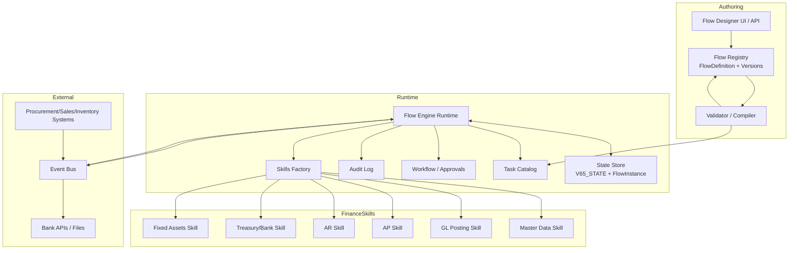
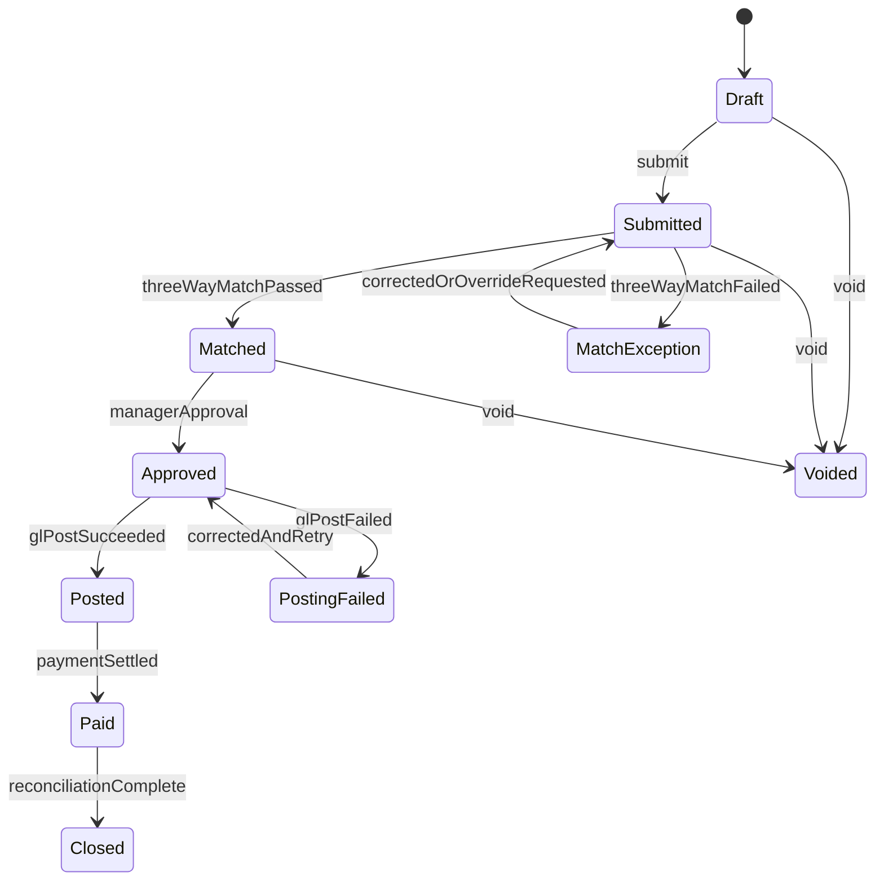
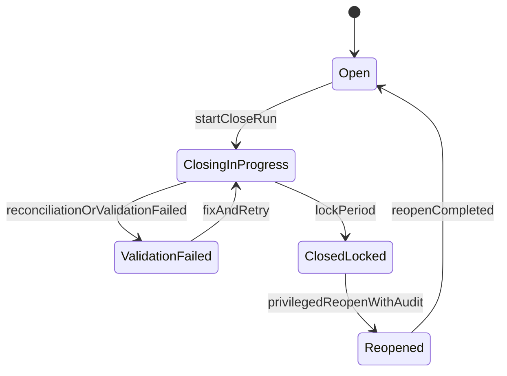

# Extending the Engine to Support ERP-Grade Finance Flow Creation

## Executive summary

The accessible “13-*” materials describe an **ERP-grade finance capability set** (cross-cutting foundations, core accounting subledgers, and end-to-end business flows) and explicitly propose implementing those flows as **engine-native workflows** via a Task Catalog + Skills architecture (e.g., new Finance “skills,” task types like Procure-to-Pay, state enforcement via `V63_STATE` / `V65_STATE`, mandatory pre-flight questions, and output contracts). fileciteturn0file0 fileciteturn0file1

To support “flow creation” for this domain, the engine must reliably handle **long-running, mixed human+system workflows** (approvals, matching, external bank events), with finance-grade invariants: **immutable audit trails, segregation-of-duties controls, balanced double-entry postings, reconciliation gates, and period locks**. These requirements appear repeatedly as foundational across the provided finance materials (foundation layer + “period close as workflow” + subledger→GL integration). fileciteturn0file0 fileciteturn0file1

This report delivers:

- A consolidated extraction of **flow requirements** (requirements, data models, triggers, state transitions, I/O contracts, error cases, and NFRs), grounded in project sources. fileciteturn0file0 fileciteturn0file1  
- A requirements-to-engine mapping identifying **what to modify**, **what to add**, and **integration points**. fileciteturn0file1  
- A concrete design proposal for **Flow Definition → Validation/Compilation → Execution**, plus **finance-domain skills/services**, including mermaid diagrams and API/schema sketches. fileciteturn0file1  
- A prioritized implementation plan with effort/risk estimates, plus test strategy and migration/backward-compatibility approach.

Key architectural recommendation: implement a **versioned Flow Definition layer** (DSL/schema + registry + validator/compiler) and a **durable execution runtime** that can pause on approvals and external events while keeping auditable, deterministic state updates. For interoperability and operational discipline, align with widely adopted standards: OpenAPI for HTTP contracts, CloudEvents for event envelopes, OpenTelemetry for tracing/metrics/logs, OAuth2/OIDC/JWT profiles for authentication/authorization, and ISO 20022 where bank-message standardization is required. citeturn6search2turn9search0turn7search1turn5search0turn4search0turn6search0turn8search0

## Evidence base and scope constraints

The current environment surfaced **two** project documents:

- “13 - finance deep research.md” (broad ERP finance module map + architecture suggestions + workflows and artifacts). fileciteturn0file0  
- “13 - finance.md” (module map + flow descriptions + explicit proposal to implement finance flows as Task Catalog entries and Finance Skills aligned to the engine’s DNA/Skills Factory patterns). fileciteturn0file1  

The user request references “all 13-* documents,” but only these two were retrievable here; therefore, the requirement extraction should be treated as **partial** and biased toward finance. Any cross-document dependencies (e.g., engine-wide Flow DSL requirements, non-finance flow families, shared UI builder requirements) may be missing and must be validated once the remaining “13-*” sources are available.

### Source priority order used in this report

- **Project sources (highest priority)**: the two “13-*” documents above define the intended flows, engine integration style (Skills Factory, Task Catalog, `V65_STATE`), and correctness guardrails. fileciteturn0file0 fileciteturn0file1  
- **Primary/official external standards** (used to de-risk interfaces and operationalization):
  - OpenAPI Specification and governance context from the entity["organization","OpenAPI Initiative","linux foundation api specs"] (under the entity["organization","Linux Foundation","nonprofit org"]). citeturn6search2turn6search3  
  - CloudEvents specifications (hosted in a public spec repository; CloudEvents is positioned as a common event metadata format). citeturn9search0turn8search5  
  - OpenTelemetry specification for observability semantics and compliance requirements from entity["organization","OpenTelemetry","observability project"]. citeturn7search1turn7search0  
  - OAuth2/OIDC/JWT profile documents from the entity["organization","Internet Engineering Task Force","standards body"] ecosystem (OAuth 2.0 core; OIDC Core; JWT; JWT Access Token Profile). citeturn5search0turn4search0turn4search5turn6search0  
  - ISO 20022 high-level definition and purpose from entity["organization","ISO","international standards body"]’s ISO 20022 repository site; adoption framing from entity["organization","SWIFT","financial messaging network"]. citeturn8search0turn8search4  

### Domain framing references in the project sources

The project sources explicitly anchor the desired finance functionality in the module/flow behavior of large ERPs such as entity["company","SAP","enterprise software"] (FI/CO concepts, universal-journal style unification, subledger postings to reconciliation accounts) and entity["company","Priority Software","erp vendor"] (financial management suite including cash management, billing, multi-company/multi-currency, fixed assets, budget management, etc.). fileciteturn0file1 citeturn3search1turn0search7turn0search4turn0search0  

## Extracted requirements for flow creation

The “flow creation” capability needed by the engine is best understood as: **a way to define, validate, version, execute, observe, and audit multi-step business workflows** that combine system actions (posting, matching, integrations) with human actions (approvals, overrides), and enforce finance-grade controls. This section consolidates all requirements explicitly present in the project sources, plus clearly marked derived requirements that are necessary to make those flows reliable in production.

### Functional flow requirements

The project sources describe these canonical end-to-end flows and their expected stages:

- Procure-to-Pay: “Requisition → PO → Goods Receipt → Vendor Invoice → Payment → Bank Reconciliation,” including three-way match controls (PO ↔ goods receipt ↔ invoice). fileciteturn0file0 fileciteturn0file1  
- Order-to-Cash: “Quote/Order → Delivery/Service → Invoice → Customer Payment → Cash Application.” fileciteturn0file0 fileciteturn0file1  
- Record-to-Report: postings accumulate → “period close as workflow” (accruals/deferrals, depreciation, revaluation, allocations, reconciliation) → lock period → produce statements/audit trail. fileciteturn0file0 fileciteturn0file1  
- Asset lifecycle: acquire/capitalize → depreciate → dispose, with integration to AP and GL. fileciteturn0file0 fileciteturn0file1  
- Project-to-profit: plan → collect costs → bill milestones → recognize revenue → analyze profitability (tying Projects + Billing + controlling dimensions). fileciteturn0file0 fileciteturn0file1  
- Treasury/cash: cash forecast → payment proposals → execution → bank statement ingest → reconciliation, including approvals and controls. fileciteturn0file0 fileciteturn0file1  

In addition, the sources define required **modules (capability areas)** that flows must compose:

- Cross-cutting: organization/master data; security/controls/audit; workflow/document management; integration layer. fileciteturn0file1  
- Core accounting: GL, AP, AR, Cash/Bank management, Tax/VAT/withholding, Fixed Assets, Billing/Revenue. fileciteturn0file1  
- Management accounting/controlling: cost centers, profit centers, internal orders/projects, allocations. fileciteturn0file1  
- Planning/budgeting; consolidation (optional). fileciteturn0file1  

#### What “flow creation” must support, as implied by these flows

From the described stages and controls, the engine must support:

- **Sequential + conditional stages** (e.g., three-way match pass/fail → route to exception queue; credit limit → require approval). fileciteturn0file1  
- **Human approvals** as first-class steps (PO approval, invoice approval, payment run approval, period close approval). fileciteturn0file1  
- **Wait states for external events** (goods receipt posted, bank statement line arrives, payment settlement status callback). fileciteturn0file0  
- **Compensation / reversals** rather than mutation of posted records (“document principle” and immutable audit trail intent are emphasized). fileciteturn0file1  
- **Batch and scheduled steps** (depreciation run, revaluation, allocations during close). fileciteturn0file1  

### Core data models required by the flows

The sources enumerate (directly or by implication) the following master and transactional objects that flows must read/write:

- Org and master data: legal entity/company, business units/branches, profit center, cost center, chart of accounts, GL accounts, customers, vendors, bank accounts, tax codes, payment terms, currencies, exchange rates. fileciteturn0file1  
- P2P transactional objects: requisition, purchase order, goods receipt, vendor invoice, matching results/exceptions, payment proposal/run, payment execution record, bank statement line, reconciliation match record. fileciteturn0file1  
- O2C transactional objects: quote/order, delivery/service confirmation, customer invoice/credit memo, receipt, cash application, dunning/collections artifacts. fileciteturn0file1  
- Accounting artifacts: journal entry header + line items, reconciliation/cross-ledger reports (trial balance, P&L, balance sheet). fileciteturn0file1  
- Assets: asset master, depreciation rules/schedule, capitalization/disposal events, depreciation postings. fileciteturn0file1  
- Close/cycle management: fiscal period calendar, close checklist/steps, lock state. fileciteturn0file1  

### State transitions and triggers

The project sources do not provide formal state diagrams, but they do specify enough workflow semantics to derive required state machines. The engine should treat these as **explicit workflow state models** (versioned with the flow definition), not ad-hoc status strings.

Below are **derived minimal state machines** that the engine needs to support to execute the described processes safely.

#### Vendor invoice lifecycle (derived)

- Draft → Submitted → (Matched | MatchException) → Approved → Posted → Paid → Closed  
- Cancel/Void allowed only pre-posting; after posting, corrections via credit memo/reversal. fileciteturn0file1  

Triggers:
- User submits invoice; match engine completes; approver approves; posting engine posts; payment engine executes; bank reconciliation confirms settlement. fileciteturn0file0  

#### Payment run lifecycle (derived)

- DraftProposal → SubmittedForApproval → Approved → Initiated → SentToBank → (Accepted | Rejected) → (Settled | Failed) → Reconciled fileciteturn0file0  

Triggers:
- Treasury starts run; workflow approval; bank integration status updates; statement ingestion drives reconciliation completion. fileciteturn0file0  

#### Period close lifecycle (derived)

- Open → ClosingInProgress → ValidationFailed → ClosingInProgress → ClosedLocked  
- Exceptional: Reopen requires privileged workflow + audit record. fileciteturn0file1  

Triggers:
- Close run started; each checklist step completed; reconciliation gates; final lock action. fileciteturn0file1  

### Inputs, outputs, and user interactions

The project sources explicitly propose implementing flows in the engine via:

- **Task Catalog entries** for complex end-to-end workflows (e.g., task types for P2P, O2C, R2R, Project-to-Profit). fileciteturn0file1  
- **Mandatory pre-flight questions** (e.g., vendor active/tax compliant; PO/GR match; customer credit limit; delivery confirmed; periods open in `V65_STATE`; subledgers synchronized). fileciteturn0file1  
- **Output contracts** (examples named: `PaymentVoucher`, `LedgerEntry_AP`, `CustomerInvoice`, `LedgerEntry_AR`, `BankReconciliationDoc`, `TrialBalance`, `BalanceSheet`, `IncomeStatement`, `ProjectProfitabilityReport`). fileciteturn0file1  

Human interactions explicitly required include:
- Approval UX for PO/invoice/payment/close; attachments (invoice PDF), comments, versioning; reconciliation and matching UI (manual resolution). fileciteturn0file1  

### Error cases and exception handling requirements

From three-way match controls and reconciliation emphasis, the flows must handle at least:

- Match exceptions: invoice does not match PO or goods receipt; partial receipts; price/quantity variances → route to exception queue, require approval/override, maintain audit trail. fileciteturn0file1  
- Posting failures: period locked, missing master data mapping, invalid tax code, unbalanced journal entry → fail safe, do not partially post, require correction/resubmission. fileciteturn0file1  
- Bank integration failures: payment rejected, connectivity issues, delayed settlement, duplicate callbacks → idempotent handling + retry/backoff + manual resolution. fileciteturn0file0  
- Close failures: reconciliation deltas (subledger vs GL), incomplete steps, validation failures → block lock; surface actionable checklist. fileciteturn0file1  

### Nonfunctional requirements surfaced by the sources

The sources explicitly emphasize: security/controls/audit, workflow governance, and integration reliability as foundations. fileciteturn0file1  
From that, minimum NFRs include:

- **Auditability**: immutable transaction history, who/what/when for approvals and overrides; “change log” of financial transactions is explicitly highlighted as a suite feature in Priority materials. fileciteturn0file1 citeturn0search0turn0search4  
- **Security and segregation of duties (SoD)**: role-based permissions + approval limits + prevention of self-approval patterns. fileciteturn0file1  
- **Performance/scalability**: not quantified in the sources; therefore treated as open-ended. The engine design must support (at minimum) multiple parallel flow instances, long-running waits, and bursty batch steps (close runs). fileciteturn0file0  
- **Integration robustness**: connector layer for bank connectivity/EDI/APIs; support import/export. fileciteturn0file1  

## Requirement-to-engine mapping and impact assessment

The sources propose a concrete integration philosophy: implement finance capabilities as **new “skills”** and register finance end-to-end flows as **Task Catalog entries**, enforcing posting/period rules via a shared state schema (`V63_STATE` / `V65_STATE`) and validating output contracts (e.g., “debits = credits”) before task completion. fileciteturn0file1  

Because the broader engine architecture is not provided, this section maps requirements to a **reference engine decomposition** that is consistent with the named project constructs (Skills Factory, Task Catalog, state schema, mandatory questions, output contracts, DI registration). fileciteturn0file1  

### Engine components implied by the project sources

At minimum, the engine already has (or intends to have) these constructs:

- **Skills**: runtime-executable capability modules (with “Registration”/DI alignment). fileciteturn0file1  
- **Task Catalog**: a registry of task types with validations (mandatory questions) and outputs (contracts). fileciteturn0file1  
- **State store schema**: `V63_STATE` / `V65_STATE` used to enforce workflow integrity (including period lock semantics for finance). fileciteturn0file1  

### What must be added to support “flow creation” in this domain

The finance requirements force the engine to go beyond “task execution” into **versioned workflow authoring** and **durable orchestration**. Concretely, add:

- **Flow Definition layer** (new):
  - A Flow DSL/schema that declares steps, transitions, triggers, timeouts, compensation steps, input/output contracts, and role/approval requirements.
  - Versioning, publication, activation, and deprecation semantics (“flow as code / flow as artifact”).
- **Flow Validator/Compiler** (new):
  - Graph validation (no orphan states, no cycles unless explicitly allowed, deterministic transitions).
  - Contract binding (each step references a Skill operation and declares input/output types).
  - Policy binding (authorization requirements, SoD constraints, approval thresholds).
- **Flow Runtime** (new or major enhancement):
  - Durable state machine execution with wait states and idempotency.
  - External event correlation (e.g., bank statement line → specific payment run).
- **Audit + Evidence framework** (expand):
  - Every transition and approval must be logged as an append-only audit record with tamper-evident properties (implementation choice is open-ended, but the behavior is required). fileciteturn0file1  

### What existing modules likely need modification

Based on the project intent that finance flows become Task Catalog entries and Skills, the following engine modules should be extended:

- **Task Catalog**: support composite flows as first-class task types (not only single-step tasks), and enforce contract validation gates (e.g., “balanced journal entry” validator). fileciteturn0file1  
- **State management (`V65_STATE`)**: add canonical finance-related state primitives:
  - fiscal period open/closed/locked
  - close run execution state
  - reconciliation gate outcomes fileciteturn0file1  
- **Workflow/approval subsystem**: ensure human approvals integrate into flow execution as blocking steps and emit auditable outcomes. fileciteturn0file1  
- **Integration layer**: formalize bank connectivity and external system connectors as engine-friendly triggers and actions. fileciteturn0file1  

### Integration points required by the finance flows

The described end-to-end stages imply integration points with:

- Procurement and inventory (requisition/PO/GR events) for P2P. fileciteturn0file1  
- Sales and logistics/service delivery (order/delivery events) for O2C. fileciteturn0file1  
- Banking systems for payment initiation and statement ingestion/reconciliation. fileciteturn0file1  
- Reporting/BI endpoints for trial balance, P&L, balance sheet, plus close/audit packs. fileciteturn0file1  

### Engine-level component interaction diagram



This diagram is consistent with the project sources’ approach: “skills” implement domain capabilities; Task Catalog enumerates complex workflows; state schema enforces constraints such as locked periods; approvals are first-class; and integration triggers are part of runtime orchestration. fileciteturn0file1  

## Detailed design proposals

This section proposes specific artifacts (APIs, schemas, and diagrams) to implement flow creation for the finance flows described in the project sources, while keeping unspecified stack/runtime details open-ended.

### Flow definition model and lifecycle

A minimal flow-authoring lifecycle that fits the project’s “Task Catalog + output contracts” world:

- **Draft**: authoring a definition, not executable.
- **Published**: immutable versioned artifact, validated and eligible to run.
- **Active**: chosen default version for new instances.
- **Deprecated**: cannot start new instances; existing instances continue.
- **Retired**: no longer supported; only kept for audit/history.

This mirrors the “document principle” philosophy emphasized for finance transactions: immutable artifacts with history, rather than mutable definitions. fileciteturn0file1  

### Flow DSL sketch

A JSON/YAML schema (format choice unspecified) should represent:

- metadata: `flowId`, `version`, `domain` (finance), `owner`, `createdAt`
- triggers: event-based (goods receipt posted), API-based (user starts P2P), schedule-based (monthly close)
- steps: each step binds to a Skill operation + input/output contract types
- transitions: conditional expressions over step outputs
- timeouts and retries
- compensation: reversal/cancel/credit memo steps

#### Example DSL excerpt (illustrative)

```yaml
flowId: FIN_P2P
version: 1.0.0
trigger:
  type: api
  endpoint: POST /flows/FIN_P2P/runs
steps:
  - id: createVendorInvoice
    skill: APService.CreateInvoice
    inputContract: VendorInvoiceDraft
    outputContract: VendorInvoice
    next: matchThreeWay
  - id: matchThreeWay
    skill: APService.MatchThreeWay
    inputFrom: createVendorInvoice.output
    outputContract: MatchResult
    transitions:
      - when: output.status == "MATCHED"
        to: approveInvoice
      - when: output.status == "EXCEPTION"
        to: resolveException
  - id: approveInvoice
    type: humanApproval
    role: AP_MANAGER
    inputFrom: matchThreeWay.output
    next: postToGL
  - id: postToGL
    skill: GLService.PostJournal
    inputContract: JournalEntryCandidate
    validators:
      - BalancedDoubleEntry
      - PeriodOpen
    next: startPaymentRun
  - id: startPaymentRun
    skill: TreasuryService.CreatePaymentRun
    next: waitForSettlement
  - id: waitForSettlement
    type: waitForEvent
    eventType: bank.payment.settled
    correlationKey: paymentRunId
    next: reconcileBank
  - id: reconcileBank
    skill: TreasuryService.ReconcileStatement
```

This directly encodes requirements stated in the project sources: three-way match, approvals, posting validation “debits = credits,” period-open enforcement via shared state, and bank reconciliation driven by bank events. fileciteturn0file1  

### Event envelope standardization

For cross-module triggers, use CloudEvents as the envelope format so that finance flows can consistently consume events from procurement/sales/banking connectors. CloudEvents is documented as a specification with a “core specification” and protocol bindings maintained in a public spec repository and promoted as a way to standardize event metadata. citeturn9search0turn8search5

This is especially helpful for finance because correlation keys (e.g., invoiceId, paymentRunId) and provenance metadata (source system, event time) are essential for auditability and idempotency.

### Observability requirements for flows

Flow execution should emit:

- traces with correlation IDs across steps and downstream calls
- metrics per flow version (p95 latency, failure rates by step, approval lead time)
- structured logs with audit-safe redaction

OpenTelemetry provides a formal specification and versioned norms for telemetry semantics and compliance language (“MUST/SHOULD”), making it suitable as the interoperability layer for observability across polyglot components. citeturn7search1turn7search0

### Authentication and authorization model

Because the project sources emphasize “security, controls, audit” and SoD, the engine must support standardized authentication plus fine-grained authorization around flow definition publishing and finance approvals. fileciteturn0file1  

Recommended baseline:

- OAuth 2.0 as the authorization framework (RFC 6749). citeturn5search0  
- OIDC Core for end-user authentication semantics (identity layer on top of OAuth 2.0). citeturn4search0  
- JWT as a token format (RFC 7519) and the JWT Access Token Profile (RFC 9068) if the system chooses JWT access tokens across services. citeturn4search5turn6search0  

Flow-authoring authorization should include:
- who can create/publish flows
- who can activate/deprecate versions
- who can approve which steps (approval limits, legal entity scope)
- explicit rules preventing self-approval and conflicting roles (SoD)

### Finance-domain service/skill decomposition aligned to project sources

The “13 - finance.md” document explicitly proposes adding finance domain skills including AP, AR, GL, Fixed Assets/Treasury, and Controlling/Costing, plus cross-cutting master data and audit/security skills aligned to the engine’s DNA/Skills Factory pattern. fileciteturn0file1  

A pragmatic design is:

- **Master Data Skill**: legal entity, COA, vendors/customers, bank accounts, tax codes, terms, exchange rates.
- **GL Skill**: journal entry validation and posting; period lock enforcement; statement generation (trial balance, P&L/BS).
- **AP Skill**: vendor invoices/credit memos; three-way match; AP aging/open items; payment proposal creation.
- **AR Skill**: billing/invoicing; receipts/cash application; AR aging; credit limit checks/dunning triggers.
- **Treasury/Bank Skill**: payment initiation adapters; statement ingestion; reconciliation matching workflows.
- **Fixed Assets Skill**: capitalization, depreciation runs, disposal postings.
- **Controlling Skill**: cost centers/profit centers, allocations, project profitability.

This decomposition matches the modules and flows enumerated in the sources (P2P/O2C/R2R; assets; treasury; controlling). fileciteturn0file1  

### Flow and state machine diagrams

#### Vendor invoice state machine (derived from described workflow semantics)



This makes explicit the exception handling implied by “three-way match” and approvals, and aligns with the “do not mutate posted transactions; keep audit history” stance in the project sources. fileciteturn0file1  

#### Period close state machine (derived)



This models “period close as workflow” and the requirement that the engine enforce “no posting into locked period,” which the sources explicitly tie to the state schema. fileciteturn0file1  

### API design proposals

Because the project does not specify language/runtime, the APIs below are described at the contract level and should be published using OpenAPI. The OpenAPI Specification (OAS) defines a language-agnostic interface description for HTTP APIs and is designed to support codegen, documentation, and tooling. citeturn6search2turn6search3  

#### Flow authoring APIs (engine-level)

- `POST /v1/flows` → create a new flow (draft)
- `POST /v1/flows/{flowId}/versions` → submit a new version (draft → validated)
- `POST /v1/flows/{flowId}/versions/{version}:publish` → publish immutable version
- `POST /v1/flows/{flowId}:activate?version=X` → set default active version
- `GET /v1/flows/{flowId}/versions/{version}` → retrieve definition for audit/debug
- `POST /v1/flow-runs` → start a flow instance (references flowId + version or default)
- `GET /v1/flow-runs/{runId}` → current state, step statuses, audit trail links
- `POST /v1/flow-runs/{runId}:cancel` → attempt graceful cancellation; execute compensation if defined

#### Finance task entrypoints (domain-level, mapped to Task Catalog)

Consistent with the project sources’ proposal for adding tasks like `TASK_FIN_01` etc., expose canonical endpoints that create flow-runs under the hood and return a runId plus top-level business artifact IDs. fileciteturn0file1  

Examples:
- `POST /v1/finance/p2p/runs` (starts FIN_P2P flow)
- `POST /v1/finance/o2c/runs` (starts FIN_O2C flow)
- `POST /v1/finance/r2r/close-runs` (starts FIN_R2R_CLOSE flow)

### Alternative design approaches and trade-offs

The “flow creation” requirement can be met via multiple architectural choices. The table below compares viable approaches in terms of correctness, operability, and alignment to project sources.

| Approach | Description | Strengths | Weaknesses | Best fit when |
|---|---|---|---|---|
| Engine-native DSL + durable runtime | Build Flow DSL/registry/compiler and execute in engine runtime; Skills implement steps; Task Catalog binds contracts/validators | Tight alignment with Skills Factory + Task Catalog + `V65_STATE`; best control over SoD/period-lock invariants; unified audit story fileciteturn0file1 | Must build workflow durability, external event correlation, backpressure, admin tooling | Engine already executes tasks/skills and you want unified “flow as product feature” |
| Integrate external workflow engine | Use entity["company","Temporal","workflow orchestration vendor"] or entity["company","Camunda","process automation vendor"] for orchestration; engine provides Skills as activities/worker tasks | Mature durability/timeouts/retries; strong visibility into long workflows | Two orchestration layers unless carefully refactored; added ops footprint; mapping Task Catalog validators into external engine needs design | You already operate workflow tech or need strong long-running semantics quickly |
| Event-driven choreography (“no central orchestrator”) | Each domain service emits events and reacts; finance emerges from event choreography | Local autonomy; scales well for high throughput | Hard to guarantee end-to-end invariants (SoD, period lock) and to present a coherent “flow instance” UX; complex audit reconstruction | When flows are mostly machine-to-machine and you already have strong event governance |
| BPMN-only authoring | Analysts author BPMN; engine interprets BPMN directly | Visual modeling; business-friendly authoring | BPMN expressiveness can outpace what the domain can safely allow; requires strict governance; mappings to code validators must be disciplined | When business-process model governance is already strong and consistent |

CloudEvents can reduce coupling regardless of approach by standardizing event metadata and transport bindings across producers/consumers. citeturn9search0turn8search5  

## Implementation plan and effort estimates

Effort here is necessarily assumption-driven because the project sources do not specify language/runtime, current engine boundaries, or operational requirements. The tasks are organized to (a) unlock flow creation for all “13-*” verticals and (b) implement the finance flows described in the accessible sources.

### Prioritization principles

- Build **flow infrastructure + security/audit** first, because finance flows require approvals, state locks, and audit history. fileciteturn0file1  
- Implement **Master Data + GL** before subledgers, because subledgers must post to GL and close depends on reconciliation. fileciteturn0file1  
- Introduce bank integration in stages: first ingestion + manual reconciliation, then automation. fileciteturn0file0  

### Task backlog with rough effort and risk

Effort scale: Low (≤40h), Medium (40–120h), High (120–300h). Hours are rough engineering time excluding PM/legal/compliance.

| Priority | Task | Output | Effort | Rough hours | Risk / complexity notes |
|---|---|---|---:|---:|---|
| P0 | Define Flow DSL/schema + versioning rules | FlowDefinition spec + semantic versioning + lifecycle states | High | 160–240 | Must encode approvals, wait states, contracts, compensation safely; schema evolution is long-lived |
| P0 | Build Flow Registry + publish/activate/deprecate | Persisted flow artifacts + access control | Medium | 80–140 | Security-critical: publishing flows can become “production code deployment” |
| P0 | Implement Flow Validator/Compiler | Graph validation + contract binding + static checks | High | 160–260 | Prevent invalid flows; ensure deterministic transition rules; strong test coverage required |
| P0 | Durable Flow Runtime engine | FlowInstance state machine + retries/timeouts + idempotency | High | 200–300 | Hardest part: long waits + external event correlation + replay safety |
| P0 | Authorization + SoD policy layer for flows | Role model + approval limits + self-approval prevention | High | 140–220 | Finance-grade controls are non-negotiable; errors become audit findings fileciteturn0file1 |
| P0 | Audit logging as append-only evidence | Transition log + approval artifacts + reason codes | Medium | 80–140 | Must be queryable and tamper-evident; design affects compliance posture fileciteturn0file1 |
| P1 | Task Catalog extensions for composite flows | TaskType → FlowDefinition mapping; validators; output contracts | Medium | 80–120 | Must preserve existing task semantics and backward compatibility fileciteturn0file1 |
| P1 | Event ingestion + correlation (CloudEvents envelope) | Standard event adapter + correlation keys | Medium | 80–140 | Idempotency and ordering issues; define correlation conventions citeturn9search0 |
| P1 | Observability instrumentation (OpenTelemetry) | Traces/metrics/logs per flow and step | Medium | 60–120 | Cross-service propagation and PII-safe logs citeturn7search1 |
| P1 | Master Data Skill (finance) | COA, parties, bank accounts, taxes, periods | High | 160–260 | Foundation for every other finance operation fileciteturn0file1 |
| P1 | GL Skill: journal posting + period lock | Balanced posting, lock enforcement, trial balance | High | 180–280 | Must enforce “debits=credits” and period rules reliably fileciteturn0file1 |
| P2 | AP Skill: invoice + 3-way match + approvals | Vendor invoice lifecycle, match exception handling | High | 160–260 | Integrations with procurement/inventory; tricky exception workflows fileciteturn0file1 |
| P2 | AR Skill: invoicing + receipts + cash app | Customer invoice lifecycle + matching | High | 160–260 | Cash application edge cases; credit memos/dunning later fileciteturn0file1 |
| P2 | Treasury/Bank Skill: statement ingestion (MVP) | Import pipeline + manual reconciliation UI hooks | Medium | 80–160 | Bank formats vary; treat ISO 20022 as optional depending on region citeturn8search0 |
| P3 | Fixed Assets Skill: capitalization + depreciation runs | Asset lifecycle artifacts + close integration | Medium | 100–180 | Requires stable GL posting and period close flow fileciteturn0file1 |
| P3 | Implement finance flows as FlowDefinitions | FIN_P2P, FIN_O2C, FIN_R2R_CLOSE, FIN_PROJECT | Medium | 80–160 | Once runtime exists, this should be mostly configuration + validators fileciteturn0file1 |
| P3 | Migration tools + compatibility layer | Data import, ID mapping, dual-run support | High | 140–240 | Risk of data quality issues; requires strong reconciliation checks |

## Testing, validation, migration, and rollout

### Test plans by level

The finance sources implicitly demand correctness and auditability, so testing must be more than CRUD tests: it must prove invariants like balanced postings, reconciliation, and SoD enforcement. fileciteturn0file1  

#### Unit tests

- Flow compiler tests: invalid graphs rejected; transitions deterministic; contracts bind correctly.
- Flow runtime tests: retries/timeouts; idempotency keys; external event correlation behavior.
- Finance validators:
  - balanced double entry validator (sum debits == sum credits)
  - period open/locked enforcement via `V65_STATE`
  - three-way match validator
  - approval/SoD policy checks fileciteturn0file1  

#### Integration tests

- End-to-end “posting chain” tests: AP/AR/Assets actions produce GL artifacts; failures do not partially commit; retries are safe.
- Event ingestion tests: CloudEvents envelope validation; duplicate events do not duplicate postings. citeturn9search0  
- Approval integrations: approval recorded, immutable, enforced by runtime gating. fileciteturn0file1  

#### End-to-end (E2E) tests

- P2P happy path: requisition → PO → GR → invoice → approval → post → payment proposal → (simulated bank settle) → reconciliation. fileciteturn0file1  
- P2P exception path: match failure → override approval → post; verify audit trail and reason codes. fileciteturn0file1  
- O2C: order → delivery → invoice → receipt → cash application. fileciteturn0file1  
- R2R close: close checklist steps → validation gates → lock period; verify no posting into locked period. fileciteturn0file1  

#### Performance and resilience tests (validation criteria must be agreed)

Because performance requirements are unspecified, define provisional SLOs and measure:

- Flow runtime: max concurrent runs; mean time in wait states; step execution latency.
- Posting throughput: sustain a target write rate without violating correctness gates.
- Close run: completes within an agreed operational window.

### Validation criteria for production readiness

A minimal acceptance bar aligned to the project sources:

- No flow can reach “Complete” unless all mandatory questions and output contracts validate. fileciteturn0file1  
- All finance postings must enforce the balancing rule (debits = credits) and period state constraints. fileciteturn0file1  
- Approvals and overrides must be auditable: who/when/what/why. fileciteturn0file1  
- Reconciliation views exist for: bank vs system cash; subledger vs GL at close. fileciteturn0file1  

### Migration and backward compatibility strategy

The project sources do not specify existing engine consumers, so the safest general strategy is:

- **Additive interfaces**: new flow authoring/execution endpoints do not break existing task execution APIs.
- **Versioned flows**: a flow instance records the flow version it started on; instances continue to run even if new versions are published (no mid-flight mutation).
- **Dual-run and shadow modes** for finance: run the flow to generate artifacts in parallel (read-only or “shadow ledger”), reconcile outputs, then enable write mode per tenant/legal entity.
- **Feature flags / scoped activation**: enable finance flows per tenant, legal entity, or business unit, aligned to master data readiness. fileciteturn0file0  

A deployment platform is unspecified. If the project uses entity["organization","Kubernetes","container orchestration project"], rolling updates and rollbacks are supported by the native Deployment controller semantics, but the design must still treat finance data as immutable (use reversals/compensation rather than DB rollbacks for posted artifacts). citeturn7search3turn7search5  

### Backward-compatibility considerations specific to “flow creation”

- Persist **stable external IDs** for flow definitions and steps; avoid renaming breaking changes.
- Support schema evolution via:
  - optional fields
  - explicit version negotiation
  - migration scripts for stored flow definitions
- Provide a compatibility “view” layer for legacy reporting or legacy task consumers, so that introduction of FlowInstances does not invalidate existing dashboards or integrations.

---

**Note on missing “13-*” sources:** once the remaining “13-*” documents are available, the Flow DSL should be validated against additional domains to ensure the authoring model covers all required constructs (parallelism, compensation, timers, SLAs, domain-specific validators) without overfitting to finance.