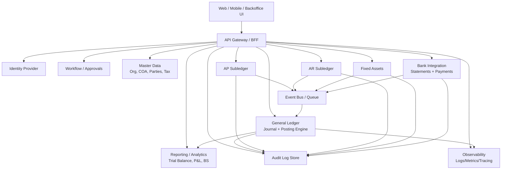
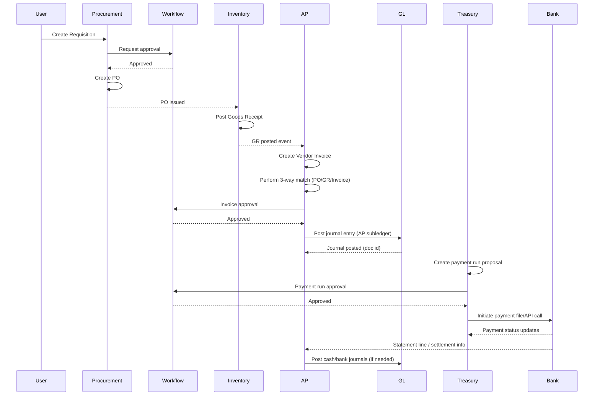
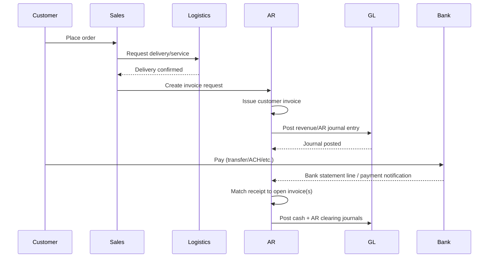
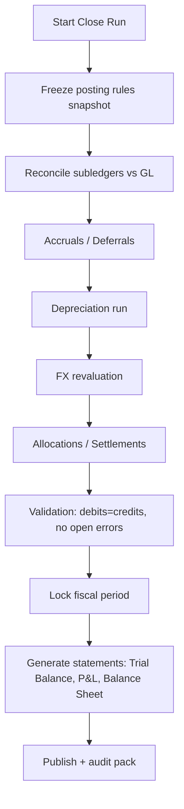

# Extending an Existing Platform to Support ERP-Grade Finance Processes

## Executive summary

The attached Markdown describes a canonical “ERP finance” capability set (similar to what large ERPs provide) organized into: cross-cutting foundations (org/master data, security & audit, workflow/docs, integration), core financial accounting (GL, AP, AR, cash/bank, tax, fixed assets, billing/revenue), management accounting/controlling, planning/budgeting, and (optionally) consolidation. It also highlights end-to-end business flows that these modules jointly support: Procure-to-Pay (P2P), Order-to-Cash (O2C), Record-to-Report (R2R), asset lifecycle, project-to-profit, and treasury/cash operations. fileciteturn0file0

Designing an extension to an existing platform to implement these flows must treat **the ledger and audit trail as first-class, correctness-critical infrastructure**. The most “load-bearing” requirement is that subledger events (AP/AR/Assets) reliably produce **balanced journal entries** in the General Ledger with an immutable document/reversal history. This mirrors how entity["company","SAP","erp vendor"] describes finance in S/4HANA: the Universal Journal is the “book of original entry” for FI/CO postings, and AP postings are simultaneously recorded in the general ledger. citeturn0search0turn0search1turn0search9

Because the current platform architecture is unspecified, this report provides two viable implementation paths—**modular monolith** and **microservices**—and shows how the finance domain can be delivered incrementally while preserving backward compatibility. The report includes:

- A mapping of each finance flow step to platform components/APIs.
- Proposed schemas (ledger, subledgers, master data, bank statements, assets), with example JSON payloads.
- Mermaid sequence diagrams and flowcharts for key flows (P2P, O2C, posting, period close).
- A component-level design diagram.
- Recommended technologies/libraries with pros/cons and prioritized choices, grounded in primary/official sources for standards (OAuth/OIDC/JWT, OpenAPI, CloudEvents, OpenTelemetry, ISO 20022, Kafka, Kubernetes/Helm, Terraform).
- Testing strategy across unit/integration/e2e/load.
- Rollout/migration/rollback plan.
- Risks and mitigations.
- A rough timeline and resource estimate (explicitly assumption-driven due to unspecified NFRs).

## Process interpretation and explicit assumptions

### What the Markdown specifies

The Markdown is primarily a **module map** and **canonical flow map** rather than a detailed platform process spec. It specifies the following as “in-scope” capabilities and principles:

- Cross-cutting foundations: organization & master data; security/controls/audit; workflow and document management; integration layer. fileciteturn0file0
- Core accounting modules: General Ledger, Accounts Payable, Accounts Receivable, Cash/Bank management, Tax, Fixed Assets, and billing/revenue support. fileciteturn0file0
- The importance of subledger → GL integration and period close as an orchestrated workflow. fileciteturn0file0
- End-to-end flows: P2P, O2C, R2R, asset lifecycle, project-to-profit, treasury/cash. fileciteturn0file0

These map closely to public descriptions of finance suites from entity["company","Priority Software","erp vendor, israel"] (financial management, fixed assets, revenue recognition, reporting) and the way SAP emphasizes integrated postings. citeturn0search2turn0search6turn0search18turn0search9

### What is unspecified (must be treated as assumptions or open questions)

The Markdown does **not** specify (examples, not exhaustive):

- Business scope boundaries: single entity vs multi-entity, multi-currency, local statutory rules, consolidation requirements, revenue recognition rules, tax jurisdictions. fileciteturn0file0
- Data formats and integration protocols (e.g., ISO 20022, bank file formats, EDI variants), except general mention of “EDI/bank connectivity/connectors.” fileciteturn0file0
- Throughput and performance targets, availability/SLOs, retention policies, and reporting latency requirements (real-time vs batch). fileciteturn0file0
- Existing platform identity model, authorization model, tenancy model, and domain boundaries.

### Assumptions used in this design (clearly separable)

To produce a concrete design, the remainder of the report assumes:

- **Tenancy & org structure**: Multi-legal-entity support exists or is required; legal entity and fiscal calendar are required for all postings.
- **Posting volume** (placeholder): 10–100 postings/sec sustained during peak; up to 1–10M journal lines/month; “period close” batch jobs may produce large postings.
- **Consistency**: Strong consistency is required for posting and period locks; reporting can use read replicas/materialized views.
- **Integrations**: At minimum: procurement/sales/inventory (internal or external), bank statement ingestion, and outgoing payment initiation.
- **Eventing**: If the platform is microservices, an event bus exists or will be introduced; if monolith, internal domain events + job queue.
- **Security baseline**: OAuth2/OIDC for end-user auth, JWT access tokens, and fine-grained authorization rules for segregation-of-duties-sensitive actions. citeturn0search7turn1search0turn0search3turn0search23

## Target platform architecture and extension approach

### Architectural options given an unspecified current platform

The finance domain can be delivered in either architecture style; the primary driver is organizational maturity and existing deployment topology.

| Dimension | Modular monolith (finance as modules) | Microservices (finance as services) |
|---|---|---|
| Correctness & transactional simplicity | Strong: single ACID boundary for posting and period locks | Harder: requires sagas/outbox/idempotency to keep subledgers+GL consistent |
| Deployment & ops overhead | Lower | Higher (service discovery, distributed tracing, schema evolution, etc.) |
| Scalability & team autonomy | Moderate; scale by vertical scaling + partitioning | Strong; scale hotspots independently (posting, reporting, bank ingest) |
| Data model evolution | Easier to evolve in one repo; risk of tight coupling | Better domain boundaries; harder cross-service queries |
| Recommended when | Early-stage platform, small team, unclear boundaries | Mature platform already microservices; high scale; multiple teams |

Regardless of the choice, the core principle is the same: implement a **ledger-centric core** that behaves like an ERP GL: immutable documents, balancing rules, and controlled period close.

### Core architectural building blocks

Below is a reference design that works in both monolith and microservices forms (the “Service” boxes become modules in a monolith).



### APIs, API documentation, and versioning strategy

- Use **REST/JSON** (or gRPC internally) with explicit versioning (`/v1/...`) and strict schema validation.
- Publish OpenAPI specs for all external-facing endpoints; OpenAPI is defined by the OpenAPI Initiative and is intended as a standard way to describe HTTP APIs. citeturn1search9turn1search1
- For extensibility, introduce “accounting adapters” as internal interfaces (e.g., `IAccountingEventMapper`) so procurement/sales/inventory events can be mapped to journal postings without embedding finance rules in non-finance domains.

### Authentication and authorization

**Authentication**  
Adopt OAuth 2.0 + OpenID Connect for end-user authentication:

- OAuth 2.0 provides the authorization framework conceptually used for delegated access. citeturn0search7
- OIDC defines an identity layer on top of OAuth 2.0 for authentication and claims. citeturn1search0
- JWT is a compact claim format and is standardized in RFC 7519; if you use JWT access tokens, RFC 9068 defines an interoperability profile for OAuth 2.0 JWT access tokens. citeturn0search3turn0search23

**Authorization (finance-grade)**  
Implement multi-layer authorization:

- RBAC for coarse roles: AP Clerk, AP Manager, AR Clerk, Treasurer, GL Accountant, Controller, Auditor, SysAdmin.
- ABAC constraints: per legal entity, cost center, business unit, currency, approval limits.
- Segregation of Duties (SoD): e.g., “invoice creator cannot approve payment run,” “period close requires controller role,” etc. (SoD is strongly implied by the Markdown’s controls/audit emphasis). fileciteturn0file0

### Storage and eventing/queues

**Ledger storage requirements strongly imply an ACID datastore**  
- Journal posting, period-lock checks, and reversal documents must be strongly consistent.
- A relational database is typically the default. Concurrency control may require SERIALIZABLE or explicit optimistic concurrency per posting key; PostgreSQL documents transaction isolation behavior and the constraints of serializable processing. citeturn4search7

**Eventing**  
For microservices, use an event bus with a standardized event envelope. CloudEvents is a CNCF specification for describing event data in a common way, improving interoperability across services. citeturn1search2turn1search10

**Queue/stream platform**  
Apache Kafka documentation describes Kafka’s role and (in Streams) exactly-once processing semantics for stream processing pipelines. citeturn4search2turn4search14

### Error handling and resiliency patterns

Financial workflows must assume retries and partial failures:

- All write endpoints must be **idempotent** (client-supplied idempotency key or deterministic document id).
- Use “document principle”: correct mistakes by posting a **reversal** document, not by editing/deleting posted entries (the Markdown emphasizes immutable/auditable financial documents; SAP similarly treats postings as documents and relies on auditability). fileciteturn0file0 citeturn0search0
- In microservices, use at-least-once delivery + idempotent consumers, or transactional patterns (e.g., Kafka transactions) when justified by scale and complexity. citeturn4search2turn4search14

### Observability

Instrument consistently:

- Use OpenTelemetry for traces/metrics/logs; the OpenTelemetry project provides a cross-vendor observability framework and a detailed specification. citeturn1search11turn1search3
- Emit domain metrics: posting latency, posting failures by reason, unmatched bank statement lines, approval cycle time, close duration, reconciliation deltas.
- Maintain a tamper-evident audit log and include correlation IDs across API calls and events.

## Data models, storage design, and new schemas

### Canonical ledger model inspired by “universal journal” concepts

SAP’s Universal Journal is described as a unified book of original entry for FI and CO journal entries. citeturn0search0turn0search12  
Without copying SAP’s physical model, the platform can adopt a **unified journal line** concept: store every finalized posting as immutable journal lines, with dimensions to support both external reporting (FI) and internal controlling (CO-style) needs (cost center, profit center, project, etc.). This reflects the Markdown’s emphasis on both legal books and management accounting. fileciteturn0file0

#### Proposed core tables (logical)

- `legal_entity`
- `fiscal_period`
- `chart_of_accounts`
- `gl_account`
- `journal_entry` (header)
- `journal_line` (immutable line items; debit/credit; currency amounts)
- `posting_rule` (mapping from business events → accounts)
- `exchange_rate`
- `tax_code`
- `audit_log_event` (append-only)

#### Proposed subledger tables (logical)

- AP: `vendor`, `vendor_invoice`, `vendor_credit_memo`, `payment_run`, `payment`, `ap_open_item`
- AR: `customer`, `customer_invoice`, `customer_credit_memo`, `receipt`, `ar_open_item`
- Fixed assets: `asset`, `asset_depreciation_schedule`, `asset_depreciation_posting`, `asset_disposal`

#### Bank integration

- `bank_account`
- `bank_statement`
- `bank_statement_line`
- `bank_reconciliation_match`

Bank ingestion often benefits from ISO 20022 support (depending on geography and bank rails). ISO 20022 is a multi-part international standard for financial message development and flows, as described by the ISO 20022 site and major payment standards bodies like SWIFT. citeturn3search4turn3search0

### Example JSON schemas (external API payloads)

These examples are canonical shapes; fields like tax jurisdiction specifics are intentionally left extensible because the Markdown does not specify them. fileciteturn0file0

#### Journal entry creation request (write API)

```json
{
  "idempotencyKey": "1f6d0e46-6a32-4d0f-bf00-31c1d4d8f0d0",
  "legalEntityId": "LE-001",
  "postingDate": "2026-02-25",
  "documentDate": "2026-02-25",
  "sourceType": "AP_INVOICE",
  "sourceId": "VINV-2026-000123",
  "currency": "USD",
  "memo": "Vendor invoice for office laptops",
  "dimensions": {
    "costCenterId": "CC-IT",
    "profitCenterId": "PC-HQ",
    "projectId": null
  },
  "lines": [
    {
      "lineNo": 1,
      "glAccountId": "610000",
      "description": "IT equipment expense",
      "debit": 1200.00,
      "credit": 0.00,
      "tax": { "taxCode": "VAT17", "taxAmount": 0.00 },
      "dimensions": { "costCenterId": "CC-IT" }
    },
    {
      "lineNo": 2,
      "glAccountId": "200000",
      "description": "Accounts payable control",
      "debit": 0.00,
      "credit": 1200.00,
      "party": { "type": "VENDOR", "id": "V-88421" }
    }
  ]
}
```

**Validation invariants (must be enforced server-side)**  
- Sum(debit) == Sum(credit) in document currency.
- Posting date must be in an open fiscal period.
- Accounts must exist and be postable.
- Tax code rules must be satisfied if required (unspecified which regimes). fileciteturn0file0

#### Vendor invoice (AP) creation request

```json
{
  "idempotencyKey": "7f69d741-9a1e-4bb0-9f02-85f2d2ea3dc3",
  "legalEntityId": "LE-001",
  "vendorId": "V-88421",
  "invoiceNumber": "INV-893221",
  "invoiceDate": "2026-02-20",
  "currency": "USD",
  "grossAmount": 1200.00,
  "terms": { "paymentTermsId": "NET30", "dueDate": "2026-03-22" },
  "match": {
    "purchaseOrderId": "PO-2026-01001",
    "goodsReceiptId": "GR-2026-00991",
    "matchType": "THREE_WAY"
  },
  "lines": [
    {
      "description": "Laptop model X",
      "quantity": 3,
      "unitPrice": 400.00,
      "glAccountId": "610000",
      "dimensions": { "costCenterId": "CC-IT" }
    }
  ],
  "attachments": [
    { "type": "INVOICE_PDF", "objectStoreKey": "s3://bucket/ap/inv-893221.pdf" }
  ]
}
```

The “three-way match” concept (PO ↔ goods receipt ↔ invoice) is explicitly called out in the Markdown as a key AP control. fileciteturn0file0  
SAP also frames P2P as integrating purchasing and accounts payable, including receiving/reconciliation and invoicing/payment stages. citeturn2search5

#### CloudEvents envelope for a posted journal entry (event bus)

```json
{
  "specversion": "1.0",
  "type": "com.example.finance.gl.journal.posted",
  "source": "/finance/gl",
  "id": "0d0c2a03-5b6c-4a78-90c8-66bd7c7b3b9b",
  "time": "2026-02-25T10:20:30Z",
  "datacontenttype": "application/json",
  "subject": "JE-2026-000045",
  "data": {
    "journalEntryId": "JE-2026-000045",
    "legalEntityId": "LE-001",
    "postingDate": "2026-02-25",
    "sourceType": "AP_INVOICE",
    "sourceId": "VINV-2026-000123",
    "currency": "USD",
    "debits": 1200.0,
    "credits": 1200.0
  }
}
```

CloudEvents’ goal is to provide a common way to describe event data across services/platforms, which is helpful when finance events must be consumed by reporting, reconciliation, and downstream integrations. citeturn1search2turn1search6

## Mapping process steps to platform components and APIs

This section gives an explicit, implementable mapping from the canonical flows in the Markdown to platform components and API surfaces. Where the platform already contains procurement/sales/inventory modules, those can be integration points; otherwise, stubs are needed.

### Step-to-component mapping

| Flow | Process step | Primary component(s) | Example API(s) | Events emitted / consumed |
|---|---|---|---|---|
| P2P | Requisition | Procurement + Workflow | `POST /procurement/requisitions` | `requisition.created`, `requisition.approved` |
| P2P | Purchase order | Procurement | `POST /procurement/purchase-orders` | `po.issued` |
| P2P | Goods receipt | Inventory/Receiving | `POST /inventory/goods-receipts` | `gr.posted` |
| P2P | Vendor invoice | AP + Workflow | `POST /finance/ap/invoices` | `ap.invoice.created`, `ap.invoice.approved` |
| P2P | Three-way match | AP Match Engine | `POST /finance/ap/invoices/{id}/match` | Consumes `po.issued`, `gr.posted` |
| P2P | Payment run | Treasury/Cash + Workflow | `POST /finance/treasury/payment-runs` | `paymentrun.approved`, `payment.initiated` |
| P2P | Bank execution | Bank Integration | `POST /integrations/banks/payments` | `bank.payment.accepted`, `bank.payment.settled` |
| P2P | Bank reconciliation | Bank Integration + Reconciliation | `POST /finance/bank/statements:ingest` | `bank.statement.ingested`, `bank.recon.completed` |
| O2C | Quote/order | Sales | `POST /sales/orders` | `salesorder.confirmed` |
| O2C | Delivery/service | Logistics/Service | `POST /logistics/deliveries` | `delivery.confirmed` |
| O2C | Customer invoice | AR | `POST /finance/ar/invoices` | `ar.invoice.issued` |
| O2C | Receipt/cash app | Bank Integration + AR | `POST /finance/ar/receipts` | `receipt.posted`, `cashapplied.completed` |
| R2R | Receive postings | GL Posting Engine | `POST /finance/gl/journals` | `gl.journal.posted` |
| R2R | Period close orchestration | Close Manager + Workflow | `POST /finance/close/runs` | `close.step.completed`, `period.locked` |
| Asset lifecycle | Capitalize asset | Assets + AP + GL | `POST /finance/assets` | `asset.created`, `gl.journal.posted` |
| Asset lifecycle | Depreciation | Assets + GL (batch) | `POST /finance/assets/depreciation-runs` | `depr.posted` |
| Asset lifecycle | Dispose asset | Assets + GL | `POST /finance/assets/{id}/dispose` | `asset.disposed` |
| Project-to-profit | Collect costs | Projects + AP/Expenses + GL | `POST /projects/{id}/costs` | `project.cost.posted` |
| Project-to-profit | Bill milestones | Billing/AR + GL | `POST /finance/ar/invoices` | `milestone.billed` |

### Key flows as mermaid diagrams

#### P2P sequence: requisition → payment → reconciliation

SAP’s public P2P description emphasizes integrating purchasing and accounts payable across receiving/reconciliation and invoicing/payment. citeturn2search5  
The Markdown’s P2P flow aligns with requisition → PO → goods receipt → invoice → payment → bank reconciliation. fileciteturn0file0



#### O2C sequence: order → delivery → invoice → cash application

SAP’s Order-to-Cash description highlights that delivery confirmation initiates billing and revenues are booked. citeturn2search7  
The Markdown’s O2C flow matches sales order → delivery/service → invoice → payment → cash application. fileciteturn0file0



#### R2R flowchart: close orchestration

SAP learning materials describe R2R as ensuring completeness/accuracy through stages such as recording, entity close, reconciliation, and reporting. citeturn2search6turn2search10  
The Markdown emphasizes that “period close is a workflow.” fileciteturn0file0



## Integration points, security posture, observability, and non-functional requirements

### Integration points

Based on the Markdown’s integration layer examples, the platform should anticipate these integration categories. fileciteturn0file0

- **Internal domain integrations**: procurement, sales, inventory/logistics, projects, payroll, expense management.
- **External integrations**:
  - Banking: statement ingestion + payment initiation; consider ISO 20022 message/data structures if required by banking partners. citeturn3search4turn3search0
  - EDI (supplier invoices/orders), eCommerce, CRM.
- **Reporting/BI**: downstream warehouse exports, finance cubes, or embedded reporting.

A pragmatic approach is to define a **canonical finance event contract** (journal posted, invoice approved, payment initiated/settled, bank statement ingested) and keep source-system-specific adapters at the boundary.

### Error handling (finance-specific)

- **Idempotency everywhere**: retries are inevitable for payment initiation, statement ingestion, and posting steps.
- **Hard vs soft failures**:
  - Hard failures: unbalanced journal, closed period, missing COA account, invalid currency.
  - Soft failures: matching ambiguity (bank statement line cannot be confidently matched), transient bank API failures.
- **Compensation patterns**: reversal entries and negative documents rather than deletions; structured reason codes; “re-open period” only via explicit privileged workflow.

### Observability and auditability

- **Telemetry**: OpenTelemetry traces, metrics, logs (with correlation IDs) across services. citeturn1search11turn1search3turn1search19
- **Audit log**: append-only event store for:
  - Who created/approved/posted/voided each document.
  - Before/after snapshots for mutable pre-posting documents (draft invoices, payment proposals).
  - Explanations for overrides (e.g., forcing a match, manual journal adjustments).
- **Reconciliation reports**: mirror SAP’s notion that subledgers and GL must reconcile, and reconciliation is a first-class close activity. citeturn0search13turn0search9

### Scalability considerations

Because performance targets are unspecified, the platform should design for the common “financial scaling” shape:

- High write rate at business peak times (invoices, receipts).
- High read/reporting demand during close periods.
- Potentially heavy batch jobs (depreciation, allocations, revaluation).

Key techniques:

- Partition journal lines by fiscal year/period and legal entity.
- CQRS-style read models for reporting (materialized views, denormalized reporting tables).
- Asynchronous matching (bank reconciliation) using queue consumers.
- Scale horizontal consumers for bank ingestion and matching.

### Security and compliance notes

- OAuth2/OIDC for end-user auth; JWT format standardized by the IETF; OIDC standardized by the OpenID specs. citeturn0search7turn1search0turn0search3turn0search23
- Encrypt sensitive data at rest and in transit; store secrets in a secrets manager.
- If handling payment card data, PCI DSS establishes a baseline of requirements to protect payment account data; if you do not store/process/transmit card data, keep payment flows strictly bank-transfer based and avoid entering PCI scope. citeturn3search6turn3search2
- If operating in regulated payment contexts (e.g., account access/payment initiation in the EU), strong customer authentication and secure communication rules (PSD2 RTS) may apply; treat this as a jurisdiction-dependent requirement (unspecified in the Markdown). citeturn3search3turn3search11

## Recommended technologies and prioritized choices

This section lists “reasonable defaults” with alternatives. Final selection should follow your current stack, team expertise, and hosting constraints.

### Standards and cross-cutting foundations (recommended regardless of stack)

- **API specification**: OpenAPI for REST contracts. citeturn1search9turn1search1
- **Auth**: OAuth2 + OIDC; JWT access tokens where appropriate. citeturn0search7turn1search0turn0search23
- **Event contract**: CloudEvents envelope for domain events. citeturn1search2turn1search6
- **Observability**: OpenTelemetry + OTLP exporters. citeturn1search11turn1search19

### Workflow orchestration options (approvals, close orchestration, long-running flows)

| Option | Pros | Cons | Best for |
|---|---|---|---|
| Temporal | Durable workflow execution semantics; strong support for retries/timeouts/long-running processes. citeturn4search4turn4search16 | New operational component; code-first workflow modeling (less BPMN-native). | Complex long-running finance flows (payments, close runs) |
| Camunda 8 (Zeebe) | BPMN-native modeling; explicit process automation focus; Zeebe is the process engine. citeturn4search1turn4search17 | Operational overhead; BPMN governance needed. | Organizations with BPMN/DMN modeling discipline |
| “Lightweight” (DB state machine + job queue) | Minimal new infrastructure | Harder to evolve; less visibility; can become brittle | Early MVP in a modular monolith |

**Prioritized choice (generic)**  
- If you already run microservices and want robust long-running workflows: **Temporal** (code-first) or **Camunda 8** (model-first). citeturn4search4turn4search1  
- For an initial MVP in a monolith: DB state machine + background jobs, then migrate to a workflow engine when flows stabilize.

### Eventing/streaming options

| Option | Pros | Cons | Notes |
|---|---|---|---|
| Kafka | Widely used distributed event streaming; strong ordering and scalability; Kafka documentation covers semantics and use cases. citeturn4search2turn4search14 | Operational complexity; schema governance required | Good for finance event streams + audit replication |
| RabbitMQ / classic broker | Simpler ops for task queues | Weaker stream/replay model | Better for command/task dispatch than event sourcing |

**Prioritized choice**: Kafka if microservices/event-driven is the direction; otherwise keep a job queue in monolith and phase in Kafka later.

### Deployment / CI-CD / rollback tooling baseline

- Kubernetes supports rolling updates for Deployments; rolling updates enable incremental replacement to reduce downtime. citeturn5search0turn5search3
- Helm provides a rollback command to revert to previous revisions. citeturn5search1turn5search11
- Terraform is widely used IaC for building/changing/versioning infrastructure safely and efficiently. citeturn5search2turn5search18
- CI/CD can be implemented with entity["company","GitHub","code hosting company"] Actions workflows. citeturn5search10

## Testing plan, rollout/migration strategy, risks, and delivery timeline

### Testing strategy

Finance systems require correctness beyond typical CRUD testing. Recommended layers:

**Unit tests**
- Posting validation: balanced entries, required dimensions, account existence, period open rules.
- Matching algorithms: three-way match validations; bank statement matching scoring.
- Authorization policy tests: SoD constraints, legal-entity scoping.

**Integration tests**
- AP/AR/Assets → GL posting pipeline: ensure subledger actions produce exactly one posted journal (idempotency) and that GL totals match subledger open items.
- Period lock enforcement: attempts to post into closed period fail with correct error codes and audit entries.
- Bank ingestion parser tests: ISO 20022 variants (if applicable), CSV/MT940-style (if applicable; unspecified) with golden files.

**End-to-end tests (E2E)**
- P2P happy path: requisition → PO → GR → invoice → approval → payment proposal → payment execution stub → statement ingest → reconciliation.
- O2C happy path: sales order → delivery → invoice → payment receipt → cash application.
- R2R: execute a close run through all steps; verify statements produced; verify period locked.

**Load/performance tests**
Because targets are unspecified, define provisional targets and revise:
- Posting API: sustain X tx/sec with p95 latency under Y ms for “accept + enqueue” and under Z sec for “finalized posting.”
- Close batch: complete within a defined window (e.g., < 2 hours for mid-size entity) for a dataset of N journal lines.

### Deployment and CI/CD approach

- Build pipelines: compile, unit tests, static analysis, container build, SBOM, vulnerability scan, integration tests, deploy to staging, gated prod deploy.
- Progressive rollout: feature flags per legal entity; canary deployments for posting engine.
- Rollback:
  - Application rollback: Helm rollback for service versions. citeturn5search1
  - Data rollback: never delete posted journals; use reversals and compensating documents.

### Migration and backward compatibility

A safe approach is **dual-running** and **event-capture first**:

1. **Foundation migration**
   - Import/create Org structure, Chart of Accounts, parties (customers/vendors), bank accounts.
   - Establish mapping tables from existing IDs → finance IDs.

2. **Read-only reporting mode**
   - Start consuming procurement/sales/inventory events to build a shadow ledger (no business impact).
   - Reconcile shadow outputs with incumbent financial outputs.

3. **Limited write scope**
   - Enable AP invoice posting for a single legal entity or cost center subset.
   - Keep legacy outputs for other domains until confidence is high.

4. **Expand flows**
   - Add AR billing and receipts.
   - Add bank statement ingestion and automated matching.

5. **Close adoption**
   - Only after daily posting stabilizes, introduce orchestrated month-end close runs.

Backward compatibility tactics:
- Keep legacy endpoints stable; new finance endpoints are additive (`/finance/...`).
- Emit both “legacy events” and “finance events” during transition.
- Provide reconciliation dashboards for stakeholders during dual-run.

### Risk analysis and mitigations

**Correctness risk (highest): unbalanced entries, incorrect mappings, period close errors**  
Mitigation:
- Centralize posting rules and validate debit=credit at commit time.
- Use automated reconciliation reports (subledger vs GL) as a non-negotiable gate for close. citeturn0search13turn0search9

**Workflow/approval risk: SoD violations**  
Mitigation:
- Encode SoD as authorization policy tests and runtime checks; require approvals via workflow for sensitive actions (invoice approval, payment run, close). fileciteturn0file0

**Integration risk: bank formats, incomplete data, matching ambiguity**  
Mitigation:
- Start with statement ingestion + manual matching UI; add automation scoring later.
- Align bank interfaces to ISO 20022 where relevant. citeturn3search4turn3search0

**Operational risk: close-period load spikes**  
Mitigation:
- Separate reporting read model; scale reporting independently.
- Batch optimization and partitioning; precompute trial balance increments.

**Security risk: sensitive financial data exposure**  
Mitigation:
- Least privilege, legal-entity scoping, encryption, audit logs, and standardized auth (OAuth2/OIDC/JWT). citeturn0search7turn1search0turn0search3

### Rough implementation timeline, milestones, and resource estimates

Because performance targets and scope boundaries are unspecified, this plan is an MVP-to-production path for a mid-sized scope (single group, multi-entity optional, basic tax/VAT, bank ingestion, no advanced consolidation).

**Team assumption (core)**  
- 1 Tech Lead / Architect  
- 3 Backend engineers (finance + integrations)  
- 1 Frontend engineer (approvals, reconciliation UI, close cockpit)  
- 1 QA automation engineer  
- 0.5 DevOps/SRE  
- 0.5 Finance SME (controller/accountant)  

**Timeline (approx. 20–28 weeks)**

| Milestone | Scope | Duration | Deliverables |
|---|---|---:|---|
| Discovery and specification hardening | Confirm legal entity model, COA, required flows, NFRs | 2–3 weeks | Signed-off requirements, domain model, integration inventory |
| Finance foundation | Org/master data, COA, fiscal periods, auth roles, audit log base | 3–4 weeks | Working master data APIs + UI; role model; audit events |
| Ledger core | Journal entry model, posting engine, reversal, period locks, reporting skeleton | 4–6 weeks | GL posting API; trial balance endpoint; immutable doc handling |
| AP + P2P MVP | Vendor invoices, three-way match hooks, approvals, GL integration | 4–6 weeks | End-to-end P2P without bank automation (stubbed payments) |
| AR + O2C MVP | Customer invoices, receipts, cash application, GL integration | 4–6 weeks | End-to-end O2C with basic matching |
| Bank integration + reconciliation | Statement ingest, matching UI, payment initiation adapter | 3–5 weeks | Statement pipeline; reconciliation workflow; operational dashboards |
| R2R close cockpit | Close run orchestration, reconciliations, depreciation placeholder | 3–5 weeks | Close workflow; period locks; close reporting pack |
| Hardening + rollout | Load tests, security review, migration tools, canary rollout | 3–4 weeks | Production-ready release; rollback playbooks; runbooks |

**Effort range (very rough)**  
- MVP (GL + AP + minimal P2P): ~25–40 person-weeks engineering plus 5–10 person-weeks QA/DevOps, depending on existing platform foundations.  
- Full scope in the Markdown (including controlling, budgeting, revenue recognition depth, consolidation): typically a multi-quarter program; the above plan deliberately stages these later because the Markdown does not define detailed requirements for them. fileciteturn0file0