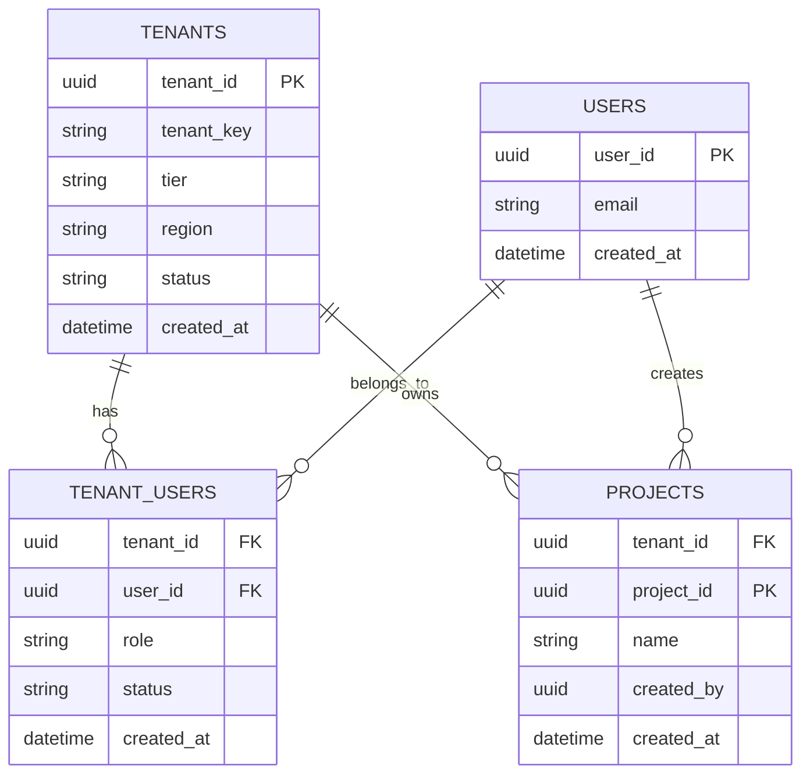

# Adapting a Single-Tenant System to a Multi-Tenant Architecture

## Executive summary

Adapting a single-tenant system to multi-tenancy is fundamentally an exercise in **system-wide context propagation and enforcement**: every request, background job, database query, cache entry, log line, metric, trace, backup, and operational workflow must become **tenant-aware by construction**, not by convention. The architectural choices cluster around a few major axes: **how data is physically organized** (shared schema vs separate schema vs separate database), **how tenant isolation is enforced** (data/performance/security), and **how operations scale** (onboarding, observability, billing, backup/restore, compliance). citeturn12view2turn12view0turn0search2turn0search6

Given that the existing system is unspecified, the most robust default is a **hybrid (“bridge”) strategy**: run most tenants in a pooled/shared model for cost and agility, while enabling selective “graduation” of specific tenants to stronger isolation (separate schema or separate database) based on compliance, noisy-neighbor risk, data residency, and contractual requirements. This “silo/pool/bridge” framing is explicitly recommended in the entity["company","Amazon Web Services","cloud provider"] SaaS guidance, and hybrid migration/tenant movement is also directly described in entity["company","Microsoft Azure","cloud platform"] guidance for SaaS tenancy models. citeturn12view2turn12view1turn0search4turn12view0

Concretely, for an existing single-tenant product, the most defensible migration target is:

- **Default tenancy model:** shared schema (“pool”) with *database-enforced row isolation* where feasible (for example, Row Level Security in entity["organization","PostgreSQL","open source database"]), combined with systematic safeguards against common multi-tenant failure modes (broken object-level authorization, missing tenant scoping, cache bleed). citeturn0search2turn0search3turn13view2turn0search6  
- **Isolation “escape hatches”:** a supported path to separate schema and/or separate database (“silo”) for tenants that require stronger data/performance isolation or tenant-scoped restore/DR, matching both AWS “bridge model” framing and Azure hybrid tenant movement. citeturn0search4turn12view1turn12view2  
- **Identity and access:** tenant-aware authentication based on OAuth 2.0 and OpenID Connect, enterprise SSO via SAML and/or OIDC, automated provisioning via SCIM, and authorization in a tenant-scoped RBAC model (NIST RBAC) with object/property-level checks aligned with OWASP API risks. citeturn1search0turn1search1turn1search2turn1search3turn14search0turn0search3turn14search1  
- **Operations:** per-tenant metering and cost allocation (FinOps showback/chargeback concepts), tenant-aware observability and SLOs (OpenTelemetry + W3C Trace Context + Prometheus formats; SRE “golden signals”), and explicit runbooks for cross-tenant incidents, onboarding failures, restore drills, and offboarding/deletion. citeturn13view1turn9search0turn10search1turn4search1turn4search2turn4search0

A realistic high-level timeline (for a non-trivial production system) is typically **3–9 months**, depending on data-model breadth, security/compliance scope, and whether you must support tenant-level restore/DR on day one. Incremental migration patterns (Strangler Fig) are strongly preferred over “big bang” cutovers because they permit staged rollout and rollbacks. citeturn5search2turn12view0

## Scope, assumptions, and decision criteria

### Scope

This report assumes you are converting a currently single-tenant application into a multi-tenant SaaS offering, with requirements spanning tenancy models, isolation, identity/access, data migration, configuration, onboarding/offboarding, metering/billing, observability, backup/restore/DR, compliance/data residency, testing, rollback planning, and operational runbooks.

### Explicit assumptions and alternatives

Because the existing system is unspecified, each recommendation is paired with options for different stacks and risk postures.

- **Workload shape assumption:** a mix of synchronous APIs plus asynchronous jobs/queues (common in SaaS). If you are purely batch or purely real-time, the performance isolation and observability sections should be weighted differently (but remain tenant-aware end-to-end). citeturn13view3turn10search1  
- **Persistence assumption:** at least one relational datastore exists. If your primary store is NoSQL/search/object storage, the same tenancy models apply conceptually (pool vs silo), but enforcement mechanisms differ; AWS explicitly highlights that isolation mechanisms vary by storage service and may require custom enforcement. citeturn13view2turn12view3  
- **Identity assumption:** you can issue or validate standards-based tokens and integrate enterprise IdPs. If you cannot (for example, legacy auth), you will likely need an intermediate “identity broker” layer during migration. citeturn1search0turn1search1turn2search0turn1search2  
- **Decision criteria:** use the same criteria emphasized in Azure SaaS tenancy guidance—scalability (# tenants and workload), tenant isolation (data + performance), per-tenant cost, dev complexity, ops complexity (monitoring, schema management, restore, DR), and customizability. citeturn12view0turn12view1  

### Effort and risk rating rubric used in this report

- **Effort (Low/Med/High):** relative engineering + operations work to implement in a mature production environment (not a prototype).  
- **Risk (Low/Med/High):** likelihood × impact of tenant-impacting defects, especially cross-tenant data exposure, integrity loss, or prolonged downtime.

These ratings are intentionally conservative because multi-tenancy amplifies blast radius: a defect that once affected “the system” now affects **multiple customers simultaneously**. citeturn12view3turn0search6turn0search3  

## Tenancy models and isolation decision framework

### Tenancy models and how they map to industry guidance

The database-level tenancy models you requested correspond closely to widely used SaaS architecture patterns:

- **Shared schema (“pooled”):** tenants share the same tables; every row is tenant-scoped.  
- **Separate schema (often “bridge” or “pooled with stronger logical separation”):** tenants share a database instance, but each tenant has a distinct schema namespace.  
- **Separate database/instance (“silo”):** tenants have dedicated databases (and sometimes dedicated stacks).  

AWS describes “silo,” “pool,” and “bridge” models explicitly, emphasizing that real SaaS systems often adopt a mix (“bridge”) to balance regulation/noisy-neighbor isolation against cost and agility. citeturn12view2turn0search4turn12view3  
Azure’s SaaS tenancy guidance similarly describes multi-tenant, single-tenant, and hybrid approaches, highlighting tenant movement and hybrid sharded models as a practical strategy when tenants differ substantially. citeturn12view0turn12view1turn0search1  

image_group{"layout":"carousel","aspect_ratio":"16:9","query":["silo pool bridge multi tenant architecture diagram","shared schema vs schema per tenant vs database per tenant diagram","row level security multi tenant database diagram","multi tenant onboarding flow diagram"],"num_per_query":1}

### Comparison table of tenancy models across key attributes

The table below compares the three database tenancy models across the attributes you requested. (Hybrid “bridge” is typically implemented by supporting more than one model and allowing tenant tiering/movement.) citeturn12view2turn12view1turn12view3  

| Tenancy model | Security (data exposure risk) | Cost per tenant | Complexity (dev + ops) | Scalability | Isolation (data + perf + restore) |
|---|---|---|---|---|---|
| Shared schema | **Highest risk** if any query/path misses tenant scoping; mitigable with DB-enforced policies (e.g., RLS) but still requires discipline end-to-end citeturn13view2turn0search2turn0search6 | **Lowest** (max pooling) citeturn12view1 | Dev: medium-high (tenant_id everywhere); Ops: lower (few DBs) citeturn12view0turn12view3 | **High** (best density) citeturn12view1 | Data isolation: medium (needs enforcement); Perf isolation: medium-low (noisy neighbor); Tenant restore: hardest (subset restore is non-trivial) citeturn11search0turn12view0 |
| Separate schema | **Medium risk** (schema boundary reduces accidental joins; still must enforce auth and tenant routing) | Low–medium | Dev: medium; Ops: medium (schema sprawl + migrations) | High but limited by schema count tooling | Better logical separation; **tenant-scoped restore** feasible by schema-level logical backups; perf isolation still shared instance |
| Separate database | **Lowest cross-tenant exposure risk** (hard boundary) | **Highest** unless carefully pooled/automated; can be reduced via pools/elastic resource sharing citeturn12view1turn6search2 | Dev: low-medium (tenant-aware routing); Ops: **high** at scale (provisioning, patching, monitoring many DBs) citeturn12view0turn12view1 | Scales with automation; can become “unwieldy” without strong control plane citeturn12view1 | Strongest data/perf isolation; **tenant-level PITR** and DR simplest (restore one DB) citeturn11search3turn11search5 |

### Isolation levels: data, performance, and security

Multi-tenancy isolation is not a single control; it is layered. Two key industry perspectives are useful:

- AWS emphasizes that pooled (shared) models complicate isolation because you cannot rely purely on network/IAM boundaries; you must implement explicit, service-specific isolation controls and remain “especially diligent” because pooled architectures increase cross-tenant access risk. citeturn12view3turn13view2  
- Kubernetes guidance notes that sharing infrastructure saves cost but introduces challenges in security, fairness, and noisy neighbors, and that isolation is a spectrum that must be chosen based on trust and threat model. citeturn13view3  

In practice:

- **Data isolation:** tenant scoping in every query and data access path; ideally reinforced by datastore features like Row Level Security (RLS) where available. citeturn0search2turn0search8turn13view2  
- **Performance isolation:** per-tenant quotas, rate limits, workload shaping, noisy-neighbor controls (at DB, cache, queue, and compute layers). OWASP explicitly highlights “Unrestricted Resource Consumption” as a top API risk because attackers or heavy tenants can exhaust shared resources and drive DoS/cost spikes. citeturn14search0turn14search4turn4search3  
- **Security isolation:** identity and authorization boundaries, network segmentation where needed, secret separation, blast-radius containment, and hardened operational controls (misconfiguration is itself a top API risk class). citeturn14search6turn12view3  

## Dimension analysis and recommendations

To keep decisions traceable, each dimension includes: pros/cons, implementation options, effort/risk, and recommended choice(s). Unless stated otherwise, the “recommended baseline” assumes you want a cost-effective SaaS offering that can later support enterprise isolation tiers.

### Summary recommendation matrix

| Dimension | Recommended baseline | Effort | Risk |
|---|---|---|---|
| Tenancy models | Bridge strategy: pooled/shared by default + supported upgrades to schema/db isolation tiers citeturn12view2turn12view1 | High | High |
| Isolation (data/perf/security) | Defense-in-depth: tenant context everywhere + DB-enforced row isolation where possible + quotas/limits | High | High |
| AuthN/AuthZ | Tenant-aware OIDC + optional SAML SSO + SCIM provisioning + tenant-scoped RBAC with object/property checks citeturn1search0turn1search1turn2search0turn1search2turn1search3turn0search3turn14search1 | High | High |
| Data partitioning & migration | Tenant_id introduction + staged backfill + incremental rollout (Strangler-style) citeturn5search2turn6search1turn0search2 | High | High |
| Tenant config & customization | Versioned tenant configuration/entitlements + constrained customization model | Medium | Medium |
| Onboarding/offboarding | Orchestrated onboarding workflow + rigorous offboarding/data deletion | Medium | Medium–High |
| Billing & usage metering | Tenant activity/consumption telemetry + chargeback/showback model + usage-based capability | Medium | Medium |
| Observability per tenant | Tenant-labeled metrics/logs/traces using OTel + W3C Trace Context; per-tenant SLOs | Medium | Medium |
| Backup/restore & DR per tenant | RTO/RPO per tenant tier + restore strategy aligned to tenancy model; regular restore drills citeturn3search3turn11search0turn7search4 | High | High |
| Compliance & data residency | Tenant data classification + residency-aware routing + encryption/key mgmt aligned to NIST guidance | Medium–High | High |
| Testing strategies | Multi-tenant correctness + security tests mapped to OWASP API risks; load/noisy-neighbor; restore/DR drills | Medium–High | High |
| Rollback plans | Feature flags + data-migration rollback triggers + idempotent APIs + staged cutovers | Medium | High |
| Operational runbooks | Tenant-aware incident response (data leak/noisy neighbor), onboarding failures, restore, key rotation, offboarding | Medium | Medium |

### Tenancy models: shared schema vs separate schema vs separate database

**Implementation options**

1) **Shared schema (pooled):** add `tenant_id` to every tenant-scoped table; enforce scoping with DB policies where possible (example: PostgreSQL RLS). citeturn0search2turn13view2turn12view3  
2) **Separate schema:** create one schema per tenant (or per tier); central “control plane” tracks tenant→schema mapping.  
3) **Separate database:** create DB per tenant; central registry routes each request/job to the correct DB; optionally use pooling constructs to reduce cost (Azure describes pooling many DBs for SaaS). citeturn12view1turn6search2  
4) **Bridge/hybrid:** combination of the above, with explicit tenant movement/tiers (AWS “bridge,” Azure “hybrid model shines when tenants differ”). citeturn12view2turn12view1turn0search4  

**Pros/cons (high level)**  
- Shared schema maximizes cost efficiency and unified operations but has the highest sensitivity to missing tenant scoping. citeturn12view3turn0search6  
- Separate database maximizes isolation and tenant-level restore/DR but dramatically increases provisioning/patching/monitoring automation needs at scale. citeturn12view1turn11search3  
- Separate schema is an intermediate point: more logical boundary than shared rows, but schema sprawl makes migrations and tooling harder.

**Effort:** High. **Risk:** High.

**Recommended choice(s)**  
Adopt **bridge** as the program-level target: implement pooled/shared by default, and design early for tenant graduation to schema/db isolation. This aligns directly with AWS’s framing that SaaS solutions are often mixed-mode, and Azure’s explicit guidance on hybrid tenant movement and tiering. citeturn12view2turn12view1turn0search4

### Isolation levels: data isolation, performance isolation, security isolation

**Implementation options**

- **Data isolation**  
  - App-enforced scoping (every query includes tenant predicates) plus centralized query builders/repositories.  
  - DB-enforced row filtering where supported (e.g., PostgreSQL RLS via CREATE POLICY/ENABLE ROW LEVEL SECURITY). citeturn0search2turn0search8turn13view2  
  - Storage-specific patterns (for example, object storage bucket-per-tenant vs prefix isolation vs access-point approaches are common design patterns). citeturn10search15  

- **Performance isolation**  
  - Tenant-level quotas and rate limiting (requests/sec, job concurrency, heavy endpoints).  
  - Resource quotas/limits at the compute orchestration layer (Kubernetes ResourceQuota/LimitRange). citeturn4search3turn4search7turn13view3  
  - DB-level controls: connection pools per tenant tier, query timeouts, partitioning strategies (optionally partition/shard by tenant). citeturn6search1turn12view1  

- **Security isolation**  
  - Mandatory object-level authorization checks (OWASP ranks broken object-level authorization as API1). citeturn0search3turn0search6  
  - Property-level controls (OWASP API3 for excessive data exposure/mass assignment). citeturn14search1  
  - Hardened security configuration (OWASP API8). citeturn14search6  

**Pros/cons**  
- DB-enforced policies reduce reliance on developer discipline, but require careful session context handling and test coverage. citeturn0search2turn13view2  
- Compute quotas protect against noisy neighbors but require good capacity modeling and tier-aware exception processes. citeturn13view3turn4search3  

**Effort:** High. **Risk:** High.

**Recommended choice(s)**  
Use **defense-in-depth**: (1) tenant context resolved and validated once per request/job, (2) enforced at the datastore boundary where possible (RLS or equivalent), and (3) protected by per-tenant quotas/rate limits to address OWASP’s “unrestricted resource consumption” risk. citeturn13view2turn0search2turn14search0turn13view3  

### Authentication and authorization changes: tenant-aware identity, SSO, RBAC

**Implementation options**

- **Tenant-aware identity model**  
  - Single global user identity + membership table mapping user↔tenant↔roles (supports users in multiple tenants).  
  - Separate identity namespace per tenant (simplifies some isolation but complicates cross-tenant user experience and admin).  

- **SSO options**  
  - OIDC-based SSO (modern default): OpenID Connect is an identity layer on top of OAuth 2.0. citeturn1search1turn1search0  
  - SAML 2.0-based SSO (common for enterprises): SAML defines assertions/protocols for authentication/attributes. citeturn2search0  
  - Many systems support both (OIDC for modern apps, SAML for legacy enterprise IdPs).  

- **Provisioning**  
  - SCIM for automated user lifecycle provisioning across domains (standardized HTTP-based protocol). citeturn1search2  

- **Authorization**  
  - Tenant-scoped RBAC: role-based access control (classic NIST RBAC model). citeturn1search3turn1search7  
  - RBAC + ABAC hybrid: RBAC for coarse permissioning; attributes for resource scoping (especially where “projects” or “workspaces” exist under a tenant).

**Key required changes**  
- Tokens must carry tenant context (directly or indirectly), and services must treat tenant resolution as a **security decision**, not a UI convenience.  
- Authorization must be enforced at both **object level** (OWASP API1) and **property level** (OWASP API3), because multi-tenancy makes these failure modes existential. citeturn0search3turn14search1  

**Pros/cons**  
- OIDC provides strong interoperability for modern apps and APIs; SAML expands compatibility with enterprise IdPs. citeturn1search1turn2search0  
- SCIM reduces manual onboarding/offboarding, but you must implement deprovisioning semantics carefully (revocation, token invalidation, audit trails). citeturn1search2  
- RBAC is understandable and auditable, but can become unmanageable without role engineering and least-privilege practices; the NIST RBAC work emphasizes RBAC as a central model for non-military/commercial needs. citeturn1search3turn1search7  

**Effort:** High. **Risk:** High.

**Recommended choice(s)**  
Adopt **OIDC + OAuth 2.0** as the default auth foundation, add **SAML** support for enterprise SSO, implement **SCIM** for provisioning, and standardize **tenant-scoped RBAC** with explicit object/property authorization checks. This aligns directly with the underlying standards and threat taxonomy. citeturn1search0turn1search1turn2search0turn1search2turn0search3turn14search1  

### Data partitioning and migration strategies

**Implementation options for partitioning**

- **Shared schema partitioning**  
  - Add `tenant_id` column to every tenant-owned table and include it in primary/unique keys (Azure notes schemas for sharding commonly require tenant identifier to be leading in keys). citeturn12view1turn12view0  
  - Use Row Level Security in PostgreSQL (CREATE POLICY + ENABLE ROW LEVEL SECURITY) to enforce tenant row visibility. citeturn0search2turn0search8turn13view2  
  - Use table partitioning (hash/range) if needed for performance and management; PostgreSQL supports declarative partitioning via `PARTITION BY`. citeturn6search1turn6search17  

- **Schema-per-tenant**  
  - Separate schema names (e.g., `tenant_123.*`) and schema-level migrations; targeted backups by schema become easier than row-subset restore.  

- **Database-per-tenant**  
  - DB provisioning automation; per-tenant PITR/restore and DR become straightforward (restore one DB instance). citeturn11search3turn11search5  

**Migration approaches**

- **Big bang:** migrate schema and code in one cutover window.  
  - Pro: conceptually simple.  
  - Con: very high outage and rollback risk; rarely justified for customer-facing SaaS.

- **Incremental migration (recommended):** Strangler Fig pattern—introduce “seams,” route gradually, decommission old paths over time. citeturn5search2  
- **Dual-read / dual-write:** temporary period where old and new models coexist; high complexity but sometimes necessary for strict availability.

**Pros/cons**  
- PostgreSQL RLS reduces reliance on “remembering to add tenant_id filters,” which is exactly the kind of latent defect that becomes catastrophic at scale. citeturn13view2turn0search2turn0search6  
- Partitioning can improve performance and manageability, but increases operational complexity and requires careful key choices. citeturn6search1turn6search17  

**Effort:** High. **Risk:** High.

**Recommended choice(s)**  
Start with a shared-schema migration plan that introduces `tenant_id` and enforcement, but explicitly design for later tenant movement (bridge). Use Strangler-style incremental rollout to minimize customer disruption. citeturn5search2turn12view1turn12view2turn13view2  

### Configuration and customization per tenant

**Implementation options**

- **Tenant configuration tables:** `tenant_settings` (versioned), `tenant_entitlements`, feature flags and limits.  
- **Policy-based configuration:** represent entitlements as policies evaluated at runtime (useful for tiering).  
- **Customization levels:**  
  - “Soft” customization (themes, templates, feature flags, limits).  
  - “Hard” customization (tenant-specific schema/code paths) — high long-term maintenance risk.

**Pros/cons**  
- Azure explicitly includes “customizability” as a key criterion when choosing tenancy models, including tenant-specific schema customization. citeturn12view0turn12view1  
- Excessive per-tenant divergence undermines SaaS agility (the pooled advantage AWS highlights). citeturn12view3turn12view2  

**Effort:** Medium. **Risk:** Medium.

**Recommended choice(s)**  
Implement **versioned configuration + entitlements** with clear constraints on what is customizable. If you need deeper customization, use a tiered bridge approach (dedicated schema/db for “custom heavy” tenants) rather than per-tenant code forks. citeturn12view0turn12view2turn12view1  

### Onboarding and offboarding workflows

**Implementation options**

- **Provider-managed onboarding:** internal ops triggers provisioning + validation.  
- **Self-serve onboarding:** tenant initiates onboarding; system orchestrates provisioning automatically.

AWS defines tenant onboarding as an orchestration process that provisions and configures everything needed for a new tenant, and notes it can be tenant-initiated or provider-managed. citeturn13view0turn10search5  

**Offboarding options**
- “Soft offboarding”: disable access, freeze writes, retain data for contracted retention.  
- “Hard offboarding”: delete tenant data, revoke credentials, confirm deletion (and support export).

**Compliance note**  
Offboarding intersects directly with personal-data handling. GDPR defines personal data broadly as information relating to an identified or identifiable person, which often appears in SaaS tenant data. citeturn3search20turn3search0  

**Effort:** Medium. **Risk:** Medium–High.

**Recommended choice(s)**  
Build onboarding/offboarding as **first-class workflows** with idempotent steps, audit logs, and verifiable completion states. Use SCIM where enterprise tenants want automated provisioning/deprovisioning. citeturn13view0turn1search2turn5search1  

### Billing and usage metering

**Implementation options**

- **Subscription/seat-based:** predictable, but may not align value to consumption.  
- **Usage-based / consumption-based:** track tenant consumption and bill accordingly; AWS describes tenant activity and consumption telemetry and metering as a core SaaS concern. citeturn13view1turn9search7  
- **Hybrid:** base subscription + usage overages (common in SaaS).

**Implementation mechanics**
- Emit tenant-scoped usage events (e.g., API calls, active users, storage GB-days, compute minutes).  
- Aggregate into invoice-ready metrics; integrate with billing providers if used. (Stripe documents usage-based subscription billing by recording and reporting usage.) citeturn9search2turn9search9  
- For internal cost attribution and pricing validation, apply FinOps chargeback/showback concepts (FinOps Foundation defines the showback vs chargeback distinction). citeturn9search0turn9search10  
- If running on cloud infrastructure, apply consistent cost allocation metadata; Google Cloud explicitly recommends aligning labels to cost reporting needs. citeturn9search3turn9search1  

**Effort:** Medium. **Risk:** Medium.

**Recommended choice(s)**  
Implement tenant activity + consumption telemetry as a platform capability early (even if pricing is not yet usage-based), because the same signals are needed to manage noisy neighbors and forecast capacity. citeturn13view1turn14search0turn13view3  

### Monitoring and observability per tenant

**Implementation options**

- **Tenant-labeled telemetry:** add tenant identifiers as labels/attributes to metrics, logs, and traces, enabling per-tenant dashboards and alerts.  
- **Separate telemetry pipelines per tenant:** higher isolation, higher cost/complexity.

**Standards and constraints**
- Distributed trace propagation: W3C Trace Context standardizes `traceparent` and `tracestate`. citeturn4search1turn4search9  
- Telemetry context propagation: OpenTelemetry baggage is powerful but explicitly warns about security risks because baggage is propagated in headers and may reach unintended parties; do not propagate sensitive tenant data or secrets. citeturn4search0turn4search16  
- Metrics exposition: Prometheus/OpenMetrics define text exposition expectations widely used for scraping. citeturn4search2turn4search14  
- SLO-driven operations: Google SRE guidance emphasizes SLOs and the “four golden signals” (latency, traffic, errors, saturation). citeturn10search1turn10search3turn10search0  

**Effort:** Medium. **Risk:** Medium.

**Recommended choice(s)**  
Adopt tenant-labeled telemetry with strict hygiene: tenant identifiers are acceptable; avoid propagating PII in baggage; enforce sampling/limits to avoid cardinality explosions. Use SLOs per tenant tier (free vs paid vs enterprise). citeturn4search0turn10search1turn12view1  

### Backup/restore and disaster recovery per tenant

**Implementation options by tenancy model**

- **Shared schema:**  
  - Physical PITR restores **the entire database cluster, not a subset**, in PostgreSQL continuous archiving/PITR. That makes “restore just one tenant” inherently difficult. citeturn11search0turn7search2  
  - Tenant-level restore often requires logical extraction (e.g., row-subset export/import), or restoring the whole cluster to a temporary environment and selectively copying tenant rows back—operationally complex and risk-prone.

- **Separate schema:**  
  - Enables schema-scoped logical backups/restores (for example, using pg_dump/pg_restore with schema selection). PostgreSQL’s tooling supports selective restore capability via pg_restore for non-plain formats. citeturn7search1turn7search5  

- **Separate database:**  
  - Per-tenant PITR is natural: restore a tenant’s database to a point in time (cloud managed databases and RDS-style systems explicitly offer PITR by creating a new database/instance). citeturn11search3turn11search5turn11search2  

**DR planning**
- Define per-tier RTO/RPO targets and choose DR strategies accordingly; AWS Well-Architected reliability guidance explicitly recommends defining RTO and RPO per workload. citeturn3search3turn3search7  
- NIST SP 800-34 provides structured contingency planning guidance (including disaster recovery planning concepts). citeturn2search2turn2search6  

**Effort:** High. **Risk:** High.

**Recommended choice(s)**  
If tenant-level restore/DR is a requirement (common for enterprise), strongly consider **separate schema or separate database** for those tiers. For pooled tenants, define an explicit “best effort restore” posture unless you build dedicated tenant-level logical restore tooling and drills. Anchor decisions in tiered RTO/RPO definitions. citeturn3search3turn11search0turn12view1turn12view2  

### Compliance and data residency

**Implementation options**

- **Baseline controls:** ISMS alignment (ISO/IEC 27001 describes requirements for an information security management system). citeturn3search2  
- **Data classification per tenant:** define what data is personal/sensitive; apply stricter logging/masking and retention. GDPR’s definition of personal data is broad and typically applies to user/customer records in SaaS. citeturn3search20turn3search0  
- **Cross-border transfer controls:** GDPR Chapter V sets conditions for transfers to third countries; EDPB guidance reinforces that transfers outside the EEA must meet Chapter V conditions. citeturn3search1turn3search5  
- **Encryption and key management:** implement encryption-at-rest and key lifecycle management; NIST AES (FIPS 197) defines AES, and NIST SP 800-57 provides key management guidance. citeturn2search4turn2search1turn2search5  
- **Residency-aware deployment:** pin each tenant to a region (and, if needed, separate DB/cluster) and ensure backups/telemetry comply with residency.

**Effort:** Medium–High. **Risk:** High.

**Recommended choice(s)**  
Implement a tenant-aware compliance model: (1) classify tenants by regulatory/residency tier, (2) route storage/backups to compliant regions, and (3) support stronger isolation tiers where required. Align encryption and key lifecycle with NIST guidance. citeturn3search5turn2search5turn12view2turn12view1  

### Testing strategies for multi-tenancy

**Implementation options**

- **Multi-tenant correctness tests (mandatory):**  
  - Cross-tenant access tests for every API/resource type (attempt access to another tenant’s object IDs). This directly targets OWASP API1 (Broken Object Level Authorization). citeturn0search3turn0search6  
  - Property-level exposure tests (OWASP API3). citeturn14search1  

- **Load and noisy-neighbor testing:**  
  - Tenant-saturation scenarios (one tenant burns CPU/DB connections/storage) to validate quotas and fairness controls; Kubernetes highlights “security, fairness, and managing noisy neighbors” as core multi-tenancy challenges. citeturn13view3turn14search0  

- **Observability validation:**  
  - Validate tenant labels exist end-to-end (logs/metrics/traces) and that tenant dashboards reflect golden signals. citeturn10search1turn4search1turn4search2  

- **Backup/restore and DR drills:**  
  - Regular restore verification and “game days,” aligned with explicitly defined RTO/RPO targets. citeturn3search3turn2search2turn11search0  

**Effort:** Medium–High. **Risk:** High.

**Recommended choice(s)**  
Institutionalize tenant isolation testing as a “release gate,” prioritized around OWASP API risks and noisy-neighbor scenarios, and require restore drills for tiers offering restore/DR guarantees. citeturn0search6turn13view3turn3search3turn11search0  

### Rollback plans and migration rollback plans

**Implementation options**

- **Feature-flag rollbacks:** quickly disable tenantized code paths or new routing.  
- **Data migration rollbacks:** staged migrations that can stop advancing, avoid destructive steps until confidence thresholds are reached, and preserve the ability to re-run idempotently.  
- **Idempotent APIs:** for provisioning/onboarding and other side-effectful operations, support idempotency keys; the IETF draft “Idempotency-Key” header is designed to make non-idempotent methods like POST/PATCH fault-tolerant. citeturn5search1turn5search3  
- **Incremental architecture migration:** Strangler Fig pattern supports gradual replacement and suppressing legacy functionality over time. citeturn5search2  

**Effort:** Medium. **Risk:** High.

**Recommended choice(s)**  
Use staged rollouts with explicit rollback triggers (see roadmap section) and adopt idempotency keys for onboarding/provisioning and all “create/update with side effects” operations. citeturn5search1turn5search2turn8search0  

### Operational runbooks

**Implementation options**
- Centralized runbooks with tenant parameterization (same procedure, scoped to tenant).  
- Tier-specific runbooks (enterprise restore vs pooled restore).

**Core runbooks that become mandatory in multi-tenancy**
- Cross-tenant data exposure incident response (contain, scope, notify, audit).  
- Noisy-neighbor mitigation (throttle, isolate, move tenant to higher isolation tier).  
- Tenant onboarding failure recovery (idempotent retry, partial rollback).  
- Backup/restore per tenant tier (including validation and approvals).  
- Key rotation and secret compromise response (aligned to NIST key lifecycle guidance). citeturn2search5turn13view3turn11search0turn14search6  

**Effort:** Medium. **Risk:** Medium.

**Recommended choice(s)**  
Adopt a tenant-aware operational model with “single pane of glass” management, while acknowledging (as AWS notes) that siloed environments require aggregation and introduce additional management/monitoring complexity. citeturn12view3turn12view2  

## Migration roadmap with phases, milestones, timelines, and rollback triggers

This roadmap is designed to reduce catastrophic multi-tenant risks (cross-tenant access, data integrity loss, unbounded resource consumption) early, before large-scale tenant onboarding.

### Phase framing

The sequencing mirrors the realities emphasized across SaaS guidance: pooled models increase risk without strong isolation controls, and hybrid models require a strong control plane. citeturn12view3turn12view0turn12view2  

### Roadmap

**Phase 1 — Tenant control plane foundations (4–8 weeks)**  
Milestones:
- Define tenant entity, tenant tiers, entitlements, limits, and a canonical tenant resolution contract. (Azure explicitly uses these criteria to choose models; AWS emphasizes tenant identity and shared management even in silo models.) citeturn12view0turn12view2  
- Implement tenant-aware authentication and authorization skeleton: OIDC support, tenant membership model, initial RBAC, and object-level authorization checks. citeturn1search1turn1search3turn0search3  
Rollback triggers:
- Any evidence of cross-tenant authorization gaps during automated tests (OWASP API1 coverage gaps). citeturn0search6turn0search3  

**Phase 2 — Data plane tenantization (6–14 weeks)**  
Milestones:
- Introduce `tenant_id` to core tables; update keys and constraints; implement tenant-scoped repository/query layers. citeturn12view1turn12view0  
- Add DB-level enforcement where possible (PostgreSQL RLS policies, for example). citeturn0search2turn0search8turn13view2  
- Tenant-aware caching and indexing (cache keys must include tenant scope).  
Rollback triggers:
- Tenant isolation invariants violated in staging/canary (any cross-tenant row visibility; any cache bleed).  
- SLO regressions beyond error budget thresholds for pilot tenants (SRE SLO principles). citeturn10search3turn10search0  

**Phase 3 — Onboarding, metering, and observability (4–10 weeks)**  
Milestones:
- Implement tenant onboarding workflow orchestration (self-serve and/or provider-managed). citeturn13view0turn10search5  
- Implement tenant activity and consumption metering, connected to billing pipeline. citeturn13view1turn9search0turn9search2  
- Implement tenant-aware observability: W3C trace propagation, OTel instrumentation, Prometheus-exposed metrics, per-tenant dashboards and alerts. citeturn4search1turn4search2turn4search0turn10search1  
Rollback triggers:
- Metering correctness errors (systematically over/under-counting, billing disputes).  
- Observability gaps (cannot attribute key golden-signal metrics per tenant). citeturn10search1turn13view1  

**Phase 4 — Backup/restore/DR and compliance hardening (6–12+ weeks)**  
Milestones:
- Define RTO/RPO by tier and implement backup/restore strategies aligned to tenancy model. citeturn3search3turn11search0turn7search4  
- Perform recurring restore drills; codify runbooks. citeturn2search2turn11search0  
- Implement residency-aware controls and key lifecycle processes. citeturn3search5turn2search5turn2search4  
Rollback triggers:
- Restore drill failures or inability to meet documented RTO/RPO for tiers that promise them. citeturn3search3turn11search0  

### Cross-phase “always-on” rollback triggers

These triggers should immediately halt rollout and/or revert tenant migration state:

- Any cross-tenant data exposure or confirmed OWASP API1/API3 failures. citeturn0search6turn14search1  
- Sustained noisy-neighbor impact where a tenant can materially degrade others without throttles (OWASP API4). citeturn14search0turn13view3  
- Any loss of auditability required for compliance posture, or misconfiguration leading to unintended exposure (OWASP API8). citeturn14search6  

## Reference designs: schema changes, tenant-aware APIs, and diagrams

### Sample database schema changes

Below is a **generic relational** example showing shared-schema multi-tenancy with a control-plane tenant registry and tenant-aware membership. Where PostgreSQL is used, it also illustrates how RLS can enforce row visibility based on session context. (PostgreSQL RLS policies are defined via CREATE POLICY and require enabling row security on the table.) citeturn0search2turn0search8turn13view2  

```sql
-- Control plane
CREATE TABLE tenants (
  tenant_id      UUID PRIMARY KEY,
  tenant_key     TEXT UNIQUE NOT NULL,      -- e.g., subdomain slug
  tier           TEXT NOT NULL,             -- e.g., free, pro, enterprise
  region         TEXT NULL,                 -- data residency pin if needed
  status         TEXT NOT NULL,             -- active, suspended, deleting
  created_at     TIMESTAMPTZ NOT NULL DEFAULT now()
);

CREATE TABLE users (
  user_id        UUID PRIMARY KEY,
  email          TEXT NOT NULL,
  created_at     TIMESTAMPTZ NOT NULL DEFAULT now()
);

CREATE TABLE tenant_users (
  tenant_id      UUID NOT NULL REFERENCES tenants(tenant_id),
  user_id        UUID NOT NULL REFERENCES users(user_id),
  role           TEXT NOT NULL,             -- RBAC role within the tenant
  status         TEXT NOT NULL,             -- invited/active/disabled
  created_at     TIMESTAMPTZ NOT NULL DEFAULT now(),
  PRIMARY KEY (tenant_id, user_id)
);

-- Example tenant-scoped domain table (shared schema)
CREATE TABLE projects (
  tenant_id      UUID NOT NULL REFERENCES tenants(tenant_id),
  project_id     UUID NOT NULL,
  name           TEXT NOT NULL,
  created_by     UUID NOT NULL,
  created_at     TIMESTAMPTZ NOT NULL DEFAULT now(),
  PRIMARY KEY (tenant_id, project_id)
);

-- Example uniqueness scoped to tenant (same name allowed by different tenants)
CREATE UNIQUE INDEX projects_name_per_tenant
  ON projects (tenant_id, name);
```

**Optional: PostgreSQL Row Level Security (RLS) enforcement (illustrative)**  
This pattern is consistent with PostgreSQL’s RLS mechanism and AWS’s pooled-storage isolation guidance that uses tenant_id matching against contextual session identity. citeturn13view2turn0search2turn0search8  

```sql
-- Enable RLS
ALTER TABLE projects ENABLE ROW LEVEL SECURITY;

-- The app sets the tenant context per DB session, e.g.:
--   SELECT set_config('app.tenant_id', '<uuid>', true);

CREATE POLICY tenant_isolation_projects
  ON projects
  USING (tenant_id = current_setting('app.tenant_id', true)::uuid);
```

**Partitioning option (when scaling requires it)**  
PostgreSQL supports declarative partitioning via `PARTITION BY`. Partitioning can be applied by hash on tenant_id (good for spreading tenants) or by time for append-heavy tables, sometimes combined via sharding strategies. citeturn6search1turn6search17turn12view1  

### Tenant-aware API design

A tenant-aware API design has one dominant rule: **never trust “tenant_id from the request” unless it is cryptographically and authorization-wise bound to the authenticated principal**. Otherwise, a client can attempt cross-tenant access simply by changing the tenant identifier (a direct expression of OWASP API1 risk). citeturn0search3turn0search6  

**Tenant resolution options (choose one as canonical)**
- **Subdomain/host-based tenant routing:** `https://{tenant_key}.example.com/...`  
  - Pros: good UX; avoids passing tenant IDs in every API call.  
  - Cons: requires careful handling for custom domains and API clients.

- **Path-based tenant routing:** `/v1/tenants/{tenant_id}/...`  
  - Pros: explicit and debuggable.  
  - Cons: clients can tamper unless server validates membership strictly.

- **Token-embedded tenant context:** token includes tenant claim; API does not accept tenant_id parameter for single-tenant-scoped calls.  
  - Pros: strong binding; reduces BOLA surface.  
  - Cons: multi-tenant users need explicit “select active tenant” flows.

**Recommended baseline design**
- Derive tenant context from **(a) authenticated identity** and **(b) routing metadata** (host/path), then validate that the principal is a member of the tenant and has required permissions (RBAC). citeturn1search1turn1search3turn0search3  
- For operations that create side effects (especially provisioning and onboarding), support **Idempotency-Key** to make retries safe. The IETF draft defines the Idempotency-Key request header for this purpose. citeturn5search1turn5search3  
- Standardize errors using “Problem Details for HTTP APIs” (RFC 7807) to keep multi-service tenancy errors consistent. citeturn8search1  
- Document tenant-aware APIs using OpenAPI (current spec versions define language-agnostic API descriptions). citeturn8search2  

**Example endpoints (illustrative)**
- `POST /v1/tenants` (create tenant; privileged)  
- `POST /v1/tenants/{tenant_id}/onboarding` (start onboarding workflow; idempotent)  
- `GET /v1/projects` (returns projects for “active tenant” resolved from context)  
- `POST /v1/projects` (requires Idempotency-Key; creates project under active tenant)

### Mermaid ER diagram: tenant data partitioning



### Mermaid flowchart: tenant onboarding workflow

This workflow reflects SaaS guidance that onboarding is an orchestration process and can be tenant-initiated or provider-managed. citeturn13view0turn10search5  

```mermaid
flowchart TD
  A[Start onboarding request] --> B{Authenticated\nand authorized?}
  B -- No --> B1[Reject: 401/403] --> Z[End]
  B -- Yes --> C[Validate tenant tier\nand required inputs]
  C --> D{Idempotency-Key\nalready processed?}
  D -- Yes --> D1[Return existing result] --> Z
  D -- No --> E[Create tenant record\nstatus=provisioning]
  E --> F[Provision isolation binding\n(shared/schema/db)]
  F --> G[Seed default config\nentitlements, limits, roles]
  G --> H[Configure identity integration\n(OIDC/SAML/SCIM if enabled)]
  H --> I[Run smoke tests\naccess + isolation + quotas]
  I --> J{Smoke tests pass?}
  J -- No --> K[Mark tenant=failed\nemit alerts\nrollback partial resources] --> Z
  J -- Yes --> L[Mark tenant=active\nemit audit + metering baseline]
  L --> M[Notify tenant admins\n+ provide setup checklist]
  M --> Z[End]
```

### Operational runbook set for multi-tenant operations

A minimal but production-grade runbook suite should include:

- **Tenant context failures:** incorrect tenant resolution (host/path/token mismatch), invalid tenant membership, and remediation steps.  
- **Cross-tenant exposure incident:** immediate containment, audit preservation, and customer communication steps (treat as highest severity). citeturn0search6turn12view3  
- **Noisy-neighbor mitigation:** throttling, quotas adjustment, and escalation to tenant isolation upgrade; aligns with Kubernetes and OWASP concerns about fairness and resource exhaustion. citeturn13view3turn14search0turn4search3  
- **Restore/DR procedures by tier:** clear procedures and approvals, aligned to defined RTO/RPO; acknowledge pooled constraints (PITR restores entire cluster in PostgreSQL). citeturn3search3turn11search0turn7search4  
- **Key rotation and secret compromise:** tenant-scoped secret invalidation and re-issuance, guided by key lifecycle best practices. citeturn2search5turn2search1  
- **Offboarding/data deletion:** disable access, export, retention timers, verifiable deletion, and handling of regulated personal data definitions/transfer constraints. citeturn3search20turn3search1turn3search5