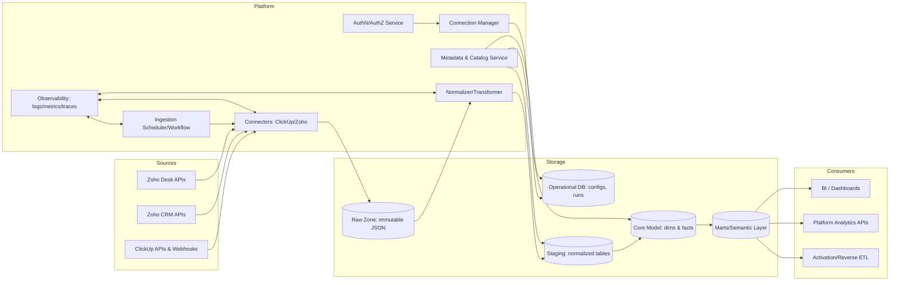
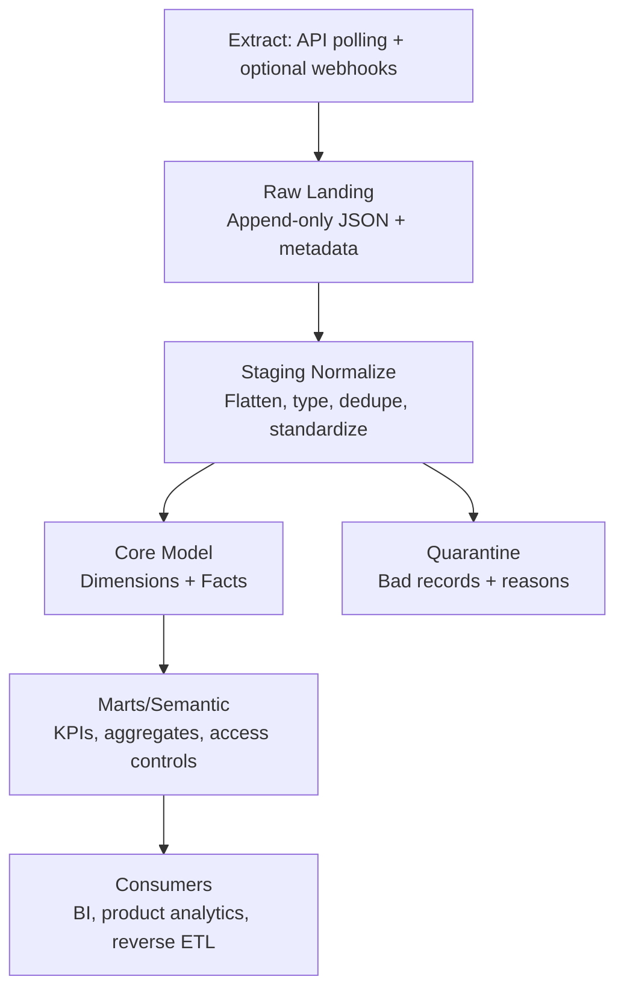
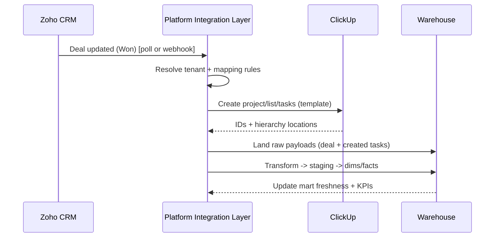
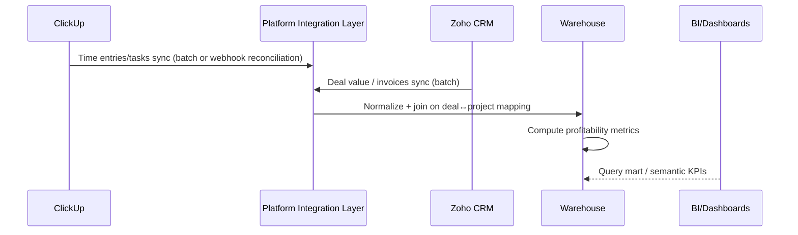

# Extending the Platform with a ClickUp–Zoho Data Warehouse Process

## Executive summary

The attached markdown describes a process for turning operational SaaS data from entity["company","ClickUp","work management saas"] and entity["company","Zoho","software company"] into an analytics-ready warehouse by (a) extracting key source domains (work items, hierarchy, time, CRM objects, support tickets), (b) landing immutable “raw” copies, (c) transforming into standardized staging tables, and (d) producing dimensional (“dim”) and fact (“fact”) tables plus business-facing marts and metrics. This aligns with the widely used “layered data” pattern (raw/validated/enriched) described in lakehouse/warehouse guidance such as the medallion architecture (Bronze/Silver/Gold). citeturn10search3

To extend a microservices-based platform (assumed), the core platform additions are:

- **Integration + connection management**: tenant-scoped connectors for ClickUp + Zoho with OAuth/token storage, rotation, and least-privilege scopes (ClickUp supports personal tokens and OAuth; Zoho CRM APIs use OAuth 2.0 with expiring access tokens and refresh tokens). citeturn0search2turn0search5turn2search0  
- **Ingestion orchestration**: a scheduler/workflow layer that runs incremental sync, backfills, and retries while respecting upstream limits (ClickUp rate limits are per token and return HTTP 429 when exceeded; Zoho CRM has edition/credit-based API limits plus concurrency constraints). citeturn0search1turn9search3  
- **Warehouse storage layers**: raw JSON landing + normalized staging + dimensional/fact schemas, with explicit handling for “schema drift” (especially ClickUp custom fields). citeturn1search1turn10search3  
- **Business flows and derived metrics**: the markdown’s example flows (Lead→Delivery, Plan→Profit, Support→Resolution) can be implemented as joinable cross-domain models: Zoho “Deals” + ClickUp “Tasks/Time” + Zoho Desk “Tickets,” for KPIs like handover velocity and profitability. (These are requirements from the attached markdown; specific KPI definitions are otherwise unspecified.)  
- **Observability + safety**: end-to-end tracing/metrics/logging with entity["organization","OpenTelemetry","observability spec project"] signals and a metrics endpoint consumable by entity["organization","Prometheus","metrics monitoring project"], plus security controls guided by entity["organization","OWASP","web app security project"] Top 10 risks (access control, crypto failures, SSRF, etc.). citeturn2search4turn2search2turn3search0

A realistic delivery plan is **8–12 weeks (medium)** for a production-grade V1 (connectors + raw/staging + minimal marts + monitoring), and **12–20+ weeks (high)** if adding near-real-time webhooks everywhere, robust identity resolution, reverse ETL, and enterprise compliance hardening (effort details and assumptions are listed later).

## Process from the attached markdown and assumptions

**What the attached markdown specifies (treated as requirements)**  
The markdown outlines:

- **Source modules to ingest**  
  - ClickUp: hierarchy (Workspace→Space→Folder→List), tasks/work items, collaboration/activity, time tracking, governance/audit. This matches ClickUp’s documented hierarchy and the fact that tasks are contained within Lists. citeturn5search3turn5search2  
  - Zoho: a “suite” view centered on CRM modules (Leads/Contacts/Accounts/Deals, etc.) and support/service via Zoho Desk tickets.

- **Warehouse platform modules**  
  Ingestion/connectors (polling and optional webhooks), raw zone, standardization/identity, modeling (dims/facts and marts), semantic layer/metrics, governance/security/privacy, data quality/observability, and optional activation (“reverse ETL”).

- **Business flows to support**  
  Lead→Deal→Delivery, Plan→Execute→Time→Cost, Support→Bug→Task→Release, governance/audit trail. (Exact triggering rules, entity linkage keys, and KPI formulas are not fully specified; they are treated as open requirements.)

**Key upstream constraints the platform must incorporate (because they shape architecture)**  

- ClickUp authentication supports personal tokens or OAuth, and ClickUp uses authorization code for OAuth apps. citeturn0search2  
- ClickUp rate limiting is **per token** and depends on plan (e.g., 100/min/token for Free/Unlimited/Business; higher for Business Plus/Enterprise) and exceeding limits yields HTTP 429 with rate-limit headers. citeturn0search1  
- ClickUp API task listing is paginated (100 tasks per page), and includes `time_spent` in milliseconds when tasks have time entries. citeturn6search6  
- ClickUp supports API webhooks for broad create/update/delete tracking; webhook requests can be verified via an HMAC signature in `X-Signature` using a per-webhook secret returned at webhook creation. citeturn8search3turn7search4  
- Zoho CRM v8 documents (a) module discovery via `GET /settings/modules`, (b) record retrieval via `GET /{module_api_name}`, and (c) edition-based API usage limits expressed in **credits** and constrained by concurrency. citeturn5search1turn7search0turn9search3  
- Zoho Desk APIs are RESTful, use a root endpoint `desk.zoho.com/api/v1`, and require `Authorization` plus an `orgId` header for most endpoints. citeturn1search0  

**Assumptions made because the markdown (and prompt) leaves specifics unspecified**

| Category | Assumption used in this report | Why it matters |
|---|---|---|
| Current platform | Microservices architecture, REST + selective gRPC, relational DB for operational data | Matches your instruction; affects API contracts and persistence patterns |
| Warehouse target | A dedicated analytics store exists or will be added (warehouse or lakehouse); not assumed to be the same as the operational relational DB | Determines cost/scaling and data modeling approach |
| Tenancy | Multi-tenant, with strict tenant isolation for credentials and data | Drives authz, row-level security, and blast-radius controls |
| Zoho apps in scope | Zoho CRM + Zoho Desk are in-scope for V1; Zoho Books/Inventory/Marketing are “optional expansion” | The markdown is “suite”-oriented; actual enabled apps will change schema |
| Linkage strategy | Cross-system joins rely on (a) explicit IDs where available, else (b) stable business keys (email/domain/deal reference) and a managed mapping table | Required to implement Lead→Delivery and Support→Resolution flows |
| Freshness targets | V1 supports hourly/daily batch + optional near-real-time where webhooks exist | Must respect API quotas and operational costs |
| Compliance posture | Handle personal data per GDPR-like definitions and maintain auditability | Zoho/ClickUp data commonly includes personal data (names, emails) under GDPR definitions. citeturn4search2turn4search0 |

## Target architecture and data flows

The extension is best implemented as a **new “Integration + Warehouse” domain** within the platform rather than ad-hoc point integrations, because upstream rate limits and schema drift demand standardized ingestion, replay, and observability.

image_group{"layout":"carousel","aspect_ratio":"16:9","query":["medallion architecture bronze silver gold diagram","star schema fact dimension diagram","data ingestion pipeline architecture diagram"],"num_per_query":1}

### Proposed high-level architecture

**Integration points (explicit)**  
- **Upstream**: ClickUp REST + (optional) ClickUp API webhooks; Zoho CRM REST; Zoho Desk REST. ClickUp supports webhook-based tracking broadly, and webhook authenticity can be verified with `X-Signature` HMAC. citeturn8search3turn7search4  
- **Internal**: identity/IAM, secrets management, scheduler/workflow runtime, warehouse storage, analytics APIs, observability pipeline.

### Data flow through the layers (warehouse pipeline)

This reflects the markdown’s raw→staging→dim/fact approach and maps well to the layered pattern described in medallion/“multi-hop” architectures (raw/validated/enriched). citeturn10search3

### Design alternatives: ingestion strategy (at least 3)

| Option | How it works | Pros | Cons | Cost/Complexity |
|---|---|---|---|---|
| Polling-only incremental sync | Frequent `updated_since`/`If-Modified-Since` pulls, cursor-based pagination | Simplest operations; deterministic backfills; no public inbound endpoints | Higher API usage; slower freshness; risk of missing deletes without special APIs | Low–Medium |
| Webhook-first | Webhooks drive near-real-time ingestion; periodic reconciliation jobs | Low latency; fewer “wasted” reads; good UX for event-driven flows | Must expose secure webhook endpoints; replay and ordering issues; still need backfill | Medium–High |
| Hybrid (recommended) | Webhooks for “hot” entities + polling reconciliation/backfill | Best balance: freshness + correctness; contains webhook failure modes | More moving parts; needs careful dedupe/idempotency | Medium |

The ClickUp side is well-suited to hybrid because ClickUp offers both broad webhook coverage and explicit rate-limited APIs. citeturn8search3turn0search1turn7search4

## Data models and schema changes

This section proposes both (A) **operational metadata schema** (for running the integration safely) and (B) **analytics data schema** (raw/staging/core/marts).

### Operational DB changes (platform metadata)

These tables live in the platform’s transactional relational DB (assumed) and should be designed for multi-tenancy and auditability.

**Core entities**

- `integration_connection`  
  - `id`, `tenant_id`, `provider` (`clickup`, `zoho_crm`, `zoho_desk`), `auth_type` (oauth/pat), `status`, `created_at`, `updated_at`, `created_by`
- `integration_credential`  
  - `connection_id`, `access_token_enc`, `refresh_token_enc`, `expires_at`, `scopes`, `rotation_version`, `last_refreshed_at`  
  - Zoho CRM OAuth tokens expire (Zoho notes access token validity windows and refresh tokens). citeturn0search5  
- `sync_job`  
  - `id`, `tenant_id`, `connection_id`, `object_type` (e.g., `clickup.task`, `zoho_crm.deals`), `schedule`, `mode` (poll/webhook/hybrid), `cursor_state`, `enabled`
- `sync_run`  
  - `id`, `job_id`, `status`, `started_at`, `ended_at`, `records_read`, `records_written`, `api_calls`, `api_errors`, `rate_limited_count`, `error_sample`, `watermark_from`, `watermark_to`
- `source_object_map` (for cross-system joins)  
  - `tenant_id`, `source_a`, `id_a`, `source_b`, `id_b`, `confidence`, `rule`, `created_at`

### Warehouse schema (raw → staging → core dims/facts)

#### Raw zone (append-only, replayable)

Recommended minimal fields:

- `tenant_id`
- `source` (`clickup`, `zoho_crm`, `zoho_desk`)
- `object_type` (`task`, `time_entry`, `deal`, `ticket`, etc.)
- `source_id` (string)
- `fetched_at` (timestamp)
- `ingestion_run_id`
- `payload_json` (opaque JSON)

This supports audit/replay and shields downstream from upstream schema changes.

#### Staging zone (normalized, typed, deduped)

Staging tables should be **wide enough for stable fields** plus a controlled mechanism for “flex” fields (custom fields, tags, etc.). ClickUp custom fields are explicitly a distinct object type with an ID, name, and type metadata. citeturn1search1

Examples:
- `stg_clickup_task`
- `stg_clickup_task_custom_field_value`
- `stg_zoho_record` (parameterized by module, or separate tables like `stg_zoho_deal`)
- `stg_zoho_desk_ticket`

Zoho CRM module discovery should be automated by calling `GET /settings/modules` and storing module metadata (api names, fields, and custom modules). citeturn5search1

#### Core model (dims and facts) aligned to the markdown flows

A pragmatic star-schema core that supports the three example flows:

- **Dimensions**
  - `dim_user` (platform-wide “person”/agent mapping; may reference ClickUp users, Zoho CRM users, Zoho Desk agents)
  - `dim_workspace` / `dim_clickup_hierarchy` (workspace/space/folder/list)
  - `dim_customer_account` (Zoho Accounts primarily)
  - `dim_deal` (Zoho Deals)
  - `dim_task` (ClickUp tasks; can be treated as slowly-changing if you need state history)
  - `dim_project` (optional: group of tasks/lists linked to a deal)
  - `dim_time` / `dim_date`

- **Facts**
  - `fact_task_event` (status changes, assignment changes, etc.; may be derived if upstream doesn’t provide a full event stream)
  - `fact_time_entry` (from ClickUp time tracking endpoints / task time)
  - `fact_deal_stage_snapshot` (pipeline velocity and stage time)
  - `fact_ticket` / `fact_ticket_event` (Zoho Desk support volumes and resolution SLAs)

Zoho Desk explicitly models “Tickets” and provides APIs to list and retrieve tickets; the API expects `orgId` + `Authorization` headers. citeturn1search0

### Design alternatives: modeling “custom fields” (at least 3)

ClickUp and Zoho both commonly use custom fields; ClickUp custom field objects have types and configs, creating “schema drift” pressure downstream. citeturn1search1

| Option | Storage shape | Pros | Cons | Cost/Complexity |
|---|---|---|---|---|
| EAV table (recommended for V1) | `stg_*_custom_field_value(field_id, entity_id, value_*)` | Handles unbounded custom fields cleanly; easy to backfill; avoids DDL churn | Harder for BI users unless surfaced via views; type handling must be disciplined | Medium |
| JSON column per entity | `custom_fields_json` on task/deal rows | Simple ingestion; flexible | Query performance can degrade; governance harder; BI tools may struggle (varies) | Low–Medium |
| “Promote to columns” | Materialize selected custom fields into typed columns | Fast analytics; best UX for dashboards | Requires field selection/versioning; frequent DDL migrations likely | Medium–High |

A hybrid is common: keep EAV/JSON authoritative, and promote a curated subset of “business-critical” fields into marts.

## API surface and contracts

This extension needs two API surfaces:

1) **Your platform’s internal/external APIs** (to configure connections and pipelines, and to expose analytics readiness/status)  
2) **Connectors’ upstream API contracts** (ClickUp/Zoho), primarily for correct pagination, rate-limit handling, auth, and webhooks.

### Platform APIs (proposed)

Use OpenAPI for REST contracts; the OpenAPI Initiative recommends current patch versions on top of OpenAPI 3.1 (e.g., 3.1.1) for clearer wording without structural changes. citeturn2search1

**Connection management**
- `POST /v1/integrations/connections`
  - Request: `{ provider, auth_type, oauth_redirect_url?, label }`
  - Response: `{ connection_id, status }`
- `POST /v1/integrations/connections/{id}/oauth/start`
  - Response: `{ authorization_url }`
- `POST /v1/integrations/connections/{id}/oauth/callback`
  - Request: `{ code, state }`
- `POST /v1/integrations/connections/{id}/revoke`
  - Revokes tokens and disables jobs

**Pipeline configuration**
- `POST /v1/integrations/pipelines`
  - Request: `{ connection_id, objects: [...], schedule, mode }`
- `POST /v1/integrations/pipelines/{id}/runs`
  - Request: `{ run_type: incremental|backfill, from?, to? }`
- `GET /v1/integrations/pipelines/{id}/runs/{run_id}`
  - Response includes counts, last watermark, and upstream quota usage

**Warehouse/analytics readiness**
- `GET /v1/analytics/datasets`
  - Lists marts/datasets available per tenant
- `GET /v1/analytics/lineage/{dataset}`
  - Returns source coverage + freshness + last successful run

### Upstream contracts the connectors must implement correctly

**ClickUp**

- Authentication: personal token or OAuth; OAuth uses authorization code; token passed via `Authorization` header. citeturn0search2  
- Rate limits: per token by workspace plan; returns HTTP 429; includes `X-RateLimit-*` headers on error. citeturn0search1  
- Tasks listing: `GET /api/v2/list/{list_id}/task` returns 100 tasks per page. citeturn6search6  
- Time tracking: ClickUp documents API-driven time tracking capabilities and provides endpoints to view a running time entry (team scope). citeturn6search4turn6search7  
- Webhooks: for broad create/update/delete event tracking; integrity verification via `X-Signature` HMAC with per-webhook secret. citeturn8search3turn7search4  

**Zoho CRM**

- OAuth: Zoho CRM APIs use OAuth 2.0; access tokens expire; refresh tokens can be used to obtain new access tokens. citeturn0search5turn2search0  
- Modules: `GET /settings/modules` returns available modules including standard and custom modules. citeturn5search1  
- Records: `GET /{module_api_name}` supports pagination (max 200 per page), `If-Modified-Since`, and field selection. citeturn7search0  
- Limits: Zoho CRM v8 introduces credit-based API usage limits and concurrency constraints by edition. citeturn9search3  

**Zoho Desk**

- API root and headers: uses `desk.zoho.com/api/v1`; requires `Authorization` and `orgId` headers for most endpoints; “Tickets” are a documented module with standard CRUD/list endpoints. citeturn1search0  

### Sequence diagrams for the markdown flows

**Lead-to-Delivery (Deal → Project kickoff)**  
(Trigger mechanics are partly unspecified; diagram shows both polling and event-driven options.)

**Plan-to-Profit (Time entries → profitability)**

## Reliability, observability, security, and performance

### Error handling, retries, and idempotency

**Rate limiting and backoff**
- ClickUp explicitly returns HTTP 429 on rate-limit exceedance and provides reset timing in headers; connectors must implement **adaptive throttling** keyed by token and plan. citeturn0search1  
- For internal retries, adopt exponential backoff with jitter and cap retries; this is recommended in reliability guidance like the entity["company","Amazon Web Services","cloud provider"] Well-Architected Framework. citeturn3search3  
- If gRPC is used internally, gRPC retry policies support exponential backoff and apply jitter (±20% described) to avoid synchronized retry storms. citeturn3search2  

**Idempotency requirements (critical for hybrid/webhook ingestion)**  
- All “write” operations in ingestion (raw landing, staging merges, mapping writes) must be idempotent via:
  - Deterministic `ingestion_run_id` + `(tenant_id, source, object_type, source_id, fetched_at)` uniqueness
  - Upsert semantics in staging/core
  - Webhook dedupe keys (e.g., `(webhook_id, event, task_id, event_time)`)

**Upstream quota protection (Zoho CRM especially)**  
Zoho CRM v8’s limits are credit-based and also constrained by concurrency; V1 must include credit usage monitoring and job scheduling that stays within edition entitlements. citeturn9search3  

### Observability: logs, metrics, tracing, and data-quality signals

**Tracing and correlation**  
OpenTelemetry describes signals (tracing, metrics, logging, baggage) and core components (APIs, SDKs, OTLP, Collector) used to correlate telemetry across distributed systems. citeturn2search4  
Recommendation: propagate a `trace_id`/`run_id` from scheduler → connector → transformer → DB writes, and include upstream request IDs (when provided) in logs.

**Metrics**  
Prometheus documents a standard text-based exposition format over HTTP and required content types for scraping. citeturn2search2  
Minimum useful metrics:
- `sync_run_duration_seconds{provider,object_type}`
- `sync_api_calls_total{provider,endpoint,status}`
- `sync_rate_limited_total{provider}`
- `sync_records_written_total{layer,object_type}`
- `sync_freshness_seconds{dataset}`

**Data quality (DWH-specific observability)**  
Implement:
- Freshness checks per dataset (SLA-based)
- Volume anomaly checks (e.g., “0 deals today”)
- Schema drift detection (new custom fields, changed enums)
- Quarantine tables with reasons and sample payload references

### Security and compliance risks

**Data classification and GDPR-like handling**  
Zoho/ClickUp objects often include personal data (names, emails, phone numbers). Under GDPR, “personal data” is any information relating to an identified or identifiable natural person. citeturn4search2  
Implications:
- 최소 권한(least privilege) scopes for OAuth
- Tenant isolation + row-level security by tenant
- Purpose limitation: restrict which marts expose PII
- Retention policies (raw zone may need shorter retention for certain fields)

**Transport and storage security**
- TLS: external webhook endpoints and API calls should enforce modern TLS; TLS 1.3 is standardized in RFC 8446. citeturn3search4  
- Encryption at rest: use an industry standard such as AES (NIST FIPS 197) for stored secrets and sensitive fields. citeturn4search4  

**OAuth/token security**
- OAuth 2.0 defines delegated authorization and emphasizes access tokens with controlled scope/lifetime. citeturn2search0  
- Zoho explicitly warns that access tokens must be kept confidential and not exposed publicly. citeturn0search5  

**Webhook authenticity and SSRF**
- ClickUp supports webhook signing with HMAC and a per-webhook secret; verify `X-Signature` before processing payloads. citeturn7search4  
- Apply OWASP Top 10 controls: Broken Access Control, Cryptographic Failures, SSRF, Security Logging & Monitoring Failures are especially relevant to webhook receivers and connector services. citeturn3search0  

### Performance and scaling estimates (low/medium/high)

These are **estimates** because the markdown does not specify tenant count, object volumes, or target freshness SLAs.

**Key upstream throughput constraints**
- ClickUp: for many plans, 100 requests/min/token; get-tasks pages are 100 tasks/page, so a theoretical ceiling is ~10,000 tasks/min/token for that endpoint alone (ignoring other calls). citeturn0search1turn6search6  
- Zoho CRM: credit-based daily window and concurrency limits vary by edition; `GET /{module_api_name}` supports up to 200 records per page. citeturn9search3turn7search0  

**Sizing table (illustrative)**

| Dimension | Low | Medium | High | Notes |
|---|---:|---:|---:|---|
| Tenants onboarded | 1–3 | 10–30 | 50–200 | Multi-tenant scheduling becomes a primary concern |
| ClickUp tasks per tenant | 10k | 100k | 1M+ | List distribution affects pagination workload |
| Zoho CRM deals/records per tenant | 5k–50k | 50k–500k | 500k–5M | API credit ceilings can dominate design citeturn9search3 |
| Freshness target | Daily | Hourly | Near-real-time for some entities | Hybrid ingestion recommended |
| Raw storage/day (compressed) | ~0.1–1 GB | ~1–10 GB | 10–100+ GB | Depends on payload size; raw JSON is verbose |
| Compute for transforms | Small single worker | Autoscaled workers | Dedicated ETL cluster | Depends on joins, SCD, history retention |

## Testing, migration, rollout, effort, and risks

### Testing strategy

**Unit tests**
- Connector pagination, cursor handling, and backoff logic (including ClickUp 429 simulation). citeturn0search1  
- Webhook signature verification (ClickUp `X-Signature`). citeturn7search4  
- Schema mapping logic for custom fields (type handling based on ClickUp custom field object metadata). citeturn1search1  

**Integration tests**
- Against sandbox/dev workspaces:  
  - ClickUp OAuth/token auth flows. citeturn0search2  
  - Zoho CRM auth + module discovery + record reads. citeturn0search5turn5search1turn7search0  
  - Zoho Desk tickets list/get with required headers. citeturn1search0  

**End-to-end tests**
- Synthetic “Lead-to-Delivery” scenario: create/update CRM deal → ensure downstream ClickUp artifacts → verify mart rows.
- “Plan-to-Profit”: create time entries → ensure profitability metric changes.
- “Support-to-Resolution”: create ticket → ensure linked task and resolution KPI.

**Data quality tests**
- Freshness SLA checks per dataset
- Referential integrity checks (e.g., facts must link to dims within tenant scope)
- Null/enum validity checks for key fields (status, stage, currency)

**Load tests**
- Simulate worst-case tenant backfill while enforcing ClickUp per-token limits and Zoho credit ceilings. citeturn0search1turn9search3  

### Migration and rollout plan

**Migration steps (recommended)**
1. **Add operational metadata tables** (connections/jobs/runs/mappings), deploy behind feature flags.
2. **Deploy connectors in “dry-run” mode** (ingest to raw only, no downstream transforms) for a pilot tenant, validate rate-limit behavior and credential rotation.
3. **Enable staging/core transforms** for pilot tenant; reconcile counts vs upstream UI.
4. **Backfill strategy**:  
   - Backfill in slices (by date or hierarchy region) to manage quotas.  
   - Use Zoho CRM record APIs with `If-Modified-Since` for incremental after baseline. citeturn7search0  
5. **Enable marts + dashboards**; implement tenant-visible freshness and run status.
6. **Expand tenant rollout** with guardrails: per-tenant quotas, circuit breakers on repeated failures.

### Rollback strategy

Rollback must preserve data integrity and minimize user-visible disruption:

- **Feature-flag disable**: stop scheduling new runs; leave existing data intact for forensic analysis.
- **Connector revoke**: revoke OAuth tokens and disable jobs per connection.
- **Schema rollback**: avoid destructive schema downgrades in V1; prefer additive migrations. (If a rollback requires data removal for compliance, execute targeted deletion workflows by tenant + dataset type, prioritizing raw zone.)

### Estimated effort and timeline (low/medium/high)

Assumptions: 1 product manager, 1 data engineer, 2 backend engineers, 1 SRE/DevOps partial allocation; adjust linearly with team size.

| Workstream | Low | Medium | High | What drives variance |
|---|---:|---:|---:|---|
| Connection manager + secrets | 1–2 wks | 2–3 wks | 3–5 wks | OAuth edge cases, tenant IAM integration |
| ClickUp connector (tasks + time + webhooks) | 2–3 wks | 3–5 wks | 6–8 wks | Webhook reliability, custom fields complexity, rate-limit handling citeturn0search1turn1search1turn7search4 |
| Zoho CRM connector | 2–3 wks | 3–5 wks | 6–9 wks | Credit/concurrency constraints, module/field metadata, edition variability citeturn9search3turn5search1 |
| Zoho Desk connector | 1–2 wks | 2–3 wks | 3–5 wks | Multi-org handling via `orgId`, ticket history breadth citeturn1search0 |
| Warehouse layers + transforms | 2–4 wks | 4–6 wks | 8–12 wks | SCD/history requirements, identity resolution sophistication |
| Observability + reliability hardening | 1–2 wks | 2–4 wks | 5–8 wks | Tracing rollout, SLOs, alert tuning citeturn2search4turn3search3 |
| Security/compliance hardening | 1–2 wks | 2–4 wks | 6–10 wks | PII redaction, retention, audits; OWASP controls citeturn3search0turn4search2 |

**Overall delivery estimate**
- **Low**: 6–8 weeks (single-tenant or small pilot, polling-only, minimal marts)  
- **Medium**: 8–12 weeks (multi-tenant V1, hybrid ingestion for ClickUp, baseline marts, full observability)  
- **High**: 12–20+ weeks (near-real-time, robust identity resolution, reverse ETL, enterprise compliance)

### Sprint plan with deliverables

Assume 2-week sprints (6 sprints = 12 weeks, i.e., the “medium” plan).

| Sprint | Deliverables | Acceptance criteria (examples) |
|---|---|---|
| Sprint A | Connection Manager + credential vault integration; schema for connections/jobs/runs | Create/revoke connections; tokens encrypted; tenant isolation tests pass; audit logs emitted |
| Sprint B | ClickUp polling connector for hierarchy + tasks; rate-limit aware client | Sustained sync under per-token limits; handles 429 with backoff; ingests tasks (100/page) correctly citeturn0search1turn6search6 |
| Sprint C | ClickUp webhooks (optional) + signature verification; time tracking ingestion baseline | Webhook receiver verifies `X-Signature`; time entry APIs integrated where needed citeturn7search4turn6search4turn6search7 |
| Sprint D | Zoho CRM connector (modules + records incremental); quota/credit monitoring | Discovers modules via `/settings/modules`; incremental via `If-Modified-Since`; credit usage surfaced per run citeturn5search1turn7search0turn9search3 |
| Sprint E | Zoho Desk connector (tickets); staging + core dims/facts; initial marts | Tickets ingested with required headers; dims/facts materialized; Lead→Delivery join proof-of-concept citeturn1search0 |
| Sprint F | Observability + data-quality SLAs + pilot rollout + dashboards | OTel traces end-to-end; Prometheus metrics exported; freshness and volume checks; pilot tenant live citeturn2search4turn2search2 |

### Design alternatives: orchestration and storage

**Orchestration engine (3 options)**

| Option | Pros | Cons | Cost/Complexity |
|---|---|---|---|
| In-service scheduler + worker queues | Minimal dependencies; simple V1 | Harder backfills/catchup semantics; fewer built-in controls | Low–Medium |
| entity["organization","Apache Airflow","workflow scheduler project"] | Mature scheduling/backfill/catchup concepts; strong operational patterns citeturn11search2turn11search0 | Additional infra; DAG authoring overhead | Medium |
| Managed ETL/orchestration product | Faster time-to-market; built-in monitoring | Vendor lock-in; limited customization for bespoke flows | Medium–High |

**Storage target for curated analytics (3 options)**

| Option | Pros | Cons | Cost/Complexity |
|---|---|---|---|
| Use existing operational RDBMS only | No new infra | Can overload OLTP; poor for large analytical scans | Low initial, high risk |
| Dedicated warehouse (Snowflake/BigQuery/Redshift-class) | Designed for analytics; concurrency; governance tools | Cost; operationalizing ELT pipeline | Medium |
| Lakehouse tables (e.g., entity["organization","Apache Iceberg","open table format"]) | Open format; time travel/version rollback concepts; engine flexibility citeturn10search7turn10search0 | More platform engineering; metadata/catalog complexity | Medium–High |

### Risk register

| Risk | Likelihood | Impact | Mitigation | Owner |
|---|---:|---:|---|---|
| ClickUp rate limits cause slow backfills | Medium | High | Adaptive throttling; per-tenant scheduling; reduce endpoints; cache hierarchy; handle 429 headers citeturn0search1 | Integrations Eng |
| Zoho CRM credit limits block required freshness | Medium | High | Credit-aware scheduler; prioritize objects; incremental `If-Modified-Since`; negotiate higher edition/credits if needed citeturn9search3turn7search0 | Product + Eng |
| Custom fields schema drift breaks marts | High | High | EAV/JSON authoritative store; drift alerts; promote only curated fields; version marts | Data Eng |
| Webhook delivery gaps cause missing updates | Medium | High | Hybrid with reconciliation; idempotent event processing; dead-letter queue | Integrations Eng |
| PII leakage into broad-access marts | Medium | High | Data classification; masking/tokenization; row-level security; least privilege; GDPR definition compliance citeturn4search2turn3search0 | Security + Data Eng |
| Token theft or mis-storage | Low–Medium | High | Encrypt secrets (AES); strict access policies; rotate; never log tokens; TLS everywhere citeturn4search4turn3search4turn0search5 | Security |
| Cross-system identity mismatches | Medium | Medium–High | Deterministic mapping rules; confidence scoring; human override workflow | Data Eng |
| Performance regressions in transforms | Medium | Medium | Partitioning strategy; incremental materialization; monitoring | Data Eng |
| Incomplete auditability for compliance | Medium | Medium | Raw retention policy + immutable logs; run-level lineage | Compliance |
| Operational complexity (too many moving parts) | Medium | Medium | Prefer fewer components in V1; automate runbooks; SLO-driven alerts | SRE/DevOps |