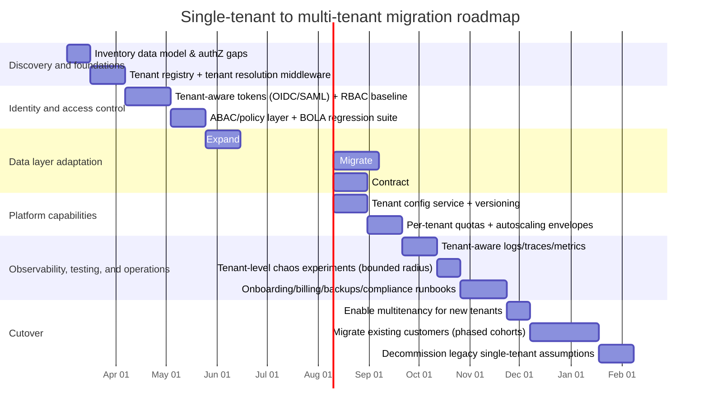

# Adapting a Single-Tenant System to a Multi-Tenant Architecture

## Executive summary

A multi-tenant conversion is not “just” a database change. It is a systemic refactor that introduces a new, always-on dimension—**tenant context**—that must be consistently carried through identity, authorization, data access, caching, compute scheduling, observability, billing, and operations. Cloud providers emphasize that multi-tenancy is a cost/efficiency play that must be balanced against **tenant isolation** and **operational complexity**. citeturn6view1turn6view0turn6view3

Across mainstream guidance, three canonical database tenancy models recur:

- **Shared DB + shared schema (pool / row-based)**: highest operational efficiency and lowest cost, but weakest isolation and highest “blast radius” if controls fail. citeturn6view2turn6view1turn6view0  
- **Shared DB + separate schema (bridge / schema-per-tenant)**: a middle ground; improved isolation and migration flexibility, but higher provisioning/migration complexity. citeturn6view2turn6view1  
- **Separate database per tenant (silo / DB-per-tenant)**: strongest isolation and simplest per-tenant restore/customization, but highest cost and operational overhead. citeturn6view2turn6view1turn6view0  

The safest adaptation strategy is typically:

1. Establish **tenant identity primitives** (tenant model, tenant resolution, tenant ID propagation, tenant-aware authZ) before broad data migration, because broken object-level authorization errors are a top real-world API risk and multi-tenancy increases the chance of cross-tenant IDOR/BOLA bugs. citeturn2search3turn2search7turn1search0turn1search1  
2. Implement **defense-in-depth isolation**: enforce tenant scoping at multiple layers (request routing, service authorization, and ideally database-level isolation such as row-level security where available). citeturn6view0turn6view1turn0search16turn0search31turn8search7  
3. Migrate with **parallel change (expand → migrate → contract)** and feature flags to avoid downtime and enable rollback when introducing tenant ID columns, new schema boundaries, or new authZ enforcement points. citeturn4search2turn4search34  
4. Treat multi-tenancy as an operational product: add **per-tenant quotas**, per-tenant monitoring, per-tenant restore, onboarding automation, and metering/billing data flows as first-class deliverables. citeturn6view0turn3search4turn3search1turn7search0  

## Tenancy models and isolation

Multi-tenancy can be implemented across a spectrum from **maximally pooled** to **fully isolated**. citeturn6view1turn6view2turn6view3 The database tenancy choice often dominates the risk/cost profile, but you also need to define isolation at the compute and network layers (for “noisy neighbor” and lateral movement concerns). citeturn6view0turn2search27turn2search2

### Comparison table of tenancy models

| Tenancy model | Data isolation boundary | Performance/noisy-neighbor profile | Operability (onboarding, backup/restore) | Customization & schema evolution | Typical fit |
|---|---|---|---|---|---|
| Shared schema (pool / row-based) | Logical isolation via `tenant_id` and enforcement controls (optionally DB RLS) citeturn6view2turn6view0turn6view1 | Highest risk of noisy neighbor without quotas and per-tenant throttles; single hot tenant can affect others citeturn6view0turn6view2 | Simplest provisioning; hardest per-tenant restore if backups are shared citeturn6view0turn6view2 | Lowest freedom for tenant-specific schema (all tenants share schema version) citeturn6view2 | Many small tenants; strong platform discipline; cost-optimized SaaS citeturn6view1turn6view0 |
| Separate schema (bridge / schema-per-tenant) | Isolation by schema namespace (plus RBAC/permissions) citeturn6view2turn6view1 | Better “blast radius” than pooled; still shared instance resources citeturn6view2turn6view0 | More complex provisioning; per-tenant restore more feasible (schema-scoped), but still shared instance citeturn6view2turn6view0 | Allows tenant-by-tenant schema evolution in some variants; drift risk increases citeturn6view2turn6view0 | Mid-size tenants; cases needing more isolation or customization than pooled |
| Separate database (silo / DB-per-tenant) | Physical (DB) boundary per tenant citeturn6view2turn6view1turn6view0 | Strongest performance isolation if compute is also isolated; easiest to “quarantine” heavy tenants citeturn6view0turn6view1 | Highest operational overhead (provisioning, migrations, monitoring); simplest per-tenant restore citeturn6view0turn6view2 | Highest freedom (tenant-specific indexes/extensions); strongest drift risk without automation citeturn6view0turn6view2 | Large/regulated tenants; strict isolation/SLA tiers; enterprise “bring-your-own-key/DB” expectations |

Key framing: AWS describes these as **Pool / Bridge / Silo** models with explicit trade-offs between tenant isolation and cost/complexity. citeturn6view1turn6view2 Microsoft similarly highlights that tenancy choice impacts scalability, isolation, per-tenant cost, and operational complexity (including tenant restore and disaster recovery). citeturn6view0

### Dimension: tenancy models

**Pros/cons (summary)**  
Shared-schema maximizes resource efficiency but relies heavily on correctness of tenant-scoping controls; separate schema improves boundaries at moderate complexity; separate DB provides strong isolation but increases cost and operational burden. citeturn6view1turn6view2turn6view0

**Implementation options**
- **Shared schema**: add `tenant_id` to all tenant-scoped tables; enforce scoping in the application and ideally in the database with row-level security where supported. citeturn6view0turn6view1turn0search16turn0search31turn8search7  
- **Separate schema**: provision schema per tenant; route queries by schema; apply schema-level permissions; optionally add tenant ID anyway for audit and cross-tenant admin views. citeturn6view2turn6view0  
- **Separate DB**: provision DB per tenant (plus per-tenant read replicas if needed); use connection routing / shard map; isolate backups and keys per tenant if required. citeturn6view2turn6view0turn6view1  
- **Hybrid**: mix models by tier/tenant size (e.g., small tenants pooled; large tenants isolated). Microsoft explicitly describes a “hybrid sharded multitenant” model and notes that in practice some DBs may contain one tenant while retaining a multi-tenant schema. citeturn6view0  

**Concrete technical steps (architecture + code/config changes)**
1. Introduce a **Tenant** domain concept (tenant registry): `tenant_id`, status, tier, region, default data placement, isolation class. (This becomes the control plane anchor.) citeturn6view3turn6view0  
2. Decide a canonical **tenant resolution** mechanism at ingress (e.g., hostname/custom domain, path prefix, or token claim) and codify it as a middleware that sets `TenantContext`. This is foundational because all models rely on correct tenant scoping. citeturn6view0turn6view1  
3. Define a **data-access boundary**: repository/ORM layer must accept `TenantContext` (or be implicitly bound to request context) so calls cannot “forget” tenant scope. (Common code change across all models.) citeturn2search3turn6view0  
4. Add **isolation automation**:
   - Shared schema: enforce DB-level policies if supported. PostgreSQL row security policies require enabling row security on tables and creating policies (database applies them automatically once enabled). citeturn0search16turn0search31turn0search10  
   - Separate schema/DB: implement provisioning automation and schema migration orchestration per schema/DB. citeturn6view2turn6view0  

**Migration plan variants**
- **Big bang**: convert schema and application behavior in one release window; simplest conceptually but highest downtime/rollback pressure; typically only feasible if data set is small and you can tolerate maintenance windows. citeturn4search2turn6view0  
- **Phased**: introduce tenant context + dual-mode data access (single-tenant default vs tenant-scoped) and migrate gradually; aligns with “parallel change.” citeturn4search2turn4search34  
- **Hybrid**: migrate to shared-schema first, then move select tenants to schema-per-tenant or DB-per-tenant over time (or vice versa), using routing rules at the tenant registry layer. Azure and AWS both describe hybrid approaches to balance cost and isolation. citeturn6view0turn6view1turn6view2  

**Rollback strategies**
- **Shared schema**: keep dual-read/dual-write for a bounded period; be able to route traffic back to “single-tenant mode” by using a default tenant and disabling strict tenant enforcement (feature flag). Rollback requires that tenant IDs were added in an additive manner (expand/contract). citeturn4search2turn4search34  
- **Separate schema/DB**: rollback often means routing the tenant back to the prior schema/DB snapshot; per-tenant restore is a primary advantage of silo models. citeturn6view2turn6view0  

**Risk mitigations**
- Require tenant scoping at compile-time where possible (typed context, lints, code review gates).  
- Prefer DB-level enforcement (RLS/policies) where practical to reduce reliance solely on app correctness. citeturn6view0turn0search16turn8search7  
- Add “blast radius controls” (quotas, per-tenant rate limits, kill switches) to manage noisy neighbors. citeturn6view0turn3search4turn2search27  

### Dimension: isolation levels (data, compute, network)

Multi-tenant isolation should be treated as layered controls:

- **Data isolation**: tenant-scoped rows/schemas/DBs; enforce with DB mechanisms when available (e.g., row-level security). citeturn6view0turn0search31turn8search7  
- **Compute isolation**: shared nodes/pods with quotas vs dedicated pools vs fully separate clusters/VMs; Kubernetes notes namespace isolation is well-supported but requires careful configuration and doesn’t apply to non-namespaced resources. citeturn2search27  
- **Network isolation**: segmentation that reduces lateral movement; Kubernetes NetworkPolicies provide L3/L4 traffic controls when your CNI enforces them. citeturn2search2turn2search27  

**Implementation options**
- **Data**: RLS (row-based), schema permissions, DB-per-tenant, or hybrid. citeturn6view1turn6view2turn6view0  
- **Compute**:
  - “Soft isolation” via per-namespace quotas and autoscaling envelopes (shared cluster). citeturn3search4turn3search1turn2search27  
  - “Harder isolation” via dedicated node pools / separate clusters for premium tenants. (Common extension of hybrid tenancy strategies.) citeturn6view0turn6view1  
- **Network**:
  - Namespace-per-tenant + default-deny policies; allow only explicitly required ingress/egress. citeturn2search2turn2search27  

**Concrete technical steps + example configs**
A typical Kubernetes namespace-per-tenant isolation baseline uses default-deny policies plus explicit allow rules. Kubernetes describes the NetworkPolicy mechanism and its requirement for enforcement support by the network plugin. citeturn2search2turn2search27

```yaml
# Example: default deny all ingress/egress in a tenant namespace
apiVersion: networking.k8s.io/v1
kind: NetworkPolicy
metadata:
  name: default-deny
  namespace: tenant-acme
spec:
  podSelector: {}
  policyTypes: ["Ingress", "Egress"]
```

```yaml
# Example: cap CPU/memory for a tenant namespace
apiVersion: v1
kind: ResourceQuota
metadata:
  name: tenant-acme-quota
  namespace: tenant-acme
spec:
  hard:
    requests.cpu: "4"
    requests.memory: "8Gi"
    limits.cpu: "8"
    limits.memory: "16Gi"
```

Kubernetes documents ResourceQuota as the mechanism for namespace-level aggregate limits and describes CPU/memory quota behavior. citeturn3search0turn3search4

**Migration plan variants**
- Big bang: move all workloads into tenant namespaces and apply policies immediately (operationally risky).  
- Phased: introduce namespaces for new tenants first; migrate existing traffic gradually; enforce default-deny last. citeturn4search2turn2search27  

**Rollback strategies**
- Keep policies versioned and deployable via progressive delivery; rollback is policy revert + namespace routing revert.  
- For quotas, rollback is adjusting ResourceQuota objects; retain safety rails to avoid one tenant consuming the cluster. citeturn3search4turn2search27  

**Risk mitigations**
- Recognize limits: Kubernetes warns namespace isolation doesn’t cover non-namespaced resources (e.g., CRDs); treat cluster-scoped objects as shared control-plane attack surface and restrict who can create them. citeturn2search27  
- Combine network policies with identity-based controls (mTLS / service identity) where applicable; isolation is not purely networking. citeturn7search1turn0search2  

## Tenant-aware identity and access control

Tenant-aware identity is the mechanism by which you ensure every request is both (a) authenticated and (b) authorized within the correct tenant boundary—across human users, automated clients, and service-to-service calls. NIST emphasizes access control guidance for cloud systems, and OWASP highlights object-level authorization as a primary API risk; multi-tenancy exacerbates both because object IDs and tenant IDs become “security perimeter variables.” citeturn7search1turn2search3turn2search7

### Dimension: authentication and authorization (tenant-aware identity, SSO, RBAC/ABAC)

**Pros/cons**
- Tenant-aware auth reduces cross-tenant leakage and enables per-tenant compliance boundaries, but increases complexity in identity modeling, token issuance, and policy enforcement. citeturn7search1turn2search3  

**Implementation options**
- **Authentication standards**:
  - OAuth 2.0 is the authorization framework that underpins common SaaS login flows and token issuance. citeturn1search0  
  - OpenID Connect adds an identity layer on top of OAuth 2.0 and standardizes the ID Token as a JWT containing claims about user authentication. citeturn1search1turn1search5  
  - SAML 2.0 is a widely used enterprise SSO standard for exchanging authentication/authorization assertions across domains (often required by enterprise customers). citeturn7search5turn7search2  
- **Provisioning standards**:
  - SCIM is an HTTP-based protocol for identity provisioning and management in enterprise-to-cloud scenarios. citeturn1search2  
- **Authorization models**:
  - RBAC maps permissions to roles rather than individuals; NIST provides definitions and background and positions RBAC as simplifying security administration at scale. citeturn8search2turn8search4turn8search12  
  - ABAC evaluates attributes of subject/object/action/environment against policy and supports finer-grained decisions than roles alone; NIST defines ABAC accordingly. citeturn1search15turn1search27  

**Concrete technical steps**
1. **Define tenant identity semantics** (B2B is typical):  
   - Tenant = customer organization; users can be members of one or more tenants (B2B multi-org) or exactly one tenant (simpler).  
   - Decide whether tenant context is resolved from:
     - custom domain / subdomain,  
     - explicit tenant selector in UI, or  
     - token claim (e.g., `tid` or `tenant_id`).  
   The choice must be consistent across all entry points (web, mobile, API clients). citeturn6view3turn1search1turn7search1  

2. **Make tokens tenant-aware**: with OIDC, the ID token is a JWT containing claims; add tenant claim(s) and potentially user’s tenant roles/entitlements. citeturn1search1turn1search5  

3. **Implement tenant-aware authorization checks at every object access**: OWASP describes broken object-level authorization as exploitable via object ID manipulation; in multi-tenant systems, “object ID + tenant mismatch” becomes a primary exploit path. citeturn2search3turn2search7  

4. **Adopt a layered authZ strategy**:
   - RBAC for coarse role sets (tenant admin, billing admin, operator, read-only). citeturn8search2turn8search4  
   - ABAC for entitlements (“plan=tier2”, “data_region=EU”, “can_export=true”) and contextual policy conditions. citeturn1search15turn1search27  

5. **Automate enterprise onboarding**:
   - Support SAML/OIDC federation per tenant (enterprise SSO). citeturn7search5turn1search1  
   - Support SCIM provisioning for enterprise tenants that require HR-driven onboarding/offboarding. citeturn1search2turn1search26  

**Required code/config changes**
- Add a `TenantContext` middleware at the edge that:
  - resolves tenant,
  - rejects ambiguous tenant resolution,
  - sets request context and propagates it to internal calls. (This is the single most important multi-tenant refactor because it eliminates “forgot tenant” bugs.) citeturn6view0turn2search3  
- Update authorization library to require `(principal, tenant_id, resource_id, action)` evaluation rather than `(principal, resource_id, action)` alone. citeturn2search3turn1search15  
- Update DB session binding if using DB-level enforcement (example in the next section). citeturn0search10turn0search31  

**Migration plan variants**
- **Big bang**: require tenant claim and tenant-scoped permissions for all logins and APIs immediately. Works when you have a single existing tenant and can treat all current users as members of that tenant by default. citeturn1search1turn6view0  
- **Phased**: support legacy tokens (no tenant claim) mapped to a default tenant while you roll out tenant-aware clients; gradually tighten enforcement (feature flags per endpoint). citeturn4search2turn2search3  
- **Hybrid**: enforce strict tenant-aware authZ for new endpoints and “high-risk” resources first (PII exports, billing, admin APIs), while deferring low-risk reads. citeturn2search3turn5search17  

**Rollback strategies**
- Rollback must avoid “opening cross-tenant access.” Prefer rolling back by routing traffic back to the legacy code path while keeping tenant checks in place for high-risk objects. Parallel change emphasizes reversible steps. citeturn4search2turn4search34  
- Keep tenant membership mapping tables immutable/audited so you can safely re-issue tokens. citeturn7search1turn0search2  

**Risk mitigations**
- Add automated tests specifically for BOLA/IDOR patterns (change tenant_id/object_id and assert denial). citeturn2search3turn2search7  
- Log and alert on cross-tenant access attempts (tenant mismatch) as security signal. citeturn2search7turn0search2  

## Data partitioning and migration

In multi-tenant systems, the database layer is both a scalability bottleneck and the dominant isolation boundary. Microsoft notes multi-tenant DB layouts require tenant identifier columns and warns about noisy neighbors; AWS describes pool/bridge/silo and explicitly calls out the tension between isolation and cost. citeturn6view0turn6view2turn6view1

### Dimension: data partitioning and migration strategies

**Pros/cons**
- Shared-schema partitioning is operationally simplest, but increases the consequences of any scoping bug. citeturn6view1turn6view0  
- Schema/DB separation reduces accidental leakage hazards and can simplify tenant restore, but introduces migration orchestration complexity and drift risk. citeturn6view2turn6view0  

**Implementation options**
- **Row-based partitioning** in a shared schema:
  - `tenant_id` column in each tenant-scoped table (FK-compatible) and indexing. Microsoft explicitly describes the need for tenant identifier columns in a multitenant database schema. citeturn6view0  
  - Database row-level security: PostgreSQL policies (CREATE POLICY) or SQL Server row-level security security policies/predicates where applicable. citeturn0search16turn0search31turn8search7turn8search3  
- **Physical partitioning**:
  - Sharding: distribute tenants across multiple instances when single-instance limits are reached; AWS describes this as the natural extension when a single instance is impractical. citeturn6view2  
- **Declarative table partitioning**:
  - PostgreSQL supports declarative partitioning with partition keys, which you can apply to tenant_id or composite keys (tenant_id + time) depending on query patterns. citeturn4search1  

**Concrete technical steps (shared-schema from a single-tenant baseline)**
Assuming the current system has exactly one “implicit tenant,” the migration pattern is:

1. **Expand (additive changes only)**:
   - Add `tenant_id` column (nullable initially) to every tenant-scoped table. citeturn4search2turn6view0  
   - Add supporting indexes: at minimum, compound indexes that start with `tenant_id` for common access paths. (Performance rationale is consistent with tenant-scoping and partitioning usage patterns.) citeturn6view0turn4search1  

2. **Migrate (backfill + dual-write)**:
   - Create the first tenant record (“default tenant”) and backfill all existing rows with that tenant ID.  
   - Update application writes to always set tenant_id. (In parallel change, this is the “write both / migrate” phase.) citeturn4search2turn4search34  

3. **Contract (enforcement + cleanup)**:
   - Make `tenant_id` NOT NULL and enforce FK relationships for tenant-scoped links where appropriate.  
   - Turn on DB-level enforcement where supported:
     - PostgreSQL: enable row security and define a policy; PostgreSQL requires enabling row security on the table and then policies apply. citeturn0search31turn0search16  
     - SQL Server: define a security policy/predicate for row-level security; Microsoft describes the behavior that filtered rows are hidden from SELECT/UPDATE/DELETE. citeturn8search7turn8search3  

**Example: PostgreSQL row-level security policy using a per-session tenant setting**
AWS Prescriptive Guidance provides an example pattern using `current_setting('app.current_tenant')` to scope policies, and PostgreSQL documents the mechanics of enabling row security and creating policies. citeturn0search10turn0search31turn0search16

```sql
-- Example: tenant scoping via a session parameter
ALTER TABLE tenant_user ENABLE ROW LEVEL SECURITY;

CREATE POLICY tenant_user_isolation_policy
ON tenant_user
USING (tenant_id = current_setting('app.current_tenant')::uuid);
```

**Required code/config changes**
- **DB connection/session binding**: set the tenant context at the start of each transaction/connection checkout (e.g., `SET app.current_tenant = '<uuid>'`) so DB policies can evaluate correctly. citeturn0search10turn0search31  
- **Query changes**: enforce tenant predicates everywhere (explicitly in SQL/ORM or implicitly via RLS). Microsoft explicitly warns that development must ensure queries never expose cross-tenant data and notes row-level security as an enforcement tool. citeturn6view0turn8search7  
- **Data model changes**: revisit uniqueness constraints. Any previously global unique key (e.g., `email`) becomes either:
  - unique per tenant (`(tenant_id, email)`), or  
  - globally unique with carefully defined semantics. (This is a core multi-tenant domain decision; it flows from tenant identifier introduction.) citeturn6view0turn6view2  

**Migration plan variants**
- **Big bang**: offline migration, backfill, enable tenant predicates, deploy new app version simultaneously. Smallest code complexity, highest operational and rollback risk. citeturn6view0turn4search2  
- **Phased**: dual-write + dual-read; migrate table-by-table; adopt RLS late in the process once tenant_id is complete and verified. Parallel change is explicitly designed for safe, reversible breaking changes. citeturn4search2turn4search34  
- **Hybrid**: start pooled; later move heavy tenants to separate schemas/DBs (or isolate only regulated tenants). Both AWS and Microsoft describe hybrid patterns as cost/isolation compromises. citeturn6view1turn6view2turn6view0  

**Rollback strategies**
- Keep “contract” steps (NOT NULL constraints, RLS enforcement) behind feature flags or staged rollouts where possible; rollback should revert enforcement before reverting data shape. citeturn4search2turn4search34  
- Maintain restore points and tested restore procedures; silo models notably simplify per-tenant restore. citeturn6view2turn6view0  

**Risk mitigations**
- Validate backfill completeness with invariants (e.g., “no rows with NULL tenant_id”) before enabling enforcement. (This aligns with safe migration practices of expand/migrate/contract.) citeturn4search2turn4search6  
- Add continuous checks for tenant predicates in repository layer; treat missing tenant predicate as a build-time failure where possible (linting/tests). citeturn2search3turn6view0  

## Schema evolution and backward compatibility

Multi-tenancy intensifies schema evolution challenges because you may need to support tenant-to-tenant heterogeneity (especially in schema-per-tenant or DB-per-tenant models) while maintaining application compatibility. AWS explicitly notes that bridge models can allow schema variation and tenant-by-tenant migration, while pooled models require all tenants to share the same schema version. citeturn6view2

### Dimension: schema evolution and backward compatibility

**Pros/cons**
- **Shared schema**: forces global schema coordination (simpler to reason about, harder to change without broad blast radius). citeturn6view2turn6view0  
- **Separate schema/DB**: enables canary upgrades and tenant-by-tenant rollout, but introduces drift/fragmentation risk and the need for strong migration automation. citeturn6view2turn6view0  

**Implementation options**
- Use **parallel change (expand → migrate → contract)** to introduce breaking schema changes safely; Martin Fowler explicitly describes parallel change as a way to implement backward-incompatible changes in reversible steps. citeturn4search2turn4search34  
- Use **“tenant rings”** (dev → internal → early adopters → general) for schema changes even in shared schema by gating feature exposure at the application level while schema becomes additive. (This is an application of parallel change + staged rollout principles.) citeturn4search2turn6view0  
- Maintain **schema version metadata**:
  - shared schema: a single “current schema version”;  
  - separate schema/DB: per-tenant schema version tracking and migration planner. citeturn6view2turn6view0  

**Concrete technical steps**
1. Standardize your migration workflow: migrations are immutable artifacts in version control, applied in order, with explicit verification. Fowler’s evolutionary database guidance emphasizes scripting schema changes and migrating data through committed migration scripts. citeturn4search6turn4search2  
2. For any breaking change, implement:
   - **Expand**: add new columns/tables/paths while keeping old behavior working. citeturn4search2turn4search34  
   - **Migrate**: dual-write or backfill; migrate reads behind flags. citeturn4search2turn4search6  
   - **Contract**: remove old columns/paths only after validation windows. citeturn4search2turn4search34  

3. In separate schema/DB models, add:
   - migration orchestration (fan-out/fan-in execution, retries, idempotency),  
   - tenant canary selection and automatic pause on anomalies.  
   The need follows from operational complexity trade-offs called out in tenant model selection criteria. citeturn6view0turn6view2  

**Required code/config changes**
- Code must tolerate multiple schema versions during migrations (read from new if present else old; write to both temporarily). This is the central code change implied by parallel change. citeturn4search2turn4search34  
- For tenant-specific extensions or “feature tiers,” maintain compatibility at API and data-contract layers (e.g., allow optional fields, versioned endpoints). (This is consistent with staged migration discipline and multi-tenant customization discussions.) citeturn6view0turn6view2  

**Migration plan variants**
- **Big bang**: all tenants run schema migration at once (shared schema) or all tenant DBs migrate in a single global job (silo).  
- **Phased**: migrate tenant cohorts; shift read path in waves; keep dual-writes until cohorts reach steady state. citeturn4search2turn6view2  
- **Hybrid**: keep most tenants on pooled schema; isolate a handful of tenants requiring custom schema to schema-per-tenant or DB-per-tenant. Hybrid models are explicitly called out as viable patterns. citeturn6view0turn6view1  

**Rollback strategies**
- Roll back application first (to stop producing new-format writes), then roll back schema changes only if necessary; parallel change keeps deployments reversible by retaining old paths until stability is proven. citeturn4search2turn4search34  
- For separate DB per tenant, rollback can be per-tenant restore (strong advantage for tenant-level incident containment). citeturn6view0turn6view2  

**Risk mitigations**
- Prevent long-lived drift by forcing tenant DBs into bounded supported versions (“N and N-1”) and by automating migration execution + monitoring. (This responds to the operational complexity and schema management concerns highlighted in SaaS tenancy guidance.) citeturn6view0turn6view2  

## Tenant configuration management and control plane

A multi-tenant system needs a **tenant control plane**: a consistent place to store and manage per-tenant configuration, entitlements, keys, data residency, limits, and identity federation settings. Microsoft explicitly frames multitenancy as sharing “some components” and not necessarily all; that implies you often need per-tenant variability even when core runtime is shared. citeturn6view3turn6view0

### Dimension: configuration management per tenant

**Pros/cons**
- Centralized tenant configuration enables fast onboarding and safe customization, but becomes a high-impact dependency (config outage can become platform outage). citeturn6view0turn7search0  

**Implementation options**
- **Hierarchical config**: global defaults → tenant overrides → environment overrides.  
- **Config storage**:
  - relational “tenant_config” table (plus caching),  
  - dedicated config service,  
  - GitOps-style configuration (for infrastructure-facing tenant resources).  
- **Config hygiene**: The Twelve-Factor methodology requires separating config from code and storing deploy-varying values in the environment to keep codebase portable and secrets out of source. citeturn5search3  

**Concrete technical steps**
1. Create a tenant configuration schema with:
   - identity federation settings (OIDC/SAML metadata refs),  
   - feature flags/entitlements,  
   - data residency and retention,  
   - quota limits (API rate limits, background job concurrency),  
   - key management mode (provider-managed vs customer-managed, if supported),  
   - observability sampling/retention settings.  
   (These directly map to identity/security/ops concerns in cloud and SaaS guidance.) citeturn7search1turn7search3turn6view0  

2. Version configuration and support safe rollout:
   - config revision IDs,
   - validation at write-time,
   - gradual rollout (tenant cohorts) for risky config toggles. (This mirrors staged rollout and parallel change thinking.) citeturn4search2turn6view0  

3. Implement a “config snapshot” pattern:
   - request handling resolves tenant config once at request start,  
   - downstream components use the snapshot to avoid mid-request config changes. (This is a common mitigation for consistency bugs in distributed systems.) citeturn7search1turn7search0  

**Required code/config changes**
- Introduce a config client library that is tenant-aware and cached; enforce that business logic does not read raw config stores directly.  
- Add configuration validation and defaulting rules (schemas) to prevent invalid tenant states from reaching runtime. (This aligns with the need to reduce operational risk in shared environments.) citeturn7search0turn6view0  

**Migration plan variants**
- **Big bang**: cut over all “previously hard-coded” settings to tenant config at once; risky.  
- **Phased**: move category-by-category (auth settings, then quotas, then features); default existing tenant to baseline config. Twelve-Factor config separation supports this style of migration. citeturn5search3turn4search2  
- **Hybrid**: keep core “platform config” global, only expose tenant-specific toggles for customer-visible behavior. citeturn6view3turn6view0  

**Rollback strategies**
- Roll back by config version pinning (revert tenant to prior known-good revision).  
- For “dangerous toggles,” require two-person review or staged rollout to reduce rollback frequency. citeturn0search2turn6view0  

**Risk mitigations**
- Prevent cross-tenant config leakage by scoping all config access by tenant ID using the same mechanisms as data access (and testing it like BOLA). citeturn2search3turn6view0  

## Observability and tenant-aware testing

Once multi-tenant, you need to observe and validate the system *by tenant*, not just globally: performance, errors, saturation, throttling, and security events must be attributable to tenants to manage noisy neighbors and to provide credible SLAs. Microsoft notes that multi-tenant DBs can suffer noisy neighbor effects and suggests more application-level monitoring for tenant-level performance. citeturn6view0

### Dimension: observability and monitoring (per-tenant metrics, logging, tracing)

**Pros/cons**
- Per-tenant observability enables fairness controls and incident containment, but can create high-cardinality metrics/logs if not designed carefully. citeturn6view0turn4search0  

**Implementation options**
- **Metrics**: add `tenant`/`tenant_tier` labels, but avoid unbounded label values (Prometheus recommends labels for dimensions and has explicit metric/label naming practices; high cardinality labels are operationally dangerous). citeturn4search0turn4search16  
- **Tracing**: propagate standard context headers. The entity["organization","World Wide Web Consortium","w3c standards body"] Trace Context spec defines `traceparent` and `tracestate` headers for distributed tracing interoperability. citeturn3search2  
- **Telemetry framework**: entity["organization","OpenTelemetry","observability framework"] specifies APIs/SDKs and signals (traces, metrics, logs) and emphasizes correlation across signals. citeturn3search7turn3search11  

**Concrete technical steps**
1. Standardize correlation identifiers:
   - `tenant_id` (and optionally `tenant_tier`),  
   - `trace_id`/`span_id` via W3C Trace Context,  
   - request ID (bounded cardinality). citeturn3search2turn4search0turn6view0  

2. Define a bounded tenant label strategy:
   - avoid labeling every metric with raw tenant_id if tenant count is large; prefer “tier,” “region,” “plan,” and only turn on per-tenant detail for sampled tenants or for top-N heavy tenants. This directly follows Prometheus label guidance to keep label cardinality manageable. citeturn4search0turn4search16  

3. Emit security-relevant audit events with tenant attribution:
   - auth failures, tenant mismatch, cross-tenant access attempts, elevated privilege changes. (This ties to OWASP API risks and cloud access control guidance.) citeturn2search3turn7search1  

**Required code/config changes**
- Add instrumentation middleware that attaches tenant attributes to spans/log records/metrics. OpenTelemetry explicitly treats logs as a first-class signal and includes resource context in log records to enable correlation. citeturn3search11turn3search3  
- Update dashboards/alerts to include tenant dimension and to surface “noisy neighbor” conditions (per-tenant saturation). Microsoft’s tenant-level monitoring motivation is explicit. citeturn6view0  

**Migration plan variants**
- **Big bang**: add tenant attribution everywhere in a single release (risk: telemetry blow-up).  
- **Phased**: start with logs (lower structure cost), then traces, then metrics with careful label selection; expand per-tenant metrics only after cardinality modeling. Prometheus’ label guidance justifies cautious label design. citeturn4search0turn4search16  
- **Hybrid**: enable full per-tenant metrics only for enterprise/premium tenants or in response to incidents (dynamic sampling). citeturn6view0turn6view1  

**Rollback strategies**
- Keep tenant labels behind feature flags; rollback is disabling tenant dimensions or reducing to tier-level labels.  
- Preserve trace context propagation even if backends change; W3C Trace Context is designed for interoperability. citeturn3search2  

**Risk mitigations**
- Run load tests on telemetry pipelines; enforce guards against high cardinality labels in CI (static checks). Prometheus best practice is to use labels carefully and avoid naming anti-patterns. citeturn4search0turn4search16  

### Dimension: testing strategies (unit, integration, tenant-level chaos)

**Pros/cons**
- Tenant-aware testing catches cross-tenant leakage early, but increases test matrix size (tenants × roles × plans). This is a core cost of multi-tenant correctness. citeturn2search3turn6view0  

**Implementation options**
- **Unit tests**: tenant predicate and authZ policy tests (including negative tests for tenant mismatch). citeturn2search3turn8search2turn1search15  
- **Integration tests**: run against real DB policies (RLS) and verify scoping behavior; PostgreSQL and SQL Server both document row-level enforcement mechanics. citeturn0search31turn8search7  
- **Chaos testing**:
  - The “Principles of Chaos Engineering” emphasize experimentation on distributed systems to build confidence under turbulent conditions. citeturn4search3  
  - Google Cloud’s guidance also emphasizes controlled failure injection, automation, and explicitly determining blast radius. citeturn4search31  

**Concrete technical steps**
1. Build **golden multi-tenant test scenarios**:
   - Tenant A user cannot read Tenant B objects even if object IDs are guessed. (Directly targets BOLA.) citeturn2search3turn2search7  
2. Add **tenant isolation regression suites**:
   - test every new endpoint for tenant scoping; fail build on missing checks. citeturn2search3turn2search7  
3. Add **tenant-level chaos experiments**:
   - induce saturation or latency for a single tenant’s workload and verify:
     - other tenants remain within SLO,
     - throttles/quotas activate,
     - tenant can be isolated/quarantined.  
   Chaos engineering principles support defining steady state, varying real-world events, and controlling blast radius. citeturn4search3turn4search31  

**Required code/config changes**
- Introduce test fixtures for tenant provisioning/deprovisioning automation (control plane).  
- Add chaos tooling hooks (fault injection toggles) scoped by tenant to avoid harming all tenants during resilience experiments. citeturn4search31turn6view0  

**Migration plan variants**
- Start with unit/integration tests around the tenant context propagation path; only then broaden to system tests and chaos experiments as multi-tenant load increases. (This aligns with risk-based rollout and blast radius discipline.) citeturn4search31turn4search2  

**Rollback strategies**
- If tenant-aware tests reveal systemic leakage, rollback should prioritize disabling new exposed endpoints/features rather than removing tenant enforcement. Parallel change supports reversible steps without dismantling safety checks. citeturn4search2turn4search34  

**Risk mitigations**
- Treat tenant isolation tests as release gates equal to auth tests (because multi-tenancy makes authorization failures systemic). citeturn2search3turn2search7  

## Operations, scaling, and cost implications

Multi-tenancy shifts the operational model from “operate one customer system” to “operate a platform.” That requires automated onboarding, per-tenant metering, tenant-aware backups/restore, compliance evidence, and resource governance.

Cloud guidance explicitly ties multitenancy to shared resource pooling and cost efficiency while warning about isolation and performance impacts; NIST also highlights cloud complexity and mentions capabilities such as resource metering and quota management as part of cloud environments (which become central in SaaS operations). citeturn6view1turn6view0turn7search0

### Dimension: resource allocation and scaling (per-tenant quotas, autoscaling)

**Pros/cons**
- Shared compute reduces cost but increases noisy-neighbor risk; dedicated compute increases isolation and cost. Microsoft calls out noisy neighbors in multitenant DBs where one tenant affects others. citeturn6view0turn6view1  

**Implementation options**
- **Quotas**:
  - Kubernetes ResourceQuota enforces namespace-level resource limits (CPU/memory); Kubernetes documents its use for setting overall quotas per namespace. citeturn3search0turn3search4  
- **Autoscaling**:
  - Kubernetes HorizontalPodAutoscaler automatically scales workloads to match demand based on observed metrics. citeturn3search1  
- **Tiered isolation**:
  - premium tenants → dedicated node pools / isolated DBs; standard tenants → pooled. Hybrid tenancy explicitly supports grouping tenants with different resource needs. citeturn6view0turn6view1  

**Concrete technical steps**
1. Establish per-tenant SLO envelopes (latency, throughput, background jobs).  
2. Enforce quotas and limits:
   - namespace quotas, rate limiting at API gateway, DB connection pool limits per tenant. Kubernetes describes the quota mechanism and the relationship to namespace resource governance. citeturn3search4turn2search27  
3. Autoscale shared services based on metrics (HPA), but cap per-tenant concurrency so HPA doesn’t simply scale up to satisfy a single tenant and starve others. Kubernetes HPA behavior is metric-driven and can scale deployments automatically. citeturn3search1  

**Required code/config changes**
- Implement per-tenant rate limiting / quotas (token bucket per tenant) at the edge and for background jobs. (Motivated by noisy neighbor concerns and quota management.) citeturn6view0turn7search0  
- Implement per-tenant DB connection budget enforcement to avoid exhausting shared DB resources. (Common in multitenant DB operations; consistent with resource pooling risks.) citeturn6view0turn6view2  

**Migration plan variants**
- **Phased** is safer: introduce “soft limits” (monitor-only) → enforce gradually → tune with real traffic. Kubernetes quota mechanisms allow adjustments without redeploying apps. citeturn3search4turn3search0  

**Rollback strategies**
- Rollback quotas by relaxing limits (not removing), and by moving a problematic tenant to a higher isolation tier (hybrid models). citeturn6view0turn6view1  

**Risk mitigations**
- Add automated “tenant circuit breakers” to shed tenant load under pressure while preserving platform health. (This directly targets noisy neighbor risk noted in SaaS tenancy guidance.) citeturn6view0  

### Dimension: operational changes (onboarding, billing, backups, compliance)

**Pros/cons**
- Automation reduces marginal cost per tenant and allows fine-grained restore and upgrades, but introduces new platform workflows and audit requirements. Microsoft specifically highlights tenant restore operations and automation in single-tenant DB patterns, and notes restoring a tenant as a key operational concern in tenancy model selection. citeturn6view0  

**Implementation options**
- **Onboarding**: automated tenant provisioning (DNS/custom domain, config, identity federation, DB placement). citeturn6view3turn6view0  
- **Billing/metering**:
  - capture consumption signals: API calls, stored bytes, compute time, job minutes, egress. NIST describes cloud’s inherent complexity and mentions resource metering and quota management as cloud elements that tie into operations. citeturn7search0  
- **Backups/restore**:
  - shared schema requires row-/tenant-level restore mechanisms (harder); DB-per-tenant naturally supports per-tenant restore. Microsoft highlights restoring a tenant as an operational criterion and notes that restoring one tenant DB has no impact on others in the single-tenant database pattern. citeturn6view0turn6view2  
- **Compliance**:
  - SOC 2: entity["organization","AICPA","us accounting body"] describes SOC 2 as reporting on controls relevant to security, availability, processing integrity, confidentiality, or privacy. citeturn5search1  
  - GDPR: UK legislation publishes Article 32, requiring appropriate technical and organizational measures considering state of the art, costs, scope, and risk. citeturn5search17  
  - PCI DSS: entity["organization","PCI Security Standards Council","payment security standards body"] publishes PCI DSS standards and updates (PCI DSS v4.0.1 referenced as a published revision). citeturn5search2turn5search31  

**Concrete technical steps**
1. Build a tenant onboarding pipeline with idempotent steps:
   - create tenant record,
   - configure identity federation (OIDC/SAML),
   - provision default roles/policies,
   - allocate data placement (schema/DB),
   - configure quotas and observability,
   - run validation suite (tenant isolation tests). citeturn1search1turn7search5turn3search4turn2search3  

2. Implement tenant deprovisioning with compliance-safe retention:
   - disable access,
   - export data if required,
   - schedule deletion/archival according to policy. (Driven by privacy/security obligations and operational requirements.) citeturn5search17turn0search2  

3. Implement per-tenant backup/restore runbooks:
   - shared schema: test point-in-time restore + tenant data extraction;  
   - DB-per-tenant: database restore + DNS/config rebind.  
   Tenant restore and DR are explicitly part of tenancy model trade-offs. citeturn6view0turn6view2  

**Required code/config changes**
- Add metering hooks in critical paths (API gateway, job scheduler, DB/storage usage aggregator) and persist immutable usage events for billing/audit. (Cloud metering and quota management are called out as cloud elements; multi-tenancy requires them for per-tenant economics.) citeturn7search0turn6view1  
- Add tenant-aware backup labeling and restore tooling; enforce `tenant_id` inclusion in audit logs and usage events. citeturn6view0turn0search2  

**Migration plan variants**
- **Phased onboarding**: launch multi-tenancy for new tenants first; then migrate existing single-tenant customer(s) into the tenant registry and data model. This reduces risk and aligns with hybrid/parallel change approaches. citeturn4search2turn6view0  
- **Hybrid operational tiering**: offer “isolated tenant tier” for regulated customers (separate DB + dedicated compute) while standard tenants remain pooled. citeturn6view1turn6view0  

**Rollback strategies**
- Keep per-tenant provisioning reversible (delete resources created during failed onboarding).  
- For billing, keep metering events append-only; rollback is disabling billing based on new meter fields while preserving raw usage data. (This avoids data loss and supports audit.) citeturn5search1turn7search0  

**Risk mitigations**
- Treat provisioning and deprovisioning as security-sensitive workflows: least privilege, strong auditing, and separation of duties (ties to NIST control catalog usage for security governance). citeturn0search2turn7search1  

### Dimension: security (encryption, key management, tenant isolation threats)

**Pros/cons**
- Multi-tenancy increases the value of encryption and key separation but complicates key management, rotation, and incident response across tenants. NIST provides key management guidance and cloud security considerations. citeturn2search0turn7search3  

**Implementation options**
- **Encryption in transit**: TLS 1.3 is specified by RFC 8446 to provide secure client/server communication designed to prevent eavesdropping and tampering. citeturn2search1  
- **Encryption at rest + key management**:
  - NIST SP 800-57 provides general guidance for cryptographic key management and keying material protection. citeturn2search0  
  - Choose key hierarchy: platform master keys → tenant keys → data keys (envelope encryption), with rotation policies aligned to risk. (Grounded in key management guidance and common SaaS practices.) citeturn2search0turn5search17  

**Concrete technical steps**
1. Define key boundaries:
   - separate keys per tenant (preferred for high isolation tiers),
   - shared keys with per-tenant data key derivation for pooled tiers.  
   Key management guidance provides the basis for lifecycle controls (generation, protection, rotation, revocation). citeturn2search0  

2. Protect against tenant isolation threats:
   - cross-tenant data leakage via authorization bugs (BOLA),  
   - lateral movement via network misconfiguration,  
   - noisy neighbor resource exhaustion.  
   OWASP documents BOLA as a leading API risk; Kubernetes and Microsoft discuss isolation/noisy neighbor risks. citeturn2search3turn2search27turn6view0  

3. Enforce layered controls:
   - API object-level authorization checks,  
   - DB-level row security policies where feasible,  
   - network segmentation controls (NetworkPolicy),  
   - quotas. citeturn2search3turn0search31turn2search2turn3search4  

**Required code/config changes**
- Add tenant-aware encryption context (include tenant_id in encryption context / key selection logic) to prevent cross-tenant ciphertext reuse and to improve auditability. (Consistent with key management best practices.) citeturn2search0turn5search17  

**Migration plan variants**
- Start with platform-wide encryption baselines (TLS, storage encryption), then introduce per-tenant keys for enterprise tiers. NIST and GDPR both frame security measures as proportional to risk and cost/state of the art. citeturn2search0turn5search17turn2search1  

**Rollback strategies**
- Avoid key migration rollbacks that invalidate data; instead, support key versioning and decryption with previous versions until rotation completes. (A standard implication of key lifecycle management.) citeturn2search0  

**Risk mitigations**
- Continuously test tenant isolation in production-like environment and restrict blast radius for chaos/security experiments (principles of chaos + Google guidance). citeturn4search3turn4search31  

### Dimension: cost implications

**Pros/cons**
- AWS explicitly frames tenancy models as a trade-off where silo is strongest isolation but most cost/complexity, while pooled is least isolation but cheapest; hybrid approaches let SaaS providers manage costs and offer tiering. citeturn6view1turn6view2  
- Microsoft similarly ties tenancy model choice to per-tenant cost and operational complexity, highlighting trade-offs between standalone DBs and pooled approaches. citeturn6view0  

**Implementation options (cost levers)**
- Move along the isolation spectrum by tenant tier:
  - pooled default,
  - schema-per-tenant for mid-tier,
  - DB-per-tenant for premium/regulated. citeturn6view0turn6view1  
- Invest in automation to reduce marginal operational cost per tenant (provisioning, migrations, monitoring). Microsoft calls out scripting and automation and even exposing management operations in the application. citeturn6view0  

**Concrete technical steps**
1. Implement per-tenant usage metering (requests, storage, compute time) and allocate shared costs proportionally; NIST highlights cloud resource metering/quota management as part of cloud operational complexity. citeturn7search0  
2. Implement cost-driven placement policies:
   - “bin-pack” small tenants into pooled shards,
   - isolate top tenants with high variance. AWS discusses sharding when single instance limits are reached and hybrid as a natural extension. citeturn6view2turn6view1  

**Required code/config changes**
- Add usage event pipelines, tenant tier configuration, and routing/placement logic in the tenant registry/control plane. (This is the mechanism by which hybrid cost optimization becomes real.) citeturn6view0turn6view1  

**Migration plan variants**
- **Hybrid “cost-first”**: start pooled to validate business economics; graduate specific tenants to stronger isolation as revenue and compliance demands justify it. AWS explicitly suggests SaaS providers may choose hybrid architectures and service tiers for trade-offs. citeturn6view1  

**Rollback strategies**
- Cost rollbacks are often placement reversions: you can move a tenant back to pooled if isolation tier is no longer needed, provided data migration tools and compatibility exist. (Operationally analogous to hybrid models moving tenants between pools.) citeturn6view0turn6view2  

**Risk mitigations**
- Prevent “accidental cost explosions” by enforcing quotas and by monitoring noisy neighbor patterns early. Microsoft’s warning about noisy neighbors in multitenant databases motivates proactive governance. citeturn6view0turn3search4  

### Migration roadmap timeline

The following roadmap assumes the current date is **2026-02-26** and aims for an incremental, parallel-change-style migration that preserves rollback paths. Parallel change (expand → migrate → contract) provides the conceptual backbone for sequencing changes safely. citeturn4search2turn4search34



Selected primary sources underpinning the recommendations throughout: AWS pool/bridge/silo guidance and RDS multi-tenant storage strategies; Microsoft multitenant architecture and SaaS tenancy pattern guidance; NIST SP 800-53/800-57/800-144/800-210; IETF RFCs (OAuth 2.0, TLS 1.3, SCIM); W3C Trace Context; Kubernetes multi-tenancy, NetworkPolicy, HPA, and ResourceQuota docs; Prometheus label/naming practices; OWASP API Security Top 10; AICPA SOC 2; GDPR Article 32; PCI SSC publications. citeturn6view1turn6view2turn6view0turn0search2turn2search0turn7search3turn7search1turn1search0turn2search1turn1search2turn3search2turn2search27turn2search2turn3search1turn3search4turn4search0turn2search7turn5search1turn5search17turn5search2