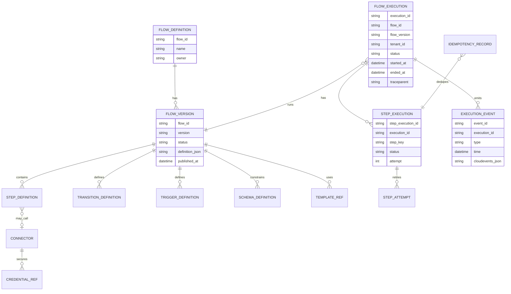
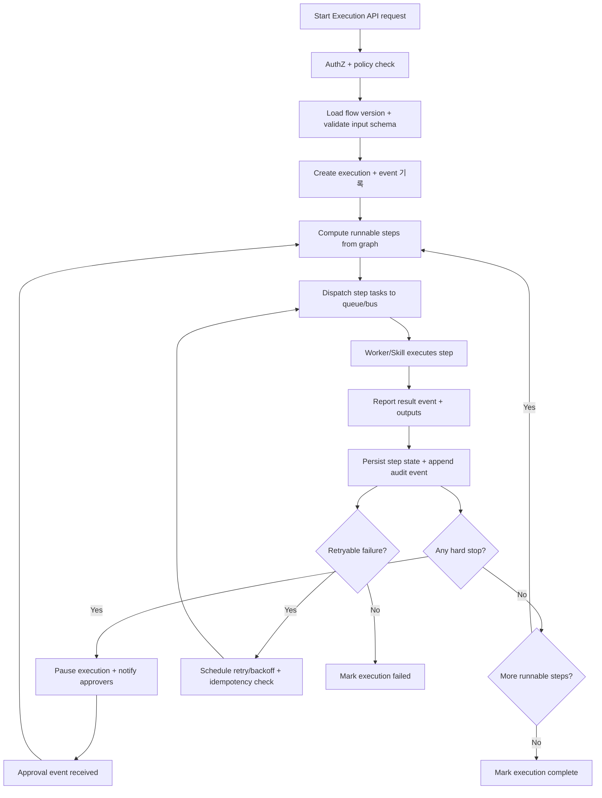

# Extending the Engine to Support Flow Creation and Execution

## Executive summary

The attached materials describe a platform architecture where “work” is executed by many specialized **Skills/microservices** and coordinated by a **Flow Engine** whose **Flow Orchestrator** reads **JSON flow definitions** (tasks + conditions + transitions), tracks state, and dispatches tasks to Skills (via an AI Dispatcher), including “hard stop” validation/approval gates. fileciteturn0file1L155-L186

To extend “our engine” to support the requested **flow creation** (authoring + versioning + safe runtime execution), the core gap is typically not *the ability to execute steps* (you already have Skills), but the platform primitives to make flows **durable, versioned, observable, secure, and evolvable**: a definition registry, a validated DSL/schema, a durable execution state store, a step contract boundary, retry/idempotency semantics, and end-to-end observability. fileciteturn0file0L50-L105 fileciteturn0file1L229-L243

A robust design that matches the documents’ mental model and reduces long-term operational risk is to implement a **Flow Control Plane** (definition authoring, templates, policies) and a **Flow Data Plane** (execution orchestration + worker/Skill dispatch + eventing). This aligns closely with CI/CD platform patterns used as analogies in the sources (controller/agents, approvals/checks, reuse via libraries). fileciteturn0file1L221-L243 citeturn2search0turn2search12turn2search16turn2search2

Key standards to anchor the extension include: **OpenAPI 3.1** for the control/data plane APIs (including webhook documentation), **OAuth 2.0 + OpenID Connect** for access control, **CloudEvents** for event/message envelopes, **JSON Schema 2020‑12** for definition and payload validation, and **W3C Trace Context + OpenTelemetry** for trace propagation and telemetry pipelines. citeturn0search12turn0search11turn3search5turn0search2turn1search2turn0search1turn1search1

Constraints (performance targets, implementation language, deployment model) were explicitly unspecified; the proposal is therefore designed to be constraint-neutral and calls out where implementation choices depend on your environment. (Unspecified constraints noted.)

Important limitation: only two “18-*” documents were available in the current workspace (the two uploaded markdowns). The report therefore provides a rigorous design and traceability **based on these two artifacts**, and flags where additional “18-*” documents could add/override requirements.

## Evidence from attached documents and requirement traceability

The documents’ most concrete “must-haves” for your engine extension are about: **(a) flow definitions as JSON graphs**, **(b) orchestration semantics (state, dispatch, hard stops, checkpointing)**, and **(c) integration into the existing modular architecture (Genie DNA + Master Skills + AI Dispatcher)**. fileciteturn0file1L155-L195 fileciteturn0file1L229-L243

### Requirement-to-source mapping

| Requirement area | Requirement statement (normalized) | Primary support in attached docs |
|---|---|---|
| Flow definition model | Flows are defined as **JSON** with **tasks, conditions, and transitions** (graph semantics). | fileciteturn0file1L178-L185 |
| Orchestration runtime | The **Flow Orchestrator** reads definitions, tracks state, and dispatches tasks to Skills (via AI Dispatcher). | fileciteturn0file1L178-L185 |
| Gates and approvals | Flows include **“Hard Stops & Validations”** for manual intervention or automated gates. | fileciteturn0file1L183-L186 |
| Parallelism & checkpoints | Orchestrator should support **parallel fan‑out/fan‑in** and **state checkpointing**. | fileciteturn0file1L231-L236 |
| Platform composition | **Genie DNA** is a composition layer of JSON/Elasticsearch-like modules defining site behavior and UI forms/views/rules. | fileciteturn0file1L159-L167 |
| Execution layer | A library of **63+ Skills/microservices** performs atomic work; flows coordinate them. | fileciteturn0file1L169-L176 fileciteturn0file1L237-L239 |
| Flow creation prerequisites | Update **Task Types Catalog (V16)** for flow-based contracts with mandatory inputs/outputs. | fileciteturn0file1L299-L303 |
| UI/config updates | Add **DNA** view/form definitions to support onboarding/marketplace flows (implies UI backing for flow interactions). | fileciteturn0file1L304-L306 |
| Intent routing | Make the **AI Dispatcher** “flow-aware” to select orchestration blueprint based on intent (routing policy). | fileciteturn0file1L309-L310 |
| Definition registry | Introduce a **versioned definition registry**, validation, and compatibility rules. | fileciteturn0file0L50-L56 |
| Execution primitives | Runtime needs start/pause/resume/cancel/retry + durable execution semantics and step contracts. | fileciteturn0file0L58-L71 |
| Persistence model | Maintain execution, step execution, audit/event records, connector configs, idempotency records. | fileciteturn0file0L73-L88 |
| API surface | Split control plane vs data plane APIs (definitions vs executions). | fileciteturn0file0L92-L105 |

## Flow domain model

This section exhaustively enumerates the **flow entities**, **events**, **state transitions**, **data schemas**, and **message formats** implied by the documents, plus the minimum additions required for safe/operable flow creation.

### Required flow entities

The documents already imply three “existing” conceptual layers: **composition (Genie DNA)**, **execution (Skills)**, and **orchestration (Flow Engine)**. fileciteturn0file1L155-L186

To support **flow authoring + runtime**, the minimal canonical entity set is:

**Design-time entities (Flow Control Plane)**  
- **FlowDefinition**: stable identity for a flow (name, owner, tags, description). (Derived from “Flow Definitions are JSON files” + need for registry/versioning.) fileciteturn0file1L183-L185 fileciteturn0file0L50-L56  
- **FlowVersion**: immutable, published artifact containing the JSON definition, schema references, and compatibility metadata (semver-like version, status=Draft/Active/Deprecated). fileciteturn0file0L50-L56  
- **StepDefinition**: node in the flow graph (type, target Skill/integration, retry/timeout policy, input mapping, output mapping). fileciteturn0file0L62-L67  
- **TransitionDefinition**: directed edge with condition expression (from step -> step). fileciteturn0file1L183-L185  
- **TriggerDefinition**: how executions are started (manual/API, webhook, timer/schedule, event subscription). (Implied by “end-to-end processes” and integration patterns.) fileciteturn0file0L66-L67  
- **SchemaDefinition**: JSON Schema describing allowed structure for: flow input, step inputs/outputs, and flow output. citeturn3search5turn3search1  
- **Template/LibraryArtifact**: reusable step groups / subflows (“shared library” equivalent). fileciteturn0file0L50-L56 citeturn2search11  
- **PolicyDefinition**: approvals, authorization constraints, rate limits, PII redaction rules, retention. (Implied by hard stops/validations + operational separation of concerns.) fileciteturn0file1L183-L186 fileciteturn0file0L50-L56  

**Runtime entities (Flow Data Plane)**  
- **Execution**: runtime instance bound to (FlowDefinition, FlowVersion, tenant, initiator, correlation/trace IDs) with evaluated variables and status. fileciteturn0file0L73-L85  
- **StepExecution**: per-step status, attempts, timings, error info, retry schedule. fileciteturn0file0L79-L88  
- **ExecutionEvent**: append-only audit/event log for each execution (for debugging, replay, compliance). fileciteturn0file0L83-L85  
- **Connector / CredentialRef**: configured integration target (OAuth client, API key, mTLS, webhook validation secret). fileciteturn0file0L85-L88 citeturn0search1turn1search1  
- **IdempotencyRecord**: dedup keys for non-idempotent operations across at-least-once execution. fileciteturn0file0L87-L88 citeturn3search4  

### Required domain events

The Flow Orchestrator is described as reading definitions and dispatching tasks, which implies a minimum event vocabulary for state tracking and observability. fileciteturn0file1L183-L185

A practical normalized event set:

- **FlowVersionPublished** (definition lifecycle)  
- **ExecutionStarted**, **ExecutionPaused**, **ExecutionResumed**, **ExecutionCanceled**, **ExecutionCompleted**, **ExecutionFailed**  
- **StepScheduled**, **StepDispatched**, **StepStarted**, **StepSucceeded**, **StepFailed**, **StepRetryScheduled**, **StepTimedOut**  
- **HardStopEntered**, **HardStopApproved**, **HardStopRejected** (manual gates) fileciteturn0file1L183-L186  
- **ExternalEventReceived** (webhook/event trigger) and **TimerFired** (scheduled trigger) (implied by integration layer requirements). fileciteturn0file0L66-L67

### Execution and step state transitions

Because “hard stops,” retries, and checkpointing are explicitly required, you need well-defined state machines with enforced transitions. fileciteturn0file1L183-L186 fileciteturn0file1L231-L236

**Execution state machine (minimum):**
- `CREATED → RUNNING → (PAUSED | CANCELED | SUCCEEDED | FAILED)`
- `PAUSED → RUNNING` only via explicit approval/resume event
- `RUNNING → FAILED` on unrecoverable error or max retries exceeded
- `RUNNING → CANCELED` via explicit cancel API

**Step state machine (minimum):**
- `PENDING → DISPATCHED → RUNNING → (SUCCEEDED | FAILED | TIMED_OUT)`
- `(FAILED | TIMED_OUT) → RETRY_SCHEDULED → DISPATCHED` (bounded by policy)
- Any `RUNNING` step can go to `CANCELED` if execution cancels (if you model cancellation per-step)

These transitions are the basis for “checkpointing”: after *every* transition, you persist (a) the new state, (b) a monotonic event, and (c) the evaluated variable outputs. fileciteturn0file0L73-L85

### Data schemas and message formats

**Schema standard for validation**  
Use **JSON Schema 2020‑12** for validation of flow definitions and runtime payloads (input/output), because it is a formalized, widely-implemented way to validate JSON structure. citeturn3search5turn3search1

**Message envelope standard**  
Use **CloudEvents** as the default event/message envelope for `ExecutionEvent` and `Step*` events, so that event routing, filtering, and integration are standardized across buses and services. citeturn0search11turn0search15

Example (CloudEvents JSON) for `StepSucceeded`:

```json
{
  "specversion": "1.0",
  "type": "flow.step.succeeded",
  "source": "engine.flow-orchestrator",
  "id": "9c7a1bb4-9a29-4b82-8c8e-2b3b77a1d9b1",
  "time": "2026-02-25T10:15:30Z",
  "subject": "execution/EXE-123/step/validate_identity",
  "datacontenttype": "application/json",
  "data": {
    "execution_id": "EXE-123",
    "flow_id": "USER_ONBOARDING",
    "flow_version": "2.1.0",
    "step_key": "validate_identity",
    "attempt": 1,
    "outputs": { "risk_score": 0.07, "verified": true },
    "trace": { "traceparent": "00-0af7651916cd43dd8448eb211c80319c-b7ad6b7169203331-01" }
  }
}
```

citeturn0search11turn0search2turn0search6

**Trace propagation requirement**  
To correlate orchestrator ↔ Skills ↔ integrations, adopt the **W3C Trace Context** headers/fields (`traceparent`, `tracestate`) and propagate them through HTTP and event messages. citeturn0search2turn0search6

## Engine architecture changes

This section maps the extracted requirements onto concrete **components to modify/add**, **integration points**, **APIs**, **configuration**, **persistence**, and **runtime behavior**.

### Component changes and integration points

The current mental model is explicitly “controller/agent”: the Flow Orchestrator is the controller and Skills are executors. fileciteturn0file1L231-L239 This parallels how build systems route work to labeled agents and pooled workers. citeturn2search0turn2search12

Recommended component set:

**Flow Control Plane (new/expanded)**
- **Flow Definition Registry Service** (new): CRUD + versioning + publish/deprecate, plus JSON Schema validation at publish time. fileciteturn0file0L50-L56 citeturn3search5turn3search1  
- **Flow Template Library** (new): reuse step groups/subflows, analogous to shared pipeline libraries. fileciteturn0file0L50-L56 citeturn2search11  
- **Task Type Catalog extension** (modify): formalize step contracts (mandatory inputs/outputs, allowed retry policies, side-effect classification), as required by the documents’ “Task Types Catalog (V16)” callout. fileciteturn0file1L299-L303  
- **Genie DNA extensions** (modify): add/extend modules for binding flows to site types, configuring forms/views that drive gate steps, and storing flow UI metadata. fileciteturn0file1L159-L167L304-L306

**Flow Data Plane (modify/add)**
- **Flow Orchestrator runtime** (modify, central): implement durable execution semantics (state persisted at each transition), fan‑out/fan‑in scheduling, pause/resume, and hard stops. fileciteturn0file1L178-L186L231-L236  
- **Skill dispatch integration** (modify): the orchestrator dispatches tasks to Skills (via AI Dispatcher per docs). This implies either:
  - keep the dispatcher as the routing boundary but add flow-aware metadata (execution_id, step_key, trace context), or  
  - dispatch directly to Skills for non-AI steps and reserve AI Dispatcher for model/tooling calls.  
  The docs explicitly call for making the AI Dispatcher flow-aware for blueprint selection. fileciteturn0file1L183-L185L309-L310  
- **Durable state store + audit log** (add): persist executions, step executions, and event history in a transactional store. fileciteturn0file0L73-L85  
- **Event bus / queue** (add or standardize): for step dispatch and event emission (enables async scaling and replay). (Implied by step abstraction and integration layer; also aligns with “workers/agents” design.) fileciteturn0file0L62-L71  
- **Outbox for reliable event emission** (add): publish execution/step events reliably without “dual write” inconsistencies; Debezium documents the outbox pattern as a mechanism to keep internal DB state consistent with emitted events. citeturn4search0  
- **Idempotency subsystem** (add): store idempotency keys and results for step executions and external operations that can be retried. The IETF draft for the `Idempotency-Key` header formalizes the pattern for retrying POST/PATCH safely. fileciteturn0file0L87-L88 citeturn3search4  

### API surface and specification

The docs explicitly separate control plane vs data plane; implement the external surface and internal contracts accordingly. fileciteturn0file0L92-L105

Use **OpenAPI 3.1** as the normative API description format, noting that 3.1 supports the `webhooks` field at the top level of the spec. citeturn0search12turn0search0

Minimal API set:

**Control plane**
- `POST /flow-definitions` (create)
- `POST /flow-definitions/{id}/versions` (publish new version)
- `GET /flow-definitions/{id}/versions/{v}` (retrieve)
- `POST /flow-templates` (create/update templates)
- `GET /task-types` (discover step contracts)

**Data plane**
- `POST /executions` (start: references flow_id + version + input)
- `GET /executions/{execution_id}` (status + active steps)
- `POST /executions/{execution_id}:cancel`
- `POST /executions/{execution_id}:retry`
- `POST /executions/{execution_id}:resume` (for hard stops)
- `GET /executions/{execution_id}/events` (audit/event timeline)

This layout is consistent with the example “process runtime” API split outlined in the attached deep research doc. fileciteturn0file0L92-L105

### Authentication, authorization, and approvals

Because flows can expose and transform sensitive business data, authorization must exist at three levels: definition, execution, and payload fields.

- OAuth 2.0 defines the authorization framework for limited access to HTTP services. citeturn0search1  
- OpenID Connect extends OAuth 2.0 with identity via the ID Token, represented as a JWT. citeturn1search1  

Hard-stop (approval) gates should be treated as **resource checks** similar to CI/CD environments with approvals and checks; the Azure Pipelines docs show approvals as a gating mechanism before a stage consumes a protected resource. citeturn2search2turn2search16

### Persistence and data model

The attached deep research doc enumerates the minimum persistence set: definition/execution/step records, audit log/events, connectors, idempotency records. fileciteturn0file0L73-L88

Mermaid ER diagram (recommended canonical model):



fileciteturn0file0L73-L88 citeturn0search11turn3search5

### Runtime flow of an execution

The documents require: JSON-defined flows, state tracking, skill dispatch, hard stops, parallel fan-out/fan-in, and checkpointing. fileciteturn0file1L178-L186L231-L236

Mermaid flowchart (runtime data plane):



fileciteturn0file1L178-L186 citeturn3search4turn3search5

## Design options and trade-offs

This section provides the requested alternative designs (at least two) with trade-offs.

### Orchestration runtime options

The documents already assume an in-platform orchestrator (Flow Orchestrator Skill 09). fileciteturn0file1L183-L185 The key architectural choice is whether to **extend it into a durable workflow runtime** or **delegate durability to an external workflow engine**.

| Option | Summary | Strengths | Trade-offs / risks | Best fit |
|---|---|---|---|---|
| Extend existing Flow Orchestrator (in-engine durability) | Add durable state store, event log, queue dispatch, retries, idempotency, approvals | Tight fit to current Skills + DNA; direct mapping to docs; avoids introducing a new platform dependency fileciteturn0file1L178-L186 | Higher engineering/maintenance burden; correctness pitfalls in replay/retries/idempotency; long-term operational debt if event history model is incomplete fileciteturn0file0L58-L71 | When you must keep everything in-platform and have strong ownership of runtime semantics |
| Integrate a durable workflow engine (e.g., entity["company","Temporal","durable workflow engine"]) | Model Skills as “activities”; workflow runtime provides event history + recovery | Durable execution backed by event history (crash recovery, replay) citeturn3search2turn3search6 | Requires adopting workflow determinism model; adds operational component (service + persistence) citeturn3search2turn3search6 | When flows are long-running and you need best-in-class durability/replay quickly |
| Kubernetes-native workflow engine (e.g., entity["organization","Argo Workflows","k8s workflow engine"]) | Express steps as Kubernetes-native workflow objects, strong for container jobs | Built-in retry semantics and Kubernetes-native execution models citeturn3search3 | Less natural fit for business-process “hard stops” and fine-grained skill calls unless you wrap them as jobs; operational model is Kubernetes-centric citeturn3search3turn4search3 | Batch/container-heavy workloads where steps are best expressed as pods/jobs |

### Flow authoring options (flow creation)

The documents define flows as JSON, but do not constrain *how authors produce that JSON*. fileciteturn0file1L183-L185

| Option | Summary | Strengths | Trade-offs / risks |
|---|---|---|---|
| JSON-first “flow-as-code” | Authors write/edit JSON; validate with JSON Schema; version in registry (and optionally Git) | Highest diffability/reviewability; easiest to ship; pairs well with schema validation citeturn3search5turn3search1 | Harder for non-developers; error-prone without great tooling |
| Visual builder that emits JSON | UI graph editor generates valid JSON definitions bound to Task Types | Lowers barrier for business users; can enforce constraints via UI | High front-end effort; versioning/review UX can be weaker than code; needs robust migration tooling |
| Hybrid | Visual builder + “advanced JSON editor” override within same artifact | Best of both; can gradually introduce visual builder | Most complex to implement; must resolve conflicts between UI model and raw JSON |

## Backward compatibility and migration

This section identifies backward-compatibility risks and migration strategies, as requested.

### Backward-compatibility risks

1. **Flow definition schema drift**: existing flows are “JSON files” and may not be versioned or schema-validated; introducing required fields (version, step contracts, policies) can break legacy definitions. fileciteturn0file1L183-L185 fileciteturn0file0L50-L56  
2. **Behavioral changes under retries**: once you add durable retries + replay, steps may execute more than once; any step with side effects (payments, notifications, writes) is at risk unless idempotency is enforced. fileciteturn0file0L62-L67 citeturn3search4  
3. **Event emission consistency**: if you publish execution events to other services, dual-write issues (DB commit vs message publish) can produce out-of-sync state unless you use an outbox pattern or equivalent. citeturn4search0  
4. **AI Dispatcher routing semantics**: making the dispatcher “flow-aware” changes routing policy for requests and may alter outcomes, latency, and failure modes. fileciteturn0file1L309-L310  
5. **Storage and query expectations**: introducing a durable execution store changes operational workflows (debugging, replay, retention) and may require new indexing/retention policies. fileciteturn0file0L73-L85  

### Migration strategies

**Schema versioning and compatibility rules**
- Introduce `definition_schema_version` and maintain a compatibility policy: “engine must support N previous schema versions.” fileciteturn0file0L50-L56  
- Provide an automated **definition upgrader** (v0 → v1) that adds defaults (retry policy, timeouts) and flags unsafe steps for manual review. (Derived from needing validation/compatibility rules.) fileciteturn0file0L50-L56  

**Execution safety via idempotency**
- Require idempotency for any non-idempotent operations: store `IdempotencyRecord` keyed by (execution_id, step_key, attempt) or by external `Idempotency-Key`. fileciteturn0file0L87-L88 citeturn3search4  
- For APIs facing rate limits, explicitly handle HTTP 429 with `Retry-After` support in retry scheduling. citeturn1search4  

**Eventing via outbox**
- Implement transactional outbox for execution events; Debezium documents the outbox pattern specifically to avoid inconsistent internal state vs emitted events. citeturn4search0  

**Deployment and rollout**
- Use feature flags per tenant/flow_id: “new runtime enabled” vs “legacy runtime.” (Recommendation derived from backward-compat concerns.)  
- Shadow-execute: run new runtime in “dry run” mode producing events but not side effects, where possible. (Recommendation)  
- Expand/contract schema migration: add new tables/columns first, dual write, then cut over reads, then remove legacy fields. (Recommendation supported by the need for durable execution stores and audit logs.) fileciteturn0file0L73-L85  

## Delivery plan with implementation tasks, tests, and observability

This section provides: implementation tasks with effort and acceptance criteria; test plan (unit/integration/e2e) and validation criteria; and monitoring/logging/observability changes.

### Implementation tasks

Effort scale: **Low** (days), **Medium** (1–3 weeks), **High** (multi-week / cross-team).

| Task | Engine area | Effort | Acceptance criteria |
|---|---|---|---|
| Define the FlowDefinition JSON DSL and publish JSON Schema (2020‑12) for validation | Control plane | Medium | A flow definition validates (or fails) deterministically with actionable schema errors; schema covers steps, transitions, triggers, retry/timeout, hard stops citeturn3search5turn3search1 |
| Implement Flow Definition Registry with versioning, draft/publish/deprecate lifecycle | Control plane | Medium | Create/publish APIs exist; retrieving a version is immutable; “active version” resolution is deterministic fileciteturn0file0L50-L56 |
| Extend Task Types Catalog (V16) into a formal Step Contract system (inputs/outputs, allowed policies) | Control plane | High | Each step references a Task Type; publish is rejected if step does not conform; Skills can advertise supported Task Types fileciteturn0file1L299-L303 |
| Extend Genie DNA composition for flow bindings and UI artifacts (views/forms for gates) | Config/UI plane | High | A site type can bind to flows; hard stop step renders appropriate UI form and captures approval outcome fileciteturn0file1L159-L167L304-L306 |
| Add durable Execution/StepExecution store and event/audit log tables | Data plane | Medium | Execution survives orchestrator restart; audit log is append-only; queries by execution_id and tenant_id are performant fileciteturn0file0L73-L85 |
| Implement the core orchestrator state machine (start/pause/resume/cancel/retry) + fan-out/fan-in | Data plane | High | Parallel steps execute and join; hard-stop pauses and requires approval to continue; retries are bounded and persisted fileciteturn0file1L183-L186L231-L236 |
| Introduce queue/bus-based step dispatch and result ingestion | Data plane | High | Steps execute asynchronously; dispatch is at-least-once with dedupe; worker failure does not lose tasks (durable retry) fileciteturn0file0L62-L71 |
| Implement IdempotencyRecord store + Idempotency-Key support for outbound HTTP steps | Data plane / integrations | Medium | Replayed step does not duplicate side effects; idempotency behavior is documented and enforced for non-idempotent calls citeturn3search4turn1search4 |
| Add transactionally-safe event publishing via outbox | Data plane | Medium | Execution events cannot be lost or emitted without committed state; consumers can rebuild state from events if needed citeturn4search0 |
| Standardize ExecutionEvent messages on CloudEvents and include trace context | Integration plane | Medium | Every execution/step event conforms to CloudEvents 1.0 JSON format; traceparent is present or derivable citeturn0search11turn0search15turn0search2 |
| Make AI Dispatcher flow-aware (intent → blueprint selection, include execution metadata) | Routing plane | Medium | Dispatcher routes based on flow context without breaking non-flow callers; execution_id is propagated end-to-end fileciteturn0file1L309-L310 |
| Publish OpenAPI 3.1 specs for control plane + data plane + webhooks | API plane | Low | Specs validate; include documented webhooks; client SDK generation is possible citeturn0search12turn0search0 |
| Add OAuth2/OIDC enforcement + object-level authorization for definitions and executions | Security plane | Medium | Only authorized principals can read/execute flows; tenant isolation verified; ID tokens validated citeturn0search1turn1search1 |
| Add OpenTelemetry instrumentation (traces/logs/metrics), collector pipelines, and Prometheus metrics endpoints | Observability | Medium | Trace continuity across orchestrator/Skills; metrics scrape works; collector pipelines configured with receivers/processors/exporters citeturn0search2turn1search2turn1search9turn1search3 |
| Build operator tooling: execution viewer, replay controls, DLQ/quarantine management | Ops UX | Medium | Operators can inspect timeline, retry a failed step, resume gates, and see DLQ statistics with audit trail fileciteturn0file0L69-L71 |

### Test plan and validation criteria

The goal is to validate: correctness of state transitions, durability, idempotency under retry, integration reliability, security, and observability.

**Unit tests (core invariants)**
- FlowDefinition schema validation: invalid graph (missing step, cyclic dependency if disallowed, invalid transition) fails publish with explicit errors. citeturn3search5turn3search1  
- Orchestrator transition unit tests: illegal state transitions are rejected; every transition writes an event and persists state. fileciteturn0file0L73-L85  
- Idempotency tests: same step invocation key returns same outcome (or “already processed”) and does not repeat side effects. citeturn3search4  

**Integration tests (with real stores/queues)**
- Queue dispatch contract: orchestrator enqueues a task, worker acknowledges, results return; orchestrator advances graph and persists StepExecution. fileciteturn0file0L62-L71  
- Retry and rate-limiting: simulate 429 + Retry-After; verify retry scheduling respects server delay and does not hot-loop. citeturn1search4  
- Outbox consistency: commit DB state and ensure corresponding CloudEvents are emitted exactly once (consumer dedupe if at-least-once). citeturn4search0turn0search11  

**End-to-end tests (realistic flows)**
- “Hard stop” flow: execution pauses; UI/approval event resumes; audit trail shows HardStopEntered/Approved and final success. fileciteturn0file1L183-L186  
- Fan-out/fan-in flow: N parallel steps complete; join evaluates conditions correctly; no missing steps; execution completes. fileciteturn0file1L231-L236  
- Intent-routed flow: same input intent selects correct blueprint; AI Dispatcher propagates execution metadata to subsequent steps. fileciteturn0file1L309-L310  

**Validation criteria (release gates)**
- Durability: orchestrator process crash during RUNNING does not lose execution; resumed execution continues from persisted state. (Durability requires persisted event history/state; workflows like Temporal cite event history as basis for recovery.) fileciteturn0file0L73-L85 citeturn3search2turn3search6  
- Safety under retries: no double side effects for steps classified as non-idempotent; idempotency coverage is measurable (see monitoring). citeturn3search4  
- Observability: every execution has trace continuity using W3C trace context; metrics exist for latency/failures; events are CloudEvents-conformant. citeturn0search2turn1search2turn1search3turn0search11  

### Monitoring, logging, and observability changes

**Trace propagation**
- Adopt W3C Trace Context and propagate via HTTP headers and by embedding `traceparent` in CloudEvents `data.trace` (or as an extension attribute). citeturn0search2turn0search11  
- Instrument orchestrator and Skills using entity["organization","OpenTelemetry","observability project"] SDKs; centralize collection using the OTel Collector pipeline model (receivers/processors/exporters). citeturn1search2turn1search9  

**Metrics**
Expose `/metrics` endpoints for scraping by entity["organization","Prometheus","metrics monitoring project"]; Prometheus’ “scrape HTTP endpoints” model is the expected integration pattern. citeturn1search3  

Recommended SLI metrics (names illustrative):
- `flow_executions_started_total`, `flow_executions_succeeded_total`, `flow_executions_failed_total`
- `flow_execution_duration_seconds` (histogram)
- `flow_step_queue_lag_seconds` (dispatch → start)
- `flow_step_retries_total` and `flow_step_attempts_total`
- `flow_hard_stops_active` and `flow_hard_stop_wait_seconds`
- `flow_idempotency_dedup_hits_total`
- `flow_outbox_publish_lag_seconds`

**Logging**
- Structured logs must include: `execution_id`, `step_key`, `tenant_id`, `flow_id`, `flow_version`, `attempt`, `trace_id` (derived from traceparent). citeturn0search2turn0search6  

**Alerting**
- Alert on: elevated failure rate per flow version, queue lag spikes, DLQ growth, repeated retries, outbox publish lag, approval wait backlog, and authorization failures. (Recommendation tied to durable operations and the docs’ operational tooling requirement.) fileciteturn0file0L69-L71  

### Operational scaling/deployment notes

If the orchestrator/workers run on entity["organization","Kubernetes","container orchestration project"], Horizontal Pod Autoscaling (HPA) is the standard mechanism to scale pods based on observed load; Kubernetes documents HPA as automatically updating workloads to match demand. citeturn4search2

For stateful components (databases, brokers), Kubernetes uses StatefulSets to provide stable identities and persistent storage guarantees when needed. citeturn4search3  

### Compensation and long-running processes

For multi-step business flows where distributed ACID transactions are infeasible, a compensation-based approach (“saga”) is a well-established model: the classic Sagas paper defines a saga as a long-lived transaction decomposed into a sequence of transactions with compensations for partial execution. citeturn5view0turn6view0