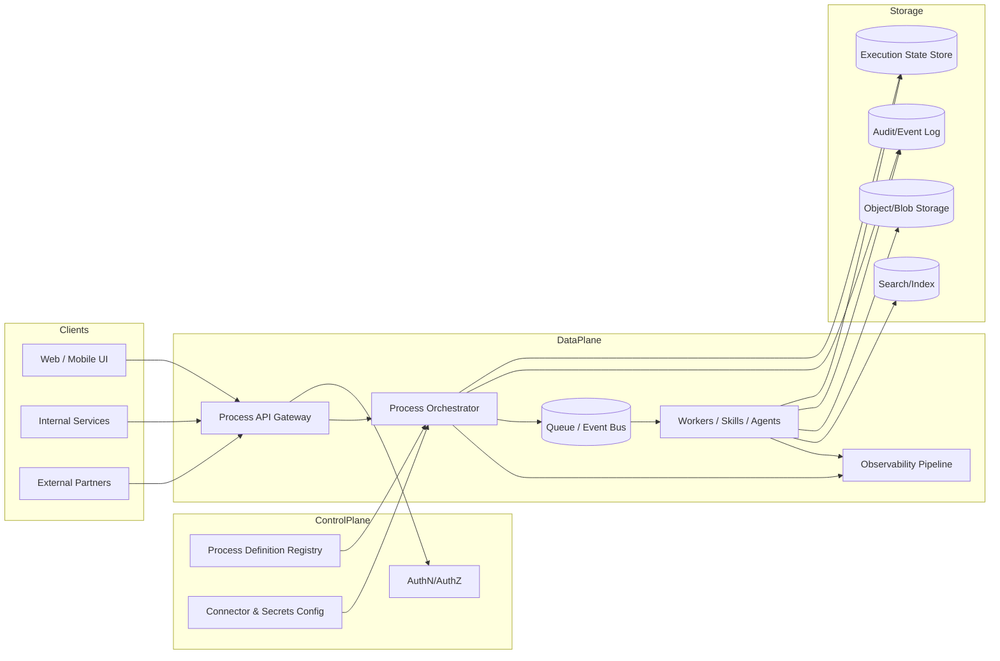
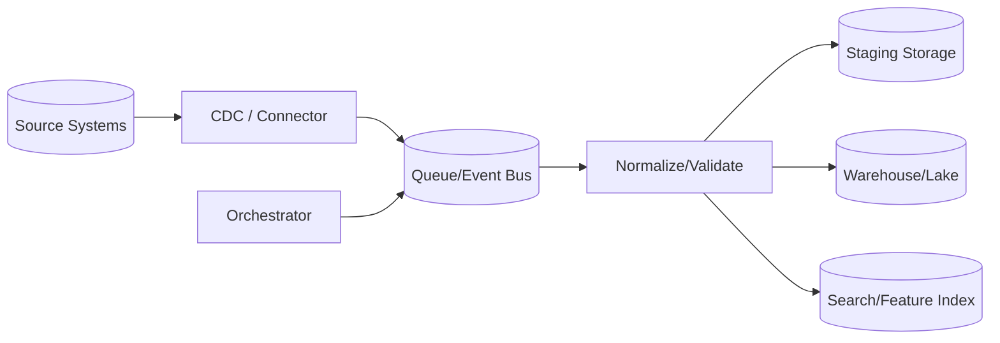
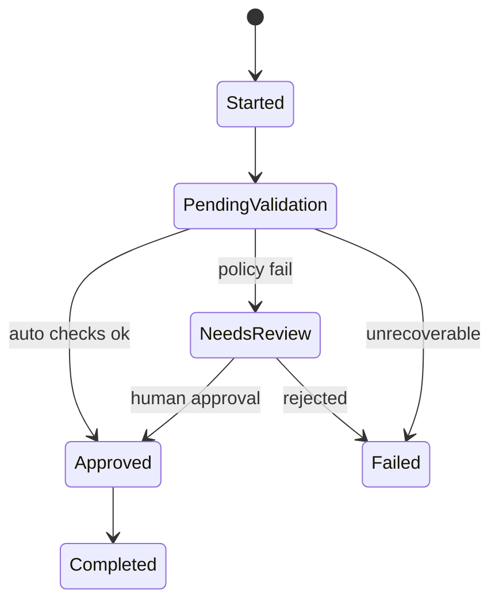
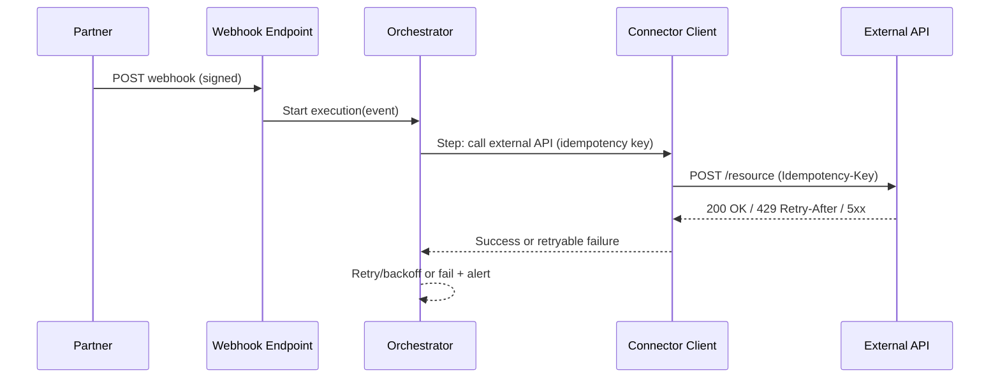
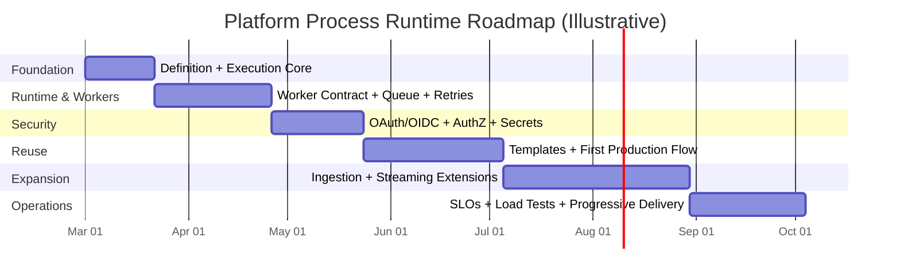

# Extending the Platform with the Process in the Attached Markdown

## Executive summary

The attached markdown describes a **modular, orchestration-first way** to represent and execute end-to-end “processes,” explicitly drawing an analogy to **CI/CD platforms**: a **controller/orchestrator** schedules work, **agents/workers** execute it, and the ecosystem is extended via reusable building blocks (akin to pipeline-as-code and shared libraries). It frames this through the module breakdown of entity["organization","Jenkins","automation server project"] (controller + agents + pipeline-as-code) and entity["company","Azure DevOps","microsoft devops suite"] (Boards/Repos/Pipelines/Artifacts/Test Plans/Wiki), then maps that mental model onto your platform concepts (composition/config modules, a flow orchestrator, and “skills”/microservices that execute units of work). fileciteturn0file0

A robust extension strategy is to implement a **Process Runtime** (a “workflow engine” inside your platform) with:
- **Declarative process definitions**, versioned and validated (like pipeline-as-code). fileciteturn0file0
- **Durable execution + retries + state checkpoints** (to make long-running, failure-prone flows safe). Temporal’s model is a representative reference for why idempotency and retries must be first-class. citeturn14search5turn0search2turn0search6
- **A worker model** (skills/agents) that can scale horizontally and be isolated by capability/environment—similar to Jenkins agents and Azure DevOps agent pools. citeturn0search0turn6search3turn14search0
- **Standardized integration patterns** (webhooks, idempotency keys, rate limits) for external APIs. citeturn2search3turn11search4turn11search15turn11search3
- **Observability by default** (distributed tracing, logs, metrics with correlation IDs). citeturn9search0turn0search13turn9search1

Because the prompt asks to treat the “process description” as potentially different kinds of processes (data ingestion pipeline, user workflow, external API integration, batch processing, real-time streaming), this report provides a **single consistent platform extension** that can support all five, then highlights the **design deltas** for each.

## What the attached process implies and key assumptions

### What can be extracted from the attached markdown

The markdown’s core “process” pattern is best summarized as:

- **Module decomposition**: break large platform capabilities into clear modules (controller/orchestrator, executors/agents, re-usable templates, credential handling, integrations). fileciteturn0file0  
- **Orchestration-first execution**: shift from ad-hoc calls between services/skills to explicit flow definitions (sequence, conditions, transitions, and “hard stops”/gates). fileciteturn0file0  
- **Standardization at scale**: reuse flow logic via shared building blocks (analogous to Jenkins Shared Libraries). citeturn6search1turn6search10  
- **Operational separation of concerns**: define policy/definitions/config separately from runtime execution, similar to “configuration-as-code” and “pipeline-as-code.” fileciteturn0file0turn6search16

The markdown also gives example end-to-end flows (e.g., user lifecycle, content/commerce, specialized automation), which are representative of **long-running, multi-step business processes** rather than only CI/CD pipelines. fileciteturn0file0

### Explicit assumptions (because platform + process details are unspecified)

1. **Current architecture is unknown**; analysis assumes you may be operating one of: a modular monolith, microservices (“skills”), serverless functions, or a hybrid. (Assumption)
2. You want to execute processes that can be **multi-step**, sometimes **long-running**, and involve **multiple internal services and/or external APIs**. (Assumption)
3. You need **auditable execution**, **retries**, and **clear ownership** of failures (human-in-the-loop ability). This is consistent with the “hard stops/validations” aspect. fileciteturn0file0
4. You prefer **standard interfaces and official ecosystems** when selecting technologies (explicit user preference).
5. Latency/SLO targets are unspecified; recommended targets are provided as **ranges** tied to process type, grounded in SLO practices (conceptual reference). citeturn5search4

## Reference architecture for a platform-native process runtime

This section explicitly covers: current architecture framing, required features, data models, APIs, authn/z, scaling/storage, performance targets, error handling, and retries.

### Current platform architecture framing (agnostic baseline)

If your current platform is primarily **request/response microservices** (or skills) orchestrated implicitly by callers, extending with a process runtime means introducing a **durable coordination layer**. This mirrors the controller/agent pattern described for Jenkins and the suite composition described for Azure DevOps. fileciteturn0file0turn0search0turn14search1

Key analogy points that hold even if your architecture differs:
- A central scheduler/orchestrator assigns work to workers/skills (controller → agents). citeturn0search0turn0search4
- Workers scale horizontally; routing can use labels/capabilities (agents/agent pools). citeturn0search0turn6search15
- Flow logic lives in version-controlled definitions (“process-as-code”), comparable to Jenkinsfile best practice. citeturn6search16

### Required new features

A production-grade extension typically requires the following capabilities (each is a platform feature, not a single endpoint):

- **Process Definition Registry**
  - Versioned definitions (v1, v2, …), validation, compatibility rules.
  - Optional templates/shared libraries pattern for reuse (mirrors Jenkins Shared Libraries). citeturn6search1turn6search10

- **Process Execution Runtime**
  - Start, pause, resume, cancel, retry, and “hard stop” (manual approval) semantics. fileciteturn0file0  
  - Durable execution for long-running flows: state is recoverable after crashes/outages (a key value proposition of durable workflow systems). citeturn14search5turn14search2

- **Task/Step Abstraction**
  - Standard step contract: inputs, outputs, idempotency semantics, retry policy, timeouts.
  - Support multiple step types: HTTP call, DB transaction, message publish, human approval, batch job, stream subscription.

- **Connector/Integration Layer**
  - Outbound calls with idempotency keys (where applicable), rate limiting, and webhook sources. citeturn11search3turn11search4turn2search11

- **Operational Tooling**
  - Trace/log correlation and metrics by process execution ID. citeturn9search0turn0search13turn5search0
  - Admin console for replay/inspect (especially for “stuck” executions).

### Data models and schema changes

A minimal “process runtime” schema set (relational or document, but with strong indexing) typically includes:

- **ProcessDefinition**
  - `definition_id`, `name`, `version`, `status` (draft/active/deprecated), `definition_blob` (JSON/YAML), `created_by`, `created_at`
- **ProcessExecution**
  - `execution_id`, `definition_id`, `definition_version`, `tenant_id`, `status` (running/succeeded/failed/canceled/paused), `started_at`, `ended_at`, `correlation_id`, `initiator` (user/service), `current_step`
- **StepExecution**
  - `step_execution_id`, `execution_id`, `step_key`, `attempt`, `status`, `started_at`, `ended_at`, `error_code`, `error_message`, `retry_at`
- **Event / AuditLog**
  - `event_id`, `execution_id`, `type`, `payload`, `timestamp` (useful for debugging and compliance)
- **Connector**
  - `connector_id`, `type` (oauth/api_key/mtls/webhook), `config_ref`, `scopes`, `owner`, `rotation_policy`
- **IdempotencyRecord**
  - `idempotency_key`, `scope` (tenant + endpoint), `request_hash`, `response_hash/status`, `expires_at`

If you’re already using a search/document store for dynamic modules (the markdown mentions “JSON/Elasticsearch configs” as a composition approach), you can store **definitions** in a doc store but still strongly consider writing **executions** to a transactional store to guarantee state transitions and auditing. Elasticsearch dynamic mapping is convenient but can yield suboptimal or inconsistent mappings if not controlled. citeturn15search6turn15search10

### APIs and endpoints (internal and external)

A practical API surface is usually split into:
- **Control plane APIs** (definitions, admin, permissions)
- **Data plane APIs** (start/execute/observe processes)

Suggested internal endpoints (REST; gRPC is fine internally if preferred):
- `POST /process-definitions` (create)
- `POST /process-definitions/{id}/versions` (publish new version)
- `POST /process-executions` (start execution: includes `definition_id@version` and input payload)
- `GET /process-executions/{execution_id}` (status + current step)
- `POST /process-executions/{execution_id}:cancel`
- `POST /process-executions/{execution_id}:retry` (retry failed step or whole execution)
- `GET /process-executions/{execution_id}/events` (audit trail)

External-facing endpoints commonly needed:
- **Webhook intake**: `POST /webhooks/{provider}` (validated signature + rate limiting)
- **Public status callback endpoint** (optional): if you support third-party callbacks
- **Trigger endpoints**: if partners start your processes via API

Recommendation: describe all public APIs using **OpenAPI 3.1**, which is language-agnostic and supports documenting webhooks in 3.1+. citeturn2search3turn11search18

### Authentication and authorization

A strong default posture for platform extension:

- **End-user authN**: OIDC (identity layer) on top of OAuth 2.0. citeturn1search5turn1search0  
- **Token format**: JWT for bearer identity/claims is common; treat it as a signed claim container. citeturn1search2turn1search1  
- **Service-to-service auth**: mTLS/workload identity where feasible; SPIFFE defines a standard way to issue identities (SVIDs) to workloads for secure inter-service auth. citeturn13search4turn13search0  
- **Authorization model**:
  - RBAC for coarse roles (admin/operator/developer/viewer)
  - ABAC/Policy checks for tenant- and object-level controls (strongly recommended for process definitions/executions)
  - Avoid API authorization pitfalls highlighted by OWASP API Security Top 10 (object-level and property-level authorization are frequent failure modes). citeturn1search3turn1search11  

### Data flow diagram (core)

The following diagram shows a generic platform process runtime that can support ingestion, user workflows, external integrations, batch, and streaming. (It is intentionally technology-agnostic.)

This structure is aligned with the “controller + agents” execution model described for Jenkins agents and scalable controller strategies, while also reflecting suite-like modularity (definitions, artifacts, testing, etc.). citeturn0search0turn0search17turn14search0

### Storage and scaling implications

Key scaling characteristics and the likely bottlenecks:

- **Orchestrator scale**
  - Prefer stateless orchestrator nodes with a shared durable state store; horizontal scale via Kubernetes HPA if on Kubernetes. citeturn5search2turn5search15
- **Execution state store**
  - Must handle high write rates (step transitions, attempts, events).
  - Strong indexing on `(tenant_id, status, started_at)` and `(execution_id)` is crucial.
- **Queue/event bus**
  - Needed to decouple orchestration from execution; ensures workers can scale independently.
- **Worker pools**
  - Separating workers by capability/environment mirrors agent pools: isolate “privileged deploy” steps from “untrusted compute,” for security and blast-radius control. citeturn6search15turn0search0
- **Search/index**
  - Useful for discovery and flexible querying, but control mappings (dynamic mapping can surprise you with inferred types and field explosion). citeturn15search6turn15search2

### Performance and latency targets (recommended ranges)

Because targets are unspecified, define SLOs by process class (common practice is to set SLOs based on SLIs like latency and error rate). citeturn5search4turn5search8

Recommended starting points (adjust after measurement):
- **Interactive user workflow steps (synchronous API)**: p95 < 300–800ms per request; error rate < 0.5–1% excluding client errors. (Recommendation)
- **External API integration steps**: p95 depends on partner; track *platform overhead* separately (e.g., orchestration overhead p95 < 50–150ms). (Recommendation)
- **Batch processing jobs**: defined by throughput windows (e.g., complete N records in T minutes) + cost ceilings. (Recommendation)
- **Real-time streaming**: define end-to-end event freshness (e.g., p95 < 5–30s depending on product expectation). (Recommendation)

### Error handling and retry strategies (platform-level)

At platform scale, retries are not optional—especially when steps interact with distributed systems and external APIs that fail transiently.

- **Idempotency-first design**
  - Durable workflow systems explicitly recommend idempotent activities because retries can execute the same step more than once. citeturn0search2turn0search6
  - For HTTP APIs, idempotency keys are a widely used pattern (Stripe documents the mechanism and the “return same result for same key” behavior). citeturn11search3turn11search15
- **Retry semantics**
  - Automatic retries for transient failures; bounded attempts with exponential backoff + jitter. (Recommendation)
  - Respect server-provided retry hints such as `Retry-After`, and use status codes like 429 as signals for rate limiting. citeturn11search4turn11search0
- **Dead-lettering and quarantine**
  - For async steps, send poison messages to a DLQ after max attempts; require manual review or automated escalation. (Recommendation)
- **Compensation**
  - For multi-step business flows, incorporate compensation steps (a “saga-like” sequence of local transactions) instead of distributed transactions. microservices.io explicitly identifies Saga as a collaboration pattern for distributed commands. citeturn12search14
- **Reliable event emission**
  - If you emit events after DB commits, use a transactional outbox to avoid “dual write” reliability gaps; microservices.io describes the reliability issue of sending messages before/after commit without 2PC. citeturn12search7

## Process-type analysis and design deltas

This section treats the attached process pattern (“flow orchestrator + executors + reusable configs”) as the common core, then highlights what changes for each process type.

### Data ingestion pipeline

Key requirements and implications:
- Connectors (pull or CDC) + normalization + schema evolution controls.
- Backfills, replay, dedupe, and lineage.

Representative technology references:
- **Airbyte** positions connectors as components that pull from sources and push to destinations. citeturn7search1
- **Debezium** connectors stream database changes into Kafka topics; it describes reading logical replication/binlog and emitting change events. citeturn7search4turn7search7turn7search13

Mermaid (ingestion dataflow):

Design notes:
- If you use CDC, follow least-privilege guidance: Debezium’s PostgreSQL connector documentation warns against granting excessive database privileges and recommends a dedicated replication user with specific privileges. citeturn7search0
- If you must support historical replay, you need versioned transformations and deterministic normalization outputs. (Recommendation)

### User workflow

Key requirements:
- Human-in-the-loop approvals (“hard stops”), UX state visibility, partial completion handling.
- Strong authZ model (tenant + role + object-level access), audit logs.

Mapping to the attached markdown:
- The markdown explicitly cites “hard stops & validations” and user lifecycle onboarding as example end-to-end flows. fileciteturn0file0

Mermaid (user workflow as a state machine + approvals):

### External API integration

Key requirements:
- OAuth/OIDC, token storage/rotation, rate limits, idempotency, webhook verification.
- Clear separation between **connector config** and **runtime execution credentials**.

Relevant standards and docs:
- OAuth 2.0 defines the authorization framework for limited access to HTTP services. citeturn1search0
- OIDC provides the identity layer and introduces the ID Token (JWT). citeturn1search5turn1search1
- HTTP 429 and RFC 6585 define “Too Many Requests” and allow a `Retry-After` hint. citeturn11search4turn11search0

Mermaid (integration with webhooks and idempotency):

### Batch processing

Key requirements:
- Scheduling, backfills, concurrency control, idempotent re-runs.
- Execution history is critical (what ran, what failed, what was retried).

Representative references:
- Airflow’s concepts emphasize DAG runs and task instances created per run, which is a useful conceptual model for batch pipelines. citeturn2search0turn2search16
- Argo Workflows documents retry strategies (`retryPolicy`) and re-evaluation of retry conditions. citeturn2search1turn2search13

### Real-time streaming

Key requirements:
- Event ordering, delivery semantics (at-least-once vs exactly-once), stateful processing and checkpointing.

Representative references:
- Kafka’s introduction explains event streaming concepts and notes Kafka provides “guarantees such as the ability to process events exactly-once.” citeturn4view0
- Flink documents exactly-once semantics via checkpointing + replay. citeturn7search2
- Pub/Sub documents delivery defaults (at-least-once by default) and supports message ordering keys and exactly-once delivery options. citeturn7search16turn7search3

Streaming-specific platform deltas:
- Prefer **event IDs** and **dedupe windows** at consumers. (Recommendation)
- Include a **schema strategy** (e.g., JSON schema, Avro/Protobuf—choose based on ecosystem) and enforce compatibility. (Recommendation)

## Alternative implementation approaches and technology recommendations

### Comparison table: orchestration implementation options

| Approach | Best fit process types | Strengths | Tradeoffs / risks | Representative references |
|---|---|---|---|---|
| Build a custom orchestrator (DB + queue + worker contracts) | Simple workflows, tight custom needs | Full control, can match existing “skills” model | High engineering + long-term maintenance; subtle correctness issues (retries, idempotency, replay) | General retry/idempotency concerns: citeturn0search2turn11search15 |
| Adopt a durable workflow engine (e.g., Temporal) | Long-running user workflows, integrations, sagas | Durable execution, retries, event history, strong failure model | Requires learning model + operating platform; determinism constraints for workflows | Temporal durable execution & event history: citeturn14search5turn0search12turn0search2 |
| Kubernetes-native workflow engine (e.g., Argo Workflows) | Batch jobs, K8s job orchestration | Native K8s CRDs, strong for container jobs, built-in retries | Less ideal for complex “business workflow” semantics; state often tied to K8s objects | Argo retries + CRD positioning: citeturn2search1turn2search9 |
| Data pipeline orchestrator (e.g., Airflow) | Batch ingestion/ETL | Mature scheduling/backfill ecosystem, DAG abstraction | Primarily batch; not ideal for real-time interactions | Airflow DAG model: citeturn2search0turn14search3 |

Recommendation (concise):
- If your “process” portfolio is dominated by **business workflows + integrations** (user lifecycle, commerce flows, cross-platform automations like the markdown examples), prioritize a **durable workflow engine** model. fileciteturn0file0turn14search5  
- If your portfolio is dominated by **containerized batch jobs**, Argo Workflows can be a better operational match. citeturn2search9turn2search13  
- If your portfolio is dominated by **ETL/backfills**, Airflow is typically the center of gravity. citeturn2search0turn14search3

### Technology stack recommendations by concern (with primary-source anchors)

- **API specification**: OpenAPI 3.1 for REST APIs and webhooks. citeturn2search3turn2search11  
- **Observability instrumentation**: OpenTelemetry (traces/logs/metrics) with W3C trace context propagation. citeturn0search13turn9search0turn0search10  
- **Metrics collection**: Prometheus pull-based scraping model is a widely used baseline. citeturn5search0  
- **Load/performance testing**: k6 thresholds encode performance SLO checks (example thresholds in docs). citeturn9search3turn9search11  
- **Kubernetes deployment strategy**: rolling updates + HPA for scaling; where needed, progressive delivery via Argo Rollouts (blue/green, canary). citeturn5search5turn5search2turn8search14turn8search8  
- **GitOps CD**: Flux keeps clusters in sync with Git config sources. citeturn8search0turn8search15  
- **Secrets and integration credentials**: treat as first-class; Jenkins docs emphasize secured credentials handling and storage of secrets. citeturn6search8turn6search18  

## Observability, testing, deployment, rollback, and compliance

### Monitoring and observability

A minimum viable observability posture:

- **Distributed tracing**
  - Use W3C `traceparent`/`tracestate` for cross-service context propagation. citeturn9search0turn9search8
- **OpenTelemetry Collector**
  - Centralize pipelines via receivers/processors/exporters; OTel Collector docs define this pipeline structure. citeturn9search1turn9search5
- **Metrics**
  - Prometheus scraping `/metrics` endpoints as a baseline collection method. citeturn5search0
- **Process-centric dashboards**
  - KPIs: executions started/succeeded/failed, step retries, queue lag, external API error rates, P95 orchestration overhead. (Recommendation)

### Testing strategy (unit/integration/e2e)

- **Unit tests**
  - Step logic and idempotency behaviors (including “retry safe” expectations). citeturn0search2
- **Integration tests**
  - Connector tests with sandboxed external APIs; include rate-limit and retry-after handling (429). citeturn11search4turn11search0
- **End-to-end tests**
  - Full process execution across orchestrator + workers + storage.
- **Performance tests**
  - Encode latency/error expectations as k6 thresholds, and fail CI on breach. citeturn9search3

### Deployment/CI-CD changes

Because your extension introduces new runtime components (orchestrator, workers, queues, state store), CI/CD needs to add:

- **Versioning discipline**
  - Treat process definitions as artifacts; publish, promote, and deprecate explicitly (analogous to pipeline-as-code best practices). citeturn6search16
- **Progressive delivery**
  - Use rolling updates (zero-downtime) in Kubernetes, and consider blue/green or canary for riskier changes. citeturn5search5turn8search8turn8search22
- **GitOps option**
  - Flux for cluster sync from Git if you want environment state reproducibility. citeturn8search0turn8search15

### Rollback and migration plans

A realistic rollback plan usually needs two layers:

- **Application rollback** (deploy previous version)
  - Kubernetes supports rolling updates that can reduce downtime; you should still define rollback triggers and procedures. citeturn5search5
- **Schema/data migration rollback**
  - If using Flyway-style migrations, “undo migrations” are one rollback strategy but have real limitations, especially around data changes. citeturn8search2turn8search7
  - Recommendation: prefer **expand/contract** schema changes, feature flags, and “dual read/write” migration windows for critical tables. (Recommendation)

### Security and compliance considerations

- **API security baseline**
  - OWASP API Security Top 10 emphasizes object-level and property-level authorization weaknesses as common risks—relevant because your process APIs expose execution IDs, definitions, logs, and potentially sensitive payloads. citeturn1search11turn1search3
- **Identity**
  - Follow OAuth 2.0/OIDC standards for user authentication flows. citeturn1search0turn1search5
- **Workload identity**
  - SPIFFE/SPIRE can establish strong service identities with short-lived credentials, reducing shared-secret sprawl. citeturn13search4turn13search5
- **GDPR readiness (if applicable)**
  - Article 5 principles include data minimization and purpose limitation (ensure process payloads and logs do not store excess personal data; redact/tokenize where possible). citeturn10search0turn10search4turn10search8
- **SOC 2 (if you pursue it)**
  - A SOC 2 examination reports on controls relevant to security/availability/processing integrity/confidentiality/privacy—process auditing and change control typically become key evidence areas. citeturn10search1
- **Payments (if applicable)**
  - PCI DSS standards exist to protect payment data—avoid placing cardholder data in process payloads/logs; keep it in tokenized payment providers. citeturn10search3turn10search11

## Roadmap, rough estimates, and risks

### Prioritized implementation roadmap with milestones

Milestones are designed so each delivers a usable capability while reducing risk early:

1. **Foundation: definition + execution skeleton**
   - ProcessDefinition registry (versioning, validation)
   - ProcessExecution store + basic state machine
   - Start/status/cancel APIs
   - Observation: traces/logs correlation IDs everywhere citeturn9search0turn0search13

2. **Worker/skill contract and queue integration**
   - Worker SDK/contract (inputs/outputs/idempotency expectations)
   - Queue/event bus integration
   - Retry policies + backoff + DLQ patterns citeturn0search2turn11search4

3. **Security hardening**
   - OAuth/OIDC integration for user calls; RBAC/ABAC for definitions/executions citeturn1search5turn1search3
   - Secrets/connector vaulting, rotation hooks

4. **Process templates and “shared library” reuse**
   - Template library for common patterns (webhook intake, external API call, approval gate, batch job)
   - Aligns with Jenkins shared reuse concept citeturn6search1

5. **Process-type expansions**
   - Ingestion connectors + replay/backfill paths (Airbyte/Debezium style) citeturn7search1turn7search13
   - Streaming subscription semantics and ordering/dedupe (Kafka/Flink style) citeturn4view0turn7search2

6. **Operational maturity**
   - SLOs + dashboards + alerting
   - Load tests in CI via k6 thresholds citeturn9search3
   - Progressive delivery rollout strategy (canary/blue-green for orchestrator) citeturn8search14turn8search8

### Rough timeline and effort estimates (low/medium/high)

These are intentionally coarse because platform constraints and team size are unknown.

| Phase | Scope summary | Low | Medium | High |
|---|---|---:|---:|---:|
| Foundation (milestone 1) | Definitions + execution store + basic APIs | 2–4 weeks | 4–6 weeks | 6–10 weeks |
| Workers + retries (milestone 2) | Queue + worker contract + retry/DLQ | 3–5 weeks | 5–8 weeks | 8–12 weeks |
| Security (milestone 3) | OAuth/OIDC + authZ + secrets | 2–4 weeks | 4–6 weeks | 6–10 weeks |
| Templates + first real process (milestone 4) | Shared building blocks + one production process | 3–6 weeks | 6–10 weeks | 10–16 weeks |
| Ingestion/streaming expansion (milestone 5) | Connectors + replay + streaming semantics | 4–8 weeks | 8–14 weeks | 14–24 weeks |
| Operational maturity (milestone 6) | SLOs, perf tests, rollout automation | 3–6 weeks | 6–10 weeks | 10–16 weeks |

**Total (calendar, not pure eng effort)**:  
- Low: ~13–23 weeks  
- Medium: ~23–44 weeks  
- High: ~44–88 weeks  

(These ranges assume parallelization is limited by architectural dependencies; actual calendar time can shrink with multiple squads.)

Mermaid Gantt (illustrative):

### Risks and mitigations

- **Hidden complexity in retries and idempotency**
  - Risk: duplicate side effects, “stuck” executions, inconsistent external state.
  - Mitigation: enforce idempotency contracts for steps; implement idempotency keys and durable execution semantics. citeturn0search2turn11search15turn11search3

- **Authorization gaps on process objects**
  - Risk: users access other tenants’ executions/logs or sensitive payload fields.
  - Mitigation: object-level and property-level authorization checks aligned with OWASP API Top 10 guidance. citeturn1search11turn1search3

- **Observability blind spots**
  - Risk: you can’t diagnose failures across orchestrator + workers + external calls.
  - Mitigation: OpenTelemetry everywhere; propagate W3C trace context; central collector pipelines. citeturn0search13turn9search0turn9search1

- **Scaling bottlenecks in state store or queue**
  - Risk: orchestrator becomes throughput limiter; noisy neighbors.
  - Mitigation: horizontal autoscaling (HPA), partitioned worker pools, careful data modeling and indexing. citeturn5search2turn0search17

- **Migration rollback limitations**
  - Risk: schema changes break running executions; rollback is unsafe.
  - Mitigation: expand/contract migrations, feature flags, and avoid relying solely on “undo migrations” which have known limitations. citeturn8search2turn8search7

- **Compliance drift (GDPR/SOC2 readiness)**
  - Risk: process logs capture excessive personal data; retention unclear.
  - Mitigation: data minimization, redaction, retention policies, and explicit audit logging design. citeturn10search0turn10search4turn10search1