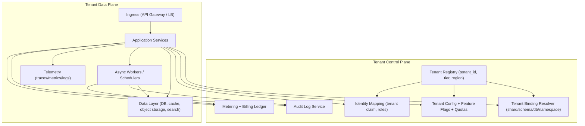

# Adapting a Single-Tenant System to a Multi-Tenant Architecture

## Executive summary

Converting a single-tenant system into a multi-tenant SaaS platform is less about “adding a tenant_id column” and more about building a *repeatable isolation, lifecycle, and governance layer* that can safely scale across customers with different sizes, risk tolerances, and compliance needs. Modern guidance strongly recommends treating multi-tenancy as an architectural spectrum—often implemented as a hybrid where most tenants run pooled/shared, while larger or regulated tenants “graduate” to more isolated footprints. citeturn0search0turn8search6turn9search6turn9search7

A rigorous approach separates the platform into a **tenant control plane** (tenant registry, identity mapping, entitlements/config, metering, lifecycle automation) and a **tenant data plane** (request handling, workflow execution, storage/compute access) so that isolation choices (shared schema vs schema-per-tenant vs database-per-tenant) can be enforced centrally and changed over time with lower risk. This control-plane/data-plane framing is a recurring pattern in SaaS guidance. citeturn0search0turn4search2turn5search0turn8search6

The biggest real-world failure modes are also consistent across primary sources:

- **Cross-tenant data exposure** due to missing object-level and/or property-level authorization and weak tenant-context propagation (a top API risk category). citeturn3search1turn10search1turn10search7turn13search2  
- **Noisy-neighbor and cost blowups** from missing rate limits, quotas, and per-tenant compute governance, especially when tenants share infrastructure. citeturn3search13turn2search6turn2search2turn0search10  
- **Unsafe retries** in onboarding, billing, payments, and provisioning workflows unless idempotency is explicitly designed and verified (including standardization of `Idempotency-Key`). citeturn3search2turn7search1turn7search0turn7search4  

Recommended architecture choices by scale (assuming a typical B2B SaaS with mixed tenant sizes) are:

- **Small tenant counts (roughly ≤50–200 tenants, mostly similar size):** start **pooled** with a **shared schema** plus strong tenant enforcement (database row security where available, plus comprehensive authorization tests), and build the control plane early so you can later “graduate” tenants. citeturn9search6turn0search10turn0search2turn4search2  
- **Medium tenant counts (roughly 200–5,000 tenants, some size variability):** adopt a **bridge/hybrid** model: pooled for most tenants, with **schema-per-tenant** or **database-per-tenant** for high-volume or higher-risk tenants; introduce sharding for pooled tenants when aggregate scale requires it. citeturn0search0turn0search3turn9search0turn9search7  
- **Large tenant counts (5,000+ with a long tail + a few very large tenants):** use **sharded pooled storage** (shared schema inside shards) plus **tier-based isolated tenants** (schema/db/cluster) for top-tier customers; the control plane becomes mandatory to manage routing, metering, observability, and lifecycle at scale. citeturn9search0turn9search6turn4search0turn2search6  

## Tenancy models and isolation strategies

### Tenancy models for relational data

This section compares the three canonical storage tenancy models you requested—shared schema, separate schema, separate database—and links them to isolation “pool/bridge/silo” strategies used in SaaS guidance. citeturn0search0turn8search6turn9search6turn0search10

**Shared schema (row-level tenancy)**  
**Pros:** strongest economies of scale and simplest “one migration for all”; aligns with pooled SaaS operations and rapid iteration. citeturn9search6turn0search10turn0search0  
**Cons:** highest blast radius if an isolation bug exists; higher noisy-neighbor risk; per-tenant cost attribution is harder because infrastructure is shared. citeturn9search6turn0search10turn4search8  
**Implementation options:** app-layer tenant filtering; database-enforced row security (when supported); shared cache and search with tenant-scoped keys/filters. Database-enforced row policies are explicitly supported in PostgreSQL via RLS policies (`CREATE POLICY` + enabling RLS). citeturn0search2turn0search5turn0search16  
**Concrete technical steps:** add `tenant_id` to every tenant-owned table; update all uniqueness constraints to include `tenant_id`; add indexes (often composite) for `(tenant_id, <primary_query_key>)`; ensure caches/search indexes are partitioned by tenant; add automated tests that attempt cross-tenant reads/writes. citeturn0search10turn3search1turn0search2turn9search6  
**Schema/data migration patterns:** use expand–migrate–contract (parallel change) to avoid breaking changes and enable rollback. citeturn7search1turn7search5turn7search33  
**Performance/cost tradeoffs:** best baseline cost; performance depends on good tenant-aware indexing and query patterns; noisy neighbor must be controlled with quotas/rate limits and workload isolation. citeturn9search6turn0search10turn3search13turn2search6  
**Risk mitigation:** defense-in-depth: (1) tenant ID in tokens/claims, (2) application authorization checks, (3) optional DB-level RLS, (4) tenant-labeled telemetry, (5) aggressive automated tests for BOLA/BOPLA. citeturn13search2turn0search2turn3search1turn10search1  

**Separate schema (schema-per-tenant)**  
**Pros:** improved “logical” isolation; tenant-specific restore and purge become easier than in shared schema; reduces accidental cross-tenant joins if schema routing is correct. citeturn0search10turn5search11turn9search6  
**Cons:** schema sprawl; more complex migrations (must be applied per schema) and more operational tooling; connection pooling and query routing must be careful to avoid misbinding tenants. citeturn0search10turn5search11turn4search2  
**Implementation options:** single DB instance with many schemas; schema migration orchestrator; per-tenant schema version metadata table; optionally group smaller tenants into “schema clusters” to cap schema count. Azure’s SaaS tenancy patterns explicitly treat “shared database, separate schemas” as a common model and warn about noisy-neighbor and monitoring limitations in shared compute. citeturn0search10turn0search14  
**Concrete technical steps:** introduce a tenant registry with a “storage binding” (tenant → schema); set and validate the search path / default schema per request; run schema migrations per tenant; build automated drift detection to ensure every tenant schema is at expected version. citeturn4search2turn0search10turn7search5  
**Schema/data migration patterns:** still use expand–migrate–contract, but now orchestrated per schema; you need tooling for retries, idempotency, and reporting per tenant’s migration status. citeturn7search1turn3search2turn4search2  
**Performance/cost tradeoffs:** higher operational cost than shared schema; can reduce query contention across tenants; still shares database compute, so large tenants can affect others unless you isolate compute separately. citeturn0search10turn9search6  
**Risk mitigation:** formalize “tenant binding resolver” with strong validation; canary migrations on a few tenants first; automatic rollback paths via deploy gating and reversible schema steps. citeturn7search0turn7search1turn7search4  

**Separate database (database-per-tenant)**  
**Pros:** strongest data isolation among the three; simplifies per-tenant restore, deletion, and sometimes compliance negotiations because data is physically separated. citeturn9search6turn5search11turn8search1  
**Cons:** highest infrastructure and automation burden; needs strong provisioning/migration automation to avoid operational collapse at scale; pooled database economies are reduced. citeturn9search6turn0search0turn4search2  
**Implementation options:** DB-per-tenant with shared compute pools (common in managed offerings); tenant grouping (DB-per-large-tenant, pooled for small); “account/project-per-tenant” in some cloud approaches. citeturn8search1turn8search0turn9search0  
**Concrete technical steps:** build an automated provisioning pipeline (create DB, apply migrations, create per-tenant DB credentials/roles, configure backups/DR, register binding in tenant registry); implement multi-DB connection routing with safe caching and strong guardrails on credentials. citeturn4search2turn5search1turn9search6  
**Schema/data migration patterns:** apply migrations across N databases with orchestration, health checks, and partial failure handling; use canarying and progressive rollout by tenant cohort. citeturn7search0turn7search4turn7search5  
**Performance/cost tradeoffs:** per-tenant performance predictability is better; cost rises with tenant count; shared pooling features (when available) can reduce cost relative to fully dedicated compute. citeturn8search1turn0search10  
**Risk mitigation:** heavy automation, standardized templates (“golden DB”), strict observability and drift management, and tenant-level runbooks for restore and isolation. citeturn4search2turn5search1turn4search8  

### Isolation levels across data, compute, and network

Isolation is multi-dimensional: you can mix-and-match stronger **data isolation** with pooled **compute** or vice-versa, which is the essence of bridge/hybrid patterns. citeturn0search0turn0search3turn9search7

**Data isolation**  
Implementation options range from shared schema with RLS policies to schema-per-tenant to DB-per-tenant; RLS is first-class in PostgreSQL and can enforce tenant filters at the database boundary (`ENABLE ROW LEVEL SECURITY`, `CREATE POLICY`). citeturn0search2turn0search5turn0search16  
Performance/cost: shared schema is cheapest but requires robust guardrails; DB-per-tenant is most expensive but simplifies restores/deletion. citeturn9search6turn0search10turn5search11  

**Compute isolation**  
Compute isolation often maps tenants to resource boundaries. In Kubernetes multi-tenancy guidance, mapping tenants to namespaces allows using ResourceQuota to prevent one tenant monopolizing cluster resources. citeturn2search6turn2search2turn2search34  
Provider notes: managed Kubernetes SaaS architectures explicitly discuss choices for hosting SaaS workloads and the tradeoffs among shared vs isolated compute footprints. citeturn0search15turn2search6  

**Network isolation**  
At the cluster level, Kubernetes NetworkPolicies can restrict pod-to-pod traffic; network policy enforcement is commonly used to implement tenant-per-namespace isolation. citeturn2search3turn2search35turn2search6  
Performance/cost: stricter network segmentation can add operational complexity and policy management overhead, but reduces blast radius from lateral movement. citeturn2search35turn2search6turn9search7  

image_group{"layout":"carousel","aspect_ratio":"16:9","query":["multi-tenant pooled vs silo vs bridge model diagram","shared schema vs schema per tenant vs database per tenant diagram","Kubernetes multi-tenancy namespace quota network policy diagram","row level security tenant_id policy diagram"],"num_per_query":1}

### Comparative table of tenancy models

The following comparative ratings synthesize the tradeoffs described in SaaS architecture guidance (pool/silo/bridge), Azure’s SaaS database patterns, and data isolation guidance. citeturn9search6turn0search10turn5search11turn8search6  

| Model | Isolation strength (data) | Blast radius | Noisy-neighbor risk | Ops complexity | Scalability with tenant count | Typical “best fit” |
|---|---|---|---|---|---|---|
| Shared schema | Medium (needs strong enforcement) | Highest | Highest | Lowest | Highest | Early-stage SaaS, homogeneous tenants |
| Separate schema | Medium–High | Medium | Medium | Medium–High | Medium | Mixed needs; easier per-tenant restore/purge |
| Separate database | Highest | Lowest | Low–Medium | Highest | Medium (requires automation) | Regulated or very large tenants; per-tenant restore/DR SLAs |

## Tenant-aware identity, authentication, and authorization

### Tenant-aware identity and SSO

Multi-tenant systems need to bind **user identity** to **tenant context**; a common pattern is embedding a tenant identifier claim into tokens so services can enforce tenant scoping without extra lookups, while still supporting tenant switching by issuing a new token for the chosen tenant. citeturn13search2turn13search0turn13search6turn10search3  

**Pros:** consistent tenant context propagation; avoids repeated calls to a tenant directory service on every request; simplifies per-tenant policy enforcement when claims are trustworthy. citeturn13search2turn10search3turn13search6  
**Cons:** mistakes in federation/claim issuance become high impact (tenant misbinding); token bloat and claim lifecycle complexity; multi-tenant user access (one user in many tenants) requires careful “active tenant” semantics. citeturn13search0turn13search2turn13search3  

**Implementation options:**  
- Rely on standards-based authentication/authorization (OAuth 2.0 + OpenID Connect). citeturn1search0turn1search1turn13search0  
- Support enterprise provisioning and lifecycle automation using SCIM schema + protocol (RFC 7643/7644). citeturn1search2turn12search0turn12search2  
- Use bearer tokens over TLS as defined in OAuth 2.0 bearer token usage (RFC 6750), with strict controls to prevent token leakage. citeturn10search3turn10search4  

**Concrete technical steps:**  
- Create a **tenant directory** in your control plane: `tenants`, `tenant_users`, `tenant_memberships`, `tenant_idp_configs` (SSO metadata, domains, SCIM endpoints/secrets). citeturn4search2turn13search0turn12search0  
- Implement tenant resolution and tenant switching: ensure the identity layer can issue tokens containing the correct tenant claim and role for the selected tenant. citeturn13search2turn13search0  
- Treat federation configuration as sensitive: build guardrails that prevent an IdP misconfiguration from granting access to unintended tenants. citeturn13search3turn13search0  

### Authorization model: RBAC, ABAC, and object-level enforcement

Multi-tenancy does not replace authorization; it *amplifies* authorization requirements. OWASP’s API Top 10 identifies Broken Object Level Authorization (BOLA) and Broken Object Property Level Authorization (BOPLA) as key API risk categories, directly applicable to tenant isolation failures (e.g., accessing another tenant’s invoice by ID, or modifying a sensitive `role` field). citeturn3search1turn10search1turn10search7turn10search6  

**RBAC (role-based access control)**  
RBAC is widely formalized in NIST models and standards work and is most effective when you can define stable roles like `tenant_admin`, `billing_admin`, `editor`, `viewer`. citeturn11search6turn11search5turn11search1  
**Pros:** simple mental model; permission audits are straightforward. citeturn11search6turn13search1  
**Cons:** role explosion when you need nuanced policies (regional, contract-based, resource-scoped). citeturn11search6turn13search1  

**ABAC (attribute-based access control)**  
NIST defines ABAC as evaluating subject/object/action/environment attributes against policies to grant/deny. citeturn1search15turn1search3  
**Pros:** handles complex, context-aware rules (e.g., `region`, `data_classification`, `tenant_tier`, `time`). citeturn1search15turn13search1  
**Cons:** policy debugging complexity; requires disciplined attribute taxonomy and auditability. citeturn1search15turn13search2  

**Concrete technical steps (authorization hardening):**  
- Enforce tenant + object authorization on every endpoint that takes an object ID (BOLA), and enforce property-level shaping to avoid over-exposure or mass assignment (BOPLA). citeturn10search7turn10search1turn3search1  
- Use immutable identifiers for tenant and principal mapping for auditability (avoid “email as identity”). citeturn13search0turn13search2  
- Decide where authorization data lives: in IdP claims vs application DB; Azure guidance explicitly calls out both options and the token-claim approach as common. citeturn13search2turn13search0  

**Migration patterns:** authorization migration usually follows expand–migrate–contract: introduce tenant-aware roles/claims while still honoring legacy permissions; migrate tenants gradually; then delete legacy checks. citeturn7search1turn13search2turn7search4  

**Performance/cost tradeoffs:** claims-based authorization reduces per-request DB lookups, but increases token issuance complexity and risk if claims are wrong; caching policy decisions must be tenant-scoped. citeturn13search2turn10search3turn9search6  

**Risk mitigation:** intensive authorization testing (including negative tests that attempt cross-tenant object access), plus tenant-aware audit logs and anomaly detection for suspicious access patterns. citeturn10search7turn14search0turn13search2  

## Data partitioning, migration, and tenant lifecycle

### Data partitioning and migration strategies

When adapting a single-tenant DB to multi-tenant, the central choice is whether you:  
1) add tenant boundaries *within* the same tables (shared schema),  
2) create per-tenant schemas, or  
3) create per-tenant databases. citeturn0search10turn9search6turn5search11  

**Pros/cons summary:** shared schema minimizes operational overhead but increases isolation risk; per-tenant DB maximizes isolation but demands automation. This is explicitly reflected in pooled vs silo tradeoffs (cost efficiency vs blast radius/noisy neighbor). citeturn9search6turn9search7turn0search10  

**Implementation options and concrete steps (shared schema baseline):**  
- Introduce a **tenants table** and assign the existing data to a “default tenant” (or map to new tenants via business rules). citeturn4search2turn13search0  
- Add `tenant_id` columns (nullable first), backfill, then enforce `NOT NULL`, and finally enforce RLS if you choose DB-level enforcement (supported via `ALTER TABLE ... ENABLE ROW LEVEL SECURITY` and `CREATE POLICY`). citeturn7search1turn0search2turn0search5turn0search16  
- Rewrite unique constraints to include tenant scope; otherwise, onboarding a second tenant can break on conflicts (e.g., `users.email`). citeturn0search10turn5search11  

**Migration script patterns:** use **parallel change (expand–migrate–contract)** to avoid downtime and preserve rollback options: expand schema in a backwards-compatible way, migrate data and dual-write, then contract by removing old fields/paths. citeturn7search1turn7search33turn7search5  

**Performance and cost tradeoffs:**  
- Shared schema performance depends heavily on tenant-aware indexing and query patterns; otherwise large tenants dominate IO/CPU. citeturn0search10turn9search6  
- Schema-per-tenant can reduce accidental cross-tenant joins but increases migration overhead. citeturn5search11turn0search10  
- DB-per-tenant improves targeted restore and blast radius but tends to raise baseline costs; pooling mechanisms can mitigate some cost (e.g., pooled database resources and “scale to thousands”). citeturn8search1turn0search10turn9search6  

**Risk mitigation:** canary migrations on a subset of tenants before broad rollout; full data consistency checks; migration idempotency; and pre-defined failure modes and rollback steps. citeturn7search0turn3search2turn7search4  

### Tenant onboarding and offboarding workflows

AWS SaaS guidance emphasizes tenant onboarding as an orchestrated process that should be frictionless, repeatable, and initiated either by the tenant or provider. citeturn4search2turn4search5  

**Pros (automation-first):** consistent deployments; reduced human error; ability to support multiple isolation tiers by provisioning different footprints. citeturn4search2turn9search0turn9search7  
**Cons:** onboarding becomes a distributed transaction that needs idempotency, auditability, and good failure handling; mistakes can produce orphaned resources and security gaps. citeturn3search2turn14search0turn5search1  

**Implementation options:**  
- Single pooled onboarding: create tenant row + config + identities only. citeturn4search2turn13search2  
- Hybrid onboarding: optionally provision dedicated schema/DB/namespace/keys for premium tenants. citeturn9search0turn2search6turn6search0turn5search11  
- Cloud-specific “project/account per tenant” patterns (stronger isolation): for example, guidance exists to provision tenant resources into separate projects to separate IAM policies/quotas/network configs and improve cost tracking. citeturn8search0turn8search8  

**Concrete technical steps:**  
- Onboard: create tenant → configure identity mapping → allocate storage binding (shared shard / schema / DB) → seed config and entitlements → set quotas/rate limits → run smoke tests → activate tenant. citeturn4search2turn13search0turn2search6turn3search13  
- Offboard: suspend tenant (stop writes) → export data if required → rotate/revoke keys → purge or tombstone data per retention obligations → delete tenant resources and credentials → preserve audit logs per policy. citeturn5search1turn3search0turn14search0turn4search12  

**Migration patterns:** to convert existing customers into tenants, run onboarding “in reverse”: create tenant records and bindings, then map existing user accounts and data to tenants; this often needs SCIM-based lifecycle migration for enterprise customers. citeturn12search0turn13search0turn7search1  

**Performance/cost tradeoffs:** automated provisioning adds control-plane load; you may need async provisioning and progressive activation to avoid “onboarding storms.” citeturn4search2turn13search1  

**Risk mitigation:** mandatory idempotency keys for onboarding steps (create tenant, create DB, create schema, create keys), plus compensating actions and detailed audit trails. citeturn3search2turn7search4turn14search0  

### Configuration management and customization per tenant

A core SaaS principle is operating a single product while meeting tenant variation needs via configuration, not forks. AWS SaaS guidance explicitly describes solving customization needs through feature flags and tenant configuration rather than separate versions. citeturn9search1turn9search4turn0search0  

**Pros:** single codebase; faster releases; safer operations. citeturn9search1turn7search8  
**Cons:** configuration sprawl; risk of complex interactions and hard-to-reproduce bugs; increased need for tenant-aware testing matrices. citeturn9search4turn7search3  

**Implementation options:**  
- Store per-tenant configuration in a central config store with tenant key prefixes (guidance exists for tenant-specific key prefixing and caching). citeturn9search11turn9search1  
- Separate configuration stores per tenant when required for CMK separation or stronger config access isolation (explicitly described as an option). citeturn9search11turn6search0turn6search2  

**Concrete technical steps:**  
- Define a configuration layering model: global defaults → tier defaults → tenant overrides → environment overrides. citeturn9search1turn9search0turn9search11  
- Implement configuration caching in-app to avoid per-request config fetches (explicitly recommended for multitenant config stores). citeturn9search11turn2search16  
- Treat configuration changes as deployable artifacts with versioning and audit trails (tie into rollback workflows). citeturn7search4turn7search8turn5search1  

**Migration patterns:** onboard tenants with default config snapshots; use expand–migrate–contract for config keys (add new keys, migrate consumers, remove old keys). citeturn7search1turn9search11  

**Performance/cost tradeoffs:** centralized config lowers cost but needs strong access controls; per-tenant stores increase cost and operational load but improve isolation. citeturn9search11turn6search0turn6search2  

**Risk mitigation:** strict schema validation for config; safe rollout (canary by tenant cohort); immediate rollback to prior config version. citeturn7search0turn9search11turn7search4  

## Metering, observability, backup/DR, and security/compliance

### Billing and usage metering per tenant

SaaS guidance distinguishes metering (tenant usage collection for billing) from broader metrics, emphasizing that shared infrastructure makes per-tenant attribution harder—especially in pooled models. citeturn4search0turn9search6turn4search8  

**Pros (tenant-level metering):** enables correct billing, cost-per-tenant analysis, and capacity planning. citeturn4search0turn4search8  
**Cons:** high cardinality and data-model complexity; the system must handle late/duplicate events and be robust to partial failures. citeturn4search0turn3search2  

**Implementation options:**  
- Event-based metering pipeline (emit “usage events” from services). citeturn4search0turn4search8  
- Cost allocation/chargeback models using tagging + tenant consumption approximations. citeturn4search8turn4search1turn4search14  

**Concrete technical steps:**  
- Define a canonical **usage event schema** (tenant_id, metric_name, quantity, timestamp, idempotency_key, dimensions). citeturn4search0turn3search2turn2search16  
- Make usage ingestion idempotent (dedupe by event ID + tenant) and reconcile periodically for correctness. citeturn3search2turn7search4  
- Align pricing models with measurable events (Azure guidance explicitly covers the importance of aligning pricing and technical design in multitenant solutions). citeturn4search12turn4search35  

**Performance/cost tradeoffs:** metering adds write volume and storage; per-tenant aggregation reduces query overhead but increases pipeline complexity. citeturn4search0turn4search8  

**Risk mitigation:** backpressure and quotas to avoid metering DoS; secure handling of 3rd-party billable integrations (OWASP unrestricted resource consumption). citeturn3search13turn3search1  

### Monitoring, logging, and observability per tenant

Modern observability is commonly built on standardized traces/metrics/logs with correlation and context propagation. citeturn2search16turn2search1turn2search4  

**Pros:** tenant-level SLOs, faster incident triage, accurate chargeback, and isolation debugging. citeturn4search8turn2search16  
**Cons:** tenant labels increase telemetry cardinality and cost; strict governance is needed to avoid exposing sensitive tenant identifiers in logs. citeturn2search0turn4search12turn14search0  

**Implementation options:**  
- Distributed tracing using W3C Trace Context (`traceparent`, `tracestate`). citeturn2search1turn2search13  
- Context propagation of tenant metadata via baggage (with careful limits and no secrets). citeturn2search0turn2search8  
- Logging that supports correlation across signals (OpenTelemetry logs spec describes correlation foundations). citeturn2search4turn2search16  

**Concrete technical steps:**  
- Standardize a **tenant context contract**: every request and event resolved to `{tenant_id, tenant_tier, region}`. citeturn13search2turn9search0turn2search0  
- Ensure every span/metric/log includes tenant labels (or is joined with tenant labels at aggregation time) and build tenant dashboards and alerts. citeturn2search16turn4search8  
- Prevent cross-tenant cache pollution by ensuring cache keys include tenant scope (a practical requirement repeatedly emphasized in multi-tenant guidance and aligns with OWASP authorization guidance). citeturn9search6turn3search1turn10search7  

**Performance/cost tradeoffs:** high-cardinality tenant labels can be expensive; mitigate via sampling, aggregation, and tier-based observability levels (more detail for premium tenants). citeturn2search16turn9search0turn4search12  

**Risk mitigation:** log redaction/PII controls; strict access controls on tenant-level dashboards; “audit who queried logs” where feasible. citeturn14search0turn3search0turn13search2  

### Backup/restore and disaster recovery per tenant

Disaster recovery planning revolves around explicit RPO/RTO targets and routinely tested restore procedures; guidance emphasizes “regularly test restores” and tailor backup strategies per service. citeturn5search1turn5search12turn5search2  

**Pros (tenant-scoped recovery):** meets contractual needs; enables targeted recovery without impacting all tenants (especially in silo models). citeturn9search6turn5search1  
**Cons:** tenant-scoped restore is hard in pooled shared-schema systems; can require complex selective restore or logical replay. citeturn9search6turn0search10turn5search3  

**Implementation options:**  
- Shared schema: rely on full-system PITR with additional logical export/import tooling for tenant-level restores (complex). citeturn5search3turn9search6  
- Schema-per-tenant: restore per schema if tooling supports it; otherwise restore whole DB and extract tenant schema. citeturn5search11turn5search3  
- DB-per-tenant: straightforward per-tenant snapshot/restore and PITR; easiest to satisfy tenant-specific RPO/RTO. citeturn9search6turn5search17turn5search1  

**Concrete technical steps:**  
- Define per-tenant RPO/RTO classes by tier; ensure backups/replication align to tiers. citeturn9search0turn5search12turn5search1  
- Implement scheduled restore drills and document results (explicitly recommended). citeturn5search1turn5search12  
- Where using PostgreSQL, ensure WAL archiving / continuous archiving is configured and tested for PITR. citeturn5search3  

**Performance/cost tradeoffs:** stronger RPO/RTO generally costs more (replication, storage, multi-region standby). citeturn5search12turn5search1  

**Risk mitigation:** treat restore as a first-class tested product feature; for pooled models, document contractual limits clearly and offer “graduation” to more isolated tiers for strict restore needs. citeturn9search0turn9search6turn4search12  

### Security and compliance implications

**Encryption and key management**  
Key management guidance emphasizes lifecycle best practices; strong multi-tenant posture often requires per-tenant key separation for higher tiers. citeturn3search0turn6search0turn6search2  

**Pros (per-tenant keys for sensitive tenants):** limits blast radius; supports customer-managed key requirements and clearer compliance boundaries. citeturn6search0turn6search2turn9search11  
**Cons:** higher cost and operational complexity (key rotation, access policies, incident response). citeturn6search0turn3search0  

**Implementation options:**  
- Use envelope encryption concepts (DEK wrapped by KEK) supported in major KMS offerings; this is documented as a standard approach in cloud KMS guidance. citeturn6search8turn6search31turn3search0  
- Offer CMK or tenant-dedicated KMS keys for premium tiers; AWS KMS customer managed keys explicitly emphasize lifecycle control and note an ongoing monthly cost. citeturn6search0turn9search0  

**Concrete technical steps:**  
- Define a key hierarchy per tenant tier (platform key for pooled, optional per-tenant KEK for premium). citeturn3search0turn6search2turn6search0  
- Implement key rotation and decommission workflows aligned with offboarding and data retention. citeturn3search0turn5search1  

**Audit logging**  
Auditability is essential in multi-tenant environments; cloud audit-log services are explicitly framed as answering “who did what, where, and when.” citeturn14search0turn14search5turn6search7  

**Concrete technical steps:**  
- Produce tenant-scoped application audit logs (auth events, admin actions, data exports, key changes). citeturn13search2turn14search0  
- Ensure control-plane actions are captured via cloud provider audit logs (control plane events are captured in Azure Monitor Activity Log; Google Cloud Audit Logs cover admin/data access categories). citeturn14search5turn14search0  

**Risk mitigation:** adopt OWASP API protections (BOLA/BOPLA testing, rate limits, secure defaults) and treat tenant isolation as a “never fail” control with layered defenses. citeturn3search1turn10search1turn3search13turn9search6  

## Operationalization, scaling, and rollout safety

### Operational impacts: CI/CD, testing, scaling, and cost

Pooled SaaS increases blast radius, so release engineering must be disciplined: canarying reduces deployment risk by testing with a small slice of production traffic before full rollout. citeturn7search0turn7search4turn7search8  

**Pros (strong multi-tenant ops discipline):** faster releases with lower incident rates; predictable tenant experience; ability to manage all tenants “through one pane of glass” (core SaaS benefit). citeturn9search6turn7search8turn4search2  
**Cons:** test matrix expands dramatically (tenancy models, tiers, regions, configs); performance testing must consider noisy neighbor scenarios. citeturn0search10turn7search3turn2search6  

**Implementation options:**  
- Canary releases for application changes; progressive deployment by tenant cohort. citeturn7search0turn7search4  
- Tenant-aware load testing and reliability testing (multi-tenant load testing guidance exists in platform best practices). citeturn7search3turn2search6  
- Strong resource governance: for Kubernetes, map tenants to namespaces and enforce ResourceQuota. citeturn2search6turn2search2  

**Concrete technical steps:**  
- Build a “tenant test harness”: generate synthetic tenants, seed data, run isolation tests, and execute performance profiles per tenant tier. citeturn2search6turn3search1turn0search10  
- Implement cost-per-tenant reporting: combine tenant usage signals with cloud cost analytics (SaaS guidance describes approximation models for cost per tenant in pooled setups). citeturn4search14turn4search8turn4search0  

### Rollback and rollback testing

Rollbacks in multi-tenant systems are harder because changes affect many tenants; consequently, you need rollback as a designed capability, not an emergency improvisation. citeturn7search4turn7search0turn7search33  

**Pros (explicit rollback design):** reduced outage duration; safer experimentation; supports continuous delivery with lower risk. citeturn7search4turn7search0  
**Cons:** requires discipline in schema design, backward compatibility, and feature flag hygiene; may require dual-write and migration windows. citeturn7search1turn7search5turn9search1  

**Implementation options:**  
- **Parallel change (expand–migrate–contract)** for schema and API evolution, explicitly framed by Martin Fowler as a safe approach for backward-incompatible interface changes. citeturn7search1turn7search33  
- **Feature flags** for tenant-level enablement and staged activation; SaaS guidance explicitly describes associating flags with tenant configuration options. citeturn9search1turn9search4  
- **Canary releases** for code/config changes. citeturn7search0turn7search4  

**Concrete technical steps:**  
- Every schema migration must be reversible until the contract phase; maintain forward and backward compatibility during the migrate window. citeturn7search1turn7search5  
- Practice rollback drills: treat rollback like DR—execute it regularly using production-like environments and tenant cohorts. citeturn5search1turn7search4  
- Use idempotency keys for side-effectful APIs/workflows so retries and rollbacks do not double-apply business actions. citeturn3search2turn7search4  

**Risk mitigation:** define “rollback boundaries” (what can be rolled back instantly vs only via forward fix), and couple canarying with enhanced telemetry so rollback triggers quickly when canary signals degrade. citeturn7search0turn2search16turn7search4  

## Reference architectures, diagrams, and implementation snippets

### Recommended architectures by tenant scale and tenant mix

This table synthesizes SaaS guidance on pool/silo/bridge models and tier-based isolation, plus database tenancy model guidance emphasizing noisy-neighbor and isolation tradeoffs. citeturn0search0turn9search6turn9search0turn0search10  

| Scenario | Recommended storage tenancy | Compute/network approach | Why this is the best default | “Graduation” triggers |
|---|---|---|---|---|
| Small tenant count, similar sizes | Shared schema (pooled) | Shared compute, quotas | Lowest ops complexity; fast iteration; pooled efficiency citeturn9search6turn0search10 | Compliance request; sustained noisy neighbor; tenant-specific restore SLA citeturn9search6turn5search1 |
| Medium count, mixed sizes | Bridge/hybrid: pooled + schema/db for big tenants | Namespaces/quotas; selective dedicated workers | Matches tier-based isolation patterns in SaaS practice citeturn9search0turn9search7 | High-volume tenants; CMK requirement; region/data residency needs citeturn9search0turn8search0turn9search11 |
| Large count, long tail + a few huge | Sharded pooled + silo for largest/regulated | Multi-cluster or strong quota domains; network policy isolation | Scales tenant count and keeps per-tenant ops manageable citeturn2search6turn9search6turn4search8 | Regional expansion; regulatory segmentation; cost-per-tenant anomalies citeturn4search8turn5search12 |

### Mermaid diagram: control plane and data plane reference architecture



### Mermaid diagram: tenant lifecycle onboarding and offboarding

```mermaid
flowchart LR
  START["Sign-up / Sales Provisioning"] --> CREATE["Create tenant record + tier"]
  CREATE --> IDP["Configure identity: tenant claim, SSO, SCIM (optional)"]
  IDP --> STORAGE["Allocate storage binding: shard/schema/db"]
  STORAGE --> KEYS["Configure encryption keys + secrets references"]
  KEYS --> CONFIG["Seed tenant config, flags, quotas"]
  CONFIG --> SMOKE["Tenant smoke test"]
  SMOKE --> ACTIVE["Activate tenant (allow traffic)"]

  ACTIVE --> SUSPEND["Suspend (stop writes)"]
  SUSPEND --> EXPORT["Optional export / archive"]
  EXPORT --> PURGE["Purge or tombstone per retention policy"]
  PURGE --> REVOKE["Revoke credentials + rotate keys"]
  REVOKE --> DELETE["Delete tenant resources + finalize billing"]
```



### Sample tenant onboarding API endpoints

The following example endpoints assume the control plane owns onboarding and returns an immutable `tenant_id` plus a storage binding. These endpoints should be idempotent (use `Idempotency-Key`) to safely handle retries, consistent with the IETF draft standardization of idempotency keys for non-idempotent methods. citeturn3search2turn3search6  

```http
POST /v1/tenants
Idempotency-Key: 9b65e7a2-9e0e-4c9f-9c4d-7f0a6b2f6f9a
Content-Type: application/json

{
  "display_name": "Acme Corp",
  "tier": "standard",
  "primary_region": "eu-west",
  "requested_isolation": "pooled", 
  "billing_account_ref": "acct_123",
  "admin_email": "admin@acme.example"
}
```

```http
201 Created
Content-Type: application/json

{
  "tenant_id": "tnt_01J3K9V8N5ZQ7Z6H2R0B1C2D3E",
  "status": "provisioning",
  "binding": { "mode": "shared_schema", "shard": "shard_03" },
  "links": {
    "activate": "/v1/tenants/tnt_01J3K9V8N5ZQ7Z6H2R0B1C2D3E:activate",
    "sso": "/v1/tenants/tnt_01J3K9V8N5ZQ7Z6H2R0B1C2D3E/sso",
    "config": "/v1/tenants/tnt_01J3K9V8N5ZQ7Z6H2R0B1C2D3E/config"
  }
}
```

Additional recommended endpoints:

```http
POST /v1/tenants/{tenant_id}:activate
POST /v1/tenants/{tenant_id}:suspend
POST /v1/tenants/{tenant_id}:resume
POST /v1/tenants/{tenant_id}:offboard
GET  /v1/tenants/{tenant_id}/usage?from=...&to=...
GET  /v1/tenants/{tenant_id}/audit?from=...&to=...
POST /v1/tenants/{tenant_id}:migrate-isolation   (shared->schema or schema->db)
```

### Example SQL migration snippets

These examples illustrate the shared-schema migration pattern and optional database-enforced row isolation using PostgreSQL row-level security, following documented RLS enablement and policy creation patterns. citeturn0search2turn0search5turn0search16  

**Expand: add tenant table and tenant_id columns (nullable first)**

```sql
-- Control plane table
CREATE TABLE tenants (
  tenant_id uuid PRIMARY KEY,
  display_name text NOT NULL,
  tier text NOT NULL,
  created_at timestamptz NOT NULL DEFAULT now()
);

-- Example tenant-owned table migration
ALTER TABLE orders
  ADD COLUMN tenant_id uuid;

CREATE INDEX idx_orders_tenant_created_at
  ON orders (tenant_id, created_at);
```

**Migrate: backfill existing rows to a default tenant and enforce NOT NULL**

```sql
-- Create a default tenant for legacy data
INSERT INTO tenants (tenant_id, display_name, tier)
VALUES ('00000000-0000-0000-0000-000000000000', 'legacy-default', 'standard');

-- Backfill
UPDATE orders
SET tenant_id = '00000000-0000-0000-0000-000000000000'
WHERE tenant_id IS NULL;

-- Contract: enforce non-null after application dual-write is deployed
ALTER TABLE orders
  ALTER COLUMN tenant_id SET NOT NULL;
```

**Optional: enforce RLS (row-level security) for tenant isolation**

```sql
ALTER TABLE orders ENABLE ROW LEVEL SECURITY;

-- Assumes application sets app.current_tenant per session/transaction
CREATE POLICY orders_tenant_isolation
  ON orders
  USING (tenant_id = current_setting('app.current_tenant')::uuid)
  WITH CHECK (tenant_id = current_setting('app.current_tenant')::uuid);
```

### Provider-specific notes (AWS, Azure, GCP)

- entity["company","Amazon Web Services","cloud services provider"]: SaaS guidance formalizes pool/silo/bridge patterns and explicitly discusses tenant onboarding, tenant tiers, metering/billing, and isolation tradeoffs—including noisy neighbor and blast radius in pooled models and tier-based isolation. citeturn0search0turn4search2turn9search6turn9search0  
- entity["company","Microsoft Azure","cloud platform"]: Azure architecture guidance covers SaaS/multitenant solution architecture, multitenant identity considerations, multitenant data/storage approaches, and cost/billing management; Azure SQL patterns discuss tenancy models and explicitly warn about noisy neighbor risks in shared databases. citeturn4search12turn13search0turn5search11turn0search10  
- entity["company","Google Cloud","cloud platform"]: documented approaches include tenant resource compartmentalization and project-per-tenant strategies (e.g., recommending provisioning tenant resources in separate projects to separate IAM/network/quotas and improve cost tracking) and detailed audit logging guidance describing “who did what, where, and when.” citeturn8search0turn8search8turn14search0turn5search12  

### Closing risk checklist (cross-cutting)

This checklist condenses the most important mitigations across dimensions, grounded in the cited primary guidance:

- Enforce tenant isolation at multiple layers (token tenant claim + app authorization + optional DB RLS). citeturn13search2turn0search2turn9search6  
- Treat BOLA/BOPLA protections and tests as release blockers. citeturn10search7turn10search1turn3search1  
- Add per-tenant quotas and rate limits to prevent resource consumption attacks and noisy neighbors. citeturn3search13turn2search6turn0search10  
- Make onboarding, billing, and provisioning idempotent with `Idempotency-Key`. citeturn3search2turn3search6turn7search4  
- Design for rollback: canary releases plus expand–migrate–contract for schema evolution and feature flags for staged enablement. citeturn7search0turn7search1turn9search1turn7search4  
- Test restores regularly and document RPO/RTO by tenant tier. citeturn5search1turn5search12turn9search0  
- Implement tenant-scoped auditability and ensure cloud control-plane events are captured and retained appropriately. citeturn14search0turn14search5turn6search7