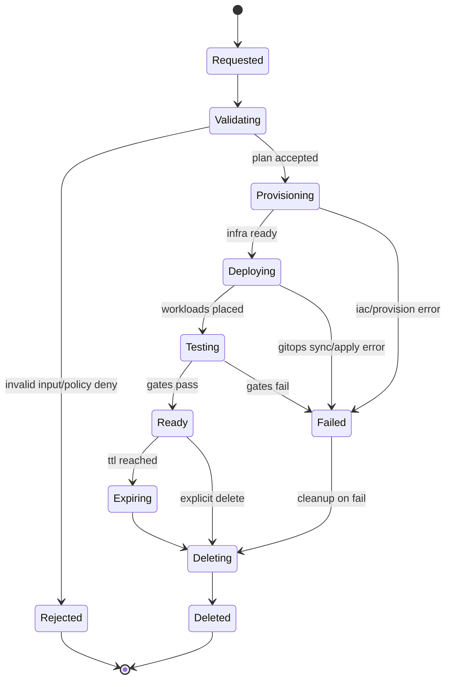
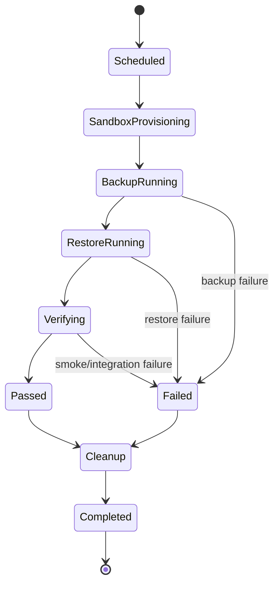
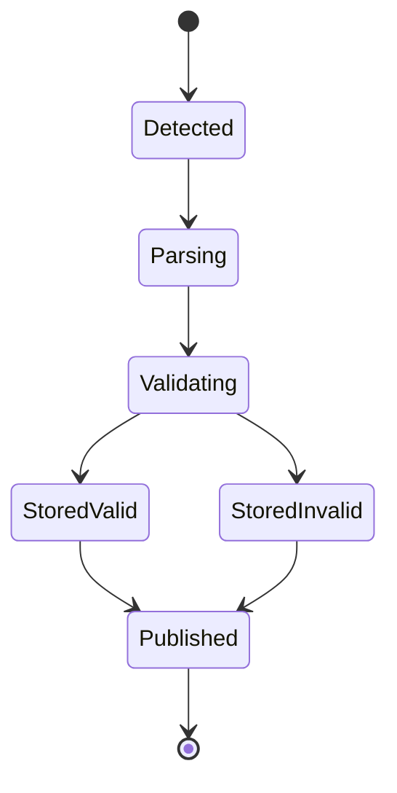
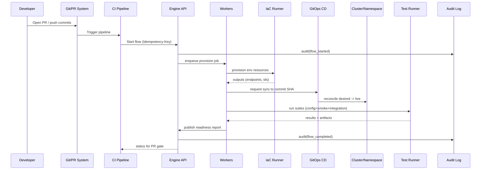

# Extending the Engine to Support the CI/CD and DevOps Flow Creation in the 19-* Documents

## Executive summary

The 19-* materials you attached describe a single, end-to-end “platform control plane” flow that unifies **inventory (system map/CMDB), standardized component profiles, environment creation (local + ephemeral + cloud), config/secrets governance, automated verification gates, and backup/restore drills with auditability**. fileciteturn0file0 fileciteturn0file1

To extend **your engine** to *create and run* this flow rigorously (not just document it), the engine must treat platform operations as **durable, auditable state machines** driven by events (PR opened/closed, merges, schedules, manual triggers) and executed by a worker fleet with strict **idempotency, retries, timeouts, compensation**, and **concurrency controls**. The core technical consequence is that “flow creation” is not merely UI/DSL—your runtime must reliably orchestrate long-running, failure-prone, multi-system operations (IaC provisioning, GitOps sync, integration tests, datastore backups/restores) while maintaining a consistent workflow state and producing verifiable artifacts (readiness reports, DR drill results). fileciteturn0file0

A pragmatic architecture (aligned with your docs) is:
- **Catalog + descriptors-as-code** (Backstage-style entity descriptors, e.g., `catalog-info.yaml`) feeding a queryable inventory model. fileciteturn0file0 citeturn0search0turn0search16turn0search20  
- **GitOps reconciliation** (e.g., Argo CD’s “desired vs live state” and `OutOfSync` model) to standardize “deploy” behavior across environments. citeturn0search5  
- **Environment factory** that provisions infra (Terraform/Pulumi state-driven) and then deploys workloads (Helm/Kustomize), with ephemeral environments isolated via namespaces or clusters. fileciteturn0file0 citeturn1search0turn1search1turn2search0turn2search1turn5search0  
- **Policy + validation** (OPA/Gatekeeper admission + config-time policy evaluation) to enforce “sensitive routing”, region restrictions, and logging requirements. fileciteturn0file0 citeturn1search3turn1search15turn1search7  
- **Durable orchestration patterns** (transactional outbox, saga compensation, idempotent APIs) to make provisioning/test/backup flows safe under retries and partial failures. citeturn4search19turn4search1turn4search2  
- **Unified observability pipeline** using an entity["organization","OpenTelemetry","observability framework"] Collector-style model to receive/process/export telemetry across the control plane and workflows. citeturn0search2turn0search6  
- **Backup and restore drills** modeled after entity["organization","Velero","k8s backup restore"]’s split of “metadata in object storage + PV snapshots/backups,” plus datastore-specific backup/restore adapters. citeturn0search3

Assumptions and scope caveat: only two 19-* documents are available in this conversation (the checklist and the deep research doc). If other 19-* documents and the “project’s basic prompt and sources” exist elsewhere, this report should be treated as a **complete design for 19-CI/CD/DevOps flow**, but a **partial synthesis** of the broader 19-* set. fileciteturn0file0 fileciteturn0file1

## Scope, assumptions, and a consolidated reading of the 19-* flow

The documents specify a target “done” state with these capabilities:
- A unified inventory (“system map/CMDB”) spanning runtimes, datastores, vector/RAG, queues/eventing, model providers, CI/CD systems, artifact registries, observability, and security. fileciteturn0file1  
- Standardized **component profiles** capturing ownership, criticality, endpoints, auth methods, config/secrets sources, dependencies, data classification/retention, backup requirements (RPO/RTO), test coverage, runbooks, and cost tags. fileciteturn0file1  
- An **environment factory** producing local (Windows Desktop Kubernetes), ephemeral (per PR/branch), and cloud environments; local profiles like `local-lite`, `local-full`, `local-sensitive`. fileciteturn0file1  
- A normalized CI/CD “contract” sequence (build → tests → scans → package → deploy ephemeral → integration tests → promote/rollback). fileciteturn0file1  
- A provider abstraction layer (queue/vector/graph/model/document store) so environments/tenants can swap providers without changing business logic. fileciteturn0file1  
- Automated verification gates: schema validation, secrets validation, connectivity validation, policy validation, smoke/integration/performance checks, and readiness reports. fileciteturn0file1  
- Backup + automated restore drills with audit logs and readiness evidence. fileciteturn0file1  

### Technical assumptions explicitly treated as unknown (with options)
Because your engine’s current internals and deployment targets are unspecified, this report assumes:
- The engine can be extended with **plugins/adapters** and can persist workflow state in a database (or can be modified to do so).
- Environments may be entity["organization","Kubernetes","container orchestration"]-based (strongly implied by the local/ephemeral Kubernetes emphasis), but some workloads may be VM/IIS/SaaS-integrations (your docs mention heterogeneous runtimes). fileciteturn0file1  
- Authentication should support both humans and automation; recommended options are OAuth 2.0 + OIDC (for SSO) and workload identities/mTLS for service calls. citeturn3search2turn3search3  

If any of these assumptions are wrong, the designs below still hold conceptually, but you’d choose different adapters (e.g., VM provisioner vs Kubernetes provisioner).

## Flow decomposition: entities, states, events, transitions, I/O, timing constraints, error states, and persistence

This section is written as an “engine-facing contract”: what your engine must *model*, not just what the platform must *do*.

### Canonical flow entities

The flow described in the 19-* documents becomes much easier to implement if you separate **engine-level entities** (generic workflow machinery) from **domain entities** (catalog, environments, policies, tests, backups). fileciteturn0file0

**Engine-level entities (must exist for flow creation to be safe and repeatable):**
- **FlowDefinition**: versioned definition of a flow (DAG/state machine), including step schemas and required permissions.
- **FlowInstance**: a single execution of a FlowDefinition, bound to a trigger (PR, schedule, manual).
- **StepDefinition / StepRun**: each step’s typed input/output, retries, timeouts, compensation logic.
- **EventInbox**: deduplicated intake of external events (webhooks, schedules, user actions).
- **Artifact**: immutable outputs (logs, reports, test results, IaC plans, restore drill report).
- **AuditEvent**: append-only records of action, actor, and target (required by the docs). fileciteturn0file1  

**Domain entities (must exist to accurately represent the DevOps flow):**
- **Component**: inventory object (service, datastore, queue, model provider, etc.). fileciteturn0file1  
- **ComponentProfile (versioned)**: validated descriptor for each component (ownership, deps, policies, tests, backup). fileciteturn0file1  
- **DependencyEdge**: explicit component dependency (runtime/data/CI/observability/secrets).
- **EnvironmentProfile**: `local-lite`, `local-full`, `local-sensitive`, and equivalents for ephemeral/cloud. fileciteturn0file1  
- **EnvironmentInstance**: concrete environment created from a profile; includes TTL when ephemeral. fileciteturn0file1  
- **Capability + CapabilityBinding**: “queue/vector/model/etc” abstraction and its provider binding per env/tenant. fileciteturn0file1  
- **ConfigBundle**: resolved config layers (base → env → tenant → override), with secret references and policy decisions. fileciteturn0file1  
- **Policy** and **PolicyDecision**: allow/deny + obligations (e.g., “route to local-only model”). fileciteturn0file1  
- **TestPlan / TestRun / ReadinessReport**: verification evidence per deployment/environment. fileciteturn0file1  
- **BackupPolicy / BackupRun / RestoreRun / DrillResult**: backup and DR evidence objects. fileciteturn0file1  

### State machines the engine must support

A key requirement is that “flow creation” must produce **explicit state machines** with clear terminal states and recoverability. Below are the minimum state machines implied by your docs. fileciteturn0file0

#### Environment instance lifecycle state machine

This is the core of ephemeral environments per PR/branch, local bootstrap, and cloud env creation. Namespaces are a common isolation mechanism when you run many ephemeral environments per cluster. citeturn5search0



#### Backup + restore drill lifecycle state machine

Your docs treat restore drills as “non-negotiable” operational evidence. For Kubernetes workloads, a Velero-like model stores backup metadata in object storage and PV snapshots/backups separately. fileciteturn0file1 citeturn0search3



#### Component profile ingestion + validation lifecycle

This state machine underpins “component profiles as code” and your catalog “source of truth” approach. Backstage’s catalog model is a widely adopted reference point for entity descriptors stored in Git (commonly `catalog-info.yaml`). fileciteturn0file1 citeturn0search0turn0search20



### Event catalog, transitions, and idempotency keys

Your flow is inherently event-driven: PR lifecycle, Git pushes, CI status updates, scheduled backups, and manual overrides. To run safely at scale, the engine should treat every event as **at-least-once** and enforce **deduplication** and **idempotent side effects**. “Making retries safe with idempotent APIs” is a well-established reliability practice; idempotency keys are used in real systems to prevent duplicate side effects under retries. citeturn4search2turn4search5

A practical event vocabulary (recommended minimum):

| Event type | Producer(s) | Core payload fields | Recommended idempotency key |
|---|---|---|---|
| `component.descriptor_changed` | Git webhook/ingestor | repo, ref/sha, paths changed | `repo@sha:path` |
| `component.profile_validated` | catalog validator | component_id, profile_version, valid, errors | `component_id:profile_version` |
| `env.requested` | CI, user | env_type, profile, branch/pr, ttl | `env_type:pr_number` (or request UUID) |
| `env.provision_step_completed` | provision worker | env_id, step_name, outputs, status | `env_id:step_name:attempt` |
| `deployment.reconciled` | GitOps integration | env_id, app_id, sync_status | `env_id:app_id:git_ref` |
| `test.completed` | test runner | env_id, suite_id, pass/fail, metrics | `env_id:suite_id:run_id` |
| `readiness.reported` | orchestrator | env_id, report_id, summary | `env_id:report_id` |
| `backup.completed` | backup adapter | target, backup_id, status | `target:backup_id` |
| `restore_drill.completed` | dr orchestrator | drill_id, pass/fail, rto, links | `drill_id` |
| `env.ttl_expired` | scheduler | env_id | `env_id:ttl` |

### Inputs/outputs, timing constraints, and concurrency constraints

Your documents imply multiple “clock domains” that must become explicit in the engine: PR-driven immediacy, long-running provisioning, and scheduled DR drills. fileciteturn0file1

**Key timing constraints (engine-configurable):**
- **Ephemeral environment TTL**: enforce a hard expiration, with cleanup even after failures (avoid leaked resources).
- **Step timeouts**: IaC apply, GitOps sync, integration tests, backup/restore must have bounded time to prevent stuck executions.
- **Backoff windows**: retries for cloud APIs, GitOps reconciliation, and test flakiness.
- **Backup and drill schedules**: cron-like periodic triggers.

**Concurrency constraints (critical for predictability and cost control):**
- Limit concurrent IaC applies per account/subscription/region to avoid API throttling.
- Limit concurrent crypto/secret fetch operations and ensure caching of non-secret metadata.
- Limit concurrent environment creations per repo or per team (fairness).

Because namespaces isolate groups of resources within a cluster, the “namespace per PR” pattern is common for ephemeral environments, but cluster-level quotas and resource constraints must be managed. citeturn5search0

### Error states and required persistence guarantees

The docs explicitly require governance and auditability; that implies that “errors” must not just fail—errors must be **explained, persisted, and queryable**. fileciteturn0file1

A non-exhaustive but operationally necessary error taxonomy:

- **Validation errors**: descriptor schema invalid; config keys missing; secret refs missing; policy denies.  
  Persistence: store validation report + error list + offending ref/sha.
- **Provisioning errors**: IaC plan/apply fails; quota exceeded; region blocked; partial infra created.  
  Persistence: store IaC outputs and a “compensation plan”.
- **Deployment errors**: manifests invalid; GitOps sync fails; drift/out-of-sync persists. Argo CD explicitly compares live vs desired state and flags out-of-sync conditions. citeturn0search5  
  Persistence: store desired ref, diff summary, sync attempt logs.
- **Test errors**: smoke/integration failures; flaky tests; timeouts.  
  Persistence: store suite results, logs, timings, environment snapshot metadata.
- **Backup/restore errors**: backup failed; restore failed; integrity checks failed.  
  Persistence: store backup artifact pointers and drill result records; for Kubernetes backups, persist metadata/object-store pointers and PV snapshot locations similar to Velero’s model. citeturn0search3  
- **Auth errors**: token invalid/expired; missing scopes; RBAC denies. OAuth 2.0 defines the framework for limited access to HTTP services. citeturn3search2  
  Persistence: store audit event with actor and denied action.

Minimal persistence requirement (engine-level): **once a FlowInstance is created, it must be replayable after process crashes**, with step states and outputs preserved (durable execution). If you adopt a purpose-built durable workflow engine, this is “platform-provided”; if you extend your own, you must implement it explicitly. citeturn6search3turn6search6

## Required engine extension points and runtime behavior

This section answers: “What must change in our engine so a developer can *define* this flow (creation) and the platform can *run* it safely (execution)?”

### Engine capabilities implied by the DevOps flow

Your flow spans multiple systems and failure modes, which pushes the engine into “distributed orchestration” territory. The engine must support:

**Flow definition model**
- Versioned flow definitions (immutable once published).
- Typed steps with schemas (input/output) and explicit side effects.
- Conditionals (policy branching), loops (retryable operations), parallelism (e.g., tests in parallel).
- Human-in-the-loop gates (optional approvals for promotion).

**Execution model**
- Durable persistence of FlowInstance/StepRun state.
- Retries with exponential backoff and jitter; timeouts per step.
- Idempotency per step and per API call; safe retries. citeturn4search2  
- Compensation semantics for partial failures (saga-style): e.g., if env provisioning fails after creating resources, cleanup must run predictably. A saga is a sequence of local transactions with compensating actions on failure. citeturn4search1turn4search3  

**Event ingestion**
- Webhooks (Git/CI), schedules (cron), manual triggers.
- An “event inbox” with deduplication and replay.

**Concurrency model**
- Work queues + worker fleet.
- Per-resource locks (e.g., env_id, component_id, terraform-state-key) to avoid conflicting operations.
- Global concurrency limits by provider/account/region.

**Audit and evidentiary artifacts**
- Mandatory audit events for all privileged actions (env create/delete, config resolve, policy deny, backup/restore). fileciteturn0file1  
- Artifact retention policies (some artifacts retained longer for compliance).

### Extension points (plugins/adapters) the engine must expose

To implement the 19-* DevOps flow without hardcoding vendors, the engine should supply stable plugin interfaces. Your documents already imply provider abstraction (queue/vector/model/document store); the same pattern applies to DevOps operations. fileciteturn0file1

Recommended engine extension points:

1. **Source control adapter**: Git events, repo reads, “descriptor changed” detection, status reporting back to PR.
2. **Catalog ingestion adapter**: parse descriptor files, validate schema, update dependency graphs.
3. **Config resolver adapter**: merge layers, fetch secret references (not values), emit a resolved ConfigBundle.
4. **Policy engine adapter**: evaluate routing/region/logging policies. Running OPA as an admission controller is a canonical approach for Kubernetes policy enforcement. citeturn1search3  
5. **Provisioning adapter**: create environment instances via IaC (Terraform/Pulumi). Terraform state exists to map real resources to configuration and track metadata. citeturn1search0  
6. **Deployment adapter**: GitOps sync/health query (e.g., Argo CD), drift detection.
7. **Test orchestrator adapter**: execute suites, collect artifacts, produce readiness report.
8. **Backup adapter**: per datastore type + Kubernetes cluster backup integration; Velero splits backup metadata vs PV snapshots/backups. citeturn0search3  
9. **Observability adapter**: emit metrics/traces/logs; OpenTelemetry Collector provides vendor-agnostic receive/process/export pipelines. citeturn0search2turn0search6  
10. **Secrets manager adapter**: validate secret references exist; rotate on schedule where needed. AWS Secrets Manager supports automatic rotation. citeturn3search0  

### Orchestration design alternatives and recommendation

Your “engine extension” can be achieved either by (a) significantly enhancing your existing engine into a durable workflow system, or (b) delegating durability to an external orchestrator and integrating.

| Alternative | What changes in *your* engine | Pros | Cons | Best fit |
|---|---|---|---|---|
| Extend engine into a durable workflow runtime | Add persisted state machine, step replay, retries, compensation, schedule/event inbox, worker queues | Single internal platform; flow creation is unified; tight domain modeling | Highest engineering effort; you are building “durable execution” features yourselves | If the engine is strategic core IP and you can invest substantially |
| Integrate a durable workflow engine (e.g., entity["company","Temporal","durable workflow engine"]) | Your engine becomes flow-definition + adapter layer; execution durability outsourced | Durable execution and crash recovery are first-class; strong support for retries/compensation semantics citeturn6search3turn6search6 | External dependency and operational footprint; learning curve | If you want fastest path to correctness for long-running workflows |
| Kubernetes-native workflows (e.g., entity["organization","Argo Workflows","k8s workflow engine"]) | Engine publishes CRDs; execution happens as Kubernetes workflows (DAG/steps) | Natural for K8s-heavy workloads; strong parallel job orchestration; DAG modeling citeturn6search0turn6search7 | Harder to cover non-K8s operations; workflow step = container/pod; cross-system state modeling may be awkward | If your entire workload plane is Kubernetes and you want K8s-native operations |
| Cloud-managed state machines (e.g., Step Functions) | Engine becomes a compiler to provider-specific state machines | Managed, scalable, visual workflows citeturn6search13turn6search19 | Vendor lock-in and multi-cloud complexity (explicitly a concern in your docs) fileciteturn0file1 | If single-cloud is acceptable and governance prefers managed services |

**Recommendation:** If your platform is truly multi-cloud and multi-runtime (Azure/AWS/local, plus non-K8s components), prefer either:
- **“Extend your engine”** (if the engine is strategic and you want full control), or
- **Integrate Temporal** (if you want the engine to focus on domain modeling and adapters, while durability/retries/compensation are battle-tested). citeturn6search3turn6search6  

If your workload plane is “Kubernetes everywhere,” Argo Workflows is a viable alternative, as it is explicitly a container-native workflow engine for orchestrating parallel jobs and DAGs. citeturn6search0turn6search7  

### Transactionality: outbox, saga compensation, and safe retries

No matter which orchestration option you choose, two transactional constraints appear repeatedly in this flow:

1. **Dual-write risk (DB + event bus)**: when a step commits state and emits an event, you must guarantee events are published if-and-only-if state commits. The transactional outbox pattern is a recognized solution to avoid inconsistent dual writes. citeturn4search19turn4search8  
2. **Long-running multi-system operations**: environment provisioning/cleanup, deployments, and restore drills are inherently multi-step and need compensations. This is a classic saga use case. citeturn4search1turn4search3  
3. **Idempotency**: environment creation and step execution must be safe to retry after timeouts or partial failures. Idempotent APIs reduce undesirable side effects of retries. citeturn4search2  

In practice for your engine, that means:
- Persist `StepRun` state and outputs **before** emitting downstream events.
- Guard “create” endpoints with **Idempotency-Key** and dedup tables.
- Represent every provision step with a corresponding compensation step (e.g., delete namespace, destroy stack).  

## Data model/schema changes, API surface, auth, and storage/transaction requirements

Your docs already sketch a control-plane relational model (components, profiles, env instances, runs, audit events). The engine extension requires *two layers* of schema: engine-generic workflow state + domain-specific objects. fileciteturn0file0

### Storage primitives required

The 19-* flow implies these storage types:

- **Relational database** for: workflow state, catalog read-model, environment instance state, runs/test results metadata, audit log index.  
- **Object storage** for: artifacts (logs, build outputs, readiness reports), backups, restore drill evidence. Velero’s architecture explicitly separates metadata in object storage and PV snapshots/backups. citeturn0search3  
- **Git repositories** as “desired state” and descriptor sources (catalog + env definitions). Backstage supports descriptor files (commonly `catalog-info.yaml`) stored in repos. citeturn0search0turn0search20  
- **Secrets store** (do not store secret values in engine DB): AWS Secrets Manager rotation and Azure Key Vault rotation are well-documented capabilities. citeturn3search0turn3search1  

### Minimal schema additions for “flow creation” support

Below is a conceptual schema (technology-agnostic). Even if you implement in a different DB, the *entities and constraints* should remain.

**Engine workflow tables**
- `flow_definitions(flow_def_id, name, version, json_spec, created_by, created_at, status)`
- `flow_instances(flow_instance_id, flow_def_id, trigger_type, trigger_ref, status, started_at, finished_at)`
- `step_runs(step_run_id, flow_instance_id, step_name, status, attempt, input_json, output_json, started_at, finished_at, error_json)`
- `event_inbox(event_id, source, dedup_key, payload_json, received_at, processed_at)`
- `artifacts(artifact_id, flow_instance_id, kind, uri, sha256, created_at, retention_until)`
- `idempotency_keys(key, request_hash, response_json, created_at, expires_at)`  

**Domain tables (control plane)**
- `components`, `component_profiles`, `component_dependencies`
- `environment_instances`, `environment_resources`
- `capability_bindings`
- `runs` (validation/test/backup/restore), `readiness_reports`
- `audit_events` (append-only; optionally pointer to immutable storage)

Key constraints:
- Unique `(flow_def_id, version)`; immutable published definitions.
- Unique `event_inbox(dedup_key)` per source.
- Unique `(env_type, pr_number)` (or other unique env key) for ephemeral envs to prevent duplicates.

### API design: endpoints, payloads, and authentication

Your engine will need an API surface that supports:
- Flow definition creation/publishing (internal/admin use)
- Flow execution triggers
- Control plane domain objects
- Evidence retrieval (reports/artifacts)
- Webhooks for Git/CI/CD

#### Authentication and authorization model

Recommended:
- **OIDC for human SSO**: OpenID Connect is an identity layer on top of OAuth 2.0. citeturn3search3  
- **OAuth 2.0 access tokens for automation** (CI systems, service accounts). OAuth 2.0 enables limited access to HTTP services. citeturn3search2  
- **Cluster permissions** via Kubernetes RBAC. Kubernetes RBAC defines Role/ClusterRole and RoleBinding/ClusterRoleBinding objects. citeturn1search2  

#### Proposed REST API surface (minimal but complete)

**Flow definitions**
- `POST /engine/v1/flows` (create draft)
- `POST /engine/v1/flows/{flowId}/publish` (publish immutable version)
- `GET /engine/v1/flows/{flowId}/versions/{version}`

**Flow execution**
- `POST /engine/v1/flow-instances` (start execution; supports Idempotency-Key)
- `GET /engine/v1/flow-instances/{id}`
- `GET /engine/v1/flow-instances/{id}/steps`
- `POST /engine/v1/flow-instances/{id}/cancel`

**Catalog**
- `POST /controlplane/v1/components/ingest` (or webhook-driven)
- `GET /controlplane/v1/components`
- `GET /controlplane/v1/components/{id}/graph`

**Environments**
- `POST /controlplane/v1/environments` (local/ephemeral/cloud)
- `GET /controlplane/v1/environments/{id}`
- `DELETE /controlplane/v1/environments/{id}`

**Config & policy**
- `POST /controlplane/v1/config/resolve`
- `POST /controlplane/v1/config/validate`
- `POST /controlplane/v1/policy/evaluate`

**Tests & readiness**
- `POST /controlplane/v1/tests/run`
- `GET /controlplane/v1/readiness/{envId}`

**Backup/restore**
- `POST /controlplane/v1/backups/run`
- `POST /controlplane/v1/restores/drill`
- `GET /controlplane/v1/drills/{id}`

**Audit & artifacts**
- `POST /controlplane/v1/audit/events`
- `GET /controlplane/v1/audit/search`
- `GET /controlplane/v1/artifacts/{artifactId}` (signed URL / proxy)

#### Example: flow instance trigger for “PR ephemeral env + gates”

Request (Idempotency-Key header strongly recommended; safe retries are a core reliability practice). citeturn4search2

```json
{
  "flow_name": "pr_ephemeral_environment",
  "flow_version": "v1",
  "trigger": {
    "type": "pull_request",
    "repo": "org/repo",
    "pr_number": 4812,
    "commit_sha": "c0ffee...deadbeef"
  },
  "inputs": {
    "env_profile": "ephemeral-standard",
    "ttl_minutes": 720,
    "component_scope": ["search-api", "gateway"]
  }
}
```

Response:

```json
{
  "flow_instance_id": "2d0d8a1e-9fdc-4f88-b53c-2fc7d6a8cc18",
  "status": "running",
  "links": {
    "self": "/engine/v1/flow-instances/2d0d8a1e-9fdc-4f88-b53c-2fc7d6a8cc18",
    "steps": "/engine/v1/flow-instances/2d0d8a1e-9fdc-4f88-b53c-2fc7d6a8cc18/steps"
  }
}
```

### Sequence diagram: PR-driven ephemeral env creation and verification

This represents the devops “contract” and ties together environment factory, GitOps deploy, and test gates. fileciteturn0file1



## Backward compatibility, migration strategy, testing plan, performance/scalability, security/privacy, and observability

### Backward compatibility and migration strategies

To avoid destabilizing existing engine behavior, the safest rollout is staged:

- **Sidecar control plane DB**: introduce new schema in a separate database first (no changes to the existing business DB). fileciteturn0file0  
- **Flow versioning**: publish `v1` flows while keeping existing workflows unchanged; introduce `v2` later without breaking `v1`.
- **“Catalog-only” → “validate-only” → “enforce”**:
  - Catalog-only: ingest descriptors, show inventory; no blocking gates.
  - Validate-only: run schema/secrets/policy checks in CI, report warnings.
  - Enforce: block merges/promotions on failures. fileciteturn0file1  
- **Feature flags**:
  - `enable_ephemeral_envs`
  - `enable_policy_blocking`
  - `enable_restore_drills_blocking_for_tier1`

Data migration approach:
- Treat descriptor schema as versioned; accept older versions for a defined window and auto-migrate to canonical form at ingest time.
- Backfill catalog entities from existing repos in batch, then keep updated via webhooks.

### Testing strategy

Your docs require automated verification; the engine itself also needs strong correctness testing. fileciteturn0file1

**Unit tests**
- FlowDefinition parser/validator (including versioning and schema validation).
- Step-run state transitions (including retries/timeouts/backoff).
- Policy evaluation adapter (allow/deny + obligations).
- Idempotency-key middleware correctness (dedup behavior). citeturn4search2turn4search5  
- “Compensation plan” correctness for provisioning failures (saga semantics). citeturn4search1turn4search3  

**Integration tests**
- Provisioning adapter (happy path + quota failure + partial failure cleanup).
- GitOps deployment adapter (sync success, out-of-sync drift detection). citeturn0search5  
- Secrets reference validation (existence checks); rotation wiring where required. citeturn3search0turn3search1  
- Backup/restore adapters including Velero-like storage behavior for Kubernetes. citeturn0search3  

**End-to-end tests**
- PR ephemeral environment flow end-to-end (create → deploy → test → publish readiness → destroy).
- Restore drill end-to-end (create sandbox → backup → restore → smoke test → report).
- Multi-tenant capability binding test (provider routing differs by env/tenant) as required by your provider abstraction design. fileciteturn0file1  

**Non-functional tests**
- Load test: many concurrent PR flows; observe queue backlog, DB contention, provider throttling.
- Fault injection: kill workers mid-step; ensure resumption and correct compensation.
- Disaster recovery test for control plane itself (restore engine DB + artifact store pointers).

### Performance and scalability implications

The dominant scaling drivers in your flow are:
- **Burstiness** from PR events (many ephemeral environments created concurrently). fileciteturn0file1  
- **Long-running steps** (IaC, GitOps reconciliation, integration tests, restores).
- **High-cardinality observability** (per env/per PR metrics and traces).

Practical implications:
- Prefer async workflows (accept request, enqueue workers) to keep APIs responsive.
- Use namespace-based isolation for ephemeral environments when sharing clusters; namespaces are explicitly designed to isolate groups of resources in a cluster. citeturn5search0  
- Implement strict quotas and limits; otherwise “ephemeral env per PR” can overload clusters or cloud accounts.
- Standardize telemetry ingestion with an OpenTelemetry Collector pipeline (receive/process/export), which is explicitly vendor-agnostic and pipeline-based. citeturn0search2turn0search6  

### Security and privacy considerations

Your docs explicitly call out:
- no secrets in Git
- policy routing for sensitive data
- region restrictions
- logging/PII redaction governance fileciteturn0file1  

Concrete security requirements and recommended controls:

- **AuthN/AuthZ**:
  - OIDC for users and OAuth2 for automation tokens. citeturn3search3turn3search2  
  - Kubernetes RBAC for cluster operations, applying least-privilege practices. citeturn1search2turn1search10  
- **Secrets**:
  - Store only secret references, not values.
  - Rotation support: AWS Secrets Manager supports automatic rotation; Azure Key Vault supports automated periodic rotation patterns. citeturn3search0turn3search1  
- **Network boundaries**:
  - Use Kubernetes NetworkPolicies to restrict ingress/egress; they allow controlling traffic flow at L3/L4 and between pods and the outside world. citeturn5search1  
- **Policy enforcement**:
  - Use OPA admission control for Kubernetes object governance; admission controllers enforce policies during create/update/delete. citeturn1search3  
  - For “sensitive routing,” encode rules in policy-as-code and enforce at both config resolution time and deploy time (defense in depth). fileciteturn0file1  
- **Auditability**:
  - Append-only audit events for every privileged action, with immutable retention for compliance. fileciteturn0file1  

### Monitoring and observability changes

To satisfy “readiness reports” and audited restore drills, observability becomes part of the flow output, not just runtime telemetry. fileciteturn0file1

Add or standardize:
- **Control plane + engine metrics**: flow success rate, step duration, retry counts, queue depth, concurrency throttling.
- **Artifacts as evidence**: readiness report object, restore drill report object, links to logs, IaC output summary.
- **Distributed tracing**: propagate trace IDs from API request → workers → adapters; emit spans for each StepRun.
- **Collector-based telemetry pipeline**: OpenTelemetry Collector as the standard ingest/transform/export layer. citeturn0search2turn0search6  

## Design tradeoffs, estimated effort, and a prioritized implementation roadmap

### Key design tradeoffs tables

#### Environment isolation options for ephemeral environments

Namespaces are a standard isolation unit, but not every resource is namespaced; cluster-scoped resources can still conflict. citeturn5search0

| Option | Isolation strength | Cost | Operational complexity | Notes |
|---|---:|---:|---:|---|
| Namespace per PR (shared cluster) | Medium | Low–Medium | Medium | Fast; relies on quotas/policies; must manage cluster-scoped collisions |
| Cluster per PR | High | High | High | Strong isolation; expensive; heavy automation needed |
| Namespace + strict NetworkPolicy + quotas | Medium–High | Medium | Medium–High | Stronger “sensitive profile” posture; NetworkPolicies enable egress/ingress control citeturn5search1 |

#### Deployment packaging options (local + ephemeral + cloud consistency)

| Option | Pros | Cons | When best |
|---|---|---|---|
| entity["organization","Helm","k8s package manager"] charts | Standard packaging; versioned releases; reusable across envs citeturn2search0turn2search15 | Templating complexity; chart maintenance | Many services, repeatable install/upgrade |
| entity["organization","Kustomize","k8s config overlays"] overlays | Template-free overlays; built into kubectl citeturn2search1turn2search4 | Can become complex with many overlays | When you want plain YAML overlays and fewer templates |
| Mixed (Helm base + Kustomize patches) | Flexibility | More tooling surface | Transitional orgs or complex reuse |

#### Local Kubernetes options (Windows Desktop Kubernetes requirement)

Your docs mention Docker Desktop Kubernetes explicitly, and also kind/k3d options. fileciteturn0file1 citeturn2search3turn2search2

| Option | Pros | Cons | Notes |
|---|---|---|---|
| entity["company","Docker","container tooling vendor"] Desktop Kubernetes | Simple for developers; built-in cluster creation flow citeturn2search3 | May differ from prod in nuances; resource-heavy | Aligns with your “Windows Desktop Kubernetes” requirement |
| entity["organization","kind","kubernetes in docker"] | Deterministic local clusters using container “nodes” citeturn2search2 | Requires more scripting for dev UX | Good for CI + reproducible dev clusters |

### Estimated implementation effort per task

Effort levels are relative and assume an experienced platform team; unknowns (current engine maturity, existing adapters, current CI/CD diversity) can shift tasks up/down.

| Work item | What “done” means | Effort |
|---|---|---|
| FlowDefinition model + versioning | Versioned flow specs; publish/rollback; validation | High |
| Durable execution + StepRun persistence | Crash recovery; retries/timeouts; replay | High |
| Event inbox + webhook ingestion | Dedup, sequencing, replay, signature validation | Medium–High |
| Idempotency keys for “create” APIs | Safe retries; dedup tables; deterministic responses | Medium |
| Saga/compensation framework | Compensations registered per step; tested failure cleanup | High |
| Catalog ingestion + descriptor schema | Git-based descriptors; validation; dependency graph | Medium |
| Environment Factory adapters | IaC apply/destroy; namespace/cluster creation; TTL cleanup | High |
| Deployment adapter (GitOps) | Sync, health, drift/out-of-sync semantics | Medium |
| Config resolver + policy decisions | Layer merge; secret-ref validation; policy branching | Medium–High |
| Test orchestrator + readiness reports | Suite runner; artifact storage; gating API | Medium |
| Backup/restore drill orchestration | Scheduled drills; restore sandbox; evidence artifacts | High |
| Audit log (append-only) | Immutable audit events; query API; retention rules | Medium |
| Observability instrumentation | Metrics/traces/logs; dashboards and alerts | Medium |
| Security hardening (RBAC/NetworkPolicy) | Least privilege; isolation; sensitive profiles | Medium–High |

### Prioritized roadmap with milestones

This roadmap is designed to deliver value early (catalog + validate) while de-risking the hardest parts (durability, provisioning, DR drills).

**Milestone Foundation: workflow durability and governance**
- Implement FlowDefinition/FlowInstance/StepRun persistence and replay semantics.
- Add event inbox, webhook ingestion, and idempotency keys.
- Add audit event pipeline and artifact store integration.  
Rationale: Without durability + audit, everything else is brittle and hard to trust. fileciteturn0file1 citeturn4search19turn4search2  

**Milestone Catalog and profiles: inventory as code**
- Define component profile schema and validation.
- Build ingestion from Git and populate dependency graphs.
- Expose catalog query APIs and basic UI/CLI integration.  
Rationale: Your docs treat “system map” and “component profiles” as the backbone for everything else. fileciteturn0file1 citeturn0search0turn0search16  

**Milestone Config and policy gates: validate-only mode**
- Implement config layer merge and secret reference validation.
- Implement policy decisions (allow/deny + obligations).
- Add CI integration for “validate-only” gates.  
Rationale: Fast feedback, low-risk; prevents unsafe configs and missing secrets from reaching provisioning. fileciteturn0file1 citeturn1search3turn3search0  

**Milestone Ephemeral environments: Environment Factory MVP**
- Implement provisioning adapter (namespace-per-PR or equivalent).
- Deploy workloads using Helm/Kustomize.
- Run smoke + integration suites and produce readiness report artifacts.  
Rationale: This is the most visible developer-experience upgrade and aligns with the CI/CD contract in your docs. fileciteturn0file1 citeturn2search0turn2search1turn5search0  

**Milestone CI/CD contract normalization**
- Provide templates/contracts for CI providers; standardize reporting endpoints.
- Promote/rollback orchestration and status reporting back to PRs.  
Rationale: Ensures consistent gates independent of CI vendor, as required. fileciteturn0file1  

**Milestone Backup and restore drills: production-grade reliability**
- Implement backup adapters and scheduled restore drills with sandbox env creation.
- Store drill evidence artifacts; optionally enforce “restore drill must pass” for tier-1 promotion.  
Rationale: DR evidence is a hard requirement in your docs; Velero-like backup semantics are a strong baseline for Kubernetes workloads. fileciteturn0file1 citeturn0search3  

**Milestone Hardening and scale**
- Concurrency limits, fairness (per team/repo), provider throttling controls.
- Security hardening (RBAC, NetworkPolicies, sensitive profiles).
- Full observability dashboards and SLOs for the control plane and engine. citeturn1search2turn5search1turn0search2  

This roadmap preserves backward compatibility by delivering catalog + validation first, then gradually turning on enforcement and provisioning/DR automation—matching the staged “catalog-only/validate-only/enforce” approach implicit in your 19-* plan. fileciteturn0file1