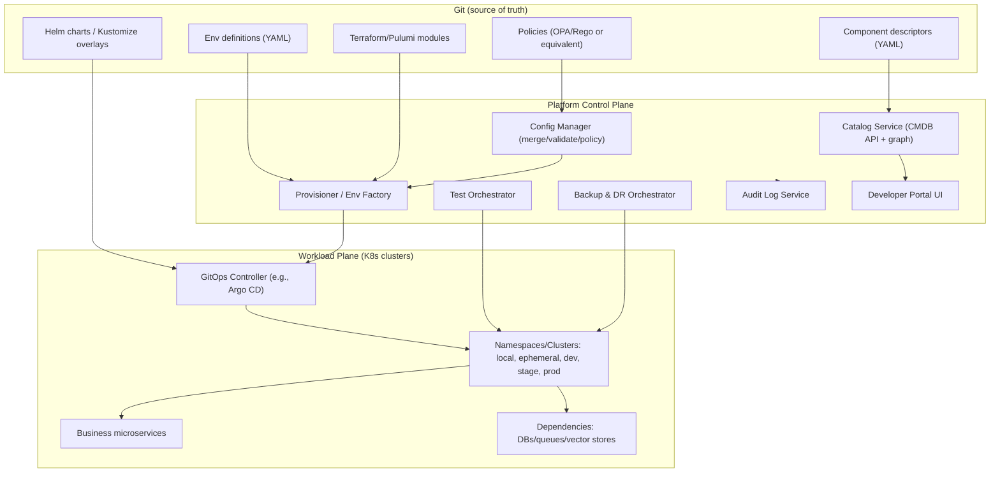
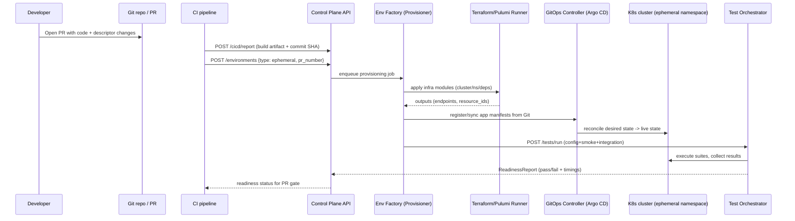
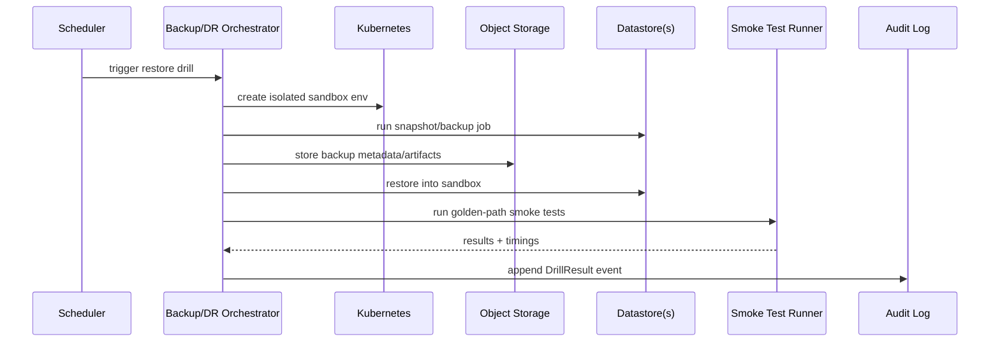

# Extending the Platform with a Unified Control Plane, Environment Factory, and Automated Verification

## Executive summary

The attached process document describes building a **unified platform control plane** that can (a) maintain a live inventory (“system map/CMDB”), (b) standardize “component profiles” as code, (c) spin up **local**, **ephemeral (per PR/branch)**, and **cloud** environments, (d) govern config/secrets with validation and policy, (e) orchestrate automated verification (config, integration, smoke, performance, policy), and (f) run **backup + restore drills** with auditability. fileciteturn0file0

Assuming your current platform is microservices-based (REST APIs) with a relational database, the most robust way to extend it is to add a **platform layer** (control plane services + a developer-facing portal) that treats *platform metadata and environments as first-class objects*—while adopting a GitOps workflow so “desired state” is versioned, auditable, and reproducible. This aligns closely with established patterns in modern platform engineering tools: a service catalog backed by YAML descriptors in Git (as described by Backstage), GitOps continuous delivery controllers that reconcile desired vs. live state (as described by Argo CD), infrastructure-as-code provisioning with explicit state management (Terraform/Pulumi), standardized telemetry pipelines (OpenTelemetry), and Kubernetes-native policy admission controls (OPA/Gatekeeper). citeturn0search4turn0search2turn1search10turn1search3turn0search12turn4search2turn4search6

Recommended implementation approach (high level):

- Use **Git as the source of truth** for “component profiles” and environment definitions, with an **ingestion pipeline** into a catalog read-model (for fast queries, dependency graphs, and UI). fileciteturn0file0  
- Adopt a **service catalog/portal** pattern (Backstage-like) so ownership, dependencies, SLO/backup policy, and test coverage are visible and standardized. citeturn0search4turn0search0turn0search8  
- Implement an **Environment Factory** that provisions ephemeral/local/cloud instances via IaC (Terraform or Pulumi) and deploys app stacks via Helm/Kustomize + GitOps controller reconciliation (e.g., Argo CD). fileciteturn0file0 citeturn1search10turn1search2turn1search1turn1search9turn2search2turn0search2turn0search6  
- Add a **Config Manager + Policy Engine** that validates schema, checks secrets references, enforces “sensitive routing” policies, and produces immutable audit events. fileciteturn0file0 citeturn4search2turn3search12turn2search9  
- Add a **Test Orchestrator** and **Backup/DR Orchestrator** that can run scheduled restore drills and produce readiness reports as artifacts. fileciteturn0file0 citeturn0search3turn0search24turn5search7turn5search9  

Open questions remain (notably: your current CI/CD toolchain, runtime targets, and the exact “process steps” integration into existing services). Those are listed explicitly below.

## Process interpretation and assumptions

### What the attached process requires

The document’s “done” state includes: a live system map, standardized component profiles, an environment factory for local/ephemeral/cloud, config & secrets governance, automated verification, and automated+audited backup/restore drills. fileciteturn0file0

It also specifies:
- Inventory categories spanning compute runtimes, datastores, vector/RAG, queues/eventing, model providers, CI/CD systems, artifact registries, observability, and security controls. fileciteturn0file0  
- Per-component metadata: ownership, criticality, endpoints/regions, auth method (keys/OAuth/workload identity/mTLS), config sources, dependencies, data classification and retention, backup requirements (RPO/RTO), test coverage, runbooks/on-call, and cost tags. fileciteturn0file0  
- Local dev expectation: “miniature but faithful” local Kubernetes with profiles (lite/full/sensitive), one-command bootstrap, record/replay external APIs, and golden-path smoke tests. fileciteturn0file0  
- CI/CD normalization: a shared pipeline contract (build → unit → security scan → package → deploy-ephemeral → integration-test → promote → rollback), independent of underlying CI provider. fileciteturn0file0  
- Provider abstraction interfaces (queue/vector/graph/model/document store) so tenants/environments can switch providers without business-logic changes. fileciteturn0file0  
- Backup and restore drill requirements, including Kubernetes “Velero-like” backups and datastore-specific strategies. fileciteturn0file0 citeturn0search3turn0search24  

### Assumptions used in this report

Because your current architecture isn’t provided, this report assumes:

- **Runtime**: microservices deployed to Kubernetes (or migrating there), exposing REST APIs.
- **Primary datastore**: relational database for core transactional data; additional datastores may exist for search/caching/queues.
- **Identity**: existing centralized identity provider (or planned) that can support OAuth 2.0 / OIDC.
- **Source control**: Git-based workflow with PRs, branches, and build pipelines.

Primary vendor/tooling references that appear in recommendations (for context): entity["company","Microsoft","cloud and identity vendor"], entity["company","Amazon Web Services","cloud provider"], entity["company","Docker","container tooling vendor"], entity["company","HashiCorp","iac vendor"], entity["company","Pulumi","iac vendor"], and entity["organization","OpenID Foundation","identity standards body"].

### Open questions if you want to reduce risk and rework

The attached document is intentionally platform-agnostic, so key unknowns remain. fileciteturn0file0

- What are the **current microservices** (count, languages, deployment targets) and do you already run Kubernetes in production?
- What is your current **CI/CD reality** (Jenkins vs GitHub Actions vs Azure DevOps vs GitLab), and which is strategic vs legacy? fileciteturn0file0  
- Do you need **true multi-cloud** active-active, or primarily portability and “policy routing” across clouds?
- What are your **data classification classes** (e.g., public/internal/confidential/regulated) and which are subject to regulatory controls (GDPR/PCI/HIPAA/etc.)?
- What is your **current observability stack** (logs/metrics/traces), and do you already standardize trace IDs across services?
- What RPO/RTO targets are expected per tier, and which systems are “tier 0 / tier 1”? fileciteturn0file0  

## Target architecture extension and process-to-component mapping

### Target platform extension: control plane services and boundaries

The attached document’s recommended modules map naturally to a platform “control plane” composed of specialized services: catalog, provisioner, config manager, adapter layer, test orchestrator, backup/DR orchestrator, and observability/audit. fileciteturn0file0

A pragmatic extension for a microservices + REST + relational DB platform is:

- **Platform Control Plane (new)**: a set of internal microservices with their own DB (catalog/config/audit metadata), plus a portal UI.
- **Workload Plane (existing)**: your business microservices and their datastores, deployed across local/dev/stage/prod and potentially across clusters/clouds.
- **Git as source of truth**: component descriptors and environment definitions stored in repos and ingested into a catalog. This matches the “metadata YAML with code” model used by Backstage’s software catalog. citeturn0search4turn0search0  
- **GitOps deployment reconciliation**: a controller model where the cluster is continuously compared to desired state from Git, as described by Argo CD. citeturn0search2turn0search6  

#### Key flow visualization: control plane modules



This structure supports (a) “inventory as code”, (b) reproducible env creation, (c) standardized validation/tests, and (d) auditable operations, which are explicit goals of the attached process. fileciteturn0file0

### Mapping each process step to platform components and APIs

The table below treats each process step in the document as a deliverable, then maps it to: (1) control plane component(s), (2) new or extended APIs, and (3) data objects stored in your platform DB(s). fileciteturn0file0

| Process step from the markdown | Control-plane component(s) | Key APIs (examples) | Primary data objects |
|---|---|---|---|
| Build **System Map / live inventory** (“one catalog for all”) | Catalog Service + ingestion workers; Portal UI | `POST /components/ingest`, `GET /components`, `GET /components/{id}/graph` | `Component`, `ComponentDependency`, `Owner`, `Endpoint`, `EnvironmentRef` |
| Define **Component Profiles** (one schema: endpoints/auth/config/SLO/backup/tests) | Catalog Service + Schema Validator | `PUT /components/{id}/profile`, `GET /schemas/component-profile` | `ComponentProfile`, `SLO`, `BackupPolicy`, `TestSuiteRef` |
| **Config & secrets governance** + policy checks | Config Manager + Policy Engine | `POST /config/resolve`, `POST /config/validate`, `POST /policy/evaluate` | `ConfigLayer`, `SecretRef`, `PolicyDecision`, `ValidationRun` |
| Local reproduction: **Windows Desktop Kubernetes**, profiles `local-lite/full/sensitive` | Provisioner + local bootstrap tooling | `POST /environments` (type=`local`), `GET /environments/{id}` | `EnvironmentInstance`, `EnvironmentProfile`, `ResourceBinding` |
| **Ephemeral envs** per PR/branch + seeded tenants | Provisioner + GitOps controller integration + Test Orchestrator | `POST /environments` (type=`ephemeral`), `POST /tests/run` | `EnvironmentInstance`, `SeedSpec`, `TestRun` |
| Normalize **CI/CD contract** and gates | CI templates + Control Plane webhooks | `POST /cicd/report`, `GET /releases/{id}/readiness` | `Build`, `Artifact`, `ReadinessReport`, `Promotion` |
| Provider abstraction: queue/vector/graph/model/document store | Integration Adapter Layer | `POST /adapters/resolve` (returns provider binding), `GET /providers` | `CapabilityBinding`, `ProviderConfig`, `TenantRoutingRule` |
| Backups + **restore drills** + audit | Backup/DR Orchestrator | `POST /backups/run`, `POST /restores/drill`, `GET /backups/{id}` | `BackupRun`, `RestoreRun`, `DrillResult`, `RPO/RTOActual` |
| Observability & audit: traces across everything + immutable audit log | Observability pipeline + Audit service | `POST /audit/events`, `GET /audit/search` | `AuditEvent`, `TelemetryExportConfig` |

This mapping converts the document’s narrative steps into concrete platform responsibilities. fileciteturn0file0

### Alternatives comparison and recommended option

At least three viable implementation strategies exist. The right choice depends on how much you want to *adopt vs build* and how complex your environment matrix (clouds, datastores, RAG providers, tenants) really is. fileciteturn0file0

| Alternative | Summary | Pros | Cons | Cost / complexity | Recommended when |
|---|---|---|---|---|---|
| Adopt proven OSS building blocks (Portal + GitOps + IaC + OTel + policy) | Use a Backstage-like catalog model (YAML descriptors), GitOps CD reconciliation, IaC provisioning, OpenTelemetry, and Kubernetes policy admission | Strong alignment with “metadata in Git” catalog model citeturn0search4turn0search0; GitOps reconciliation semantics are mature citeturn0search2turn0search6; IaC has explicit state models citeturn1search10turn1search2; OTel standardizes telemetry pipelines citeturn0search12turn0search5; policy-as-code for admission controls is established citeturn4search2turn4search6 | Requires integration engineering across multiple tools; platform team must own upgrades; some workflows span multiple UIs | Medium | **Default recommendation** for most engineering orgs wanting auditability + portability with manageable build effort |
| Build a bespoke “control plane” suite end-to-end | Implement your own UI, catalog DB, Git ingestion, env provisioning, and drift reconciliation | Single unified UX; can match exact domain (multi-model/RAG/provider routing) fileciteturn0file0 | Highest engineering & maintenance cost; you must re-invent proven patterns (catalog entity models, GitOps reconciliation, policy engine), raising long-term risk | High | Only if you have strong platform engineering capacity and strict constraints preventing adoption (air-gap, security restrictions, niche workflows) |
| Kubernetes-native CRDs/operators as the primary control plane | Define custom resources (`Component`, `Environment`, `BackupPolicy`) and implement controllers/operators to reconcile | Native reconciliation model (controller pattern), strongly GitOps-friendly; can use admission policy controls citeturn4search2turn4search6 | Operator development and lifecycle management is non-trivial; harder to support non-K8s targets (VM/IIS/etc.) mentioned in the process doc fileciteturn0file0 | Medium–High | Best if “everything is Kubernetes” and you want fewer external systems; less ideal if you must support VMs/IIS or many SaaS integrations |
| Commercial suites (CMDB + CD + secrets + env mgmt) | Use commercial platform engineering/CMDB/CD products to implement the flow | Faster time-to-UI for catalogs and workflows; potentially stronger compliance features | Vendor lock-in; may not model multi-provider AI routing and per-tenant capability abstraction cleanly fileciteturn0file0 | High (license) / Medium (engineering) | Choose if procurement is acceptable and you want faster rollout with less OSS integration work |

**Recommended option:** the first alternative—adopt proven open ecosystem building blocks and integrate them into a cohesive “platform control plane,” because it fits the document’s Git-as-truth approach (Backstage-style catalog descriptors) citeturn0search4turn0search0, the GitOps reconciliation model (Argo CD) citeturn0search2turn0search6, IaC state management (Terraform/Pulumi) citeturn1search2turn1search7, and standardized telemetry (OpenTelemetry) citeturn0search12turn0search5—while keeping bespoke implementation focused where you have unique requirements (multi-model routing, data classification rules, and adapter interfaces). fileciteturn0file0

## Data models, schemas, and integration and storage design

### New data models needed

The process requires new first-class objects beyond your current microservice domain tables: component inventory, dependency graphs, environment instances, configuration layers, validations/test runs, backup/restore runs, and an immutable audit log. fileciteturn0file0

A minimal but complete conceptual model looks like:

- **Component**: a unit of inventory (service, database, queue, model provider, RAG index) with ownership, criticality, environments, endpoints, dependencies, and data classification. fileciteturn0file0  
- **ComponentProfile (versioned)**: validated snapshot of descriptor YAML ingested from Git; includes required config keys, secret references, RPO/RTO policy, and test suite references. fileciteturn0file0  
- **EnvironmentInstance**: local / ephemeral / dev / stage / prod, with profile (`local-lite`, `local-full`, `local-sensitive`), status, and resource bindings. fileciteturn0file0  
- **CapabilityBinding**: explicit mapping for “capability interfaces” (queue/vector/model/etc.) to a concrete provider per environment/tenant, enabling switching without business-logic changes. fileciteturn0file0  
- **ValidationRun / TestRun / ReadinessReport**: structured evidence of gates (schema/secrets/connectivity/policy, smoke/integration/perf). fileciteturn0file0  
- **BackupRun / RestoreRun / DrillResult**: evidence for backups and restore drills. For Kubernetes workloads, backups are commonly split into metadata stored in object storage plus PV snapshots/file-level backups, matching Velero’s documented backup architecture. citeturn0search3turn0search7  
- **AuditEvent (append-only)**: immutable “who/what/when” log for config changes, provisioning actions, backups/restores, and policy decisions. fileciteturn0file0  

### Storage and integration points

The document implies (and industry patterns reinforce) that you need multiple storage classes: relational metadata store, Git repositories, secret managers, and object storage for backups and artifacts. fileciteturn0file0

Key integration/storage points:

- **Git repositories**: source of truth for descriptors, policies, IaC, and deployment manifests. Backstage’s catalog is specifically designed around harvesting metadata YAML stored with code. citeturn0search4turn0search0  
- **Relational DB (new control-plane DB)**: stores catalog read-model, environment instance state, run history, audit log index (or pointer to immutable storage), and readiness reports.  
- **Secrets stores**: references to secret locations (not secret values) remain in descriptors; secret values are retrieved dynamically from secret managers.  
  - AWS Secrets Manager includes rotation features and API-based retrieval patterns. citeturn2search9turn2search21turn2search36  
  - Azure Key Vault provides guidance on securing secrets and automating rotation (tutorials). citeturn3search12turn3search16turn3search4  
- **Object storage**: backups and snapshots.  
  - Elastic documents snapshot repositories backed by cloud object storage such as S3 and Azure Blob, plus snapshot lifecycle management. citeturn5search7turn5search4turn5search13  
- **Kubernetes clusters**: local and remote. Docker Desktop includes a Kubernetes environment for local development/testing; it supports cluster provisioning and provides steps for enabling Kubernetes. citeturn2search0turn2search26  
- **Local cluster toolchains**: kind is explicitly designed for local Kubernetes clusters using container “nodes” and is suitable for local dev/CI scenarios, matching the file’s “kind/k3d for deterministic clusters” recommendation. citeturn2search1turn2search23  
- **Deployment templating**: Helm charts package Kubernetes resources; Kustomize provides “template-free” customization via overlays (`kubectl kustomize`), matching the document’s “Helm (or Kustomize)” guidance. citeturn1search1turn1search9turn2search2  
- **GitOps controller**: Argo CD continuously compares live state to desired state and reports drift (OutOfSync), supporting an auditable deployment model. citeturn0search2turn0search6  
- **Telemetry pipeline**: OpenTelemetry Collector is a vendor-agnostic way to receive/process/export telemetry; it also facilitates correlation across logs/metrics/traces. citeturn0search12turn0search5turn0search9  

### Example relational schema for the control-plane DB

Below is a concrete (illustrative) schema for a control plane running on a relational database (e.g., PostgreSQL). It stores a query-optimized read model while keeping Git as ultimate truth.

```sql
-- Components and versioned profiles (ingested from Git)
CREATE TABLE components (
  component_id        UUID PRIMARY KEY,
  name                TEXT NOT NULL UNIQUE,
  kind                TEXT NOT NULL,  -- service|database|queue|model|vectorstore|...
  owner_team          TEXT NOT NULL,
  criticality_tier    TEXT NOT NULL,  -- tier0|tier1|tier2|tier3
  data_classification TEXT NOT NULL,  -- public|internal|sensitive|regulated
  created_at          TIMESTAMPTZ NOT NULL DEFAULT now(),
  updated_at          TIMESTAMPTZ NOT NULL DEFAULT now()
);

CREATE TABLE component_profiles (
  profile_id          UUID PRIMARY KEY,
  component_id        UUID NOT NULL REFERENCES components(component_id),
  git_repo            TEXT NOT NULL,
  git_ref             TEXT NOT NULL,  -- commit SHA
  descriptor_path     TEXT NOT NULL,  -- e.g., /catalog/component.yaml
  profile_json        JSONB NOT NULL, -- canonical normalized profile
  schema_version      TEXT NOT NULL,
  valid               BOOLEAN NOT NULL,
  validation_errors   JSONB NOT NULL DEFAULT '[]'::jsonb,
  created_at          TIMESTAMPTZ NOT NULL DEFAULT now()
);

CREATE INDEX component_profiles_component_idx ON component_profiles(component_id);
CREATE INDEX component_profiles_repo_ref_idx ON component_profiles(git_repo, git_ref);

-- Dependency graph (materialized edges for fast visualization)
CREATE TABLE component_dependencies (
  component_id        UUID NOT NULL REFERENCES components(component_id),
  depends_on_id       UUID NOT NULL REFERENCES components(component_id),
  dependency_type     TEXT NOT NULL,  -- runtime|data|ci|observability|secrets|...
  PRIMARY KEY (component_id, depends_on_id, dependency_type)
);

-- Environments and resource bindings
CREATE TABLE environment_instances (
  env_id              UUID PRIMARY KEY,
  env_type            TEXT NOT NULL,      -- local|ephemeral|dev|stage|prod|sandbox
  env_profile         TEXT NOT NULL,      -- local-lite|local-full|local-sensitive|...
  created_by          TEXT NOT NULL,      -- user/service principal
  source_branch       TEXT NULL,
  pr_number           INT NULL,
  status              TEXT NOT NULL,      -- provisioning|ready|failed|deleting|deleted
  created_at          TIMESTAMPTZ NOT NULL DEFAULT now(),
  expires_at          TIMESTAMPTZ NULL
);

CREATE TABLE environment_resources (
  env_id              UUID NOT NULL REFERENCES environment_instances(env_id),
  resource_type       TEXT NOT NULL,      -- namespace|cluster|db|queue|bucket|...
  resource_id         TEXT NOT NULL,      -- provider-native identifier
  provider            TEXT NOT NULL,      -- aws|azure|local|...
  metadata            JSONB NOT NULL DEFAULT '{}'::jsonb,
  PRIMARY KEY (env_id, resource_type, resource_id)
);

-- Capability bindings (provider abstraction)
CREATE TABLE capability_bindings (
  binding_id          UUID PRIMARY KEY,
  env_id              UUID NOT NULL REFERENCES environment_instances(env_id),
  tenant_id           TEXT NULL,
  capability          TEXT NOT NULL,      -- queue|vector|graph|model|documentstore
  provider            TEXT NOT NULL,      -- sqs|servicebus|kafka|redis|...
  config_ref          TEXT NOT NULL,      -- pointer to a config bundle or secret ref
  created_at          TIMESTAMPTZ NOT NULL DEFAULT now()
);

-- Runs: validations, tests, backups, restores
CREATE TABLE runs (
  run_id              UUID PRIMARY KEY,
  run_type            TEXT NOT NULL,      -- validation|test|backup|restore|drill
  env_id              UUID NULL REFERENCES environment_instances(env_id),
  component_id        UUID NULL REFERENCES components(component_id),
  status              TEXT NOT NULL,      -- queued|running|passed|failed|canceled
  started_at          TIMESTAMPTZ NULL,
  finished_at         TIMESTAMPTZ NULL,
  result_json         JSONB NOT NULL DEFAULT '{}'::jsonb
);

CREATE INDEX runs_env_idx ON runs(env_id, run_type, status);

-- Append-only audit log index (event bodies can be in immutable storage if desired)
CREATE TABLE audit_events (
  event_id            UUID PRIMARY KEY,
  event_time          TIMESTAMPTZ NOT NULL DEFAULT now(),
  actor               TEXT NOT NULL,
  action              TEXT NOT NULL,      -- config.resolve|env.create|backup.run|...
  target_type         TEXT NOT NULL,      -- component|environment|policy|...
  target_id           TEXT NOT NULL,
  event_json          JSONB NOT NULL
);

CREATE INDEX audit_events_time_idx ON audit_events(event_time DESC);
```

This schema supports: catalog queries, dependency graph visualization, environment lifecycle tracking, evidence collection (runs), and auditing—matching the document’s goals. fileciteturn0file0

### Sample API contracts for the control plane

Below are example (illustrative) REST endpoints that implement the process-to-component mapping.

#### Catalog: components and dependency graph

```http
GET /controlplane/v1/components?kind=service&owner_team=payments
Accept: application/json
Authorization: Bearer <token>
```

```json
{
  "items": [
    {
      "component_id": "3a7b6b7d-6eec-4d5e-a7b0-8f0d6bdf4b9a",
      "name": "search-api",
      "kind": "service",
      "owner_team": "analytics-team",
      "criticality_tier": "tier1",
      "data_classification": "internal",
      "latest_profile": {
        "git_repo": "git@repo:platform/search-api.git",
        "git_ref": "c0ffee...deadbeef",
        "schema_version": "v1",
        "valid": true
      }
    }
  ]
}
```

#### Environment Factory: create ephemeral env (per PR)

```http
POST /controlplane/v1/environments
Content-Type: application/json
Authorization: Bearer <token>
```

```json
{
  "env_type": "ephemeral",
  "env_profile": "ephemeral-standard",
  "source_branch": "feature/foo",
  "pr_number": 4812,
  "expires_in_minutes": 720
}
```

```json
{
  "env_id": "2d0d8a1e-9fdc-4f88-b53c-2fc7d6a8cc18",
  "status": "provisioning",
  "links": {
    "status": "/controlplane/v1/environments/2d0d8a1e-9fdc-4f88-b53c-2fc7d6a8cc18",
    "logs": "/controlplane/v1/environments/2d0d8a1e-9fdc-4f88-b53c-2fc7d6a8cc18/events"
  }
}
```

#### Config Manager: resolve config with policy enforcement

```http
POST /controlplane/v1/config/resolve
Content-Type: application/json
Authorization: Bearer <token>
```

```json
{
  "component": "search-api",
  "environment_id": "2d0d8a1e-9fdc-4f88-b53c-2fc7d6a8cc18",
  "tenant_id": "tenant-123",
  "requested_keys": ["ELASTIC_URL", "REDIS_URL", "MODEL_ROUTING_POLICY"]
}
```

```json
{
  "resolved": {
    "ELASTIC_URL": "https://elastic.ephemeral.svc.cluster.local:9200",
    "REDIS_URL": "redis://redis-cache.ephemeral.svc.cluster.local:6379",
    "MODEL_ROUTING_POLICY": "sensitive-route-local"
  },
  "secret_refs": [
    { "name": "OPENAI_API_KEY", "ref": "kv/prod/search-api/openai_key" }
  ],
  "policy_decisions": [
    { "policy": "data_classification_routing", "decision": "allow", "details": { "route": "local-only" } }
  ],
  "audit_event_id": "c8a4309f-8e44-4a5f-9cdb-3db9a52f7e2a"
}
```

These APIs directly enable the document’s goals: inventory, reproducible environments, config governance, and auditable operations. fileciteturn0file0

## Identity, security, privacy, and compliance impacts

### Authentication and authorization changes

The process implies expanding both human and machine access paths: portal UI access, CI/CD-to-control-plane calls, and control-plane-to-cloud/Kubernetes calls. fileciteturn0file0

Recommended identity model:

- **Human access**: OIDC-based SSO to the portal and control-plane APIs. OIDC is explicitly defined as an authentication layer on top of OAuth 2.0; Microsoft’s identity platform documentation describes OIDC usage for SSO with ID tokens. citeturn3search1turn3search2turn3search3  
- **Service-to-service access**: OAuth 2.0 access tokens for API calls (short-lived), scoped by role and environment. The OAuth 2.0 authorization framework defines mechanisms for limited access to HTTP services. citeturn3search3turn3search11  
- **Kubernetes authorization**: use Kubernetes RBAC constructs (Role/RoleBinding vs ClusterRole/ClusterRoleBinding) with “least privilege” practices, because the control plane will likely need to create namespaces, apply manifests, read statuses, and stream logs. citeturn1search0turn1search4  

### Secrets management and rotation

The document requires “no secrets in Git” and validation that secret references exist in the target vault. fileciteturn0file0

Implications and controls:

- Control plane stores **only secret references** (pointers), not secret values.  
- Use managed secret stores with rotation capabilities:
  - AWS Secrets Manager: rotation updates credentials in both the secret and the backing service; it supports managed rotation patterns for some services. citeturn2search9turn2search36  
  - Azure Key Vault: provides tutorials for automating periodic rotation of secrets (including SQL passwords) and guidance for secure secret storage practices (formatting, tags for metadata). citeturn3search4turn3search16turn3search12  

### Policy enforcement, sensitive routing, and compliance

The process calls out “policy validation,” including:
- “Sensitive data components must route only to approved local models/vector DB”
- “approved regions only”
- “logging requirements (PII redaction rules)” fileciteturn0file0

A practical enforcement design:

- Use **policy-as-code** for:
  - Admission (blocking non-compliant deployments)
  - Config assembly decisions (e.g., “if data_classification=sensitive then model_provider must be local-only”) fileciteturn0file0  
- OPA documentation notes that Kubernetes admission controllers enforce policy during create/update/delete; OPA can be deployed as an admission controller for policy enforcement. citeturn4search2turn4search6  

Privacy/compliance impacts to explicitly plan for:

- **Data residency & region controls**: the environment factory must prevent provisioning in disallowed regions and prevent cross-region export of regulated datasets (especially for backups and logs). fileciteturn0file0  
- **Auditability**: the document calls for an “immutable audit log for config/provisioning/backups.” fileciteturn0file0  
- **Log hygiene**: structured logging with PII redaction requirements; enforce by shared libraries/middleware and by policy checks that reject unsafe logging configurations. fileciteturn0file0  

## Reliability, performance, and testing strategy

### Performance and scalability implications

Adding a control plane introduces new load patterns:

- **Burst provisioning load** (per PR/branch ephemeral envs) and concurrent IaC operations. fileciteturn0file0  
- **Catalog query load** (portal + API clients) and dependency graph traversals.
- **Telemetry load** (logs/metrics/traces correlation across many environments).

Design implications:

- Prefer asynchronous workflows for provisioning: the API returns quickly with an `env_id`, while a workflow engine executes provisioning steps (IaC apply, deploy, test).  
- For Kubernetes workloads, plan autoscaling and health checks:
  - Kubernetes Horizontal Pod Autoscaler can scale workloads based on multiple metrics (including custom metrics in autoscaling/v2). citeturn4search1  
  - Use readiness/liveness/startup probes to reduce cascading failures by ensuring traffic only reaches ready pods and stuck pods are restarted. citeturn4search7turn4search3  
- Operational telemetry standardization:
  - OpenTelemetry Collector is designed as a vendor-agnostic receiver/processor/exporter; it also supports consistent enrichment and correlation among logs/metrics/traces. citeturn0search12turn0search5  

### Failure modes and recovery strategies

The document implies high automation, which means you must explicitly model failures and compensation steps. fileciteturn0file0

Key failure modes and recommended strategies:

- **Descriptor invalid / schema drift**: fail fast during PR checks; block merges until profiles validate; produce actionable errors. (Matches “schema validation gates”.) fileciteturn0file0  
- **Secret reference missing**: fail pre-deploy in config validation; never attempt apply. fileciteturn0file0  
- **Provisioning partial failure**: ensure IaC operations are idempotent; persist workflow state; implement “destroy-on-fail” for ephemeral envs with safe retry semantics. IaC tools store explicit state (Terraform state; Pulumi state), enabling drift detection and controlled updates. citeturn1search2turn1search7  
- **GitOps drift/out-of-sync**: reconcile using a controller that reports OutOfSync status and can re-sync to desired state. citeturn0search2  
- **Backup succeeded, restore fails**: treat restore drills as first-class SLO evidence; block promotions for tier-1 systems if restore drills fail. For Kubernetes backups, Velero documents that backups are split between object-storage metadata and PV snapshot/file backups and relies on underlying encryption mechanisms. citeturn0search3turn0search7  
- **Datastore-specific restore limitations**:
  - SQL Server: point-in-time restore requirements depend on recovery model and log backups; Microsoft documents full/diff/log strategy considerations. citeturn5search9turn5search3  
  - Redis: RDB vs AOF persistence have different durability/performance tradeoffs; official Redis documentation defines both mechanisms. citeturn5search1turn5search34  
  - Elastic: snapshot lifecycle management and repository-backed restore are the supported backup pattern. citeturn5search7turn5search4  
  - MongoDB: `mongodump` and `mongorestore` are standard tools for backup/restore (with scaling caveats for larger systems). citeturn5search2turn5search15turn5search21  

### Key sequence diagrams

#### Ephemeral environment creation (per PR) + automated gates



This reflects the document’s `deploy-ephemeral` and integration-gate requirements. fileciteturn0file0 citeturn0search2turn1search2turn1search7  

#### Backup + restore drill (“non-negotiable”) workflow



The architecture of Kubernetes backups splitting metadata and PV data aligns with Velero documentation. citeturn0search3turn0search7turn0search24  

### Testing plan: unit, integration, E2E

The document requires a unified automated verification layer (config checks, integration tests, smoke tests, performance checks, policy checks), plus local faithful reproduction and golden-path smoke tests. fileciteturn0file0

A rigorous testing strategy:

- **Unit tests**
  - Descriptor schema validators (YAML → canonical JSON model)
  - Policy rules (routing, region constraints, logging redaction config)
  - Adapter bindings (capability interface selection logic) fileciteturn0file0  

- **Integration tests**
  - “Config test suite per integration type”: DB connectors, queue connectors (including DLQ), model providers (auth + rate-limit handling + fallback), RAG stores (index existence + query + ACL), management tools (token scopes + webhook delivery). fileciteturn0file0  
  - Run these suites automatically in ephemeral envs after deploy, before promotion.

- **End-to-end tests**
  - Golden-path flows across representative service chains (API gateway → service mesh/routing → DB/queue/vector store).
  - Contract tests for service APIs to ensure backward compatibility during rollout (especially when introducing new required headers/claims or new config keys).

- **Performance checks**
  - Lightweight smoke performance tests in ephemeral envs to detect obvious regressions.
  - Scheduled load tests in a dedicated perf environment for tier-1 systems.

- **Restore drill tests**
  - Restore to sandbox and run “golden path” smoke tests, as required. fileciteturn0file0  

## Deployment, rollout, milestones, and operational readiness

### Deployment and rollout strategy

The process requires migration toward standardized descriptors, validation gates, and automated provisioning—so rollout must be incremental, with backward compatibility. fileciteturn0file0

Recommended rollout strategy:

- **Phase compatibility**
  - Start with “catalog-only”: ingest descriptors and show inventory without controlling deployments.  
  - Then “validate-only”: enforce schema/secrets/policy checks in CI, but do not provision environments automatically.  
  - Then “ephemeral envs”: enable per-PR provisioning for a subset of services. fileciteturn0file0  

- **Feature flags**
  - Gate each new control-plane capability behind flags (e.g., `catalog_ingest_enabled`, `ephemeral_env_enabled`, `policy_enforcement_blocking_enabled`).
  - Use non-blocking “warn mode” for policy checks before making them release blockers.

- **Database migrations**
  - Introduce control-plane schema independently (new DB) to avoid risky changes to existing business DBs.
  - Version descriptors and schema (`schema_version`) so old descriptors remain accepted for a migration window.

- **Progressive delivery**
  - For production changes, use canary/blue-green deployment strategies when possible; Argo Rollouts documents canary and blue-green strategies as progressive delivery mechanisms. citeturn4search0turn4search8turn4search4  

### Estimated effort and milestones (low / medium / high)

Because your current platform maturity (Kubernetes adoption, CI/CD standardization, observability baseline) is unknown, estimates are ranges.

Assumptions behind estimates:
- A small platform team (2–5 engineers) plus per-service participation for descriptors and integration tests.
- You already have Git + PR workflow; Kubernetes competency exists or can be developed.

#### Milestone plan aligned to the document’s workstreams

| Milestone | Scope / deliverables | Low | Medium | High |
|---|---|---:|---:|---:|
| Inventory + descriptor schema v1 | Define component profile schema; implement ingestion; initial catalog for core services/deps; dependency graph v0 fileciteturn0file0 | 3–4 weeks | 5–7 weeks | 8–12 weeks |
| Config governance + policy engine | Config layer merge, schema validation, secret-ref checks, policy evaluation; CI gate in warn mode fileciteturn0file0 | 3–5 weeks | 6–9 weeks | 10–16 weeks |
| Local environment bootstrap | Docker Desktop K8s + kind option; Helm/Kustomize profiles; one-command bootstrap; golden-path smoke test fileciteturn0file0 citeturn2search0turn2search1turn1search9turn2search2 | 3–5 weeks | 6–8 weeks | 10–14 weeks |
| Ephemeral envs per PR | Env Factory MVP (namespace + deps + deploy); seed tenants; integration suite runner; readiness report artifact fileciteturn0file0 | 5–7 weeks | 8–12 weeks | 14–20 weeks |
| CI/CD contract normalization | Shared pipeline templates; enforce build→test→scan→package→deploy-ephemeral→integration-test→promote/rollback contract fileciteturn0file0 | 4–6 weeks | 8–12 weeks | 12–20 weeks |
| Backup + restore drills | Backup policies per datastore; Velero-like K8s backups; automated restore-to-sandbox drill + report + alerts fileciteturn0file0 citeturn0search3turn5search7turn5search9 | 4–6 weeks | 7–10 weeks | 12–18 weeks |
| Observability + audit hardening | OTel instrumentation for control plane; dashboards; SLOs; immutable audit events; runbooks/on-call docs fileciteturn0file0 citeturn0search12turn0search5 | 3–5 weeks | 6–9 weeks | 10–16 weeks |

These can be overlapped; the “medium” full program typically lands in the **4–7 month** range if you aim for meaningful coverage across many services and providers.

### Documentation and monitoring/observability changes required

The process explicitly requires runbooks, on-call info, test coverage, readiness reports, and immutable audit logs. fileciteturn0file0

Minimum documentation set:

- **Component profile specification** (schema, required fields, examples).
- **Environment profiles** documentation (`local-lite`, `local-full`, `local-sensitive`, ephemeral defaults) and how to run `make up`/`task up`. fileciteturn0file0  
- **CI/CD contract** documentation and templates. fileciteturn0file0  
- **Backup and restore runbooks** + drill reports; datastore-specific procedures (Elastic snapshot restore; SQL point-in-time restore; Redis persistence mode; Mongo tools). citeturn5search7turn5search9turn5search1turn5search2  
- **Policy catalog** (what policies exist, enforcement mode, remediation guidance). citeturn4search2turn4search6  

Monitoring/observability requirements:

- Standardize logs/metrics/traces across control plane and workload plane; OpenTelemetry Collector is intended as a vendor-agnostic pipeline for receiving/processing/exporting telemetry. citeturn0search12turn0search9  
- Correlate logs and traces consistently; OpenTelemetry emphasizes correlation across signals with uniform attributes. citeturn0search5  
- Dashboards: provisioning success rate and latency, test pass rate, backup success and restore drill success (with RPO/RTO actuals), policy denials, and drift/out-of-sync counts (GitOps). fileciteturn0file0 citeturn0search2  

By implementing the control plane as described—with catalog descriptors in Git, IaC-based environment creation, GitOps reconciliation, policy enforcement, automated verification, and restore drills—you convert the process document into an operational platform capability that is reproducible, auditable, and scalable across local/ephemeral/cloud environments. fileciteturn0file0