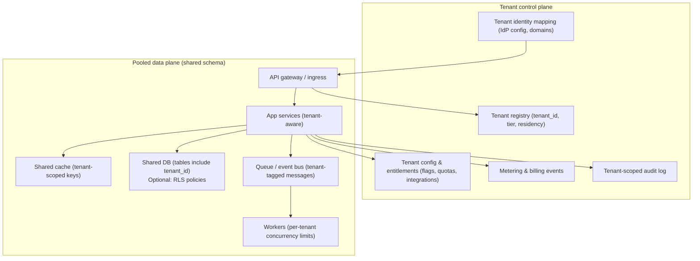
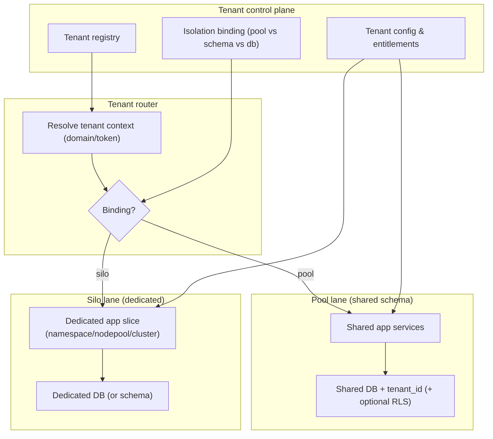
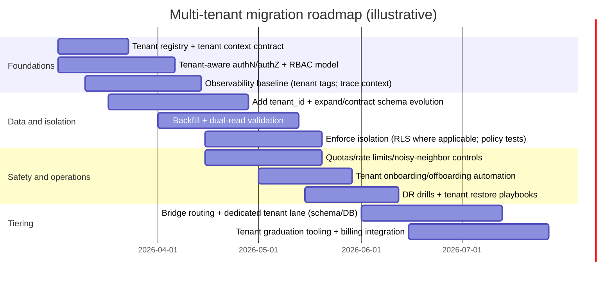

# Adapting a Single-Tenant System to a Multi-Tenant Architecture

## Executive summary

Converting an existing single-tenant system into a multi-tenant system is primarily an exercise in **systematic boundary-making**: every request, query, job, cache key, message, credential, and operational control must become **tenant-aware by construction**. Cloud architecture guidance frames this as a spectrum of **pooled**, **siloed**, and **hybrid/bridge** approaches (often mixed by layer: compute, storage, network, and operational planes), rather than a single binary choice. citeturn0search0turn0search4turn1search3turn16search6

The central architectural recommendation for an unspecified legacy single-tenant system is a **hybrid “bridge” trajectory**: start with a pooled foundation (for velocity and cost) and add explicit “graduation paths” to stronger isolation (schema-per-tenant or database-per-tenant) for tenants with regulatory, residency, performance/noisy-neighbor, or customer-managed-key requirements. This hybrid approach is explicitly described as a way to apply pooled vs. siloed choices where they fit best. citeturn0search4turn0search0turn1search3

From a risk standpoint, the two most common multi-tenancy failure modes are:

- **Cross-tenant data exposure** via broken object-level authorization (e.g., manipulating IDs) and incomplete tenant scoping in reads/writes. This is repeatedly highlighted as a top API risk class. citeturn1search2turn1search6turn13search3  
- **Noisy-neighbor and cost blowups** when pooled resources (DB, queues, worker pools, build jobs, file uploads) lack tenant-scoped quotas, fairness limits, and rate controls. Multi-tenancy guidance for clusters calls out fairness/noisy-neighbor concerns, and API security guidance calls out “unrestricted resource consumption” as a direct DoS and cost-amplification vector. citeturn1search1turn13search3turn15search4  

A practical “definition of done” is that the platform can (1) **prove isolation** (data, compute, network, config), (2) onboard/offboard tenants reliably, (3) meter and attribute cost per tenant, and (4) execute safe, reversible migrations (expand/contract, idempotency, progressive delivery). citeturn6search0turn6search2turn9search0turn8search4

A relevant internal architectural pattern (from an uploaded design note about forms + workflow automation) is to **persist tenant-scoped state first, then emit an event and run automations asynchronously**. This “store then trigger” approach improves retriability and reduces data-loss risk, but it becomes multi-tenant-safe only when every emitted event and downstream consumer is tenant-scoped and idempotent. fileciteturn0file1 fileciteturn0file2

## Tenancy models and isolation design

### Tenancy model comparison

Cloud providers and seminal research generally converge on the same three storage mappings you requested—**shared schema**, **separate schema**, **separate database**—and emphasize that changing the mapping later is often costly, so choose with an explicit isolation-and-migration strategy upfront. citeturn0search1turn0search11turn16search5

**Comparison table: shared schema vs. separate schema vs. separate database**

| Tenancy model | What it means | Pros | Cons | Suitability criteria (when it fits best) |
|---|---|---|---|---|
| Shared schema (shared tables) | All tenants share the same tables; each row/document is scoped by a `tenant_id` (or equivalent) | Lowest cost per tenant; simplest provisioning; easiest global analytics; fastest onboarding | Highest blast radius if tenant scoping fails; hardest to offer tenant-specific restore; noisy-neighbor risk is highest without strong quotas | Many small/medium tenants; high tenant count; uniform features; you can enforce tenant scoping (DB controls like RLS or strong app invariants); cost sensitivity is high citeturn0search11turn0search1turn1search3 |
| Separate schema (schema-per-tenant) | One DB instance, but each tenant has its own schema (or namespace) | Stronger logical isolation; easier tenant-level backup/restore than shared tables; easier to offer per-tenant schema evolution variance | Schema sprawl; migrations can become operationally heavy; connection routing/pooling is more complex | Moderate tenant count; tenants need better restore boundaries; you want improved isolation without full database-per-tenant overhead; operational automation exists citeturn0search1turn0search11turn16search9 |
| Separate database (database-per-tenant) | Each tenant gets its own database (sometimes its own DB server/cluster) | Strongest data isolation; easiest tenant-specific restore and residency controls; simplest per-tenant performance tuning | Highest ops overhead and baseline cost; tooling must fully automate provisioning, upgrades, patching; cross-tenant analytics becomes harder | Regulated or high-value tenants; data residency/sovereignty needs; customer-managed keys; strong isolation SLAs; willingness to pay for dedicated footprint citeturn0search0turn1search3turn9search17 |

“Pool / silo / bridge” framing (often used in SaaS guidance) maps cleanly onto these: shared-schema is typically “pool,” separate-database is typically “silo,” and a mixed approach that applies different choices by tenant or layer is “bridge.” citeturn0search0turn0search4turn1search3

image_group{"layout":"carousel","aspect_ratio":"16:9","query":["AWS SaaS silo pool bridge model diagram","shared schema vs schema per tenant vs database per tenant diagram","Kubernetes multi-tenancy namespace isolation resource quota diagram","PostgreSQL row level security multi tenant diagram"],"num_per_query":1}

### Isolation levels: data, compute, network, config

A robust multi-tenant architecture treats isolation as **multi-layered**, not just “where the data sits.” Tenant isolation strategies explicitly separate concerns across layers (network boundaries, compute placement, storage boundaries, IAM policies), and Kubernetes cluster multi-tenancy guidance highlights the trade between shared efficiency and challenges like fairness/noisy neighbors and security. citeturn1search3turn1search1turn15search4

**Data isolation**
- Pooled/shared-schema requires strict tenant scoping. In PostgreSQL, **Row Level Security (RLS)** can enforce per-row access policies; policies are defined via `CREATE POLICY`, and RLS must be enabled per table to apply. citeturn1search0turn1search4  
- In MongoDB pooled multi-tenancy, official guidance states that every document must include a `tenantId` and every query must filter by it (security enforced at the application layer). citeturn10search1  

**Compute isolation**
- In Kubernetes-style shared clusters, compute isolation is typically achieved with namespaces plus RBAC, resource constraints, and workload security policies. Kubernetes multi-tenancy guidance explicitly frames fairness controls as necessary to reduce noisy-neighbor impact on shared control planes. citeturn1search1turn15search1turn15search6  

**Network isolation**
- Kubernetes NetworkPolicies control traffic flow at L3/L4 within clusters; they require a plugin that enforces NetworkPolicy. citeturn15search0  
- SaaS tenant isolation guidance on AWS describes network isolation via constructs such as VPC-level and subnet-level silo models. citeturn1search15turn1search18  

**Configuration isolation**
- A multi-tenant system needs a tenant configuration boundary: entitlements, feature flags, quotas, external integrations, and identity settings must be tenant-scoped. Tenant onboarding is described as orchestrating provisioning and configuration needed to create a new tenant. citeturn9search0turn9search17  

### Two candidate architectures (Mermaid)

These are deliberately tech-stack-neutral; both assume a tenant registry/control-plane capability and a system-wide “tenant context” that is derived and enforced (not user-supplied).



Candidate A is typically fastest to ship but demands the strongest correctness discipline: tenant scoping must be enforced for every read/write path, and quotas must prevent one tenant from exhausting shared resources. citeturn1search3turn13search3turn1search2



Candidate B operationalizes the “bridge” approach (mixing pooled and siloed resources by tenant or by subsystem) and aligns with the explicit “bridge model” concept in SaaS guidance. citeturn0search4turn0search0turn1search3

## Tenant-aware identity, SSO, and authorization

### Tenant-aware identity: establishing and propagating tenant context

A multi-tenant system must establish a canonical **tenant context** for every request and job. SaaS guidance emphasizes that identity is specifically about connecting users to tenants and carrying that tenant context through authN/authZ and management experiences. citeturn9search17turn9search0

Common tenant-resolution patterns (often combined, with explicit precedence rules):
- **Domain-based resolution** (e.g., `tenant.example.com`): good UX, stable routing key; requires domain ownership verification.
- **Token claim** (e.g., `tenant_id` in an ID token or access token): strong, but must handle “user belongs to multiple tenants.”
- **Explicit selector** (path or header): only safe if validated against the authenticated subject’s allowed tenant memberships.

Security note: multi-tenant authentication bugs frequently arise when a system trusts tenant-identifying data that a tenant can tamper with. For that reason, tenant identity is generally safest when derived from **verified domains and server-side mappings** plus authenticated claims, not arbitrary client-supplied headers. citeturn1search2turn9search17

### Authentication: OIDC and SAML for tenant SSO

For modern SaaS:
- OAuth 2.0 defines the authorization framework for limited access to HTTP services. citeturn19search0  
- OpenID Connect provides the identity layer on top of OAuth 2.0 to verify the end-user’s identity and communicate claims. citeturn2search8turn2search4  
- SAML 2.0 remains common for enterprise SSO; the core spec defines assertions and protocols for authentication/attributes/authorization. citeturn2search3turn2search7  

The multi-tenant requirement is that **SSO configuration is tenant-scoped**:
- each tenant can have its own IdP metadata/config, signing keys, and claim mappings,
- group/role claims must map into that tenant’s authorization model,
- and account linking must prevent cross-tenant identity confusion. citeturn18search20turn2search3turn2search8  

For tenant provisioning, SCIM is a standard schema and protocol suite for exchanging user/group identities in enterprise-to-cloud scenarios. citeturn2search1turn2search2  

### Authorization: RBAC with tenant-scoped roles and object-level enforcement

Multi-tenancy changes RBAC in two ways:

1) **Role meaning becomes tenant-relative.** A “Tenant Admin” role is only meaningful within one tenant boundary; global roles (support, billing admin, security operator) must be explicitly separated and heavily audited.

2) **Object-level authorization becomes mandatory.** OWASP highlights that broken object-level authorization occurs when attackers manipulate object IDs in requests to access data they shouldn’t; multi-tenancy magnifies the severity because object IDs exist across many tenants. citeturn1search2turn1search6  

A robust authorization model often becomes “RBAC + scoping invariants,” such as:
- a subject may act only within `{tenant_id}` they are bound to,
- every object has a `{tenant_id}`,
- and every access decision checks `{subject.tenant_memberships}` ∩ `{object.tenant_id}`. citeturn18search20turn1search2  

### Tenant-aware observability context (identity-adjacent)

To debug multi-tenant incidents, you need tenant context in telemetry; however, it must be bounded to avoid performance and security issues.

- OpenTelemetry positions itself as a vendor-neutral framework for generating/collecting/exporting traces/metrics/logs, and OTLP defines how telemetry is encoded/transferred/delivered. citeturn5search0turn17search1  
- W3C Trace Context standardizes `traceparent`/`tracestate` propagation across services. citeturn5search1turn5search13  
- W3C Baggage defines propagation of user-supplied key/value pairs; if you propagate tenant identifiers, treat them as low-sensitivity routing metadata and keep baggage small. citeturn17search3turn17search8  

## Data partitioning, migration strategies, and zero-downtime execution

### Tenant ID strategies and schema evolution fundamentals

In pooled storage, the fundamental shift is that **tenant identity becomes part of the logical key space**:

- All tenant-owned tables/docs gain `tenant_id` (or equivalent), and all indexes that support frequent queries should typically have `tenant_id` as a leading component (to avoid cross-tenant scans and to keep query plans stable).
- Uniqueness constraints must become tenant-aware (e.g., `(tenant_id, external_id)` unique, not just `external_id`).
- Background jobs, caches, queues, and search indexes must include tenant scoping in keys and filters.

If you use PostgreSQL, RLS is an enforceable mechanism: `CREATE POLICY` defines row-level policies and requires enabling RLS on the table. citeturn1search0turn1search4  
If you use MongoDB pooled multi-tenancy, official guidance states every document must have a `tenantId` and every query must filter by it; security is managed at the application level. citeturn10search1  

Partitioning (optional, performance-driven): PostgreSQL declarative partitioning allows a table to be divided into partitions based on a partition key, which can be `tenant_id` for very large datasets or “hot tenant” isolation in pooled storage. citeturn11search0  
MySQL provides partitioning types such as hash partitioning to distribute data across partitions. citeturn10search0  

### Migration strategy options (step-by-step with effort/complexity)

Because the existing system is unspecified, the plans below are expressed as patterns. Effort estimates are **relative** and assume a typical mature SaaS team where parallel workstreams (data, identity, ops, testing) run concurrently.

| Migration option | When it’s best | Step-by-step plan (high-level) | Estimated complexity | Estimated effort drivers |
|---|---|---|---|---|
| Retrofit to pooled shared schema (single DB) | Many tenants; cost-sensitive; you can enforce tenant scoping (ideally at DB boundary) | (1) Introduce tenant registry + tenant context resolution; (2) add `tenant_id` columns; (3) backfill existing data; (4) update all queries/APIs/workers to scope by tenant; (5) enforce policies (e.g., PostgreSQL RLS); (6) tenant-scoped caches/queues/metrics; (7) progressive enablement by tenant | Medium–High | Query surface area; number of data stores; need for enforcement mechanisms (RLS vs app-only); test coverage depth citeturn1search0turn6search0turn1search2 |
| Schema-per-tenant (single DB instance) | Moderate tenant count; need stronger restore boundaries and reduced blast radius without full DB-per-tenant | (1) Build schema template + migration automation; (2) implement tenant-aware connection routing; (3) add tenant provisioning that creates schema + grants; (4) run migrations across schemas reliably; (5) implement tenant-level backup/restore procedures; (6) add per-tenant quotas and monitoring | High | Automation maturity (migrations at scale); operational complexity; connection pooling/routing; schema drift risk citeturn0search1turn9search0turn16search9 |
| Bridge/hybrid with tenant “graduation” | Mixed tenant requirements; you expect some tenants to demand stronger isolation over time | (1) Build control plane: tenant registry + isolation binding; (2) start pooled for most tenants; (3) implement dedicated lane (schema or DB) and tenant router; (4) add tooling to move a tenant (replicate/backfill, dual-run validations, cutover); (5) formalize tiering and operational runbooks | High (but most future-proof) | Requires platform investment (routing, migration tooling, metering, DR); highest payoff when tenant requirements diverge citeturn0search4turn0search0turn9search17 |

A key operational reality: some types of evolution must be done without downtime. The **expand/contract (parallel change)** pattern breaks backward-incompatible changes into expand → migrate → contract phases. citeturn6search0turn6search4

### Zero-downtime mechanics: schema changes, backfill, and idempotency

Multi-tenant migrations must assume:
- **partial rollout** (some tenants migrated, others not),
- **retries and duplication** (jobs delivered at-least-once),
- and **version skew** (old and new code paths coexist).

Three primary techniques make this survivable:

**Expand/contract database evolution**  
Use backward-compatible schema changes first (expand), migrate/backfill data, then remove old paths (contract). citeturn6search0turn6search4  

**Idempotent write semantics for APIs and jobs**  
HTTP semantics define which methods are idempotent (e.g., PUT/DELETE are idempotent by definition; POST is not necessarily). citeturn6search1turn6search5  
For non-idempotent operations (often tenant provisioning, billing events, workflow actions), the IETF draft for the `Idempotency-Key` request header describes its use to make POST/PATCH fault-tolerant. citeturn6search2turn6search6  
In payment-grade APIs, Stripe documents idempotency keys as the mechanism to safely retry without duplicating side effects. citeturn18search0turn18search3  

**Event envelope + tenant-tagging**  
If you run event-driven workflows, adopt a stable envelope like CloudEvents: the spec requires certain context attributes (commonly including fields like `specversion`, `type`, `source`, `id`). citeturn5search2turn5search6  
This matters because the same eventing guidance (persist state first, then trigger automation) is explicitly recommended in the uploaded forms/workflow design note; but multi-tenancy safety requires tenant tagging and consumer-side enforcement. fileciteturn0file1 fileciteturn0file3  

## Security, compliance, and auditability

### Encryption and key management (including tenant-specific keys)

At a minimum, multi-tenant platforms should implement encryption in transit and at rest. For sensitive tenants, add tenant-aware keying (customer-managed keys or per-tenant key hierarchies).

- AES is defined as a FIPS-approved symmetric block cipher for protecting electronic data. citeturn3search3turn3search7  
- NIST SP 800-57 provides key management guidance and best practices (life cycle, protection, rotation concepts). citeturn3search2turn3search10  
- Envelope encryption (DEK encrypted by KEK) is a widely used approach; AWS KMS describes envelope encryption explicitly, and Google Cloud KMS provides an envelope encryption guide and customer-managed encryption key (CMEK) integrations. citeturn12search8turn12search1turn12search4  
- Azure documents customer-managed keys for storage encryption and broader encryption-at-rest guidance. citeturn12search2turn12search6  

Tenant-keying decision guidance:
- **Pooled/shared-schema**: per-tenant keys are feasible for application-layer encryption of selected fields/objects (PII, secrets) but complicated for relational queryability.
- **Separate DB/schema**: easier to assign distinct storage encryption keys, rotate keys, and execute tenant-specific crypto operations (still requires strong automation).

### Tenant data access controls and audit logging

**Access controls**
- Enforce object-level authorization and resource-level controls. OWASP identifies broken object-level authorization as a primary API risk; multi-tenancy increases the blast radius. citeturn1search2turn1search6  
- In Kubernetes-style deployments, isolation is reinforced through RBAC (role-based access control) and network policies; RBAC is explicitly defined as regulating access based on roles. citeturn15search1turn15search0  

**Audit logging**
- OWASP’s Logging Cheat Sheet provides security logging guidance; multi-tenancy requires tenant-scoped audit records (who did what, in which tenant, from where). citeturn13search0  
- Cloud audit trails are part of governance and compliance; AWS CloudTrail records actions taken by users/roles/services as events and supports operational and risk auditing. citeturn12search7turn12search11  

### GDPR/CCPA implications for tenant lifecycle

Multi-tenancy magnifies privacy obligations because a single platform must satisfy rights and retention across many tenants.

- GDPR introduces rights including a clearer right to erasure and the right to data portability; EU Commission guidance explicitly acknowledges portability requests. citeturn3search12turn4search20  
- The European Data Protection Board provides guidelines on the right to data portability (useful for interpreting obligations operationally). citeturn4search2turn4search8  
- California’s CCPA right to delete is codified in California Civil Code §1798.105, and California’s Attorney General summarizes consumer rights including deletion (subject to exceptions). citeturn3search1turn3search13  

Operationally, this implies:
- tenant-scoped retention policies (data minimization/storage limitation),
- reliable data export for portability,
- and verifiable deletion/anonymization across primary DB, object storage, caches, and derived data (indexes, analytics, workflow logs).

## Operations, CI/CD, testing, rollback/DR, and cost models

### Operational concerns: scaling, quotas, noisy-neighbor mitigation

A pooled multi-tenant environment must implement “fairness” controls:

- Kubernetes multi-tenancy guidance highlights noisy neighbor challenges and the need for fairness controls in shared clusters. citeturn15search4turn1search1  
- OWASP’s API4:2023 “Unrestricted Resource Consumption” describes missing/inappropriate limits as a vulnerability that can drive DoS or increase operational costs. citeturn13search3turn13search7  
- Kubernetes resource controls include LimitRange (constraining resource allocations) and NetworkPolicy (restricting traffic) as key primitives for tenant isolation and safety. citeturn15search2turn15search0  

Tenant-scoped operational controls usually include:
- per-tenant request rate limits (API gateway),
- per-tenant concurrency limits (worker pools, job runners),
- per-tenant DB connection ceilings (pool partitioning),
- per-tenant object storage quotas,
- and guardrails on expensive operations (exports, rebuilds, full scans).

### Deployment and CI/CD: feature flags, canary, blue/green, IaC

**Feature flags (per-tenant)**
Feature toggling is a recognized pattern to deliver functionality rapidly but safely; it also introduces operational complexity that must be managed. Per-tenant flags are a core multi-tenant technique (entitlements, gradual enablement, migration gating). citeturn7search0turn7search4  

**Progressive delivery**
- Argo Rollouts describes canary rollouts as releasing a new version to a small percentage of traffic, and positions itself as a controller for canary and blue-green strategies in Kubernetes. citeturn7search1turn7search5  
- AWS documentation describes blue/green deployments in the context of CodeDeploy/ECS, reflecting a provider-native progressive deployment model. citeturn6search3turn6search11  

**Infrastructure as code**
Terraform is described as an infrastructure-as-code tool to build/change/version infrastructure safely and efficiently, which is important when tenant provisioning requires repeatability and auditability. citeturn7search3turn7search6  

### Testing strategy: tenant-aware tests and chaos/DR drills

Multi-tenancy requires tests that explicitly attack the isolation boundary:

- **Unit tests**: tenant scoping in repositories/ORM helpers; role evaluation; policy evaluation.
- **Integration tests**: cross-store tenant consistency; multi-tenant migrations (expand/contract); RLS policy tests if applicable. citeturn6search0turn1search0  
- **Tenancy-specific tests**: “cross-tenant access attempts” (IDs from another tenant), cache key bleed, message handler scoping.
- **Chaos engineering and DR testing**: Chaos engineering is defined as experimenting on a system to build confidence in its capability to withstand turbulent conditions; Netflix’s Chaos Monkey randomly terminates instances to force resilience. citeturn14search0turn14search1  
  Google describes DiRT as coordinated disaster recovery testing with controlled outages, and the SRE book discusses DiRT exercises as a way to find unexpected weaknesses. citeturn14search2turn14search12  

### Rollback and disaster recovery (tenant-aware)

DR objectives:
- AWS defines RTO (maximum acceptable delay to restore service) and RPO (maximum acceptable time since last recovery point). citeturn9search1turn9search5  
- Google Cloud’s DR planning guidance similarly treats RTO/RPO as measurable objectives in planning. citeturn9search6  
- Azure reliability guidance describes RTO/RPO considerations for business continuity and disaster recovery. citeturn9search3turn9search7  

Multi-tenant DR introduces additional requirements:
- tenant-scoped restore (particularly important for schema-per-tenant or DB-per-tenant),
- tiered RTO/RPO by tenant tier,
- and “blast radius” analysis (pooled restores can impact many tenants).

### Cost estimation models and trade-offs (per-tenant unit economics)

A defensible cost model uses allocation + metering:

- The FinOps Framework defines allocation as apportioning costs to those responsible, including shared elements, using tags/labels/derived metadata. citeturn8search4turn8search0  
- AWS cost allocation tags are explicitly intended to categorize and track costs in cost allocation reports. citeturn8search1turn8search5  
- Google Cloud labels forward to billing, enabling cost breakdown by label. citeturn8search2turn8search10  
- Azure Cost Management supports exports for showback/chargeback scenarios. citeturn8search3turn8search11  

A practical per-tenant cost model is:

- **Fixed shared platform cost** (control plane, baseline compute, shared monitoring) allocated by a rule (tenant count, tier weights, or proportional to usage), plus  
- **Variable cost** metered per tenant (requests, CPU-seconds, GB-month storage, egress, queued jobs, third-party API costs), plus  
- **Dedicated cost** for silo tenants (their DB/cluster/nodes, premium support) amortized per contract.

This makes the tenancy-model trade-off explicit:
- pooled reduces fixed cost per tenant but demands more engineering for guardrails and isolation testing,
- silo increases fixed cost but simplifies some isolation and restore guarantees.

### Recommended migration roadmap with milestones, risks, and mitigations

The roadmap below assumes a bridge-oriented approach that can support pooled tenants quickly while enabling later “graduation” for stricter isolation.



This sequencing aligns with: (1) establish tenant identity and scoping, (2) migrate data safely via expand/contract, (3) add quotas and operational maturity, and (4) implement the bridge lane for future tenant isolation tiering. citeturn6search0turn9search0turn0search4turn13search3  

## Reference patterns, sample data model/API, and checklists

### Sample tenant-aware data model and API patterns

**Relational (PostgreSQL-style) sketch**

```sql
-- Tenants
CREATE TABLE tenants (
  tenant_id UUID PRIMARY KEY,
  tenant_name TEXT NOT NULL,
  tier TEXT NOT NULL,
  created_at TIMESTAMPTZ NOT NULL DEFAULT now()
);

-- Users (global identity; membership links to tenants)
CREATE TABLE users (
  user_id UUID PRIMARY KEY,
  email TEXT NOT NULL UNIQUE,
  created_at TIMESTAMPTZ NOT NULL DEFAULT now()
);

-- Tenant membership + tenant-scoped roles
CREATE TABLE tenant_memberships (
  tenant_id UUID NOT NULL REFERENCES tenants(tenant_id),
  user_id UUID NOT NULL REFERENCES users(user_id),
  tenant_role TEXT NOT NULL,
  PRIMARY KEY (tenant_id, user_id)
);

-- Example tenant-owned business object
CREATE TABLE projects (
  tenant_id UUID NOT NULL REFERENCES tenants(tenant_id),
  project_id UUID NOT NULL,
  name TEXT NOT NULL,
  created_at TIMESTAMPTZ NOT NULL DEFAULT now(),
  PRIMARY KEY (tenant_id, project_id)
);

-- Optional enforcement (PostgreSQL RLS)
ALTER TABLE projects ENABLE ROW LEVEL SECURITY;

CREATE POLICY tenant_isolation_projects
  ON projects
  USING (tenant_id = current_setting('app.tenant_id')::uuid);
```

RLS enforcement is grounded in PostgreSQL’s row security model: policies are created via `CREATE POLICY` and require enabling row-level security on each table where the policy should apply. citeturn1search0turn1search4  

**Document (MongoDB-style) sketch**

```js
// Every document includes tenantId; every query filters by it.
{
  _id: "...",
  tenantId: "t_123",
  type: "project",
  name: "Example",
  createdAt: "..."
}
```

MongoDB’s official multi-tenant architecture guidance explicitly requires a `tenantId` field in every document and filtering by that field in every query, with security managed at the application layer. citeturn10search1  

**API and routing patterns**

A robust multi-tenant API typically supports:
- tenant resolution by domain: `https://{tenant}.example.com/...`
- explicit tenant scoping in resource identifiers: `/projects/{project_id}` where `{project_id}` is tenant-relative (validated against `tenant_id`)
- idempotent semantics for retries: use `Idempotency-Key` for POST/PATCH where side effects must not duplicate. citeturn6search2turn18search0turn6search1  

### Security/compliance checklist and operational runbook checklist

To reduce long bullet lists, the checklists are expressed as compact, auditable items grouped by theme.

**Security and compliance checklist (multi-tenant baseline)**  
- **Tenant scoping**: every persistent object has a tenant identifier; every query is tenant-filtered; object-level authorization prevents cross-tenant ID access. citeturn1search2turn1search6turn10search1  
- **Isolation controls**: where applicable, enforce DB-layer controls (e.g., PostgreSQL RLS); in cluster environments, enforce RBAC + NetworkPolicy + resource constraints. citeturn1search0turn15search1turn15search0  
- **Secrets**: centralized storage, auditing, rotation; avoid secret sprawl across tenant integrations. citeturn13search2  
- **Uploads** (if applicable): allowlist extensions, validate types, rename files, size limits, authorized uploads only. citeturn13search1  
- **Logging/audit**: tenant-scoped audit events with strong integrity protections; follow security logging guidance; keep cloud audit trails for control-plane actions. citeturn13search0turn12search7  
- **Crypto**: AES-based encryption where required; key lifecycle controls per NIST guidance; envelope encryption and CMEK/CMK options for higher tiers. citeturn3search3turn3search2turn12search8turn12search1  
- **Privacy rights**: operationalize deletion and portability workflows; validate tenant offboarding aligns with erasure/deletion obligations. citeturn4search20turn3search1turn4search2  

**Operational runbook checklist (tenant-aware operations)**  
- **Onboarding**: automated provisioning of tenant config, identity bindings, quotas, and initial admin user; onboarding can be tenant-initiated or provider-managed. citeturn9search0turn16search12  
- **Offboarding**: decommission tenant footprint when reactivation is not expected; automate to reduce waste and risk. citeturn16search3  
- **Noisy neighbor response**: identify tenant via telemetry; throttle/limit; isolate tenant to dedicated resources if required. citeturn15search4turn13search3  
- **Cross-tenant exposure incident**: rapid containment (disable endpoints/paths, invalidate caches), preserve audit logs, run tenant-scope verification tests. citeturn13search0turn1search2  
- **Rollback strategy**: feature flags to disable tenant-by-tenant; progressive delivery (canary/blue-green) for application deployments. citeturn7search0turn7search1turn6search3  
- **DR drills**: define RPO/RTO by tier; test recovery procedures regularly (DiRT-style exercises are a proven approach). citeturn9search1turn14search2turn14search14  
- **Metering/billing**: allocate shared costs and attribute variable usage using tags/labels; generate showback/chargeback reporting. citeturn8search4turn8search1turn8search2turn8search3  

Finally, one practical internal pattern (from the uploaded forms/workflow notes) is relevant beyond “forms”: persist tenant-scoped state first, emit a tenant-tagged event, and run workflows asynchronously with retries. This becomes safe in multi-tenancy only when you combine the pattern with idempotency and tenant-scoped authorization across every consumer. fileciteturn0file2 fileciteturn0file3