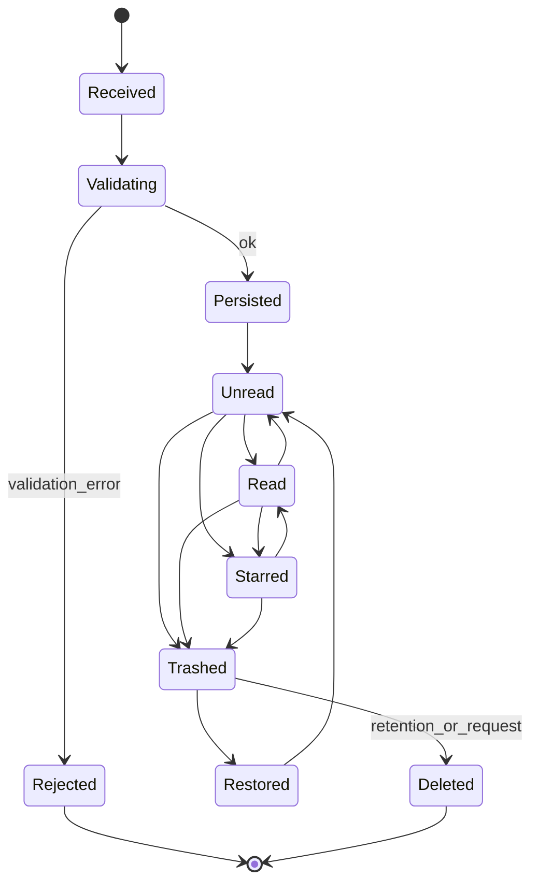
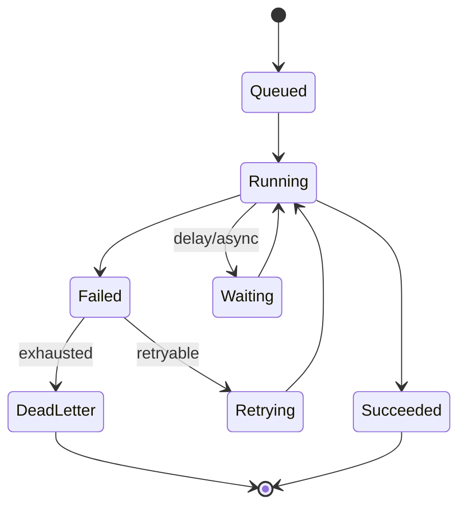
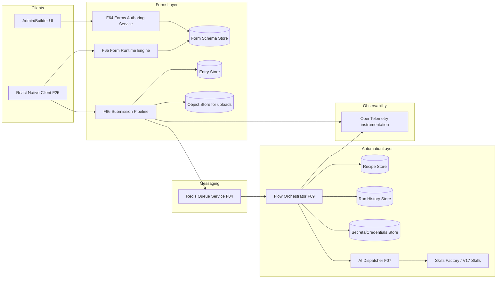
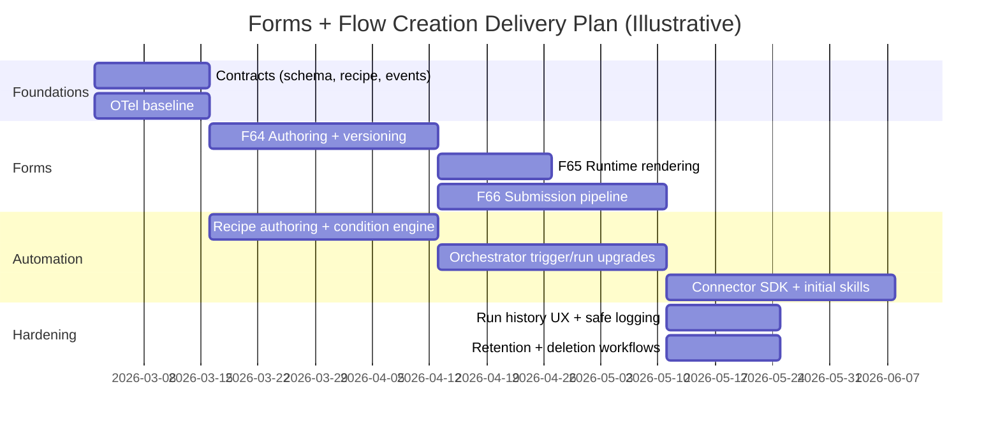
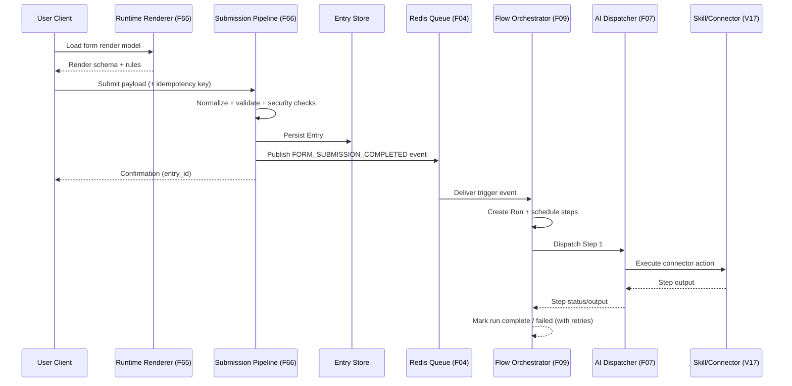

# Extending the Engine to Support Forms-Driven Flow Creation

## Executive summary

The attached 21-* material describes a **Gravity Forms–like product surface** implemented as two tightly-coupled but cleanly-separated layers: a **Forms layer** (authoring → runtime rendering → submission pipeline → entry storage) and a **Flow/Automation layer** (triggers → conditions → actions → execution with queue/retry/idempotency and run history). fileciteturn0file1 The core contract emphasized throughout is: **persist the submission (“entry”) first, then emit an event and run automations asynchronously** so integrations can fail/retry without losing the source-of-truth submission. fileciteturn0file1

For the current engine, the same material proposes implementing this by **extending the capability matrix** with three new services and leveraging existing orchestration primitives:

- **F64 Forms Authoring Service** to manage `FormSchema` (fields, validations, conditional logic). fileciteturn0file1  
- **F65 Form Runtime Engine** as a runtime/skill that renders schemas for the **React Native client (F25)** and handles wizard-like behavior. fileciteturn0file1  
- **F66 Submission Pipeline** as a high-throughput intake/normalize/validate/security/persist service. fileciteturn0file1  
- Integrate with your existing **Flow Orchestrator (F09)**, **AI Dispatcher (F07)**, **Skills Factory**, and **Redis Queue (F04)** by publishing a `FORM_SUBMISSION_COMPLETED` event and triggering an “Automation Recipe.” fileciteturn0file1  

To make this production-grade, the design should also formalize (a) the event envelope (recommended: **CloudEvents-style**) with required attributes like `id`, `source`, `specversion`, and `type`, citeturn0search0turn0search8 (b) end-to-end observability using **OpenTelemetry** (traces/metrics/logs), citeturn0search1turn0search18 and (c) hard security controls for submissions and uploads (CSRF protections, upload allowlists, and webhook signature verification for payment/inbound webhooks where applicable). citeturn2search2turn0search2turn0search10

Where the 21-* docs stop short is the *exact* current-state engine APIs, persistence schema, and runtime constraints (tenancy isolation, existing event format, existing run-history model). Those items are **unspecified** in the provided materials; this report therefore proposes concrete, implementable models and interfaces, and explicitly flags any assumptions.

## Extracted flow model from the 21-* docs

The documents define “flow creation” in practice as **non-developer authoring of automations** triggered by Forms lifecycle events (submission, payment success, etc.), with execution semantics typical of flow builders (conditions, mapping/transforms, retries, logs). fileciteturn0file1

### Flow-related entities and data models

The following entity model is a direct mapping of the described modules (“Form Definition”, “Submission Pipeline”, “Entry Storage”, “Feeds”, “Flow Builder Core Modules”, “Execution Engine”, “Run history”, etc.). fileciteturn0file1turn0file0

| Entity | Category | Purpose | Inputs | Outputs | Core constraints (from docs and implied by architecture) |
|---|---|---|---|---|---|
| `Form` | Forms | Stable container for a form across versions | name, tenant, status | form id | Must support lifecycle (draft/publish/archive) fileciteturn0file1 |
| `FormVersion` / `FormSchema` | Forms | Versioned schema: fields, pages, rules, settings | field definitions, conditional rules, settings | renderable schema | Published versions should be treated as immutable for safe replay of old entries (needed for run replay) fileciteturn0file1turn0file0 |
| `Field` | Forms | Captures input: types, validations, calculations | field config | normalized values | Validation rules (required/regex/cross-field) fileciteturn0file1 |
| `ConditionalRule` | Forms | UI logic (“show X if Y is Yes”) | field refs + predicates | visibility/branch decisions | Must be evaluated consistently client + server (server is source of truth) fileciteturn0file1 |
| `Entry` | Forms | Persisted submission + metadata | normalized submission payload | entry id | Entry lifecycle: unread/read, starred, trashed; supports export, edits, partial entries fileciteturn0file1 |
| `Attachment` | Forms | Uploaded file metadata referencing object store | upload token/object key | download URL / metadata | Allowlist file types, enforce size limits, rename files, authz downloads citeturn0search2turn0search9 |
| `NotificationTemplate` | Forms | Email/SMS templates with merge tags + routing rules | template + rules | message tasks | PII minimization in logs and destinations is required (avoid over-sharing) citeturn1search1 |
| `Feed` / `IntegrationRule` | Bridge | Per-form integration actions (“feeds”) | mapping + condition | action invocations | Should run asynchronously and be retryable fileciteturn0file1 |
| `Trigger` | Flow | “When X happens…” (form submitted, payment succeeded) | event envelope + payload | trigger match | Must support registry & matching fileciteturn0file1 |
| `Action` | Flow | “Do Y…” (create ticket, post message) | mapped inputs | structured outputs | Must be idempotent or made idempotent by runner fileciteturn0file1turn0file0 |
| `Condition` | Flow | If/else filters, branching | context object | branch selection | Deterministic evaluation for replay/debug fileciteturn0file1 |
| `Transform` | Flow | Mapping/transformation functions | raw entry + step outputs | shaped payloads | Must be safe (no arbitrary code exec in MVP) fileciteturn0file1 |
| `Recipe` / `AutomationRecipe` | Flow | Stored “flow” definition (trigger + steps + conditions) | authored JSON / UI | executable unit | Enable/disable; versioning needed for backward compat fileciteturn0file1 |
| `Run` + `RunStep` | Flow | Execution history, step logs, retries/replays | trigger event | run status, outputs | Required for observability & replay (explicitly called out) fileciteturn0file1turn0file0 |
| `ConnectorCredential` / `Secret` | Flow | OAuth tokens / API keys per tenant | auth flows, secrets | usable credentials | Use OAuth 2.0 / OIDC patterns; centralized secrets management citeturn2search0turn2search1 |

### States, events, and transitions

The documents describe states implicitly via lifecycle and pipeline stages; below is an explicit model derived from those stages (submission pipeline, entry lifecycle, payments, execution engine). fileciteturn0file1turn0file0

**Submission pipeline stages (event-worthy moments)**  
The pipeline described is: intake → normalize → validate → spam/security → persist entry → post-processing events (notifications/feeds/hooks) → confirmation. fileciteturn0file1

A practical event set (you do not need all in MVP, but the model should allow adding later):

- `FormSubmissionReceived`
- `FormSubmissionValidated`
- `EntryCreated`
- `FormSubmissionCompleted` (recommended primary trigger)
- `PaymentStateChanged` (if payments module is enabled)
- `NotificationDispatched`
- `FeedDispatched`

**Entry lifecycle states**  
The docs explicitly call out entry lifecycle flags like unread/read, starred, trashed. fileciteturn0file1 A complete lifecycle often adds “deleted/anonymized” for compliance (not specified in docs, but required operationally).



**Payment states**  
The docs describe payment state transitions like pending → paid → failed → refunded as typical for a payments add-on. fileciteturn0file1

**Run/step states**  
The flow builder description requires queue + retry + idempotency and observability/run history. fileciteturn0file1turn0file0 A minimal run state machine:



### Inputs and outputs

The documents imply the following I/O boundaries:

- **Form authoring input**: schema definition (fields, pages, rules, settings). Output: stored `FormSchema`. fileciteturn0file1  
- **Render input**: `form_id + version` (and optional context like user/locale). Output: render model for client (steps, dynamic visibility rules). fileciteturn0file1  
- **Submission input**: entry payload + file references + anti-abuse tokens. Output: persisted `entry_id` and confirmation response. fileciteturn0file1  
- **Automation input**: internal event `FORM_SUBMISSION_COMPLETED` plus entry reference; output: run record + action outputs + side effects in external systems. fileciteturn0file1  

## Required engine changes

This section maps the requirements into concrete changes across APIs, persistence, messaging, orchestration, and UI integration.

### Capability comparison

The “current” column is limited to what is explicitly referenced in the provided docs (F09/F04/F07/F10/F39/F25/V17). Anything else is marked **unspecified**.

| Area | Current engine capability (from docs) | Required capability for flow creation | Gap summary |
|---|---|---|---|
| Orchestration runtime | Flow Orchestrator **F09** exists and can consume queue events and run “Automation Recipes.” fileciteturn0file1 | Must support flow definitions (`Recipe`), step execution, branching, delays, retries, and run history. fileciteturn0file1turn0file0 | Recipe storage/versioning and run-history model are not specified; likely need to add/extend. |
| Messaging/queue | **Redis Queue Service (F04)** exists; used to publish `FORM_SUBMISSION_COMPLETED`. fileciteturn0file1 | Durable event delivery for triggers; at-least-once + dedupe via idempotency. | Event envelope/schema management not specified; needs standardization + DLQ semantics. |
| Action execution | **AI Dispatcher (F07)** routes step requests to skills in **Skills Factory**. fileciteturn0file1 | Trigger/action registry, standardized step input/output contracts, idempotency controls, connector SDK. fileciteturn0file1 | Need a consistent action interface and connector credential model. |
| Forms authoring | Proposed new **F64 Forms Authoring Service**; currently not indicated as present. fileciteturn0file1 | Visual/schema authoring, validation, versioning, publish workflows. fileciteturn0file1 | New service + UI + schema spec required. |
| Runtime rendering | Proposed **F65** runtime skill to render to **React Native client (F25)**. fileciteturn0file1 | Multi-step, conditional UI behavior consistent with server-side validation. fileciteturn0file1 | Need shared rule engine or consistent evaluation strategy. |
| Submission pipeline | Proposed new **F66** pipeline with idempotency + retry logic. fileciteturn0file1 | Intake/normalize/validate/anti-spam/persist/emit events. fileciteturn0file1 | New service + data store + abuse controls required. |
| Connector skills | Proposed additions in **V17-skills**: **F146** ticketing, **F147** payments, **F148** doc generation. fileciteturn0file1 | Connector adapters and secrets pipeline; replay-safe behavior; signature verification for inbound webhooks. citeturn0search10turn0search3 | Need connector framework + secret store + verification primitives. |

### Component architecture changes

The docs propose integrating Forms into the existing orchestrator and skills system, with artifacts added to the capability matrix. fileciteturn0file1 The following component interaction diagram is consistent with that proposal while adding the missing persistence+observability pieces needed for reliable flow creation.



### Messaging and event contract

The documents already name a concrete trigger event: `FORM_SUBMISSION_COMPLETED`. fileciteturn0file1 To make this evolvable and interoperable across services/skills, standardize the envelope as **CloudEvents-style**, which requires attributes including `id`, `source`, `specversion`, `type` (and commonly includes `time`, `datacontenttype`, etc.). citeturn0search0turn0search8turn0search4

A suggested internal event (example):

```json
{
  "specversion": "1.0",
  "type": "com.yourco.forms.submission.completed",
  "source": "//forms/F66",
  "id": "evt_01HV...",
  "time": "2026-02-25T12:34:56Z",
  "datacontenttype": "application/json",
  "subject": "form/f_123/entry/e_987",
  "data": {
    "tenant_id": "t_001",
    "form_id": "f_123",
    "form_version": 7,
    "entry_id": "e_987",
    "actor": { "user_id": "u_555", "anonymous": false }
  }
}
```

This approach directly supports trigger registries (“When X happens…”) and decouples Forms from Automation implementation details. fileciteturn0file1turn0file0

### API surface changes

A minimal API set needed for authoring, runtime, submissions, and automations (exact REST/GraphQL choice is **unspecified** in docs):

**Forms APIs**
- `POST /forms` create draft form
- `POST /forms/{form_id}/versions` create/edit draft version
- `POST /forms/{form_id}/publish` publish version (immutable)
- `GET /forms/{form_id}/render?version=` fetch render model
- `POST /forms/{form_id}/submit` submit entry (idempotent)
- `GET /entries?form_id=&filters=` list/search
- `GET /entries/{entry_id}` read
- `PATCH /entries/{entry_id}` lifecycle flags (read/star/trash), admin edits

These are directly implied by (a) schema builder, (b) runtime renderer, (c) submission pipeline, and (d) entry storage/lifecycle/export requirements. fileciteturn0file1

**Automation APIs**
- `POST /recipes` create automation recipe (trigger + steps)
- `POST /recipes/{id}/enable|disable`
- `GET /runs?recipe_id=&status=` run history
- `POST /runs/{run_id}/retry` retry run/step
- `POST /connectors/{provider}/connections` OAuth connect
- `GET /connectors/.../connections` list connections

These are required by trigger/action registries, queue+retry, secrets management, and observability/run history. fileciteturn0file1turn0file0

### Persistence requirements

Minimum persistence additions (storage technology is **unspecified**):

- Schema storage for `Form`, `FormVersion` / `FormSchema` and associated rules/settings. fileciteturn0file1  
- Entry storage for `Entry` metadata, normalized submission payload, submission audit metadata (IP, user agent), and lifecycle flags. fileciteturn0file1  
- Object storage for file uploads; enforce OWASP upload protections (allowlist, verify type, rename, enforce size, restrict access). citeturn0search2turn0search9  
- Automation storage for `Recipe`, `Run`, `RunStep`, and durable per-step output snapshots for debugging/replay. fileciteturn0file1turn0file0  
- Secure credential/secrets store; OAuth 2.0 and OpenID Connect align with typical connector patterns (OIDC provides an identity layer over OAuth 2.0). citeturn2search0turn2search1  

### Orchestration semantics and idempotency

The docs explicitly call for **queue + retry + idempotency** in the execution engine. fileciteturn0file1turn0file0 In practice, assume at-least-once delivery and implement idempotency at two layers:

- **Submission idempotency**: prevent duplicate `Entry` creation if clients retry the submit call.  
- **Action idempotency**: prevent duplicate external side effects when runs retry steps.

Stripe’s idempotency documentation is a canonical reference for “safe retries without accidentally performing the same operation twice,” including using an idempotency key for create/update requests. citeturn1search0turn1search4

Pseudocode sketch for submission idempotency (storage-based):

```pseudo
function submit(form_id, version, payload, idempotency_key, actor_ctx):
  assert idempotency_key is present
  key = hash(tenant_id, form_id, idempotency_key)

  existing = IdempotencyStore.get(key)
  if existing:
      return existing.response

  normalized = normalize(payload, schema)
  validate(normalized, schema, rules)
  spam_check(actor_ctx, normalized)

  entry = EntriesDB.insert({
    form_id, version,
    payload: normalized,
    actor: actor_ctx,
    status: "Persisted"
  })

  event = makeCloudEvent(
    type="com.yourco.forms.submission.completed",
    subject=f"form/{form_id}/entry/{entry.id}",
    data={tenant_id, form_id, version, entry_id: entry.id}
  )

  Queue.publish(event)

  response = { entry_id: entry.id, confirmation: compute_confirmation(schema) }
  IdempotencyStore.put(key, response, ttl=24h)
  return response
```

(CloudEvents required attributes referenced above.) citeturn0search0turn0search8

## Backward compatibility and migration concerns

The provided documents do not describe an existing Forms system, so migration scope is **unspecified**. Nonetheless, adding “flow creation” to a running orchestration engine introduces predictable compatibility risks; the following items should be treated as required workstreams rather than optional polish.

### Compatibility risks to manage

**Schema evolution and replay correctness**  
Because flows may be retried days later, any workflow run must be able to interpret the original entry consistently. That implies:

- Persist the **form version** used for each entry and keep published schemas immutable. fileciteturn0file1turn0file0  
- Ensure transforms/mapping logic is versioned with the recipe or stored with the run.

**Event format evolution**  
If your engine already has internal events, introducing a new envelope can break consumers. Mitigation:

- Wrap events in a versioned, CloudEvents-style envelope and provide adapter shims for any legacy event format. citeturn0search0turn0search8  
- Version the `type` and/or include `dataschema`/`subject` conventions as APIs evolve (CloudEvents supports standardized metadata fields). citeturn0search0turn0search17  

**Queue semantics and duplication**  
Retried deliveries will happen; design for at-least-once and enforce idempotency as above. citeturn1search0turn1search4

**Security posture changes**  
Public/anonymous forms introduce new attack surfaces:

- CSRF protections should be enforced using recommended patterns (server-generated tokens). citeturn2search2  
- File uploads must be strongly validated and access-controlled. citeturn0search2turn0search9

**Compliance and retention**  
The docs emphasize retention/deletion considerations; operationally this must align with GDPR storage limitation (keep personal data no longer than necessary) and Article 17 right to erasure requirements when applicable. citeturn1search2turn1search3turn1search6

### Migration strategy

Because prior data formats are **unspecified**, the safest path is:

- Introduce Forms and Recipes behind **feature flags per tenant** (and optionally per form). fileciteturn0file0  
- Use a **dual-write / dual-publish** phase only if an existing submission system exists (unspecified).  
- Backfill only what is required: if you later import historical submissions, tag them with `source_system` and `schema_version` to preserve semantics.

## Implementation plan and gap analysis

The documents already propose a new “Phase P16: Forms & Automation” with concrete substeps (define schema spec + integrate with Figma parser; build submission pipeline; create connector skills). fileciteturn0file1 This section expands that into an engineering plan with dependencies and explicit deliverables.

### Gap analysis table

| Gap | Evidence in docs | Impact | Priority | Recommended approach |
|---|---|---|---|---|
| No stored `FormSchema` authoring/versioning system | Forms definition & builder are required modules fileciteturn0file1 | Cannot create forms or guarantee replay | P0 | Implement F64 + immutable published versions |
| No submission persistence model (`Entry`) and lifecycle | Entry storage + unread/read/star/trash supported fileciteturn0file1 | No “source of truth”; hard to retry flows | P0 | Implement EntriesDB + lifecycle flags + export |
| No standardized trigger event envelope | Pattern: emit internal event; proposal uses `FORM_SUBMISSION_COMPLETED` fileciteturn0file1 | Hard to evolve triggers/consumers; weak interoperability | P0 | Adopt CloudEvents-style envelope citeturn0search0turn0search8 |
| Flow definitions not formally modeled as `Recipe` | Flow builder requires trigger/action registry + recipe model fileciteturn0file1 | Cannot support flow creation UX | P0 | Add recipe store + authoring API + UI |
| No run history + step logs + replay | Observability/run history required fileciteturn0file1turn0file0 | No debugging/retry at scale | P0 | Add RunsDB + step output snapshots + replay tooling |
| No connector credential store | Secrets/connector management required fileciteturn0file1turn0file0 | Integrations unsafe/unmanageable | P1 | Central secrets store + OAuth/OIDC patterns citeturn2search0turn2search1 |
| File upload hardening not specified | File uploads module required fileciteturn0file1 | High security risk | P1 | OWASP upload allowlist + storage isolation citeturn0search2turn0search9 |
| Payment/webhook verification design not specified | Payments module includes payment states and triggers fileciteturn0file1 | Spoofing/fraud risk | P1 | Verify signatures (e.g., Stripe) citeturn0search10turn0search3 |

### Prioritized task plan with effort and dependencies

Effort scale: **Low** (≤1 sprint), **Med** (1–3 sprints), **High** (≥4 sprints). Timeline dates are **illustrative**; actual milestones depend on team size and existing engine codebase (unspecified).

| Milestone | Tasks (deliverables) | Effort | Dependencies |
|---|---|---|---|
| Foundations | Define `FormSchema` JSON spec; define `Recipe` schema; define event envelope; establish RBAC roles for forms/entries/recipes/runs; baseline OpenTelemetry instrumentation | Med | Existing auth/RBAC model (unspecified); OTel export pipeline citeturn0search1turn0search18 |
| Forms authoring (F64) | CRUD + versioning; publish/rollback policy; schema validation; admin UI initial | High | Foundations |
| Runtime rendering (F65) | Render API; client rendering model; conditional logic evaluator strategy | Med | Forms authoring |
| Submission pipeline (F66) | Intake/normalize/validate/anti-spam; idempotency keys; entry persistence; upload flow; emit `FORM_SUBMISSION_COMPLETED` | High | Forms authoring; security controls (CSRF, upload hardening) citeturn2search2turn0search2 |
| Automation recipe authoring | Trigger registry (start with FormSubmissionCompleted); step graph model; condition engine; mapping/transforms | High | Foundations; submission event |
| Orchestrator upgrades (F09 integration) | Trigger matching; run creation; step scheduling; retries/backoff; DLQ; run history APIs | High | Automation recipe model; queue semantics |
| Connector framework | Secrets/credential store; connector SDK; add initial skills (ticketing, payments, doc generation) | High | Orchestrator upgrades; OAuth/OIDC patterns citeturn2search0turn2search1 |
| Observability UX | Run history UI; step logs; replay controls; redaction/safe logging policies | Med | Runs store; logging policy citeturn1search1turn1search9 |
| Compliance & retention | Retention policies; delete/anonymize entries; cascade delete attachments and derived run logs | Med | Entry store + object store; legal requirements definition citeturn1search2turn1search3turn1search6 |

Mermaid Gantt (illustrative ordering only):



## Test plan, validation criteria, performance/security, and risks

### Test cases and validation criteria

The documents frame expected user workflows (lead capture, support triage, paid booking) and the underlying required modules. fileciteturn0file1 A rigorous test plan should cover the following acceptance criteria.

**Form schema and rendering**
- Creating a form schema with conditional rules produces deterministic render outputs (same schema → same render model). fileciteturn0file1  
- Conditional UI behaviors in the client do not bypass server-side validation (server rejects invalid hidden-field violations). fileciteturn0file1  

**Submission pipeline**
- A submission that passes validation is persisted as an entry before any automation runs (hybrid pattern). fileciteturn0file1turn0file0  
- Idempotency: repeating `POST /submit` with the same idempotency key does not create multiple entries. (Pattern aligned with Stripe’s safe retry guidance.) citeturn1search0turn1search4  
- Anti-abuse: CSRF protections are enforced for browser-authenticated flows using standard mitigations. citeturn2search2  
- Upload security: disallowed extensions/types are rejected; size limits enforced; file names are generated; downloads require authorization. citeturn0search2turn0search9  

**Automation execution**
- Trigger matching: `FORM_SUBMISSION_COMPLETED` triggers only the intended recipes (by `form_id`, tenant, and enabled state). fileciteturn0file1  
- Retry semantics: transient connector failures retry with backoff; permanent failures surface in run history without infinite loops. fileciteturn0file1turn0file0  
- Idempotency on actions: duplicate event delivery does not duplicate external side effects (requires idempotency tokens or dedupe keys). citeturn1search0turn1search4  
- Observability: every run has an auditable history of step input/output (with PII redaction policy). fileciteturn0file1turn0file0  

**Payments/webhooks (if enabled)**
- Inbound webhooks are signature-verified (e.g., using `Stripe-Signature` and endpoint secret) before processing. citeturn0search10turn0search3  
- Payment state transitions emit consistent internal events that flows can trigger on. fileciteturn0file1  

**Compliance**
- Retention: entries and attachments can be deleted/anonymized according to configured retention, consistent with storage limitation expectations. citeturn1search2turn1search6  
- Erasure: personal data deletion requests are executed without undue delay across primary and derived stores (runs/logs). citeturn1search3turn1search7  

### Performance and reliability considerations

- Keep the synchronous submission path limited to **validate + persist + respond**, and push everything else (notifications, feeds, external calls) to async execution—this is explicitly aligned with the submission pipeline ordering described in the docs. fileciteturn0file1  
- Make the queue consumer and action execution robust to retries by default, using idempotency keys and dedupe state. citeturn1search0turn1search4  
- Instrument the submission pipeline and orchestrator with OpenTelemetry to trace a submission across event emission and run execution. citeturn0search1turn0search18  

### Security considerations

- Use OWASP CSRF mitigations for state-changing browser requests. citeturn2search2  
- Apply OWASP upload hardening: allowlist extensions, do not trust `Content-Type`, generate filenames, set size limits, and restrict uploads to authorized users. citeturn0search2turn0search9  
- Apply safe logging guidance (avoid logging sensitive data; build auditable trails) and ensure logs cannot be used as an injection/exfil mechanism. citeturn1search1turn1search9  
- For inbound webhooks (payments), verify signatures using official guidance (example: Stripe’s signature verification flow). citeturn0search10turn0search3  

### Risks and mitigations

| Risk | Why it matters | Mitigation |
|---|---|---|
| “Visual builder” scope expansion | Drag/drop + conditional logic UI can balloon beyond MVP | Start schema-first; add UI iteratively; freeze schema primitives early fileciteturn0file1 |
| Inconsistent rule evaluation client vs server | Conditional logic differences cause confusing validation failures | Use a shared rules DSL and a single reference evaluator on server; client is advisory only fileciteturn0file1 |
| Duplicate side effects from retries | Queue delivery and connector failures will cause retries | Require idempotency per submission and per action; store dedupe keys citeturn1search0turn1search4 |
| Weak observability → un-debuggable workflows | Without run history, support becomes impossible at scale | Persist Run/RunStep with outputs; instrument with OpenTelemetry fileciteturn0file0turn0file1turn0search1 |
| Upload and PII security incidents | Forms frequently capture sensitive data and files | OWASP upload controls + safe logging + strict RBAC citeturn0search2turn1search1turn2search2 |
| Compliance deletion gaps | Data may exist in entries, attachments, run logs | Implement end-to-end deletion orchestration; retention policies aligned with storage limitation and erasure rights citeturn1search2turn1search3turn1search6 |

### End-to-end “happy path” sequence



This sequence matches the “store locally first, then automate asynchronously” hybrid pattern described, while making explicit the integration with F09/F04/F07 and the skills catalog approach. fileciteturn0file1turn0file0