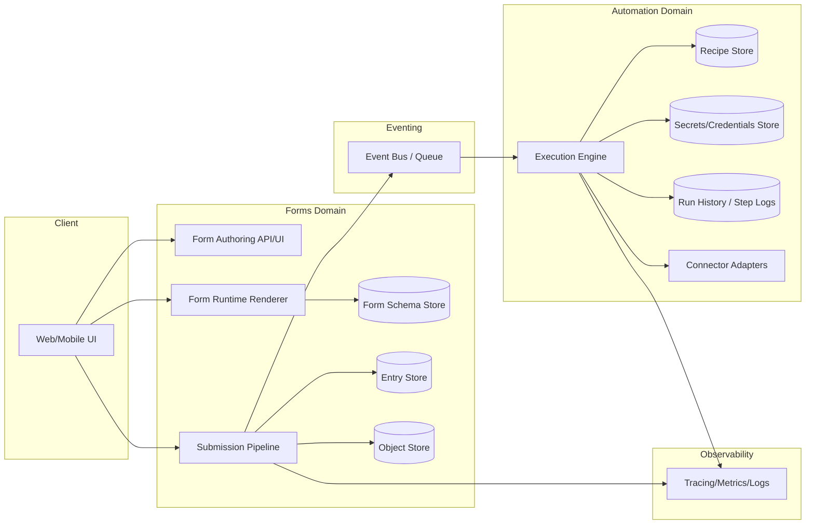
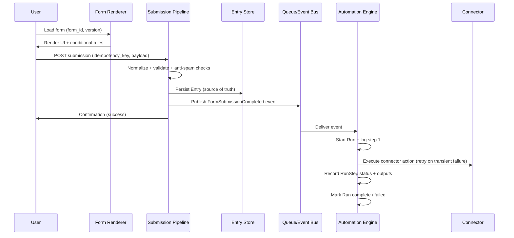

# Extending the Platform with Forms and Flow Automation

## Executive summary

The attached process description frames a “Gravity Forms–like” capability as a **Forms layer (authoring + runtime + submission storage)** combined with a **Workflow/Automation layer (triggers → actions → conditions → execution + queue/retry + run history)**, where the clean contract is: **Forms persists the entry first, then emits an event; Automation consumes the event and orchestrates integrations asynchronously**. fileciteturn0file0

A production-grade extension of your platform therefore centers on three outcomes:

1) **A versioned Form Schema system + renderer** (multi-step forms, conditional logic, validation rules, anti-spam controls) and an **Entry (submission) system** with lifecycle and export capability, mirroring the modules described in the file. fileciteturn0file0  
2) **An Automation/Recipe runtime** (trigger registry, action registry, condition engine, data mapping/transformations, execution engine with queue/retry/idempotency, secrets/connector management, and run observability), aligned with the “flow builder” modules in the file. fileciteturn0file0  
3) **A stable event contract** between them (recommend: **CloudEvents-style envelope** for interoperability) plus end-to-end **observability with OpenTelemetry** (traces, metrics, logs). citeturn1search5turn1search1turn1search12turn1search0

Key design recommendations (with rationale grounded in the referenced ecosystem):

- **Store the entry first; then trigger automations asynchronously** (“hybrid” pattern). This preserves the submission as the source of truth even when integrations fail and enables retries/replays. fileciteturn0file0  
- Implement **idempotency** for submission intake and connector actions; Stripe’s published guidance on idempotent requests illustrates both the necessity (safe retries) and practical constraints (time windows, parameter consistency). citeturn2search3turn2search7turn2search24  
- Treat external inbound events (payments, webhooks) as **untrusted**: verify signatures (example: Stripe’s `Stripe-Signature` verification flow) and do not log sensitive payloads indiscriminately (OWASP logging guidance). citeturn2search2turn2search6turn4search3  
- Plan storage/retention and deletion flows up front to meet **GDPR storage limitation and erasure** requirements and **CCPA deletion** rights where applicable. citeturn4search0turn1search11turn4search2turn4search4

Effort (MVP to “usable in production”): **Low ~8–10 weeks**, **Medium ~12–16 weeks**, **High ~20–28 weeks**, depending primarily on (a) how many connectors you ship initially, (b) whether you build a full visual builder or start with schema-driven authoring, and (c) how much multi-tenancy/compliance/security hardening already exists in your platform.

## Process recap, assumptions, and open questions

The file decomposes the target capability into two complementary products:

- **Forms Builder** modules: schema authoring, runtime rendering, a submission pipeline (intake → normalize → validate → spam/security → persist → post-processing events → confirmation), entry storage and lifecycle operations, notifications, “feeds” (per-form integration rules), payments, file uploads/media handling, admin operations, and extensibility (hooks/APIs). fileciteturn0file0  
- **Flow Builder** modules: trigger/action registries, condition engine, data mapping/transformations, execution engine, queue + retry + idempotency, secrets/connector management, and observability (run history, step logs, failures/replays). fileciteturn0file0  

The file also calls out three integration patterns between forms and automation, recommending a **hybrid**: persist locally first, then trigger automations asynchronously, with retry/replay capability. fileciteturn0file0

### Assumptions used for this report

Because your current platform architecture is unspecified, the recommendations assume:

- You can introduce **one new domain service** (Forms) and **one automation runtime** (or reuse an existing orchestrator if you have one). fileciteturn0file0  
- You have (or can add) a **durable data store** for schemas and entries, plus an **object store** for file uploads (or equivalent). citeturn2search0turn2search1  
- You can support modern authn/authz patterns: OAuth 2.0 / OIDC for user auth, service-to-service auth, and scoped tokens/roles. citeturn3search0turn3search1  
- You can instrument services using **OpenTelemetry**. citeturn1search12turn1search0  

### Mapping options for “current platform architecture”

The file itself hints at a capability-matrix style platform and an orchestrator/queue/skills architecture (e.g., “Flow Orchestrator”, Redis queue, skills catalog) but portions are truncated, so this report provides **mapping options** rather than presuming your exact internals. fileciteturn0file0

**Mapping option A (modular monolith):** Add Forms + Automation modules inside your existing backend, sharing a DB but enforcing clear domain boundaries (schemas/entries vs recipes/runs). This reduces operational overhead early but increases coupling over time.

**Mapping option B (microservices/event-driven):** Implement a dedicated Forms Service and Automation Service with separate stores and an event bus/queue between them. This aligns directly with “Forms emits events; Automation consumes them”. fileciteturn0file0

**Mapping option C (reuse existing orchestrator):** If your platform already has an orchestration engine (as the file implies), implement only the Forms domain and emit events to the orchestrator; add connector “skills” incrementally. fileciteturn0file0

### Open questions to resolve (if the markdown lacks specifics)

These are the main unknowns that materially affect design, estimates, and risk:

- **Tenancy model:** single-tenant vs multi-tenant; per-tenant encryption keys; isolation requirements. (Impacts authz, schema storage, secrets/connector storage.)
- **Identity model:** do you already use OIDC? Do you require SSO/SAML? (Affects auth flows; OIDC is “authentication built on top of OAuth 2.0”.) citeturn3search1turn3search0  
- **Submission access patterns:** anonymous public forms vs authenticated-only; “save and continue” draft submissions; partial entries. fileciteturn0file0  
- **Connector strategy:** do you intend to (a) build native connectors, (b) rely on tools like Zapier-style webhooks, or (c) ship both? (Zapier emphasizes triggers, webhooks/rest-hook subscriptions, and testing in its platform docs.) citeturn0search6turn0search22turn0search34  
- **Data residency/compliance:** GDPR jurisdiction, CCPA applicability, sectoral compliance (HIPAA/PCI) depending on form contents and payment flows. citeturn1search3turn4search2turn2search2  
- **File handling:** virus scanning requirements; attachment size limits; retention rules for uploads. (OWASP file upload guidance is explicit about validating types, size limits, and authorization.) citeturn1search2  
- **Latency/throughput goals:** peak submissions/minute; SLA for “submission confirmation”; acceptable delay for automations.

## Architecture and design options

The target architecture follows the separation explicitly recommended in the file: **Forms Service** (authoring + submission) and **Automation Service** (flows), connected by an internal event. fileciteturn0file0 A CloudEvents-like envelope is a pragmatic standardization choice because it is designed to provide interoperability across services and platforms. citeturn1search1turn1search5

### Reference architecture

This structure mirrors the file’s “Submission Pipeline (the heart)” plus the Flow Builder’s “Execution Engine + Queue + Retry + Idempotency + Observability”. fileciteturn0file0 It also aligns with common workflow tooling concepts like triggers/actions/error workflows and concurrency control. citeturn0search7turn0search15

### Design-options comparison

| Option | What you build | Pros | Cons | When to choose |
|---|---|---|---|---|
| Internal end-to-end | Full Forms + full Automation runtime, run history, connectors | Maximum control; best UX; unified RBAC, auditing, retention | Highest build cost; connector maintenance burden | You want a differentiated product and can invest long-term fileciteturn0file0 |
| External automation only | Forms subsystem emits webhooks to third-party orchestrators | Fastest to ship; leverage existing connector ecosystems | Limited observability/control; external failures harder to debug; security boundary at webhook | You only need basic automation for early GTM citeturn0search14turn0search22 |
| Hybrid (recommended baseline) | Persist entries + emit internal events + optional outbound webhooks | Entry remains source of truth; async retry; can add native connectors incrementally | Requires internal eventing + run tracking | Matches “store entry locally first; trigger automation asynchronously; retry/replay” best practice fileciteturn0file0 |

The “hybrid” recommendation mirrors the file’s “Pattern 3: Hybrid (best practice)”. fileciteturn0file0

### Event contract options

| Contract choice | Benefits | Costs / risks | Recommendation |
|---|---|---|---|
| Ad-hoc JSON payloads | Fast to implement | Inconsistent over time; difficult cross-service tooling | Avoid for multi-team scaling |
| CloudEvents-style envelope | Standard fields for id/type/source/time; interoperability across systems | Slight upfront work; training | Prefer for internal events and external webhooks citeturn1search5turn1search1 |
| One event per stage (validate/persist/complete) | Fine-grained reactions | More noise; complex ordering | Start with “FormSubmissionCompleted” + expand later fileciteturn0file0 |

## Required features, APIs, and data model changes

This section translates the file’s module list into concrete platform work: APIs, schemas, and lifecycle operations. fileciteturn0file0

### Required new features and public/internal APIs

A minimal-but-complete MVP generally needs:

**Forms APIs**

- **Form schema CRUD + versioning**: draft vs published; immutable published versions; schema validation endpoint (similar to “validating forms” concepts in form APIs). citeturn0search21turn0search5  
- **Runtime render API**: fetch schema + computed UI hints; support conditional rules and multi-step metadata. fileciteturn0file0  
- **Submission API**: POST submission with idempotency key; returns confirmation immediately once persisted; triggers async automation. fileciteturn0file0  
- **Entry APIs**: list/search entries, get entry, update status (read/star/trash), export. Gravity Forms’ REST v2 illustrates common endpoints for entries and required capabilities for GET/POST. citeturn0search9turn0search1  
- **Notifications API**: template management, routing rules, resend.

**Automation APIs**

- **Recipe CRUD** (trigger + steps + conditions) and activation state. fileciteturn0file0  
- **Connector credential management** (OAuth connections, API keys), secret rotation hooks. (OWASP secrets management summarizes best practices for centralized storage/rotation/auditing.) citeturn4search15  
- **Run history APIs**: list executions, inspect step logs, retry, replay from step, DLQ management. (n8n documents executions and retry flows as a baseline UX expectation.) citeturn0search35turn0search7  

### Core data entities

The file explicitly names (or implies) these core types: `FormSchema`, `Entry`, `Recipe`, `Run`, plus connector/secrets and feed/integration definitions. fileciteturn0file0 The table below proposes a concrete model set.

| Entity | Purpose | Key fields (illustrative) | Notes |
|---|---|---|---|
| Form | Container for versions | `form_id`, `tenant_id`, `name`, `status` | Keep stable `form_id` while versioning schema |
| FormVersion | Versioned schema + settings | `version`, `schema_json`, `rules_json`, `settings_json`, `published_at` | Publish is immutable; draft editable |
| Entry | Submission record | `entry_id`, `form_id`, `version`, `payload_json`, `user_id?`, `created_at`, `status`, `ip`, `user_agent` | Mirrors entry storage/lifecycle expectations fileciteturn0file0 |
| EntryAttachment | File metadata pointers | `entry_id`, `object_key`, `mime`, `size`, `sha256`, `scan_status` | Store content in object store; metadata in DB citeturn1search2turn2search0 |
| NotificationTemplate | Email/SMS templates | `template_id`, `subject`, `body`, `merge_tags` | “Merge tags” parallels typical form notifications fileciteturn0file0 |
| IntegrationFeed | Per-form integration config | `feed_id`, `form_id`, `provider`, `mapping`, `condition`, `enabled` | Gravity Forms “feed” concept: per-form add-on actions citeturn0search4turn0search0turn0search12 |
| Recipe | Automation definition | `recipe_id`, `trigger`, `steps[]`, `conditions`, `enabled` | Trigger often `FormSubmitted(form_id)` fileciteturn0file0 |
| Run / RunStep | Execution history | `run_id`, `recipe_id`, `entry_id`, `state`, `started_at`, `ended_at` | Required for replay and observability fileciteturn0file0 |
| ConnectorCredential | Stored auth material | `connector_id`, `type`, `scopes`, `encrypted_tokens`, `expires_at` | OAuth 2.0 is designed for limited access grants citeturn3search0 |

### Schema/storage changes and retention

**Schema storage.** Store `FormVersion.schema_json` as JSON (document) even if the system uses a relational DB; it reduces migration churn as field types and conditional logic expand. This mirrors how form tooling commonly treats schemas as structured documents. fileciteturn0file0

**Entry storage.** Store `payload_json` plus normalized “search columns” (e.g., email, phone, status, created_at) for efficient filtering/export; many form APIs expose entry search and retrieval endpoints, implying the need for indexing. citeturn0search9turn0search1

**File uploads.** Use time-limited object-store URLs (e.g., S3 presigned URLs) for uploads/downloads to avoid proxying large files through your API and to keep objects private by default. AWS documents presigned URLs as time-limited access without changing bucket policy. citeturn2search0turn2search4 OWASP recommends strict allowlists, file size limits, and authorization checks for uploads. citeturn1search2

**Retention and deletion.** The platform should support configurable retention at least per tenant and per form:

- GDPR’s **storage limitation** principle requires personal data be kept **no longer than necessary** for processing purposes. citeturn4search0turn4search8turn4search4  
- GDPR **right to erasure** (Article 17) implies you need operational deletion flows for entries, attachments, and derived automation logs when they contain personal data. citeturn1search11turn1search3  
- CCPA provides a consumer **right to delete** personal information (with exceptions), which similarly benefits from consistent deletion workflows across primary DB and downstream stores. citeturn4search2turn4search6  

For attachments in an S3-like store, lifecycle rules can transition/delete objects automatically, but note that lifecycle expiration is asynchronous and may not delete immediately on the nominal date—this matters for “deletion within X days” commitments. citeturn2search1turn2search14turn2search5

## Integration points and third-party services

The file frames integrations as “feeds” (per-form integration rules) and workflow “connectors”, and lists common targets across CRM, email marketing, ticketing, chat, and payments. fileciteturn0file0

### Connector approach

You have two non-exclusive integration surfaces:

1) **Outbound webhooks** (so external tools can orchestrate). Zapier documents both webhook concepts and REST Hook subscription patterns for instant triggers. citeturn0search14turn0search22turn0search34  
2) **Native connectors** implemented as adapter modules that the Automation Engine executes (parallel to Gravity Forms add-on “feeds” and feed management APIs). citeturn0search4turn0search12  

### Example third-party integrations to plan for

| Category | Examples | Integration pattern | Security notes |
|---|---|---|---|
| Payments | entity["company","Stripe","payments platform"], PayPal | Webhooks inbound + API calls outbound | Verify webhook signatures; use idempotency keys for retries citeturn2search2turn2search3turn2search6 |
| Ticketing / work mgmt | entity["company","Asana","work management SaaS"], entity["company","Atlassian","jira vendor"] | Create ticket on submission; attach files/links | Ensure least-privilege scopes; redact payloads in logs citeturn4search3turn3search0 |
| Messaging/alerts | entity["company","Slack","workplace messaging"], entity["company","Microsoft","software company"] Teams | Notify on submit / on failure; on-call paging | Treat message channels as data exfil paths; limit included PII citeturn4search3 |
| External automation | entity["company","Zapier","automation platform"], entity["company","n8n","automation platform"] | Webhook or event-based; recipe in external system | Clearly define auth, replay defense, and payload schemas citeturn0search22turn0search7turn0search15turn1search5 |

## Authentication, authorization, and security controls

The submission pipeline in the file explicitly calls out CSRF/spam protections, rate limits, and secure handling. fileciteturn0file0 This section turns those into concrete controls aligned with widely used security standards.

### Authentication and authorization model

**User authentication.** Prefer OIDC (authentication layer on top of OAuth 2.0) for end-user sessions, especially if you expect enterprise tenants. citeturn3search1turn3search0

**API authorization.** OAuth 2.0 is explicitly designed to grant limited access to HTTP services on behalf of a resource owner or for client credentials flows. citeturn3search0

**Role-based access control (RBAC).** The file notes admin permissions around viewing entries, editing forms, and re-running operations. fileciteturn0file0 Gravity Forms’ REST API v2 documents capability requirements for viewing and posting entries (e.g., `gravityforms_view_entries`, `gravityforms_edit_entries`), illustrating the practical need for scoped permissions at the “entries” boundary. citeturn0search9turn0search1

### Core security controls

**CSRF protections.** For any browser-authenticated, state-changing requests, OWASP recommends CSRF tokens when framework protections are not already in place. citeturn1search6turn1search27

**File upload hardening.** OWASP’s file upload guidance emphasizes allowlisting extensions/types, not trusting `Content-Type`, renaming files, and enforcing size/user authorization limits. citeturn1search2

**Webhook verification.** For inbound provider webhooks (payments, identity, etc.), verify signatures using official libraries where available; Stripe documents signature verification via request payload + signature header + endpoint secret. citeturn2search2turn2search6

**Secrets management.** Centralize storage, auditing, rotation, and avoid embedding secrets in code/config; OWASP’s Secrets Management cheat sheet summarizes these best practices. citeturn4search15

**Secure-by-design posture.** Align threat modeling and control selection to the OWASP Top 10 categories (broken access control, cryptographic failures, injection, insecure design, misconfiguration, etc.). citeturn3search3turn3search11

## Performance, scalability, observability, testing, and delivery

The file emphasizes queueing, retries, idempotency, and run history as first-class needs for a flow builder. fileciteturn0file0 This section operationalizes those requirements.

### Performance and scalability implications

**Submission latency.** Keep the synchronous path limited to: validate → persist entry → return confirmation, then offload notifications/feeds/automation to async jobs, matching the file’s pipeline ordering and its “hybrid” recommendation. fileciteturn0file0

**Automation concurrency control.** Workflow platforms typically include concurrency/queueing controls and distinctions between production executions vs manual/test runs; n8n documents concurrency control behaviors and caveats (queued execution behavior, resume on startup). citeturn0search15

**Idempotency for safe retries.** Stripe’s idempotency docs describe how idempotency keys allow safe retries and how mismatched parameters should error to prevent accidental misuse—useful guidance for both your submission endpoint and connector actions. citeturn2search3turn2search13turn2search24

### Error handling and observability

**Error taxonomy (recommended):**
- User-correctable: validation errors, required fields, conditional rule violations (return 4xx with field-level errors).
- System/transient: queue timeouts, upstream 5xx, rate limits (record as failed step; retry with backoff).
- Permanent integration errors: auth revoked, invalid mapping (disable feed/recipe or mark “needs attention”).

**Run history and failure workflows.** n8n documents an “error workflow” concept and “retry failed workflows,” which aligns with the run-history/replay expectations called out in the file. citeturn0search7turn0search35

**Distributed tracing, metrics, logs.** OpenTelemetry is a vendor-neutral observability framework for generating/collecting/exporting traces, metrics, and logs; standardizing on it prevents lock-in and supports cross-service correlation. citeturn1search12turn1search0turn1search20

**Security logging.** OWASP’s Logging Cheat Sheet emphasizes building logging mechanisms that support monitoring and security incident detection, while avoiding harmful logging practices. citeturn4search3turn4search11

### Testing strategy

A rigorous strategy should cover:

- **Unit tests:** schema validation, conditional-rule evaluation, mapping transforms, idempotency-key logic.
- **Integration tests:** DB migrations, object store presigned URL workflows, queue processing.
- **Connector contract tests:** mock upstream APIs; validate request/response schemas; include replay/idempotency tests (Stripe publish guidance on idempotent requests is a strong reference pattern). citeturn2search3turn2search7
- **End-to-end tests:** author form → render → submit → verify entry persisted → verify automation run logged → verify notifications/webhooks fired.
- **Security tests:** CSRF tests for browser flows; file upload malicious cases; webhook signature verification tests. citeturn1search6turn1search2turn2search2

### Deployment and CI/CD changes

Expect these pipeline changes:

- New DB migrations for `forms`, `form_versions`, `entries`, `runs`, `credentials`.
- Secret provisioning and rotation processes (align with OWASP guidance). citeturn4search15  
- Load-test and chaos-test stages for submission endpoints and worker queues.
- Feature flags for progressive rollout (per tenant, per form).

### Migration and backward compatibility

If you already have “forms” or “workflows” in any form:

- Introduce **versioned schemas** immediately (published versions immutable); renderers must accept older versions.
- Add **compatibility adapters** for existing webhook payloads/events; CloudEvents envelope helps evolve payloads while keeping stable metadata. citeturn1search5turn1search1  
- Migrate stored submissions into the new Entry model with a “source_version” marker to preserve interpretation logic.

## Roadmap, effort estimates, milestones, and risks

This roadmap assumes a project start the week after the current date (**2026-02-25**), i.e., **week of 2026-03-02** (assumption for timeline concreteness).

### Proposed implementation roadmap

| Milestone | Scope (deliverable) | Medium timeline (calendar) | Exit criteria |
|---|---|---|---|
| Foundations | Event contract + service skeletons + authz model | 2026-03-02 → 2026-03-13 (2 wks) | CloudEvents-like internal envelope defined; OTel baseline; RBAC roles drafted citeturn1search5turn1search12turn3search0 |
| Forms MVP | Schema CRUD/versioning + renderer + submission pipeline + entry storage | 2026-03-16 → 2026-04-17 (5 wks) | Publish form; render; submit; entry persisted; basic export; basic notifications fileciteturn0file0 |
| Automation MVP | Recipe model + worker engine + run history + retry/idempotency | 2026-04-20 → 2026-05-15 (4 wks) | Trigger on `FormSubmissionCompleted`; step retries; run logs; manual replay UI/API fileciteturn0file0turn2search3turn0search35 |
| Connectors pack 1 | 2–3 high-value connectors + outbound webhooks | 2026-05-18 → 2026-06-05 (3 wks) | Working integrations; signature verification for inbound webhooks where relevant citeturn2search2turn0search22 |
| Hardening | Security, compliance, load, operability | 2026-06-08 → 2026-06-26 (3 wks) | Retention/deletion flows; upload hardening; OWASP logging compliance; load targets met citeturn4search0turn1search2turn4search3 |

### Effort estimates (engineering-only, excluding product discovery)

- **Low (8–10 weeks):** schema-driven authoring (minimal UI), 1 connector, limited admin tooling, basic observability.
- **Medium (12–16 weeks):** roadmap above; 2–3 connectors; run history + replay; retention primitives.
- **High (20–28 weeks):** full visual builder (drag/drop), rich conditional logic UI, multi-step wizard builder, payments module + invoicing, advanced RBAC/audit, broad connector catalog, multi-region/data-residency.

These ranges are consistent with the feature breadth described in the file (forms authoring + runtime + submission pipeline + feeds + admin tooling + flow execution engine + secrets + observability). fileciteturn0file0

### Task breakdown with owners and estimates

| Workstream | Representative tasks | Owner (role) | Low | Med | High |
|---|---|---|---:|---:|---:|
| Forms backend | FormVersioning, validation engine, entry persistence, export | Backend Eng (Forms) | 3 w | 5 w | 8 w |
| Forms frontend | Builder UI, conditional-logic UI, preview, embed | Frontend Eng | 2 w | 4 w | 8 w |
| Automation runtime | Recipe model, execution engine, retries/DLQ, run history | Backend Eng (Automation) | 3 w | 5 w | 10 w |
| Connectors | OAuth flows, per-connector adapters, mapping UI | Full-stack Eng | 1 w | 3 w | 8 w |
| Security | Threat modeling, upload hardening, webhook verification | Security Eng | 1 w | 2 w | 4 w |
| Observability/SRE | OTel instrumentation, dashboards, alerting, load tests | SRE/Platform Eng | 1 w | 2 w | 4 w |
| QA | E2E suite, chaos/retry tests, regression automation | QA Eng | 1 w | 2 w | 4 w |

(“Low/Med/High” are person-weeks and assume parallelization across roles.)

### Key risks and mitigations

| Risk | Why it matters | Mitigation |
|---|---|---|
| Scope creep in builder UI | Drag/drop + conditional logic + multi-step UI grows quickly | Start schema-first; ship visual builder iteratively; keep schema stable fileciteturn0file0 |
| Connector reliability and replay | External APIs fail, rate-limit, and require retries | Standard retry/backoff + idempotency keys; run history + replay tooling citeturn2search3turn0search35 |
| Secrets leakage | Connectors require OAuth tokens/API keys | Central secret store + rotation + audit practices per OWASP citeturn4search15 |
| PII exposure in logs/notifications | Forms capture sensitive data; logs/chats are exfil paths | OWASP logging guidance; redact/allowlist fields; encrypt at rest citeturn4search3turn3search3 |
| Compliance deletion gaps | Hard to delete across DB, object store, run logs | Implement deletion orchestration; retention policies; ensure attachments lifecycle alignment citeturn1search11turn2search1turn4search2 |
| Webhook spoofing | Attackers can submit fake external events | Verify signatures (Stripe pattern); store raw body for verification citeturn2search2turn2search6 |

### Sequence flow for the recommended submission + automation pattern

This sequence matches the file’s pipeline ordering and its “store locally first, then automate asynchronously” guidance, while incorporating idempotency and retry expectations seen in workflow tools and payment APIs. fileciteturn0file0turn0search7turn2search3