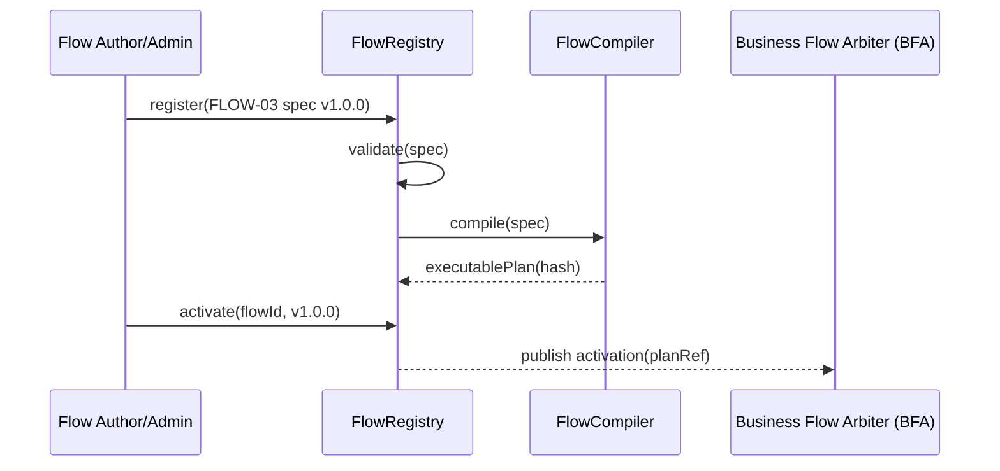
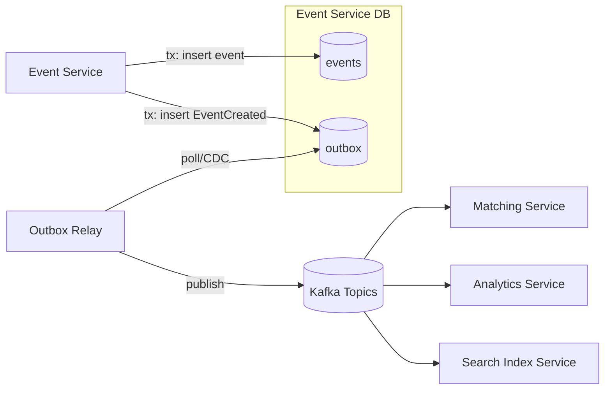
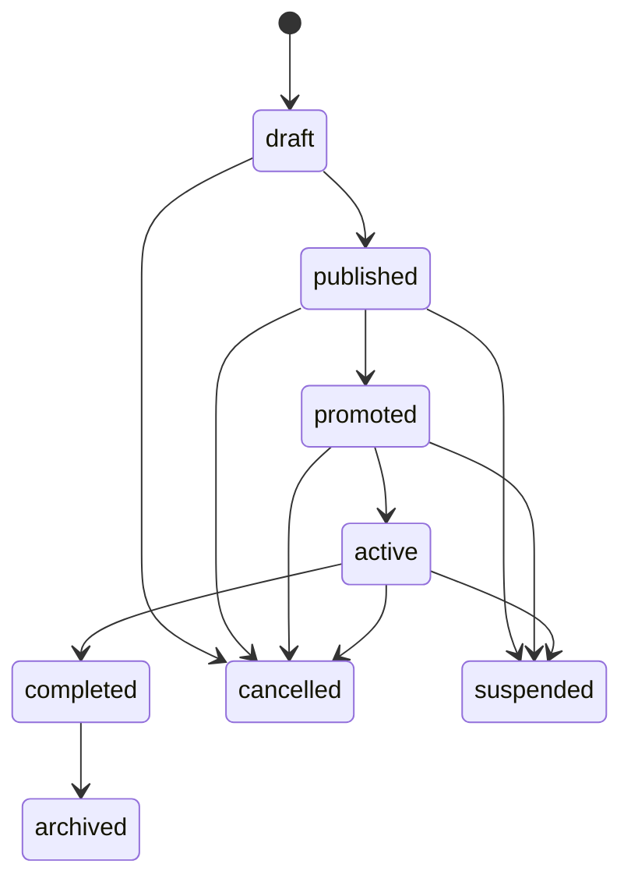
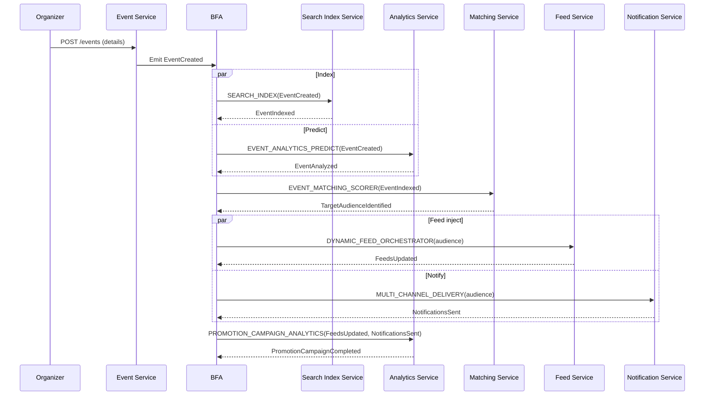

# Extending the XIIGen Unified Flow System to Support FLOW-03 Flow Creation and Execution

## Executive summary

The available FLOW-03 specification (“Event Creation & Promotion”) describes an event-driven, multi-service workflow that starts at `POST /events`, persists and publishes an event, then executes parallel downstream processing (search indexing, analytics prediction, audience matching), followed by feed injection + multi-channel notifications, and closes with campaign analytics publication. fileciteturn0file0L10-L21 fileciteturn0file0L28-L86 fileciteturn0file0L135-L157

From the same document, we can confirm the intended orchestration model for your engine: a **Business Flow Arbiter (BFA)** (introduced in V62) managing parallel and sequential execution steps, and a **Task Types Catalog** that is extended with FLOW-03-specific task types (`EVENT_MATCHING_SCORER`, `DYNAMIC_FEED_ORCHESTRATOR`, `MULTI_CHANNEL_DELIVERY`). fileciteturn0file0L245-L263

However, **the current engine’s implemented capabilities are largely unspecified in the provided sources** (no “basic prompt” or other 03-* documents were accessible in the environment beyond the FLOW-03 markdown file). Where the FLOW-03 spec implies engine capabilities (BFA + Task Types Catalog), I treat them as “documented.” Everywhere else, I label items as **unspecified** rather than assuming. fileciteturn0file0L245-L263

The main engineering gaps to support FLOW-03 end-to-end are:

- A **flow-definition/creation layer** that can register FLOW-03 as a versioned flow and compile it into an executable DAG with parallel branches, joins, time-based scheduling, and retry/idempotency semantics (core to bursty, multi-step workflows). fileciteturn0file0L135-L157  
- A **standard event envelope + schema governance** across services for `EventCreated`, `EventIndexed`, `TargetAudienceIdentified`, etc., plus reliable message publication (e.g., transactional outbox) and consumer idempotency since distributed messaging is typically at-least-once. fileciteturn0file0L220-L232 citeturn2search0 citeturn7search0  
- Concrete **service APIs + data models** for events, audience match results, feed injection, notifications, and campaign metrics, aligned to the payloads in FLOW-03’s “Event Definitions” table and the YAML persona section. fileciteturn0file0L28-L86 fileciteturn0file0L220-L232  
- Cross-cutting: **validation** (timezone, date-in-past, edits), **security** (rate limiting, moderation, organizer controls), **privacy/compliance** (location data consent), **performance** (CPU-heavy matching + large fanout), and **testing** (load + chaos + idempotency). fileciteturn0file0L180-L193 fileciteturn0file0L104-L116 citeturn4search0 citeturn3search4

A pragmatic phased plan (no deadline assumed) is to deliver a minimal FLOW-03 slice (create event → publish `EventCreated` → index → basic audience selection → feed inject) first, then add notification orchestration, then analytics/campaign metrics, then advanced scenarios (editing, paid tiers, recurring), while hardening reliability and compliance throughout. fileciteturn0file0L158-L179 fileciteturn0file0L245-L272

## Sources, scope, and explicit unknowns

### What was available and used

The only project source available in this environment was the FLOW-03 document:

- `03-event-creation-promotion.md` (Flow ID: FLOW-03, Version 1.0, Last Updated 2026-02-25). fileciteturn0file0L1-L7

This document includes: a long-form description, a YAML persona block (services, event chain, algorithm weights/thresholds, feeds/notifications rules, data stores), user stories, happy path, scenarios, edge cases, an event status machine, event definitions, and a section explicitly describing how to extend the engine (XIIGen Unified Flow System V62) via new task types and BFA orchestration. fileciteturn0file0L28-L86 fileciteturn0file0L135-L157 fileciteturn0file0L245-L272

### What was not available (and therefore treated as unspecified)

- The “project’s basic prompt.”  
- Any other “03-*” documents besides FLOW-03.  
- Any current engine documentation describing already-implemented features, APIs, data models, retry semantics, persistence, or production topology.

As a result, **mapping to “current engine capabilities” is necessarily constrained**: only capabilities explicitly referenced in FLOW-03 are considered “documented,” and everything else is marked “unspecified” rather than assumed.

### External primary sources used (only for cross-cutting engineering rigor)

Because FLOW-03 references specific technologies and compliance constraints, I cite official or widely recognized primary sources for foundational behaviors:

- Distributed messaging delivery semantics and idempotency guidance for entity["organization","Apache Kafka","distributed streaming platform"]. citeturn2search0turn2search3  
- entity["organization","Redis","in-memory data store"] sorted sets complexity and usage (useful for feed ranking/injection). citeturn3search3turn3search5  
- entity["organization","Elasticsearch","search engine"] indexing/refresh behavior and performance tuning. citeturn1search0turn1search1  
- entity["company","Stripe","payments company"] refunds/security and webhook replay-attack protections. citeturn1search3turn2search6turn6search0  
- entity["organization","European Data Protection Board","eu dp authority"] + GDPR text sources (location data as personal data; consent requirements). citeturn4search0turn4search1turn3search4  
- Transactional outbox pattern references (reliable DB+event publication without 2PC). citeturn7search0turn7search1  
- Trace context propagation standards via entity["organization","OpenTelemetry","observability project"]. citeturn5search2turn5search3  
- entity["organization","NestJS","node.js framework"] Kafka microservices integration reference (since FLOW-03 names Nest.js services). citeturn5search0  
- entity["organization","PostgreSQL","relational database"] locking primitives (relevant to concurrency/atomicity requirements). citeturn3search1  

## FLOW-03 functional requirements inventory

FLOW-03’s functional goal is to “handle the full lifecycle of creating a business event” from organizer submission through audience matching, feed injection, notifications, and campaign analytics publication. fileciteturn0file0L10-L21

At a requirements level, FLOW-03 defines:

- **Entry point and prerequisites**: `POST /events`; user must be authenticated and authorized to create events. fileciteturn0file0L28-L33  
- **Multi-service decomposition**: event storage/status/indexing; analytics prediction/metrics; matching; feed injection; notifications; search index; message queue batching. fileciteturn0file0L33-L40  
- **Event-driven chain** with explicit domain events and consumers (e.g., `EventCreated` triggers analytics, matching, search indexing). fileciteturn0file0L41-L50 fileciteturn0file0L220-L232  
- **Matching algorithm**: weighted multi-factor scoring and tier segmentation thresholds. fileciteturn0file0L52-L62 fileciteturn0file0L194-L201  
- **Feed placement rules**: score thresholds mapping to top positions and timing rules for updates (immediate vs within 1 hour vs batched daily). fileciteturn0file0L63-L73 fileciteturn0file0L203-L208  
- **Notification policy**: channel selection rules by match score, urgency, and distance. fileciteturn0file0L75-L79 fileciteturn0file0L209-L214  
- **Persistence and infra targets**: events in PostgreSQL, feed and match caches in Redis, search index in Elasticsearch, event topics via Kafka. fileciteturn0file0L81-L86  
- **State machine for events**: draft → published → promoted → active → completed → archived; plus cancelled and suspended transitions. fileciteturn0file0L215-L218  
- **Operational requirements** around burstiness and scaling, plus explicit alerts and blast radius analysis. fileciteturn0file0L117-L126  
- **Security/compliance controls**: rate limiting, moderation, organizer reputation/approval for paid events, restrictions on organizer messaging, re-notification rules when price changes, atomic capacity handling, GDPR consent for location, and refunds within 48 hours (delegated payment processing to Stripe). fileciteturn0file0L104-L116  
- **Advanced scenarios and edge cases** including multiple pricing tiers, early bird deadlines, recurrence templates, editing after publication, timezone correctness, oversubscription race conditions, zero-match fallback, and notification overload SLAs. fileciteturn0file0L158-L193  

Finally, FLOW-03 explicitly states how the engine should be extended: add task type definitions, and let the BFA orchestrate parallel+sequential execution steps including indexing, predictive analytics, matching, delivery orchestration, and campaign analytics. fileciteturn0file0L245-L263

## Current engine baseline and feature-to-capability mapping

### Baseline: what is “current engine capability” according to available sources

From FLOW-03’s engine-extension section, the only “current engine” components that are explicitly referenced are:

- The entity["organization","XIIGen Unified Flow System","workflow orchestration engine"], at version “V62” (named, but not described in detail), and specifically the statement that **BFA was introduced in V62**. fileciteturn0file0L245-L263  
- A **Business Flow Arbiter (BFA)** that “will manage the parallel and sequential execution” of the event lifecycle. fileciteturn0file0L255-L263  
- A **Task Types Catalog** that can be expanded with new task types/modules. fileciteturn0file0L247-L253  

Everything else about the engine (how flows are defined, stored, validated, deployed, versioned, executed; what its persistence model is; how tasks are implemented; how retries/idempotency are handled; etc.) is **not described** in available sources.

### Feature mapping table: FLOW-03 requirements vs current engine support

Because “current engine capabilities” are largely unspecified, this mapping table uses three classifications:

- **Documented**: explicitly referenced in FLOW-03.  
- **Implied**: strongly suggested by FLOW-03 but not explicitly stated as implemented in the engine.  
- **Unspecified**: not enough information.

| FLOW-03 feature | Evidence in FLOW-03 | Current engine capability (per available sources) | Gap / required extension |
|---|---:|---|---|
| Flow identification, versioning, and lifecycle metadata | FLOW-03 header includes Flow ID/version/last updated | Unspecified (engine metadata handling is not described) | Add flow registry with versioning + migration policy |
| HTTP entry point mapping (`POST /events`) + authz prerequisite | YAML: entry_point/prerequisite | Unspecified (engine API gateway integration is not described) | Add/verify request-to-flow binding + authz hooks |
| Parallel pipeline orchestration (indexing + analytics + matching) | Long description + happy path + “BFA manages parallel/sequential” | Documented for orchestration concept (BFA) | Ensure engine supports parallel branches, joins, and step gating |
| Task-type modularity (catalog expansion) | Explicit “Task Types Catalog” expansion | Documented (catalog exists) | Implement new task types + plugin interfaces |
| Event-driven chain and domain events (`EventCreated`, etc.) | YAML event_chain + event definitions table | Implied (flow describes events; engine not described) | Implement event envelope + schema mgmt + routing |
| `EVENT_MATCHING_SCORER` task | Engine extension proposal | Documented as required new task type | Build task + dependencies on user profile data (FLOW-02) |
| `DYNAMIC_FEED_ORCHESTRATOR` task | Engine extension proposal | Documented as required new task type | Build task + feed-store abstraction + ranking semantics |
| `MULTI_CHANNEL_DELIVERY` task | Engine extension proposal | Documented as required new task type | Build task + channel adapters + throttling/queueing |
| Search indexing step and `SEARCH_INDEX` task mention | Engine extension proposal step 1 | Implied (task name used, but existence not proven) | Define/verify `SEARCH_INDEX` task contract + ES integration |
| Analytics predictions and campaign completion metrics | Long description + happy path + event definitions | Implied (service exists in flow; engine support unknown) | Add analytics task interface + metrics storage/publishing |
| Event status machine (draft→published→…) | Explicit state machine | Unspecified (engine state mgmt vs domain state not described) | Implement domain state machine + transitions + auditing |
| Rate limiting, moderation, anti-abuse, compliance | Security persona section | Unspecified (engine policy layer unknown) | Add platform policy hooks + enforcement services |
| Data-store topology (Postgres/Redis/ES/Kafka) | YAML data_stores | Unspecified (engine infra may differ) | Align infra or introduce adapters/abstractions |

Evidence: FLOW-03 overall requirements and engine extension proposals. fileciteturn0file0L1-L86 fileciteturn0file0L135-L263

### Summary of “gaps” attributable to missing engine details

The primary uncertainty is not whether FLOW-03 needs certain capabilities (it clearly does), but **whether the engine already has them**. The missing “basic prompt” and other 03-* docs are therefore a critical blocker for a truly exact “current vs required” delta.

To proceed safely, the rest of this report specifies extensions in a way that:

- Uses only FLOW-03 as the source of requirements. fileciteturn0file0L10-L214  
- Treats BFA + Task Types Catalog as “existing concepts.” fileciteturn0file0L247-L263  
- Encapsulates infrastructure-specific assumptions behind interfaces (so the same design can map to your actual engine internals once confirmed).

## Required engine extensions and detailed designs

### Extension: Flow definition and “flow creation” support

**Purpose**  
Enable the engine to “create” (register) FLOW-03 as a versioned, validated flow artifact and compile it into a runtime plan executable by BFA, including parallel branches, joins, and time-based scheduling required by feed update timing. fileciteturn0file0L63-L73 fileciteturn0file0L255-L263

**Detailed design**

**Interfaces**

- `FlowRegistry` (control plane):
  - `register(flowSpec: FlowSpec, version: SemVer, changeLog: string) -> FlowId`
  - `activate(flowId, version) -> ActivationId`
  - `validate(flowSpec) -> ValidationReport`
  - `diff(flowId, vA, vB) -> FlowDiff` (for backward-compatibility checks)

- `FlowCompiler`:
  - `compile(flowSpec) -> ExecutablePlan` (DAG + triggers + policies)

- `FlowRuntime/BFA` integration points:
  - `start(flowId, version, inputEnvelope) -> RunId`
  - `emit(eventEnvelope)` (for mediated domain events)
  - `schedule(runId, stepId, notBefore)` (for delayed steps like batched_daily) fileciteturn0file0L70-L73

**FlowSpec schema (minimal)**  
A practical schema is a superset of what FLOW-03 already provides in YAML (entry point, tasks, event chain) plus execution policies (retry, idempotency, timeouts, priority). fileciteturn0file0L28-L50

Example (conceptual):

```yaml
flow_id: FLOW-03
version: 1.0.0
entry:
  http:
    method: POST
    path: /events
    authz: event.create
tasks:
  - id: persist_event
    type: EVENT_PERSIST
    emits: [EventCreated]
  - id: index_event
    type: SEARCH_INDEX
    on: [EventCreated]
    emits: [EventIndexed]
  - id: analyze_event
    type: EVENT_ANALYTICS_PREDICT
    on: [EventCreated]
    emits: [EventAnalyzed]
  - id: match_audience
    type: EVENT_MATCHING_SCORER
    on: [EventIndexed]
    emits: [TargetAudienceIdentified]
  - id: inject_feeds
    type: DYNAMIC_FEED_ORCHESTRATOR
    on: [TargetAudienceIdentified]
    emits: [FeedsUpdated]
    scheduling: # supports urgent/this_week/batched_daily
      strategy: derived_from_event
  - id: notify
    type: MULTI_CHANNEL_DELIVERY
    on: [TargetAudienceIdentified]
    emits: [NotificationsSent]
  - id: campaign_metrics
    type: PROMOTION_CAMPAIGN_ANALYTICS
    on: [FeedsUpdated, NotificationsSent]
    join: all
    emits: [PromotionCampaignCompleted]
policies:
  retries:
    default: { max_attempts: 5, backoff: exponential, jitter: true }
  idempotency:
    key_fields: [event_id]
  timeouts:
    match_audience: 15s
```

**State management**
- Control-plane: `flows` (id, version, status: draft/active/deprecated, created_by, created_at, spec_hash).
- Runtime: `flow_runs` (runId, flowId, version, correlationId, status, startedAt, finishedAt, errorSummary), and `flow_steps` (runId, stepId, status, attempts, lastError, timings).

**Validation**
- Static validation: DAG acyclicity, all referenced task types exist, event emissions/consumptions consistent, join semantics well-defined.
- Policy validation: timeouts and scheduling policies must exist for steps that require SLA enforcement (matching latency > 15s is an alert condition in FLOW-03). fileciteturn0file0L123-L124

**Error handling**
- Step-level retries with bounded attempts.
- Dead-lettered step executions to an operator queue when retry budget is exhausted.
- Compensation hooks for “cancel all pending notifications” when organizer suspended mid-promotion. fileciteturn0file0L188-L189

**Security**
- Flow registration/activation restricted by RBAC (admin-only).
- FlowSpec signing (optional) to prevent tampering in CI/CD.

**Performance**
- Flow compilation cached by `spec_hash`.
- Runtime scheduling implemented with a priority queue (important for “strong matches within 5 minutes” SLA). fileciteturn0file0L192-L193

**Sequence/flow diagram**



**Estimated effort**: **High** (this is a platform capability; even if partial pieces exist, stitching them into safe “flow creation” is significant).

**Dependencies**
- Existence of BFA and Task Types Catalog concepts (documented). fileciteturn0file0L247-L263  
- CI/CD pipeline for deploying flow specs (unspecified).  
- Secret management and RBAC for administrative operations (unspecified).

**Backward-compatibility risks**
- Introducing flow versioning without a migration policy can strand in-flight runs.
- If flow specs are editable-in-place, you risk nondeterministic replays; enforce immutability per version.

**Migration steps**
- Introduce registry in “shadow mode”: register and validate only, no runtime activation.
- Activate FLOW-03 behind a feature flag; keep existing execution paths unchanged until parity tests pass.

---

### Extension: Standardized domain event envelope, topics, and reliable publication

**Purpose**  
FLOW-03 is explicitly event-driven (`EventCreated → ...`) with multiple service consumers. To run reliably, the engine and services need: (1) a consistent envelope/schema, (2) a topic strategy, and (3) reliable publication semantics that tolerate retries and duplicates. fileciteturn0file0L41-L50 fileciteturn0file0L220-L232

**Detailed design**

**Event envelope**
A recommended envelope for cross-service processing:

```json
{
  "event_id": "uuid",
  "event_type": "EventCreated",
  "event_version": 1,
  "occurred_at": "RFC3339 timestamp",
  "producer": "event-service",
  "correlation_id": "uuid",
  "causation_id": "uuid",
  "trace": {
    "traceparent": "00-...-...-01",
    "tracestate": "..."
  },
  "payload": { }
}
```

Trace context fields follow OpenTelemetry guidance for recording/propagating trace identifiers. citeturn5search2turn5search3

**Topic strategy**
FLOW-03’s YAML suggests two topics: `event-events` and `notification-events`. fileciteturn0file0L81-L86  
A scalable alternative is a per-domain topic strategy (e.g., `events.event.created.v1`) plus consumer groups per service; the correct choice is unspecified because your existing topic conventions are not available.

**Reliable publication (transactional outbox)**
When a service both updates its database and emits a message, avoid dual-write inconsistencies by using the transactional outbox pattern: write the domain state and outbox record in one DB transaction, then relay outbox rows to Kafka asynchronously. citeturn7search0turn7search1

**Consumer idempotency**
Kafka semantics are typically at-least-once; consumers must tolerate duplicates by tracking processed `event_id` (or achieving idempotent write patterns keyed by business IDs). citeturn2search0turn2search3

**State management**
- `outbox` table: (id, aggregate_type, aggregate_id, event_type, event_version, payload_json, headers_json, created_at, published_at, publish_attempts).
- `inbox` (optional) per consumer: (event_id, consumer, processed_at, status) to enforce idempotency.

**Validation**
- Schema validation per `event_type` and `event_version` (reject incompatible payloads early).
- Ensure FLOW-03 payload fields match the “Event Definitions” table (e.g., `TargetAudienceIdentified` includes `audienceSegments[]`, `matchedUsers[]{userId, matchScore, ...}`). fileciteturn0file0L220-L232

**Error handling**
- Relay retry with exponential backoff; after N failures, alert + park message.
- Consumer DLQ: invalid schema, unhandled exceptions, or poison messages.

**Security**
- Topic ACLs: producers can only write allowed topics; consumers read only needed topics.
- Payload minimization for privacy: do not emit raw PII if unnecessary; for example, emitting user IDs + scores may be sufficient, while “matchReasons” must be reviewed for sensitive attributes. fileciteturn0file0L228-L229

**Performance**
- Batch relay publication (important during bursty event creation peaks). fileciteturn0file0L121-L122  
- Producer idempotence/transactions can reduce duplicates but may increase latency depending on configuration; choose based on SLA. citeturn2search3turn2search5

**Flow diagram**



**Estimated effort**: **Medium–High** (depends on whether you already have an event bus + envelope).

**Dependencies**
- Kafka (or equivalent) availability is implied by FLOW-03 YAML but not confirmed as current. fileciteturn0file0L81-L86  
- DB access patterns for outbox, plus a relay mechanism (polling or CDC).

**Backward-compatibility risks**
- Introducing a new envelope can break existing consumers if not versioned.
- Topic changes can cause double-processing unless consumer group offsets are managed carefully.

**Migration steps**
- Dual-publish during migration: publish both legacy and new envelope formats (if legacy exists; unspecified).
- Gradually cut consumers to new topics/envelope; keep “inbox” idempotency during cutover.

---

### Extension: Task Types Catalog expansion and service adapter contracts

**Purpose**  
FLOW-03 explicitly requires new task types in the catalog—`EVENT_MATCHING_SCORER`, `DYNAMIC_FEED_ORCHESTRATOR`, `MULTI_CHANNEL_DELIVERY`—and implies additional tasks such as indexing and campaign analytics. fileciteturn0file0L247-L263

**Detailed design**

**Catalog interface (conceptual)**
- `TaskType` metadata: name, version, input schema, output events, retry policy, timeout policy, resource class (CPU/memory), and permissions.
- Runtime hooks: `execute(context, input) -> output | emits(events)`.

**Required task types and contracts**

| Task Type | Purpose (FLOW-03) | Input | Output / Events |
|---|---|---|---|
| `EVENT_PERSIST` (name unspecified in FLOW-03, but required) | Store event + set initial status `"published"` | `CreateEventRequest` | emits `EventCreated` |
| `SEARCH_INDEX` | Index event for discovery | `EventCreated` payload | emits `EventIndexed` |
| `EVENT_ANALYTICS_PREDICT` | Predict attendance/virality | event details | emits `EventAnalyzed` |
| `EVENT_MATCHING_SCORER` | Compute multi-factor match for active users | event + user profile index refs | emits `EventMatchesCalculated`, `TargetAudienceIdentified` |
| `DYNAMIC_FEED_ORCHESTRATOR` | Inject into users’ feeds by score tiers + timing | audience segments | emits `FeedsUpdated` |
| `MULTI_CHANNEL_DELIVERY` | Orchestrate in-app/push/email/SMS delivery via channel rules | audience segments + event | emits `NotificationsSent` |
| `PROMOTION_CAMPAIGN_ANALYTICS` | Compute reach/impressions/CTR/conversions/ROI | feed+notification results | emits `PromotionCampaignCompleted` |

Task types explicitly named in FLOW-03 are `EVENT_MATCHING_SCORER`, `DYNAMIC_FEED_ORCHESTRATOR`, `MULTI_CHANNEL_DELIVERY`; the rest are implied by the flow’s steps/events. fileciteturn0file0L220-L232 fileciteturn0file0L247-L263

**Service adapter API contracts (example)**
- Event Service:
  - `POST /events` (create)
  - `PATCH /events/{eventId}` (edit)
  - `POST /events/{eventId}/cancel`
  - `POST /events/{eventId}/suspend`
- Search Index Service:
  - `POST /index/events` or async index request consumed from Kafka.
- Matching Service:
  - `POST /match/event/{eventId}` (optional) or async consumer.
- Feed Service:
  - `POST /feeds/events/inject` (batched).
- Notification Service:
  - `POST /notifications/campaigns` (batched send plan).

FLOW-03 does not define these REST shapes explicitly beyond the entry point; therefore, the above are interface proposals, not extracted requirements. fileciteturn0file0L28-L33

**Error handling**
- Enforce standard task error taxonomy: validation error (non-retry), dependency unavailable (retry), partial fanout (retry with checkpoint), and “poison payload” (DLQ).
- For large fanouts (feeds/notifications), tasks must be resumable from checkpoints to avoid restarting from scratch after a retry.

**Security**
- Task-level permission checks (e.g., only Notification Service task can send SMS).
- Ensure organizers cannot trigger arbitrary notifications (explicitly an attack surface item). fileciteturn0file0L108-L113

**Estimated effort**: **Medium** for catalog entries + adapters (higher if your engine lacks plugin infrastructure).

**Dependencies**
- BFA supports task invocation and event triggers (documented concept). fileciteturn0file0L255-L263  
- Each downstream service exists (FLOW-03 lists language stacks but does not confirm they are already implemented). fileciteturn0file0L117-L122

**Backward-compatibility risks**
- If Task Types Catalog is global, adding new tasks is low-risk; changing shared base interfaces is high-risk.

**Migration steps**
- Add new task types as “disabled” until FLOW-03 is activated.
- Run end-to-end in staging with synthetic traffic and idempotency validation.

---

### Extension: Event domain model, validation, and state management

**Purpose**  
FLOW-03 requires robust validation (date-in-past rejection; timezone handling), a lifecycle state machine, and edit-after-publication behavior (including re-notification). fileciteturn0file0L180-L179 fileciteturn0file0L215-L218

**Detailed design**

**Core data model (relational)**
Proposed tables (names indicative):

- `events`
  - `event_id` (UUID, PK)
  - `organizer_id` (UUID)
  - `status` (ENUM: draft/published/promoted/active/completed/archived/cancelled/suspended)
  - `title`, `description`, `category`, `tags[]`
  - `start_time_utc`, `end_time_utc` (or `date_time_utc`)
  - `timezone` (IANA TZ string) + `location` (lat/lon/address/region)
  - `pricing` (JSONB for tiers, early bird deadline)
  - `capacity_total`, `capacity_remaining`
  - `created_at`, `updated_at`, `version` (optimistic concurrency)
- `event_change_log` (for audit + re-notification triggers)
- `event_status_transitions` (optional, for compliance/audit)

FLOW-03’s YAML indicates PostgreSQL as the events store and lists events table fields at a high level (host_id, dates, capacity, pricing, status). fileciteturn0file0L81-L86

**Validation rules (explicit requirements)**
- Reject “event date in the past.” fileciteturn0file0L186-L187  
- Store in UTC but display in user timezone; matching must consider user availability in their local time. fileciteturn0file0L182-L184  
- For paid events: approval workflow and organizer reputation scoring are required mitigations. fileciteturn0file0L108-L111  
- Rate limit event creation (5 events/day/user). fileciteturn0file0L108-L110  

**State machine execution**
FLOW-03 defines the allowed transitions. fileciteturn0file0L215-L218  
Represent transitions in code plus DB constraints where feasible.



**Edit-after-publication handling**
FLOW-03: edits to date/location/price require re-notification to already-registered attendees and feed position recalculation. fileciteturn0file0L175-L179  
Design:
- When editing, write an `EventUpdated` domain event capturing changed fields and old/new values (payload-minimized).
- Downstream: Matching/Feed/Notification decide whether to recompute and re-send (policy-based by changed field).

**Capacity concurrency**
While registration is more directly part of FLOW-08 (“event participation”), FLOW-03 explicitly calls out overselling prevention via atomic counters and an edge case with “exactly 1 remaining.” fileciteturn0file0L184-L186 fileciteturn0file0L112-L113  
A typical implementation uses DB atomic updates or row-level locking; PostgreSQL provides explicit locking primitives and advisory locks (if needed) for awkward concurrency patterns. citeturn3search1

**Compliance & privacy**
- Location data is personal data under GDPR definitions, and FLOW-03 requires user consent for location data processing. fileciteturn0file0L115-L116 citeturn4search1turn4search0  
- Consent guidance is elaborated in EDPB consent guidelines; the engine should record consent provenance and allow withdrawal. citeturn3search4

**Estimated effort**: **Medium** (higher if Event Service does not exist).

**Dependencies**
- Identity/authz system to enforce “permission to create events” (unspecified). fileciteturn0file0L28-L33  
- Organizer reputation/approval workflow for paid events (unspecified implementation). fileciteturn0file0L108-L111  

**Backward-compatibility risks**
- Introducing ENUM statuses can break existing clients if they assume a subset.
- Changing time fields/timezone rules can shift displayed times; requires careful migration and UI coordination.

**Migration steps**
- Create new columns/tables in additive manner.
- Backfill status/timezone for existing events if any exist (unspecified).
- Gate new validation rules behind feature flags initially, then enforce once data quality is confirmed.

---

### Extension: Matching, feed injection, and notification orchestration at scale

**Purpose**  
FLOW-03’s core value is automated promotion through audience matching, feed placement, and multi-channel notifications, with explicit scoring weights, thresholds, and SLAs. fileciteturn0file0L18-L20 fileciteturn0file0L52-L79 fileciteturn0file0L192-L193

**Detailed design**

**Matching service contract**
- Input: event details + access to user profiles (“business profiles from Elasticsearch” is mentioned). fileciteturn0file0L144-L145  
- Output: per-user match scores, reasons, and tier segmentation (`strong/medium/weak`). fileciteturn0file0L52-L62 fileciteturn0file0L227-L229  

**Scoring implementation**
FLOW-03 provides an explicit weighted sum formula. fileciteturn0file0L194-L201  
Store per-feature sub-scores to enable explanations (“matchReasons”) without recomputation, but ensure sensitive inference is assessed (privacy). fileciteturn0file0L228-L229

**Feed injection data structure**
FLOW-03 suggests Redis as “feed cache” and “event match cache.” fileciteturn0file0L81-L86  
A common design is Redis sorted sets per user for ranking; Redis sorted sets support score-ordered retrieval and typical operations are O(log n). citeturn3search3turn3search5

Proposed key scheme:
- `feed:events:{userId}` as ZSET with member=`eventId`, score=`rankingScore`

RankingScore can incorporate:
- matchScore (primary)
- event freshness / start time proximity (secondary)
- tie-breaker (lexicographic member ordering is deterministic when scores equal). citeturn3search2turn3search3

**Placement rule enforcement**
FLOW-03 defines discrete placement buckets (top 3 / top 10 / within view / below fold). fileciteturn0file0L63-L69 fileciteturn0file0L203-L208  
Implementation detail options (policy decision; current UI/feed model is unspecified):
- Option A: Encode bucket priority into score (e.g., `bucketWeight + matchScore`) so top-3 bucket always ranks above others.
- Option B: Maintain multiple ZSETs per bucket and merge on read.

**Update timing**
FLOW-03 explicitly calls out urgent/this_week/future timing. fileciteturn0file0L70-L73  
BFA/runtime needs delayed scheduling or a queue with delivery delay (implementation not specified in project sources).

**Notification orchestration**
FLOW-03 channel rules are explicit. fileciteturn0file0L75-L79 fileciteturn0file0L209-L214  
Design:
- Build a `NotificationPlan` per audience tier.
- Enqueue in message queue with priority: strong matches first; SLA 5 minutes for strong. fileciteturn0file0L192-L193  
- Ensure deduplication keys (`eventId + userId + channel + reason`) to prevent multiple sends on retries.

If using Kafka for notification events (as implied), remember delivery may be at-least-once and duplicates are possible; idempotency is required. citeturn2search0turn2search3

**Failure modes and recovery**
FLOW-03 describes blast radius: matching failure means “events created but not promoted (manual recovery via re-trigger).” fileciteturn0file0L125-L126  
Therefore, design:
- A re-trigger mechanism: `POST /admin/flows/FLOW-03/rerun?eventId=...&fromStep=match_audience`.
- Persistent checkpoints for large fanout steps.

**Sequence diagram for the FLOW-03 happy path**



Happy-path steps and event names are directly from FLOW-03. fileciteturn0file0L135-L157 fileciteturn0file0L220-L232

**Estimated effort**: **High** (matching compute + fanout feed/notification is the bulk of complexity).

**Dependencies**
- FLOW-02 business profiles (explicit dependency) for matching features. fileciteturn0file0L100-L101  
- Message queue service for batched notification delivery (explicitly listed). fileciteturn0file0L33-L40  
- SMS/email/push providers (unspecified).  
- UI service consuming `FeedsUpdated` and surfacing event feed (explicit consumer). fileciteturn0file0L48-L49  

**Backward-compatibility risks**
- Feed ranking changes impact user experience; mitigate with A/B testing knobs described in FLOW-03 (e.g., push threshold 0.6 vs 0.7). fileciteturn0file0L102-L103  
- Notification rule changes can spike costs (SMS) or reduce engagement.

**Migration steps**
- Start with “in-app only” notifications (lowest risk) then add push/email, then SMS for urgent.
- Shadow matching: compute scores but do not inject; compare predicted vs actual engagement metrics.

---

### Extension: Search indexing and analytics integration

**Purpose**  
FLOW-03 requires events to be searchable and also to be analyzed for predictions and campaign metrics. fileciteturn0file0L18-L21 fileciteturn0file0L220-L232

**Detailed design**

**Search indexing**
FLOW-03 states: Event Service stores and indexes; Search Index Service indexes event; `EventIndexed` triggers matching/search. fileciteturn0file0L18-L20 fileciteturn0file0L135-L145  
Design considerations:
- If matching performs a search immediately after indexing, Elasticsearch refresh behavior matters; explicit refresh is resource-intensive and “refresh=wait_for” or periodic refresh is recommended depending on latency needs. citeturn1search1turn1search0  
- For bursty indexing (business hours), tune refresh interval and bulk indexing policies as per Elastic guidance. citeturn1search0

**Analytics**
FLOW-03 analytics outputs:
- predictions: expectedAttendance, viralityScore, categoryTrend
- campaignMetrics: reach, impressions, clickThrough, conversions, roi fileciteturn0file0L226-L232

Design:
- Store predictions with event record or separate analytics table keyed by `eventId`.
- Campaign analytics requires joining feeds + notifications outcomes and (for conversions) registrations/purchases (likely FLOW-08). Dependency is implied but registration flow doc is missing.

**Estimated effort**: **Medium** (higher if analytics models/pipelines don’t exist).

**Dependencies**
- Elasticsearch cluster and index templates (unspecified existing setup). fileciteturn0file0L83-L85  
- Analytics Service scaling and model pipeline (listed as Python/ML). fileciteturn0file0L117-L122  

**Backward-compatibility risks**
- Index mapping changes require reindexing; plan for versioned indices and alias cutovers.

**Migration steps**
- Implement indexing first with minimal fields; add fields progressively.
- Add analytics predictions as optional enrichment; do not block promotion on analytics availability (FLOW-03 already discusses failure blast radius and recovery). fileciteturn0file0L125-L126  

## Phased implementation plan and estimates

### Prioritization logic

FLOW-03’s critical path for user-visible value is: **create event → match audience → show in feed → notify**. Analytics and campaign ROI are valuable but can follow once the promotion loop exists. fileciteturn0file0L10-L21 fileciteturn0file0L135-L157

The plan below assumes a small-to-medium team and typical enterprise CI/CD cadence; timelines are relative and should be adjusted once the actual current engine baseline is known (currently unspecified).

### Phased roadmap with milestones and deliverables

| Phase | Goal | Milestones | Deliverables | Est. timeline |
|---|---|---|---|---|
| Foundation | Make FLOW-03 registerable and runnable in the engine | FlowSpec schema + registry; BFA glue; event envelope spec | Flow registry service; compiler; runtime step records; event envelope + schema validation | 3–5 weeks |
| Event creation slice | Allow organizer to create a published event + emit `EventCreated` | `POST /events`; validation; persistence; outbox | Event Service MVP; `events` table; transactional outbox relay; `EventCreated` emission | 2–4 weeks |
| Indexing + discovery | Make event searchable + trigger `EventIndexed` | ES index template; index task; refresh policy | Search Index Service adapter; `EventIndexed` event; basic search UI/API | 2–3 weeks |
| Matching + audience tiers | Compute match scores and segments | Feature extraction; weights/thresholds; caching | `EVENT_MATCHING_SCORER` task; `TargetAudienceIdentified` event; match cache/table | 4–6 weeks |
| Feed injection | Place events into user feeds with timing rules | Feed keys + rank policy; batch writes | `DYNAMIC_FEED_ORCHESTRATOR`; Redis feed structures; `FeedsUpdated` event; UI integration | 3–5 weeks |
| Notifications | Multi-channel notifications by tier/urgency | In-app first; push/email; SMS for urgent; queue priority | `MULTI_CHANNEL_DELIVERY`; dedup/idempotency; delivery metrics; SLA enforcement/alerts | 3–6 weeks |
| Campaign analytics | Compute reach/impressions/CTR/conversions/ROI | Attribution model; aggregation jobs | `PROMOTION_CAMPAIGN_ANALYTICS`; dashboards; `PromotionCampaignCompleted` | 2–4 weeks |
| Advanced scenarios + hardening | Paid tiers, early bird, recurrence, edit-after-publish, suspension | Edit-triggered recompute; refund/cancel flows; abuse controls | Scenario support; operational runbooks; load/chaos tests; compliance artifacts | 4–8 weeks |

Phases and deliverables are driven by FLOW-03 requirements and its “engine extension” section. fileciteturn0file0L158-L179 fileciteturn0file0L245-L272

### Task breakdown table

Effort is **Low/Medium/High** relative to your team’s codebase size; “Dependencies” include FLOW-03 explicit cross-flow links where available.

| Task | Description | Effort | Key dependencies | Notes / risks |
|---|---|---|---|---|
| FlowSpec + registry MVP | Store/version flows; validate/compile to executable plan | High | BFA integration (documented concept) | Needed for “flow creation” control plane |
| Runtime run/step persistence | Persist `flow_runs` + `flow_steps` for retries/observability | Medium | DB (unspecified) | Enables safe retries + audits |
| Define event envelope + schemas | Standard event metadata + per-event payload schema | Medium | Messaging/event bus | Must support versioning for compatibility |
| Implement transactional outbox | Avoid dual-write issues | Medium | Postgres (implied) | Outbox pattern requires consumer idempotency citeturn7search0turn2search0 |
| `POST /events` | Create event endpoint with validation | Medium | Authz system | Must reject past events and enforce rate limit fileciteturn0file0L108-L110 |
| Event status machine | Implement transitions & invariants | Medium | Domain model | Includes suspended/cancelled rules fileciteturn0file0L215-L218 |
| Search indexing task | Index to ES; emit `EventIndexed` | Medium | Elasticsearch | Refresh policy impacts perf/latency citeturn1search0turn1search1 |
| Matching scorer task | Compute weighted scores + tiers | High | FLOW-02 profiles; compute infra | CPU-heavy; must be optimized fileciteturn0file0L121-L122 |
| Feed orchestrator task | Inject into feeds by placement rules | High | Redis feed store | Sorted sets are candidate structure citeturn3search3 |
| Notification orchestration | In-app/push/email/SMS routing + queue | High | Providers; queue | Dedupe/idempotency required; SLA targets fileciteturn0file0L192-L193 |
| Abuse controls | Moderation, fake event approvals, organizer restrictions | Medium | Trust & safety tooling | Explicit attack surface requirements fileciteturn0file0L108-L113 |
| GDPR consent recording | Consent tracking for location processing | Medium | Privacy platform | Location is personal data; consent guidance citeturn4search1turn3search4 |
| Payments + refunds integration | Paid events + refund policy | High | Stripe integration | PCI compliance shared responsibility citeturn2search6turn1search3 |
| Observability/tracing | Trace context propagation + metrics + alerts | Medium | OpenTelemetry | W3C propagation via OTEL citeturn5search3turn5search2 |
| Load + chaos tests | Fanout storms: 10k notifications; feed backlog | High | Test infra | Must test overload scenario explicitly fileciteturn0file0L192-L193 |

## Quality, security, and migration approach

### Validation, error handling, and reliability

FLOW-03 enumerates multiple failure/edge conditions that should be first-class acceptance criteria, not afterthoughts: timezone correctness, race conditions at capacity boundaries, auto-archival of stale drafts, organizer suspension, zero-match fallback, and notification overload backpressure with SLA tiering. fileciteturn0file0L180-L193

A reliability posture aligned to FLOW-03 should include:

- **At-least-once event processing + idempotent consumers**: Messaging systems often redeliver; Kafka documentation discusses at-least-once semantics and the need to coordinate offsets with outputs for stronger semantics. citeturn2search0  
- **Outbox + DLQ**: transactional outbox for producers, DLQ for consumers, and replay tooling for failed segments. citeturn7search0turn7search1  
- **Checkpointed fanout** for feed updates and notifications (avoid “restart from zero” retries). This is implied by the scale discussion (one event → thousands of feed writes). fileciteturn0file0L121-L122  
- **Search indexing latency control**: choose ES refresh strategy carefully; explicit refresh is resource-intensive and tuning refresh interval can improve indexing speed. citeturn1search1turn1search0

### Security and compliance controls

FLOW-03 provides a concrete abuse model and classification guidance (semi-public event details; confidential organizer/payment; internal matching data). fileciteturn0file0L104-L116

Key controls that should be implemented as platform primitives (not one-off code):

- **Rate limiting** at creation time (5 events/day/user), plus content moderation hooks on description/title. fileciteturn0file0L108-L110  
- **Paid event approvals and organizer reputation** (policy engine + admin workflows). fileciteturn0file0L110-L111  
- **Notification abuse prevention**: organizers must not directly message attendees outside platform channels; enforce via API surface area and RBAC (no “custom message push” endpoint). fileciteturn0file0L111-L112  
- **Price change governance**: price changes trigger re-notification; require audit and possibly “cooldown” windows. fileciteturn0file0L112-L113  

For compliance:

- FLOW-03 explicitly requires **GDPR consent for event location data processing**. GDPR defines location data as personal data, and EDPB provides guidelines on consent requirements and withdrawal expectations. fileciteturn0file0L115-L116 citeturn4search1turn3search4  
- FLOW-03 states payments via Stripe with PCI DSS compliance delegated; Stripe’s guidance emphasizes PCI compliance as shared responsibility and provides security guidance. fileciteturn0file0L115-L116 citeturn2search6turn2search1  
- If Stripe webhooks are used for refunds/cancellations, signature verification and replay protections must be enforced; Stripe documents timestamp-based replay attack protections and recommends rapid 2xx responses. citeturn6search0

### Performance and ops readiness

FLOW-03 explicitly anticipates bursty creation, CPU-heavy matching, burst notification fanout, and write-heavy feed updates. fileciteturn0file0L121-L122

Operational readiness should therefore include:

- **Backpressure mechanisms**: queue depth-based scaling for notifications; job prioritization (strong matches first). fileciteturn0file0L192-L193  
- **Redis feed structures sized and monitored**: sorted sets’ complexity properties are well-understood; very large range queries need caution. citeturn3search5  
- **Elasticsearch indexing tuning** under bursts: adjust refresh interval and bulk settings where acceptable. citeturn1search0  
- **Tracing and correlation**: propagate W3C trace context through HTTP and events for cross-service debugging. citeturn5search3turn5search2  

FLOW-03’s suggested alerts (error rate >2%, matching latency >15s, notification failure >5%, feed backlog >1000) should be codified as SLOs wired into your monitoring stack. fileciteturn0file0L123-L124

### Backward compatibility and migration strategy

Because current engine behavior is unspecified, the safest migration strategy is **additive + gated**:

- Add new flow creation registry and runtime tables without changing existing flows.
- Add FLOW-03 as a new flow “slot,” activated behind feature flags.
- Use **dual-run/shadow modes** for matching and feed injection: compute and log results without user-visible injection until validated.
- Introduce notification channels gradually (in-app → push/email → SMS), since cost and abuse risk increase significantly with SMS. fileciteturn0file0L75-L79

Where external systems are integrated (payments, webhooks), adopt well-documented verification practices (Stripe webhook signature/timestamp validation) and avoid designs that require delayed signature verification. citeturn6search0