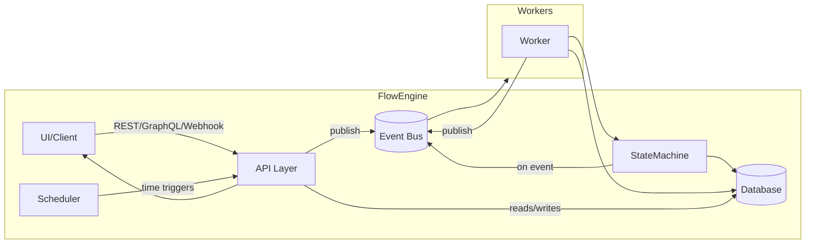

# Extending the Flow Engine for Visual Flow Composition

**Executive Summary:** We propose transforming the existing flow engine into a **visual “composition” engine** that can manage *page-layout flows* (nodes, containers, UI elements) in addition to logic flows.  Flows become directed graphs of nodes (pages, sections, containers, elements) with inputs/outputs (“handles”) and edges【10†L134-L139】【37†L109-L113】.  Each flow is modeled as a state machine (e.g. Created → Draft → Active → Completed), where **States** represent design or runtime stages and **Transitions** (triggered by events or user actions) carry **conditions/guards**【12†L10-L14】.  For example, a state machine might have states “Designing” → “Review” → “Published”, with transitions gated by approvals.  We must extend the engine’s runtime (state machine + scheduler + event bus) to understand these flows, persist their graph structure, and handle triggers (manual, scheduled, or external events) and guard conditions.  

**Flow Entities, States & Transitions:** We define key entities: a **Flow** (the overall composition), **Node** (page/section/container/element), **Edge** (connections or parent-child relationships), and **Condition** or **Trigger** objects.  Nodes have properties like `id`, `type`, `layoutMode`, `style`, and optional **data bindings** and **constraints** (e.g. “lock layout” vs “allow content edit”).  For example, a node JSON schema might be:  
```json
{
  "nodeId": "card_post_001",
  "type": "CONTAINER",
  "layoutMode": "FLEX_VERTICAL",
  "style": { "padding": "20px", "gap": "12px", "borderRadius": "8px" },
  "bindings": {
    "title": "$.skill_05.latest_post.title",
    "coverImage": "$.skill_11.processed_media.url"
  },
  "constraints": { "lockLayout": true, "allowContentEdit": true }
}
```  
A Flow’s **state machine** can be illustrated like a UML state diagram: for instance, a door with states (“Opened”, “Closed”, “Locked”) and transitions triggered by events (Open/Close/Lock) shows that **not all events are valid in each state** and transitions can have guard conditions (e.g. only lock if `doorWay.isEmpty`)【23†L169-L177】. (See Fig. 1). Similarly, our flow states will only allow certain transitions under specific conditions, ensuring e.g. that a layout update can only be published if it passes validation.  

【24†embed_image】 *Fig. 1: Example state machine diagram (door: Opened/Closed/Locked) with event triggers and a guard condition【23†L169-L177】.*  

Graphically, flows are node-based graphs.  Figure 2 shows a sample visual-flow graph: nodes (blocks) with inputs/outputs (“handles”) connected by edges【10†L134-L139】【37†L109-L113】.  This allows complex, even cyclic flows (e.g. node 4 connects to node 2, forming a loop) – patterns not possible in linear code【37†L109-L113】.  In our editor UI, each node type will define allowable ports (data inputs/outputs), and edges represent the flow of data or control between nodes.  

【35†embed_image】 *Fig. 2: Example node-based flow graph (nodes with handles and edges).  Node-based flows allow arbitrary graph structures, including intersecting cycles【37†L109-L113】.*  

**Engine Architecture Changes:** The flow engine must be **event-driven** and **stateless**, managing flow state via a database and an event bus【7†L158-L166】. We introduce three new/extended components:  
- **State Machine Engine:** Manages each flow’s lifecycle. It stores the current state in a database and, on each event, loads and advances the state (as in Salesforce’s EFlow: “the flow engine is an event-driven system… on each event the associated flow state is retrieved… the state of the flow is advanced and stored back”【7†L158-L166】).  This implies adding new states and transitions (e.g. *Designing, Preview, Review, Published*).  
- **Scheduler:** A cron-like service that triggers flows based on time or conditions (e.g. auto-publish at 2 AM, or re-render on content change).  The scheduler emits events to start flows at defined times or on changes, feeding into the event bus.  
- **Event Bus + Workers:** An asynchronous messaging layer. When a trigger occurs (e.g. **UI node edited** or **API call**), an event is published.  Worker processes pick up the event, load the flow (graph) and execute the appropriate step or transition, then emit follow-up events.  For scalability, the event bus can be sharded and workers autoscaled (as in EFlow)【7†L158-L166】.  

A possible architecture diagram (simplified) in Mermaid might look like:  



Here the **API layer** (REST or GraphQL) fronts both the existing logic flows and the new UI flows.  It receives flow definitions (from the UI) and flow run requests, persists flow schemas/state in a database, and publishes events to the bus. The **StateMachine** component advances flows through states. The **Scheduler** initiates flows based on timing or external triggers. Workers execute tasks (layout calculation, data binding, etc.), then update state and emit completion events.  

**Data Model & Schema Extensions:** We must extend the data schema to represent flow graphs and layouts.  In addition to existing flow/task tables, add: 
- **FlowDefinition** with fields like `id, name, type (UI/CMS/Logic), createdBy, status`, plus a JSON `nodeTree` column holding the node hierarchy (including children, layout, style, bindings, constraints).  
- **Node** objects (in `nodeTree`) include the properties shown above (`id`, `type`, `style`, `bindings`, `constraints`, and `children[]`).  This lets the engine persist an entire UI hierarchy for each flow.  
- **Versioning/Migration:** To support evolution, include version or schema migration info (e.g. in a `schemaVersion` field) so old flows can be migrated.  Backward compatibility requires that existing non-UI flows are unaffected, and that older flow definitions remain valid (possibly flagged as “legacy”).  

**API Contract Changes (REST/GraphQL/Webhooks):**  
We introduce new endpoints/subscriptions for flow creation and management. For example:  
- **REST:**  
  - `POST /flows` – create a new flow definition (returns flow ID).  
  - `GET /flows/{id}` – retrieve flow metadata or state.  
  - `PUT /flows/{id}` – update the flow definition (node tree).  
  - `POST /flows/{id}/run` – trigger the flow to execute.  
  - Webhooks (e.g. `POST /flows/{id}/hooks`) for external event integration (allow flows to be triggered or to call external services).  
- **GraphQL:** Add types and mutations, e.g.:  
  ```graphql
  type Flow { id: ID!, name: String!, nodes: [Node!]! }
  type Node { nodeId: ID!, type: String!, layoutMode: String, style: JSON, bindings: JSON, constraints: JSON, children: [Node!] }
  type Mutation {
    createFlow(input: NewFlowInput!): Flow
    updateFlow(id: ID!, input: FlowUpdateInput!): Flow
    runFlow(id: ID!): FlowExecutionResult
  }
  ```  
  This lets frontends query the flow structure and mutate it.  Subscriptions or webhooks notify clients of flow status changes (running, completed).  

These changes enable the visual editor UI to call APIs to save/load flows and to trigger execution. They also allow third-party systems to integrate via webhooks or GraphQL subscriptions.  

**UI/UX Implications:**  Supporting visual flow creation requires a rich editor:  
- **Node Canvas & Toolbox:** A drag-and-drop canvas where users add node types (pages, sections, elements).  Nodes are represented with inputs/outputs (handles) and connect via edges【10†L134-L139】.  A *layer/tree view* (pages→sections→containers→elements) helps manage hierarchy.  
- **Snap/Alignment Guides:** Smart guides, snapping to grids, rulers and alignment tools (as in design editors) ensure layouts are neat. Users can rearrange or nest containers by drag/drop.  
- **Responsive Editing:** Define breakpoints (desktop, tablet, mobile) with per-breakpoint overrides (shown in docs). The UI must allow toggling responsive modes and editing style overrides for each.  
- **Styling & Themes:** A style inspector panel where global tokens (colors, fonts, spacing) and component variants (button styles, card variants) are managed. Changes update all relevant nodes.  
- **Data Binding Interface:** A panel to bind node fields to dynamic content (e.g. pick a CMS field like `post.title`). The UI should preview with sample data and allow fallback configurations (e.g. clamp long titles).  
- **Versioning & Permissions:** Editors can lock layout vs content editing (using the `constraints` model). For example, designers define locked layout styles, while content editors only change text/images.  A history or comments feature supports collaboration.  

**Connector/Adapter Requirements:**  Flows often interact with external systems, so we need:  
- **Data Connectors:** Interfaces to the CMS/database for fetching blog content, media assets, and other data sources (Skill 05 in docs). The flow engine will consume data (e.g. retrieve latest posts) and populate nodes.  
- **External Event Triggers:** Webhooks or message queue adapters so external events (e.g. a new post created, a scheduled time) can trigger a flow. For instance, a connector for a calendar or for changes in the CMS.  
- **UI Library Adapter:** If we offer code export, connectors to frontend frameworks (React components, Tailwind CSS, etc.) will convert the node tree into runnable code or templates. (This is suggested by the *UI_CODE_EXPORT* task.)  
- **Design Tokens Sync:** The `THEME_TOKEN_APPLY` task implies connectors that propagate global style changes to running applications or vice versa.  
- **Security/Permission Adapter:** Integrate with the platform’s permission service (Skill 21) so that only authorized roles can modify certain parts of the flow (e.g. content editors vs designers).  

**Implementation Plan:**  

- **Architecture Diagrams & Sequence Flows:** Create detailed design diagrams (e.g. flowcharts of the new state machine, component interaction diagrams).  We already drafted a high-level component graph above.  Add sequence diagrams showing, for example, *flow creation by user* and *flow execution lifecycle* (UI → API → EventBus → Worker → StateMachine → API → UI).  

- **Data Schemas:** Finalize the DB schema additions.  For example, a `Flows` table, `Nodes` (if normalized) or JSON fields, and tables for Conditions/Triggers.  We gave a sample Node JSON schema above.  

- **Migration & Backward Compatibility:** Existing flows should continue to work. Plan a migration path for legacy flows if needed (e.g. add a no-op “FlowDefinition” for old flows).  Flows created under the new system should have a version marker so we know which engine logic to use.  

- **Testing Strategy:**  
  - **Unit tests** for new modules (node schema parsing, constraint logic, state transitions).  
  - **Integration tests** for full flow execution (e.g. create a flow with a few nodes, trigger it, assert final state).  
  - **E2E tests** for the UI editor (simulate user dragging nodes, saving, and running a flow).  
  - **Load/Performance tests** for the engine (simulate many concurrent flow runs) to gauge scalability.  

- **Performance & Scalability:** Use an event-driven, microservices approach (as in EFlow【7†L158-L166】) to handle scale.  Partition flows by tenant/owner in the database.  Use sharded event buses and autoscaling workers.  Cache static data (design tokens, templates) to reduce DB load.  Estimate the impact of layout calculations (they could be CPU-intensive) and optimize (e.g. use web workers or compiled layout algorithms).  

- **Security & Access Control:** Extend access controls to the new flow entities.  For example, use role-based guards on transitions (only “Designer” role can trigger a “Publish” transition).  Ensure the API respects permissions (e.g. `updateFlow` only by owner or with edit rights).  The doc suggests using the permissions service to lock/unlock parts of the UI.  

- **Rollout Plan:** Implement behind a feature flag. Start with an alpha in a sandbox environment. Gradually roll out to beta users, collect feedback on the UI flow editor. Finally, enable for all users with migration as needed. Communicate changes in release notes.  

**Prioritized Tasks & Effort:** The key work items include:  

| Task                                                 | Effort | Risk    |
|------------------------------------------------------|:------:|:-------:|
| **1. Node-Tree Schema & Persistence:** Update data model to store canvas node trees (including layout, bindings, constraints). | High   | High (foundation change) |
| **2. Layout & Rendering Engine:** Integrate a layout solver for Flex/Grid (task UI_LAYOUT_COMPOSITION). Extend engine to compute child positioning. | High   | High (complex logic) |
| **3. Data-Binding Connector:** Build CMS/data connectors (task CMS_DATA_BINDING) to fetch content fields and bind to nodes. | Medium | Medium (needs source consistency) |
| **4. State Machine Extensions:** Define new states/transitions for flows, implement guards, triggers (e.g. manual vs auto). | Medium | Medium (must align with permissions) |
| **5. API Enhancements:** Add REST/GraphQL endpoints and webhooks for flow create/update/run. | Low    | Low    |
| **6. UI Flow Editor (Canvas):** Implement drag-drop editor UI (node toolbox, canvas, property panels, snapping guides).  Integrate layout and binding features. | High   | High (UX complexity) |
| **7. Permissions Integration:** Enforce designer vs editor roles on flows (lock layouts, etc.). | Medium | Medium |
| **8. Testing & QA:** Write automated tests (unit/integration/E2E) and perform load testing. | Medium | Low |
| **9. Migration & Backwards Compatibility:** Migrate old flows if needed; ensure old functionality remains unaffected. | Low    | Medium (safety critical) |
| **10. Documentation & Training:** Update API docs, create UI guides, train support. | Medium | Low |

Each task’s **effort** and **risk** reflect complexity and impact.  For example, implementing the new schema and layout engine are *High* effort/high risk because they touch core systems.  Smaller tasks like API updates are *Low* effort.  This plan assumes agile iterations, with the highest-risk tasks tackled first (schema, engine logic, UI core) under feature-flag control.  

**Summary:** In summary, extending our engine for “flow creation” entails treating UI compositions as first-class flows. We must augment the state machine and scheduler to handle a new node-tree structure, introduce new tasks (layout solving, data binding, code export), and enrich the data model and APIs accordingly. The user-facing editor will be a robust, drag-&-drop canvas with snapping, responsive modes, and live previews. By following architecture best practices (event-driven engine【7†L158-L166】, explicit state/transition design【12†L10-L14】) and thorough testing, we can build a scalable, maintainable system. This plan outlines the detailed changes, accompanied by diagrams and examples, to guide the implementation and ensure backward compatibility and security at every step.  

**Sources:** Established architecture patterns (Salesforce EFlow)【7†L158-L166】, workflow design guidelines【12†L10-L14】, and visual flow design principles【10†L134-L139】【37†L109-L113】 were used to inform this design.  These ensure our solution aligns with proven state-machine and node-editor practices.