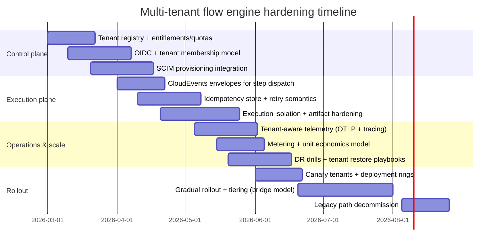

# Hardening a Flow-Generation Multi-Tenant Engine into a Robust Multi-Tenant Architecture

## Executive summary

A “multi-tenant flow engine” that **generates and runs multifunctional workflows** has a more demanding multi-tenancy problem than most CRUD SaaS systems, because tenant isolation must hold across: (a) **long-running, multi-step executions**, (b) **asynchronous queues and event buses**, (c) **heterogeneous resource backends** (DB, cache, object storage, search/analytics), and (d) **tenant-supplied artifacts** (templates, scripts, connectors, imports). Industry SaaS guidance emphasizes that tenant isolation is fundamentally about consistently applying **tenant context** to decide which resources a tenant can access—across the entire architecture, not just the primary database. citeturn0search1

The most durable approach, especially for engines that may serve both low-risk and high-compliance tenants, is a **hybrid isolation portfolio** (“pool / silo / bridge”): most tenants run in a pooled model for cost efficiency, while select tenants “graduate” into stronger isolation (separate schema or separate database/instance) based on compliance, workload intensity, or contractual obligations. citeturn0search0turn0search4turn0search36

For flow-generation systems, robustness is achieved by combining:

- **A tenant control plane** (tenant registry, entitlements, tenant configuration, provisioning, identity connections, metering/billing, isolation mapping) plus a **tenant data plane** (API gateway, execution runtime, workers, storage access, telemetry). citeturn7search5turn0search1turn7search1  
- **Strict tenant context propagation** across synchronous and asynchronous boundaries, using standardized propagation for tracing plus explicit tenant identifiers in workflow envelopes. citeturn3search1turn3search0turn3search2  
- **Idempotency and replay safety** for step execution and external side effects, aligned with the IETF Idempotency-Key header draft (POST/PATCH fault-tolerance) and careful deduplication semantics for events and jobs. citeturn3search3turn3search7  
- **Per-tenant quotas and limits** for executions, step concurrency, artifacts, and integrations—explicitly motivated by OWASP’s focus on resource abuse and sensitive business flow abuse in API systems. citeturn1search1turn9search2turn1search9  
- **Secure execution isolation** for tenant-supplied code/artifacts with container-hardening guidance and safe file handling practices. citeturn6search1turn6search7  

### Concise decision matrix

| Situation | Default recommendation | “When to upgrade isolation” signal |
|---|---|---|
| Many small tenants; homogeneous workloads; cost sensitivity | Shared schema (tenant_id per row) + defense-in-depth (DB policies where possible) + strong tenant-aware authZ | Enterprise asks for tenant-scoped restore, customer-managed keys, residency, or strict SLAs citeturn0search0turn4search0turn5search0 |
| Mixed workloads; some heavy tenants; high run volumes | Shared schema for control plane + separate schema or separate DB for execution-state hot paths; tiered quotas | Noisy-neighbor incidents or high-cost tenants require dedicated capacity citeturn4search1turn7search2turn1search1 |
| Regulated enterprise; contractual audit/restore; cryptographic separation | Separate database/instance for regulated tiers (“silo”) + per-tenant key hierarchy | Any tenant requires strict audit evidence, per-tenant DR guarantees, or compliance overlays citeturn0search36turn4search3turn4search2 |

## Engine assumptions and alternatives

Because internals are unspecified, the architecture below is built on explicit assumptions that you can replace with facts as you inventory your engine. These assumptions are common for “flow generation + execution” platforms.

### Explicit assumptions about the engine

Assume the platform includes:

- A **flow definition control plane**: authoring/generation, validation, versioning, publishing, rollback; potentially a visual editor and templating.  
- A **flow execution data plane**: runtime that schedules steps, retries, compensations, and long-running state.  
- **Asynchronous infrastructure**: queues/topics for step dispatch, timers, webhook triggers, and fan-out.  
- At least one primary operational datastore (often relational), plus **cache**, **object storage**, and optionally **search/indexing** for definitions/runs, and analytics/reporting. citeturn0search1turn3search2  
- Tenants can supply or influence **artifacts**: uploaded files, templates/components, scripts/expressions, connector configs, and (in some variants) plugins/extensions. This requires robust file handling and isolation. citeturn6search7turn6search1  
- Tenants may integrate external identity (SSO) and require automated provisioning (SCIM) for enterprise. citeturn2search2turn2search1turn1search11  
- The engine exposes APIs for triggering flows and managing resources; therefore, it inherits key OWASP API risks: object-level authorization failures, resource consumption abuse, SSRF (when steps fetch remote URLs), and misuse of sensitive flows. citeturn1search4turn1search1turn11search0turn9search2  

### Alternatives that change the architecture materially

- **Flows are short-lived and synchronous** (seconds/minutes) vs **long-running** (hours/days). Long-running flows increase the importance of durable step state, idempotency, and context propagation. citeturn3search3turn0search1  
- **Tenants do not supply code** (only select from prebuilt steps) vs **tenants supply scripts**. Tenant-supplied code strongly increases the need for sandboxing and container-hardening guidelines. citeturn6search1turn4search1  
- **Single-region** vs **multi-region** execution. Multi-region impacts data model, DR, and tenant residency commitments. citeturn5search0turn4search2  
- **Strict per-tenant restore** required vs “best effort” restore. Per-tenant restore feasibility heavily depends on your tenancy model. citeturn5search0turn5search1turn0search0  

## Tenant isolation and flow-runtime design

This section covers: tenant model options (shared schema, separate schema, separate DB), data isolation guarantees, tenancy identifier strategies, and tenant context propagation (sync + async), with flow-engine-specific recommendations (CloudEvents envelopes, idempotency, safe step execution).

### Tenant storage models for a flow engine

SaaS reference guidance distinguishes pooled vs siloed isolation and recommends the “bridge” model when different tenants require different levels of isolation. citeturn0search0turn0search4turn0search36

#### Options table: shared schema vs separate schema vs separate database

| Option | Pros | Cons | Implementation complexity | Performance & cost implications | Security considerations | Recommended scenarios |
|---|---|---|---|---|---|---|
| Shared schema (tenant_id per row) | Lowest infrastructure cost; easiest onboarding at high tenant counts; simplest schema evolution at small scale. citeturn0search9turn0search1 | Highest “blast radius” if scoping fails; harder per-tenant restore; noisy-neighbor risk for hot tables and heavy tenants. citeturn0search31turn5search0 | Medium–High: you must enforce tenant context everywhere (DB, cache, queues, storage). citeturn0search1 | Efficient for many small tenants; may need partitioning and careful indexing; sensitive to skewed tenant workloads. citeturn1search1turn0search31 | Top risk is cross-tenant exposure if object-level auth or query scoping is incomplete (OWASP API1). citeturn1search4turn9search3 | Early-stage or pooled tiers; homogeneous workloads; strong centralized guardrails. citeturn0search8turn7search2 |
| Separate schema per tenant | Stronger logical separation; easier tenant-specific export/restore; reduces accidental cross-tenant joins. citeturn0search14turn0search6 | Tooling burden for schema sprawl and migrations; still shares DB resources (noisy neighbors remain). citeturn0search6turn4search1 | High: routing, migrations, and observability must handle many schemas. citeturn0search6turn0search14 | Higher operational overhead than shared schema; can be performant when each schema’s hot path is isolated. | Still requires tenant-aware authZ; schema routing errors become a critical security failure mode. citeturn1search4turn0search1 | Mid-market tiers; tenants need restore/export; some compliance pressure. citeturn0search14turn0search0 |
| Separate database / instance per tenant (or per tenant group) | Strongest blast-radius reduction; cleanest per-tenant restore; aligns well with silo tiers for compliance. citeturn0search36turn5search1 | Highest cost and automation requirements; analytics becomes harder without intentional design. citeturn0search0turn7search32 | High–Very High: provisioning, migrations, monitoring, and cost management must be automated. citeturn8search7turn7search2 | Higher per-tenant fixed cost; simplifies scaling and isolation for large tenants; reduces noisy-neighbor by design. citeturn0search36turn4search1 | Stronger isolation but does not replace correct API authorization; still requires correct identity and request scoping. citeturn1search4turn0search1 | Enterprise/regulatory; customer-managed keys; residency; strict SLA/SLO; “VIP” execution tiers. citeturn4search3turn5search0turn0search36 |

### Data isolation guarantees as an explicit contract

A robust multi-tenant platform should publish an internal (and often customer-facing) isolation contract in layers:

1. **Identity binding**: each authenticated user is associated with a tenant context. citeturn0search21turn1search11  
2. **Authorization**: every access to a tenant-scoped object is checked for object-level and function-level permissions; OWASP highlights breaker patterns like BOLA (API1) and sensitive flow abuse (API6). citeturn1search4turn9search2turn6search32  
3. **Data partitioning**: tenant context determines which records/schemas/DBs are reachable. citeturn0search9turn0search1  
4. **Non-DB isolation**: caches, queues, object storage, and indexes must also be tenant-scoped, because isolation is not only a database problem. citeturn0search1turn0search31  

Defense-in-depth for shared-schema designs often uses database-enforced policies such as PostgreSQL row-level security, which requires enabling row security and defining policies with `CREATE POLICY`. citeturn4search0turn4search4

### Tenancy identifier strategies

A flow engine has at least four “identity axes” that must be explicitly modeled:

- **tenant_id**: stable identifier for the customer/organization boundary.  
- **principal_id / subject**: user or service identity (OIDC subject). citeturn2search1turn0search21  
- **flow_definition_id and version**: immutable identity for a published flow spec.  
- **run_id and step_execution_id**: immutable identities for executions, retries, and audit.

**Option table: tenant identifier representation**

| Strategy | Pros | Cons | Complexity | Performance/cost | Security considerations | Recommended scenarios |
|---|---|---|---|---|---|---|
| UUID tenant_id everywhere | Ubiquitous support; low collision risk; easy to pass through systems. | Less index locality than ordered IDs in some DBs; longer logs/keys. | Low | Neutral | Must ensure tenant_id is not caller-spoofable; it’s just an identifier. citeturn0search1turn1search4 | Most SaaS engines; especially good when sharing across services/events. |
| Human-readable tenant slug (plus internal ID) | Good UX for subdomains and admin surfaces. | Slug changes/migrations; uniqueness constraints. | Medium | Neutral | Slugs must not be treated as authorization proof. citeturn1search4turn9search3 | Products with custom domains / branded URLs. |
| Composite identifiers (tenant_id + local IDs) | Makes uniqueness/partitioning explicit in DB schemas. | More verbose; must be standardized across codebases. | Medium | Often positive (composite PK designs can help partitioning). | Prevents accidental cross-tenant joins if consistently used. citeturn0search9turn0search1 | Shared schema designs; high correctness needs. |

### Tenant context propagation across flow steps

AWS emphasizes isolation as “using tenant context to limit access to resources,” which implies tenant context must be preserved across every boundary. citeturn0search1

#### Synchronous propagation

For synchronous HTTP/gRPC, tenant context is typically derived from:

- **Authenticated principal membership** (tenant claims / membership lookup). citeturn0search21turn2search1  
- **Request routing binding** (custom domain/subdomain) plus membership verification.  
- Avoid treating a caller-provided `X-Tenant-Id` header as authoritative; tenant selection is a security boundary and must be validated by identity + routing bindings. citeturn1search4turn0search1  

#### Asynchronous propagation for workflow execution

For step dispatch, you need an **explicit execution envelope** that carries tenant context, correlation/tracing, idempotency semantics, and replay-safe identifiers.

A widely adopted event envelope standard is CloudEvents; the CloudEvents spec requires core context attributes (e.g., `specversion`, `type`, `source`, `id`) and supports extension attributes. citeturn3search0turn3search20

A robust pattern is to use CloudEvents for all workflow messages and add tenant context as a **CloudEvents extension attribute** (e.g., `tenantid`), along with trace context fields (`traceparent`) so observability remains end-to-end. citeturn3search1turn3search0turn3search36

#### Flow execution concerns: idempotency and safe retries

A flow engine should assume “at least once” delivery for events and jobs; therefore every step must be either:

- **Naturally idempotent** (safe to repeat), or  
- **Made idempotent** using an idempotency key and a deduplication record keyed on stable identifiers.

The IETF draft for the `Idempotency-Key` header states it can make non-idempotent methods like POST and PATCH fault-tolerant, and recommends validating keys and using a unique composite cache key on the server side. citeturn3search3turn3search7

**Option table: idempotency strategies for steps**

| Strategy | Pros | Cons | Complexity | Performance/cost | Security considerations | Recommended scenarios |
|---|---|---|---|---|---|---|
| Step-level idempotency (idempotency record per step_execution_id) | Aligns with workflow engines; easiest to reason about retries and partial failures. | Requires persistent idempotency store; must decide retention policy. | Medium | Small extra write per step | Prevents duplicate external side effects (billing, provisioning). | Default for all external-effect steps. |
| API-level idempotency (`Idempotency-Key` per request) | Improves trigger robustness; standardizing header helps clients. citeturn3search3 | Doesn’t cover internal async retries unless propagated. | Medium | Extra lookup on write APIs | Must prevent key reuse across tenants (key must be tenant-scoped). citeturn3search7turn0search1 | Trigger endpoints, “start flow”, “create run”, “upload artifact”. |
| Event-level dedupe (CloudEvents `id` + `source` uniqueness) | Standardizes dedupe at broker/consumer; good for at-least-once systems. citeturn3search0 | Must define “what counts as duplicate”; requires durable consumer state. | Medium–High | Persistent dedupe table per consumer group | Prevents replay attacks and accidental duplication cascades. | High-volume event-driven step dispatch. |

### Mermaid architecture diagram for a robust flow engine

```mermaid
flowchart TB
  subgraph ControlPlane["Tenant control plane (authoring, governance, billing)"]
    TR[Tenant registry & lifecycle]
    IAM[Identity mappings + tenant memberships]
    ENT[Entitlements & tiers\n(features/quotas)]
    CFG[Per-tenant config\n(feature flags, theming, connector policy)]
    MTR[Metering & billing aggregates]
    GOV[Governance & audit policies\n(approval gates, retention)]
  end

  subgraph DataPlane["Tenant data plane (execution)"]
    GW[API gateway / ingress\n(custom domains, auth enforcement)]
    API[Flow API\n(definitions, runs, artifacts)]
    Q[(Queue / topic bus\nCloudEvents envelope)]
    RUN[Flow runtime scheduler\n(state machine)]
    WKR[Step workers\n(sandboxed execution)]
    DB[(Primary data store)]
    OBJ[(Object storage\nartifacts, logs)]
    IDX[(Search/analytics index)]
    OBS[Telemetry pipeline\n(OTel -> Collector/Backend)]
  end

  GW --> API
  API --> DB
  API --> OBJ
  API --> IDX
  API --> Q

  Q --> RUN
  RUN --> Q
  RUN --> DB
  RUN --> WKR

  WKR --> DB
  WKR --> OBJ
  WKR --> IDX
  API --> OBS
  RUN --> OBS
  WKR --> OBS

  GW --> TR
  API --> CFG
  API --> ENT
  API --> IAM
  API --> MTR
  RUN --> MTR
```

This separation aligns with SaaS guidance that describes global/shared services around the SaaS environment (identity, onboarding, operations, billing, metrics) and stresses tenant context as the core isolation mechanism. citeturn7search5turn0search1turn7search1  

image_group{"layout":"carousel","aspect_ratio":"16:9","query":["AWS SaaS lens pool silo bridge model diagram","CloudEvents JSON envelope diagram","OpenTelemetry OTLP architecture collector diagram","Kubernetes namespace resource quota diagram"],"num_per_query":1}

## Identity, authorization, provisioning, and tenant customization

This section covers: SSO/OAuth/OIDC, RBAC/ABAC for a flow platform, provisioning/onboarding including SCIM, and tenant configuration (feature flags, per-tenant settings, theming, and plugin governance).

### Authentication and SSO

OAuth 2.0 defines the authorization framework for obtaining limited access to HTTP services. citeturn2search0  
OpenID Connect builds authentication on top of OAuth 2.0 and uses claims to communicate identity information. citeturn2search1  
OAuth security baseline guidance is updated by RFC 9700, which describes best current security practice and deprecates less secure modes. citeturn2search3  
For federal-grade or high-assurance identity modeling, NIST SP 800-63-4 describes identity proofing, authentication, and federation guidelines. citeturn1search11turn1search3

**Flow-engine-specific recommendation:** treat “start flow”, “publish flow”, “create connector”, and “approve deploy” as sensitive business flows; OWASP identifies “Unrestricted Access to Sensitive Business Flows” (API6) as exposing flows without adequate restrictions or anti-automation controls. citeturn9search2turn9search10

### Authorization: RBAC baseline with ABAC for enterprise policy

OWASP highlights Broken Object Level Authorization (API1) as the top API risk, where attackers manipulate object identifiers to access resources they should not. citeturn1search4turn9search3  
NIST SP 800-162 defines ABAC and provides guidance for using attributes of subject, object, operation, and environment in authorization decisions, which is useful for complex multi-tenant policies (residency, tier, governance gates). citeturn1search2

#### Sample tenant-aware RBAC model for a flow engine

A practical RBAC model for flow platforms typically includes:

- Tenant Owner: billing, identity settings, tenant policy  
- Tenant Admin: users/groups, connectors, quotas  
- Flow Designer: author/generate/edit flows  
- Flow Operator: run/stop/retry flows, view run logs  
- Auditor/Read-only: inspect runs/audit events without mutation

**ABAC overlays** (examples):
- tenant.plan ∈ {free, pro, enterprise}  
- action requires approval if tenant.policy.requires_approval = true  
- object.sensitivity ∈ {standard, restricted} (e.g., flows touching PII)

NIST ABAC guidance supports this “attribute + policy” layer for fine-grained enterprise control. citeturn1search2turn4search2

### Provisioning and onboarding including SCIM

SCIM (RFC 7644) defines an HTTP-based protocol for provisioning and managing identity data in enterprise-to-cloud scenarios. citeturn2search2  
Microsoft’s SCIM guidance for provisioning also frames SCIM as easing integration with compliant clients based on RFC 7642/7643/7644. citeturn2search34

**Tenant onboarding workflow (recommended template)**

1. Create tenant record (status=provisioning) and choose isolation tier (pool/schema/db).  
2. Create default roles and a first admin membership.  
3. Configure identity connection (OIDC providers, SAML via broker if applicable) and optional SCIM endpoint + tokens. citeturn2search1turn2search2  
4. Provision tenant config baseline: feature flags, quotas, outbound connector policy, artifact retention.  
5. Emit onboarding audit + metering configuration; AWS emphasizes that metering tenant activity supports billing and operational visibility. citeturn7search1turn7search2  
6. Mark tenant status=active only after successful validation checks (domain routing, token issuance, DB routing correctness).

### Tenant configuration and customization

Multi-tenant solution guidance emphasizes that multitenant environments require deliberate design across business and technical considerations and operational pillars. citeturn7search3turn7search14  
AWS SaaS Lens monitoring guidance explicitly notes controlling the experience of each tier and limiting lower-tier consumption based on cost or business considerations—this supports feature gating and quotas as first-class configuration. citeturn7search20

**Option table: tenant customization mechanism**

| Mechanism | Pros | Cons | Complexity | Performance/cost | Security considerations | Recommended scenarios |
|---|---|---|---|---|---|---|
| Centralized per-tenant config service (tenant_id → validated config) | Fast changes without redeploy; consistent across services; supports audit. | Requires validation/versioning and caching. | Medium | Low per request if cached | Config is security-sensitive (misconfig is an OWASP risk category). citeturn11search3turn11search2 | Default for all profiles. |
| Feature flags with tenant targeting | Enables safe canaries/rollouts; can disable features per tenant rapidly. | Flag sprawl; governance required. | Medium | Low | Flags must not become authorization bypasses; sensitive flows still need authZ and limits. citeturn9search2turn6search32 | Progressive delivery; migrations; tier-based features. |
| Per-tenant theming tokens (colors/typography/layout) | Branding without code forks; consistent UI experiences. | Requires careful schema/versioning; testing across tokens. | Medium | Low | Prevent injection in templating; validate and sanitize user-supplied theme inputs. citeturn6search7turn11search3 | Engines with visual editors or white-label needs. |
| Per-tenant plugins / custom code | Maximum extensibility. | High security and operational cost; requires sandboxing. | High–Very High | Potentially high (compute isolation) | Must sandbox and harden container execution; treat as untrusted code. citeturn6search1turn11search0 | Enterprise-only tiers with strong guardrails. |

## Scaling, observability, billing, backup/DR, and compliance

This section covers: resource isolation and scaling (compute/storage/quotas), monitoring/logging/billing per tenant, safe artifact handling, backups/restores, and compliance.

### Resource isolation and scaling

OWASP identifies Unrestricted Resource Consumption (API4) as a key risk: APIs that do not limit resource consumption can be abused to cause denial of service or increased operational costs. citeturn1search1turn1search9  
For flow engines, execution itself is the primary resource sink: step runs, fan-out, retries, external calls, and artifact handling.

Kubernetes resource quotas are explicitly designed to limit aggregate resource consumption per namespace and can also limit object counts; this is relevant if you map tenants (or tenant tiers) into namespaces or dedicated execution pools. citeturn4search1turn4search5  
Google’s GKE SaaS hosting guidance highlights noisy-neighbor effects and warns that when user data isolation is only at the application layer, application problems can expose one tenant’s data to another. citeturn0search31

**Flow-engine specific quota model (recommended)**  
Define tenant quotas across at least these resource dimensions:

- max_concurrent_runs  
- max_step_concurrency  
- max_run_duration / max_step_duration  
- max_events_per_run (fan-out hard caps)  
- max_artifact_bytes_total and per-upload caps  
- max_outbound_requests_per_minute and domain allowlists (SSRF defense) citeturn11search0turn1search1  

### Monitoring, logging, and tenant-level metrics

OpenTelemetry OTLP defines encoding/transport for traces, metrics, and logs. citeturn3search2  
W3C Trace Context defines `traceparent`/`tracestate` header formats, making distributed tracing interoperable. citeturn3search1  
OpenTelemetry “Baggage” provides a key-value store for propagating contextual data alongside tracing context (useful for tenant labels when used carefully). citeturn3search6turn3search14

AWS SaaS Lens emphasizes “tenant activity and consumption,” i.e., tenant-level visibility into usage and load, and the AWS architecture fundamentals clarify that metering tenant activity supports billing. citeturn7search2turn7search1

**Tenant metrics that are unusually important for flow engines**
- runs_started / runs_completed / runs_failed by tenant  
- step_execution_counts by step type (cost attribution)  
- retries and dead-letter counts  
- queue lag per tenant (or per tenant tier)  
- artifact upload/download volumes  
- external integration call volume and error rates  
- policy denials (authZ denies, quota denies)

### Billing and cost attribution per tenant

AWS explicitly distinguishes metering (collect tenant activity/consumption) from metrics and billing. citeturn7search1  
FinOps “cloud unit economics” recommends measuring cost relative to meaningful units (e.g., per workflow run, per step execution, per GB stored) to connect usage to value. citeturn7search0turn7search8  
AWS SaaS Lens also frames expenditure awareness as requiring a clear mapping model of how tenants consume resources. citeturn7search32

**Cost estimation model for a flow engine (template)**  
Define unit costs for your core units:

- Cost per run = Σ(step_time_seconds × compute_rate) + Σ(external_api_calls × provider_rate) + (artifact_gb_month × storage_rate) + (egress_gb × egress_rate)  
- Cost per tenant per month = allocated_shared_cost + Σ(run costs) + tier_overhead (dedicated DB/worker)  
- Margin model = tenant revenue − tenant cost attribution (for pricing sanity checks)

### Backup/restore and disaster recovery per tenant

NIST SP 800-34 provides guidance for contingency planning and aligns recovery planning with priorities, interdependencies, and practical procedures. citeturn5search0  
Per-tenant restore feasibility strongly depends on your tenancy model:

- For separate DB per tenant, cloud PITR primitives directly support tenant-scoped restore (e.g., Amazon RDS restore to a specified time; Azure point-in-time restore creates a database copy at a selected time). citeturn5search1turn5search2  
- For shared schema, per-tenant PITR is typically not directly supported; it often requires restore-to-staging and tenant extraction or tenant-level export snapshots, which increases RTO/RPO complexity. citeturn5search0turn0search0  

### Security and compliance highlights tailored to flow engines

Flow engines amplify multiple OWASP API risks because they expose programmable business processes:

- Broken object level authorization (API1) and IDOR-style failures are catastrophic across tenants. citeturn1search4turn9search3  
- Unrestricted resource consumption (API4) and sensitive business flow abuse (API6) are common when flows can be triggered programmatically. citeturn1search1turn9search2  
- SSRF (API7) is a direct risk when steps can fetch remote resources or when connectors accept user-supplied URLs. citeturn11search0  
- Security misconfiguration (API8) and improper inventory management (API9) are heightened when a platform accumulates many endpoints, step types, and plugin surfaces. citeturn11search3turn11search2  
- Unsafe consumption of APIs (API10) is relevant because workflows often integrate with third-party APIs and may over-trust “upstream” responses. citeturn11search5  

For tenant-supplied artifacts and code-like inputs:

- NIST SP 800-190 provides container security recommendations and describes risks and mitigations for containerized applications—relevant when you sandbox step execution. citeturn6search1  
- OWASP’s File Upload Cheat Sheet provides guidance to safely handle uploaded files (validation, storage, protections), which applies to artifacts used in flow steps. citeturn6search7  

For encryption and key management:

- AES is standardized by NIST FIPS 197 as a FIPS-approved algorithm for protecting electronic data. citeturn6search0  
- NIST SP 800-57 provides key management guidance and best practices for keying material lifecycle. citeturn4search3  

For governance alignment:

- NIST SP 800-53 provides a catalog of security and privacy controls that organizations can tailor for auditing, logging, access control, and incident response baselines. citeturn4search2  
- GDPR Article 32 explicitly requires “appropriate technical and organisational measures” considering risk, including encryption and pseudonymisation “as appropriate.” citeturn9search17turn9search37  

## Migration, testing, CI/CD, profile architectures, and next steps

This section covers: migration strategies (big-bang vs phased, CDC tools), testing strategies (unit/integration/property-based/security), CI/CD patterns (canary, blue/green, tenant-aware deployments), operational runbooks, and recommended architectures for three system profiles. It ends with templates and a prioritized checklist.

### Migration strategies and CDC tooling

#### Big-bang vs phased vs hybrid

| Strategy | Pros | Cons | Complexity | Recommended scenarios |
|---|---|---|---|---|
| Big-bang migration | One cutover point; less dual-running complexity. | Highest blast radius and rollback risk. | Medium | Small systems with limited tenant count and low compliance requirements. |
| Phased migration (tenant-by-tenant / ring-based) | Limits blast radius; aligns with canary rings and tenant targeting. | Requires routing for migrated/non-migrated tenants and backward compatibility. citeturn8search1turn7search21 | High | Most SaaS engines; especially when tenants vary in risk tolerance. citeturn7search21turn0search4 |
| Hybrid (phased + CDC or dual-write for critical tables) | Strong validation with minimal downtime. | Most complex: conflict handling and reconciliation. | Very High | Regulated/enterprise migrations requiring strong correctness evidence. citeturn4search2turn5search0 |

CDC tools and guidance:

- AWS Database Migration Service supports ongoing replication/change data capture during and after initial full loads. citeturn10search0  
- Azure Database Migration Service targets minimal downtime migrations and provides online migration paths for certain targets. citeturn10search1turn10search5  
- Google Database Migration Service describes continuous migrations as initial dump+load followed by ongoing changes and a promotion step for cutover. citeturn10search3turn10search10  

### Testing strategies for a multi-tenant flow engine

Robustness requires tests that explicitly encode the “never cross tenants” invariant and also validate workflow-specific correctness (retries, dedupe, idempotency, quota enforcement).

- Security testing for IDOR and authorization errors is explicitly covered in OWASP testing guidance. citeturn9search15turn6search32  
- OWASP CSRF guidance is relevant for admin consoles and authoring actions. citeturn6search3  

**Recommended test layers**
- Unit: tenant scoping utilities, policy evaluation, idempotency store logic.  
- Integration: a “two-tenant harness” that creates tenants A/B and verifies all endpoints and step workers never return mismatched tenant-scoped objects (BOLA-focused). citeturn1search4turn9search3  
- Property-based: generate random sequences of retries/timeouts and assert invariants (no duplicate side effects under repeated delivery). Tie to Idempotency-Key semantics. citeturn3search3turn3search7  
- Security regression: SSRF tests for URL-fetching steps; file upload bypass tests; abuse tests for sensitive flow endpoints and quotas. citeturn11search0turn6search7turn9search2  
- Load/chaos: validate that per-tenant quotas cap noisy-neighbor impact, aligning with OWASP resource consumption risk. citeturn1search1turn4search1  

### CI/CD and tenant-aware deployment patterns

Deployment guidance for multitenant solutions explicitly discusses “deployment rings” like canary and early adopter tenant groups. citeturn8search1turn7search21  
Blue/green deployments are described in AWS DevOps guidance as shifting traffic between two identical environments to minimize downtime and improve rollback. citeturn8search10  
Google Cloud release strategy docs define canary as progressive rollout to subsets before full release. citeturn8search2turn8search5  
Kubernetes rolling update guidance explains incrementally replacing pods to achieve zero downtime. citeturn8search9turn8search13  

**Tenant-aware deployment recommendations**
- Prefer **backward-compatible schema changes** (expand/contract) so canary tenants can run new code while others remain on old code.  
- Use **tenant rings**: internal tenants → canary customers → early adopters → general. citeturn8search1turn7search21  
- Couple canary strategy with **tenant-aware feature flags** so you can disable risky changes for a tenant without global rollback. citeturn7search20turn7search2  

### Recommended architectures for three profiles

#### Small multi-tenant engine with monolithic DB

Recommended baseline:
- Shared schema with `tenant_id` scoping + defense-in-depth via DB policies where feasible (e.g., Postgres RLS). citeturn4search0turn0search9  
- Control plane and data plane can live in one codebase, but tenant context must still be explicit and enforced everywhere. citeturn0search1  
- Add execution quotas early to defend against resource consumption abuse. citeturn1search1turn4search1  
- Adopt CloudEvents envelope for async step dispatch immediately to standardize propagation and dedupe semantics. citeturn3search0turn3search20  

Key tradeoff:
- Per-tenant restore will be difficult; document it as a limitation until you introduce schema/db tiering. citeturn5search0turn0search0  

#### Medium microservices engine with shared DB

Recommended baseline:
- Shared schema for control-plane objects (tenant registry, flow definitions, entitlements). citeturn7search5turn0search1  
- Execution-plane state (run/step state) should support **sharding** or optional separate schema/DB for heavy tenants; this aligns with bridge isolation. citeturn0search4turn7search2  
- Use standardized trace context and OTLP pipeline so tenant-scoped observability works across services. citeturn3search1turn3search2  
- Enforce per-tenant quotas at API gateway and at runtime scheduler/worker pools; Kubernetes quotas are a natural enforcement point for pooled compute. citeturn4search1turn0search31  

#### Large enterprise engine with high compliance

Recommended baseline:
- Separate database/instance for regulated tiers (silo model), plus strong key management practices per NIST. citeturn0search36turn4search3  
- Strong identity and federation model aligned with OAuth/OIDC and NIST digital identity assurance discussions; SCIM provisioning for enterprise lifecycle. citeturn2search1turn2search2turn1search11  
- Sandbox tenant-supplied artifacts and code using hardened container guidance; limit outbound connectivity to prevent SSRF and data exfiltration. citeturn6search1turn11search0  
- Tenant-scoped DR and PITR processes must be repeatable and drilled; cloud PITR primitives support this in per-DB isolation models. citeturn5search1turn5search2turn5search0  

### SQL mapping examples for core engine entities

Below is a minimal relational mapping emphasizing tenant scoping and unique constraints.

```sql
-- Tenants (control plane)
CREATE TABLE tenants (
  tenant_id UUID PRIMARY KEY,
  plan TEXT NOT NULL,
  status TEXT NOT NULL,
  created_at TIMESTAMPTZ NOT NULL DEFAULT now()
);

-- Users and memberships (simplified; user identity typically comes from OIDC subject)
CREATE TABLE users (
  user_id UUID PRIMARY KEY,
  external_subject TEXT NOT NULL UNIQUE
);

CREATE TABLE tenant_memberships (
  tenant_id UUID NOT NULL REFERENCES tenants(tenant_id),
  user_id UUID NOT NULL REFERENCES users(user_id),
  role TEXT NOT NULL,
  status TEXT NOT NULL,
  PRIMARY KEY (tenant_id, user_id)
);

-- Flow definitions (versioned)
CREATE TABLE flow_definitions (
  tenant_id UUID NOT NULL REFERENCES tenants(tenant_id),
  flow_id UUID NOT NULL,
  name TEXT NOT NULL,
  current_version INT NOT NULL,
  PRIMARY KEY (tenant_id, flow_id)
);

CREATE TABLE flow_versions (
  tenant_id UUID NOT NULL,
  flow_id UUID NOT NULL,
  version INT NOT NULL,
  spec_json JSONB NOT NULL,
  created_by UUID NOT NULL REFERENCES users(user_id),
  created_at TIMESTAMPTZ NOT NULL DEFAULT now(),
  PRIMARY KEY (tenant_id, flow_id, version),
  FOREIGN KEY (tenant_id, flow_id) REFERENCES flow_definitions(tenant_id, flow_id)
);

-- Flow runs and step executions (execution plane)
CREATE TABLE flow_runs (
  tenant_id UUID NOT NULL,
  run_id UUID NOT NULL,
  flow_id UUID NOT NULL,
  flow_version INT NOT NULL,
  status TEXT NOT NULL,
  started_at TIMESTAMPTZ NOT NULL DEFAULT now(),
  finished_at TIMESTAMPTZ NULL,
  idempotency_key TEXT NULL,
  PRIMARY KEY (tenant_id, run_id),
  FOREIGN KEY (tenant_id, flow_id, flow_version) REFERENCES flow_versions(tenant_id, flow_id, version)
);

CREATE TABLE step_executions (
  tenant_id UUID NOT NULL,
  run_id UUID NOT NULL,
  step_execution_id UUID NOT NULL,
  step_name TEXT NOT NULL,
  attempt INT NOT NULL,
  status TEXT NOT NULL,
  started_at TIMESTAMPTZ NOT NULL DEFAULT now(),
  finished_at TIMESTAMPTZ NULL,
  idempotency_key TEXT NULL,
  PRIMARY KEY (tenant_id, run_id, step_execution_id),
  FOREIGN KEY (tenant_id, run_id) REFERENCES flow_runs(tenant_id, run_id)
);

-- Idempotency store example (server-side dedupe)
CREATE TABLE idempotency_records (
  tenant_id UUID NOT NULL,
  scope TEXT NOT NULL,            -- e.g., "run-create", "step-exec", "connector-call"
  idempotency_key TEXT NOT NULL,
  created_at TIMESTAMPTZ NOT NULL DEFAULT now(),
  response_hash TEXT NULL,
  PRIMARY KEY (tenant_id, scope, idempotency_key)
);
```

This structure supports tenant-scoped uniqueness and aligns with the guidance that tenant context must be consistently applied to limit access. citeturn0search1turn0search9  

### API changes required for tenant-aware flows

Recommended API contract changes:

- Tenant resolution via domain/path plus verified membership; never treat caller-provided tenant headers as authoritative. citeturn0search21turn1search4  
- Require `Idempotency-Key` for “start flow” and other side-effect APIs; align server behavior with IETF draft practices (validate format; dedupe on composite keys). citeturn3search3turn3search7  
- Emit and accept CloudEvents envelopes for async step dispatch so required metadata is consistent (`id`, `source`, `type`, `specversion`) and tenant context is included as an extension attribute. citeturn3search0turn3search20  
- Propagate `traceparent`/`tracestate` per W3C across synchronous and (where supported) asynchronous boundaries to keep tenant debugging feasible. citeturn3search1turn3search2  

### Migration plan template and phased rollout checklist

#### Migration plan template

- Discovery and invariants: define tenant boundary, enumerate data stores and async channels requiring tenant context enforcement. citeturn0search1turn7search3  
- Control plane hardening: tenant registry, entitlements/quotas, identity mapping, SCIM onboarding. citeturn2search2turn7search1  
- Data plane hardening: CloudEvents envelopes, idempotency store, tenant-scoped worker isolation, SSRF and artifact hardening. citeturn3search0turn3search3turn11search0turn6search7  
- Observability and billing: OTLP pipeline, tenant labels, metering events, unit economics. citeturn3search2turn7search1turn7search0  
- Tenant tiering: implement bridge model path to schema/db isolation for enterprise. citeturn0search4turn0search36  
- DR and restore drills: define RPO/RTO, rehearse PITR and tenant-scoped restore. citeturn5search0turn5search1turn5search2  

#### Phased rollout checklist

- Object-level authorization tests pass for all object-ID endpoints (OWASP API1/IDOR). citeturn1search4turn9search15  
- Quotas and rate limits exist for run triggers and step execution (OWASP API4/API6). citeturn1search1turn9search2  
- SSRF controls exist for URL-fetching steps (allowlists, timeouts, egress controls). citeturn11search0turn11search5  
- CloudEvents envelope implemented for async messages; dedupe policies in place. citeturn3search0turn3search7  
- OTLP/trace propagation verified end-to-end; tenant labels present in metrics/logs. citeturn3search2turn3search1turn3search10  
- Tenant restore procedure documented and drilled (NIST contingency planning alignment). citeturn5search0turn5search1  

### Mermaid migration timeline for a flow engine hardening program



This rollout structure maps directly to multitenant updating guidance that recommends deployment rings (canary/early adopter) and to progressive deployment strategies (canary/blue-green/rolling) used to reduce blast radius. citeturn8search1turn8search10turn8search2turn8search9  

### Operational runbook changes

A robust multi-tenant flow engine requires runbooks that are tenant-scoped and workflow-aware:

- Cross-tenant data exposure incident (containment, audit preservation, tenant communication). Driven by OWASP emphasis on object-level authorization failures and inventory hygiene. citeturn1search4turn11search2  
- Resource abuse / noisy neighbor incident (quota enforcement, throttling, isolating tenant to dedicated workers/namespaces). citeturn1search1turn4search1  
- SSRF / egress anomaly incident (block domains, rotate credentials, validate connector policies). citeturn11search0turn11search5  
- Restore and DR runbooks per tenant tier, aligned with NIST contingency planning practices. citeturn5search0turn5search1turn5search2  
- Secrets and key management operational procedures; align key lifecycle with NIST key management guidance. citeturn4search3turn6search0  

### Prioritized next-step implementation checklist

The following checklist is ordered to reduce the highest-impact risks first (cross-tenant exposure, abuse, and correctness under retries), while establishing the foundations for tiering and compliance.

- Formalize the tenant boundary and write a tenant context contract that every service/worker must follow. citeturn0search1turn0search21  
- Implement object-level authorization invariants for every endpoint that accepts object identifiers (defend against OWASP API1/IDOR). citeturn1search4turn9search3turn9search15  
- Standardize async envelopes as CloudEvents and include tenant context as an extension attribute; define dedupe rules. citeturn3search0turn3search20  
- Add idempotency for “start run” and all external-side-effect steps using `Idempotency-Key` semantics and a tenant-scoped idempotency store. citeturn3search3turn3search7  
- Enforce per-tenant quotas for runs, step concurrency, and artifacts; treat quota denials as first-class outcomes (OWASP API4/API6). citeturn1search1turn9search2turn4search1  
- Harden tenant-supplied artifact ingestion: validate uploads, store safely, scan/sanitize where required, and strictly authorize downloads. citeturn6search7turn11search3  
- Implement SSRF defenses for any URL-fetching step or connector: allowlists, timeouts, egress controls, and careful redirect handling (OWASP API7/API10). citeturn11search0turn11search5  
- Establish tenant-aware observability: W3C trace context + OTLP pipeline; require tenant labels in telemetry at controlled cardinality. citeturn3search1turn3search2turn3search10  
- Implement metering events and a unit economics model (cost per run/step) for billing and capacity planning. citeturn7search1turn7search0turn7search32  
- Build isolation tiering (“bridge”): define criteria and automation to move tenants to schema-per-tenant or DB-per-tenant tiers. citeturn0search4turn0search36turn8search7