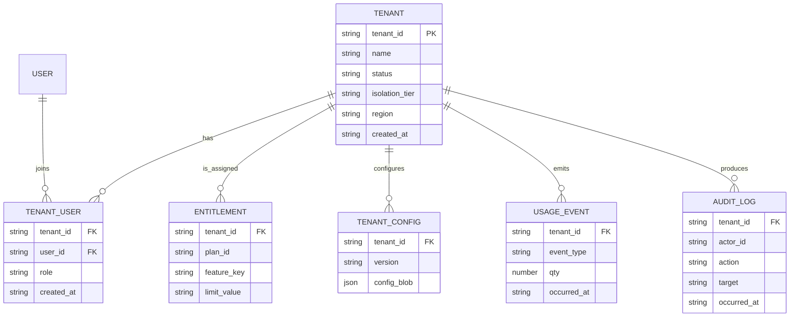

# Adapting a Single-Tenant System to a Multi-Tenant Approach

## Executive summary

A successful conversion from single-tenant to multi-tenant is less about “adding `tenant_id`” and more about establishing an **end-to-end tenant boundary** across **data, compute, network, and configuration**, then migrating safely while maintaining backward compatibility. Guidance from major SaaS architecture references emphasizes that multitenancy means **at least some components are shared**, and it does not require that *everything* is shared. citeturn16view0

Across well-established SaaS patterns, the most durable long-term strategy is a **hybrid (bridge) isolation posture**: default most tenants into efficient shared infrastructure (pool / shared schema) while offering graduation paths to **separate schema** or **separate database/instance** when driven by regulation, “noisy neighbor” performance constraints, customer-managed key requirements, or contractual backup/restore requirements. This mirrors widely used SaaS “pool / silo / bridge” framing, where the bridge model explicitly mixes shared and dedicated layers as needed. citeturn18view0turn18view1turn17view0turn24view0

In practice, the top technical risks are predictable and should shape the migration plan:

- **Cross-tenant data exposure** (often via missing object/field-level authorization or missing tenant scoping in caches, indexes, background jobs, and event consumers). API-level broken object authorization remains a top risk category in modern API security guidance. citeturn15search4turn15search0turn0search7  
- **Noisy-neighbor and cost blowups** when resource consumption isn’t scoped and quota-managed per tenant. This is both an availability problem and an explicit API security risk when workloads allow unbounded resource consumption. citeturn16view2turn12search1  
- **Migration correctness failures** (double-writes, partial cutovers, schema drift across tenants) unless you adopt well-known backward-compatible change patterns (“expand/migrate/contract”), safe rollout methods (canary), and retry-safe APIs (idempotency keys). citeturn9search0turn9search3turn7search0turn7search1  

A rigorous program typically proceeds in four phases:

1. **Foundations (tenant boundary + control plane):** introduce tenant identity, tenant routing/resolution, tenant configuration, and tenant-scoped authZ enforcement, plus organization-wide observability tags and metering hooks. citeturn16view3turn19view0turn16view4turn4search0  
2. **Pooled multi-tenancy (shared schema):** convert data model and query layer to enforce tenant boundaries (optionally using database-enforced row-level security where supported). citeturn24view0turn0search2turn0search6  
3. **Tiered isolation:** graduate select tenants to separate schema or separate database/instance with automation, keeping product version parity to avoid operational fragmentation. citeturn17view0turn24view0  
4. **Optimization and enterprise readiness:** per-tenant backup/restore semantics, stronger key management and compliance controls, and mature cost allocation/unit economics. citeturn11search4turn11search1turn5search0turn16view4turn8search0  

## Reference architecture and assumptions

Because your current system details are unspecified, this report assumes a typical web/API + background processing system with (a) a primary transactional datastore, (b) caches/search/indexing, (c) asynchronous jobs/events, and (d) third-party integrations. The architecture is described in vendor-neutral terms, and when stack-specific mechanisms are recommended (for example, PostgreSQL row-level security), the stack is stated explicitly. citeturn16view0turn0search2

### Tenant control plane and tenant data plane

A strong way to reason about multi-tenancy is **control plane vs data plane**:

- **Control plane:** tenant registry, tenant identity mapping, tenant entitlements/plan, per-tenant configuration, isolation tier assignment (shared vs schema vs database), onboarding/offboarding automation, and tenant-level billing/metering definitions. SaaS onboarding guidance emphasizes that “tenant onboarding” is the orchestration of components needed to provision/configure a new tenant. citeturn16view3turn13search5  
- **Data plane:** request routing, authZ enforcement, business operations, background jobs, and all persistence/query layers—each operating with a non-optional tenant context. Multi-tenant domain-name routing guidance notes that domain names can help distinguish tenants and route requests correctly. citeturn19view0  

### Tenant request flow diagram

```mermaid
flowchart LR
  U[User / Client] --> GW[Ingress: API Gateway / Edge]
  GW --> TR[Tenant Resolver]
  TR --> AU[Authenticate (OIDC)]
  AU --> AZ[Authorize (RBAC/ABAC)]
  AZ --> CFG[Load tenant config + entitlements]
  CFG --> RT{Isolation binding}
  RT -->|Shared schema| DB1[(DB shared)]
  RT -->|Separate schema| DB2[(DB shared, schema per tenant)]
  RT -->|Separate database| DB3[(DB per tenant)]
  DB1 --> SVC[Service execution]
  DB2 --> SVC
  DB3 --> SVC
  SVC --> OBS[Telemetry: logs/metrics/traces + tenant tags]
  SVC --> MET[Usage metering events]
  SVC --> OUT[Events / Jobs]
```

This diagram encodes a key invariant: **tenant resolution + authorization must happen before any data access**, and the tenant context must flow through sync and async boundaries (requests, jobs, events). This aligns with the core “shared vs dedicated components” framing of multitenancy, where not all components need to be shared but tenant boundaries must still be enforced. citeturn16view0turn18view0turn15search4  

### Minimal tenant data model diagram



## Tenancy models and isolation levels

### Tenancy models comparison table

The three primary database tenancy models you requested correspond cleanly to widely described SaaS isolation models: **pool** (shared schema), **bridge** (separate schemas), and **silo** (separate database/instance). citeturn24view0turn18view0  

| Tenancy model | Typical mapping | Strong points | Weak points | Best-fit scenarios | Backup/restore implications |
|---|---|---|---|---|---|
| Shared schema (one DB, same tables, `tenant_id` per row) | Pool | Best cost efficiency and easiest global schema rollout; simplest to operate at high tenant counts | Highest blast radius if tenant scoping fails; noisier neighbor risks; per-tenant restore is hardest | Many small/medium tenants; product still evolving fast | Requires careful per-tenant export/restore design; PITR restores the whole DB then you filter data (complex) citeturn24view0turn16view2turn10search0 |
| Separate schema (one DB, schema per tenant) | Bridge | Better logical isolation; reduces accidental cross-tenant joins; easier per-tenant restore than shared schema | Schema sprawl, migration orchestration complexity; operational overhead grows with tenants | Mid-size tenant counts; some tenant-level restore requirements; strong logical separation needed | Tenant restore is feasible by restoring schema-level objects; still tied to shared instance limits citeturn24view0turn23search8 |
| Separate database/instance (DB per tenant or tenant group) | Silo | Strongest data isolation and blast-radius reduction; easiest compliance carve-outs; easiest per-tenant restore | Highest cost and automation burden; managing large numbers of databases can become limiting | Regulated or premium tenants; strict data residency; customer-managed keys; strong per-tenant DR SLAs | Clean per-tenant PITR/restore; simpler legal hold / export / deletion boundaries citeturn24view0turn10search1turn10search6 |

Key decision insight: changing tenancy models later can be costly; the architecture center guidance for multitenant database tenancy patterns explicitly warns that switching models later can be expensive. citeturn16view1  

### Cost–isolation tradeoff chart

The following chart is qualitative (relative scores), to visualize the typical tradeoffs described in SaaS guidance: pool is cheapest but least isolated; silo is most isolated but most expensive/complex; bridge sits in the middle. citeturn24view0turn18view0  

```mermaid
xychart-beta
  title "Relative tradeoffs by tenancy model (illustrative)"
  x-axis ["Shared schema","Separate schema","Separate database"]
  y-axis "Relative score (1 low → 5 high)" 0 --> 5
  bar "Isolation strength (higher is better)" [2,3,5]
  bar "Operational burden (higher is worse)" [2,4,5]
  bar "Cost efficiency (higher is better)" [5,3,1]
```



### Recommended tenancy model strategy

**Recommended default:** adopt a **bridge-capable design** even if you start in shared schema. In other words: design the control plane so each tenant has an **isolation binding** (`shared_schema | schema | database`) and you can “graduate” tenants later without rewriting the platform. This is consistent with bridge and tier-based isolation guidance (mix pooled and siloed where needed, sometimes offered as premium tiers). citeturn18view1turn17view0turn24view0  

**Implementation steps (tenancy model selection & routing):**
1. Define tenant identity and lifecycle states (`provisioning`, `active`, `suspended`, `offboarding`, `deleted`).  
2. Implement a tenant registry with an “isolation binding” field.  
3. Implement a tenant-aware data access layer that routes per request/job to the correct storage binding (shared schema vs schema vs database).  
4. Force all data-access paths to require tenant context (compile-time if possible; run-time assertions otherwise).  

**Required artifacts/configs:**
- `tenant_registry` schema/table and admin APIs.  
- “Tenant resolution contract” (how to resolve tenant from host/subdomain, token claim, or explicit header) and a shared library used by all services. Domain-based routing approaches are explicitly discussed in multitenant domain name guidance. citeturn19view0  
- Connection routing configuration (pool sizes, limits, and per-tier policies).  
- Migration orchestration runbook per tier.

**Testing checklist (tenancy model):**
- Cross-tenant read/write attempts for every endpoint with object IDs (detect BOLA-class failures). citeturn15search4turn0search7  
- Cache-key and search-index tenant scoping tests (tenant A data must never appear for tenant B).  
- Load tests for “noisy neighbor” behavior and resource fairness across tenants. citeturn16view2turn12search1  
- Restore drills: prove per-tenant restore semantics for each tier. citeturn11search4turn11search1  

**Migration plan alternatives (tenancy model):**
- **Big bang:** switch all tenants to a shared-schema model at once (fast, highest risk; typically only viable for smaller data sets and strict freeze windows).  
- **Phased:** start with one tenant (your current tenant), then onboard a second tenant behind feature flags, then scale up; or migrate tenants by cohort. Canarying guidance is designed specifically to reduce deployment risk by limiting exposure. citeturn9search3  
- **Hybrid:** keep existing single-tenant deployments for some customers while new tenants go to pooled/shared or schema-based infrastructure; bridge model explicitly supports mixing isolation approaches. citeturn18view1turn17view0  

### Isolation levels

Multi-tenancy failures are rarely “just a database problem.” Isolation must be designed at **data, compute, network, and config** layers.

**Data isolation (tables, caches, indexes, events):**
- **Recommended options:**  
  - Shared schema **with database-enforced row-level security** where supported (example: PostgreSQL RLS via `CREATE POLICY` + `ENABLE ROW LEVEL SECURITY`). citeturn0search2turn0search6turn24view0  
  - Separate schema per tenant (bridge) or separate database per tenant (silo) for tenants with stronger requirements. citeturn24view0turn23search8  
- **Pros/cons:** RLS reduces reliance on application correctness but increases schema/policy complexity; schema/db isolation increases operational overhead but reduces blast radius. citeturn24view0turn0search2  
- **Implementation steps:** enforce tenant scoping in ORM/query builders; make tenant context mandatory in event payloads; partition caches and search indices by tenant.  
- **Artifacts/configs:** RLS policies (if used), “tenant context” event envelope fields (often modeled after structured event metadata conventions such as CloudEvents-like attributes). citeturn3search3  
- **Testing checklist:** data leakage tests across APIs, background jobs, and event consumers; “query linter” tests to block unscoped queries in code review/CI.  
- **Migration alternatives:** big bang adding tenant columns; phased backfill with dual-read; hybrid with some tenants on separate schema/db.

**Compute isolation (CPU/memory/workers):**
- **Recommended options:**  
  - Shared worker pools with **per-tenant quotas and concurrency limits**. Kubernetes multi-tenancy guidance describes mapping tenants to namespaces and using resource quotas to prevent tenants from monopolizing resources and to minimize noisy-neighbor issues. citeturn16view2turn3search1  
  - Dedicated worker pools for premium tenants (tier-based isolation). citeturn17view0  
- **Implementation steps:** per-tenant rate limits; per-tenant background job concurrency; per-tenant queue partitions for heavy tenants.  
- **Artifacts/configs:** quota configuration (limits/requests); queue configuration; tenant worker policies. citeturn3search1turn3search5  
- **Testing checklist:** noisy-neighbor simulations; verify throttling works; verify critical tenants are protected under load. citeturn12search1  
- **Migration alternatives:** phased enable quotas while still single-tenant to validate non-functional behavior; hybrid dedicated workers for early enterprise customers.

**Network isolation (tenant-to-tenant and tenant-to-backend):**
- **Recommended options:**  
  - Default-deny network posture for intra-cluster traffic using network policies; Kubernetes’ NetworkPolicy resources govern pod-to-pod communication when supported by the network plugin. citeturn3search6turn3search2  
  - For stronger isolation tiers: per-tenant VPC/VNet or per-tenant cluster (silo). citeturn18view0turn24view0  
- **Artifacts/configs:** network policy templates; egress allowlists per tenant/integration.  
- **Testing checklist:** verify cross-namespace communication is blocked where intended; integration egress restrictions enforced.  
- **Migration alternatives:** phased rollout of network policies; hybrid: dedicated networking for premium tenants only.

**Configuration isolation (feature flags, connectors, secrets):**
- **Recommended options:** per-tenant config schema + validation + auditing; avoid “security misconfiguration” class issues by treating config as a first-class, reviewed artifact. citeturn15search7turn16view3  
- **Implementation steps:** typed config contracts per tenant; safe defaults; change approval workflow for high-risk flags.  
- **Testing checklist:** config fuzzing; ensure forbidden configs are rejected; ensure secrets never leak into logs.  

## Tenant-aware identity and authorization

Identity subsystems must evolve from “single tenant user” to “user + tenant + role/attributes,” including support for enterprise SSO and automated provisioning. Guidance strongly cautions against building your own identity provider because it is complex and difficult to secure; instead, focus on integrating standards-based IdPs. citeturn19view1  

### Tenant resolution and tenant-aware authentication

**Recommended options:**
- **Tenant via host/subdomain/custom domain** (common for SaaS). Domain name guidance explicitly notes domain names can distinguish tenants and help route traffic, and it also discusses operational/security pitfalls such as dangling DNS/subdomain takeover scenarios. citeturn19view0  
- **Tenant via token claim** (tenant ID in access token and/or ID token) after authentication.  
- **Tenant via explicit header/parameter** (only for trusted internal-to-internal calls; risky for public APIs unless strictly validated).

**Implementation steps:**
1. Define a canonical tenant identifier format (opaque, non-guessable).  
2. Implement tenant resolution middleware (host → tenant mapping; token claim → tenant mapping; optional routing table).  
3. Ensure tenant resolution happens before authZ and before any data access.  
4. For custom domains, implement robust domain validation and safe offboarding steps to mitigate dangling DNS risks. citeturn19view0  

**Artifacts/configs:** tenant-domain mapping table; domain validation workflow; tenant resolver library used by every service; runbook for domain offboarding. citeturn19view0  

**Testing checklist:** host-header based tenant resolution tests; custom domain validation tests; offboarding tests that prevent subdomain takeover windows. citeturn19view0  

**Migration alternatives:**
- **Big bang:** all auth tokens and routing updated in one release (usually risky).  
- **Phased:** accept both old and new token formats; gradually require tenant claims.  
- **Hybrid:** keep single-tenant auth for legacy deployments while multi-tenant endpoints require tenant resolution.

### Authorization changes: tenant-aware RBAC and ABAC

**Recommended baseline:** implement **RBAC for coarse-grained roles** (tenant admin, tenant user, billing admin, support) plus **ABAC for fine-grained rules** (resource owner, department, environment, data classification). NIST defines ABAC as evaluating attributes of subject, object, requested operation, and possibly environment against policy/rules. citeturn1search19  

For RBAC foundations and standardization history, NIST’s RBAC project materials identify core RBAC references and the evolution toward standard models. citeturn2search4  

**Implementation steps:**
1. Define authorization model primitives: principals, resources, actions, and tenant boundary rule (“deny by default if tenant mismatch”).  
2. Create an explicit permission matrix for endpoints and background actions (avoid broken function-level authorization). citeturn15search1  
3. Enforce object-level authorization for any request using object IDs; this is central to preventing broken object level authorization. citeturn15search4  
4. Add field/property-level authorization (avoid leaking sensitive fields to otherwise authorized users). citeturn15search0  

**Artifacts/configs:** role/permission catalog; ABAC policy definitions; audit log schema for permission changes.

**Testing checklist:**
- Automated tests for object-level access control (BOLA). citeturn15search4  
- Tests for property-level exposure (BOPLA) on DTOs/serializers. citeturn15search0  
- Admin-only operations tests (BFLA class). citeturn15search1  

**Migration alternatives:**
- **Big bang:** swap to tenant-aware authZ everywhere (high regression risk).  
- **Phased:** add tenant checks in read paths first, then write paths; put “deny on ambiguous tenant” in place early.  
- **Hybrid:** dual authorization stacks temporarily; gradually migrate endpoints to the new policy engine.

### Tenant SSO and enterprise provisioning

**SSO option:** implement OpenID Connect (authentication layer on top of OAuth 2.0) for tenant SSO. The OpenID Connect Core specification defines this identity layer and claim model. citeturn1search1  

**API authorization option:** OAuth 2.0 is the standard authorization framework for delegated access; its IETF specification describes the framework. citeturn1search0  

**Security hardening:** adopt OAuth security best current practice guidance (updates threat model and deprecates insecure modes). citeturn2search3  

**Provisioning option:** support SCIM for enterprise user/group provisioning; SCIM is an HTTP-based protocol for cross-domain identity management. citeturn1search2  

**Implementation steps:**
1. Add tenant-aware identity mapping (`external_subject` → `user_id` + `tenant_id`).  
2. Support per-tenant IdP configuration (issuer, client_id, signing keys, claims mapping).  
3. Implement SCIM endpoints and map groups/roles to RBAC/ABAC attributes. citeturn1search2turn1search19  

**Artifacts/configs:** IdP config objects; claim mapping rules; SCIM schemas; token validation library.

**Testing checklist:** multi-IdP login tests across tenants; token validation tests; SCIM create/update/deactivate tests.

**Migration alternatives:** phased rollout by tenant; hybrid support for password auth + SSO until tenants finish adoption.

## Data partitioning, migrations, and schema evolution

### Data partitioning strategy

**Partition key recommendation:** make `tenant_id` a first-class concept in the data model and ensure it is present wherever tenant ownership exists (rows, documents, objects, event payloads, cache keys). If you use a pool model with shared schema, database-enforced row-level policies are a common way to enforce that per-row tenant separation. For PostgreSQL, row security policies are defined with `CREATE POLICY` and enabled with row-level security on tables. citeturn0search2turn0search6turn24view0  

**Pros/cons (high-level):**
- “Tenant ID everywhere” improves auditability and filtering but increases schema churn and requires strict discipline in queries and event schemas.  
- Relying only on application-layer filtering is flexible but increases risk of cross-tenant leakage in edge cases (especially in batch jobs and ad‑hoc queries). API security guidance repeatedly highlights authorization errors as a dominant risk. citeturn15search4turn0search7  

**Implementation steps:**
1. Add `tenant_id` to all tenant-owned entities; update primary/unique key strategy where needed (often composite uniqueness on `{tenant_id, natural_key}`).  
2. Add database constraints and indexes that include `tenant_id` (to keep query performance predictable in shared schema).  
3. Update caches and search indexes to always include tenant dimension in keys and filters.  
4. Update event envelopes to include tenant context consistently (this prevents “cross-tenant consumers” from mixing streams).  

**Artifacts/configs:** schema migration scripts; tenant-aware query helper library; event schema registry.

**Testing checklist:**  
- Static or runtime guards preventing unscoped queries.  
- Performance regression tests: queries must remain selective with `tenant_id` indexes.  
- Replay tests for event consumers to ensure tenant scoping is persistent through reprocessing.

**Migration alternatives:** phased backfill (recommended) vs big bang (only if data volume is small and strong freeze window exists).

### Migration strategies for data and tenants

Because you are converting from single tenant, your current data can be treated as belonging to an initial tenant (call it `T0`). The safest migration methods use backward-compatible steps and limited blast radius.

**Migration plan alternatives (big bang / phased / hybrid):**
- **Big bang:**  
  - Add `tenant_id` to schema, backfill all rows, deploy tenant-aware code, and open onboarding for new tenants in one cutover.  
  - Best when data volume is small, operational downtime is acceptable, and you can afford a hard freeze window.
- **Phased (recommended default):**  
  - Use “expand/migrate/contract” (parallel change): expand schema to support tenant_id while old code still works; migrate data and gradually shift reads/writes; contract/remove legacy paths after stabilization. citeturn9search0turn9search4  
  - Use canary rollout: enable multi-tenancy for a small percentage of tenants/traffic first. citeturn9search3  
- **Hybrid:**  
  - Keep some tenants fully siloed (separate DB/instance) while the majority are pooled. This is explicitly aligned with bridge/tier-based isolation patterns. citeturn18view1turn17view0turn24view0  

### Schema evolution and versioning in multi-tenant environments

**Core recommendation:** treat schema evolution as a product capability, not a maintenance task. Adopt parallel change (expand → migrate → contract) to avoid breaking mixed-version environments and to keep rollback feasible. citeturn9search0turn9search4  

**What changes versus single tenant:**
- In shared schema, a migration affects everyone; correctness and rollback discipline must be higher.  
- In separate schemas or separate databases, you must orchestrate migrations across many targets and track per-tenant schema versions to avoid drift (for example, tenant A on v17 while tenant B is on v16). This is where automation and a schema-version registry become essential.

**Implementation steps:**
1. Create a `schema_version` record per tenant (or per schema/db) and a migration runner that is idempotent.  
2. Require backward-compatible deployments: new service version must read old and new schema until migration completes (“expand”). citeturn9search0  
3. Use feature flags for schema-dependent behavior so you can decouple “deploy code” from “activate new schema usage.” citeturn9search1  

**Artifacts/configs:** migration orchestration tooling; per-tenant schema version table; schema compatibility test suite.

**Testing checklist:**  
- Preflight migration test on staging clone.  
- Online migration lock/latency tests (ensure migrations do not introduce unacceptable blocking).  
- Mixed-version compatibility tests (old readers with new schema; new readers with old schema).

## Tenant lifecycle, customization, billing, and observability

### Tenant onboarding and offboarding

**Onboarding recommendation:** automate provisioning end-to-end. SaaS onboarding guidance describes onboarding as orchestrating components to provision and configure all elements needed for a tenant. citeturn16view3turn13search5  

**Onboarding implementation steps:**
1. Create tenant record and initial config (plan, region, isolation tier).  
2. Provision data resources based on isolation tier (shared tables; schema; DB).  
3. Apply baseline schema migrations to tenant storage.  
4. Register tenant domain/subdomain/custom domain routing (if applicable) and validate it safely. Domain guidance highlights both wildcard DNS simplification and the operational risk of dangling DNS/subdomain takeover during offboarding. citeturn19view0  
5. Create initial admin user(s) via SCIM invite or bootstrap workflow. citeturn1search2  

**Offboarding implementation steps:**
1. Suspend tenant access (soft lock) and retain audit evidence.  
2. Export tenant data (for portability) and/or delete tenant data (for erasure) depending on contractual and regulatory needs. GDPR includes rights to erasure and data portability, which frequently translate into offboarding requirements and export tooling expectations. citeturn20search0turn20search1  
3. Revoke tokens/keys and delete secrets; release domains only after safe validation steps to prevent dangling DNS risk. citeturn19view0  
4. Confirm backup/retention policy and legal holds (if any).

**Artifacts/configs:** onboarding workflow definition; tenant bootstrap playbook; offboarding playbook; domain validation checklist.

**Testing checklist:**  
- Tenant provisioning idempotency (safe retries).  
- Offboarding correctness: access denied, data export works, domain release is safe.  
- Compliance workflow tests: confirm retention is honored.

**Migration alternatives:** phased onboarding (pilot tenants) is strongly preferred; hybrid offboarding supports “archive tenant” states while you validate deletion/export processes.

### Per-tenant customization and feature flags

**Recommended option:** use feature toggles/flags to control per-tenant capabilities, rollout, and safe experimentation. Feature toggling is widely described as a pattern set for delivering functionality rapidly but safely. citeturn9search1  

**Pros/cons:**
- Pros: safer rollouts, tenant tiering, emergency kill switches. citeturn9search1turn17view0  
- Cons: complexity debt if flags are not governed and removed; can create inconsistent tenant behavior if uncontrolled. citeturn9search5  

**Implementation steps:**
1. Define a flag taxonomy: release flags, ops kill switches, experiment flags, tenant-tier flags. citeturn9search1turn9search5  
2. Treat flags as configuration with review, auditing, and safe defaults (avoid security misconfiguration). citeturn15search7  
3. Couple schema-dependent flags to schema version checks (avoid runtime surprises).

**Artifacts/configs:** flag registry; tenant entitlements model; governance workflow for flag changes.

**Testing checklist:** flag evaluation tests; ensure flags never bypass authorization; ensure defaults are safe.

**Migration alternatives:** phased enablement by cohort; hybrid keep old behavior for legacy customers while new tenants use new flags.

### Billing and usage metering per tenant

**Recommended approach:** design an internal “usage events” and “usage aggregation” capability, then optionally integrate with an external billing platform. External metering documentation from a major payments provider describes the concept of “meters” tracking usage events and aggregating for usage-based billing, including asynchronous processing considerations. citeturn12search18turn12search0  

**Implementation steps:**
1. Define billable usage events (API calls, seats, storage GB-hours, job minutes, etc.).  
2. Emit immutable usage events tagged with tenant_id.  
3. Aggregate usage by billing period; ensure idempotency for ingestion (no double-counting).  
4. Reconcile metering with cost allocation (unit economics). SaaS expenditure guidance emphasizes that per-tenant cost attribution begins with a consumption mapping model and that shared-resource attribution is challenging. citeturn16view4  

**Artifacts/configs:** event schema for metering; aggregation jobs; billing plan definitions; audit logs for billing adjustments.

**Testing checklist:** usage double-count prevention; late-arriving usage events handling; reconciliation tests.

**Migration alternatives:**  
- Big bang usage billing is rarely recommended; instead use phased “shadow metering” (measure first, bill later).  
- Hybrid: some tenants billed on subscriptions only while metering is validated.

### Monitoring and observability per tenant

**Recommended standard:** adopt an OpenTelemetry-based telemetry model and include tenant tags in logs/metrics/traces (as resource attributes and/or span attributes), while being disciplined about not leaking PII. entity["organization","OpenTelemetry","observability project"] specifications include OTLP (delivery protocol) and semantic conventions (standard attribute naming). citeturn4search0turn4search2turn4search7  

**Context propagation:** distributed tracing context propagation is standardized by the trace context specification from the entity["organization","World Wide Web Consortium","web standards body"], including the `traceparent` and `tracestate` headers. citeturn4search1turn4search8  

**Implementation steps:**
1. Define a tenant telemetry policy: include tenant_id as a low-sensitivity identifier; forbid secrets/PII in propagated baggage. OTEL baggage enables passing key-value context across services; it must be governed. citeturn4search11  
2. Standardize log fields: `tenant_id`, `request_id`, `trace_id`, `job_id`, `actor_id`.  
3. Build per-tenant dashboards: error rate, latency, background queue lag, throttling, and cost drivers.  
4. Add per-tenant SLOs for premium tiers (tie into tier-based isolation and pricing). citeturn17view0  

**Artifacts/configs:** telemetry schema standard; collector pipelines; per-tenant dashboard templates; alert routing rules by tenant tier.

**Testing checklist:** verify tenant tags are present end-to-end; verify redaction rules; verify cross-tenant log access controls.

**Migration alternatives:** phased rollout of instrumentation (start at ingress → service → jobs); hybrid dedicated observability pipelines for regulated customers only.

## Backup, disaster recovery, security, operations, and rollout strategy

### Backup/restore and disaster recovery per tenant

**Key concept:** define explicit recovery objectives. entity["organization","National Institute of Standards and Technology","us standards institute"] glossary definitions capture that **RPO** is the point in time to which data must be recovered after an outage, and **RTO** is the maximum time a system can remain in recovery before unacceptable impact. citeturn11search1turn11search4  

**Options by tenancy model:**
- Shared schema: whole-database PITR restores are possible, but per-tenant restore typically requires post-restore filtering/export or a parallel “tenant export snapshot” mechanism. PostgreSQL continuous archiving + point-in-time recovery requires a continuous sequence of archived WAL files. citeturn10search0  
- Separate schema: per-tenant restore is more feasible by restoring schema-specific objects (still requiring careful procedural discipline).  
- Separate database/instance: simplest per-tenant restore posture; managed services commonly support PITR workflows. citeturn10search1turn10search6  

**Implementation steps:**
1. Define RPO/RTO targets per tenant tier. citeturn11search1turn11search4turn17view0  
2. Implement backup automation and retention policies per tier.  
3. Document and rehearse restore procedures (including access-control revalidation after restore). GDPR security-of-processing expectations include ability to restore availability and access in a timely manner and regular testing of measures. citeturn20search7  

**Artifacts/configs:** backup policy docs; restore runbooks; DR test schedule; evidence of restore drills.

**Testing checklist:** quarterly restore drills; tenant restore isolation checks (restored tenant cannot see others); audit log integrity.

**Migration alternatives:** phased introduction of restore tooling (start with separate-db tenants first, then shared-schema exports).

### Security/compliance: encryption, key management, PCI, GDPR

**Encryption and key management:**
- AES is a FIPS-approved symmetric cipher for protecting electronic data; NIST’s AES publication describes its role as a standard algorithm. citeturn5search5turn5search9  
- Key management should follow disciplined lifecycle guidance; NIST SP 800-57 provides general best practices for cryptographic key management. citeturn5search0turn5search16  

**Per-tenant keys (recommended pattern):**
- Default: envelope encryption with a per-tenant data key hierarchy (tenant-level key encryption keys where feasible).  
- Premium: customer-managed keys and/or dedicated key stores, paired with siloed data storage when required.

**PCI implications:**
- PCI DSS is defined as baseline technical and operational requirements to protect payment account data. citeturn6search7turn6search10  
- If your system handles tokenization in scope-sensitive areas, the entity["organization","Payment Card Industry Security Standards Council","pci standards council"] publishes tokenization security guidelines intended to support compliance with PCI DSS. citeturn22view0turn21view0  

**GDPR implications (tenant lifecycle & security posture):**
- Article 32 includes risk-based security measures such as encryption/pseudonymisation, ensuring availability/resilience, and restore capability plus regular testing. citeturn20search7  
- Article 17 (erasure) and Article 20 (data portability) shape typical SaaS offboarding/export requirements. citeturn20search0turn20search1  
- Article 28 drives processor obligations and data processing contract expectations in B2B SaaS contexts. citeturn20search2  

**Implementation steps (security/compliance):**
1. Data classification policy per tenant; map classification → encryption and retention.  
2. Secrets isolation per tenant (connectors, webhooks, credentials).  
3. Mandatory audit logs for admin actions, permission changes, and billing changes.  
4. Continuous security testing focus areas: broken object auth, property-level auth, unrestricted resource consumption, misconfiguration, and inventory management. citeturn15search4turn15search0turn12search1turn15search7turn15search2  

**Artifacts/configs:** data processing addendum templates (when applicable); security configuration baselines; key rotation policies; incident response + cross-tenant exposure runbooks.

**Testing checklist:** encryption-at-rest validation; key rotation drills; red-team style cross-tenant access tests; webhook signature verification tests (where applicable).

**Migration alternatives:** hybrid compliance tiers (strict customers get silo) while pooled customers share infra under strong boundaries. citeturn17view0turn24view0  

### Operational impacts: CI/CD, testing, deployments

**Deployment safety patterns:**
- Rolling updates are designed to deploy new versions with zero downtime by incrementally replacing instances. Kubernetes rolling update guidance describes this behavior. citeturn9search2turn9search6  
- Canary releases reduce risk by exposing changes to a small portion of users/traffic first; SRE guidance frames canarying as a mechanism to mitigate deployment risk. citeturn9search3  

**Compatibility and rollback patterns (mandatory for multi-tenancy):**
- Use parallel change (expand → migrate → contract) for backward-incompatible interface changes, including schema changes; it makes rollback and mixed-version operation feasible. citeturn9search0turn9search4  
- Add idempotency for mutation endpoints so retries don’t double-apply changes. HTTP semantics define idempotent methods, and an IETF draft specifies an `Idempotency-Key` header field for making POST/PATCH fault-tolerant. citeturn7search1turn7search0  

**Implementation steps (ops):**
1. Add multi-tenant test environments: seed at least two tenants with overlapping-looking identifiers to catch leakage.  
2. Add “tenant isolation” test suite (API, jobs, caches, search).  
3. Add schema migration pipelines per tenancy model tier.  
4. Add release gates: canary + automated rollback triggers (error budget / SLO breaches). citeturn9search3turn16view2  

**Artifacts/configs:** CI job templates; migration pipeline definitions; tenant isolation test harness; production readiness checklist.

**Testing checklist:**  
- Regression tests across 2+ tenants for every release.  
- Performance and quota tests (noisy neighbor). citeturn16view2turn12search1  
- Inventory management for APIs (ensure old endpoints not exposed unintentionally). citeturn15search2  

### Cost estimation and cost optimization

**Core insight:** per-tenant cost attribution must be designed; it is not “free” in pooled systems. Expenditure awareness guidance explicitly notes that measuring/attributing costs begins with a consumption mapping model and that shared-resource attribution is challenging. citeturn16view4  

**Unit economics framing:** the entity["organization","FinOps Foundation","finops org"] emphasizes linking SaaS costs to business metrics (unit economics) such as cost per transaction or cost per order. citeturn8search0turn8search4  

**Practical cost model (recommended):**
- **Fixed shared cost per tenant:** (shared infra + control plane) ÷ active tenants  
- **Variable cost per tenant:** metered compute + storage + egress + 3rd‑party calls attributed by usage signals  
- **Premium isolation adders:** dedicated DB/compute, dedicated observability, dedicated support SLAs

**Optimization levers (high impact):**
- Use tier-based isolation to avoid over-siloing; tier guidance notes silo should be offered sparingly to avoid drifting into fully siloed operational burden. citeturn17view0  
- Enforce tenant-scoped quotas and rate limits to reduce both outage risk and cost spikes; Kubernetes resource quotas and API security guidance on unrestricted consumption both support this necessity. citeturn16view2turn12search1  
- Use cloud tagging for isolated resources (where possible): cost allocation tags help categorize and track cloud costs (most effective for siloed resources; less so for fully shared). citeturn8search1turn16view4  

### Migration decision matrix

This matrix helps choose among **big bang**, **phased**, and **hybrid** migration plans based on risk posture and constraints. Canary and parallel change patterns underpin most phased/hybrid recommendations. citeturn9search3turn9search0turn18view1  

| Criterion | Big bang favored when… | Phased favored when… | Hybrid favored when… |
|---|---|---|---|
| Downtime tolerance | You can schedule a hard freeze window and tolerate high cutover risk | Downtime must be near-zero; you need gradual rollout | Some tenants can accept change; others require stable legacy for longer |
| Data volume and complexity | Small dataset; simple schema; limited integrations | Medium/large dataset; many tables; background jobs and events | Data residency/compliance segmentation; multiple products with different needs |
| Security/compliance exposure | Regulatory scope is low | You must prove isolation before scaling tenant count | You must offer premium isolation (silo) while keeping pool for others citeturn17view0turn24view0 |
| Operational maturity | Strong change management and rapid rollback capability | You need canaries/flags to manage risk | You can automate provisioning of both pooled and silo tenants |
| Need for backwards compatibility | Minimal; can break clients once | High; must support mixed versions and gradual client updates | Very high; legacy + new run side by side |

### Rollback and compatibility strategy checklist

**Recommended default:** combine (a) expand/contract schema changes, (b) feature flags for activation control, (c) canary releases for exposure control, and (d) idempotency keys for retry safety. citeturn9search0turn9search1turn9search3turn7search0turn7search1  

**Implementation steps:**
1. Add `Idempotency-Key` support (or equivalent) on all side-effecting POST/PATCH endpoints; define retention and replay rules. citeturn7search0turn7search2  
2. Ensure old and new versions can safely operate during migration windows (parallel change). citeturn9search0  
3. Maintain tenant-aware rollback runbooks: rollback code, rollback config/flags, rollback schema (only by contract step), rollback routing.

**Testing checklist:** retry storms on writes; rollback drills; mixed-version read/write tests.

**Migration alternatives:** phased/hybrid are strongly preferred for multi-tenancy because they let you validate tenant isolation and avoid large blast radius changes. citeturn9search3turn18view1turn24view0  

