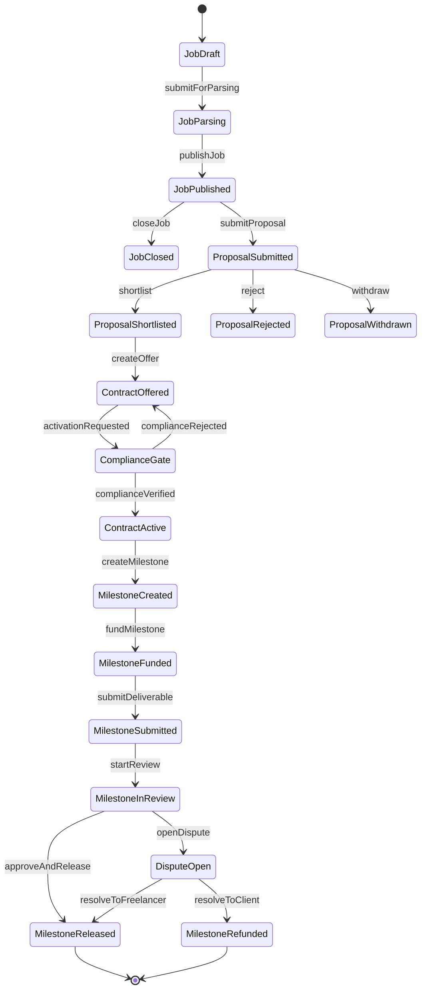
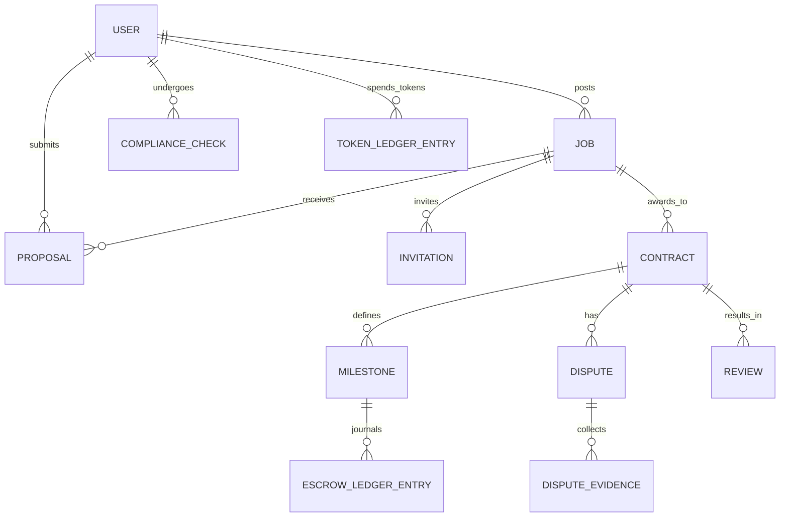
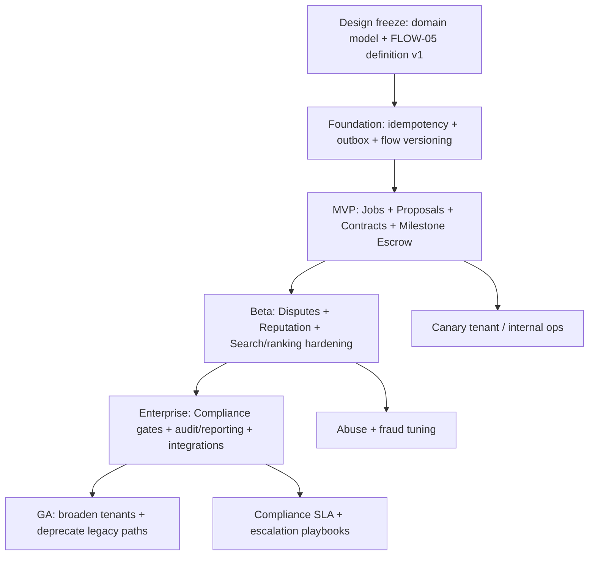

# Extending the Engine to Support FLOW-05 Freelancer Marketplace Flow Creation

## Executive summary

The available 17-* materials define a target “Freelancer Marketplace & Contract Management” capability (FLOW-05) and frame implementation as a **state-driven orchestration problem** spanning job posting, proposals/bidding, contract creation, milestone escrow execution, disputes, and enterprise compliance gating. fileciteturn0file0 fileciteturn0file1

From an engine perspective, FLOW-05 is best treated as a **composed, multi-entity workflow** whose correctness depends on (a) explicit state machines for each transactional aggregate (Job, Proposal, Contract, Milestone/Escrow, Dispute, ComplianceCheck), (b) durable orchestration state (“master state”) and definition versioning, and (c) robust distributed-systems primitives: **idempotent commands**, **transactional event emission**, **timers** (e.g., review windows), **compensation/saga patterns**, strong **authorization boundaries**, and first-class **observability**.

The documents use entity["company","Upwork","freelance marketplace"] and entity["company","Freelancer.com","freelance marketplace"] as behavioral reference points: (1) tokenized proposal submission (“Connects”) and proposal boosting auctions, (2) hourly “Work Diary” evidence capture, (3) milestone escrow holding funds until release/dispute conclusion, (4) contest handover as an IP/ownership transfer gate, and (5) enterprise compliance services that can introduce hard-stop gates and longer lead times. citeturn0search16turn0search4turn0search8turn1search4turn1search1turn0search3

The core recommendation is to extend the engine with three capabilities that are typically missing in “basic workflow” implementations but are required for FLOW-05-grade marketplace flows:

1. **Multi-aggregate orchestration**: a single flow instance that coordinates multiple aggregates (Job → Proposal → Contract → Milestone/Escrow → Dispute), without collapsing everything into one giant table/object. (Design requirement derived from FLOW-05 scope.) fileciteturn0file0  
2. **Money-safe execution model**: idempotent commands and an immutable ledger for escrow/payout actions, plus transactional outbox delivery to avoid dual-write failure modes. citeturn5search0turn5search9  
3. **Policy-driven gates and timers**: “hard stops” (e.g., KYC/compliance) and timed transitions (e.g., auto-release after a review period, security holds) expressed declaratively in flow definitions, not buried in service code. fileciteturn0file0 citeturn6search2turn6search5

A phased rollout is structurally aligned with the documents: MVP covers job posting + proposals + basic contracting + milestone escrow; beta adds ranking/boosting, disputes, reputation; enterprise adds compliance gates, audit/reporting, external integrations. fileciteturn0file0

## Sources, scope, and open questions

This report is grounded in the two accessible 17-* documents provided in this workspace. fileciteturn0file0 fileciteturn0file1  
Your request references “17-* attached documents”; if additional 17-* documents exist in other project sources, their requirements (especially any engine DSL/UI for “flow creation”) could materially change details like schema fields, APIs, and priority order. Where the current inputs do not specify requirements, this report explicitly records **open questions** rather than guessing.

Key open questions (must be confirmed to finalize the design and estimates):

- Current engine architecture: modular monolith vs microservices; existing orchestrator/state-store capabilities; current “Skills/DNA” implementation details and versioning mechanisms. fileciteturn0file0  
- Persistence baseline: primary DB(s), existing event bus/message broker, and whether an immutable ledger pattern already exists for payments.  
- Payment rails and constraints: provider(s), multi-currency requirements, chargeback model, payout batching, and whether “security hold” semantics are required (like Upwork’s fixed-price hold). citeturn6search5  
- Identity/compliance: KYC vendor, compliance jurisdictions, whether worker-classification checks are required (enterprise), and expected SLA/lead time for compliance gating. citeturn0search3  
- Flow semantics that affect timers: review window duration(s), auto-release rules, dispute windows, and evidence retention rules for hourly work evidence. citeturn6search2turn0search8turn0search11  
- Search/matching: whether you require near-real-time indexing for discovery and what relevance signals must be supported. (If using Elasticsearch-like tech, refresh intervals shape “publish → searchable” latency.) citeturn4search2  
- Privacy/security posture: PII classification, retention and access rules for evidence artifacts (screenshots, deliverables), and GDPR/PCI scope expectations. citeturn4search0turn3search3

## Extracted FLOW-05 specification

The available materials define FLOW-05 as a marketplace “operating system” composed of repeatable modules (identity/reputation, discovery, bidding/proposals, contracting, work evidence, payments/escrow, disputes, enterprise governance). fileciteturn0file1 fileciteturn0file0  
They also explicitly name baseline state progressions for key stages (Job Draft→Parsing→Published; Bidding Open→Proposal Received→Shortlisted; Execution Active→Submitted→Review→Released; Compliance KYC_Pending→Verified→Contract_Ready). fileciteturn0file0

### Flow entities and relationships

FLOW-05 requires a consistent mapping between **domain entities** (business aggregates) and **engine entities** (flow definition/execution artifacts). A practical separation is:

**Domain aggregates (business truth)**  
Job, Proposal, Invitation, Contract, Milestone, EscrowAccount/LedgerEntry, Deliverable/WorkEvidence, Dispute, ComplianceCheck, Review/ReputationSignal, TokenWallet/TokenLedger (if proposal currency exists).

**Engine artifacts (orchestration truth)**  
FlowDefinition, FlowVersion, FlowInstance, StepInstance, TransitionInstance, TimerInstance, PolicyGate, IdempotencyKey (or IdempotencyRecord), EventOutboxRecord.

This separation allows the engine to orchestrate without owning domain data, and it enables independent domain services (the “Skills” pattern in your documents) while keeping a single observable execution narrative. fileciteturn0file0

### States and transitions

The minimum state machines implied by the materials and the reference marketplace behaviors are:

**Job lifecycle**  
Draft → Parsing/Enrichment → Published → (Closed/Expired). fileciteturn0file0  
- Parsing/enrichment exists to extract skills/taxonomy for discovery (your materials call this out as part of publishing readiness). fileciteturn0file0  
- Publish must trigger indexing so the job is discoverable; if using near-real-time search, indexing latency is bounded by refresh configuration (commonly ~1s on active indices). citeturn4search2

**Proposal/Bid lifecycle**  
Draft → Submitted → (Shortlisted | Rejected | Withdrawn). fileciteturn0file0  
- If you implement a tokenized proposal economy: proposal submission consumes tokens (“Connects” on Upwork), and boosting consumes additional tokens via an auction-like mechanism. citeturn0search16turn0search4turn0search1  
- If you implement a Freelancer-style bid, bids include amount + delivery time + proposal text + optional milestones. citeturn1search2

**Contract lifecycle**  
Offered → (ComplianceGate) → Active → (Paused) → Closed. fileciteturn0file0  
- Enterprise compliance may gate activation; Upwork’s enterprise compliance services are described as reducing worker misclassification risk and occurring after hiring, with a typical multi-day turnaround. citeturn0search3

**Milestone/Escrow lifecycle**  
Created → Funded (Escrowed) → Submitted → InReview → (Released | Disputed | Refunded). fileciteturn0file0  
- Freelancer’s Milestone Payment system explicitly holds funds until the client releases them or dispute resolution concludes. citeturn1search4  
- Upwork’s fixed-price milestone funding is held until submission + client approval (with auto-release if the client does not respond within a stated time window), and it describes a security hold after approval/auto-release. citeturn6search2turn6search5

**Dispute lifecycle**  
Open → EvidenceCollection → Review → Resolved → Closed. (The documents treat disputes/ticketing as a first-class module.) fileciteturn0file0  
- The key invariant is “funds cannot be released while disputed,” matching escrow-based dispute models. citeturn1search4

**ComplianceCheck lifecycle**  
KYC_Pending → Verified → (Expired/Rejected). fileciteturn0file0  
- Freelancer describes KYC as identity verification intended to prevent fraud/money laundering/terrorist financing. citeturn1search15

**Optional: Contest handover lifecycle (if you later model contests)**  
Awarded → HandoverInProgress → OwnershipTransferred → PrizeReleased.  
Freelancer’s contest flow explicitly ties prize release to completing a “Contest Handover” that transfers ownership of the entry materials. citeturn1search1turn1search13

### Domain events, engine triggers, and IO contracts

FLOW-05 benefits from an explicit event taxonomy because it is naturally cross-service. At minimum:

- **Command-style inputs (API/engine actions)**: `PublishJob`, `SubmitProposal`, `BoostProposal`, `ShortlistProposal`, `CreateContract`, `ActivateContract`, `CreateMilestone`, `FundMilestone`, `SubmitDeliverable`, `ApproveMilestone`, `ReleaseMilestone`, `OpenDispute`, `ResolveDispute`, `SubmitKYC`, `VerifyKYC`.  
- **Domain events (immutable facts)**: `job.published`, `proposal.submitted`, `proposal.boosted`, `contract.activated`, `milestone.funded`, `deliverable.submitted`, `milestone.released`, `dispute.opened`, `kyc.verified`, etc.  
- **Engine triggers**: timers (review window expiry), policy gates (compliance verified), and external callbacks (payment provider webhooks).

For money-moving actions, the IO contract must include an **idempotency key** (client-provided or engine-generated) and return the same result for safe retries; this is a widely adopted pattern in payment APIs to prevent double processing. citeturn5search0

For multi-step distributed sequences (e.g., “fund milestone” → “write escrow ledger” → “emit event” → “notify” → “update search/read model”), distributed consistency is best handled with **sagas** and transactional message emission patterns, rather than distributed transactions. citeturn5search16turn5search9turn5search1

### Constraints and error cases

FLOW-05 has a small set of *high-impact invariants* that should be enforced at the engine + domain boundary (guards) and again at the persistence layer (constraints):

- **Authorization (object-level)**: only job owners can publish/close; only job participants can see proposals/contract threads; only contract parties (and authorized admins) can see disputes/evidence. Broken access control is consistently a top web risk category; object-level authorization must be testable and enforceable. citeturn3search2turn3search14  
- **Idempotency for side-effectful commands**: funding, release, refund, proposal submission (if token spend), boosting (if auction). Without idempotency, retries can double-charge or double-release. citeturn5search0  
- **Escrow safety**: cannot release funds unless funded; cannot refund after release; cannot release while disputed. Freelancer’s milestone doc explicitly frames “funds held until release or dispute resolution concludes,” which implies these guards. citeturn1search4  
- **Compliance hard stops (configurable)**: contract activation must fail fast (or remain pending) until required compliance checks are verified; Upwork enterprise compliance is described as an optional program that changes responsibility and outcomes, so this should be tenant/policy driven rather than globally hardcoded. citeturn0search3  
- **Timed transitions (optional but likely needed)**: Upwork documents a 14-day review window with automatic release behavior in fixed-price milestone flows. If you choose similar semantics, the engine needs durable timers and “time-based transitions.” citeturn6search2turn6search11  
- **Evidence privacy boundaries (hourly)**: if you model a work diary, the system captures screenshots and activity counts (clicks/keystrokes) as billing evidence; this is privacy-sensitive and must have strict access and retention controls. citeturn0search2turn0search8turn0search11  
- **Security of processing and payment data**: if storing/processing personal data or payment account data, GDPR security obligations and PCI DSS baseline controls become relevant to system design choices (encryption, access logging, segmentation). citeturn4search0turn3search3  

Representative error cases that should be explicitly modeled (not treated as generic “500s”):

- `InvalidStateTransition`: e.g., approve or release before submit; publish without required fields; activate contract while compliance pending.  
- `AuthorizationDenied`: attempts to access proposals/contracts not owned/participated-in (BOLA/IDOR). citeturn3search2  
- `InsufficientTokens`: proposal submission/boost requires tokens; Upwork Connects are explicitly the currency for proposals. citeturn0search16turn0search0  
- `PaymentMethodNotVerified` / `KYCRequired`: block “fund milestone” or “withdraw” based on policy (Freelancer frames KYC as trust/AML control). citeturn1search15  
- `DuplicateRequest`: idempotency key already used with different payload (must be rejected) to preserve exactly-once semantics. citeturn5search0  
- `DisputeHoldActive`: any payout/release while a dispute is open must fail. citeturn1search4  
- `IndexingLag`: job published but not yet searchable due to near-real-time refresh behavior; this should be observable rather than “mysterious.” citeturn4search2  

### Required FLOW-05 state machine diagram

## Data model and schema changes

The available documents propose implementing FLOW-05 by orchestrating modular services (“Skills”) and declarative config (“DNA”) with a master state approach. fileciteturn0file0  
To support flow creation and execution in that model, schema work typically splits into:

- **New domain tables/entities** (marketplace primitives)  
- **Engine/runtime tables/entities** (definitions, instances, steps, timers, outbox, idempotency)  
- **Cross-cutting tables** (audit logs, policy configuration, permissions)

### Proposed schema changes table

Because your current schema is not provided, the table uses “Add/Modify” at a logical level; the actual DDL will depend on your existing conventions.

| Area | Entity / table | Change | Key fields / constraints | Notes |
|---|---|---|---|---|
| Domain | Job | Add | `status (DRAFT/PARSING/PUBLISHED/CLOSED)`, `visibility (PRIVATE/INVITE_ONLY/PUBLIC)`, `tenant_id`, `created_by`, `published_at` | Aligns with Draft→Parsing→Published states. fileciteturn0file0 |
| Domain | JobSkill / JobTaxonomy | Add | `job_id`, `skill_id`, `source (manual/parsed)` | Supports parsing/enrichment before publish. fileciteturn0file0 |
| Domain | Invitation | Add | `job_id`, `freelancer_id`, `status (SENT/ACCEPTED/DECLINED/EXPIRED)` | Upwork supports explicit invites in hiring flows. citeturn6search4turn6search7 |
| Domain | Proposal | Add | `status (SUBMITTED/SHORTLISTED/REJECTED/WITHDRAWN)`, `bid_amount`, `delivery_days`, `cover_letter`, `boost_metadata` | Freelancer bidding includes bid+delivery+proposal (+ optional milestones). citeturn1search2 |
| Domain (optional) | TokenWallet / TokenLedger | Add | immutable ledger entries; balance derived; idempotency on spend | Upwork Connects are virtual tokens used to submit proposals and can be used to boost. citeturn0search16turn0search4 |
| Domain | Contract | Add | `status (OFFERED/ACTIVE/PAUSED/CLOSED)`, `billing_type (HOURLY/MILESTONE)`, `client_id`, `freelancer_id` | Matches contract container concept. fileciteturn0file0 |
| Domain | Milestone | Add | `status (CREATED/FUNDED/SUBMITTED/IN_REVIEW/RELEASED/REFUNDED/DISPUTED)`, `amount`, `currency` | Mirrors escrow lifecycle. fileciteturn0file0 |
| Domain | EscrowLedgerEntry | Add | immutable journal: `type (FUND/RELEASE/REFUND/FEE/PAYOUT)`, `amount`, `currency`, `idempotency_key UNIQUE` | Prevents double release; reconciles with provider transactions. citeturn5search0 |
| Domain | Dispute | Add | `status (OPEN/EVIDENCE/IN_REVIEW/RESOLVED/CLOSED)`, `reason`, `opened_by` | Must hold milestone actions while open. citeturn1search4 |
| Domain | ComplianceCheck | Add | `type (KYC/CLASSIFICATION/...)`, `status (PENDING/VERIFIED/REJECTED/EXPIRED)`, `provider_ref` | Supports KYC_Pending→Verified gating. fileciteturn0file0 |
| Engine | FlowDefinition | Add/Modify | `flow_key`, `version`, `schema_json`, `status`, `created_at` | Enables “flow creation”: versioned definitions. |
| Engine | FlowInstance | Add/Modify | `flow_key`, `flow_version`, `subject_refs[]`, `current_state`, `status`, `correlation_id` | Must support multi-aggregate orchestration. |
| Engine | StepInstance | Add | `flow_instance_id`, `step_key`, `status`, `attempts`, `last_error` | Needed for retries and auditing. |
| Engine | TimerInstance | Add | `fires_at`, `transition_key`, `dedupe_key UNIQUE` | Required for review windows and other timed transitions. citeturn6search2 |
| Engine | OutboxEvent | Add/Modify | `aggregate_type/id`, `event_type`, `payload`, `published_at` | Transactional outbox improves reliability. citeturn5search9 |
| Cross-cutting | AuditLog | Add/Modify | append-only record of state changes + actor + reason | Supports enterprise governance expectations. citeturn0search19turn0search3 |

The “money-safe” tables (ledger + idempotency + outbox) are the most critical to get correct; they directly address the risk of duplicate processing under retries and partial failures. citeturn5search0turn5search9

### Entity-relationship diagram

## Engine architecture changes

The documents’ “Skills + declarative DNA + orchestrated flows/master state” framing implies the engine must do more than route steps: it must provide **durable orchestration**, **policy evaluation**, and **distributed-systems safety** across multiple services. fileciteturn0file0

### Required components and responsibilities

**Flow Definition & Registry**  
- Store FLOW-05 as a versioned, declarative definition (states, transitions, guards, step-to-skill bindings).  
- Support schema validation for definitions; OpenAPI and JSON Schema are natural standards for defining/validating API-adjacent schemas and contracts. citeturn3search8turn3search1  

**Flow Orchestrator Runtime**  
- Execute steps, persist step state, retry with policies, and advance transitions based on events.  
- Provide **exactly-once-or-at-least-once-with-idempotency** semantics for command execution; for payment-like actions, idempotency keys are essential. citeturn5search0  

**State Store (“Master State”)**  
- Persist orchestration state durably and queryably (by tenant, by subject Job/Contract/etc).  
- Enable correlation across services (correlation/trace IDs). OpenTelemetry defines mechanisms for correlating signals via context propagation. citeturn5search7turn5search5turn2search11  

**Eventing + Delivery Guarantee**  
- Use a transactional outbox pattern to atomically persist domain changes and emission intents, avoiding dual-writes between DB and broker. citeturn5search9  
- Support subscription filters for downstream services (notifications, search indexers, analytics).

**Timer/Scheduler Service**  
- Durable timers for: review windows, auto-release triggers, compliance follow-ups, invitation expiry, and fraud review holds.  
- The need is evidenced by Upwork’s fixed-price milestone review window/auto-release semantics. citeturn6search2turn6search11  

**Policy & Gate Evaluation**  
- Implement “hard stops” as first-class flow guards: compliance required, payment method verification required, enterprise policy required.  
- Upwork’s enterprise compliance services illustrate that enterprise tenants may have different governance/policy gates than standard tenants. citeturn0search3turn0search19  

**Security Layer (AuthN/AuthZ + tenancy)**  
- Use standards-based auth; entity["organization","IETF","internet standards body"] OAuth 2.0 defines authorization semantics and OpenID Connect defines an identity layer on top of OAuth 2.0. citeturn2search0turn2search1  
- Enforce object-level authorization consistently (a primary OWASP risk area). citeturn3search2turn3search14  

**Observability & Auditability**  
- Emit metrics/traces/logs for every step execution, transition, and side effect. OpenTelemetry provides a standard specification and concepts for correlated signals. citeturn2search11turn2search7turn5search7  
- Build append-only audit trails for money movement and state changes; this supports enterprise governance and dispute defensibility. citeturn0search3turn1search4

### Concurrency, transactions, and correctness requirements

Money and state transitions force explicit concurrency design:

- Use strong DB transactions for each aggregate update; the SQL standard definition of Serializable isolation guarantees equivalence to some serial ordering for concurrent executions, which is a useful baseline when reasoning about escrow correctness. citeturn4search1  
- Prefer immutable ledgers (journal entries) over “mutable balance” fields for escrow, because they preserve auditability and reduce the risk of lost updates under concurrency. (When balances are needed, compute from ledger or maintain a derived, reconciled table.) citeturn1search4  
- For cross-service workflows, use saga/compensating transaction patterns rather than distributed transactions; Microsoft’s guidance describes sagas as sequences of local transactions with compensations on failure. citeturn5search16turn5search1  
- Make every externally retried write endpoint idempotent; payment providers explicitly recommend idempotency for safe retries. citeturn5search0  

### Alternative design options that materially affect the engine

| Design axis | Option | Pros | Cons | When to choose |
|---|---|---|---|---|
| Orchestration style | Central orchestrator (current direction) | One place to see flow state; consistent retries/timers/guards | Orchestrator becomes critical dependency | Best when “flow creation” is a core product feature. fileciteturn0file0 |
|  | Choreography (events only) | Less centralized coupling | Harder to reason about global state; harder to implement flow builder UX | If you only need simple domain reaction, not “flow creation.” citeturn5search1 |
| Cross-service consistency | Saga + outbox | Strong reliability without 2PC; proven patterns | More engineering discipline required | Default for multi-service flows. citeturn5search16turn5search9 |
| Search indexing | Near-real-time index (e.g., Elasticsearch/OpenSearch) | Fast discovery with faceting/ranking; decouples OLTP | Index lag is real and must be handled in UX | If marketplace discovery is a core surface. citeturn4search2 |
| Proposal anti-spam | Token economy (Connects-like) | Throttles spam; monetizes attention | Adds ledger complexity; fairness concerns | If you expect large-scale proposal spam. citeturn0search16turn0search4 |
|  | Rate limits + verification gates | Simpler than token economy | May not be sufficient at scale | MVP or smaller marketplaces. citeturn3search2 |

## Implementation plan and rollout

This plan is expressed as engine-centric work packages. “Effort” is qualitative (Low/Med/High) as requested; it should be calibrated once your stack and existing engine capabilities are confirmed.

### Prioritized task list with effort estimates

| Priority | Task | Effort | Why it matters for FLOW-05 | Key dependencies |
|---|---|---|---|---|
| P0 | Define FLOW-05 domain model + state machines + event taxonomy | Med | Establishes the contract between services and flow engine; required for correctness and testing. fileciteturn0file0 | Product requirements, legal/compliance input |
| P0 | Add/extend engine support for multi-aggregate flow instances (subject references) | High | FLOW-05 spans job→proposal→contract→milestone/dispute; the engine must correlate multiple aggregates in one execution narrative. fileciteturn0file0 | Existing engine state store |
| P0 | Implement idempotency framework for write commands (API + engine step execution) | High | Prevents double fund/release/charge under retries; payment APIs explicitly rely on idempotency keys. citeturn5search0 | API gateway conventions; DB uniqueness support |
| P0 | Add transactional outbox for domain events and flow transitions | High | Avoids dual-write failure modes; outbox guarantees emission if-and-only-if DB commit. citeturn5search9 | DB access; message broker |
| P0 | Implement milestone escrow ledger model and invariants | High | Escrow must hold funds until release/dispute resolution; correctness is existential. citeturn1search4 | Payments provider integration |
| P1 | Implement policy gates (compliance, enterprise governance) as declarative guards | Med | Materials explicitly call for KYC/compliance hard stops; enterprise policies vary by tenant. fileciteturn0file0 citeturn0search3 | Policy config store; compliance service |
| P1 | Add durable timer service for review windows and expirations | Med | Required for invite expiry and (optionally) auto-release rules described in Upwork milestone flows. citeturn6search2turn6search4 | Scheduler infrastructure |
| P1 | Implement disputes workflow integration (hold/release/refund) | Med | Disputes must freeze escrow actions until resolution; escrow docs make this explicit. citeturn1search4 | Ticketing/dispute service |
| P1 | Add observability standards for flows (trace + metrics + structured logs) | Med | Marketplace flows are long-lived; troubleshooting requires correlation across services. citeturn2search11turn5search7 | Telemetry pipeline |
| P2 | Implement proposal token economy and boost auctions (optional growth mechanic) | High | Upwork boosting is auction-like and includes refunds/charges; non-trivial fairness/abuse surface. citeturn0search1turn0search4 | Wallet/ledger; ranking service |
| P2 | Implement hourly work diary evidence capture (optional) | High | Work diary captures screenshots and activity; requires privacy controls and retention policies. citeturn0search2turn0search8turn0search11 | Desktop agent/app; storage; privacy review |
| P2 | Enterprise integrations (ERP/procurement APIs, reporting exports) | Med/High | Enterprise differs in governance, compliance, and reporting. citeturn0search19turn0search3 | Customer requirements |

### Migration and backward compatibility strategy

A safe migration approach for adding FLOW-05 to an existing engine:

- **Expand/contract schema evolution**: add new tables/columns as additive changes, deploy code that can read both old/new shapes, backfill asynchronously, then remove deprecated fields later. (This avoids destructive rollbacks.)  
- **Flow definition versioning**: every change to FLOW-05 definition should create a new version; existing instances remain pinned to the version they started with, unless you explicitly support in-place migration of instances.  
- **Feature flags by capability**: gate exposure of (a) jobs/proposals, (b) contracts/milestones, (c) disputes, (d) enterprise compliance, (e) token boosting. This supports incremental rollout and rollback without data deletion. fileciteturn0file0  
- **Back-compat APIs**: if your platform already has “projects/tasks/orders,” introduce FLOW-05 via new endpoints or additive fields (`domain_type`, `flow_key`) rather than repurposing existing semantics; this keeps clients stable and reduces hidden coupling.

### Timeline and rollout Mermaid flowchart

## Testing, validation, and risk management

FLOW-05 is testable only if state machines, events, and money invariants are explicit and machine-verifiable. The test strategy therefore needs to validate (1) state transitions, (2) authZ, (3) payment correctness under retries/failures, (4) timer-driven behavior, and (5) observability.

### Test cases and validation criteria

**Unit tests (fast, deterministic)**  
- State transition guards: cannot release unfunded milestone; cannot approve before submission; cannot activate contract if compliance required and pending. citeturn1search4turn0search3  
- Idempotency behavior: same idempotency key returns same result; different payload with same key is rejected. citeturn5search0  
- Ledger correctness: sum of ledger entries produces expected escrow balance; release/refund entries cannot exceed funded amount.

**Integration tests (DB + broker + service boundaries)**  
- Transactional outbox: domain write and outbox insert occur atomically; publisher drains outbox exactly once; retries do not duplicate events. citeturn5search9  
- Saga sequences with failure injection: payment provider success + internal DB failure triggers recovery path; compensation executes correctly. citeturn5search16turn5search1  
- Search indexing: job publish emits index request; job becomes searchable within your configured near-real-time bounds (depends on refresh interval). citeturn4search2  

**End-to-end tests (full workflow, user-realistic)**  
- Happy path fixed-price: publish job → submit proposal → shortlist → activate contract → create+fund milestone → submit deliverable → approve/release → payout scheduled/held (as policy dictates).  
- Dispute path: fund milestone → submit deliverable → open dispute → ensure release blocked → resolve → ensure release or refund occurs exactly once. citeturn1search4  
- Enterprise compliance path: hire/offer → compliance gate → block activation until verified → activate once verified. citeturn0search3  
- Invitation path: publish job → send invites → invite acceptance/expiry behaviors. citeturn6search4turn6search7  

**Security tests**  
- Object-level authorization suite (IDOR/BOLA): attempt cross-tenant reads/writes for jobs/proposals/contracts/disputes must be denied (OWASP Broken Access Control category). citeturn3search2  
- Evidence privacy tests: verify only authorized parties can access work diary artifacts, if implemented; verify retention/deletion paths.

**Observability validation**  
- Every flow instance has a correlation identifier that propagates across services; OpenTelemetry context propagation is explicitly designed for cross-service correlation. citeturn5search7turn5search5  
- Metrics and logs include flow keys, step keys, tenant identifiers (non-PII), and error categories for alerting.

### Key risks and mitigations

**Payments correctness risk (highest severity)**  
- Risk: double charge, double release, incorrect refunds, or releases during disputes.  
- Mitigations: idempotency keys, immutable escrow ledger, serializable-or-locked critical sections for release/refund, transactional outbox, and saga compensations. citeturn5search0turn4search1turn5search9turn5search16turn1search4  

**Access control / multi-tenant leakage**  
- Risk: proposal/contract/dispute data exposure across users/tenants (BOLA).  
- Mitigations: centralized authZ policy checks, mandatory object-level authorization tests, least-privilege scopes; Broken Access Control is a top web risk category. citeturn3search2turn3search14  

**Compliance scope creep (enterprise)**  
- Risk: worker classification, tax forms, jurisdictional labor rules expand effort unpredictably.  
- Mitigations: policy-driven gates with pluggable check types; staged rollout; clear tenant-level configuration; align with enterprise compliance expectations like those described by Upwork. citeturn0search3turn0search19  

**Work evidence privacy and retention**  
- Risk: screenshot/activity evidence increases privacy exposure and support burden.  
- Mitigations: make hourly evidence opt-in per contract/tenant, encrypt at rest, strict access control, explicit retention policy; GDPR requires security measures appropriate to risk. citeturn0search8turn4search0  

**Search/indexing inconsistency perception**  
- Risk: users see “published” but cannot find jobs immediately; near-real-time indexing is not instantaneous.  
- Mitigations: explicit UI/UX messaging (“Publishing… may take up to N seconds”), observability for indexing lag, and backfill/retry index jobs. citeturn4search2  

**Rollout risk (system stability)**  
- Risk: deploying new orchestrator/runtime impacts availability.  
- Mitigations: progressive delivery with canaries and rolling updates; Kubernetes rolling updates are explicitly designed to replace pods incrementally to avoid downtime. citeturn4search3  

This collective set of mitigations also aligns with baseline security and compliance expectations: PCI DSS defines baseline controls for environments handling payment account data, and GDPR Article 32 defines risk-based security obligations for personal data processing. citeturn3search3turn4search0