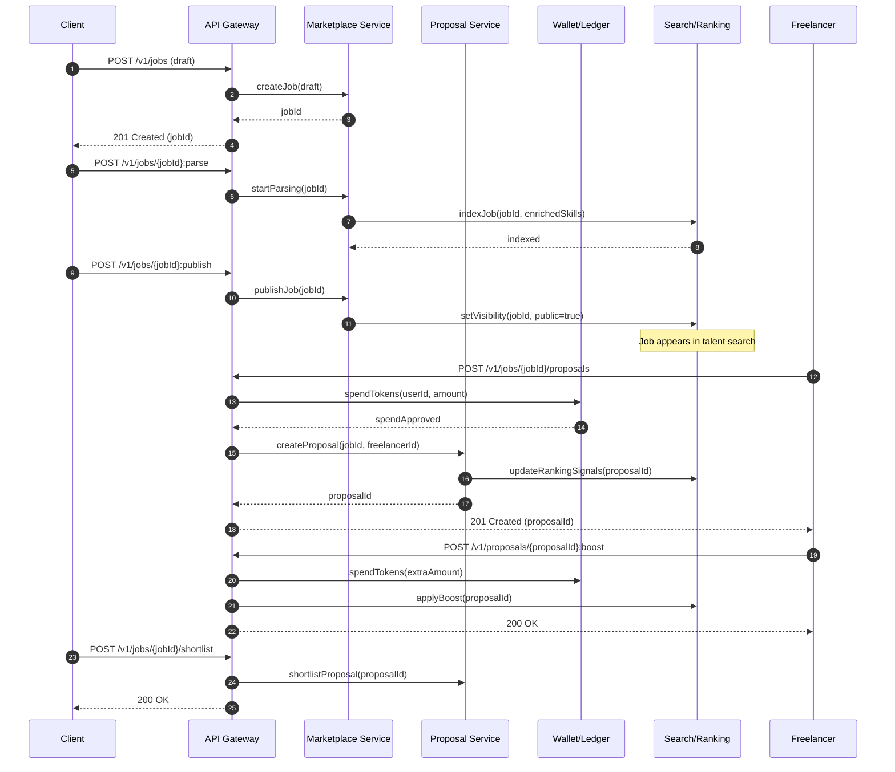
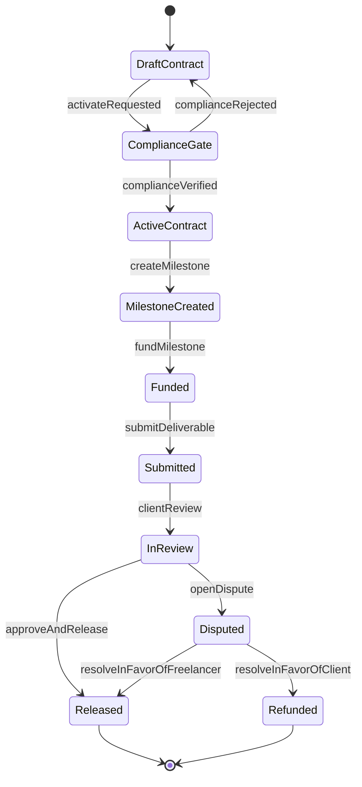

# Extending an Existing Platform to Support a Freelancer Marketplace Flow

## Executive summary

The attached Markdown describes (a) a modular view of major freelance marketplaces and their supported flows, and (b) a proposed way to implement those flows in an existing platform using a “Skills” (microservices) + “DNA” (declarative config) + “Flow Orchestrator / Master State” approach, culminating in a new “Freelancer Marketplace & Contract Management” flow (referred to as “FLOW-05”). fileciteturn0file0

A practical implementation for FLOW-05 centers on four end-to-end capabilities: (1) job posting and talent discovery, (2) proposals/bidding with optional “attention economy” mechanics (e.g., proposal spend and boosting), (3) contracting plus milestone escrow and dispute handling, and (4) enterprise-grade governance, including identity verification and worker-classification-like compliance controls. fileciteturn0file0

The file uses entity["company","Upwork","freelance marketplace"] and entity["company","Freelancer.com","freelance marketplace"] as reference models for user-visible behavior. For example:  
- “Connects” are virtual tokens used to submit proposals, and “Boosted Proposals” lets a freelancer bid extra tokens for higher placement. citeturn0search4turn7search0turn7search1  
- Hourly “work evidence” via desktop time tracking can capture periodic screenshots and activity metadata into a work diary concept. citeturn0search5turn0search1  
- Milestone escrow patterns hold funds until release by the client (or until dispute resolution completes). citeturn0search2turn7search16turn7search5  
- “Contest handover” patterns shift IP/ownership transfer into a controllable system step before prize release. citeturn0search3turn0search11turn0search15  
- Enterprise compliance services may include worker classification risk controls and process gates. citeturn1search1turn1search4  

Because the “current platform architecture” is explicitly unspecified, the report proposes a reference architecture that works for either a modular monolith or microservices, but aligns most naturally with the file’s “Skills + DNA + orchestrated flows” pattern. fileciteturn0file0

A reasonable delivery plan is a phased rollout: MVP (job posting + proposals + basic contracts + milestone escrow) → Beta (ranking, invites, disputes, reputation) → Enterprise (compliance hard-stops, auditability, external integrations). With typical assumptions (existing auth, payments integration, and messaging already present as “Skills”), an MVP is commonly on the order of **120–190 person-days**; full enterprise feature parity can extend to **260–420 person-days**, largely driven by compliance integrations, dispute workflows, risk controls, and observability hardening.

## Process interpretation and assumptions

### Process extracted from the attached Markdown

The file defines the target marketplace as a set of modules and flows. At the flow level, it explicitly calls out: job posting and discovery, bidding/proposals (including “Connects” and ranking/boosting), contract/milestone management, work evidence, disputes, and enterprise compliance/governance. fileciteturn0file0

It also proposes concrete state transitions for FLOW-05, including:
- Job Posting: `Draft → Parsing → Published` (with “skill extraction” implied). fileciteturn0file0  
- Bidding: `Open → Proposal Received → Shortlisted`. fileciteturn0file0  
- Milestone Execution: `Active → Submitted → Review → Released`. fileciteturn0file0  
- Enterprise Compliance: `KYC_Pending → Verified → Contract_Ready`. fileciteturn0file0  

### What is unspecified (and therefore assumed)

The Markdown is strong on “what flows exist” but light on “exact requirements.” The following are **unspecified** and must be treated as assumptions until confirmed:

Assumptions used in this report:
- **Architecture**: unknown (monolith vs microservices). The file strongly implies modular services (“Skills”), so this report assumes either (a) microservices with an API gateway, or (b) a modular monolith with clear bounded contexts and an internal workflow engine. fileciteturn0file0  
- **Storage**: no database or event bus specified. This report assumes a relational OLTP store (e.g., PostgreSQL) for transactional entities and a search index for discovery. PostgreSQL’s `CREATE TABLE` semantics are used for concrete DDL examples. citeturn3search2  
- **Search**: the file references Elasticsearch; this report assumes Elasticsearch or equivalent search tech for job/talent discovery. Elasticsearch is described as a distributed search engine with near-real-time indexing behavior. fileciteturn0file0turn3search0turn3search4  
- **Payments**: no processor/rails specified. This report assumes (a) a payment processor exists, and (b) you will implement an internal “ledger + escrow state machine” with external payment intents/charges handled by the processor, while keeping raw card data out of scope (to reduce PCI exposure). PCI DSS defines baseline requirements for protecting payment account data. citeturn2search13turn4search7  
- **Identity/KYC providers**: unspecified. The report assumes you may integrate a third-party identity verification vendor for KYC. The file’s “KYC hard stop” aligns with marketplace anti-fraud needs; references in the ecosystem describe KYC as identity confirmation via documentation. fileciteturn0file0turn5search6  
- **Legal/compliance scope**: jurisdictions and worker classification risk posture are unspecified. The report assumes you want “enterprise-ready” controls (audit logs, policy gates, classification checks), inspired by enterprise compliance features described in Upwork documentation. citeturn1search1  

## Target architecture, integration points, and process-to-API mapping

### Platform architecture options and recommendation

The file suggests orchestrating multiple domain services (“Skills”) using flow definitions and a master state, which is naturally compatible with an event-driven microservices architecture, but can also be implemented in a modular monolith. fileciteturn0file0

| Option | Description | Strengths | Primary risks | When to choose |
|---|---|---|---|---|
| Modular monolith | Single deployable, separate bounded-context modules; workflow engine in-process | Fastest iteration; simplest ops; strong consistency | Scaling and team parallelism constraints; risk of tight coupling | Early-stage, smaller team, minimal legacy constraints |
| Microservices by domain | Separate services: Marketplace, Proposals, Contracts, Payments/Ledger, Identity/Compliance, Search, Messaging | Independent scaling; clear ownership; fits “Skills” notion | Distributed transactions; operational complexity | If “Skills” already exist and independent scaling is required |
| Hybrid “Skills + orchestrator” | Keep existing shared services; add a Marketplace domain service + workflow/orchestrator + event bus | Aligns with the file; incremental adoption | Requires careful contract testing; can drift into “distributed monolith” | Best default if the file reflects your current direction |

Recommendation: adopt the **Hybrid “Skills + orchestrator”** default (because FLOW-05 is explicitly framed as orchestrating existing “Skills” and state-driven flows). fileciteturn0file0

### Core components and integration points

A practical decomposition for FLOW-05:

- **API Gateway / BFF**: single entry point; enforces authN/authZ; rate limiting; request/response shaping.
- **Identity & Access**: OIDC provider + authorization service; roles (client, freelancer, admin, enterprise manager). OpenID Connect defines authentication on top of OAuth 2.0. citeturn2search1turn2search0  
- **Marketplace Service**: jobs/projects, categories, visibility rules, invites.
- **Proposal Service**: proposals/bids, pricing, attachments, versioning, optional “token spend” and “boost”.
- **Search/Matching**: indexing jobs and profiles, ranking, filter facets. Elasticsearch supports near-real-time indexing/search. citeturn3search0turn3search4  
- **Contract Service**: contract creation, state transitions (offer → active → closed), milestone definitions.
- **Payments & Ledger**: escrow funding, release, refunds, fees, payout scheduling; dispute holds.
- **Dispute/Ticketing**: dispute workflow + evidence capture; maps to a “ticketing” pattern similar to the file’s “Ticketing Service.” fileciteturn0file0  
- **Work Evidence**: time entries (hourly) and deliverables (files/links); may resemble a “work diary” pattern where screenshot/activity metadata is captured for hourly protection. citeturn0search5turn0search1  
- **Compliance Service**: KYC status, enterprise policy “hard stops,” classification checks. citeturn1search1  
- **Notifications**: email/push/webhooks for events like “proposal received,” “milestone funded,” “dispute opened.”
- **Observability**: tracing/metrics/logging via OpenTelemetry (spec defines signals and semantic expectations). citeturn2search6turn2search14  

### Mapping each process step to platform components and APIs

The table below maps the FLOW-05 steps described in the Markdown to concrete platform components and an illustrative API surface.

| Process step and state (from file) | Primary components | Key API calls (illustrative) | Events emitted | Notes |
|---|---|---|---|---|
| Job draft (`Draft`) | Marketplace, Validation | `POST /v1/jobs` `PATCH /v1/jobs/{id}` | `job.drafted` | Draft autosave; validate required fields progressively |
| Parse/enrich (`Parsing`) | Enrichment (taxonomy), Search indexer | `POST /v1/jobs/{id}:parse` | `job.parsed` | File implies skill extraction; could be rules-based or AI |
| Publish (`Published`) | Marketplace, Search | `POST /v1/jobs/{id}:publish` | `job.published` | Index job for discovery; enable invites |
| Discover talent | Search/Matching, Profiles | `GET /v1/talent/search` `GET /v1/jobs/{id}/matches` | `talent.matched` | Mirrors “post → get proposals and/or search/invite” marketplace behavior. citeturn6search0turn6search9 |
| Invite candidates | Marketplace + Messaging | `POST /v1/jobs/{id}/invites` | `invite.sent` | Invitation workflows exist as a prominent enterprise/marketplace pattern. citeturn6search9turn6search7 |
| Proposal submission (`Open → Proposal Received`) | Proposal, Wallet/Ledger | `POST /v1/jobs/{id}/proposals` | `proposal.submitted` | If implementing “Connects,” spend tokens on submission similar to Upwork’s Connects model. citeturn0search4turn0search0 |
| Optional boost | Proposal, Wallet/Ledger, Ranking | `POST /v1/proposals/{id}:boost` | `proposal.boosted` | Upwork’s Boosted Proposals uses extra Connects to increase visibility. citeturn7search0turn7search1 |
| Shortlist/interview | Marketplace, Messaging | `POST /v1/jobs/{id}/shortlist` `POST /v1/interviews` | `proposal.shortlisted` | Keep decisions auditable for disputes and fairness |
| Offer/contract (`Offer → Active`) | Contract, Compliance, Payments | `POST /v1/contracts` `POST /v1/contracts/{id}:activate` | `contract.created` `contract.activated` | Enterprise “hard stops” may block activation until compliance passes. citeturn1search1turn1search0 |
| Milestone setup | Contract, Payments | `POST /v1/contracts/{id}/milestones` | `milestone.created` | Align with milestone escrow patterns. citeturn0search2 |
| Fund milestone | Payments/Ledger | `POST /v1/milestones/{id}:fund` | `milestone.funded` | Funds held until release or dispute resolution. citeturn0search2turn7search16 |
| Deliverable submission (`Submitted`) | Work Evidence, Object storage | `POST /v1/milestones/{id}/deliverables` | `deliverable.submitted` | Store as immutable evidence objects |
| Review/approve (`Review → Released`) | Contract, Payments/Ledger | `POST /v1/milestones/{id}:approve` `POST /v1/milestones/{id}:release` | `milestone.released` `payout.scheduled` | Similar to “release after approval.” citeturn0search2turn7search2 |
| Dispute | Dispute/Ticketing, Evidence, Payments hold | `POST /v1/disputes` `POST /v1/disputes/{id}/evidence` | `dispute.opened` | Freelancer dispute resolution is explicitly tied to escrow usage. citeturn7search16turn7search5 |
| Reputation update | Reputation | `POST /v1/reviews` | `review.created` | Core trust signal implied by the file’s module model. fileciteturn0file0 |
| Compliance onboarding (`KYC_Pending → Verified`) | Compliance, Identity verification vendor | `POST /v1/compliance/kyc` `GET /v1/compliance/status` | `kyc.submitted` `kyc.verified` | Enterprise compliance services also exist for worker misclassification controls. citeturn1search1turn5search4 |

### Key flow diagrams (Mermaid)

#### Job posting through proposal boost and shortlist



#### Milestone escrow lifecycle with dispute branch



## Data models, storage, and schema design

### Data storage approach

A marketplace of this type typically benefits from polyglot storage:
- **Relational OLTP** for contracts, milestones, escrow state, token/fee ledgers, and dispute records (strong consistency and auditability).
- **Search index** for job/talent discovery and ranking (near-real-time indexing can support responsive discovery UX). citeturn3search0turn3search4  
- **Object storage** for attachments, deliverables, and evidence files (immutable objects, lifecycle policies, malware scanning).
- **Append-only audit log** (can be relational + immutable log table, or separate log store).

### Required new domain entities and example JSON Schemas

Below are representative JSON Schemas (abbreviated) for key domain objects. These are intended to be used both for API validation and for documenting contracts (and can be aligned with OpenAPI 3.1, which supports JSON Schema compatibility). citeturn2search7turn2search23

#### Job

```json
{
  "$id": "https://example.com/schemas/job.json",
  "$schema": "https://json-schema.org/draft/2020-12/schema",
  "type": "object",
  "required": ["id", "clientId", "title", "status", "createdAt"],
  "properties": {
    "id": { "type": "string", "format": "uuid" },
    "clientId": { "type": "string", "format": "uuid" },
    "title": { "type": "string", "minLength": 5, "maxLength": 140 },
    "description": { "type": "string", "minLength": 20 },
    "status": { "type": "string", "enum": ["DRAFT", "PARSING", "PUBLISHED", "CLOSED"] },
    "visibility": { "type": "string", "enum": ["PRIVATE", "INVITE_ONLY", "PUBLIC"] },
    "skills": { "type": "array", "items": { "type": "string" } },
    "budget": {
      "type": "object",
      "properties": {
        "type": { "type": "string", "enum": ["HOURLY", "FIXED"] },
        "currency": { "type": "string", "minLength": 3, "maxLength": 3 },
        "min": { "type": "number", "minimum": 0 },
        "max": { "type": "number", "minimum": 0 }
      }
    },
    "createdAt": { "type": "string", "format": "date-time" }
  }
}
```

#### Proposal with optional boost

```json
{
  "$id": "https://example.com/schemas/proposal.json",
  "$schema": "https://json-schema.org/draft/2020-12/schema",
  "type": "object",
  "required": ["id", "jobId", "freelancerId", "status", "createdAt"],
  "properties": {
    "id": { "type": "string", "format": "uuid" },
    "jobId": { "type": "string", "format": "uuid" },
    "freelancerId": { "type": "string", "format": "uuid" },
    "status": { "type": "string", "enum": ["SUBMITTED", "SHORTLISTED", "REJECTED", "WITHDRAWN"] },
    "terms": {
      "type": "object",
      "properties": {
        "type": { "type": "string", "enum": ["HOURLY", "FIXED"] },
        "rate": { "type": "number", "minimum": 0 },
        "currency": { "type": "string", "minLength": 3, "maxLength": 3 }
      }
    },
    "tokenSpend": {
      "type": "object",
      "properties": {
        "submitTokens": { "type": "integer", "minimum": 0 },
        "boostTokens": { "type": "integer", "minimum": 0 }
      }
    }
  }
}
```

Design note: If you implement “Connects-like” mechanics, you want an immutable ledger of token debits/credits, because the mechanism is effectively a monetary-like instrument (even if not redeemable). Upwork describes Connects as virtual tokens for submitting proposals and supports proposal boosting by bidding extra tokens. citeturn0search4turn7search0turn7search17

#### Contract and milestone

```json
{
  "$id": "https://example.com/schemas/contract.json",
  "$schema": "https://json-schema.org/draft/2020-12/schema",
  "type": "object",
  "required": ["id", "jobId", "clientId", "freelancerId", "status"],
  "properties": {
    "id": { "type": "string", "format": "uuid" },
    "jobId": { "type": "string", "format": "uuid" },
    "clientId": { "type": "string", "format": "uuid" },
    "freelancerId": { "type": "string", "format": "uuid" },
    "status": { "type": "string", "enum": ["OFFERED", "ACTIVE", "PAUSED", "CLOSED"] },
    "billingType": { "type": "string", "enum": ["HOURLY", "MILESTONE"] }
  }
}
```

```json
{
  "$id": "https://example.com/schemas/milestone.json",
  "$schema": "https://json-schema.org/draft/2020-12/schema",
  "type": "object",
  "required": ["id", "contractId", "amount", "currency", "status"],
  "properties": {
    "id": { "type": "string", "format": "uuid" },
    "contractId": { "type": "string", "format": "uuid" },
    "amount": { "type": "number", "minimum": 0.01 },
    "currency": { "type": "string", "minLength": 3, "maxLength": 3 },
    "status": { "type": "string", "enum": ["CREATED", "FUNDED", "SUBMITTED", "IN_REVIEW", "RELEASED", "REFUNDED", "DISPUTED"] }
  }
}
```

This follows the escrow pattern described by Freelancer documentation: the client deposits funds, funds are held, and the client releases them (or dispute resolution concludes). citeturn0search2turn7search16turn7search5

### Example relational schema (PostgreSQL-style DDL)

Below is an intentionally audit-friendly schema: immutable ledgers, explicit state machines, and idempotency keys on externally-triggered payment actions. (PostgreSQL `CREATE TABLE` is used as the concrete DDL idiom.) citeturn3search2

```sql
CREATE TABLE marketplace_job (
  id UUID PRIMARY KEY,
  client_id UUID NOT NULL,
  title TEXT NOT NULL,
  description TEXT NOT NULL,
  status TEXT NOT NULL CHECK (status IN ('DRAFT','PARSING','PUBLISHED','CLOSED')),
  visibility TEXT NOT NULL CHECK (visibility IN ('PRIVATE','INVITE_ONLY','PUBLIC')),
  created_at TIMESTAMPTZ NOT NULL DEFAULT now(),
  updated_at TIMESTAMPTZ NOT NULL DEFAULT now()
);

CREATE TABLE proposal (
  id UUID PRIMARY KEY,
  job_id UUID NOT NULL REFERENCES marketplace_job(id),
  freelancer_id UUID NOT NULL,
  status TEXT NOT NULL CHECK (status IN ('SUBMITTED','SHORTLISTED','REJECTED','WITHDRAWN')),
  terms_type TEXT NOT NULL CHECK (terms_type IN ('HOURLY','FIXED')),
  rate NUMERIC(18,2) NOT NULL,
  currency CHAR(3) NOT NULL,
  submit_tokens INT NOT NULL DEFAULT 0,
  boost_tokens INT NOT NULL DEFAULT 0,
  created_at TIMESTAMPTZ NOT NULL DEFAULT now()
);

CREATE TABLE contract (
  id UUID PRIMARY KEY,
  job_id UUID NOT NULL REFERENCES marketplace_job(id),
  client_id UUID NOT NULL,
  freelancer_id UUID NOT NULL,
  status TEXT NOT NULL CHECK (status IN ('OFFERED','ACTIVE','PAUSED','CLOSED')),
  billing_type TEXT NOT NULL CHECK (billing_type IN ('HOURLY','MILESTONE')),
  created_at TIMESTAMPTZ NOT NULL DEFAULT now(),
  activated_at TIMESTAMPTZ NULL
);

CREATE TABLE milestone (
  id UUID PRIMARY KEY,
  contract_id UUID NOT NULL REFERENCES contract(id),
  title TEXT NOT NULL,
  amount NUMERIC(18,2) NOT NULL CHECK (amount > 0),
  currency CHAR(3) NOT NULL,
  status TEXT NOT NULL CHECK (status IN ('CREATED','FUNDED','SUBMITTED','IN_REVIEW','RELEASED','REFUNDED','DISPUTED')),
  due_at TIMESTAMPTZ NULL,
  created_at TIMESTAMPTZ NOT NULL DEFAULT now()
);

-- Immutable escrow ledger: every change is a row; current balance is derived.
CREATE TABLE escrow_ledger_entry (
  id UUID PRIMARY KEY,
  milestone_id UUID NOT NULL REFERENCES milestone(id),
  entry_type TEXT NOT NULL CHECK (entry_type IN ('FUND','RELEASE','REFUND','FEE','PAYOUT')),
  amount NUMERIC(18,2) NOT NULL CHECK (amount > 0),
  currency CHAR(3) NOT NULL,
  external_payment_reference TEXT NULL,
  idempotency_key TEXT NOT NULL,
  created_at TIMESTAMPTZ NOT NULL DEFAULT now(),
  UNIQUE (idempotency_key)
);

CREATE TABLE dispute (
  id UUID PRIMARY KEY,
  contract_id UUID NOT NULL REFERENCES contract(id),
  milestone_id UUID NULL REFERENCES milestone(id),
  opened_by UUID NOT NULL,
  status TEXT NOT NULL CHECK (status IN ('OPEN','EVIDENCE','IN_REVIEW','RESOLVED','CLOSED')),
  reason_code TEXT NOT NULL,
  created_at TIMESTAMPTZ NOT NULL DEFAULT now()
);

CREATE TABLE compliance_check (
  id UUID PRIMARY KEY,
  user_id UUID NOT NULL,
  check_type TEXT NOT NULL CHECK (check_type IN ('KYC','ENTERPRISE_CLASSIFICATION','NDA')),
  status TEXT NOT NULL CHECK (status IN ('PENDING','VERIFIED','REJECTED','EXPIRED')),
  provider_reference TEXT NULL,
  created_at TIMESTAMPTZ NOT NULL DEFAULT now()
);
```

## Security, compliance, performance, and reliability

### Authentication and authorization

A marketplace platform benefits from standards-based auth:
- OAuth 2.0 provides an authorization framework for limited access to HTTP services. citeturn2search0turn2search16  
- OpenID Connect provides authentication on top of OAuth 2.0 using claims about the end-user. citeturn2search1  
- JWTs are a compact token format for representing claims, commonly used in OAuth/OIDC deployments. citeturn2search2  

Recommended approach:
- Central identity provider (OIDC) issuing access tokens.
- API gateway enforcing scopes, e.g.:
  - `jobs:write`, `jobs:publish`, `proposals:write`, `contracts:write`, `milestones:fund`, `disputes:write`, `admin:*`
- Fine-grained authorization rules:
  - Only the job owner can publish/close a job.
  - Only the invited freelancer can see an invite-only job.
  - Only contract participants can view disputes/evidence.

### Security considerations and mitigations

A marketplace has elevated fraud, abuse, and data sensitivity (PII, payment flows, and potentially “work evidence” artifacts). Mitigations should be aligned with recognized security baselines such as the entity["organization","OWASP","web security nonprofit"] Top 10 and ASVS control sets. citeturn2search4turn2search19turn2search3turn2search20

Key risks and mitigations:
- **Broken access control (BOLA/IDOR)**: enforce object-level checks in the gateway + service layer; use opaque UUIDs; add authorization tests for every endpoint. citeturn2search4  
- **Token economy abuse (spam proposals, boosting manipulation)**: implement rate limits per user/job; anomaly detection; require verified accounts for high-value bidding (similar to how verified tiers can unlock higher-value projects). citeturn5search0turn0search4  
- **Escrow fraud and payout abuse**: immutable ledgers, idempotency keys, and a dispute/hold mechanism consistent with milestone escrow systems. citeturn0search2turn7search16turn7search5  
- **Work evidence privacy**: if you implement screenshot/activity evidence like a “Work Diary,” store evidence with strict retention and access controls; Upwork’s docs describe a finite screenshot retention model and that activity logs include counts rather than content typed/clicked (important privacy boundary). citeturn0search5turn0search1  
- **Uploads and deliverables**: malware scanning, content-type validation, pre-signed URLs with short TTL, and quarantining.  
- **Enterprise compliance gating**: prevent contract activation until compliance checks pass (“hard stop”); this mirrors enterprise compliance positioning where classification checks can take time and are part of governance. citeturn1search1turn1search0  

### Compliance scope

- **Payment data**: if you store, process, or transmit cardholder data, PCI DSS applies; PCI SSC describes PCI DSS as baseline technical/operational requirements designed to protect payment account data. Prefer a design where card data is handled only by a PCI-compliant processor, with your platform storing references/tokens. citeturn2search13turn4search3turn4search7  
- **Personal data and security measures**: GDPR requires appropriate technical and organizational measures for security of processing; Article 32 explicitly references encryption and risk-based controls. citeturn4search1turn4search0  
- **Enterprise governance**: enterprise compliance features may include worker classification risk controls and reporting expectations. citeturn1search1turn1search4  

### Performance and scalability

Primary hotspots:
- Discovery search and ranking (jobs/talent).
- Proposal submission bursts after publishing.
- Ledger/payment operations (must be strongly consistent and idempotent).

Tactics:
- Use Elasticsearch (or equivalent) for search and faceting; Elastic documents near-real-time indexing behavior (often within ~1 second) and distributed scaling via shards/replicas. citeturn3search0turn3search9turn3search5  
- Keep OLTP transactions small; avoid cross-domain joins in user-facing request paths by using read models/materialized views for search pages (job card, freelancer summary).  
- Enforce pagination everywhere; limit “proposal list” retrievals; precompute counts and ranking signals asynchronously.  

### Error handling, retries, and consistency

For marketplace + payments, the most important reliability rule is: **never double-charge or double-release**. Recommended patterns:
- Idempotency keys on all write endpoints that can be retried by clients or gateways (`POST :fund`, `POST :release`, proposal submit, boost).
- “Outbox pattern” for publishing events tied to DB commits (ensures eventual consistency between ledger state and downstream notifications/search updates).
- Compensating actions (saga) for multi-step flows, e.g., if external payment capture succeeds but ledger write fails, reconcile and retry safely.

### Monitoring and observability

For multi-service or hybrid architectures, the minimum viable observability stack should include:
- Distributed tracing, metrics, and logs with consistent correlation IDs; OpenTelemetry provides a standardized specification for these signals. citeturn2search6turn2search14turn2search22  
- Domain KPIs: time-to-first-bid, proposal conversion, escrow funding conversion, dispute rate, payout failure rate.
- SLOs: publish-to-search-index latency; proposal submit p95; funding p99; webhook delivery success.

## Testing strategy, deployment, migration, risks, and roadmap

### Testing plan and acceptance criteria

A marketplace workflow is fundamentally stateful; tests must validate state machines, authorization, and money movement.

Recommended layers:
- **Unit tests**: state transition guards (cannot release unfunded milestone), fee calculations, token spend rules, idempotency behavior.
- **Integration tests**: service-to-service calls (contract→payments, proposals→wallet), DB constraints, outbox publishing.
- **Contract tests**: OpenAPI-based compatibility tests for gateway ↔ services; OpenAPI defines a standard interface description for HTTP APIs. citeturn2search7turn2search15  
- **End-to-end tests**:  
  - Client publishes job → freelancer submits proposal → client shortlists → contract activates → milestone funded → deliverable submitted → milestone released → reputation created.  
  - Dispute branch: milestone funded → dispute opened → resolution results in refund or release.  
- **Security testing**: OWASP Top 10 scenario tests (IDOR, auth bypass, injection), dependency scans, secrets scanning. citeturn2search4turn2search20  
- **Load testing**: run publish/proposal spikes and search traffic; validate search index propagation targets.

Acceptance criteria (illustrative, adjust once SLAs are defined):
- No unauthorized reads/writes in object-level authorization test suite.
- Funding + release endpoints demonstrate strict idempotency under retries and timeouts.
- Search index reflects published jobs within an agreed SLO (e.g., p95 < 2 seconds) consistent with near-real-time index expectations. citeturn3search0  
- Dispute creation freezes payout actions until resolution (no release possible while `DISPUTED`).
- Audit events exist for all financial and state transitions (proposal spend, milestone fund/release, dispute open/resolve).

### Deployment plan and rollback strategy

CI/CD changes (generic, platform-agnostic):
- Add automated schema migration checks, OpenAPI diff checks, and minimal E2E smoke suite gates.
- Add security scanning gates (dependency and secret scans).
- Add “shadow traffic” or replay tests in staging for ranking/search and proposal endpoints.

Runtime rollout strategy:
- Feature flags per capability: `marketplace.jobs`, `marketplace.proposals`, `marketplace.escrow`, `marketplace.disputes`, `enterprise.compliance`.
- Canary release for services that touch money; enable for a small tenant/org first.
- If running on Kubernetes, rolling updates allow zero-downtime incremental pod replacement. citeturn3search3turn3search7  

Rollback strategy:
- Code rollback: revert service deployment, keep backward-compatible APIs.
- Data rollback: avoid destructive migrations; use expand/contract migration patterns:
  - Expand: add nullable columns/tables and dual-write if needed.
  - Migrate/backfill asynchronously.
  - Contract: drop old columns only after full cutover and observation window.

### Migration and backward compatibility

Backwards compatibility concerns depend on whether an existing “projects” domain already exists:
- If “projects” exist, model jobs, contracts, and milestones as an extension rather than a replacement; introduce a new `domain_type` or `product_line` field in existing tables.
- Version your APIs (`/v1`) and avoid breaking schema changes; use additive changes and deprecate with telemetry.

### Risk assessment and alternatives

High-impact risks:
- **Payments correctness**: the most catastrophic risk is an escrow release bug (double release, incorrect refunds). Mitigation: immutable ledger, idempotency keys, integration tests with failure injection, manual reconciliation tooling. citeturn0search2turn7search2  
- **Fraud/spam in proposals**: without friction, proposal spam overwhelms clients; tokenized “connects” is one mitigation model (as described in Upwork docs). Alternatives include strict rate limits, verified-only bidding for certain jobs, or paid subscriptions. citeturn0search4turn7search0turn5search0  
- **Privacy concerns for work evidence**: screenshot-based evidence is sensitive; mitigate by making it opt-in per contract, enforce retention and transparency, and store minimal metadata where possible. citeturn0search5turn0search1  
- **Enterprise compliance scope creep**: worker classification, tax forms, and regional labor rules can explode scope; keep the compliance module pluggable and policy-driven, similar to “hard stop” gates. citeturn1search1turn1search0  

Alternatives worth considering (choose based on product goals):
- “Escrow-only MVP” (milestone payments first) vs adding hourly time-tracking evidence later; milestone systems are well-defined and simpler than screenshot diary tooling. citeturn0search2turn0search5  
- Implement “boosting” later: ranking and boost auctions create fairness, support, and abuse-prevention complexities; Upwork describes boosted proposals as bidding extra Connects for visibility, which implies auction mechanics and refunds. citeturn7search0turn7search1  

### Phased implementation roadmap with estimates

Assumptions for estimates:
- Team has existing “Skills” for Auth, Payments integration, Chat/Notifications, and Observability foundations (as implied by the file). fileciteturn0file0  
- 1 person-day = 8 productive engineering hours.  
- Estimates include typical engineering activities: design, implementation, code review, tests, docs; exclude major legal review and vendor procurement lead time (not provided).

| Phase | Milestone scope | Tasks (summary) | Est. person-days | Dependencies |
|---|---|---:|---:|---|
| Foundation | Align architecture and contracts | Domain model finalization; OpenAPI baseline; auth scopes; event taxonomy; idempotency conventions | 20–35 | Existing identity model, gateway conventions |
| MVP marketplace | Job posting + publish + search | Jobs CRUD, parsing/enrichment stub, publish workflow, indexing, talent search API | 35–60 | Search infra (Elasticsearch or equivalent) citeturn3search4 |
| MVP proposals | Proposal submission | Proposals CRUD, attachment handling, basic ranking ordering, notifications | 25–45 | Jobs publish flow |
| MVP contracts + escrow | Milestone contracts | Contract create/activate, milestone create/fund/release, escrow ledger, payout scheduling, basic dispute hold | 45–70 | Payments rails; PCI scope decision citeturn2search13 |
| Beta trust layer | Disputes + reputation | Dispute workflow + evidence model; review/ratings; audit log views | 30–55 | Escrow ledger stable |
| Beta growth mechanics | Token spend + boosting | Token wallet/ledger, spend rules, boost auctions, refund logic, anti-abuse controls | 35–70 | Proposal pipeline stable citeturn7search0turn0search4 |
| Enterprise | Compliance hard stops | KYC integration, enterprise policies, classification check workflow, reporting exports | 45–85 | Vendor integration; policy framework citeturn1search1turn5search4 |
| Hardening | SLOs, perf, security | Load tests, chaos/failure injection for payments, OWASP regression suite, observability dashboards | 25–45 | All core flows implemented citeturn2search4turn2search6 |

Total (indicative):
- **MVP (through escrow)**: ~125–210 person-days  
- **Beta (disputes + reputation + boosting)**: +65–180 person-days  
- **Enterprise hardening**: +45–85 person-days  

These totals are intentionally ranges because the file does not specify throughput targets, jurisdictional compliance coverage, or whether hourly time tracking evidence (screenshots/activity collection) is in scope for v1; implementing work-diary-grade evidence adds meaningful engineering, privacy, and support burden, as indicated by the complexity described in time tracking/work diary documentation. citeturn0search5turn0search1turn7search2