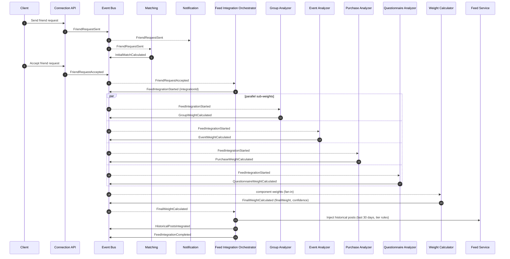
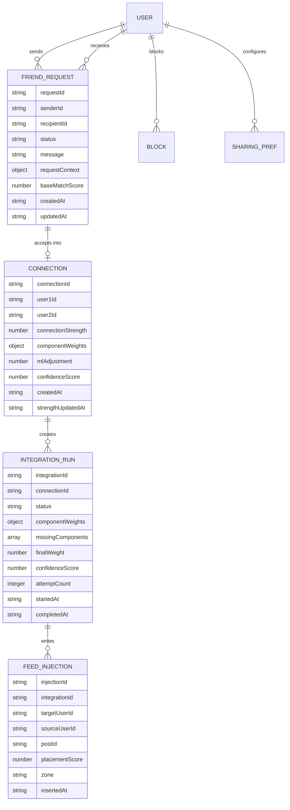

# Extending the Engine to Support FLOW‑07 Flow Creation

## Executive summary

The available project sources include a FLOW‑07 specification (“Friend Request & Feed Integration”) plus an internal deep‑research memo derived from it. The FLOW‑07 spec describes an end-to-end “friend request → acceptance → multi-factor scoring → historical feed merging → ongoing strength evolution” lifecycle, implemented via a multi-service event chain and a weighted scoring formula with an ML adjustment. fileciteturn0file1L10-L22 fileciteturn0file1L47-L95

Operationally, FLOW‑07 is not a single synchronous endpoint; it is a distributed workflow with parallel sub-computations, strict latency expectations (<10s from acceptance to feed integration completion), explicit degraded-mode behaviors (defaults + async retries), and sensitive privacy/abuse constraints (graph sensitivity, purchase/questionnaire non-disclosure, blocking behavior, spam rate limiting). fileciteturn0file1L118-L134 fileciteturn0file1L196-L208

To support “flow creation” for FLOW‑07-class documents (and likely other 07-* flows), the engine needs first-class primitives for:

- **Structured flow definitions** (events, states, transitions, timeouts, parallel steps, retries, and SLAs) sourced from the spec’s structured blocks (the YAML “persona” definition is already close to a DSL). fileciteturn0file1L30-L95  
- **Durable workflow execution** (correlation IDs, idempotency, replayable events, and orchestration state) to safely handle partial failures and retries. fileciteturn0file1L196-L208 fileciteturn0file0L7-L14  
- **Contract governance** for both HTTP APIs and internal events (OpenAPI + JSON Schema; consistent error format; schema evolution/versioning). citeturn0search1turn0search2turn0search3  
- **Security and privacy controls** embedded into flow definitions (object-level authorization, rate limiting semantics, and data minimization rules). fileciteturn0file1L118-L125 citeturn2search3turn4search1  

The remainder of this report maps FLOW‑07 requirements into concrete engine/platform extensions: persistence changes, event and API contracts, migration/backward compatibility, diagrams, implementation tasks with estimates, and rollout/monitoring.

## Source review and requirements synthesis

Only two 07-* artifacts were available in the project sources for this analysis: the FLOW‑07 spec and an internal memo derived from it. Findings below are therefore grounded in FLOW‑07’s explicit requirements rather than a complete cross-flow synthesis. fileciteturn0file1L1-L6 fileciteturn0file0L1-L14

### Core functional requirements

FLOW‑07’s feature scope includes:

**Friend request lifecycle and connection creation**
- A single documented entry point is `POST /relations/connect`, with a lifecycle that includes sending, accepting, mutual-pending auto-accept, withdrawal, and blocked-user handling. fileciteturn0file1L30-L34 fileciteturn0file1L196-L208  
- Acceptance creates a bidirectional connection in a graph store (the spec calls out Neo4j). fileciteturn0file1L255-L266  

**Event-driven orchestration**
- The spec defines an event chain spanning request, acceptance, parallel weight computation, final scoring, and feed integration completion (e.g., `FriendRequestSent`, `FriendRequestAccepted`, `FeedIntegrationStarted`, `FinalWeightCalculated`, `HistoricalPostsIntegrated`, `FeedIntegrationCompleted`). fileciteturn0file1L47-L65 fileciteturn0file1L237-L251  

**Multi-factor weight model**
- Weight formula components are explicitly specified: base match (0.25), groups (0.20), events (0.20), purchases (0.15), questionnaires (0.20), plus an ML adjustment bounded to [-0.2, +0.2]. fileciteturn0file1L67-L82 fileciteturn0file1L214-L218  

**Historical feed integration rules**
- Historical post merge window is the “last 30 days”. fileciteturn0file1L83-L90  
- Tiered integration rules are explicit:
  - strong connection (>0.8): 20 posts in top 20% of feed, max 3 consecutive  
  - medium (0.5–0.8): 10 posts in middle 40%  
  - weak (<0.5): 5 posts in bottom 40%, with “high engagement only” constraint fileciteturn0file1L83-L90 fileciteturn0file1L219-L223  
- Ongoing rules: rebalance every 6 hours; max friend content 30%; new friend posts boosted for 24 hours. fileciteturn0file1L92-L95 fileciteturn0file1L232-L235  

### Reliability requirements and failure modes

FLOW‑07 requires the engine to support degraded paths without breaking the core connection state:

- If a weight component is missing due to timeout, the workflow uses a default weight (0.5) and performs async retries for missing components. fileciteturn0file1L196-L203  
- If feed integration fails or feed service is down/under maintenance, the connection still exists but feed integration is delayed or retried via a queue/manual recovery. fileciteturn0file1L134-L134 fileciteturn0file1L206-L208  
- Operational targets/alerts include acceptance→integration completion <10s, weight calculation >15s alert, and Neo4j write latency >500ms alert. fileciteturn0file1L130-L134  

These behaviors imply that “flow execution” must be resilient to partial completion and safe to replay/retry—properties typically achieved with durable events, idempotent consumers, and explicit orchestration state. fileciteturn0file0L7-L14 citeturn2search0turn2search1

### Security/permissions and privacy constraints

FLOW‑07 introduces sensitivity and abuse risk:

- Connection graph sensitivity is highlighted; purchase overlap and questionnaire similarity must not disclose raw data; blocking must remove connection data and feed integration. fileciteturn0file1L118-L123  
- Users can set feed integration level (Full/Selective/Minimal) and choose post types to share. fileciteturn0file1L122-L123  
- Attack surface includes friend request spam with an explicit example rate limit (20 requests/day), bot-network manipulation, and “weight gaming” (rapid group joins). fileciteturn0file1L124-L125  
- Blocked-user behavior: do not reveal the block; return a generic failure (“Request could not be sent”). fileciteturn0file1L206-L207  

From an API-security standpoint, new endpoints that accept object IDs require strong object-level authorization to avoid ID manipulation attacks (a leading risk category in the OWASP API Top 10). citeturn2search3turn2search7

## Current engine vs required capability gap

Because the “project basic prompt” and current engine design docs were not available in the sources provided here, “current capability” is presented as a conservative baseline: an engine that can define “flows” as sequences of service calls/events but without explicit durable orchestration, schema governance, or embedded security policy. The “required” column is grounded in FLOW‑07’s explicit needs. fileciteturn0file1L47-L95 fileciteturn0file1L196-L208

| Capability area | Current engine baseline (assumed) | Required by FLOW‑07 | Required extensions |
|---|---|---|---|
| Flow definition format | Ad-hoc docs/config | A structured, machine-validated flow definition including event chain, SLAs, and parallel steps fileciteturn0file1L30-L95 | Flow DSL + JSON Schema validation; versioning & publishing model citeturn0search2turn0search6 |
| Workflow orchestration | Best-effort async, minimal run state | Correlated multi-step orchestration with parallel sub-steps, deadlines, degraded defaults, retries fileciteturn0file1L196-L203 | Orchestration state store + “integration run” entity; deadline timers; retry scheduler |
| Event reliability | Possibly pub/sub semantics | Workflow depends on multiple services consuming/publishing events; failures must not lose state fileciteturn0file1L47-L65 | Durable messaging + transactional outbox/inbox pattern citeturn2search0turn2search1 |
| Idempotency | Partial | Accept/retry paths and feed insertion must not duplicate side effects | Idempotency keys for HTTP writes; consumer dedupe (event id / integrationId) citeturn2search2turn2search10 |
| API contract governance | Mixed | Multiple new endpoints + consistent error contracts + backwards compatibility for `/relations/connect` fileciteturn0file1L30-L34 | OpenAPI 3.1 contracts; standardized Problem Details errors citeturn0search1turn0search3 |
| Event contracts | Implicit | Explicit event types + payload fields (integrationId, weights, metrics) fileciteturn0file1L237-L251 | CloudEvents envelope + JSON Schemas + schema evolution policies citeturn0search0turn0search4turn0search2 |
| Feed integration semantics | Basic feed update | Last-30-days backfill into both feeds, tiered zones, max-consecutive, rebalancing (6h), 30% cap fileciteturn0file1L83-L95 fileciteturn0file1L232-L235 | Feed write API supporting batch inserts with placement constraints; rebalancer job |
| Security & privacy | Endpoint auth only | Block semantics, non-disclosure of raw purchase/questionnaire data, per-user sharing prefs fileciteturn0file1L118-L123 | Object-level authorization, data minimization rules, preference enforcement; auditability citeturn2search3turn4search1 |
| Observability | Service-level logs | Flow-level alerts: <10s completion, weight calc >15s, Neo4j write >500ms fileciteturn0file1L130-L134 | End-to-end tracing & correlated metrics per integrationId citeturn1search3turn5search1 |

## Target design for engine and platform extensions

FLOW‑07’s spec already outlines participating services and data stores (connection lifecycle over Neo4j/PostgreSQL; matching; feed integration orchestration; analyzers; weight calc; feed service backed by Redis). fileciteturn0file1L255-L266

The design below organizes the required extensions into engine-level primitives (to “create flows”) and flow-specific implementations (FLOW‑07 runtime).

### Engine-level primitives to enable 07-* flow creation

**Flow registry and versioning**
- Store a canonical `FlowDefinition` artifact (derived from the spec’s YAML plus additional structured fields) with: `flowId`, `version`, `entryPoints`, `events`, `tasks`, `states`, `transitions`, `timeouts`, `retries`, `permissions`, and `observabilitySLOs`. fileciteturn0file1L30-L95  
- Validate FlowDefinition with JSON Schema Draft 2020‑12 (the current “latest meta-schema” is 2020‑12). citeturn0search6turn0search2  

**Event model standardization**
- Adopt entity["organization","CloudEvents","event specification"] envelopes for internal events to normalize attributes (id, source, type, time, subject, datacontenttype), make correlation consistent, and simplify transport interop. citeturn0search4turn0search0  

**Durable orchestration state**
- Introduce a durable “run” persistence model (e.g., `flow_run`, `step_run` tables or documents) so the engine can:
  - wait for multiple events (fan-in) up to a deadline,
  - apply defaulting rules,
  - retry individual steps safely,
  - and expose “run history” for debugging and audits. fileciteturn0file1L196-L208  

**Transactional event publication**
- Use a transactional outbox to avoid inconsistency between DB state updates and outbound events (update entity + write outbox record in one DB transaction; relay to broker asynchronously). citeturn2search0turn2search1  

**Idempotent execution and deduplication**
- Enforce an idempotency contract for all side-effecting HTTP endpoints (create request, accept, feed injection), using an idempotency key header and server-side key storage to ensure safe retries (a widely used approach described in Stripe’s API documentation). entity["company","Stripe","payments company"] citeturn2search2  
- Enforce consumer dedupe for events by event id and/or (`integrationId`, `eventType`). citeturn0search0turn0search4  

**Contract-first APIs and errors**
- Use entity["organization","OpenAPI Initiative","openapi specification group"] OpenAPI 3.1+ for all HTTP contracts, which is designed to align with JSON Schema 2020‑12 dialect. citeturn0search1turn0search5turn0search9  
- Standardize errors using RFC 9457 Problem Details (`application/problem+json`) so clients and services share a consistent error schema. citeturn0search3  

### FLOW‑07 runtime orchestration design

FLOW‑07 can be implemented as an orchestrated saga/workflow run keyed by `integrationId` (explicit in the event chain). fileciteturn0file1L237-L251



The mermaid sequence corresponds to FLOW‑07’s described event chain and service responsibilities. fileciteturn0file1L47-L65 fileciteturn0file1L255-L266

## Contracts and schemas

This section provides concrete (but minimal) schemas and API contract snippets to operationalize FLOW‑07 and to serve as templates for other 07-* flows.

### Domain entities and relationships

The flow implies at least these entities: FriendRequest, Connection (graph edge), FeedIntegrationRun, FeedItemInjection, Block, and UserSharingPreferences. fileciteturn0file1L118-L123 fileciteturn0file1L196-L208



This ER model aligns with the spec’s need to track end-to-end orchestration and the fact that connections are stored in a graph and used to influence feed behavior over time. fileciteturn0file1L255-L266

Additionally, Neo4j relationships are explicitly modeled as first-class constructs that can hold properties; the Cypher `SET` clause is used to set/update node or relationship properties, enabling a practical representation of `connectionStrength` on the connection edge. entity["company","Neo4j","graph database vendor"] citeturn1search18turn1search2

### JSON Schema examples

The engine should validate both HTTP payloads and event payloads. JSON Schema Draft 2020‑12 is the current “latest meta-schema” and a recommended base dialect for modern schema validation. entity["organization","JSON Schema","schema specification"] citeturn0search6turn0search2

#### FriendRequest resource schema

```json
{
  "$schema": "https://json-schema.org/draft/2020-12/schema",
  "$id": "https://example.internal/schemas/friendRequest.json",
  "title": "FriendRequest",
  "type": "object",
  "additionalProperties": false,
  "required": ["requestId", "senderId", "recipientId", "status", "createdAt"],
  "properties": {
    "requestId": { "type": "string", "format": "uuid" },
    "senderId": { "type": "string", "format": "uuid" },
    "recipientId": { "type": "string", "format": "uuid" },
    "status": {
      "type": "string",
      "enum": ["PENDING", "ACCEPTED", "REJECTED", "WITHDRAWN"]
    },
    "message": { "type": "string", "maxLength": 500 },
    "requestContext": { "type": "object" },
    "baseMatchScore": { "type": "number", "minimum": 0, "maximum": 1 },
    "createdAt": { "type": "string", "format": "date-time" },
    "updatedAt": { "type": "string", "format": "date-time" },
    "actedAt": { "type": "string", "format": "date-time" }
  }
}
```

This schema captures the friend request lifecycle implied by FLOW‑07’s request and acceptance phases. fileciteturn0file1L47-L55 fileciteturn0file1L196-L201

#### CloudEvents-wrapped FinalWeightCalculated schema

To keep event interoperability consistent, wrap domain events in CloudEvents and validate the inner `data` payload with an event-specific schema. CloudEvents defines a common set of metadata attributes on events used across systems. citeturn0search4turn0search0

```json
{
  "$schema": "https://json-schema.org/draft/2020-12/schema",
  "$id": "https://example.internal/schemas/events/finalWeightCalculated.cloudevent.json",
  "title": "CloudEvent<FinalWeightCalculated>",
  "type": "object",
  "additionalProperties": true,
  "required": ["specversion", "id", "source", "type", "time", "datacontenttype", "data"],
  "properties": {
    "specversion": { "type": "string", "const": "1.0" },
    "id": { "type": "string", "minLength": 1 },
    "source": { "type": "string", "minLength": 1 },
    "type": { "type": "string", "const": "com.example.flow07.FinalWeightCalculated.v1" },
    "subject": { "type": "string" },
    "time": { "type": "string", "format": "date-time" },
    "datacontenttype": { "type": "string", "const": "application/json" },
    "data": {
      "type": "object",
      "additionalProperties": false,
      "required": ["integrationId", "finalWeight", "componentWeights", "mlAdjustment", "confidenceScore"],
      "properties": {
        "integrationId": { "type": "string", "format": "uuid" },
        "finalWeight": { "type": "number", "minimum": 0, "maximum": 1 },
        "componentWeights": {
          "type": "object",
          "additionalProperties": false,
          "required": ["baseMatch", "groups", "events", "purchases", "questionnaires"],
          "properties": {
            "baseMatch": { "type": "number", "minimum": 0, "maximum": 1 },
            "groups": { "type": "number", "minimum": 0, "maximum": 1 },
            "events": { "type": "number", "minimum": 0, "maximum": 1 },
            "purchases": { "type": "number", "minimum": 0, "maximum": 1 },
            "questionnaires": { "type": "number", "minimum": 0, "maximum": 1 }
          }
        },
        "mlAdjustment": { "type": "number", "minimum": -0.2, "maximum": 0.2 },
        "confidenceScore": { "type": "number", "minimum": 0, "maximum": 1 }
      }
    }
  }
}
```

This schema directly tracks FLOW‑07’s specified weights and ML adjustment bounds. fileciteturn0file1L67-L82 fileciteturn0file1L214-L218

### OpenAPI contract examples

OpenAPI 3.1.1 is a current spec version and is explicitly intended as a schema for OpenAPI documents; OpenAPI 3.1 aligns its Schema Object with JSON Schema 2020‑12. citeturn0search1turn0search5turn0search9

Below is a minimal OpenAPI snippet that:
- preserves `/relations/connect` for backward compatibility (as referenced in FLOW‑07), and  
- introduces explicit friend request endpoints for clarity and permissioning. fileciteturn0file1L30-L34

```yaml
openapi: 3.1.1
info:
  title: Relations API
  version: 1.0.0
paths:
  /relations/connect:
    post:
      summary: Send a friend request (legacy entry point)
      operationId: relationsConnect
      parameters:
        - name: Idempotency-Key
          in: header
          required: false
          schema: { type: string, maxLength: 128 }
      requestBody:
        required: true
        content:
          application/json:
            schema:
              $ref: "#/components/schemas/ConnectRequest"
      responses:
        "202":
          description: Request accepted for processing
          content:
            application/json:
              schema:
                $ref: "#/components/schemas/FriendRequest"
        "400":
          $ref: "#/components/responses/Problem"
        "401":
          $ref: "#/components/responses/Problem"
        "403":
          $ref: "#/components/responses/Problem"
        "429":
          $ref: "#/components/responses/Problem"

  /friend-requests/{requestId}/accept:
    post:
      summary: Accept a friend request
      operationId: acceptFriendRequest
      parameters:
        - name: requestId
          in: path
          required: true
          schema: { type: string, format: uuid }
        - name: Idempotency-Key
          in: header
          required: false
          schema: { type: string, maxLength: 128 }
      responses:
        "202":
          description: Acceptance recorded; feed integration will run asynchronously
          content:
            application/json:
              schema:
                $ref: "#/components/schemas/ConnectionAcceptanceResult"
        "401":
          $ref: "#/components/responses/Problem"
        "403":
          $ref: "#/components/responses/Problem"
        "404":
          $ref: "#/components/responses/Problem"
        "409":
          $ref: "#/components/responses/Problem"
        "429":
          $ref: "#/components/responses/Problem"

components:
  schemas:
    ConnectRequest:
      type: object
      additionalProperties: false
      required: [recipientId]
      properties:
        recipientId: { type: string, format: uuid }
        message: { type: string, maxLength: 500 }
        requestContext: { type: object }

    FriendRequest:
      type: object
      additionalProperties: true
      required: [requestId, senderId, recipientId, status, createdAt]
      properties:
        requestId: { type: string, format: uuid }
        senderId: { type: string, format: uuid }
        recipientId: { type: string, format: uuid }
        status: { type: string }
        createdAt: { type: string, format: date-time }

    ConnectionAcceptanceResult:
      type: object
      additionalProperties: false
      required: [connectionId, integrationId, status]
      properties:
        connectionId: { type: string, format: uuid }
        integrationId: { type: string, format: uuid }
        status: { type: string, enum: [STARTED, DEGRADED, COMPLETED] }

    ProblemDetails:
      type: object
      additionalProperties: true
      required: [type, title, status]
      properties:
        type: { type: string }
        title: { type: string }
        status: { type: integer }
        detail: { type: string }
        instance: { type: string }

  responses:
    Problem:
      description: Error response
      content:
        application/problem+json:
          schema:
            $ref: "#/components/schemas/ProblemDetails"
```

Design notes:
- The use of `application/problem+json` aligns with RFC 9457 Problem Details. citeturn0search3  
- The `Idempotency-Key` concept is a common approach for safe retries of create/update operations. citeturn2search2  
- Rate limiting semantics should use HTTP 429 “Too Many Requests” and may include `Retry-After` as defined in RFC 6585. citeturn3search4  

## Migration and backward compatibility

### Data migration steps

FLOW‑07 implies changes across relational storage, graph storage, and feed storage. fileciteturn0file1L255-L266

A pragmatic migration plan:

1. **Add friend request persistence**
   - Create `friend_requests` table (or collection) for durable lifecycle tracking and abuse analytics. fileciteturn0file1L47-L55  
   - Store minimal fields necessary to fulfill the flow, and avoid persisting raw sensitive inputs beyond what product requires (consistent with the doc’s privacy guidance). fileciteturn0file1L118-L123 citeturn4search1  

2. **Add connection properties to the graph**
   - Add relationship properties: `connectionStrength`, `componentWeights` (or references), and timestamps. The Neo4j model supports relationship properties, and Cypher `SET` can update them. citeturn1search18turn1search2  

3. **Add orchestration state**
   - Create `integration_runs` persistence (recommended durable store, even if Redis is used as a performance cache), to support retries, degraded mode, and auditability. fileciteturn0file1L196-L208  

4. **Add transactional outbox (and optional inbox)**
   - Implement an outbox table per producing service (at least Connection Service and Feed Integration Orchestrator) to guarantee event emission consistency with state transitions. citeturn2search0turn2search1  

5. **Feed injection tagging**
   - Ensure injected feed items carry metadata tying them to `integrationId` and `connectionId`, enabling: dedupe, rollback cleanup, rebalancing, and block removal. fileciteturn0file1L118-L123 fileciteturn0file1L232-L235  

### Backward compatibility strategies

**Retain legacy endpoint**
- Keep `POST /relations/connect` operational since it is the documented entry point; implement it as a thin shim over the explicit friend request API and event publication. fileciteturn0file1L30-L34  

**Event versioning**
- Version events in the `type` attribute (e.g., `...FinalWeightCalculated.v1`) and treat payload changes as:
  - additive changes: backwards compatible  
  - breaking changes: new event type/version + dual publish during migration citeturn0search0turn0search4  

**Consumer tolerance**
- Require consumers to ignore unknown fields (additive evolution) and validate only against the schema version they declare. OpenAPI 3.1 and JSON Schema governance helps formalize this discipline. citeturn0search1turn0search6  

## Implementation plan, tests, rollout, and monitoring

### Prioritized task list with effort estimates

Estimates assume one experienced engineer ~6 productive hours/day, include code + review but exclude prolonged cross-team coordination.

| Priority | Task | Scope | Estimate |
|---|---|---|---|
| P0 | Flow definition ingestion and validation | Define `FlowDefinition` model; JSON Schema validation; versioning & publishing | M (40–80h) citeturn0search2turn0search6 |
| P0 | Friend request API + persistence | Implement send/withdraw/accept endpoints; friend request store; object-level auth checks | L–M (32–72h) fileciteturn0file1L47-L55 citeturn2search3 |
| P0 | Outbox + event publishing | Outbox table + relay; emit `FriendRequestSent`/`Accepted` reliably | M (60–100h) citeturn2search0turn2search1 |
| P0 | Event contracts + schemas | CloudEvents envelope standard; JSON Schemas for core events; schema registry practices | M (40–80h) citeturn0search4turn0search2 |
| P1 | Feed integration orchestrator state machine | Persist `integration_run`; fan-out/in; 10s deadline; default 0.5; retry scheduler | M–L (80–160h) fileciteturn0file1L196-L203 |
| P1 | Analyzer integrations (group/event/purchase/questionnaire) | Parallel calls/events; time budgets; response normalization | M (60–120h) fileciteturn0file1L56-L60 |
| P1 | Weight calculation service | Implement weighted sum + ML adjustment bounds; emit `FinalWeightCalculated` | M (60–120h) fileciteturn0file1L67-L82 |
| P1 | Feed injection API and logic | Implement tier rules (zones, max consecutive, counts) + tagging for rollback | L (120–240h) fileciteturn0file1L83-L90 |
| P2 | Rebalancer job | 6h rebalance; 30% cap; low-performer removal; 24h boost window | M–L (80–160h) fileciteturn0file1L92-L95 |
| P2 | Privacy controls & block propagation | Enforce sharing prefs; block triggers deletion/unmerge; no block disclosure | M (60–120h) fileciteturn0file1L118-L123 |
| P2 | Abuse controls | 20/day request cap; anomaly detection hooks; bot mitigation pipeline | S–M (24–80h) fileciteturn0file1L124-L125 citeturn3search4 |
| P3 | Observability & SLO dashboards | End-to-end traces by integrationId; alerts for >15s weight calc and >500ms graph writes | M (40–80h) fileciteturn0file1L130-L134 |
| P3 | Admin tools & manual recovery | Replay integration for a connection; clear injected posts; inspect run state | M (60–100h) fileciteturn0file1L134-L134 |

Notes on key building blocks referenced above:
- The transactional outbox pattern is a standard solution for reliable event publication without distributed transactions. citeturn2search0turn2search1  
- Idempotency keys enable safe retries of write requests in the presence of network errors and timeouts. citeturn2search2  

### Test cases and validation criteria

A FLOW‑07 implementation should be accepted only if it meets both correctness and reliability constraints from the spec.

**Functional correctness**
- **Happy path**: send → accept → `FeedIntegrationCompleted`, with event emissions in the correct order and consistent `integrationId` correlation. fileciteturn0file1L47-L65  
- **Tier enforcement**:
  - `finalWeight > 0.8` injects 20 posts per user into “top 20%” with max 3 consecutive. fileciteturn0file1L83-L90  
  - `0.5 ≤ finalWeight ≤ 0.8` injects 10 posts to “middle 40%”. fileciteturn0file1L83-L90  
  - `< 0.5` injects 5 posts to “bottom 40%”, constrained to high-engagement posts. fileciteturn0file1L83-L90  
- **Time window**: only posts from the last 30 days are eligible for historical integration. fileciteturn0file1L83-L90  
- **Formula correctness**: weighted sum matches specified coefficients and ML adjustment bounds. fileciteturn0file1L67-L82  

**Reliability and failure handling**
- **Timeout defaulting**: if any sub-weight doesn’t arrive within the max wait window, default to 0.5 and complete the run as degraded, then retry missing component asynchronously. fileciteturn0file1L196-L203  
- **Feed service downtime**: acceptance should still establish the connection; integration is queued and completed after recovery. fileciteturn0file1L206-L208  
- **Idempotency**: repeating accept/inject steps does not duplicate:
  - connections in the graph,
  - integration runs,
  - injected feed items. citeturn2search2turn0search0  

**Security and privacy**
- **Blocked user behavior**: request fails generically without revealing that a block exists. fileciteturn0file1L206-L207  
- **Object-level authorization**: only sender/recipient can act on a request or view/act on the connection; validate this because broken object-level authorization is a top API risk. citeturn2search3turn2search7  
- **No raw disclosure**: ensure purchase overlap and questionnaire similarity are represented only as aggregate weights, consistent with the spec’s privacy statement and general data minimization principles. fileciteturn0file1L118-L123 citeturn4search1  

**Performance/SLO validation**
- Acceptance → feed integration completion p95 and p99 meet the <10s target under representative load (including 40 feed writes per connection in strong tier cases). fileciteturn0file1L130-L130  

### Rollout and monitoring plan

**Rollout**
- Use feature flags to decouple “connection creation” from “feed merging” so that, as in the spec’s failure mode, the system can degrade to “connection established, feed merge delayed.” fileciteturn0file1L206-L208  
- If deployed on Kubernetes, progressive delivery via entity["organization","Argo Rollouts","kubernetes progressive delivery"] supports canary strategy (release to a small percentage of traffic first). citeturn5search0turn5search3  
- Ensure rollback capability is explicit; Kubernetes supports `kubectl rollout undo` to roll back to prior versions. entity["organization","Kubernetes","container orchestration platform"] citeturn4search3  

**Monitoring and alerting**
- Instrument every event and HTTP call with trace context propagation; OpenTelemetry notes that context propagation correlates traces/metrics/logs across distributed boundaries, and W3C Trace Context standardizes headers like `traceparent`. entity["organization","OpenTelemetry","observability standard"] entity["organization","W3C","web standards body"] citeturn1search3turn5search1turn5search2  
- Core alerts should match FLOW‑07’s explicit guidance:
  - integration duration >10s (SLO breach),  
  - weight calculation >15s,  
  - feed integration failure rate spike,  
  - graph write latency >500ms. fileciteturn0file1L130-L134  

**Data-plane monitoring for feed implementation**
- If feed storage uses sorted-set timelines, Redis sorted sets are ordered collections of unique members by score and support ranked retrieval—useful for feed ordering and injection placement. entity["company","Redis","in-memory data store"] citeturn1search0turn1search4  
- Decide whether the feed store is cache-like or durability-requiring; Redis persistence options include RDB snapshots and AOF logging. citeturn1search1turn1search5  

**Compliance-oriented minimization**
- For privacy-sensitive relationship graphs and inferred similarity, minimize stored personal data to what is necessary; ICO guidance on data minimisation emphasizes holding only the minimum needed for the purpose. entity["organization","Information Commissioner's Office","uk data protection authority"] citeturn4search1  

This implementation plan aligns the engine’s “flow creation” capability with FLOW‑07’s explicit requirements: a structured, versioned flow spec; durable events and orchestration; contract-first APIs; and measurable SLOs with clear failure behavior. fileciteturn0file1L47-L95 fileciteturn0file1L196-L208