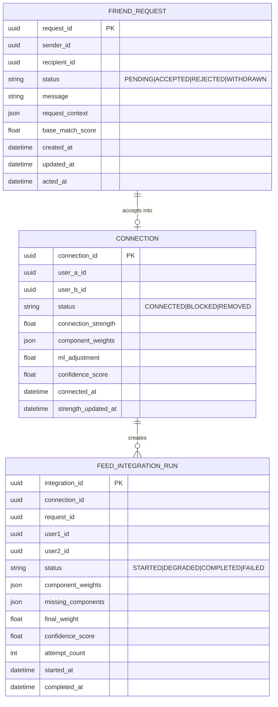
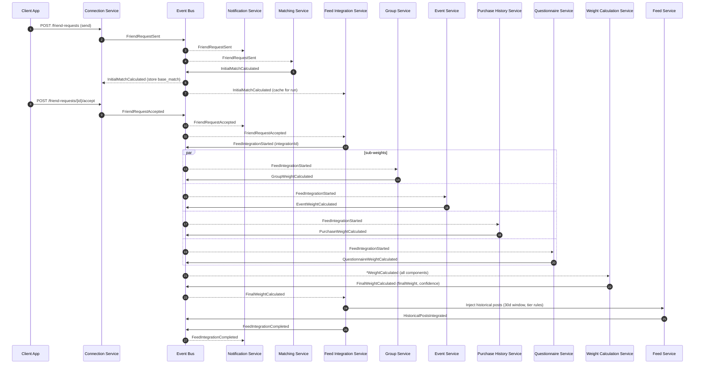
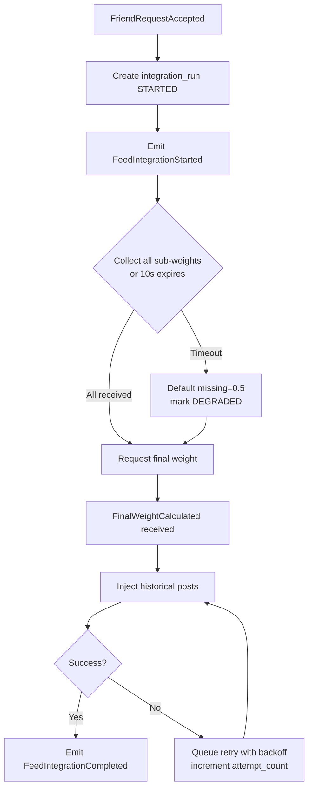

# Extending the Platform with FLOW-07 Friend Request and Feed Integration

## Executive summary

The attached FLOW-07 specification defines a friend-request lifecycle that does **more than create a social graph edge**: on acceptance it computes a **multi-factor integration weight** (base match + groups + events + purchases + questionnaires, plus an ML adjustment) and uses that weight to **blend historic posts (last 30 days) into both users’ feeds** with tiered rules and ongoing rebalancing. fileciteturn0file0L1-L22 fileciteturn0file0L210-L236

A robust implementation is best treated as a **distributed workflow** (a saga-like process) triggered by acceptance and executed with **durable events, correlation IDs, idempotent consumers, and a retryable orchestration state machine**. This aligns with the spec’s event chain (FriendRequestAccepted → FeedIntegrationStarted → parallel sub-weights → FinalWeightCalculated → HistoricalPostsIntegrated → FeedIntegrationCompleted). fileciteturn0file0L47-L66 fileciteturn0file0L144-L168

Recommended design (high level):

- **Event-driven orchestration with durability**: Keep a dedicated **Feed Integration Service** as the orchestrator, but use a **durable message broker / queue topic** (not ephemeral pub/sub alone) and a **transactional outbox** to eliminate dual-write gaps between DB writes and emitted events. citeturn2search0turn2search4  
- **Explicit data minimization**: Persist only **aggregate / derived weights** and **feed insertion metadata**; do not expose raw purchase/questionnaire data across users (explicit in the security notes). fileciteturn0file0L118-L125  
- **Idempotency and safe retries**: All side-effecting steps (creating requests, accepting connections, inserting feed items) must be idempotent and safe to retry, with backoff+jitter. citeturn2search5  
- **Standards-aligned API & event contracts**: Use OpenAPI for HTTP APIs, JSON Schema for payload validation, CloudEvents envelope for inter-service events, and RFC 9457 “problem details” for consistent errors. citeturn0search0turn0search1turn0search9turn5search4turn1search0  

Effort and timeline (assuming the platform already has the listed services but needs FLOW‑07 wiring, schemas, reliability hardening, and feed-write logic):

- **Low**: ~6–8 weeks (2–3 engineers, minimal broker changes, limited UI, basic ML adjustment stubbed)  
- **Medium**: ~10–12 weeks (durable workflow state, full observability, abuse controls, migration strategy, feature flags, integration tests)  
- **High**: ~14–18+ weeks (broker migration, strict privacy enforcement, advanced rebalancing, model deployment pipeline, extensive performance testing, multi-region readiness)

Key risks: event loss/duplication leading to partial integration, privacy leakage through derived features, and feed-write amplification under high connection volumes. Mitigations are embedded in the recommended design (durable events + outbox, strict authorization & minimization, batching/backpressure, and strong observability).

## Context and requirements derived from the attached process

### Functional scope

FLOW‑07 (“Friend Request & Feed Integration”) covers:

- Creating and managing friend requests (send/accept/withdraw, including mutual pending auto-accept), with notifications and an initial match score computed on send. fileciteturn0file0L144-L156 fileciteturn0file0L196-L203  
- On acceptance, orchestrating a parallel computation of sub-weights (groups, events, purchases, questionnaires), combining them with a base match at specified coefficients, and applying an ML adjustment in a bounded range. fileciteturn0file0L47-L82 fileciteturn0file0L212-L218  
- Integrating historical posts from the prior 30 days into each other’s feeds, with tiered rules for volume and placement (strong/medium/weak) and ongoing rebalancing constraints (every 6 hours, max friend content share). fileciteturn0file0L83-L95 fileciteturn0file0L219-L236  
- Evolving “connection strength” over time based on interactions, which dynamically affects ongoing feed integration. fileciteturn0file0L22-L22 fileciteturn0file0L225-L230  

The documented entry point is `POST /relations/connect`. fileciteturn0file0L30-L34

### Non-functional requirements explicit in the doc

- Latency target: acceptance → feed integration completed within **<10 seconds**, with up to ~40 feed writes per new connection (20 per user) in the strong tier. fileciteturn0file0L126-L134  
- Partial failure handling: missing sub-weight after a **max 10s wait** should use a default (0.5) and async retry for missing components. fileciteturn0file0L196-L203  
- Rate limiting expectation: mitigate friend-request spam (example: 20/day) and detect gaming patterns (rapid group joins). fileciteturn0file0L118-L125  
- Data sensitivity & privacy: connection graph is highly sensitive; purchase overlap and questionnaire similarity must not leak raw data; blocking must remove connection data and feed integration. fileciteturn0file0L118-L125  

### Assumptions and “unknowns” that must be surfaced (not invented)

Because “current platform architecture” is explicitly unspecified, the following are treated as **inputs required from the existing system**:

- Exact **identity/auth** stack (custom JWT, OAuth/OIDC provider, mTLS, service mesh, etc.).  
- Existing **eventing substrate** (Redis pub/sub vs durable broker), delivery guarantees, and operational maturity.  
- Existing **feed storage model** (Redis ZSET timeline, fanout-on-write, fanout-on-read, hybrid, TTL policy).  
- Whether the “Matching Service” and “Weight Calculation Service” already exist in production, and whether the ML “adjustment” is a real model deployment or a rules stub.  
- Existing privacy settings model (post visibility types, user-level “integration level” settings referenced by security notes). fileciteturn0file0L118-L125  

## Target architecture and recommended design

### Mapping FLOW‑07 to platform components and APIs

The spec enumerates the services involved and their data stores (Neo4j/Postgres/Redis/Mongo/Elasticsearch). fileciteturn0file0L35-L46 fileciteturn0file0L253-L266

A practical mapping is:

- **Connection Service**: authoritative lifecycle state machine for FriendRequest + Connection graph edge, storing relationships in a graph DB (Neo4j called out). fileciteturn0file0L35-L46  
- **Matching Service**: computes base match score immediately upon FriendRequestSent. fileciteturn0file0L144-L152  
- **Feed Integration Service**: orchestrator that initializes integration, correlates sub-weight results, requests final scoring, and triggers feed injection. fileciteturn0file0L154-L168  
- **Four read-only analyzers** (Group/Event/Purchase/Questionnaire Services): compute sub-weights and publish results. fileciteturn0file0L156-L163  
- **Weight Calculation Service**: combines weights by formula + ML adjustment. fileciteturn0file0L67-L82  
- **Feed Service**: executes the write-heavy insertion and ongoing blending rules, backed by a Redis cluster. fileciteturn0file0L253-L266  

### Design alternatives and trade-offs

The core architectural choice is **how to coordinate** the acceptance → parallel weights → final weight → feed injection workflow, and **where** feed blending happens.

| Dimension | Option A: Synchronous RPC orchestration | Option B: Event choreography only | Option C: Orchestrated saga with durable events (recommended) |
|---|---|---|---|
| Workflow control & observability | Centralized, simple to reason about; but brittle if any dependency is down | Decentralized; can be hard to rebuild a single “run” timeline | Central state (orchestration) + decoupled execution, best “run” visibility |
| Failure handling | RPC timeouts propagate; often creates user-visible latency/spinners | Requires careful correlation and timeouts across many consumers | Natural fit for partial results + retries + “eventual completion” |
| Latency (<10s target) | Can be fast if all services healthy; sensitive to tail latency | Event processing can add queue latency without tuning | Can meet target with tuned broker + bounded waits and async completion |
| Dependency coupling | Tight coupling of orchestrator to sub-services’ APIs and SLAs | Loose coupling; but debugging and versioning harder | Moderate coupling; contract-first events reduce tight API ties |
| Delivery guarantees | Depends on RPC; retries risk duplicates unless idempotent | Requires durable broker; pub/sub alone is risky | Durable broker + outbox/inbox patterns reduce loss/duplicates |
| Fit to FLOW‑07 spec | Partially aligned | Highly aligned | Most aligned while still operable |

A durable, orchestrated saga is recommended because FLOW‑07 explicitly allows degraded completion (default weights if a service is down), delayed integration during feed maintenance, and retry queues for integration failures—these are classic distributed-workflow concerns. fileciteturn0file0L196-L208

To implement durable messaging and eliminate “dual write” issues, the **transactional outbox pattern** is a widely adopted approach: store outgoing events in the same DB transaction as the state change, then relay them to the broker. citeturn2search0turn2search4

### Event envelope standardization

Adopting **CloudEvents** improves interoperability and consistency (id, source, type, time, subject, datacontenttype), and supports multiple transports. citeturn0search0turn0search4  
This matters when many services publish/consume events with correlation: the workflow should rely on stable envelope fields plus an application-level `correlationId` / `integrationId` from the spec. fileciteturn0file0L237-L251

### Recommended architecture summary

- **Events are durable and replayable** (e.g., Kafka/RabbitMQ/NATS JetStream/Redis Streams—exact choice depends on current stack).  
- **Connection Service** is the source of truth for request/connection state, emits FriendRequestSent and FriendRequestAccepted via outbox. fileciteturn0file0L144-L155  
- **Feed Integration Service** persists an `integration_run` record, emits FeedIntegrationStarted, and collects sub-results until:
  - either all are received, or
  - a 10s SLA expires and missing ones are defaulted (0.5), with async retries. fileciteturn0file0L196-L203  
- **Weight Calculation Service** consumes sub-weight events, computes final weight and confidence, emits FinalWeightCalculated. fileciteturn0file0L212-L218  
- **Feed Integration Service** consumes FinalWeightCalculated, fetches last-30-days posts, and asks Feed Service to inject items (strong/medium/weak rules). fileciteturn0file0L219-L235  
- **All consumers are idempotent**; retries use exponential backoff with jitter to avoid thundering herds. citeturn2search5  

## Data models, schemas, storage, and API surface

### Data models and schemas

The spec implies three persistence categories: (1) lifecycle state, (2) derived scoring state, and (3) feed/timeline state.

A pragmatic minimal set of entities is:

- **friend_request** (Connection Service, relational)
- **connection_edge** (Connection Service, graph)
- **feed_integration_run** (Feed Integration Service, relational)
- **feed_item** (Feed Service, Redis cluster)

Because the spec explicitly calls out Neo4j usage and relationship property updates, model “connection strength” on the relationship (edge) as a property, updated over time. Neo4j supports setting/updating properties on nodes or relationships via Cypher `SET`. citeturn4search1 fileciteturn0file0L126-L134

#### Suggested ER-style model (conceptual)

This diagram is intentionally conceptual; the actual physical model must align with the current platform’s DB conventions and PII classification.

### Storage and retention

Key requirements from FLOW‑07:

- Historical post integration only considers **last 30 days**. fileciteturn0file0L219-L223  
- Rebalancing happens every **6 hours**, and friend content is capped at **30%**. fileciteturn0file0L231-L235  

Implications:

- The feed layer should support **expiring or demoting injected historical items** over time. If you store injected items in Redis timelines, you can either:
  - store them as regular feed items with metadata and let rebalancing remove them, or
  - store a separate “friend-injected” index that is merged at read time (hybrid fanout).  
- Redis sorted sets are a common primitive for ranked timelines: members ordered by score, with commands to insert/update and range-query. citeturn4search2turn4search10  
- Redis durability (RDB/AOF/no persistence) should be explicitly chosen based on whether feed timelines are a cache or a source of truth; Redis supports snapshotting (RDB) and append-only logging (AOF). citeturn4search3  

Retention recommendations (must be validated against your privacy policy and product needs):

- **friend_request**: retain for audit/abuse analytics (e.g., 90–365 days), but minimize stored fields (store message only if required; consider optional).  
- **connection edge**: retained while connected; if blocked, remove/obfuscate as required by the “block removes all connection data and feed integration” requirement. fileciteturn0file0L118-L125  
- **integration_run**: retain short-to-medium (e.g., 30–90 days) for reliability debugging; store only derived weights (no raw purchase/questionnaire data). fileciteturn0file0L118-L125  
- **events**: broker retention sized for replay and incident response (commonly days to weeks); if longer audit is required, sink to a warehouse with access controls.

### API endpoints and integration patterns

The doc’s entry point is `POST /relations/connect`, but the lifecycle requires multiple actions (send, accept, withdraw, block, set preferences). fileciteturn0file0L30-L34 fileciteturn0file0L196-L208

A clean HTTP surface (resource-oriented) typically looks like:

- `POST /friend-requests` (send)
- `POST /friend-requests/{requestId}/accept`
- `POST /friend-requests/{requestId}/reject`
- `DELETE /friend-requests/{requestId}` (withdraw)
- `GET /friend-requests?status=pending`
- `GET /connections`
- `DELETE /connections/{connectionId}` (disconnect)
- `POST /blocks` / `DELETE /blocks/{blockedUserId}`
- `PATCH /connections/{connectionId}/sharing-preferences` (integration level + post-type sharing)

Even if you keep `POST /relations/connect` for backward compatibility, it is strongly advisable to define explicit operations internally for clarity and authorization.

Contract definition standards:

- Use **OpenAPI** to specify the HTTP API surface in a tooling-friendly way. citeturn0search1turn0search17  
- If you want schema-first parity between request/response bodies and validation tooling, OpenAPI 3.1 aligns with JSON Schema 2020‑12. citeturn0search9turn5search4  

Error format standardization:

- Use RFC 9457 “problem details” for consistent, machine-readable error bodies. citeturn1search0turn1search7  
- For rate limiting, HTTP 429 is defined in RFC 6585 and can include `Retry-After`. citeturn1search2  

### Authentication and authorization changes

Auth is unspecified, but the flow introduces new authorization-sensitive surfaces:

- Accessing “objects by ID” (friend request IDs, connection IDs, user IDs) increases risk of object-level authorization flaws, especially if IDs are guessable. citeturn3search0turn3search1  
- New scopes/permissions should be introduced (examples): `relations:write`, `relations:accept`, `relations:read`, `relations:block`, `feed:integrate` (service role).  
- If you use OAuth 2.0, RFC 6749 defines the authorization framework; OpenID Connect builds authentication on top of OAuth 2.0. citeturn0search2turn0search3  
- If tokens are JWTs, RFC 7519 defines JWT and RFC 8725 provides Best Current Practices for secure deployment. citeturn5search2turn5search3  

Service-to-service authorization patterns compatible with this design include:

- mTLS between services (common in service meshes), plus audience-restricted JWTs for app-layer authorization decisions.
- Broker ACLs per topic/stream (publish/consume rights).

Because the feed integration touches sensitive derived information (relationship graph + inferred similarity), access should be restricted to “need-to-know” service roles, and internal APIs should enforce authorization even if “inside the network.” fileciteturn0file0L118-L125

## Event flows, error handling, and scalability/performance

### Canonical event flow and sequence diagram

FLOW‑07’s happy path is explicitly event-driven with these milestones: FriendRequestSent, InitialMatchCalculated, FriendRequestAccepted, FeedIntegrationStarted, sub-weight events, FinalWeightCalculated, HistoricalPostsIntegrated, FeedIntegrationCompleted. fileciteturn0file0L144-L168 fileciteturn0file0L237-L251

This diagram is intentionally aligned to the spec and should be treated as the “contractual backbone” of the implementation. fileciteturn0file0L47-L66

### Error handling and retry strategy

The specification explicitly calls for degraded behavior:

- If a sub-weight service times out, the system uses available weights with a default 0.5 for the missing component and retries asynchronously. fileciteturn0file0L196-L203  
- If feed service maintenance occurs, connection can be established but integration delayed; queued until recovery. fileciteturn0file0L206-L208  
- If feed integration fails, connection exists but feeds not merged; retry queue and manual recovery are expected. fileciteturn0file0L134-L134  

These requirements strongly imply an **at-least-once** event delivery world (duplicates can happen) and therefore require:

- Idempotent handlers (dedupe by event `id` / `integrationId` + step name).
- Safe retries for side-effecting APIs, preferably with explicit idempotency keys/tokens; timeouts + exponential backoff + jitter are recommended to prevent retry storms. citeturn2search5  

A concrete state machine inside Feed Integration Service should look like:

### Scalability and performance considerations

Performance targets and scaling pressures are explicitly stated:

- Acceptance-to-integration latency target is <10s. fileciteturn0file0L126-L134  
- Historical integration is write-heavy (up to ~40 feed writes per connection) and can become a hotspot at high request volumes. fileciteturn0file0L126-L134  
- Neo4j write latency alert threshold >500ms is a key operational indicator. fileciteturn0file0L132-L133  

Design implications:

- Parallelize sub-weight calls (already intended) and enforce per-service time budgets consistent with a 10s end-to-end SLA (e.g., 2–3s per sub-service including overhead + 1s for final weight + 2–3s for feed injection).
- Use read replicas for read-only services (explicitly described for group/event/purchase/questionnaire). fileciteturn0file0L253-L266  
- For Redis-based feeds, prefer batched writes/pipelines and a data model that avoids O(N) fanout beyond the required 20 max per user in strong tier. Redis sorted sets support score-ordered insertion and ranged reads suitable for feed ranking. citeturn4search2turn4search6  
- Ensure search/index dependencies are tuned if Matching Service uses Elasticsearch (explicit). Official Elastic guidance highlights that query and document design affect throughput/latency at scale. fileciteturn0file0L258-L259 citeturn6search3turn6search6  

## Security, privacy, and compliance implications

### Domain-specific privacy controls required by FLOW‑07

The document elevates sensitivity:

- The connection graph reveals business relationships and social network structure; purchase overlap and questionnaire similarity must not reveal raw data; blocking must remove connection data and feed integration. fileciteturn0file0L118-L125  
- Users can control integration level (Full/Selective/Minimal) and select post types to share. fileciteturn0file0L118-L125  

This drives concrete requirements:

- Weight component payloads should contain **only derived values** (e.g., `purchaseWeight`, not line items), and should be access-controlled.
- Feed injection must respect per-post visibility and per-user sharing preferences at write time (or at read time if you use on-demand blending).

### API security risks and mitigations

The new endpoints (accept/reject/withdraw/block/list) are classic targets for broken authorization.

The entity["organization","OWASP","api security project"] API Security Top 10 explicitly lists Broken Object Level Authorization (BOLA) as a top risk, emphasizing that API endpoints handling object IDs create a wide attack surface and must apply object-level checks on every access. citeturn3search0turn3search1

Mitigation checklist (implementation-level):

- Enforce ownership checks: only sender/recipient can read/act on a friend request; only either endpoint can act on connection resources.
- Avoid leaking block status: return generic failure for blocked send attempts (explicit in doc). fileciteturn0file0L206-L206  
- Rate limit friend request creation per user (doc suggests 20/day). Return HTTP 429 with `Retry-After` per RFC 6585. fileciteturn0file0L124-L124 citeturn1search2  
- Abuse detection: identify bot networks and “weight gaming” (rapid group join patterns) as described. fileciteturn0file0L118-L125  

### Data protection, retention, and minimization

The FLOW‑07 notes align with core privacy principles: store only what’s necessary and limit retention.

GDPR Article 5 sets out principles including data minimization; the UK ICO guidance explains minimization as holding the minimum personal data needed for the purpose. citeturn3search3turn3search6

Applied to FLOW‑07:

- Keep only what is necessary to compute and operate feed integration:
  - aggregate weights, final weight, confidence, timestamps, and coarse-grained factors for debugging
  - avoid raw questionnaire answers and raw purchases in integration storage/events (explicitly required). fileciteturn0file0L118-L125  
- Ensure “block” triggers deletion/disablement of:
  - connection edge
  - integration runs
  - injected feed items / friend content pointers. fileciteturn0file0L118-L125  

## Testing strategy, deployment/rollback, migration/backward compatibility, and delivery estimates

### Testing strategy

Given the workflow spans multiple services and depends on asynchronous events, testing must be layered:

- **Unit tests**
  - Weight formula correctness (component coefficients and thresholds) per documented formula and tiers. fileciteturn0file0L212-L235  
  - Edge-case reducers: mutual pending auto-accept, default weights on timeouts, blocked sender response behavior, capped post integration counts. fileciteturn0file0L196-L208  

- **Integration tests**
  - Contract tests for event schemas (producer/consumer compatibility), ideally backed by JSON Schema validation (2020‑12). citeturn5search4  
  - Broker-level tests for replay, dedupe, and idempotent consumers.

- **End-to-end tests**
  - Happy path: send request → accept → verify injected post counts and placement tier.
  - Degraded path: one analyzer down → default 0.5 used → later retry updates strength.
  - Maintenance path: feed service down → integration queued and completed later. fileciteturn0file0L206-L208  

- **Load/performance**
  - Measure p95 and p99 for acceptance → completion; verify <10s target under expected concurrency. fileciteturn0file0L126-L134  
  - Stress feed writes (Redis cluster) for the “strong” case.

- **Security tests**
  - BOLA checks on all request/connection endpoints (automated negative tests).
  - Rate-limiting tests and abuse simulation.

### Monitoring and observability

FLOW‑07 explicitly lists operational alerts (weight calc >15s, Neo4j write latency >500ms, failures, timeouts). fileciteturn0file0L132-L133

Instrument the workflow with distributed tracing so each integration run is reconstructable:

- Adopt OpenTelemetry for traces/metrics/logs correlation; the OpenTelemetry specification defines the signals and context propagation model. citeturn2search3turn2search7  

Minimum metrics (per-service and end-to-end):

- `friend_request_sent_total`, `friend_request_accepted_total`, acceptance latency distributions
- `integration_run_duration_seconds` with breakdown (sub-weights, weight calc, feed injection)
- `integration_run_degraded_total` and missing component counts
- `feed_injection_writes_total` and failure rates
- broker lag, consumer retry counts, dedupe-hit counts

### Deployment plan and rollback

A safe rollout should minimize blast radius because FLOW‑07 affects core social and feed surfaces.

Recommended deployment sequencing:

- Deploy schema-compatible consumers first (they ignore unknown fields / new event types).  
- Enable producers behind feature flags:
  - enable emitting FeedIntegrationStarted and downstream events
  - then enable feed injection step for a small cohort (canary).  

If you deploy on Kubernetes, standard Deployment rollbacks are supported via `kubectl rollout undo`. citeturn6search0turn6search4  
For progressive delivery, Argo Rollouts supports blue-green and canary strategies. citeturn6search1turn6search5turn6search8  

Rollback strategy (practical):

- **Hard stop**: disable feed injection via feature flag; connections still form, but integration runs are queued/deferred (consistent with “maintenance delay” edge case). fileciteturn0file0L206-L208  
- **Revert code**: roll back Deployments / Rollouts to previous revisions. citeturn6search0turn6search23  
- **Data cleanup**: background job to remove partially injected feed items by `integrationId` tag.

### Migration and backward compatibility

Key compatibility surfaces:

- **API backward compatibility**: If clients already call `POST /relations/connect`, keep it, but implement the new internal resources behind it or version your API. fileciteturn0file0L30-L34  
- **Event versioning**: If events evolve, use CloudEvents `type` plus an explicit `dataSchema` URI and `specversion`; consumers must tolerate additive fields. citeturn0search0turn0search4  
- **Graph schema migration**: Adding relationship properties (connectionStrength, component weights) should default gracefully for existing connections, and backfill can run asynchronously.

### Estimated effort and timeline

Below is a workstream-based estimate that accounts for the explicit scope in FLOW‑07, plus the reliability/security/observability needed for production.

| Workstream | Low | Medium | High |
|---|---:|---:|---:|
| Connection lifecycle endpoints + DB schema + authZ | 1–2 w | 2–3 w | 3–4 w |
| Durable events + outbox/inbox + schema registry/validation | 1–2 w | 2–4 w | 4–6 w |
| Feed Integration orchestrator state machine + degraded handling | 1–2 w | 2–3 w | 3–5 w |
| Sub-weight services integration + timeouts + defaulting | 1–2 w | 2–3 w | 3–4 w |
| Weight Calculation service (formula + ML adjustment integration) | 1 w | 2–3 w | 4–6 w |
| Feed injection + placement logic + rebalancing constraints | 2–3 w | 3–5 w | 5–8 w |
| Observability (OTel, metrics, dashboards, alerts) | 0.5–1 w | 1–2 w | 2–3 w |
| Security/privacy hardening + abuse controls | 0.5–1 w | 1–2 w | 2–4 w |
| Automated testing (integration + e2e + load) | 1–2 w | 2–4 w | 4–6 w |

Overall (parallelizable with 3–6 engineers):

- **Low**: ~6–8 weeks  
- **Medium**: ~10–12 weeks  
- **High**: ~14–18+ weeks  

### Risks and mitigations

- **Partial integration (connection created but no feed merge)**: Explicitly expected failure mode. Mitigate with durable broker + outbox, idempotent feed injection, and retry queues. fileciteturn0file0L134-L134 citeturn2search0turn2search5  
- **Duplicate events cause duplicate feed items**: Use idempotency keys (`integrationId` + `postId`), dedupe sets, and exactly-once style consumer logic where possible. citeturn2search5turn2search2  
- **Privacy leakage through derived similarity**: Enforce minimization and ensure weight payloads exclude raw answers/purchases; implement strict access controls and audit. fileciteturn0file0L118-L125 citeturn3search6  
- **Abuse (spam, bot networks, weight gaming)**: Rate limiting (429 + Retry-After), reputation scoring, anomaly detection (rapid group joins), and throttled notifications. fileciteturn0file0L124-L125 citeturn1search2  
- **Latency misses the <10s target under load**: Apply strict time budgets, degrade gracefully with defaults, batch Redis writes, and monitor tail latencies. fileciteturn0file0L126-L134 citeturn4search2  
- **Schema drift across many events/services**: Use OpenAPI+JSON Schema governance for HTTP/events; adopt CloudEvents for envelope consistency; version event types. citeturn0search1turn0search9turn5search4turn0search0  

