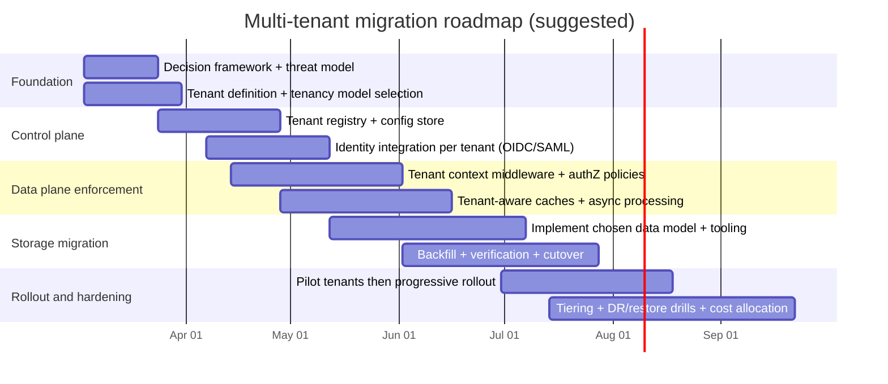

# Adapting a Single-Tenant System to a Multi-Tenant Architecture

## Executive summary

Adapting a single-tenant system to multi-tenancy is less a “database refactor” and more a platform transformation: tenant identity and routing, isolation guardrails (data/compute/network), per-tenant authorization, metering and chargeback, tenant-aware observability, and lifecycle automation (onboarding/offboarding) become first-class capabilities. Multi-tenancy also doesn’t mean *everything* is shared—good architectures selectively share components while isolating the ones that drive the highest risk (regulated data, noisy-neighbor hotspots, or tenant-custom code paths). citeturn14view1

Across authoritative SaaS guidance, three recurring architectural footprints show up:

- **Silo**: tenants get dedicated resources (often a separate database and sometimes dedicated compute). citeturn15view0  
- **Pool**: tenants share most resources; isolation is enforced by design and controls (tenant context, policies, guardrails). citeturn15view0  
- **Bridge/Hybrid**: a mixed architecture where some services/tenants are pooled while others are siloed, often tier-driven or compliance-driven. citeturn15view0  

A rigorous “default recommendation” when the tenancy scope, scale, and tech stack are open variables is:

- Build a **control plane/data plane split** early (tenant registry, entitlements, config, identity integration, billing config, isolation binding) and enforce tenant context consistently in the data plane (APIs, jobs, events). This aligns with cloud guidance that emphasizes separating management concerns from runtime concerns in multitenant systems. citeturn14view1turn17view2  
- Start with a **pooled/shared application layer**, then implement **graduation paths**: pooled (shared schema) → separate schema → separate database/stack for higher tiers or regulated tenants. This mirrors bridge realities described in SaaS guidance. citeturn15view0turn14view0  
- Treat **cross-tenant data leakage** and **noisy neighbor** risk as the dominant failure modes; both are explicitly called out as key multitenancy risks. citeturn17view0turn17view2  

Where strong security/compliance applies (especially payment ecosystems), multi-tenancy frequently triggers explicit requirements for logical separation evaluation and tenant-visible audit logging. For PCI DSS contexts, the PCI SSC explicitly defines multi-tenant service providers and the cases in which additional multi-tenant requirements apply. citeturn10view0turn13view1turn13view2

## Framing the problem as decisions under uncertainty

Because the tenancy scope (per-customer org vs per-user vs hybrid), expected tenant scale, and existing tech stack are unspecified, the highest-value output is a decision framework that produces **different recommended end states** for (a) a small number of large tenants and (b) a large number of small tenants.

### Tenancy scope options

Cloud guidance emphasizes that **how you define a “tenant” depends on your business model** and that multitenant architecture choices follow from that definition. citeturn14view1turn17view2

**Per-customer organization (B2B-style tenant)**  
Pros: easiest to reason about isolation boundaries; maps naturally to SSO and enterprise procurement; simplifies billing and support (one tenant = one contract). citeturn14view1  
Cons: “tenant” might contain many internal teams with conflicting requirements; can force you into sub-tenancy constructs (departments/workspaces).  
Implementation steps: introduce tenant registry; map user identities → tenant; add org-level RBAC; define tenant-scoped configuration hierarchy.  
Effort: **Medium** (often foundational but straightforward).  
Risk: **Medium** (main risk is missing tenant propagation in APIs/jobs/caches). citeturn17view0  
Best fit: **small number of large tenants** and most B2B SaaS.

**Per-user tenant (B2C-style “tenant = user” or “tenant = household”)**  
Pros: uniform lanes; fewer enterprise SSO complexities; some operations become simpler if a tenant is small. citeturn14view1  
Cons: “millions of tenants” pressure pushes you toward pooled models; per-tenant customization must be limited; per-tenant backup/restore is hard if tenants are tiny and numerous. citeturn14view0  
Implementation steps: ensure tenant identifiers are not guessable; model tenant context as an attribute of identity/session; enforce rate limits and abuse controls per tenant. citeturn17view0turn17view2  
Effort: **Medium–High** (scale concerns arrive earlier).  
Risk: **High** (noisy neighbor/resource amplification risk grows with tenant count). citeturn14view0turn17view0  
Best fit: **many small tenants**, consumer SaaS, prosumer products.

**Hybrid (org tenant with user/workspace partitions)**  
Pros: matches how many SaaS products evolve (orgs/teams/projects, plus user-level entitlements); supports “tenant tiers” and internal boundaries. citeturn15view0turn17view2  
Cons: more authorization complexity (tenant + workspace + object); higher testing burden. citeturn17view2  
Implementation steps: define the primary tenant boundary; formalize “sub-tenant” (workspace) as an authorization dimension; use explicit policy evaluation for object access.  
Effort: **High**.  
Risk: **High** (authorization failure modes like object-level authorization issues become more likely). citeturn17view1turn17view0  
Best fit: products expecting enterprise growth while retaining self-serve onboarding.

### Scale variables that dominate architecture selection

Authoritative tenancy guidance explicitly calls out choosing a tenancy model based on factors including **number of tenants, workload, per-tenant cost, isolation, operational complexity, and restore/DR needs**. citeturn14view0 Your scale decision is therefore not only “how many tenants” but also:

- **Per-tenant data size** (KB vs TB) and data temperature (hot OLTP vs cold archive). citeturn14view0  
- **Per-tenant performance variance** (spiky “noisy” tenants vs smooth). citeturn14view0turn17view2  
- **Per-tenant operational requirements** (dedicated backups, customer-managed keys, data residency, regulated environments). citeturn17view2turn4search8  

## Tenancy models and isolation architectures

This section focuses on the three database tenancy models you requested (shared schema, separate schema, separate database) and ties them to **data, compute, and network** isolation.

### Tenancy model comparison table

The table below compares the canonical data-layer models; it also reflects published guidance that restore/DR, operational complexity, and tenant isolation differ substantially by model. citeturn14view0turn15view0

| Model | Isolation (data) | Isolation (compute/network) | Cost per tenant | Engineering complexity | Operational complexity | Scalability | Backup/restore per tenant | Tenant customization |
|---|---|---|---|---|---|---|---|---|
| Shared DB, shared schema (“pool”) | Lowest by default; must be enforced (tenant_id everywhere; policies) citeturn15view0turn15view3 | Shared by default; mitigate with quotas, rate limits, noisy-neighbor guards citeturn17view0turn2search23 | Lowest citeturn14view0 | High (every query, cache, index, event must be tenant-scoped) citeturn17view0turn14view0 | Medium–High (per-tenant restore, support, forensics harder) citeturn14view0 | Highest (best for many small tenants) citeturn14view0 | Hardest (often requires logical export/restore tooling) citeturn14view0 | Limited; should be configuration-driven |
| Shared DB, separate schema (“bridge”) | Medium–High (schema boundary helps reduce query mistakes) citeturn15view0 | Still shared DB compute; can shard schemas across DBs for scale citeturn14view0 | Medium | Medium–High (routing + migrations across many schemas) | High (schema sprawl, migration orchestration) | High (if sharded) citeturn14view0 | Easier than shared schema; still nontrivial | Moderate (schema-per-tenant customization possible but risky) |
| Separate database per tenant (“silo”) | Highest (natural physical/logical boundary) citeturn15view0turn14view0 | Can be highest if paired with dedicated compute/network segments; or still shared app layer citeturn15view0 | Highest (infra overhead) citeturn14view0 | Medium (less tenant filtering complexity) | High without automation; manageable with strong provisioning | Medium–High (depends on automation and platform limits) | Easiest (native PITR/restore per tenant) citeturn14view0 | Highest (tenant-by-tenant schema extensions possible) citeturn14view0 |
| Hybrid/bridge across tenant tiers | Variable; isolate “special” tenants/services while pooling others citeturn15view0 | Variable; often “pooled by default” + “dedicated for tier/regulatory” citeturn15view0 | Optimizable | High (multiple patterns simultaneously) | High (needs clear runbooks and automation) | High | Mixed (tier-based restore guarantees) | High (tier-based customization) |

### Architecture option diagrams

The following mermaid diagrams illustrate a practical **control plane + data plane** layout and how the data plane routes to different storage isolation bindings. This matches guidance that multitenancy often benefits from explicit control-plane/data-plane separation. citeturn17view2turn14view1

```mermaid
flowchart TB
  subgraph CP[Control plane]
    TR[Tenant registry]
    ENT[Entitlements & tier]
    IC[Identity config per tenant\n(OIDC/SAML settings)]
    CFG[Tenant configuration store\n(flags, limits, branding)]
    BILL[Billing plan + metering rules]
    ISO[Isolation binding\n(pool/bridge/silo)]
  end

  subgraph DP[Data plane]
    GW[API gateway / ingress]
    MID[Tenant resolution middleware]
    SVC[Application services\n(sync + async workers)]
    OBS[Telemetry pipeline\n(logs/metrics/traces)]
    EVT[Event bus / queues]
  end

  TR --> MID
  IC --> MID
  CFG --> SVC
  ENT --> SVC
  BILL --> SVC
  ISO --> SVC

  GW --> MID --> SVC --> EVT --> SVC
  SVC --> OBS
```

```mermaid
flowchart LR
  REQ[Request / job / event] --> RESOLVE[Resolve tenant context]
  RESOLVE --> POLICY[Authorize + load tenant config]
  POLICY --> DECIDE{Isolation binding?}
  DECIDE -->|Pool| DB1[(Shared DB\nshared schema\n+ tenant_id + RLS)]
  DECIDE -->|Bridge| DB2[(Shared DB\nschema-per-tenant)]
  DECIDE -->|Silo| DB3[(DB-per-tenant\n(or stack-per-tenant))]
  DB1 --> EXEC[Execute operation]
  DB2 --> EXEC
  DB3 --> EXEC
  EXEC --> METER[Emit metering event]
  EXEC --> AUDIT[Audit log + telemetry]
```

image_group{"layout":"carousel","aspect_ratio":"16:9","query":["AWS SaaS silo pool bridge model diagram","Azure SQL multitenant database tenancy patterns diagram","Kubernetes multi-tenancy namespace resource quota diagram","PostgreSQL row level security multi-tenant diagram"],"num_per_query":1}

### Model-by-model analysis with pros/cons and recommended scenarios

Below, “effort” and “risk” refer to the migration from an unspecified single-tenant baseline, not greenfield development.

#### Shared schema

**Pros**: lowest infrastructure cost and highest density; can scale to very large tenant counts when operational patterns are standardized. citeturn14view0  
**Cons**: highest blast radius and strongest need for flawless tenant-scoping in queries/caches/indexes; per-tenant restore and tenant-specific operations become complex. citeturn14view0turn17view0  

**Implementation steps**  
- Add a tenant identifier to every tenant-owned table and enforce it across reads/writes. citeturn17view0  
- Prefer database-enforced isolation where possible (e.g., PostgreSQL RLS) so missed filters don’t leak data; AWS guidance explicitly recommends RLS for pooled PostgreSQL and describes setting a tenant context variable per session. citeturn15view3turn16view0turn16view1  
- Add tenant-aware throttles/quotas to avoid noisy neighbors; multitenancy guidance explicitly calls out noisy neighbor risk. citeturn17view2turn17view0  

**Estimated effort**: **High** (broad code touch surface + deep testing).  
**Risk level**: **High** (cross-tenant leakage and resource contention dominate). citeturn17view0turn14view0  

**Recommended scenarios**  
- **Many small tenants** with limited per-tenant customization, strong standardization, and strong tenant-aware automation/observability. citeturn14view0turn17view2  
- Recommended only if you can commit to systematic tenant-context enforcement (middleware + data access layer + policy checks) and continuous isolation testing. citeturn17view0turn17view2  

#### Separate schema

**Pros**: reduces accidental cross-tenant query mistakes (schema boundary), improves per-tenant operations (export/restore) compared to shared schema, supports moderate customization. citeturn15view0turn14view0  
**Cons**: schema sprawl makes migrations and versioning harder; still shares database compute so noisy neighbor remains unless you shard schemas across DBs. citeturn14view0turn17view2  

**Implementation steps**  
- Introduce a tenant-to-schema mapping in the tenant registry.  
- Implement a “tenant DB router” in the data access layer (schema selection in connection/session).  
- Build schema migration orchestration (run migrations across N schemas safely, with pause/resume and verification).  
- For scale, shard tenants across multiple databases (“sharded multitenant databases”)—Azure guidance explicitly describes sharded multitenant models for large scale. citeturn14view0  

**Estimated effort**: **High** (migrations + routing + ops automation).  
**Risk level**: **Medium–High** (less leakage risk than shared schema, but more operational risk). citeturn14view0turn17view2  

**Recommended scenarios**  
- **Small-to-medium tenant counts** where per-tenant restore and moderate customization matter, but you don’t want full DB-per-tenant cost. citeturn14view0  
- Transitional “bridge” for a system migrating from single tenant toward pooled scale. citeturn15view0  

#### Separate database per tenant

**Pros**: strongest isolation boundary at the data layer; simplest per-tenant backup/restore (often native PITR), simplest tenant deletion, and easiest per-tenant schema customization. citeturn14view0turn15view0  
**Cons**: highest operational and cost overhead unless tenant provisioning, migrations, monitoring, and DR are heavily automated. citeturn14view0turn17view2  

**Implementation steps**  
- Create tenant provisioning automation (DB creation/cloning, migrations, seed data).  
- Build centralized catalog mapping tenant → database URI (Azure guidance notes the need for a catalog mapping tenant identifiers to database URIs in multi-database models). citeturn14view0  
- Add per-tenant runbooks for backup/restore, incident response, performance tuning (or automate them).  

**Estimated effort**: **Medium–High** (less risky code change, but high automation needs).  
**Risk level**: **Medium** (reduced leakage risk; increased operational risk if automation is weak). citeturn14view0turn17view2  

**Recommended scenarios**  
- **Small number of large tenants** with strict isolation, dedicated restore guarantees, data residency requirements, or tenant-specific performance tuning. citeturn14view0turn17view2  

### Compute and network isolation options

Data isolation alone is insufficient. Multi-tenant guidance highlights that resource contention and availability issues arise when tenants share compute/storage. citeturn17view0turn14view0

**Compute isolation** (typical ladder)  
- **Shared compute with per-tenant quotas**: enforce concurrency limits, rate limits, batch quotas. In Kubernetes environments, policies like ResourceQuotas and LimitRanges exist to bound namespace resource consumption and reduce noisy neighbor risk. citeturn2search23turn2search35  
- **Namespace-per-tenant**: common for “soft multi-tenancy”; Kubernetes also explicitly discusses multiple tenancy models. citeturn2search3turn2search29  
- **Cluster-per-tenant / account-per-tenant**: strongest isolation; operationally expensive but aligned with silo tiers. citeturn15view0turn17view2  

**Network isolation**  
- In Kubernetes-style deployments, NetworkPolicies are the native construct for restricting Pod-to-Pod and Pod-to-network traffic. citeturn2search7  
- For higher tiers, combine network segmentation with service-to-service authentication/authorization and least privilege principles (multitenancy checklists explicitly call out least privilege and isolation design/testing). citeturn17view2  

## Authentication, authorization, data partitioning, and per-tenant customization

This section covers the “core refactors” you typically must do regardless of which tenancy model you choose.

### Authentication changes for SaaS SSO

A multi-tenant SaaS environment usually must support tenant-specific identity providers and federation configuration.

- **OpenID Connect (OIDC)** is a standard for authentication built on top of OAuth 2.0, enabling interoperable identity assertions and claims; it is commonly used for SaaS SSO. citeturn1search0  
- **SAML 2.0** is a widely used federation standard for exchanging security assertions between security domains, still common for enterprise SSO. citeturn1search3  
- **SCIM** is an HTTP-based standard for provisioning and managing identities across domains (enterprise → cloud service provider), commonly used for SaaS user and group provisioning. citeturn1search2turn1search14  

**Recommended multi-tenant identity pattern**  
- Store an **identity configuration object per tenant** (OIDC issuer/metadata, SAML IdP metadata/certificates, claim mappings).  
- Bind tenant context to authenticated sessions and do not trust client-supplied tenant identifiers; OWASP explicitly warns against tenant context injection and advises establishing tenant context early and securely. citeturn17view0  
- Follow OAuth security best current practice guidance when implementing OAuth/OIDC flows and token handling. citeturn1search1  

Effort: **Medium–High** (varies with existing auth).  
Risk: **High** if not standardized early (tenant impersonation and token/claim confusion are classic multi-tenant failure modes). citeturn17view0turn17view2  

### Authorization changes and per-tenant roles

Multi-tenancy makes authorization multidimensional: **tenant boundary + role + object**. OWASP API Security identifies broken object level authorization as extremely common in API systems and calls for object-level checks on every endpoint that uses object IDs. citeturn17view1

**Practical authorization architecture**  
- A single “policy decision function” that evaluates: `(principal, tenant, action, resource)` and returns allow/deny plus obligations (mask fields, rate limits).  
- Roles should be **tenant-scoped**, not global. Use a consistent role model (RBAC) with optional policy rules (ABAC) for sensitive objects.  
- Test explicitly for cross-tenant ID manipulation, which is the hallmark of object-level authorization failures. citeturn17view1  

Effort: **High** in legacy systems with scattered authorization logic.  
Risk: **High** (authorization failures can become cross-tenant incidents). citeturn17view0turn17view1  

### Data partitioning patterns and database-enforced isolation

**Shared-schema pooled environments** require robust tenant data separation. For PostgreSQL specifically:

- PostgreSQL supports row-level security policies via `CREATE POLICY` and table-level RLS enabling. citeturn16view0turn16view1  
- AWS prescriptive guidance explicitly states that RLS is required to maintain tenant isolation in pooled PostgreSQL models and recommends using an application-set runtime variable to establish tenant context for policies. citeturn15view3  

**Key decision: use DB-enforced isolation or app-only isolation?**  
- DB-enforced (RLS / similar) reduces reliance on every developer remembering every tenant filter, which OWASP flags as a cross-tenant leakage risk. citeturn17view0turn15view3  
- App-only isolation can work but requires extremely strong code review, testing, linting, and query abstraction discipline; it also leaves more room for regressions.

Effort: **Medium–High** to implement RLS correctly (session context setting, policy coverage, bypass controls, testing).  
Risk: **Medium** once mature; **High** if partially deployed (mixed RLS/non-RLS tables are a common gap).

### Migration strategies from a single-tenant baseline

A database model switch is often costly; guidance explicitly warns that switching tenancy models later can be expensive. citeturn14view0 Therefore migration strategy is part of the primary architecture decision.

**Strategy option: “Big bang cutover”**  
Pros: shortest calendar time; no dual-write complexity.  
Cons: highest outage risk; hardest rollback; difficult to verify correctness at scale.  
Effort: **Medium**. Risk: **High**.  
Best fit: very small systems, low criticality, small data.

**Strategy option: “Expand and contract” (recommended default)**  
Method: add multi-tenant structures while keeping old paths; dual-read/dual-write temporarily; backfill; verify; then switch reads and retire old paths.  
Pros: staged risk; supports canary tenants; rollback is usually “switch back” for read paths.  
Cons: complexity in consistency, idempotency, and operational overhead during transition.  
Effort: **High**. Risk: **Medium** (if engineered and tested).  
Best fit: most production SaaS migrations.

**Strategy option: “Clone-and-route” (common for DB-per-tenant adoption)**  
Method: clone the existing single-tenant database to become “Tenant A”; introduce routing; later onboard other tenants.  
Pros: minimal change for first tenant; operationally clean; easiest rollback for the original tenant.  
Cons: doesn’t solve pooled scaling; still requires tenant-aware app changes if the app becomes shared.  
Effort: **Medium**. Risk: **Medium**.  
Best fit: small number of large tenants moving to silo.

### Per-tenant configuration and customization

Tenant customization is a leading source of operational complexity. Multi-tenant guidance explicitly warns against hard-coding tenant-specific logic and calls for automation and balanced deployment strategies. citeturn17view2

A robust configuration design is usually hierarchical:

- **Global defaults** → **tier defaults** → **tenant overrides** → optional **workspace overrides** (if hybrid).  
- Store configurations as versioned artifacts with validation and audit history.

Customization approaches (in increasing risk order):

- **Configuration only** (flags, limits, branding): safest; recommended for pooled scale.  
- **Schema extensions** (extra fields/indexes per tenant): feasible in schema-per-tenant or DB-per-tenant, but increases migration complexity. citeturn14view0  
- **Code plugins / tenant-provided logic**: highest security and operational risk; normally requires strong compute isolation and strict sandboxing.

Effort: **Medium** (config/tier model) to **High** (schema or code extensibility).  
Risk: **Medium** to **High** (especially if extensibility expands attack surface). citeturn17view0turn17view2  

## Billing and metering, tenant observability, backup/restore, and disaster recovery

### Billing and usage metering

SaaS guidance distinguishes:

- **Metering**: collecting tenant activity/consumption signals needed to generate bills. citeturn15view1  
- **Operational metrics**: signals for health, performance, capacity, and per-tenant footprint. citeturn15view1turn15view2  

Tenant-level activity tracking is explicitly recommended for scaling and for pay-as-you-go billing models, where metering data feeds a billing aggregator. citeturn15view2 Azure multitenancy guidance similarly stresses measuring per-tenant consumption and correlating it with infrastructure cost (and warns against cost-tracking antipatterns). citeturn17view2

**Practical metering architecture**  
- Emit **immutable metering events** from the business transaction boundary (API request accepted, job completed).  
- Use tenant_id as a mandatory attribute; validate it against the tenant registry. citeturn17view0turn15view2  
- Aggregate by time window and pricing dimension (requests, seats, GB stored, compute-minutes).

Effort: **Medium** (if instrumentation exists) to **High** (if legacy lacks consistent eventing).  
Risk: **Medium** (billing correctness affects revenue and trust).

### Monitoring/logging/observability per tenant

A multi-tenant system needs both global SLO health and per-tenant health. Azure multitenancy checklists explicitly call for monitoring the overall system and each tenant, and alerting when tenants have problems or exceed consumption. citeturn17view2

**Standards-aligned observability plumbing**  
- Use entity["organization","W3C","web standards body"] Trace Context headers to propagate distributed trace identifiers (`traceparent`, `tracestate`) end-to-end. citeturn2search4  
- Use entity["organization","OpenTelemetry","observability project"] signals and OTLP transport to unify metrics/logs/traces export paths; OTLP specifies encoding and delivery mechanisms for telemetry signals. citeturn2search1turn2search9  
- Use entity["organization","CloudEvents","event specification"] conventions for event metadata when building event-driven multi-tenant architectures (especially for metering, auditing, and async workflows). citeturn2search2turn2search6  

**Tenant observability requirements**  
- Every log/metric/trace must include a tenant identifier (as an attribute/label)  
- Provide tenant-level dashboards: error rate, p95 latency, job backlog, throttling events, cost anomalies  
- For regulated contexts, per-tenant audit log access and incident response workflows may be required. For example, PCI DSS multi-tenant requirements in Appendix A1 include tenant-oriented audit log capability expectations, including that logs are available only to the owning customer. citeturn13view2turn10view0  

Effort: **Medium** for plumbing; **High** for mature per-tenant SLOs + anomaly detection.  
Risk: **Medium** (but lack of tenant observability turns incidents into “unknown blast radius” events).

### Backup/restore and disaster recovery per tenant

Disaster recovery posture must be defined with RPO/RTO targets and restored-time expectations. NIST contingency planning guidance provides structured approaches for contingency planning and highlights integrating recovery planning into the system lifecycle. citeturn5search2

If personal data is in scope, GDPR security-of-processing obligations include (among other measures) the ability to restore availability and access to personal data in a timely manner after incidents. citeturn4search8

**How tenancy models affect tenant-level restore**  
- Shared schema: native database restore restores *everyone*; tenant-only restore needs logical export/restore tooling and careful referential integrity handling (explicitly called out as complex in multitenant DB models). citeturn14view0  
- Separate schema: tenant restore is easier (schema-level restore is still not always trivial, but boundaries exist).  
- Separate DB: tenant restore is usually simplest (PITR/restore per DB). citeturn14view0  

**Per-tenant DR patterns**  
- Define tenant tiers with different RPO/RTO and different isolation bindings. citeturn15view0turn17view2  
- Maintain a “tenant restore runbook” and exercise it regularly (NIST-style contingency planning expectations include exercises/testing as part of effective planning). citeturn5search2turn4search8  

Effort: **Medium** (silo) to **High** (pooled, if tenant restore is contractual).  
Risk: **High** if restore is a contractual SLA (enterprise buyers often require it).

### Security and compliance highlights

Key risk themes are consistent across OWASP multi-tenant guidance:

- Cross-tenant leakage (DB, cache, storage, compute)  
- Tenant impersonation and tenant context injection  
- Noisy neighbor / resource exhaustion  
- Audit and compliance gaps citeturn17view0  

Encryption and key management should follow lifecycle discipline:

- entity["organization","National Institute of Standards and Technology","us standards agency"] defines AES as a FIPS-approved symmetric encryption algorithm used to protect electronic data. citeturn3search6  
- NIST SP 800-57 provides key management guidance and best practices for managing cryptographic keying material. citeturn3search3  

PCI considerations (high-level, architecture-relevant):  
- PCI SSC explicitly defines multi-tenant service providers and the shared services environments where Appendix A1 applies. citeturn10view0  
- The multi-tenant Appendix A1 requirements include logical separation controls and periodic validation of separation via penetration testing, plus tenant-aligned audit log expectations. citeturn13view1turn13view2  

## Operational impacts, testing strategies, and rollback planning

### CI/CD and deployment model impacts

Database tenancy model selection directly affects migration pipelines and day-2 operations. Azure’s tenancy model guidance explicitly lists schema management, restoring a tenant, and disaster recovery as operational complexity factors, and warns that switching tenancy models later can be costly. citeturn14view0

**Implications by model**  
- Shared schema: one schema migration affects all tenants—requires stricter backward compatibility and staged rollouts.  
- Separate schema: migrations become a fleet operation (N schemas) and need orchestration, version tracking, and failure handling.  
- Separate DB: migrations are again a fleet operation (N DBs), but with stronger isolation and safer canarying.

**Recommended CI/CD mechanisms**  
- Versioned migrations with compatibility rules (“expand” before “contract”)  
- Tenant-tier aware feature flags/config rollout  
- Canary tenants for every release (especially for pooled models)

Effort: **High** to get right; operational excellence guidance emphasizes balancing deployment updates with tenant requirements and using automation. citeturn17view2

### Tenant onboarding/offboarding operationalization

Azure multitenancy checklists explicitly highlight automation for tenant lifecycle management (onboarding, deployment, provisioning, configuration). citeturn17view2

Offboarding must include: account disablement, token/session invalidation, data retention rules, export support, and deletion workflows.

Effort: **Medium** (basic) to **High** (enterprise exports, legal hold, per-tenant restore guarantees).  
Risk: **Medium** operationally; **High** reputationally if data deletion or access control is wrong.

### Testing strategy: unit, integration, tenancy-specific, and security testing

Multi-tenancy requires testing beyond typical unit/integration tests. Both OWASP and Azure guidance stress continuously testing isolation and preventing cross-tenant access. citeturn17view0turn17view2

**Unit tests (fast, deterministic)**  
- Tenant context extraction and validation (never trust unvalidated client tenant IDs). citeturn17view0  
- Authorization policy evaluation: tenant scoping, role evaluation, object-level decisions. citeturn17view1  
- Data access layer: ensures tenant filters/policies always apply.

**Integration tests (real DB + real caches, representative queries)**  
- Cross-tenant isolation tests: create tenant A and tenant B objects, ensure B can never fetch A’s objects even with ID guessing. citeturn17view1turn17view0  
- Cache isolation: cache keys must include tenant identity to prevent bleed. citeturn17view0  
- Event isolation: consumers must enforce tenant context on event processing (CloudEvents-style metadata helps standardize context). citeturn2search2turn17view0  

**Tenancy-specific tests (must-have for pooled models)**  
- Automated “tenant fuzzing”: randomly mix tenants in test traffic; assert no cross-tenant responses  
- Load tests that simulate noisy-neighbor scenarios and validate throttling/quota policies. citeturn17view2turn2search23  

**Security testing**  
- Explicit tests for BOLA patterns (object ID manipulation), which OWASP identifies as common and severe. citeturn17view1  
- Penetration tests targeted at isolation boundaries; PCI multi-tenant guidance requires separation control validation via periodic penetration testing in multi-tenant service provider contexts. citeturn13view2  

### Rollback and migration rollback planning

Rollback must exist at two levels:

**Application rollback**  
- Feature-flag the tenant routing decision (e.g., old single-tenant path vs new multi-tenant path).  
- Keep backwards-compatible schema during rollout so old code can run safely.

**Data migration rollback**  
- For expand/contract migrations: rollback criteria should be defined per stage (e.g., error rate thresholds, integrity check failures, tenant data reconciliation mismatch).  
- In pooled models, avoid irreversible destructive steps until a full verification window completes.

Risk: highest during “contract” phases (dropping old columns/tables, removing compatibility code).

## Migration roadmap with phases, timelines, artifacts, and rollback criteria

The roadmap below assumes a production system with meaningful data and availability requirements. Timelines are *suggested durations* and should be adjusted based on data volume, regulatory constraints, and release cadence.

### Suggested phased roadmap

**Foundation and design (2–4 weeks)**  
Deliverables (artifacts): tenant definition spec, tenant ID format, threat model, tenancy model decision record, data classification and compliance mapping, SLO targets, rollout plan. citeturn17view2turn14view0  
Rollback criteria: not applicable (design phase), but define acceptance criteria for each subsequent phase.

**Control plane buildout (3–6 weeks)**  
Scope: tenant registry, entitlements, tenant config store, identity config per tenant, “isolation binding” (pool/bridge/silo). citeturn14view1turn17view2  
Artifacts: tenant registry schema + API, config validation rules, onboarding runbook, access/audit model.  
Rollback criteria: control plane can be disabled without affecting existing single-tenant flows.

**Data plane tenant context enforcement (4–10 weeks)**  
Scope: tenant resolution middleware, tenant-aware authorization, tenant-aware caching, tenant-aware async processing. citeturn17view0turn17view1  
Artifacts: shared libraries for tenant context propagation, policy engine, tenant-aware logging conventions.  
Rollback criteria: ability to route traffic back to single-tenant path; error budget thresholds.

**Storage model implementation (4–12 weeks depending on model)**  
- Shared schema: add tenant_id columns, enforce RLS/policies if applicable, backfill. citeturn15view3turn16view1  
- Separate schema: add schema router, provisioning, and migration orchestrator.  
- Separate DB: build catalog mapping tenant→DB URI; provisioning automation. citeturn14view0  
Artifacts: migration scripts, data validation tooling, restore runbooks.  
Rollback criteria: for each tenant migrated, maintain a “fallback path” to pre-migration snapshot until verification completes.

**Pilot tenants and progressive rollout (4–8 weeks)**  
Scope: onboard internal tenants first; expand to external pilot; staged ramp.  
Artifacts: tenant-specific dashboards, runbooks, incident response playbooks. citeturn17view2turn5search2  
Rollback criteria: define per-tenant isolation/regression checks; auto-disable new path on breach.

**Hardening and tiering (ongoing, 6–12 weeks initial)**  
Scope: introduce tier-based isolation (hybrid), per-tenant restore commitments, compliance evidence, cost allocation and unit economics. citeturn15view0turn17view2turn18view0  
Rollback criteria: tier transitions are reversible (tenant can be “demoted” to previous isolation binding).

### Mermaid Gantt timeline



### Sample tenant onboarding workflow flowchart

This flow emphasizes “automation-first tenant lifecycle management,” which is explicitly recommended in multitenancy operational excellence guidance. citeturn17view2

```mermaid
flowchart TB
  START([New tenant signup]) --> VALIDATE[Validate tenant request\n(tier, region, compliance)]
  VALIDATE --> CREATE[Create tenant record\n+ tenant_id]
  CREATE --> IDP{SSO required?}
  IDP -->|Yes| SSO[Configure OIDC/SAML\n+ claim mappings]
  IDP -->|No| LOCAL[Enable native auth\n+ default policies]
  SSO --> PROVISION
  LOCAL --> PROVISION

  PROVISION{Isolation binding}
  PROVISION -->|Pool| P1[Create tenant config\n+ quotas + flags]
  PROVISION -->|Bridge| P2[Create schema\nrun migrations]
  PROVISION -->|Silo| P3[Create DB/stack\nrun migrations]

  P1 --> SEED[Seed default roles\n+ admin user]
  P2 --> SEED
  P3 --> SEED

  SEED --> OBS[Create tenant dashboards\n+ alert rules]
  OBS --> BILL[Activate billing plan\n+ metering rules]
  BILL --> TEST[Run tenant smoke tests\n(isolation + auth + perf)]
  TEST --> ENABLE[Enable tenant traffic]
  ENABLE --> DONE([Tenant active])
```

## Cost and ROI analysis

### Cost drivers by tenancy model

Authoritative guidance highlights that tenancy model selection impacts per-tenant cost, operational complexity, and the ability to restore a tenant. citeturn14view0 Additionally, SaaS guidance emphasizes that pooled models target economies of scale while silo models are often driven by regulatory or isolation needs. citeturn15view0

**Pooled/shared schema**  
- Lowest infrastructure cost per tenant, but highest engineering investment in tenant-scoping and in tenant-specific restore tooling. citeturn14view0turn15view3  
- Operational costs shift toward observability, throttling, and incident containment (blast radius management). citeturn17view2turn17view0  

**Separate schema**  
- Moderate infra cost; higher platform automation cost (migrations across many schemas). citeturn14view0  

**Database-per-tenant**  
- Highest infra cost, but per-tenant restore and isolation may reduce incident costs and unlock enterprise revenue. citeturn14view0turn15view0  

### ROI model you can apply without a specific stack

Define:

- **Engineering investment**: one-time build cost + ongoing maintenance cost  
- **Incremental revenue**: ability to serve more tenants, sell higher tiers, reduce churn due to compliance and reliability guarantees  
- **Operational risk reduction**: fewer cross-tenant incidents, faster tenant-level restore, fewer noisy-neighbor escalations  
- **Unit economics**: cost per tenant and gross margin by tier

SaaS billing guidance recommends metering consumption and tracking tenant activity to understand how tenants impose load and to support consumption-based pricing models. citeturn15view2turn15view1 Cloud cost optimization guidance also stresses correlating per-tenant consumption with infrastructure cost, while avoiding antipatterns like “monitoring tools for billing.” citeturn17view2

### Recommended choices by scenario

**Many small tenants (high tenant count, low customization)**  
Recommended: **Pooled shared schema** (or sharded pooled) + strong guardrails: DB-enforced isolation where feasible, strict tenant context propagation, quotas/rate limits, tenant-level observability, automation-first onboarding/offboarding. citeturn14view0turn15view3turn17view2turn17view0  
Rationale: supports scale and lowest per-tenant cost; cloud guidance explicitly notes multitenant databases can achieve very high tenant counts and lowest per-tenant cost, but require careful isolation and face noisy neighbor risk. citeturn14view0  

**Small number of large tenants (enterprise, regulated, high per-tenant value)**  
Recommended: **DB-per-tenant (silo)** or hybrid where premium tenants are siloed and long-tail tenants are pooled. citeturn15view0turn14view0  
Rationale: simplifies per-tenant restore/DR and supports stronger isolation guarantees; helps meet compliance expectations where multi-tenant service provider requirements apply (for PCI contexts, Appendix A1 targets shared services environments and requires strong logical separation validation and audit log expectations). citeturn10view0turn13view2  

**Mixed portfolio (enterprise + self-serve growth)**  
Recommended: **Hybrid/bridge** with explicit tenant tiering and graduation pathways (pool → bridge → silo), consistent with SaaS guidance that many systems are mixed-mode rather than purely pool or silo. citeturn15view0turn17view2