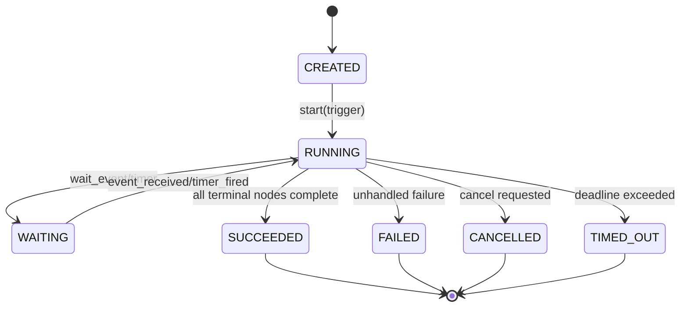
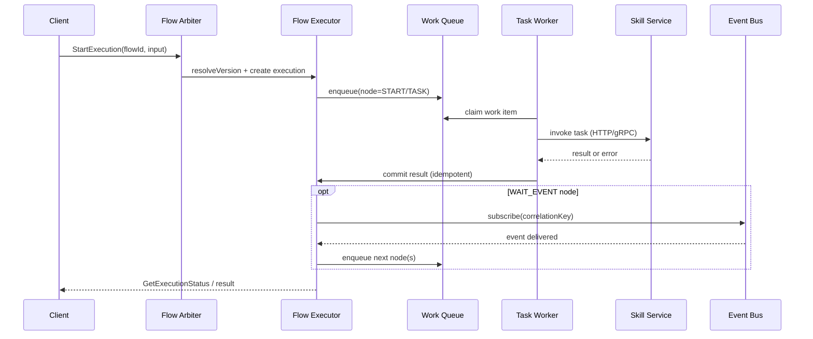

# Extending the Engine to Support Flow Creation for Unified Social Flows

## Executive summary

The available 11-* materials describe (a) a modular social-network platform decomposition and (b) an explicit intent to integrate those modules into an existing “Unified Flow System” by mapping modules to “Skills” and defining new “Flow IDs” plus new task types and output contracts. fileciteturn0file1turn0file0 However, only two 11-* documents were accessible in the provided project context, so this report treats those documents as the authoritative baseline while clearly marking where additional 11-* documents could refine requirements.

The engine extension required is not “add a few endpoints,” but a complete **flow-definition lifecycle**: author → validate/compile → version → publish → route (arbiter) → execute durably → observe/audit → deprecate, while meeting the “zero breaking” / phased rollout posture implied by the documents. fileciteturn0file1turn0file0 Concretely, the engine must support:

- **First-class flow definitions** (immutable published versions) identified by stable Flow IDs (e.g., FLOW-06/07/08) and composed of versioned task types (e.g., `PERMISSIONS_FILTER`, `TRUST_GATING`, `FAN_OUT_EXECUTION`). fileciteturn0file1turn0file0  
- **Triggers** (API, event, schedule) and **wait states** (e.g., media readiness) because the source material explicitly models asynchronous pipelines and event-driven fanout (e.g., `MediaReady`, `PostPublished`, and moderation/reporting workflows). fileciteturn0file1turn0file0  
- A **Business Flow Arbiter** (routing/selection layer) that can choose flow versions at runtime (feature flags, tenant gates, experiments) to deliver incremental rollout without breaking existing behavior. fileciteturn0file1turn0file0  
- A **Skills Factory / task type catalog** where each task has explicit input/output contracts (schemas), retry semantics, and an execution adapter to an underlying service/skill implementation. fileciteturn0file1turn0file0

Design recommendation: standardize API contracts via OpenAPI 3.1 (to align schemas with modern JSON Schema dialects) and standardize async events with a CloudEvents-style envelope; use distributed-trace propagation via W3C Trace Context and end-to-end observability via OpenTelemetry signals. citeturn0search5turn0search1turn0search0turn0search3turn1search4

## What the 11-* documents require from flow creation

The documents define two requirement layers.

The first layer is the **module map** (Identity/Sessions, Profile, Social Graph, Content+Media, Engagement, Feed, Messaging, Notifications, Search, Communities, Events, Monetization; plus Privacy/Policy controls, Trust & Safety, Recommendations/ML, Analytics, Admin tools, Infrastructure). fileciteturn0file1turn0file0 The key engineering implication is that flows will routinely span multiple bounded contexts and therefore must support orchestrating multiple skills/services.

The second layer is a set of **end-to-end flows** that the platform must support, explicitly listed as onboarding; connect/follow; publish post with media; home feed request; react/comment; messaging; search; report/moderation. fileciteturn0file1turn0file0 These flows imply specific engine primitives:

- **Multi-step orchestration** (e.g., onboarding chains Identity → Profile → Graph → Recommendations → Feed). fileciteturn0file1turn0file0  
- **Asynchronous dependencies / event waits** (e.g., media upload/transcode then `MediaReady`). fileciteturn0file1turn0file0  
- **Policy and permissions filtering tasks** embedded in other flows (search and feed must apply visibility/block rules). fileciteturn0file1turn0file0  
- **High-concurrency fanout** patterns (notifications; feed distribution; messaging fanout). fileciteturn0file1turn0file0  
- **Trust gating / moderation branching** (message-request gating; automated vs human review; enforcement actions). fileciteturn0file1turn0file0

In addition, the documents propose an explicit integration strategy into an existing engine: extend the Unified Flow System in entity["organization","XIIGen","internal flow platform"] by mapping modules to Skills, defining new Flow IDs in a “Business Flow Arbiter,” and extending a `TASK_TYPES_CATALOG` with new task contracts such as permissions filtering, proximity ranking, trust gating, and fan-out execution. fileciteturn0file1turn0file0

A minimal “required flows” list, grounded strictly in the documents, is:

- **FLOW-06 Real-time Messaging** with tasks like `MESSAGE_PERSIST`, `FANOUT_PUSH`, `MEDIA_ATTACH`, plus trust gating when parties are unconnected. fileciteturn0file1turn0file0  
- **FLOW-07 Social Search** with tasks like `SEARCH_RETRIEVAL`, `PERMISSIONS_FILTER`, `PROXIMITY_RANK`. fileciteturn0file1turn0file0  
- **FLOW-08 Content Moderation** with tasks like `SAFETY_CLASSIFY`, `ENFORCEMENT_ACTION`, `AUDIT_LOG` and branching into automated vs human review. fileciteturn0file1turn0file0

## Flow entities, states, transitions, triggers, conditions, and payloads

This section proposes a **canonical flow meta-model** that directly supports all behaviors implied by the documents (multi-service orchestration, event waits, fanout, and branching) while remaining implementable in a practical engine.

### Required flow entities

**Flow definition entities**

| Entity | Purpose | Required fields |
|---|---|---|
| FlowDefinition | Stable logical flow identity (e.g., `FLOW-07`) | `flow_id`, `name`, `owner_team`, `description` |
| FlowVersion | Immutable, publishable version (+ routing target) | `flow_id`, `version`, `status` (DRAFT/PUBLISHED/DEPRECATED), `created_at`, `published_at` |
| FlowGraph | The executable structure (DAG / state machine) | `nodes[]`, `edges[]`, `start_node_id`, `end_nodes[]` |
| Node | An executable step | `node_id`, `type` (TASK/WAIT_EVENT/TIMER/BRANCH/PARALLEL/JOIN/HUMAN), `task_type` (if TASK), `input_mapping`, `output_mapping` |
| Edge / Transition | Movement between nodes | `from_node_id`, `to_node_id`, `on` (SUCCESS/FAILURE/ALWAYS/EVENT/TIMEOUT), `condition` (optional) |
| TriggerDefinition | Starts a flow or wakes a WAIT node | `trigger_type` (HTTP/EVENT/SCHEDULE/MANUAL), `binding` (endpoint/topic/cron), `input_schema_ref` |
| TaskTypeDefinition | Declares a model contract for a skill | `task_type`, `input_schema_ref`, `output_schema_ref`, `timeout`, `retry_policy`, `idempotency` |
| SkillBinding | How to invoke a task type | `task_type`, `protocol` (HTTP/GRPC), `endpoint/service`, `auth_mode`, `circuit_breaker_policy` |

These map to the “Skills Factory,” “Flow IDs,” and “Task Types Catalog output contracts” language in the documents. fileciteturn0file1turn0file0

**Execution entities**

| Entity | Purpose | Typical states |
|---|---|---|
| FlowExecution | One run of one published FlowVersion | CREATED, RUNNING, WAITING, SUCCEEDED, FAILED, CANCELLED, TIMED_OUT |
| NodeExecution | Runtime state of a node | PENDING, READY, RUNNING, WAITING_EVENT, RETRYING, SUCCEEDED, FAILED, SKIPPED, CANCELLED |
| Attempt | One try of a task node | attempt_no, started_at, ended_at, error (if any) |
| ExecutionEvent (history) | Audit and replay/debug basis | TASK_SCHEDULED, TASK_STARTED, TASK_SUCCEEDED, TASK_FAILED, TIMER_FIRED, EVENT_RECEIVED, STATE_CHANGED |

A durable execution record is essential for long-running flows like media processing and moderation. fileciteturn0file1turn0file0

### Required states and transitions

A practical execution life-cycle state machine:



Key transition requirements implied by the documents:

- Task success moves forward; task failure can either retry, branch to compensation/alternate path, or fail the execution (moderation and messaging domains need explicit branching). fileciteturn0file1turn0file0  
- WAIT_EVENT transitions are needed for `MediaReady`-style readiness and for fanout completion signals. fileciteturn0file1turn0file0

### Required triggers and conditions

**Triggers**

- **HTTP triggers**: explicit user actions (send message, search, create post). fileciteturn0file1turn0file0  
- **Event triggers**: system actions (post published, report created, media ready). fileciteturn0file1turn0file0  
- **Schedule triggers**: recurring digests, re-indexing, SLA checks on moderation cases (consistent with notifications/digests and admin workflows in the module map). fileciteturn0file1turn0file0

**Conditions** (used in BRANCH edges)

- **Policy conditions**: “viewer can see object,” “sender is connected,” “blocked/muted.” The documents repeatedly call out permissions filtering and blocks as mandatory checks. fileciteturn0file1turn0file0  
- **Trust gating conditions**: “unconnected users route to message requests,” “spam score above threshold triggers review.” fileciteturn0file1turn0file0  
- **Moderation conditions**: “classifier confidence high ⇒ auto-hide; else ⇒ human queue.” fileciteturn0file1turn0file0

Implementation note: keep conditions **declarative** and deterministic (pure evaluation over the flow context) so execution is reliably replayable and debuggable; this mirrors durability/recovery expectations common in mature workflow systems. citeturn2search6

### Required data payloads for the social flows

The engine should standardize a **Flow Context Envelope** so every task gets the same meta + business payload structure.

- `meta`: correlation_id, tenant_id, initiator_principal, traceparent, flow_id/version, deadlines
- `data`: business payload (per flow)
- `refs`: pointers to large objects (media, large result sets) stored outside the DB

This aligns with using a common event envelope such as entity["organization","CloudEvents","event specification"]; CloudEvents is explicitly designed to standardize event metadata attributes for interoperability. citeturn0search0turn0search4

A mapping of the three “new flows” (FLOW-06/07/08) to triggers, tasks, and payload minimums:

| Flow | Primary trigger | Key tasks (task types) | Core payload fields |
|---|---|---|---|
| FLOW-06 Real-time Messaging | WebSocket/HTTP “send message” | TRUST_GATING → MESSAGE_PERSIST → FANOUT_PUSH (+ MEDIA_ATTACH if attachments) fileciteturn0file1turn0file0 | sender_id, recipient_ids, conversation_id, message_body, attachment_asset_ids, client_message_id |
| FLOW-07 Social Search | HTTP “search request” | SEARCH_RETRIEVAL → PERMISSIONS_FILTER → PROXIMITY_RANK fileciteturn0file1turn0file0 | query, entity_types, viewer_id, locale, cursor/page_size |
| FLOW-08 Content Moderation | Event “report created” or “post published” | SAFETY_CLASSIFY → (branch) → ENFORCEMENT_ACTION → AUDIT_LOG fileciteturn0file1turn0file0 | subject_type/id, reporter_id, reason_code, classifier_scores, enforcement_action |

## Engine extension points, schema/storage changes, versioning, and backward compatibility

### Engine extension points

To support “flow creation” (not just execution of hard-coded flows), the engine needs discrete extension seams:

1. **Flow Authoring & Compilation**: accept a definition (JSON/YAML/UI) and compile it into an internal IR (validated DAG/state machine).
2. **Flow Registry**: persist FlowDefinitions and immutable FlowVersions; expose query and audit.
3. **Task Type Catalog / Contracts**: register task types with input/output schemas and runtime policies (timeout/retry/idempotency), as the documents explicitly require for `TASK_TYPES_CATALOG`. fileciteturn0file1turn0file0  
4. **Skills Factory / Runtime Binding**: map task types to callable implementations (service endpoints, auth, quotas).
5. **Business Flow Arbiter**: decide which flow version runs for a given trigger (feature flags, per-tenant rollout, A/B), explicitly referenced in the documents. fileciteturn0file1turn0file0  
6. **Durable Executor**: manage state transitions, retries, timers, event waits, and recovery.
7. **Observability + Audit**: first-class execution history, logs, metrics, and traces.

### Storage model and schema changes

This report assumes current engine storage is either (a) relational or (b) a combination of relational + queue/stream. The most backward-compatible approach is **additive schema expansion**:

**Core tables (conceptual)**

- `flow_definitions(flow_id PK, name, owner, created_at, ...)`
- `flow_versions(flow_id, version, status, definition_blob, compiled_ir_blob, created_at, published_at, PK(flow_id, version))`
- `task_types(task_type PK, input_schema_ref, output_schema_ref, default_timeout_ms, default_retry_policy, ...)`
- `skill_bindings(task_type, binding_version, protocol, endpoint, auth_ref, PK(task_type, binding_version))`
- `flow_executions(execution_id PK, flow_id, version, status, correlation_id, started_at, ended_at, deadline_at, tenant_id, initiator, ...)`
- `node_executions(execution_id, node_id, status, attempt_count, last_error, started_at, ended_at, PK(execution_id, node_id))`
- `execution_history(execution_id, seq_no, event_type, event_time, payload_json, PK(execution_id, seq_no))`

**Large payload handling**: enforce a max inline context size (e.g., 64KB–256KB) and store oversized payloads in object storage with a reference in `refs`. This becomes critical for feed/search results and media metadata. fileciteturn0file1turn0file0

### Versioning and compatibility invariants

The documents’ “zero breaking” posture implies these invariants:

- **Flow versions are immutable once published.** New behavior ships as a new version and is routed by the arbiter. fileciteturn0file1turn0file0  
- **Running executions are pinned** to the flow version they started on; later publishes do not affect in-flight runs.
- **Task type contracts are versioned** (at least logically). Contract evolution must follow compatibility rules (additive optional fields are safe; removing/renaming required fields is breaking).

Adopting Semantic Versioning for flow and task contract versions provides shared meaning of “compatible vs breaking.” citeturn4search1

### Alternatives and trade-offs for flow-definition authoring

At least two viable authoring approaches exist; all can compile into the same internal IR.

| Alternative | Description | Strengths | Weaknesses | Best fit |
|---|---|---|---|---|
| Declarative JSON/YAML DSL (recommended baseline) | Flow is a DAG/state machine described in JSON/YAML and validated/compiled | Great for git-based review; easy diff; deterministic; portable across languages | Requires building good tooling; non-technical users may struggle | Engineering-led flow creation with strong CI |
| BPMN-based modeling | Use BPMN diagrams and convert to executable form | Familiar to business/process teams; visual modeling has broad ecosystem | BPMN is large/complex; executable subset often needed; conversion layer adds risk | Organizations already standardized on BPMN citeturn4search0 |
| Code-first SDK | Flows are written in a language SDK and deployed as code | Strong typing; easiest refactors; best developer DX | Harder to audit/configure externally; rollout/versioning require discipline | Teams that treat flows as “software” |

BPMN is a formal workflow specification standardized by entity["organization","Object Management Group","standards consortium"], which can be valuable if business users must author flows directly. citeturn4search0

### Alternatives for execution persistence

| Alternative | Description | Strengths | Weaknesses | When to choose |
|---|---|---|---|---|
| Relational “current state + history table” (recommended MVP) | Store current state in `flow_executions/node_executions` plus append-only `execution_history` | Simple queries; straightforward ops; integrates with most stacks | Some re-drive/replay features are extra work | Most product platforms shipping quickly |
| Event-sourced execution log (advanced) | Append-only event log is source of truth; current state derived | Perfect auditability; robust replay; easy time-travel debugging | More complex; requires careful schema evolution | When replay/debug is a hard requirement |

## REST and gRPC APIs plus SDK changes

### API contract standards to use

- OpenAPI 3.1 aligns with modern JSON Schema dialect usage and is designed for describing HTTP APIs; OpenAPI 3.1’s compatibility with JSON Schema 2020-12 is explicitly highlighted by the OpenAPI Initiative. citeturn0search5turn0search1  
- JSON Schema 2020-12 is a current mainstream schema dialect. citeturn0search2turn0search6  
- For consistent error responses, use RFC 9457 “Problem Details for HTTP APIs.” citeturn1search2  
- For auth at the API layer, use OAuth bearer tokens (RFC 6750) and follow OAuth security best practices (RFC 9700). citeturn3search2turn1search1

### REST endpoints

The engine needs **two main API surfaces**: Management (create/publish flows and task types) and Runtime (start/inspect/control executions).

**Flow management**

- `POST /v1/flows` — create FlowDefinition (stable ID)
- `POST /v1/flows/{flowId}/versions` — create draft FlowVersion
- `POST /v1/flows/{flowId}/versions/{version}:validate` — validate + compile
- `POST /v1/flows/{flowId}/versions/{version}:publish` — publish immutable version
- `POST /v1/flows/{flowId}/versions/{version}:deprecate` — mark deprecated, keep runnable for pinned executions
- `GET /v1/flows/{flowId}` and `GET /v1/flows/{flowId}/versions`

**Task types / skills**

- `POST /v1/task-types` — register TaskTypeDefinition + schemas
- `POST /v1/skill-bindings` — bind task type to runtime endpoint (protocol + auth)

**Flow runtime**

- `POST /v1/flow-executions` — start an execution by flow ID (arbiter chooses version) or explicit version
- `GET /v1/flow-executions/{executionId}` — status + current node states
- `GET /v1/flow-executions/{executionId}/history` — append-only history
- `POST /v1/flow-executions/{executionId}:cancel`
- `POST /v1/flow-executions/{executionId}:signal` — deliver an external event to a WAIT node (event correlation)

HTTP method semantics matter for client retries and idempotency; HTTP semantics are standardized in RFC 9110. citeturn3search0

### gRPC surface

gRPC brings typed RPC with protobuf IDL; the official gRPC docs describe gRPC as an RPC framework commonly used with Protocol Buffers. citeturn2search4turn2search1

A thin gRPC service can mirror the REST resources:

```proto
syntax = "proto3";

package flow.v1;

service FlowService {
  rpc CreateFlow (CreateFlowRequest) returns (FlowDefinition);
  rpc CreateFlowVersion (CreateFlowVersionRequest) returns (FlowVersion);
  rpc ValidateFlowVersion (ValidateFlowVersionRequest) returns (ValidateFlowVersionResponse);
  rpc PublishFlowVersion (PublishFlowVersionRequest) returns (FlowVersion);

  rpc StartExecution (StartExecutionRequest) returns (FlowExecution);
  rpc GetExecution (GetExecutionRequest) returns (FlowExecution);
  rpc CancelExecution (CancelExecutionRequest) returns (CancelExecutionResponse);
  rpc SignalExecution (SignalExecutionRequest) returns (SignalExecutionResponse);
}
```

If the platform wants one canonical API while supporting both REST and gRPC clients, HTTP/JSON ↔ gRPC transcoding is a common pattern documented in official guidance (e.g., via proto annotations and gateway tooling). citeturn2search0

### Sample JSON Schemas (core engine objects)

**FlowVersion definition schema (simplified)**

```json
{
  "$schema": "https://json-schema.org/draft/2020-12/schema",
  "$id": "https://example.internal/schemas/flow/FlowVersion.json",
  "type": "object",
  "required": ["flowId", "version", "status", "graph", "triggers"],
  "properties": {
    "flowId": { "type": "string", "pattern": "^[A-Z]+-[0-9]{2}$" },
    "version": { "type": "string" },
    "status": { "type": "string", "enum": ["DRAFT", "PUBLISHED", "DEPRECATED"] },
    "graph": {
      "type": "object",
      "required": ["startNodeId", "nodes", "edges"],
      "properties": {
        "startNodeId": { "type": "string" },
        "nodes": {
          "type": "array",
          "items": {
            "type": "object",
            "required": ["nodeId", "type"],
            "properties": {
              "nodeId": { "type": "string" },
              "type": { "type": "string", "enum": ["TASK", "WAIT_EVENT", "TIMER", "BRANCH", "PARALLEL", "JOIN", "END"] },
              "taskType": { "type": "string" },
              "inputMapping": { "type": "object" },
              "outputMapping": { "type": "object" },
              "timeoutMs": { "type": "integer", "minimum": 1 }
            },
            "additionalProperties": false
          }
        },
        "edges": {
          "type": "array",
          "items": {
            "type": "object",
            "required": ["from", "to", "on"],
            "properties": {
              "from": { "type": "string" },
              "to": { "type": "string" },
              "on": { "type": "string", "enum": ["SUCCESS", "FAILURE", "ALWAYS", "EVENT", "TIMEOUT"] },
              "condition": { "type": "string" }
            },
            "additionalProperties": false
          }
        }
      }
    },
    "triggers": {
      "type": "array",
      "items": {
        "type": "object",
        "required": ["type", "binding"],
        "properties": {
          "type": { "type": "string", "enum": ["HTTP", "EVENT", "SCHEDULE"] },
          "binding": { "type": "string" },
          "inputSchemaRef": { "type": "string" }
        }
      }
    }
  }
}
```

OpenAPI 3.1’s schema model is built around JSON Schema concepts and dialects, enabling reuse of these schemas directly in API contracts. citeturn0search5turn0search1turn0search2

### Example REST API calls (flow creation + execution)

**Create FLOW-07 Social Search v1.0.0 (draft)**

```http
POST /v1/flows/FLOW-07/versions
Authorization: Bearer <token>
Content-Type: application/json

{
  "version": "1.0.0",
  "graph": {
    "startNodeId": "search_retrieval",
    "nodes": [
      { "nodeId": "search_retrieval", "type": "TASK", "taskType": "SEARCH_RETRIEVAL", "timeoutMs": 1500 },
      { "nodeId": "permissions_filter", "type": "TASK", "taskType": "PERMISSIONS_FILTER", "timeoutMs": 1500 },
      { "nodeId": "proximity_rank", "type": "TASK", "taskType": "PROXIMITY_RANK", "timeoutMs": 1500 },
      { "nodeId": "end", "type": "END" }
    ],
    "edges": [
      { "from": "search_retrieval", "to": "permissions_filter", "on": "SUCCESS" },
      { "from": "permissions_filter", "to": "proximity_rank", "on": "SUCCESS" },
      { "from": "proximity_rank", "to": "end", "on": "SUCCESS" }
    ]
  },
  "triggers": [
    { "type": "HTTP", "binding": "GET /v1/search", "inputSchemaRef": "schema://flow/social-search/request@1" }
  ]
}
```

This mirrors the documents’ declared task decomposition for social search. fileciteturn0file1turn0file0

**Standard error response (RFC 9457)**

```http
HTTP/1.1 400 Bad Request
Content-Type: application/problem+json

{
  "type": "https://example.internal/problems/flow-validation",
  "title": "Flow validation failed",
  "status": 400,
  "detail": "Edge references unknown nodeId 'permissions_filterx'.",
  "instance": "urn:uuid:7bc7f7b9-cc55-46f1-9a7b-40f0f24e2a66"
}
```

RFC 9457 is the current standard for problem details errors in HTTP APIs. citeturn1search2

### SDK changes required

Flow creation implies **three SDK layers**:

1. **Management SDK**: create/validate/publish flow versions; register task types; manage bindings.
2. **Runtime SDK**: start executions, signal event waits, cancel, query history.
3. **Skill SDK** (server-side): implement task handlers with standardized contract validation, retry hints, and trace propagation.

For contract generation and stability:
- Generate REST clients from OpenAPI 3.1 documents (published by the entity["organization","OpenAPI Initiative","api specification consortium"]). citeturn0search1turn0search5  
- Generate gRPC stubs from proto3, per the official Protocol Buffers guidance. citeturn2search1turn2search5

## Runtime execution model, scheduling, concurrency, retries, and observability

### Execution and scheduling model

A durable executor should be built around a **work-queue + persisted state** pattern:

1. Trigger creates FlowExecution with deterministic initial context.
2. Executor computes READY nodes and enqueues WorkItems per node.
3. Workers claim WorkItems, invoke skill endpoints, and commit results.
4. For WAIT_EVENT nodes, executor registers subscriptions (by correlation keys) and transitions on event receipt.

This model supports:
- Long-running flows (media processing, moderation) without holding threads.
- Parallel branches (fanout) with bounded concurrency.
- Replayable histories for debugging and audit. fileciteturn0file1turn0file0

### Concurrency control and fanout

The documents explicitly call out `FAN_OUT_EXECUTION` style tasks (feed distribution, messaging fanout, notification routing). fileciteturn0file1turn0file0 The engine should implement two fanout modes:

- **Sharded fanout tasks**: one logical node emits N child work items partitioned by recipient hash ranges.  
- **Map-style dynamic tasks**: executor expands a list into per-item tasks, with a JOIN node to aggregate results.

Both need quotas:
- per tenant (avoid noisy neighbors)
- per flow (cap “blast radius”)
- per task type (protect downstream services)

This is also an API security requirement: OWASP identifies “Unrestricted Resource Consumption” as a top risk for APIs and platform workloads. citeturn3search3turn3search11

### Error handling and retries

At the engine layer, retries must be **policy-driven** per task type:

- Retry only on classified transient/network/dependency errors.
- Use exponential backoff with jitter and max attempts.
- Provide a dead-letter / manual intervention path for poison messages.

Vendor references (to ground semantics):
- AWS Step Functions documents explicit `Retry` and `Catch` error-handling behavior in state machines. citeturn2search3  
- Temporal documents durable workflow execution and configurable retry policies. citeturn2search6turn2search2

### Idempotency and deduplication

Because retries are inevitable in distributed systems, the engine (and skills) must enforce idempotency:

- Prefer idempotent HTTP methods where applicable; idempotency is part of standardized HTTP semantics. citeturn3search0  
- For non-idempotent operations (often POST), support an idempotency key header (the Idempotency-Key header is specified in an IETF draft and widely implemented). citeturn3search20turn3search0  
- For async events, assume at-least-once delivery and dedupe by `(event_id, subject)` in consumers; a CloudEvents envelope provides a standard place for event IDs and metadata. citeturn0search0turn0search4

### Observability: metrics, logs, traces

The engine should adopt:
- **Trace propagation** via W3C Trace Context `traceparent` / `tracestate` across HTTP and gRPC boundaries. citeturn0search3turn0search7  
- **Unified telemetry** via entity["organization","OpenTelemetry","observability project"] (traces, metrics, logs correlation). citeturn1search4turn1search0  

A practical metrics set for flows:
- execution latency distributions (p50/p95/p99) by flow_id/version
- node duration and retry counts by task_type
- queue depth and worker utilization
- event subscription lag and dead-letter counts
- throttling events (per tenant, per downstream binding)

### End-to-end execution sequence diagram



This structure supports event-driven pipelines and long-running steps described in the documents (media readiness, notification fanout, moderation workflows). fileciteturn0file1turn0file0

## Testing, CI/CD, rollout/validation, security, and performance considerations

### Required tests

A comprehensive plan ties directly to the flows and task types described in the documents. fileciteturn0file1turn0file0

**Unit tests (engine core)** should validate:
- Flow graph validation: no cycles (unless explicitly supported), all nodes reachable, all edges valid, deterministic condition evaluation.
- State transition correctness across success/failure/retry/cancel/timeouts.
- Task contract validation against JSON Schema 2020-12.
- Arbiter routing logic (version selection, feature gating).
- Idempotency: repeated work item commits don’t duplicate side effects.

**Integration tests** should run with real components:
- Executor + queue + DB + a stub skill service.
- Event-triggered waits and correlation handling (e.g., `MediaReady` resumes execution).
- Contract compatibility: task type schema evolution tests (v1 consumer reads v2 payload with additive optional fields).

**End-to-end tests** should cover the core flows the documents enumerate (onboarding, connection, post+media, feed, engagement, messaging, search, report/moderation). fileciteturn0file1turn0file0 Even if product services are not fully built, E2E tests can use mock skills to validate orchestration correctness and expected branching.

### CI/CD changes

Flow creation implies that “definitions are artifacts,” so CI/CD must treat them like code:

- Validate flow versions on PR (schema validation + graph constraints + policy lint).
- Compile flows to IR in CI to ensure compilation determinism.
- Contract tests for OpenAPI 3.1 and JSON Schema artifacts; OpenAPI 3.1 is explicitly defined for this purpose. citeturn0search1turn0search5  
- Maintain a compatibility gate (SemVer rules) for flow versions and task contracts. citeturn4search1  
- Add performance regression tests for the engine (queue throughput, DB write amplification).

### Implementation tasks and effort estimates

Effort is relative (Low/Med/High) assuming an existing execution engine exists but lacks **flow-definition lifecycle**.

| Task | Description | Effort |
|---|---|---|
| Flow definition DSL + compiler | JSON/YAML model, compilation to IR, deterministic normalization | High |
| Flow registry + versioning | Persist FlowDefinition/FlowVersion; immutability guarantees; audit metadata | Medium |
| Graph validator | Structural + semantic validation (node types, edge rules, conditions) | Medium |
| Task type catalog + schema registry | Register task types with input/output schemas + runtime policies | High |
| Skills binding layer | HTTP/gRPC adapters, auth, timeouts, circuit-breaking hooks | Medium |
| Business Flow Arbiter | Version routing, rollout gates, tenant overrides, experiments | Medium |
| Durable executor enhancements | WAIT_EVENT/TIMER, fanout primitives, cancellation, deadlines | High |
| Event subscription manager | Correlation keys, delivery guarantees, dedupe, DLQ, backpressure | High |
| Observability instrumentation | Traces/metrics/logs via OpenTelemetry; trace context propagation | Medium |
| Management APIs | REST endpoints, authz, Problem Details errors | Medium |
| Runtime APIs | Start/cancel/signal APIs; history streaming | Medium |
| SDK updates | Generated clients + authoring helpers + skill SDK wrappers | Medium |
| Test harness + E2E suites | Stub skills, scenario tests for social flows | High |
| CI/CD pipeline updates | Validation gates, schema compatibility checks, packaging | Medium |
| Security hardening | RBAC, audit logs, rate limiting, secrets management | Medium |

### Rollout and validation checklist

A rollout aligned to the documents’ “zero breaking” intent prioritizes additive change and staged activation. fileciteturn0file1turn0file0

- Publish the new flow-management APIs behind admin-only access; do not expose to general clients.
- Onboard one internal “canary” flow (e.g., FLOW-07 Social Search) using mock skills first, then real skills.
- Enable arbiter routing in “shadow mode” (resolve version + log decision without executing) to validate routing logic.
- Enable execution for a small tenant/user cohort; gradually expand.
- Validate: (a) flow success rate, (b) retry rates and DLQ growth, (c) downstream latency impact, (d) queue saturation.
- Define and rehearse rollback:
  - disable arbiter routing for the new version (route back to old)
  - keep published versions immutable but mark problematic versions as deprecated
  - rollback deployments using standard Kubernetes rollback mechanisms where applicable; `kubectl rollout undo` is the canonical command to revert to a prior replica set. citeturn4search3

### Security and access control considerations

Security requirements arise from two sources: the documents’ emphasis on permissions/blocking/moderation and standard API threat models.

- **Authentication & transport**: require TLS and bearer token protections per RFC 6750 and apply OAuth security BCP (RFC 9700). citeturn3search2turn1search1  
- **Authorization**:
  - Flow creation/publishing must be restricted (admin/developer roles).
  - Flow execution inspection must enforce object-level authorization (tenancy boundaries; who can view payloads/history).
  - Skills invoked on behalf of a user must carry a constrained security context.
- **OWASP API Security alignment**:
  - Broken Object Level Authorization is a top risk for APIs and is directly relevant to inspecting executions or accessing flow-managed domain objects. citeturn1search3turn1search7  
  - Unrestricted resource consumption is especially relevant to fanout tasks and needs quotas and rate limiting. citeturn3search3turn3search11

### Performance considerations

Major performance risks follow directly from the flows described:

- **Fanout amplification** (notifications, feed distribution, messaging) can create O(N followers) write and queue pressure; implement fanout sharding and strict concurrency caps. fileciteturn0file1turn0file0  
- **Search and feed** require policy filtering and ranking stages; these are latency-sensitive read paths (optimize by caching and minimizing cross-service hops). fileciteturn0file1turn0file0  
- **Caching**: HTTP caching semantics are standardized (RFC 9111) and should be used for eligible read endpoints; however, personalized feeds typically require careful cache key design. citeturn3search1  
- **Trace and event overhead**: use W3C Trace Context propagation and OpenTelemetry instrumentation but avoid high-cardinality labels on metrics; ensure sampling strategies for traces in high-volume flows. citeturn0search3turn1search4

The module map and flow descriptions also imply a strong need for **privacy/audience filtering correctness** in every flow that returns content (feed/search/messaging); these checks are not optional “business logic,” but platform invariants. fileciteturn0file1turn0file0