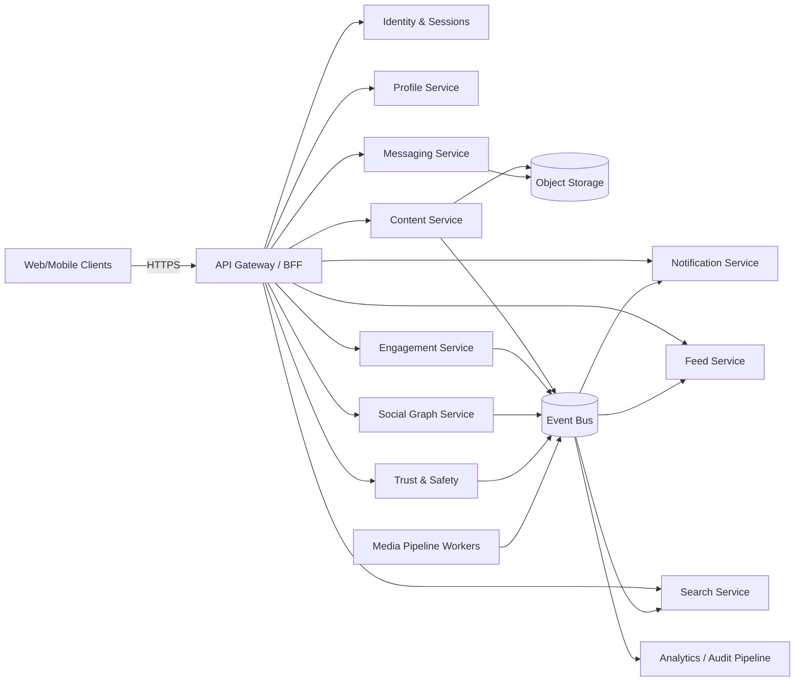
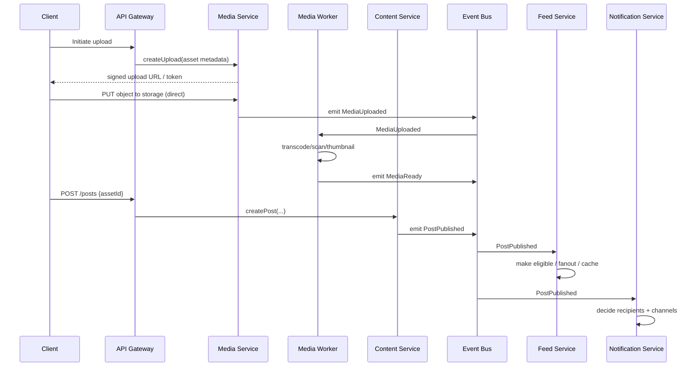
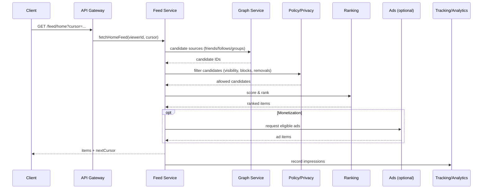
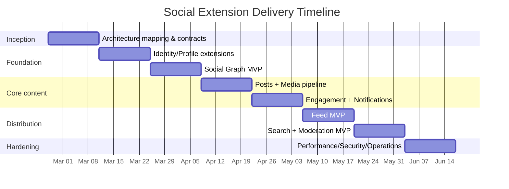

# Extending the Platform with Social Network Modules and Unified Flows

## Executive summary

The attached markdown describes a “Facebook/LinkedIn–class” social platform decomposed into user-facing modules (Identity, Profile, Social Graph, Content+Media, Engagement, Feed, Messaging, Notifications, Search, Communities, Events, Monetization) plus “invisible” platform modules (Privacy/Audience controls, Trust & Safety, Recommendations/ML, Analytics, Admin tools, Infrastructure) and eight core end-to-end flows (onboarding, connect/follow, publish post with media, home feed request, react/comment, messaging, search, report/moderation). fileciteturn0file0

A rigorous extension plan is to treat each module as a bounded context with explicit APIs and event contracts, then implement the end-to-end flows as orchestrated “flows” that compose those modules (as the markdown explicitly suggests via a “Unified Flow System” and new Flow IDs / task types). fileciteturn0file0

Key architectural recommendations:

1. Standardize **HTTP API contracts** using OpenAPI 3.1 (for codegen + contract testing) and JSON Schema 2020-12 (for validation). citeturn3search1turn3search0  
2. Standardize **event envelopes** using CloudEvents 1.0 for interoperability across producers/consumers, and adopt trace propagation via W3C Trace Context. citeturn3search2turn4search0  
3. Standardize **authn/authz** around OAuth 2.0 / OIDC with modern security guidance (RFC 9700), and operationalize fine-grained object-level authorization checks (a highlighted risk in OWASP API Security Top 10). citeturn11search0turn2search0turn0search0turn6search14  
4. Build for **at-least-once delivery** in asynchronous processing, using idempotency and deduplication as first-class patterns (supported both at the HTTP layer via Idempotency-Key draft and at the event layer via Kafka idempotent producer settings or equivalent). citeturn1search1turn10search3  
5. Instrument from day one with **OpenTelemetry** signals and map service health to the SRE “four golden signals” (latency, traffic, errors, saturation) to drive actionable alerting. citeturn0search3turn8search0

Implementation feasibility: an MVP that covers Identity/Profile extensions, Social Graph, Posts+Media, Engagement, Feed serving, Notifications, basic Search, and baseline Moderation typically fits into ~12–16 weeks for a small cross-functional team (backend + frontend + infra), assuming existing identity and media primitives exist and that feed ranking begins with heuristic scoring. This estimate is sensitive to (a) whether messaging is real-time (WebSockets) and (b) whether the feed is precomputed (fan-out on write) versus generated on read. citeturn4search1turn8search15

Coverage map for requested dimensions (where to look in this report):

| Dimension | Where addressed |
|---|---|
| Current platform architecture mapping options | Process and assumptions; Architecture and alternatives |
| Required new features and endpoints | API and data model specifications |
| Data models and schemas (example JSON Schema) | API and data model specifications |
| Storage and retention policies | API and data model specifications; Reliability and security |
| Authentication/authorization changes | API and data model specifications; Reliability and security |
| API contracts (example request/response) | API and data model specifications |
| Integration points with existing services | Architecture and alternatives |
| Event flows and sequence diagrams (mermaid) | Event flows and operations |
| Error handling and retry strategies | Event flows and operations |
| Testing plan (unit/integration/E2E) | Event flows and operations; Implementation plan |
| Deployment plan and rollback | Event flows and operations |
| Monitoring/observability metrics and alerts | Event flows and operations |
| Security/privacy considerations | Reliability and security |
| Performance/scalability estimates | Event flows and operations |
| Effort and timeline (sprints) | Implementation plan and timeline |

## Process described in the attached markdown and explicit assumptions

### What the markdown contributes as requirements

The markdown provides two kinds of requirements that are directly actionable for platform extension:

First, it enumerates the product module boundaries and what they contain (e.g., Social Graph edges with types like FRIEND/FOLLOW/BLOCK, Feed pipeline steps, event-driven Notifications, Media upload pipeline, Moderation workflow). fileciteturn0file0

Second, it specifies a prioritized set of end-to-end flows that define “success” for a social product: onboarding, connections, post publishing (including media readiness), feed request, engagement actions, messaging, search, and report/moderation. fileciteturn0file0

It also proposes an explicit platform integration strategy: map these modules into “skills/microservices” managed by an orchestrator and define new “Flow IDs” and task types (e.g., permissions filtering, social proximity ranking, trust gating, fanout execution), with a “zero breaking” phased rollout. fileciteturn0file0

### Assumptions about “current platform architecture” and mapping options

Because “current architecture” is unspecified, the design below is parameterized. The key mapping decision is: **where do these modules live**—inside an existing monolith, as independently deployable services, or as orchestrated “skills” behind a flow engine (as the markdown hints). fileciteturn0file0

To make that decision, the minimal architecture facts needed (and the mapping choices they influence) are:

- Whether you already operate an API gateway and centralized auth (affects where scopes/policies are enforced). OAuth 2.0 bearer token usage and security guidance assume careful handling at both the gateway and resource servers. citeturn2search3turn0search0  
- Whether you have an event backbone (Kafka/PubSub/SQS/etc.). If you do, CloudEvents is a strong normalization choice. citeturn3search2  
- Whether you already have object storage + CDN + async processing (media pipeline depends on it). fileciteturn0file0  
- Whether you already have a workflow/orchestration primitive (the “Unified Flow System” idea). If yes, implement the major flows as orchestrations; if not, begin with synchronous APIs + async events and add orchestration later. fileciteturn0file0  
- Whether you need federation/interoperability. If federation is a goal, ActivityPub (W3C Recommendation) becomes an architectural alternative for content + notifications delivery. citeturn13search4turn13search0

## Architecture extension and design alternatives

### Reference target architecture for the social extension

A practical target architecture is a set of bounded contexts with clear ownership of data, exposed via a stable HTTP API, and connected via a small set of immutable events (publish/subscribe). OpenAPI provides machine-readable API contracts, and JSON Schema defines data shapes used in requests, responses, and events. citeturn3search1turn3search0

At minimum, the markdown implies these bounded contexts (either as services or modules), because they have distinct workloads and scaling needs: Identity/Sessions; Profile; Social Graph; Content; Media; Engagement; Feed; Messaging; Notifications; Search; Trust & Safety/Moderation; Analytics/Audit. fileciteturn0file0

A component view:



This structure matches the markdown’s event-driven descriptions (MediaReady, PostPublished → feed eligibility, Engagement → notifications, Reporting → moderation queues). fileciteturn0file0

### Alternative architecture options with pros/cons and cost/complexity tradeoffs

The following table compares three viable ways to “extend the platform” while honoring the markdown’s modular boundaries. fileciteturn0file0

| Option | What it is | Pros | Cons | Cost/complexity |
|---|---|---|---|---|
| Modular monolith | Implement modules as internal packages with one DB (or a small number), expose one API | Fastest to ship MVP; simplest ops; easy transactions | Harder to scale hotspots separately (feed, messaging); long-term coupling | Low initial, higher long-term |
| Microservices + event bus | Separate services per bounded context connected by async events | Independent scaling; clear ownership; resilience isolation | Higher operational overhead; distributed tracing required | Medium–high |
| Flow-orchestrated “skills” | Implement modules as skills called by a workflow engine; flows define business processes | Explicit business flows; consistent retries/compensation; aligns with markdown “Flow IDs” | Requires mature orchestration + versioned task contracts; debugging needs strong observability | Medium–high (front-loaded) |

The “flow-orchestrated skills” choice is explicitly suggested by the markdown (new Flow IDs like real-time messaging, search, moderation; new task types like permissions filtering and social proximity rank). fileciteturn0file0

### Feed generation alternatives

Feed is typically the largest cost center (high QPS, personalization, caching). The markdown outlines the pipeline steps: candidate generation → filtering (privacy/blocks/compliance removals) → ranking → re-ranking/diversity → serving/caching. fileciteturn0file0

Three major feed architectures:

| Alternative | Summary | Best when | Tradeoffs |
|---|---|---|---|
| Fan-out on read | Compute candidates and rank at request time | Graph size small/medium; ranking changes often; less write amplification | Higher read latency; expensive peak load |
| Fan-out on write | Precompute per-user timelines at publish time | Many reads per write; strong cacheability | Write amplification proportional to followers; harder recompute |
| Hybrid | Precompute core set + fill with on-read candidates (ads, trending, cold start) | Most real-world cases | Most complex, best balance |

This is not standardized in RFCs; it is an architectural choice driven by traffic/workload distributions and personalization needs. The key “standard” dependency is HTTP caching semantics for any caching layers you apply (RFC 9111). citeturn4search3

### Messaging transport alternatives

If messaging is in scope, you have at least three protocol-level choices:

- WebSockets for real-time bidirectional client/server communication (RFC 6455). citeturn4search1  
- Federation-oriented protocols such as Matrix (open specification) if cross-org federation is required. citeturn13search2  
- XMPP (standards-track RFC 6120) for near-real-time messaging and presence if you want mature federation concepts, acknowledging XML complexity. citeturn13search3

For most product stacks, WebSockets are the pragmatic MVP route and align with the markdown’s “real-time transport” note. fileciteturn0file0turn4search1

## API surface, data models, and contract specifications

### Required new features and endpoints

The markdown implies at least these features and corresponding HTTP endpoints (names are examples; versioning is strongly recommended):

Identity and Profile (extensions to existing):
- `GET /v1/me`
- `GET /v1/profiles/{userId}`
- `PATCH /v1/profiles/{userId}` (consider JSON Patch or Merge Patch if partial updates are common). citeturn5search2turn5search3  

Social Graph:
- `POST /v1/graph/connection-requests`
- `POST /v1/graph/connection-requests/{requestId}:accept`
- `POST /v1/graph/blocks`
- `DELETE /v1/graph/blocks/{userId}`
- `GET /v1/graph/relations?with={userId}`

Content + Media:
- `POST /v1/media/uploads:initiate` (returns signed upload details)
- `POST /v1/posts`
- `GET /v1/posts/{postId}`
- `DELETE /v1/posts/{postId}`

Engagement:
- `PUT /v1/posts/{postId}/reactions/{reactionType}` (idempotent)
- `DELETE /v1/posts/{postId}/reactions/{reactionType}`
- `POST /v1/posts/{postId}/comments`
- `GET /v1/posts/{postId}/comments?cursor=...`

Feed:
- `GET /v1/feed/home?cursor=...`
- `GET /v1/feed/following?cursor=...` (more chronological option, per markdown). fileciteturn0file0

Messaging:
- `POST /v1/conversations`
- `POST /v1/conversations/{conversationId}/messages`
- `GET /v1/conversations/{conversationId}/messages?cursor=...`
- `GET /v1/realtime` (WebSocket upgrade)

Notifications:
- `GET /v1/notifications?cursor=...`
- `POST /v1/notifications/{notificationId}:read`
- `PUT /v1/notification-preferences`

Search:
- `GET /v1/search?q=...&type=people|posts|groups|jobs...` (permissions filter required, per markdown). fileciteturn0file0

Trust & Safety:
- `POST /v1/reports` (report content)
- `GET /v1/moderation/cases/{caseId}` (admin)
- `POST /v1/moderation/cases/{caseId}:action` (admin)

For all endpoints, publish an OpenAPI 3.1 contract and treat it as the source of truth for server/client scaffolding and contract tests. citeturn3search1

### Authentication and authorization changes

A durable approach is:

- Authentication: OAuth 2.0 + OpenID Connect (ID token for identity, access token for API authorization), using Authorization Code + PKCE for public clients. citeturn2search0turn2search2turn11search0  
- Security posture: Apply OAuth 2.0 Security Best Current Practice (RFC 9700) across clients and servers (e.g., avoid deprecated patterns; enforce redirect URI controls; token binding where appropriate). citeturn0search0  
- Token handling: Resource servers accept bearer tokens per RFC 6750, emphasizing protection in transit and storage. citeturn2search3  
- Token revocation/introspection: If you use opaque tokens, add RFC 7662 introspection and RFC 7009 revocation for “logout everywhere” and compromised session response. citeturn11search1turn11search2  
- Step-up auth: For suspicious actions (account recovery, high-risk messaging, admin moderation), consider WebAuthn for phishing-resistant MFA. citeturn11search3turn7search1

Authorization must be **object-level** and **policy-driven**:

- Object-level checks are critical for feed/search/messaging: “can viewer see this post,” “can sender message recipient,” “is this profile field visible.” This maps directly to the markdown’s requirement for “permissions filtering” in search and feed. fileciteturn0file0  
- OWASP highlights broken object-level authorization as a top API risk; treat authorization as a mandatory middleware + service-level invariant. citeturn6search14

### Data models and example JSON Schemas

Below are example JSON Schemas using the JSON Schema 2020-12 dialect (aligns with modern OpenAPI 3.1 usage). citeturn3search0turn3search1

#### Social graph edge schema

```json
{
  "$schema": "https://json-schema.org/draft/2020-12/schema",
  "$id": "https://example.com/schemas/GraphEdge.json",
  "title": "GraphEdge",
  "type": "object",
  "required": ["edgeId", "fromUserId", "toUserId", "kind", "state", "createdAt"],
  "properties": {
    "edgeId": { "type": "string", "format": "uuid" },
    "fromUserId": { "type": "string", "format": "uuid" },
    "toUserId": { "type": "string", "format": "uuid" },
    "kind": {
      "type": "string",
      "enum": ["FRIEND", "FOLLOW", "BLOCK", "MUTED", "RESTRICTED"]
    },
    "state": {
      "type": "string",
      "enum": ["PENDING", "ACTIVE", "REJECTED", "REMOVED"]
    },
    "createdAt": { "type": "string", "format": "date-time" },
    "updatedAt": { "type": "string", "format": "date-time" },
    "metadata": { "type": "object", "additionalProperties": true }
  }
}
```

Graph edge types and their influence on feed audience selection and filtering are explicitly called out in the markdown. fileciteturn0file0

#### Post schema

```json
{
  "$schema": "https://json-schema.org/draft/2020-12/schema",
  "$id": "https://example.com/schemas/Post.json",
  "title": "Post",
  "type": "object",
  "required": ["postId", "authorId", "status", "visibility", "createdAt"],
  "properties": {
    "postId": { "type": "string", "format": "uuid" },
    "authorId": { "type": "string", "format": "uuid" },
    "body": { "type": "string", "maxLength": 20000 },
    "media": {
      "type": "array",
      "items": {
        "type": "object",
        "required": ["assetId", "kind", "status"],
        "properties": {
          "assetId": { "type": "string", "format": "uuid" },
          "kind": { "type": "string", "enum": ["IMAGE", "VIDEO", "DOCUMENT"] },
          "status": { "type": "string", "enum": ["UPLOADING", "PROCESSING", "READY", "FAILED"] }
        }
      }
    },
    "status": { "type": "string", "enum": ["DRAFT", "PUBLISHED", "REMOVED"] },
    "visibility": {
      "type": "object",
      "required": ["scope"],
      "properties": {
        "scope": { "type": "string", "enum": ["PUBLIC", "CONNECTIONS", "FOLLOWERS", "GROUP", "CUSTOM_LIST"] },
        "groupId": { "type": "string", "format": "uuid" },
        "listId": { "type": "string", "format": "uuid" }
      },
      "additionalProperties": false
    },
    "createdAt": { "type": "string", "format": "date-time" },
    "updatedAt": { "type": "string", "format": "date-time" }
  }
}
```

This schema encodes the markdown’s per-post audience controls (public/connections/groups/custom lists) and media readiness lifecycle. fileciteturn0file0

#### CloudEvents-style event envelope schema

Using CloudEvents helps normalize event attributes across services. citeturn3search2

```json
{
  "$schema": "https://json-schema.org/draft/2020-12/schema",
  "$id": "https://example.com/schemas/EventEnvelope.json",
  "title": "EventEnvelope",
  "type": "object",
  "required": ["specversion", "id", "type", "source", "time", "datacontenttype", "data"],
  "properties": {
    "specversion": { "type": "string", "const": "1.0" },
    "id": { "type": "string" },
    "type": { "type": "string" },
    "source": { "type": "string" },
    "subject": { "type": "string" },
    "time": { "type": "string", "format": "date-time" },
    "datacontenttype": { "type": "string", "const": "application/json" },
    "traceparent": { "type": "string" },
    "data": { "type": "object", "additionalProperties": true }
  }
}
```

For `traceparent`, adopt W3C Trace Context so cross-service traces connect through both synchronous calls and async event handlers. citeturn4search0

### Example API contracts with request/response

All examples below assume bearer-token authorization per RFC 6750. citeturn2search3

#### Create a connection request

**Request**
```http
POST /v1/graph/connection-requests
Authorization: Bearer <access_token>
Content-Type: application/json
Idempotency-Key: "8e03978e-40d5-43e8-bc93-6894a57f9324"

{
  "toUserId": "2d3a0b3d-6c9d-44d7-9b2c-3b1f9d3a21ff",
  "message": "Hi — would love to connect."
}
```

The Idempotency-Key header is not yet an RFC in the IETF HTTPAPI working group as of late 2025 (it remains a draft), but it is widely implemented in practice and documented; use it to make POST fault-tolerant. citeturn1search1turn1search4

**Response**
```http
201 Created
Content-Type: application/json

{
  "requestId": "7a54a3da-4c07-4a6f-9e07-5e0d9d3b9c4a",
  "edge": {
    "edgeId": "d0b7687c-6d46-4ef7-b6f2-2f7a6d97b6cb",
    "fromUserId": "b29a8e56-7aa1-4a3e-9a8a-cc9b983b0c54",
    "toUserId": "2d3a0b3d-6c9d-44d7-9b2c-3b1f9d3a21ff",
    "kind": "FRIEND",
    "state": "PENDING",
    "createdAt": "2026-02-25T10:15:30Z"
  }
}
```

#### Publish a post referencing media

Because the markdown describes upload → transcode → MediaReady → publishable post, model this as a two-step process: initiate upload(s), then create the post referencing the resulting assets. fileciteturn0file0

**Request**
```http
POST /v1/posts
Authorization: Bearer <access_token>
Content-Type: application/json
Idempotency-Key: "b4f33f36-dc79-4c03-8e6b-0a2f2acb3a3f"

{
  "body": "New product update — details inside.",
  "media": [
    { "assetId": "3b2a1c6f-8f5a-4c8e-9f0f-2b9e8d0e3e1a" }
  ],
  "visibility": { "scope": "CONNECTIONS" }
}
```

**Response**
```http
201 Created
Content-Type: application/json

{
  "postId": "4a2d9b6e-7c3a-4f8b-9e0a-2c7d8e9f0a1b",
  "status": "PUBLISHED",
  "createdAt": "2026-02-25T10:18:02Z"
}
```

### Storage, indexing, and retention policies

A social extension introduces multiple data classes with different retention and compliance needs. GDPR’s storage limitation principle requires personal data be kept no longer than necessary for the purpose, with defined deletion/review windows. citeturn6search3turn6search7

A pragmatic baseline policy matrix (tune per jurisdiction and product needs):

| Data class | Suggested primary store | Index/caches | Retention baseline | Notes |
|---|---|---|---|---|
| Profiles, graph edges, posts, comments | Relational DB (strong consistency) | Search index for discovery | Until user deletes / account closure + grace period | Per-field privacy controls must be enforced at read time. fileciteturn0file0 |
| Media binaries | Object storage + CDN | Derived thumbnails/transcodes | Tied to content retention; purge on delete | Media pipeline emits readiness events. fileciteturn0file0 |
| Feed materializations | KV / cache + optionally DB | Per-user feed cache | Short (hours–days) | Treat as derived data; can be rebuilt. fileciteturn0file0turn4search3 |
| Notifications | DB + push provider | Client cache | Medium (30–180 days) | Built from events; dedupe required. fileciteturn0file0 |
| Messages | DB optimized for append + partitions | Search-in-chat index (optional) | Product-defined; often long-lived | Real-time transport via WebSockets; encryption-in-transit via TLS. citeturn4search1turn3search3 |
| Moderation cases, audit logs | WORM-like audit store | Admin search | Longer (1–7 years) per policy | Separate retention justification; access-controlled. fileciteturn0file0turn6search3 |
| Analytics events | Event warehouse | Aggregations | Often 13–25 months | Consider pseudonymization/minimization for privacy. citeturn6search4turn6search3 |

## Event flows, error handling, testing, deployment, and observability

### Canonical event types

The markdown implicitly defines several events that should become explicit contracts:

- `MediaUploaded`, `MediaProcessingFailed`, `MediaReady`
- `PostPublished`, `PostRemoved`
- `ReactionAdded`, `ReactionRemoved`, `CommentAdded`
- `GraphEdgeCreated`, `GraphEdgeActivated`, `GraphEdgeRemoved`
- `ReportCreated`, `EnforcementActionApplied`
- `NotificationEnqueued`, `NotificationSent` fileciteturn0file0

Normalize these events with CloudEvents so consumers can rely on a stable envelope regardless of the producer module. citeturn3search2

### Sequence diagrams for key flows

#### Publish post with media readiness and feed eligibility



This reflects the markdown’s “upload → transcode → MediaReady” and “PostPublished → Feed eligible, Notifications may notify followers” descriptions. fileciteturn0file0

#### Home feed request pipeline



This is the pipeline explicitly described in the markdown (candidate generation, filtering, ranking, re-ranking/diversity, serving, and recording impressions). fileciteturn0file0

### Error handling and retry strategies

#### HTTP error format and semantics

Use RFC 9457 “Problem Details for HTTP APIs” for consistent machine-readable errors (obsoletes RFC 7807). citeturn0search1

A standard pattern:

- 4xx for client faults (validation, authz, rate-limits)
- 5xx for server faults (dependency failures, overload)
- Include correlation IDs and trace context in headers (W3C Trace Context) for debugging distributed flows. citeturn0search1turn4search0

Rate limiting and overload:
- Use 429 (RFC 6585) for rate limiting; include `Retry-After` when possible. citeturn12search0turn8search3  
- Use 503 (RFC 9110) for temporary overload; optionally include `Retry-After`. citeturn8search3

#### Idempotency and deduplication

Because clients often retry after timeouts, make write endpoints safe:

- Prefer idempotent methods where possible (PUT/DELETE semantics are defined as idempotent in HTTP; POST is not). citeturn1search20turn8search3  
- Support idempotency keys for POST/PATCH to ensure single effect across retries (IETF draft work exists; browser documentation is available). citeturn1search1turn1search4  
- For event-driven consumers, assume at-least-once delivery and implement deduplication keys at handler boundaries.

If using Kafka-like infrastructure, enabling producer idempotence is one route to avoiding duplicates at the log level (`enable.idempotence=true` ensures one copy written even with retries, under required settings). citeturn10search3

### Testing plan

A rigorous test strategy maps to the major “flows” in the markdown (not just unit correctness). fileciteturn0file0

- Unit tests: domain invariants (graph state transitions; visibility rules; reaction idempotency; notification dedupe).  
- Contract tests: validate all endpoints against OpenAPI 3.1 schemas; validate payloads against JSON Schema 2020-12. citeturn3search1turn3search0  
- Integration tests: service-to-service paths with real persistence and an ephemeral event bus; ensure CloudEvents envelopes round-trip correctly. citeturn3search2  
- End-to-end tests: cover the eight highlighted flows (onboarding → usable feed; connect → notification; publish → appears in feed; react/comment → notification; search respects permissions; report → moderation action). fileciteturn0file0  
- Load and resilience tests: especially for feed endpoints and messaging send/receive; chaos testing for event consumer retries and DLQ routes.

### Deployment plan and rollback strategy

Use staged rollouts plus fast rollback for service changes:

- For Kubernetes deployments, use native rollout/rollback mechanisms (e.g., `kubectl rollout undo`) and keep deployments declarative. citeturn8search2turn8search15  
- For database schema evolution, use expand/contract migrations and keep backward compatibility across at least one release (so rollback is feasible without data loss).  
- Feature flags: ship code dark, enable flows gradually (aligns with the markdown’s “zero breaking” phased approach). fileciteturn0file0  
- Event versioning: version event `type` and/or embed a schema version in `data`; run dual consumers during migrations.

### Monitoring and observability metrics and alerts

Instrumentation:
- Use OpenTelemetry for traces/metrics/log correlation and propagate trace context via `traceparent`. citeturn0search3turn4search0

Service health model:
- Track SRE “four golden signals” (latency, traffic, errors, saturation) at gateway and per-service boundaries. citeturn8search0

High-value alerts (examples):
- Feed p95/p99 latency regression; increased 5xx rate.
- Event bus consumer lag (feed fanout, notifications) and DLQ growth.
- Media pipeline failure rate (transcode errors) and time-to-ready.
- Auth anomalies: spike in failed logins, token introspection failures.
- Moderation backlog: open cases older than SLA, enforcement action error rate.

Where possible, couple alert thresholds to SLO burn-rate alerting concepts rather than static thresholds. citeturn8search1

## Reliability, security, privacy, and compliance considerations

### Security baseline

Authn/authz:
- Implement OAuth 2.0 and OIDC correctly; apply RFC 9700 best current practices. citeturn11search0turn2search0turn0search0  
- Use PKCE for public clients. citeturn2search2  
- Protect bearer tokens from disclosure (RFC 6750 explicitly highlights this concern). citeturn2search15  
- Consider token revocation (RFC 7009) and introspection (RFC 7662) for incident response and logout semantics. citeturn11search2turn11search1  
- For higher-risk operations, consider WebAuthn and align authenticator management with modern NIST guidance (SP 800-63B-4). citeturn11search3turn7search1

Transport security:
- Require TLS 1.3 for client/server communication where feasible (standardized in RFC 8446). citeturn3search3

API security risks:
- Treat OWASP API Security Top 10 (2023 edition) as an engineering checklist, especially object-level authorization and unrestricted resource consumption. citeturn6search17turn6search2

### Privacy, storage limitation, and retention controls

Retention:
- Establish explicit retention windows and deletion guarantees; storage limitation is a GDPR principle and EU guidance emphasizes storing data for the shortest time possible given purpose and legal obligations. citeturn6search3turn6search7  
- Apply data minimization: only collect/store what you need for the feature (Article 5(1)(c) concept is widely explained by regulators). citeturn6search4

Deletion semantics:
- Support account deletion/deactivation and cascading removal or anonymization of dependent objects (posts, comments, edges). The markdown includes account deletion/deactivation as part of identity modules. fileciteturn0file0  
- For derived data (feeds, caches, search indexes), define eventual deletion SLAs and reconciliation jobs.

## Implementation plan, effort estimate, and sprint timeline

### Work breakdown aligned to the markdown’s “flows”

The markdown’s recommendation to define flows (e.g., onboarding, messaging, search, moderation) is an effective way to structure delivery: each sprint should ship at least one end-to-end flow slice across UI/API/storage/events. fileciteturn0file0

### Estimated effort

Because platform details are unspecified, the estimate is expressed as ranges:

- MVP scope (Profile + Graph + Posts/Media + Engagement + Feed serving + Notifications + basic Search + basic Reports/Moderation): ~3–5 backend engineers + 1–2 frontend engineers + 1 infra/SRE over ~12–16 weeks.  
- Adding real-time messaging with WebSockets and spam controls: add ~4–6 weeks depending on existing realtime infrastructure. WebSockets are standardized but operationally non-trivial at scale. citeturn4search1  
- Adding ML ranking platform integration (feature store + online inference) typically becomes a parallel track after heuristic ranking stabilizes (the markdown isolates “Recommendations & ML platform” as its own module). fileciteturn0file0

### Sprint plan

Assuming 2-week sprints:

| Sprint | Primary deliverable | Key components |
|---|---|---|
| Inception | Architecture mapping + contracts | OpenAPI/JSON Schema baseline; CloudEvents envelope; auth scopes |
| Foundation | Identity/Profile extensions | Profile schemas; privacy per field; audit logging |
| Graph | Social graph MVP | Requests/accept/block; graph events; “people you may know” stub |
| Content and media | Posts + media pipeline | Upload initiation; MediaReady events; PostPublished |
| Engagement and notifications | Reactions/comments + notifications | Idempotent reactions; CommentAdded; notification routing/dedupe |
| Feed MVP | Home feed serving | Candidate gen + filtering + simple ranking; impression tracking |
| Search and moderation | Search + report/moderation MVP | Permissions filtering; report case workflow; enforcement actions |
| Hardening | Performance, security, ops | Load tests; SLOs/alerts; rollback drills; privacy review |

A timeline view:



This sequencing mirrors the markdown’s suggested priorities (identity/profile first, graph as a dependency for search/messaging, moderation as protective layer as content scales). fileciteturn0file0