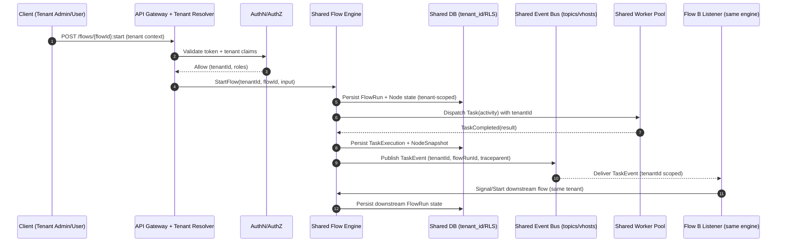
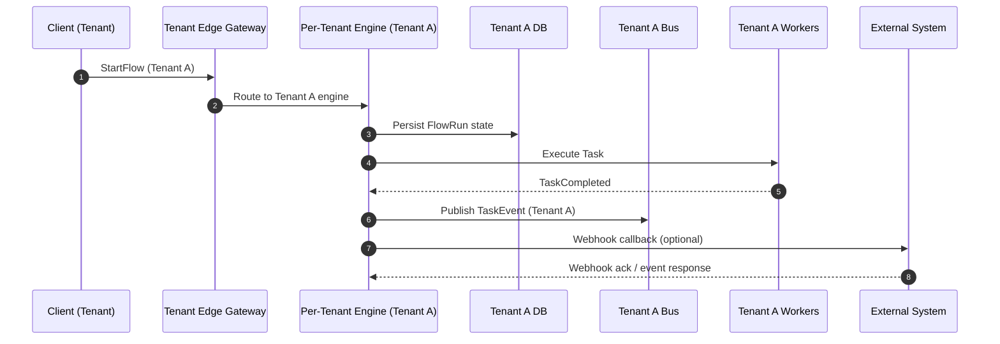
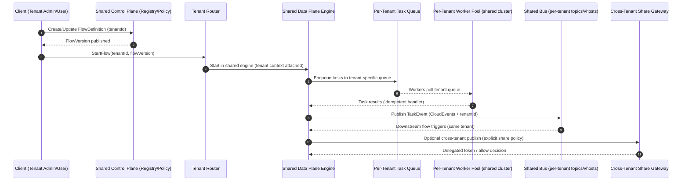

# Adapting a Workflow Engine to a Multi‑Tenant Architecture for Task‑Execution Communication

## Executive summary

A multi‑tenant workflow/flow engine has two simultaneous goals: (a) **provide programmable automation** (flows that orchestrate tasks and communicate their results) and (b) **behave like a reliable SaaS substrate** (strong tenancy boundaries, fair sharing, observability, and operability). The architectural center of gravity is a **control plane / data plane split**, with explicit tenant resolution, policy enforcement, and cost controls in the control plane, and tenant‑aware execution, messaging, and persistence in the data plane. This “bridge/hybrid” approach is widely recommended in SaaS guidance because it lets you combine shared efficiency (pool) with dedicated isolation (silo) where required. citeturn9search0turn9search4turn9search21

For most SaaS workflow engines, the recommended default is a **shared engine (pooled runtime)** with **hard guardrails**: tenant‑scoped authorization, data partitioning (often with database‑enforced policies such as row security), per‑tenant quotas, and tenant‑labeled telemetry. Kubernetes documents these multi‑tenancy challenges explicitly—sharing clusters can reduce cost/ops overhead but raises risks around security, fairness, and noisy neighbors—so the burden shifts to isolation controls like namespaces, RBAC, resource quotas, network policies, and optionally node isolation for stronger separation. citeturn0search0turn0search4turn4search3turn9search3

For workflow engines that need strong at‑scale isolation, it is useful to mimic the isolation primitives of modern orchestrators:

- **Temporal** uses **Namespaces** as a unit of isolation and recommends multi‑tenant patterns such as “task queues per tenant” for scale; it also provides cross‑namespace connectivity via Nexus when you need durable calls across isolated boundaries. citeturn0search5turn0search9turn0search1turn0search29  
- **Apache Kafka** documents multi‑tenancy controls around **client quotas** and broker‑side limits to allocate resources fairly across principals in shared clusters. citeturn0search2  
- **RabbitMQ** documents multi‑tenancy via **virtual hosts**, with permissions scoped per vhost to isolate message topologies (queues/exchanges/bindings). citeturn0search3turn0search7  
- **Argo Workflows** aligns tenant enforcement with Kubernetes primitives; workflow pods run under a service account, and RBAC boundaries are central to limiting what workflows can do in the cluster. citeturn1search4

A critical product requirement in workflow systems is long‑running, multi‑session execution with user interaction and progress visibility. Your uploaded design notes emphasize this as an engine‑level primitive (a universal “Human Interaction Gate” / user task registry, durable state, dependency scheduling, per‑node runtime status with drill‑downs, and group‑assignable human tasks). fileciteturn0file0 This fits naturally into multi‑tenancy if every runtime artifact (runs, node snapshots, user tasks, notifications) is **tenant‑scoped** and every interaction is authorized at both tenant and object level.

## Scope and explicit assumptions

This report assumes a general “workflow engine” that stores flow definitions, executes DAG/state‑machine workflows, dispatches tasks to workers, and emits task/run events to other flows and external systems. It also assumes a multi‑tenant SaaS posture (multiple customer organizations in one platform) consistent with common multitenant solution guidance. citeturn9search1turn9search0

Because scale, compliance, and isolation targets are unspecified, the analysis uses explicit assumptions (you should adjust and re‑run the decision logic if your realities differ):

- **Tenants and workload scale**: 100–10,000 tenants; median concurrency low, tail tenants high and bursty; workflows span seconds to days (durable execution). (If you have <50 high‑value tenants with strict isolation, per‑tenant engines become more realistic; this matches “namespace per tenant” guidance in Temporal where per‑tenant namespaces are only practical at low tenant counts.) citeturn0search9turn0search13  
- **Isolation level**: default is “soft multi‑tenancy” (logical isolation with shared infra), with “hard multi‑tenancy” options (dedicated nodes, dedicated schema/DB, or dedicated clusters) for regulated/enterprise tenants. Kubernetes explicitly frames this as a spectrum, where stronger isolation can include node isolation to prevent co‑mingling. citeturn0search0turn9search3  
- **Inter‑flow communication**: primary pattern is event‑driven (pub/sub or queue), with optional direct RPC for low‑latency orchestrations and webhooks for external integrations; message envelopes carry correlation identifiers and trace context. (CloudEvents is used as a neutral baseline event format.) citeturn1search3turn1search27turn3search2  
- **Identity**: OAuth 2.0 + OpenID Connect for authentication/authorization and SCIM for enterprise provisioning. citeturn2search0turn2search1turn3search0turn3search1  
- **Observability**: OpenTelemetry for traces/metrics/logs with OTLP export and W3C Trace Context propagation. citeturn1search2turn3search2turn1search26  
- **Security baseline**: encryption at rest and in transit, tenant‑aware secrets separation, and defense‑in‑depth controls against cross‑tenant access and noisy neighbors. Kubernetes documents envelope encryption using a KMS provider (unique data key per resource) as one concrete implementation approach. citeturn4search2turn4search6

## Architecture option space and tenant models

### Tenant data models: shared schema, isolated schema, hybrid

Tenant models map to the widely used pool/silo/bridge framing:

- **Shared schema (pooled)**: one DB/schema with `tenant_id` on every row; strong enforcement is required (e.g., database row security policies, tenant‑scoped caches and indexes). PostgreSQL row security policies (enabled per table and enforced by policies) are a common “defense‑in‑depth” tool so forgotten filters do not leak data. citeturn3search3turn3search14turn3search7  
- **Isolated schema (often “bridge”)**: tenants share a DB instance but have separate schemas (or separate databases) to simplify restore, blast‑radius reduction, and sometimes compliance controls; AWS and Azure both describe hybrid models where some layers are pooled and others are isolated per tenant tier. citeturn9search4turn9search8turn9search5  
- **Hybrid (bridge)**: a deliberate mix—e.g., pooled control plane and shared runtime for most tenants, with “graduation” to separate schemas/DBs or dedicated compute for premium tenants. AWS SaaS guidance explicitly describes the bridge model as combining silo and pool where it makes sense by layer. citeturn9search4turn9search0  

### Compute and network tenancy models: pooled vs dedicated

Kubernetes provides a useful reference for compute/network multi‑tenancy because it forces you to decide where boundaries live:

- **Pooled cluster + namespaces per tenant** is common, but you must add RBAC, ResourceQuota, LimitRange, and NetworkPolicy to avoid both security and fairness issues. citeturn0search0turn0search4turn5search1turn4search3  
- **Node isolation** (dedicate nodes to a tenant; prevent co‑mingling) is explicitly documented as a technique to reduce noisy‑tenant impact. citeturn9search3turn4search7  
- **Per‑tenant clusters** provide strong process/network isolation at high cost and high operational overhead; SaaS guidance treats this as a silo model and typically couples it with shared onboarding and identity so it remains SaaS rather than “managed service.” citeturn9search0  

### Comparison table of architecture options

The table below focuses on workflow engines that must support flow‑to‑flow communication of task execution events (internal and external), including cross‑tenant sharing, and assumes you will run on Kubernetes or an equivalent scheduler (even if serverless is part of the topology). Kubernetes multi‑tenancy concerns (security/fairness/noisy neighbors) and SaaS pool/silo/bridge tradeoffs are used as baselines. citeturn0search0turn9search0turn9search4

| Architecture option | Tenant model & topology | Pros | Cons / risks | Complexity | Cost profile | Recommended use cases |
|---|---|---|---|---|---|---|
| Shared engine + shared schema (“pooled everything”) | One scheduler/orchestrator; one DB schema with `tenant_id`; shared worker pool; shared messaging | Lowest infra cost; simplest onboarding; best aggregate utilization | Highest blast radius if tenant scoping fails; hardest to debug cross‑tenant leaks; must be excellent at quotas/limits to prevent noisy neighbors | Medium–High (policy discipline) | Low | Many small/medium tenants; fast iteration; when you can invest heavily in guardrails and automated testing |
| Shared engine + isolated schemas (“bridge data”) | Shared control plane + runtime; schema‑per‑tenant or DB‑per‑tenant; shared workers; shared messaging with logical isolation | Better data isolation, simpler per‑tenant restore; reduces some cross‑tenant query risks | Schema/DB sprawl; connection pool/routing complexity; migrations become more operationally heavy | High | Medium | Tenants with contractual restore needs; moderate compliance; “tiered isolation” product strategy |
| Shared control plane + per‑tenant execution partitions (“hybrid runtime”) | Shared flow registry/management; per‑tenant task queues + worker pools; optional dedicated nodes; shared messaging logical isolation | Scales to many tenants while mitigating noisy neighbor effects; can “graduate” tenants into dedicated compute | Requires sophisticated scheduling, quotas, admission controls, and metering | High | Medium | Most SaaS workflow platforms; aligns with Temporal “task queues per tenant” guidance and Kubernetes node isolation patterns citeturn0search9turn9search3 |
| Per‑tenant engine instances in one cluster (“silo runtime, shared cluster”) | Dedicated engine deployment per tenant; namespaces; optional dedicated DB/schema | Stronger runtime isolation and simpler per‑tenant tuning | Many engine instances to operate; upgrades more complex; still share control plane unless clusters are isolated | High | Medium–High | Small number of high‑value tenants; tenants require custom policies/versions; regulated workloads without full dedicated clusters |
| Per‑tenant clusters (“full silo”) | Cluster per tenant; DB per tenant; messaging per tenant | Strongest compute/network isolation; minimizes cross‑tenant impact | Expensive; heavy ops unless fully automated; harder global analytics and fleet management | Very High | High | Regulated / “bring your own cluster” / strict residency; very few tenants; premium pricing |
| Serverless execution pods/functions (“serverless data plane”) | Shared control plane; tasks run in ephemeral isolates; data isolation via per‑tenant storage/keys | Elastic burst handling; can isolate compute per invocation; pay‑per‑use | Cold starts; debugging distributed runs; state management still needed; vendor‑specific constraints | Medium–High | Variable | Spiky workloads; short tasks; complement to durable orchestrator rather than a replacement |

## Execution, communication, and routing design

### Data partitioning and routing

Tenant‑aware routing must be consistent across **every plane**: API ingress, workers, message consumers, caches, indexes, and telemetry. The most common failure mode in multi‑tenant systems is a missing or inconsistent tenant scope on one path, which can become a cross‑tenant data leak; OWASP highlights “broken object level authorization” as a top API risk precisely because object identifiers are easy to manipulate and require explicit access checks. citeturn2search2turn2search6

A robust routing strategy typically includes:

- **Tenant resolution** at the edge based on stable identifiers (host/subdomain, explicit tenant header, or token claims), followed by a strict “tenant context” object propagated through the call graph. (In distributed tracing, W3C Trace Context standardizes propagation of trace identifiers in `traceparent` / `tracestate`; tenant context can be injected into structured logs and as bounded baggage, but you must avoid leaking sensitive data in propagated headers.) citeturn3search2turn1search6  
- **Deterministic database routing**: shared schema (tenant_id partition key and optional DB enforcement like row security policies), schema mapping (tenant→schema), or DB mapping (tenant→database). PostgreSQL documentation describes how row security policies are created and enabled per table (defense‑in‑depth against missed filters). citeturn3search3turn3search14  
- **Deterministic message routing**: per‑tenant topics/consumer groups (Kafka), per‑tenant vhosts (RabbitMQ), or per‑tenant queue names. Kafka’s multi‑tenancy operations guidance emphasizes client quotas as a practical tool to allocate resources across tenants/principals. RabbitMQ’s docs describe vhosts as a logical grouping that owns exchanges/queues/bindings/permissions. citeturn0search2turn0search3turn0search7  

### Task execution models and when they fit

A multi‑tenant workflow engine almost always needs **multiple execution models**:

- **Synchronous (request/response)** is best for short tasks (validation, routing decisions, small DB operations) where latency matters and timeouts are bounded; it is also easier to reason about in cross‑tenant delegation because the “actor” is the request principal. (OAuth 2.0 and OpenID Connect define the baseline framework for authorization and authentication in these flows.) citeturn2search0turn2search1  
- **Asynchronous job dispatch** is best for long tasks, external I/O, polling, retries, and backoff. This is also the dominant model for human‑in‑the‑loop gates and “leave now / come back later” semantics highlighted in your design notes. fileciteturn0file0  
- **Event‑driven orchestration** is best when flows must communicate task execution state across services/flows without tight coupling. CloudEvents defines a standard envelope so producers/consumers can interoperate with consistent required attributes (for example, `specversion`, `type`, `source`, and `id` are required by the spec). citeturn1search3turn1search27  

Temporal’s documentation is instructive here because it treats workflows as long‑lived, stateful entities that communicate via **Signals (async), Queries (read), and Updates (sync write)**; it also explicitly notes that workflows can communicate with other workflows through signals. citeturn6search3turn6search11turn6search15

### Inter‑flow communication patterns

The engine should support multiple communication patterns, but you should standardize on one “primary” pattern (usually event‑driven) and treat others as specialized tools.

**Pub/Sub (topic‑based)**  
Use when multiple downstream flows/services may consume task events independently (fan‑out). Kafka supports multi‑tenant clusters and strongly emphasizes quotas for fair allocation. citeturn0search2

**Message queues (work queues)**  
Use when exactly one consumer group should process a task event (work stealing) and you need backpressure and explicit work distribution. RabbitMQ’s vhosts and access control model are useful for tenant separation (and operationally simpler than per‑queue ACL sprawl). citeturn0search3turn0search7

**Direct RPC (synchronous orchestration)**  
Use when a flow must synchronously request an action from another flow/service (strong coupling, but useful for “orchestrator calls executor” or strict consistency requirements). Temporal’s “Updates must be synchronous” model illustrates the semantics you are effectively implementing if you offer a synchronous flow‑to‑flow call. citeturn6search3

**Webhooks (outbound integration)**  
Use for external systems that expect callbacks. OpenAPI 3.1+ includes a first‑class `webhooks` field, enabling standardized documentation of outbound webhook payloads and expectations. citeturn6search4turn6search0

### Cross‑tenant flows and safe sharing

Cross‑tenant flows are dangerous by default: they combine the blast radius of shared runtimes with the trust boundary crossing of external integrations. “Safe sharing” requires making cross‑tenant behavior explicit, auditable, and revocable, and it should be treated as a product feature rather than an incidental capability.

A reference model:

- **Default deny**: flows run within a tenant boundary; cross‑tenant access is impossible unless explicitly granted.  
- **Sharing via a controlled surface**: a “shared resource” (flow template, connector config, dataset, or event stream) can be published by a provider tenant and subscribed/instantiated by a consumer tenant. The sharing manifests as a contract + ACL + metering.  
- **Cross‑tenant delegation standardization**: if Tenant A authorizes Tenant B (or a delegated app) to start or signal a workflow, use an authorization standard designed for delegation. OAuth 2.0 Token Exchange (RFC 8693) defines a protocol for exchanging tokens via an authorization server acting as an STS, and is commonly used for “on‑behalf‑of” and delegation patterns. citeturn2search9turn2search13  
- **Durable cross‑namespace calls in workflow engines**: Temporal’s Nexus is designed to connect Temporal applications across isolated namespaces, illustrating how to build cross‑boundary calls while preserving durable execution properties and auditability. citeturn0search29

### Resource quotas and fair scheduling

Fairness is a multi‑layer concern:

- **Cluster (compute) fairness**: Kubernetes explicitly provides namespace‑scoped ResourceQuota and LimitRange to constrain resource consumption; Pod priority and preemption provide a mechanism for prioritizing critical workloads when resources are constrained. citeturn0search4turn5search1turn5search2  
- **Control plane fairness**: Kubernetes API Priority and Fairness (APF) uses request classification and fair queuing so a poorly behaved client/controller does not starve others. This is a useful analogy for “engine API fairness” and is directly relevant if you operate shared control planes. citeturn6search2turn6search14  
- **Messaging fairness**: Kafka’s official multi‑tenancy ops guidance focuses on per‑principal quotas as a pragmatic tool for allocating broker CPU/bandwidth across tenants. citeturn0search2  
- **Workflow runtime fairness**: Cadence’s multi‑tenant work at Uber and Cadence community discussions emphasize resource isolation as a pressing multi‑tenant challenge; production systems often need soft quotas, prioritization, and graceful degradation to prevent one tenant/domain from destabilizing the cluster. citeturn7search18turn1search17  

Your uploaded notes propose engine‑level primitives aligned with this framing: dependency‑aware scheduling, non‑blocking branches, human gates that only block dependent paths (not the entire run), and group‑assignable user tasks with claiming/quorum options. fileciteturn0file0

### Mermaid sequence/flow diagrams for three patterns

The diagrams below show (a) task execution and (b) inter‑flow communication using an event bus, including tenant routing and tenant‑scoped authorization.

## Tenant‑aware identity, authorization, and delegation

### Authentication and per‑tenant authorization

A multi‑tenant workflow engine should treat “tenant context” as a first‑class security attribute from the moment a request enters the system:

- **Authentication**: OpenID Connect extends OAuth 2.0 for authentication and uses claims to convey identity information; it is a common standard choice for SaaS. citeturn2search1turn2search22  
- **Authorization**: OAuth 2.0 provides the baseline framework for limited access tokens, and RFC 6750 describes bearer token usage and related threats (e.g., token replay and token redirect), which matters when you have cross‑service components and multi‑tenant gateways. citeturn2search0turn6search1  
- **Enterprise provisioning**: SCIM defines standard schemas (RFC 7643) and a REST protocol (RFC 7644) for user/group provisioning in enterprise‑to‑cloud scenarios. citeturn3search0turn3search1  

Per‑tenant RBAC typically forms the core authorization model, but workflow engines often need richer policy because “flows can do things” (create resources, call connectors, emit webhooks). Consider a layered model:

- **RBAC for control plane** (who can author/publish/start/cancel flows; who can manage connectors, secrets, quotas).  
- **ABAC/policy for data plane actions** (what integrations a flow can call; what networks it can reach; what Kubernetes APIs it can touch, etc.). Argo Workflows’ RBAC guidance emphasizes that workflow pods run with a service account and the account must have only the needed privileges; it explicitly warns against using a shared default service account in production. citeturn1search4  

### Cross‑tenant delegation patterns

Cross‑tenant operations should use explicit delegation semantics:

- **Token Exchange (RFC 8693)**: standardized way to exchange an incoming token for another token under different audience/scope/subject constraints via an authorization server (STS). This directly supports “Tenant A allows Tenant B app to act on A’s resources” while keeping scope narrow and auditable. citeturn2search9turn2search13  
- **Delegation boundaries in workflow engines**: Temporal provides namespace isolation and also offers Nexus for durable execution across isolated namespaces, which gives an example of cross‑boundary connectivity that preserves debugging and fault isolation properties. citeturn0search5turn0search29  

## Recommended data models and API contracts

### Canonical entity model

A tenant‑aware workflow engine benefits from a small set of stable, well‑typed core records, plus extensibility for node/task payloads:

- **Tenant**: `tenantId`, tier (pool/bridge/silo), region/residency flags, quota profile, KMS/key profile, allowed connectors/policies.  
- **Principal**: user/service identity with tenant membership, roles/groups (often SCIM backed). citeturn3search0turn3search1  
- **FlowDefinition**: immutable versions (content‑addressed), published by tenant, with policy metadata (required approvals, connectors used, resource budgets).  
- **FlowRun**: execution instance with status, timestamps, policy snapshot, correlation info.  
- **NodeRun / TaskExecution**: per node/task runtime records; include idempotency and retry metadata.  
- **Event**: task/run events emitted for inter‑flow and external communication, using a standard envelope (CloudEvents) plus tenant scoping. citeturn1search3turn1search27  

For long‑running execution with user interaction and progress, your notes propose an engine primitive for human gates and a persisted “UserTask” record that includes context snapshots, trace IDs, and assignment policies (user/group/role/quorum) with optional claiming. fileciteturn0file0 This is consistent with treating human input as a first‑class event in the workflow system.

### Event envelope and task events

Use **CloudEvents 1.0** for all inter‑flow task/run events. It provides a documented set of required attributes and a consistent JSON structure, improving interoperability across message buses and webhook sinks. citeturn1search3turn1search27

Recommended extensions (engine‑specific, but disciplined):

- `tenantid` (explicit tenant scope; do not rely only on topic naming)
- `flowrunid`, `nodeid`, `taskexecutionid`
- `correlationid` / `traceparent` (W3C Trace Context)
- `subject` to indicate the logical resource (e.g., `flows/{flowId}/runs/{runId}`)

W3C Trace Context gives standardized headers/fields (`traceparent`, `tracestate`) for correlating distributed operations, and OTLP specifies transport/encoding for exporting telemetry (so your engine can attach tenant labels and trace IDs). citeturn3search2turn1search2

### Tenant‑aware APIs

Below is a compact contract sketch (illustrative) that emphasizes tenant scoping, idempotency, auditability, and consistent errors.

**Start a flow run**

- `POST /v1/tenants/{tenantId}/flows/{flowId}:start`
- Headers:
  - `Authorization: Bearer …` (RFC 6750 bearer usage) citeturn6search1turn6search9  
  - `Idempotency-Key: …` (IETF draft exists for standardizing this header; it is specifically intended to make non‑idempotent methods like POST fault‑tolerant). citeturn7search3turn7search7  
- Response: `201 Created` with `flowRunId`, status, and trace identifiers.

**Emit a task event (internal)**
- `POST /v1/tenants/{tenantId}/events` with CloudEvents payload.
- Server validates: tenant scope, producer identity, schema constraints, quotas/rate limits.

**Flow run graph/progress**
- `GET /v1/tenants/{tenantId}/runs/{flowRunId}/graph`
- Returns nodes with status (`PENDING/READY/RUNNING/WAITING_FOR_USER/BLOCKED/SUCCEEDED/FAILED/SKIPPED`) and progress details, matching your “visual runtime state layer” requirement. fileciteturn0file0  

**Human task lifecycle**
- `GET /v1/tenants/{tenantId}/user-tasks?runId=…`
- `POST /v1/tenants/{tenantId}/user-tasks/{taskId}:claim`
- `POST /v1/tenants/{tenantId}/user-tasks/{taskId}:answer`

**Error model**
- Use RFC 7807 “Problem Details for HTTP APIs” for consistent machine‑readable errors. citeturn5search3  

## Observability, security, and operations

### Multi‑tenant observability design

A multi‑tenant workflow engine needs tenant‑aware observability in all three signals: logs, metrics, traces. OpenTelemetry defines the core approach and OTLP defines stable encoding/transport for traces/metrics/logs between SDKs, collectors, and backends. citeturn1search26turn1search2turn1search10

Recommended practices:

- **Tenant labels everywhere**: include `tenant.id`, `flow.id`, `flowrun.id`, `taskexecution.id` in logs/metrics/traces.  
- **Trace propagation using W3C Trace Context**: standardize on `traceparent` / `tracestate` at ingress and for message deliveries. citeturn3search2turn3search13  
- **Baggage discipline**: OpenTelemetry warns that baggage is propagated in HTTP headers and can be visible to intermediaries and downstream services; do not propagate secrets or sensitive tenant data (PII) via baggage. citeturn1search6  
- **Per‑tenant SLOs and cost attribution**: quotas and fairness controls only work operationally if you can measure per‑tenant consumption (CPU time, queue depth, task retries, message publish rates, etc.). Kafka and Kubernetes explicitly frame quotas as tools to allocate shared resources fairly and prevent abuse/noisy neighbors. citeturn0search2turn0search4turn0search0  

### Security architecture and tenant isolation

**Data isolation**
- Shared schema: enforce tenant scoping in every query; consider DB‑enforced row security policies so policies apply even if application code misses a filter. PostgreSQL documents how to enable row security and create policies. citeturn3search3turn3search14  
- Isolated schema / DB per tenant: reduces some cross‑tenant query risk but introduces schema sprawl and migration/automation complexity; this is the “bridge/silo by tier” tradeoff described in SaaS guidance. citeturn9search4turn9search0  

**Compute isolation**
- In shared clusters, use namespace isolation plus quotas/limits and pod security policies. Kubernetes provides ResourceQuota and LimitRange for resource constraints, and Pod Security Standards for defining isolation/security profiles. citeturn0search4turn5search1turn5search0  
- For stronger isolation, use node isolation (dedicated node pools per tenant) as described in Kubernetes multi‑tenancy docs. citeturn9search3turn4search7  

**Network isolation**
- NetworkPolicies constrain pod ingress/egress at L3/L4; Kubernetes documents NetworkPolicy as the mechanism to control traffic flow (subject to CNI enforcement). citeturn4search3  

**Secrets management and tenant‑aware keying**
- Encrypt secrets at rest and ensure per‑tenant separation of secret material. Kubernetes documents envelope encryption via a KMS provider: Kubernetes encrypts resources using a data key and then encrypts that key using a managed encryption service, with a unique data key per resource. citeturn4search2turn4search6  
- For cryptographic primitives and key management practices, use NIST references: AES is standardized in FIPS 197 and key management guidance is in NIST SP 800‑57 Part 1. citeturn4search0turn4search1  

### Security checklist

The checklist below is scoped to multi‑tenant workflow engines (control plane + data plane + messaging + integrations). OWASP API guidance is included because workflow engines are “programmable business logic surfaces” and are especially vulnerable to authorization mistakes. citeturn2search6turn2search2

- **Tenant context enforcement**
  - Tenant resolution at ingress is deterministic and immutable for the request lifetime.
  - Every storage query and cache key includes tenant scope; DB enforcement (e.g., row policies) is used where feasible. citeturn3search3turn3search14  
- **Authorization**
  - Object‑level authorization for every endpoint that takes object identifiers (OWASP API1:2023). citeturn2search2  
  - Separation of duties for flow publishing vs execution vs secret management (policy‑driven).  
- **Cross‑tenant operations**
  - Explicit share manifests (who shares what to whom, with which permissions, for how long).
  - Delegation implemented via a standard mechanism (OAuth 2.0 Token Exchange) rather than ad‑hoc impersonation headers. citeturn2search13turn2search9  
- **Queue and event safety**
  - Per‑tenant quotas on messaging (Kafka client quotas; RabbitMQ vhost isolation). citeturn0search2turn0search3  
  - Event envelope validation (CloudEvents required attributes; schema versioning). citeturn1search3  
- **Secrets and encryption**
  - Secrets never emitted in logs/traces; baggage contains no secrets (OpenTelemetry baggage warning). citeturn1search6  
  - At‑rest encryption with tenant‑aware keying strategy; lifecycle/rotation processes aligned with NIST key‑management guidance. citeturn4search1  
- **Kubernetes hardening (if used)**
  - ResourceQuota + LimitRange per tenant namespace; Pod Security Standards enforced; NetworkPolicies restrict east‑west traffic. citeturn0search4turn5search1turn5search0turn4search3  

### Operational runbook items

Operational readiness for multi‑tenancy must explicitly address shared‑infrastructure failure modes (blast radius, fairness, and safety of retries).

- **Cross‑tenant exposure incident**
  - Immediate containment: disable affected endpoints/consumers, revoke tokens/scopes, freeze sharing surfaces, invalidate caches.
  - Forensics: identify affected tenant IDs; audit token exchange flows if used; preserve run/event histories.
  - Post‑incident: add regression tests for the failed scope path and enforce stronger DB policies where possible. (This aligns with the emphasis on object‑level authorization as a top API risk.) citeturn2search2  
- **Noisy neighbor / fairness incident**
  - Identify top tenants by queue depth, task runtime, message publish rate, retries.
  - Apply tenant throttles: worker concurrency caps, Kafka quotas, namespace quotas, or node isolation escalation. Kubernetes explicitly ties multi‑tenancy to fairness/noisy neighbor management, and Kafka’s multi‑tenant doc emphasizes quotas for resource allocation. citeturn0search0turn0search2turn9search3  
- **Message delivery anomalies**
  - Detect duplication/reordering expectations and confirm idempotency policy in consumers.
  - Verify tenant isolation in messaging (correct topic/vhost bindings and permissions). citeturn0search3turn0search7  
- **Key and secret rotation**
  - Rotate tenant keys and secrets; validate decrypt/read paths; ensure envelope encryption configs remain correct (KMS provider and versions where applicable). citeturn4search2turn4search6  
- **Workflow stuck / human gate backlog**
  - Monitor “WAITING_FOR_USER” nodes and SLA of user‑task completion.
  - Escalate via notification providers; maintain claim/quorum semantics for group‑assignable tasks as described in your engine design notes. fileciteturn0file0  

## Migration, onboarding, and testing strategy

### Migration and onboarding plan

A safe migration to multi‑tenancy is mostly about **reducing the probability of cross‑tenant mistakes** and **containing blast radius** before you scale tenant volume.

**Foundation phase**
- Implement tenant registry and an immutable tenant context propagation mechanism across API, worker, and messaging paths. This matches core SaaS guidance that even silo models use shared onboarding/identity constructs. citeturn9search0turn9search1  
- Standardize authN/authZ: OIDC for authentication, OAuth 2.0 for authorization, SCIM for provisioning. citeturn2search1turn2search0turn3search1  
- Introduce consistent error envelopes (RFC 7807) and event envelopes (CloudEvents). citeturn5search3turn1search3  

**Incremental tenancy enablement**
- Start with pooled/shared schema for low‑risk tenants but enable DB‑level isolation tools (e.g., row security policies) early for defense‑in‑depth. citeturn3search3turn3search7  
- Add quotas and scheduling controls: Kubernetes ResourceQuota/LimitRange and API Priority and Fairness (APF) analogues for your engine APIs; Kafka quotas and per‑tenant namespacing for event streams. citeturn0search4turn5search1turn6search2turn0search2  

**Graduation / tiering**
- Define an explicit “tenant graduation path” (pool → bridge → silo), consistent with bridge model guidance in AWS SaaS documentation. citeturn9search4turn9search0  
- For high‑value tenants: separate schema/DB and dedicated worker pools or node isolation; for the most strict: per‑tenant clusters. Kubernetes multi‑tenancy docs explicitly mention node isolation as a technique to reduce noisy‑tenant issues. citeturn9search3turn4search7  

**Human‑in‑the‑loop enablement**
- Implement the engine‑level Human Interaction Gate and group‑assignable UserTasks with durable snapshots and progress APIs as described in your notes, ensuring every artifact is tenant‑scoped and authorization‑checked. fileciteturn0file0  

Your uploaded “multi‑tenant support” report emphasizes a hybrid/bridge direction (pooled for cost/agility with a graduation path to stronger isolation tiers). That program‑level strategy is consistent with AWS bridge model guidance and Kubernetes multi‑tenancy realities, and provides a practical product/ops roadmap for serving heterogeneous tenants. fileciteturn0file1 citeturn9search4turn0search0

### Testing matrix

A multi‑tenant workflow engine must treat tenancy correctness as a first‑class test dimension (not just functional correctness). The matrix below assumes you have both a control plane (definitions, permissions) and data plane (execution, events).

| Area | What can go wrong | Required tests | Tooling / signals |
|---|---|---|---|
| Tenant routing | wrong tenant resolved at ingress; tenant context dropped in async path | contract tests for tenant resolution; chaos tests for retries; “tenant context propagation” integration tests | tracing with W3C Trace Context; tenant labels in logs citeturn3search2turn1search2 |
| Object authorization | cross‑tenant object ID access (BOLA) | negative tests for every “ID in path/body”; fuzz tests for IDs | OWASP API1 guidance as baseline citeturn2search2 |
| Data isolation model | missing tenant filter; cache/index bleed | differential tests across tenants; DB‑policy verification tests; restore tests for isolated schemas | PostgreSQL RLS policy validation where used citeturn3search3turn3search14 |
| Messaging isolation | tenant reads other tenant’s stream; consumer misroutes | per‑tenant topic/vhost ACL tests; consumer contract tests; replay/idempotency tests | Kafka quotas + ACL validation; RabbitMQ vhost permissions citeturn0search2turn0search3turn0search7 |
| Fairness / noisy neighbor | one tenant starves others (workers, API, queues) | load tests with skew; quota enforcement tests; priority scheduling tests | Kubernetes ResourceQuota/LimitRange; APF concepts citeturn0search4turn6search2 |
| Human gates & progress | stuck runs; wrong assignee; conflicting answers | group assignment tests; claim TTL tests; quorum completion tests; UI snapshot correctness | align with your HumanInteractionGate/UserTask semantics fileciteturn0file0 |
| Observability isolation | tenant sees another tenant’s logs/traces | tenant‑scoped access tests in observability backend; redaction tests | OTLP export; baggage hygiene citeturn1search2turn1search6 |
| Encryption & secrets | wrong key used; secrets leaked in telemetry | key rotation drills; envelope encryption config tests; “no secrets in logs/traces” checks | NIST key mgmt guidance; K8s encryption model citeturn4search1turn4search2 |

### Cost/performance tradeoffs to validate empirically

Finally, cost/performance tradeoffs should be validated with representative workloads, because multi‑tenant systems fail in tails:

- **Pooled models** minimize cost but increase the cost of correctness (testing, guardrails, incident response). Kubernetes explicitly states that sharing clusters saves costs but introduces fairness/security/noisy neighbor challenges. citeturn0search0  
- **Bridge models** raise baseline cost (more isolation infrastructure) but lower the cost of catastrophic incidents and simplify some per‑tenant operations (e.g., restores). This is why AWS explicitly documents bridge as a hybrid that applies pool or silo where appropriate. citeturn9search4turn9search0  
- **Silo models** (per‑tenant clusters) are the most expensive but may be required for strict compliance/residency; they should be priced accordingly and automated to avoid operational collapse. citeturn9search0turn9search35  

