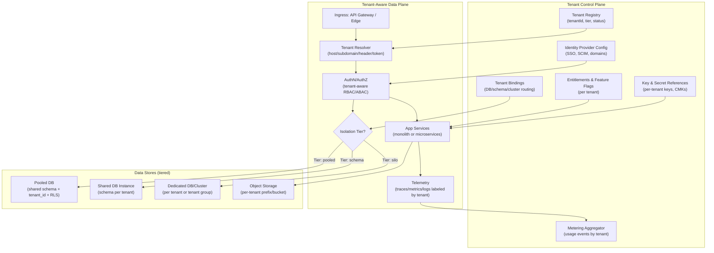
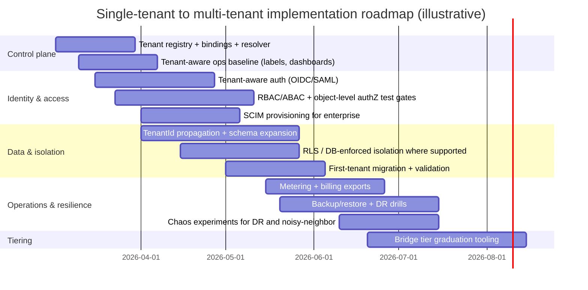

# Adapting a Single-Tenant System to a Multi-Tenant Architecture

## Executive summary

Adapting a single-tenant system into a multi-tenant SaaS is primarily a **correctness and operations** program—not just a database refactor. The central technical problem is preserving *strong tenant isolation* while sharing as much infrastructure as is safe and economical. Primary reference guidance from entity["company","Amazon Web Services","cloud services provider"] and entity["company","Microsoft Azure","cloud platform"] consistently frames this as a spectrum of tenancy/isolation options—from fully pooled (shared) to fully siloed (dedicated), often implemented as a hybrid “bridge” where most tenants are pooled but select tenants “graduate” to stronger isolation tiers. citeturn0search0turn0search4turn0search15turn0search9turn0search1turn8search2turn8search0

Because the existing system’s tech stack, database type, and scale are unspecified, this report provides **stack-agnostic architecture** and then concrete options for common patterns:
- Relational database systems using **shared schema + tenant key + database-enforced policies** (e.g., row-level security) vs schema-per-tenant vs database-per-tenant. citeturn10search8turn0search3turn0search17turn5search16turn0search1turn5search0  
- NoSQL options that logically partition by a `tenantId` field (document stores) or hierarchical/partition keys (distributed stores). citeturn9search2turn9search9  

A rigorous transformation touches at least these dimensions (covered in depth below): tenancy model choice, isolation levels (data/compute/network/config), tenant-aware authN/authZ (SSO + RBAC/ABAC), data partitioning and migration strategy with rollback, tenant lifecycle (onboarding/offboarding), metering/billing, tenant-scoped observability, per-tenant backup/restore and DR, performance and quotas/autoscaling, security and compliance (encryption, key mgmt, audit logging), testing (including chaos), and operational runbooks. citeturn4search8turn8search11turn5search3turn4search1turn5search0turn1search0turn2search2turn7search14turn7search0turn3search6  

Recommended direction (when constraints are unknown): implement a **control plane + data plane** architecture with **bridge isolation**:
- Start with a pooled default (cost-efficient, fastest iteration), but engineer for “graduation paths” to schema-per-tenant and database-per-tenant for tenants needing stronger isolation, compliance, data residency, or performance guarantees. citeturn0search0turn0search4turn8search2turn8search0turn4search8  
- Adopt **database-enforced tenant isolation** wherever feasible (e.g., RLS in PostgreSQL or SQL Server) to reduce reliance on consistently correct application-layer filtering. citeturn0search17turn0search3turn9search1turn9search10  
- Standardize tenant-aware operations: onboarding automation, tenant-aware dashboards and metering, and per-tenant backup/restore semantics early—these are recurring failure points if deferred. citeturn8search11turn4search1turn5search3turn5search0turn4search8  

Primary best-practice sources and seminal references used throughout include the AWS Well-Architected SaaS Lens and tenant isolation strategies, Azure’s multitenant architecture series and checklists, Kubernetes multitenancy guidance, OWASP API Security Top 10, IETF/OIDC/SCIM/OASIS standards for identity, NIST publications for ABAC/RBAC/crypto/key management/audit controls, and seminal academic work on multitenant database design (Aulbach et al.). citeturn4search0turn0search15turn0search9turn3search6turn1search0turn1search1turn1search2turn1search3turn7search3turn2search0turn2search1turn2search3turn2search2turn7search14turn10search8  

## Tenancy and isolation model trade-offs

A practical way to decide among tenancy models is to separate **where tenants share** (data path, compute path, network path, and configuration path) and then choose the minimum isolation that still meets contractual and regulatory requirements. AWS explicitly frames pooled vs siloed vs bridge models as architectural patterns influenced by cost efficiency, regulation, and scaling considerations. citeturn0search0turn0search4turn0search15turn8search2  

### Isolation dimensions (data, compute, network, config)

**Data isolation (mandatory):**
- Pooled/shared: enforce scoping with a tenant partitioning key; ideally also enforce at the database layer (e.g., row-level security). citeturn10search8turn0search17turn0search3turn9search1turn9search2  
- Stronger modes: separate schema or separate database, which limits blast radius (mis-scoped query impact, schema changes, restores). citeturn0search1turn5search0turn0search15  

**Compute isolation (controls “noisy neighbor”):**
- Pooled compute uses quotas and rate limits; a common approach in containerized environments is to map tenants (or tenant tiers) to namespaces and enforce quotas. citeturn3search6turn3search2turn1search12  
- Siloed compute dedicates workers, nodes, or entire clusters to a tenant/tier when performance or compliance demands it. citeturn0search15turn8search2turn8search0  

**Network isolation (reduces lateral movement risk):**
- Shared clusters require strict tenant network segmentation (namespace boundaries + network policies). Kubernetes calls out network isolation as part of data-plane isolation in multitenant clusters. citeturn5search2turn3search6  

**Configuration isolation (prevents “config bleed”):**
- Every tenant must have a separate configuration boundary: feature flags, quotas, identity provider settings, encryption key references, data residency constraints, and per-tenant service bindings. This is a core theme in multi-tenant guidance because operational tooling must see “health through the lens of tenants and tenant tiers.” citeturn5search3turn5search8turn8search0turn4search8  

### Database tenancy models compared

The table below maps your requested models—shared schema, separate schema, separate database—to isolation/cost/complexity and migration effort.

| Dimension | Shared schema (pooled) | Separate schema (within shared DB instance) | Separate database (silo) |
|---|---|---|---|
| Core idea | One schema; tables shared; rows tagged with `tenant_id` (or equivalent). “Most basic technique” in multitenant DBs is tenant-key column per table. citeturn10search8turn10search16 | One DB instance; schema per tenant (logical separation). Often offered as a middle ground between pooled and siloed approaches. citeturn0search1turn5search0 | DB-per-tenant (or cluster-per-tenant), maximizing isolation; aligns with the “silo model.” citeturn0search15turn0search0 |
| Data isolation strength | Medium unless **database-enforced isolation** exists; best practice is DB-enforced policies where supported (e.g., row-level security). citeturn0search17turn0search3turn9search1turn9search10 | Higher logical isolation; cross-tenant query mistakes are less likely to leak data, but app bugs can still route incorrectly. citeturn0search1turn5search0 | Highest. Fewer ways for a query bug to cross boundaries. citeturn0search15turn0search0 |
| Blast radius (schema bugs, migrations) | High (one change affects all). Requires disciplined expand/contract style migrations. citeturn6search0turn6search4 | Medium (schema changes are replicated across many schemas; automation required). citeturn0search1turn5search0 | Low per tenant, but fleet-wide operations can be heavy without strong automation. citeturn0search15turn0search0 |
| Cost profile | Lowest infra cost (highest consolidation). AWS SaaS guidance positions pooling as cost-efficient but requiring stronger guardrails. citeturn0search0turn10search16 | Medium cost; fewer clusters/instances than silo, but more operational overhead than pooled. citeturn0search1turn5search0 | Highest ongoing cost (more DB instances, more backups/monitoring, more deployments). citeturn0search0turn0search15 |
| Per-tenant backup/restore | Hardest: you must be able to restore tenant data selectively. AWS highlights partitioning model impact on backup/recovery and selective restore. citeturn5search0 | Easier: schema-level extraction/restore can be more targetable (still complex at scale). citeturn5search0turn0search1 | Easiest: restore the tenant DB (or point-in-time restore) with least ambiguity. citeturn5search0turn0search15 |
| Scaling tenants count | Best for very large tenant counts if data model consistency holds. citeturn9search2turn10search8 | Can become schema-sprawl; may hit operational limits sooner than pooled. citeturn5search0turn0search1 | Depends on automation; can scale to many tenants but ops complexity increases quickly without a strong control plane. citeturn0search0turn8search11 |
| Migration effort (single → multi) | **High** (requires tenant key propagation into almost every table/query, plus strong enforcement). citeturn10search8turn0search17 | **Medium–High** (bulk schema replication, per-tenant connection routing, migration tooling). citeturn0search1turn5search0 | **Medium** for strict isolation (lift-and-shift tenants), **High** for operating at scale (automation). citeturn0search15turn0search0turn8search11 |
| Typical first fit | Many SMB tenants, high consolidation, consistent schema; strong need for cost efficiency. citeturn0search0turn10search16 | Mid-market / mixed isolation needs; transitional approach toward tiering. citeturn0search1turn8search2 | Regulated/enterprise tenants, strong isolation + separate billing/controls/residency. citeturn0search15turn8search2 |

### Stack-specific implications

**Relational (PostgreSQL, SQL Server, MySQL-class systems):**
- When supported, row-level security (RLS) can enforce tenant filters transparently to the application. PostgreSQL documents RLS policies via `CREATE POLICY`, and AWS prescriptive guidance explicitly recommends RLS as required for tenant isolation in pooled PostgreSQL setups; SQL Server provides comparable row-level security constructs via security policies and predicates. citeturn0search3turn0search11turn0search17turn9search1turn9search0turn9search10  
- If RLS is not available or not used, the burden shifts to application-layer correctness, increasing the importance of tenant-aware authZ and rigorous tenant-isolation testing. citeturn1search0turn1search4  

**NoSQL (document or distributed key-value):**
- A common pooled strategy is to include a `tenantId` field in each document; MongoDB’s multi-tenant architecture guidance explicitly recommends this for growing tenant counts where query requirements are relatively consistent. citeturn9search2  
- For partitioned distributed stores, tenant-aware partition keys (or hierarchy of keys) can directly support isolation and scaling; for example, Microsoft’s guidance for hierarchical partition keys highlights a primary partition key like `tenantId` for isolation and additional keys for distribution within tenants. citeturn9search9  

image_group{"layout":"carousel","aspect_ratio":"16:9","query":["pooled silo bridge SaaS tenant isolation diagram","shared schema vs schema-per-tenant vs database-per-tenant diagram","Kubernetes multi tenancy namespace network policy resource quota diagram","row level security policy diagram postgres"],"num_per_query":1}

## Recommended target architecture

Given unknown constraints, a robust target is a **tenant control plane + tenant-aware data plane**, with **bridge isolation** (pooled by default, selective siloing). Both AWS and Azure multi-tenant guidance emphasize the need to distinguish control plane and data plane responsibilities and to automate tenant lifecycle operations. citeturn0search0turn0search4turn4search8turn8search1turn5search3turn8search11  

### Architectural goals

The recommended architecture optimizes for:
- **Correct tenant routing** (every request/event resolves to the right tenant binding). citeturn8search5turn8search11  
- **Defense-in-depth isolation** (not only app-layer). citeturn0search17turn9search1turn5search2  
- **Tenant-aware operations** (observability, metering, backups, onboarding automation). citeturn5search3turn4search1turn5search0turn8search11  
- **Tiering and “graduation”** to stronger isolation for specific tenants (hybrid pool+silo). citeturn8search2turn8search0turn0search4  

### Mermaid: reference architecture (control plane + data plane + tiered tenancy)

This design matches the “bridge” concept: shared front door and shared services, while selectively dedicating resources when a tenant’s tier requires it. citeturn0search4turn0search15turn8search2turn8search0  

### Monolith vs microservices considerations (options)

Because the existing system shape is unknown, the architecture above is compatible with each of these common system shapes:

- **Monolith (or modular monolith):** implement tenant resolution middleware once; centralize enforcement via database policies where possible; isolate expensive background jobs via per-tenant queues/quotas; introduce a control plane first, then evolve service boundaries later (often using the Strangler Fig pattern for incremental modernization). citeturn6search5turn6search1turn6search9  
- **Microservices:** require strict tenant propagation across service boundaries and consistent tenant-aware logging and authorization checks to avoid cross-tenant leakage; standard tracing headers (W3C Trace Context) and consistent tenant labeling become essential for operability. citeturn3search1turn5search3turn1search0  

## Tenant-aware identity, authentication, and authorization

Multi-tenancy changes identity from “users in one system” to “users belonging to tenants with tenant-specific policies.” AWS explicitly calls out that SaaS systems must connect users to tenants to bring tenant context into authentication and authorization. citeturn8search9turn8search11  

### Tenant-aware authentication (including SSO)

A practical baseline is:
- OAuth 2.0 for delegated authorization flows (industry standard). citeturn1search1turn1search13  
- OpenID Connect for authentication on top of OAuth 2.0. citeturn1search2turn1search6  
- SAML 2.0 for enterprise SSO compatibility (still common in enterprise IdPs). citeturn7search3turn7search7  

Key multi-tenant changes:
- **Tenant discovery at login:** determine tenant context based on domain/subdomain (e.g., `tenant.example.com`), email domain, invitation, or explicit chooser; then route the user into the correct IdP configuration. Tenant routing is explicitly highlighted as a core SaaS challenge, and AWS provides strategies for tenant-aware request routing. citeturn8search5turn8search11  
- **Enterprise provisioning:** add SCIM endpoints so customer IdPs can automate user/group provisioning and deprovisioning (joiner/mover/leaver). SCIM is standardized in RFC 7644 and is recommended by Microsoft Entra provisioning guidance for ISVs. citeturn1search3turn4search2  

### Authorization model: RBAC + ABAC per tenant

A strong pattern in multi-tenant SaaS is to combine:
- **RBAC** for coarse-grained permissions and admin delegation (role management, least privilege), grounded in the NIST RBAC model. citeturn2search1turn2search17  
- **ABAC** for fine-grained policy and resource-level constraints (tenant tier policies, environment constraints, data residency, object tags), defined in NIST SP 800-162. citeturn2search0turn2search16  

What changes from single tenant:
- **Every authorization decision becomes tenant-scoped** (a user’s role assignments are meaningful only within a tenant boundary). citeturn8search9turn2search1turn2search0  
- **Object-level authorization becomes non-negotiable** because multi-tenancy dramatically increases the impact of any cross-tenant object access bug. OWASP labels Broken Object Level Authorization as the top API risk and explicitly emphasizes object-level checks for any function that accesses data by user-provided IDs. citeturn1search0turn1search4  

### Practical “tenant-aware auth” checklist

A minimal, rigorous set of design commitments:
- **Token contains tenant context** (or can be mapped reliably): e.g., `tenant_id`, `org_id`, or a stable tenant mapping key; enforce consistent tenant resolution rules. citeturn8search5turn8search9  
- **Every data access path is tenant-scoped**: DB queries, caches, search indexes, object storage paths, background jobs, message consumers. (DB enforcement like RLS reduces reliance on application correctness.) citeturn0search17turn5search16turn9search1  
- **Delegated admin:** tenant admins can manage users/roles within their tenant; provisioning integrations (SCIM) can automate lifecycle. citeturn1search3turn4search2  
- **Auditability:** log security-relevant actions (role changes, login anomalies, access denials, key config changes). NIST SP 800-53 provides a catalog of audit and security controls; AU-2 focuses on event logging. citeturn7search14turn7search2  

## Data partitioning, migration, and rollback

Moving from single-tenant to multi-tenant is fundamentally a **data model and correctness migration**. Seminal work on multitenant databases describes “add a tenant ID column to each table” as the most basic approach to implement multi-tenancy, but real systems must also handle schema evolution, performance isolation, and operational workflows. citeturn10search8  

### Data partitioning options for relational and NoSQL

**Relational partitioning choices:**
- **Shared schema:** add `tenant_id` columns; enforce RLS/policies where available. PostgreSQL and SQL Server both provide row-level security mechanisms to filter rows based on execution context/predicates. citeturn0search3turn0search11turn9search1turn9search0turn0search17  
- **Separate schema:** data physically grouped per tenant within one DB instance. citeturn0search1turn5search0  
- **Separate database:** strongest boundary; aligns with silo isolation in AWS SaaS models. citeturn0search15turn0search0  

**NoSQL/document partitioning choices:**
- **Shared collections + `tenantId`:** MongoDB’s official guidance recommends using a `tenantId` field to logically segment tenants when tenant count grows and requirements are consistent. citeturn9search2  
- **Partition key hierarchy:** use `tenantId` as the primary partition key and add additional keys for distribution, as described in Microsoft guidance for hierarchical partition keys. citeturn9search9  

### Migration strategies compared

Single-tenant → multi-tenant migrations succeed when they minimize downtime, preserve rollback options, and avoid forcing “flag day” rewrites. Two widely used modernization patterns are:
- **Parallel change / expand-and-contract** for schema and interface evolution. citeturn6search0turn6search4  
- **Strangler Fig** for gradual rerouting from legacy to new components behind a façade. citeturn6search5turn6search9turn6search1  

| Strategy | When it fits | How it works | Rollback posture | Typical migration effort |
|---|---|---|---|---|
| Expand/contract (parallel change) | Most DB and API changes, especially when downtime must be minimized | Expand schema (add tenant-aware columns/tables), migrate/dual-read, then contract (remove old paths). citeturn6search0turn6search4 | Strong if you preserve old paths until verified | Medium–High (depends on data volume and coupling) |
| Strangler Fig with façade | Legacy monolith modernization or partial component replacement | Insert façade/proxy; route some tenants/traffic to new tenant-aware paths; gradually increase coverage. citeturn6search5turn6search9 | Strong: you can reroute back at the façade | Medium–High |
| “Tenant as first tenant” conversion | Moving a single existing customer/system into multi-tenancy | Introduce tenant control plane; tag all existing data as `tenant=A`; then onboard new tenants. (Anchored in the tenant-key concept.) citeturn10search8turn8search11 | Medium: rollback depends on DB migration reversibility | Medium |
| Clone-and-cutover (big bang) | Rare: small data, low uptime requirements | Freeze writes; clone/migrate data to new model; switch all traffic. | Weak unless you keep old system writable (rare) | Low–Medium (but risk is high) |
| Hybrid bridge: pooled + silo tiers | When compliance/perf differs per tenant | Implement pooled baseline; allow specific tenants to be siloed as a tier. AWS describes tier-based isolation mixing pool and silo. citeturn8search2turn0search4 | Strong if tier changes are reversible | High upfront, lower long-term |

### Mermaid: migration flow (single tenant to bridge multi-tenancy)

```mermaid
flowchart LR
  A["Assess current system\n(data model, auth, ops)"] --> B["Choose target tenancy model\n(pool / schema / db + tiering)"]
  B --> C["Introduce Tenant Control Plane\n(tenant registry, bindings, entitlements)"]
  C --> D["Add tenant context propagation\n(API middleware, job context, events)"]
  D --> E["Data model expansion\nadd tenant_id / schemas / db routing"]
  E --> F["Backfill existing data\nmark as tenant=T0"]
  F --> G["Enforce isolation\nDB policies (RLS) + authZ checks"]
  G --> H["Pilot tenants\n(onboard 1..N, monitor, tune quotas)"]
  H --> I["Scale rollout\ntenant tiers, metering, backups, runbooks"]
  I --> J["Contract legacy paths\nremove old assumptions"]
```

This flow reflects parallel change (expand → migrate → contract) while explicitly adding the control plane, which Azure multitenant guidance recommends distinguishing from the data plane for operational excellence. citeturn6search0turn4search8turn8search1  

### Rollback plans (including migration rollback)

A credible multi-tenant migration plan includes **two rollback layers**:

**Application rollback**
- Canary/gradual rollout: shift tenant cohorts back to the previous version if errors spike. Google’s SRE guidance highlights that releases commonly cause outages and stresses designing for reliable releases and rollbacks. citeturn6search3turn6search7  

**Data rollback**
- Use expand/contract so you can keep both the old and new representations during the migration window. citeturn6search0turn6search4  
- For per-tenant migrations, keep a tenant-level “migration checkpoint” (schema version, backfill timestamp, validation hashes) so you can revert only the affected tenant rather than the whole fleet (especially important in pooled models). This aligns with AWS discussions about multi-tenant backup/recovery requiring tenant-aware segregation and selective restoration. citeturn5search0  

## Tenant lifecycle, billing, and observability operations

Multi-tenancy turns “operations” into a tenant-aware discipline: the provider must see system health and usage *through the lens of individual tenants and tiers*. AWS explicitly calls tenant-aware operations and tenant activity/consumption out as first-class SaaS concerns. citeturn5search3turn5search8turn4search1turn8search0  

### Tenant onboarding and offboarding workflows

AWS defines tenant onboarding as provisioning and configuring the components needed to create a new tenant, initiated by tenants or provider-managed processes. citeturn8search11turn4search4  
Azure’s multitenancy checklist similarly emphasizes automation for tenant lifecycle management (onboarding, provisioning, configuration) and monitoring each tenant. citeturn4search8turn8search1  

A rigorous onboarding workflow typically includes:
- **Register tenant** (tenantId, tier, status), allocate entitlements/limits, and create tenant binding (pooled vs schema vs DB). citeturn0search0turn8search0turn8search2  
- **Configure identity**: tenant IdP metadata, SSO configuration (OIDC/SAML), and optional SCIM provisioning endpoints for automated user lifecycle management. citeturn1search2turn7search3turn1search3turn4search2  
- **Provision data plane resources**: schemas/DBs, storage prefixes, message namespaces, quotas. citeturn0search1turn3search6turn3search2  
- **Provision keys/secrets**: per-tenant secret references and key management policies (especially if offering customer-managed keys at higher tiers). citeturn2search2turn8search2  
- **Run tenant smoke tests**: verify auth, isolation, quotas, baseline monitoring, and billing instrumentation. citeturn5search3turn4search1turn1search0  

Offboarding must be equally explicit:
- Suspend access, revoke sessions/tokens, cut off SCIM sync, and freeze writes for retention/export period. citeturn1search3turn4search2  
- Export customer data (if required), then delete or archive according to retention policies; preserve audit logs for required durations (often compliance-driven). citeturn7search14turn7search2  
- Deprovision tenant resources (schemas/DB/compute/storage), and ensure billing finalization. citeturn4search8turn4search1  

### Billing and usage metering

AWS SaaS guidance explicitly describes consumption-based pricing where providers introduce metering mechanisms, send metering data to a billing system, and generate bills from aggregated usage. citeturn4search1turn4search0  
Cost optimization guidance also emphasizes correlating tenant activity with infrastructure costs. citeturn4search19  

Concrete metering recommendations:
- Emit **immutable usage events** with `tenant_id`, `feature`, `quantity`, `timestamp`, and `idempotency_key`/dedupe key. (This supports auditability and replay safety.) citeturn4search1turn7search14turn7search2  
- Maintain tenant-aware dashboards for consumption trends and anomaly detection (sudden spikes can be security or runaway workloads). Tenant-aware operations are emphasized in the SaaS Lens. citeturn5search3turn5search8turn1search12  

### Monitoring, logging, and observability per tenant

The technical requirement is: *every telemetry signal must carry tenant context*.

Two widely adopted standards help:
- W3C Trace Context defines interoperable propagation headers (`traceparent`, `tracestate`) for distributed tracing. citeturn3search1turn3search9  
- OpenTelemetry specifies vendor-neutral signals (traces, metrics, logs) and common correlation mechanisms (including resource context and baggage). citeturn3search16turn3search4turn3search0  

In practice:
- Add `tenant.id` (and optionally `tenant.tier`) as a **first-class attribute** on traces/metrics/logs; OpenTelemetry logs explicitly include Resource context to support correlation. citeturn3search4turn3search16  
- For multi-tenant Kubernetes setups, map tenants to namespaces or node pools and segment telemetry by namespace/labels; Kubernetes multi-tenancy guidance discusses using namespaced resource quotas to prevent monopolization. citeturn3search6turn3search2  
- Azure specifically documents multitenant monitoring approaches for Application Insights by adding custom properties and analyzing performance/usage per tenant. citeturn4search6turn4search20  

## Backup, DR, performance, and security controls

### Backup/restore and disaster recovery per tenant

Per-tenant restoration is often where a “pure pooled” design becomes operationally painful if not planned. AWS’s database guidance explicitly analyzes how multi-tenant partitioning models influence backup and recovery, including approaches for tenant data segregation during backup/recovery and selective restoration of a tenant’s data. citeturn5search0  

Implications by tenancy model:
- **Shared schema:** full-database backups are straightforward; *tenant-selective restore* is hard—typically requiring extracted restores, logical export/import, or tenant-aware restore tooling. citeturn5search0  
- **Separate schema:** supports more targeted restore operations than shared schema but requires automation to manage many schemas. citeturn5search0turn0search1  
- **Separate database:** simplest tenant-specific PITR/restore, but requires fleet automation for backups, verification, and cost control. citeturn5search0turn0search15turn8search11  

A key operational requirement: tenant-aware operations tooling must let you validate and drill restores per tenant/tier (RPO/RTO expectations differ across tiers). AWS SaaS Lens emphasizes tenant-aware views of operations and tenant tiers. citeturn5search8turn8search0turn5search3  

### Performance/resource allocation and autoscaling

Multi-tenancy introduces noisy-neighbor risks and the need for tenant-scoped limits. OWASP explicitly treats “Unrestricted Resource Consumption” as an API security risk because it translates directly into availability and cost impact. citeturn1search12  

Common controls:
- **Tenant-scoped quotas and rate limits** for CPU/memory/storage, job concurrency, and expensive endpoints. Kubernetes multi-tenancy guidance calls out mapping tenants to namespaces to apply quotas and prevent a tenant from monopolizing cluster resources. citeturn3search6turn3search2  
- **Autoscaling**: Kubernetes Horizontal Pod Autoscaler scales workloads to match demand; this helps at the service level, but you still need per-tenant concurrency controls so one tenant doesn’t trigger excessive scaling/cost. citeturn3search3turn3search15turn1search12  

Practical performance pattern (stack-agnostic):
- Explicitly define **tenant tiers** (e.g., free/pro/enterprise) and bind tiers to quotas, concurrency, and (optionally) isolation mode. AWS describes tenant tiers as influencing cost, operations, and reliability footprints, and provides tier-based isolation illustrations mixing pooled and silo tenants. citeturn8search0turn8search2  

### Security/compliance implications: encryption, key management, and audit trails

**Encryption**
- AES is standardized in FIPS 197 as a FIPS-approved symmetric algorithm for protecting electronic data. citeturn2search3  

**Key management**
- NIST SP 800-57 provides general guidance and best practices for cryptographic key management, including lifecycle management of keying material. citeturn2search2turn2search10  

In multi-tenancy, key management decisions often map to tenant tiers:
- Pooled tiers frequently use shared KMS infrastructure with per-tenant data keys (logical separation).
- Higher tiers may require customer-managed keys or dedicated key hierarchies, often driving a “bridge” or “silo” isolation requirement. (This matches the tier-based isolation rationale—different tenants require different isolation levels.) citeturn8search2turn0search4  

**Audit trails**
- NIST SP 800-53 provides a catalog of controls and includes AU-2 for event logging; this supports after-the-fact investigations and governance expectations. citeturn7search14turn7search2  

A multi-tenant security controls comparison table (conceptual but actionable) is below.

| Control objective | Shared schema | Separate schema | Separate database |
|---|---|---|---|
| Prevent cross-tenant access | DB-level RLS/policies preferred; strict object-level authZ and testing required. citeturn0search17turn1search0turn9search1 | Reduced accidental access via schema separation, but still need tenant-correct routing and authZ. citeturn0search1turn1search0 | Strongest boundary; still require authZ and correct routing to the tenant DB. citeturn0search15turn1search0 |
| Encryption at rest | AES-based at rest (implementation-specific), plus tenant-aware key references. citeturn2search3turn2search2 | Same, with simpler per-tenant key mapping by schema. citeturn2search2 | Best alignment with customer-managed keys and strict regulatory boundaries. citeturn2search2turn8search2 |
| Audit logging | Centralized logs must include tenant context; align with AU-2. citeturn7search2turn5search3 | Same, plus schema-level activity attribution. citeturn7search2turn5search3 | Per-tenant isolation simplifies audit scoping; requires fleet-wide aggregation tooling. citeturn7search2turn5search3turn8search11 |
| Network isolation | Enforce namespace/network policies and segmentation. citeturn5search2turn3search6 | Same. citeturn5search2 | Same, plus tenant-dedicated networks for strict tiers. citeturn0search15turn5search2 |
| Resource controls | Tenant quotas + rate limits essential; aligns with OWASP resource consumption risk and Kubernetes quota guidance. citeturn1search12turn3search6turn3search2 | Similar, often with easier per-tenant capacity management. citeturn3search6turn3search2 | Strongest noisy-neighbor control but highest cost; automation required. citeturn0search0turn8search11 |

## Testing strategy, runbooks, and phased roadmap

### Testing strategies (unit, integration, chaos, tenant-specific)

A multi-tenant test strategy must explicitly prove **tenant isolation** and **operational safety**.

Key layers:
- **Unit tests:** tenant context parsing, tenant-to-binding resolution, RBAC/ABAC policy evaluation, and query builders. ABAC and RBAC are formally defined by NIST sources and should be testable as deterministic policy functions. citeturn2search0turn2search1  
- **Integration tests:** cross-tenant ID access checks (BOLA tests), tenant-specific config behavior, tenant quota enforcement, and DB-enforced isolation behavior (e.g., RLS filters). OWASP’s API1 risk framing makes these tests particularly important for endpoints that accept object IDs. citeturn1search0turn0search17turn9search1  
- **Tenant-specific regression suites:** validate per-tenant SSO mappings, SCIM provisioning, data import/export semantics, and tier-specific limits. citeturn4search2turn8search0  
- **Chaos testing:** Chaos Engineering is defined as experimenting on a system to build confidence in its ability to withstand turbulent conditions; it is directly relevant to multitenant systems where shared dependencies can amplify failures. citeturn7search0turn7search9  
- **Reliability/stress testing:** The Google SRE guidance on testing reliability emphasizes quantifying confidence in systems at scale through adapted testing techniques. citeturn7search1  

### Operational runbooks (minimum set)

Tenant-aware runbooks should exist before onboarding meaningful customer volume because tenant-aware operations is explicitly a SaaS requirement. citeturn5search3turn5search8  

A minimal runbook set:
- **Cross-tenant data exposure:** isolate impact (disable affected endpoints/queries), audit scope, notify, and root-cause with tenant-aware logs. (OWASP BOLA framing motivates this being treated as a top-tier incident.) citeturn1search0turn5search3  
- **Noisy-neighbor/cost spike:** identify tenant(s) driving load, enforce throttles/quotas, and consider isolating to a higher tier if appropriate. (Kubernetes quota and OWASP resource consumption risk apply.) citeturn3search6turn1search12  
- **Tenant restore:** execute tenant-specific restore (schema/DB), verify, reconcile metering and audit logs; AWS explicitly focuses on selective restoration challenges in multi-tenant models. citeturn5search0turn8search0  
- **SSO/provisioning failure:** SCIM sync drift, IdP certificate rotation, domain verification failure; align with SCIM and SAML/OIDC standards. citeturn1search3turn7search3turn1search2  

### Phased implementation roadmap (milestones, deliverables, risks, mitigation)

The roadmap below assumes an existing single-tenant system moving toward bridge multi-tenancy. Timeline estimates are **illustrative** and depend heavily on codebase size, data volume, and compliance tier requirements; the structure reflects best-practice sequencing emphasized by AWS/Azure guidance: automate tenant lifecycle, ensure tenant-aware operations, and adopt tiering for different tenant requirements. citeturn8search11turn4search8turn5search3turn8search0turn0search4  

| Phase | Typical timeline | Key deliverables | Primary risks | Mitigations |
|---|---:|---|---|---|
| Foundation: tenant control plane | 3–6 weeks | Tenant registry, tenant resolver, tenant bindings, entitlements, tier model; initial tenant-aware logging fields. citeturn4search8turn5search3turn8search0 | Wrong-tenant routing; config bleed | Strong contract for tenant resolution and routing; tenant-aware ops dashboards. citeturn8search5turn5search3turn5search8 |
| Tenant-aware identity and authZ | 4–8 weeks | Tenant-aware auth (OIDC/SAML), RBAC + ABAC model, SCIM provisioning for enterprise; object-level authorization test suite. citeturn1search2turn7search3turn2search0turn2search1turn1search0turn4search2 | Cross-tenant access (BOLA), auth misconfig | Security test gates; least privilege; audit logging (AU-2). citeturn1search0turn7search2turn7search14 |
| Data model and isolation enforcement | 6–12 weeks | Choose pooled/schema/DB model; implement tenantId propagation; enable DB-enforced isolation where possible (RLS); migration/backfill of existing tenant. citeturn10search8turn0search17turn9search1turn5search16 | Data corruption, partial migration | Expand/contract strategy; verification checks; stepwise tenant rollout. citeturn6search0turn6search4turn6search3 |
| Tenant-aware operations (metering + observability) | 4–8 weeks | Metering pipeline, billing exports, per-tenant dashboards; tenant-aware alerts; quota enforcement; autoscaling policy review. citeturn4search1turn5search3turn3search6turn3search3 | Cost blowups; weak visibility | Tenant activity/consumption dashboards; quotas and rate limits. citeturn4search1turn1search12turn3search2 |
| Backup/restore + DR + compliance hardening | 4–10 weeks | Tenant restore procedures (by model), DR drills, encryption/key mgmt policies; audit trails mapped to control frameworks. citeturn5search0turn2search2turn2search3turn7search14 | Restore mistakes, regulatory gaps | Tenant-aware restore automation; chaos testing DR plans. citeturn5search0turn7search9turn7search0 |
| Scale-out and tier graduation | Continuous | Tier-based isolation (bridge), dedicated resources for select tenants, continuous optimization | Operational sprawl | Automation-first tenant lifecycle; tier governance. citeturn8search0turn8search2turn4search8 |

### Mermaid: phased roadmap timeline

This sequencing matches SaaS multi-tenant guidance that stresses tenant lifecycle automation, tenant-aware operations, and tiering to support mixed isolation requirements. citeturn4search8turn5search3turn8search0turn8search2turn0search4