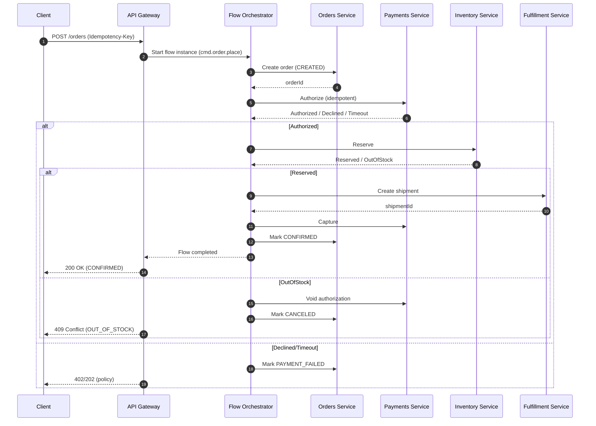
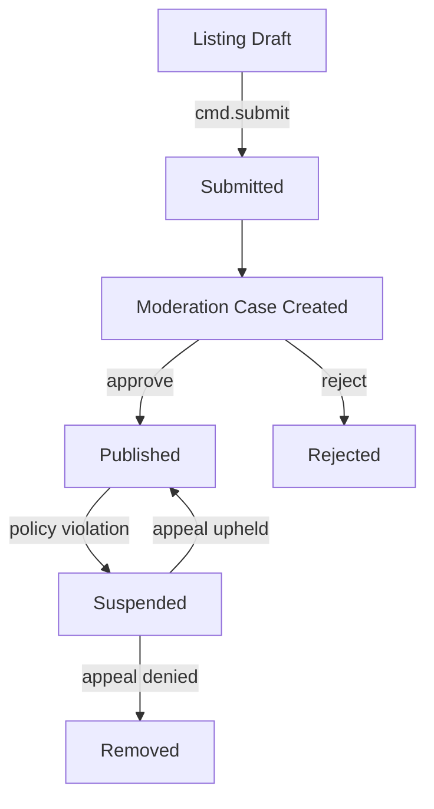

# Extending the Engine to Support Giant Shop Marketplace Flow Creation

## Executive summary

Your project sources describe a “giant shop” marketplace capability set (modules comparable to large marketplaces) and, critically, frame implementation in terms of your engine’s modular **Skills** plus stateful **Flows** coordinated by a **Flow Orchestrator** and an **Event-Aware Business Flow Arbiter** (BFA), with UI and business rules expressed as “DNA” schemas (for example promotions/cart rules and view definitions). fileciteturn0file0 fileciteturn0file1

Given the lifecycle complexity implicit in marketplace journeys (buyer purchase → fulfillment → returns/disputes; seller onboarding → listing moderation → payouts), the most robust way to implement these flows in a multi-service engine is to treat them as **long-running workflows** with explicit state transitions and failure recovery. A canonical approach is the **Saga pattern**, where a business transaction is a sequence of local transactions with compensating actions on failure, coordinated either by **orchestration** or **choreography**. citeturn1search3

To make these flows safe under retries, timeouts, and message redelivery, the engine extension should standardize:
- **Idempotency** for non-idempotent operations (especially `POST`-like “create order / start payment / issue refund”). The emerging IETF draft for an `Idempotency-Key` header formalizes the intent and uniqueness requirements for retry-safe HTTP APIs. citeturn3search5turn3search0  
- **Reliable event publication** using a “write business state + publish event” durability pattern such as the **Transactional Outbox**, which avoids inconsistent “dual writes” by persisting events in the same transaction as business state changes. citeturn0search1  
- **Event contract interoperability** via a consistent event envelope (for example aligning to CloudEvents’ common event metadata model). citeturn0search5turn0search2  
- **Security controls** appropriate for multi-actor marketplaces (buyer/seller/admin/support): object-level authorization and property-level authorization are repeatedly identified by OWASP as common API failure modes (BOLA/BOPLA), and marketplace flows involve many “ID-based” endpoints. citeturn1search0turn1search1turn1search2  

The rest of this report turns the above into a concrete, engine-oriented design: flow entities and state machines, extension points, APIs (REST/gRPC/event-driven), CLI/UI hooks, validation and error handling, schema and storage changes, test plans, and a rollout strategy.

## Scope, sources, and assumptions

### Sources actually available in this workspace

Only two project documents were accessible here, both prefixed with “16 -”, rather than the full set of sixteen “16-*” documents referenced in your request:
- “16 - giant shop platforms deep research.md” fileciteturn0file0  
- “16 - giant shop platforms.md” fileciteturn0file1  

The second document includes the most explicit mapping from marketplace modules to your engine terms (Skills/Flows/DNA/BFA). fileciteturn0file1  
The first document reads like an internal deep-research synthesis of marketplace architecture patterns and system implications. fileciteturn0file0  

Because the other fourteen “16-*” documents and a separate “basic prompt” were not available, the **state machines, payloads, and API shapes below are derived from**:
- the module/flow decomposition implied by your two sources, fileciteturn0fileciteturn0file0  
- widely used marketplace flow primitives (orders, payments, fulfillment, moderation, disputes), and  
- interface and reliability standards (OpenAPI, CloudEvents, saga/outbox, idempotency). citeturn1search3turn0search1turn3search5turn0search3turn0search5  

### Assumptions

Because you stated there are no constraints on runtime/language/framework/deployment, this report assumes:
- Services may be implemented in any mainstream stack; interfaces should therefore be **language-agnostic** (OpenAPI for HTTP; protobuf for gRPC). citeturn0search3  
- Flows are defined declaratively (your sources mention JSON-defined logic and DNA schemas) and executed by a central orchestrator/BFA model. fileciteturn0file1  
- A message bus (or equivalent) exists or can be introduced to support event-driven triggers and projections; events should be treated as at-least-once delivery, requiring idempotent consumers. citeturn0search1turn0search5  
- Storage can be evolved with additive schema changes and versioned contracts (no “flag day” rewrites).

## Marketplace flows and required mappings

### Engine primitives implied by project sources

Your sources describe an engine composed of modular “Skills” orchestrated into end-to-end “Flows,” with a state machine pattern coordinated via a Flow Orchestrator and an “Event-Aware Business Flow Arbiter (BFA).” fileciteturn0file1  

They explicitly map marketplace capabilities to Skills such as:
- Identity: **Skill 20 (Auth)** and **Skill 58 (SSO)** fileciteturn0file1  
- Discovery: **Skill 03 (Elasticsearch datastore/search)** and **Skill 46 (Feed)** fileciteturn0file1  
- Listings: **Skill 61 (Marketplace Service)** fileciteturn0file1  
- Orchestration: **Skill 09 (Flow Orchestrator)** fileciteturn0file1  
- Payments: **Skill 56 (Payment Service)** fileciteturn0file1  
- Trust/support: **Skill 44 (Moderation)**, **Skill 63 (Ticketing)**, **Skill 42 (Chat)**, **Skill 13 (Feedback)** fileciteturn0file1  
- Analytics: **Skill 48 (Analytics)** fileciteturn0file1  
- Post-purchase engagement: **Skill 52 (Post Service)** fileciteturn0file1  

They also reference “DNA” schemas for **promotions** and **cart rules**, plus “view definitions” for UI composition. fileciteturn0file1  

This implies that the “flow creation” you want to support is not merely “create a workflow,” but rather a complete package:
- Flow orchestration definitions (states/transitions/triggers),
- Skill invocation contracts and data mappings,
- Declarative UI composition hooks,
- Declarative rules/validation schemas.

### Core marketplace flow entities to model

To implement the module map in your sources as executable flows, the engine needs stateful domain entities whose lifecycles can be orchestrated. A minimal set (with explicit “flow ownership” in parentheses) is:

- **Seller onboarding** (Seller Lifecycle Flow)
  - SellerAccount, VerificationCase, StorefrontProfile
- **Listing lifecycle + moderation** (Marketplace Listing Flow)
  - ListingDraft, ListingSubmission, ModerationCase, PublicationRecord
- **Cart → checkout → order → fulfillment** (Buyer Discovery & Transaction Flow)
  - Cart, Quote, Order, PaymentIntent/PaymentAttempt, Shipment, TrackingEvent
- **Returns/refunds/disputes** (Trust & Dispute Flow + Buyer Flow post-purchase branch)
  - ReturnRequest (RMA), Refund, DisputeCase, EvidenceArtifact, DecisionRecord

Your sources explicitly call out buyer flow, seller flow, and trust/dispute flow as distinct end-to-end journeys, coordinated by Skill 09 and the BFA. fileciteturn0file1  

### Required state machines, triggers, conditions, and payloads

Because your available sources do not enumerate exact states, this section provides a **standardized baseline** that matches typical marketplace semantics and fits a saga-based orchestrator execution model. The saga framing is important: cross-service “place order” is a sequence of local transactions and compensations rather than a single distributed transaction. citeturn1search3  

#### Listing lifecycle state machine

| Entity | State | Trigger | Guard/condition examples | Side effects and payload fields |
|---|---|---|---|---|
| Listing | DRAFT | `cmd.listing.saveDraft` | Seller is ACTIVE; required minimal fields present | Persist draft; payload: `sellerId`, `draftId`, `fieldsChanged[]` |
| Listing | SUBMITTED | `cmd.listing.submit` | Completeness checks; prohibited categories blocked | Create ModerationCase; emit `listing.submitted` |
| ModerationCase | IN_REVIEW | `evt.moderation.assigned` | SLA timers start | Reviewer assignment; evidence snapshot |
| Listing | APPROVED | `evt.moderation.approved` | Policy checks satisfied | Publish to catalog; emit `listing.published` |
| Listing | REJECTED | `evt.moderation.rejected` | — | Return reasons; enable resubmission |
| Listing | SUSPENDED | `evt.policy.violation` or `cmd.admin.suspendListing` | Severity threshold | De-index; block checkout |
| Listing | REMOVED | `cmd.seller.deleteListing` / `evt.takedown.final` | Must not have active orders (policy dependent) | Tombstone; audit log |

To align with platform obligations in some jurisdictions, “notice and action” and “appeal/complaint” lifecycles should be modelable, including structured reasons and non-arbitrary handling. (For example, EU DSA defines requirements for notice mechanisms and internal complaint handling in its text.) citeturn5search1turn8search4  

#### Order and payment saga state machine

A minimal order/payment split is recommended because payment steps fail and retry differently than fulfillment steps.

| Aggregate | State | Transition trigger | Guard/condition examples | Compensation and notes |
|---|---|---|---|---|
| Order | CREATED | `cmd.order.place` | Cart quote valid; inventory check passes (soft) | Start saga; allocate `orderId` |
| Payment | INITIATED | `cmd.payment.authorize` | Payment method valid; risk check ok | Must be idempotent with Idempotency-Key citeturn3search5 |
| Payment | AUTHORIZED | `evt.payment.authorized` | — | Next: reserve inventory |
| InventoryReservation | RESERVED | `cmd.inventory.reserve` | Stock sufficient | If fails after AUTHORIZED: void/reverse payment |
| Order | CONFIRMED | `evt.inventory.reserved` | — | Next: create shipment |
| Fulfillment | SHIPMENT_CREATED | `cmd.fulfillment.createShipment` | Seller can fulfill; address ok | If shipment creation fails: release inventory; void payment |
| Payment | CAPTURED | `cmd.payment.capture` | Capturable window ok | Can be after shipment or after delivery depending on model |
| Order | SHIPPED / DELIVERED | `evt.shipment.trackingUpdated` | Carrier event mapping | Events are at-least-once → idempotent consumers citeturn0search1 |
| Order | CANCELED | `cmd.order.cancel` | Cancellation window; not shipped | Compensations: release inventory; void/refund |
| Order | COMPLETED | `evt.delivery.confirmed` + timer | Dispute window closed | Release payouts if escrow-like model |

The choice between “orchestrate everything centrally” vs “event choreography” is an engine-level decision; both are explicitly described as saga coordination strategies. citeturn1search3  

#### Dispute lifecycle state machine

| Entity | State | Trigger | Guard/condition examples | Result payload |
|---|---|---|---|---|
| DisputeCase | OPENED | `cmd.dispute.open` | Within protection window; order delivered or late | `buyerId`, `orderId`, `reasonCode`, `requestedOutcome` |
| DisputeCase | SELLER_RESPONSE_PENDING | timer set | Seller SLA by policy | Escalate if timeout |
| DisputeCase | EVIDENCE_COLLECTION | `cmd.dispute.uploadEvidence` | Attachment type/size validation | Evidence artifact IDs |
| DisputeCase | UNDER_REVIEW | `evt.dispute.readyForDecision` | Minimum evidence present | Assignment to agent/mod team |
| DisputeCase | DECIDED | `cmd.dispute.decide` | Authorization required | `decision`, `rationale`, `refundAmount` |
| Refund | EXECUTED | `cmd.refund.issue` | Payment captured and refundable | Emits `refund.executed`; triggers accounting |

These dispute flows often intersect with moderation and policy enforcement; to avoid safety/compliance blind spots, the engine should enforce auditability and non-repudiation (who made a decision, on what evidence).

## Engine extension points and architecture options

### Why the engine needs extensions beyond “just add new flows”

Your sources already position the engine as flow-driven and modular (Skills + Orchestrator + BFA), but implementing a marketplace-quality flow pack typically exposes gaps in general flow engines:
- **Long-running transactional correctness** across services (cancellations, retries, partial failures). citeturn1search3  
- **Exactly-once intent** for “create/charge/refund/decide” despite at-least-once execution realities, which is why an idempotency key mechanism and idempotent consumers become mandatory. citeturn3search5turn0search1  
- **Schema/version governance** across APIs and events: marketplaces evolve quickly; backward compatibility must be designed, not added later. (OpenAPI’s versioning and contract-first goals support this.) citeturn0search3turn0search0  

Accordingly, the extension should be framed as “make flow creation safe and governable at marketplace scale,” not only “add a few endpoints.”

### Proposed engine-level flow model

To support “flow creation” in a consistent and testable way, introduce explicit engine entities (separate from domain entities):

| Engine entity | Purpose | Key fields |
|---|---|---|
| FlowDefinition | Declarative definition authored by teams | `flowKey`, `version`, `entrypoints[]`, `states{}`, `transitions[]` |
| StateDefinition | Named state and its contract | `name`, `payloadSchemaRef`, `terminal`, `timeoutPolicies[]` |
| TransitionDefinition | Legal move between states | `from`, `to`, `trigger`, `guardExpression`, `actions[]`, `compensations[]` |
| ActionDefinition | Invoke a Skill or emit an event | `type: skillCall|emitEvent|waitTimer`, `skillId`, `requestMapping`, `retryPolicy` |
| FlowInstance | Runtime execution record | `instanceId`, `flowVersion`, `currentState`, `data`, `status`, `correlationId` |
| StepExecution | Operational trace per action | `stepId`, `attempt`, `idempotencyKey`, `startedAt`, `endedAt`, `result` |

This aligns with your source describing state-machine orchestration and event-aware branching, but makes it explicit, versioned, and validate-able. fileciteturn0file1  

### Architecture options and trade-offs

#### Saga coordination strategy

| Option | Fit with your current engine | Strengths | Weaknesses | When to choose |
|---|---|---|---|---|
| Orchestrator-centric sagas | Strong: you already emphasize Skill 09 orchestrator + BFA state machine model fileciteturn0file1 | Debuggable, deterministic, clear compensations, explicit SLAs | Orchestrator load and complexity; requires strong flow versioning | Early marketplace phases; fast iteration with correctness |
| Event choreography sagas | Medium: BFA supports event-aware routing, but choreography requires mature event governance | High decoupling, scalable, fewer “central brain” constraints | Harder debugging; contract drift risk; requires outbox + idempotent consumers citeturn0search1turn0search5 | Large-scale ecosystems with mature event tooling |
| Hybrid | High | Use orchestrator for critical paths; choreography for projections/notifications | Complexity in deciding boundaries | Most mature marketplaces | Default recommended approach |

The saga pattern explicitly describes both orchestration and choreography as valid coordination methods. citeturn1search3  

#### Event publication durability

If you introduce event-driven transitions, you must prevent the “DB commit succeeded but publish failed” class of bugs. The Transactional Outbox pattern stores events/messages in the database within the same transaction as the domain change, then relays them to the broker. citeturn0search1  

### Extension points required in your engine

Based on your platform model (Skills + Flows + DNA), the most impactful extension points are:

- **Flow authoring + versioning subsystem**  
  Store FlowDefinitions as versioned artifacts, with semantic versioning rules and compatibility checks. (This is the backbone for “flow creation”.)

- **Saga-grade execution semantics in the orchestrator**  
  Add per-step retry policies, compensation hooks, timeouts, and idempotency enforcement. The saga concept assumes explicit compensations and event-driven progression. citeturn1search3  

- **Event contract layer (registry + tooling)**  
  Standardize event envelope and metadata (CloudEvents alignment is a practical interoperability baseline). citeturn0search5turn0search2  

- **Schema-first validation for payloads and UI**  
  Your sources already use DNA schemas for promotions/cart rules and view definitions; extend the same governance to flow state payload schemas and event schemas to reduce runtime surprises. fileciteturn0file1  

- **Security and audit hooks as first-class flow concerns**  
  Build object-level authorization checks into flow entrypoints and step actions to mitigate OWASP-highlighted risks (BOLA/BOPLA). citeturn1search0turn1search1  

## API, CLI, and UI integration design

### REST API specifications for flow creation and operations

For public API descriptions, adopt **OpenAPI 3.1.x** to keep contracts language-agnostic and tooling-friendly; the OpenAPI spec explicitly targets human + machine understanding and supports tool-driven documentation and code generation. citeturn0search3turn0search0  

#### Flow management API

**Create or register a flow definition**
```http
POST /platform/v1/flow-definitions
Content-Type: application/json

{
  "flowKey": "marketplace.order.place",
  "version": "1.0.0",
  "description": "Place order saga (authorize -> reserve -> ship -> capture)",
  "entrypoints": [
    {"type": "command", "name": "cmd.order.place"}
  ],
  "states": {
    "CREATED": {"terminal": false, "payloadSchemaRef": "schema://order.created.v1"},
    "CONFIRMED": {"terminal": false, "payloadSchemaRef": "schema://order.confirmed.v1"},
    "CANCELED": {"terminal": true, "payloadSchemaRef": "schema://order.canceled.v1"}
  },
  "transitions": [
    {
      "from": "CREATED",
      "to": "CONFIRMED",
      "trigger": "evt.inventory.reserved",
      "guard": {"expr": "data.payment.status == 'AUTHORIZED'"},
      "actions": [
        {"type": "skillCall", "skillId": "Skill56.PaymentService", "operation": "capture"},
        {"type": "emitEvent", "eventType": "com.yourco.order.confirmed.v1"}
      ],
      "compensations": [
        {"type": "skillCall", "skillId": "Skill56.PaymentService", "operation": "void"},
        {"type": "skillCall", "skillId": "InventoryService", "operation": "release"}
      ]
    }
  ]
}
```

**Response**
```http
201 Created
Content-Type: application/json

{
  "flowKey": "marketplace.order.place",
  "version": "1.0.0",
  "status": "REGISTERED",
  "validation": {
    "passed": true,
    "warnings": []
  }
}
```

**Activate a flow version**
```http
POST /platform/v1/flow-definitions/marketplace.order.place/versions/1.0.0:activate
```

**Simulate**
```http
POST /platform/v1/flow-simulations
Content-Type: application/json

{
  "flowKey": "marketplace.order.place",
  "version": "1.0.0",
  "inputEvent": {
    "type": "cmd.order.place",
    "data": {"buyerId": "u_1", "cartId": "c_9"}
  }
}
```

This “flow API” is the core of “flow creation” as an engine capability: author, validate, activate, simulate.

### Domain APIs for marketplace flows

You can expose buyer/seller APIs separately from internal orchestration APIs. Below are representative endpoints; naming can be aligned to your existing gateway conventions.

**Buyer: begin checkout**
```http
POST /marketplace/v1/carts/{cartId}/quote
Authorization: Bearer <token>

200 OK
{
  "quoteId": "qt_123",
  "cartId": "c_9",
  "currency": "USD",
  "totals": {
    "itemsSubtotal": "39.98",
    "shipping": "6.00",
    "tax": "3.60",
    "total": "49.58"
  },
  "expiresAt": "2026-02-25T12:30:00Z"
}
```

**Buyer: place order with idempotency**
```http
POST /marketplace/v1/orders
Authorization: Bearer <token>
Idempotency-Key: "8e03978e-40d5-43e8-bc93-6894a57f9324"
Content-Type: application/json

{
  "quoteId": "qt_123",
  "paymentMethod": {"type": "card", "token": "tok_xxx"},
  "shippingAddressId": "addr_77"
}
```

**Response**
```http
202 Accepted
{
  "orderId": "ord_1001",
  "status": "PENDING_PAYMENT",
  "correlationId": "corr_abc"
}
```

Using `Idempotency-Key` for retryable `POST` requests is aligned with the IETF draft that defines the header and uniqueness expectations. citeturn3search5turn3search0  

### Internal gRPC APIs between orchestrator and Skills

Where low latency and strong typing matter (orchestrator ↔ payments, orchestrator ↔ inventory), gRPC is a pragmatic internal choice. gRPC also standardizes a health checking API (`health/v1`) that Kubernetes can probe (and Kubernetes documentation describes gRPC probe usage patterns). citeturn3search3turn2search3  

A typical internal gRPC interface set:
- `Payments.Authorize`, `Payments.Capture`, `Payments.Void`, `Payments.Refund`
- `Inventory.Reserve`, `Inventory.Release`
- `Fulfillment.CreateShipment`, `Fulfillment.CancelShipment`

### Event-driven contracts and examples

A CloudEvents-aligned envelope reduces integration friction by normalizing event metadata (id, source, type, time) across producers/consumers. citeturn0search5turn0search2  

Example event:
```json
{
  "specversion": "1.0",
  "type": "com.yourco.payment.authorized.v1",
  "source": "payments-service",
  "id": "evt_01J0...",
  "time": "2026-02-25T12:00:00Z",
  "datacontenttype": "application/json",
  "data": {
    "orderId": "ord_1001",
    "paymentId": "pay_99",
    "amount": {"currency": "USD", "value": "49.58"},
    "authorizationCode": "AUTH123"
  }
}
```

### CLI and UI hooks

Your sources emphasize a “Fabric-First UI” composed via DNA rules plus JSON-defined flow logic. fileciteturn0file1  
To operationalize flow creation, implement:

**CLI (`enginectl`)**
- `enginectl flows validate flow.json` (static validation + graph checks)
- `enginectl flows deploy flow.json` (register + activate behind a flag)
- `enginectl flows simulate flow.json --event cmd.order.place --data sample.json`
- `enginectl schemas publish schema.json` (payload schemas, view schemas)
- `enginectl events replay --from <ts> --to <ts> --type com.yourco.*` (operational recovery)

**UI hooks**
- A “Flow Studio” screen that:
  - renders the flow graph,
  - diffs versions,
  - runs validation and simulation,
  - publishes to environments.
- Marketplace screens (product detail, cart, checkout, seller listing forms) assembled via view definitions (for example `view_definitions.json`) and bound to flow entrypoints (`cmd.*` triggers). fileciteturn0file1  

## Database and event schema changes

### Storage primitives needed for flow creation

Even if domain entities live in separate service databases, the **platform layer** needs storage for flow artifacts and runtime traces:

**Flow registry tables**
- `flow_definitions(flow_key, version, status, definition_json, created_at, created_by)`
- `flow_instances(instance_id, flow_key, flow_version, status, current_state, data_json, correlation_id, created_at)`
- `flow_step_executions(step_exec_id, instance_id, step_id, attempt, status, idempotency_key, started_at, ended_at, error_json)`

**Idempotency tables**
- `idempotency_keys(scope, key, request_hash, response_body, status, created_at, expires_at)`

Idempotency key lifecycle and expiry policies should be explicit; the IETF draft recommends servers publish expiration policy and manage lifecycle. citeturn3search5turn3search4  

### Transactional outbox tables

To reliably publish domain events, add an outbox table to each service that publishes events. The Transactional Outbox pattern explicitly stores messages in the database as part of the same transaction as business updates, then relays them to the broker. citeturn0search1  

Example (per service):
- `outbox_events(event_id, aggregate_type, aggregate_id, event_type, payload_json, created_at, published_at, publish_attempts)`

### Example SQL DDL sketch

```sql
CREATE TABLE flow_definitions (
  flow_key        TEXT NOT NULL,
  version         TEXT NOT NULL,
  status          TEXT NOT NULL CHECK (status IN ('REGISTERED','ACTIVE','DEPRECATED')),
  definition_json JSONB NOT NULL,
  created_at      TIMESTAMPTZ NOT NULL DEFAULT now(),
  created_by      TEXT NOT NULL,
  PRIMARY KEY (flow_key, version)
);

CREATE TABLE flow_instances (
  instance_id     TEXT PRIMARY KEY,
  flow_key        TEXT NOT NULL,
  flow_version    TEXT NOT NULL,
  status          TEXT NOT NULL CHECK (status IN ('RUNNING','COMPLETED','FAILED','CANCELED')),
  current_state   TEXT NOT NULL,
  data_json       JSONB NOT NULL,
  correlation_id  TEXT NOT NULL,
  created_at      TIMESTAMPTZ NOT NULL DEFAULT now()
);

CREATE TABLE flow_step_executions (
  step_exec_id     TEXT PRIMARY KEY,
  instance_id      TEXT NOT NULL REFERENCES flow_instances(instance_id),
  step_id          TEXT NOT NULL,
  attempt          INT NOT NULL,
  status           TEXT NOT NULL CHECK (status IN ('STARTED','SUCCEEDED','FAILED','RETRIED','COMPENSATED')),
  idempotency_key  TEXT NULL,
  started_at       TIMESTAMPTZ NOT NULL DEFAULT now(),
  ended_at         TIMESTAMPTZ NULL,
  error_json       JSONB NULL
);

CREATE TABLE outbox_events (
  event_id         TEXT PRIMARY KEY,
  aggregate_type   TEXT NOT NULL,
  aggregate_id     TEXT NOT NULL,
  event_type       TEXT NOT NULL,
  payload_json     JSONB NOT NULL,
  created_at       TIMESTAMPTZ NOT NULL DEFAULT now(),
  published_at     TIMESTAMPTZ NULL,
  publish_attempts INT NOT NULL DEFAULT 0
);
```

### Domain schema additions driven by your module map

Your sources map marketplace functionality to Skills and mention flows such as business onboarding and marketplace listing. fileciteturn0file1  
To support those flows, the platform should make space for domain services to persist:

- Seller onboarding: `seller_accounts`, `seller_verification_cases`, `stores`
- Listing moderation: `listings`, `listing_versions`, `moderation_cases`, `moderation_decisions`
- Orders/payments: `orders`, `order_lines`, `payment_intents`, `refunds`
- Disputes: `disputes`, `evidence`, `dispute_decisions`

These can be per-service databases; what matters at the engine level is that each produces events and supports orchestrator calls in a versioned, idempotent way.

## Validation, testing, migration, performance, security, and rollout

### Flow validation rules

At flow registration time (`POST /flow-definitions`), enforce:

- Graph validity: single entry state, reachable terminal states, no unguarded infinite loops.
- Trigger uniqueness: a given `(state, trigger)` pair must be deterministic (or explicitly prioritized).
- Schema completeness: each state must reference an existing payload schema; each emitted event must reference an event schema.
- Compensation completeness: if a step is marked “requiresCompensation,” compensate actions must exist (saga discipline). citeturn1search3  
- Authorization declarations: each entrypoint and action must declare the required role/scopes (seller vs buyer vs admin).

### Error handling and retries

Classify errors into:
- **Retryable** (timeouts, transient dependency failures): exponential backoff, bounded retries, then park in “needs intervention.”
- **Non-retryable** (validation failures, insufficient funds, policy violations): fail fast with structured reasons.

For mutation endpoints, require idempotency keys and persist the first successful response for a key+request fingerprint so that retries return the same result. This directly matches the motivation and semantics described in the IETF draft for `Idempotency-Key`. citeturn3search0turn3search5  

### Test plan and representative test cases

Because OWASP highlights authorization failures as top API risks and marketplaces are ID-heavy, tests should include explicit BOLA/BOPLA cases. citeturn1search0turn1search1  

| Test case | Type | Steps | Expected result |
|---|---|---|---|
| Place order idempotency | Integration | Send identical `POST /orders` twice with same Idempotency-Key | Only one order created; second returns same `orderId` |
| Payment authorized then inventory fails | E2E saga | Force `Inventory.Reserve` to fail after `Payments.Authorize` succeeds | Orchestrator executes compensation: void authorization; order ends CANCELED |
| Outbox publish retry | Integration | Commit order + write outbox; simulate broker outage; restart relay | Event eventually published; consumer sees exactly-once effect via idempotency citeturn0search1 |
| Seller cannot access other seller order | Security integration | Seller A requests `/seller/orders/{orderIdOfSellerB}` | 403/404; audit log entry |
| Listing rejected by moderation | E2E | Submit listing; moderation rejects | Listing state REJECTED; reasons returned; cannot be purchased |
| Dispute SLA timeout | E2E | Open dispute; do not respond as seller | Auto-escalation to review; correct decision workflow |
| Flow version coexistence | Regression | Run old flow instances; deploy new flow version | Old instances continue; new instances use new version |

### Migration and backward compatibility

A safe rollout for flow creation features typically uses:
- **Parallel flow versions**: keep old flow versions active until no in-flight instances remain; route new instances to newest version via configuration.
- **Additive database migrations**: add new tables/columns; backfill asynchronously; avoid destructive migrations in early phases.
- **Contract compatibility gates**: prevent publishing breaking schema changes to event types used by older consumers (baseline governance for event-first architectures). citeturn0search5turn0search3  

### Performance and operability implications

Marketplace traffic creates hot read paths (search/browse) and correctness-critical write paths (checkout). Your sources already mention search/feed Skills and specialized datastores; operationally, you should expect:
- High read QPS requiring independent scaling for search/feed components.
- Orchestrator throughput as a key bottleneck; use queue-based backpressure for step execution.

For Kubernetes deployments, readiness/liveness/startup probes are foundational for safe rollouts, and Kubernetes provides detailed semantics and cautions (including that misconfigured liveness probes can cause cascading restarts). citeturn2search1turn2search3  
For scaling, Kubernetes’ HorizontalPodAutoscaler behavior and metrics model are described in the upstream docs. citeturn10search0  

For observability across flow steps and services, OpenTelemetry positions itself as a vendor-neutral framework for traces/metrics/logs, which is well-suited to correlating orchestrator spans with downstream Skill calls. citeturn3search2turn3search6  

### Security and compliance considerations

- **Authorization**: Bake object-level and property-level authorization into every endpoint and flow action that touches domain IDs (orders, payouts, disputes, listings). OWASP’s API Security Top 10 explicitly calls out BOLA and BOPLA, including “ID manipulation” style attacks on e-commerce flows. citeturn1search0turn1search1turn1search2  
- **Authentication posture**: For higher-risk actions (payout changes, refund issuance), step-up authentication is often warranted; NIST’s Digital Identity Guidelines describe identity proofing, authentication, and federation requirements and recommendations. citeturn4search0turn4search4  
- **Payments**: If you store/process cardholder data, PCI DSS provides a baseline of technical/operational requirements to protect account data, and PCI SSC has published and maintained PCI DSS v4.x updates. citeturn6search3turn6search5  
- **Privacy**: If applicable, GDPR Article 5 principles (lawfulness/fairness/transparency, purpose limitation, data minimization, accuracy, etc.) should influence data retention and audit design for logs, disputes, and messaging. citeturn4search2turn4search3  
- **Platform obligations**: In some jurisdictions (for example EU), notice-and-action and accessible complaint/appeal mechanisms can be required; the DSA text includes such constructs in Articles like 16 and 20, which should map naturally onto your moderation/dispute flow entities. citeturn5search1turn8search4  

### Implementation task list with effort estimates

| Workstream | Task | Effort | Key dependencies |
|---|---|---|---|
| Flow platform | Implement FlowDefinition registry, versioning, activation, rollback | High | DB migrations; access control model |
| Flow platform | Static validator (graph checks, schema refs, trigger determinism) | Med | Schema registry |
| Orchestrator | Add saga semantics: retries, compensations, timers, durable step executions | High | FlowDefinition model |
| Reliability | Add idempotency key enforcement library + storage | Med | API gateway changes; DB |
| Reliability | Implement Transactional Outbox relay and consumer idempotency helpers | High | Message bus; service DB access citeturn0search1 |
| Contracts | Event schema registry + CloudEvents envelope conventions | Med | Tooling for CI gates citeturn0search5 |
| Marketplace pack | Build “Giant Shop” flow templates (buyer, seller, dispute) mapped to Skills | High | Orchestrator extensions; domain service APIs fileciteturn0file1 |
| UI/DNA | Add view definitions + forms bound to flow entrypoints | Med | UI platform; schema validation fileciteturn0file1 |
| Security | Central RBAC/ABAC enforcement for flow actions + audit logs | High | Identity integration; policy model citeturn1search0 |
| Observability | Correlation IDs + OTel tracing across orchestrator/Skills | Med | Telemetry pipeline citeturn3search2 |
| Delivery | Canary rollout + feature flags per flow version | Med | Deployment tooling; monitoring |

### Sequence and flow diagrams

#### Order placement saga



#### Seller listing and moderation flow



Both diagrams reflect the requirement that flow definitions support branching, timeouts, compensations, and policy-driven transitions—the core of making marketplace flows safe at scale. citeturn1search3turn0search1turn3search5