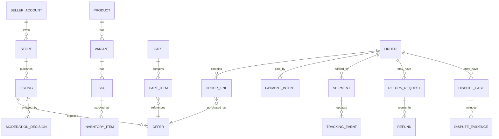
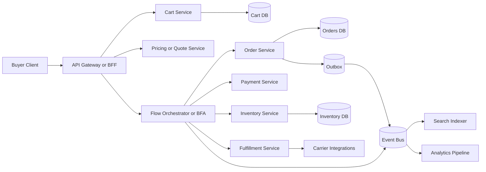
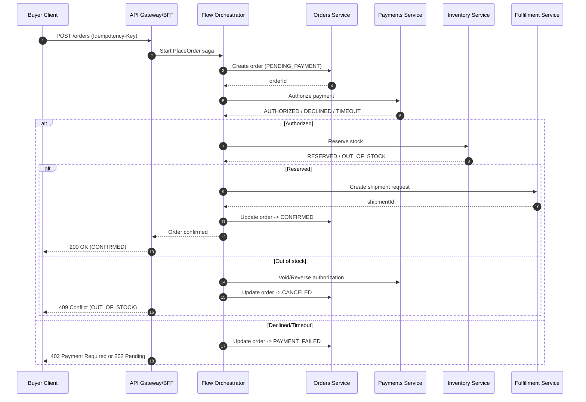

# Extending the Platform to Support a Large Marketplace Process

## Executive summary

The attached markdown describes a “giant shop” marketplace capability set—comparable at a module level to established marketplaces—and maps those modules onto your existing internal “Skill” and “Flow” building blocks (for example: an Auth service, SSO, Marketplace listings engine, Elasticsearch search, a Flow Orchestrator, Moderation, Analytics, Ticketing, etc.). fileciteturn0file0

A rigorous extension plan (even without complete process specifics) converges on four architectural imperatives:

First, treat the end-to-end commerce journey as **long-running, failure-prone workflows** and implement them as **sagas** with compensating actions rather than distributed ACID transactions. This is a well-established reliability pattern for multi-service business flows. citeturn5search1turn5search5turn5search17

Second, make both APIs and workflows **idempotent and retry-safe** (especially order placement, payment initiation, refunds, dispute decisions). Industry practice is to introduce explicit idempotency keys for non-idempotent operations and to formalize retry behavior. citeturn11search1turn11search2turn11search7

Third, adopt an **event-first contract strategy** (canonical domain events + strict schema/versioning) and use a durability pattern such as the **transactional outbox** to avoid “dual writes” inconsistencies between databases and message buses. citeturn5search0turn5search2turn5search6

Fourth, design from the outset for **marketplace compliance and trust-and-safety**: notice-and-action, appeals, moderation auditability, seller governance, and privacy-by-design controls. EU platform obligations around illegal goods/content reporting and appeals mechanisms are explicit in the Digital Services Act policy language. citeturn0search3turn7search3turn7search11

Where the attached markdown would materially change recommendations: detailed **process semantics** (state machines for Orders/Payments/Fulfillment/Disputes), marketplace-specific **business rules** (eligibility, cancellation windows, dispute arbitration rules), and **integration realities** (carriers, PSPs, tax engines, KYC/AML scope) will directly affect data model cardinality, API shapes, consistency choices, and required controls. fileciteturn0file0

## Baseline from the provided process document

The markdown provides two kinds of input:

It outlines a **shared marketplace module map** (identity, catalog/PIM, search/discovery, pricing/promotions, cart/checkout, payments, order management, fulfillment/logistics, returns/refunds/disputes, seller tooling, customer service, monetization, risk/compliance, analytics/ML), and it contrasts how two large marketplaces emphasize different subdomains (for example, first-party fulfillment networks vs cross-border buyer protection and dispute handling). fileciteturn0file0

It then maps those modules to your platform’s internal components (“Skills” and “Flows”) and emphasizes that your runtime composes capabilities through a **Flow Orchestrator** and an **Event-Aware Business Flow Arbiter** with a **state machine orchestration** model, plus “DNA” schemas for UI and rules. In other words, the core extension mechanism envisioned by the document is: add marketplace-specific domain logic as Skills, wire them into orchestrated flows, and govern transitions and UI composition via declarative schemas. fileciteturn0file0

Critical gaps (details needed from the markdown to finalize design, but not present as enforceable specs in the excerpt):

The precise **workflow definitions**: canonical order states, payment states (authorize/capture/refund), shipment states, dispute states, timeouts, SLAs, and what constitutes “delivery confirmation” vs “funds release” in your model. These determine whether you can implement a pure choreography approach or require a central orchestrator for correctness. citeturn5search1turn5search5

The exact **actor model and permissions**: buyer/seller/admin/CS agent, plus any multi-tenant requirements (seller isolation, store-level policies). This drives authorization boundaries and row-level security. citeturn4search0turn0search0turn0search1

The compliance/jurisdiction scope: EU vs US vs global materially changes obligations (DSA operational processes; GDPR/UK GDPR principles; CCPA notices/contracting; PSD2 SCA expectations for EU payments). citeturn0search3turn4search7turn7search1turn6search1

## Current platform architecture mapping and target domain decomposition

### Current architecture mapping from the markdown

From the document, your platform already has (at least conceptually) the following marketplace-adjacent capabilities implemented as modular services (“Skills”) and orchestrated flows: Identity/Auth, SSO, a Marketplace/listings engine, Elasticsearch-backed search, a feed/discovery service, payment processing, orchestration, chat/feedback/ticketing, moderation, and analytics. fileciteturn0file0

That implies an “existing platform mapping” like this (names reflect the markdown’s terminology, not necessarily your deployed service names): fileciteturn0file0

| Marketplace domain | Existing capability indicated in markdown | Likely missing for full marketplace |
|---|---|---|
| Identity & accounts | Auth + SSO Skills | Fine-grained roles/scopes, seller RBAC/ABAC, step-up auth for payouts |
| Catalog/PIM & listings | Marketplace Service (listings) | Full product/offer lifecycle, variant/SKU governance, compliance attributes, localization workflows |
| Discovery/search/feed | Elasticsearch + Feed Skills | Indexing pipelines, ranking experimentation, query rules, multi-tenant filtering (seller policies, restricted items) |
| Pricing/promotions | “DNA schemas” for promotions/cart rules | A dedicated pricing service, promo eligibility engine, price locks for checkout |
| Cart/checkout | Flow orchestration exists | Dedicated cart service, quote service, tax/shipping calculation, checkout orchestration boundaries |
| Payments | Payment service exists | Payment intent model, reconciliation, refunds, chargebacks, ledgering |
| Order management | Implied but not explicitly present | OMS service, order splitting, shipment groups, invoicing |
| Fulfillment/logistics | Not explicit | Carrier integrations, shipment tracking events, SLA/ETA modeling |
| Returns/refunds/disputes | Ticketing/feedback implied | RMA lifecycle, policy engine, arbitration and evidence handling, buyer-protection rules |
| Trust & safety | Moderation service exists | Policy enforcement pipelines for goods, seller risk scoring, audit-ready review trails |
| Analytics & ML | Analytics service exists | Canonical event schema, data quality contracts, experiment assignment and governance |

### Target decomposition for implementation

The safest approach (given incomplete process specifics) is to define a **target domain model** and then decide whether each domain is a standalone microservice, a “Skill” invoked by the orchestrator, or an external integration.

A practical target decomposition for a “giant shop” marketplace usually converges on these service boundaries:

A transactional core: **Catalog**, **Offers/Pricing**, **Cart**, **Orders**, **Payments**, **Fulfillment**, **Returns/Disputes**.

A trust & governance layer: **Seller onboarding and policy**, **Moderation**, **Fraud/risk signals**, **Audit logs**.

An experience and read-optimized layer: **Search**, **Recommendations/Feed**, **Product detail composition**, **Reviews/Q&A**.

The orchestration layer: your **Flow Orchestrator / BFA** as the saga coordinator for cross-service workflows (or as a policy-driven “macro-orchestrator” if you choose choreography internally). fileciteturn0file0 citeturn5search1turn5search8

### Design options comparison

Below are three viable architectural patterns for implementing the marketplace process on an existing modular platform, with explicit cost/complexity tradeoffs.

| Option | How it works | Pros | Cons | Cost and complexity profile |
|---|---|---|---|---|
| Orchestrator-centric sagas | The Flow Orchestrator/BFA explicitly drives state machines for Order→Payment→Fulfillment→Returns, invoking Skills/services and issuing compensations on failure | Clear visibility and control; easier to reason about end-to-end correctness; aligns with saga + compensating transactions guidance citeturn5search1turn5search17 | Orchestrator can become a bottleneck/“god service” if not carefully bounded; requires strong versioning and backward compatibility for flow definitions | Moderate–high engineering cost but typically fastest to correctness when requirements evolve |
| Event choreography with minimal orchestration | Services publish domain events and react to others’ events; orchestration is implicit via subscriptions (possibly with a thin policy layer) | High scalability and decoupling; services evolve independently; aligns with event-driven saga choreography guidance citeturn5search8turn5search2 | Harder debugging and replay; requires mature event contracts, idempotency, and outbox to avoid dual-write failures citeturn5search0turn11search1 | High up-front platform maturity cost; best long-term for very large scale |
| External commerce core with platform as experience layer | Use a dedicated commerce platform (headless APIs) for carts/orders/checkout and integrate; your platform focuses on UI composition, feeds, moderation and “extensions” | Faster time-to-market for commodity commerce primitives; leverage vendor battle-tested APIs (examples: headless storefront and commerce APIs) citeturn10search0turn10search2turn10search3 | Vendor lock-in; complex integration/migration; some marketplace-specific workflows (multi-seller disputes, special seller policies) may not fit without heavy customization | Lower initial build cost, higher long-term vendor/operational cost; complexity shifts to integration |

The attached markdown’s emphasis on a Flow Orchestrator/BFA and “Skill composition” strongly suggests Option 1 as the most aligned with your current platform philosophy, at least for the first milestone. fileciteturn0file0

## Data model and schema evolution

### New core entities and relationships

To implement the marketplace flows described (buyer discovery→checkout→post-purchase, seller onboarding→listing→payout, disputes/moderation), you will almost certainly need to introduce or formalize the following domain entities beyond “listing”:

Seller and governance:

SellerAccount, Store, SellerPolicyProfile, PayoutAccount, SellerVerificationStatus.

Catalog and offers:

Product, Variant, SKU, Listing, Offer (price + currency + region), InventoryItem, StockLedgerEntry (optional), MediaAsset, ComplianceAttribute.

Checkout and ordering:

Cart, CartItem, Quote (price-lock), Order, OrderLine, PaymentIntent (or PaymentAttempt), Shipment, ShipmentLeg/TrackingEvent, Invoice (optional).

Post-purchase and trust:

ReturnRequest (RMA), Refund, DisputeCase, DisputeEvidence, ModerationDecision, Review/Rating.

A canonical “event log” / integration support:

DomainEvent (outbox), IdempotencyKeyRecord, AuditLogEntry.

These are typical for marketplace correctness, and they map directly to the modules enumerated in the markdown. fileciteturn0file0

A minimal relational baseline (for SQL stores) is shown below. Even if you choose NoSQL for some domains, this ER structure is still useful as the canonical conceptual model.



### Schema changes and backward compatibility strategy

Because the markdown indicates you already have a Marketplace listings engine and orchestrated flows, you should expect **schema augmentation** rather than replacement for core marketplace records. fileciteturn0file0

A robust approach is to introduce:

A multi-actor identity model: add seller_id/store_id to any commerce record that must be attributable to a seller (listings, offers, shipments, disputes). This is foundational for authorization enforcement and auditability (OWASP highlights broken object/property level authorization for APIs). citeturn4search0turn4search4

Immutable monetary snapshots: “Quote” and “OrderLinePricingSnapshot” records to prevent price drift between browse and checkout; these snapshots also enable dispute arbitration and refunds to reference the “price at purchase time” even if offers later change.

An explicit workflow state model: state columns with monotonic transitions (optimistic concurrency via version fields). The saga pattern guidance emphasizes compensations and retryable idempotent steps, which require you to know what state each entity is in. citeturn5search1turn5search5

Durable integration artifacts: outbox tables and idempotency key records. The transactional outbox pattern is specifically intended to address “write DB + publish event” atomicity problems. citeturn5search0

### SQL vs NoSQL implications

With no specified constraints, a common pattern is:

Use SQL (PostgreSQL/MySQL) for Orders/Payments/Returns/Disputes because you need strong transactional guarantees, relational joins, and audit queries.

Use NoSQL for high-write, high-scale, document-like aggregates (carts, sessions, denormalized product read models), and for time-series-ish tracking events if needed.

Maintain Elasticsearch (already implied in the markdown) as a read-optimized inverted index for discovery. fileciteturn0file0

This hybrid aligns with the general microservice guidance that each service can choose the data store best suited for its needs, a point emphasized in saga-oriented microservice guidance. citeturn5search1turn5search9

## Integration points and API contracts

### API surfaces and contract governance

Given the platform’s modular and flow-driven nature, a clean pattern is to define three API surfaces:

A public “Buyer API” (or BFF) for browse/cart/checkout.

A “Seller API” for onboarding, listings, inventory, order fulfillment tasks, and dispute response.

An internal “Orchestration API” where the Flow Orchestrator/BFA invokes services and records transitions.

For schema governance, use OpenAPI 3.1 for HTTP APIs and JSON Schema alignment, because it is widely supported and explicitly aligns with modern JSON Schema dialects. citeturn5search3turn8search7turn8search21

For event contracts, consider adopting CloudEvents attributes to standardize event envelope metadata across producers/consumers. citeturn5search2turn5search6

### Suggested core endpoints and examples

Below are representative contracts. They are intentionally generic; process-specific details from the markdown (exact state machine and roles) would determine required fields such as “buyer protection deadlines,” arbitration rules, and shipping templates. fileciteturn0file0

**Create cart and add items**

```http
POST /v1/carts
Authorization: Bearer <token>

201 Created
{
  "cartId": "cart_123",
  "currency": "USD",
  "items": [],
  "version": 1
}
```

```http
POST /v1/carts/cart_123/items
Authorization: Bearer <token>
Idempotency-Key: 6f4c6a4d-7f6d-4ff8-97b7-1c7dd6c3d2f1
Content-Type: application/json

{
  "offerId": "offer_987",
  "quantity": 2
}

200 OK
{
  "cartId": "cart_123",
  "items": [
    {
      "cartItemId": "ci_1",
      "offerId": "offer_987",
      "sellerId": "seller_55",
      "quantity": 2,
      "unitPrice": {"amount": "19.99", "currency": "USD"}
    }
  ],
  "version": 2
}
```

The use of an Idempotency-Key is consistent with emerging HTTPAPI guidance and common payment/API practice. citeturn11search1turn11search21turn11search2

**Checkout quote and place order**

```http
POST /v1/carts/cart_123/quote
Authorization: Bearer <token>

200 OK
{
  "quoteId": "qt_456",
  "cartId": "cart_123",
  "pricing": {
    "itemsSubtotal": {"amount": "39.98", "currency": "USD"},
    "shipping": {"amount": "6.00", "currency": "USD"},
    "tax": {"amount": "3.60", "currency": "USD"},
    "total": {"amount": "49.58", "currency": "USD"}
  },
  "expiresAt": "2026-02-25T12:30:00Z"
}
```

```http
POST /v1/orders
Authorization: Bearer <token>
Idempotency-Key: 6a8a0ec4-3c57-4571-a10b-a1d4bbde0477
Content-Type: application/json

{
  "quoteId": "qt_456",
  "paymentMethod": {
    "type": "card",
    "paymentToken": "tok_xxx"
  },
  "shippingAddressId": "addr_9"
}

202 Accepted
{
  "orderId": "ord_1001",
  "status": "PENDING_PAYMENT",
  "createdAt": "2026-02-25T12:00:00Z"
}
```

Returning 202 Accepted acknowledges that order placement is a workflow, not a single atomic call, and aligns with an orchestrated saga model (payment authorization, inventory reservation, fulfillment initiation). citeturn5search1turn5search5

### Event contracts

A CloudEvents-aligned envelope enables consistent metadata like event id, source and type. citeturn5search2turn5search6

```json
{
  "specversion": "1.0",
  "type": "com.yourco.order.created.v1",
  "source": "orders-service",
  "id": "evt_01HZY...",
  "time": "2026-02-25T12:00:00Z",
  "datacontenttype": "application/json",
  "data": {
    "orderId": "ord_1001",
    "buyerId": "user_77",
    "sellerIds": ["seller_55"],
    "total": {"amount": "49.58", "currency": "USD"},
    "status": "PENDING_PAYMENT"
  }
}
```

### Data flow and sequence diagrams

A typical end-to-end “place order” data flow (abstracted to your orchestrator + services) looks like:



The outbox → event bus linkage is the recommended mechanism to prevent “dual write” inconsistencies in distributed systems. citeturn5search0

A sequence diagram for the “order placement saga”:



This structure is directly aligned with saga guidance: local transactions per service, followed by compensations on failure. citeturn5search1turn5search5turn5search17

## Security, privacy, and compliance controls

### Authentication and authorization

Given marketplace multi-actor complexity, a practical baseline is:

Use OAuth 2.0 for authorization and OpenID Connect for authentication (SSO), as defined in the core specifications. citeturn0search0turn0search1

Use fine-grained authorization to prevent Broken Object Level Authorization and Broken Object Property Level Authorization, which are highlighted as top API risks (for example, a seller must never read another seller’s orders; a CS agent may have scoped visibility). citeturn4search0turn4search12

Drive authentication assurance and step-up requirements (for payout account changes, dispute decisions, refunds) using digital identity guidelines; current NIST digital identity guidance is SP 800-63-4. citeturn4search6turn4search10turn4search20

Where the markdown changes details: the exact roles, “Skill” boundaries, and SaaS tenancy model determine whether you implement row-level security in SQL, application-layer ABAC, or a combination. fileciteturn0file0

### Payment security

If you process card data directly (even transiently), PCI DSS requirements apply; PCI SSC maintains current standards and publications (including PCI DSS v4.x). citeturn0search2turn0search6

In most architectures, you minimize PCI scope by using tokenization and PSP-hosted payment forms; PCI SSC provides tokenization guidance intended to support compliance. citeturn6search2turn6search5

If operating in the EU (or supporting EU-issued cards), Strong Customer Authentication under PSD2 is part of the regulatory environment; the European Commission and the European Banking Authority provide baseline references and timelines. citeturn6search1turn6search0

### Platform compliance and trust-and-safety

If you operate in the EU, the Digital Services Act policy materials describe obligations including mechanisms to flag illegal goods/content, platform response obligations, and appeals mechanisms. citeturn0search3turn7search11turn7search3

From a system design standpoint, this translates into:

Notice-and-action workflows as first-class entities (Notice, Decision, Action, Appeal).

Audit logging and reproducibility for moderation decisions (who, what evidence, when, why).

Operational tooling for “trusted flagger” prioritization and response SLAs if applicable. citeturn7search3turn0search11

### Privacy and data protection

For GDPR/UK GDPR-aligned regimes, Article 5 principles (lawfulness, purpose limitation, data minimization, storage limitation, integrity/confidentiality) are the core design constraints; EU guidance summarizes them in accessible form. citeturn4search7turn4search3turn4search21

If you have US consumer exposure, the CCPA provides consumer control and transparency rights, with official California guidance available via the Attorney General. citeturn7search1

A practical privacy-by-design implementation in your marketplace context includes:

Data classification with “PII vs operational” separation (especially for disputes, messages, and KYC files).

Retention schedules (orders and invoices often have statutory retention; chat transcripts and support tickets may not).

DSAR pipelines: export, deletion, correction, and “do not sell/share” where applicable. citeturn7search1turn4search7

Security control catalogs such as NIST SP 800-53 can serve as a control taxonomy for mapping your controls to audit language when needed. citeturn9search0turn9search4

For broader certification posture, ISO/IEC 27001 defines requirements for an ISMS and is commonly used as a security management baseline. citeturn6search3turn6search10

SOC 2 reporting (AICPA) is a common customer-facing assurance framework for SaaS; SOC 2 reports cover controls relevant to security, availability, processing integrity, confidentiality, and privacy. citeturn7search2

## Performance, scalability, resilience, and operability

### Performance and scalability implications

A large marketplace concentrates load in a few hot paths:

Discovery/search: high QPS, latency-sensitive, read-heavy. Your existing Elasticsearch datastore indication aligns with this. fileciteturn0file0

Product detail and offers: requires aggressive caching and read-model denormalization; price computation must be consistent and should be isolated behind a pricing/quote boundary.

Checkout/order placement: lower QPS but correctness-critical; requires workflow orchestration, durable state, and low tail latency.

Operationally, horizontal scaling via container orchestration is a standard approach; Kubernetes defines Horizontal Pod Autoscaler as a mechanism to scale workloads based on metrics. citeturn8search1turn8search8

Readiness/liveness/startup probes are central to safe rollouts and resiliency behaviors; Kubernetes documents their semantics and configuration. citeturn8search2turn8search6turn8search9

### Storage growth and data lifecycle

Orders, disputes, and audit logs will become your dominant long-term storage drivers; they must be modeled for:

Append-only history (status transitions, evidence attachments).

Immutability for financial events (payment authorizations, captures, refunds).

Queryable audit trails for compliance investigations. citeturn0search2turn5search1

Search indices (Elasticsearch) need explicit reindex strategies and schema/versioning for mapping changes; the marketplace domain will evolve, so plan for reindex pipelines and blue/green index cutovers. fileciteturn0file0

### Failure modes and recovery strategies

The most important failure classes in marketplace flows:

Duplicate requests and partial client timeouts: mitigate with request IDs/idempotency keys and server-side deduplication. citeturn11search7turn11search1turn11search21

Distributed workflow partial failures: mitigate with saga compensations and retryable operations. citeturn5search1turn5search5turn5search17

Dual-write inconsistency: mitigate with transactional outbox. citeturn5search0turn5search4

Event consumer drift and schema evolution: mitigate with explicit versioning, backward-compatible event changes, and contract testing.

Operational recovery building blocks:

Dead-letter queues for poison messages, plus replay tooling (reprocess events from an offset/time range).

Idempotent consumers (dedupe by event id; store “processed offsets” per consumer group).

A clear “compensation matrix” per saga step (for example: payment authorized but inventory fails → void/partial refund; shipment created but order cancellation occurs → carrier cancel/return-to-sender flow). citeturn5search1turn5search17turn5search8

### Observability and incident response

Marketplace debugging requires correlation across many services and workflows; adopting standardized traces/metrics/logs significantly reduces MTTR. OpenTelemetry is positioned as a vendor-neutral observability framework for generating and exporting telemetry. citeturn9search5turn9search13

A minimum observability contract:

A shared correlation id propagated from edge to orchestrator to downstream services.

Structured logs with immutable orderId/cartId/disputeId fields.

Workflow-level metrics: order conversion, payment decline rate, dispute rate, moderation backlog time.

## Testing, delivery, migration, and estimated effort

### Testing strategy

A marketplace extension should treat tests as layered evidence:

Unit tests for validators, pricing rules, state transitions, and authorization guards (explicitly target broken authorization risks per OWASP API security categories). citeturn4search0turn4search12

Integration tests for service boundaries (Orders↔Payments, Orders↔Inventory, Disputes↔Refunds), including idempotency and retry semantics.

Contract tests: verify OpenAPI schemas and event schemas; OpenAPI is designed to enable tool-assisted understanding and testing of HTTP APIs. citeturn5search3turn5search19

End-to-end tests for the sagas: place order, cancel, partial fulfillment, refund, dispute open→evidence→decision→refund.

Load tests focused on search/browse and on the orchestrator’s workflow throughput; ensure that scaling policies (HPA) and queue backpressure behave predictably. citeturn8search1turn8search8

Fault-injection tests: simulate payment timeouts, message retries, outbox delays, partial database failures, and verify compensations. Saga pattern guidance explicitly centers on handling failure with compensating actions. citeturn5search1turn5search17

### Deployment and CI/CD changes

Because the extension introduces many new integration surfaces, CI/CD should add:

Schema versioning gates: OpenAPI and event schema compatibility checks on every merge. citeturn8search7turn5search3turn5search2

Migration automation: database migrations with safe rollback patterns, plus backfill jobs.

Progressive delivery: canaries/feature flags for enabling new checkout/order workflows per cohort.

Operational safety defaults: readiness/liveness probes, autoscaling rules, and alerting thresholds. citeturn8search2turn8search1

### Migration and backward compatibility plan

A safe migration plan (assuming you already have some marketplace/listing capabilities) typically uses:

API versioning: introduce `/v1` endpoints without breaking existing clients; deprecate gradually.

Dual-write/dual-read with reconciliation (only if unavoidable): prefer outbox-driven event projection rather than direct dual writes.

Backfill pipelines: populate new entities (for example Offer and InventoryItem) from existing listing records; then switch read models.

State-machine compatibility: old orders (if any) remain in legacy states; new orders follow new saga states; provide translation/adapter layers for reporting.

Where the markdown specifics matter: if the Flow Orchestrator is already used for other flows, you must determine whether “giant shop” flows are (a) entirely new and versioned, or (b) an extension of existing flow definitions. That choice determines whether you can run parallel versions safely. fileciteturn0file0

### Effort estimate and milestones

With “no specific constraint” stated, the estimate below assumes a small cross-functional team (for example: 2–4 backend engineers, 1 platform/devops engineer, 1 QA, part-time security/compliance) and that your existing Skills are real and reusable as described. fileciteturn0file0

Time estimates are **engineering elapsed time**; parallelism is feasible if domains are well-bounded.

| Milestone | Scope | Primary outputs | Indicative duration |
|---|---|---|---|
| Requirements hardening | Extract concrete process states/rules from markdown; define actors and permissions; confirm integrations (PSP, carriers, tax) | State machines, role matrix, NFRs, data classification | 1–2 weeks |
| Domain model and contracts | Canonical entities; OpenAPI + event schemas; versioning strategy | ER model, OpenAPI 3.1 specs, CloudEvents envelopes | 2–3 weeks citeturn5search3turn5search2turn8search7 |
| Workflow backbone | Implement saga/orchestrator flows for PlaceOrder, CancelOrder, Refund, DisputeOpen | Orchestrator definitions, compensations, idempotency | 3–5 weeks citeturn5search1turn11search1 |
| Core services buildout | Orders, Cart, Pricing/Quote, Inventory reservation, Returns/Disputes | Service APIs + DBs + outbox | 4–8 weeks (overlapping) citeturn5search0 |
| Trust and safety | Moderation integration, notice/appeal flows, audit trails | Moderation workflow, audit logs, reporting hooks | 2–4 weeks citeturn0search3turn7search11 |
| Performance and hardening | Load tests, autoscaling, resilience/fault-injection, observability | SLOs, dashboards, HPA configs, probes | 2–4 weeks citeturn8search1turn9search5 |
| Launch and migration | Backfills, staged rollout, monitoring, incident playbooks | Migration runbooks, rollback plans, on-call readiness | 1–3 weeks |

### How stack choices change implementation

Node.js: strong fit for API gateways/BFFs and orchestration services due to high I/O concurrency; ensure robust typing (TypeScript) for schema evolution; pay special attention to async error handling in sagas.

Java: strong fit for transactional cores (Orders/Payments) with mature ORM and concurrency tooling; often easier to enforce strict domain invariants; heavier services but predictable under load.

Python: strong fit for analytics pipelines, moderation tooling, and internal ops services; for high-throughput APIs, use async frameworks and isolate CPU-heavy tasks.

SQL vs NoSQL: SQL tends to simplify transactional consistency for workflows; NoSQL can simplify high-scale cart/session or denormalized read models, but you must compensate with stronger application-level invariants and idempotent consumers. The saga/outbox patterns remain applicable regardless of language or store. citeturn5search1turn5search0