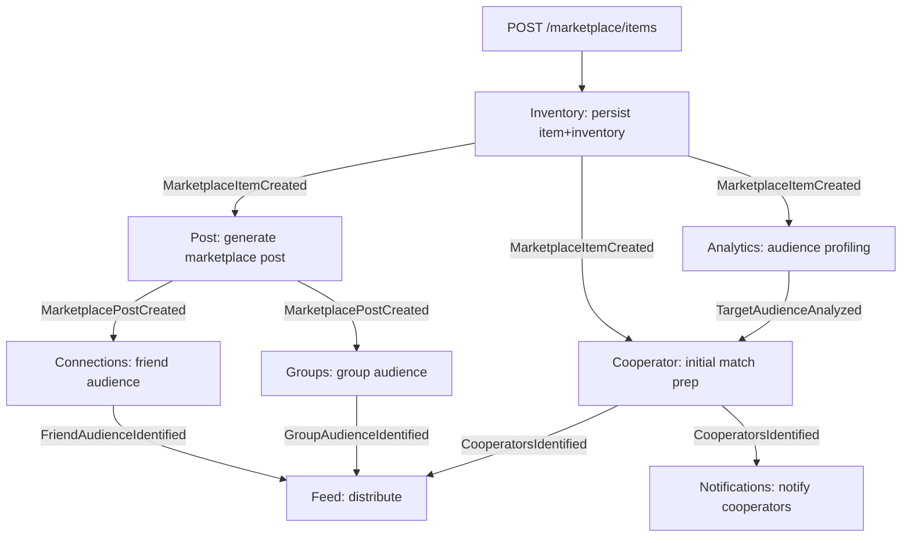
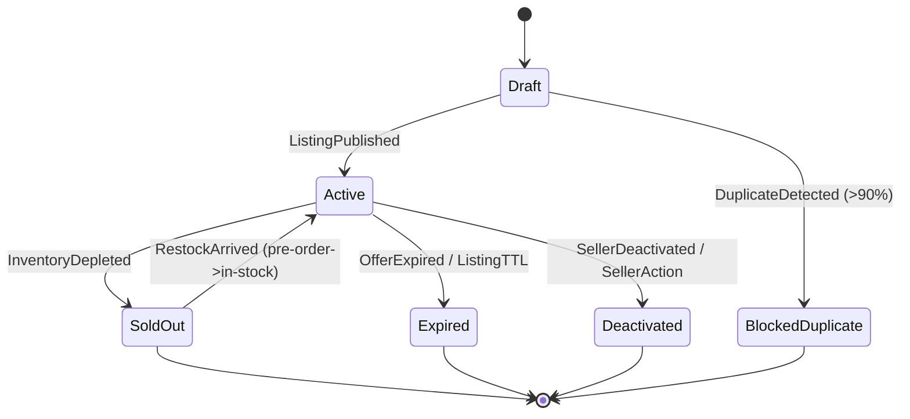
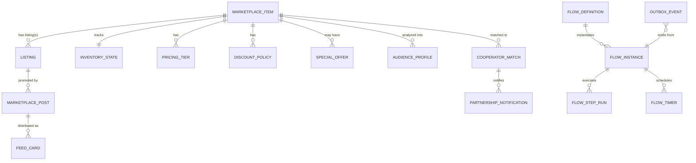
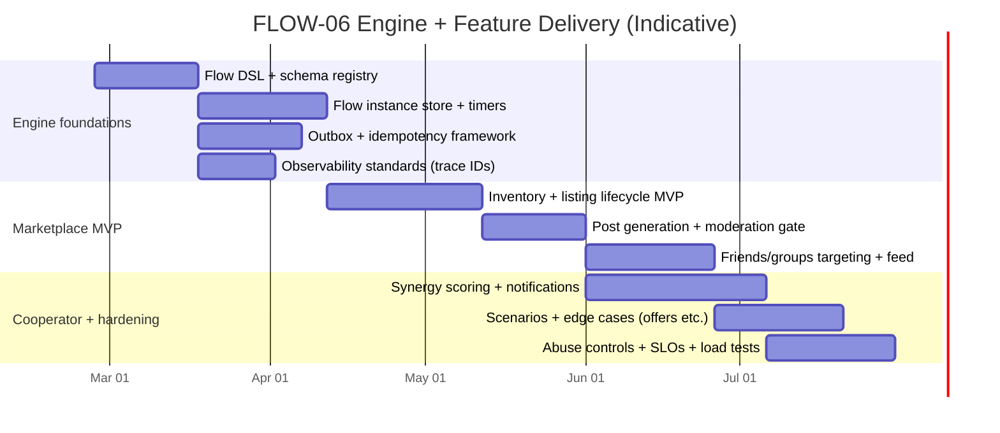

# Extending the Engine to Support FLOW-06 Marketplace Publishing & Distribution

## Executive summary

FLOW-06 (“Marketplace Publishing & Distribution”) defines a multi-stage marketplace listing workflow that blends e-commerce listing creation (items, inventory, pricing tiers), automated social promotion, audience targeting across friends/groups/business cooperators, and a synergy-based cooperator matching system with weighted scoring and partnership notifications. fileciteturn0file1

From an engine perspective, FLOW-06 is not “just another API endpoint”—it is a durable, event-driven workflow with (a) parallel branches, (b) multiple downstream fanout/distribution targets, (c) business state machines (listing lifecycle, inventory lifecycle, offer lifecycle), (d) timer-based behaviors (limited-time offers; 48-hour grace periods), and (e) sensitive, abuse-prone business flows (listing creation, discounting, partnership requests, and marketplace scraping). fileciteturn0file1 Guidance from entity["organization","OWASP","api security project"] emphasizes risks like Broken Object Level Authorization and Unrestricted Access to Sensitive Business Flows, both directly relevant to marketplace publishing and cooperator notifications. citeturn0search0turn0search3turn0search21

A robust implementation strongly favors an event-driven runtime in which the synchronous API path completes quickly (create canonical “item + listing” and return), while enrichment and distribution proceed asynchronously via events. FLOW-06 already specifies the event chain and parallel activation after item creation, making this architecture the “path of least resistance” to align the engine with the spec. fileciteturn0file1 For cross-service consistency, the engine should formalize a Saga-style workflow model (local transactions + compensations) and reliable event publishing (Transactional Outbox), as commonly recommended in distributed microservices. citeturn0search1turn0search4turn0search10

This report proposes an engine extension that treats FLOW-06 as a first-class declarative flow definition with durable runtime state, typed events, idempotent command handling, join/parallel semantics, retries/timeouts/DLQ patterns, and explicit UI/UX contracts for feed cards and seller dashboards. The proposals are grounded primarily in the FLOW-06 spec and companion deep-research notes provided in project sources. fileciteturn0file1turn0file0

## FLOW-06 required behaviors, I/O, states, triggers, errors, and UX

### Functional behaviors and outputs

The flow entry point is `POST /marketplace/items` with prerequisites: seller has a business profile (FLOW-02) and verified seller status. fileciteturn0file1 On item creation, three processes run in parallel: (1) analytics-based target audience profiling, (2) marketplace social post auto-generation, and (3) cooperator matching based on a synergy score. fileciteturn0file1

Outputs are not a single artifact; the flow produces multiple durable and derived outputs:

- A canonical marketplace “item” (product or service), with inventory/availability semantics and pricing rules. fileciteturn0file1  
- A public listing whose lifecycle is managed independently from the item (created and set to “active” in the happy path). fileciteturn0file1  
- An auto-generated marketplace post (headline, highlights, CTA, media, and special offers). fileciteturn0file1  
- Target audience analysis output (segments, personas, characteristics, etc.). fileciteturn0file1  
- Cooperator candidates with synergy scores and cooperation types (cross-promotion, bundle partner, referral partner, distribution channel). fileciteturn0file1  
- Feed distribution across three audiences (friends, groups, cooperators) using different card formats and discount contexts, plus partnership notifications to high-synergy cooperators. fileciteturn0file1  

### Inputs (request + implicit context)

Seller-provided inputs are explicitly listed in the happy path and scenarios: item details (title, description, media), pricing (base, bulk tiers, negotiability), inventory/availability, and “target audience.” fileciteturn0file1 Additional flow-shaping inputs appear in scenarios: limited-time offer `expiry timestamp`, pre-order `restock date`, service-listing flags (no inventory tracking), and bulk/wholesale pricing tiers. fileciteturn0file1

Implicit inputs include identity context (seller/business identity, verified seller status), social graph context (friends and purchase affinity), group membership and “marketplace-enabled groups,” and business-cooperator graph/candidate pool. fileciteturn0file1

### Events, triggers, and transitions

FLOW-06 specifies the event chain, publishers/consumers, and key payload fields. The engine must handle event-based transitions as primary triggers (not just synchronous orchestration). fileciteturn0file1

Key triggers and transitions include:

- `MarketplaceItemCreated` triggers analytics/post/cooperator processing. fileciteturn0file1  
- `ListingPublished` triggers post and analytics enrichment. fileciteturn0file1  
- `TargetAudienceAnalyzed` triggers cooperator matching. fileciteturn0file1  
- `MarketplacePostCreated` triggers friend/group audience identification and feed distribution processing. fileciteturn0file1  
- `CooperatorsIdentified` triggers feed distribution + notifications. fileciteturn0file1  
- `InventoryDepleted` triggers removal from active feeds and “Sold Out” behavior (edge case). fileciteturn0file1  

A practical engine representation is an event-driven workflow graph rather than a purely request/response pipeline:



### Business state machines required by the flow

The spec implies multiple state machines the engine must support (durably, with auditable history):

- Listing lifecycle (created active; removed; expired; sold out; blocked as duplicate). fileciteturn0file1  
- Inventory lifecycle (tracked quantity; pre-order; service/unlimited; depleted). fileciteturn0file1  
- Offer lifecycle (limited-time offer active → expired → auto-remove from feeds). fileciteturn0file1  
- Cooperator partnership state (not fully defined, but implied via “negotiated bundle pricing,” “pending discussions,” and “48-hour grace period” after price change). fileciteturn0file1  

A concrete listing lifecycle state machine consistent with happy path + edge cases:



Key requirements embedded above come directly from the spec: listing is set “active” after publish; inventory depletion publishes `InventoryDepleted`; limited-time offers expire; seller deactivation cancels listings; duplicate listing detection blocks duplicates over 90% similarity. fileciteturn0file1

### Error handling and resilience expectations

While the spec is not a formal reliability document, it explicitly calls out operational alert thresholds and abuse concerns:

- Alerts: inventory out-of-sync > 30 seconds; listing creation failure rate > 3%; cooperator matching > 20 seconds; marketplace search latency > 2 seconds. fileciteturn0file1  
- Threat model: fake listings → moderation + seller verification; price manipulation → auditable pricing changes; cooperator spam → rate limit partnership requests (5/day); scraping → rate limit search and require auth for detailed pricing. fileciteturn0file1  

These requirements imply the engine must provide standardized mechanisms for:
- retries + backoff + DLQ handling for asynchronous steps,
- idempotency and duplicate-event tolerance (since events can be delivered at least once),
- observability and SLO monitoring at both step-level and end-to-end flow-level.  
At-least-once delivery semantics and resends are explicitly documented in entity["company","Confluent","kafka vendor"] guidance for Kafka delivery semantics. citeturn2search16

### UI/UX expectations that the engine must surface

FLOW-06 includes explicit UI-facing expectations that should be treated as contracts (not “nice to have”):

- Feed cards differ by audience and synergy level, including “Partnership Opportunity” cards at high synergy (>0.75) and badges at medium synergy (0.5–0.75). fileciteturn0file1  
- Limited-time offers require countdown timers and auto-removal from feeds after expiry. fileciteturn0file1  
- Pre-order listings require “Coming Soon” badge and conversion to regular listing on stock arrival. fileciteturn0file1  
- Service listings require a different card format and booking CTA. fileciteturn0file1  
- Bulk pricing requires “Volume Discount” badge and cooperator feed showing wholesale pricing specifically. fileciteturn0file1  
- Duplicate detection must block duplicates and suggest “update existing listing.” fileciteturn0file1  

For the engine, this translates into a need for: (a) a consistent “card schema” registry, (b) a status/progress API for the seller to see which parallel branches completed and why, and (c) timer support to drive expirations and grace periods.

## Current engine architecture baseline and gap analysis

### Baseline components referenced in project sources

Even though broader engine documentation is not available in this chat, FLOW-06 explicitly references (or assumes) multiple “engine” and platform components that must be treated as existing building blocks:

- A `FlowOrchestrator` responsible for managing transitions across parallel branches in the flow. fileciteturn0file1  
- A “Flow Definition” repository (called out as a new required entry for FLOW‑06), implying a system of declarative flow registrations and versions. fileciteturn0file1  
- An API Gateway with aggregation patterns referenced via Ocelot/YARP to present seller dashboards (unified view of items, synergy matches, and post previews). fileciteturn0file1  
- A `DatabaseFabric` concept that can incorporate multiple stores: PostgreSQL, MongoDB, Redis Cluster, Elasticsearch, and Neo4j. fileciteturn0file1  
- AI/ML integration points: `AiDispatcher` for LLM-based product complementarity and a `RAG Planner` for marketplace intelligence. fileciteturn0file1  
- Security-related services: Permissions Service (RBAC extensions needed) and Moderation Service for reviewing marketplace content. fileciteturn0file1  

The same source also documents a polyglot microservices reality: some services are specified as Nest.js-based (Inventory, Marketplace, Post), while other passages recommend .NET Core microservices “per established backend standards,” and cooperator matching is described as Python + ML. fileciteturn0file1 This implies the flow engine must not require a single implementation language across steps; it should standardize on contracts (APIs/events), not codebases.

### Major gaps to support “flow creation” and FLOW-06-class workflows

The gaps below are framed as “engine capability gaps” rather than “missing services,” because the request is specifically about extending the engine to support creating and running flows like FLOW-06.

**Durable workflow instance model (missing or underspecified).**  
FLOW-06 requires tracking a workflow instance across async events: item created → listing published → audience analyzed → post created → audience identified → feed distributed → notifications sent. fileciteturn0file1 A flow engine needs a persistent state store for instances, step statuses, correlation keys, and error states; otherwise, the platform will rely on ad-hoc coupling between services.

**First-class parallel/join semantics.**  
The spec’s “three parallel processes activate” requirement is central. fileciteturn0file1 Many flow runtimes can express “fan-out” (trigger N tasks), but FLOW-06 needs controlled joins and partial progress reporting (e.g., post created even if cooperator matching is still running).

**Reliable event publishing and idempotent processing framework.**  
Because the workflow is event-driven, reliability hinges on correct event emission and tolerance to duplicates. The Transactional Outbox pattern ensures messages are sent “if and only if” the database transaction commits. citeturn0search10 At-least-once semantics mean consumers must handle duplicates. citeturn2search16 The engine should provide standard libraries/patterns so each service doesn’t reinvent dedupe and outbox logic.

**Timer/scheduler primitives.**  
Limited-time offers (expiry) and 48-hour cooperator grace periods require timer-driven transitions. fileciteturn0file1 The engine needs a scheduler abstraction (durable timers) rather than “cron sprinkled across services,” otherwise these behaviors become inconsistent and hard to audit.

**Policy and abuse controls integrated with flow execution.**  
FLOW-06 includes explicit rate limits (e.g., partnership requests 5/day) and anti-scrape measures. fileciteturn0file1 OWASP’s API Security Top 10 highlights the risk of exposing sensitive business flows without adequate access restrictions or protections against automated abuse. citeturn0search3turn0search0 The engine should support “policy gates” (quotas, rate limits, and permissions checks) as reusable flow steps or middleware.

**UI contract registry (feed cards, badges, countdowns).**  
The flow defines multiple card types and badges based on synergy and scenarios. fileciteturn0file1 Without an engine-level unified schema/registry for card payloads and lifecycle semantics (TTL, expiry), UI will fracture into per-service ad-hoc payloads.

**Observability as a flow-level primitive.**  
Because FLOW-06 spans APIs and asynchronous events, end-to-end debugging requires trace/flow correlation. The entity["organization","World Wide Web Consortium","web standards body"] Trace Context spec defines `traceparent`/`tracestate` as a standard for propagating trace context across boundaries. citeturn1search0turn1search4 entity["organization","OpenTelemetry","observability project"] provides standard concepts for traces/log correlation and telemetry signals that can be applied consistently. citeturn1search18turn1search5 The engine should require correlation IDs and trace propagation in both HTTP and event envelopes.

## Requirements-to-architecture mapping table

The table below maps FLOW-06 requirements (from the spec) to the “engine + platform” architecture, identifies gaps, and proposes concrete changes. fileciteturn0file1

| Requirement from FLOW-06 | Current component(s) referenced | Gap / failure mode | Proposed engine/platform change |
|---|---|---|---|
| Entry point `POST /marketplace/items` with verified seller prerequisite | Marketplace/Inventory services; Permissions model mentioned | Risk of inconsistent prerequisite enforcement across services | Add engine middleware policy gates: seller verification + business profile checks as reusable step/middleware. fileciteturn0file1 |
| Create item + inventory, then publish `MarketplaceItemCreated` | Inventory Service | Dual-write risk (DB commit but event not published) | Standardize Transactional Outbox in engine SDK; require outbox for publishing domain events. citeturn0search10 |
| Listing created and set to “active,” then publish `ListingPublished` | Marketplace Service | Listing lifecycle rules not formalized; state drift | Add explicit listing state machine and engine-validated transitions; persist state history. fileciteturn0file1 |
| Parallel branches: analytics profiling, post generation, cooperator matching | FlowOrchestrator referenced | No standard parallel/join semantics; hard to track progress | Extend flow definition DSL with parallel blocks, join conditions, partial completion reporting. fileciteturn0file1 |
| Audience profiling output (`TargetAudienceAnalyzed`) feeds cooperator matching | Analytics Service + Cooperator/Matching | Correlation errors if `itemId` mismatch or event ordering differs | Enforce correlation keys (`itemId`, `listingId`) in engine event envelope; validate schemas/versioning. fileciteturn0file1 |
| Auto-generated social marketplace post (`MarketplacePostCreated`) triggers friend/group targeting + feed | Post/Connection/Group/Feed services | Event duplication causes duplicate feed cards | Engine-provided idempotent consumer helper (dedupe store keyed by event id + recipient). At-least-once semantics imply duplicates. citeturn2search16 |
| Friend audience identified with purchase affinity scoring | Connection Service | Potential PII leakage; large payload size | Define “audience pointer” pattern: publish audience set reference, not full payload; require authorization for retrieval. fileciteturn0file1 |
| Group audience: marketplace-enabled groups get autoposts | Group Service | Missing metadata contract for “marketplace-enabled” | Define `GroupMarketplaceSettings` schema and API; validate in flow step. fileciteturn0file1 |
| Cooperator synergy scoring with weighted formula + thresholds | Cooperator / Matching service referenced | Scoring logic drift; explainability missing; expensive compute | Treat scoring as versioned “model/algorithm artifact” with inputs/outputs schema; store explanation vectors and weights per run. fileciteturn0file1 |
| Do not show competing products as partnership opportunity | Cooperator Service + Feed Service | Business rule enforcement split across services | Encode “competing excludes partnership card” as engine rule evaluated before feed distribution. fileciteturn0file1 |
| Feed card formats vary by synergy thresholds | Feed Service | UI coupling; card schema drift | Add engine-level Card Schema Registry + versioned card payloads; treat as contract with UI. fileciteturn0file1 |
| Friend discount (5–10%) and group discount (10–15%) | Marketplace pricing rules | Risk of price manipulation and inconsistent enforcement | Create `DiscountPolicy` entity with audit log + validation (min/max). Apply in pricing service and embed in cards. fileciteturn0file1 |
| Cooperator bundle pricing negotiated | Marketplace + Cooperator system | Negotiation workflow missing | Introduce “PartnershipAgreement” subflow state machine with negotiation states and price locking. fileciteturn0file1 |
| Limited-time offer: countdown + auto-remove | Feed + Notification | Timer behavior becomes ad-hoc | Engine “durable timers”: schedule expiry actions for offer TTL and feed cleanup. fileciteturn0file1 |
| Pre-order mode: restock date and “Coming Soon” | Inventory/Feed | Stock arrival transition undefined | Define inventory modes + transition triggers (restock) and listing state adjustment. fileciteturn0file1 |
| Service listing: no inventory tracking + booking CTA | Inventory/Feed | Different UX and validation rules | Add `itemType=service` schema branch; validate required CTA fields; use card type `service_listing`. fileciteturn0file1 |
| Bulk pricing tiers + “Volume Discount” badge | Pricing service + Feed | Tier modeling and display rules unclear | Add `PricingTier[]` model; store and render tier hints; enforce monotonic tier rules. fileciteturn0file1 |
| Inventory reaches zero: publish `InventoryDepleted`; remove from active feeds; sold out badge | Inventory + Feed | Read-model staleness; partial removal | Add inventory event consumers + feed card update/remove semantics; set “sold_out” on existing cards; persist reconciliation job. fileciteturn0file1 |
| Seller deactivates account: cancel listings, remove from feeds, notify discussions, refund pre-orders | Permissions/Marketplace/Feed/Payments implied | Requires compensation across services | Engine Saga definition with compensating actions. Saga pattern: local transactions + compensations. citeturn0search1turn0search4 |
| Price change after cooperator agreement: notify + 48-hour grace | Marketplace + Notification | Timer + agreement link missing | Implement agreement state; add timer for grace window; ensure pricing version lock. fileciteturn0file1 |
| Cross-currency pricing: base in seller currency, display in buyer currency using daily exchange rates | Pricing | FX provider + rounding policy undefined | Add `FxRateService` abstraction; store daily rates; document “info-only” alignment if using ECB reference rates. citeturn3search0turn3search16 |
| Duplicate listing detection: NLP similarity >90% blocks duplicates | Marketplace | Model undefined; false positives | Add pluggable DuplicateDetection service step; store similarity evidence; allow override workflow for moderators. fileciteturn0file1 |
| Scraping + rate limits for search and detailed pricing | API Gateway + Marketplace | High abuse risk | Add common rate limiting + bot detection; treat as OWASP “sensitive business flow.” citeturn0search3turn0search0 |
| Alerts: inventory out-of-sync, search latency, matching latency, listing failure | DevOps expectations in spec | No unified SLO model | Add flow-level metrics + SLO definitions per step; export via standard telemetry. fileciteturn0file1 |

## Proposed data model and API contract extensions

### Data model proposals

FLOW-06 requires both transactional “source of truth” records and derived/read models for distribution. The spec explicitly enumerates diverse storage needs: relational for listings/inventory, document store for posts, caches for throughput, search index for marketplace search, and graph store for connections. fileciteturn0file1

A minimal, engine-aligned logical model:



Key modeling notes tied to requirements:

- **Transactional entities** (strong consistency): `MARKETPLACE_ITEM`, `INVENTORY_STATE`, `LISTING`, `PRICING_TIER`, `DISCOUNT_POLICY`. (Inventory must remain strongly consistent per DevOps notes.) fileciteturn0file1  
- **Derived entities** (recomputable or cached): `AUDIENCE_PROFILE`, `COOPERATOR_MATCH`, `FEED_CARD`. fileciteturn0file1  
- **Timer-driven behaviors**: `SPECIAL_OFFER.expires_at`, `FLOW_TIMER` to support expiry and grace windows. fileciteturn0file1  
- **Retention/TTL**: Feed cards and some promotional artifacts should support TTL deletion patterns. TTL mechanisms depend on store; e.g., entity["company","Redis","in-memory data store"] supports expirations via `EXPIRE`, and entity["company","MongoDB","database vendor"] supports TTL indexes via `expireAfterSeconds`. citeturn2search0turn2search1  
- **Search index lifecycle**: If marketplace search uses Elasticsearch as stated, ILM policies can automate rollover/retention/delete for time-bucketed indices. citeturn1search3  

### API contract proposals

#### Marketplace API surface

Because FLOW-06 is event-driven, the creation endpoint should be **fast** and **idempotent**, returning a handle the UI can use to poll/subscribe for progress.

A common pattern is an `Idempotency-Key` on POST so client retries do not create duplicate listings. entity["internet_engineering_task_force","Internet Engineering Task Force","httpapi working group"] has a draft defining the `Idempotency-Key` header for making POST/PATCH retries fault-tolerant, and entity["company","Stripe","payments company"] documents server-side idempotency behavior (store first response and replay it for retries). citeturn2search5turn2search2

Proposed public endpoints (minimal set to satisfy FLOW-06 behaviors):

- `POST /marketplace/items` (create item + listing; triggers async flow)  
- `GET /marketplace/items/{itemId}` (read canonical item)  
- `GET /marketplace/items/{itemId}/status` (seller dashboard: flow progress + derived artifacts IDs)  
- `PATCH /marketplace/listings/{listingId}` (activate/deactivate; optionally expire)  
- `POST /marketplace/items/{itemId}/inventory/adjust` (stock changes; triggers depletion/restock logic)  
- `GET /marketplace/items/{itemId}/cooperators` (seller view of cooperator matches)  
- `POST /marketplace/partnerships` (request partner / negotiate bundle; rate-limited)  
- `GET /marketplace/search` (search listings; rate-limited, auth gating for detailed pricing)

#### Engine APIs to support “flow creation”

To “extend the engine to support flow creation,” the platform needs explicit flow lifecycle endpoints (or an equivalent GitOps-managed registry). The spec’s mention of a “Flow Definition repository” implies versioned definitions. fileciteturn0file1

Proposed engine endpoints:

- `POST /engine/flows` (register a new flow definition)  
- `POST /engine/flows/{flowId}/versions` (publish a new version)  
- `GET /engine/flows/{flowId}` and `GET /engine/flows/{flowId}/versions`  
- `GET /engine/instances/{instanceId}` (debug/ops visibility)  
- `POST /engine/instances/{instanceId}/cancel` (controlled cancellation/compensation)  

OpenAPI is the natural format to formalize these APIs. The OpenAPI Specification provides a standard schema format for describing REST APIs and schemas. citeturn4search0 JSON Schema can be used to validate event payloads and request bodies. citeturn4search1

### Example request/response schemas

#### `POST /marketplace/items` request (JSON Schema excerpt)

```json
{
  "$schema": "https://json-schema.org/draft/2020-12/schema",
  "$id": "CreateMarketplaceItemRequest",
  "type": "object",
  "required": ["item", "pricing", "availability", "targetAudience"],
  "properties": {
    "item": {
      "type": "object",
      "required": ["type", "title", "description", "categoryId"],
      "properties": {
        "type": { "type": "string", "enum": ["product", "service"] },
        "title": { "type": "string", "minLength": 1, "maxLength": 140 },
        "description": { "type": "string", "minLength": 1, "maxLength": 5000 },
        "categoryId": { "type": "string" },
        "media": {
          "type": "array",
          "items": { "type": "object", "required": ["url"], "properties": { "url": { "type": "string" } } }
        }
      }
    },
    "availability": {
      "type": "object",
      "required": ["mode"],
      "properties": {
        "mode": { "type": "string", "enum": ["in_stock", "pre_order", "unlimited_service"] },
        "quantity": { "type": "integer", "minimum": 0 },
        "restockDate": { "type": "string", "format": "date" }
      }
    },
    "pricing": {
      "type": "object",
      "required": ["currency", "basePrice"],
      "properties": {
        "currency": { "type": "string", "minLength": 3, "maxLength": 3 },
        "basePrice": { "type": "number", "minimum": 0 },
        "negotiable": { "type": "boolean", "default": false },
        "bulkTiers": {
          "type": "array",
          "items": {
            "type": "object",
            "required": ["minQty", "unitPrice"],
            "properties": {
              "minQty": { "type": "integer", "minimum": 1 },
              "unitPrice": { "type": "number", "minimum": 0 }
            }
          }
        },
        "discounts": {
          "type": "object",
          "properties": {
            "friendDiscountPct": { "type": "number", "minimum": 0.05, "maximum": 0.10 },
            "groupDiscountPct": { "type": "number", "minimum": 0.10, "maximum": 0.15 }
          }
        }
      }
    },
    "specialOffer": {
      "type": "object",
      "properties": {
        "type": { "type": "string", "enum": ["limited_time"] },
        "expiresAt": { "type": "string", "format": "date-time" }
      }
    },
    "targetAudience": {
      "type": "object",
      "properties": {
        "industries": { "type": "array", "items": { "type": "string" } },
        "geo": { "type": "object" },
        "buyerPersonas": { "type": "array", "items": { "type": "string" } }
      }
    }
  }
}
```

This schema encodes spec constraints: item may be product or service; pre-order needs restock date; friend/group discounts must be within specified ranges; limited-time offer includes expiry. fileciteturn0file1

#### `POST /marketplace/items` response (async)

```json
{
  "itemId": "itm_01J...ULID",
  "listingId": "lst_01J...ULID",
  "flowInstanceId": "flowi_01J...ULID",
  "status": "accepted",
  "links": {
    "item": "/marketplace/items/itm_01J...ULID",
    "status": "/marketplace/items/itm_01J...ULID/status"
  }
}
```

#### Event envelope recommendation

To make flow creation and interoperability easier across teams and languages, use a standard envelope like CloudEvents. CloudEvents is a CNCF-hosted specification for describing event data in a common way. citeturn0search5turn0search2

Example (CloudEvents-like JSON):

```json
{
  "specversion": "1.0",
  "id": "evt_01J...ULID",
  "source": "inventory-service",
  "type": "com.acme.marketplace.MarketplaceItemCreated.v1",
  "subject": "item/itm_01J...ULID",
  "time": "2026-02-25T10:00:00Z",
  "datacontenttype": "application/json",
  "data": {
    "itemId": "itm_01J...ULID",
    "sellerId": "usr_01J...ULID",
    "pricing": { "currency": "USD", "basePrice": 29.99 },
    "availability": { "mode": "in_stock", "quantity": 10 },
    "targetAudience": { "industries": ["..."] }
  }
}
```

## Prioritized implementation roadmap, effort, dependencies, and risks

### Roadmap overview

The roadmap below prioritizes engine capabilities that unlock *any* FLOW-06-class workflow (parallel branches, timers, idempotency, event schema governance), then layers FLOW-06 domain services and UI behaviors.

Effort is qualitative (low/med/high) as requested, because actual sizing depends on what already exists (feed pipeline maturity, broker choice, identity model, and moderation/payments integrations). FLOW-06 explicitly assumes an existing ecosystem of services and dependencies (business profile FLOW-02, friend connections FLOW-07, feed pattern FLOW-04, payments microservice). fileciteturn0file1

### Task-level plan

| Priority | Workstream | Task | Effort | Dependencies | Key risks |
|---|---|---|---|---|---|
| P0 | Flow engine core | Define a canonical Flow Definition DSL (supports: entry points, prerequisites, event triggers, parallel blocks, joins, compensation hooks, timers) | High | Flow Definition repository exists but needs schema | DSL complexity; adoption friction |
| P0 | Flow engine core | Implement durable Flow Instance Store (instance state, step runs, correlation keys, timers) | High | Storage choice (PostgreSQL recommended) | Incomplete correlation → “ghost instances” |
| P0 | Reliability | Standardize Transactional Outbox library and adoption for event publication | Medium | DB migrations in producer services | Partial rollout causes inconsistency; outbox lag |
| P0 | Reliability | Build idempotency framework for command endpoints (`Idempotency-Key` support) | Medium | API gateway + storage for keys/results | Memory growth/retention; replay of failures (expected) citeturn2search2 |
| P0 | Governance | Establish event schema registry + versioning rules (CloudEvents type naming, payload JSON Schema) | Medium | Cross-team alignment | Schema drift breaks consumers |
| P0 | Observability | Enforce tracing + correlation IDs across HTTP and events | Medium | Telemetry stack | Async trace gaps; requires standards (W3C + OpenTelemetry) citeturn1search0turn1search18 |
| P1 | Marketplace domain | Implement/extend Inventory Service (product/service CRUD, availability modes, depletion event) | High | AuthZ + DB | Strong consistency; concurrency/races (oversell later) |
| P1 | Marketplace domain | Implement/extend Marketplace Service (listing state machine, pricing rules, discounts + audit) | High | Inventory item IDs | Price manipulation; state drift |
| P1 | Distribution | Integrate Post generation and moderation gates for marketplace posts | Medium | Moderation Service | Content policy unclear; latency variability |
| P1 | Distribution | Friend/group audience identification and feed fanout with card schema registry | High | Connection + Group + Feed services | Fanout scale; duplicates; UX mismatch |
| P2 | Cooperator system | Implement synergy scoring pipeline with stored explanations + thresholds | High | Analytics + product complementarity | Large candidate pool; latency budget (>20s alert) fileciteturn0file1 |
| P2 | Cooperator system | Implement partnership notifications + rate limiting (5/day) | Medium | Notification service | Spam/abuse; opt-out requirements |
| P2 | Scenarios | Limited-time offers: durable timers + feed cleanup | Medium | Timer primitive | Clock skew; missed timers |
| P2 | Scenarios | Pre-order and stock-arrival transitions | Medium | Inventory events | State machine corner cases |
| P2 | Scenarios | Service listing card format and booking CTA validation | Low | UI alignment | Inconsistent UI payload versions |
| P2 | Scenarios | Bulk pricing tiers + wholesale display for cooperators | Medium | Pricing model | UI complexity + pricing correctness |
| P2 | Edge cases | Seller deactivation compensation (cancel listings, remove feeds, notify discussions, refund preorders) | High | Payments + messaging | Hard compensations; unclear refund semantics |
| P2 | Edge cases | Price change grace period behavior (48-hour timer) | Medium | Partnership agreements | Data model not defined; disputes |
| P2 | Edge cases | Duplicate listing detection gate (>90% similarity) | Medium | Similarity service choice | False positives; moderation override needs |
| P3 | Security | Marketplace anti-scrape + rate limiting + auth for detailed pricing | Medium | Gateway tooling | OWASP “sensitive flow” exposure | citeturn0search3 |
| P3 | Compliance | Cross-currency display policy + FX source | Medium | FX provider | ECB rates are information-only; checkout policy differs citeturn3search0 |
| P3 | SLOs | Implement SLO dashboards for spec thresholds (inventory sync, listing failure, matching latency, search latency) | Medium | Metrics pipeline | Alert fatigue; missing attribution |

### Proposed delivery timeline and resourcing

The workflow spans marketplace CRUD + event-driven enrichment + feed fanout + cooperator scoring, which typically requires multiple parallel workstreams. A realistic plan uses a multi-team, overlapping schedule.

A feasible staged timeline (assuming core platform primitives exist: identity, groups, connections, feed, notifications, and an event broker) is:

- **Engine foundation + minimal FLOW-06 MVP** (create listing → generate post → distribute to friends/groups): ~10–14 weeks  
- **Full FLOW-06 v1** (cooperators, pricing tiers/discounts, scenarios/edge cases, observability + abuse controls): ~16–24 weeks  

These ranges are consistent with the complexity outlined in the project’s deep-research notes and the breadth of scenarios/edge cases explicitly required by FLOW-06. fileciteturn0file0turn0file1

A pragmatic staffing model (typical for a flow of this breadth):

- 2–3 backend engineers (marketplace + engine runtime + data model)
- 1 backend engineer (feed distribution + card schemas + UI contracts)
- 1 data/ML engineer (cooperator scoring, product complementarity, audience analytics integration)
- 1 frontend engineer (listing wizard, seller dashboard, partnership UI/cards)
- 0.5–1 platform/SRE (broker, outbox relay ops, tracing/metrics, rate limiting)
- 1 QA/automation engineer (contract + e2e + load testing)

Timeline visualization (indicative):



## Test plan, migration strategy, and backward compatibility

### Test plan structure

Because FLOW-06 is event-driven with many consumers, tests must cover both synchronous APIs and asynchronous event contracts.

- **Schema and contract tests (highest ROI):**  
  Use consumer-driven contract testing for HTTP APIs and message/event payloads. citeturn4search2turn4search10

- **Deterministic unit tests:**  
  Pricing/discount bounds (friend 5–10%, group 10–15%), synergy score calculation weights and threshold mapping, listing state transition guards, timer scheduling logic. fileciteturn0file1  

- **Integration tests:**  
  Outbox publishing (event emitted iff DB commit), idempotency key replay behavior, dedupe correctness with duplicate event redelivery, timer triggers. Transactional Outbox guarantees “sent iff commit,” so tests should assert that invariant. citeturn0search10

- **End-to-end tests (staging):**  
  Full path: create item → listing active → post generated → friend/group/cooperator distribution → notifications surfaced → analytics events.

- **Load and resilience tests:**  
  Feed fanout throughput; cooperator matching latency (alert threshold >20s); search latency (>2s) per spec SLO hints. fileciteturn0file1

### Representative test cases and validation criteria

| Area | Test case | Expected result | Validation criteria |
|---|---|---|---|
| Idempotency | Retry `POST /marketplace/items` with same Idempotency-Key | Same itemId/listingId returned, no duplicate state | DB has exactly one item/listing; repeated response is identical (Stripe-style). citeturn2search2 |
| Parallel branches | Analytics slow, Post fast | Post is created and distributed while analytics continues | Seller status endpoint shows partial progress; no blocking UI |
| Duplicate events | Redeliver `MarketplacePostCreated` twice | Exactly one feed card per recipient | Feed store enforces dedupe keys; consumers idempotent (at-least-once tolerance). citeturn2search16 |
| Limited-time offer | Offer expiring at T | Countdown shown; after T cards removed/hidden | Timer fires within SLA; feed no longer returns active offer card. fileciteturn0file1 |
| Pre-order | availability=pre_order, restockDate set | “Coming Soon” badge shown; restock transitions listing | Badge correct; when restock event arrives, listing becomes in_stock. fileciteturn0file1 |
| Inventory depletion | Quantity goes to 0 during promotion | InventoryDepleted event emitted; listing sold out; cards updated | Event emitted; feed reflects sold-out badge and removal from “active promotion.” fileciteturn0file1 |
| Competing coop products | Complementarity=competing | No partnership opportunity card generated | Cooperator pipeline excludes partnership cards at synergy=0. fileciteturn0file1 |
| Price change after agreement | Seller changes base price | Cooperators notified; grace window applied | Notification sent; grace period timer scheduled and enforced. fileciteturn0file1 |
| Security: BOLA | Attempt to access another seller’s itemId | Forbidden | Every object-ID endpoint enforces object-level auth (OWASP API1). citeturn0search21turn0search0 |
| Security: abuse | Automated partnership spam | Requests blocked after 5/day | Rate limit enforced; audit logs written. fileciteturn0file1 |

### Migration and backward compatibility

Because FLOW-06 touches existing systems (feed, posts, groups, connections), safe rollout requires additive, versioned contracts:

- **Additive schema changes first:** new tables/entities for marketplace domain and engine instance tracking; avoid breaking existing data consumers.  
- **Version events and card payload schemas:** event `type` should be versioned (e.g., `.v1`, `.v2`) and old consumers should keep working until migrated. CloudEvents strongly encourages structured metadata including a stable `type` and `id`. citeturn0search5turn0search2  
- **Dual-read / dual-write only when necessary:** for feed cards, initially write both old and new card formats behind a feature flag (UI renders new format only when enabled).  
- **Backfill strategies:** if new read models are introduced (e.g., cooperator match sets, audience profiles), build idempotent backfill jobs and ensure they can be rerun safely.  
- **Retention + privacy:** define retention windows for derived artifacts (audience profiles, match results, feed distribution logs). GDPR storage limitation principles require keeping personal data only as long as necessary and establishing erasure/review time limits. citeturn3search1  

### Compliance considerations surfaced by FLOW-06

- **Payment/transaction data scope:** FLOW-06 references marketplace revenue and PCI requirements. Transaction data environments should align with PCI DSS, which provides a baseline of technical and operational requirements designed to protect payment account data. citeturn3search2 The engine should keep marketplace publishing out of PCI scope by ensuring card/account data never touches marketplace services (use payments service/tokenization).  
- **Marketplace obligations and transparency:** If operating in the EU, the Digital Services Act introduces marketplace transparency obligations and “reasonable efforts” expectations around products and sellers; this increases the importance of verified seller status and systematic compliance logging. citeturn3search3  
- **Cross-currency display:** If using ECB reference rates, ECB explicitly states reference rates are published for information purposes only and discourages using them for transaction purposes—so the engine should treat ECB rates as *display FX* unless a payments/treasury policy specifies otherwise. citeturn3search0