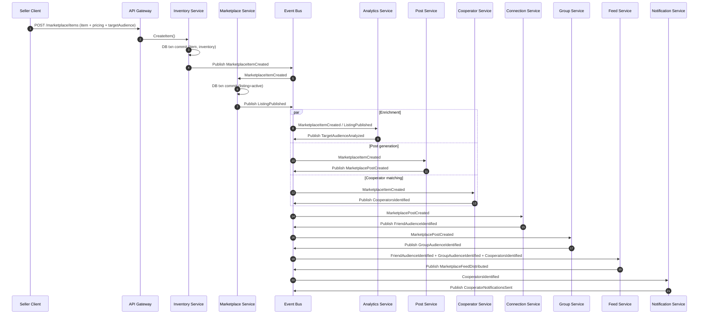
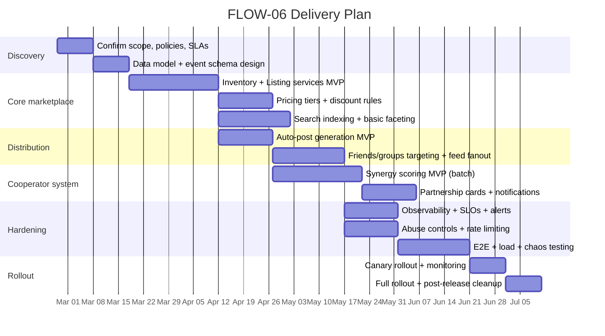

# Extending a Microservices Platform for Marketplace Publishing and Distribution

## Executive summary

The attached specification defines **FLOW-06 “Marketplace Publishing & Distribution”**, which combines (a) marketplace listing creation with inventory and pricing tiers, (b) automated social-post generation, (c) audience targeting across friends, groups, and “business cooperators,” and (d) synergy-based cooperator matching with weighted scoring and targeted partnership notifications. fileciteturn0file0

A robust implementation strongly favors an **event-driven** approach: the synchronous user-facing API creates the canonical “item + listing” records quickly, then publishes immutable events that trigger parallel downstream processing (audience profiling, post generation, cooperator matching, and feed distribution). This aligns with common event-driven architecture advantages—loose coupling, independent scaling, buffering, and resiliency—described by entity["company","Amazon Web Services","cloud provider"] and entity["company","Google Cloud","cloud provider"]. citeturn6search0turn6search1

Key correctness risks are **distributed consistency** (inventory/availability, listing state changes), **duplicate event delivery**, and **security of sensitive business flows** (listing creation, discounting, partnership “spam,” and scraping). These should be mitigated with (1) **Saga-style** coordination for cross-service state transitions (not global ACID), (2) a reliable publish mechanism (e.g., **Transactional Outbox**) plus idempotent consumers, and (3) control alignment with entity["organization","OWASP","web security nonprofit"] API Security guidance (authorization, resource consumption, sensitive business flows). citeturn1search1turn6search6turn0search1

Effort depends heavily on what already exists (feed pipeline, identity, business profiles, connections/graph, moderation, payments). With a typical microservices baseline, an MVP that supports listing → auto-post → audience distribution can often be delivered in **~8–12 weeks (medium confidence)**, while full cooperator matching, pricing tiers, cross-currency, abuse controls, and observability hardening typically pushes a complete “v1” into **~16–24 weeks (low–medium confidence)** due to data, ranking, and policy complexity. fileciteturn0file0

## Process interpretation and assumptions

### What the specification requires

The flow begins at `POST /marketplace/items`, requires a business profile and verified seller status, and enumerates involved services (inventory, marketplace lifecycle, analytics, post generation, cooperator matching, connections, groups, feed distribution, notifications) and a detailed event chain. fileciteturn0file0

Core behaviors required by the specification include:

- **Parallel enrichment after item creation**: audience profiling (analytics), auto-generated post (post service), and cooperator matching (synergy score) run after the item is created. fileciteturn0file0  
- **Synergy scoring algorithm**: weighted factors (audience overlap 30%, product complementarity 25%, market presence 20%, reputation 15%, collaboration history 10%) with thresholds for cooperation types. fileciteturn0file0  
- **Multi-audience distribution**: distribute to friends (purchase affinity), groups (marketplace-enabled), and cooperators (“Partnership Opportunity” cards), plus notifications to high-synergy cooperators. fileciteturn0file0  
- **Pricing and discounts**: friend discount tier (5–10%), group member discount (10–15%), and cooperator bundle pricing (negotiated). fileciteturn0file0  
- **Edge cases and scenarios**: limited-time offers, pre-orders, service listings without inventory tracking, bulk pricing tiers, inventory depleted behavior, seller deactivation, duplicate listing detection, and cross-currency pricing display. fileciteturn0file0

### Platform assumptions

The user explicitly states that current platform architecture is unspecified and requests assuming **microservices/API-based** unless stated otherwise; the design below follows that assumption. fileciteturn0file0

**Assumptions made (explicit):**
- An API Gateway (or BFF) exists to expose `POST /marketplace/items` and other marketplace endpoints.
- There is an event broker (Kafka/PubSub/EventBridge-like) that can support at-least-once delivery (duplicates possible).
- Existing platform already has: user identity, business profiles (FLOW-02), social graph/friends (FLOW-07), and a feed distribution system similar to FLOW-04 (referenced in the spec). fileciteturn0file0
- Payments exist as a separate microservice (mentioned as dependency), but purchase/checkout flows are out of scope for FLOW‑06 unless separately specified. fileciteturn0file0

### Unspecified or ambiguous areas to call out

The spec is strong on publishing/distribution, but several implementation-critical details are missing or only implied:

- **Moderation policy and workflow** (automated post generation + listing content implies moderation, but no SLAs, human review triggers, or policy taxonomy are defined). fileciteturn0file0  
- **Search and discovery UX** beyond “Elasticsearch index for marketplace search” (ranking signals, faceting requirements, geo, personalization). fileciteturn0file0  
- **“Dynamic pricing adjustments”** rules and triggers are referenced but not defined (who can change what, how history is stored, how bundles negotiate). fileciteturn0file0  
- **Cross-currency conversion policy**: the spec says “daily exchange rates,” but does not define provider, rounding rules, freezing rules at checkout, or settlement currency handling. fileciteturn0file0  
- **Cooperator data exposure limits** (how much “competitive intelligence” is shown, what can be hidden/opted-out). fileciteturn0file0  
- **Retention requirements** for analytics outputs, feed distribution records, and event logs (legal + business). fileciteturn0file0  

### Required clarifying questions

To de-risk delivery, the following questions must be answered (grouped by decision impact):

- **Scope boundaries**: Is FLOW‑06 limited to listing + distribution, or must it include inquiry/checkout/payment, refunds, disputes, tax, shipping/booking, and return policy surfaces? fileciteturn0file0  
- **Event backbone**: What broker is used today (and delivery semantics, ordering guarantees, retention)? If the broker provides *at-least-once* delivery, can all consumers be made idempotent? citeturn6search2turn2search6  
- **Identity and tenancy**: Is this multi-tenant (business tenants) and what is the authorization model (RBAC/ABAC)?  
- **Moderation and abuse**: What content rules apply, what needs review, and what anti-scraping requirements exist? (OWASP highlights authorization and “sensitive business flows” as top API risks.) citeturn0search1turn0search0  
- **Cooperator matching**: Is product complementarity rule-based, ML/LLM-based, or hybrid? What is the expected “candidate pool” size per listing and latency budget? fileciteturn0file0  
- **Data retention**: Required retention windows per data category (listings, inventory history, match outputs, feed cards, notifications, analytics) given privacy principles (storage limitation) and erasure rights. citeturn7search6turn8search4  
- **Jurisdictions**: Which consumer protection regimes apply (EU/US/other)? EU marketplace rules (e.g., trader traceability / KYBC concepts) can materially influence requirements. citeturn8search6turn8search1  

## Architecture extension and process step mapping

### Target architecture shape

The spec already enumerates services; the safest extension pattern is:

- A **Marketplace API surface** behind an API Gateway for seller actions (create/update listing, pricing/discount management, activate/deactivate).
- **Inventory + Listing as the source of truth** (strong consistency and auditable history).
- **Asynchronous enrichment and distribution** via events to analytics, post generation, cooperator matching, audience identification, and feed fanout. fileciteturn0file0  

This is consistent with widely documented event-driven architecture properties (decoupling, independent scaling, buffering) and with the reality that ordering and duplicates are common in highly available messaging systems, so consumers must tolerate duplicates. citeturn6search0turn6search2

A coordination mechanism is needed for cross-service state changes (e.g., listing published after item persisted). A common microservices approach is a **Saga**, which maintains consistency through sequences of local transactions and compensating actions rather than distributed ACID. citeturn1search1turn6search5

### Step-to-component mapping

The table below maps the “Happy Path” steps in the spec to **platform components, APIs, and events**. Steps and event names come from the attached specification. fileciteturn0file0

| Spec step | Platform component(s) | Primary API / async trigger | Persistence impact | Notes on correctness and security |
|---|---|---|---|---|
| Seller creates marketplace item | API Gateway + Marketplace/Inventory domain | `POST /marketplace/items` (sync) | Create Item + Listing; write audit trail | Require verified seller; apply rate limits to prevent listing spam (sensitive business flow). citeturn0search1turn0search0 |
| Store item and publish event | Inventory Service | Publish `MarketplaceItemCreated` | Item & inventory rows committed | Use an outbox-like approach to ensure event emits iff DB commit succeeds. citeturn0search6turn6search6 |
| Create listing and publish | Marketplace Service | Consume `MarketplaceItemCreated` → emit `ListingPublished` | Listing row created, status “active” | Fits Saga pattern (local transaction per service). citeturn1search1 |
| Profile target audience | Analytics Service | Consume `MarketplaceItemCreated`/`ListingPublished` | Audience profile stored | Must be async; can be recomputed. |
| Auto-generate post | Post Service | Consume `MarketplaceItemCreated` + later enrich from `ListingPublished` | Post document stored | If LLM-based, treat prompts/outputs as sensitive data; consider redaction. fileciteturn0file0 |
| Synergy scoring | Cooperator Service | Consume initial + later `TargetAudienceAnalyzed` | Match set stored (top-N) | Heavy compute; batch job per listing; idempotency needed for retries/duplicates. citeturn6search2turn2search6 |
| Identify friends audience | Connection Service | Consume `MarketplacePostCreated` | Candidate list stored or streamed | Graph queries or precomputed affinities. fileciteturn0file0 |
| Identify group audience | Group Service | Consume `MarketplacePostCreated` | Candidate group list stored | Requires “marketplace-enabled groups” metadata. fileciteturn0file0 |
| Distribute to feeds | Feed Service | Consume Friend/Group/Cooperator identified events | Fanout writes + ranking metadata | Must handle high write throughput; duplicates tolerated with idempotency. citeturn6search2turn2search6 |
| Notify cooperators | Notification Service | Consume `CooperatorsIdentified` | Notification state stored | Rate limit partnership requests/notifications; secure channels. fileciteturn0file0 |

### Key flow diagram

### Implementation approach tradeoffs

**Synchronous vs asynchronous enrichment** (recommended: async enrichment):

| Approach | What it means | Pros | Cons | Cost / complexity |
|---|---|---|---|---|
| Synchronous orchestration | `POST /marketplace/items` blocks until analytics, post generation, and cooperator matching complete | Simple “single response contains everything” | High latency, fragile (one slow dependency fails whole request), poor scalability for batch-heavy matching; problematic under load (OWASP “Unrestricted Resource Consumption”). citeturn0search1turn0search0 | Medium engineering, high ops risk |
| Asynchronous enrichment | API creates item/listing quickly; publish events; UI polls/streams status | Lower perceived latency; teams/services scale independently; aligns with EDA benefits and duplicate-tolerant messaging guidance | More moving parts; eventual consistency; requires idempotency and good observability | Higher engineering upfront, lower long-term risk |

Event-driven systems commonly accept that ordering isn’t guaranteed and duplicates can occur at scale; design should tolerate duplicates and avoid reliance on strict ordering. citeturn6search2turn2search6

## Data models, schema changes, storage, and retention

### Canonical domain entities and schemas

A clean separation is:

- **Write model (transactional)** for marketplace items, listings, inventory, pricing tiers, discount rules, cooperator relationships, and audit trails.
- **Read models** for feed cards and search indices, optimized for fanout and retrieval (potentially CQRS-like). citeturn6search3turn6search0

Below is a practical minimal schema set (logical model). Names are illustrative; the platform’s conventions should be applied.

| Entity | Purpose | Key fields | Suggested store | Notes |
|---|---|---|---|---|
| MarketplaceItem | Seller-defined product/service | item_id, seller_id, title, description, media refs, category, service/product flag | Relational | Must support duplicate listing detection and edits with history. fileciteturn0file0 |
| InventoryState | Stock/availability | item_id, availability_type (in_stock/pre_order/service), quantity, restock_date | Relational + cache | Inventory needs strong consistency; cache via TTL strategy. fileciteturn0file0 |
| Listing | Public marketplace listing lifecycle | listing_id, item_id, status, visibility rules, listing_url | Relational | State machine: draft/active/sold_out/expired/deactivated. fileciteturn0file0 |
| PricingRuleSet | Base + tier pricing | currency, base_price, bulk tiers, negotiable flags | Relational | Cross-currency display implied; settlement policy unspecified. fileciteturn0file0 |
| DiscountPolicy | Friend/group discounts | friend_discount_pct, group_discount_pct, constraints | Relational | Guard rails to prevent price manipulation; store change history. fileciteturn0file0 |
| AudienceTargeting | Seller targeting input | industries, geo, personas, group flags | Document or relational | Input granularity unspecified; needs validation to avoid “over-targeting.” |
| AudienceProfile (computed) | Analytics output | segments, estimated size, personas | Document / analytics store | Ideally recomputable; retention policy needed. fileciteturn0file0 |
| MarketplacePost | Generated social post | headline, highlights, CTA, media, offer metadata | Document | TTL if purely promotional; durable if required for compliance. fileciteturn0file0 |
| CooperatorMatchSet | Top cooperator candidates | listing_id/item_id, cooperator_id, synergy_score, type | Relational | Sensitive: reveals market intelligence. fileciteturn0file0 |
| FeedCardInstance | Distributed card per recipient feed | recipient_id, card_type, payload pointer, rank features, TTL | Key-value / feed store | High write throughput; should be idempotent. fileciteturn0file0 |
| NotificationRecord | Partnership notifications | recipient_id, channel, template, send_status | Relational + queue | Rate limits and retries required. |

### Event publishing reliability and consumer idempotency

If the platform uses a database transaction to write state and then publishes events, a key failure mode is “DB commit succeeds but event publish fails,” causing silent inconsistency. The **Transactional Outbox pattern** is a common mitigation: persist the event in the same transaction and relay it asynchronously; consumers must still be idempotent because retries can produce duplicates. citeturn0search6turn6search6

The need for idempotent consumers is reinforced by common delivery semantics: at-least-once delivery can produce duplicates; producers may retry; systems should tolerate duplicates and avoid relying on strict ordering. citeturn2search6turn6search2

### Retention and lifecycle management

Retention must satisfy both product needs (search, analytics, feeds) and privacy/compliance (deletion/erasure). The EU privacy principle of **storage limitation** explicitly requires keeping personal data no longer than necessary, and the entity["organization","European Data Protection Board","eu data protection body"] guidance highlights deletion/anonymization once data is no longer necessary. citeturn7search6turn8search4

Recommended lifecycle mechanisms by store type:

- **Search indices**: apply index lifecycle management (rollover + timed delete) for time-bucketed indices (e.g., feed impression logs, search click logs). entity["company","Elastic","search company"] documents ILM policies that can roll over indices and delete after a configured age. citeturn3search1turn3search4  
- **Ephemeral caches**: use explicit TTL/expiry. entity["company","Redis","in-memory data store"] supports key expirations via `EXPIRE`, removing keys after a TTL. citeturn4search3  
- **Ephemeral documents**: use TTL indices if appropriate. entity["company","MongoDB","database company"] documents TTL indexes via `expireAfterSeconds` to automatically delete expired documents. citeturn4search0  

For cross-currency display, the spec says daily exchange rates; one “official-ish” informational source is the entity["organization","European Central Bank","eu central bank"] reference exchange rates dataset, which is updated around each working day and provides reference rates (with explicit caveats about transaction use). citeturn7search0turn7search5

## Authentication, authorization, security, privacy, and compliance

### Identity and authentication model

For an API-based microservices platform, a standard approach is:

- Frontend authenticates via entity["organization","OpenID Foundation","openid connect body"] **OpenID Connect** (identity layer) on top of OAuth 2.0. citeturn5search4turn5search3  
- Services validate bearer tokens (JWTs) and pass stable identity claims (user_id, tenant/business_id, roles). entity["organization","Internet Engineering Task Force","standards org"] JWT specs define the JWT format and claims set patterns. citeturn5search0turn5search6  

Given the spec’s prerequisite “verified seller status,” the identity provider or a dedicated “Seller Verification” service should issue a claim (e.g., `seller_verified=true`) that is enforced at the marketplace edge. fileciteturn0file0

### Authorization and data access control

Marketplace APIs are especially prone to authorization failures (object-level and function-level). OWASP’s API Top 10 lists **Broken Object Level Authorization** and other authorization failures as leading risks. citeturn0search1turn0search0

Concrete controls to implement:

- **Object-level authorization** on every endpoint that references `itemId`, `listingId`, `postId`, or “match set” ID (seller can only mutate own items/listings; cooperators can only view opportunities they are entitled to).
- **Row-level security** can provide defense-in-depth for multi-tenant relational tables. entity["organization","PostgreSQL","open-source database"] documents row security policies and `CREATE POLICY` semantics (USING / WITH CHECK). citeturn3search2turn3search5  
- **Scope-based service-to-service auth** for internal APIs; avoid “internal endpoints” that accept user IDs in payload without re-checking claims (common BOLA vector). citeturn0search1  

### Protecting sensitive business flows and anti-abuse

OWASP’s API Top 10 includes **Unrestricted Resource Consumption** and **Unrestricted Access to Sensitive Business Flows**, both directly relevant to marketplace listing creation, search, and partnership requests. citeturn0search1turn0search0

Minimum anti-abuse controls implied/required:

- Rate-limit: listing creation, partnership requests (spec suggests 5/day), search/detail pricing endpoints, and notification sends. fileciteturn0file0  
- Add bot/scrape protections on search and detailed pricing (the spec explicitly calls out scraping). fileciteturn0file0  
- Enforce quotas and payload caps (images, media) to reduce cost explosions (resource consumption). citeturn0search1  
- Consider “idempotency keys” for create flows to avoid duplicate listings on client retries; HTTP semantics define idempotency for methods, and the Idempotency-Key header is a common pattern to make POST retry-safe. citeturn14search1turn14search2  

### Payments, PCI, and transaction data

The spec links “Revenue processing” to a payments microservice and notes PCI DSS compliance for transaction data. fileciteturn0file0

entity["organization","PCI Security Standards Council","payments security body"] describes PCI DSS v4.0 as a baseline of technical and operational requirements to protect account data, and notes evolution to address emerging threats and technologies. citeturn1search0turn1search5

Implementation implication: **FLOW‑06 should avoid storing card data** in marketplace services; integrate via a payments service that is explicitly designed for PCI scope management (tokenization, vaulting), and keep marketplace services limited to order references and status.

### EU marketplace obligations and safety signals

If EU jurisdiction applies, online marketplaces are increasingly expected to ensure safe products and to trace traders (“Know Your Business Customer” concepts). entity["organization","European Parliament","eu legislature"] communications on the Digital Services Act highlight obligations around illegal goods/content and trader traceability for marketplaces. citeturn8search6turn8search1

This directly impacts “verified seller status” requirements (KYBC evidence collection, review, and auditability), which should be treated as a first-class capability. fileciteturn0file0

## Performance, scalability, error handling, and observability

### Scalability and workload characterization

FLOW‑06 includes at least three distinct workload profiles:

- **Low-latency transactional writes**: item creation, listing publish, inventory updates (especially stock decrement in later purchase flow). fileciteturn0file0  
- **Batch/compute-heavy matching**: cooperator matching “scans active businesses” per new listing (spec notes batch-heavy). fileciteturn0file0  
- **High-throughput fanout**: feed distribution to friends/groups/cooperators (write-heavy). fileciteturn0file0  

A decoupled event-driven architecture supports independent scaling of these parts and reduces coupling between producer and consumer services. citeturn6search0turn6search1

### Batch vs streaming for cooperator matching

| Approach | How it works | Pros | Cons | Cost / complexity |
|---|---|---|---|---|
| Batch per listing (recommended initially) | On `MarketplaceItemCreated`, build candidate set and compute top-N synergy | Predictable, easier to reason about; can run in async workers; matches spec expectation “batch-heavy per new listing” | Can be slow for large candidate pools; requires caching and incremental recompute triggers | Medium |
| Streaming / continuous recompute | Maintain rolling feature vectors; update match sets as businesses/items change | Fresher matches; better when many businesses update frequently | Considerably more infra + state management; harder correctness; more event types and backpressure | High |

Messaging systems often deliver events at least once and can produce duplicates; both batch and streaming implementations must guarantee idempotent processing and robust retries. citeturn2search6turn6search2

### Error handling patterns

Recommended baseline:

- **Retry with backoff** for transient failures, with **DLQs** for poison messages.
  - entity["company","Google Cloud","cloud provider"] Pub/Sub dead-letter topics forward undeliverable messages after a configured number of delivery attempts (best-effort). citeturn12search0  
  - entity["company","Amazon Web Services","cloud provider"] SQS DLQs are configured via redrive policies; retention behavior differs between standard vs FIFO in important ways. citeturn13search1  

- **Idempotent consumers** using message IDs and dedupe tables because duplicates are normal in at-least-once systems. citeturn2search6turn6search2  
- **Saga-based compensations** for multi-step distributed transactions (e.g., if listing publish fails after item creation, mark listing as failed and keep item in “draft” or create compensating action). citeturn1search1  

### Observability requirements

For an event-driven microservices flow, observability must enable:

- Trace from `POST /marketplace/items` through event handlers to final feed distribution.
- Correlate logs, traces, and metrics across services and worker jobs.

entity["organization","OpenTelemetry","observability spec"] defines correlated logs/traces/metrics and the role of the OpenTelemetry Collector in consistent enrichment across signals. citeturn2search1turn2search5

For trace context propagation across HTTP and messaging boundaries, the entity["organization","World Wide Web Consortium","web standards body"] Trace Context specification standardizes `traceparent`/`tracestate` headers for interoperability across tracing tools. citeturn2search2

### Event envelope and schema evolution

To reduce cross-team friction, consider adopting a standard event envelope such as CloudEvents. The entity["organization","Cloud Native Computing Foundation","cloud native foundation"] describes CloudEvents as a common event metadata format for interoperability across services and systems. citeturn9search5turn9search7

## Testing strategy, deployment, migration, rollout, effort, and risks

### Testing strategy

A comprehensive test approach should include:

- **Unit tests**: pricing/discount calculations, synergy scoring, duplicate detection thresholds, listing state transitions.
- **Integration tests**: service-to-service APIs (inventory ↔ marketplace), event publishing/consumption, DLQ flows.
- **Contract tests** for APIs and events: consumer-driven contract testing is well supported by entity["organization","Pact","contract testing tool"], which formalizes consumer/provider expectations in microservice architectures. citeturn10search1  
- **End-to-end tests**: listing creation → feed distribution verification across friends/groups/cooperators with controlled fixtures.
- **Load and resilience tests**: especially for feed fanout and matching compute; verify behavior under duplicate/replay, broker delays, and partial outages.

### Deployment and rollback strategy

For Kubernetes-based deployments, rolling updates are controlled via `maxUnavailable` and `maxSurge`, and the Kubernetes Deployment controller behavior is documented in entity["organization","Kubernetes","container orchestration"] docs. citeturn9search0

Given FLOW‑06’s business criticality, prefer progressive delivery:

- Canary and blue/green deployment patterns are described in entity["organization","Argo Rollouts","progressive delivery controller"] documentation, including how blue/green runs both versions concurrently and canary shifts a subset of traffic. citeturn10search4  
- Service-mesh traffic shifting (weight-based routing) can be implemented with entity["organization","Istio","service mesh project"] routing rules that send a percentage of traffic to new versions. citeturn11search2  

Feature flags are recommended to decouple “deploy” from “release.” Vendor guidance (e.g., entity["company","LaunchDarkly","feature flag platform"]) emphasizes ring/percentage rollouts, metrics monitoring during rollout, and removing short-lived flags to avoid long-term technical debt. citeturn11search1turn11search7

### Data migration approach

Schema changes should be designed for zero/low downtime:

- Prefer backwards-compatible expansions (add new columns/tables, dual-write, backfill, then contract).
- For database-level blue/green, AWS documents blue/green deployment strategies for minimizing risk and enabling rapid rollback; there is also specific guidance and automation patterns for blue/green database deployments. citeturn18search1turn18search0  

### Milestones and estimated effort

The following milestone plan assumes the platform already has identity, business profiles, a feed subsystem, and a messaging backbone. Where those are missing, timelines expand significantly.

**Effort estimate (person-weeks, coarse):**

| Workstream | Scope | Estimate | Confidence |
|---|---|---:|---|
| Marketplace domain (item/listing/inventory) | Core item/listing CRUD, status lifecycle, audit history | 12–18 | Medium |
| Pricing + discounts + currency display | tiers, discount enforcement, FX display policy | 6–10 | Low–Medium (policy heavy) |
| Post generation | templates/LLM wiring, moderation hooks | 6–10 | Low–Medium |
| Audience targeting and feed fanout | friends/groups/cooperators fanout, ranking features | 10–16 | Medium |
| Cooperator matching | feature extraction + synergy scoring + storage | 12–20 | Low (data + compute uncertainty) |
| Security and abuse controls | authz hardening, rate limit, anti-scrape, audit | 6–12 | Medium |
| Observability and reliability | tracing, metrics, DLQs, idempotency/outbox | 6–12 | Medium |

Some estimates are “low confidence” because the spec does not define traffic volumes, candidate pool sizes, or ML/LLM requirements, which dominate cooperator matching complexity. fileciteturn0file0

### Rollout and rollback plan

A practical rollout strategy:

- **Phase 0 (dark launch)**: Deploy services and events, but suppress feed distribution (write to shadow stores) to validate correctness and load.
- **Phase 1 (limited sellers)**: Enable listing for internal/test sellers only; verify events, latency, and moderation.
- **Phase 2 (canary)**: Enable to a small % of sellers and a small % of audience feeds; use traffic shifting and progressive delivery controls. citeturn10search4turn11search2  
- **Phase 3 (full rollout)**: Expand cohorts until 100%, monitor KPIs.

Rollback must be explicit:

- Ability to disable **cooperator matching** independently (feature flag) while keeping listing+feed operations intact.
- Ability to disable auto-post generation (fallback to seller-provided copy) if moderation or quality issues arise.
- Ability to stop fanout writes and revert to previous feed format if throughput issues occur.

### Risks and mitigations

| Risk | Why it matters | Mitigation |
|---|---|---|
| Inventory inconsistency | Overselling and trust damage | Keep inventory authoritative and strongly consistent; use Saga compensations for cross-service changes. citeturn1search1 |
| Duplicate events → duplicate feed cards/notifications | At-least-once delivery and retries | Idempotent consumers; outbox; DLQs; dedupe keys. citeturn2search6turn0search6turn13search1 |
| Cooperator “competitive intelligence” leakage | Reveals sensitive market relationships | Minimize disclosed fields; require explicit opt-in; enforce strict authorization; audit access. fileciteturn0file0 |
| Abuse (spam listings, scraping, partnership spam) | Operational and reputational risk | Rate limits, bot protection, quotas; protect sensitive flows per OWASP API guidance. citeturn0search1turn0search0 |
| Data retention/privacy noncompliance | Legal and trust risk | Define retention per data type; implement deletion/anonymization; honor storage limitation principles. citeturn7search6turn8search4 |
| Cooperator scoring quality/bias | Poor matches reduce adoption | Start rule-based + explainability; iterate; A/B test thresholds as spec suggests. fileciteturn0file0 |
| Observability gaps across async flows | Slow incident resolution | OpenTelemetry + W3C trace context; define SLOs and alerts. citeturn2search1turn2search2 |

