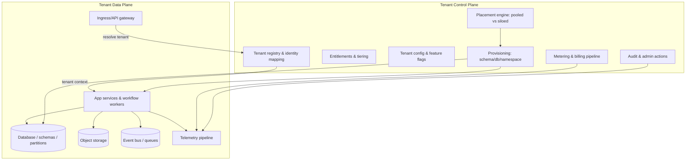
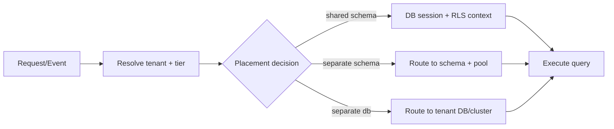
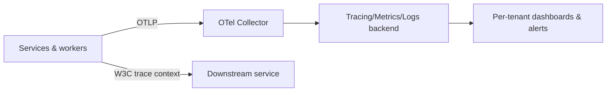
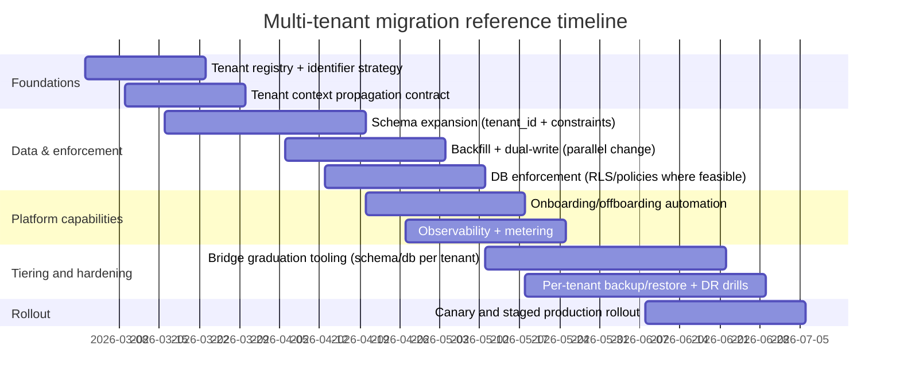

# Adapting a Single-Tenant System to Multi-Tenant

## Executive summary

Adapting a single-tenant product into a multi-tenant platform is less about “adding a tenant_id column” and more about making **tenant context a first-class, end-to-end invariant**: every request, query, cache key, event, job, metric, log line, backup plan, and operator action must be scoped, enforced, and observable per tenant. Cloud guidance consistently emphasizes that multi-tenant solutions typically mix shared and dedicated components, and that you should choose isolation boundaries based on regulatory, performance, and cost objectives rather than forcing one universal model. citeturn0search0turn0search9turn8search2

A rigorous approach is to design around a **control plane / data plane split**: the control plane owns tenant identity, onboarding/offboarding, entitlements/tiering, configuration, metering, audit, and placement decisions; the data plane enforces tenant boundaries for runtime traffic and storage access. This matches SaaS architecture guidance (pool/silo/bridge models, tenant-aware operations, and tenant-level consumption visibility). citeturn0search0turn0search4turn5search2turn5search26

For most products, the best “default” target is a **hybrid (bridge) isolation strategy**: pooled/shared resources for the long tail of tenants, with automated “graduation” paths to separate schema and, where necessary, separate database (or dedicated stamps/cells) for high-compliance or high-load tenants. AWS explicitly describes “pool/silo/bridge” as common SaaS isolation models, and Azure similarly frames tenancy models along a continuum with trade-offs. citeturn0search0turn0search4turn0search1turn8search23

The highest-impact failure modes to engineer against up front are:

- **Cross-tenant data exposure**, often via broken object-level authorization (BOLA) or missing tenant scoping in queries/caches/events; OWASP highlights BOLA as a top API risk and describes how ID manipulation exploits authorization gaps. citeturn2search5turn2search9  
- **Noisy-neighbor and cost blowups**, where one tenant consumes disproportionate compute, DB connections, queue capacity, or storage/egress; Kubernetes multi-tenancy guidance calls out fairness and noisy neighbors in shared clusters, and ResourceQuotas are a core mechanism to constrain usage per namespace. citeturn0search3turn0search7  
- **Irreversible migration mistakes**, especially around schema and data transformations; an incremental “expand → migrate → contract” approach (Parallel Change) is a well-established pattern for reducing rollout risk and enabling rollback. citeturn7search1turn7search4  

Your uploaded design notes already lean toward standards-based contracts and event-driven flows (e.g., OpenAPI/AsyncAPI, CloudEvents-style envelopes, workflow execution, idempotency/outbox-style reliability), which are compatible with a tenant-aware control/data plane and bridge isolation strategy. fileciteturn0file1 citeturn5search0turn5search1turn2search4turn4search3

## Assumptions and baseline reference context

Because you did not specify a stack, the analysis assumes a “typical” modern web platform and highlights concrete examples for PostgreSQL, Kubernetes, and AWS/Azure/GCP where helpful.

Assumptions (explicit):

- The current system is **single-tenant by design**: one production environment + one logical customer dataset, with no hard tenant boundary enforcement embedded in the data model or authorization layer.
- The product exposes **HTTP APIs** and likely has asynchronous processing (background jobs, queues, webhooks, workflows). Your internal notes explicitly model end-to-end CMS/commerce workflows and event-driven side effects (indexing, cache purge, notifications, webhooks). fileciteturn0file1  
- A relational database is a core system of record (examples reference PostgreSQL features like Row-Level Security and partitioning) and there is at least one shared cache/search/index layer.
- “Tenant” maps to a **customer organization** (not an individual user). SaaS guidance stresses that tenants usually represent customers and are associated with multiple users and roles. citeturn5search14turn0search9  
- You want an architecture that supports **tiering** (SMB pooled tenants through to enterprise tenants with stronger isolation, residency, and restore guarantees). This aligns with AWS and Azure guidance that not all components must be shared and that different tenants can warrant different isolation choices. citeturn0search0turn8search35  

Baseline reference architecture (control plane / data plane):



This pattern is consistent with SaaS guidance that tenant management and operations are “shared constructs” even when tenant runtime resources are dedicated (silo) and that SaaS operations need tenant-aware visibility. citeturn0search0turn5search2turn5search26

## Tenant isolation and data architecture

### Tenant isolation models and trade-offs

AWS and Azure both describe multi-tenant architectures as a spectrum: from fully pooled/shared to fully siloed/dedicated, with hybrid/bridge approaches in between. citeturn0search0turn0search4turn0search1turn8search23

The database dimension you asked for—**shared schema**, **separate schema**, **separate database**—maps cleanly onto pooled/bridge/silo thinking:

- Shared schema is typically the most pooled (strongest cost efficiency, highest need for enforcement rigor).  
- Separate schema is a bridge option (still shared infra, improved logical separation).  
- Separate database is the most silo-like (strongest isolation, highest automation/ops burden). citeturn0search16turn0search0turn0search4turn0search1  

Comparison table (database tenancy models):

| Dimension | Shared schema (single schema, tenant_id) | Separate schema (schema per tenant) | Separate database (DB per tenant) |
|---|---|---|---|
| Isolation boundary | Logical (row-level / application enforcement) | Logical + namespace boundary (schema) | Strongest logical/operational boundary (separate DB) |
| Primary benefit | Lowest cost, simplest provisioning, fastest global feature rollout | Better blast-radius control; easier tenant-specific export/restore than shared schema | Strongest isolation for compliance/noisy-neighbor; simplest “restore a tenant” semantics |
| Primary cost | Highest risk if tenant scoping fails; migration mistakes can impact all tenants | Schema sprawl; migrations must handle many schemas; connection routing complexity | Highest ops overhead; provisioning, patching, and monitoring multiplied; automation is mandatory |
| “Noisy neighbor” risk | Highest (shared tables/indexes/locks/IO) | Medium (still shared instance resources) | Lowest (dedicated resources; still shared in shared clusters if compute pooled) |
| Per-tenant backup/restore | Hard unless you invest in logical export tooling | Moderate: schema-level logical backups are natural | Best: database-level backups/restore are naturally tenant-scoped |
| Data residency flexibility | Requires careful partitioning/placement at app level | Moderate; still constrained by shared instance region | Highest: place specific tenant DBs in specific regions if needed |
| Best-fit tenants | Many small/medium tenants with similar needs; strong guardrails in place | Mixed workloads; mid-market tiers; tenants needing moderate isolation | Regulated/high-SLA tenants; “bring-your-own-key”/strict residency or extremely high-load tenants |
| Typical failure modes | Cross-tenant data leaks; shared index/table bloat; inconsistent query scoping | Migration tooling gaps; schema version skew; connection pool pressure | Fleet management complexity; cost creep; drift without strong automation |

This table is a synthesis of the pool/bridge/silo descriptions and tenancy-model trade-offs described by AWS and Azure guidance. citeturn0search16turn0search0turn0search1turn8search23

### Data partitioning strategies

Data partitioning is about optimizing performance and operability **without weakening isolation**. The partitioning strategy should match your tenant model:

- **Shared schema**: every row carries `tenant_id`, every unique/indexed business key is tenant-scoped (e.g., `UNIQUE(tenant_id, external_id)`), and data access is guarded by a defense-in-depth mechanism (application enforcement plus DB enforcement where possible). PostgreSQL Row-Level Security (RLS) provides DB-enforced policies restricting which rows can be returned or modified, and policies are created via `CREATE POLICY` after enabling RLS on a table. citeturn0search2turn0search6  
- **Shared schema + partitioning**: partition hot/high-volume tables by tenant key or by tenant+time (e.g., list/range/hash partitioning). PostgreSQL documents declarative partitioning and provides “best practices” sections for partition pruning and partition management. citeturn3search2  
- **Separate schema**: you reduce the chance of cross-tenant row confusion because physical table names differ by tenant schema; you still need strict authorization and careful tooling to run migrations across many schemas safely. (Azure explicitly describes separate schemas as a multi-tenant pattern alongside shared schema and database-per-tenant.) citeturn0search5turn8search23  
- **Separate database**: partitioning shifts upward: tenants can be split across “tenant groups” or “cells/stamps” (multiple databases/clusters) to scale and to constrain blast radius; Azure’s multitenant storage guidance explicitly notes mixing patterns (multitenant for most tenants + single-tenant stamps for special tenants). citeturn8search35  

A practical routing pattern (works for shared schema / separate schema / separate DB):



This “placement decision” is the operationalization of the bridge model described in AWS tenant isolation strategies and of Azure’s recommendation to mix patterns when needed. citeturn0search4turn8search35

### A note on non-database “data planes” that often break multitenancy

A common reason a system “looks” multi-tenant but leaks is that storage and computation caches are not tenant-scoped:

- **Caches**: every cache key must include tenant identity (and often tenant tier), otherwise one tenant’s cached object can be served to another tenant.  
- **Search / indexes**: every document must carry `tenant_id` and all queries must filter by tenant; multi-tenant search often requires index-per-tenant at large scale or strict filtering at minimum.  
- **Events**: every event must include tenant context; leaving it implicit is a frequent cause of cross-tenant side effects.

These are security-relevant because missing tenant scoping often manifests as object-level authorization failures. OWASP’s BOLA guidance describes how attackers manipulate object identifiers to access unauthorized resources; multi-tenancy amplifies the impact because “unauthorized” can mean “different customer.” citeturn2search5turn2search9

## Identity, access control, and tenant lifecycle management

### Authentication and tenant context

A robust multi-tenant identity model separates the concerns:

- **Authentication (who is the user?)**: OpenID Connect defines authentication on top of OAuth 2.0 using claims about the end-user. citeturn1search1turn1search5  
- **Authorization (what can they do?)**: OAuth 2.0 defines an authorization framework for obtaining limited access to an HTTP service. citeturn1search0  

In multi-tenancy, you typically need an explicit and validated **tenant context**. Common approaches:

- A tenant identifier is conveyed by the request target (tenant subdomain or path prefix) and is mapped server-side to a tenant record (registry).  
- Tokens carry tenant membership claims (tenant IDs, roles, groups) issued by your IdP; service code still validates that the requested tenant matches the token’s allowed tenants.  
- For service-to-service calls, propagate tenant context via headers/metadata—but do not trust client-provided tenant IDs without verification.

This approach aligns with SaaS architecture guidance emphasizing a clear mapping between user identity and tenant identity and tenant-aware authentication/authorization. citeturn5search14turn0search9

### Authorization: per-tenant roles and cross-tenant admin

Multi-tenant authorization almost always needs at least two layers:

- **Within-tenant authorization**: RBAC/ABAC determining what a user can do inside one tenant (e.g., tenant admin, finance role, content editor).  
- **Object-level authorization**: for every endpoint accepting object IDs, verify that the object belongs to the tenant *and* the caller is authorized for that object. This is exactly the class of failure OWASP identifies in API1:2023 (BOLA). citeturn2search5turn2search9  

For **cross-tenant administration**, separate three personas explicitly:

1. Tenant admins (customer side).  
2. SaaS operator admins (your support/SRE/security teams).  
3. Automated control plane services (provisioning, billing, migrations).

Cross-tenant admin should be treated as a high-sensitivity feature: use least privilege, strong audit logging, and “break glass” workflows. This matches the SaaS Lens emphasis that operations must be tenant-aware and capable of diagnosing health through the lens of tenant activity. citeturn5search2turn5search26

### Provisioning: tenant onboarding and offboarding

Tenant onboarding must be **automated and idempotent**, because manual onboarding does not scale and increases risk of misconfiguration. AWS explicitly frames tenant onboarding patterns as a key SaaS operational concern. citeturn5search6turn5search2

A rigorous onboarding pipeline typically includes:

- Create tenant entry in registry (status = provisioning).
- Allocate tenant placement (pooled / schema / DB; region/residency constraints).
- Provision data resources (schemas/DBs, encryption keys, storage prefixes/buckets).
- Initialize configuration defaults and entitlements/tier.
- Bootstrap identity mappings (e.g., initial tenant admin, groups).
- Verify isolation checks (smoke tests that tenant cannot access others).
- Activate tenant (status = active).

Offboarding (tenant deletion/exit) must support:

- Export (machine-readable) if required by contract.
- Retention and legal hold policies.
- Secure deletion processes and evidence.
- Reclaim resources (schemas/DBs, objects, encryption keys), with safeguards to prevent accidental deletion of shared assets.

While implementation details vary, the “tenant-aware operational experience” highlighted in SaaS guidance implies that both onboarding and offboarding should be standard workflows with auditability and automation. citeturn5search2turn0search9

### Configuration and customization per tenant

A scalable customization model avoids “tenant forks” of the codebase. Instead, treat tenant customization as:

- **Configuration**: structured, validated settings (limits, feature flags, integrations).
- **Extensibility**: plugin/app model, if needed, with explicit scopes and permissions.

Your internal notes already frame workflows and extensibility (apps/plugins, webhooks, and metadata/custom fields) as core capabilities; this can map cleanly onto per-tenant feature flags, per-tenant integration bindings, and per-tenant policy enforcement. fileciteturn0file1

Contract-first approaches help keep tenant-specific behavior coherent: OpenAPI is an official standard interface description for HTTP APIs, and AsyncAPI is a protocol-agnostic machine-readable specification for message-driven APIs. citeturn5search4turn5search1

## Resource isolation, scaling strategies, and tenant observability

### Resource and performance isolation

Even if data is isolated, shared compute and shared clusters can still allow one tenant to degrade others. Kubernetes documentation explicitly notes that multi-tenancy trades cost and simplicity for challenges like security, fairness, and noisy neighbors. citeturn0search3

In Kubernetes-based systems, common isolation controls include:

- **Namespaces** as tenant (or tenant-tier) boundaries.
- **ResourceQuota** to limit aggregate CPU/memory and enforce that pods specify requests/limits in a namespace. citeturn0search7  
- **NetworkPolicy** to control pod traffic at L3/L4 (east-west isolation), requiring a compatible network plugin. citeturn6search1  
- **RBAC** (Roles/RoleBindings/ClusterRoleBindings) to scope who can operate within a tenant namespace and prevent privilege escalation. citeturn6search2turn6search10  
- **Pod Security Standards / Admission** to enforce baseline or restricted pod hardening profiles in tenant namespaces. citeturn7search3turn7search7  

This set of controls creates layered isolation: identity/authorization isolation, network isolation, and compute quota isolation. citeturn6search17turn0search3

### Scaling: horizontal/vertical and per-tenant autoscaling

At the platform level, you normally scale pooled services by standard horizontal scaling. Kubernetes HorizontalPodAutoscaler is the canonical approach: it automatically updates the replica count of workloads (Deployments/StatefulSets) to match demand. citeturn3search3turn3search39

Per-tenant scaling patterns depend on tenancy model:

- **Pooled services + shared schema**: scale the service globally, but enforce per-tenant concurrency/requests quotas to prevent a single tenant from consuming all capacity. Kubernetes quotas support the enforcement side; application-level rate limiting is still needed for request fairness. citeturn0search7turn0search3  
- **Large tenants get dedicated worker pools**: deployment-per-tenant (or per “tenant tier”) allows per-tenant HPA policies and stronger bulkhead isolation. This aligns with the bridge/stamp idea (mix pooled and dedicated). citeturn0search4turn8search35  
- **Separate database tenants**: compute and DB scaling can be coupled per tenant or per cell (stamp). Operationally, you treat each cell as a bounded failure domain.

### Monitoring/observability per tenant

Multi-tenant operations require “tenant-aware insights” into health and consumption. AWS’s SaaS Lens explicitly calls out the need to view system activity and health through the lens of tenants and tenant tiers. citeturn5search2turn5search26

A practical standard-based observability design uses:

- **Distributed tracing context propagation** via the entity["organization","W3C","web standards consortium"] Trace Context specification (`traceparent`, `tracestate`). citeturn2search0turn2search11  
- Metrics/logs/traces exported via entity["organization","OpenTelemetry","cncf observability project"] OTLP (OpenTelemetry Protocol), which defines encoding/transport/delivery of telemetry. citeturn1search3turn1search11  

Tenant-aware observability means you **label every signal** with tenant identity (and often tenant tier and region). This enables:

- Per-tenant SLOs and error budgets.
- Per-tenant rate-limit/quotas dashboards.
- Per-tenant cost/usage attribution pipelines (critical for billing).

Illustrative telemetry flow:



The key is consistency: use the same tenant identifier in logs, traces, metrics, events, and audit records so incident response can pivot quickly by tenant. citeturn1search3turn2search0turn5search2

### Billing and usage metering

Consumption-based pricing needs trustworthy metering. AWS SaaS Lens describes defining metering mechanisms to measure tenant consumption and sending that metering data to a billing system to generate a bill. citeturn5search26

In addition to customer billing, you typically need internal cost allocation (chargeback/showback). The entity["organization","FinOps Foundation","cloud cost mgmt foundation"] describes cost allocation as assigning cloud costs to relevant groupings using hierarchies, tags, and labels (and/or third-party tooling). citeturn6search3turn6search27

In practice, you combine:

- **Usage meters** (tenant-level actions: API calls, workflow runs, GB stored, build minutes, emails sent).
- **Infrastructure meters** (CPU-seconds, memory-GB-hours, DB IOPS/bytes, egress).
- A mapping layer that attributes shared costs proportionally (often by usage weight) for pooled tenants.

## Backup/restore, disaster recovery, and security/compliance

### Backup/restore and disaster recovery per tenant

Multi-tenancy changes what “restore” means: customers may ask to restore **only their tenant**, not the whole system.

PostgreSQL backup and restore options that matter:

- **Logical backups** using `pg_dump` (and `pg_restore`) can export an entire database and, with archive formats, can allow selecting parts of a database to restore. This is a key primitive for per-tenant restore when tenants map to schemas or partitions. citeturn6search0turn6search8  
- **Physical backups and point-in-time recovery (PITR)** rely on continuous archiving of WAL (write-ahead log) plus base backups. PostgreSQL documents continuous archiving and PITR as part of its backup/restore model. citeturn4search0turn4search22  

Operational implication by tenancy model:

- Shared schema + PITR: PITR restores the whole cluster; per-tenant restore generally requires logical extraction tooling (or reconstructing tenant data to a point in time), which is significantly more complex than “restore a DB.” citeturn4search0turn6search0  
- Separate schema: schema-level logical dumps are a natural abstraction for tenant restore and export. citeturn6search0turn6search8  
- Separate database: tenant-scoped backup/restore is conceptually simplest (restore that tenant DB), but requires automation to manage many databases and to guarantee consistent policy. citeturn0search16turn0search0  

Disaster recovery (DR) should be designed and tested as a program. entity["organization","NIST","us standards institute"] SP 800-34 (Contingency Planning Guide) provides guidance for evaluating systems to determine contingency planning requirements and priorities. citeturn3search1turn3search5

A multi-tenant DR posture typically defines (per tier):

- RPO/RTO targets.
- Backup schedule and retention.
- Restoration granularity (tenant-level vs whole-system).
- Regular restore drills per tenant tier and per region/cell.

### Reliability patterns that become mandatory in multi-tenancy

Multi-tenant systems are more failure-amplifying because retries and partial outages can affect many customers.

Two patterns and standards matter disproportionately:

- **Idempotent client retry handling**: the entity["organization","IETF","internet standards body"] draft “Idempotency-Key” header defines making non-idempotent methods (POST/PATCH) fault-tolerant under retries and specifies uniqueness/expiry considerations. citeturn4search2turn4search9  
- **Transactional outbox**: entity["organization","Debezium","cdc outbox tooling"] documentation describes the outbox pattern as a way to reliably exchange data/events without inconsistencies between internal state and published events. citeturn4search3turn4search10  

Your internal flow-engine design notes already recommend contract-first APIs/events and event-driven side effects (webhooks, indexing, notifications) that benefit from outbox + idempotency enforcement. fileciteturn0file1

### Security and compliance: residency, encryption, access controls

Data residency controls where data is stored “at rest” and is a frequent enterprise requirement:

- AWS guidance notes that partitions/regions/zones allow choosing locations for data and workloads to meet residency needs. citeturn5search3  
- Azure describes data residency options across global regions/geographies. citeturn8search0  
- Google Cloud explains controlling where data is stored at rest to comply with residency requirements (e.g., via Assured Workloads). citeturn8search1  

Encryption and key management need to scale with tenants:

- entity["organization","NIST","us standards institute"] FIPS 197 defines AES as a FIPS-approved algorithm to protect electronic data. citeturn2search10turn2search13  
- NIST SP 800-57 provides key-management guidance and best practices for managing cryptographic keying material. citeturn3search0turn3search16  
- entity["organization","OWASP","web security foundation"] key management guidance emphasizes documented lifecycle practices (generation, distribution, destruction) and aligns to NIST key-management principles. citeturn7search2turn3search0  

Access control and tenant isolation are inseparable from API security:

- OWASP API Security describes BOLA as an attacker manipulating object IDs to access unauthorized resources—exactly the scenario multi-tenancy must prevent emphatically. citeturn2search5turn2search9  
- Cloud shared responsibility models shift some security duties to the SaaS provider; AWS explicitly states security and compliance are shared and clarifies what AWS secures vs what you must secure and configure. citeturn8search3turn8search6  

Finally, secrets require tenancy-aware handling: per-tenant credentials (for integrations/webhooks/payment providers) must be isolated, rotated, and audited; OWASP provides secrets management best practices emphasizing centralized storage, auditing, and rotation. citeturn7search10

## Migration roadmap, operational impacts, cost modeling, and risk matrix

### Migration strategy from single-tenant to multi-tenant

A safe migration is incremental and explicitly rollback-aware:

- **Parallel Change (expand/contract)**: entity["people","Martin Fowler","software architect"] describes breaking changes implemented safely in phases—expand, migrate, contract—so old and new code can coexist during transition, reducing downtime risk. citeturn7search1turn7search21  
- **Strangler Fig pattern**: both Fowler and Azure describe an incremental approach where a façade/proxy routes traffic to legacy or new components as functionality migrates, reducing rewrite risk. citeturn7search0turn7search4  

A canonical staged approach (conceptual):

```mermaid
flowchart TB
  A[Baseline: single-tenant] --> B[Expand: introduce tenant model + nullable tenant_id + registry]
  B --> C[Migrate: backfill data + dual-write + tenant-aware authZ]
  C --> D[Enforce: RLS/policies + tenant-scoped caches/events]
  D --> E[Contract: remove legacy assumptions + make tenant_id required]
  E --> F[Optimize: tiering + bridge graduation (schema/db per tenant)]
```

RLS provides DB-enforced isolation for shared-schema models; PostgreSQL documents enabling row security and defining policies. citeturn0search2turn0search6

### Migration timeline and milestones with effort levels

This timeline is a reference plan for a mid-sized product (dozens of tables, multiple services/workers). It assumes a bridge target: pooled-by-default with selective schema/db isolation for higher tiers. (Effort is per task: low/medium/high.)

| Phase | Milestone outcomes | Typical duration | Effort |
|---|---|---:|---|
| Foundation | Tenant registry, tenant identifier strategy, tenant context propagation contract, threat model for isolation | 2–4 weeks | Medium |
| Data model expansion | Add tenant_id where needed, introduce tenant-scoped keys/constraints, create initial migration scripts | 3–6 weeks | High |
| Enforcement | Add object-level authZ consistently; add DB enforcement (RLS/policies) where feasible; tenant-scoped caches/events | 4–8 weeks | High |
| Tenant lifecycle | Automated onboarding/offboarding pipeline; tiering/placement engine (pooled vs schema/db); audit trail | 3–6 weeks | Medium |
| Observability & metering | Tenant-aware dashboards/alerts; usage metering pipeline to billing; cost allocation mapping | 2–5 weeks | Medium |
| Enterprise hardening | Data residency controls, per-tenant restore playbooks, key management tier, dedicated resources for select tenants | 4–10 weeks | High |
| Cutover & validation | Canary tenants, staged rollout, deprecate single-tenant assumptions, finalize “contract” phase | 2–6 weeks | Medium |

These milestones reflect the SaaS Lens emphasis on tenant-aware operations and consumption visibility, plus the realities of enforcing tenant isolation and implementing metering/billing. citeturn5search2turn5search26turn7search1

A mermaid Gantt view (illustrative; adjust to your delivery cadence):



The “parallel change” approach is directly aligned with Fowler’s expand/migrate/contract framing. citeturn7search1

### Operational impacts: CI/CD, deployments, incident response

Multi-tenancy increases operational surface area:

- **CI/CD must validate tenant isolation invariants**: automated tests that attempt cross-tenant access, verify tenant scoping in queries, caches, and events, and validate policy enforcement.
- **Deployments must be rollback-ready**: Kubernetes provides rollout revision history and tooling (e.g., `kubectl rollout history`) to examine prior revisions; this supports fast rollback in staged rollouts. citeturn4search31turn4search1  
- **Incident response becomes tenant-shaped**: you need runbooks for “cross-tenant exposure,” “noisy neighbor,” and “tenant-specific outage,” and your observability system must filter quickly by tenant. SaaS Lens explicitly emphasizes tenant-aware operational insights. citeturn5search2turn5search26  

### Cost modeling and trade-offs

A multi-tenant cost model must support both customer billing and internal allocation:

- Meter usage per tenant and send to billing; AWS SaaS Lens explicitly describes metering tied to pay-as-you-go and billing aggregation. citeturn5search26  
- Allocate internal spend using tagging/labels and hierarchy; FinOps guidance defines allocation as apportioning costs to responsible owners using metadata. citeturn6search27turn6search3  

A practical (simplified) cost decomposition:

- **Fixed platform costs** (shared): control plane services, shared clusters, shared observability stack, baseline ops staffing.
- **Variable pooled costs**: compute/DB/shared storage consumption driven by tenant usage.
- **Variable dedicated costs**: additional per-tenant DBs/schemas, dedicated compute pools, region-specific deployments for residency.

Key trade-offs by tenancy model:

- Shared schema: best gross margin at scale but demands the strongest engineering discipline for isolation and noisy-neighbor controls. citeturn0search0turn0search3turn0search2  
- Separate schema: moderate cost increase for better blast-radius and per-tenant restore/export options. citeturn0search16turn6search0  
- Separate database: highest isolation and clearest enterprise story (residency/restore/CMK), but automation and operations cost rise sharply. citeturn0search0turn8search35turn5search3  

### Risk matrix

| Risk | Likelihood | Impact | Primary drivers | Mitigations (engineering + ops) |
|---|---|---|---|---|
| Cross-tenant data exposure | Medium | Critical | Missing tenant scoping; BOLA; cache/index bleed | Object-level authZ everywhere; tenant-scoped caches/events; DB enforcement with RLS where feasible; continuous isolation testing citeturn2search5turn0search2 |
| Noisy neighbor / SLO collapse | High | High | Shared DB locks/IO; shared queues; unbounded jobs | Quotas and rate limits; Kubernetes ResourceQuota; workload bulkheads by tier; per-tenant concurrency controls citeturn0search3turn0search7 |
| Irrecoverable migration error | Medium | High | Big-bang cutover; non-reversible migrations | Parallel change (expand/migrate/contract); canary rollout; automated rollback procedures citeturn7search1turn4search31 |
| Tenant-level restore not feasible in pooled model | Medium | High | PITR restores whole cluster; lack of logical export tooling | Define restore guarantees by tier; schema/db isolation for tenants needing restore SLAs; use pg_dump/pg_restore strategies citeturn4search0turn6search0 |
| Compliance breach (data residency) | Low–Medium | High | Misplaced resources; replication to disallowed regions | Placement engine; explicit region policy; tenant-tier enforcement; provider residency controls citeturn5search3turn8search0turn8search1 |
| Secrets leakage / cross-tenant credential reuse | Medium | High | Shared secrets; weak rotation/audit | Tenant-scoped secrets; rotation policies; audit; OWASP secrets management practices citeturn7search10 |
| Event duplication causes financial/workflow errors | Medium | High | Retries without idempotency; partial failures | Idempotency-Key standardization; outbox pattern; dedupe consumers citeturn4search2turn4search3 |

### Recommended architecture patterns and technologies

A concise recommended target (stack-agnostic, with common examples):

- **Adopt a bridge isolation strategy**: pooled-by-default with explicit automation to “graduate” tenants to separate schema or separate database when required (compliance, noisy-neighbor, restore/residency guarantees). citeturn0search4turn8search35turn0search1  
- **Enforce tenant isolation in depth**: application checks + DB enforcement (e.g., PostgreSQL RLS policies) for shared-schema tenants; treat OWASP BOLA as a primary threat class. citeturn0search2turn2search5  
- **Use Kubernetes isolation primitives when compute is shared**: namespaces + ResourceQuotas + NetworkPolicies + RBAC + Pod Security Standards; use HPA for horizontal scaling, and bulkhead large tenants into separate workloads or clusters as needed. citeturn0search3turn0search7turn6search1turn6search2turn7search3turn3search3  
- **Standardize contracts and events**: OpenAPI for HTTP surfaces, AsyncAPI for event surfaces; adopt CloudEvents-style envelopes for consistent event metadata when events/webhooks are central to the platform. citeturn5search4turn5search1turn2search4  
- **Make workflows retry-safe**: adopt Idempotency-Key for non-idempotent operations and transactional outbox for state/event consistency; this is especially important for commerce/finance-like flows (which your internal notes model explicitly). fileciteturn0file1 citeturn4search2turn4search3  
- **Bake in tenant-aware observability and metering**: OpenTelemetry OTLP export + W3C trace context propagation; require tenant labels on all telemetry; build billing on metered usage and allocate internal costs using FinOps tagging/labels. citeturn1search3turn2search0turn5search26turn6search27  
- **Design compliance as placement + crypto + process**: data residency controls (region placement), strong encryption (AES) and lifecycle key management, plus DR/contingency planning and recurring drills. citeturn2search10turn3search0turn3search1turn5search3turn8search0turn8search1  

Your uploaded multi-tenant support write-up already uses the bridge framing and emphasizes tenant-aware operations, quotas, observability, and tiering—all consistent with these recommendations. fileciteturn0file0