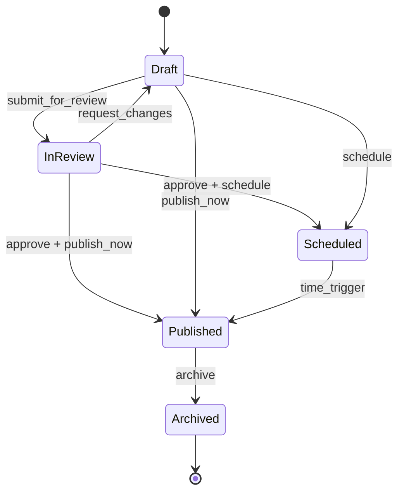
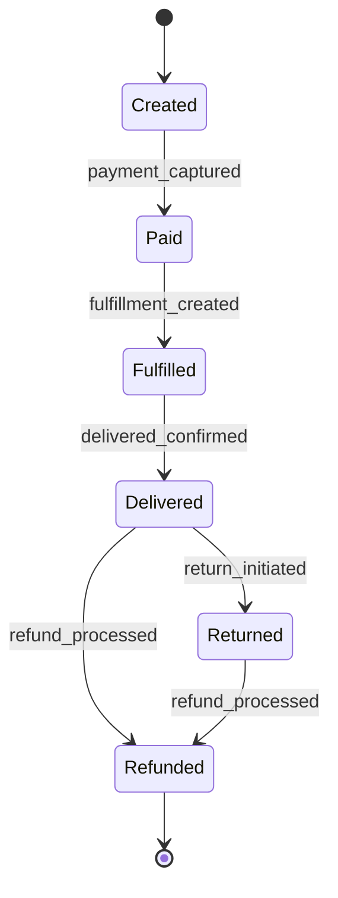
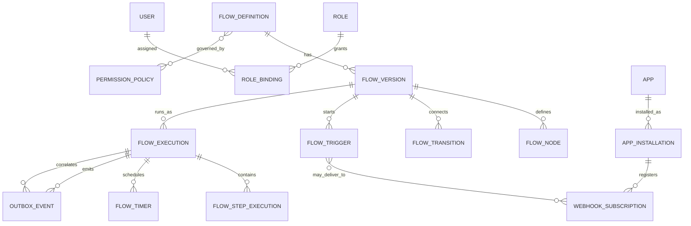
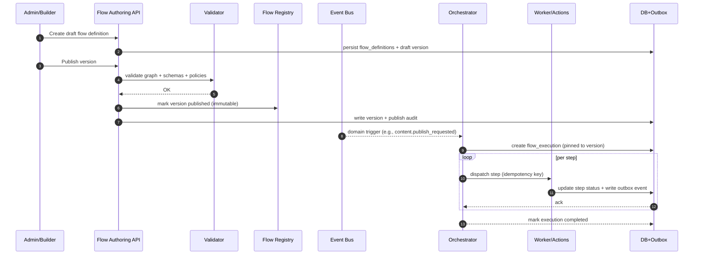
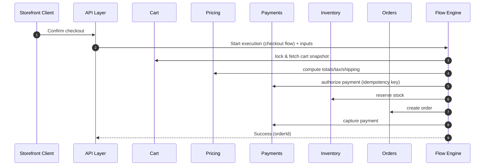

# Extending the Engine to Support CMS and Commerce Flow Creation

## Executive summary

The attached 10-* documents define a “systems view” of a modern CMS/blog and commerce platform and explicitly call out four end-to-end flows the platform must support: publishing content, browsing/buying (checkout), product updates propagating to storefront/discovery, and plugin/app extensibility. fileciteturn0file1 The same documents also frame the product into two halves (public storefront vs. admin/back office) powered by shared core modules (identity, data model, workflow engine, APIs/webhooks, search, notifications, observability, delivery/performance, extensibility). fileciteturn0file1

Extending “our engine” to *support flow creation* for these requirements implies adding (or hardening) a first-class workflow capability with: (a) an authoring model (flow definitions, versioning, templates), (b) a durable runtime (executions, state transitions, retries/timeouts, scheduling), and (c) integration contracts (HTTP APIs + event channels + webhook delivery). fileciteturn0file1 This report proposes a flow engine design that is domain-agnostic at the core but ships “domain packs” (CMS + commerce) with canonical entities, states, events, and validation rules derived from the documents’ flows A–D. fileciteturn0file1

Key recommendations:

- Use an explicit contract-first approach: **OpenAPI** for HTTP APIs and **AsyncAPI** for message/event interfaces, so both humans and machines can reason about endpoints, payloads, and event channels. citeturn0search6turn0search3  
- Standardize event envelopes using **CloudEvents** for internal events and outbound webhook deliveries to improve interoperability and traceability. citeturn13search0  
- For correctness across distributed state changes, adopt a **transactional outbox** pattern for reliable event emission alongside state updates. citeturn1search0  
- Make runtime behavior deterministic and safe under retries by requiring idempotency for side-effecting actions and using exponential backoff with jitter for retry storms. citeturn2search1turn1search0  
- Ship three reference implementations/design alternatives (in-house state machine + workers; a durable workflow orchestrator; BPMN/state-machine managed services) and choose based on operational constraints. citeturn10search4turn10search1turn12search2  

The output includes: extracted entities/states/events/transitions; proposed schema and ER model; architecture deltas (APIs, persistence, concurrency, transactions, backward compatibility); integrations/dependencies; runtime/validation/security model; implementation milestones with effort ranges; test cases; migration/rollout with rollback; and risks/open questions.

## Source context and assumptions

The primary project inputs available in-session are two documents: a “systems view” and an extended deep-research-style write-up that expands the systems view into a microservices-style mapping and contract/event guidance. fileciteturn0file1turn0file0 The “systems view” is the authoritative source for required modules and flows (A–D). fileciteturn0file1

The request references “all 10-* documents”; only the two above were accessible here. Any additional 10-* documents are treated as **missing inputs** and listed as open constraints (not blockers to producing a coherent baseline design). fileciteturn0file1turn0file0

Unspecified/unknown constraints explicitly treated as open items:

- Current engine architecture (monolith vs. services), supported runtimes/languages, deployment environment, and persistence layer(s).  
- Multi-tenancy requirements (single-tenant vs. SaaS multi-tenant), data isolation model, and regulatory scope.  
- Scale targets: peak QPS, event throughput, execution concurrency, retention periods, and latency/SLO targets.  
- Whether flows are user-authored (UI), AI-generated (from designs), or both; and whether “flow creation” must support a visual builder. fileciteturn0file1  

Where this report proposes a pattern or standard, it cites official specification sources (OpenAPI/AsyncAPI, CloudEvents, OAuth/OIDC, etc.). citeturn0search6turn0search3turn13search0turn4search0turn3search3

## Flow requirements extracted from the documents

### Required domain entities and relationships

The documents describe a platform where “everything is an entity with core fields, metadata/custom fields, and relations,” spanning both CMS and commerce domains. fileciteturn0file1 The engine must therefore model (or at least reference) these entities when constructing and executing flows:

**CMS domain entities (minimum set)**: Post, Page, Media, Taxonomy (categories/tags), Menus, Revisions, plus “custom types” with metadata. fileciteturn0file1  
**Commerce domain entities (minimum set)**: Product, Variant, Collection/category, Price lists, Inventory item, Cart, Checkout, Order, Customer, Discounts, Shipping profiles, Tax rules; and optionally subscriptions/gift cards if supported. fileciteturn0file1  
**Extensibility entities**: App/Plugin, Installation, Scopes/Permissions, Webhook Subscriptions, Metafields/config attached to entities. fileciteturn0file1  

From a flow-engine point of view, these map into two categories:

- **Business aggregates**: Post, Product, Cart, Order, AppInstallation (objects that own lifecycle state). fileciteturn0file1  
- **Supporting resources**: Media, Taxonomy, PriceRule, InventoryReservation, WebhookSubscription (objects referenced/produced by flows). fileciteturn0file1  

### Required states and transitions

The documents explicitly define baseline lifecycle states and imply additional intermediate states (review/approval gates, scheduling, fulfillment steps). fileciteturn0file1

#### Content lifecycle state machine

This is directly grounded in the stated content statuses “draft → scheduled → published → archived” plus the “optional editor review/approval” step and “publish now or schedule” requirement. fileciteturn0file1

#### Order lifecycle state machine

This is grounded in the required operational states “created → paid → fulfilled → delivered → returned/refunded,” plus the explicit “returns/refunds” post-purchase flow requirement. fileciteturn0file1

### Required events, triggers, and side effects

The documents repeatedly state that transitions “trigger events: indexing, cache purge, emails, webhooks, inventory updates.” fileciteturn0file1 To make flow creation and execution consistent, define a canonical event taxonomy:

- **Domain events** (facts about domain state transitions): `content.published`, `order.placed`, `product.updated`, `app.installed`. fileciteturn0file1  
- **Operational side-effect intents** (requests to perform work): `search.reindex_requested`, `cache.purge_requested`, `notification.send_requested`, `webhook.deliver_requested`. fileciteturn0file1  
- **Execution/runtime events** (engine internals): `flow.execution_started`, `flow.step_succeeded`, `flow.step_failed`, `flow.execution_waiting`. (Engine-defined; required for observability and retries.)  

For interoperability and consistent metadata, represent domain and operational events as **CloudEvents** (fields like `specversion`, `type`, `source`, `id`). citeturn13search0

For contract documentation:

- HTTP entity APIs should be described via **OpenAPI** (standard interface description for HTTP APIs). citeturn0search6turn0search7  
- Event channels/topics should be described via **AsyncAPI** (protocol-agnostic message-driven API specification). citeturn0search3turn0search4  

### Inputs and outputs per flow

The documents provide four flows (A–D). Below is a normalized “flow contract” view: **trigger → required inputs → outputs → side effects**.

#### Flow A: Publish a blog post

Trigger: author/admin action (publish now) or time-based schedule. fileciteturn0file1

Required inputs:
- `postId`, `actorId`, desired action (`publish_now` or `schedule` + time), current revision/version. fileciteturn0file1  

Outputs:
- Post status transition to Published (or Scheduled), emitted domain event(s). fileciteturn0file1  

Side effects (required):
- Cache invalidation/rebuild, search index update, sitemap/SEO ping, subscriber notifications, analytics tracking. fileciteturn0file1  

#### Flow B: Browse products and buy

Trigger: user interaction on storefront (“add to cart”, “checkout confirm”). fileciteturn0file1

Required inputs:
- `cartId` (or session), selected `variantId`, qty, pricing context, shipping address, shipping method, payment method/token. fileciteturn0file1  

Outputs:
- Order created, payment authorized/captured, inventory reserved/decremented, confirmations/webhooks triggered. fileciteturn0file1  

Side effects:
- Webhooks to external systems (ERP/CRM), fulfillment/shipping label creation, tracking notifications, post-purchase messaging (reviews/remarketing). fileciteturn0file1  

#### Flow C: Product update (admin → storefront)

Trigger: admin product edit or bulk import completion. fileciteturn0file1

Required inputs:
- Product payload, SKU/variant set, pricing rules, inventory changes; import batch metadata (if bulk). fileciteturn0file1  

Outputs:
- Product saved/published; validation results; domain event `product.updated`. fileciteturn0file1  

Side effects:
- Search index update, cache purge, feed updates (merchant catalogs), external system webhooks. fileciteturn0file1  

#### Flow D: Plugin/App adds a capability

Trigger: admin installs app and grants scopes; subsequent runtime events trigger app logic. fileciteturn0file1

Required inputs:
- App identity, installation context (tenant/store), requested permissions/scopes, callback URLs, extension manifests/config. fileciteturn0file1  

Outputs:
- App installed; webhooks registered; stored configuration + metadata attached to entities; runtime extension activated within allowed extension points. fileciteturn0file1  

Side effects:
- Webhook deliveries to app endpoints; UI extensions rendered; controlled modification of outputs (where allowed). fileciteturn0file1  

### Constraints and error cases implied by the flows

The documents name some explicit constraints (SKU uniqueness, price rules validation, permission checks), and imply the rest via the nature of distributed systems (retries, timeouts, event ordering). fileciteturn0file1

Cross-cutting constraints:

- **Permission-checked actions**: “Every action is permission-checked (edit post, refund order, change theme, manage apps).” fileciteturn0file1  
- **Data validation constraints**: SKU uniqueness; price rules validity; inventory non-negativity/reservations; address validation; tax computation requirements. fileciteturn0file1  
- **Event-driven side effects**: publish/update transitions must dispatch downstream work (indexing, cache purge, notifications, webhooks). fileciteturn0file1  

Representative error cases the engine must model (as first-class step failures with retry/compensation policies):

- Invalid state transition (e.g., publish an archived post; refund an unpaid order) → return a conflict-style error; do not emit downstream side effects.  
- Concurrency conflict (two admins edit the same product; two checkout confirms) → optimistic lock failure and safe retry behavior; do not double-charge or double-reserve inventory.  
- External dependency failures (payment gateway timeout/decline; shipping provider failure; webhook receivers down). For webhook handling, third-party systems commonly require sender authenticity validation (HMAC) and fast acknowledge patterns for reliability. (See Shopify webhook HMAC header conventions and verification guidance.) citeturn8search0turn8search2  
- Scheduled events missed (scheduler downtime) → replay/reconciliation required; scheduled publish must still occur after recovery.  
- Poison events / malformed payloads → dead-lettering and diagnostics, not infinite retry loops.  
- Webhook security failures (invalid signature) → reject request; do not process. Shopify explicitly documents an HMAC header for verification on HTTPS deliveries. citeturn8search0turn8search2  

For HTTP error payloads, use the standardized Problem Details format (RFC 9457 obsoletes RFC 7807) to avoid bespoke per-endpoint error schemas. citeturn2search2

## Proposed data model and schema changes

### Data model goals

To support flow creation in this CMS+commerce domain, the engine’s storage must support:

- **Immutable, versioned flow definitions** that can be authored as drafts and promoted to published versions.  
- **Durable execution state** for long-running flows (scheduled publish, fulfillment pipelines, app install).  
- **Auditable transition history** (who did what, when), especially for admin actions and order lifecycle actions. fileciteturn0file1  
- **Flexible metadata** for custom fields (“metafields”), plugin/app config on entities, and evolving schemas. fileciteturn0file1  

A practical default is a relational core with JSON fields for metadata. PostgreSQL’s **GIN indexes for `jsonb`** (operator classes like `jsonb_ops` / `jsonb_path_ops`) are an established approach for indexing JSON metadata while keeping relational integrity for core columns. citeturn6search3

### Proposed schema additions for flow creation

Below is a concrete schema delta independent of the underlying tech stack (table names are illustrative).

**Definition-time tables**
- `flow_definitions` (stable logical identity: name, domain, owner, created_at)  
- `flow_versions` (immutable versions: flow_definition_id, semver/build, status, created_by, created_at, schema_version, checksum)  
- `flow_nodes` (flow_version_id, node_id, type, config_json, input_schema_json, output_schema_json)  
- `flow_transitions` (flow_version_id, from_node_id, to_node_id, condition_expr, guard_policy_id)  
- `flow_triggers` (flow_version_id, trigger_type: event|http|schedule, trigger_filter, mapping_rules)  

**Runtime tables**
- `flow_executions` (execution_id, flow_version_id, status, started_at, completed_at, correlation_id, tenant_id, initiated_by)  
- `flow_step_executions` (execution_id, node_id, status, attempt, last_error, started_at, ended_at, idempotency_key)  
- `flow_timers` (execution_id, node_id, fire_at, timer_type, payload_ref)  
- `flow_compensations` (execution_id, node_id, compensation_node_id, status)  

**Cross-cutting correctness tables**
- `outbox_events` (event_id, aggregate_type, aggregate_id, event_type, payload_json, headers, created_at, published_at) for transactional event emission. citeturn1search0  
- `idempotency_records` (key, scope, request_hash, status, created_at, expires_at) to suppress duplicates.  
- `permission_policies` / `role_bindings` to enforce who can author/publish/execute flows. fileciteturn0file1  

### ER diagram

This covers definition versioning, runtime execution, correctness mechanisms (outbox), and the app/webhook extensibility requirements. fileciteturn0file1 citeturn1search0

### Schema evolution, versioning, and backward compatibility

Flow definitions must evolve without breaking in-flight executions:

- **Flow versions are immutable**, and each execution is pinned to the exact `flow_version_id` used at start time.  
- Promote compatibility via additive changes: add new nodes/transitions under a new version; keep old versions runnable until retention window ends.  
- If your engine also version-controls workers/runtimes, use explicit compatibility rules (e.g., “only compatible workers process tasks”)—a concern highlighted in durable workflow systems that gate execution by worker compatibility. citeturn12search5turn12search3  

For database migrations supporting these schema changes, use an expand/contract approach so old and new code can run concurrently (particularly during rolling deployments). citeturn15search8turn6search1

## Engine architecture changes, integrations, and design alternatives

### Target architecture changes required

The documents’ flows require both synchronous “front door” APIs and asynchronous/event-driven side effects. fileciteturn0file1 The engine needs the following components (whether as services or internal modules):

- **Flow Authoring API**: CRUD for definitions, validations, previews, and publish/unpublish of versions.  
- **Flow Template/Domain Pack Layer**: ships prebuilt flows A–D and canonical entity/state/event vocabularies for CMS+commerce. (This directly reflects the documents’ explicit module list and flow list.) fileciteturn0file1  
- **Runtime Orchestrator**: drives durable state transitions, timers/scheduling, retries/backoffs, and compensation steps for long-running flows (publishing pipelines, checkout/order saga, fulfillment). fileciteturn0file1  
- **Action/Worker Subsystem**: executes tasks (call service, send notification, purge cache, deliver webhook) with idempotency and observability.  
- **Trigger Ingestion**: subscribes to domain events (product updated, order paid), schedule triggers, and HTTP triggers.  
- **Event & Webhook Dispatcher**: emits internal events and delivers webhooks to external systems (ERP/CRM, email providers, etc.). fileciteturn0file1  

This architecture aligns with the deep-research document’s “contracts-and-events” framing of implementation: stable HTTP APIs (OpenAPI) and asynchronous interfaces (AsyncAPI), plus standardized event envelopes (CloudEvents). fileciteturn0file0 citeturn0search6turn0search3turn13search0

### Contract surfaces: APIs and events

**HTTP layer**: define engine and domain APIs with OpenAPI so toolchains can generate clients/tests and keep contract drift detectable. citeturn0search6turn0search7

Minimum engine API endpoints (illustrative):
- `POST /flows` (create definition draft)  
- `POST /flows/{id}/versions` (create version)  
- `POST /flows/{id}/versions/{v}:validate`  
- `POST /flows/{id}/versions/{v}:publish`  
- `POST /executions` (start execution with inputs)  
- `GET /executions/{id}` (status + step history)  
- `POST /executions/{id}:cancel`  

**Event layer**: document topics/queues with AsyncAPI; define payload schemas via JSON Schema Draft 2020-12 to validate compatibility. citeturn0search3turn13search5

**Event envelope**: represent domain events as CloudEvents for consistent metadata and interoperability. citeturn13search0turn13search3

### Persistence, concurrency, and transactions

**Transactional outbox for correctness**  
When a state transition must atomically update durable state *and* emit events (e.g., `content.published` leading to index/cache/notify), use an outbox table written in the same database transaction and then published asynchronously. Debezium explicitly frames this as avoiding inconsistencies between internal state and events consumed downstream. citeturn1search0

**Concurrency model**  
The engine should treat each `flow_execution` as a single-writer object to prevent out-of-order transitions:

- Option A: DB row-level locking / optimistic concurrency on `flow_executions.version`.  
- Option B: Partitioned event processing so all events for an execution land on the same partition/consumer (common with Kafka). Kafka documents that it guarantees order **within** a partition and uses consumer groups to distribute partitions among consumers. citeturn10search0  

**Retry/backoff strategy**  
For transient failures (timeouts, 5xx), use bounded exponential backoff with jitter (to avoid synchronized retry storms). citeturn2search1  
For throttling, return HTTP 429 and use `Retry-After` semantics where appropriate. citeturn2search0

### Required integrations and external dependencies

The documents call out explicit integration points: CDN/cache, search indexing, notifications, webhooks to external systems, payment gateways, shipping providers, analytics. fileciteturn0file1 The engine should therefore standardize action connectors for:

- **Search indexing**: (re)index on publish/product updates; ILM is relevant if you use Elasticsearch for time-based indices (logs/metrics) and also informs index lifecycle discipline. citeturn6search2  
- **Cache/CDN purge**: purge by tag/keys on publish/product updates (implementation-specific). fileciteturn0file1  
- **Notifications**: email/SMS/web push; event-driven triggers. fileciteturn0file1  
- **Webhooks**: outbound deliveries with signing/verification conventions; Shopify documents HMAC header patterns and request verification guidance for webhook-like deliveries. citeturn8search0turn8search2  
- **Payments**: payment intents/authorize/capture/refunds; minimize PCI scope by avoiding storage of sensitive authentication data after authorization (PCI SSC explicitly prohibits storing SAD after authorization even if encrypted). citeturn14search2turn0file1  
- **Shipping/Fulfillment**: rate calculation, labels, tracking updates. fileciteturn0file1  
- **Observability**: distributed tracing propagation using W3C Trace Context headers (`traceparent`, `tracestate`) across services and async boundaries. citeturn1search3  

### Design alternatives and trade-offs

The documents do not prescribe a particular workflow technology; they prescribe functional outcomes (states, transitions, side effects, extensibility). fileciteturn0file1 Below are viable alternatives for implementing the “flow creation + runtime” capability.

| Alternative | What it is | Strengths | Costs / risks | Best fit when |
|---|---|---|---|---|
| In-house declarative state machine + workers | Build flow DSL (JSON), persist executions in DB, run workers for actions | Tight control; simplest dependency profile; can be tuned to domain; easiest to embed into existing engine | You own durability semantics, replay, backpressure, tooling (UI, debugging) | Existing platform is already opinionated and you want minimal new infra fileciteturn0file0 |
| Durable workflow orchestrator (Temporal-style) | Code-first durable workflows, timers, retries, task queues, execution history | Strong durability model and long-running workflows; built-in retries/timers/signals; explicit “durable state” positioning | Operational footprint; deterministic workflow constraints; adoption cost | Many long-running business processes + need resilient orchestration citeturn12search2turn12search3 |
| BPMN-based engine (Camunda 8/Zeebe) | BPMN diagrams model workflows; engine executes & scales | BPMN/DMN standardization; built-in human task constructs; claims of scalable throughput via Zeebe-based engine | BPMN modeling overhead; integration complexity; governance needed | Need business-stakeholder-visible workflows + many human gates citeturn10search1turn10search5 |
| Managed state machines (AWS Step Functions) | Cloud-managed state machines (ASL), executions, integrations | Managed runtime; explicit state machine concepts; standard/express workflows | Cloud lock-in; service quotas; costs; integration constraints | Already on AWS and prefer managed ops over custom infra citeturn10search4turn10search6 |

A pragmatic recommendation under unknown constraints: implement the **in-house declarative model first** (because the documents suggest “new JSON flow definitions” and template-driven flow creation), but keep the definition model and connectors compatible with later migration to a durable orchestrator if long-running workflows, human tasks, or recovery requirements outgrow the custom implementation. fileciteturn0file1turn0file0

## Runtime behavior, validation rules, and security/permission model

### Runtime behavior contract

At runtime, each flow execution is a durable state machine that consumes triggers, executes steps, and emits side effects. The runtime contract should include:

- **Single-writer per execution** (prevent concurrent transitions). Kafka-style partitioning can supply per-key ordering guarantees if you key events by `execution_id` (order only within a partition). citeturn10search0  
- **At-least-once step execution by default**; require idempotency on side-effect steps (payments, webhooks, inventory). The outbox pattern mitigates state/event divergence under retries. citeturn1search0turn2search1  
- **Timers and scheduling**: scheduled publish requires durable timers stored in DB (`flow_timers`) and a scheduler/worker that fires them; must be replayable after downtime. fileciteturn0file1  
- **Compensation hooks**: checkout and fulfillment are classical multi-step distributed workflows; flow nodes should support compensating transitions on later failure (release inventory reservation if payment capture fails, etc.). fileciteturn0file1  

### Flow definition validation rules

Flow creation must produce safe, executable workflows. Validate at publish time:

- **Graph validity**: exactly one Start; all End states reachable; no orphan nodes; condition expressions parseable; cycles only if explicitly allowed.  
- **Schema validity**: each node has input/output schema; use JSON Schema Draft 2020-12 to validate payloads and variable mappings. citeturn13search5  
- **Policy validity**: guards reference existing permissions/scopes; approval gates specify approver roles; webhook nodes specify signing requirements and timeouts. fileciteturn0file1  
- **Side-effect safety**: nodes that call external systems must declare idempotency strategy and retry policy (max attempts, backoff). Exponential backoff with jitter is recommended to limit load amplification. citeturn2search1  

For API error responses from the authoring/validation endpoints, use RFC 9457 problem details consistently. citeturn2search2

### Security and permission model

The documents require roles and permission checks across admin and public experiences (admin/editor/author/customer) and explicitly include app/plugin scopes. fileciteturn0file1 The engine must add:

**Authentication**
- Use OAuth 2.0 / OIDC for user-facing authentication and token issuance (OIDC is an identity layer on top of OAuth 2.0). citeturn4search0turn3search3  
- For bearer token handling, follow RFC 6750 guidance (protect from disclosure; avoid passing tokens in URLs) and incorporate current best practices from OAuth security BCP (RFC 9700). citeturn4search1turn5search2  

**Authorization**
- Enforce object-level authorization for all entity APIs and flow APIs; OWASP highlights Broken Object Level Authorization as a common risk where attackers manipulate IDs to access unauthorized objects. citeturn3search0turn3search2  
- Enforce property-level authorization (avoid mass assignment/excessive exposure) for APIs that update entities or flow definitions. citeturn3search1  

**Webhook/request verification**
- For inbound webhooks and action endpoints, require HMAC verification using a shared secret; Shopify documents a dedicated HMAC header in webhook-like requests. citeturn8search0turn8search2  
- Treat header casing as case-insensitive as required by HTTP; Shopify explicitly cautions against relying on a specific header casing. citeturn8search0  

**Privacy/compliance hooks (apps)**
- If the platform supports an app ecosystem comparable to Shopify’s, plan mandatory privacy compliance webhooks (e.g., customer data requests/redaction). Shopify documents `customers/data_request` and `customers/redact` behavior and timing constraints. citeturn9search3  

**Payments / PCI boundary**
- Do not store sensitive authentication data after authorization; the PCI SSC explicitly states SAD must not be stored after authorization even if encrypted. citeturn14search2turn14search7  

### Observability and trace propagation

Because flows A–D cross multiple services and async boundaries, distributed trace context must propagate through HTTP and events. The W3C Trace Context spec defines `traceparent`/`tracestate` fields to link traces across components. citeturn1search3 For outbox/event pipelines, Debezium documentation explicitly discusses tracing context propagation in outbox scenarios. citeturn1search2

## Implementation plan, testing, migration, rollout, and risks

### Prioritized milestones with effort ranges

Effort ranges are given as **Low / Medium / High** and assume a small-to-medium team extending an existing engine. Actual schedule depends on unknown constraints (stack, tenancy, scale, compliance scope). fileciteturn0file1

| Milestone | Deliverables | Low | Medium | High |
|---|---|---:|---:|---:|
| Flow definition core | Definition schema, versioning model, validation engine, OpenAPI contract | 2–4 wks | 4–8 wks | 8–12 wks |
| Runtime orchestration core | Executions, step runner, durable timers, retries/backoff, audit history | 3–6 wks | 6–12 wks | 12–20 wks |
| Eventing + outbox | Outbox tables, publisher, CloudEvents envelope, AsyncAPI docs | 2–4 wks | 4–6 wks | 6–10 wks |
| CMS/commerce domain packs | Templates implementing flows A–C; canonical events/states; guard policies | 3–6 wks | 6–10 wks | 10–16 wks |
| Extensibility pack | App install flow (D), scopes model, webhook registry, entity metafields | 3–6 wks | 6–12 wks | 12–18 wks |
| Hardening | Security review (OWASP), load/soak, observability, runbooks, SLOs | 2–4 wks | 4–8 wks | 8–12 wks |

This milestone breakdown reflects the documents’ explicit module list and four key flows. fileciteturn0file1

### Key implementation tasks

Core (definition-time):
- Implement `flow_definitions` / `flow_versions` / `flow_nodes` / `flow_transitions`.  
- Implement publish-time validation (graph + schema + permission policies). citeturn13search5turn2search2  
- Add contract generation: OpenAPI for HTTP, AsyncAPI for event channels. citeturn0search6turn0search3  

Runtime:
- Implement `flow_executions` and step execution state machine, with durable timers for schedule/wait nodes. fileciteturn0file1  
- Enforce single-writer execution semantics (optimistic locking or partitioned execution). citeturn10search0  
- Implement retry policies with exponential backoff + jitter defaults; surface retry metadata in step histories. citeturn2search1  

Integrations:
- Implement outbox publisher and consumers; ensure state updates + outbox inserts are atomic. citeturn1search0  
- Implement webhook delivery worker with signature support and fast ACK patterns where you are the receiver; for sending, add signing for platforms that require it. citeturn8search0turn8search2  
- Add connectors for cache purge, search reindex, notifications, and payments/shipping gateways (vendor-specific). fileciteturn0file1  

### Key flow sequences (mermaid)

#### Engine-level: author → publish → trigger → execute

This sequence matches the need for publish-time validation, durable executions, and event-driven triggers implied by flows A–D. fileciteturn0file1 citeturn1search0turn0search3turn0search6

#### Flow B: checkout orchestration (happy path)

This is grounded in the documents’ explicit checkout steps: cart recalculation, payment authorize/capture, inventory reserve/decrement, order creation, and downstream notifications/webhooks. fileciteturn0file1

### Testing: unit, integration, end-to-end

**Unit tests (engine core)**
- Definition validation: unreachable nodes, invalid predicates, missing schemas, invalid permission policy references.  
- State machine correctness: allowed transitions only (content/order). fileciteturn0file1  
- Retry policy logic: backoff+jitter boundaries, max attempt enforcement. citeturn2search1  

**Integration tests**
- DB transactional semantics: state update + outbox insert atomicity; publisher publishes exactly-once relative to outbox rows (dedupe). citeturn1search0  
- Timer behavior: scheduled publish fires correctly after restarts; overdue timers reconcile on startup. fileciteturn0file1  
- Webhook verification: reject invalid HMAC; accept valid; ensure header casing robustness. citeturn8search0turn8search2  
- Redis/cart persistence behavior (if Redis is the cart store): verify durability trade-offs (AOF vs snapshots) match your intended risk profile. citeturn7search0  

**End-to-end tests (canonical flows)**
- Flow A: create draft → add revision/media → approve → publish now; verify cache purge + index update + notification requests emitted. fileciteturn0file1  
- Flow B: add-to-cart → checkout confirm; simulate payment decline and ensure no order or inventory decrement; simulate timeouts and ensure idempotency prevents double charges. fileciteturn0file1  
- Flow C: bulk import invalid SKU duplicates; verify validation blocks publish and emits problem-details error format. fileciteturn0file1turn2search2  
- Flow D: app install with limited scopes; verify blocked extension points; verify webhook registration and runtime event dispatch. fileciteturn0file1  

### Migration and rollout strategy with rollback plan

**Schema migrations**
- Use expand/contract: introduce new tables/columns first (expand), dual-write or backfill as needed (migrate), then remove old behavior (contract). citeturn15search8  
- Use a migration tool with auditable history: Flyway tracks applied versioned migrations once in a schema history table. citeturn15search2turn15search3  
- If rollback support is required for a given change, Liquibase supports rollback commands/tag-based rollback (with caveats and the need to define rollback for certain changesets). citeturn15search1turn15search9  

**Deployment**
- If using Kubernetes, rely on Deployment rolling updates and maintain revision history to support rollback to previous pod templates. citeturn6search1  
- Feature flag flow creation/activation per tenant/environment; ship read-only visibility first, then controlled execution. citeturn6search1turn15search8  

**Rollback plan**
- Code rollback: revert deployment + disable feature flags; keep flow definitions immutable/preserved for forensic analysis. citeturn6search1  
- DB rollback: prefer forward-fix, but for cases needing explicit rollback, rely on migration tooling rollback and ensure expand/contract phases preserve compatibility. citeturn15search8turn15search1  
- Event rollback: maintain versioned event types and consumer tolerance; outbox publisher should be stoppable without data loss (unpublished outbox rows remain). citeturn1search0turn13search0  

### Risks, assumptions, and open questions

Risks (with mitigations):

- **Double side effects in checkout (double charge / double reserve)**: mitigated via idempotency keys + single-writer executions + outbox. citeturn1search0turn2search1  
- **Webhook security and reliability**: HMAC verification and strict validation are required; failure to validate or to handle retries safely creates spoofing and overload risks. citeturn8search0turn8search2  
- **Authorization gaps**: OWASP’s API1:2023 (BOLA) illustrates how easy it is to exploit missing object-level checks; flows crossing admin/storefront increase blast radius. citeturn3search0turn3search2  
- **PCI scope creep**: storing SAD after authorization is prohibited; payment integration must be designed to avoid retaining prohibited data. citeturn14search2turn14search7  
- **Event ordering assumptions**: if ordering is required, enforce per-key partitioning; Kafka only guarantees total order within a partition, not across partitions. citeturn10search0  
- **Operational complexity of durable orchestration**: adopting BPMN/durable workflow platforms can reduce custom code but increases platform operational load and governance needs. citeturn10search1turn12search2  

Open questions (blocking for final design choice, but not for implementing the baseline):

- What is the existing engine’s runtime boundary: is it purely a “definition + generation” tool, or does it execute workflows in production? (The documents mention both workflow/orchestration and generation/mapping concepts.) fileciteturn0file1turn0file0  
- Is the platform multi-tenant SaaS (Shopify-like constraints) or self-hosted plugin-first (WordPress-like)? The extensibility and isolation model differs materially. fileciteturn0file1  
- Required retention for execution history, audit logs, and events; regulatory obligations and data residency.  
- Messaging infrastructure choice (Kafka vs. AMQP vs. cloud bus), and whether the system already has an event bus. citeturn0search3turn10search0  
- Expected flow authoring UX: API-only (configuration as code), a visual builder, or AI-generated flows with human review. fileciteturn0file1  

Assumptions used in this report:

- The engine will support both synchronous API-driven operations and asynchronous event-driven side effects as required by flows A–D. fileciteturn0file1turn0file0  
- State transitions are the primary invariants; downstream side effects (indexing, cache purge, notifications, webhooks) are executed reliably but asynchronously, not inline. fileciteturn0file1turn1search0  
- Flow definitions are versioned and immutable once published; executions are pinned to a version for backward compatibility. citeturn15search8turn6search1