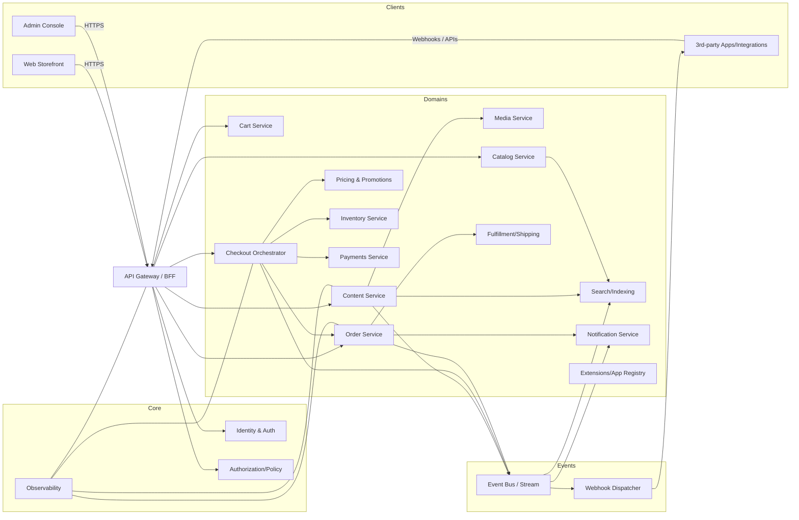
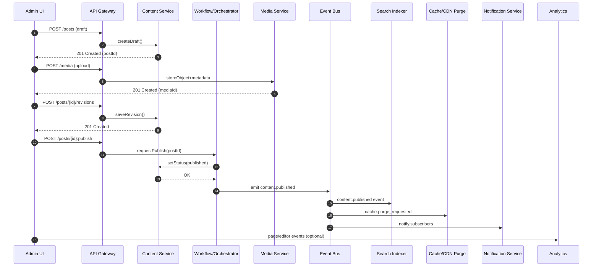
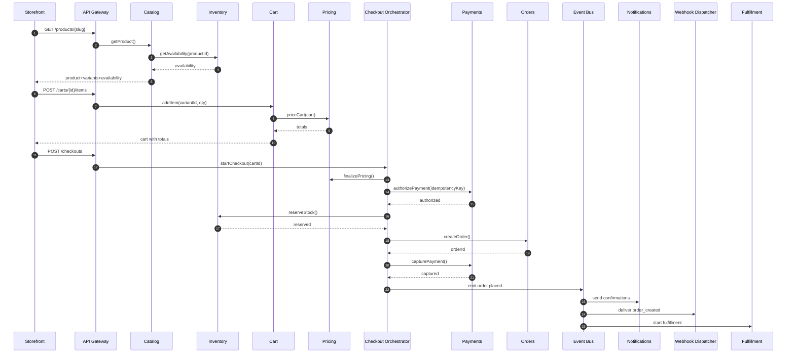
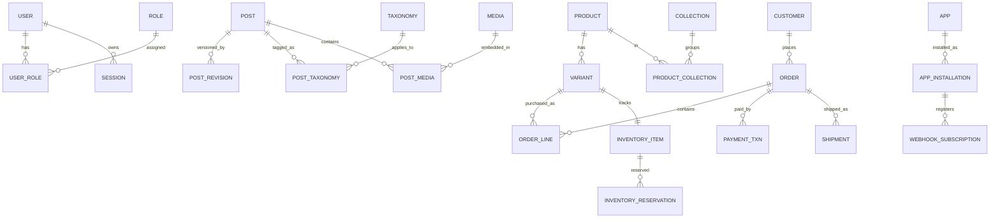

# Extending an Existing Microservices Platform to Support CMS and Commerce Workflows

## Executive summary

The attached Markdown describes a “systems view” of a modern CMS/blog platform (WordPress-like) and commerce platform (Shopify-like), with two major experiences (public storefront vs. back-office/admin), a set of core platform modules (identity, data model, workflows, APIs/webhooks, search, notifications, observability, extensibility), and four end-to-end key flows (publish content, browse/buy, product update, plugin install/runtime). fileciteturn0file0

Extending an existing microservices platform to implement this specification is best treated as (a) a domain decomposition exercise (content, commerce, identity, workflow orchestration, integrations), and (b) a contracts-and-events exercise (stable REST APIs described via OpenAPI; asynchronous/event interfaces described via AsyncAPI; and standardized event envelopes such as CloudEvents). citeturn12search0turn0search11turn5search0turn5search22

A rigorous, low-risk implementation plan typically converges on these architectural choices:

- **Domain-aligned services with an API gateway**: microservices are independently deployable units around business capabilities; consistency improves when the gateway centralizes routing, coarse-grained auth decisions, and throttling. citeturn12search0turn12search1  
- **Transactional core in an RDBMS; specialized stores for specific workloads**: orders/payments/inventory fit relational constraints; carts and sessions often favor Redis; media goes to object storage; discovery goes to a search index. citeturn11view0turn4search1turn4search8turn4search3turn4search2  
- **Events for cross-service workflows; sagas/outbox for correctness**: multi-step business processes (checkout, publish pipelines) require choreography/orchestration patterns, durable retries, idempotency, and reliable event emission. citeturn2search3turn2search2turn2search0turn2search1  
- **Security and compliance by design**: OAuth2/OIDC + JWT for user-facing auth, strict authorization controls to address common API risks (e.g., BOLA), and payment/PII handling that minimizes PCI/GDPR exposure. citeturn1search0turn1search1turn1search2turn1search3turn7search4turn7search21  
- **Operational readiness from day one**: OpenTelemetry + W3C trace propagation, Prometheus-style alerting, and “golden signals” metrics to make failures diagnosable and safe to run at scale. citeturn3search3turn3search0turn3search5turn12search3  

Assumptions are explicit below; where details are missing, the report provides a mapping template and an implementable reference design.

## Assumptions and scope boundary

The user request states the current platform architecture is unspecified and instructs us to **assume microservices, REST APIs, and a web frontend unless noted**; this report follows that instruction. citeturn12search0turn0search11

The Markdown file itself is a “systems view” and flow catalogue, not a low-level protocol spec; it also contains partial/elliptical references to an internal architecture (“XIIGen … Master Plan” and “skills/services”), but those references are incomplete. This report therefore provides:

- A **generic microservices mapping** (suitable for typical platforms with an API gateway and service-per-domain). citeturn12search0turn12search1  
- An **optional “if XIIGen exists” alignment note** where the Markdown provides specific service names. fileciteturn0file0  

Out of scope unless you explicitly want them: (a) detailed PCI DSS scoping/QSA guidance, (b) detailed tax engine rules per jurisdiction, (c) full UI/UX spec for admin/storefront, and (d) vendor-specific gateway integrations beyond contract patterns. citeturn7search4turn7search21

## Current platform architecture baseline

A microservices baseline consistent with the prompt typically includes: a web frontend (storefront + admin), an API gateway/BFF layer, independently deployable domain services, and shared platform capabilities (identity, observability, messaging). Microservices are commonly defined as small services that communicate via lightweight mechanisms (often HTTP APIs) and are independently deployable. citeturn12search0turn0search11

A minimal “platform skeleton” that can absorb CMS + commerce extensions looks like:

- **Edge / gateway**: routing, TLS termination, authentication delegation, and rate limiting. An API gateway is frequently used as a single entry point in microservices reference architectures. citeturn12search1turn5search7  
- **Core platform services**: identity, permissions, audit logging, configuration, observability. OAuth2/OIDC and JWT are common building blocks for modern authn/authz approaches. citeturn1search0turn1search1turn1search2  
- **Domain services**: content (posts/pages/media), catalog (products/variants), pricing/promotions, inventory, cart/checkout orchestration, payments, orders, fulfillment/shipping, search, notifications, “apps/plugins”/extensions. fileciteturn0file0  
- **Event backbone**: a message broker/streaming platform for cross-service events plus webhooks for third-party integrations. AsyncAPI exists to describe message-driven APIs and complements OpenAPI for HTTP APIs. citeturn5search0turn0search11  

In the CMS and commerce ecosystems the Markdown references, patterns to emulate include: REST APIs for domain objects (WordPress REST API exposes posts/pages/taxonomies; WooCommerce exposes orders/products/etc.) and event/webhook integration. citeturn10view0turn11view0turn9view0

### Architecture diagram for the extension



This diagram reflects the Markdown’s separation of “public experience” vs. “admin experience” using shared core modules and domain workflows. fileciteturn0file0

## Mapping the Markdown process to platform components and APIs

The Markdown contains two types of requirements:

- **Module inventory** (“Identity & Access”, “Workflow Engine”, “API Layer + Webhooks”, etc.) describing platform capabilities. fileciteturn0file0  
- **Flow steps** (Flows A–D) describing end-to-end behavior for publish, buy, product update, and plugin/app extensibility. fileciteturn0file0  

This section maps both into implementable components, APIs, and events.

### Mapping the Markdown’s core modules to services and API surfaces

The Markdown’s core-module list (2.1–2.11) implies you must provide: identity/permissions; an entity/metadata model; rendering/themes; an editor/builder; workflow states; APIs + webhooks; search; notifications; observability/analytics; performance tooling (CDN/cache/queues); and extensibility points. fileciteturn0file0

The reference mapping below uses OpenAPI-described REST for synchronous calls and AsyncAPI-described topics/queues for async event flows. citeturn0search11turn5search0

| Markdown module (verbatim) | Platform components | Primary REST API surfaces | Event surfaces (topics/webhooks) |
|---|---|---|---|
| “Identity & Access (Auth/Roles/Permissions)” fileciteturn0file0 | Identity service + policy/permissions service | `POST /auth/token`, `GET /users/{id}`, `GET /roles`, `POST /roles/{id}/assign` | `user.created`, `user.role_changed`, audit events |
| “Content/Data Model (Entities + Metadata)” fileciteturn0file0 | Content service (+ taxonomy/metadata subsystem) | `POST /posts`, `PATCH /posts/{id}`, `POST /media`, `GET /taxonomies` | `content.draft_saved`, `content.published`, `media.processed` |
| “Rendering & Theme System (Templates + Assets)” fileciteturn0file0 | Frontend rendering (SSR/SPA) + theme registry + CDN | `GET /themes`, `PUT /theme/active` | `theme.updated`, `cache.purge_requested` |
| “Editor / Builder (Authoring UI)” fileciteturn0file0 | Admin UI + content revision API | `POST /posts/{id}/revisions`, `GET /posts/{id}/preview` | `revision.created`, optional collab events |
| “Workflow Engine (Draft → Review → Publish / Operational states)” fileciteturn0file0 | Workflow/orchestrator (state machine or durable workflow engine) | `POST /posts/{id}:submit`, `POST /posts/{id}:approve`, `POST /orders/{id}:refund` | `workflow.step_completed`, saga events |
| “API Layer + Webhooks (Integrations)” fileciteturn0file0 | API gateway + webhook dispatcher + API key management | `POST /webhooks/subscriptions`, `POST /api-keys` | Webhook deliveries; `integration.webhook_failed` |
| “Search & Discovery” fileciteturn0file0 | Search service + indexer workers | `GET /search?q=...` | `index.upsert_requested`, `index.completed` |
| “Notifications & Messaging” fileciteturn0file0 | Notification service + templating | `POST /notifications/email` (internal) | `notification.sent/failed` |
| “Observability & Analytics” fileciteturn0file0 | Telemetry pipeline (logs/metrics/traces) + analytics event pipeline | `POST /analytics/events` (optional) | `telemetry.*` (internal) |
| “Performance & Delivery” fileciteturn0file0 | CDN/caching, queues, background workers | N/A | `cache.invalidate`, queue jobs |
| “Extensibility (Plugins/Apps)” fileciteturn0file0 | App registry, permissions/scopes, extension points | `POST /apps/install`, `GET /apps/{id}/scopes` | `app.installed`, `app.webhook_registered` |

**Why this mapping is coherent with the referenced ecosystems:** the WordPress REST API is explicitly positioned as an interface to interact with posts/pages/etc. and enforces authentication restrictions for private/meta/custom types. citeturn10view0 WooCommerce similarly exposes REST resources for orders/products/etc. and uses API keys/auth patterns in its API docs. citeturn11view0

### Mapping the Commerce-specific modules to services and state machines

The Markdown’s commerce modules (catalog, pricing, inventory, cart, checkout, payments, order management, shipping, taxes, CRM-lite) align with standard commerce domain boundaries. fileciteturn0file0

| Markdown module (verbatim) | Recommended service boundary | Core write model | Read models / caches |
|---|---|---|---|
| “Catalog (Products, Variants, Collections)” fileciteturn0file0 | Catalog service | Products/variants/collections in RDBMS | denormalized search index; CDN images |
| “Pricing & Promotions” fileciteturn0file0 | Pricing service | Rules + price lists in RDBMS | computed price cache (short TTL) |
| “Inventory” fileciteturn0file0 | Inventory service | stock ledger + reservations in RDBMS | fast reservation cache (optional) |
| “Cart” fileciteturn0file0 | Cart service | cart snapshots (often Redis) | session cache; merge-on-login |
| “Checkout” fileciteturn0file0 | Checkout orchestrator (saga) | checkout attempts in RDBMS | ephemeral compute |
| “Payments” fileciteturn0file0 | Payments service | payment intents/transactions in RDBMS | gateway tokenization; no PAN storage |
| “Order Management” fileciteturn0file0 | Order service | orders + line items in RDBMS | order timeline projection |
| “Shipping & Fulfillment” fileciteturn0file0 | Fulfillment service | shipments/labels in RDBMS | carrier status cache |
| “Taxes & Compliance” fileciteturn0file0 | Tax service (or library) | tax rules/audit in RDBMS | computed totals cache |
| “Customer Accounts & CRM-lite” fileciteturn0file0 | Customer service | customer profile/addresses in RDBMS | segmentation/read projection |

The rationale for “RDBMS for transactional core” is not that other models are impossible; it’s that commerce flows hinge on consistency, relational integrity, and auditable ledgers (e.g., orders/inventory/payments), while caches and projections improve latency. The report’s storage section gives explicit alternatives and trade-offs. citeturn2search3turn4search1turn4search8

### Mapping Flow A verbatim to platform APIs and events

Flow A in the Markdown is:  
1) “Author creates **Draft**”  
2) “Adds blocks/media → saves revisions”  
3) “Optional: editor review/approval”  
4) “**Publish now** or **Schedule**”  
5) “On publish: invalidate cache / rebuild pages; update search index; ping sitemap/SEO endpoints; notify subscribers (newsletter/web push)”  
6) “Track analytics (views, referrers, engagement)” fileciteturn0file0

| Flow A step (verbatim) | Services involved | REST APIs (examples) | Events (examples) |
|---|---|---|---|
| Author creates Draft | Content service | `POST /posts` → `{status:"draft"}` | `content.created` |
| Adds blocks/media → saves revisions | Content + Media | `POST /posts/{id}/revisions`, `POST /media` | `revision.created`, `media.uploaded` |
| Optional: editor review/approval | Workflow + Content | `POST /posts/{id}:submit`, `POST /posts/{id}:approve` | `workflow.approval_requested/approved` |
| Publish now or Schedule | Workflow + Content | `POST /posts/{id}:publish` or `POST /posts/{id}:schedule` | `content.published` / `content.scheduled` |
| On publish… | Search + CDN/cache + Notify + SEO integration | (Internal) `POST /cache/purge`, `POST /search/reindex` | `cache.purge_requested`, `search.index_requested`, `notification.dispatch_requested` |
| Track analytics… | Analytics pipeline | `POST /analytics/events` (from frontend) | `page_view`, `content_viewed` |

**Sequence diagram for Flow A (publish now)**



This sequencing matches the Markdown’s publish pipeline conceptually and aligns with common REST-driven CMS patterns (WordPress REST API supports content operations via JSON endpoints and enforces auth restrictions). citeturn10view0turn2search3turn0search11

### Mapping Flow B verbatim to platform APIs, sagas, and idempotency

Flow B in the Markdown is:  
1) “Visitor opens product page”  
2) “Catalog module returns product+variants+availability”  
3) “User selects variant → **Add to cart**”  
4) “Cart recalculates: pricing rules + discounts; tax estimate; shipping estimate (optional)”  
5) “Checkout: collect address; compute shipping methods + final taxes; payment authorize/capture”  
6) “Create order: reserve/decrement inventory; send confirmation; trigger webhooks (ERP/CRM)”  
7) “Fulfillment: create shipment, tracking, delivery notifications”  
8) “After purchase: returns/refunds flow (if needed); remarketing / review requests” fileciteturn0file0

| Flow B step (verbatim) | Services involved | REST APIs (examples) | Events (examples) |
|---|---|---|---|
| Visitor opens product page | Catalog + Search/CDN | `GET /products/{slug}` | (optional) `product.viewed` |
| Catalog module returns product+variants+availability | Catalog + Inventory | `GET /products/{id}?include=variants,availability` | (optional) `availability.calculated` |
| Add to cart | Cart | `POST /carts/{cartId}/items` | `cart.updated` |
| Cart recalculates… | Cart + Pricing + Tax + Shipping | `POST /carts/{id}:reprice` or implicit | `cart.priced` |
| Checkout… payment authorize/capture | Checkout + Payments | `POST /checkouts`, `POST /checkouts/{id}:confirm` | `payment.authorized`, `payment.captured` |
| Create order… inventory… webhooks | Order + Inventory + Notify + Webhook | `POST /orders` (internal) | `order.placed`, `inventory.reserved`, `webhook.order_created` |
| Fulfillment… | Fulfillment + Notify | `POST /shipments` | `shipment.created`, `shipment.tracking_updated` |
| After purchase… | Returns + Marketing | `POST /returns` / `POST /refunds` | `return.initiated`, `refund.processed`, `review.requested` |

**Key design requirement:** Step 5–6 is a distributed operation (multiple services must agree on an outcome). This is where a **saga** (orchestration or choreography) is the standard microservices pattern to coordinate multi-step workflows with compensations. citeturn2search3turn2search17

**Sequence diagram for Flow B (happy path checkout orchestration)**



**Reliability and retries for this flow:**
- Retrying is safest when operations are idempotent; otherwise duplicates can happen (e.g., replayed payment capture or double-reservation). The Azure Retry pattern guidance explicitly calls out the need to consider idempotency before retrying. citeturn2search0  
- Backoff + jitter prevents coordinated retry storms (“thundering herd”), and is a standard resilience practice in large-scale systems. citeturn2search1turn2search5  

### Mapping Flow C and Flow D verbatim to platform contracts

Flow C (admin → storefront) is: “Admin edits product or bulk imports” → “Validate data (SKU uniqueness, price rules)” → “Save → publish” → trigger “search index update; cache purge; feed updates …; webhooks …”. fileciteturn0file0

This is structurally the same as Flow A (publish) but in the commerce domain: state transitions emit domain events that drive indexing, cache invalidation, and external feeds. citeturn4search3turn2search2

Flow D (extensibility) is: “Install app/plugin → grant permissions/scopes” → “App registers webhooks … theme blocks/sections or admin UI extension” → “App stores its config + metadata on entities” → runtime “events trigger app logic … within allowed extension points.” fileciteturn0file0

This implies your platform must provide: (a) an app registry, (b) an authz/scopes model, (c) webhook subscription management, and (d) stable extension points (hooks/events, UI extension manifests). Shopify’s app model illustrates the importance of verifying webhook origin (HMAC), fast acknowledgment, and queuing to handle bursts. citeturn9view0

### Example API contracts and payloads

OpenAPI is designed to describe HTTP APIs in a machine-readable way; using OpenAPI for these endpoints makes contracts explicit and enables tooling for documentation, validation, and client generation. citeturn0search11turn0search2

Below are *example* REST contracts (your naming/versioning may differ).

**Create a draft post**

```http
POST /v1/posts
Authorization: Bearer <access_token>
Content-Type: application/json

{
  "title": "New post",
  "body": { "blocks": [] },
  "status": "draft",
  "visibility": "private",
  "tags": ["release-notes"]
}
```

```http
HTTP/1.1 201 Created
Content-Type: application/json

{
  "id": "post_123",
  "status": "draft",
  "version": 1,
  "createdAt": "2026-02-25T10:15:00Z"
}
```

**Add item to cart**

```http
POST /v1/carts/cart_abc/items
Authorization: Bearer <access_token_optional>
Idempotency-Key: 2a2f4b2e-acde-4d7a-9b63-37f8f3c45d1e
Content-Type: application/json

{
  "variantId": "var_789",
  "quantity": 2
}
```

```http
HTTP/1.1 200 OK
Content-Type: application/json

{
  "cartId": "cart_abc",
  "items": [{"variantId":"var_789","quantity":2}],
  "pricing": {"subtotal": 4000, "currency": "USD"},
  "updatedAt": "2026-02-25T10:20:00Z"
}
```

**Webhook delivery contract (CloudEvents envelope over HTTPS)**  
CloudEvents provides a common event structure and defines protocol bindings; representing your outbound events as CloudEvents improves consistency across sinks. citeturn5search22turn5search15

```http
POST /webhooks/order-created
Content-Type: application/cloudevents+json

{
  "specversion": "1.0",
  "type": "com.example.order.placed.v1",
  "source": "urn:platform:orders",
  "id": "evt_456",
  "time": "2026-02-25T10:25:00Z",
  "datacontenttype": "application/json",
  "data": {
    "orderId": "ord_123",
    "customerId": "cus_999",
    "total": 4200,
    "currency": "USD"
  }
}
```

**Webhook security (HMAC verification + fast ACK):** Shopify’s webhook guidance is instructive: respond with a 200 OK quickly, validate origin via an HMAC header, and queue webhook processing to avoid timeouts; it documents strict timeouts (connection ~1s; total request ~5s) and retry behavior (multiple retries over hours). citeturn9view0

## Data models, storage, and schema evolution

The Markdown’s module list implies you’ll need first-class entities for content (posts/pages/media, taxonomies, revisions), commerce (products/variants, orders, customers, discounts), workflow states, and extensibility metadata. fileciteturn0file0

### Conceptual data model



### Required new data models and schema changes

A practical way to implement “entities + metadata” is to keep a relational core with structured columns for critical fields, and use JSON/JSONB for flexible metadata (e.g., SEO fields, custom attributes, plugin-metafields). PostgreSQL explicitly supports JSON types and describes indexing JSONB using GIN indexes for efficient key/value search. citeturn4search8turn4search0

A representative schema inventory (abbreviated):

| Domain | Tables / collections (new or expanded) | Notes and constraints |
|---|---|---|
| Identity & access | `users`, `roles`, `user_roles`, `sessions`, `api_keys` | OAuth2/OIDC integration typically externalizes some flows; still store local roles/links. citeturn1search0turn1search1 |
| CMS content | `posts`, `post_revisions`, `media`, `taxonomies`, `post_taxonomies`, `post_media` | Aligns with WordPress-style entities and REST exposure patterns. citeturn10view0 |
| Commerce catalog | `products`, `variants`, `collections`, `product_collections`, `product_media` | Variants need uniqueness constraints on SKU per tenant/store. fileciteturn0file0 |
| Pricing/promotions | `price_lists`, `discounts`, `promotion_rules`, `applied_discounts` | Promotions often require auditability for customer support. |
| Inventory | `inventory_items`, `inventory_ledger`, `inventory_reservations`, `locations` | Prefer ledger+reservations over “just a stock number” to reconcile race conditions. citeturn2search3turn2search0 |
| Cart/checkout | `carts` (or Redis keys), `checkout_sessions` | Carts are latency-sensitive; Redis is common. Redis persistence has RDB/AOF trade-offs. citeturn4search1turn4search5 |
| Orders/payments | `orders`, `order_lines`, `payment_txns`, `refunds`, `returns` | Payment systems must avoid storing sensitive auth data; keep gateway tokens only. citeturn7search4turn7search0 |
| Shipping | `shipments`, `tracking_events` | Event-driven updates from carriers. |
| Extensibility | `apps`, `app_installations`, `webhook_subscriptions`, `entity_metafields` | Mirrors the “apps/webhooks/metafields” approach in Shopify-like platforms. fileciteturn0file0 |
| Search/indexing | `outbox_events` + search index | Index lifecycle management reduces cost/perf risk for time-based indices (logs/metrics/search). citeturn4search3turn2search2 |

### Storage and persistence options

The Markdown suggests a high-performance public experience (CDN/caching/image optimization) and a feature-rich back-office; that typically implies **polyglot persistence** with clear boundaries. fileciteturn0file0

| Workload | Option | Strengths | Weaknesses / risks | Good default |
|---|---|---|---|---|
| Transactional core (orders, inventory ledger, authz) | Relational DB (e.g., Postgres) | Strong consistency; constraints; mature migrations; JSONB support with indexing via GIN for metadata. citeturn4search8turn4search0 | Requires careful migration discipline and indexing strategy | ✅ Yes |
| Flexible metadata / “metafields” | JSONB in relational core | Avoids separate document DB; indexable JSONB patterns exist. citeturn4search8turn4search0 | Overuse can degrade queryability; schema drift | ✅ Often |
| Cart/session/state cache | Redis | Low latency; can persist via AOF/RDB with explicit durability tradeoffs. citeturn4search1turn4search5 | Memory cost; persistence tuning required | ✅ Yes |
| Media assets | Object storage | Versioning/Object Lock support helps retention and immutability needs (governance/WORM). citeturn4search14turn4search2 | Requires signed URLs, lifecycle policies | ✅ Yes |
| Discovery/search | Elasticsearch/OpenSearch | Built for search/faceting; ILM automates rollover/retention. citeturn4search3turn4search7 | Operational overhead unless managed | ✅ Yes for large catalogs/content |
| Event distribution | Kafka/RabbitMQ/SNS-SQS/etc. | Kafka topics are partitioned for scalability; partitions and consumer groups enable parallel consumption with ordering per partition. citeturn8search3turn8search6 | Operational overhead; schema governance needed | ✅ Depends on scale |

## Reliability, performance, security, and observability

### Event flows, sequencing, and contracts

For cross-module transitions (publish → index/cache purge/notify; checkout → payments/inventory/order/webhooks), an event backbone with documented event contracts improves decoupling and scalability. AsyncAPI is intended to describe message-driven APIs, and CloudEvents provides a standardized envelope for event payloads across protocols. citeturn5search0turn5search22turn5search15

**Recommended event contract approach**
- Use **OpenAPI** for REST endpoints and **AsyncAPI** for topics/queues; share schemas via JSON Schema 2020-12 where possible. citeturn0search11turn5search0turn5search6  
- Standardize event envelopes (CloudEvents) to unify observability metadata (id, source, type, time) across internal and webhook deliveries. citeturn5search22turn5search15  

### Error handling, retries, and idempotency

**Synchronous APIs**
- Use standard HTTP semantics (status codes, methods) as defined for HTTP/1.1. citeturn5search3  
- Return consistent, machine-readable error payloads. RFC 7807 defines “problem details” for HTTP APIs to avoid bespoke per-endpoint error formats. citeturn12search2  
- For rate limiting, return **429** with a **Retry-After** header to guide clients. citeturn5search7turn5search3  

**Retries**
- Only retry when the operation is safe to retry; Azure’s Retry pattern guidance calls out idempotency as a key consideration (otherwise duplicate side-effects can occur). citeturn2search0  
- Adopt backoff + jitter. Amazon’s guidance explains exponential backoff behavior and the need to cap delays; AWS also emphasizes jitter as a way to avoid synchronized retry storms. citeturn2search1turn2search5  

**Asynchronous/event correctness**
- Use the **outbox pattern** to prevent “DB committed but event lost” inconsistencies. Debezium’s outbox event router documentation explicitly frames the outbox pattern as a way to reliably exchange data between services while avoiding inconsistencies between internal state and emitted events. citeturn2search2turn2search12  
- For multi-step workflows, implement a **saga** (orchestration or choreography) with compensations (e.g., if payment capture fails after inventory reservation, release reservation). citeturn2search3turn2search17  

### Performance and scalability considerations

The Markdown emphasizes storefront performance (CDN, caching, image optimization) and background work via queues/workers (image processing, bulk imports, sending emails). fileciteturn0file0

A scalable implementation typically includes:

- **Frontdoor caching and cache invalidation**: publish/product-update events should trigger targeted cache purges (surrogate keys/tags) to keep storefront latency low while preserving freshness. fileciteturn0file0  
- **Search indexing as async**: update search indexes from events rather than inline request flows; Elastic ILM can manage index rollover/retention for time-based indexing workloads (also useful for logs/metrics indices). citeturn4search3turn4search7  
- **Partitioned event processing**: Kafka’s partitioning and consumer group model supports parallel event processing while preserving per-partition ordering. citeturn8search3turn8search6  
- **Webhook resiliency**: Shopify’s webhook guidance demonstrates practical constraints that apply broadly: acknowledge quickly (2xx), validate origin (HMAC), queue processing, and expect retries/timeouts. citeturn9view0  

### Monitoring and observability needs

To operate CMS + commerce reliably, focus on SRE “golden signals”—latency, traffic, errors, and saturation—as a minimum metric set. citeturn12search3

A concrete observability stack typically includes:

- **Distributed tracing context propagation** using W3C Trace Context headers (`traceparent`, `tracestate`). citeturn3search3turn3search11  
- **OpenTelemetry instrumentation** with semantic conventions to standardize attribute naming across traces/metrics/logs. citeturn3search0turn3search4  
- **Metrics + alerting**: Prometheus alerting rules and Alertmanager-style flows are canonical patterns for threshold and SLO-based alerting. citeturn3search1turn3search5  

### Security and compliance implications

**Authentication/authorization**
- OAuth 2.0 is the standard authorization framework; OIDC extends it for authentication using ID Tokens (JWTs). JWT defines a compact, URL-safe token format for claims. citeturn1search0turn1search1turn1search2  
- Implement fine-grained authorization checks to mitigate common API risks. OWASP’s API Security Top 10 highlights authorization failures (e.g., broken object level authorization) as a core risk category. citeturn1search3  

**Webhooks and integrations**
- Validate webhook origin via signatures (HMAC) and keep processing asynchronous to meet sender timeouts. Shopify provides a concrete example: HMAC header verification and strict delivery timeouts/retry semantics. citeturn9view0  

**Payments (PCI)**
- Do not store sensitive authentication data after authorization; PCI SSC guidance explicitly states SAD must never be stored after authorization (even if encrypted). Use tokenization/gateway vaulting to keep card data out of your systems where possible. citeturn7search4turn7search1turn7search0  

**Privacy (GDPR-like)**
- Data minimization and purpose limitation are core principles: the amount of personal data processed should be limited to what is necessary; EU guidance emphasizes that the type/amount of data depends on legal basis and intended use. citeturn7search21turn7search6  
- If you run an app ecosystem, plan for data subject request handling processes (export/delete); Shopify’s “mandatory compliance webhooks” show one approach to operationalizing third-party app obligations. citeturn7search3turn7search11  

## Testing, deployment, effort, and risk management

### Testing strategy

A rigorous strategy aligns with the system’s synchronous and async contracts:

- **Unit tests** per service: request validation, business rules (e.g., SKU uniqueness, state transitions), pure pricing/tax calculations.  
- **Integration tests**: DB persistence, Redis cart semantics, search indexing workers, payment gateway sandbox integration, and webhook signature verification. Shopify’s webhook validation notes (raw body handling and HMAC comparison) are a good reminder to test middleware ordering and raw-body capture. citeturn9view0  
- **Contract tests**:  
  - OpenAPI conformance for REST endpoints (requests/responses). OpenAPI exists to define a standard interface to HTTP APIs in a language-agnostic, machine-readable way. citeturn0search11turn0search2  
  - AsyncAPI conformance for event payloads, topics, and bindings. citeturn5search0  
  - JSON Schema validation for shared payload structures to reduce producer/consumer drift. citeturn5search6  
- **End-to-end tests** for Flow A and Flow B: publish content and verify cache/index/notify behavior; checkout and verify payment/inventory/order/webhook behavior. The WooCommerce and WordPress ecosystems demonstrate how broad these API surfaces become (posts/pages; orders/products/coupons/customers), so E2E tests should focus on “thin slices” of core flows rather than exhaustive permutations. citeturn10view0turn11view0  

### Deployment and rollout plan with migration and rollback

**Service rollout**
- Use rolling deployments (or canary) for stateless services; Kubernetes Deployments explicitly support rolling update workflows as a core controller feature. citeturn6search0  
- Gate new features behind feature flags and tenant-level enablement to reduce blast radius.

**Database migrations**
- Adopt expand/contract for breaking schema changes to enable running old and new code in parallel and improve rollback safety. The expand-and-contract pattern is explicitly motivated by zero-downtime + rollback-at-each-step goals. citeturn6search21turn6search3  
- Use a migrations tool (e.g., Flyway or Liquibase):  
  - Flyway applies versioned migrations exactly once and tracks applied migrations in a schema history table. citeturn6search5  
  - Liquibase provides rollback commands to revert database changes past a tag or by count (where rollback logic exists). citeturn6search2turn6search6  

**Rollback strategy**
- For code: roll back deployment + disable feature flags. citeturn6search0  
- For DB: prefer forward-fix when rollbacks are unsafe; use expand/contract to ensure rollbacks are possible at most steps. citeturn6search21turn6search3  
- For async: maintain backward-compatible schemas and consumer tolerance; use versioned event types (`...v1`, `...v2`). citeturn5search0turn5search22  

### Estimated effort and milestones

Because the existing platform details are unspecified, estimates are presented as **relative** and **bounded by assumptions**: a small team (4–6 engineers + QA + DevOps) extending an already-running microservices platform with basic CI/CD and observability.

| Milestone | Deliverables | Low | Medium | High |
|---|---|---:|---:|---:|
| Foundations | Service scaffolds, API gateway routes, OIDC integration, base telemetry, OpenAPI baseline | 2–3 wks | 4–6 wks | 8 wks |
| CMS MVP | Posts/pages/media, revisions, draft→publish workflow, indexing + cache purge | 4–6 wks | 8–12 wks | 16 wks |
| Commerce MVP | Catalog/variants, cart, checkout saga, payments integration (tokenized), orders, basic fulfillment hooks | 6–8 wks | 12–18 wks | 24+ wks |
| Integrations | Webhook dispatcher, HMAC verification patterns, retry/queueing, ERP/CRM events | 2–4 wks | 6–8 wks | 12 wks |
| Extensibility | App registry, scopes, webhook subscriptions, entity metafields, audit logs | 4–6 wks | 8–12 wks | 16 wks |
| Hardening | Load tests, chaos/resilience tests, SLOs/alerts, security review (OWASP), privacy workflows | 3–5 wks | 6–10 wks | 16 wks |

These milestones correspond directly to the Markdown’s module inventory and flows (publish, buy, update, plugin/app). fileciteturn0file0

### Risks and mitigations

| Risk | Why it matters | Likelihood | Mitigation |
|---|---|---:|---|
| Duplicate side effects in checkout (double charge / double reserve) | Retries without idempotency can repeat non-idempotent actions. citeturn2search0 | Medium | Idempotency keys for payment + order creation; saga compensations; outbox pattern for event emission. citeturn2search3turn2search2 |
| Lost events or inconsistent projections | “Write succeeded but event publish failed” breaks search/notifications. citeturn2search12 | Medium | Transactional outbox + CDC; replayable consumers; versioned event schemas. citeturn2search2turn5search0 |
| Webhooks overload / timeouts | Providers impose strict timeouts and retries; slow handlers cause redelivery storms. citeturn9view0 | High | Fast ACK (2xx), persistent queue, HMAC validation, backpressure; reconciliation jobs. citeturn9view0turn2search1 |
| Authorization gaps (BOLA/BOPLA) | OWASP highlights broken object/property authorization as prevalent API risks. citeturn1search3 | Medium | Central policy checks; object-level authorization; “deny by default”; security tests and reviews. citeturn1search3 |
| PCI scope explosion | Storing SAD after authorization is prohibited; storing card data increases compliance burden. citeturn7search4turn7search0 | Medium | Use gateway tokenization; do not store SAD; segment systems to reduce scope. citeturn7search1turn7search5 |
| Observability gaps delay incident response | Without traces/metrics, sagas and async flows are hard to debug. citeturn12search3 | Medium | W3C trace context propagation, OpenTelemetry semantic conventions, golden signals dashboards, Prometheus alerting. citeturn3search3turn3search0turn3search1turn12search3 |

