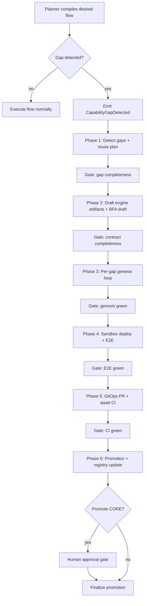
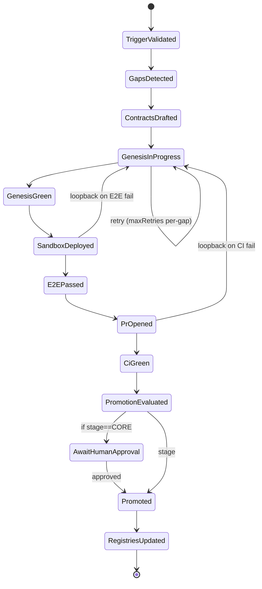

# Extending the Engine to Support Self-Build Flow Creation and Skill Assimilation

## Executive summary

The attached 26-* document (“26-self developing.md”) specifies a **self-build** capability: when a user describes a desired flow (example: “text → video”), the system should (a) generate the flow graph, (b) detect missing capabilities, (c) **synthesize engine artifacts** (factory specs, task contracts, flow template), (d) generate connector/service implementation plus tests, (e) deploy and validate in an isolated sandbox with **E2E**, and then (f) **assimilate** the validated capability into core via **PR/CI GitOps**, updating registries so future planning can discover the new node. (26-self developing.md L1–48, L89–109, L720–786)

Critically, the doc frames this as a **Meta-Flow** (“SelfBuildFlow”) governed by explicit guardrails: **fabric-first** dependency resolution (no direct provider SDK imports), “flow = engine output” (JSON DAG templates), **contract completeness** gates, bounded retry loops with judge feedback, promotion stages (**DRAFT → WIRED → VALIDATED → INJECTED → MINIMAL → CORE**), and a **human gate** for CORE promotion. (26-self developing.md L60–85, L770–786, L908–947, L1229–1242)

To support the described capability end-to-end, the engine must grow beyond “execute a declared DAG” into a platform that can **generate, validate, govern, and safely promote new capabilities**. Concretely, this requires a new runtime concept (recommended: `SelfBuildRun`), new registries (event schema registry, API contract registry, propagation trees, promotion ledger), deterministic testing harness support, sandbox build/deploy orchestration, GitOps assimilation tooling, and tenant-scoped policy/locking/isolation mechanics.

**Primary-source gap:** the document explicitly references “primary project sources” (basic prompt, unified architecture doc, BFA stress test doc, FLOW-05 engine extension doc) as authoritative constraints, but these are **not attached** here, so this report flags where those missing sources would materially affect IDs, DNA matrices, contract formats, and existing fabric/service inventories. (26-self developing.md L242–247)

## Primary-source synthesis of flow creation behavior

### Flow definitions, triggers, and orchestration semantics

The document defines a self-build lifecycle in phases, starting from intent-to-graph planning and culminating in assimilation and promotion. (26-self developing.md L21–48, L89–109)

**Trigger / entry conditions**
- **Primary trigger event:** `CapabilityGapDetected`, emitted when the planner cannot compile a requested flow due to missing factory interface or unsupported capability manifest. (26-self developing.md L91–98)
- **Template trigger validation:** entry includes BFA validation and a “tenant scope check.” (26-self developing.md L921–926)
- **Operator entry:** `self_build(skill_name|factory_interface|capability)` is explicitly described as an operator command in the T47 contract section. (26-self developing.md L720–723)

**Meta-Flow orchestration**
The doc includes an engine-storable flow template `self-build-skill-v1.json` with explicit phases, gates, loopbacks, and a human approval gate. (26-self developing.md L903–1274)

At a high level, the Meta-Flow (SelfBuildFlow) is:



This mirrors the doc’s explicit phases and loopbacks (contract loopback; genesis loopback; sandbox/E2E loopback; CI loopback; bounded retries) and its human gate for CORE. (26-self developing.md L1045–1162, L1205–1242)

### States, transitions, retries, and failure handling

The doc defines both:
- **Phase gates** (judge mode “ArtifactReview”) with acceptanceCriteria, failAction, and loopBackTo; and
- **Per-gap bounded retries** inside the “genesis per gap” subflow (`maxRetries: 3`, repair via `ApplyFixFromLogsAsync`). (26-self developing.md L985–1048, L1050–1096)

A concise state machine view for a `SelfBuildRun` (recommended runtime entity) aligned to the template:



This state model is directly implied by the phase ordering, loopback points, and explicit `HumanApprovalGate` in the template. (26-self developing.md L1045–1271)

### Inputs, outputs, entities, schemas, and security constraints explicitly specified

**Key inputs/outputs by phase (derived from the template)**  
- Phase 1 outputs: `gaps[]`, `capabilityGraph`, `reusePlanByGap`. (26-self developing.md L960–983)  
- Phase 2 outputs: `factorySpecs[]`, `taskTypeContracts[]`, `childTemplates[]`, `bfaDraft`. (26-self developing.md L996–1035)  
- Phase 3 per-gap outputs: `codeBundle`, `testBundle`, `unitReport`, with repair loop using `unitReport.logs`. (26-self developing.md L1059–1095)  
- Phase 4 outputs: `sandboxEnvRef`, `endpoints`, `e2eReport`, `flowTraceIds[]`, `failureSignatures`, `fullLogs`; teardown is guaranteed via `finally`. (26-self developing.md L1112–1153)  
- Phase 5 outputs: `branch`, `commitSha`, `pr`, `ciResult`. (26-self developing.md L1164–1204)  
- Phase 6 outputs: `promotionDecision`, optional `approvalTicket`, `promotionRecord`, `registryWrites`. (26-self developing.md L1214–1252)

**Evidence bundle schema**
The template includes an explicit evidence-bundle shape that spans gaps, contracts, implementation, tests (including deterministic harness), sandbox refs, BFA registrations, security scan report, DNA matrix, gitops metadata, and promotion decision. (26-self developing.md L936–947)

**Factory/service interfaces (engine evolution family)**
The doc proposes a dedicated family for engine evolution with factories that all accept `tenantId` and return a DPR envelope carrying dictionary payloads (no typed models). (26-self developing.md L280–354, L480–503)

- Gap detection + reuse planning: `ICapabilityGapService`. (26-self developing.md L284–291, L480–499)  
- Contract synthesis (factory spec, task type contract, flow template, BFA draft): `IEngineContractSynthesisService`. (26-self developing.md L292–300, L507–535)  
- Implementation genesis and log-based repair: `INodeImplementationGenesisService`. (26-self developing.md L301–308, L554–567)  
- Test generation including deterministic harness generation: `ITestGenesisService` with “record/replay” or mock mode to avoid flaky external calls in CI. (26-self developing.md L575–593)  
- Sandbox build/deploy with trace isolation; secrets only via vault: `ISandboxBuildDeployService`. (26-self developing.md L596–613)  
- Validation runner and artifact/log collection: `IValidationRunnerService`. (26-self developing.md L616–639)  
- Git assimilation (branch/commit/PR/CI, attach evidence): `IGitAssimilationService`. (26-self developing.md L641–653)  
- Promotion policy evaluation + approvals + rollback: `IPromotionPolicyService`. (26-self developing.md L658–679)

**Security and governance constraints**
The doc repeats several “build-failure” constraints that must be implemented as enforceable checks:
- **No direct provider SDK imports**; all external dependencies must resolve through fabrics (`CreateAsync()` config-first routing). (26-self developing.md L66–67, L565–566, L773–776)  
- **Secrets policy:** secrets only via vault; generated code must not embed secret values or rely on raw environment-variable injection patterns. (26-self developing.md L611–612)  
- **Assimilation path:** PR/CI is mandatory; no direct pushes to mainline. (26-self developing.md L882–884, L847–851)  
- **Promotion ladder + human gate:** CORE cannot be automatically promoted unless policy explicitly allows it; the template policy defaults to `autoPromoteMaxStage: MINIMAL` and `coreRequiresHumanApproval: true`. (26-self developing.md L928–933, L770–771)  
- **Cross-flow safety:** BFA must register event schemas, propagation trees, API contracts, conflict rules, and multi-store entity fragment mappings; ID collisions are CRITICAL. (26-self developing.md L1297–1470)

**Referenced-but-missing primary sources**
The doc explicitly points to these as authoritative:
- `basic_prompt.txt` (engine-first rules, must-not list, contract requirements, DNA rules)
- `XIIGEN_ENGINE_ARCHITECTURE_UNIFIED.md` (Execution/Infra/Management fabrics, promotion ladder semantics, routing)
- `V62_BFA_STRESS_TEST.md` (BFA stress tests and cross-flow validation gaps)
- `FLOW05_ENGINE_EXTENSION_MERGED_FINAL.md` (good vs forbidden examples, evidence style)  
These are not attached, so this report treats the attached 26-* doc as the normative source but flags areas where those docs would refine “current vs required” and ID ranges. (26-self developing.md L242–247)

## Multitenancy and tenant-scoped behaviors

### What the attached doc already implies about multitenancy

Even though the document does not provide a full tenancy model, it implies **tenant-scoped execution and artifact generation** through repeated requirements:

- All factory methods accept `tenantId`, return DPR, and keep payloads as dictionaries (DNA constraints). (26-self developing.md L282–283, L480–483)  
- The template trigger validation explicitly includes a “tenant scope check.” (26-self developing.md L921–926)  
- Gap IDs should be deterministic hashes of request+registry snapshot for idempotency, which is a key building block for tenant-scoped dedupe/locking. (26-self developing.md L493–495)  
- Sandbox environments must be isolated per `traceId` (and must also be tenant-bound to prevent cross-tenant bleed). (26-self developing.md L611–612)

### Required multitenancy features not fully specified in the doc

The user requirement adds explicit tenancy semantics: tasks may be defined for **tenants/tenant-groups**, not individual users; and promotion must be tenant-scoped (allowlists, isolation, locking). The attached doc includes the primitives to support this but doesn’t define policies, data models, or enforcement points for group tenancy. The extension below is consistent with the doc’s design, but should be validated against the missing “basic prompt” and unified architecture docs.

**Tenancy model proposal**
- **Tenant**: the primary boundary for runtime isolation. All self-build runs, evidence bundles, sandbox deploys, and debug endpoints are tenant-authz’d.
- **Tenant group (organization)**: a logical grouping for shared connectors/templates (e.g., multiple tenants under one enterprise customer). Flow templates and generated skills may be scoped to:
  - `scope = TENANT` (default; private to tenant)
  - `scope = TENANT_GROUP` (shared across tenants in the group)
  - `scope = GLOBAL` (core infrastructure / platform-wide)

**Tenant-scoped promotion allowlists and gates**
- Add `promotionPolicy` per tenant or tenant-group:
  - `autoPromoteMaxStage` (default MINIMAL, consistent with template) (26-self developing.md L928–933)
  - `coreRequiresHumanApproval` (default true) (26-self developing.md L930–932)
  - **allowlists** for which tenants/tenant-groups may:
    - run codegen at all,
    - deploy sandbox environments,
    - open PRs to core repos,
    - auto-merge PRs,
    - promote to MINIMAL or request CORE.

**Tenant-scoped locking and concurrency**
The doc’s deterministic `gapId` implies idempotency; to make it safe under multitenancy, implement a lock keyed by:
- `(tenantId, gapId)` for per-tenant uniqueness; and optionally
- `(tenantGroupId, gapSignatureHash)` for group-scoped reuse.  
Locks should be TTL’d with renewal, and must protect:
- parallel self-build requests that target the same missing capability,
- concurrent promotions that could collide on IDs or template names.

**Tenant-scoped isolation**
- Sandbox isolation should be **tenantId + traceId** isolation, not just traceId; ensure secrets and artifact storage are partitioned by tenant. (26-self developing.md L611–612)
- Debug surface (`/api/debug/{traceId}` etc.) must require tenant authz and should never allow cross-tenant trace discovery. (26-self developing.md L1266–1271)

**Governance boundary**
The doc clearly treats CORE promotion as high risk and human-gated; in a multi-tenant platform, “core” implies platform-wide. Therefore:
- allow tenants to reach MINIMAL (tenant-local “stable” tier) by default;  
- require explicit platform admin approval for GLOBAL/CORE promotion (and require tenant allowlist + security scans + BFA pass + deterministic harness). (26-self developing.md L770–786, L928–933)

## Engine capability gaps and target architecture

### Current vs required capability matrix

Because the referenced primary project sources are missing, “Current” below is inferred from what the doc assumes exists (AF stations, fabrics, BFA, template registry patterns). “Required” is what must be implemented for the self-build design to function end-to-end.

| Capability area | Current (implied by doc) | Required to fully support self-build flow creation | Primary-source anchor |
|---|---|---|---|
| Flow compilation & gap detection | Planner can compile intent to DAG and detect missing capabilities | Standardized `CapabilityGapDetected` event schema + gap classification + deterministic `gapId` + reuse planning (COPY/ADAPT/REWRITE) | (26-self developing.md L91–98, L482–499) |
| Contract-first engine artifact synthesis | Full-format task contracts and flow templates exist as engine assets | Automated drafting + validation of factory specs, task type contracts, flow templates, and BFA drafts; reject incomplete contracts as build failures | (26-self developing.md L100–109, L997–1035, L1038–1048) |
| Runtime orchestration for self-build | Phase gates, loopback semantics, subflows exist as node types | New orchestrated meta-flow template `self-build-skill-v1` plus runtime state entity (`SelfBuildRun`) to persist cross-phase state and retries | (26-self developing.md L903–1274) |
| Deterministic testing harness | Tests are required; CI must be green | “Record/replay or mock mode” harness generation; enforce deterministic mode as a quality gate | (26-self developing.md L583–587, L781–785) + WireMock record/playback citeturn1search0 |
| Sandbox build/deploy | Infra fabric exists (containers, secrets, monitoring) | Ephemeral sandbox envs isolated per traceId (and tenant) + automatic teardown + observability hooks | (26-self developing.md L596–613, L1112–1153) |
| GitOps assimilation | Execution fabric includes Git/PR/CI primitives | Automated branch/commit/PR flow; attach evidence bundle; await CI; enforce “no push to main” | (26-self developing.md L641–653, L842–884) + GitOps principles as PR-centered workflow citeturn0search4 |
| Cross-flow validation & governance | BFA exists; stress tests exist (referenced) | BFA registration pack for events/APIs/entities/propagation trees; conflict rules including ID collisions; distributed state machine modeling | (26-self developing.md L1297–1470) |
| Observability & debug surface | Trace-based debug endpoints are defined | Tenant-authz’d debug endpoints + evidence retention; phase-by-phase drilldown; correlation across sandbox/CI | (26-self developing.md L1266–1271, L1411–1417) |
| Transactions & event ordering | “Write before publish” invariant is referenced | Transactional outbox/inbox mechanism for state-change + event emission; idempotent consumers; ordering guarantees | (26-self developing.md L1428–1429) + transactional outbox pattern citeturn2search0turn2search1 |
| API idempotency & reruns | gapId idempotency implied | Control-plane idempotency keys; dedupe on `traceId`/`gapId`; safe retries | (26-self developing.md L493–495) + idempotency key semantics citeturn1search3 |

### Target runtime concepts

The doc names many artifacts; to operationalize them, introduce explicit runtime concepts with clear persistence and lifecycle:

- `SelfBuildRun` (new): the canonical distributed state machine instance for a self-build execution (tenant-scoped).
- `Gap` (new): a single missing capability requirement with `gapId`, missing factory interface/capability, reuse decision, and status.
- `EvidenceBundle` (new): immutable bundle containing hashes, reports, logs, schema IDs, PR/CI metadata, and gating outcomes; required for promotion and GitOps assimilation. (26-self developing.md L936–947, L770–771)
- `SandboxEnvironmentRef` (new): tenant+traceId–scoped ephemeral environment reference (`envRef`, endpoints, health). (26-self developing.md L1119–1134)
- `PromotionRecord` (new): stage ladder state, blockers, approvals, audit trail, rollback pointers. (26-self developing.md L928–933, L1378–1384)
- `TenantPromotionPolicy` (new): per-tenant/group configuration (autoPromoteMaxStage, allowlists, budgets, required approvals).

### Concurrency, performance, and transaction design implications

Self-build is inherently a cross-system workflow: registries, AI/rag generation, sandbox deploy, CI systems, Git providers, artifact stores, and monitoring. That makes “exactly once” behavior unrealistic; instead, design for **idempotency, at-least-once eventing, and safe retries**, consistent with:
- deterministic `gapId` and bounded retries (26-self developing.md L493–495, L1084–1095),
- explicit loopbacks and gates (26-self developing.md L1045–1162),
- and transactional outbox to avoid dual-write inconsistencies citeturn2search0turn2search1.

Recommended transactional invariants:
- Registry writes → event publication must obey “persist before publish” (explicitly called out). (26-self developing.md L1428–1429)
- Promotion stage transitions must be atomic with evidence bundle finalization (otherwise stage might imply proofs that don’t exist).
- PR creation must be idempotent (retry-safe) with a stable `(tenantId, selfBuildRunId)` correlation key.

## Data model migrations and API/contract updates

### Proposed indices/tables and schema sketches

The doc promises a “registry deltas” section (P5) but it is not included in the attached file. (26-self developing.md L1494) Below is a concrete, implementation-neutral schema plan consistent with the template, BFA pack, and multi-tenant requirements.

#### Self-build runtime persistence

**Table/Index: `self_build_runs`** (new; primary key: `tenantId + traceId`)
- `tenantId` (string; partition key)
- `traceId` (string; unique per run; from orchestration)
- `requestedBy` (subject/user/service ID; optional; for audit only)
- `scope` (`TENANT|TENANT_GROUP|GLOBAL`)
- `state` (enum; matches state machine)
- `currentPhase` (int 0–6)
- `desiredFlowSpec` (json)
- `gaps` (array of json: gapId, missingFactoryInterface, missingCapability, reuseDecision, status)
- `attemptCounters` (json; per-gap retry counts; global loopback counts)
- `sandboxEnvRef` (json; nullable)
- `gitopsRef` (json; branch/commit/pr/ci; nullable)
- `promotion` (json; decision, ticket, record; nullable)
- `evidenceBundleRef` (string; immutable evidence doc pointer)
- `createdAt`, `updatedAt`, `completedAt`

Enforce uniqueness constraints:
- `(tenantId, traceId)` unique
- `(tenantId, gapId)` lockable (see locks table below)

#### Tenant/group policy and allowlists

**Table/Index: `tenant_policies`** (new; primary key: `tenantId`)
- `tenantId`
- `tenantGroupId` (nullable)
- `selfBuildEnabled` (bool)
- `allowedProviders` (array; e.g., by fabric/provider family)
- `autoPromoteMaxStage` (default `MINIMAL`, consistent with template policy) (26-self developing.md L931–933)
- `coreRequiresHumanApproval` (default true) (26-self developing.md L930–932)
- `promotionAllowlists` (json)
  - allowlistedTenantsForCore (array)
  - allowlistedTenantGroupsForCore (array)
  - allowlistedTenantsForAutoMerge (array)
- `resourceBudgets` (json)
  - maxConcurrentSelfBuildRuns
  - maxSandboxCpu/mem
  - maxCIMinutesPerDay
- `auditRetentionDays`

#### Idempotency, locking, and dedupe

**Table/Index: `tenant_locks`** (new)
- `tenantId`
- `lockKey` (e.g., `gap:{gapId}` or `selfbuild:{traceId}`)
- `owner` (traceId)
- `expiresAt`
- `metadata` (json)

This should prevent:
- duplicate self-build runs for the same `(tenantId, gapId)` in parallel,
- concurrent promotion merges that might collide with IDs or template names.

#### Evidence bundles (immutable)

**Table/Index: `evidence_bundles`** (new; immutable; primary key: `tenantId + evidenceId`)
Align with the template’s evidence bundle schema. (26-self developing.md L936–947)

- `tenantId`
- `evidenceId` (uuid)
- `traceId`
- `createdAt`
- `bundle` (json; schema locked by version)
- `bundleHash` (sha256 of canonical JSON)
- `artifacts` (pointers to logs/reports/stubs/cassettes)

#### BFA registries

**Index: `event_schema_registry`** (new)
- `eventName`, `version`, `schema` (JSON schema), `schemaHash`
- `publisher`, `consumers[]`
- `severityOnBreak`, `compatRules`
Anchored by the BFA pack event requirements. (26-self developing.md L1319–1340)

**Index: `event_propagation_graph`** (new)
- edges `(parentEvent -> childEvent)` plus publisher/consumer edges
Anchored by propagation tree requirement. (26-self developing.md L1345–1368)

**Index: `api_contract_registry`** (new)
- `route`, `verb`, request/response schemas/hashes
- auth model, timeout budgets, idempotency behavior, callers
Anchored by the API contract section. (26-self developing.md L1405–1426)

**Index: `entity_fragment_registry`** (new)
- `entityName`, `canonicalStore`, `writerService`
- `fragments[]` (store + key + schema)
Anchored by multi-DB mapping requirements. (26-self developing.md L1394–1402)

**Index: `cross_flow_conflict_rules`** (new/extended)
- include CF-SB-* rules and severity; especially ID collision CRITICAL. (26-self developing.md L1432–1470)

### Control-plane APIs and payload examples

The doc recommends a self-build control plane and debug surface. (26-self developing.md L1411–1417, L1266–1271)

**`POST /api/self-build/start`**  
- Purpose: start (or dedupe) a self-build run for a tenant-scoped desiredFlowSpec.
- Required: idempotency key support (so clients can safely retry). Idempotency-key patterns are widely used to safely retry POST requests citeturn1search3.

Example request (tenant-scoped, group-aware):

```json
{
  "tenantId": "t_acme_prod",
  "tenantGroupId": "g_acme",
  "scope": "TENANT",
  "desiredFlowSpec": {
    "name": "text_to_video",
    "inputs": { "prompt": "string" },
    "outputs": { "videoUrl": "string" },
    "constraints": { "maxDurationSec": 10 }
  },
  "policyOverrides": {
    "maxRetriesPerGap": 3,
    "autoPromoteMaxStage": "MINIMAL"
  }
}
```

Suggested response:

```json
{
  "traceId": "tr_20260226_9f3b8c1d",
  "statusUrl": "/api/self-build/tr_20260226_9f3b8c1d/status",
  "deduped": false
}
```

**`GET /api/self-build/{traceId}/status`**  
Return current phase, gating outcomes, and links to evidence/logs (tenant-authorized).

**`POST /api/self-build/{traceId}/approve-core`**  
- Purpose: satisfy the `HumanApprovalGate` for CORE promotion. (26-self developing.md L1415–1417, L1229–1234)

### Sample event schemas

Below are concrete schemas consistent with the BFA pack requirements (`eventName`, `version`, `schema`, `schemaHash`) and the engine’s dictionary payload conventions. (26-self developing.md L1333–1340, L282–283)

#### `CapabilityGapDetected` event schema (example)

```json
{
  "$schema": "https://json-schema.org/draft/2020-12/schema",
  "$id": "engine.events/CapabilityGapDetected/1.0.0.schema.json",
  "title": "CapabilityGapDetected v1.0.0",
  "type": "object",
  "additionalProperties": false,
  "required": ["eventName", "version", "tenantId", "traceId", "desiredFlowSpec"],
  "properties": {
    "eventName": { "const": "CapabilityGapDetected" },
    "version": { "const": "1.0.0" },
    "tenantId": { "type": "string", "minLength": 1 },
    "tenantGroupId": { "type": "string" },
    "traceId": { "type": "string", "minLength": 8 },
    "desiredFlowSpec": { "type": "object" },
    "plannerContext": { "type": "object" }
  }
}
```

#### Evidence bundle schema (concrete versioned JSON schema)

The template provides the conceptual structure; below is a versioned schema you can store and hash to meet BFA’s “detectable change” goal. (26-self developing.md L936–947)

```json
{
  "$schema": "https://json-schema.org/draft/2020-12/schema",
  "$id": "engine.evidence/EvidenceBundle/1.0.0.schema.json",
  "title": "EvidenceBundle v1.0.0",
  "type": "object",
  "additionalProperties": false,
  "required": ["tenantId", "traceId", "createdAt", "gap", "contracts", "tests", "bfa", "security", "gitops", "promotion"],
  "properties": {
    "tenantId": { "type": "string" },
    "traceId": { "type": "string" },
    "createdAt": { "type": "string", "format": "date-time" },

    "gap": { "type": "object" },
    "contracts": { "type": "object" },
    "implementation": { "type": "object" },
    "tests": { "type": "object" },
    "sandbox": { "type": "object" },
    "bfa": { "type": "object" },

    "security": {
      "type": "object",
      "required": ["scanReport", "secretsPolicy"],
      "properties": {
        "scanReport": { "type": "object" },
        "secretsPolicy": { "type": "object" }
      }
    },

    "dna": {
      "type": "object",
      "properties": {
        "matrix": { "type": "string" },
        "violations": { "type": "array", "items": { "type": "object" } }
      }
    },

    "gitops": { "type": "object" },

    "promotion": {
      "type": "object",
      "required": ["stage", "blockers"],
      "properties": {
        "stage": { "type": "string" },
        "blockers": { "type": "array", "items": { "type": "string" } },
        "approvalTicket": { "type": ["string", "null"] }
      }
    }
  }
}
```

## Testing, evidence, backward compatibility, and rollout strategy

### Deterministic testing harness approach

The doc explicitly requires a deterministic harness for AI/external connectors (“record/replay or mock mode to avoid flaky external calls in CI”). (26-self developing.md L583–587) A practical implementation is to adopt record/playback tooling akin to entity["company","WireMock","api mocking platform"]’s recorder approach (record interactions and replay them deterministically). citeturn1search0turn1search5

Recommended harness design (engine-neutral):
- Add a harness mode to generated connectors:
  - `LIVE` (normal runtime)
  - `RECORD` (capture request/response pairs with redaction)
  - `REPLAY` (serve responses from captured artifacts)
- Store harness artifacts as versioned immutable files in an artifact store and reference them from the EvidenceBundle (hash + pointer).
- Enforce:
  - no secrets captured (redaction rules),
  - stable normalization (timestamps, random IDs) to reduce flake.
- Make `REPLAY` mandatory for CI and for promotion above VALIDATED/MINIMAL. (26-self developing.md L781–785)

### Test plan and validation criteria mapped to the flow gates

The doc’s gates can be treated as explicit validation criteria, and expanded with multi-tenant checks.

**Contract completeness gate (Gate 2)**
- All required contract fields exist (ARCHETYPE → QUALITY GATES). (26-self developing.md L1038–1044)
- Factories reference fabrics only; forbidden provider imports detected = fail. (26-self developing.md L1042–1044)
- BFA draft includes events/APIs/entities if introduced. (26-self developing.md L1042–1044)

**Genesis green gate (Gate 3)**
- Unit reports pass for all gaps; forbidden imports absent. (26-self developing.md L1100–1107)
- Per-gap retries capped (`maxRetries: 3`) with repairs driven by normalized failure signatures. (26-self developing.md L1084–1095)

**E2E green gate (Gate 4)**
- E2E passes; otherwise loop back to genesis using `failureSignatures` to patch only failing gaps. (26-self developing.md L1155–1162, L1264–1265)
- Sandbox teardown executed in all cases. (26-self developing.md L1144–1152)

**CI green gate (Gate 5)**
- CI status GREEN; on failure loop back to genesis. (26-self developing.md L1205–1212)

**Promotion and registry update**
- Evaluate stage using evidence bundle input. (26-self developing.md L1220–1227)
- Human approval required when stage == CORE. (26-self developing.md L1229–1234)
- Registry updates must occur so future planning discovers capability. (26-self developing.md L1243–1251, L882–884)

**Multi-tenant validation additions (required by your constraints)**
- Assert every artifact is tenant-scoped and stored in tenant-isolated locations.
- Ensure debug endpoints enforce tenant authz and prevent cross-tenant trace enumeration.
- Enforce policy allowlists for:
  - sandbox deploy,
  - PR creation,
  - PR auto-merge,
  - CORE approval workflows.

### BFA evidence and stress testing

The doc provides a complete BFA registration pack definition aligned to gaps G1/G2/G3/G5/G6 and adds a conflict ruleset CF-SB-* including **CRITICAL ID collision prevention**. (26-self developing.md L1299–1307, L1432–1470)

This implies the engine must:
- Maintain an event schema registry with hashes and compatibility rules. (26-self developing.md L1333–1340)
- Maintain event propagation graphs (structural memory of event chains). (26-self developing.md L1345–1368)
- Maintain API contract registry entries for control plane and debug surface. (26-self developing.md L1405–1426)
- Maintain multi-DB entity fragment mappings with canonical writers. (26-self developing.md L1386–1402)

The doc also enumerates self-build BFA stress tests; these should be auto-generated as part of the platform’s safety suite. (26-self developing.md L1474–1483)

### Transaction and idempotency strategy for orchestration safety

The doc explicitly calls out “persistence-before-event” ordering. (26-self developing.md L1428–1429) To implement this robustly in a distributed engine, adopt the transactional outbox pattern (store events/messages in the same transaction as the state update, then relay), as described by Microservices.io and entity["company","Amazon Web Services","cloud provider"] guidance. citeturn2search0turn2search1

For API retries and safe reruns, use idempotency keys for POST-like operations (store the key and ensure the same operation is not executed twice), consistent with entity["company","Stripe","payments company"]’s documented idempotency key model. citeturn1search3

### Backward-compatibility risks and mitigations

The doc explicitly elevates certain risks to “build failure” or “CRITICAL” BFA severity; the migration plan should treat them as non-negotiable.

| Risk | Failure mode | Mitigation |
|---|---|---|
| ID collisions (Factories/Tasks/Templates) | Planning/runtime ambiguity; registry corruption; cross-flow breakage | Reserve non-overlapping ID ranges; enforce CF-SB-7 at PR time; add CI guard that checks registry uniqueness. (26-self developing.md L1467–1470) |
| Schema drift (events/APIs) | Downstream consumers silently break | Event schema registry + schema hashes + propagation trees; require BFA registration pack in every PR. (26-self developing.md L1333–1368) |
| Dual-write inconsistencies (state vs events) | Lost or phantom events; inconsistent state machines | Enforce “persist before publish”; use transactional outbox; idempotent consumers. (26-self developing.md L1428–1429) citeturn2search0turn2search1 |
| Supply-chain/security | Secrets leakage, unsafe dependencies, malicious code assimilation | “No secrets in code” + vault usage; security scanning in AF-8; attach evidence; human gate for CORE. (26-self developing.md L611–612, L837–838, L930–932) |
| Runaway self-modification | Infinite loops, uncontrolled merges, platform instability | Bounded retries; explicit escalation; autoPromoteMaxStage default MINIMAL; CORE requires approval. (26-self developing.md L1084–1095, L928–933) |
| Cross-tenant bleed | Leaking artifacts/logs/secrets between tenants | Tenant-scoped storage partitioning; tenant authz for debug/evidence; tenant+trace sandbox isolation. (26-self developing.md L611–612, L1266–1271) |

### Staged rollout strategy with tenant-scoped promotion policy

The template already encodes a conservative default policy (`autoPromoteMaxStage: MINIMAL`, CORE human gate). (26-self developing.md L930–933) A staged rollout should extend that into tenant-scoped enablement:

- **Stage zero (observability-first)**: ship the registries (event schema registry, API contract registry, propagation graphs, promotion ledger) and begin registering existing events/APIs. No codegen enabled yet.
- **Tenant allowlisted DRAFT/WIRED**: enable gap detection + contract drafting only; store evidence bundles; require human review at Gate 1/2 for early tenants.
- **Tenant allowlisted VALIDATED/INJECTED**: enable genesis loop and sandbox deploy with deterministic harness; keep PR creation optional or “manual approval required” before Phase 5.
- **Tenant allowlisted MINIMAL**: enable GitOps assimilation to a non-core repo or a tenant extension repo; enforce BFA pack; require CI; allow auto-merge only for allowlisted tenants/groups.
- **GLOBAL CORE**: require explicit platform admin approval; keep an emergency kill switch to disable self-build globally and per tenant; require signed evidence bundles, full scans, and cross-flow regression.

This aligns with the doc’s governance and safety posture (PR/CI mandatory, stage ladder enforced, human approval for CORE). (26-self developing.md L770–786, L842–890, L1229–1242)

### Implementation roadmap with effort and priority

This prioritizes “safety rails first,” then end-to-end automation.

| Priority | Work item | Effort | Rationale / anchor |
|---|---|---:|---|
| High | Introduce `SelfBuildRun` runtime state + persistence and tenant authz | Med | Needed to make the phase-gated template operational as a distributed state machine. (26-self developing.md L903–1274) |
| High | Implement deterministic harness framework (record/replay) and gating | High | Required quality gate; reduces CI flake central risk. (26-self developing.md L583–587, L781–785) citeturn1search0 |
| High | Build sandbox deploy runner with tenant+trace isolation and teardown | High | Explicit in machine rules; required for E2E validation. (26-self developing.md L611–612, L1112–1153) |
| High | Implement BFA registration pack storage: event schema registry + propagation graph + API contract registry + conflict rules | High | Explicitly required to prevent invisible breaking changes. (26-self developing.md L1299–1470) |
| High | GitOps assimilation integration (branch/commit/PR/await CI/attach evidence) | Med | Required by IRON RULES; implement evidence attachment pathway early. (26-self developing.md L641–653, L882–884) |
| High | Tenant policy + allowlists + locking/dedupe | Med | Needed to satisfy multi-tenant constraints and prevent runaway concurrency. (26-self developing.md L493–495, L921–926) |
| Medium | Promotion ledger + CORE approval workflow + rollback | Med | Needed for governance and safe rollback; implied by IPromotionPolicyService. (26-self developing.md L658–679, L1229–1242) |
| Medium | Debug surface endpoints + UI views aligned to phases/gates | Med | The template calls out debug endpoints; phase visualization reduces operational risk. (26-self developing.md L1266–1271) |
| Medium | “Persist before publish” enforcement + outbox relay | Med | Reduces dual-write risk; required for API/event consistency. (26-self developing.md L1428–1429) citeturn2search0turn2search1 |
| Medium | Cross-tenant artifact retention and audit logging | Med | Needed for enterprise governance; complements writer-exclusivity requirements. (26-self developing.md L1386–1393) |

### Where missing sources would change the plan

Several details should be treated as “provisional until validated” because the doc references other authoritative sources:

- **Exact ID ranges** for factories/tasks/tables (the doc contains multiple numbering proposals and references “current registry ends at F173/T46”). (26-self developing.md L908–910, L270–276)  
- **Canonical “DNA matrix” definition** (the template references “48/48”) but the rule set is in missing docs. (26-self developing.md L944–945)  
- **Existing fabric/service inventories** (F54/F55/F56/F59/F62/F63) and how they map to your actual runtime. (26-self developing.md L142–146, L600–602)  
- **BFA’s existing T32 engine semantics and stress test definitions** (the doc references V62 and FLOW-05 for proven patterns; you’ll want to align implementation with those). (26-self developing.md L1299–1310, L242–247)

## Notes on external references

This report uses external sources only to ground generic system-design mechanisms that the attached doc requires but does not fully specify:
- GitOps as PR/CI-driven declarative delivery practice citeturn0search4  
- Deterministic record/playback for external API interactions citeturn1search0turn1search5  
- Transactional outbox for persist-before-publish consistency citeturn2search0turn2search1  
- Idempotency keys for safe POST retries citeturn1search3  

The core functional requirements, phases, artifacts, and safeguards are derived from `26-self developing.md` as the primary attached source.