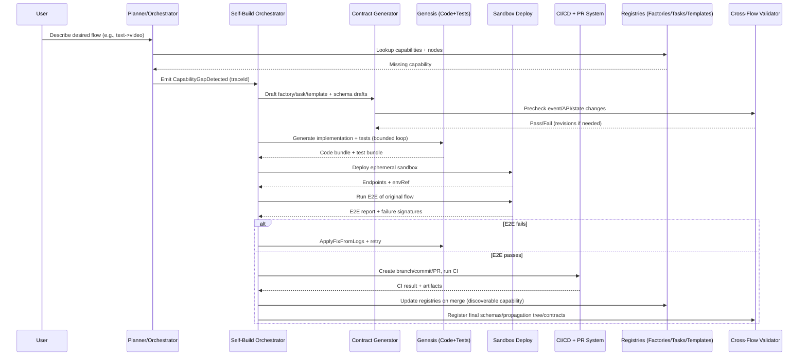

# Extending the Engine to Support Self-Build Flow Creation and Skill Assimilation

## Executive summary

The available 26-* material describes a “self-build” capability: when a user describes a desired flow (example: “text → video”), the engine should (a) synthesize the flow graph, (b) detect missing nodes/connectors, (c) generate the missing node implementation(s), (d) generate tests, (e) deploy locally/ephemerally and run E2E validation, and then (f) **assimilate** the validated capability into “core infrastructure” via a GitOps pathway so it becomes reusable and extensible over time. fileciteturn0file0

A key conceptual requirement is that this is not ad-hoc automation: it is a **Meta-Flow** (a workflow about building workflows/skills) with explicit safety gates, bounded retry loops, and promotion controls (DRAFT → WIRED → VALIDATED → INJECTED → MINIMAL → CORE). fileciteturn0file0

To support this end-to-end, the engine needs first-class “engine evolution” primitives beyond ordinary workflow execution: capability gap detection, contract-first artifact generation (factory/task/flow template + schemas), a structured generation/review/judge loop, deterministic test harnessing for external calls, sandbox build/deploy orchestration, GitOps assimilation, and expanded cross-flow safety analysis for event/API/schema changes. fileciteturn0file0

Important scope note: in this chat, only one 26-* document is available (“26-self developing.md”). The document itself references other “primary project sources” (e.g., basic prompt and architecture files) as authoritative constraints, but they are not attached here; therefore, this report is grounded in the attached 26-self developing.md and flags where additional documents would tighten or change conclusions. fileciteturn0file0

## Requirements and flow definitions extracted from 26-* documents

### Core intent: self-extension as a Meta-Flow

The document frames “self-build” as a workflow platform feature where missing capabilities trigger an internal build-and-assimilate cycle rather than a hard failure. In the example, a user requests a “text → video” flow; the planner generates the requested DAG, notices a missing connector (e.g., a provider interface for video generation), and triggers a Self-Build flow to design, implement, test, and integrate that missing node into core infrastructure. fileciteturn0file0

The proposed self-build lifecycle includes these non-negotiable elements:

- **Intent-to-Graph** planning against a registry of known nodes/capabilities and explicit **gap detection**. fileciteturn0file0  
- “Everything is a node” (including code writing, committing, and running tests), enabling recursive building blocks. fileciteturn0file0  
- “Semantic code memory” (reuse/extend existing connectors rather than duplicating patterns). fileciteturn0file0  
- Strict interface contracts so new nodes can be plugged in safely, with planned standard JSON payload boundaries. fileciteturn0file0  

### Primary flow definition: SelfBuildFlow-v1 / self-build-skill-v1

The document defines a conceptual “Meta-Flow DAG” with the following steps and artifacts:

1) DetectGap → emits `CapabilityGapDetected{ requiredFactoryInterface, requiredCapabilities }` fileciteturn0file0  
2) RAG reuse scan (AF-4) → emits a reuse plan `{ COPY | ADAPT | REWRITE }` fileciteturn0file0  
3) Contract generator → drafts factory interface spec, fabric mapping, task-type contract, and event schema drafts fileciteturn0file0  
4) BFA precheck → validates cross-flow contract safety (events, APIs, state machines) fileciteturn0file0  
5) Genesis loop (AF-1→AF-9) → generates implementation + tests with review/judge iteration fileciteturn0file0  
6) Sandbox deploy → local/ephemeral deploy with health/smoke checks fileciteturn0file0  
7) E2E flow test → executes the original requested flow end-to-end, asserting outputs/schema/durability/idempotency fileciteturn0file0  
8) Assimilation to core → commit → PR → CI/CD → merge; register new factory/capabilities fileciteturn0file0  
9) Promotion ladder stage assignment with explicit criteria per stage fileciteturn0file0  

The “self-build-skill-v1” template is described as phase-gated, with explicit loopbacks on failure and a human approval gate before CORE promotion to reduce the risk of uncontrolled self-modification. fileciteturn0file0

### Constraints and security posture embedded in the flow concept

Several constraints in the document are effectively security and governance requirements:

- Provider/connector implementations should sit behind “fabric” resolution and be resolved via a config-first `CreateAsync()` pattern; direct provider imports (illustrated via OpenAI SDK calls) are treated as forbidden coupling. fileciteturn0file0  
- The build cycle must include tests (unit + E2E) and must run locally/ephemerally before assimilation. fileciteturn0file0  
- “No secrets in code” and supply-chain risk controls are addressed via a vault/secret fabric approach plus CI/CD gating. fileciteturn0file0  
- CORE promotion should not be fully automatic (explicitly called out as a “self-modifying production brain” risk). fileciteturn0file0  

## Flow models, schemas, and validation rules

### Flow states, transitions, and loopbacks

The document’s “phase” model implies a state machine with explicit transitions, retries, and escalation:

- A “gap detected” transition into the self-build meta-flow (`CapabilityGapDetected`). fileciteturn0file0  
- Iterative generation with bounded retries driven by test/log feedback (judge-driven loopback). fileciteturn0file0  
- Separate failure modes for (a) contract completeness failure, (b) unit/integration failures during genesis, (c) sandbox/E2E failure, and (d) CI failure after PR. fileciteturn0file0  

Mermaid flowchart capturing the Meta-Flow DAG and loopbacks:

```mermaid
flowchart TD
  A[User intent: "text -> video"] --> B[Planner: Intent-to-Graph]
  B --> C{Capability gap?}
  C -- No --> Z[Execute flow normally]

  C -- Yes --> D[Emit CapabilityGapDetected]
  D --> E[RAG reuse scan: COPY/ADAPT/REWRITE]
  E --> F[Draft engine artifacts: factory/task/template/schema]
  F --> G{BFA precheck OK?}
  G -- No --> F

  G -- Yes --> H[Genesis loop: generate impl + tests]
  H --> I{Unit/Integration OK?}
  I -- No --> H

  I -- Yes --> J[Sandbox deploy (ephemeral/local)]
  J --> K[Run E2E of original requested flow]
  K --> L{E2E OK?}
  L -- No --> H

  L -- Yes --> M[GitOps assimilation: commit -> PR -> CI]
  M --> N{CI green?}
  N -- No --> H

  N -- Yes --> O[Update registries + set promotion stage]
  O --> P{Stage == CORE?}
  P -- Yes --> Q[Human approval gate]
  Q --> R[Promote]
  P -- No --> R[Promote]
```

This diagram is directly aligned with the document’s enumerated steps (DetectGap → RAG → Contract generation → BFA precheck → Genesis → Sandbox/E2E → GitOps → Promotion) and the explicit loopback strategy. fileciteturn0file0

### Inputs, outputs, and artifacts

From the document’s template and factory specs, the principal inputs/outputs are:

- **Inputs**
  - Desired flow spec / user intent (e.g., “text → video”). fileciteturn0file0  
  - Registry snapshot / capability manifest to assess what exists. fileciteturn0file0  
  - Reuse candidates (code patterns from prior connectors). fileciteturn0file0  

- **Outputs / artifacts (persisted)**
  - Gap list with a stable identifier (gapId), plus a reuse decision (COPY/ADAPT/REWRITE). fileciteturn0file0  
  - Drafted engine artifacts: factory interface spec, task type contracts, flow template JSON DAG, and schema registrations. fileciteturn0file0  
  - Implementation bundle + test suite bundle + deterministic harness plan for external calls. fileciteturn0file0  
  - Sandbox deployment reference + E2E report + trace IDs/log bundles. fileciteturn0file0  
  - GitOps evidence: branch, commit SHA, PR metadata, CI results. fileciteturn0file0  
  - Promotion record (DRAFT → … → CORE), with policy gating for CORE. fileciteturn0file0  

### Data schemas and entity model implied by BFA registration

The BFA registration pack proposes a registry for:

- Event schemas (versioned + schema hash), plus propagation trees to detect cross-flow break impact (payload change visibility and downstream consumer mapping). fileciteturn0file0  
- Platform entities, including: `SkillDefinition`, `FactoryInterfaceSpec`, `TaskTypeContract`, `FlowTemplate`, `PromotionRecord`, `SandboxEnvironment`, and `EvidenceBundle`. fileciteturn0file0  
- API contracts for the control plane (start/status/approval), debug surface endpoints, and health probes, with auth model, idempotency keys, and timeout budgets. fileciteturn0file0  

A minimal JSON Schema example for the root trigger event `CapabilityGapDetected` (structure based on the document’s described payload fields and the broader need for versioned, hashable schemas):

```json
{
  "$schema": "https://json-schema.org/draft/2020-12/schema",
  "$id": "engine.events/CapabilityGapDetected/1-0-0.schema.json",
  "title": "CapabilityGapDetected v1.0.0",
  "type": "object",
  "additionalProperties": false,
  "required": ["eventName", "eventVersion", "tenantId", "traceId", "desiredFlowSpec", "requiredFactoryInterface", "requiredCapabilities"],
  "properties": {
    "eventName": { "const": "CapabilityGapDetected" },
    "eventVersion": { "const": "1.0.0" },
    "tenantId": { "type": "string", "minLength": 1 },
    "traceId": { "type": "string", "minLength": 8 },
    "desiredFlowSpec": { "type": "object" },
    "requiredFactoryInterface": { "type": "string", "minLength": 1 },
    "requiredCapabilities": {
      "type": "array",
      "items": { "type": "string", "minLength": 1 },
      "minItems": 1
    },
    "plannerContext": { "type": "object" }
  }
}
```

This schema approach supports the document’s explicit requirement that event payload changes be detectable and enforceable (BFA “event schema change” concerns) while staying compatible with the “dictionary/object” payload style described (no typed models). fileciteturn0file0

### Validation rules, error handling, and security constraints

The document defines “quality gates” and “iron rules” that translate into concrete validation and error handling:

- **Contract completeness**: if a generated task type is missing any required contract field, it is treated as a build failure (the engine can’t safely generate/execute). fileciteturn0file0  
- **Forbidden direct provider imports**: external dependencies must be fabric-resolved; direct SDK usage is explicitly disallowed in the meta-flow’s rules. To ground the canonical example, the connector would be behind an AI interface fabric rather than directly calling entity["company","OpenAI","ai research company"] SDKs from business code. fileciteturn0file0  
- **Bounded retries + escalation**: regeneration occurs using normalized failure signatures from tests/logs, but must stop at a max retry count and escalate (no infinite self-modifying loop). fileciteturn0file0  
- **Security controls**: “no secrets in code” via vault fabric, security scans, signed artifacts, and CI/CD gates; plus human gating before CORE promotion. fileciteturn0file0  

## Capability gap analysis and target engine requirements

The comparison below treats “current” as what is implied to exist already (planner, registry, fabrics, AF/BFA concepts) and “required” as what must be implemented or extended for self-build flow creation and assimilation to work end-to-end.

| Capability area | Current engine (implied by doc) | Required to support self-build flow creation | Gap/impact |
|---|---|---|---|
| Capability registry & planning | Planner compiles intent into a DAG and consults a node/capability registry. fileciteturn0file0 | Formal `CapabilityGapDetected` emission, stable gap IDs, reuse decisioning (COPY/ADAPT/REWRITE), and capability graph building. fileciteturn0file0 | Without standardized gaps + reuse, self-build becomes ad-hoc and duplicates connectors. |
| Contract-first artifact generation | Existence of “required full contract format” and flow templates as JSON DAG in ES is assumed. fileciteturn0file0 | Programmatic drafting + validation of factory specs, task contracts, flow templates, and schema registrations. fileciteturn0file0 | Missing automation blocks “flow creation from description” from going beyond planning. |
| Generation pipeline (AF loop) | AF stations (inventory/synthesis/judgment) exist conceptually. fileciteturn0file0 | Operationalized generation loop that consumes failure signatures, enforces “iron rules,” and surfaces evidence bundles. fileciteturn0file0 | Without deterministic loop control, runs will be flaky and unsafe. |
| Testing & determinism | Tests are required and E2E is emphasized. fileciteturn0file0 | Deterministic harness (record/replay or mock mode) for external/provider calls; contract tests for schemas. fileciteturn0file0 | CI brittleness becomes a hard blocker for assimilation. |
| Sandbox build/deploy | Infrastructure fabric exists (container orchestration + secrets + monitoring). fileciteturn0file0 | “Ephemeral per traceId” deploys, teardown, structured logs and health checks integrated into the meta-flow. fileciteturn0file0 | Without sandbox infra orchestration, you cannot validate safely before GitOps. |
| GitOps assimilation | Execution fabric exists for source control/PR/CI operations. fileciteturn0file0 | Branch/commit/PR creation, CI result collection, evidence attachment, and registry updates on merge. fileciteturn0file0 | Assimilation is the differentiator between “generated once” and durable core capability. |
| Cross-flow safety analysis (BFA) | BFA exists and is described as intended to catch cross-flow contract issues. fileciteturn0file0 | BFA registrations expanded to include event schema changes, propagation trees, API contract deltas, distributed state machine modeling, and multi-DB entity fragment mapping. fileciteturn0file0 | Without this, self-build introduces invisible breaking changes. |
| Promotion governance | Promotion ladder stages are defined; CORE should not be automatic. fileciteturn0file0 | Promotion policy service with stage evaluation, human approval gates, rollback workflows, and a promotion ledger. fileciteturn0file0 | Safety and organizational trust hinge on predictable promotions/rollbacks. |
| Observability & debugging | Trace-based debug endpoints are suggested. fileciteturn0file0 | End-to-end trace correlation across planner → sandbox → CI, plus “phase gate” audit logs and artifact retention. fileciteturn0file0 | Without observability, closed-loop “self-correction” is slow and risky. |
| Concurrency, idempotency, transactions | Durability/idempotency are explicitly asserted in E2E. fileciteturn0file0 | Tenant-scoped locking by gapId, outbox/inbox patterns for event publishing, saga-style compensation (teardown, PR close), and safe reruns. fileciteturn0file0 | Multi-system actions require designed compensation, not best-effort scripts. |

## Proposed design changes, migrations, and implementation plan

### Target architecture changes

The document itself proposes adding a dedicated “engine evolution” family with new factory interfaces and task types for self-build orchestration, connector genesis, and assimilation/promotion. It provides two alternative numbering sets (an early F190–F197/T50–T52 proposal and a later F233–F240/T47–T49 proposal), indicating the real requirement: **reserve non-colliding IDs** and treat ID collisions as a BFA-critical failure mode. fileciteturn0file0

A concrete design interpretation (technology-neutral, consistent with the document’s constraints):

1) **New runtime concept: SelfBuildRun**
   - Persist a single object per self-build invocation: `{ traceId, tenantId, desiredFlowSpec, gaps[], state, phaseHistory[], evidenceBundleRef }`.
   - Purpose: unify orchestration state across retries, sandbox deploy phases, and CI integration. fileciteturn0file0  

2) **Registry expansion**
   - Add/extend registries for: capabilities, factories, task contracts, flow templates, event schemas, API contracts, and promotion records.
   - Enforce uniqueness constraints to prevent collisions (templateId, factory IDs, task IDs). fileciteturn0file0  

3) **BFA-as-a-required gate for assimilation**
   - “BFA registration pack” becomes a mandatory artifact of self-build; PR cannot be opened (or cannot be merged) without it.
   - Expand BFA checks to those the document enumerates: event schema changes, propagation trees, API contract changes, distributed state machine declarations, and multi-DB entity fragment mapping. fileciteturn0file0  

4) **Deterministic testing harness**
   - Introduce a standardized mechanism to replay provider calls (or run against stable mocks) so unit/E2E tests remain deterministic.
   - Make deterministic mode a required quality gate for promotion above VALIDATED (or for CI gating). fileciteturn0file0  

### Data model migrations

Because the document repeatedly treats “engine artifacts” as first-class (flow templates are JSON DAGs stored in ES; contracts and schemas are registry entries), the minimum viable migration is additive:

- **New/extended indices/tables (names illustrative)**
  - `engine.self_build_runs` (run state + trace correlation) fileciteturn0file0  
  - `engine.evidence_bundles` (immutable evidence snapshots: reports, hashes, CI outcome) fileciteturn0file0  
  - `engine.event_schema_registry` (eventName, version, schemaHash, JSON schema, publishers, consumers) fileciteturn0file0  
  - `engine.api_contract_registry` (route, verb, auth, request/response schema hashes, callers) fileciteturn0file0  
  - `engine.promotion_ledger` (stage transitions, approver, rollback pointers) fileciteturn0file0  

- **Backward-compatible constraints**
  - No changes to existing IDs; new capabilities are additive.
  - Strict collision checks for factory IDs, task IDs, and template IDs (explicitly called out as CRITICAL in cross-flow rules). fileciteturn0file0  

### API/contract updates

The BFA pack suggests adding or formalizing a control plane and debug surface, including endpoints like:

- `POST /api/self-build/start`
- `GET /api/self-build/{traceId}/status`
- `POST /api/self-build/{traceId}/approve-core`
- trace debugging endpoints under `/api/debug/{traceId}` (including phase/judge views). fileciteturn0file0  

To make these safely evolvable, treat them as contract-registered APIs (schema hashed, versioned). fileciteturn0file0

A sample request payload for `POST /api/self-build/start` consistent with the document’s dictionary/object style:

```json
{
  "tenantId": "t_acme",
  "intent": "text_to_video",
  "desiredFlowSpec": {
    "input": { "type": "text", "field": "prompt" },
    "output": { "type": "video", "field": "videoUrl" },
    "constraints": { "maxDurationSec": 10 }
  },
  "policy": {
    "autoPromoteMaxStage": "MINIMAL",
    "maxRetries": 3,
    "requireDeterministicHarness": true
  }
}
```

### Sequence diagram for execution and assimilation



This sequence reflects the document’s prescribed pipeline of gap detection → contract-first drafting → BFA validation → genesis loop → sandbox/E2E → PR/CI → registry update → promotion. fileciteturn0file0

### Implementation task breakdown with effort and priority

The table below proposes a concrete execution order that de-risks the “self-modifying” aspects first (schemas, governance, deterministic testing), then enables automation.

| Priority | Task | Description | Effort |
|---|---|---|---|
| High | Reserve/validate ID allocation strategy | Decide how new factory/task/template IDs are assigned and enforce collision detection as a hard gate. fileciteturn0file0 | Med |
| High | Implement `SelfBuildRun` persistence + phase model | Persist a self-build run state machine with traceId, phases, and bounded retry counters. fileciteturn0file0 | Med |
| High | Contract completeness validator | Enforce “required contract fields” as a build failure gate before any code generation/sandbox work. fileciteturn0file0 | Low |
| High | Event schema registry + hashing | Add schema versioning, schemaHash, and eventName collision checks; wire into BFA. fileciteturn0file0 | Med |
| High | Deterministic harness framework | Record/replay or stable mocking for provider calls; make it mandatory for CI. fileciteturn0file0 | High |
| High | Sandbox deploy runner | Ephemeral deploy/teardown per traceId; capture logs, health, metrics. fileciteturn0file0 | High |
| High | GitOps assimilation integration | Branch/commit/PR automation + evidence attachment + CI result ingestion. fileciteturn0file0 | Med |
| Medium | Promotion policy service + ledger | Implement promotion stage evaluation and CORE human gate workflows. fileciteturn0file0 | Med |
| Medium | BFA propagation tree + API contract registry | Add “who consumes what” graphs and API delta detection to cross-flow safety gates. fileciteturn0file0 | High |
| Medium | UI/observability surfaces | Phase-gate visualization, trace drill-down, evidence bundle browsing, and approval UI. fileciteturn0file0 | Med |
| Medium | Performance + concurrency controls | Tenant-scoped locking by gapId, queued execution, and safe rerun semantics. fileciteturn0file0 | Med |

## Testing, backward compatibility, and rollout strategy

### Test plan and validation criteria

The document implies three tiers of validation for generated capabilities: unit/integration, sandbox E2E, and CI gates—with BFA acting as a cross-flow safety net. fileciteturn0file0

A test plan aligned to those gates:

1) **Contract tests (pre-gen)**
   - Validate that drafted task contracts include all required fields (“ARCHETYPE → QUALITY GATES” completeness).
   - Validate that templates reference factories via `CreateAsync` resolution and avoid direct provider imports. fileciteturn0file0  

2) **Unit tests (genesis loop)**
   - Generated connector adheres to the standard DPR envelope pattern and tenant scoping described in the factory spec section.
   - Security checks: no secrets embedded; configuration references vault keys only. fileciteturn0file0  

3) **Integration tests (sandbox)**
   - Deploy the generated node into an isolated environment and validate health/readiness probes.
   - Validate log emission contains traceId and failure signatures can be normalized for repair loops. fileciteturn0file0  

4) **E2E tests (original requested flow)**
   - Execute the full “triggering” flow that caused the gap (e.g., text→video), asserting output schema, durability, idempotency, and error handling semantics.
   - Validate event publishing and schema registrations match expected versions/hashes. fileciteturn0file0  

5) **BFA stress tests (cross-flow)**
   - The document explicitly enumerates self-build-focused stress tests (event field removal, enum renames, missing propagation edges, unregistered output events, missing multi-DB mapping, event name collision) and defines their severity. fileciteturn0file0  

A minimal validation criteria checklist for promoting a new skill from VALIDATED → MINIMAL:

- Sandbox E2E passes with deterministic harness enabled. fileciteturn0file0  
- CI green with artifacts attached (unit/integration/E2E reports + security scan report). fileciteturn0file0  
- BFA registration pack complete: schemas + propagation tree + API deltas + entity mappings + conflict rules clean. fileciteturn0file0  

### Backward-compatibility risks and mitigations

Key risks surfaced directly or indirectly by the document’s rules:

- **Registry ID collisions (factories/tasks/templates)**: collisions break planning and/or runtime resolution; mitigate with reserved ranges, enforced uniqueness, and a BFA CRITICAL gate for collisions. fileciteturn0file0  
- **Event schema drift and hidden downstream breaks**: mitigate by enforcing schema registry + propagation tree and gating merges on BFA completeness. fileciteturn0file0  
- **Non-deterministic CI due to external provider variance**: mitigate via deterministic harness/record-replay and explicit “no flaky calls required for promotion.” fileciteturn0file0  
- **Security and supply-chain risks** (secrets exposure, unsafe code assimilation): mitigate with “no secrets in code,” vault integration, security scanning, signed artifacts, and human gating for CORE. fileciteturn0file0  
- **Runaway self-modification**: mitigate with bounded retries, explicit escalation, and separating “generated in sandbox” from “assimilated into core,” with policy gating on promotion. fileciteturn0file0  

### Migration and rollout strategy

The document already provides a promotion ladder and explicitly warns against automatic CORE promotion. A rollout plan that operationalizes those constraints:

- **Stage 1 (DRAFT)**: enable gap detection + artifact drafting only. No code generation, no sandbox, no GitOps. Focus: validate contracts, schemas, and BFA checks at low risk. fileciteturn0file0  
- **Stage 2 (WIRED/VALIDATED)**: enable genesis loop and deterministic unit tests in controlled environments; require manual review of generated bundles. fileciteturn0file0  
- **Stage 3 (INJECTED)**: enable sandbox deploy + E2E for the triggering flow; do not allow automatic PR creation yet (or allow PR creation but require manual merge). fileciteturn0file0  
- **Stage 4 (MINIMAL)**: allow GitOps assimilation behind feature flags; enforce mandatory BFA pack, deterministic harness, and full evidence bundle attachment to PR/CI outcomes. fileciteturn0file0  
- **Stage 5 (CORE)**: require explicit human approval before promotion; apply canary rollout (tenant/environment allowlist), plus rollback readiness in the promotion ledger. fileciteturn0file0  

This staged pathway matches the document’s safety framing: “tests + local deploy” before assimilation, PR/CI gates for regression/security control, and human gating for the highest-trust tier. fileciteturn0file0