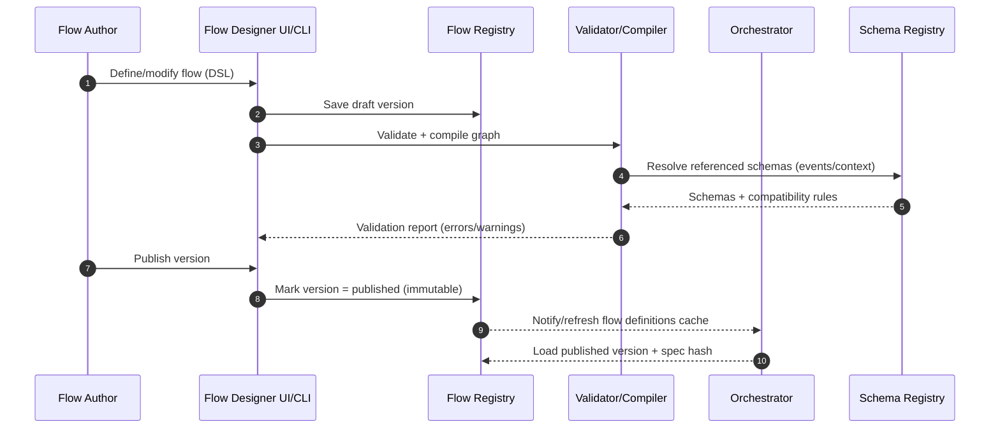
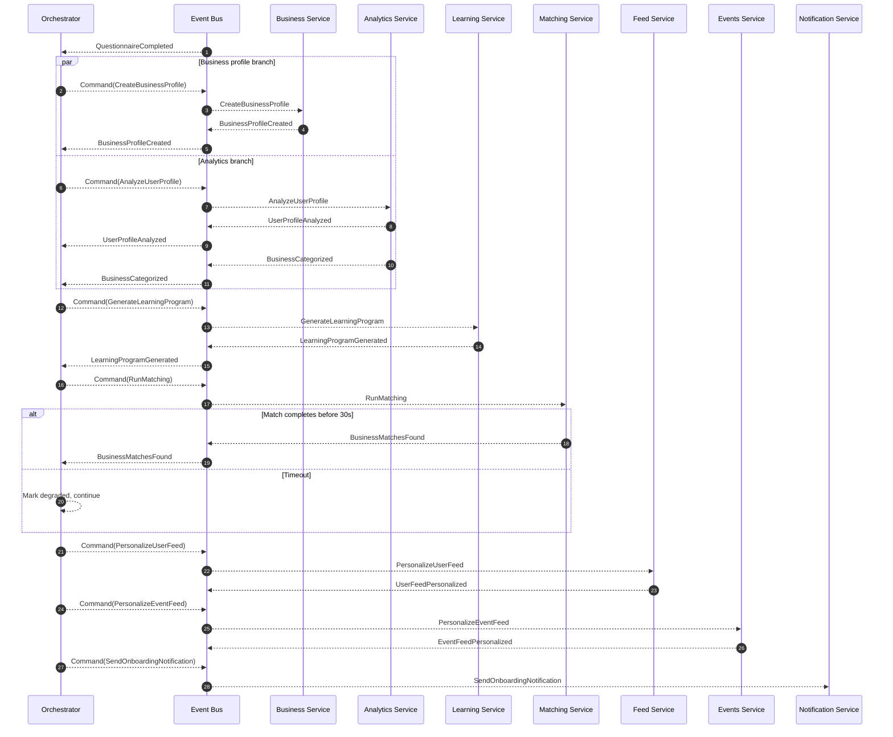
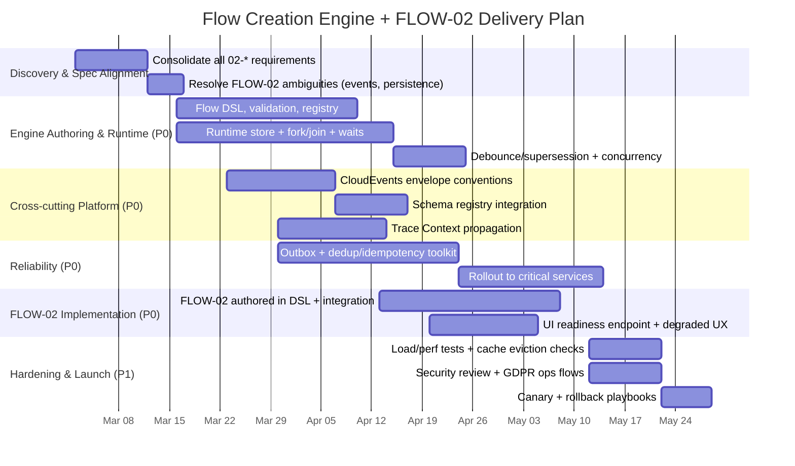
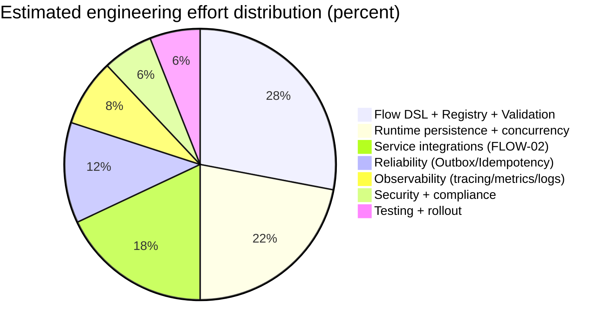

# Extending the Engine to Support Flow Creation for the 02-* Flows

## Executive summary

The available primary project sources in this workspace are:

- The FLOW‑02 specification, **“Business Onboarding & Personalization”** (`/mnt/data/02-business-onboarding.md`). fileciteturn0file1  
- An internal analysis memo focused on FLOW‑02 and “flow creation” engine implications (`/mnt/data/02-business-onboarding deep search.md`). fileciteturn0file0  

Across these sources, FLOW‑02 describes an event-driven onboarding “intelligence layer” that (a) starts from `QuestionnaireCompleted`, (b) runs **parallel branches** (Business Profile creation, Analytics, Learning Program generation with dependencies), (c) performs **matching** with explicit **timeout/circuit breaker** behavior, and then (d) personalizes the user’s **feed** and **events feed**, concluding with `OnboardingCompleted`. fileciteturn0file1

To reliably *create* (author) and *run* flows like this across the broader “02-*” set, the engine must graduate from “single linear pipeline” assumptions into a **versioned, validated DAG workflow runtime** with:

- **First-class fork/join**, wait-for-event steps, and “required vs optional” branches so graceful degradation is deterministic rather than ad hoc. fileciteturn0file1  
- A standardized **event envelope** (recommend CloudEvents-aligned context metadata) so triggers/actions/consumers can be defined uniformly across services and validated mechanically. CloudEvents defines a vendor-neutral event format with required context attributes. citeturn6search2turn7search0  
- **Correlation + distributed trace propagation** across HTTP and message transport so a single flow-run can be debugged end-to-end. The Trace Context specification from the entity["organization","World Wide Web Consortium","web standards body"] defines standard headers for propagating tracing information and states that compliant systems must at minimum forward `traceparent` / `tracestate`. citeturn0search1turn7search1  
- **Reliable event publication** (transactional outbox / CDC-outbox) and **idempotent consumption** to cope with at-least-once delivery semantics typical in Kafka-style systems. Kafka defaults to at-least-once delivery unless configured otherwise. citeturn1search2turn0search2turn3search1  
- Flow-definition **versioning** and rollout discipline so running instances stay pinned to the version they started with, while new instances use the updated version—an approach common in workflow engines. citeturn3search9  

The recommended implementation plan is phased: deliver core engine authoring/runtime primitives first (flow registry + DAG runtime persistence + fork/join + debounce + observability), ship FLOW‑02 as the reference flow, then harden with migration/backfill, compliance operations, and performance/operational readiness.

## What the FLOW‑02 sources require from flow creation and runtime

### Flow shape, variants, and runtime semantics implied by FLOW‑02

FLOW‑02’s requirements imply the engine must represent and execute a workflow with these structural elements:

- **Event trigger**: `QuestionnaireCompleted` initiates the flow. fileciteturn0file1  
- **Parallelism**: three concurrent branches are described (Business Profile creation, Analytics, Learning). fileciteturn0file1  
- **Dependencies**: Learning depends on profile output; Matching depends on profile + categorization; Personalization depends on matches plus enrichment inputs. fileciteturn0file1  
- **Join/convergence**: explicit “convergence” stage after branches complete. fileciteturn0file1  
- **Timeout and partial completion**: Matching requires a 30-second timeout and may return partial results, leading to a degraded (not failed) onboarding experience. fileciteturn0file1  
- **Debounce / supersession**: if questionnaire updates occur frequently, the system should only reprocess if >5 minutes since last completion; queue the latest and discard intermediate updates. fileciteturn0file1  
- **Multiple-business variant**: a single user can have multiple businesses; matching runs per business; results merged/deduplicated. fileciteturn0file1  
- **Graceful degradation** (explicitly defined): analytics failure ⇒ fallback; feed failure ⇒ generic trending content; matching failure ⇒ show “still finding matches.” fileciteturn0file1  

From a “flow creation” perspective, these requirements become mandatory DSL/runtime features: fork/join nodes, “wait for event” nodes keyed by correlation identifiers, timeout policies, step criticality (required/optional), debounce/supersession keys, and sub-run iteration (per business).

### Event contracts and data I/O requirements

FLOW‑02 defines an event chain and event payload fields that the engine must model as step inputs/outputs. The authoring layer should treat these as schemas and validate them at design-time and (optionally) runtime. fileciteturn0file1

A CloudEvents-aligned approach can standardize shared metadata: CloudEvents requires `specversion`, `id`, `source`, and `type` in all conforming events, and allows optional routing/description context such as `subject`, `time`, and `dataschema`. citeturn6search2turn7search8

This matters for “flow creation” because a flow designer should be able to define:

- Trigger: event `type` (and optionally `source`/`subject`)  
- Correlation: keys extracted from `data` (e.g., `userId`, `businessId`) and/or metadata (e.g., `subject`)  
- Gating: “wait until event X arrives for correlation key Y”  
- Mapping: JSONPath/CEL-like mapping from prior step outputs into command payloads  

### Non-functional constraints that become engine primitives

FLOW‑02 includes several constraints that are best implemented as engine-level primitives rather than bespoke per-service logic:

- **Latency bounds**: “matching may take 5–30s,” enforce circuit breaker at 30s; feed/events personalization should complete within ~2 seconds after matches are ready. fileciteturn0file1  
- **Caching TTL expectations**: matches 12h; feed config 1h; event recs 4h; user prefs 24h. fileciteturn0file1  
- **Observability**: correlation IDs across all events, with monitoring on matching latency and service failure rates. fileciteturn0file1  
- **Security posture**: mTLS in-cluster, field-level encryption for revenue, privacy controls on match reasons, and GDPR portability/erasure cascade. fileciteturn0file1  

The engine should explicitly support:

- SLA timers (for “step must complete within X”)  
- Retry/backoff per step with idempotency gates  
- Cache invalidation triggers (as a modeled event-to-flow trigger)  
- “Degraded completion” state separate from “failed”  

## Engine extensions needed for flow creation

### Target capability model for “flow creation”

To support authoring 02-* flows (not just coding them), the engine needs three tiers of capability:

**Authoring and governance**
- Draft → validate → publish pipeline (with RBAC and audit history)
- Versioned flow specs, immutable once published
- “Compile” step: normalize DSL into a runtime DAG with explicit nodes/edges and validated correlation keys

**Execution runtime**
- Start/resume runs from events
- Fork/join + wait-for-event semantics
- Deterministic persistence of run/step states (so joins, timeouts, and retries do not depend on in-memory state)
- Supersession/debounce keyed per subject (e.g., `(flowId, userId)`)

**Operational tooling**
- Introspect run state, per-step history, last error, and pending waits
- Replay and manual retry (“break glass”) controls
- Metrics/tracing/log correlation across services

OpenTelemetry describes context propagation as the mechanism that correlates traces/metrics/logs across boundaries, which aligns directly with the need to debug cross-service flows. citeturn3search0turn3search7  

### Proposed flow definition DSL shape

A practical DSL for 02-* flows should be able to represent:

- **Triggers**: event types + filters
- **Nodes**: `command`, `wait_event`, `fork`, `join`, `decision`, `timer`, `terminal`
- **Policies**: retries, timeouts, step criticality (required/optional), compensation hooks, rate limits/debounce
- **Data mapping**: how to build outbound command payloads from accumulated flow context

Below is an example *shape* (not final) for FLOW‑02 in a compact JSON-style DSL. It highlights fork/join, waits, and timeout/degraded behavior.

```json
{
  "flowId": "FLOW-02",
  "version": 1,
  "trigger": {
    "eventType": "QuestionnaireCompleted",
    "key": { "userId": "$.data.userId" },
    "debounce": { "windowSeconds": 300, "policy": "latest_wins" }
  },
  "context": { "schema": "schemas/flow-02-context.json" },
  "nodes": [
    {
      "id": "fork_init",
      "type": "fork",
      "branches": ["build_profile", "run_analytics"]
    },
    {
      "id": "build_profile",
      "type": "command",
      "target": "business-service",
      "action": "CreateBusinessProfile",
      "input": { "userId": "$.ctx.userId", "questionnaireId": "$.ctx.questionnaireId" },
      "timeoutSeconds": 10,
      "retries": { "max": 3, "backoff": "exponential" }
    },
    {
      "id": "wait_profile_created",
      "type": "wait_event",
      "eventType": "BusinessProfileCreated",
      "correlate": { "userId": "$.ctx.userId" }
    },
    {
      "id": "run_analytics",
      "type": "command",
      "target": "analytics-service",
      "action": "AnalyzeUserProfile",
      "input": { "userId": "$.ctx.userId", "questionnaireId": "$.ctx.questionnaireId" },
      "criticality": "optional"
    },
    {
      "id": "wait_business_categorized",
      "type": "wait_event",
      "eventType": "BusinessCategorized",
      "correlate": { "businessId": "$.ctx.businessId" },
      "timeoutSeconds": 60,
      "criticality": "required"
    },
    {
      "id": "cmd_generate_learning",
      "type": "command",
      "target": "learning-service",
      "action": "GenerateLearningProgram",
      "input": { "userId": "$.ctx.userId", "businessId": "$.ctx.businessId" },
      "criticality": "optional"
    },
    {
      "id": "join_prereqs_for_matching",
      "type": "join",
      "waitFor": ["wait_profile_created", "wait_business_categorized"]
    },
    {
      "id": "cmd_run_matching",
      "type": "command",
      "target": "matching-service",
      "action": "RunMatching",
      "input": { "businessId": "$.ctx.businessId", "categories": "$.ctx.categories" },
      "timeoutSeconds": 30,
      "onTimeout": { "mode": "continue_degraded" }
    },
    {
      "id": "wait_matches_found",
      "type": "wait_event",
      "eventType": "BusinessMatchesFound",
      "correlate": { "businessId": "$.ctx.businessId" }
    },
    {
      "id": "cmd_personalize_feed",
      "type": "command",
      "target": "feed-service",
      "action": "PersonalizeUserFeed",
      "input": { "userId": "$.ctx.userId", "matches": "$.ctx.matches" },
      "timeoutSeconds": 2,
      "criticality": "optional"
    },
    {
      "id": "cmd_personalize_events",
      "type": "command",
      "target": "events-service",
      "action": "PersonalizeEventFeed",
      "input": { "userId": "$.ctx.userId", "matches": "$.ctx.matches" },
      "timeoutSeconds": 2,
      "criticality": "optional"
    },
    {
      "id": "done",
      "type": "terminal",
      "emitEvent": "OnboardingCompleted"
    }
  ],
  "edges": [
    ["fork_init", "build_profile"],
    ["build_profile", "wait_profile_created"],
    ["fork_init", "run_analytics"],
    ["wait_profile_created", "cmd_generate_learning"],
    ["cmd_generate_learning", "join_prereqs_for_matching"],
    ["wait_business_categorized", "join_prereqs_for_matching"],
    ["join_prereqs_for_matching", "cmd_run_matching"],
    ["cmd_run_matching", "wait_matches_found"],
    ["wait_matches_found", "cmd_personalize_feed"],
    ["wait_matches_found", "cmd_personalize_events"],
    ["cmd_personalize_feed", "done"],
    ["cmd_personalize_events", "done"]
  ]
}
```

Key design decision: **events as “facts,” commands as “requests.”** The DSL models both, but only events unblock waits. This matches Saga-style orchestration guidance, where coordination can be centralized (orchestration) or distributed (choreography). Microservices.io and the Azure Architecture Center both describe choreography and orchestration as the two typical Saga approaches. citeturn1search0turn1search1

### Engine runtime persistence and concurrency model

Because FLOW‑02 includes joins, timeouts, and supersession, the orchestrator must be built on a persistent runtime store.

A minimal relational model (PostgreSQL-like) that supports deterministic execution:

- `flow_definitions(flow_id, name, owner_team, status)`
- `flow_versions(flow_id, version, published_at, spec_hash, spec_jsonb)`
- `flow_runs(run_id, flow_id, version, subject_type, subject_id, status, started_at, updated_at, correlation_id, superseded_by_run_id NULL)`
- `flow_run_steps(run_id, node_id, status, attempt, last_error, started_at, updated_at)`
- `flow_run_waits(run_id, wait_id, event_type, correlation_key_jsonb, deadline_at, satisfied_at NULL)`
- `flow_run_context(run_id, context_jsonb)` (optional; if not too large)

Concurrency controls needed for FLOW‑02:
- Per-subject lock: only one active onboarding run per `(userId, FLOW‑02)` unless multi-business fan-out is explicit. fileciteturn0file1  
- Supersession: new trigger within debounce window should mark prior run as superseded and ensure its late-arriving events do not incorrectly complete the newer run (use correlation/run IDs). fileciteturn0file1  

### Event envelope, tracing, and schema validation

**Event envelope recommendation: CloudEvents-aligned**

CloudEvents defines required context attributes (`specversion`, `id`, `source`, `type`) and supports optional attributes like `subject`, `time`, and `dataschema`. citeturn6search2turn7search8  

A practical choice for this engine: encode domain events as CloudEvents “structured mode” JSON on Kafka, and:

- Use `type` for semantic event name + version (e.g., `com.acme.onboarding.businessProfileCreated.v1`)
- Use `subject` for the primary correlation target (e.g., `user/{userId}` or `business/{businessId}`)
- Use `dataschema` to point at a JSON Schema identifier in your internal schema registry

**Trace correlation: W3C Trace Context**

The Trace Context spec defines standard headers for propagation and says compliant systems must at minimum forward `traceparent` and `tracestate` so traces aren’t broken. citeturn7search1turn3search13  

Tie this to flow runtime by:
- Writing `flow_run_id` into logs as a structured field
- Injecting `traceparent` into outbound HTTP calls and also into Kafka message headers
- Anchoring the trace root to the trigger event receipt in the orchestrator

OpenTelemetry’s documentation frames this as “context propagation” enabling correlation of signals across boundaries. citeturn3search0turn3search7  

### Reliability: transactional outbox and idempotent consumers

FLOW‑02 is event-heavy; correctness depends on “events reflect committed state,” especially for `*Created`, `*Personalized`, and `Completed`. fileciteturn0file1  

The transactional outbox pattern is widely used to avoid dual-write inconsistency by recording outgoing events in the same database transaction as the state update, then relaying them asynchronously. Microservices.io documents the transactional outbox pattern, and Debezium documents an outbox event router approach that captures changes from an outbox table. citeturn0search2turn1search2  

Additionally, Kafka-style systems commonly provide at-least-once delivery by default, which implies consumers must handle duplicates. citeturn3search1  

Engine implications:
- Standardize on an **inbox/dedup key**: `(event_id)` or `(producer, aggregate_id, aggregate_version)`  
- Every step action should be idempotent or guarded by dedup records
- Retries must be policy-driven and safe; treat “non-idempotent side effects” as requiring explicit compensation/risk review

### Storage and encryption considerations grounded in FLOW‑02 requirements

FLOW‑02 states business profiles and questionnaire responses are stored in MongoDB, with a confidential field (revenue) requiring field-level encryption. fileciteturn0file1  

MongoDB’s Client-Side Field Level Encryption (CSFLE) is explicitly designed to encrypt data in the application before sending it to the database. citeturn4search0  

FLOW‑02 also relies heavily on caching TTLs. Under memory pressure, Redis eviction policies can evict keys when memory exceeds configured limits, affecting TTL-driven correctness if not managed carefully. citeturn7search6turn7search2  

Engine-level action items:
- Treat TTL caches (matches/feed configs/events) as **derived** and reconstructible.
- Ensure Redis “maxmemory-policy” is explicitly chosen and monitored so eviction does not produce silent personalization regressions. citeturn7search6turn7search2  

## Recommended architecture, APIs, schemas, and diagrams

### Architecture overview

This architecture extends the existing “Flow Orchestrator” concept referenced in FLOW‑02 into a full flow-definition + runtime platform, while keeping domain services responsible for domain data and computations. fileciteturn0file1  

```mermaid
flowchart LR
  subgraph Authoring
    FD[Flow Designer UI / CLI]
    FR[Flow Registry<br/>Versioned Definitions]
    FV[Flow Validator & Compiler]
  end

  subgraph Runtime
    ORCH[Flow Orchestrator<br/>(DAG runtime)]
    RT[(Runtime Store<br/>runs/steps/waits)]
  end

  subgraph Eventing
    EB[(Event Bus / Kafka)]
    SR[(Schema Registry<br/>JSON Schema)]
  end

  subgraph DomainServices
    BS[Business Service]
    AS[Analytics Service]
    LS[Learning Service]
    MS[Matching Service]
    FS[Feed Service]
    ES[Events Service]
    NS[Notification Service]
    RE[Recommendation Engine]
  end

  FD --> FR --> FV --> ORCH
  ORCH <--> RT
  ORCH <--> EB
  EB <--> BS & AS & LS & MS & FS & ES & NS & RE
  FV <--> SR
  EB <--> SR
```

**Key integration points**
- The orchestrator subscribes to trigger events and orchestrates by emitting commands/events into the bus.
- Domain services publish domain facts as events and perform heavy work (analytics/matching/learning).
- Schema registry enables step/event validation in authoring and (optional) runtime.

### Sequence diagram: flow authoring lifecycle

This is the minimum set of interactions to make “flow creation” real rather than “flow hardcoding.”



### Sequence diagram: FLOW‑02 runtime orchestration (fork/join + timeout)



This design directly supports FLOW‑02’s required behaviors: parallel branches, convergence, matching timeout, and graceful degradation. fileciteturn0file1  

### API/interface changes and OpenAPI-style contracts

#### Engine-facing authoring APIs

OpenAPI provides a language-agnostic way to describe HTTP APIs so humans and computers can understand service capabilities. citeturn4search8turn4search2  

Below is an OpenAPI-style sketch (not complete) for the core authoring surface:

```yaml
openapi: 3.1.0
info:
  title: Flow Engine API
  version: 1.0.0
paths:
  /flows:
    post:
      summary: Create a flow definition
      requestBody:
        required: true
        content:
          application/json:
            schema:
              type: object
              required: [flowId, name]
              properties:
                flowId: { type: string }
                name: { type: string }
                ownerTeam: { type: string }
      responses:
        "201": { description: Created }

  /flows/{flowId}/versions:
    post:
      summary: Create a new draft version
      parameters:
        - in: path
          name: flowId
          required: true
          schema: { type: string }
      requestBody:
        required: true
        content:
          application/json:
            schema:
              type: object
              required: [spec]
              properties:
                spec: { type: object }   # DSL document
      responses:
        "201": { description: Draft created }

  /flows/{flowId}/versions/{version}/validate:
    post:
      summary: Validate a draft version
      responses:
        "200":
          description: Validation report
          content:
            application/json:
              schema:
                type: object
                properties:
                  valid: { type: boolean }
                  errors:
                    type: array
                    items: { type: string }
                  warnings:
                    type: array
                    items: { type: string }

  /flows/{flowId}/versions/{version}/publish:
    post:
      summary: Publish a validated version (immutable once published)
      responses:
        "200": { description: Published }

  /flow-runs:
    get:
      summary: Query flow runs by subject
      parameters:
        - in: query
          name: flowId
          schema: { type: string }
        - in: query
          name: subjectId
          schema: { type: string }
      responses:
        "200": { description: List of runs }
```

#### Product-facing onboarding “readiness” contract

FLOW‑02 requires the UI to display “Personalizing your experience…” and transition to a personalized experience, including degraded states. fileciteturn0file1  

That implies a stable facade endpoint decoupled from internal orchestration:

```yaml
paths:
  /users/{userId}/personalization/status:
    get:
      summary: Personalization readiness for onboarding/feeds
      parameters:
        - in: path
          name: userId
          required: true
          schema: { type: string }
      responses:
        "200":
          description: Status payload
          content:
            application/json:
              schema:
                type: object
                required: [state, updatedAt]
                properties:
                  state:
                    type: string
                    enum: [pending, ready, degraded, failed]
                  updatedAt:
                    type: string
                    format: date-time
                  activeRunId: { type: string }
                  missingComponents:
                    type: array
                    items: { type: string }
                  messageForUser: { type: string }
```

### Data schemas and migration script examples

#### SQL migration: engine runtime tables

```sql
-- 001_create_flow_engine_tables.sql

CREATE TABLE flow_definitions (
  flow_id            TEXT PRIMARY KEY,
  name               TEXT NOT NULL,
  owner_team         TEXT,
  status             TEXT NOT NULL DEFAULT 'draft',
  created_at         TIMESTAMPTZ NOT NULL DEFAULT now()
);

CREATE TABLE flow_versions (
  flow_id            TEXT NOT NULL REFERENCES flow_definitions(flow_id),
  version            INTEGER NOT NULL,
  published_at       TIMESTAMPTZ,
  status             TEXT NOT NULL DEFAULT 'draft',
  spec_hash          TEXT NOT NULL,
  spec_json          JSONB NOT NULL,
  PRIMARY KEY (flow_id, version)
);

CREATE TABLE flow_runs (
  run_id             UUID PRIMARY KEY,
  flow_id            TEXT NOT NULL,
  version            INTEGER NOT NULL,
  subject_type       TEXT NOT NULL,     -- e.g., 'user'
  subject_id         TEXT NOT NULL,     -- e.g., userId
  status             TEXT NOT NULL,     -- running/waiting/completed/degraded/failed/superseded
  correlation_id     TEXT NOT NULL,
  started_at         TIMESTAMPTZ NOT NULL DEFAULT now(),
  updated_at         TIMESTAMPTZ NOT NULL DEFAULT now(),
  superseded_by_run  UUID NULL
);

CREATE INDEX idx_flow_runs_subject ON flow_runs(flow_id, subject_type, subject_id);

CREATE TABLE flow_run_steps (
  run_id             UUID NOT NULL REFERENCES flow_runs(run_id),
  node_id            TEXT NOT NULL,
  status             TEXT NOT NULL,     -- pending/in_progress/succeeded/failed/skipped
  attempt            INTEGER NOT NULL DEFAULT 0,
  last_error         JSONB,
  started_at         TIMESTAMPTZ,
  updated_at         TIMESTAMPTZ NOT NULL DEFAULT now(),
  PRIMARY KEY (run_id, node_id)
);

CREATE TABLE flow_run_waits (
  run_id             UUID NOT NULL REFERENCES flow_runs(run_id),
  wait_id            UUID PRIMARY KEY,
  event_type         TEXT NOT NULL,
  correlation        JSONB NOT NULL,    -- e.g. {"userId":"...","businessId":"..."}
  deadline_at        TIMESTAMPTZ,
  satisfied_at       TIMESTAMPTZ
);

CREATE INDEX idx_flow_waits_pending ON flow_run_waits(event_type) WHERE satisfied_at IS NULL;
```

#### Outbox table example for reliable publication

```sql
-- 002_add_outbox.sql

CREATE TABLE outbox_events (
  id                 UUID PRIMARY KEY,
  aggregate_type     TEXT NOT NULL,
  aggregate_id       TEXT NOT NULL,
  event_type         TEXT NOT NULL,
  payload            JSONB NOT NULL,     -- CloudEvents structured payload recommended
  created_at         TIMESTAMPTZ NOT NULL DEFAULT now(),
  published_at       TIMESTAMPTZ
);

CREATE INDEX idx_outbox_unpublished ON outbox_events(created_at) WHERE published_at IS NULL;
```

This outbox table can be relayed using CDC/outbox router mechanisms such as Debezium’s outbox event router. citeturn1search2  

## Design alternatives and trade-offs

### Orchestration model: choreography vs orchestration

FLOW‑02’s joins, debouncing, and UX “readiness” requirements strongly favor an orchestration-first design, even if services remain event-driven.

| Choice | Strengths | Weaknesses | Fit for FLOW‑02 |
|---|---|---|---|
| Choreography (services react to each other’s events) | Fewer central components; teams can move independently | Harder to implement joins/timeouts/supersession and provide a single “run status” view | Moderate; debugging and debounce are harder |
| Orchestration (central orchestrator advances flow) | Clear run state; deterministic joins/timeouts; easier to expose `/status` and operational controls | Adds a control-plane component; must avoid tight coupling and keep DSL disciplined | Strong |

Microservices.io and Azure both explicitly describe choreography and orchestration as the two coordination mechanisms for Sagas. citeturn1search0turn1search1  

### Build vs adopt a workflow engine

Because the prompt says “no constraints,” the decision should be deliberate. FLOW‑02 already resembles the primitive set offered by multiple workflow engines (fork/join, decision, sub-workflows). For example, entity["company","Netflix","streaming company"]’s Conductor write-up describes out-of-the-box tasks including decision, fork, join, and sub-workflows. citeturn5search4  

| Option | What you get | What you pay | When to choose |
|---|---|---|---|
| Extend existing engine (custom DAG runtime + registry) | Tight alignment with your “skills” architecture and event model; minimal external dependency surface | You own durability/versioning/migrations/operations; higher engineering + QA effort | When internal architecture constraints dominate, or tooling needs are narrow |
| entity["company","Temporal","workflow platform vendor"]-style durable execution | Durable workflow execution and recovery characteristics (marketed as “durable/crash-proof execution”) | Operational footprint + learning curve; possibly licensing or hosted cost | When long-running reliability and operational tooling are priority citeturn3search19turn3search2 |
| Conductor OSS | JSON DSL workflows; classic microservice orchestration with fork/join primitives | Operational complexity; need to integrate with your auth/eventing standards | When you want a known orchestration engine and accept its model citeturn5search10turn5search4 |
| entity["company","Amazon Web Services","cloud provider"] Step Functions | Managed state machines for microservice orchestration; workflow/state-machine primitives | Cloud-specific; eventing model may diverge from Kafka-first | When you are already in AWS and want managed workflows citeturn5search1turn5search5 |
| Argo Workflows | Kubernetes-native workflow engine (parallel jobs via CRDs) | Best suited to container/job workflows, not event-driven microservice sagas | When workflows are primarily batch/compute on Kubernetes citeturn5search2turn5search6 |
| Apache Airflow | Mature DAG scheduling and orchestration; strong scheduled workflows | Primarily scheduler-oriented; less natural for event-driven joins across services | When “02-*” flows are mostly time-based pipelines citeturn5search3turn5search22 |
| entity["company","Camunda","process automation vendor"] BPMN engines | Mature versioning and operations; explicit model governance | Heavier modeling toolchain; BPMN learning curve | When business process modeling and auditability dominate citeturn3search9turn3search6 |

A hybrid approach is also possible: keep your “skills” abstraction but use a workflow engine as the durable runtime.

### Event envelope standardization: CloudEvents vs custom

| Envelope | Strengths | Weaknesses | Recommendation |
|---|---|---|---|
| CloudEvents-aligned | Standard required metadata; easier routing/filtering; portability across systems | Requires adoption effort and conventions for `type/source/subject` | Prefer for 02-* flows; aligns with uniform triggers and schema validation citeturn6search2turn6search1 |
| Custom internal envelope | Fastest short-term; no new concepts | Long-term drift across services; harder automated validation | Only if constraints prevent CloudEvents; otherwise avoid |

CloudEvents is hosted under the entity["organization","Cloud Native Computing Foundation","cncf - cloud native org"] and has published versions including 1.0.2. citeturn6search1turn6search0  

## Phased development roadmap with tasks, priorities, effort, and timelines

### Work breakdown structure and implementation tasks

The table below is designed so each row can become an epic in Jira/Linear, with implementation detail embedded so teams can estimate precisely.

Effort is expressed as **person-weeks** (PW) and assumes moderate system complexity (multiple services, Kafka, multiple datastores) as described in FLOW‑02. fileciteturn0file1  

| Epic | Key deliverables | Priority | Est. effort |
|---|---|---|---|
| Flow DSL + validation + registry | DSL supporting triggers/fork/join/waits/timeouts/criticality; compiler; versioning; publish lifecycle; RBAC + audit | P0 | 6–10 PW |
| Runtime store + deterministic execution | Run/step/wait persistence; concurrency locks; supersession/debounce; join correctness; replay-safe execution loop | P0 | 7–12 PW |
| Event envelope + schema governance | CloudEvents-aligned envelope conventions; schema registry integration; `dataschema`/JSON Schema validation hooks | P0 | 3–6 PW citeturn6search2turn7search8 |
| Correlation + tracing | W3C Trace Context propagation across HTTP + messaging; runId correlation in logs; dashboards for flow runs | P0 | 3–5 PW citeturn7search1turn3search0 |
| Reliability layer | Outbox pattern rollout on key services; idempotent consumers; dedup store; retry policies aligned to at-least-once semantics | P0 | 6–10 PW citeturn0search2turn1search2turn3search1 |
| FLOW‑02 reference flow integration | Implement FLOW‑02 in new DSL; update legacy `02-onboarding-flow.json` mapping; integrate with services; degraded path UX contract | P0 | 6–12 PW fileciteturn0file1 |
| Security + privacy + compliance | Enforcement hooks for object/property authorization; match reason redaction; opt-out handling; export/erasure cascades | P1 | 4–8 PW citeturn2search2turn2search0turn2search5 |
| Performance + SRE hardening | Load tests for matching/personalization SLA; cache eviction monitoring; run-state dashboards; alerting thresholds | P1 | 3–6 PW citeturn7search6turn7search2 |

Security risks particularly relevant to these APIs include object-level and property-level authorization failures, called out by entity["organization","OWASP","web app security org"]’s API Security Top 10 (e.g., BOLA and related categories). citeturn2search2turn2search6  

FLOW‑02’s compliance requirement references portability and erasure cascades; GDPR Article 17 defines the right to erasure and Article 20 defines the right to data portability. citeturn2search0turn2search5  

### Mermaid Gantt timeline

The timeline below assumes start on **2026‑03‑02** and targets a first production rollout in roughly 14 weeks. (Adjust by team size; the critical path is DSL/runtime + reliability + FLOW‑02 integration.)



### Effort distribution charts

The allocation below reflects the work breakdown above and highlights that the engine “core” (DSL/runtime/persistence) dominates early effort.



## Testing, migration, backward compatibility, and deployment readiness

### Testing strategy aligned to FLOW‑02 and the engine primitives

A workflow engine becomes a product surface; testing must target both DSL correctness and end-to-end behavior.

**Deterministic workflow tests (engine)**
- DAG validation: unreachable nodes, cycles, missing joins, missing correlations.
- Join/wait correctness under reorder and duplication (event-driven systems commonly require idempotent handling due to at-least-once delivery). citeturn3search1  
- Timeout semantics: verify a 30s deadline produces “degraded continuation,” matching FLOW‑02’s circuit breaker requirement. fileciteturn0file1  

**Contract tests (event schemas)**
- Validate produced CloudEvents contain required attributes (`id`, `source`, `type`, `specversion`) and that `dataschema` points to a valid schema artifact. citeturn6search2turn7search8  
- Schema compatibility tests for event evolution and flow versioning.

**Integration tests (reliability)**
- Outbox commit → CDC relay → publish; crash recovery behavior verified via fault injection. Debezium’s outbox documentation frames the outbox pattern as avoiding inconsistencies between internal state and events. citeturn1search2  

**Security tests**
- Object/property authorization test suite informed by OWASP API Security Top 10 (BOLA, property-level authorization). citeturn2search2turn2search6  
- Match reason redaction tests (prevent leakage of other users’ private business details) per FLOW‑02. fileciteturn0file1  

**Performance tests**
- Validate the “personalization within 2s after matches ready” goal and alert thresholds. fileciteturn0file1  
- Cache eviction under pressure: Redis eviction policies can start removing keys when configured thresholds are hit; monitor cache miss and error impact. citeturn7search6turn7search2  

### Migration of existing flows and backward compatibility

FLOW‑02 references updating an existing onboarding flow file (`02-onboarding-flow.json`). fileciteturn0file1  

To avoid breaking currently running onboarding sessions, adopt these rules:

- **Flow version pinning**: a run is always executed against the flow version it started on; new publishes only affect new runs (common workflow engine behavior). citeturn3search9  
- **Dual format support during transition**: implement an adapter that ingests the legacy JSON format and compiles it into the new internal DAG model; deprecate legacy authoring after parity is reached.
- **Event versioning**: include version in event `type` naming convention; allow consumers to accept both v1 and v2 during migration windows.

### Security and compliance operationalization

FLOW‑02 asserts GDPR portability and erasure cascade requirements. fileciteturn0file1  
GDPR Article 17 (erasure) and Article 20 (portability) establish these rights in the regulation’s text. citeturn2search0turn2search5  

Practical implementation implications:

- Provide a “data export” flow that aggregates business profile, questionnaire responses, learning program, and derived personalization configs.
- Provide a “data erasure” flow that deletes/tombstones:
  - Domain records (profiles, learning artifacts)
  - Derived caches (matches, feed config, event recs)
  - Engine flow-run history (or at least anonymizes personal identifiers)

### Deployment and observability guardrails

Because FLOW‑02 is user-facing onboarding, ship with operational safety:

- Canary rollout for FLOW‑02 personalization outputs; progressive feature flag ramp.
- Dashboards:
  - flow run counts; completion vs degraded vs failed
  - matching latency percentiles and fraction hitting 30s timeout
  - outbox publish lag (records pending)
- Alerting:
  - matching latency > 30s (as specified) fileciteturn0file1  
  - feed personalization failure rate > threshold fileciteturn0file1  

Trace propagation must be end-to-end. The Trace Context spec emphasizes forwarding `traceparent`/`tracestate` so traces are not broken. citeturn7search1turn3search13  

If mTLS is enforced via a service mesh, an Istio task guide shows how to lock workloads down to mutual TLS during migration. citeturn4search11  

Finally, to enforce FLOW‑02’s “revenue field encrypted at rest” requirement, MongoDB CSFLE provides application-side encryption before data is sent to the database. citeturn4search0