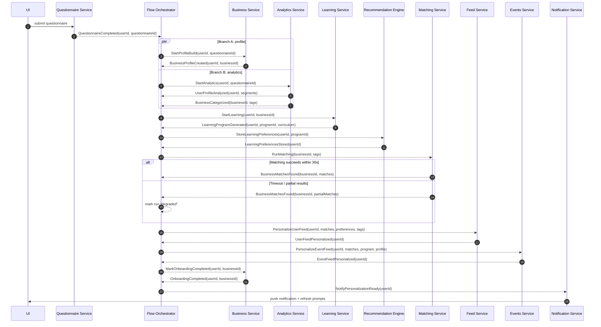

# Extending the Engine for Flow Creation: FLOW‑02 Business Onboarding & Personalization

## Executive summary

This report focuses on extending the existing engine to **author and execute event-driven, multi-service flows with parallel branches and convergence**, using **FLOW‑02 (Business Onboarding & Personalization)** as the concrete reference implementation. The FLOW‑02 specification describes an “intelligence layer” that starts from a `QuestionnaireCompleted` trigger, runs **three concurrent branches** (business profiling, analytics, learning-program generation), then performs **matching + feed/event personalization**, and ends with `OnboardingCompleted`. fileciteturn0file0

Primary findings:

- FLOW‑02 is effectively a **DAG-style orchestration** with **fan-out (parallel branches), event waits, joins, and partial-failure tolerance** (graceful degradation). fileciteturn0file0  
- The spec includes explicit requirements for: **event chain definitions**, **payload schemas**, **timeouts (e.g., 30s matching circuit breaker)**, **debounce (>5 minutes for repersonalization triggers)**, **cache TTLs**, and **observability via correlation IDs across all events**. fileciteturn0file0  
- The spec strongly implies the current platform already has a **Flow Orchestrator (Skill 09)**, an **API Gateway**, multiple domain services (matching/analytics/learning/feed/events/notifications), and a **skills index**; however, it also explicitly calls out a missing core component: a dedicated **Business Profile Service (“Skill 64”)**. fileciteturn0file0  
- To make flow creation sustainable across all future “02-*” flows, the engine should add (or upgrade) core capabilities:  
  - **Flow definition registry + versioning**  
  - **Runtime persistence of flow runs and step states** (so joins/timeouts/degradation are deterministic)  
  - **Standardized event envelopes** (recommend aligning with **CloudEvents**) to make triggers/consumers consistent across services citeturn0search2turn2search8  
  - **Reliable event publication** via the **Transactional Outbox pattern** (or CDC-based outbox) to avoid “dual-write” inconsistencies citeturn0search10turn3search0  
  - **Idempotent retry semantics** and explicit retry policies for transient failures citeturn3search1  
  - **Distributed tracing context propagation** (recommend aligning with **W3C Trace Context**) so a single flow run can be traced across services citeturn0search11turn0search1  

Project sources actually available to this report:

- **Available**: [02-business-onboarding.md](sandbox:/mnt/data/02-business-onboarding.md) fileciteturn0file0  
- **Not available in provided project sources/tools** (therefore treated as unspecified): “basic prompt”, other “02-*” docs, `02-onboarding-flow.json`, and any engine/skills reference documents besides what is embedded in FLOW‑02. Where needed, I make explicit assumptions and list open questions.

## Source baseline and extracted flow specification

### Document inventory and cross-references

FLOW‑02 includes explicit references to other project artifacts that are not accessible in the current workspace:

- **FLOW‑01** (registration + questionnaire), which publishes `QuestionnaireCompleted`. fileciteturn0file0  
- **FLOW‑03, FLOW‑04, FLOW‑07** as downstream dependencies (events suggestions, post distribution, friend requests). fileciteturn0file0  
- A flow file: **`02-onboarding-flow.json`** that “must be updated” to represent the parallel-branch orchestration. fileciteturn0file0  
- A **Draw.io diagram** (“onboarding”). fileciteturn0file0  

Because those artifacts weren’t provided, FLOW‑02 is treated as the canonical reference for requirements and design constraints in this report.

### Flow trigger, services, and high-level semantics

FLOW‑02 is triggered **immediately after** questionnaire completion, via `QuestionnaireCompleted (from FLOW‑01)`. fileciteturn0file0

It consists of these services (each explicitly named in the doc), with three concurrent processing branches and a convergence phase:

- Business Service (builds structured BusinessProfile)  
- Analytics Service (segments/categorizes business)  
- Learning Service (generates curriculum)  
- Matching Service (compatibility scoring, match suggestions)  
- Feed Service (content feed personalization)  
- Events Service (events feed personalization)  
- Recommendation Engine (stores learning preferences; coordinates personalization)  
- Notification Service  
- UI Service (+ Calendar service referenced as a consumer) fileciteturn0file0  

The intended orchestration semantics are explicitly described as **parallel branches** plus **sequential dependencies** (e.g., learning waits on profile creation; matching waits on profile + categorization). fileciteturn0file0

### Required triggers, inputs, outputs, and event payload models

FLOW‑02 provides an explicit event chain with publishers/consumers and key payload fields. The following table consolidates the event definitions into a canonical “engine-facing” view (trigger, wait conditions, and primary outputs), derived directly from the spec. fileciteturn0file0

| Event type | Publisher | Primary purpose in flow runtime | Must include correlation keys (minimum) | Flow gating role |
|---|---|---|---|---|
| `QuestionnaireCompleted` | Questionnaire Service | Starts FLOW‑02; fans out to parallel branches | `userId`, `questionnaireId` | **Trigger** |
| `BusinessProfileCreated` | Business Service | Unblocks learning, matching, feed/events personalization | `userId`, `businessId` | **Join dependency** |
| `UserProfileAnalyzed` | Analytics Service | Feeds segmentation/behavior outputs to recommendation engine | `userId` | Optional enrichment |
| `BusinessCategorized` | Analytics Service | Provides tags/categories used by matching and feed | `businessId` | **Join dependency** |
| `LearningProgramGenerated` | Learning Service | Provides curriculum + learning path to rec engine and personalization | `userId`, `programId` | **Join dependency** (for events personalization) |
| `LearningPreferencesStored` | Recommendation Engine | Feeds feed personalization | `userId` | Optional enrichment |
| `BusinessMatchesFound` | Matching Service | Provides ranked matches used downstream | `businessId` | **Join dependency** |
| `ConnectionSuggestionsReady` | Matching Service | Delivers social suggestions to UI/notifications | `userId` | Optional output |
| `UserFeedPersonalized` | Feed Service | Produces user content feed configuration and recommendations | `userId` | Output |
| `EventFeedPersonalized` | Events Service | Produces event recommendations | `userId` | Output |
| `OnboardingCompleted` | Business Service | Marks completion; triggers notifications and analytics actions | `userId`, `businessId` | **Terminal** |

Additional payload requirements embedded in the spec (non-exhaustive, but explicitly stated):

- `BusinessProfileCreated` contains structured business details: industry, sub-industry, size, location, revenue, etc. fileciteturn0file0  
- `BusinessMatchesFound` includes a matches array with `matchedBusinessId`, `matchScore`, `matchReasons`, `matchType`, and `totalMatches`. fileciteturn0file0  
- Feed/event personalization events include recommendation lists and configuration fields (topics, sources, refresh interval). fileciteturn0file0  

### State transitions, branching, joins, and timing constraints

FLOW‑02 implicitly defines a runtime state machine:

- Start: `QuestionnaireCompleted`  
- Fan-out:  
  - Branch A: Business profile creation  
  - Branch B: Analytics (segmentation + categorization)  
  - Branch C: Learning program creation (depends on A)  
- Convergence: matching + personalization + completion fileciteturn0file0  

Timing/performance constraints explicitly stated:

- “Initial matching may take **5–30 seconds** depending on platform size.” fileciteturn0file0  
- “Implement circuit breaker (**30s timeout**)” for matching timeouts. fileciteturn0file0  
- Feed and event personalization should complete “within **2 seconds after matches are ready**.” fileciteturn0file0  

Debounce constraint:

- Re-processing only if **>5 minutes** since last questionnaire completion (queue latest, discard intermediate). fileciteturn0file0  

### UI/UX expectations and example flows

FLOW‑02 includes explicit user journey requirements:

- Immediately after questionnaire completion, show a “Personalizing your experience…” loading state. fileciteturn0file0  
- Notify the user when personalization is ready (example: “We found 12 business matches for you!”). fileciteturn0file0  
- The feed should visibly contain matched-business content and relevant events; the learning tab shows a customized curriculum. fileciteturn0file0  

The doc also includes scenarios/edge-cases that the engine must support as first-class flow semantics:

- Multiple businesses per user → multiple BusinessProfiles; matching per business; results merged/deduped. fileciteturn0file0  
- Returning user re-takes questionnaire → “full re-personalization”; old matches rescored; feed transitions gradually (not jarring). fileciteturn0file0  
- Zero matches found → fallback experience + queue re-matching on new business registrations. fileciteturn0file0  
- Stale cache after profile update → publish cache invalidation event; rerun matching asynchronously. fileciteturn0file0  

### Non-functional, security, and compliance requirements

Security/compliance requirements are explicitly stated:

- Data classification: business details confidential; match results internal; learning preferences internal. fileciteturn0file0  
- Access control: match results only visible to matched users (bilateral consent); configurable profile privacy levels; learning data private to user. fileciteturn0file0  
- In-transit security: “All inter-service communication over **mTLS** within a Kubernetes cluster.” fileciteturn0file0  
- At-rest security: “field-level encryption for revenue” in MongoDB. fileciteturn0file0  
- Privacy: match reasons must not reveal others’ private business details; “similar businesses” uses k-anonymity (k ≥ 5). fileciteturn0file0  
- Compliance: data portability + erasure (“right to erasure cascades to match results, feed configurations, and learning programs”). fileciteturn0file0  
  - These rights are consistent with GDPR’s portability and erasure requirements as defined in European legal text. citeturn2search7  

Operational requirements:

- Kafka topics referenced: `business-events`, `matching-events`, `activity-events`. fileciteturn0file0  
- Monitoring: alerts on matching latency, feed personalization failure rate, learning generation failure rate; trace correlation across all events. fileciteturn0file0  

## Requirement-to-engine capability map and gap prioritization

### Current engine capabilities inferable from FLOW‑02

Although engine documents were not provided, FLOW‑02 includes enough embedded references to infer a baseline:

- There is a concept of a **Flow Orchestrator (Skill 09)** and orchestration skills (Skill 08 & 09). fileciteturn0file0  
- There is an **API Gateway (Skill 15)** and microservice interfaces (`IMicroservice`, `IQueryHandler`). fileciteturn0file0  
- A **Database Fabric (Skill 05)** exists and supports at least PostgreSQL and MongoDB in a unified pattern. fileciteturn0file0  
- The platform already envisions services for matching, analytics, learning, feed, events, notification (with skill numbers listed). fileciteturn0file0  

Given that baseline, the key question becomes: **what must be added or upgraded in the engine to support creating and running flows like FLOW‑02 repeatably?**

### Gap analysis and prioritization

The table below maps FLOW‑02 requirements to likely “engine primitives,” indicates whether they appear to exist already (based on the embedded “skills” references), and prioritizes gaps.

| FLOW‑02 requirement | Engine primitive needed | Evidence it exists today | Gap summary | Priority |
|---|---|---|---|---|
| Event-triggered flow start (`QuestionnaireCompleted`) | Trigger routing + subscription management | Orchestrator is referenced, and Kafka topics exist fileciteturn0file0 | Ensure triggers can start a versioned flow run and correlate events | Critical |
| Parallel branches + convergence | DAG execution model: fork/join, wait-for-event nodes | Spec says orchestrator must be updated for parallel branching fileciteturn0file0 | Add explicit fork/join in flow DSL + runtime persistence | Critical |
| Deterministic flow-run correlation across services | Correlation IDs + propagation policy | “Trace: correlation ID across all 11 events” fileciteturn0file0 | Standardize event envelope + trace context propagation | Critical |
| Partial failure & graceful degradation | Step policy: “required vs optional”; fallback transitions | Explicit failure modes and fallbacks defined fileciteturn0file0 | Add policy layer (continue-with-degraded) + UI status model | Critical |
| Matching circuit breaker (30s) + partial results | Timeouts + deadline propagation + partial completion | Explicit 30s circuit breaker fileciteturn0file0 | Engine support for timeouts and “partial results” completion semantics | Critical |
| Debounce high-frequency questionnaire updates (>5 min) | Trigger dedupe/debounce | Explicit debounce rule fileciteturn0file0 | Add per-user trigger throttling + cancellation/supersession semantics | Critical |
| Multi-business per user orchestration | Flow supports 1:N business contexts per user | Scenario explicitly defined fileciteturn0file0 | Add sub-run/child-run model or multi-entity iteration in flow DSL | Important |
| Cache TTL strategy + invalidation on profile updates | Cache policy integration + invalidation events | TTLs listed; invalidation event implied fileciteturn0file0 | Ensure cache invalidation is part of flow, not ad-hoc | Important |
| Persistent domain models (BusinessProfile, LearningProgram, etc.) | Schema evolution tooling + dual-store coordination | Datastores and fields are listed fileciteturn0file0 | Add schema updates + migration plan; resolve “persist vs TTL-only” ambiguity | Important |
| Security: privacy controls, bilateral match visibility | Authorization policy model + attribute-based access | Explicit security persona requirements fileciteturn0file0 | Ensure access-control hooks in APIs and data-layer | Important |
| GDPR portability + erasure cascades | Data export + delete orchestration | Explicit compliance requirement fileciteturn0file0 | Add deletion/export flows and verifiable completion | Important |
| A/B testing opportunities | Experimentation framework, config versioning | Listed as product opportunity fileciteturn0file0 | Add configuration override support per cohort | Optional (unless product mandates now) |
| Authoring flows from docs/diagrams | Flow registry + UI/DSL + validation | Implicit via “02-* docs” + JSON flow file reference fileciteturn0file0 | Build authoring pipeline (DSL, validation, publishing) | Critical for “flow creation” mandate |

### High-risk ambiguities the engine must resolve

FLOW‑02 contains a few internal inconsistencies that the engine design should formalize:

- **Match result persistence**: one section says “PostgreSQL: match results,” while the security section says match scores are stored in Redis with TTL and not persisted long term. fileciteturn0file0  
- **Feed event naming**: the orchestration guidance references `ProfileFeedPersonalized`, while the event table defines `UserFeedPersonalized`. fileciteturn0file0  
- **Event count mismatch**: DevOps notes correlation across “11 events,” while the explicit event table lists 10. fileciteturn0file0  

These should be treated as **spec clarifications** to bake into the final flow DSL and runtime.

## Proposed architecture and schema changes

This section proposes a concrete engine extension that can run FLOW‑02 cleanly *and* generalizes to other “02-*” flows.

### Architectural approach: orchestrated Saga + versioned flow definitions

Given FLOW‑02’s explicit fan-out/join and the need for deterministic completion and debouncing, the most robust fit is an **orchestrated Saga-style workflow**, where the engine maintains a flow-run state machine and advances it based on events. This is consistent with widely used Saga guidance for coordinating distributed transactions using events/messages and compensations/fallbacks. citeturn3search7

This does not prevent domain services from remaining event-driven (“smart endpoints, dumb pipes”), but it adds a thin control-plane so flow creation becomes declarative and repeatable (without hardcoding every orchestration into bespoke service logic). citeturn0search0turn3search7

### Engine components to add or upgrade

**Flow Definition Registry (new or expanded)**  
Stores versioned flow definitions, metadata, and validation artifacts.

- Inputs: a canonical DSL (JSON/YAML) that can represent: triggers, steps, fork/join, wait-for-event, timeouts, retry policies, required-vs-optional branches, and completion criteria.  
- Outputs: a compiled runtime graph (normalized nodes/edges) used by the orchestrator.

**Flow Runtime Store (new)**  
Persists flow-run state so concurrency, debouncing, and joins are deterministic.

**Event Router / Trigger Manager (upgrade)**  
- Subscribes to trigger topics, maps events to (flow_id, version), and starts or resumes flow runs.

**Step Execution Model (upgrade)**  
- Two supported step types are enough for FLOW‑02 and likely most “02-*” flows:  
  1) **Command step**: emit a command/event to a service (e.g., “create business profile”).  
  2) **Wait step**: wait until an event with specific type and correlation keys arrives (e.g., `BusinessProfileCreated` for a given `userId`).  

**Event Envelope Standardization (recommended)**  
Adopt a consistent event envelope aligned with **CloudEvents** to standardize required fields (`id`, `type`, `source`, `time`, `subject`, etc.) and remove per-service ad hoc event shapes. citeturn0search2turn2search8

**Trace/Correlation Propagation (required)**  
Standardize propagation of correlation keys using **W3C Trace Context** headers where HTTP is used, and propagate equivalent trace/correlation IDs through message headers in Kafka. citeturn0search11turn0search1

### Reliable event publication and idempotent consumption

FLOW‑02 is heavily event-driven; without reliability and idempotency, the engine will struggle with duplicates, retries, and partial failure.

**Outbound events: Transactional Outbox**  
Use an outbox so a service can update its own database and record an outgoing event atomically, then relay to Kafka asynchronously—avoiding the classic “dual write” problem. citeturn0search10turn3search0  
CDC-based implementations (e.g., Debezium outbox event router) are a mature way to implement the relay. citeturn3search0

**Inbound events: idempotent handlers + retry guidance**  
Retries should assume duplicates and require idempotent operations (or compensations). A common resilience guideline is: only retry automatically when the operation is safe/idempotent, otherwise guard with dedupe keys and/or compensating actions. citeturn3search1

### Data model updates: domain entities + engine runtime entities

Below is a proposed entity model that reconciles FLOW‑02’s explicit payloads, scenarios (multi-business per user), caching, and compliance requirements. It also adds the minimum engine runtime tables needed for flow creation.

Key principles:

- Domain data remains in domain services’ stores (as implied by MongoDB/PostgreSQL/Redis/Elasticsearch usage). fileciteturn0file0  
- The engine stores **flow run** state centrally (small, relational, queryable).  
- Sensitive fields (e.g., revenue) are encrypted at rest as required. fileciteturn0file0  

```mermaid
erDiagram
  USER ||--o{ BUSINESS_PROFILE : owns
  USER ||--o{ QUESTIONNAIRE_RESPONSE : submits
  BUSINESS_PROFILE ||--o{ BUSINESS_CATEGORY : classified_as
  USER ||--o{ LEARNING_PROGRAM : has
  USER ||--o{ LEARNING_PREFERENCE : has
  BUSINESS_PROFILE ||--o{ BUSINESS_MATCH : produces
  USER ||--o{ CONNECTION_SUGGESTION : sees
  USER ||--o{ FEED_CONFIGURATION : receives
  USER ||--o{ EVENT_RECOMMENDATION : receives

  FLOW_DEFINITION ||--o{ FLOW_VERSION : versions
  FLOW_VERSION ||--o{ FLOW_NODE : has
  FLOW_VERSION ||--o{ FLOW_EDGE : has
  FLOW_VERSION ||--o{ FLOW_RUN : executes
  FLOW_RUN ||--o{ FLOW_RUN_STEP : tracks

  USER {
    string user_id PK
    datetime created_at
    string status
  }

  QUESTIONNAIRE_RESPONSE {
    string response_id PK
    string user_id FK
    string questionnaire_id
    json responses
    datetime completed_at
  }

  BUSINESS_PROFILE {
    string business_id PK
    string user_id FK
    string name
    string industry
    string sub_industry
    string stage
    int team_size
    string location
    string revenue_encrypted
    json goals_and_challenges
    datetime created_at
    datetime updated_at
  }

  BUSINESS_CATEGORY {
    string category_id PK
    string business_id FK
    string maturity_level
    json tags
    json categories
    datetime categorized_at
    string source  %% "user" vs "ml"
  }

  LEARNING_PROGRAM {
    string program_id PK
    string user_id FK
    json curriculum  %% modules, duration, difficulty, skills
    json learning_path
    datetime generated_at
    string status
  }

  LEARNING_PREFERENCE {
    string pref_id PK
    string user_id FK
    json topics
    json formats
    string pace
    string time_commitment
    datetime stored_at
  }

  BUSINESS_MATCH {
    string match_batch_id PK
    string business_id FK
    json matches  %% matchedBusinessId, score, reasons, type
    int total_matches
    datetime computed_at
    datetime expires_at
    string persistence_mode  %% "cache_only"|"persisted_summary"
  }

  CONNECTION_SUGGESTION {
    string suggestion_id PK
    string user_id FK
    json suggestions
    datetime created_at
  }

  FEED_CONFIGURATION {
    string feed_config_id PK
    string user_id FK
    json config  %% contentTypes, topics, sources, refreshInterval
    json recommendations
    datetime personalized_at
    datetime expires_at
  }

  EVENT_RECOMMENDATION {
    string rec_id PK
    string user_id FK
    json events  %% eventId, relevanceScore, type, scheduledDate
    datetime personalized_at
    datetime expires_at
  }

  FLOW_DEFINITION {
    string flow_id PK
    string name
    string owner_team
    string status  %% draft/published/deprecated
  }

  FLOW_VERSION {
    string flow_version_id PK
    string flow_id FK
    int version_number
    json spec
    datetime published_at
  }

  FLOW_NODE {
    string node_id PK
    string flow_version_id FK
    string node_type %% command|wait|fork|join|terminal
    json config
  }

  FLOW_EDGE {
    string edge_id PK
    string flow_version_id FK
    string from_node_id
    string to_node_id
    string condition
  }

  FLOW_RUN {
    string run_id PK
    string flow_version_id FK
    string subject_user_id
    string status %% running|waiting|completed|degraded|failed|cancelled
    string correlation_id
    datetime started_at
    datetime completed_at
  }

  FLOW_RUN_STEP {
    string run_step_id PK
    string run_id FK
    string node_id FK
    string status %% pending|in_progress|succeeded|failed|skipped
    int attempt_count
    json last_error
    datetime updated_at
  }
```

Notes on reconciliation of the “match persistence” ambiguity:

- Store **match details** in Redis with TTL (12h) to satisfy performance and “not persisted long-term” intent. fileciteturn0file0  
- Optionally persist a **small summary** in PostgreSQL (e.g., who was matched + type, without sensitive reasons) for analytics and auditing, depending on policy. This should be explicitly decided because the spec currently conflicts. fileciteturn0file0  

### API endpoints: flow creation + flow runtime + onboarding status

To support “flow creation” as a product capability (not just FLOW‑02 hardcoding), the engine needs authoring and runtime APIs. The following is a pragmatic minimum.

**Flow authoring APIs (engine)**  
- `POST /flows` → create flow definition (draft)  
- `POST /flows/{flowId}/versions` → create a new draft version  
- `POST /flows/{flowId}/versions/{version}/validate` → validate DAG, required joins, unreachable nodes, schema checks  
- `POST /flows/{flowId}/versions/{version}/publish` → publish version  
- `GET /flows/{flowId}/versions/{version}` → retrieve flow spec + metadata  
- `GET /flows?status=published` → list published flows  

**Flow runtime APIs (engine)**  
- `GET /flow-runs?userId=...&flowId=FLOW-02` → list runs for observability/support  
- `GET /flow-runs/{runId}` → run status + step statuses + last error (support UI and SRE tooling)  
- `POST /flow-runs/{runId}/cancel` → cancel if superseded (supports debounce & “latest wins”)  
- `POST /flow-runs/{runId}/retry-step/{nodeId}` → controlled manual retry for non-idempotent failures  

**Product-facing onboarding/personalization APIs (domain façade)**  
Because UI needs a coherent user experience (loading → ready), add a stable façade:

- `GET /users/{userId}/personalization/status` → `{state: pending|ready|degraded, startedAt, updatedAt, missingComponents[]}`  
- `GET /users/{userId}/feed` and `GET /users/{userId}/events` should return either personalized or fallback content, based on readiness. fileciteturn0file0  

### Concurrency, ordering, and debouncing strategy

FLOW‑02’s debounce requirement suggests the engine must support “supersession”:

- Rule: accept a new `QuestionnaireCompleted`, but if within 5 minutes of the last completion, **queue and supersede** intermediate triggers. fileciteturn0file0  
- Implementation approach:  
  - Use a per-user key in the runtime store: `(userId, flowId)` points to the “active run”.  
  - On new trigger:  
    - If no active run → start.  
    - If active run exists and `now - lastTriggerAt < 5m` → mark current run as `superseded` and start (or schedule) a new run; or keep one run and update its input pointer to latest questionnaire response.  
- Ordering: where possible, partition Kafka topics by `userId` (or `businessId`) so events relevant to a single run arrive in order.

### Error handling and degradation semantics

FLOW‑02 explicitly defines degraded behavior: analytics failure should fall back to defaults; matching failure should show “Still finding matches”; feed failure shows generic trending content. fileciteturn0file0

Engine-level primitives to implement that cleanly:

- **Step criticality**: each step is tagged `required` or `optional`.  
- **Timeout policy**: especially for matching, enforce a 30s deadline and allow partial results. fileciteturn0file0  
- **Retry policy**: use bounded retries with exponential backoff for transient errors; only auto-retry idempotent operations. citeturn3search1  
- **Fallback transitions**: optional branch failure advances to `degraded` completion rather than `failed`.  

### Security and privacy controls

FLOW‑02’s security persona is unusually specific; the engine and services must enforce it:

- **Transport security**: service-to-service mTLS is required by spec. fileciteturn0file0  
- **Sensitive field protection**: encrypt confidential business fields at rest (revenue) and avoid leaking private info in match reasons. fileciteturn0file0  
- **API authorization**: enforce object-level and property-level authorization to prevent exposing another user’s business characteristics via match reasoning or event feeds; align reviews with OWASP API Security risk categories (authorization failures are repeatedly highlighted as core API risks). citeturn3search2turn3search12  
- **Privacy constraints**:  
  - opt-out of matching must short-circuit matching/match notifications while still allowing learning/feed personalization as applicable. fileciteturn0file0  
  - “Similar businesses” feature must implement k-anonymity (k≥5). fileciteturn0file0  
- **Compliance workflows**: implement export + erasure cascades spanning BusinessProfile, learning programs/preferences, feed configs, and match artifacts. fileciteturn0file0  
  - These are consistent with the GDPR’s legal requirements around portability and erasure in Regulation (EU) 2016/679. citeturn2search7  

### Key flow diagrams

**Happy-path sequence (FLOW‑02)** (from the spec’s event chain, expressed as orchestrated saga semantics): fileciteturn0file0



**Flowchart: fork/join with degradation paths** fileciteturn0file0

```mermaid
flowchart TD
  A[QuestionnaireCompleted] --> B{Debounce\n>5 min since last?}
  B -- No --> B1[Supersede/queue latest\nDiscard intermediate]
  B -- Yes --> C[FORK]

  C --> D1[Business profile build]
  C --> D2[Analytics: segment + categorize]
  D1 --> E1[BusinessProfileCreated]
  D2 --> E2[BusinessCategorized]
  E1 --> F1[Learning program generation]
  F1 --> G1[LearningProgramGenerated]
  G1 --> H1[LearningPreferencesStored]

  E1 --> J0{JOIN:\nneed profile + categorization}
  E2 --> J0
  J0 --> K[Run matching\n(30s timeout)]

  K -->|Success| L[BusinessMatchesFound]
  K -->|Timeout| L2[BusinessMatchesFound\n(partial)] --> M2[Mark run degraded]

  L --> M[Personalize feed + events]
  L2 --> M

  M --> N[UserFeedPersonalized + EventFeedPersonalized]
  N --> O[OnboardingCompleted]
```

## Implementation plan, migration, and testing strategy

### Milestones and effort estimates

Effort is relative (low/medium/high) and assumes an existing event bus + orchestrator baseline as implied by FLOW‑02. fileciteturn0file0

| Milestone | Deliverables | Effort |
|---|---|---|
| Flow DSL + Registry | Canonical flow spec (fork/join/wait/timeout), validation, versioning, publish lifecycle | High |
| Runtime persistence | `flow_runs`, `flow_run_steps`, correlation + debouncing semantics | High |
| Event envelope standardization | Define required headers/fields; align to CloudEvents; update producer/consumer libs | Medium | 
| Correlation and tracing | W3C Trace Context propagation for HTTP + equivalent message headers; end-to-end traceability | Medium citeturn0search11turn0search1 |
| Reliability layer | Transactional outbox (or CDC-outbox) for key services; idempotent consumers + retry policies | High citeturn0search10turn3search0turn3search1 |
| Business Profile Service (“Skill 64”) | New service API + dual-store schema (Mongo + Postgres) | High fileciteturn0file0 |
| FLOW‑02 implementation | Implement nodes/steps per spec; reconcile ambiguities; integrate with feed/events/matching | Medium–High |
| UI readiness contract | `/personalization/status`, loading state, degraded state messaging | Medium |
| Compliance workflows | Export endpoints + erasure cascade flow | Medium–High citeturn2search7 |

### Migration strategy

Because personalization affects onboarding (high visibility), migration should minimize blast radius:

- **Versioned flow rollout**: publish FLOW‑02 as `v1` in the registry; keep old onboarding behavior as `v0` until confidence is high. fileciteturn0file0  
- **Shadow runs**: for a subset of traffic, run FLOW‑02 in “observe-only mode” (compute personalization but do not serve it), comparing outputs to current heuristic personalization (if any).  
- **Dual writes where necessary**: if services need to persist new entities (e.g., BusinessProfile summary in Postgres), use migrations and backfill jobs.  
- **Backfill existing users**: queue a repersonalization run (with throttling) for existing users who completed FLOW‑01 earlier.  
- **Cache strategy alignment**: ensure new caches respect stated TTLs (12h matches, 1h feed config, 4h event recs, 24h preferences). fileciteturn0file0  
  - Redis eviction behavior is policy-dependent; validate eviction configuration so TTL-based caches behave as intended under memory pressure. citeturn1search2turn1search12  

### Testing plan

**Unit tests** (engine + services)
- Flow DSL validation: unreachable nodes, missing joins, invalid correlation keys, invalid timeouts.  
- Deterministic debounce: multiple triggers within 5 minutes produce exactly one effective run. fileciteturn0file0  
- Step policies: required vs optional transitions; degraded completion.  

**Integration tests** (event bus + runtime store)
- Fork/join correctness under out-of-order events (by reordering messages in test harness).  
- Retry semantics: confirm retries are safe only for idempotent operations, consistent with retry best practices. citeturn3search1  
- Outbox relay correctness: DB commit → outbox row → Kafka publish, including crash recovery. citeturn0search10turn3search0  

**End-to-end tests** (product)
- “Happy path” onboarding: questionnaire → loading → notification → personalized feed/events/learning. fileciteturn0file0  
- Edge cases:  
  - zero matches → fallback UI copy and requeue for rematching. fileciteturn0file0  
  - matching timeout → partial results; UI shows “more coming soon”. fileciteturn0file0  
  - profile update → cache invalidation event triggers repersonalization. fileciteturn0file0  

**Performance tests**
- Matching latency distribution; verify the 30s circuit breaker actually prevents tail-latency runaway. fileciteturn0file0  
- Personalization SLA: feed + events personalization within 2s after matches are ready. fileciteturn0file0  

**Security and compliance tests**
- Authorization tests informed by OWASP API Security risks (object/property authorization). citeturn3search2turn3search12  
- Data export/erasure flows: confirm cascades delete or tombstone the correct derived artifacts, consistent with stated compliance requirements. fileciteturn0file0turn2search7  

## Alternative design options and trade-offs

The engine can implement FLOW‑02 “as-is” in multiple ways. The table below compares plausible alternatives, focusing on maintainability for future “02-*” flows.

| Design choice | Option A | Option B | Trade-offs | Recommendation |
|---|---|---|---|---|
| Cross-service workflow control | Orchestrated Saga (engine advances flow runs) citeturn3search7 | Pure choreography (services react to each other directly) citeturn0search0 | Orchestration improves debuggability/joins/debounce; choreography reduces central coupling but makes convergence and “latest wins” harder | **Option A** for FLOW‑02 + flow-creation product goals |
| Flow definition format | Custom DSL (JSON/YAML DAG) | BPMN-style modeling toolchain | Custom DSL ships faster and matches “02-* doc” patterns; BPMN tooling is heavier but richer | **Custom DSL** first; don’t block on BPMN |
| Event envelope | Align to CloudEvents citeturn0search2turn2search8 | Custom internal envelope | CloudEvents improves interoperability and consistency; custom is quicker but risks divergence across services | **CloudEvents-aligned** envelope for all flow events |
| Event publication reliability | Transactional outbox / CDC-outbox citeturn0search10turn3search0 | Direct publish from service logic | Outbox prevents dual-write inconsistency; direct publish is simpler but risks phantom/absent events in failures | **Outbox** for key state transitions (`*Created`, `*Personalized`, `Completed`) |
| Matching result storage | Cache-only TTL (Redis) | Persisted results (Postgres) | Cache-only better for privacy and freshness; persistence better for analytics/audit and repeat UI without recompute | Reconcile spec: **cache full detail**, optionally **persist summary** with policy |
| Observability | W3C Trace Context + distributed tracing citeturn0search11turn0search1 | Custom correlation fields only | Trace Context enables tooling interoperability; custom fields still help but are less standard | **Use Trace Context** plus explicit `correlation_id` in events |

### Unspecified items and explicit assumptions

Because only FLOW‑02 was available, the following items remain unspecified and should be validated against the missing “basic prompt” and other “02-*” docs:

- Canonical **engine flow DSL** format and whether `02-onboarding-flow.json` already supports fork/join semantics. fileciteturn0file0  
- The platform’s authoritative **identity and authorization model** (scopes/roles/ABAC rules), needed to implement “bilateral consent model” consistently. fileciteturn0file0  
- The correct decision on **match result persistence** (conflicting statements in FLOW‑02). fileciteturn0file0  
- Whether the engine’s “skills” runtime requires a strict interface contract beyond `IMicroservice` and `IQueryHandler` (referenced but not defined). fileciteturn0file0  

Assumptions made (to proceed with a rigorous design):

- The platform uses an event-streaming backbone consistent with Kafka topics mentioned in FLOW‑02. fileciteturn0file0  
- The engine is allowed to store centralized runtime state (flow runs) even if domain state remains decentralized. citeturn3search7  
- Operationally, adopting standardized envelopes and tracing is acceptable; these align with common industry specs (CloudEvents, W3C Trace Context). citeturn0search2turn0search11